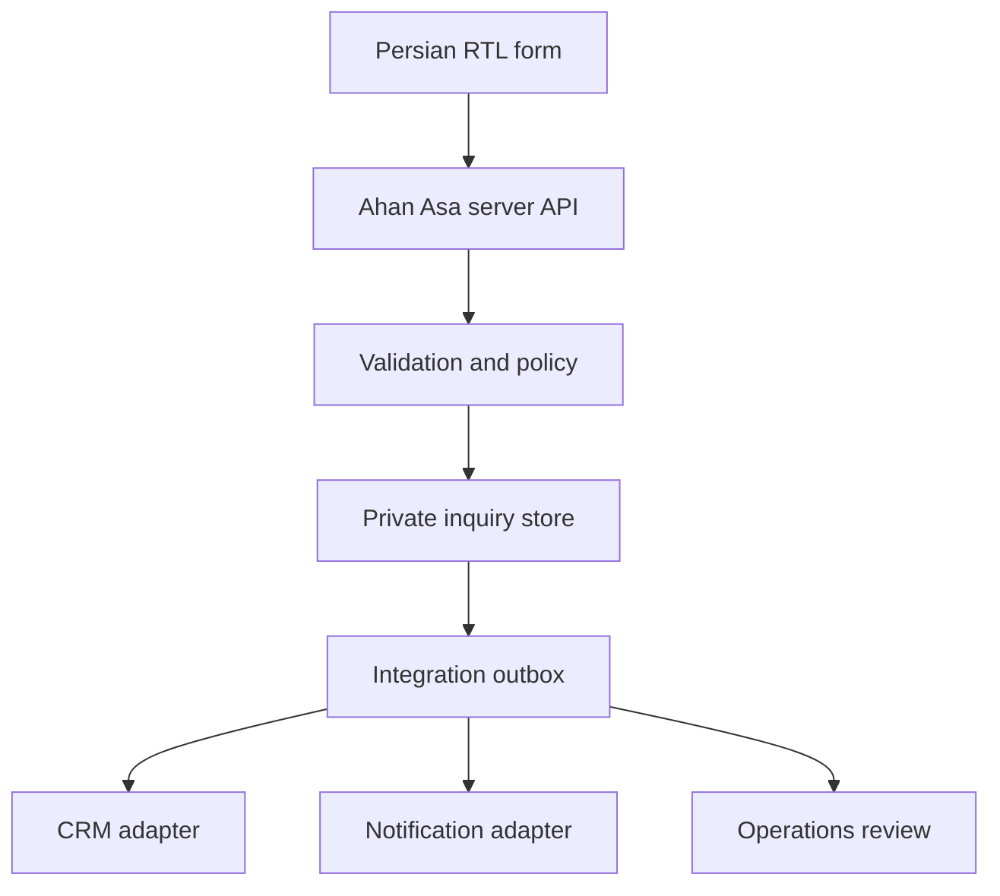

# Ahan Asa Website — API & Integrations Specification

> **Brand:** Ahan Asa | آهن آسا  
> **Domain:** `ahanassa.com`  
> **Document:** `API_INTEGRATIONS.md`  
> **Status:** Draft v1.0 — implementation contract; provider selection remains gated  
> **Last updated:** 2026-08-25  
> **Primary website language:** Persian (Farsi), fully RTL

---

## 1. Purpose

This document defines how the Ahan Asa website communicates with server-side services and external systems. It establishes API boundaries, request and response contracts, security rules, failure behavior, adapter interfaces, observability requirements, and approval gates for integrations.

The Phase 1 website is a premium B2B steel-procurement website—not an e-commerce store, marketplace, live-price service, ERP, or customer portal. Its primary digital transaction is a qualified procurement inquiry, especially the **“ارسال فاکتور یا لیست خرید”** flow.

This specification must let Claude Code build a production-ready integration layer without:

- inventing a backend;
- embedding secrets in the browser or repository;
- binding the application prematurely to an unapproved vendor;
- exposing inquiry data or uploaded documents in static output;
- displaying fake submission, tracking, upload, or success states;
- implying contractual acceptance, confirmed price, inventory, or delivery.

---

## 2. Source-of-Truth Hierarchy

When implementation documents conflict, apply this priority:

1. approved legal, privacy, security, and operational decisions;
2. `PROJECT_BRIEF.md` and approved business scope;
3. `DATA_ARCHITECTURE.md` and `FORM_ARCHITECTURE.md` for data and form contracts;
4. this document for API and integration behavior;
5. `TECHNICAL_ARCHITECTURE.md`, `STACK.md`, and `ENVIRONMENT_VARIABLES.md` for implementation details;
6. `ANALYTICS_TRACKING.md` for measurement behavior;
7. component and page specifications for presentation behavior.

Claude Code must not silently resolve a material conflict. It must record the conflict in `DECISIONS.md` or stop the affected implementation until an owner approves the decision.

---

## 3. Locked Project Context

The following requirements are binding for Phase 1:

- The public website is Persian-first and supports `fa`/`en`/`ar` at launch (`fa` and `ar` RTL, `en` LTR).
- The primary market is Iran; regional expansion must remain possible.
- The preferred application direction is Next.js App Router, static-first where practical.
- The approved delivery direction is Cloudflare Workers + Static Assets via vinext for `ahanassa.com`.
- Indexable content must be available in server-rendered or statically generated HTML.
- Confidential operations must run server-side.
- Inquiry data and client documents must never appear in static bundles, page source, public caches, analytics payloads, or client logs.
- The canonical conversion is submission of a procurement request, invoice, or material list.
- A submitted inquiry is not a purchase order, contract, price confirmation, stock reservation, or delivery guarantee.
- Production forms require authoritative server-side validation.
- A UI success state may appear only after a real server acknowledgement.
- When an integration is unavailable, the interface must present an honest, approved fallback—not a fabricated success response.

---

## 4. Phase 1 Integration Scope

### 4.1 Integration status matrix

| Integration | Phase 1 status | Purpose | Activation gate |
| --- | --- | --- | --- |
| Inquiry API | Required | Receive qualified procurement requests | Backend, storage, privacy, and operational owner approved |
| Document upload | Conditional required | Receive invoice or material-list files | Private storage, malware controls, retention, and legal copy approved |
| Lead notification | Required | Notify the responsible Ahan Asa team | Recipient, provider, template, and fallback approved |
| CRM handoff | Adapter required; provider TBD | Create/update an internal lead | CRM choice, field mapping, credentials, and ownership approved |
| Transactional email | Adapter recommended; provider TBD | Send internal notification and optional receipt | Sender domain, templates, consent basis, and provider approved |
| WhatsApp | Link-only unless approved | Start a direct conversation | Official number, copy, attribution, and operational coverage approved |
| Request tracking | Deferred/limited | Help a client reference an existing inquiry | Status source, identity check, authorization, and support process approved |
| Analytics | Required readiness | Measure source and completed conversion | Consent and event specification approved |
| Anti-abuse | Required | Reduce spam and automated submissions | Provider or server-side strategy approved |
| CMS webhook | Conditional | Revalidate approved content | CMS and signing method approved |
| Map/location | Not required | Show a verified office location | Address and map provider approved |
| Live market data | Prohibited | Live steel price or stock feed | Separate future product approval required |
| Payment/checkout | Prohibited | Online payment or order placement | Separate future product and legal approval required |
| OCR/AI document parsing | Prohibited in Phase 1 | Extract invoice or material-list data | Separate privacy, accuracy, security, and operations approval required |

### 4.2 Definition of “adapter required”

The application must isolate an external provider behind an internal interface even if the production provider has not been selected. UI components and domain logic may depend on the internal interface; they must not import a vendor SDK directly.

### 4.3 Definition of “provider TBD”

“Provider TBD” does not authorize Claude Code to choose or install a service. Until approved:

- implement types, validation, interfaces, and disabled/unavailable states;
- use a local test adapter only inside automated tests;
- do not ship a mock endpoint that returns production-looking success;
- do not add vendor SDKs, credentials, domains, or privacy claims;
- do not expose an active control that cannot complete its real workflow.

---

## 5. Architectural Boundary

### 5.1 Required flow



The browser communicates only with Ahan Asa-controlled application endpoints. External systems are called from trusted server-side code unless a documented integration specifically requires a client-side SDK.

### 5.2 Layer responsibilities

| Layer | Responsibilities | Must not do |
| --- | --- | --- |
| Presentation | Render Persian RTL UI, collect input, show progress and recoverable errors | Hold secrets, decide final validity, call CRM directly |
| API/BFF | Authenticate where required, validate, normalize, rate-limit, create correlation IDs | Return stack traces, leak provider payloads, trust browser validation |
| Domain service | Apply inquiry rules, deduplicate, manage status transitions | Depend on UI labels or vendor-specific fields |
| Persistence | Store inquiry records, audit metadata, upload references, outbox jobs | Make confidential objects public |
| Integration adapters | Translate internal models to approved providers | Become the source of truth for website behavior |
| Worker/outbox | Retry asynchronous handoffs, record outcomes, alert operations | Block user acknowledgement on a noncritical downstream notification |

### 5.3 Recommended internal modules

```text
lib/
  api/
    contracts/
    errors/
    responses/
  domain/
    inquiries/
    uploads/
    tracking/
  integrations/
    crm/
    email/
    messaging/
    analytics/
    anti-abuse/
    cms/
  security/
  observability/
app/
  api/
    inquiries/
    uploads/
    tracking/
    webhooks/
```

The final directory names are subordinate to `FOLDER_STRUCTURE.md`. The separation of contracts, domain rules, and vendor adapters is mandatory even if the physical layout changes.

---

## 6. API Conventions

### 6.1 Base path and versioning

- Public application endpoints use `/api/v1/...`.
- The version applies to the contract, not the deployment.
- Breaking request or response changes require a new major API version.
- Additive optional fields do not require a new version when old clients remain valid.
- Internal webhook endpoints use `/api/webhooks/...` and are not treated as public browser APIs.

### 6.2 Transport

- Production traffic requires HTTPS.
- JSON endpoints use `Content-Type: application/json; charset=utf-8`.
- Upload bytes must not pass through the application server when an approved private direct-upload flow is available.
- Never place personal data, filenames, phone numbers, emails, messages, or document references in URLs or query strings.

### 6.3 Naming and formats

- API field names use `snake_case`.
- Timestamps use ISO 8601 UTC, for example `2026-08-25T09:30:00Z`.
- Internal IDs are opaque, non-sequential identifiers.
- Locale values use BCP 47-style codes; Phase 1 public submissions use `fa-IR`.
- Phone input is normalized server-side and the original user-entered value may be retained only when operationally necessary.
- Monetary amounts require an explicit currency; no implicit rial/toman conversion is allowed.
- Units must be explicit and must not be inferred from a bare number.

### 6.4 Standard success envelope

```json
{
  "ok": true,
  "data": {},
  "meta": {
    "request_id": "req_opaque",
    "api_version": "v1"
  }
}
```

### 6.5 Standard error envelope

```json
{
  "ok": false,
  "error": {
    "code": "VALIDATION_ERROR",
    "message": "اطلاعات واردشده نیاز به اصلاح دارد.",
    "field_errors": {
      "phone": ["شماره تماس را بررسی کنید."]
    },
    "retryable": false
  },
  "meta": {
    "request_id": "req_opaque",
    "api_version": "v1"
  }
}
```

Public error messages are Persian, calm, and actionable. Provider messages, database errors, file paths, stack traces, security rules, and internal identifiers must not be exposed.

### 6.6 Correlation ID

Every API call receives or creates a request/correlation ID. It must:

- be returned in `meta.request_id`;
- appear in structured server logs;
- be safe to share with support;
- contain no personal data;
- remain distinct from the public inquiry reference.

### 6.7 Idempotency

`POST /api/v1/inquiries` and upload finalization require an idempotency key.

- The browser creates one key per intentional submission attempt.
- Retries reuse the same key.
- The server stores the key with a normalized request fingerprint for a limited approved period.
- Reuse with the same payload returns the original result.
- Reuse with a conflicting payload returns `409 IDEMPOTENCY_CONFLICT`.
- A double-click or network retry must not create duplicate inquiries or duplicate CRM records.

---

## 7. Canonical Inquiry API

### 7.1 Endpoint

```http
POST /api/v1/inquiries
```

This is the only canonical Phase 1 lead-creation endpoint. Homepage panels, `/request`, contact forms, service pages, product pages, and campaign entry points must map to this contract rather than create separate incompatible APIs.

### 7.2 Request model

```ts
type CreateInquiryRequest = {
  schema_version: "1";
  locale: "fa-IR";
  inquiry_type: "procurement_request" | "invoice_review" | "material_list_review" | "consultation";

  contact: {
    full_name: string;
    company_name?: string;
    role?: string;
    phone: string;
    email?: string;
    preferred_contact_method?: "phone" | "email" | "whatsapp";
  };

  project?: {
    name?: string;
    city?: string;
    province?: string;
    delivery_location?: string;
    required_date?: string;
  };

  requirement: {
    categories?: string[];
    description?: string;
    estimated_quantity?: {
      value: number;
      unit: "kg" | "ton" | "piece" | "meter" | "square_meter" | "other";
    };
  };

  uploads?: Array<{
    upload_id: string;
  }>;

  consent: {
    privacy_notice_version: string;
    accepted: true;
  };

  attribution?: {
    landing_path?: string;
    referrer_domain?: string;
    utm_source?: string;
    utm_medium?: string;
    utm_campaign?: string;
    utm_content?: string;
    utm_term?: string;
  };

  anti_abuse_token?: string;
};
```

Final required fields and category values belong to `FORM_ARCHITECTURE.md` and `DATA_ARCHITECTURE.md`. Claude Code must not expand the form merely because a field exists in the API model.

### 7.3 Server processing order

1. Enforce method, origin, content type, and body-size limits.
2. Create a correlation ID.
3. Apply edge and application rate limits.
4. Verify anti-abuse evidence when enabled.
5. Parse against a strict schema; reject unknown sensitive fields.
6. Normalize Persian/Arabic characters only where semantically safe.
7. Validate required fields and cross-field rules.
8. Verify each `upload_id` belongs to the current anonymous submission session, is finalized, and is eligible for attachment.
9. Apply idempotency and duplicate protection.
10. Store the canonical inquiry and consent evidence transactionally.
11. Store an outbox event for downstream integrations.
12. Return a real acknowledgement and public reference.
13. Process CRM and notification handoffs asynchronously when possible.

### 7.4 Success response

```json
{
  "ok": true,
  "data": {
    "inquiry_reference": "AA-8F4K2M",
    "status": "received",
    "next_step": "درخواست شما برای بررسی اولیه ثبت شد."
  },
  "meta": {
    "request_id": "req_opaque",
    "api_version": "v1"
  }
}
```

The public reference must be non-sequential and difficult to enumerate. The wording must not promise a response time unless an approved operating SLA exists.

### 7.5 Status codes

| HTTP | Public code | Meaning |
| --- | --- | --- |
| `201` | — | New inquiry created |
| `200` | — | Idempotent replay returned the original result |
| `400` | `BAD_REQUEST` | Malformed request |
| `403` | `ORIGIN_REJECTED` | Request origin or policy rejected |
| `409` | `IDEMPOTENCY_CONFLICT` | Key reused with a different payload |
| `413` | `PAYLOAD_TOO_LARGE` | JSON body or attachment policy exceeded |
| `422` | `VALIDATION_ERROR` | Field or business-rule validation failed |
| `429` | `RATE_LIMITED` | Submission frequency exceeded |
| `503` | `SUBMISSION_UNAVAILABLE` | The canonical store could not safely accept the inquiry |

### 7.6 Acknowledgement boundary

The form may show success after the canonical inquiry is durably stored, even if a downstream CRM or notification job is pending. It must not show success when:

- only client-side validation passed;
- an upload completed but inquiry creation failed;
- an email was attempted without storing the inquiry;
- a fake/local adapter accepted the request;
- the server cannot determine whether the inquiry was persisted.

An internal CRM failure after durable storage is an operations incident, not a reason to tell the user the inquiry was lost.

---

## 8. Document Upload API

### 8.1 Activation gate

Production upload must remain disabled until all of the following exist:

- approved private object storage;
- authenticated server-side signing;
- file type, size, and count policy;
- upload-session ownership rules;
- malware scanning or equivalent operational control;
- quarantine and rejection behavior;
- retention and deletion policy;
- privacy notice and consent wording;
- access-control and audit rules;
- an approved non-upload fallback.

### 8.2 Recommended three-step flow

#### Step 1 — Create upload intent

```http
POST /api/v1/uploads/intents
```

```json
{
  "file_name": "list.pdf",
  "file_size": 245760,
  "mime_type": "application/pdf",
  "purpose": "material_list"
}
```

The server validates policy and returns a short-lived, single-purpose upload instruction. The response must never include permanent storage credentials.

#### Step 2 — Upload privately

The browser uploads bytes using the approved short-lived instruction. The object is created in a private temporary or quarantine location. The object key must be generated by the server and must not reuse the original filename.

#### Step 3 — Finalize

```http
POST /api/v1/uploads/{upload_id}/finalize
```

Finalization verifies size, type, ownership, storage state, and scanning state. Only a finalized eligible `upload_id` may be attached to an inquiry.

### 8.3 Upload states

Internal states:

```text
intent_created
uploading
uploaded
verifying
quarantined
accepted
rejected
expired
attached
deleted
```

Public UI states remain aligned with `UI_COMPONENTS.md`: idle, selected, validating, uploading, uploaded, rejected, error, removable, and retry.

### 8.4 Baseline technical rules

- Do not trust filename extensions or browser-provided MIME type.
- Validate magic bytes/content signatures where feasible.
- Store original filename only as protected metadata after sanitization.
- Use safe directional isolation when displaying filenames.
- Reject executable, script, archive, and macro-enabled formats unless explicitly approved.
- Prevent public ACLs and predictable object keys.
- Use short expiration for upload instructions.
- Bind an upload to one submission session and purpose.
- Limit file count, per-file size, total size, and upload frequency.
- Do not render user files inline from the application origin.
- Use forced download or a separate controlled document-viewing origin if staff access is implemented.
- Do not claim encryption, scanning, confidentiality, or deletion timing until verified in production.

### 8.5 Orphan cleanup

Uploads not attached to a successfully created inquiry must expire and be deleted through a scheduled cleanup process. The retention period must be defined in the approved data-retention policy, not hard-coded in UI copy.

### 8.6 Upload failure behavior

- A failed file must not erase completed form fields.
- Retry must reuse the current file only when browser capabilities and policy allow it.
- If one of several files fails, the UI must identify the affected file.
- Inquiry submission must not silently omit a selected but failed document.
- If uploads are unavailable, display the approved fallback method and mark the upload control unavailable.

---

## 9. CRM Integration

### 9.1 Status

The application requires a CRM adapter boundary, but no CRM—including Odoo—is approved by this document. Selecting a vendor is a separate decision.

### 9.2 Internal adapter contract

```ts
type CrmLeadInput = {
  inquiry_id: string;
  inquiry_reference: string;
  submitted_at: string;
  locale: string;
  contact: {
    full_name: string;
    company_name?: string;
    role?: string;
    normalized_phone: string;
    email?: string;
    preferred_contact_method?: string;
  };
  requirement_summary: string;
  project_summary?: string;
  category_codes: string[];
  document_count: number;
  attribution?: Record<string, string>;
  privacy_notice_version: string;
};

interface CrmAdapter {
  upsertLead(input: CrmLeadInput): Promise<{
    provider_record_id: string;
    outcome: "created" | "updated";
  }>;
}
```

### 9.3 CRM rules

- The internal inquiry store is the initial system of record for website receipt.
- CRM transfer occurs through an asynchronous outbox where feasible.
- CRM record creation must be idempotent by `inquiry_id`.
- Provider IDs stay server-side.
- Provider-specific fields are mapped in the adapter, not in form components.
- Uploaded files are not copied to a CRM by default; use approved protected links or a separate controlled transfer process.
- CRM failure must be retried with bounded exponential backoff and dead-letter handling.
- After retry exhaustion, alert the operational owner.
- Manual replay requires authorization and must not create duplicate records.
- Secrets use environment or managed secret storage and never use `NEXT_PUBLIC_`.

### 9.4 Required mapping approval

Before activation, document:

- destination pipeline/team;
- lead owner assignment;
- source and campaign fields;
- category mapping;
- status mapping;
- duplicate matching policy;
- attachment behavior;
- consent and lawful processing basis;
- retry owner and manual recovery procedure;
- sandbox and production endpoints;
- field length and formatting constraints.

---

## 10. Email and Operational Notifications

### 10.1 Notification types

Potential Phase 1 messages:

1. internal new-inquiry notification;
2. internal integration-failure alert;
3. optional user receipt confirming only that the inquiry was received;
4. optional user request for missing information initiated by staff through an approved operational system.

Marketing email is outside this transactional integration and requires separate consent and governance.

### 10.2 Email adapter

```ts
interface TransactionalEmailAdapter {
  sendInternalInquiryNotice(input: InternalInquiryNotice): Promise<DeliveryResult>;
  sendInquiryReceipt(input: InquiryReceipt): Promise<DeliveryResult>;
}
```

### 10.3 Rules

- Use an approved sender domain with SPF, DKIM, and DMARC configured.
- Do not attach client documents to notification emails by default.
- Do not include full sensitive form content when a secure record link is sufficient.
- Escape all user input in HTML and text templates.
- Persian templates must be truly RTL; email addresses, references, phone numbers, and URLs require bidi isolation.
- A user receipt must repeat the inquiry reference and factual next step only.
- Email delivery must not be the only durable record of an inquiry.
- Notification failure is logged and retried; it must not generate a second inquiry.
- Recipients, reply-to address, templates, and escalation recipients are configuration—not source literals.

---

## 11. WhatsApp and Direct Messaging

### 11.1 Phase 1 default

WhatsApp is a direct-contact link, not a server integration, unless a separate business API implementation is approved.

### 11.2 Link behavior

- Use only the verified official business number.
- Generate the link through one central helper.
- Prefilled text must be concise and editable.
- Do not place form PII, document names, technical specifications, or hidden tracking identifiers in the URL.
- A user-initiated click may be measured as `contact_channel_click`; it is not a completed inquiry.
- If the number is not approved, hide the channel rather than use a placeholder.
- Opening WhatsApp must be clearly labeled as an external action.

### 11.3 Future Business API

A future WhatsApp Business API integration requires separate approval for templates, opt-in, provider, message retention, staff workflow, webhook verification, delivery-status handling, and privacy disclosure. Claude Code must not infer this approval from the presence of a WhatsApp link.

---

## 12. Request Tracking

### 12.1 Phase 1 boundary

The route `/track` may exist, but a live tracking API must not be implemented until there is an authoritative status source and a safe identity-verification model. Phase 1 has no customer account system.

Until approved, `/track` may:

- explain how to reference an inquiry using its public reference;
- provide an approved contact route;
- state that detailed project communication occurs through the assigned channel;
- avoid any fake search field, fake progress timeline, or fabricated status.

### 12.2 Future tracking contract

If approved, use a server-side endpoint such as:

```http
POST /api/v1/inquiry-status
```

It must require an approved identity check and return only a deliberately minimal public status model:

```ts
type PublicInquiryStatus =
  | "received"
  | "under_initial_review"
  | "more_information_required"
  | "commercial_review"
  | "next_step_shared"
  | "closed";
```

It must not expose supplier names, quotations, costs, internal notes, staff identifiers, files, phone numbers, email addresses, or operational system IDs. Reference-only lookup is prohibited because public references can be shared or discovered.

---

## 13. Analytics Integration

`ANALYTICS_TRACKING.md` is authoritative for event names, consent, and platform selection. This document defines integration boundaries.

### 13.1 Rules

- Analytics is initialized through one consent-aware adapter.
- No analytics SDK may receive name, phone, email, message, filename, document content, exact delivery address, or inquiry reference.
- Do not send form field values or validation messages containing user input.
- UTM data is allowlisted, length-limited, normalized, and stored separately from sensitive text.
- Server-side conversion events use an internal inquiry ID only if the analytics specification permits it; preferably use a random one-way event ID.
- Client and server events share a deduplication ID when both measure the same conversion.
- A form submit click is not `inquiry_submitted`.
- `inquiry_submitted` fires only after the canonical API returns real success.
- Upload selection or completion must not reveal filename or MIME details beyond an approved coarse document category.
- Consent denial must not block core inquiry functionality.

### 13.2 Recommended event boundary

```ts
interface AnalyticsAdapter {
  track(event: ApprovedAnalyticsEvent): void;
  identify(): never; // No user identity in Phase 1 analytics.
}
```

Suggested semantic events, pending `ANALYTICS_TRACKING.md` approval:

- `primary_cta_click`
- `inquiry_form_start`
- `inquiry_validation_error`
- `document_upload_complete`
- `inquiry_submitted`
- `inquiry_submission_error`
- `contact_channel_click`

---

## 14. Anti-Abuse and Rate Limiting

The inquiry API must use layered controls rather than depend on one CAPTCHA vendor.

### 14.1 Required controls

- per-IP and broader edge rate limits;
- per-session/idempotency limits;
- strict schema and body-size limits;
- honeypot or timing signal where accessible and appropriate;
- duplicate-content heuristics;
- upload count and byte limits;
- abuse logging without storing unnecessary raw personal data;
- provider-agnostic challenge adapter if an external challenge is approved.

### 14.2 Accessibility and resilience

- An anti-abuse challenge must not become an inaccessible barrier.
- Failure of an optional provider must have a documented fail-open or fail-closed rule.
- The rule may differ by risk level but must be approved and tested.
- Do not reveal precise abuse thresholds in public errors.
- `429` responses include a safe retry hint where appropriate.

---

## 15. CMS and Revalidation Webhooks

If Phase 1 uses local repository content only, no CMS API is required. If a CMS is approved later:

- public pages may fetch only published, approved content;
- preview and draft content require authenticated preview mode;
- CMS tokens remain server-side;
- build-time or server fetches use explicit timeouts and schema validation;
- failed content parsing must not publish malformed or unsafe output;
- rich text is rendered through an allowlist;
- media URLs are restricted to approved origins;
- webhook payloads are signed and replay-protected;
- revalidation accepts an allowlisted content identifier, not an arbitrary URL;
- webhook endpoints are rate-limited and audited;
- content API failure must follow the caching/fallback policy in `CMS_ARCHITECTURE.md` and `CACHING_STRATEGY.md`.

Recommended endpoint boundary:

```http
POST /api/webhooks/cms/revalidate
```

The endpoint must never accept a secret through a query string.

---

## 16. Webhook Security

All inbound provider webhooks must implement:

- HTTPS only;
- raw-body signature verification before JSON parsing when required by the provider;
- timestamp tolerance;
- replay protection using provider event ID or a digest;
- strict event-type allowlist;
- schema validation;
- idempotent processing;
- fast acknowledgement with asynchronous work where possible;
- structured logs with sensitive payload fields redacted;
- dead-letter handling for repeated processing failure.

Unknown event types return a safe acknowledgement or rejection according to provider rules but must never trigger generic processing.

---

## 17. External Request Policy

Every outbound server request must define:

- explicit connect and total timeout;
- maximum response size where controllable;
- retry policy by error category;
- circuit-breaker or degradation behavior for critical dependencies;
- TLS verification;
- approved hostname allowlist;
- schema validation of the response;
- redacted structured logging;
- ownership and alert threshold.

Never retry permanent validation or authentication failures automatically. Retry transient network failures, `429`, and eligible `5xx` responses with bounded exponential backoff and jitter, respecting `Retry-After` when safe.

---

## 18. Error Taxonomy

### 18.1 Public error codes

| Code | Retryable | UI behavior |
| --- | --- | --- |
| `BAD_REQUEST` | No | Show general correction message |
| `VALIDATION_ERROR` | No, until corrected | Show error summary and inline errors |
| `UPLOAD_POLICY_REJECTED` | No, until file changed | Identify policy issue for the file |
| `UPLOAD_FAILED` | Usually yes | Preserve form and offer file retry |
| `RATE_LIMITED` | Later | Preserve form and show calm retry guidance |
| `IDEMPOTENCY_CONFLICT` | No | Stop automatic retry and ask user to review |
| `SUBMISSION_UNAVAILABLE` | Yes or fallback | Preserve form and show approved fallback |
| `INTEGRATION_PENDING` | Internal only | Never expose as a failed user submission after durable receipt |

### 18.2 Internal error classes

Use typed errors such as:

- `InputValidationError`
- `PolicyViolationError`
- `RateLimitError`
- `PersistenceError`
- `UploadVerificationError`
- `ProviderAuthenticationError`
- `ProviderRateLimitError`
- `ProviderTransientError`
- `ProviderPermanentError`
- `WebhookSignatureError`
- `ConfigurationError`

Internal error types map to stable public responses. UI code must not parse arbitrary error strings.

---

## 19. Security Requirements

### 19.1 Secrets

- Secrets exist only in approved environment/secret management.
- Never commit `.env` values.
- Never expose secrets with a `NEXT_PUBLIC_` prefix.
- Separate development, preview, staging, and production credentials.
- Rotate credentials after exposure or team-access changes.
- Grant least privilege to every provider token.
- Document owner, scope, creation date, rotation expectation, and revocation procedure outside source control as appropriate.

### 19.2 Browser-to-API protection

- Prefer same-origin API calls.
- Reject unsupported origins.
- Use secure, `HttpOnly`, `SameSite` cookies only when session state is required.
- Apply CSRF protection to cookie-authenticated state-changing requests.
- Do not use wildcard CORS for inquiry or upload endpoints.
- Set strict body limits before parsing.
- Validate all fields on the server.
- Sanitize only for output context; do not treat sanitization as validation.

### 19.3 Data exposure

- API responses return the minimum data needed for the current UI state.
- Public references are not database keys.
- Logs redact or hash sensitive values according to the logging policy.
- Error monitoring must use before-send redaction.
- Preview deployments must not use production inquiry data or credentials.
- CDN and browser caches must not store confidential API responses.

### 19.4 Recommended headers for sensitive responses

```http
Cache-Control: no-store
Pragma: no-cache
X-Content-Type-Options: nosniff
Referrer-Policy: strict-origin-when-cross-origin
```

The global security-header policy belongs in `SECURITY_GUIDELINES.md`.

---

## 20. Privacy, Consent, and Retention

Before production launch, the owner must approve:

- controller/business identity shown to users;
- purpose of inquiry processing;
- required versus optional fields;
- privacy notice versioning;
- consent or other legal basis;
- recipients and processors;
- cross-border data-transfer implications;
- document access roles;
- inquiry and orphan-upload retention;
- deletion and correction request process;
- breach and incident workflow.

The system stores the privacy-notice version and submission timestamp with the inquiry. Consent text must not be preselected. Analytics consent must remain separate from the operational act of submitting an inquiry.

Sensitive documents must be accessible only to approved operational roles. Access must be auditable. A CRM, email inbox, or analytics tool must not automatically receive the full document merely because it can.

---

## 21. Observability and Audit

### 21.1 Structured logs

Each relevant event should include:

- timestamp;
- environment;
- service/route;
- correlation ID;
- internal inquiry ID where approved;
- operation and outcome;
- duration;
- provider name only at the adapter boundary;
- retry count;
- safe error code.

Do not log request bodies, document contents, original filenames, full phone numbers, emails, messages, access tokens, signed URLs, or webhook secrets.

### 21.2 Metrics

Operational metrics may include:

- inquiry API success/error rate;
- validation rejection rate by safe error category;
- upload intent, completion, rejection, and orphan rate;
- persistence latency;
- CRM handoff success and queue age;
- notification success and queue age;
- webhook signature failures;
- rate-limit volume;
- dead-letter count.

These operational metrics are not marketing analytics and must not be sent to client analytics by default.

### 21.3 Audit events

Record security-relevant actions such as:

- inquiry created;
- upload accepted, rejected, attached, or deleted;
- staff document access, if an internal interface exists;
- CRM handoff completed or manually replayed;
- retention deletion completed;
- configuration or credential rotation event where supported.

---

## 22. Environment Separation

| Environment | Real inquiries | Real recipients | Production CRM | Public indexing |
| --- | --- | --- | --- | --- |
| Local | No | No | No | No |
| Preview | No | Approved test sink only | Sandbox/no-op only | No |
| Staging | Synthetic test data only | Approved test recipients | Sandbox | No |
| Production | Yes | Approved production recipients | Approved production adapter | Yes |

Rules:

- Never clone production personal data into lower environments.
- Test fixtures must be obviously synthetic.
- Preview forms must not send to real sales channels.
- Environment-specific endpoints and keys are configuration.
- Production activation requires an explicit feature flag or deployment configuration; source branch names are not sufficient authorization.

---

## 23. Environment Variable Contract

Exact names may be normalized by `ENVIRONMENT_VARIABLES.md`; the following categories are required:

```text
APP_ENV
APP_BASE_URL

INQUIRY_STORE_*
INQUIRY_REFERENCE_SECRET
IDEMPOTENCY_*

UPLOAD_PROVIDER
UPLOAD_PRIVATE_BUCKET
UPLOAD_SIGNING_*
UPLOAD_MAX_*

CRM_PROVIDER
CRM_API_BASE_URL
CRM_API_TOKEN
CRM_PIPELINE_ID

EMAIL_PROVIDER
EMAIL_API_TOKEN
EMAIL_FROM
EMAIL_INTERNAL_RECIPIENTS

WHATSAPP_BUSINESS_NUMBER

ANTI_ABUSE_PROVIDER
ANTI_ABUSE_SECRET

CMS_PROVIDER
CMS_API_TOKEN
CMS_WEBHOOK_SECRET

ANALYTICS_*
ERROR_MONITORING_*
```

Rules:

- This is a category contract, not permission to add every variable.
- Only non-sensitive values explicitly required by browser code may be public.
- Application startup validates required variables for enabled features.
- Disabled features must not require unused secrets.
- Missing production configuration causes a clear deployment/startup failure or an explicitly safe unavailable state; it must not activate a mock provider.

---

## 24. Feature Flags and Kill Switches

Server-controlled flags are required for integration-dependent features:

```text
FEATURE_INQUIRY_SUBMISSION
FEATURE_DOCUMENT_UPLOAD
FEATURE_CRM_HANDOFF
FEATURE_INQUIRY_RECEIPT_EMAIL
FEATURE_WHATSAPP_CONTACT
FEATURE_REQUEST_TRACKING
FEATURE_CMS_WEBHOOKS
```

Requirements:

- Flags default to the safest valid state.
- A server flag controls server capability; a client flag only controls presentation.
- Hiding a button is not security.
- Disabling CRM handoff must preserve the canonical inquiry and raise an operational alert if submission remains active.
- Disabling inquiry submission must show the approved fallback and must not return fake success.
- Kill switches and restoration steps must be documented in the deployment runbook.

---

## 25. Integration Testing Strategy

### 25.1 Contract tests

Test:

- schema acceptance and rejection;
- unknown-field policy;
- standard response envelopes;
- stable error-code mapping;
- idempotent replay and conflict;
- locale and direction-sensitive values;
- provider adapter input/output mapping.

### 25.2 Security tests

Test:

- CORS/origin rejection;
- CSRF where sessions are used;
- rate limits;
- oversized JSON and files;
- MIME spoofing and blocked formats;
- expired/reused upload instructions;
- upload ownership mismatch;
- webhook invalid signature and replay;
- secret and PII redaction;
- public-reference enumeration resistance;
- cache headers on sensitive responses.

### 25.3 Failure tests

Simulate:

- network timeout;
- database unavailable;
- CRM `401`, `429`, and `5xx`;
- email provider failure;
- upload interrupted and finalize failure;
- duplicate browser submission;
- worker crash after provider success but before acknowledgement;
- webhook redelivery;
- anti-abuse provider unavailable.

### 25.4 End-to-end acceptance

Production-like staging must prove:

1. a valid Persian RTL inquiry is durably stored once;
2. the user receives a real reference;
3. server validation is authoritative;
4. invalid input preserves recoverable values;
5. upload policy and failure states are accurate;
6. CRM/notification retries do not duplicate the inquiry;
7. analytics records no PII and fires success only after acknowledgement;
8. the approved fallback works when submission is disabled;
9. keyboard and screen-reader announcements work through submission states;
10. operational owners can identify and recover failed handoffs.

---

## 26. Performance Requirements

- Marketing pages must not wait for CRM, email, or operational APIs.
- No external integration SDK is loaded globally unless required on most pages and approved.
- Load analytics and challenge scripts according to consent and interaction strategy.
- Use short server timeouts and asynchronous outbox processing for downstream handoffs.
- Keep inquiry payloads small; upload documents separately.
- Do not poll a tracking endpoint when no approved live-tracking capability exists.
- Reserve UI space for form status to prevent layout shift.
- Integration failure must not degrade unrelated static content.

---

## 27. Accessibility and RTL Requirements

- API errors map to visible Persian messages and programmatic field associations.
- Error summary receives focus after a multi-field server rejection.
- Submission and upload progress use appropriate live regions without repeated announcements.
- Focus is not moved on every progress update.
- Mixed-direction strings—references, email, phone, URLs, filenames, units—use semantic bidi isolation.
- Persian UI labels are not derived mechanically from API field names.
- A challenge integration must pass keyboard, zoom, screen-reader, and mobile tests.
- Timeout/retry behavior must give users enough time and preserve entered data.

---

## 28. Prohibited Implementation Patterns

Claude Code must not:

- return `{ success: true }` from an unconnected production route;
- submit a form directly to a CRM, spreadsheet, email provider, or webhook from the browser;
- expose service tokens in client bundles;
- use a public object-storage bucket for inquiry documents;
- put PII in URLs, logs, analytics, error-monitoring breadcrumbs, or cache keys;
- use email as the sole inquiry database;
- call provider SDKs from UI components;
- treat upload success as inquiry success;
- expose sequential inquiry IDs;
- offer reference-only tracking;
- silently drop attachments, fields, or consent evidence;
- retry non-idempotent operations without an idempotency strategy;
- hard-code recipients, official phone numbers, provider endpoints, or credentials;
- activate Odoo, WhatsApp Business API, a CMS, analytics, CAPTCHA, or email vendor without approval;
- publish live prices, stock, order, payment, account, or OCR APIs in Phase 1;
- claim privacy, encryption, scanning, retention, or response-time behavior that is not implemented and verified.

---

## 29. Claude Code Implementation Rules

When implementing this specification, Claude Code must:

1. Read `PROJECT_BRIEF.md`, `FORM_ARCHITECTURE.md`, `DATA_ARCHITECTURE.md`, `TECHNICAL_ARCHITECTURE.md`, `SECURITY_GUIDELINES.md`, `ANALYTICS_TRACKING.md`, and `ENVIRONMENT_VARIABLES.md` when available.
2. Mark missing governing documents or provider choices as explicit blockers/TBDs.
3. Build internal domain types before vendor adapters.
4. Centralize validation schemas for client hints and authoritative server validation.
5. Keep browser-safe DTOs separate from persistence and provider models.
6. Use dependency injection or explicit adapter factories for external services.
7. Provide test adapters only in test environments.
8. Fail closed for confidential storage and identity/access checks.
9. Use truthful unavailable/fallback UI for disabled integrations.
10. Add structured errors, idempotency, rate limits, redaction, and timeouts before production activation.
11. Write unit, contract, failure, and end-to-end tests for every enabled integration.
12. Update `DECISIONS.md`, `CHANGELOG.md`, and relevant environment documentation when a provider or contract is approved.
13. Never broaden Phase 1 into commerce, customer accounts, live prices, or automated document interpretation without a new approved scope.

---

## 30. Approval Gates

### Gate A — Inquiry API

- [ ] Canonical data store selected
- [ ] Form contract approved
- [ ] Server validation approved
- [ ] Privacy notice approved
- [ ] Rate limiting and anti-abuse approved
- [ ] Idempotency and duplicate policy tested
- [ ] Operations owner and fallback confirmed

### Gate B — Document upload

- [ ] Private storage selected
- [ ] Allowed file policy approved
- [ ] Malware/quarantine behavior approved
- [ ] Access roles approved
- [ ] Retention and deletion approved
- [ ] Orphan cleanup tested
- [ ] Privacy wording and fallback approved

### Gate C — CRM

- [ ] Provider and environment approved
- [ ] Field and status mapping approved
- [ ] Credentials and least privilege verified
- [ ] Idempotent upsert tested
- [ ] Retry/dead-letter process tested
- [ ] Manual recovery owner assigned

### Gate D — Notifications

- [ ] Sender domain verified
- [ ] Internal recipients approved
- [ ] Persian RTL templates approved
- [ ] Sensitive-data minimization verified
- [ ] Retry and alerting tested
- [ ] User receipt wording approved, if enabled

### Gate E — Analytics and contact channels

- [ ] Analytics event schema approved
- [ ] Consent behavior approved
- [ ] PII review passed
- [ ] Official WhatsApp/phone/email values verified
- [ ] External action labels and attribution tested

### Gate F — Production readiness

- [ ] Environment separation verified
- [ ] Feature flags and kill switches tested
- [ ] Secrets absent from repository and client bundles
- [ ] Monitoring and alerts active
- [ ] Failure drills completed
- [ ] Security, accessibility, performance, and responsive QA passed
- [ ] No fake or unapproved integration remains enabled

---

## 31. Required Decisions Register

The following decisions remain open until explicitly approved in `DECISIONS.md`:

| ID | Decision | Owner | Blocks |
| --- | --- | --- | --- |
| `API-001` | Canonical inquiry persistence technology | Technical + business owner | Production submission |
| `API-002` | Final inquiry fields and required/optional rules | Sales + operations + legal | Form contract |
| `API-003` | Private upload storage and scanning workflow | Security + operations | Document upload |
| `API-004` | File types, count, size, and retention | Operations + legal + security | Document upload copy and validation |
| `API-005` | CRM provider and field mapping | Sales operations | CRM handoff |
| `API-006` | Transactional email provider and sender identity | Technical + brand owner | Email notifications |
| `API-007` | Official WhatsApp number and operating coverage | Business owner | WhatsApp CTA |
| `API-008` | Anti-abuse implementation and outage policy | Security + technical owner | Production forms |
| `API-009` | Analytics platform, consent, and event schema | Marketing + legal + technical | Conversion tracking |
| `API-010` | Request-tracking source and identity verification | Operations + security | Live `/track` capability |
| `API-011` | CMS choice and webhook/revalidation policy | Content + technical owner | CMS integration |
| `API-012` | Incident, replay, and manual fallback ownership | Operations + technical owner | Production readiness |

Open decisions are not permission to select defaults silently.

---

## 32. Definition of Done

An integration is complete only when:

- its business purpose and owner are approved;
- its provider status is explicit;
- request/response contracts are typed and validated;
- secrets and environments are correctly separated;
- security, privacy, retention, and access rules are implemented;
- idempotency, retries, timeout, and degradation behavior are tested;
- logs and monitoring exist without leaking PII;
- Persian RTL success, error, loading, unavailable, and fallback states are accessible;
- analytics behavior is consent-aware and contains no PII;
- operational recovery has an owner and documented procedure;
- production uses a real provider or deliberately disabled capability—never a mock;
- related documentation and decision records are updated.

---

## 33. Final Principle

The integration architecture must reinforce Ahan Asa's brand promise: **“ما مراقب سرمایه شما هستیم.”**

For the website, that means every submitted request and client document is handled with accuracy, restraint, security, traceability, and honest communication. A smaller integration surface that works reliably is preferable to a broad collection of unapproved or simulated features.
