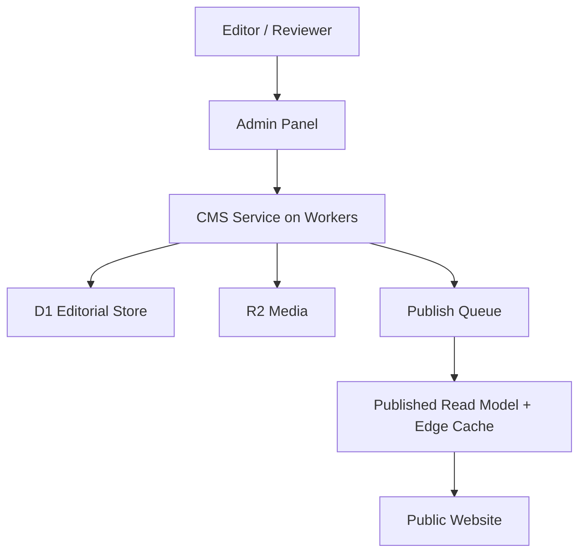
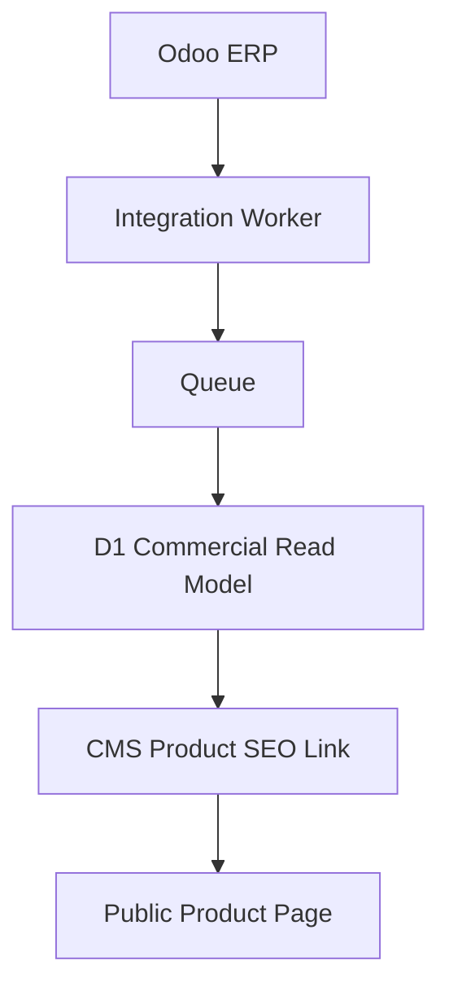
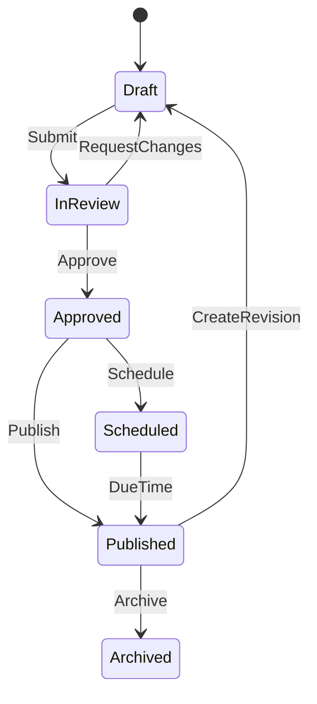

# CMS_ARCHITECTURE.md

## معماری CMS وب‌سایت آهن آسا

| مشخصه | مقدار |
|---|---|
| پروژه | Ahan Asa — آهن آسا |
| دامنه عمومی | `ahanassa.com` |
| ERP | `odoo.ahanassa.com` |
| وضعیت سند | معماری مصوب برای Implementation |
| نسخه | 2.0 |
| تاریخ بازنویسی | 2026-08-25 |
| مالک تصمیم | Product / Engineering / Content |
| زیرساخت اصلی | Next.js App Router روی Cloudflare Workers + D1 + R2 + Queues |
| اسناد مرجع | `SYSTEM_OF_RECORD.md`، `DATA_ARCHITECTURE.md`، `DATABASE_SCHEMA.md`، `ODOO_INTEGRATION.md`، `SYNC_STRATEGY.md`، `SEO_STRATEGY.md`، `AUTHORIZATION_ROLES.md`، `PERFORMANCE_BUDGET.md` |

---

## 1. تصمیم قطعی

CMS آهن آسا یک **CMS داخلی، Headless و کنترل‌شده** است که در همان اکوسیستم Cloudflare سایت اجرا می‌شود. پنل `/admin` رابط مدیریت آن است، داده تحریری در Cloudflare D1 نگهداری می‌شود و فایل‌ها و تصاویر در Cloudflare R2 قرار می‌گیرند.

استفاده از Sanity، WordPress، Odoo Website یا هر CMS خارجی در نسخه مصوب پیش‌فرض نیست. اضافه‌کردن یا جایگزینی Provider خارجی فقط با ADR جدید مجاز است.

```text
CMS = Editorial Content + SEO Content + Media Metadata + Publication Workflow

Odoo = Commercial Product Data + Prices + Customers + CRM + Quotations + Sales
```

اصول غیرقابل‌مذاکره:

1. سایت عمومی برای Render شدن نباید به پاسخ لحظه‌ای Odoo وابسته باشد.
2. CMS نباید منبع حقیقت قیمت، موجودی، مشتری، RFQ یا فروش باشد.
3. محتوای Published باید از Read Model سریع D1 و Cache لبه خوانده شود.
4. ویرایشگر اجازه تزریق HTML، JavaScript، CSS یا JSON-LD خام ندارد.
5. انتشار محتوا باید قابل Audit، بازگشت و ابطال هدفمند Cache باشد.
6. صفحات SEO باید در پاسخ اولیه HTML، محتوای اصلی و Metadata کامل داشته باشند.

---

## 2. اهداف معماری

- انتشار مقاله و به‌روزرسانی محتوای سایت بدون Commit و Deploy
- ایجاد پنل ساده و فارسی برای اپراتور غیرتوسعه‌دهنده
- حفظ Performance و SEO در سطح معماری، نه به‌عنوان اصلاح پس از اجرا
- جلوگیری از وجود دو منبع حقیقت بین Website و Odoo
- پشتیبانی از Draft، Review، Approval، Scheduling، Publish و Archive
- نگهداری Revision و Audit Log برای تمام تغییرات حساس
- مدیریت رسانه در R2 با Metadata و سیاست دسترسی روشن
- پشتیبانی از فارسی RTL و آماده‌بودن برای انگلیسی و عربی
- اعمال Role/Permission در سمت سرور
- امکان بازیابی محتوا بدون وابستگی به یک Vendor خارجی

---

## 3. خارج از محدوده CMS

موارد زیر در CMS ساخته یا ویرایش نمی‌شوند:

- Customer و Contact تجاری
- Lead، Opportunity و فعالیت‌های CRM
- RFQ، اقلام RFQ و وضعیت مذاکره
- Quotation، Sale Order، Invoice و Payment
- Product Template و Product Variant تجاری
- UOM، Pricelist، قیمت پایه و قیمت مشتری
- Inventory، Purchase، Supplier و Accounting
- Secret، API Key و Environment Variable
- منطق محاسبه وزن، قیمت، تخفیف، مالیات و حمل
- داده حساس مشتریان یا پیوست‌های محرمانه RFQ
- Design Token، CSS، Component implementation و Route handler

CMS می‌تواند **محتوای نمایشی و SEO مرتبط با یک محصول Odoo** را نگهداری کند، اما حق تغییر شناسه تجاری، واحد، قیمت یا موجودی آن را ندارد.

---

## 4. معماری کلان



ارتباط با ERP جداگانه و غیرهمزمان است:



| جزء | مسئولیت |
|---|---|
| `/admin` | رابط اپراتور، ویرایش، Preview، Review و انتشار |
| CMS Service | Validation، Authorization، Workflow و ثبت Revision |
| D1 Editorial Store | محتوای Draft/Published، روابط، Revision و Audit |
| D1 Commercial Read Model | نسخه عمومی و همگام‌شده Product/Variant/Unit/Price از Odoo |
| R2 | تصاویر، PDF، فایل‌های دانلودی و مشتقات رسانه |
| Queues | Publication job، پردازش رسانه، Sync و Retry |
| Integration Worker | Adapter مستقل Website ↔ Odoo |
| Edge Cache | پاسخ سریع صفحات عمومی و Assetها |

---

## 5. System of Record

| داده یا عملیات | منبع حقیقت | نقش CMS |
|---|---|---|
| مقاله و دسته مقاله | Website CMS | مالک کامل |
| صفحه ثابت و Landing Page | Website CMS | مالک محتوای قابل‌ویرایش |
| FAQ | Website CMS | مالک کامل |
| Navigation و Footer | Website CMS با Approval | مالک نسخه منتشرشده |
| SEO صفحه، مقاله و دسته | Website CMS | مالک کامل |
| SEO محصول و دسته کالایی | Website CMS | مالک محتوای تحریری؛ Link به `odoo_id` |
| رسانه عمومی | R2 + Metadata در D1 | مالک Metadata و Lifecycle |
| Product/Variant/UOM | Odoo | فقط نمایش Read-only و انتخاب Reference |
| قیمت تجاری | Odoo | فقط نمایش نسخه همگام‌شده |
| تاریخچه عمومی قیمت | D1 از Sync | فقط Context/Caption و سیاست Index |
| مشتری | Odoo | بدون مدیریت در CMS |
| RFQ و اقلام آن | Website RFQ Store + Odoo | فقط لینک به ماژول تخصصی RFQ Admin |
| Quotation/Sale | Odoo | بدون مدیریت در CMS |
| Redirect | Registry محافظت‌شده Website | ویرایش فقط برای نقش SEO/Admin |

هرجا این جدول با سند دیگری تعارض داشت، `SYSTEM_OF_RECORD.md` مرجع نهایی است و تعارض باید پیش از Implementation رفع شود.

---

## 6. مرز CMS و Odoo

### 6.1 داده‌ای که از Odoo به سایت می‌آید

- `odoo_id` و `external_id`
- Product Template و Variant فعال
- Category تجاری
- Attribute و Value
- UOM
- Public Price مجاز برای نمایش
- Currency و Price Unit
- Availability عمومی در صورت تصمیم کسب‌وکار
- زمان آخرین Sync

این داده‌ها با Integration Worker و Queue وارد D1 می‌شوند. CMS آن‌ها را Read-only نمایش می‌دهد تا Editor بتواند محتوای SEO را به Entity صحیح متصل کند.

### 6.2 داده‌ای که CMS برای محصول نگهداری می‌کند

- Slug عمومی
- SEO Title و Meta Description
- Intro و Buying Guide
- مشخصات توضیحی قابل انتشار
- FAQ
- تصاویر و Alt Text
- لینک‌های داخلی
- Related Products/Articles
- Index policy و Canonical policy
- محتوای تکمیلی صفحه قیمت

### 6.3 قانون استقلال Runtime

مسیر ممنوع:

```text
Visitor → Website → Odoo → Response
```

مسیر مصوب:

```text
Odoo → Background Sync → D1 Read Model → Edge Cache → Visitor
```

اگر Odoo قطع باشد، آخرین داده معتبر همگام‌شده همراه با `last_synced_at` نمایش داده می‌شود و CMS همچنان قابل استفاده می‌ماند.

---

## 7. محدوده پنل مدیریت

```text
/admin
├── Dashboard
├── Content
│   ├── Pages
│   ├── Articles
│   ├── Article Categories
│   └── FAQs
├── Catalog Content
│   ├── Category SEO
│   ├── Product SEO
│   └── Price Page Content
├── Media
├── Navigation
├── SEO
│   ├── Metadata
│   ├── Redirects
│   └── Indexing Health
├── Publications
│   ├── Drafts
│   ├── Reviews
│   ├── Scheduled
│   └── History
├── Integrations
│   └── Odoo Sync Status — Read-only/Retry by permission
├── RFQs — لینک به ماژول تخصصی RFQ
├── Users & Roles
└── Settings
```

قیمت در منوی CMS قابل ویرایش نیست. اگر صفحه‌ای با عنوان Prices در Admin وجود داشته باشد، فقط وضعیت Sync، زمان آخرین دریافت، خطاها و لینک ورود به Odoo را نشان می‌دهد.

---

## 8. مدل‌های محتوایی

مدل دقیق جداول در `DATABASE_SCHEMA.md` تعریف می‌شود. این سند Contract مفهومی CMS را مشخص می‌کند.

### 8.1 `site_settings`

- `locale`
- `site_name`
- `tagline`
- `contact_summary`
- `social_links`
- `default_seo`
- `default_og_media_id`
- `organization_public_data`
- `updated_by`
- `version`

### 8.2 `navigation_sets`

- `locale`
- `location` — header/footer/utility
- `items[]` ساختاریافته
- `status`
- `published_revision_id`

Navigation فقط Link داخلی ثبت‌شده، URL خارجی HTTPS یا Action تأییدشده را می‌پذیرد.

### 8.3 `pages`

- `id`، `page_type`، `locale`، `translation_group_id`
- `title`، `slug`، `summary`، `template_key`
- `content_blocks`، `seo_record_id`
- `workflow_status`، `published_revision_id`، `scheduled_at`
- `created_by`، `updated_by`، `created_at`، `updated_at`

### 8.4 `articles`

- `id`، `locale`، `translation_group_id`
- `title`، `slug`، `excerpt`، `cover_media_id`
- `author_id`، `reviewer_id`، `category_ids`
- `body_blocks`، `published_at`، `updated_at_public`
- `seo_record_id`، `workflow_status`

### 8.5 `article_categories`

- `name`، `slug`، `locale`، `description`
- `seo_record_id`، `display_order`، `is_active`

### 8.6 `faqs`

- `question`، `answer_blocks`، `locale`، `topic`
- `reviewed_by`، `reviewed_at`، `status`

FAQ قابل Reference از چند صفحه است. حذف FAQ استفاده‌شده تا زمان حذف Reference ممنوع است.

### 8.7 `product_content`

- `odoo_product_template_id` یا `odoo_variant_id`
- `locale`، `public_slug`، `display_title_override`
- `intro`، `buying_guide_blocks`، `technical_notes`
- `faq_ids`، `related_article_ids`، `related_product_refs`
- `media_ids`، `seo_record_id`، `workflow_status`

Reference به Product غیرفعال Odoo باعث هشدار و جلوگیری از انتشار جدید می‌شود؛ محتوای Published قبلی طبق Policy می‌تواند Archive یا Noindex شود.

### 8.8 `category_content`

- `odoo_category_id`، `locale`، `public_slug`
- `intro`، `selection_guide`، `standards_content`
- `faq_ids`، `related_article_ids`
- `seo_record_id`، `workflow_status`

### 8.9 `price_page_content`

این مدل قیمت را ذخیره نمی‌کند و فقط محتوای پیرامون صفحه قیمت را نگهداری می‌کند:

- `commercial_entity_ref`، `locale`
- `intro`، `price_methodology_note`، `unit_explanation`
- `buying_notes`، `faq_ids`، `seo_record_id`، `index_policy`

### 8.10 `seo_records`

- `meta_title`، `meta_description`، `canonical_path`
- `robots_index`، `robots_follow`
- `open_graph_title`، `open_graph_description`، `open_graph_media_id`
- `breadcrumb_label`، `schema_profile`

JSON-LD خام ذخیره نمی‌شود. `schema_profile` فقط Enum مجاز است و کد سایت Schema نهایی را می‌سازد.

### 8.11 `media`

- `r2_key`، `mime_type`، `size_bytes`، `width`، `height`
- `checksum`، `original_filename`، `safe_filename`
- `alt_by_locale`، `caption_by_locale`، `credit`، `license`
- `focal_point`، `visibility`، `processing_status`، `created_by`

### 8.12 `content_revisions`

- `entity_type`، `entity_id`، `revision_number`
- `snapshot_json`، `change_summary`، `created_by`، `created_at`

Revision منتشرشده Immutable است. ویرایش بعدی Draft و Revision جدید می‌سازد.

### 8.13 `publication_jobs`

- `entity_type`، `entity_id`، `revision_id`
- `operation` — publish/unpublish/archive
- `scheduled_at`، `status`، `attempt_count`
- `idempotency_key`، `last_error_code`

### 8.14 `audit_logs`

- Actor و Action
- Entity type/id
- Before/after summary یا Revision reference
- Request ID و Timestamp
- IP hash یا داده ممیزی مطابق Privacy policy

Audit Log از UI قابل حذف نیست.

---

## 9. Content Blocks و Page Builder محدود

Editor فقط از Blockهای Allowlisted استفاده می‌کند:

1. `hero`
2. `richText`
3. `imageText`
4. `categoryGrid`
5. `productTable`
6. `priceSnapshot`
7. `technicalSpecs`
8. `buyingGuide`
9. `processSteps`
10. `proofMetrics`
11. `faqGroup`
12. `relatedContent`
13. `downloadCard`
14. `ctaBand`

قواعد:

- هر Block Schema نسخه‌دار و Validation مستقل دارد.
- Editor رنگ، Font، CSS class یا اندازه آزاد وارد نمی‌کند.
- HTML، iframe و embed آزاد ممنوع است.
- Rich Text فقط Mark و Nodeهای Allowlisted را می‌پذیرد.
- `hero` در هر Page حداکثر یک‌بار مجاز است.
- Product/Price block داده تجاری را از Read Model می‌خواند، نه از متن دستی.
- Templateهای Homepage، Product و RFQ ساختار ثابت دارند و فقط Slotهای مشخص قابل ویرایش‌اند.
- نسخه Block همراه محتوا ذخیره می‌شود تا Migration آینده قابل‌کنترل باشد.

---

## 10. Workflow انتشار



### قواعد Workflow

- Save Draft انتشار عمومی ایجاد نمی‌کند.
- تغییر Draft پس از Approval، تأیید قبلی را باطل می‌کند.
- Publish دقیقاً یک Revision تأییدشده را منتشر می‌کند.
- Scheduled Publish با UTC ذخیره و در UI با Timezone کاربر نمایش داده می‌شود.
- Publish/Unpublish باید `idempotency_key` یکتا داشته باشد.
- در تغییر Slug، Redirect معتبر در همان عملیات انتشار ثبت می‌شود.
- Archive با Soft Delete انجام می‌شود؛ Delete دائمی تابع Retention policy است.
- Rollback یک Revision قدیمی را به Revision جدید تبدیل می‌کند؛ تاریخچه بازنویسی نمی‌شود.

### Publish Transaction

1. Authorization و Validation نهایی
2. بررسی Version برای جلوگیری از Lost Update
3. ثبت Revision مصوب
4. تغییر Pointer نسخه Published
5. ثبت Redirect در صورت تغییر Slug
6. ایجاد Publication Job با Idempotency Key
7. ثبت Audit Log
8. ارسال Job به Queue پس از Commit
9. Revalidation/Purge هدفمند
10. به‌روزرسانی Sitemap و Feedهای مرتبط

اگر ارسال Queue بعد از Commit شکست خورد، Outbox/Retry job باید آن را دوباره ارسال کند؛ وضعیت Published در D1 نباید گم شود.

---

## 11. نقش‌ها و مجوزها

| نقش | مجوز اصلی |
|---|---|
| Admin | مدیریت کاربران، نقش‌ها، تنظیمات و تمام محتوا |
| Developer | Schema/Migration/Integration؛ بدون انتشار محتوای تجاری پیش‌فرض |
| Managing Editor | Review، Approval، Publish و Archive |
| Editor | ایجاد و ویرایش Draft در محدوده تخصیص‌یافته |
| SEO Manager | Metadata، Canonical، Index policy و Redirect |
| Translator | ویرایش Locale تخصیص‌یافته؛ بدون Publish مستقل |
| Reviewer | Comment، Approve یا Request Changes |
| Viewer/Auditor | مشاهده Read-only تاریخچه و گزارش‌ها |

اصول:

- Authentication به‌تنهایی مجوز عملیات نیست.
- Authorization در تمام Mutationها سمت سرور اعمال می‌شود.
- مخفی‌کردن دکمه در UI کنترل امنیتی محسوب نمی‌شود.
- Permissionها Action-based هستند؛ مانند `article.create` و `article.publish`.
- Scopeهای Locale/Content Type در D1 نگهداری می‌شوند.
- حساب اشتراکی ممنوع است.
- غیرفعال‌کردن کاربر باید Session فعال او را بی‌اعتبار کند.

برای تیم داخلی می‌توان Cloudflare Access را لایه ورودی `/admin` قرار داد، اما مجوزهای محتوایی همچنان باید داخل Application enforce شوند.

---

## 12. Authentication و Session

- `/admin` و Admin APIها بدون احراز هویت در دسترس نیستند.
- Session در Cookie با `HttpOnly`، `Secure` و `SameSite` مناسب نگهداری می‌شود.
- CSRF protection برای تمام Mutationها الزامی است.
- Session expiry و idle timeout تعریف می‌شود.
- Login، logout، failure و permission denial ثبت ممیزی می‌شوند.
- Endpointهای Admin Rate Limit جداگانه دارند.
- Secret و Credential هیچ‌گاه به Client Bundle وارد نمی‌شود.

جزئیات Provider هویت در `SECURITY_GUIDELINES.md` و `AUTHORIZATION_ROLES.md` قطعی می‌شود؛ مدل محتوایی به Provider هویت قفل نمی‌شود.

---

## 13. Preview

1. Editor روی Preview کلیک می‌کند.
2. Server مجوز کاربر و Entity/Revision را بررسی می‌کند.
3. Preview token کوتاه‌عمر و تک‌منظوره صادر می‌شود.
4. صفحه از Draft Read path و بدون Cache عمومی Render می‌شود.
5. Header واضح «پیش‌نمایش» و Revision number نمایش داده می‌شود.

قواعد امنیتی:

- Preview URL دائمی یا قابل Index نیست.
- Response دارای `noindex, nofollow` و `private, no-store` است.
- Token در Log، Analytics یا Referrer افشا نمی‌شود.
- Redirect مقصد فقط از Allowlist داخلی پذیرفته می‌شود.
- Draft API از CORS عمومی استفاده نمی‌کند.
- Preview از Odoo Fetch مستقیم انجام نمی‌دهد.

---

## 14. Localization و RTL/LTR

- Locale اولیه `fa` است؛ معماری از ابتدا `en` و `ar` را پشتیبانی می‌کند.
- ترجمه‌ها Document مستقل با `translation_group_id` مشترک هستند.
- هر Locale دارای Slug، Title، Metadata، Alt Text و Workflow مستقل است.
- ترجمه خودکار بدون Review انسانی Published نمی‌شود.
- نبود ترجمه باعث نمایش فارسی در URL زبان دیگر نمی‌شود.
- `dir` از Locale در Layout تعیین می‌شود و Editor آن را تغییر نمی‌دهد.
- تاریخ ذخیره‌شده UTC و نمایش تاریخ مطابق Locale است.
- اعداد تجاری در Storage استاندارد می‌مانند؛ تبدیل رقم فقط Presentation concern است.

```text
missing → draft → in_review → approved → published → stale
```

ویرایش محتوای منبع می‌تواند ترجمه‌ها را `stale` علامت‌گذاری کند، اما خودکار Unpublish نمی‌کند مگر Policy جداگانه تعریف شود.

---

## 15. SEO Architecture در CMS

### الزامات هر Entity قابل Index

- Title و H1 معتبر
- Meta Description مستقل
- Canonical محاسبه‌شده و کنترل‌شده
- Robots policy و Open Graph metadata
- Breadcrumb label و Internal links قابل Crawl
- Structured data profile مجاز
- Inclusion policy برای Sitemap

### قواعد

- HTML اصلی، Headingها، Links و Metadata در پاسخ اولیه Server-generated باشند.
- Canonical پیش‌فرض توسط Route Registry تولید شود؛ Override فقط برای SEO Manager.
- Canonical خارجی فقط از Domain allowlist پذیرفته شود.
- Slug در محدوده `entity_type + locale` یکتا است.
- تغییر Slug بدون Redirect قابل Publish نیست.
- `noindex` در UI هشدار واضح دارد و در Audit ثبت می‌شود.
- Sitemap فقط Published + Canonical + Indexable entityها را شامل می‌شود.
- `lastmod` از تغییر واقعی نسخه Published می‌آید، نه زمان Build.
- Schema فقط وقتی تولید می‌شود که داده متناظر در صفحه قابل مشاهده باشد.
- Raw JSON-LD، Meta tag آزاد و Script injection ممنوع است.
- Filter URLها پیش‌فرض Indexable نیستند؛ فقط Landing Pageهای تأییدشده Index می‌شوند.

### جلوگیری از Thin Content

ساخت خودکار هزاران صفحه Product/Price صرفاً به دلیل وجود Variant در Odoo ممنوع است. Index شدن صفحه نیازمند حداقل محتوای ارزشمند است:

- قیمت/واحد و زمان به‌روزرسانی معتبر
- توضیح فنی و راهنمای خرید
- سایزها یا Variantهای مرتبط
- FAQ یا پاسخ به Intent واقعی
- لینک‌های داخلی مرتبط

---

## 16. Media Architecture

- فایل اصلی در Bucket خصوصی R2 ذخیره می‌شود.
- D1 فقط Metadata و `r2_key` را نگهداری می‌کند.
- دسترسی عمومی از Delivery route یا دامنه Asset کنترل‌شده انجام می‌شود.
- Upload از Admin با URL امضاشده کوتاه‌عمر یا Worker authenticated انجام می‌شود.

R2 از `PUT` در Presigned URL پشتیبانی می‌کند؛ Uploadهای بزرگ می‌توانند Multipart باشند. نوع فایل، اندازه، نام، Checksum و مالک قبل و بعد از Upload اعتبارسنجی می‌شوند.

```text
Upload → Quarantine/Validation → Metadata Extraction → Image Variants → Ready
```

قواعد:

- MIME واقعی با Extension تطبیق داده شود.
- SVG و فایل اجرایی پیش‌فرض رد یا Sanitized شوند.
- تصویر معنادار بدون Alt در Locale هدف Published نمی‌شود.
- تصویر تزئینی با `decorative=true` و Alt خالی ثبت می‌شود.
- ابعاد و Aspect Ratio برای جلوگیری از CLS ذخیره می‌شوند.
- AVIF/WebP و اندازه Responsive در Delivery layer تولید می‌شوند.
- نام فایل Safe و کلید R2 غیرقابل‌برخورد باشد.
- فایل استفاده‌شده بلافاصله حذف نمی‌شود؛ ابتدا Dependency check و Soft Delete.
- RFQ attachment و CMS media در Prefix/Bucket و Policy جدا نگهداری می‌شوند.

---

## 17. Cache، Read Model و Revalidation

```text
Request → Cloudflare Edge Cache → Next.js/Worker → D1 Published Read Model
```

Draft table یا Revision history در Query عمومی خوانده نمی‌شود.

### Cache Tagها

```text
content:{type}:{locale}:{id}
route:{locale}:{slug}
list:articles:{locale}
category:{locale}:{id}
product:{odoo_id}:{locale}
price:{odoo_id}
navigation:{locale}
sitemap:{locale}:{type}
```

### Invalidation

- مقاله: صفحه مقاله + List + Category + Sitemap مرتبط
- Product SEO: صفحه محصول + Category listing + Sitemap مرتبط
- قیمت Sync‌شده: Price/Product cache مرتبط، نه کل سایت
- Navigation: فقط Layout cache همان Locale
- Settings عمومی: Tag محدود و مشخص
- Full purge: فقط Incident یا Migration بزرگ با دسترسی Admin

شکست Revalidation باید Retry و Alert داشته باشد؛ آخرین نسخه Cache‌شده تا جایگزینی معتبر قابل سرو است.

### D1 Read Replication

در صورت فعال‌سازی Global Read Replication، Queryهای عمومی باید از D1 Sessions API استفاده کنند. برای مسیرهای Read-after-write، Bookmark/Session consistency رعایت شود.

---

## 18. Performance Budget مرتبط با CMS

| شاخص | هدف معماری |
|---|---|
| CMS SDK در Client صفحات عمومی | صفر |
| Fetch مستقیم Odoo در Public request | صفر |
| Query عمومی صفحه جزئیات | یک Query اصلی + Batch محدود |
| N+1 query | ممنوع |
| Full-site rebuild برای مقاله | غیرضروری |
| Purge کل Cache برای تغییر عادی | ممنوع |
| زمان هدف انتشار تا مشاهده عمومی | حداکثر 60 ثانیه در حالت عادی |
| محتوای اصلی وابسته به Client JavaScript | ممنوع |

- Server Components انتخاب پیش‌فرض صفحات محتوایی هستند.
- Client Component فقط برای Interaction واقعی استفاده می‌شود.
- List query بدنه کامل مقاله را دریافت نمی‌کند.
- Pagination و Projection فیلدها الزامی است.
- Block payload قبل از Publish محدودیت اندازه دارد.
- تصاویر Below-the-fold Lazy-load می‌شوند؛ تصویر LCP آگاهانه Priority می‌گیرد.
- Normalize سنگین در Write/Publish path انجام می‌شود، نه Public Runtime.

اهداف نهایی Core Web Vitals و Lighthouse در `PERFORMANCE_BUDGET.md` تعریف می‌شوند.

---

## 19. Validation

### Validation عمومی

- Required field و Enumهای مجاز
- Unique slug در Locale و Entity type
- محدودیت طول و حجم Blockها
- لینک داخلی معتبر و URL خارجی HTTPS
- جلوگیری از `javascript:`، HTML خام و Protocol ناامن
- Alt Text برای تصویر معنادار
- Reference سالم و جلوگیری از Self-reference
- Version check برای Optimistic Concurrency
- تاریخ‌بندی صحیح Schedule
- عدم Publish ترجمه تأییدنشده

### Validation دامنه آهن آسا

- قیمت دستی داخل Rich Text به‌عنوان «قیمت جاری» ممنوع است.
- Price block فقط داده همگام‌شده Odoo را نمایش می‌دهد.
- ادعای استاندارد، گرید، اصالت یا کیفیت نیازمند Review تخصصی است.
- هر عدد دارای Unit و Context مشخص باشد.
- ادعای موجودی یا تحویل قطعی بدون منبع عملیاتی مجاز نیست.
- نام یا لوگوی مشتری/تأمین‌کننده بدون مجوز انتشار ممنوع است.
- CTA نباید قابلیت فروش آنلاین موجودنشده را القا کند.
- محتوای حقوقی و شرایط فروش فقط با Approval مجاز منتشر می‌شود.

Validation سمت Client صرفاً UX است؛ تمام قواعد در Server دوباره اجرا می‌شوند.

---

## 20. امنیت

- اصل Least Privilege برای User، Service binding و Odoo bot اعمال می‌شود.
- API Key اودوو فقط Cloudflare Secret است و به CMS UI یا Browser نمی‌رسد.
- تمام Mutationها Authentication، Authorization، CSRF protection و Audit دارند.
- Inputها با Schema runtime validate و Outputها Encode می‌شوند.
- Rich Text renderer فقط Componentهای Allowlisted را Map می‌کند.
- Uploadها محدودیت MIME، حجم، Rate و Checksum دارند.
- Admin و Public API Rate Limit جدا دارند.
- Error عمومی شامل Stack، SQL، Token یا Payload داخلی نیست.
- Preview و Draft از Cache عمومی جدا هستند.
- PII در Search index یا CMS analytics ثبت نمی‌شود.
- Backup، Restore و Incident procedure قبل از Production آزمایش می‌شود.
- هیچ عملیات Bulk بدون Dry Run، شمارش رکورد و Confirmation UI انجام نمی‌شود.

---

## 21. همزمانی، یکپارچگی و Idempotency

### Optimistic Locking

هر Entity فیلد `version` دارد. Mutation باید Version خوانده‌شده را ارسال کند. اگر نسخه تغییر کرده باشد، سرور `409 Conflict` برمی‌گرداند و تغییر جدید را بی‌صدا Overwrite نمی‌کند.

### Idempotency

این عملیات Idempotency Key دارند:

- Publish/Unpublish
- Media finalize
- Odoo sync apply
- Cache invalidation job
- Scheduled publication

Queue ممکن است پیام را بیش از یک‌بار تحویل دهد؛ Consumer باید نتیجه قبلی همان Key را تشخیص دهد.

### Soft Delete

- Entityهای محتوایی ابتدا Archive می‌شوند.
- Media ابتدا `pending_delete` می‌شود.
- حذف فیزیکی پس از Retention period و Dependency check انجام می‌شود.
- Audit log فقط طبق Policy حقوقی مشخص حذف می‌شود.

---

## 22. Failure Recovery

| خرابی | رفتار مورد انتظار |
|---|---|
| Odoo unavailable | CMS و سایت با آخرین Read Model معتبر ادامه می‌دهند |
| Publish Queue failure | Retry با Backoff؛ سپس DLQ و Alert |
| Cache purge failure | نسخه قبلی سرو می‌شود؛ Job مجدداً اجرا می‌شود |
| D1 write conflict | `409` و درخواست Merge/Reload؛ بدون overwrite خاموش |
| Media processing failure | Asset در وضعیت failed/quarantine؛ قابل Publish نیست |
| Invalid CMS record | Draft حفظ می‌شود؛ Publish رد می‌شود |
| Scheduled job duplicate | Consumer با Idempotency Key آن را تکراری تشخیص می‌دهد |
| Slug collision | Transaction رد می‌شود؛ Route قبلی حفظ می‌گردد |

Jobهای ناموفق پس از سقف Retry به DLQ منتقل و در Dashboard نمایش داده می‌شوند. Recovery دستی باید Idempotency و Parent reference را حفظ کند.

---

## 23. Backup و بازیابی

- D1 Time Travel لایه بازیابی عملیاتی است، نه جایگزین Export و تست Restore.
- قبل از Migration مخرب، Bookmark/Backup و Export منطقی گرفته می‌شود.
- Export دوره‌ای محتوای Published، Revisionهای لازم و Media manifest نگهداری می‌شود.
- R2 lifecycle برای Temporary upload و Multipart ناقص تعریف می‌شود.
- Restore ابتدا در محیط غیرProduction آزمایش می‌شود.
- بازیابی Production نیازمند Runbook، تأیید مسئول و ثبت Incident است.
- هدف‌های RPO/RTO در `FAILURE_RECOVERY.md` تعیین می‌شوند.

Retention دقیق Time Travel باید هنگام راه‌اندازی از مستندات و Plan جاری Cloudflare تأیید شود.

---

## 24. Logging، Monitoring و Audit

### Metrics

- Draft save latency/error
- Publish success/failure/time-to-visible
- Queue backlog، retry و DLQ count
- Odoo sync lag و last successful sync
- Cache hit ratio و purge failure
- D1 query latency/error
- R2 upload/processing failure
- 404 ناشی از Slug/Redirect
- Sitemap generation failure
- Preview access error

### Alertها

- چند Publish ناموفق متوالی
- عبور Sync lag از SLA
- وجود Job در DLQ
- عدم مشاهده نسخه Published پس از SLA
- افزایش 5xx Admin یا Public content API
- Asset عمومی با Reference شکسته
- تغییر ناگهانی `noindex` یا Canonical صفحات کلیدی

### قواعد Log

- Correlation/Request ID در مسیر Admin → Worker → Queue → Consumer حفظ شود.
- Secret، Session token، متن کامل PII یا API credential Log نشود.
- Audit business event از Application log فنی جدا باشد.
- نمایش Audit برای Auditor Read-only است.

---

## 25. API Contract

UI نباید مستقیماً SQL اجرا کند یا به Odoo متصل شود.

```ts
export interface CmsRepository {
  getPublishedPage(input: PageLookup): Promise<PublishedPage | null>;
  getDraftEntity(input: DraftLookup, actor: Actor): Promise<DraftEntity | null>;
  listArticles(input: ArticleListQuery): Promise<Paginated<ArticleCard>>;
  saveDraft(input: SaveDraftCommand, actor: Actor): Promise<SaveResult>;
  submitForReview(input: ReviewCommand, actor: Actor): Promise<WorkflowResult>;
  approve(input: ApprovalCommand, actor: Actor): Promise<WorkflowResult>;
  publish(input: PublishCommand, actor: Actor): Promise<PublicationResult>;
  archive(input: ArchiveCommand, actor: Actor): Promise<WorkflowResult>;
}
```

```ts
export interface CommercialReadRepository {
  getProductByOdooId(id: number): Promise<PublicProduct | null>;
  getVariantByOdooId(id: number): Promise<PublicVariant | null>;
  getPublicPrice(ref: CommercialRef): Promise<PublicPriceSnapshot | null>;
  listProductReferences(input: ProductReferenceQuery): Promise<Paginated<ProductRef>>;
}
```

- Typeهای Domain مستقل از D1 row و Odoo response هستند.
- Validation و Mapping در مرز Repository انجام می‌شود.
- Client فقط View Model لازم را دریافت می‌کند.
- Errorها Code پایدار، Message امن و Request ID دارند.
- Pagination cursor-based برای فهرست‌های بزرگ ترجیح دارد.

---

## 26. ساختار پوشه پیشنهادی

```text
src/
├── app/
│   ├── (public)/
│   ├── admin/
│   └── api/
│       ├── admin/
│       ├── media/
│       ├── preview/
│       └── internal/
├── components/
│   ├── admin/
│   └── content-blocks/
├── features/
│   ├── articles/
│   ├── pages/
│   ├── product-content/
│   ├── seo/
│   ├── media/
│   └── publishing/
├── lib/
│   ├── auth/
│   ├── cms/
│   │   ├── domain/
│   │   ├── repositories/
│   │   ├── validation/
│   │   ├── workflow/
│   │   └── cache/
│   ├── commercial-read-model/
│   ├── odoo/adapter/
│   ├── db/
│   ├── queues/
│   └── observability/
└── types/

migrations/
workers/
├── publication-consumer/
├── media-consumer/
└── odoo-sync-consumer/
```

Public component نباید از `lib/odoo/adapter` import مستقیم داشته باشد.

---

## 27. Environment و Secretها

نام نهایی متغیرها با `ENVIRONMENT_VARIABLES.md` همگام می‌شود:

```text
DB
CMS_MEDIA_BUCKET
PUBLICATION_QUEUE
MEDIA_QUEUE
ODOO_SYNC_QUEUE
ODOO_BASE_URL
ODOO_DATABASE
ODOO_API_KEY
ODOO_API_MODE
PREVIEW_SIGNING_SECRET
SESSION_SECRET
TURNSTILE_SECRET_KEY
```

- مقدار واقعی Secret در Git و Documentation ثبت نمی‌شود.
- Odoo API Key فقط Secret سمت Worker است.
- Preview/Production Binding و Database جدا هستند.
- Migration به‌صورت Versioned و در Pipeline کنترل‌شده اجرا می‌شود.
- نبود Binding حیاتی باید Deploy/Startup را Fail کند.

---

## 28. Migration و Rollout

### Phase 1 — Foundation

- D1 schema، Migration و Seed نقش‌ها
- Authentication/Authorization
- Audit log و Revision engine
- Media upload به R2
- Published Read path

### Phase 2 — Articles

- Article و Article Category
- Draft/Review/Publish و Preview
- SEO fields، Revalidation و Sitemap update

### Phase 3 — Website Content

- Pages، FAQ، Navigation و Settings
- Page templates و Blockهای محدود
- Localization foundation

### Phase 4 — Catalog SEO

- Odoo product reference browser
- Product/Category SEO content
- Price page content و Sync health view

### Phase 5 — Operational Hardening

- Scheduled publishing
- DLQ dashboard و replay کنترل‌شده
- Backup/restore drill
- Content health report
- Performance و Security regression gates

هر Phase فقط پس از Acceptance Criteria خودش وارد Production می‌شود.

---

## 29. تست و QA

### Unit

- Validation schema، Workflow transitions و Permission matrix
- Slug/Canonical و Cache tag generation
- Odoo-to-read-model mapper
- Rich Text allowlist renderer و Idempotency consumer

### Integration

- D1 transaction و Optimistic locking
- Save Draft → Review → Publish
- Scheduled publish و Slug change + Redirect
- R2 upload/finalize/delete lifecycle
- Queue retry/DLQ و Odoo unavailable fallback
- Cache invalidation هدفمند

### End-to-End

- Login و Session expiry
- Editor نمی‌تواند Publish کند
- Reviewer می‌تواند Request Changes دهد
- SEO Manager می‌تواند Redirect ثبت کند
- Preview Draft برای کاربر مجاز و `noindex`
- Published article در HTML اولیه و Sitemap ظاهر می‌شود
- تغییر قیمت Odoo پس از Sync بدون ویرایش CMS نمایش داده می‌شود
- RFQ/PII در CMS قابل جست‌وجو یا مشاهده نیست

### Security و Performance

- CSRF، XSS، Injection، Open Redirect، IDOR و Upload spoofing
- Secret leakage، replay، rate limiting و session fixation
- Public cache hit/miss، D1 query count و latency
- عدم ورود Admin bundle به Public route
- Image delivery و Core Web Vitals روی Templateهای اصلی

---

## 30. معیار پذیرش Production

- [ ] CMS داخلی روی Workers و D1 پیاده‌سازی شده است.
- [ ] `/admin` احراز هویت و Authorization سمت سرور دارد.
- [ ] Article می‌تواند Draft، Review، Approve، Publish و Archive شود.
- [ ] هر Publish دارای Revision، Audit و Idempotency Key است.
- [ ] Rollback بدون حذف تاریخچه کار می‌کند.
- [ ] Preview امن، خصوصی و `noindex` است.
- [ ] Media در R2 با Validation و Metadata ذخیره می‌شود.
- [ ] هیچ Odoo credential در Browser یا Repository نیست.
- [ ] قیمت، Product و UOM تجاری در CMS قابل ویرایش نیستند.
- [ ] صفحات عمومی هنگام قطع Odoo با Read Model ادامه می‌دهند.
- [ ] Cache فقط برای Entityهای مرتبط باطل می‌شود.
- [ ] Slug جدید بدون Redirect مسیر قبلی Published نمی‌شود.
- [ ] Metadata، Canonical، Hreflang و Sitemap از Published content ساخته می‌شوند.
- [ ] JSON-LD خام در CMS وجود ندارد.
- [ ] Rich Text و Blockها Allowlisted هستند.
- [ ] Queue retry و DLQ آزمایش شده‌اند.
- [ ] Backup/restore drill موفق ثبت شده است.
- [ ] سناریوهای RTL فارسی و عربی و LTR انگلیسی QA شده‌اند.
- [ ] هیچ Lead، RFQ attachment یا PII در CMS ذخیره نمی‌شود.
- [ ] Performance Budget و Security tests در CI پاس می‌شوند.

---

## 31. قوانین قطعی برای Claude Code

1. CMS خارجی یا SDK آن را بدون ADR نصب نکند.
2. Public route را مستقیماً به Odoo متصل نکند.
3. قیمت، Product commercial data یا Customer را در CMS قابل ویرایش نکند.
4. Schema را بدون Migration نسخه‌دار تغییر ندهد.
5. هیچ Mutation را فقط با کنترل UI محافظت نکند.
6. Secret یا Token را در Client Component یا `NEXT_PUBLIC_*` قرار ندهد.
7. Raw HTML، CSS، Script، iframe یا JSON-LD آزاد به Editor ندهد.
8. Publish را بدون Revision، Audit و Idempotency اجرا نکند.
9. Queue consumer را با فرض exactly-once delivery ننویسد.
10. تغییر Slug را بدون Redirect و Revalidation منتشر نکند.
11. Draft/Preview را در Cache عمومی ذخیره نکند.
12. برای تغییر عادی Content، Full cache purge یا Full rebuild انجام ندهد.
13. Admin dependency و bundle را وارد Route عمومی نکند.
14. حذف فیزیکی Bulk را بدون Dry Run، Backup و Approval اجرا نکند.
15. هر مدل جدید را همراه Type، Validation، Permission، Migration و Test اضافه کند.
16. اگر این سند با `SYSTEM_OF_RECORD.md` تعارض داشت، Implementation را متوقف و تعارض را ثبت کند.

---

## 32. تصمیم نهایی

CMS آهن آسا از این پس یک قابلیت اختیاری یا اتصال آینده به Sanity نیست. این CMS بخشی از Backend سایت و ابزار روزانه اپراتور است، اما عمداً فقط دامنه **Editorial و SEO** را پوشش می‌دهد.

```text
Admin CMS
  → D1 Editorial Store
  → R2 Media
  → Publication Queue
  → Published Read Model
  → Cloudflare Edge Cache
  → Public Website

Odoo ERP
  → Integration Worker
  → D1 Commercial Read Model
  → Product/Price Pages
```

نتیجه:

- اپراتور محتوای سایت را بدون Deploy مدیریت می‌کند.
- Odoo تنها منبع حقیقت تجاری باقی می‌ماند.
- اختلال ERP، سایت و CMS را از دسترس خارج نمی‌کند.
- صفحات عمومی سریع، Cacheable و HTML-first باقی می‌مانند.
- SEO، Revision، Audit و امنیت از ابتدا در جریان انتشار تعبیه می‌شوند.

---

## 33. منابع رسمی

- [Cloudflare D1 — Overview](https://developers.cloudflare.com/d1/)
- [Cloudflare D1 — Workers API و Sessions](https://developers.cloudflare.com/d1/worker-api/d1-database/)
- [Cloudflare D1 — Time Travel and backups](https://developers.cloudflare.com/d1/reference/time-travel/)
- [Cloudflare R2 — Upload objects](https://developers.cloudflare.com/r2/objects/upload-objects/)
- [Cloudflare R2 — Presigned URLs](https://developers.cloudflare.com/r2/api/s3/presigned-urls/)
- [Cloudflare Workers — Storage options](https://developers.cloudflare.com/workers/platform/storage-options/)
- [Odoo 19 — External JSON-2 API](https://www.odoo.com/documentation/19.0/developer/reference/external_api.html)
- [Odoo 19 — External RPC API migration notice](https://www.odoo.com/documentation/19.0/developer/reference/external_rpc_api.html)

> نسخه دقیق Odoo در `odoo.ahanassa.com` باید پیش از Implementation اتصال تأیید شود. Adapter باید براساس نسخه واقعی، JSON-2 یا روش سازگار تأییدشده را انتخاب کند؛ هیچ بخش CMS نباید مستقیماً به API نسخه‌خاص Odoo وابسته شود.
