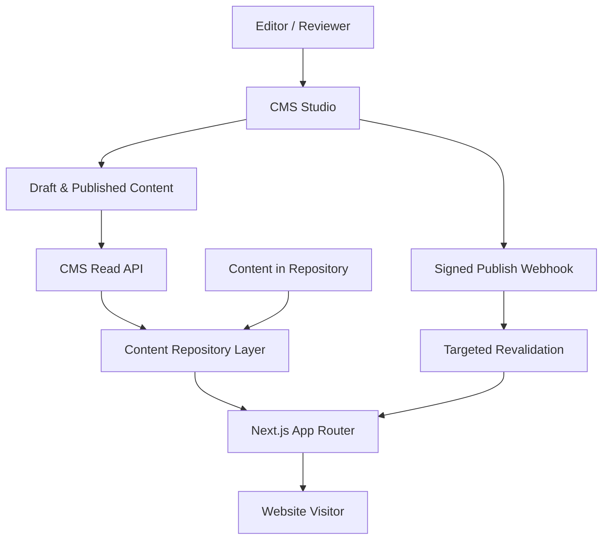
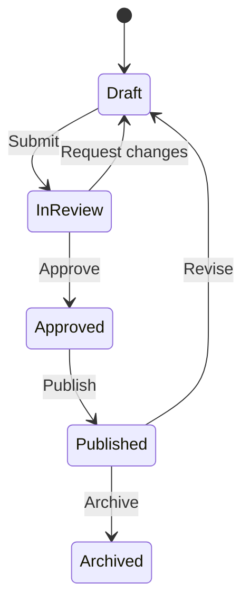

# CMS_ARCHITECTURE.md

## معماری CMS وب‌سایت آهن آسا

| مشخصه | مقدار |
|---|---|
| پروژه | Ahan Asa — آهن آسا |
| وضعیت سند | تصمیم معماری پیشنهادی |
| نسخه | 1.0 |
| تاریخ | 2026-08-25 |
| مالک تصمیم | Product / Engineering |
| اسناد مرتبط | `CONTENT_MODEL.md`، `DATA_ARCHITECTURE.md`، `TECHNICAL_ARCHITECTURE.md`، `SEO_STRATEGY.md`، `MEDIA_GUIDELINES.md`، `LOCALIZATION.md` |

---

## 1. تصمیم اجرایی

وب‌سایت آهن آسا در نسخه نخست نباید به‌طور کامل به CMS وابسته باشد. معماری مصوب، **Hybrid Headless CMS** است:

- ساختار فنی، Routeها، Componentها، فرم‌ها، قواعد تجاری، متن‌های حقوقی حساس و محتوای کم‌تغییر در مخزن کد نگهداری می‌شوند.
- محتوای تکرارشونده و قابل‌مدیریت توسط تیم محتوا—مانند مقالات، پروژه‌ها، پرسش‌های متداول و فایل‌های دانلودی—در صورت فعال‌شدن نیاز عملیاتی وارد CMS می‌شود.
- Frontend فقط از طریق یک لایه داخلی و Provider-agnostic به CMS متصل می‌شود؛ Componentها نباید مستقیماً به SDK یا Query Language یک CMS وابسته باشند.
- CMS پیشنهادی در صورت فعال‌سازی: **Sanity** به‌عنوان Headless CMS.
- سایت با Next.js App Router، رندر Static/ISR و بازاعتبارسنجی هدفمند پس از انتشار محتوا کار می‌کند.

> نتیجه: تا زمانی که انتشار محتوا محدود و تحت کنترل تیم توسعه است، CMS نصب نمی‌شود. معماری کد از روز اول برای اضافه‌شدن CMS آماده خواهد بود.

---

## 2. معیار تشخیص نیاز به CMS

CMS زمانی فعال شود که حداقل **دو مورد** از شرایط زیر برقرار باشد:

1. اعضای غیرتوسعه‌دهنده باید به‌صورت هفتگی محتوا منتشر یا اصلاح کنند.
2. انتشار مقاله، پروژه یا فایل دانلودی به چرخه منظم تبدیل شود.
3. بیش از یک نفر نیازمند Draft، Review و Approval باشد.
4. محتوای چندزبانه به‌صورت مستقل توسط مترجم یا مدیر بازار نگهداری شود.
5. Preview پیش از انتشار برای تیم مدیریت ضروری باشد.
6. زمان انتشار محتوا نباید به Commit و Deploy وابسته باشد.
7. تاریخچه تغییرات و بازگشت به نسخه قبلی به یک نیاز عملیاتی تبدیل شود.

### مواردی که به‌تنهایی دلیل کافی برای CMS نیستند

- ویرایش چند شماره تماس یا آدرس در سال
- داشتن یک فرم استعلام قیمت
- نمایش محصولات فولادی بدون قیمت‌گذاری و موجودی لحظه‌ای
- داشتن صفحات ثابت معرفی برند و خدمات
- نیاز به SEO؛ SEO خوب الزاماً به CMS وابسته نیست

---

## 3. اهداف معماری

- حفظ سرعت، امنیت و قابلیت Static Rendering سایت
- استقلال Frontend از Vendor و امکان تعویض CMS
- جلوگیری از تبدیل CMS به Page Builder بدون کنترل
- تفکیک روشن محتوای بازاریابی، داده تجاری و Leadها
- پشتیبانی آماده از فارسی RTL و زبان‌های آینده
- کنترل دقیق Metadata، Canonical، Hreflang و Structured Data
- Preview امن پیش از انتشار
- انتشار محتوا بدون Build کامل سایت
- حفظ یکپارچگی Design System و لحن برند

## 4. خارج از محدوده CMS

موارد زیر نباید در CMS ذخیره یا مدیریت شوند:

- اطلاعات فرم‌های کاربران و Leadها
- درخواست‌های RFQ و سوابق مذاکره
- قیمت لحظه‌ای آهن، موجودی، سفارش، فاکتور و پرداخت
- اطلاعات محرمانه تأمین‌کنندگان
- منطق محاسبات قیمت، وزن، حمل یا تخفیف
- Secretها، API Keyها و Environment Variableها
- Permissionهای اپلیکیشن و منطق Authentication
- CSS، Tokenهای طراحی و تنظیمات Responsive
- متن پیام‌های خطای امنیتی و Validation فرم‌ها

Leadها باید مستقیماً به CRM یا سرویس امن Lead Capture ارسال شوند. CMS پایگاه داده CRM نیست.

---

## 5. معماری کلان



### اصل جریان داده

1. محتوای ثابت از مخزن کد خوانده می‌شود.
2. محتوای Editorial از CMS در Server Component یا لایه Server-only خوانده می‌شود.
3. داده CMS قبل از تحویل به UI، Normalize و Validate می‌شود.
4. UI فقط Typeهای داخلی پروژه را می‌شناسد.
5. انتشار CMS یک Webhook امضاشده ایجاد می‌کند.
6. Webhook فقط Tagها یا Pathهای مرتبط را Revalidate می‌کند.

---

## 6. مرز مسئولیت منابع داده

| نوع داده | منبع اصلی | دلیل |
|---|---|---|
| Route و URL policy | مخزن کد | نیازمند کنترل فنی و Review |
| Header، Footer و Navigation | ابتدا مخزن کد؛ سپس CMS با Guardrail | جلوگیری از شکستن ناوبری |
| صفحه اصلی و صفحات Conversion | مخزن کد یا مدل محدود CMS | حساس به طراحی و نرخ تبدیل |
| خدمات و قابلیت‌های اصلی | Hybrid | ساختار در کد، محتوای قابل‌ویرایش در CMS |
| گروه‌های محصولات فولادی | CMS پس از فعال‌سازی | محتوای ساختاریافته و قابل توسعه |
| مقاله و Insight | CMS | انتشار مداوم و Workflow |
| پروژه و Case Study | CMS | Collection تکرارشونده |
| FAQ | CMS با Reference | استفاده مجدد در چند صفحه |
| فایل‌های دانلودی | CMS + Asset Storage | مدیریت عنوان، نسخه و Metadata |
| SEO Metadata | همان منبع محتوای صفحه | جلوگیری از دو منبع حقیقت |
| Redirectها | فایل نسخه‌بندی‌شده در مخزن | اثر فنی و SEO بالا |
| Lead و RFQ | CRM / Backend امن | حریم خصوصی و فرایند فروش |
| قیمت و موجودی | ERP/API اختصاصی | داده عملیاتی، نه Editorial |

---

## 7. انتخاب CMS

### انتخاب پیشنهادی: Sanity

علت انتخاب:

- Headless و سازگار با Next.js
- Schema-as-code و قابلیت Version Control برای مدل محتوا
- پشتیبانی مناسب از Preview و محتوای ساختاریافته
- Asset management و Reference بین اسناد
- امکان مدل‌سازی ترجمه در سطح Document
- Webhook برای بازاعتبارسنجی هدفمند
- امکان محدودکردن تجربه Editor به ساختار برند آهن آسا

### شرط مهم انتخاب

کد Frontend نباید به Sanity قفل شود. تمام Queryها و Mappingها داخل `lib/cms/providers/sanity/` باقی می‌مانند و بیرون از این پوشه فقط Interfaceهای داخلی پروژه مصرف می‌شوند.

### گزینه‌های جایگزین

| گزینه | زمان مناسب استفاده | ملاحظه |
|---|---|---|
| Content-as-Code | نسخه اولیه و تیم محتوای کوچک | ساده‌ترین و کم‌هزینه‌ترین مسیر |
| Sanity | انتشار منظم، Preview و چندزبانه | انتخاب پیش‌فرض این سند |
| Payload | نیاز جدی به Self-hosting و کنترل Backend | هزینه عملیات و نگهداری بیشتر |
| Directus | اتصال به دیتابیس موجود و مدل‌های relational | نیازمند مدیریت زیرساخت |

تعویض Provider فقط با ADR جدید و بدون تغییر Contractهای UI انجام شود.

---

## 8. قرارداد لایه CMS

Frontend فقط از قرارداد زیر استفاده می‌کند:

```ts
export interface ContentRepository {
  getSiteSettings(locale: Locale): Promise<SiteSettings>;
  getNavigation(locale: Locale): Promise<Navigation>;
  getPageBySlug(input: SlugInput): Promise<PageContent | null>;
  getServiceBySlug(input: SlugInput): Promise<Service | null>;
  getSteelCategoryBySlug(input: SlugInput): Promise<SteelCategory | null>;
  getArticleBySlug(input: SlugInput): Promise<Article | null>;
  listArticles(input: ArticleListInput): Promise<Paginated<ArticleCard>>;
  getProjectBySlug(input: SlugInput): Promise<Project | null>;
  listProjects(input: ProjectListInput): Promise<Paginated<ProjectCard>>;
  getFaqs(input: FaqQuery): Promise<FaqItem[]>;
}
```

### قواعد قرارداد

- نوع‌های خروجی در `types/content/` تعریف شوند، نه در پوشه Provider.
- خروجی Provider باید داده خام CMS را به مدل داخلی Normalize کند.
- `null`، خطای شبکه و سند ناقص باید رفتار مشخص داشته باشند.
- Queryها فقط فیلدهای موردنیاز را دریافت کنند.
- هیچ Token یا CMS Client در Client Component وارد نشود.
- Client Component فقط داده آماده نمایش دریافت کند.

---

## 9. مدل‌های محتوای CMS

### 9.1 مدل‌های Singleton

#### `siteSettings`

- `siteName`
- `legalName`
- `tagline`
- `defaultSeo`
- `contactChannels`
- `socialLinks`
- `officeLocations`
- `defaultOgImage`
- `organizationSchemaData`

#### `navigation`

- `locale`
- `primaryItems[]`
- `utilityItems[]`
- `primaryCta`
- `mobileMenuSettings`

#### `footer`

- `locale`
- `columns[]`
- `contactSummary`
- `legalLinks[]`
- `certifications[]`
- `copyrightText`

Singletonها باید با Document ID ثابت و Action حذف غیرفعال پیاده‌سازی شوند.

### 9.2 مدل‌های Collection

#### `page`

- `title`
- `slug`
- `locale`
- `translationGroupId`
- `pageType`
- `hero`
- `sections[]`
- `seo`
- `publicationSettings`

#### `service`

- `title`
- `slug`
- `locale`
- `shortDescription`
- `valueProposition`
- `scopeItems[]`
- `processSteps[]`
- `relatedCategories[]`
- `relatedProjects[]`
- `faqs[]`
- `cta`
- `seo`

#### `steelCategory`

این مدل برای معرفی گروه‌های کالایی است و نباید نقش موجودی یا فروشگاه لحظه‌ای را بازی کند.

- `name`
- `slug`
- `locale`
- `categoryType`
- `summary`
- `standards[]`
- `commonGrades[]`
- `commonDimensions[]`
- `applications[]`
- `procurementNotes`
- `qualityControlNotes`
- `relatedServices[]`
- `relatedArticles[]`
- `seo`

#### `project`

- `title`
- `slug`
- `locale`
- `clientDisplayName` — اختیاری و فقط با اجازه انتشار
- `location`
- `year`
- `industry`
- `scope`
- `challenge`
- `solution`
- `results[]`
- `metrics[]`
- `gallery[]`
- `relatedServices[]`
- `testimonial`
- `seo`

#### `article`

- `title`
- `slug`
- `locale`
- `excerpt`
- `coverImage`
- `author`
- `reviewer`
- `publishedAt`
- `updatedAt`
- `categories[]`
- `tags[]`
- `body`
- `relatedArticles[]`
- `relatedServices[]`
- `faqItems[]`
- `seo`

#### `faqItem`

- `question`
- `answer`
- `locale`
- `topic`
- `reviewedAt`
- `reviewedBy`

#### `downloadableAsset`

- `title`
- `locale`
- `assetType`
- `summary`
- `file`
- `version`
- `revisionDate`
- `thumbnail`
- `accessMode` — `public` یا `leadGate`
- `relatedCategories[]`
- `seo`

### 9.3 Objectهای مشترک

- `seoFields`
- `cta`
- `link`
- `responsiveImage`
- `metric`
- `address`
- `contactChannel`
- `publicationSettings`
- `contentSection`

تعریف دقیق Fieldها، Enumها و روابط باید با `CONTENT_MODEL.md` همگام بماند.

---

## 10. Page Builder محدود

CMS نباید امکان طراحی آزاد صفحه را به Editor بدهد. Editor فقط می‌تواند از Sectionهای تأییدشده استفاده کند:

1. `hero`
2. `introEditorial`
3. `serviceHighlights`
4. `categoryGrid`
5. `processSteps`
6. `proofMetrics`
7. `projectShowcase`
8. `testimonialQuote`
9. `faqGroup`
10. `richText`
11. `downloadBanner`
12. `ctaBand`

### محدودیت‌ها

- رنگ دلخواه، Font دلخواه و CSS داخل CMS ممنوع است.
- Editor فقط `themeVariant`های تعریف‌شده در Design System را انتخاب می‌کند.
- ترتیب Sectionها قابل تغییر است، اما ترکیب‌های ناسازگار با Validation رد می‌شوند.
- Hero هر صفحه فقط یک‌بار مجاز است.
- بیش از دو CTA اصلی در یک Section مجاز نیست.
- Nested Page Builder و Section تو‌در‌تو ممنوع است.
- محتوای Rich Text نباید Componentهای Layout را شبیه‌سازی کند.

صفحه اصلی و Landing Pageهای کلیدی بهتر است Template ثابت داشته باشند و فقط Slotهای محتوایی آنها از CMS تغذیه شود.

---

## 11. چندزبانه و RTL/LTR

### تصمیم

- فاز اول: فارسی با `fa` به‌عنوان Locale اصلی.
- معماری از ابتدا برای `en` و `ar` آماده است، اما فعال‌سازی هر زبان نیازمند محتوای واقعی و QA مستقل است.
- ترجمه در سطح **Document** انجام می‌شود، نه یک Object بزرگ شامل تمام زبان‌ها.
- هر ترجمه مستقل Draft و Publish می‌شود.

### فیلدهای لازم هر سند

- `locale: 'fa' | 'en' | 'ar'`
- `translationGroupId`
- `slug`
- `translationStatus: missing | draft | review | approved`

### قواعد

- فارسی در مسیر Canonical اصلی سایت قرار می‌گیرد.
- زبان‌های بعدی فقط پس از تصمیم `ROUTES.md` با Prefix فعال می‌شوند.
- Slug، Title، Description، OG و Alt Text برای هر زبان مستقل هستند.
- ترجمه خودکار بدون Review انسانی منتشر نمی‌شود.
- نبود ترجمه نباید باعث نمایش محتوای فارسی زیر URL زبان دیگر شود.
- `dir="rtl"` برای فارسی و عربی و `dir="ltr"` برای انگلیسی در Layout تعیین شود؛ Editor این مقدار را کنترل نمی‌کند.

---

## 12. SEO در CMS

Object مشترک `seoFields` شامل موارد زیر است:

```ts
type SeoFields = {
  metaTitle?: string;
  metaDescription?: string;
  canonicalPath?: string;
  robots: {
    index: boolean;
    follow: boolean;
  };
  openGraphTitle?: string;
  openGraphDescription?: string;
  openGraphImage?: CmsImage;
  structuredDataVariant?: string;
};
```

### قواعد SEO

- Canonical فقط Path یا URL متعلق به Domain مجاز را قبول کند.
- Slug در هر Locale یکتا باشد.
- تغییر Slug بدون ثبت Redirect ممنوع است.
- `noindex` با هشدار واضح در Studio نمایش داده شود.
- Metadata خالی از Defaultهای کنترل‌شده استفاده کند؛ از محتوای زبان دیگر کپی نشود.
- Schema.org توسط کد تولید شود؛ Editor فقط داده‌های معتبر را وارد کند.
- JSON-LD خام و آزاد داخل CMS ممنوع است.
- FAQ Schema فقط در صورت نمایش همان FAQ در صفحه تولید شود.
- Article و Project باید `publishedAt` و `updatedAt` معتبر داشته باشند.
- Sitemap فقط اسناد Published، Canonical و Indexable را دریافت کند.

تغییر Slug باید از طریق فرایندی انجام شود که مسیر قدیم را به `REDIRECTS.md` یا Registry کنترل‌شده Redirect اضافه کند.

---

## 13. Workflow انتشار



### قواعد Workflow

- نویسنده نباید محتوای حساس خود را بدون Review منتشر کند.
- صفحات اصلی، خدمات، اطلاعات حقوقی و ادعاهای تجاری به تأیید مدیر محتوا نیاز دارند.
- پروژه‌هایی که نام یا تصویر مشتری دارند، نیازمند تأیید مجوز انتشار هستند.
- تغییر `robots`, `canonicalPath`, Navigation و CTA اصلی نیازمند Review ویژه است.
- حذف محتوا با Unpublish/Archive انجام شود؛ Delete دائمی فقط برای Admin.
- انتشار گروهی برای Campaignها باید در Preview بررسی شود.

### نقش‌ها

| نقش | دسترسی |
|---|---|
| Admin | مدیریت کامل پروژه و کاربران |
| Developer | Schema، Integration و تنظیمات فنی |
| Managing Editor | تأیید و انتشار همه محتوا |
| Editor | ایجاد و ویرایش محتوای مجاز |
| Translator | ویرایش Locale تخصیص‌یافته |
| Reviewer | Comment و Approval بدون تغییر فنی |

قابلیت دقیق Roleها باید با پلن CMS تطبیق داده شود. در صورت محدودیت پلن، تعداد کاربران و دسترسی‌ها محدودتر شود؛ کنترل امنیتی نباید صرفاً با قرارداد شفاهی جایگزین شود.

---

## 14. Preview و Draft Mode

Preview باید با Draft Mode در Next.js پیاده‌سازی شود.

### جریان Preview

1. Editor از Studio گزینه Preview را انتخاب می‌کند.
2. CMS به Endpoint امن `/api/draft/enable` درخواست می‌فرستد.
3. Endpoint، Secret و مقصد را اعتبارسنجی می‌کند.
4. Draft Mode Cookie امن فعال می‌شود.
5. صفحه با Perspective پیش‌نویس و Token فقط‌خواندنی Server-side نمایش داده می‌شود.
6. خروج از Preview از `/api/draft/disable` انجام می‌شود.

### الزامات امنیتی

- Preview Secret فقط در Environment Variable نگهداری شود.
- Redirect مقصد فقط از Allowlist مسیرهای داخلی پذیرفته شود.
- Open Redirect ممنوع است.
- Draft Token هرگز به Browser Bundle نرسد.
- صفحات Preview نباید Cache عمومی شوند.
- Preview URL در Analytics به‌عنوان ترافیک واقعی ثبت نشود.

---

## 15. انتشار، Cache و Revalidation

### حالت پیش‌فرض

- صفحات عمومی با Static Rendering یا ISR تولید شوند.
- داده عمومی Published می‌تواند از CDN خوانده شود.
- داده Draft فقط Server-side و بدون CDN عمومی خوانده شود.
- هر Query دارای Cache Tag قابل پیش‌بینی باشد.

### الگوی Tagها

```text
cms:all
cms:settings:{locale}
cms:navigation:{locale}
cms:page:{locale}:{slug}
cms:service:{locale}:{slug}
cms:steel-category:{locale}:{slug}
cms:article:{locale}:{slug}
cms:article-list:{locale}
cms:project:{locale}:{slug}
cms:project-list:{locale}
```

### Webhook انتشار

- Endpoint: `/api/cms/revalidate`
- Method: `POST`
- Webhook باید Signature/Secret معتبر داشته باشد.
- Payload فقط Type، ID، Locale، Slug قبلی و Slug جدید را ارسال کند.
- Endpoint بر اساس Type، Tagهای جزئی و فهرست مرتبط را با `revalidateTag` با semantics سازگار با نسخه Next.js پروژه منقضی کند.
- در تغییر Slug، Path قدیم و جدید هر دو Revalidate شوند.
- در تغییر داده Global، Tagهای Settings یا Navigation تمام Localeهای مربوط را منقضی کنند.
- پاسخ Webhook نباید Secret یا جزئیات داخلی را افشا کند.

### سیاست Fallback

- اگر CMS موقتاً در دسترس نبود، نسخه Cache‌شده قبلی نمایش داده شود.
- اختلال CMS نباید صفحه اصلی Published را از دسترس خارج کند.
- محتوای اختیاری ناقص مخفی شود؛ محتوای اجباری ناقص نباید Publish شود.
- خطاهای CMS در Logging ثبت شوند، اما متن داخلی خطا به کاربر نمایش داده نشود.

---

## 16. Asset و Media

هر Image در CMS باید این داده‌ها را داشته باشد:

- Asset reference
- `alt` مستقل برای هر Locale
- Caption اختیاری
- Credit/License در صورت نیاز
- Focal point / hotspot
- Width و Height قابل استخراج
- Asset purpose یا usage tag

### قواعد Media

- آپلود تصویر بدون Alt برای محتوای معنادار ممنوع است.
- تصاویر تزئینی با `decorative: true` و Alt خالی مشخص شوند.
- فایل SVG آپلودشده توسط Editor فقط پس از Sanitization مجاز است.
- ویدئوی سنگین مستقیماً از CMS تحویل نشود؛ از سرویس ویدئو یا Storage/CDN مناسب استفاده شود.
- PDFها باید Title، Version، Date، Language و File Size داشته باشند.
- نام فایل‌ها انگلیسی، کوتاه، lowercase و بدون فاصله باشد.
- Crop و Resize در Delivery Layer انجام شود؛ فایل اصلی فقط یک بار ذخیره شود.
- Component تصویر باید ابعاد، `sizes`، Lazy Loading و Format بهینه را کنترل کند.

---

## 17. Validation محتوا

### Validation اجباری

- Title، Slug، Locale و وضعیت انتشار
- یکتایی Slug در هر Locale و Type
- طول منطقی Title و Meta Description با Warning، نه برش خودکار
- عدم استفاده از URL خارجی برای لینک‌های داخلی
- ممنوعیت `javascript:` و Protocolهای ناامن
- وجود Alt برای تصاویر معنادار
- وجود CTA label و destination با هم
- وجود تاریخ و نویسنده برای Article
- حداقل یک نتیجه یا شاهد معتبر برای Project منتشرشده
- ممنوعیت Publish ترجمه با `translationStatus != approved`
- عدم انتخاب یک سند به‌عنوان Related Content خودش
- کنترل Reference شکسته پیش از Publish

### Validation دامنه آهن آسا

- ادعای قیمت قطعی بدون تاریخ، منبع و Disclaimer منتشر نشود.
- ادعای استاندارد، گرید یا کیفیت باید قابل استناد و تأییدشده باشد.
- نام تأمین‌کننده یا مشتری بدون مجوز انتشار وارد نشود.
- اعداد پروژه باید Unit مشخص داشته باشند.
- CTAهای خرید نباید القای فروشگاه آنلاین کنند، مگر زیرساخت واقعی آن فعال باشد.

---

## 18. امنیت و حریم خصوصی

- Dataset عمومی فقط شامل محتوای قابل انتشار باشد.
- Write Token و Preview Token فقط Server-side نگهداری شوند.
- Tokenها حداقل Permission لازم را داشته باشند.
- CORS فقط برای Domainهای شناخته‌شده Studio و Website تنظیم شود.
- Webhook با Secret و Signature validation محافظت شود.
- Rate limiting روی Endpointهای Preview و Revalidation اعمال شود.
- PII، Lead، قرارداد، قیمت خرید و اطلاعات محرمانه در CMS ذخیره نشود.
- Logها نباید Token، Payload حساس یا محتوای Draft محرمانه را ثبت کنند.
- Dependencyها و CMS SDK در چرخه نگهداری امنیتی پروژه قرار گیرند.
- دسترسی کاربران پس از تغییر نقش یا خروج از همکاری فوراً لغو شود.
- Backup/Export دوره‌ای متناسب با نرخ تغییر محتوا تعریف شود.

---

## 19. Performance

- Queryها Projection حداقلی داشته باشند.
- فهرست‌ها نباید Body کامل مقاله یا Project را Fetch کنند.
- Pagination اجباری است؛ دریافت تمام اسناد در Runtime ممنوع است.
- Referenceها به‌صورت Batch resolve شوند و N+1 Query ایجاد نکنند.
- تصاویر با Pipeline استاندارد Next.js و URL Builder امن تحویل شوند.
- Rich Text فقط با Renderer allowlisted رندر شود.
- Componentهای CMS تا حد ممکن Server Component باقی بمانند.
- Hydration فقط برای Interactionهای واقعی انجام شود.
- تغییر محتوای یک سند نباید باعث Purge کامل Cache سایت شود.
- `cms:all` فقط در Migration یا تغییر Schema عمده استفاده شود.

### بودجه پیشنهادی

| معیار | هدف |
|---|---|
| Query صفحه جزئیات | حداکثر 1 Query اصلی + Batch references |
| Payload محتوای اولیه | فقط داده موردنیاز Above-the-fold و صفحه |
| Revalidation | کمتر از 60 ثانیه تا مشاهده نسخه Published |
| CMS dependency در Client bundle | صفر برای صفحات غیرتعاملی |
| Full-site rebuild برای تغییر Editorial | غیرضروری |

---

## 20. ساختار پوشه پیشنهادی

```text
src/
├── app/
│   ├── api/
│   │   ├── cms/revalidate/route.ts
│   │   └── draft/
│   │       ├── enable/route.ts
│   │       └── disable/route.ts
│   └── ...
├── components/
│   └── content/
│       ├── section-renderer.tsx
│       └── sections/
├── content/
│   ├── static/
│   └── defaults/
├── lib/
│   └── cms/
│       ├── index.ts
│       ├── contract.ts
│       ├── cache-tags.ts
│       ├── normalize.ts
│       ├── validation.ts
│       └── providers/
│           ├── local/
│           └── sanity/
│               ├── client.ts
│               ├── queries.ts
│               ├── repository.ts
│               └── image.ts
├── sanity/
│   ├── schemaTypes/
│   │   ├── documents/
│   │   ├── objects/
│   │   └── index.ts
│   ├── structure/
│   └── validation/
└── types/
    └── content/
```

اگر Studio در همان Repository میزبانی شود، پوشه `sanity/` حفظ می‌شود. اگر تیم و چرخه انتشار جدا شد، Studio می‌تواند به Repository مستقل منتقل شود، بدون تغییر Contract داخلی Frontend.

---

## 21. Environment Variableها

```text
CMS_PROVIDER=local|sanity
NEXT_PUBLIC_SANITY_PROJECT_ID=
NEXT_PUBLIC_SANITY_DATASET=
NEXT_PUBLIC_SANITY_API_VERSION=
SANITY_READ_TOKEN=
SANITY_PREVIEW_TOKEN=
SANITY_WEBHOOK_SECRET=
DRAFT_MODE_SECRET=
```

### قواعد

- هیچ مقدار واقعی در Git Commit نشود.
- متغیرهای `NEXT_PUBLIC_*` فقط شامل شناسه‌های غیرمحرمانه باشند.
- Production، Preview و Development از Dataset یا تنظیمات محیطی مشخص استفاده کنند.
- نام API Version ثابت و صریح باشد؛ استفاده از تاریخ جاری در Runtime ممنوع است.
- نبود Environment Variable ضروری باید در Startup/Build با پیام واضح Fail شود.

---

## 22. محیط‌ها و Datasetها

### پیشنهاد اولیه

| محیط | Dataset | کاربرد |
|---|---|---|
| Local Development | `development` | تست Schema و داده نمونه |
| Preview/Staging | `staging` یا Dataset مشترک با Draft perspective | QA محتوا و Integration |
| Production | `production` | محتوای Published عمومی |

برای تیم کوچک، دو Dataset `development` و `production` کافی است. اضافه‌کردن Staging فقط وقتی انجام شود که Release Workflow آن را توجیه کند.

انتقال Schema بین محیط‌ها از طریق Git انجام می‌شود؛ انتقال محتوا باید با Export/Import کنترل‌شده و ثبت‌شده باشد.

---

## 23. Migration و فعال‌سازی مرحله‌ای

### Phase 0 — بدون CMS

- پیاده‌سازی `ContentRepository`
- استفاده از Provider محلی
- ذخیره محتوا در TypeScript/JSON/MDX کنترل‌شده
- تثبیت Routeها، SEO و Componentها

### Phase 1 — Pilot CMS

- ایجاد Project و Dataset
- پیاده‌سازی Schemaهای پایه
- انتقال `article` و `project`
- پیاده‌سازی Preview و Webhook
- آموزش یک Editor و یک Reviewer

### Phase 2 — محتوای سازمانی

- انتقال FAQ، Downloadها و Steel Categoryها
- فعال‌سازی Localization در سطح Document
- افزودن Workflow و Validation پیشرفته

### Phase 3 — بهینه‌سازی

- داشبورد سلامت محتوا
- گزارش اسناد بدون ترجمه یا Metadata
- Scheduled/Release publishing در صورت نیاز عملیاتی و پشتیبانی پلن
- اتصال کنترل‌شده به Analytics برای سنجش عملکرد محتوا

### ترتیب Migration هر Collection

1. نهایی‌کردن Schema
2. ساخت Mapping از مدل قبلی
3. Export و Backup
4. Import به Development
5. Validation تعداد و Referenceها
6. QA بصری و SEO
7. Import Production
8. فعال‌سازی Provider CMS
9. Revalidation
10. ثبت نتیجه در `CHANGELOG.md`

---

## 24. قابلیت خروج و جلوگیری از Vendor Lock-in

- تمام مدل‌های عمومی در TypeScript مستقل تعریف شوند.
- CMS SDK فقط در Provider مربوط استفاده شود.
- Rich Text به یک AST داخلی محدود یا Renderer جداگانه Map شود.
- Asset metadata و URL اصلی قابل Export باشد.
- Export کامل Dataset و فایل‌ها دوره‌ای انجام شود.
- IDهای CMS نباید در URL عمومی استفاده شوند.
- Routeها از Slug و Registry داخلی تولید شوند.
- هیچ Component نمایشی Query خام CMS اجرا نکند.
- تغییر Provider باید فقط Repository implementation و Migration را درگیر کند.

---

## 25. Logging و Monitoring

موارد زیر ثبت شوند:

- شکست Query CMS
- Timeout و Rate-limit
- خطای Preview
- Webhook نامعتبر یا تکراری
- نتیجه Revalidation بدون ثبت Secret
- سند Published با داده ناقص که از Validation عبور کرده است
- Reference شکسته
- Image delivery failure

### Alertهای ضروری

- چند شکست متوالی Webhook
- عدم نمایش محتوای Published پس از SLA تعریف‌شده
- افزایش خطاهای CMS در Production
- انقضای Token یا Permission error
- شکست Sitemap generation یا Structured Data generation مرتبط با CMS

---

## 26. تست و QA

### Unit Test

- Normalizerها و Mapperها
- Cache tag generation
- Slug و URL validation
- SEO fallbackها
- Locale resolution
- Rich Text renderer allowlist

### Integration Test

- خواندن Published content
- خواندن Draft content فقط در Preview
- ردکردن Webhook نامعتبر
- Revalidation سند، فهرست و Route مرتبط
- رفتار Not Found برای Slug نامعتبر
- رفتار Fallback هنگام قطع CMS

### Content QA

- Preview Desktop، Tablet و Mobile
- RTL فارسی و عربی
- LTR انگلیسی
- Heading hierarchy
- Alt text و Caption
- Internal links و Related content
- Metadata، Canonical و Hreflang
- Structured Data
- تاریخ‌ها، اعداد و واحدها
- CTA و مقصد آن

### Regression Test

- تغییر Navigation
- تغییر Slug
- Unpublish مقاله یا پروژه
- حذف Asset استفاده‌شده
- انتشار ترجمه ناقص
- تغییر Schema با داده قدیمی

---

## 27. معیار پذیرش پیاده‌سازی CMS

CMS فقط زمانی آماده Production است که همه موارد زیر برقرار باشد:

- [ ] `ContentRepository` مستقل از Provider پیاده‌سازی شده است.
- [ ] هیچ CMS Token در Client Bundle وجود ندارد.
- [ ] Draft Preview امن کار می‌کند.
- [ ] Webhook امضاشده، انتشار را بدون Deploy کامل منعکس می‌کند.
- [ ] Cache فقط برای محتوای مرتبط Revalidate می‌شود.
- [ ] اسناد ناقص قابل Publish نیستند.
- [ ] Slug در هر Locale یکتا است.
- [ ] تغییر Slug فرایند Redirect مشخص دارد.
- [ ] Metadata و Sitemap فقط از Published content استفاده می‌کنند.
- [ ] JSON-LD از داده ساختاریافته و کنترل‌شده تولید می‌شود.
- [ ] UI بدون داده CMS حیاتی از کار نمی‌افتد.
- [ ] نقش‌ها و حداقل دسترسی اعمال شده‌اند.
- [ ] Backup/Export آزمایش شده است.
- [ ] راهنمای Editor نوشته شده است.
- [ ] سناریوهای RTL/LTR و چندزبانه QA شده‌اند.
- [ ] هیچ Lead یا PII در CMS ذخیره نمی‌شود.
- [ ] تست Provider محلی و Provider CMS هر دو موفق‌اند.

---

## 28. قوانین قطعی برای Claude Code

Claude Code هنگام پیاده‌سازی باید این قواعد را رعایت کند:

1. قبل از نصب CMS، وجود Triggerهای بخش 2 را بررسی کند.
2. بدون تصمیم ثبت‌شده، محتوای ثابت را به CMS منتقل نکند.
3. SDK و Queryهای CMS را خارج از Provider وارد نکند.
4. Schema را بدون هماهنگی با `CONTENT_MODEL.md` تغییر ندهد.
5. Field یا Section با کنترل مستقیم Style ایجاد نکند.
6. Secret، Token یا Dataset خصوصی را در کد Client قرار ندهد.
7. Preview و Revalidation را بدون Validation امنیتی پیاده‌سازی نکند.
8. هنگام تغییر Slug، Redirect و SEO impact را بررسی کند.
9. CMS را برای ذخیره فرم‌ها، Leadها، قیمت و موجودی استفاده نکند.
10. قبل از Migration از Dataset Export بگیرد.
11. هر تغییر Schema یا Migration را در `CHANGELOG.md` ثبت کند.
12. برای هر مدل جدید، Type، Validation، Query، Mapper و Test اضافه کند.
13. هیچ Document منتشرشده را با Script بدون Dry Run و Backup حذف نکند.
14. در صورت نبود CMS، Provider محلی و Build سایت باید همچنان کار کنند.

---

## 29. تصمیم نهایی

برای آهن آسا، CMS یک **زیرساخت اختیاری و مرحله‌ای** است، نه پیش‌نیاز شروع طراحی و توسعه. نسخه اولیه با Content-as-Code و یک `ContentRepository` مستقل ساخته می‌شود. پس از شکل‌گیری نیاز واقعی Editorial، Sanity ابتدا فقط برای Article و Project فعال می‌شود و سپس به Collectionهای دیگر گسترش می‌یابد.

این تصمیم سه مزیت اصلی دارد:

1. سرعت بیشتر در راه‌اندازی نسخه اول
2. کاهش هزینه و پیچیدگی عملیاتی
3. آمادگی برای توسعه تیم محتوا بدون بازنویسی Frontend

---

## 30. منابع فنی رسمی

- [Next.js — Revalidating cached data](https://nextjs.org/docs/app/getting-started/revalidating)
- [Next.js — `revalidateTag`](https://nextjs.org/docs/app/api-reference/functions/revalidateTag)
- [Next.js — Backend for Frontend and CMS webhooks](https://nextjs.org/docs/app/guides/backend-for-frontend)
- [Sanity — Localization](https://www.sanity.io/docs/studio/localization)
- [Sanity — Content Releases configuration](https://www.sanity.io/docs/studio/content-releases-configuration)
- [Sanity — Content operators guide](https://www.sanity.io/docs/user-guides/content-operations-cheatsheet)

