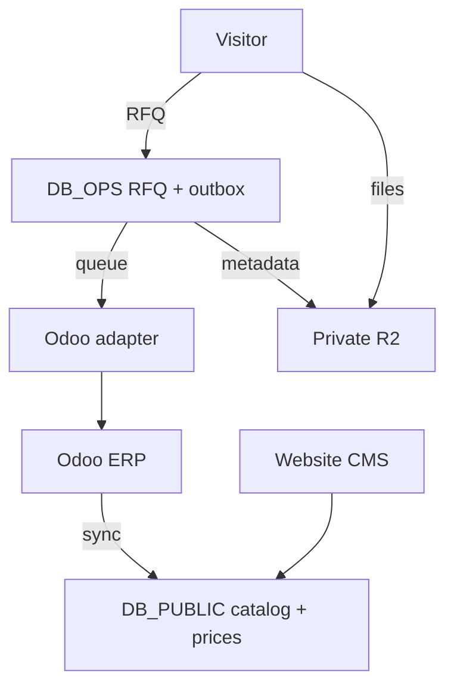

# Ahan Asa Website — Database Schema

> **Brand:** Ahan Asa | آهن آسا  
> **Domain:** `https://ahanassa.com`  
> **ERP:** `https://odoo.ahanassa.com`  
> **Document:** `DATABASE_SCHEMA.md`  
> **Status:** Implementation baseline v2.0  
> **Last updated:** 2026-08-25  
> **Primary database:** Cloudflare D1  
> **Object storage:** Cloudflare R2  
> **Asynchronous integration:** Cloudflare Queues  
> **Primary locale:** Persian (`fa-IR`), fully RTL

---

## 1. Purpose

This document defines the physical and logical database schema for the Ahan Asa website. It is the implementation contract for:

- public content and SEO data;
- the steel catalog read model;
- public price snapshots and price history;
- structured and file-based RFQs;
- staff users, roles, and permissions;
- auditability, consent, retention, and deletion;
- reliable Website ↔ Odoo synchronization;
- idempotency, retry, and failure recovery;
- Cloudflare D1 migrations, indexes, and query rules.

This schema is deliberately not a second ERP. Odoo owns commercial operations; the website database owns web content, durable website submissions, and fast public read models.

> **Odoo is the commercial system of record. D1 is the website system of record and the public read model. Public rendering must never depend on a live Odoo request.**

This document must be implemented together with:

- `DATA_ARCHITECTURE.md`;
- `SYSTEM_OF_RECORD.md`;
- `ODOO_INTEGRATION.md`;
- `SYNC_STRATEGY.md`;
- `ERP_DATA_MAPPING.md`;
- `RFQ_SYSTEM.md`;
- `PRODUCT_CATALOG_SPEC.md`;
- `PRICING_SYSTEM.md`;
- `AUTHORIZATION_ROLES.md`;
- `SECURITY_GUIDELINES.md`;
- `FAILURE_RECOVERY.md`.

If an older document says that the website has no database, uses PostgreSQL as the default, deploys only on Vercel, or excludes catalog/pricing/RFQ persistence, that statement is superseded by the approved Cloudflare + Odoo architecture described here.

---

## 2. Binding Architecture Decisions

### 2.1 Production uses two D1 databases

Use two separate D1 databases in production:

| Binding | Suggested database name | Contains | Must not contain |
|---|---|---|---|
| `DB_PUBLIC` | `ahanasa-public-prod` | Articles, catalog, SEO content, public price snapshots, public media metadata | Visitor PII, RFQ messages, private attachments, secrets |
| `DB_OPS` | `ahanasa-ops-prod` | RFQs, contacts, attachment metadata, consent, admin access, audit, integration outbox/inbox | Public page bodies or file bytes |

Reasons:

- a public query path cannot accidentally expose RFQ data;
- operational access can be restricted independently;
- backup, retention, and incident response differ by data class;
- public reads and confidential writes have different scaling patterns;
- a public-data export cannot include personal or commercially sensitive data.

D1 does not provide foreign keys across databases. Therefore `DB_OPS.rfq_items` stores immutable catalog snapshots and optional public entity IDs, but does not declare cross-database foreign keys.

Local development may use two local D1 databases. A one-database shortcut is not an approved production configuration.

### 2.2 R2 stores bytes; D1 stores metadata

Two R2 buckets are required:

| Bucket | Access | Use |
|---|---|---|
| `MEDIA_PUBLIC` | Public/CDN-controlled | Approved article and catalog media |
| `RFQ_PRIVATE` | Private | Customer PDFs, spreadsheets, images, BOQs, and purchase lists |

File bytes, base64 payloads, and large rich-text blobs must not be stored in D1. Private object keys must be random and non-semantic. Original filenames may exist only in confidential metadata and must never be used as R2 keys.

### 2.3 Queues decouple Odoo

RFQ submission follows this sequence:

```text
Validate request
→ write RFQ + items + consent + outbox event in DB_OPS
→ acknowledge the customer
→ publish/dispatch the outbox event
→ Queue consumer calls the Odoo adapter
→ record mapping and sync result
```

The browser never calls Odoo. Odoo availability must not determine whether a valid RFQ is accepted by the website.

### 2.4 Odoo remains authoritative for commercial facts

| Domain | Authoritative system | D1 responsibility |
|---|---|---|
| Products and variants | Odoo | Fast public projection + SEO linkage |
| Units of measure | Odoo | Public projection |
| Commercial prices/pricelists | Odoo | Public snapshot and append-only history |
| Customer/contact after qualification | Odoo | Durable submission snapshot and mapping |
| CRM lead/opportunity | Odoo | RFQ source record and sync state |
| Quotation, sale order, inventory, purchase, accounting | Odoo | No duplicate operational implementation |
| Articles and editorial SEO content | Website CMS/D1 | Authoritative website record |
| Product SEO content | Website CMS/D1 | Authoritative website record |
| RFQ received from website | Website D1 at intake; Odoo after handoff | Durable intake, audit, recovery, status mirror |
| Attachment bytes | Private R2 | D1 stores metadata; Odoo may store/link an approved copy |

### 2.5 No unsupported public claims

A catalog or price record may be stored while unpublished. Public pages must show only records that are explicitly publishable, current enough for the configured policy, and supported by real Odoo or approved editorial data. The schema must never be used to fabricate price, stock, availability, ratings, brands, or specifications.

---

## 3. D1 Storage Conventions

### 3.1 Types

D1 uses SQLite semantics. Use these project-level conventions:

| Domain type | D1 type | Rule |
|---|---|---|
| Internal ID | `TEXT` | 26-character ULID generated by the server |
| Odoo record ID | `INTEGER` | Nullable until synchronized |
| Boolean | `INTEGER` | `0` or `1` with a `CHECK` constraint |
| Timestamp | `TEXT` | UTC ISO 8601, e.g. `2026-08-25T14:30:00.000Z` |
| Calendar date | `TEXT` | ISO `YYYY-MM-DD` |
| Enum | `TEXT` | Explicit `CHECK (...)` constraint |
| Money | `INTEGER` | Minor units; never `REAL` |
| Decimal quantity | `INTEGER` + scale | `value × 10^-scale`; never floating-point business math |
| JSON | `TEXT` | Only for genuinely variable payloads and guarded by `json_valid()` |
| Long body | `TEXT` | Structured JSON blocks; enforce size in application validation |

### 3.2 Naming

- Table names are plural `snake_case`.
- Primary keys are `id`.
- Foreign keys are `<entity>_id`.
- UTC timestamps end in `_at`.
- Dates end in `_date`.
- Boolean columns start with `is_`, `has_`, or `can_`.
- External system fields use an explicit prefix such as `odoo_*`.
- Indexes use `idx_<table>_<columns>`.
- Unique indexes use `uq_<table>_<columns>`.

### 3.3 Identifier rules

- Server-generated ULIDs are used for local IDs because they are non-sequential to visitors, sortable, and safe to generate at the edge.
- The customer-facing RFQ reference is separate from the primary key, for example `AA-RFQ-01K...`.
- Odoo integer IDs are mappings, never local primary keys.
- Slugs are not primary keys and may change through a controlled redirect workflow.
- Public IDs must not reveal RFQ counts or business volume.

### 3.4 Time and locale

- Store all timestamps in UTC.
- Format Jalali dates only at the presentation layer.
- Store locale as BCP-47-compatible project codes: `fa`, later `en` or `ar`.
- Store Persian and Arabic text as normalized UTF-8; normalize user input in the application, not through destructive SQL transforms.

### 3.5 Monetary and quantity precision

Do not use `REAL` for money or order quantities.

Example:

```text
quantity_value = 4500
quantity_scale = 3
displayed quantity = 4.500

amount_minor = 678500
currency_code = IRR
minor_unit_scale = 0
```

The application owns decimal parsing and formatting. A unit conversion is applied only when an approved conversion exists; `kg`, `ton`, `piece`, `sheet`, `bundle`, and `branch` are not assumed interchangeable.

---

## 4. Schema Overview



### 4.1 `DB_PUBLIC` table groups

```text
Editorial
  article_categories
  articles
  article_category_links
  public_media

Catalog
  catalog_categories
  catalog_products
  product_variants
  units
  attribute_definitions
  attribute_values
  variant_attribute_values
  product_seo_contents

Pricing
  public_prices
  price_history

Operations support
  sync_checkpoints
  cache_invalidation_events
```

### 4.2 `DB_OPS` table groups

```text
RFQ
  rfqs
  rfq_contacts
  rfq_items
  rfq_attachments
  rfq_status_history
  consent_records

Authorization
  staff_users
  roles
  permissions
  staff_user_roles
  role_permissions
  staff_sessions

Integration
  integration_outbox
  integration_attempts
  integration_mappings
  integration_inbox
  dead_letter_records

Governance
  audit_logs
  data_erasure_requests
```

---

## 5. `DB_PUBLIC` Schema

### 5.1 Editorial tables

#### `article_categories`

| Column | Type | Required | Notes |
|---|---|---:|---|
| `id` | TEXT | Yes | ULID |
| `stable_key` | TEXT | Yes | Immutable machine key |
| `locale` | TEXT | Yes | Phase 1: `fa` |
| `name` | TEXT | Yes | Display name |
| `slug` | TEXT | Yes | Locale-aware unique slug |
| `description` | TEXT | No | Category intro |
| `status` | TEXT | Yes | `draft`, `published`, `archived` |
| `created_at`, `updated_at` | TEXT | Yes | UTC |

#### `articles`

The website CMS is authoritative for articles. Odoo is not used as the article CMS.

| Column | Type | Required | Notes |
|---|---|---:|---|
| `id` | TEXT | Yes | ULID |
| `stable_key` | TEXT | Yes | Shared across future locales |
| `locale` | TEXT | Yes | Locale variant |
| `title`, `slug`, `excerpt` | TEXT | Yes | Public fields |
| `body_json` | TEXT | Yes | Validated structured content blocks |
| `status` | TEXT | Yes | Editorial lifecycle |
| `author_user_ref` | TEXT | No | Non-PII staff reference; no cross-DB FK |
| `featured_media_id` | TEXT | No | FK to `public_media` |
| `seo_title`, `seo_description` | TEXT | No | Server-rendered metadata |
| `canonical_override` | TEXT | No | Normally null |
| `robots_index`, `robots_follow` | INTEGER | Yes | Explicit SEO controls |
| `published_at`, `scheduled_at` | TEXT | No | UTC |
| `content_revision` | INTEGER | Yes | Optimistic editing/version key |
| `created_at`, `updated_at` | TEXT | Yes | UTC |

Article bodies must not contain executable MDX, raw script, inline event handlers, or unsanitized HTML.

#### `public_media`

Stores metadata for approved public files in R2 or the approved image pipeline.

Important columns:

- `object_key` — immutable R2 key;
- `mime_type`, `byte_size`, `width`, `height`;
- `alt_text`, `caption`, `rights_status`;
- `checksum_sha256`;
- `status`: `processing`, `ready`, `blocked`, `archived`;
- `created_by_user_ref`, `created_at`, `updated_at`.

It must not contain private RFQ files.

### 5.2 Catalog tables

#### `catalog_categories`

Hierarchical website taxonomy such as rebar, beam, sheet, pipe, profile, and related steel groups.

| Column | Type | Required | Notes |
|---|---|---:|---|
| `id` | TEXT | Yes | Local stable ID |
| `odoo_id` | INTEGER | No | Odoo category mapping |
| `external_id` | TEXT | No | Odoo XML/external ID where available |
| `parent_id` | TEXT | No | Self-reference |
| `stable_key` | TEXT | Yes | Immutable machine key |
| `name_fa` | TEXT | Yes | Commercial display name |
| `slug_fa` | TEXT | Yes | Public slug |
| `sort_order` | INTEGER | Yes | Stable manual ordering |
| `is_active`, `is_public` | INTEGER | Yes | Separate commercial/public flags |
| `sync_status` | TEXT | Yes | Odoo projection status |
| `source_updated_at`, `last_synced_at` | TEXT | No | Change detection |
| `created_at`, `updated_at` | TEXT | Yes | UTC |

#### `catalog_products`

Represents an Odoo `product.template` projection, not a full inventory record.

Key columns:

- `category_id`;
- `odoo_id`, `external_id`, `odoo_write_date`;
- `internal_code` and optional public `sku`;
- `name_fa`, `short_name_fa`, `slug_fa`;
- `product_type`;
- `default_unit_id`;
- `is_active`, `is_public`, `is_price_public`;
- `sync_status`, `sync_version`, `last_synced_at`;
- `created_at`, `updated_at`.

Supplier cost, purchase terms, stock quantities, accounting accounts, and internal margins must not be copied into `DB_PUBLIC`.

#### `product_variants`

Represents an Odoo `product.product` projection.

Key columns:

- `product_id`;
- `odoo_id`, `external_id`, `odoo_write_date`;
- `variant_code`, optional public `sku`;
- `name_fa`, optional `slug_fa`;
- `default_unit_id`;
- `is_active`, `is_public`, `is_price_public`;
- `sync_status`, `sync_version`, `last_synced_at`.

#### `units`

Represents the public subset of Odoo units of measure.

Examples: kilogram, ton, meter, square meter, piece, sheet, branch, bundle.

Each unit stores:

- stable `code`;
- `name_fa`, `symbol_fa`;
- Odoo ID/external ID;
- `unit_group`;
- precision rules;
- public and active flags;
- synchronization metadata.

No conversion is inferred from the name. Conversions belong in Odoo and are copied only when explicitly approved for website calculations.

#### Attribute tables

`attribute_definitions`, `attribute_values`, and `variant_attribute_values` model flexible steel attributes without adding a column for every future property.

Examples:

| Attribute | Example values |
|---|---|
| standard/grade | `A3`, `ST37`, `ST52` |
| section type | `IPE`, `IPB`, `UNP` |
| size | `16`, `18`, `20` |
| thickness | `2 mm`, `10 mm` |
| width/length | controlled numeric values and units |
| manufacturer/origin | only when approved for publication |

Attribute values store normalized machine values separately from Persian display labels. Numeric comparisons use integer value + scale, not localized display strings.

#### `product_seo_contents`

Commercial product identity comes from Odoo; SEO content comes from the website.

| Column | Type | Required | Notes |
|---|---|---:|---|
| `id` | TEXT | Yes | ULID |
| `entity_type` | TEXT | Yes | `category`, `product`, `variant`, `price_page` |
| `entity_id` | TEXT | Yes | Public entity ID |
| `locale` | TEXT | Yes | Phase 1 `fa` |
| `slug` | TEXT | Yes | Canonical public slug |
| `h1`, `intro`, `body_json` | TEXT | No | Editorial content |
| `seo_title`, `seo_description` | TEXT | No | Metadata |
| `faq_json` | TEXT | No | Visible FAQ content; schema only when eligible |
| `index_status` | TEXT | Yes | `index`, `noindex`, `draft` |
| `content_quality_status` | TEXT | Yes | `incomplete`, `review`, `approved` |
| `published_at`, `updated_at` | TEXT | No/Yes | UTC |

A row becomes indexable only when the related catalog record is public and content quality is approved. Programmatically generated thin pages are forbidden.

### 5.3 Pricing tables

#### `public_prices`

One current website-visible price per `(variant, price_kind, unit, market, currency)`.

Key columns:

- `variant_id`;
- `odoo_pricelist_id` and optional `odoo_pricelist_item_id`;
- `price_kind`: `exact`, `indicative`, `call`, `unavailable`;
- `amount_minor`, `minor_unit_scale`, `currency_code`;
- `unit_id`;
- `market_code`;
- `valid_from`, `valid_until`;
- `source_updated_at`, `last_synced_at`;
- `is_public`, `freshness_status`;
- `sync_status`, `sync_version`.

`amount_minor` is nullable only when `price_kind` is `call` or `unavailable`. The application must show the last-update time and must not present a stale or missing value as a live price.

#### `price_history`

Append-only historical observations used for charts, audit, and SEO freshness.

Each row stores:

- the public price identity;
- amount, currency, and unit snapshot;
- effective timestamp;
- Odoo source revision/write date;
- ingestion event ID;
- whether the price was public at that time.

Repeated delivery of the same Odoo change must not create duplicate history. Enforce a unique ingestion key.

---

## 6. `DB_OPS` Schema

### 6.1 RFQ aggregate

#### `rfqs`

The RFQ header is the durable website intake record.

| Column | Type | Required | Notes |
|---|---|---:|---|
| `id` | TEXT | Yes | ULID |
| `reference_number` | TEXT | Yes | Unique customer-safe reference |
| `idempotency_key_hash` | TEXT | Yes | Unique; raw key is not stored |
| `status` | TEXT | Yes | Website workflow status |
| `locale` | TEXT | Yes | Submission locale |
| `submission_method` | TEXT | Yes | `structured`, `attachment`, `mixed` |
| `company_name` | TEXT | No | Intake snapshot |
| `project_name`, `project_city` | TEXT | No | Optional context |
| `message` | TEXT | No | Validated and length-limited |
| `item_count`, `attachment_count` | INTEGER | Yes | Maintained transactionally |
| `source_channel` | TEXT | Yes | `website` by default |
| `odoo_lead_id` | INTEGER | No | CRM lead/opportunity mapping |
| `odoo_partner_id` | INTEGER | No | Partner mapping when created/matched |
| `sync_status` | TEXT | Yes | `pending`, `queued`, `syncing`, `synced`, `retry`, `failed`, `manual_review` |
| `sync_version` | INTEGER | Yes | Monotonic local version |
| `last_synced_at`, `last_sync_error_code` | TEXT | No | No raw provider error |
| `submitted_at`, `created_at`, `updated_at` | TEXT | Yes | UTC |
| `retention_until`, `deleted_at` | TEXT | No | Privacy lifecycle |

RFQ status values:

```text
received
viewed
in_progress
quoted
won
lost
cancelled
spam
```

Sync state and business status are separate. An RFQ can be `received` while its Odoo sync state is `retry`.

#### `rfq_contacts`

Stores the minimum contact snapshot required to respond.

Fields:

- `rfq_id` — one-to-one;
- `full_name`;
- optional `job_title`;
- `phone_country_code`, `phone_national`, `phone_e164`;
- optional `email_normalized`;
- optional `country_code`, `city`;
- `preferred_contact_method`;
- optional keyed hashes for controlled deduplication;
- `created_at`, `updated_at`.

PII must never appear in cache keys, analytics, client logs, URLs, Queue names, or public JSON. If application-level field encryption is adopted, encrypted value, key version, and blind index must be stored separately; encryption keys remain Cloudflare secrets and never enter D1.

#### `rfq_items`

Every RFQ may contain any number of lines. A line may reference the public catalog, be extracted and human-reviewed from a document, or be free-form.

| Column | Type | Required | Notes |
|---|---|---:|---|
| `id`, `rfq_id` | TEXT | Yes | ULID + FK |
| `line_number` | INTEGER | Yes | Unique within RFQ |
| `source` | TEXT | Yes | `selected`, `freeform`, `document_review`, `staff_added` |
| `category_ref`, `product_ref`, `variant_ref`, `unit_ref` | TEXT | No | Cross-database IDs; no FK |
| `category_label`, `product_label`, `variant_label`, `unit_label` | TEXT | No | Immutable submission snapshots |
| `freeform_title` | TEXT | No | Required when no catalog product is selected |
| `size_text` | TEXT | No | Customer-entered or snapshot value |
| `quantity_value`, `quantity_scale` | INTEGER | Yes | Exact decimal representation |
| `description` | TEXT | No | Line note |
| `odoo_product_id`, `odoo_uom_id` | INTEGER | No | Resolved mapping |
| `resolution_status` | TEXT | Yes | `resolved`, `unresolved`, `manual_review`, `not_applicable` |
| `created_at`, `updated_at` | TEXT | Yes | UTC |

Constraints:

- `quantity_value > 0`;
- `quantity_scale BETWEEN 0 AND 6`;
- at least one of `variant_ref`, `product_ref`, or `freeform_title` is present;
- catalog labels are still snapshotted when an ID exists;
- a file upload alone does not create inferred item rows without an approved, human-reviewed extraction workflow.

#### `rfq_attachments`

Stores private R2 object metadata only.

Required fields include:

- `rfq_id`;
- random `object_key`;
- `original_filename` as confidential display metadata;
- `mime_declared`, `mime_detected`, `byte_size`;
- `checksum_sha256`;
- `upload_status`: `pending`, `uploaded`, `verified`, `failed`, `deleted`;
- `scan_status`: `pending`, `clean`, `blocked`, `error`, `not_configured`;
- `retention_until`, `deleted_at`;
- optional `odoo_attachment_id` after approved handoff.

No permanent public URL is stored. Authorized downloads use a short-lived signed URL or a Worker-mediated stream after authorization.

#### `rfq_status_history`

Append-only status changes:

- previous and new status;
- actor type and actor reference;
- reason code and optional sanitized note;
- timestamp and correlation ID.

#### `consent_records`

Stores the exact privacy/communication consent evidence applicable at submission:

- `rfq_id`;
- `consent_type`;
- `policy_version`;
- `is_granted`;
- `captured_at`;
- source form/version;
- minimized network evidence only when legally approved.

Consent is append-only. Revocation adds a new event; it does not rewrite history.

### 6.2 Staff authorization

#### `staff_users`

Staff accounts only; no customer accounts are created in this phase. A future website *customer* account (a distinct principal type from staff — see `CUSTOMER_ACCOUNT_ARCHITECTURE.md` §3) is not added to `staff_users` or the RBAC tables below when that phase is scoped; it is a conceptually separate domain and MUST NOT reuse staff roles/permissions.

Authentication should be delegated to an approved identity provider or Cloudflare Access where practical. D1 stores authorization profile and status, not reusable plaintext credentials.

Columns include:

- `identity_subject` — unique external identity ID;
- `email_normalized` and `display_name`;
- `status`: `invited`, `active`, `suspended`, `disabled`;
- `last_login_at`, `created_at`, `updated_at`.

If password authentication is later approved, password hashing and recovery require a separate security review; plaintext or reversible passwords are forbidden.

#### RBAC tables

- `roles` — e.g. `super_admin`, `content_editor`, `price_operator`, `rfq_operator`, `auditor`;
- `permissions` — stable action keys such as `articles.publish`, `prices.sync`, `rfqs.read`, `rfqs.export`;
- `staff_user_roles` — many-to-many user assignments;
- `role_permissions` — many-to-many role grants;
- `staff_sessions` — only opaque session hashes and expiry when the selected auth architecture requires local session persistence.

Default-deny is mandatory. UI hiding is not authorization; every server mutation checks permission.

### 6.3 Integration reliability

#### `integration_outbox`

Outbox records are written in the same D1 operation/batch as the business change they describe.

Fields:

- unique `event_id`;
- `aggregate_type`, `aggregate_id`, `event_type`;
- `schema_version`;
- `payload_json` containing only the data needed by the consumer;
- `status`: `pending`, `dispatching`, `published`, `retry`, `dead`;
- `attempt_count`, `available_at`, `locked_until`;
- `created_at`, `published_at`;
- sanitized `last_error_code`.

The producer may publish immediately after commit, while a scheduled dispatcher recovers any committed but unpublished event. This closes the gap between D1 persistence and Queue publication.

#### `integration_attempts`

Append-only diagnostic records for each delivery attempt:

- event and provider;
- attempt number;
- start/end timestamp and duration;
- HTTP status category;
- outcome and sanitized error code;
- correlation ID.

Never store API keys, authorization headers, raw Odoo error bodies, contact payloads, or signed URLs.

#### `integration_mappings`

Maps local entities to Odoo without making Odoo IDs local primary keys.

Unique dimensions:

```text
(provider, local_entity_type, local_entity_id)
(provider, remote_model, remote_id)
```

It stores remote model, remote ID, optional external ID, remote write date, sync version, and last successful synchronization time.

#### `integration_inbox`

Deduplicates approved inbound webhooks or polling changes. The unique provider event/revision key prevents replay from applying the same change twice.

#### `dead_letter_records`

Cloudflare Queue DLQ messages are operational transport records. This D1 table stores a durable, searchable incident projection for staff recovery:

- event ID and aggregate;
- failure category;
- retry count;
- first/last failure time;
- resolution status;
- assigned user and resolution note.

The DLQ must have an active consumer/monitor because queue retention is not a permanent incident archive.

### 6.4 Governance

#### `audit_logs`

Append-only record of material staff and system activity:

- actor type and actor reference;
- action key;
- entity type and entity ID;
- before/after summaries or changed-field names, not unnecessary full PII payloads;
- request/correlation ID;
- timestamp;
- optional IP hash under the approved privacy policy.

The application must not offer update/delete operations for audit rows. Retention deletion is performed only through an approved privileged maintenance path and is itself logged outside the affected range.

#### `data_erasure_requests`

Tracks privacy deletion/anonymization across D1, R2, Odoo, logs, and downstream systems. Completion is not declared until every required target is confirmed or an explicit legal hold is recorded.

---

## 7. Relationship Rules

### 7.1 Public database

```text
catalog_categories 1 ── N catalog_products
catalog_products   1 ── N product_variants
product_variants   N ── N attribute_values
product_variants   1 ── N public_prices
public_prices      1 ── N price_history
articles           N ── N article_categories
```

### 7.2 Operations database

```text
rfqs 1 ── 1 rfq_contacts
rfqs 1 ── N rfq_items
rfqs 1 ── N rfq_attachments
rfqs 1 ── N rfq_status_history
rfqs 1 ── N consent_records

staff_users N ── N roles
roles       N ── N permissions

integration_outbox 1 ── N integration_attempts
```

### 7.3 Delete behavior

| Relationship | Behavior |
|---|---|
| Product → variants | `RESTRICT`; archive product instead of destructive deletion |
| Variant → prices/history | `RESTRICT`; preserve commercial history |
| Article → category links | `CASCADE` links only |
| RFQ → items/status/consent | `CASCADE` only during approved erasure workflow |
| RFQ → attachment metadata | `CASCADE` after R2 deletion succeeds or is explicitly reconciled |
| Staff user → audit logs | `SET NULL`/stable actor snapshot; never erase accountability casually |
| Outbox → attempts | `CASCADE` only after operational retention expires |

Normal business actions use status changes and archival. Hard deletion is limited to privacy, test-data cleanup, or approved retention jobs.

---

## 8. Core SQL Baseline

The following DDL is the minimum physical baseline. Split it into ordered migration files; do not execute the whole document manually in production.

### 8.1 `DB_PUBLIC` baseline

```sql
PRAGMA foreign_keys = ON;

CREATE TABLE article_categories (
  id TEXT PRIMARY KEY CHECK (length(id) = 26),
  stable_key TEXT NOT NULL,
  locale TEXT NOT NULL CHECK (locale IN ('fa', 'en', 'ar')),
  name TEXT NOT NULL,
  slug TEXT NOT NULL,
  description TEXT,
  status TEXT NOT NULL DEFAULT 'draft'
    CHECK (status IN ('draft', 'published', 'archived')),
  created_at TEXT NOT NULL,
  updated_at TEXT NOT NULL,
  UNIQUE (stable_key, locale),
  UNIQUE (locale, slug)
);

CREATE TABLE public_media (
  id TEXT PRIMARY KEY CHECK (length(id) = 26),
  object_key TEXT NOT NULL UNIQUE,
  mime_type TEXT NOT NULL,
  byte_size INTEGER NOT NULL CHECK (byte_size >= 0),
  width INTEGER CHECK (width IS NULL OR width > 0),
  height INTEGER CHECK (height IS NULL OR height > 0),
  alt_text TEXT,
  caption TEXT,
  rights_status TEXT NOT NULL DEFAULT 'pending'
    CHECK (rights_status IN ('pending', 'approved', 'restricted', 'expired')),
  checksum_sha256 TEXT NOT NULL,
  status TEXT NOT NULL DEFAULT 'processing'
    CHECK (status IN ('processing', 'ready', 'blocked', 'archived')),
  created_by_user_ref TEXT,
  created_at TEXT NOT NULL,
  updated_at TEXT NOT NULL
);

CREATE TABLE articles (
  id TEXT PRIMARY KEY CHECK (length(id) = 26),
  stable_key TEXT NOT NULL,
  locale TEXT NOT NULL CHECK (locale IN ('fa', 'en', 'ar')),
  title TEXT NOT NULL,
  slug TEXT NOT NULL,
  excerpt TEXT NOT NULL,
  body_json TEXT NOT NULL CHECK (json_valid(body_json)),
  status TEXT NOT NULL DEFAULT 'draft'
    CHECK (status IN ('draft', 'review', 'scheduled', 'published', 'archived')),
  author_user_ref TEXT,
  featured_media_id TEXT REFERENCES public_media(id) ON DELETE SET NULL,
  seo_title TEXT,
  seo_description TEXT,
  canonical_override TEXT,
  robots_index INTEGER NOT NULL DEFAULT 0 CHECK (robots_index IN (0, 1)),
  robots_follow INTEGER NOT NULL DEFAULT 1 CHECK (robots_follow IN (0, 1)),
  published_at TEXT,
  scheduled_at TEXT,
  content_revision INTEGER NOT NULL DEFAULT 1 CHECK (content_revision > 0),
  created_at TEXT NOT NULL,
  updated_at TEXT NOT NULL,
  UNIQUE (stable_key, locale),
  UNIQUE (locale, slug)
);

CREATE TABLE article_category_links (
  article_id TEXT NOT NULL REFERENCES articles(id) ON DELETE CASCADE,
  category_id TEXT NOT NULL REFERENCES article_categories(id) ON DELETE CASCADE,
  sort_order INTEGER NOT NULL DEFAULT 0,
  PRIMARY KEY (article_id, category_id)
);

CREATE TABLE units (
  id TEXT PRIMARY KEY CHECK (length(id) = 26),
  odoo_id INTEGER UNIQUE,
  external_id TEXT,
  code TEXT NOT NULL UNIQUE,
  name_fa TEXT NOT NULL,
  symbol_fa TEXT NOT NULL,
  unit_group TEXT NOT NULL,
  decimal_precision INTEGER NOT NULL DEFAULT 3
    CHECK (decimal_precision BETWEEN 0 AND 6),
  is_active INTEGER NOT NULL DEFAULT 1 CHECK (is_active IN (0, 1)),
  is_public INTEGER NOT NULL DEFAULT 1 CHECK (is_public IN (0, 1)),
  sync_status TEXT NOT NULL DEFAULT 'pending'
    CHECK (sync_status IN ('pending', 'synced', 'retry', 'failed', 'manual_review')),
  source_updated_at TEXT,
  last_synced_at TEXT,
  created_at TEXT NOT NULL,
  updated_at TEXT NOT NULL
);

CREATE TABLE catalog_categories (
  id TEXT PRIMARY KEY CHECK (length(id) = 26),
  odoo_id INTEGER UNIQUE,
  external_id TEXT,
  parent_id TEXT REFERENCES catalog_categories(id) ON DELETE RESTRICT,
  stable_key TEXT NOT NULL UNIQUE,
  name_fa TEXT NOT NULL,
  slug_fa TEXT NOT NULL UNIQUE,
  sort_order INTEGER NOT NULL DEFAULT 0,
  is_active INTEGER NOT NULL DEFAULT 1 CHECK (is_active IN (0, 1)),
  is_public INTEGER NOT NULL DEFAULT 0 CHECK (is_public IN (0, 1)),
  sync_status TEXT NOT NULL DEFAULT 'pending'
    CHECK (sync_status IN ('pending', 'synced', 'retry', 'failed', 'manual_review')),
  sync_version INTEGER NOT NULL DEFAULT 0 CHECK (sync_version >= 0),
  source_updated_at TEXT,
  last_synced_at TEXT,
  created_at TEXT NOT NULL,
  updated_at TEXT NOT NULL
);

CREATE TABLE catalog_products (
  id TEXT PRIMARY KEY CHECK (length(id) = 26),
  category_id TEXT NOT NULL REFERENCES catalog_categories(id) ON DELETE RESTRICT,
  default_unit_id TEXT REFERENCES units(id) ON DELETE RESTRICT,
  odoo_id INTEGER UNIQUE,
  external_id TEXT,
  odoo_write_date TEXT,
  internal_code TEXT,
  sku TEXT,
  name_fa TEXT NOT NULL,
  short_name_fa TEXT,
  slug_fa TEXT NOT NULL UNIQUE,
  product_type TEXT NOT NULL DEFAULT 'goods'
    CHECK (product_type IN ('goods', 'service', 'other')),
  is_active INTEGER NOT NULL DEFAULT 1 CHECK (is_active IN (0, 1)),
  is_public INTEGER NOT NULL DEFAULT 0 CHECK (is_public IN (0, 1)),
  is_price_public INTEGER NOT NULL DEFAULT 0 CHECK (is_price_public IN (0, 1)),
  sync_status TEXT NOT NULL DEFAULT 'pending'
    CHECK (sync_status IN ('pending', 'synced', 'retry', 'failed', 'manual_review')),
  sync_version INTEGER NOT NULL DEFAULT 0 CHECK (sync_version >= 0),
  last_synced_at TEXT,
  created_at TEXT NOT NULL,
  updated_at TEXT NOT NULL
);

CREATE TABLE product_variants (
  id TEXT PRIMARY KEY CHECK (length(id) = 26),
  product_id TEXT NOT NULL REFERENCES catalog_products(id) ON DELETE RESTRICT,
  default_unit_id TEXT REFERENCES units(id) ON DELETE RESTRICT,
  odoo_id INTEGER UNIQUE,
  external_id TEXT,
  odoo_write_date TEXT,
  variant_code TEXT,
  sku TEXT,
  name_fa TEXT NOT NULL,
  slug_fa TEXT,
  is_active INTEGER NOT NULL DEFAULT 1 CHECK (is_active IN (0, 1)),
  is_public INTEGER NOT NULL DEFAULT 0 CHECK (is_public IN (0, 1)),
  is_price_public INTEGER NOT NULL DEFAULT 0 CHECK (is_price_public IN (0, 1)),
  sync_status TEXT NOT NULL DEFAULT 'pending'
    CHECK (sync_status IN ('pending', 'synced', 'retry', 'failed', 'manual_review')),
  sync_version INTEGER NOT NULL DEFAULT 0 CHECK (sync_version >= 0),
  last_synced_at TEXT,
  created_at TEXT NOT NULL,
  updated_at TEXT NOT NULL,
  UNIQUE (product_id, variant_code)
);

CREATE UNIQUE INDEX uq_product_variants_slug_fa
  ON product_variants(slug_fa)
  WHERE slug_fa IS NOT NULL;

CREATE TABLE attribute_definitions (
  id TEXT PRIMARY KEY CHECK (length(id) = 26),
  odoo_id INTEGER UNIQUE,
  stable_key TEXT NOT NULL UNIQUE,
  name_fa TEXT NOT NULL,
  value_type TEXT NOT NULL
    CHECK (value_type IN ('text', 'number', 'option', 'boolean')),
  unit_id TEXT REFERENCES units(id) ON DELETE RESTRICT,
  sort_order INTEGER NOT NULL DEFAULT 0,
  is_filterable INTEGER NOT NULL DEFAULT 0 CHECK (is_filterable IN (0, 1)),
  is_public INTEGER NOT NULL DEFAULT 1 CHECK (is_public IN (0, 1)),
  created_at TEXT NOT NULL,
  updated_at TEXT NOT NULL
);

CREATE TABLE attribute_values (
  id TEXT PRIMARY KEY CHECK (length(id) = 26),
  attribute_id TEXT NOT NULL REFERENCES attribute_definitions(id) ON DELETE RESTRICT,
  odoo_id INTEGER UNIQUE,
  stable_key TEXT NOT NULL,
  label_fa TEXT NOT NULL,
  value_text TEXT,
  value_integer INTEGER,
  value_scale INTEGER CHECK (value_scale IS NULL OR value_scale BETWEEN 0 AND 6),
  sort_order INTEGER NOT NULL DEFAULT 0,
  is_active INTEGER NOT NULL DEFAULT 1 CHECK (is_active IN (0, 1)),
  UNIQUE (attribute_id, stable_key)
);

CREATE TABLE variant_attribute_values (
  variant_id TEXT NOT NULL REFERENCES product_variants(id) ON DELETE CASCADE,
  attribute_value_id TEXT NOT NULL REFERENCES attribute_values(id) ON DELETE RESTRICT,
  PRIMARY KEY (variant_id, attribute_value_id)
);

CREATE TABLE product_seo_contents (
  id TEXT PRIMARY KEY CHECK (length(id) = 26),
  entity_type TEXT NOT NULL
    CHECK (entity_type IN ('category', 'product', 'variant', 'price_page')),
  entity_id TEXT NOT NULL,
  locale TEXT NOT NULL CHECK (locale IN ('fa', 'en', 'ar')),
  slug TEXT NOT NULL,
  h1 TEXT,
  intro TEXT,
  body_json TEXT CHECK (body_json IS NULL OR json_valid(body_json)),
  seo_title TEXT,
  seo_description TEXT,
  faq_json TEXT CHECK (faq_json IS NULL OR json_valid(faq_json)),
  index_status TEXT NOT NULL DEFAULT 'draft'
    CHECK (index_status IN ('draft', 'index', 'noindex')),
  content_quality_status TEXT NOT NULL DEFAULT 'incomplete'
    CHECK (content_quality_status IN ('incomplete', 'review', 'approved')),
  published_at TEXT,
  created_at TEXT NOT NULL,
  updated_at TEXT NOT NULL,
  UNIQUE (entity_type, entity_id, locale),
  UNIQUE (locale, slug)
);

CREATE TABLE public_prices (
  id TEXT PRIMARY KEY CHECK (length(id) = 26),
  variant_id TEXT NOT NULL REFERENCES product_variants(id) ON DELETE RESTRICT,
  unit_id TEXT NOT NULL REFERENCES units(id) ON DELETE RESTRICT,
  odoo_pricelist_id INTEGER,
  odoo_pricelist_item_id INTEGER,
  price_kind TEXT NOT NULL
    CHECK (price_kind IN ('exact', 'indicative', 'call', 'unavailable')),
  amount_minor INTEGER,
  minor_unit_scale INTEGER NOT NULL DEFAULT 0
    CHECK (minor_unit_scale BETWEEN 0 AND 4),
  currency_code TEXT NOT NULL DEFAULT 'IRR' CHECK (length(currency_code) = 3),
  market_code TEXT NOT NULL DEFAULT 'IR',
  valid_from TEXT,
  valid_until TEXT,
  source_updated_at TEXT,
  last_synced_at TEXT,
  is_public INTEGER NOT NULL DEFAULT 0 CHECK (is_public IN (0, 1)),
  freshness_status TEXT NOT NULL DEFAULT 'unknown'
    CHECK (freshness_status IN ('fresh', 'stale', 'expired', 'unknown')),
  sync_status TEXT NOT NULL DEFAULT 'pending'
    CHECK (sync_status IN ('pending', 'synced', 'retry', 'failed', 'manual_review')),
  sync_version INTEGER NOT NULL DEFAULT 0 CHECK (sync_version >= 0),
  created_at TEXT NOT NULL,
  updated_at TEXT NOT NULL,
  CHECK (
    (price_kind IN ('exact', 'indicative') AND amount_minor IS NOT NULL AND amount_minor >= 0)
    OR
    (price_kind IN ('call', 'unavailable') AND amount_minor IS NULL)
  ),
  UNIQUE (variant_id, unit_id, market_code, currency_code)
);

CREATE TABLE price_history (
  id TEXT PRIMARY KEY CHECK (length(id) = 26),
  public_price_id TEXT NOT NULL REFERENCES public_prices(id) ON DELETE RESTRICT,
  ingestion_key TEXT NOT NULL UNIQUE,
  price_kind TEXT NOT NULL
    CHECK (price_kind IN ('exact', 'indicative', 'call', 'unavailable')),
  amount_minor INTEGER,
  minor_unit_scale INTEGER NOT NULL DEFAULT 0,
  currency_code TEXT NOT NULL,
  unit_code_snapshot TEXT NOT NULL,
  was_public INTEGER NOT NULL CHECK (was_public IN (0, 1)),
  source_updated_at TEXT,
  effective_at TEXT NOT NULL,
  ingested_at TEXT NOT NULL
);

CREATE TABLE sync_checkpoints (
  id TEXT PRIMARY KEY CHECK (length(id) = 26),
  provider TEXT NOT NULL,
  stream_key TEXT NOT NULL,
  cursor_value TEXT,
  last_source_updated_at TEXT,
  last_success_at TEXT,
  last_error_code TEXT,
  updated_at TEXT NOT NULL,
  UNIQUE (provider, stream_key)
);

CREATE TABLE cache_invalidation_events (
  id TEXT PRIMARY KEY CHECK (length(id) = 26),
  entity_type TEXT NOT NULL,
  entity_id TEXT NOT NULL,
  cache_tags_json TEXT NOT NULL CHECK (json_valid(cache_tags_json)),
  status TEXT NOT NULL DEFAULT 'pending'
    CHECK (status IN ('pending', 'completed', 'failed')),
  attempt_count INTEGER NOT NULL DEFAULT 0 CHECK (attempt_count >= 0),
  created_at TEXT NOT NULL,
  completed_at TEXT
);

CREATE INDEX idx_articles_publication
  ON articles(status, locale, published_at);
CREATE INDEX idx_articles_updated_at
  ON articles(updated_at);
CREATE INDEX idx_catalog_categories_parent
  ON catalog_categories(parent_id, sort_order);
CREATE INDEX idx_catalog_products_category_public
  ON catalog_products(category_id, is_public, is_active);
CREATE INDEX idx_product_variants_product_public
  ON product_variants(product_id, is_public, is_active);
CREATE INDEX idx_variant_attribute_values_value
  ON variant_attribute_values(attribute_value_id, variant_id);
CREATE INDEX idx_product_seo_indexable
  ON product_seo_contents(index_status, content_quality_status, locale);
CREATE INDEX idx_public_prices_listing
  ON public_prices(is_public, freshness_status, variant_id);
CREATE INDEX idx_price_history_series
  ON price_history(public_price_id, effective_at DESC);
CREATE INDEX idx_cache_invalidation_pending
  ON cache_invalidation_events(status, created_at);
```

### 8.2 `DB_OPS` baseline

```sql
PRAGMA foreign_keys = ON;

CREATE TABLE staff_users (
  id TEXT PRIMARY KEY CHECK (length(id) = 26),
  identity_subject TEXT NOT NULL UNIQUE,
  email_normalized TEXT NOT NULL UNIQUE,
  display_name TEXT NOT NULL,
  status TEXT NOT NULL DEFAULT 'invited'
    CHECK (status IN ('invited', 'active', 'suspended', 'disabled')),
  last_login_at TEXT,
  created_at TEXT NOT NULL,
  updated_at TEXT NOT NULL
);

CREATE TABLE roles (
  id TEXT PRIMARY KEY CHECK (length(id) = 26),
  stable_key TEXT NOT NULL UNIQUE,
  name TEXT NOT NULL,
  description TEXT,
  is_system INTEGER NOT NULL DEFAULT 0 CHECK (is_system IN (0, 1)),
  created_at TEXT NOT NULL,
  updated_at TEXT NOT NULL
);

CREATE TABLE permissions (
  id TEXT PRIMARY KEY CHECK (length(id) = 26),
  action_key TEXT NOT NULL UNIQUE,
  description TEXT NOT NULL,
  created_at TEXT NOT NULL
);

CREATE TABLE staff_user_roles (
  staff_user_id TEXT NOT NULL REFERENCES staff_users(id) ON DELETE CASCADE,
  role_id TEXT NOT NULL REFERENCES roles(id) ON DELETE RESTRICT,
  assigned_by TEXT REFERENCES staff_users(id) ON DELETE SET NULL,
  assigned_at TEXT NOT NULL,
  PRIMARY KEY (staff_user_id, role_id)
);

CREATE TABLE role_permissions (
  role_id TEXT NOT NULL REFERENCES roles(id) ON DELETE CASCADE,
  permission_id TEXT NOT NULL REFERENCES permissions(id) ON DELETE CASCADE,
  granted_at TEXT NOT NULL,
  PRIMARY KEY (role_id, permission_id)
);

CREATE TABLE staff_sessions (
  id TEXT PRIMARY KEY CHECK (length(id) = 26),
  staff_user_id TEXT NOT NULL REFERENCES staff_users(id) ON DELETE CASCADE,
  session_token_hash TEXT NOT NULL UNIQUE,
  expires_at TEXT NOT NULL,
  revoked_at TEXT,
  created_at TEXT NOT NULL,
  last_seen_at TEXT
);

CREATE TABLE rfqs (
  id TEXT PRIMARY KEY CHECK (length(id) = 26),
  reference_number TEXT NOT NULL UNIQUE,
  idempotency_key_hash TEXT NOT NULL UNIQUE,
  status TEXT NOT NULL DEFAULT 'received'
    CHECK (status IN ('received', 'viewed', 'in_progress', 'quoted', 'won', 'lost', 'cancelled', 'spam')),
  locale TEXT NOT NULL DEFAULT 'fa' CHECK (locale IN ('fa', 'en', 'ar')),
  submission_method TEXT NOT NULL
    CHECK (submission_method IN ('structured', 'attachment', 'mixed')),
  company_name TEXT,
  project_name TEXT,
  project_city TEXT,
  message TEXT,
  item_count INTEGER NOT NULL DEFAULT 0 CHECK (item_count >= 0),
  attachment_count INTEGER NOT NULL DEFAULT 0 CHECK (attachment_count >= 0),
  source_channel TEXT NOT NULL DEFAULT 'website',
  odoo_lead_id INTEGER UNIQUE,
  odoo_partner_id INTEGER,
  sync_status TEXT NOT NULL DEFAULT 'pending'
    CHECK (sync_status IN ('pending', 'queued', 'syncing', 'synced', 'retry', 'failed', 'manual_review')),
  sync_version INTEGER NOT NULL DEFAULT 1 CHECK (sync_version > 0),
  last_synced_at TEXT,
  last_sync_error_code TEXT,
  submitted_at TEXT NOT NULL,
  retention_until TEXT,
  deleted_at TEXT,
  created_at TEXT NOT NULL,
  updated_at TEXT NOT NULL
);

CREATE TABLE rfq_contacts (
  id TEXT PRIMARY KEY CHECK (length(id) = 26),
  rfq_id TEXT NOT NULL UNIQUE REFERENCES rfqs(id) ON DELETE CASCADE,
  full_name TEXT NOT NULL,
  job_title TEXT,
  phone_country_code TEXT NOT NULL,
  phone_national TEXT NOT NULL,
  phone_e164 TEXT NOT NULL,
  phone_blind_index TEXT,
  email_normalized TEXT,
  email_blind_index TEXT,
  country_code TEXT,
  city TEXT,
  preferred_contact_method TEXT
    CHECK (preferred_contact_method IS NULL OR preferred_contact_method IN ('phone', 'email', 'whatsapp')),
  created_at TEXT NOT NULL,
  updated_at TEXT NOT NULL
);

CREATE TABLE rfq_items (
  id TEXT PRIMARY KEY CHECK (length(id) = 26),
  rfq_id TEXT NOT NULL REFERENCES rfqs(id) ON DELETE CASCADE,
  line_number INTEGER NOT NULL CHECK (line_number > 0),
  source TEXT NOT NULL
    CHECK (source IN ('selected', 'freeform', 'document_review', 'staff_added')),
  category_ref TEXT,
  product_ref TEXT,
  variant_ref TEXT,
  unit_ref TEXT,
  category_label TEXT,
  product_label TEXT,
  variant_label TEXT,
  unit_label TEXT,
  freeform_title TEXT,
  size_text TEXT,
  quantity_value INTEGER NOT NULL CHECK (quantity_value > 0),
  quantity_scale INTEGER NOT NULL DEFAULT 0 CHECK (quantity_scale BETWEEN 0 AND 6),
  description TEXT,
  odoo_product_id INTEGER,
  odoo_uom_id INTEGER,
  resolution_status TEXT NOT NULL DEFAULT 'unresolved'
    CHECK (resolution_status IN ('resolved', 'unresolved', 'manual_review', 'not_applicable')),
  created_at TEXT NOT NULL,
  updated_at TEXT NOT NULL,
  CHECK (variant_ref IS NOT NULL OR product_ref IS NOT NULL OR freeform_title IS NOT NULL),
  UNIQUE (rfq_id, line_number)
);

CREATE TABLE rfq_attachments (
  id TEXT PRIMARY KEY CHECK (length(id) = 26),
  rfq_id TEXT NOT NULL REFERENCES rfqs(id) ON DELETE CASCADE,
  object_key TEXT NOT NULL UNIQUE,
  original_filename TEXT NOT NULL,
  mime_declared TEXT NOT NULL,
  mime_detected TEXT,
  byte_size INTEGER NOT NULL CHECK (byte_size > 0),
  checksum_sha256 TEXT,
  upload_status TEXT NOT NULL DEFAULT 'pending'
    CHECK (upload_status IN ('pending', 'uploaded', 'verified', 'failed', 'deleted')),
  scan_status TEXT NOT NULL DEFAULT 'pending'
    CHECK (scan_status IN ('pending', 'clean', 'blocked', 'error', 'not_configured')),
  odoo_attachment_id INTEGER,
  retention_until TEXT,
  deleted_at TEXT,
  created_at TEXT NOT NULL,
  updated_at TEXT NOT NULL
);

CREATE TABLE rfq_status_history (
  id TEXT PRIMARY KEY CHECK (length(id) = 26),
  rfq_id TEXT NOT NULL REFERENCES rfqs(id) ON DELETE CASCADE,
  previous_status TEXT,
  new_status TEXT NOT NULL,
  actor_type TEXT NOT NULL CHECK (actor_type IN ('visitor', 'staff', 'system', 'odoo')),
  actor_ref TEXT,
  reason_code TEXT,
  note TEXT,
  correlation_id TEXT,
  created_at TEXT NOT NULL
);

CREATE TABLE consent_records (
  id TEXT PRIMARY KEY CHECK (length(id) = 26),
  rfq_id TEXT NOT NULL REFERENCES rfqs(id) ON DELETE CASCADE,
  consent_type TEXT NOT NULL,
  policy_version TEXT NOT NULL,
  is_granted INTEGER NOT NULL CHECK (is_granted IN (0, 1)),
  form_id TEXT NOT NULL,
  form_version TEXT NOT NULL,
  captured_at TEXT NOT NULL
);

CREATE TABLE integration_outbox (
  id TEXT PRIMARY KEY CHECK (length(id) = 26),
  event_id TEXT NOT NULL UNIQUE,
  aggregate_type TEXT NOT NULL,
  aggregate_id TEXT NOT NULL,
  event_type TEXT NOT NULL,
  schema_version INTEGER NOT NULL CHECK (schema_version > 0),
  payload_json TEXT NOT NULL CHECK (json_valid(payload_json)),
  status TEXT NOT NULL DEFAULT 'pending'
    CHECK (status IN ('pending', 'dispatching', 'published', 'retry', 'dead')),
  attempt_count INTEGER NOT NULL DEFAULT 0 CHECK (attempt_count >= 0),
  available_at TEXT NOT NULL,
  locked_until TEXT,
  last_error_code TEXT,
  created_at TEXT NOT NULL,
  published_at TEXT
);

CREATE TABLE integration_attempts (
  id TEXT PRIMARY KEY CHECK (length(id) = 26),
  outbox_id TEXT NOT NULL REFERENCES integration_outbox(id) ON DELETE CASCADE,
  provider TEXT NOT NULL,
  attempt_number INTEGER NOT NULL CHECK (attempt_number > 0),
  outcome TEXT NOT NULL CHECK (outcome IN ('success', 'retry', 'failed')),
  http_status INTEGER,
  duration_ms INTEGER CHECK (duration_ms IS NULL OR duration_ms >= 0),
  error_code TEXT,
  correlation_id TEXT,
  started_at TEXT NOT NULL,
  completed_at TEXT NOT NULL,
  UNIQUE (outbox_id, attempt_number)
);

CREATE TABLE integration_mappings (
  id TEXT PRIMARY KEY CHECK (length(id) = 26),
  provider TEXT NOT NULL DEFAULT 'odoo',
  local_entity_type TEXT NOT NULL,
  local_entity_id TEXT NOT NULL,
  remote_model TEXT NOT NULL,
  remote_id INTEGER NOT NULL,
  remote_external_id TEXT,
  remote_write_date TEXT,
  sync_version INTEGER NOT NULL DEFAULT 1 CHECK (sync_version > 0),
  last_synced_at TEXT NOT NULL,
  created_at TEXT NOT NULL,
  updated_at TEXT NOT NULL,
  UNIQUE (provider, local_entity_type, local_entity_id),
  UNIQUE (provider, remote_model, remote_id)
);

CREATE TABLE integration_inbox (
  id TEXT PRIMARY KEY CHECK (length(id) = 26),
  provider TEXT NOT NULL,
  provider_event_key TEXT NOT NULL,
  event_type TEXT NOT NULL,
  payload_hash TEXT NOT NULL,
  status TEXT NOT NULL DEFAULT 'received'
    CHECK (status IN ('received', 'processing', 'applied', 'ignored', 'failed')),
  received_at TEXT NOT NULL,
  processed_at TEXT,
  error_code TEXT,
  UNIQUE (provider, provider_event_key)
);

CREATE TABLE dead_letter_records (
  id TEXT PRIMARY KEY CHECK (length(id) = 26),
  event_id TEXT NOT NULL UNIQUE,
  aggregate_type TEXT NOT NULL,
  aggregate_id TEXT NOT NULL,
  failure_category TEXT NOT NULL,
  retry_count INTEGER NOT NULL CHECK (retry_count >= 0),
  resolution_status TEXT NOT NULL DEFAULT 'open'
    CHECK (resolution_status IN ('open', 'retrying', 'resolved', 'ignored')),
  assigned_user_id TEXT REFERENCES staff_users(id) ON DELETE SET NULL,
  resolution_note TEXT,
  first_failed_at TEXT NOT NULL,
  last_failed_at TEXT NOT NULL,
  resolved_at TEXT
);

CREATE TABLE audit_logs (
  id TEXT PRIMARY KEY CHECK (length(id) = 26),
  actor_type TEXT NOT NULL CHECK (actor_type IN ('staff', 'system', 'odoo')),
  actor_ref TEXT,
  action_key TEXT NOT NULL,
  entity_type TEXT NOT NULL,
  entity_id TEXT NOT NULL,
  changed_fields_json TEXT CHECK (changed_fields_json IS NULL OR json_valid(changed_fields_json)),
  metadata_json TEXT CHECK (metadata_json IS NULL OR json_valid(metadata_json)),
  correlation_id TEXT,
  created_at TEXT NOT NULL
);

CREATE TABLE data_erasure_requests (
  id TEXT PRIMARY KEY CHECK (length(id) = 26),
  rfq_id TEXT REFERENCES rfqs(id) ON DELETE SET NULL,
  requester_reference TEXT,
  status TEXT NOT NULL DEFAULT 'received'
    CHECK (status IN ('received', 'verified', 'in_progress', 'completed', 'rejected', 'legal_hold')),
  targets_json TEXT NOT NULL CHECK (json_valid(targets_json)),
  requested_at TEXT NOT NULL,
  verified_at TEXT,
  completed_at TEXT,
  handled_by TEXT REFERENCES staff_users(id) ON DELETE SET NULL,
  created_at TEXT NOT NULL,
  updated_at TEXT NOT NULL
);

CREATE INDEX idx_staff_sessions_active
  ON staff_sessions(session_token_hash, expires_at, revoked_at);
CREATE INDEX idx_rfqs_queue
  ON rfqs(sync_status, submitted_at);
CREATE INDEX idx_rfqs_workflow
  ON rfqs(status, submitted_at DESC);
CREATE INDEX idx_rfqs_partner
  ON rfqs(odoo_partner_id);
CREATE INDEX idx_rfq_contacts_phone_hash
  ON rfq_contacts(phone_blind_index);
CREATE INDEX idx_rfq_contacts_email_hash
  ON rfq_contacts(email_blind_index);
CREATE INDEX idx_rfq_items_rfq
  ON rfq_items(rfq_id, line_number);
CREATE INDEX idx_rfq_attachments_scan
  ON rfq_attachments(scan_status, upload_status, created_at);
CREATE INDEX idx_rfq_status_history_timeline
  ON rfq_status_history(rfq_id, created_at);
CREATE INDEX idx_outbox_dispatch
  ON integration_outbox(status, available_at, locked_until);
CREATE INDEX idx_attempts_event
  ON integration_attempts(outbox_id, attempt_number);
CREATE INDEX idx_mappings_remote
  ON integration_mappings(provider, remote_model, remote_id);
CREATE INDEX idx_dead_letters_open
  ON dead_letter_records(resolution_status, last_failed_at);
CREATE INDEX idx_audit_entity
  ON audit_logs(entity_type, entity_id, created_at DESC);
CREATE INDEX idx_audit_actor
  ON audit_logs(actor_type, actor_ref, created_at DESC);
```

---

## 9. Transaction and Idempotency Rules

### 9.1 RFQ creation

The server must complete the following writes as one logical D1 batch/transactional operation:

1. insert `rfqs`;
2. insert one `rfq_contacts` row;
3. insert zero or more `rfq_items`;
4. insert attachment metadata for already authorized upload objects;
5. insert consent records;
6. insert initial `rfq_status_history`;
7. insert `integration_outbox` event;
8. set the correct item and attachment counts.

The success response is returned only after durable D1 persistence. It does not wait for Odoo.

### 9.2 Idempotency

- The browser creates or receives a one-time idempotency key.
- The server stores a keyed hash, not the raw key.
- A repeated valid request with the same hash returns the original RFQ reference.
- Odoo creation uses the immutable website RFQ/event ID as its external idempotency key.
- Queue consumers must assume at-least-once delivery and be safe under duplicates.
- `price_history.ingestion_key` prevents duplicate price observations.
- `integration_inbox(provider, provider_event_key)` prevents replayed inbound events.

### 9.3 Optimistic concurrency

Admin edits to articles and other mutable editorial records must update with the expected `content_revision`. A failed revision match returns `409 Conflict`; it must not silently overwrite another operator's changes.

Commercial projections use Odoo `write_date` or the approved source revision. Older events must not overwrite newer D1 data.

---

## 10. Odoo Mapping Contract

The adapter, not the schema, owns version-specific API calls.

Recommended semantic mapping:

| Website entity | Odoo model | Direction |
|---|---|---|
| Catalog category | `product.category` | Odoo → D1 |
| Product | `product.template` | Odoo → D1 |
| Variant | `product.product` | Odoo → D1 |
| Unit | `uom.uom` | Odoo → D1 |
| Public price | `product.pricelist` / `product.pricelist.item` or approved custom view | Odoo → D1 |
| RFQ contact/company | `res.partner` | D1 → Odoo |
| RFQ | `crm.lead` or approved custom RFQ model | D1 → Odoo |
| RFQ line | Approved custom model/fields | D1 → Odoo |
| Attachment | `ir.attachment` or controlled R2 link | D1/R2 → Odoo |

The exact RFQ-line model cannot be guessed. It must be finalized after inspecting installed Odoo modules and custom fields.

If the server runs Odoo 19 or later, new integration work should use the External JSON-2 API with a dedicated minimum-permission bot user. If it runs an earlier version, the adapter may use the supported API for that version. Application services must not call an Odoo transport directly.

Required adapter properties:

- server-only API credentials;
- explicit connect/read timeouts;
- response schema validation;
- bounded retry with jitter;
- sanitized errors;
- idempotent create/update;
- remote access-right and record-rule enforcement;
- no secrets or raw payloads in logs.

---

## 11. Query and Index Strategy

### 11.1 Public hot paths

Representative queries:

- published articles by locale and publish time;
- product list by category and public status;
- variants by product;
- current public price by variant/unit/market;
- price history series ordered by effective time;
- indexable SEO entities;
- delta synchronization by `odoo_write_date` or checkpoint.

### 11.2 Operations hot paths

- RFQ inbox by status and newest submission;
- exact RFQ lookup by reference;
- unsynchronized/retry RFQs;
- outbox events ready for dispatch;
- attachments awaiting verification or scan;
- audit timeline by entity;
- unresolved dead letters;
- contact deduplication by approved blind index.

### 11.3 Index rules

- Every foreign-key column used in joins requires an explicit index unless covered by a composite primary key/index.
- Composite indexes follow actual equality/range/order predicates, not speculative columns.
- Use partial unique indexes for nullable slugs or external IDs.
- Run `EXPLAIN QUERY PLAN` for all hot-path queries.
- Run `PRAGMA optimize` after material index changes and confirm plans in preview.
- Remove unused indexes only after measuring writes and production query plans.

### 11.4 Read replication

Global D1 read replication may be enabled for `DB_PUBLIC` after measuring traffic. When enabled, read paths must use the D1 Sessions API and preserve bookmarks where read-after-write consistency matters. Admin write confirmation and immediate preview must not assume an arbitrary replica already contains the write.

`DB_OPS` correctness is more important than global replica reads. Do not enable or route operational reads through replicas without explicit consistency tests.

---

## 12. Cache Invalidation

D1 and CDN cache are separate layers. A successful database update does not automatically invalidate page caches.

Suggested cache tags:

```text
article:<article-id>
article-category:<category-id>
catalog-category:<category-id>
product:<product-id>
variant:<variant-id>
price:<variant-id>
price-index
sitemap:articles
sitemap:products
sitemap:prices
```

After a successful CMS publish or Odoo projection write:

1. commit the database change;
2. create a `cache_invalidation_events` record;
3. purge/revalidate only affected tags/routes;
4. mark the event complete;
5. retry failures asynchronously.

Never purge the entire site for one price update unless incident response explicitly requires it.

---

## 13. Security and Privacy Requirements

- D1 is reachable only through Worker bindings or approved server tooling.
- There is no browser-accessible generic SQL endpoint.
- All SQL uses bound parameters; string concatenation is forbidden.
- Every input is schema-validated, normalized, and length-limited before persistence.
- Admin mutations require authenticated identity, server-side RBAC, CSRF protection where applicable, and audit logging.
- Odoo credentials are Cloudflare secrets and are never stored in D1, R2, Git, browser bundles, or logs.
- Public and private R2 buckets use separate bindings and policies.
- Private uploads require allowlisted MIME types, byte/count limits, signature or upload authorization, server-side verification, and the approved scanning policy.
- D1 rows store file metadata only.
- Direct object URLs for RFQ files are never permanent or public.
- Production, preview, test, and local databases/buckets/queues are physically separate.
- Preview must never send RFQs to the production Odoo database.
- Raw Turnstile tokens, session tokens, API keys, signed URLs, and authorization headers must never be logged.
- PII must not be included in analytics or error-reporting payloads.

The final retention period for RFQ data requires business/legal approval. Until then, retention is explicit configuration and deletion jobs must remain disabled in production rather than using guessed durations.

---

## 14. Migration Strategy

### 14.1 Folder structure

```text
database/
  public/
    migrations/
      0001_public_core.sql
      0002_catalog.sql
      0003_pricing.sql
      0004_public_indexes.sql
  ops/
    migrations/
      0001_auth.sql
      0002_rfq.sql
      0003_integration.sql
      0004_audit.sql
      0005_ops_indexes.sql
  seeds/
    public.development.sql
    ops.development.sql
```

### 14.2 Rules

- Migrations are append-only and committed to Git.
- Never edit an already-applied production migration.
- Create a new migration for every schema change.
- Apply and test locally, then preview, then production.
- Seed files use fictional non-production data only.
- Production migration commands run in CI/CD or an approved release procedure, never from an untracked developer terminal.
- Destructive changes use expand → backfill → switch → contract.
- Large backfills are chunked and resumable.
- A migration and the application deployment must be backward compatible during rollout.
- Confirm migration results, foreign-key checks, representative queries, and index plans after apply.
- Capture the D1 Time Travel bookmark before high-risk production changes and document the restore decision path.

### 14.3 Initial migration order

1. Create `DB_PUBLIC` editorial/media tables.
2. Create units and catalog hierarchy.
3. Create variants and attributes.
4. Create SEO and pricing tables.
5. Create public sync/cache tables and indexes.
6. Create `DB_OPS` identity/RBAC tables.
7. Create RFQ/contact/item/attachment/consent tables.
8. Create integration outbox/inbox/mapping/attempt tables.
9. Create audit/erasure/dead-letter tables and indexes.
10. Seed roles, permissions, units, and controlled statuses through reviewed migrations.

---

## 15. Backup, Recovery, and Retention

- Enable and document D1 Time Travel for both databases.
- Regularly test restore into a non-production database; backup existence is not proof of recoverability.
- Export schema and approved operational snapshots under an access-controlled procedure when required.
- R2 lifecycle rules must match RFQ retention and deletion decisions.
- A D1 restore does not automatically restore or roll back R2 objects, Queue state, Odoo data, or CDN caches; recovery requires reconciliation.
- After restoring `DB_PUBLIC`, rerun Odoo delta/full reconciliation before reopening price publishing.
- After restoring `DB_OPS`, compare RFQ event IDs and Odoo mappings before replaying outbox events.
- Duplicate-safe replay is mandatory.

Cloudflare D1 currently has finite per-database size limits. Monitor database size and row growth. Price history, audit logs, and integration attempts require retention/archival policies before approaching the platform limit; do not wait for an emergency migration.

---

## 16. Observability

Monitor at minimum:

| Signal | Alert condition |
|---|---|
| D1 query errors/latency | Sustained error or latency regression |
| Database size | Forecasted threshold before platform limit |
| Outbox pending age | Oldest event exceeds operational SLO |
| Queue retries | Retry spike or repeated provider error |
| DLQ records | Any unresolved production item |
| Odoo synchronization lag | Product/price freshness exceeds policy |
| RFQ intake | Accepted-to-persisted failure or sudden drop |
| Attachment verification/scan | Backlog or blocked file spike |
| Cache invalidation | Pending/failed event accumulation |
| Foreign-key/integrity checks | Any violation |

Logs contain stable event IDs, safe entity IDs, durations, and error categories. They do not contain RFQ bodies, contact fields, file names, Odoo payloads, or secrets.

---

## 17. Test Requirements

### 17.1 Schema tests

- every migration applies to a clean local database;
- every migration applies to a representative previous schema;
- foreign-key violations fail;
- enum/check violations fail;
- unique slug/Odoo/idempotency constraints fail duplicates;
- JSON columns reject invalid JSON;
- quantity and price precision round-trip exactly;
- expected indexes appear in `EXPLAIN QUERY PLAN`.

### 17.2 RFQ tests

- structured, file-only, mixed, and free-form submissions persist correctly;
- any number of valid rows is supported within configured payload limits;
- duplicate submissions return the original reference and do not create a second Odoo lead;
- an Odoo outage does not lose or reject an already persisted RFQ;
- attachment metadata cannot point to the public bucket;
- blocked/unverified uploads cannot be handed to staff or Odoo as clean;
- deletion removes/reconciles D1, R2, Odoo mappings, and derived logs according to policy.

### 17.3 Catalog and price tests

- Odoo sync updates commercial projection but preserves website SEO content;
- older Odoo revisions cannot overwrite newer data;
- duplicate source events do not duplicate price history;
- unpublished/stale/unsupported price records are not emitted as live offers;
- product/category deletion in Odoo becomes a safe archive/unpublish action until reviewed;
- cache invalidation targets only affected entities.

### 17.4 Authorization tests

- content editors cannot update prices or export RFQs unless granted;
- price operators cannot publish articles unless granted;
- RFQ operators cannot change roles;
- suspended users lose access immediately;
- every privileged mutation creates an audit event.

---

## 18. Implementation Gates

The schema is ready as a baseline, but these decisions must be finalized before their features enter production:

| Gate | Required decision |
|---|---|
| Odoo API transport | Exact installed Odoo version and supported API |
| Odoo RFQ mapping | `crm.lead` fields and/or custom RFQ line model |
| Product/price sync | Approved pricelist, public field allowlist, freshness policy |
| Currency display | Canonical storage/display rule for IRR vs toman labels |
| Authentication | Cloudflare Access or selected identity provider |
| PII encryption | Threat model and key-management decision |
| Upload scanning | Scanner/provider, MIME and size allowlist, quarantine behavior |
| Retention | Approved RFQ, attachment, audit, and integration durations |
| Data location | Required D1/R2 jurisdiction/location policy |
| Read replication | Traffic-based decision and Sessions API consistency design |
| Customer account/auth model | Auth provider (not yet selected), physical account/customer schema, and RFQ-account linking mechanism — see `CUSTOMER_ACCOUNT_ARCHITECTURE.md` |

Unknown values remain disabled or explicit configuration. Claude Code must not invent them.

---

## 19. Definition of Done

The database implementation is complete only when:

- production uses separate public and operational D1 bindings;
- all schema changes exist as reviewed migrations;
- foreign keys and check constraints are enabled and tested;
- hot-path indexes are verified with real query plans;
- RFQ intake is durable and idempotent before Odoo delivery;
- Queue retry and DLQ recovery are operational;
- Odoo commercial data is projected into D1 without making Odoo a render-time dependency;
- articles and product SEO content remain website-owned;
- R2 contains file bytes and D1 contains metadata only;
- public routes cannot access confidential tables;
- authorization is default-deny and server-enforced;
- audit, consent, retention, deletion, backup, and recovery workflows are tested;
- no money or business quantity uses floating-point storage;
- stale or unsupported price data cannot appear as a live public claim;
- production, preview, and development resources are isolated;
- performance and SEO pages render from static/cached HTML and the D1 public read model;
- monitoring detects sync lag, queue failures, RFQ failures, data growth, and integrity problems.

---

## 20. Official References

Implementation must follow the current official documentation and the exact locked tool versions:

- [Cloudflare D1 overview](https://developers.cloudflare.com/d1/)
- [D1 SQL statements and SQLite compatibility](https://developers.cloudflare.com/d1/sql-api/sql-statements/)
- [D1 foreign-key and query guidance](https://developers.cloudflare.com/d1/best-practices/query-d1/)
- [D1 index guidance](https://developers.cloudflare.com/d1/best-practices/use-indexes/)
- [D1 migrations](https://developers.cloudflare.com/d1/reference/migrations/)
- [D1 limits](https://developers.cloudflare.com/d1/platform/limits/)
- [D1 read replication and Sessions API](https://developers.cloudflare.com/d1/best-practices/read-replication/)
- [Cloudflare Queues delivery guarantees](https://developers.cloudflare.com/queues/reference/delivery-guarantees/)
- [Cloudflare Queues dead-letter queues](https://developers.cloudflare.com/queues/configuration/dead-letter-queues/)
- [Cloudflare R2 presigned URLs](https://developers.cloudflare.com/r2/api/s3/presigned-urls/)
- [Odoo 19 External JSON-2 API](https://www.odoo.com/documentation/19.0/developer/reference/external_api.html)

---

## Approval Record

| Field | Value |
|---|---|
| Document owner | Ahan Asa project owner |
| Technical owner | TBD |
| Version | 2.0 |
| Status | Draft for approval |
| Effective date | After project-owner approval |
| Review trigger | Odoo version/module change, public-pricing change, RFQ workflow change, data-jurisdiction change, or Cloudflare platform change |

