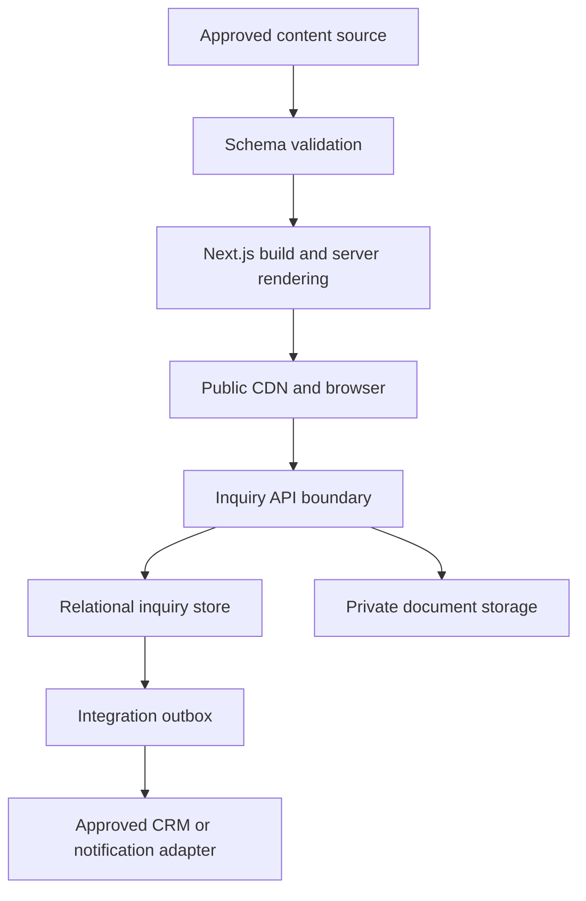
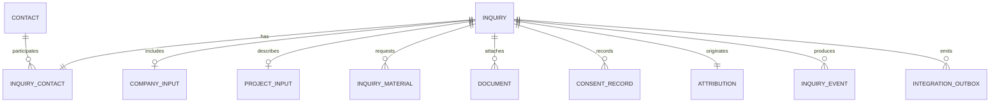

# Ahan Asa Website — Data Architecture

> **Brand:** Ahan Asa | آهن آسا  
> **Domain:** `https://ahanassa.com`  
> **Document:** `DATA_ARCHITECTURE.md`  
> **Status:** Implementation baseline v1.0  
> **Last updated:** 2026-08-25  
> **Primary market:** Iran  
> **Primary locale:** Persian (`fa-IR`), fully RTL  
> **Delivery model:** Static-first public website with secure server-side inquiry handling

---

## 1. Purpose

This document defines how Ahan Asa website data is created, validated, stored, related, accessed, protected, migrated, retained, and observed.

It converts the semantic models in `CONTENT_MODEL.md` into an implementation-oriented architecture while preserving the approved product boundary:

> Ahan Asa is a professional steel procurement manager and protector of the client's interests—not a public steel marketplace, online shop, inventory system, or live-price board.

This architecture must support the Phase 1 website and primary inquiry journey without prematurely building a full procurement ERP.

This document is authoritative for:

- data zones and trust boundaries;
- sources of truth;
- logical stores and ownership;
- public-content serialization and validation;
- confidential inquiry persistence;
- document-upload architecture;
- identifiers, relationships, constraints, and state transitions;
- data access, privacy, retention, backup, and recovery requirements;
- migration, integration, analytics, and testing rules;
- implementation constraints for Claude Code.

This document does **not** choose a specific cloud vendor, database provider, CMS product, CRM, email service, object-storage provider, or ORM. Product selection belongs in `STACK.md`, `CMS_ARCHITECTURE.md`, `API_INTEGRATIONS.md`, and `DEPLOYMENT_ARCHITECTURE.md`.

---

## 2. Binding Project Context

The architecture must preserve these approved project decisions:

- The site uses Next.js App Router and TypeScript.
- Public pages are static-first and server-rendered where appropriate.
- Persian is the only public Phase 1 locale and uses unprefixed routes.
- Future English and Arabic support must be structurally possible without publishing incomplete locales.
- Public content is procurement-led, not catalog-led.
- The primary conversion is submission of an invoice, BOQ, purchase list, or project requirement.
- The primary conversion route is `/request`.
- The primary submission endpoint is `/api/inquiries`.
- Secure file upload through `/api/uploads` is conditional on approved storage, privacy, retention, and scanning controls.
- `/request/confirmation` contains no personal or project-sensitive data and remains non-indexable.
- Customer accounts, request dashboards, supplier portals, live inventory, prices, carts, checkout, payments, and public supplier data are outside Phase 1.
- Missing data must result in omitted components or approved pending states, never fabricated content.

When another document conflicts with this one, use the following precedence for data-related decisions:

1. approved legal/privacy decision;
2. `DECISIONS.md` architecture decision record;
3. `DATA_ARCHITECTURE.md`;
4. `CONTENT_MODEL.md`;
5. `ROUTES.md`;
6. implementation detail.

Conflicts must be recorded and resolved; Claude Code must not silently choose one interpretation.

---

## 3. Architecture Principles

### 3.1 Separate public and confidential data

Public content and confidential operational data must never share the same client-delivered source bundle. Inquiry data, contact details, uploaded documents, supplier information, quotes, and internal notes remain server-only.

### 3.2 Static-first, not database-dependent by default

Public pages must remain buildable and indexable when no CMS or operational database is available. The public website must not require a client-side database fetch to display core copy, navigation, metadata, or SEO content.

### 3.3 Relational core for confidential workflow

When persistent inquiry storage is enabled, use a managed PostgreSQL-compatible relational database as the logical baseline. The domain contains relationships, state transitions, uniqueness requirements, audit records, and transactional writes that benefit from relational constraints.

The provider and ORM remain replaceable implementation choices.

### 3.4 Private object storage for client files

Invoices, BOQs, drawings, spreadsheets, and purchase lists must use private object storage. They must never be placed in `/public`, committed to Git, stored as database blobs, or exposed through permanent public URLs.

### 3.5 Validate at every trust boundary

TypeScript types improve development safety but do not validate runtime input. Public content, environment configuration, form payloads, database writes, webhooks, and integration responses require runtime schema validation.

### 3.6 One source of truth per fact

Reusable facts are stored once and referenced by stable ID. Display duplication is derived at build or request time.

### 3.7 Append history; do not overwrite accountability

Material status changes, consent, integration attempts, access to confidential documents, and data deletion must be auditable. Current state may be stored on the primary record, but important changes require append-only events.

### 3.8 Minimize before collecting

Collect only data required to evaluate and respond to the inquiry. Do not request identity documents, financial credentials, passwords, or unrelated personal data.

### 3.9 Provider independence at the domain boundary

Domain models must not contain provider-specific IDs or response payloads. Provider identifiers belong in integration mapping fields or adapter tables.

### 3.10 No speculative system scope

The data model must not create Phase 1 tables or public routes for full supplier management, quote calculation, order management, payments, inventory, OCR, AI recommendations, or customer accounts unless their feature scope is separately approved.

---

## 4. Data Zones and Classification

Every record and asset must have one explicit privacy classification.

| Class | Meaning | Examples | Browser exposure | Default store |
|---|---|---|---|---|
| `public` | Approved for public publication | capabilities, materials, articles, FAQs, approved projects | Allowed | versioned content source or approved CMS |
| `controlled` | Shareable only through an approved flow | gated resource, redacted evidence pack | Conditional | controlled/private object storage |
| `confidential` | Business or personal data required for operations | inquiry, contact, company, project, submitted document | Prohibited except minimized response | relational database + private object storage |
| `restricted` | Highest-sensitivity operational data | supplier terms, quotes, internal evaluation, privileged notes | Prohibited | future secured operations system |

### 4.1 Mandatory rules

- A record inherits the highest classification of any non-separable embedded field.
- Public pages must not query confidential or restricted stores during static generation.
- No confidential or restricted value may enter HTML source, client props, hydration payloads, source maps, logs, analytics, search indexes, sitemaps, metadata, URLs, or cache keys.
- Controlled files require an explicit access policy; obscurity of a URL is not authorization.
- Restricted data is outside the public website repository.

---

## 5. System Context and Trust Boundaries



Trust boundaries:

1. **Editorial boundary:** untrusted draft content becomes publishable only after schema, relationship, approval, and privacy checks.
2. **Browser boundary:** all browser input is untrusted regardless of client validation.
3. **API boundary:** server validation, abuse controls, authorization, and normalization occur before persistence.
4. **Storage boundary:** database and object-storage credentials exist only on the server.
5. **Integration boundary:** outbound and inbound provider data is validated and logged through adapters.
6. **Operations boundary:** staff access to confidential records requires approved authentication and authorization outside the public site UI.

---

## 6. Logical Data Stores

### 6.1 Store A — Public content source

**Purpose:** canonical source for published website content in Phase 1.

**Baseline:** version-controlled, UTF-8, structured content files validated during development, CI, and production build.

**Preferred serialization:** JSON-compatible structured records. Rich content uses the approved discriminated block union from `CONTENT_MODEL.md`, not arbitrary executable MDX or raw HTML.

**Contains:**

- site settings;
- route-linked page records;
- navigation and footer configuration;
- capabilities and process steps;
- material categories;
- industries;
- approved projects/case studies;
- evidence-safe public claims;
- insights and resources;
- FAQs;
- CTA records;
- media metadata;
- SEO fields and publication data;
- controlled taxonomies.

**Must not contain:**

- form submissions;
- phone numbers or emails supplied by visitors;
- uploaded client documents;
- supplier offers;
- internal notes;
- credentials or secrets;
- placeholder prices, stock, client names, metrics, or testimonials.

### 6.2 Store B — Public media store

**Purpose:** approved public images, video posters, logos, diagrams, and downloadable public resources.

Assets require metadata defined in `MediaAsset`, including dimensions, MIME type, copyright status, approval status, privacy class, and accessibility text.

Public media may use immutable hashed filenames and CDN caching. A public file cannot later be treated as confidential; confidential material requires a new private object and removal/migration procedures.

### 6.3 Store C — Relational inquiry store

**Purpose:** persistent server-side storage for qualified website inquiries and their audit context.

**Baseline technology class:** managed PostgreSQL-compatible database.

**Activation rule:** this store is required when the website itself persists inquiries. If Phase 1 forwards leads to an approved CRM without local persistence, the same logical validation, consent, idempotency, and audit contract still applies at the integration boundary.

**Contains only the minimum operational dataset:**

- inquiry;
- contact;
- optional company and project context;
- material-category references;
- document metadata, never file bytes;
- consent record;
- source attribution;
- state history;
- integration delivery status;
- security-minimized abuse metadata where approved.

### 6.4 Store D — Private object storage

**Purpose:** confidential client-uploaded documents.

Requirements:

- private bucket/container;
- encryption in transit and at rest;
- random non-semantic object keys;
- no original filename in the object path;
- short-lived authorized access only;
- MIME verification independent of filename extension;
- size and count limits;
- quarantine and scanning state;
- lifecycle deletion rules;
- access logging where supported;
- separate environments and credentials.

### 6.5 Store E — Integration outbox

**Purpose:** reliable delivery of committed inquiries to approved downstream systems without making form success depend on a fragile synchronous notification.

The outbox may be a database table or a provider-neutral queue, but it must support:

- event ID;
- event type and schema version;
- aggregate ID;
- creation timestamp;
- delivery status;
- attempt count;
- next-attempt timestamp;
- provider mapping;
- last sanitized error code;
- completed/dead-letter timestamp.

### 6.6 Store F — Analytics

Analytics is a derived, minimized behavioral dataset—not an operational source of truth. It may contain stable page, content, campaign, and event keys but must not contain PII, uploaded filenames, project messages, document contents, or internal inquiry details.

---

## 7. Source-of-Truth Matrix

| Data domain | Authoritative source | Derived consumers | Write owner |
|---|---|---|---|
| Public page content | Public content source / future CMS | website, sitemap, search, JSON-LD | approved editorial workflow |
| Route identity | typed route manifest | navigation, canonical, sitemap, analytics | technical + IA owner |
| Public media metadata | public content source | image components, OG, resource pages | content/media owner |
| Public asset bytes | public media store | CDN and browser | media pipeline |
| Inquiry | relational inquiry store or approved CRM | staff workflow, aggregate reporting | inquiry service |
| Uploaded document metadata | relational inquiry store | authorized operations UI | upload service |
| Uploaded document bytes | private object storage | authorized retrieval only | upload service |
| Consent evidence | relational inquiry store | privacy audit | inquiry service |
| Inquiry status | relational inquiry store / approved CRM after handoff | staff reporting | operations workflow |
| Integration delivery | outbox/integration log | retries and monitoring | integration worker |
| Analytics events | analytics platform | dashboards | analytics pipeline |

No downstream system may silently become authoritative merely because it contains a copy.

---

## 8. Public Content Data Architecture

### 8.1 Record shape

All routable public records extend the base model defined in `CONTENT_MODEL.md`:

- immutable `id`;
- stable `contentType`;
- locale;
- title, slug, summary;
- structured body fields;
- SEO fields;
- publication fields;
- taxonomy and relationship IDs;
- CTA references;
- privacy class.

### 8.2 File record rules

- One canonical entity record per file or CMS record.
- IDs use stable lowercase ASCII kebab case.
- Slugs use lowercase Latin kebab case and match `ROUTES.md`.
- Relationships store IDs, not copied titles or URLs.
- Files use UTF-8 without manual direction-control tricks.
- Numbers remain numeric; units use controlled codes.
- Dates are ISO 8601; timestamps are UTC.
- `null` means intentionally absent; `[]` means an intentionally empty collection.
- Published records cannot contain `TBD`, `N/A`, lorem ipsum, placeholder URLs, or fake data.

### 8.3 Locale model

The canonical entity ID is shared across future locale variants, while each locale owns its own:

- slug;
- display copy;
- metadata;
- publication status;
- review status;
- localized media text.

Phase 1 publication rules:

- only `fa` records are publishable by default;
- no locale fallback is allowed on public localized routes;
- future `/en/**` or `/ar/**` pages exist only for complete approved records;
- hreflang is emitted only for real, reciprocal, indexable equivalents.

### 8.4 Public relationship integrity

The validator must reject:

- duplicate IDs;
- duplicate locale-aware slugs;
- unresolved references;
- references from public records to confidential data;
- published records referencing draft-only required entities;
- invalid parent/child taxonomies;
- route collisions with reserved system paths;
- circular structures that break navigation or rendering;
- archived routable content without a redirect or explicit removal decision.

### 8.5 Publication projection

The build process creates a read-only projection containing only records that:

1. pass runtime schema validation;
2. satisfy relationship rules;
3. have `publication.status = published`;
4. have an approved locale;
5. have a valid canonical route;
6. pass privacy and evidence gates.

Draft and preview projections must never be included in the production static bundle.

### 8.6 Derived public data

Compute rather than manually duplicate:

- canonical absolute URLs;
- breadcrumbs;
- sitemap records;
- hreflang mappings;
- reverse relationships;
- reading time;
- article table of contents;
- Open Graph URL;
- result counts;
- file-size labels;
- localized number and date formatting;
- related-content candidates under explicit rules.

---

## 9. Public Content Validation Pipeline

The required pipeline is:

```text
Author or edit record
→ Parse source
→ Validate schema
→ Validate IDs and enums
→ Validate relationships
→ Validate routes and slugs
→ Validate publication and locale
→ Validate media and evidence
→ Validate SEO/privacy rules
→ Build published projection
→ Render pages and derived outputs
```

Validation must run:

- during local development;
- in automated tests;
- in CI before merge/deploy;
- during production build;
- on CMS webhook/revalidation if a CMS is later adopted.

Warnings are acceptable only for non-publishable drafts. A violation affecting published content must fail the build.

---

## 10. Inquiry Domain Boundary

The website inquiry domain is intentionally smaller than the future procurement operations domain.

### 10.1 In Phase 1

- accept an inquiry;
- capture minimum contact and optional company/project context;
- associate selected material categories;
- securely associate approved uploaded documents;
- record consent and source attribution;
- assign a non-sensitive reference number when approved;
- record review state and staff-facing events;
- deliver the inquiry to an approved destination;
- support retention, deletion, and audit requirements.

### 10.2 Outside Phase 1

- public customer login;
- request tracking portal;
- supplier master and performance scoring;
- quotation line calculation;
- order, payment, shipment, and invoice accounting;
- live stock or price ingestion;
- automated product normalization;
- OCR/AI extraction as a decision-maker;
- recommendation engine.

Those capabilities must enter a separate bounded context and architecture review rather than expanding the website inquiry tables casually.

---

## 11. Logical Inquiry Schema

Names below describe logical tables or aggregates. Physical naming and ORM syntax may vary, but meaning and constraints must remain stable.

### 11.1 `inquiry`

| Field | Type | Null | Constraint / purpose |
|---|---|---:|---|
| `id` | UUID | No | Internal primary key; never sequential public ID |
| `reference_number` | string | No | Unique, random-enough customer-safe reference |
| `form_id` | string | No | Stable form identity |
| `form_version` | integer | No | Payload and consent traceability |
| `locale` | locale code | No | `fa` in Phase 1 |
| `status` | enum | No | Current inquiry state |
| `message` | text | Yes | Plain text only; length-limited |
| `preferred_contact_method` | enum | Yes | phone, email, WhatsApp, or approved value |
| `source_page_key` | string | No | Stable route key, not raw referrer text |
| `source_content_id` | string | Yes | Public entity ID when applicable |
| `assigned_to` | string/UUID | Yes | Internal identity only when operations system exists |
| `submitted_at` | timestamptz | No | Server timestamp in UTC |
| `updated_at` | timestamptz | No | Server managed |
| `retention_until` | timestamptz | No | Computed from approved retention policy |
| `privacy_class` | enum | No | Always `confidential` |
| `schema_version` | integer | No | Data migration and compatibility |

Indexes:

- unique index on `reference_number`;
- index on `(status, submitted_at)`;
- index on `retention_until`;
- optional index on `assigned_to` only when used.

### 11.2 `contact`

| Field | Type | Null | Constraint / purpose |
|---|---|---:|---|
| `id` | UUID | No | Primary key |
| `full_name` | string | No | Trimmed, length-limited |
| `phone_e164` | string | Conditional | Normalized international form when phone supplied |
| `phone_country_code` | string | Conditional | Stored separately when required by UX |
| `email_normalized` | string | Conditional | Lowercase domain; preserve safe original display separately only if needed |
| `preferred_language` | locale code | No | `fa` default |
| `created_at` | timestamptz | No | UTC |
| `updated_at` | timestamptz | No | UTC |

At least one approved contact channel must be present. Contact data must not be exported to analytics.

Whether repeated contacts are merged is an operations decision. Phase 1 must prefer duplicate inquiries over an unsafe automatic person merge.

### 11.3 `inquiry_contact`

| Field | Type | Null | Constraint / purpose |
|---|---|---:|---|
| `inquiry_id` | UUID | No | Foreign key to inquiry |
| `contact_id` | UUID | No | Foreign key to contact |
| `role` | enum | No | requester, project-contact, or approved role |
| `is_primary` | boolean | No | Exactly one primary requester per inquiry |

Unique constraint: `(inquiry_id, contact_id, role)`.

### 11.4 `company_input`

This table stores visitor-supplied company context; it is not a verified company master.

| Field | Type | Null | Constraint / purpose |
|---|---|---:|---|
| `id` | UUID | No | Primary key |
| `inquiry_id` | UUID | No | Unique foreign key for Phase 1 |
| `company_name` | string | Yes | Plain text, length-limited |
| `role_or_department` | string | Yes | Optional |
| `industry_id` | string | Yes | Public taxonomy ID when selected |
| `city` | string | Yes | Optional project/business context |
| `country_code` | string | No | `IR` default only when justified by UX |

Do not treat visitor-supplied company data as legally verified.

### 11.5 `project_input`

| Field | Type | Null | Constraint / purpose |
|---|---|---:|---|
| `id` | UUID | No | Primary key |
| `inquiry_id` | UUID | No | Unique foreign key for Phase 1 |
| `project_title` | string | Yes | Optional; confidential |
| `project_type` | string/enum | Yes | Controlled value when possible |
| `project_stage` | enum | Yes | Approved form values only |
| `delivery_city` | string | Yes | Operational context |
| `required_by_date` | date | Yes | User intent, not a promise |
| `technical_concern` | text | Yes | Plain text; length-limited |

Dates and locations supplied by the visitor remain unverified input until reviewed.

### 11.6 `inquiry_material`

| Field | Type | Null | Constraint / purpose |
|---|---|---:|---|
| `inquiry_id` | UUID | No | Foreign key |
| `material_category_id` | string | No | Stable public taxonomy ID |
| `source` | enum | No | selected, document-review, or staff-added |
| `created_at` | timestamptz | No | UTC |

Unique constraint: `(inquiry_id, material_category_id, source)`.

Do not create product or quantity rows from uploaded documents in Phase 1 unless a separate human-reviewed extraction feature is approved.

### 11.7 `document`

Stores metadata only.

| Field | Type | Null | Constraint / purpose |
|---|---|---:|---|
| `id` | UUID | No | Internal primary key |
| `inquiry_id` | UUID | Yes | Null only during short-lived upload session |
| `upload_session_id` | UUID | Yes | Links pre-submission upload |
| `storage_key` | string | No | Random private object key; unique |
| `original_filename` | string | No | Sanitized for display; never used as storage key |
| `detected_mime_type` | string | No | Server-verified |
| `claimed_mime_type` | string | Yes | Browser claim for audit only |
| `size_bytes` | bigint | No | Positive and within limit |
| `sha256` | string | Yes | Integrity/deduplication aid, not authorization |
| `scan_status` | enum | No | pending, clean, rejected, failed, expired |
| `upload_status` | enum | No | initiated, uploaded, attached, deleted |
| `uploaded_at` | timestamptz | Yes | UTC |
| `retention_until` | timestamptz | No | Approved lifecycle |
| `privacy_class` | enum | No | `confidential` |

No table stores a permanent public URL. Authorized retrieval is generated on demand and expires quickly.

### 11.8 `upload_session`

Required only if uploads occur before final inquiry creation.

| Field | Type | Null | Constraint / purpose |
|---|---|---:|---|
| `id` | UUID | No | Primary key |
| `token_hash` | string | No | Unique; raw token never stored |
| `status` | enum | No | active, completed, expired, blocked |
| `created_at` | timestamptz | No | UTC |
| `expires_at` | timestamptz | No | Short lifetime |
| `origin_fingerprint` | string | Yes | Minimized anti-abuse value only when approved |

Expired sessions and unattached objects must be deleted automatically.

### 11.9 `consent_record`

| Field | Type | Null | Constraint / purpose |
|---|---|---:|---|
| `id` | UUID | No | Primary key |
| `inquiry_id` | UUID | No | Foreign key |
| `consent_type` | enum | No | privacy-processing, marketing, or approved value |
| `granted` | boolean | No | Marketing may never default to true |
| `text_version` | string | No | Exact approved copy version |
| `privacy_policy_version` | string | No | Policy shown at submission |
| `captured_at` | timestamptz | No | Server timestamp |
| `capture_source` | string | No | Form ID/version |

Consent records are append-only. A withdrawal creates a new event or status; it must not erase historical proof of what was shown and accepted.

### 11.10 `attribution`

| Field | Type | Null | Constraint / purpose |
|---|---|---:|---|
| `inquiry_id` | UUID | No | Primary/foreign key |
| `utm_source` | string | Yes | Length-limited and sanitized |
| `utm_medium` | string | Yes | Length-limited and sanitized |
| `utm_campaign` | string | Yes | Length-limited and sanitized |
| `utm_content` | string | Yes | Length-limited and sanitized |
| `utm_term` | string | Yes | Length-limited and sanitized |
| `landing_page_key` | string | No | Stable route key |
| `cta_origin` | string | Yes | Stable CTA ID |
| `referrer_host` | string | Yes | Host only where possible; no sensitive query string |

Raw URLs with arbitrary query strings must not be retained by default.

### 11.11 `inquiry_event`

Append-only history.

| Field | Type | Null | Constraint / purpose |
|---|---|---:|---|
| `id` | UUID | No | Primary key |
| `inquiry_id` | UUID | No | Foreign key |
| `event_type` | enum | No | submitted, status-changed, assigned, note-added, integration-delivered, deleted, etc. |
| `from_status` | enum | Yes | Required for state change |
| `to_status` | enum | Yes | Required for state change |
| `actor_type` | enum | No | system, staff, integration |
| `actor_id` | string/UUID | Yes | Protected internal identity |
| `reason_code` | string | Yes | Controlled when applicable |
| `metadata` | JSON | Yes | Versioned, minimized, no arbitrary secret payload |
| `created_at` | timestamptz | No | UTC |

The event table is not a substitute for application logs and must not become an unstructured dump.

### 11.12 `integration_outbox`

| Field | Type | Null | Constraint / purpose |
|---|---|---:|---|
| `id` | UUID | No | Event ID |
| `aggregate_type` | string | No | `inquiry` in Phase 1 |
| `aggregate_id` | UUID | No | Inquiry ID |
| `event_type` | string | No | Versioned contract name |
| `schema_version` | integer | No | Payload compatibility |
| `payload` | JSON | No | Minimum required downstream data |
| `status` | enum | No | pending, processing, delivered, retry, dead-letter |
| `attempt_count` | integer | No | Starts at zero |
| `next_attempt_at` | timestamptz | Yes | Retry schedule |
| `provider_key` | string | No | Adapter identity, not secret |
| `provider_record_id` | string | Yes | Mapping after success |
| `last_error_code` | string | Yes | Sanitized |
| `created_at` | timestamptz | No | UTC |
| `completed_at` | timestamptz | Yes | UTC |

Unique delivery semantics must be enforced by event ID and provider mapping.

---

## 12. Entity Relationship Summary



Public content entity IDs may be referenced from `inquiry_material`, `source_content_id`, and analytics context. No foreign key from the public content file store is possible; application validation must ensure those IDs exist in the approved public taxonomy registry.

---

## 13. Identifier Strategy

### 13.1 Public content

- Human-readable immutable ASCII IDs, e.g. `material-rebar`.
- Locale-specific slugs are mutable only through an approved redirect migration.
- URLs are never used as entity IDs.

### 13.2 Confidential records

- Use database-generated UUIDs.
- UUID v7 is preferred when supported consistently; UUID v4 is acceptable.
- Never expose internal primary keys in public URLs or analytics.

### 13.3 Customer-safe reference

If an inquiry reference is shown, it must:

- be generated server-side;
- be unique;
- contain no phone, date of birth, email, sequential database ID, or project name;
- not function as authentication;
- not allow enumeration of other inquiries.

Example shape only:

```text
AA-8K4P-Q7M2
```

The exact format belongs in the form/API specification.

### 13.4 Idempotency

`POST /api/inquiries` must support safe duplicate-submission handling.

Preferred behavior:

- client generates a per-attempt idempotency key;
- server binds it to a normalized payload fingerprint for a limited window;
- same key and same payload returns the original successful result;
- same key with different payload is rejected;
- idempotency records expire under an approved retention period.

Do not deduplicate solely by phone number, email, filename, or message similarity.

---

## 14. State Models

### 14.1 Inquiry status

Approved baseline:

```text
received
→ under-review
→ needs-clarification
→ qualified
→ converted OR declined
→ closed
```

Rules:

- `received` means persisted successfully, not commercially accepted.
- `qualified` means reviewed against approved operational criteria.
- `converted` means handed into an approved procurement/CRM workflow.
- `declined` requires an internal reason code.
- deletion/anonymization is a data-governance action, not a commercial status.
- every transition is validated and appended to `inquiry_event`.

### 14.2 Document status

```text
initiated → uploaded → pending-scan → clean → attached
                               ↘ rejected
active states → expired/deleted
```

Only `clean` documents may become available to authorized staff. Scan failure must fail closed, not mark the file safe.

### 14.3 Integration delivery

```text
pending → processing → delivered
                    ↘ retry → processing
                    ↘ dead-letter
```

The browser receives success after durable inquiry persistence, not after every downstream notification succeeds.

---

## 15. Inquiry Submission Transaction

### 15.1 Without document upload

1. Receive request at `/api/inquiries`.
2. Enforce request size, origin, rate-limit, and anti-abuse policy.
3. Parse and validate the versioned payload.
4. Normalize contact and attribution fields.
5. Start a database transaction.
6. Create contact, inquiry, optional company/project records, materials, consent, and attribution.
7. Create initial `inquiry_event`.
8. Create integration outbox event.
9. Commit.
10. Return a minimized success response.
11. Process delivery asynchronously.

### 15.2 With document upload

1. Create short-lived upload session.
2. Validate intended file count, extension, declared MIME, and size before issuing upload permission.
3. Upload directly or through the server to quarantine storage.
4. Verify actual object size and detected MIME.
5. Scan or otherwise validate under the approved security design.
6. Submit inquiry referencing clean or pending approved document tokens.
7. In one transaction, persist inquiry records and attach valid documents.
8. Expire the upload session.
9. Delete orphaned or rejected objects according to lifecycle rules.

The user must never be told that a document was accepted when persistence or attachment failed.

### 15.3 Success response

The API returns only:

- `success`;
- customer-safe reference when enabled;
- generic next-step message key;
- safe retry semantics.

It must not return internal IDs, storage keys, provider IDs, staff identity, supplier information, or internal status details.

---

## 16. File Upload Contract

The upload feature remains disabled until file types, size/count limits, storage, scanning, retention, consent, and authorized recipient access are approved.

### 16.1 Allowed-type policy

The final allowlist belongs in `FORM_ARCHITECTURE.md` and `SECURITY_GUIDELINES.md`. It should be limited to business-relevant formats such as approved PDF, image, and spreadsheet types.

Never trust:

- filename extension;
- browser-supplied MIME type;
- client-side validation;
- a password-protected or encrypted file that cannot be inspected;
- a compressed archive unless explicitly approved.

### 16.2 Filename treatment

- Preserve a sanitized display filename only for authorized staff context.
- Strip path segments and control characters.
- Apply a length limit.
- Do not use the filename as an object key.
- Do not include it in analytics, logs, public HTML, email subject lines, or URLs.

### 16.3 Download treatment

- Authorize every retrieval request.
- Generate short-lived access.
- Set safe content disposition.
- Prevent inline execution for risky types.
- Record access when required.
- Recheck deletion/retention state before issuing access.

---

## 17. API Data Contracts

All API payloads are versioned. Versioning may use an explicit field or media/route contract, but must be testable.

Conceptual submission shape:

```ts
type InquirySubmissionV1 = {
  schemaVersion: 1;
  idempotencyKey: string;
  form: {
    id: "primary-procurement-inquiry";
    version: number;
    locale: "fa";
  };
  contact: {
    fullName: string;
    phone?: string;
    email?: string;
    preferredContactMethod?: "phone" | "email" | "whatsapp";
  };
  company?: {
    name?: string;
    roleOrDepartment?: string;
    industryId?: string;
  };
  project?: {
    title?: string;
    stage?: string;
    deliveryCity?: string;
    requiredByDate?: string;
    technicalConcern?: string;
  };
  materialCategoryIds: string[];
  message?: string;
  documentTokens: string[];
  consent: {
    privacyProcessing: true;
    marketing?: boolean;
    textVersion: string;
    privacyPolicyVersion: string;
  };
  attribution?: {
    landingPageKey: string;
    sourceContentId?: string;
    ctaOrigin?: string;
    utmSource?: string;
    utmMedium?: string;
    utmCampaign?: string;
    utmContent?: string;
    utmTerm?: string;
  };
};
```

Rules:

- The server schema is authoritative.
- Unknown fields are rejected or stripped according to a documented policy; they are never blindly persisted.
- Server-derived timestamps, status, privacy class, reference number, and retention date are not accepted from the client.
- Taxonomy IDs are checked against approved registries.
- Error responses identify correctable fields without exposing internals.
- Database or provider error messages never pass through to the browser.

---

## 18. Access-Control Model

### 18.1 Public website

- Read-only access to published public content.
- Write access only through narrowly scoped form endpoints.
- No direct database or object-storage credentials in client code.

### 18.2 Internal operations

The internal interface is outside Phase 1 public scope. When built, it requires:

- authenticated staff identity;
- role-based authorization;
- least privilege;
- separate permissions for viewing PII, downloading files, changing status, exporting data, and deleting/anonymizing records;
- session security and revocation;
- audit records for sensitive actions.

Suggested logical roles for future approval:

| Role | Minimum data capability |
|---|---|
| Inquiry triage | view and classify assigned inquiries |
| Procurement reviewer | view approved inquiry details and documents |
| Manager | assign, change status, view operational summaries |
| Privacy administrator | retention, export, deletion/anonymization workflow |
| System integration | narrow machine access to approved fields only |

No role receives unrestricted database access through the application by default.

---

## 19. Privacy, Minimization, and Sensitive Data

### 19.1 Prohibited collection

The website must not request or intentionally store:

- account passwords;
- bank-card data;
- unnecessary identity documents;
- personal national identifiers unless a separately approved legal process requires them;
- supplier credentials;
- unrelated health, political, religious, or biometric data;
- secrets embedded in free-form technical files knowingly requested by the website.

### 19.2 Free-text risk

Users may place personal or confidential information inside messages or documents. Therefore:

- free text is confidential;
- it is never copied to analytics;
- logs contain field presence and length, not content;
- outbound notification content is minimized;
- staff guidance must discourage unnecessary copying into external systems.

### 19.3 Log minimization

Application logs may contain:

- request correlation ID;
- route and method;
- status code;
- latency;
- schema version;
- normalized error code;
- integration event ID;
- non-sensitive record ID in protected server logs.

They must not contain:

- name, phone, email;
- message text;
- original filename;
- uploaded file contents;
- authorization token;
- signed URL;
- provider secret;
- complete request payload.

### 19.4 IP and anti-abuse data

Store raw IP addresses only when legally and operationally approved. Prefer transient processing, truncation, hashing with rotation, or provider-level rate limiting. Any retained anti-abuse value requires a purpose and expiration.

---

## 20. Retention, Deletion, and Anonymization

No production inquiry or upload feature may launch without an approved retention schedule.

### 20.1 Proposed retention classes for owner/legal approval

| Data | Proposed baseline | Action at expiry |
|---|---:|---|
| Unattached upload session | 24 hours | delete object and session metadata |
| Rejected/quarantined file | 7 days or less | hard delete unless security investigation requires hold |
| Idempotency record | 7 days | delete |
| Failed integration diagnostic | 30–90 days | delete or aggregate |
| Unqualified inquiry | 12 months | delete or irreversibly anonymize |
| Qualified/converted inquiry | 24 months after last activity | review, delete, or move under approved business/legal basis |
| Consent evidence | aligned with inquiry and legal defense period | delete/anonymize under policy |
| Aggregated anonymous metrics | longer only if non-identifying | retain under analytics policy |

These values are proposals, not legal conclusions. Final values must be recorded in an approved policy and implemented as configuration, not scattered constants.

### 20.2 Deletion workflow

Deletion must cover:

1. primary relational records;
2. private objects and derived previews;
3. search indexes;
4. caches;
5. pending outbox messages where lawful;
6. downstream integration copies through a documented request;
7. backups according to backup-expiry limitations.

The system records that a deletion occurred without retaining the deleted personal payload.

### 20.3 Legal or operational hold

Any hold requires an authorized reason, scope, owner, start time, and review date. A generic `do_not_delete` flag without governance is prohibited.

---

## 21. Data Security Controls

- TLS for all data in transit.
- Provider-managed encryption at rest for database, backups, and object storage.
- Environment-separated credentials.
- Secret rotation and revocation process.
- Server-only environment variables.
- Parameterized database access through approved query layer/ORM.
- Content Security Policy and safe response headers under `SECURITY_GUIDELINES.md`.
- Rate limiting and bot controls at `/api/inquiries` and `/api/uploads`.
- Strict payload size limits before parsing large bodies.
- File scanning and quarantine when uploads are enabled.
- Dependency and migration review before deployment.
- No production data in source control, fixtures, screenshots, preview deployments, or client error reports.
- No unrestricted database administration endpoint in the website application.

Application-level field encryption may be added for selected PII if required by the threat model, provider capabilities, or law. It must include key rotation, search limitations, and recovery procedures; ad hoc encryption helpers are prohibited.

---

## 22. Search and Index Architecture

### 22.1 Public search

If site search is enabled, the index may include only published public fields approved in `CONTENT_MODEL.md`:

- title;
- summary;
- approved aliases;
- approved body text;
- content type;
- material category;
- capability;
- industry;
- resource/article type.

The search index is derived and disposable. It is never authoritative.

### 22.2 Prohibited search content

Never index:

- inquiries;
- names, phones, emails;
- uploaded document names or contents;
- supplier data;
- quote/order data;
- internal notes;
- draft/private content.

### 22.3 Filtering and SEO

Filter state is derived from taxonomy IDs. Filter combinations do not create indexable records or public content entities unless explicitly approved by SEO and information architecture.

---

## 23. Analytics Data Boundary

Allowed event context:

```text
event_name
page_key
route_family
locale
content_id
content_type
cta_id
cta_origin
form_id
form_version
form_step
submission_result
error_code
utm_source
utm_medium
utm_campaign
```

Prohibited analytics fields:

```text
name
phone
email
company name
project title
message text
filename
document URL
inquiry database ID
customer-safe reference number
supplier or quote details
```

`generate_lead` or equivalent success events must be emitted only after authoritative server-side acceptance, not merely after a button click or confirmation-page load.

---

## 24. Integration Architecture

Every integration uses an adapter with a domain-owned input contract.

```text
Inquiry domain event
→ outbox
→ integration adapter
→ provider API
→ mapped provider record ID
→ delivery result
```

Rules:

- Provider payloads are created at the adapter boundary.
- Provider field names do not leak into domain models.
- Webhooks require signature verification, timestamp/replay controls, schema validation, and idempotency.
- Retries use bounded exponential backoff and a dead-letter state.
- Notification failure does not delete or duplicate the committed inquiry.
- Secrets stay in environment configuration.
- A provider outage produces an operational alert and retry, not a false user failure after durable persistence.
- Manual fallback must be documented before launch.

The first approved lead destination must be named in `API_INTEGRATIONS.md`; until then, Claude Code may implement an adapter interface and a safe development stub that stores no fake production success.

---

## 25. Caching and Revalidation

### 25.1 Public data

- Published public pages and assets may use CDN caching.
- Immutable media uses content-hashed URLs and long cache lifetimes.
- HTML/data revalidation follows the content publication model.
- A future CMS webhook may trigger narrow revalidation by content ID or route key.

### 25.2 Confidential data

- Do not cache form submissions at browser, CDN, or shared proxy layers.
- API responses containing any confidential value use restrictive cache headers.
- Signed object access expires quickly and is never cached as a public asset.
- Confirmation pages display only safe transient information.
- Server caches must never use raw PII or document names as cache keys.

---

## 26. Environments and Test Data

Required environments:

| Environment | Data rule |
|---|---|
| Local | synthetic fixtures only; no copied production PII |
| Preview | public draft content as approved; inquiry integrations disabled or sandboxed |
| Staging | synthetic or explicitly anonymized data; separate database and storage |
| Production | real data; production-only credentials and policies |

Rules:

- Never share database schemas through the same live database instance merely by a loose environment column.
- Private storage buckets/containers are separate per environment.
- Preview deployments cannot access production inquiry data.
- Test fixtures use obviously fictional names, domains, phone numbers, companies, projects, and documents.
- Production exports may not be used in development unless a formal anonymization process is approved and verified.

---

## 27. Database Constraints and Transaction Rules

The physical schema must enforce, not merely document:

- primary keys;
- foreign keys where stores are co-located;
- unique reference numbers;
- unique object storage keys;
- valid enum/check constraints where practical;
- positive file sizes;
- consent requirements;
- one primary requester per inquiry;
- valid timestamps and retention dates;
- deletion behavior that does not orphan private files silently.

Transaction boundaries:

- inquiry, consent, attribution, initial event, and outbox event are committed atomically;
- attaching documents to a submitted inquiry is atomic at the database level;
- object upload itself is not a database transaction, so compensating cleanup is mandatory;
- status transition and its audit event are committed together;
- integration delivery is never allowed to create a second inquiry record on retry.

---

## 28. Schema Evolution and Migrations

### 28.1 Versioning

- Public content schemas have explicit version or migration support.
- API payloads have explicit schema versions.
- Database migrations are ordered, immutable after application, and committed to version control.
- Integration events carry schema version.

### 28.2 Migration strategy

Use expand-and-contract for production changes:

1. add backward-compatible structure;
2. deploy code able to read old and new shapes;
3. backfill with monitored batches;
4. switch writes;
5. verify;
6. remove obsolete structure in a later migration.

### 28.3 Prohibited migration behavior

- destructive production migration without backup and recovery plan;
- renaming a published public ID without relationship migration;
- changing a published slug without redirect entry;
- using runtime application startup to perform uncontrolled destructive migrations;
- treating an ORM-generated diff as automatically safe;
- storing secrets or production data inside migration files.

### 28.4 Backfill requirements

Every material backfill defines:

- selection criteria;
- batch size;
- idempotency behavior;
- expected record count;
- progress logging without PII;
- rollback or correction method;
- post-run validation.

---

## 29. Backup, Recovery, and Continuity

Before real inquiry data is accepted, production requires:

- automated encrypted database backups;
- point-in-time recovery where supported;
- object-storage versioning or equivalent recovery protection where appropriate;
- backup retention consistent with the privacy policy;
- documented restore procedure;
- periodic restore test;
- owner for recovery decisions;
- monitoring for backup failure.

Launch targets for approval:

| Measure | Target |
|---|---:|
| Inquiry database RPO | 24 hours maximum; lower if provider supports it |
| Inquiry service RTO | 8 hours maximum |
| Backup restore test | at least quarterly |
| Critical integration retry visibility | same business day |

Backups must not become a way to retain personal data indefinitely. Expired backups age out under the approved backup lifecycle.

---

## 30. Observability and Data Quality

### 30.1 Operational metrics

Track without PII:

- inquiry submissions attempted/accepted/rejected;
- validation failure rate by error code;
- upload initiation/completion/rejection;
- document scan latency and failure;
- database write latency and error rate;
- outbox pending age;
- integration delivery/retry/dead-letter counts;
- orphan upload cleanup count;
- retention deletion count;
- public content validation failures;
- broken relationship and route collision counts.

### 30.2 Data quality checks

- valid contact channel present;
- unique reference number;
- consent version present;
- retention date present;
- source route key recognized;
- selected taxonomy IDs recognized;
- attached documents exist and are in allowed state;
- no public record contains confidential fields;
- no confidential data reaches analytics or static output;
- outbox events correspond to committed inquiries;
- no expired upload remains accessible.

### 30.3 Alerts

Alert on:

- sustained inquiry persistence failure;
- upload security/scanning outage when uploads are enabled;
- unusual rate-limit volume;
- outbox backlog age beyond threshold;
- repeated dead-letter deliveries;
- backup failure;
- retention cleanup failure;
- public build blocked by privacy leakage or broken references.

---

## 31. Performance and Scale Assumptions

The architecture optimizes for a high-value B2B inquiry workflow, not marketplace traffic or high-frequency price data.

Phase 1 assumptions:

- public reads greatly exceed confidential writes;
- public delivery benefits from static generation and CDN caching;
- inquiry writes are low-to-moderate volume but require correctness;
- file uploads are larger and riskier than form payloads;
- integration delivery can be asynchronous;
- relational queries are primarily by status, time, assignment, and reference;
- no multi-region write architecture is required initially.

Scale first through:

1. CDN/static delivery for public pages;
2. managed database connection pooling;
3. direct-to-private-storage upload when approved;
4. asynchronous outbox processing;
5. appropriate indexes based on measured queries;
6. archival and retention enforcement.

Do not introduce microservices, event streaming platforms, distributed databases, or data warehouses without measured need and an approved architecture decision.

---

## 32. Future Procurement Domain Separation

If the business validates the manual process and develops an internal procurement platform, create separate bounded contexts:

| Future context | Candidate entities | Boundary rule |
|---|---|---|
| Request intake | inquiry, contact, document, consent | may evolve from this website architecture |
| Requirement review | reviewed item, normalized specification, clarification | human-verified; separate from raw upload |
| Supplier management | supplier, capability, region, commercial terms, performance | restricted; never public by default |
| Quotation | quote, quote item, validity, terms, approval | transactional and versioned |
| Order | purchase order, order item, milestone | separate lifecycle from inquiry |
| Logistics | shipment, carrier, delivery event, proof | operational and time-sensitive |
| Finance | payment, invoice, margin | high-sensitivity; separate controls |
| Intelligence | price observation, supplier signal, recommendation | derived; human verification required |

The website inquiry ID may become an external reference in those contexts. Their internal schemas must not be embedded into the public website data model in advance.

---

## 33. Repository and Code-Level Contracts

Exact folders belong in `FOLDER_STRUCTURE.md`, but the implementation must expose these conceptual modules:

```text
domain/public-content
domain/inquiry
domain/upload
domain/consent
domain/attribution
domain/integration
data/public-content-source
data/database
data/object-storage
data/analytics
validation
```

Required boundaries:

- UI components consume typed view models, not raw provider or database objects.
- Server route handlers call domain services, not storage SDKs directly.
- Database and storage adapters are server-only modules.
- Public content loaders cannot import inquiry repositories.
- Client components cannot import server-only schemas containing secrets or internal fields.
- Domain types do not depend on ORM-generated types as their only contract.
- Mapping functions are explicit and tested.

---

## 34. Reference Interfaces

These interfaces are normative for responsibilities, not package or filename selection.

```ts
interface PublicContentRepository {
  getById<T>(contentType: string, id: string, locale: string): Promise<T | null>;
  listPublished<T>(contentType: string, locale: string): Promise<T[]>;
  resolveRoute(path: string, locale: string): Promise<PublicRouteEntity | null>;
}

interface InquiryRepository {
  create(input: ValidatedInquiry): Promise<CreatedInquiry>;
  findByReference(reference: string): Promise<InquirySummary | null>;
  transition(input: InquiryTransition): Promise<Inquiry>;
}

interface PrivateDocumentStore {
  beginUpload(input: UploadIntent): Promise<UploadAuthorization>;
  verifyUpload(token: string): Promise<VerifiedUpload>;
  authorizeRead(documentId: string, actor: AuthorizedActor): Promise<ExpiringAccess>;
  delete(documentId: string, reason: DeletionReason): Promise<void>;
}

interface InquiryDeliveryAdapter {
  deliver(event: InquirySubmittedEvent): Promise<DeliveryResult>;
}
```

Production implementations must not use `any` for validation results, persisted records, or integration payloads.

---

## 35. Required Automated Tests

### 35.1 Public content

- parse all records;
- validate schema and enums;
- reject duplicate IDs and slugs;
- reject broken references;
- reject confidential fields in public records;
- verify only published approved records generate routes;
- verify canonical, sitemap, breadcrumb, and hreflang derivation;
- reject unsupported locale fallback;
- validate media approval and accessibility metadata;
- validate evidence requirements for claims.

### 35.2 Inquiry API

- valid minimal submission;
- phone-only and email-only allowed cases according to form policy;
- missing contact channel;
- malformed phone/email;
- excessive field length;
- unexpected fields;
- invalid taxonomy ID;
- invalid or old consent version;
- idempotent retry;
- conflicting idempotency key;
- rate-limit and anti-abuse path;
- transaction rollback;
- safe public error response;
- outbox event created exactly once.

### 35.3 Upload

- allowed file;
- extension/MIME mismatch;
- oversized file;
- too many files;
- incomplete upload;
- rejected scan;
- scan failure fails closed;
- expired token;
- object cannot be read publicly;
- unattached object cleanup;
- deletion removes authorized access;
- filename never becomes object key or analytics value.

### 35.4 Privacy leakage

- no PII in analytics payloads;
- no PII in logs and error responses;
- no confidential values in static HTML or hydration data;
- no private URLs in page source;
- no inquiry pages in sitemap;
- confirmation page remains noindex and safe on refresh.

### 35.5 Migrations and recovery

- migration applies to empty and representative schema;
- rollback/correction path is documented;
- backfill is idempotent;
- restore procedure is tested;
- retention job deletes intended records and leaves legal holds intact.

---

## 36. Implementation Sequence

### Phase A — Public website foundation

1. Implement content schemas from `CONTENT_MODEL.md`.
2. Implement typed public content repository.
3. Add relationship, route, publication, privacy, and SEO validation.
4. Generate static/server-rendered Persian pages from the published projection.
5. Add synthetic test fixtures only.

### Phase B — Inquiry without upload

1. Approve final form fields and consent copy.
2. Implement server validation and normalized payload.
3. Provision isolated relational store or approved CRM destination.
4. Implement transaction, idempotency, event, and outbox behavior.
5. Implement minimized success/failure states.
6. Verify retention, backups, alerts, and manual fallback.

### Phase C — Secure upload

1. Approve file allowlist, size/count limits, retention, and staff access.
2. Provision private storage and quarantine flow.
3. Implement upload session and scanning/verification.
4. Attach documents transactionally to inquiries.
5. Implement orphan cleanup and authorized retrieval.
6. Complete security and privacy QA before activation.

### Phase D — Approved integration

1. Select lead destination.
2. Implement adapter and mapping tests.
3. Implement retries, dead-letter handling, and monitoring.
4. Reconcile provider record IDs.
5. Run failure and recovery drills.

### Phase E — Future operations system

Proceed only after real customer and procurement workflows are validated. Create separate architecture documents for staff authentication, supplier management, quotation, orders, logistics, finance, and AI-assisted processing.

---

## 37. Open Decisions

The following must be resolved before the related production capability launches:

| Decision | Current status | Blocks |
|---|---|---|
| Public content source: repository only or CMS | Repository baseline; CMS TBD | CMS editing, preview, revalidation |
| PostgreSQL provider | TBD | local inquiry persistence |
| ORM/query layer | TBD | physical schema and migrations |
| Lead system of record | TBD | CRM delivery and ownership |
| Private object-storage provider | TBD | document upload |
| File allowlist and limits | TBD | document upload |
| Malware/active-content scanning method | TBD | document upload |
| Final retention schedule | Requires owner/legal approval | all real inquiry persistence |
| Staff authentication and roles | Deferred | internal inquiry interface |
| Canonical production host (`www` or apex) | TBD in `ROUTES.md` | absolute URLs and redirects |
| Exact contact requirements | TBD in `FORM_ARCHITECTURE.md` | API validation |
| Consent and privacy text versions | TBD | form launch |
| Backup provider features and recovery targets | TBD | production readiness |
| Customer-safe reference format | TBD | confirmation and support process |
| Future CMS localization workflow | Deferred | English/Arabic publication |

Claude Code may create interfaces and tests around an open decision, but it must not activate the dependent production behavior using guessed provider names, credentials, policies, limits, or claims.

---

## 38. Claude Code Implementation Rules

Claude Code must:

1. Read `CONTENT_MODEL.md`, `ROUTES.md`, `TECHNICAL_ARCHITECTURE.md`, `FORM_ARCHITECTURE.md`, `SECURITY_GUIDELINES.md`, and this document before implementing data behavior.
2. Keep public content, confidential inquiry data, private files, integrations, and analytics in separate modules.
3. Use runtime validation at all data boundaries.
4. Use a typed central route and taxonomy registry.
5. Fail builds on invalid published content.
6. Keep public content available without client-side fetching.
7. Keep database and storage code server-only.
8. Store file metadata in the database and bytes in private object storage.
9. Use transactional inquiry creation with consent, attribution, event, and outbox.
10. Implement idempotency before enabling public submission.
11. Use migrations for schema changes.
12. Add privacy-leakage tests.
13. Use synthetic fixtures in non-production environments.
14. Record unresolved provider decisions rather than inventing them.
15. Preserve stable IDs and migrate slug changes with redirects.
16. Emit analytics only from an allowlisted event schema.
17. Ensure the form can fail safely and provide an approved fallback.
18. Make upload unavailable unless every upload gate is implemented and tested.

Claude Code must not:

- put inquiries, contacts, suppliers, quotes, or uploads in static JSON shipped to the browser;
- store uploaded files in `/public` or Git;
- store file bytes in the relational database;
- expose direct permanent object URLs;
- log request bodies or PII;
- send PII to GA4, GTM, pixels, session replay, or error monitoring;
- trust client validation, extensions, MIME claims, or hidden fields;
- use sequential public inquiry IDs;
- create customer accounts, dashboards, pricing, checkout, inventory, or supplier-marketplace tables in Phase 1;
- silently merge contacts;
- silently fall back to Persian under future locale routes;
- render raw user HTML;
- mark an integration stub as a successful production delivery;
- hard-code retention periods, recipients, provider URLs, secrets, or bucket names before approval;
- use `any` to bypass schema or adapter typing;
- perform destructive migrations automatically during application startup.

---

## 39. Production Readiness Checklist

### Public content

- [ ] All public schemas match `CONTENT_MODEL.md`.
- [ ] IDs, slugs, routes, relationships, and taxonomies validate.
- [ ] Only approved Persian records publish in Phase 1.
- [ ] Draft, archived, preview, and confidential records are excluded.
- [ ] No fake prices, stock, metrics, clients, suppliers, projects, or evidence exist.
- [ ] Public assets have rights, approval, metadata, and accessibility treatment.

### Inquiry

- [ ] Final field contract is approved.
- [ ] Server validation is authoritative.
- [ ] Idempotency works.
- [ ] Database transaction includes consent, attribution, event, and outbox.
- [ ] Success means durable persistence.
- [ ] Safe fallback exists for integration failure.
- [ ] Reference number is non-sensitive and non-enumerable.

### Uploads

- [ ] Upload scope and legal basis are approved.
- [ ] Private storage is isolated by environment.
- [ ] File allowlist, size, and count limits are enforced.
- [ ] MIME detection and scanning are implemented.
- [ ] Orphan cleanup works.
- [ ] Retrieval is authorized and short-lived.
- [ ] Retention deletion is verified.

### Privacy and security

- [ ] Data inventory and classification are complete.
- [ ] Consent and privacy-policy versions are recorded.
- [ ] Retention schedule is approved and configured.
- [ ] PII is absent from analytics, logs, URLs, HTML, caches, and error responses.
- [ ] Staff access is authenticated, authorized, and auditable where applicable.
- [ ] Secrets are server-only and environment-specific.
- [ ] Rate limiting and abuse protections are active.

### Operations

- [ ] Production database and storage backups are active.
- [ ] Restore procedure has been tested.
- [ ] Integration retries and dead-letter monitoring work.
- [ ] Alerts have owners and response instructions.
- [ ] Migration and rollback procedures are documented.
- [ ] Staging uses synthetic/anonymized data only.
- [ ] Retention and orphan-cleanup jobs are monitored.

---

## 40. Acceptance Criteria

This data architecture is implemented correctly when:

1. A production build can render all approved Persian public pages from validated public content without accessing confidential stores.
2. Invalid, draft, duplicate, broken, or privacy-unsafe public content cannot enter production.
3. A visitor can submit a valid inquiry once, retry safely, and receive a truthful minimized outcome.
4. The system persists the inquiry, consent, attribution, audit event, and delivery intent atomically.
5. Downstream delivery failure can be retried without losing or duplicating the inquiry.
6. Uploaded documents, when enabled, are private, verified, attached safely, and deleted under policy.
7. No PII or confidential business data appears in public output, analytics, routine logs, URLs, or caches.
8. Data can be migrated, backed up, restored, retained, deleted, and audited under documented procedures.
9. Provider choices can change behind adapters without changing the approved domain model or public URL architecture.
10. The architecture supports future CMS and procurement-system growth without pretending those systems exist in Phase 1.

---

## 41. Related Documents

- `PROJECT_BRIEF.md`
- `CONTENT_MODEL.md`
- `CONTENT_STRATEGY.md`
- `INFORMATION_ARCHITECTURE.md`
- `ROUTES.md`
- `TECHNICAL_ARCHITECTURE.md`
- `STACK.md`
- `FOLDER_STRUCTURE.md`
- `CMS_ARCHITECTURE.md`
- `API_INTEGRATIONS.md`
- `FORM_ARCHITECTURE.md`
- `ANALYTICS_TRACKING.md`
- `SECURITY_GUIDELINES.md`
- `ENVIRONMENT_VARIABLES.md`
- `CACHING_STRATEGY.md`
- `DEPLOYMENT_ARCHITECTURE.md`
- `LOCALIZATION.md`
- `HREFLANG_CANONICAL.md`
- `TESTING_STRATEGY.md`
- `DECISIONS.md`

---

## Approval Record

| Role | Name | Status | Date |
|---|---|---|---|
| Project Owner | A.M. Taleghani | Pending | — |
| Technical Architecture | TBD | Pending | — |
| Data/Backend | TBD | Pending | — |
| Security/Privacy | TBD | Pending | — |
| Operations | TBD | Pending | — |

