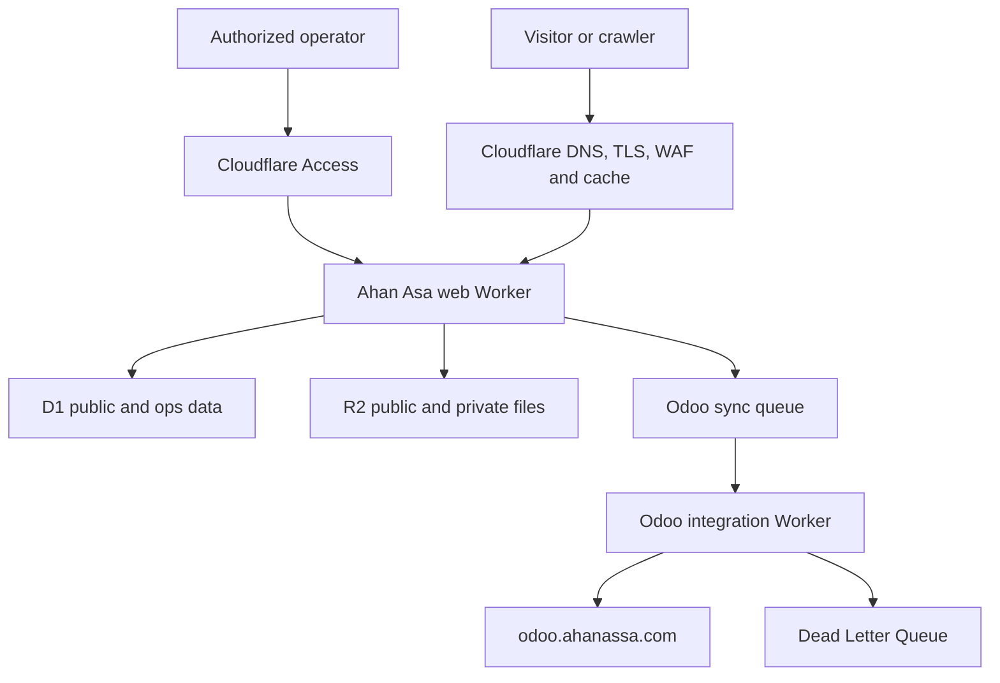

# Ahan Asa Deployment Architecture

**Document:** `DEPLOYMENT_ARCHITECTURE.md`  
**Project:** Ahan Asa (`ahanassa.com`)  
**Status:** Approved baseline for implementation  
**Last updated:** 2026-08-26  
**Primary platform:** Next.js App Router on Cloudflare Workers + Static Assets  
**Commercial system of record:** Odoo at `https://odoo.ahanassa.com`  
**Governing documents:** `DECISIONS.md`, `SYSTEM_OF_RECORD.md`, `SECURITY_GUIDELINES.md`  
**Related documents:** `STACK.md`, `TECHNICAL_ARCHITECTURE.md`, `DATA_ARCHITECTURE.md`, `DATABASE_SCHEMA.md`, `ODOO_INTEGRATION.md`, `SYNC_STRATEGY.md`, `FAILURE_RECOVERY.md`, `CACHING_STRATEGY.md`, `PERFORMANCE_BUDGET.md`, `ENVIRONMENT_VARIABLES.md`, `TESTING_STRATEGY.md`, `PRE_DEPLOY_CHECKLIST.md`, `POST_DEPLOY_CHECKLIST.md`

---

## 1. Purpose and Precedence

This document defines how Ahan Asa is built, validated, released, hosted, observed, rolled back, and recovered. It replaces the former Vercel deployment baseline.

The deployment must remain:

- **Cloudflare-native:** application runtime, static assets, data, files, queues, bot protection, access control, and observability use the Cloudflare platform.
- **Edge-first:** public responses are served at the edge and never wait for Odoo.
- **Static-first:** indexable routes return useful HTML initially and ship minimal client JavaScript.
- **Durable:** an RFQ is committed before ERP delivery is attempted.
- **Traceable:** every release maps to a reviewed Git commit and immutable Worker version.
- **Reversible:** code can return to a known-good Worker version without assuming data or bindings also roll back.
- **Isolated:** local, preview, and production data, credentials, and effects never mix.
- **Search-safe:** canonical host, redirects, status codes, robots, sitemap, metadata, links, and structured data are release gates.

`MUST`, `MUST NOT`, `SHOULD`, and `MAY` are normative. `DECISIONS.md` and `SYSTEM_OF_RECORD.md` take precedence if a conflict exists; this file must then be corrected in the same change.

---

## 2. Approved Decisions

| Area | Decision |
| --- | --- |
| Source control | Git repository with protected `main` |
| CI/CD | GitHub Actions with repository scripts and pinned Wrangler |
| Hosting | Cloudflare Workers with Static Assets |
| Next.js path | `vinext` |
| Superseded fallback | OpenNext only as historical context; not selected for launch |
| Canonical URL | `https://www.ahanassa.com` |
| Apex URL | Permanent redirect to matching `www` URL; path/query preserved |
| Public runtime | Dedicated web Worker |
| ERP sync | Separate queue-consumer/integration Worker |
| Public read model | D1 binding `DB_PUBLIC` |
| Operational/PII data | Separate D1 binding `DB_OPS` |
| Public media | R2 binding `R2_PUBLIC_MEDIA` |
| Private RFQ files | Separate R2 binding `R2_PRIVATE_RFQ` |
| Async integration | Cloudflare Queue with retry and Dead Letter Queue |
| Abuse protection | Turnstile, rate limiting, server validation |
| Admin protection | Cloudflare Access plus application authorization |
| Odoo endpoint | `https://odoo.ahanassa.com`, server-to-server only |
| Commercial source of truth | Odoo: customers, CRM, products, variants, UOM, prices, quotations, sales, inventory, purchasing, accounting |
| Website source of truth | Articles, SEO/presentation, RFQ capture, public read model, media references |
| Production trigger | Reviewed merge to protected `main`, followed by deployment gates |
| Preview | Versioned Worker preview URL for each reviewed change |
| Release unit | Immutable Worker version plus release manifest |
| Rollback | Roll back affected Worker; recover data separately |
| Infrastructure | Wrangler config, migrations, scripts, and documented platform settings are version-controlled |

### Superseded baseline

Vercel hosting, Vercel previews/promotions/rollbacks, DNS-only web records pointing to Vercel, and synchronous public Odoo reads are no longer approved.

---

## 3. Target Topology



### Public request boundary

Approved:

```text
Visitor → Cloudflare Edge → Web Worker / Static Asset → D1 or R2 → Response
```

Prohibited:

```text
Visitor → Web Worker → Odoo → Response
```

Public pages, price/catalog routes, SEO output, and form acknowledgements must remain available when Odoo is slow, restarting, upgrading, or unavailable.

### RFQ durability boundary

```text
Validate
  ↓
Commit RFQ and items to DB_OPS
  ↓
Confirm private R2 attachments
  ↓
Publish idempotent queue event
  ↓
Return RFQ reference
  ↓
Integration Worker sends to Odoo asynchronously
```

If D1 commit and queue publication cannot be atomic, use a transactional outbox in `DB_OPS`. A dispatcher publishes unsent records. The site must never return success for an RFQ held only in memory.

---

## 4. Deployable Units and Resources

### 4.1 Web Worker: `ahanassa-web`

Responsibilities:

- Next.js pages, layouts, metadata, route handlers, and server actions;
- Static Assets delivery;
- public catalog, article, product, and price reads;
- `/admin` UI and protected website-owned mutations;
- RFQ validation, durable capture, upload authorization, and queue production;
- sitemap, robots, redirects, canonical enforcement, health responses, Turnstile, rate controls, and cache policy.

The web Worker must not contain Odoo credentials or call Odoo directly. It emits typed integration events only.

### 4.2 Integration Worker: `ahanassa-odoo-sync`

Responsibilities:

- consume website-to-Odoo events;
- call Odoo through the typed adapter in `ODOO_INTEGRATION.md`;
- enforce idempotency using stable external/event keys;
- map website entities to Odoo models;
- write sync status and Odoo IDs to `DB_OPS`;
- reconcile allowed products, units, prices, availability, and status fields from Odoo;
- update the public read model and trigger targeted invalidation;
- route terminal failures to the DLQ with sanitized diagnostics.

It deploys and rolls back independently from the web Worker.

### 4.3 Data resources

| Binding | Purpose | Public cache | PII |
| --- | --- | --- | --- |
| `DB_PUBLIC` | Published articles, catalog/SEO read model, public prices/history | Via approved responses only | No |
| `DB_OPS` | RFQs/items, contact data, outbox, sync state, audit logs | Never | Yes |
| `R2_PUBLIC_MEDIA` | Approved public media/documents | Yes | No |
| `R2_PRIVATE_RFQ` | Customer Excel/PDF/image attachments | Never | Potentially |
| `ODOO_SYNC_QUEUE` | Integration commands/events | N/A | Minimized payload |
| `ODOO_SYNC_DLQ` | Events exceeding retry policy | N/A | Minimized, restricted |

D1 is never browser-accessible. All reads/writes pass through authorized Worker code.

### 4.4 Platform services

- Cloudflare DNS and managed TLS;
- Workers Static Assets and edge cache;
- Turnstile, Access, WAF/rate limiting according to the plan;
- Workers Logs, metrics, traces, and alert export;
- D1 Time Travel and validated exports;
- Cron Triggers for reconciliation, outbox recovery, and maintenance.

Actual IDs, resource names, account/zone IDs, routes, and secrets are resolved from the approved account and recorded in the private deployment inventory—not guessed or hard-coded here.

---

## 5. Domain, Routes, and TLS

| Host | Owner | Behavior |
| --- | --- | --- |
| `www.ahanassa.com` | Web Worker custom domain | Canonical production site |
| `ahanassa.com` | Redirect rule or minimal redirect Worker | `301`/`308` to matching `www` URL |
| `odoo.ahanassa.com` | Odoo infrastructure | ERP only; excluded from website Worker routes |
| Versioned `workers.dev` URLs | Workers | Protected, non-indexable preview only |

The web Worker must never use a wildcard route that captures `odoo.ahanassa.com`.

These must converge without loops and preserve path/query:

```text
http://ahanassa.com/path?x=1
https://ahanassa.com/path?x=1
http://www.ahanassa.com/path?x=1
https://www.ahanassa.com/path?x=1

→ https://www.ahanassa.com/path?x=1
```

Host normalization should occur at the edge before rendering. The application generates only production-`www` canonical, Open Graph, hreflang, sitemap, structured-data, and absolute internal URLs.

TLS requirements:

- strict end-to-end TLS for proxied origin subdomains;
- live verification of certificate and security headers;
- HSTS only after all required subdomains are HTTPS-safe;
- `includeSubDomains` and preload require separate approval;
- preview URLs never appear in production canonical or asset URLs.

---

## 6. Environments and Isolation

| Environment | Runtime | Resources | Odoo | Indexing | Effects |
| --- | --- | --- | --- | --- | --- |
| Local | Local Vite/`workerd` | Local emulation or disposable development | Mock/sandbox | N/A | Disabled by default |
| Preview | Immutable version URL | Non-production D1, R2, queue, Turnstile, secrets | Test database only | Access + `noindex, nofollow` | Test-only |
| Production | `www.ahanassa.com` | Production bindings/secrets | Production Odoo | Page policy | Real |

Rules:

- Production and non-production D1, R2, queues, secrets, Turnstile, Access policies, and Odoo credentials are distinct.
- Preview never writes to production Odoo, sends real customer notifications, or publishes production content.
- If previews share non-production resources, mutable records carry a preview scope and destructive tests use disposable data.
- Preview uses Access and `X-Robots-Tag: noindex, nofollow` as defense in depth.
- Local development uses either `.dev.vars` or `.env`, never both; neither is committed.
- Cloudflare `vars` contain non-secret configuration only. Credentials use Workers Secrets.
- Required secret names are declared so upload/deployment fails when configuration is incomplete.
- A permanent staging host is not required initially. Add one only for a stable callback/business QA need, with fully isolated resources.

---

## 7. Configuration as Code

Git is the source of truth for deployable behavior.

Version-controlled:

- web and integration source;
- exactly one lockfile;
- pinned Node.js, Next.js, React, `vinext`, Vite, and Wrangler versions/ranges;
- one Wrangler configuration format;
- binding names without secrets;
- D1 migrations;
- queue retry/DLQ settings and Cron schedules;
- code-owned headers, redirects, and cache behavior;
- CI workflows, tests, health checks, and release-manifest schema.

Documented when platform-owned:

- DNS/custom domains;
- Access, WAF/rate-limit, zone redirect/cache rules;
- alert destinations and log export;
- API-token scopes/owners, never token values.

Dashboard-only production experiments are prohibited. Emergency platform changes are logged immediately and reconciled with the repository/inventory after the incident.

The Worker `compatibility_date` is pinned. Advancing it is a runtime upgrade requiring preview tests, integration tests, and rollback planning.

---

## 8. Next.js Runtime and Adapter Gate

Cloudflare recommends `vinext` for new Next.js applications on Workers, but it is beta. Adoption is conditional.

Baseline:

- Next.js App Router and TypeScript remain the application contract.
- `vinext` is the preferred Workers path for this new project.
- Generated configuration/build scripts are reviewed and pinned.
- Cloudflare bindings are imported only in server-side modules.
- Browser/server boundaries remain explicit.

Bootstrap gate:

1. Pin intended Next.js, React, Vite, `vinext`, and Wrangler versions.
2. Run the official `vinext` compatibility check.
3. Build/run with the production-compatible Workers runtime.
4. Verify App Router metadata, RSC, server actions, route handlers, middleware/proxy behavior, streaming, images, fonts, D1, R2, Queue production, Turnstile, and error boundaries.
5. Run smoke/E2E tests on a versioned preview URL.
6. Record approved versions and results in `DECISIONS.md` and `STACK.md`.

If a required compatibility gap remains, stop. OpenNext is not the selected launch adapter; using it would require a new recorded decision with the blocker, pinned version, test evidence, migration path back to `vinext`, and operational differences. Pages static export is not the full-stack baseline.

Runtime constraints:

- Prefer Workers/Web APIs.
- Enable Node compatibility/polyfills only for audited dependencies.
- Native modules, filesystem assumptions, long-lived processes, or unsupported Node APIs block release.
- Long ERP/file/reconciliation work never runs in a visitor request.
- CI checks Worker bundle/runtime limits for the active plan.

---

## 9. Rendering and Route Classes

| Route class | Rendering | Cache | Live Odoo |
| --- | --- | --- | --- |
| Home/marketing | Static or edge-cached HTML | Long/event invalidated | Never |
| Category/product SEO | Static or edge-cached from `DB_PUBLIC` | Event invalidation + safety TTL | Never |
| Articles/resources | Static or controlled revalidation | Approved SWR | Never |
| Public prices | Cached dynamic HTML/read API from `DB_PUBLIC` | Short freshness TTL | Never |
| Search/filter | Server initial result + client enhancement | Query allowlist | Never |
| RFQ/contact | HTML-first interactive form | Mutation/state: `no-store` | Queue only |
| Admin/auth | Dynamic | `private, no-store` | No browser-to-Odoo |
| Upload authorization | Dynamic | `no-store` | Never |
| Sitemap/robots | Build/server generated | Explicit short cache | Never |
| Health | Minimal dynamic | `no-store` | No sensitive checks |

Indexable pages must expose meaningful content, title, description, canonical, headings, crawlable links, and applicable structured data in initial HTML. Client JavaScript is limited to interactive islands such as RFQ rows, filters, search, calculators, and navigation.

---

## 10. Git and Release Governance

Branches:

- `main`: protected production branch; always deployable.
- Short-lived feature/fix branches: versioned previews.
- Emergency fixes: branch from active production commit and use an audited expedited path.

Pull-request controls:

- qualified review for app, schema, security, SEO, or infrastructure changes;
- no direct pushes to `main` except documented emergency procedure;
- required checks pass before merge;
- PR states user impact, units affected, bindings/config, migrations, Odoo/SEO impact, evidence, and rollback;
- dependency, lockfile, adapter, compatibility-date, route, secret-name, queue, Cron, DNS, Access, WAF, and cache changes are explicit.

Each production release record contains:

- commit SHA and PR;
- web/integration Worker version IDs;
- timestamp/operator and pinned tools;
- configuration hash and D1 migration IDs;
- changed bindings, queues, Cron, routes, DNS, Access, WAF, or cache rules;
- preview URL/test evidence;
- rollout stages and observation;
- known-good rollback versions;
- post-deploy result.

---

## 11. CI/CD Pipeline

GitHub Actions orchestrates deployment. Cloudflare credentials use a protected environment and least-privilege token. Actions are pinned per repository policy.

### Pull request

1. Check out exact commit and frozen-lockfile install.
2. Validate configuration/required secret names without values.
3. Run format, lint, typecheck, unit, and component tests.
4. Apply D1 migrations to local/disposable data and run schema tests.
5. Build both Workers with production-compatible tooling.
6. Check bundle/runtime limits.
7. Run route, metadata, canonical, structured-data, robots, sitemap, links, accessibility, and security checks.
8. Upload immutable Worker versions without production traffic.
9. Run smoke/E2E against versioned preview URLs.
10. Verify Access protection, `noindex`, and no production external effects.
11. Publish evidence to the PR.

### Production

1. Re-run deterministic gates from merged `main`.
2. Confirm production bindings, custom domains, secrets, queues, consumers, and Cron targets.
3. Record current known-good Worker versions and configuration.
4. Confirm D1 recovery and record pre-migration time.
5. Apply reviewed backward-compatible expand migrations.
6. Upload new Worker versions without traffic.
7. Run non-destructive preview checks with production-equivalent bindings.
8. Deploy the integration Worker independently if changed; verify queue health.
9. Roll out the web Worker through approved stages where compatible.
10. Gate each stage on errors, latency, RFQ success, queue/DLQ, cache, and synthetics.
11. Promote to 100%, verify SEO/security/performance/business flows, and record release.

Suggested normal rollout:

```text
Version preview → 5% → 25% → 100%
```

Use atomic release when parallel versions are unsafe (for example, incompatible schema/event contracts), and record why. Enable version affinity when multi-request journeys could switch versions.

Authentication rules:

- dedicated Cloudflare API token, never a global key;
- minimum account/zone/resource permissions;
- preview lacks production deployment authority;
- production requires protected-environment approval;
- Odoo credentials exist only in the integration Worker;
- secrets are never printed, artifacted, source-mapped, or sent to preview.

Manual production deploy from an uncommitted local tree is prohibited.

---

## 12. D1 Schema Deployment

D1 changes are committed, append-only migrations after production use.

Rules:

- Test every migration locally and on production-like non-production data.
- Use explicit named environment and exact database binding.
- Destructive SQL, large backfills, or rewrites require recovery rehearsal.
- Do not assume success until CI verifies schema/application compatibility.
- Public health responses never disclose schema detail.

Use expand–migrate–contract:

1. **Expand:** add nullable columns/tables/indexes; remove nothing.
2. **Compatible code:** tolerate old/new schema and dual-write only when required.
3. **Backfill:** bounded batches outside visitor requests.
4. **Switch:** make new path authoritative after validation.
5. **Contract:** remove old fields in a later release after rollback window.

Worker rollback does not roll back D1. A migration applied before gradual rollout must remain compatible with the previous Worker.

Recovery:

- D1 Time Travel is the primary point-in-time mechanism; verify actual plan retention before launch.
- Record pre-migration timestamp/bookmark and migration list.
- High-risk changes also require a validated export or restore rehearsal.
- Point-in-time restore requires technical/data-owner approval because it can discard valid later writes.
- Recover `DB_PUBLIC` and `DB_OPS` independently.

---

## 13. Odoo Integration Deployment

Odoo is commercial truth, not part of public rendering. Only the integration Worker uses the typed adapter.

The Odoo version/modules must be recorded before production. For Odoo 19, JSON-2 is preferred. Other versions/custom modules may require another adapter; browser/web Worker code remains protocol-independent.

Requirements:

- dedicated least-privilege Odoo bot user;
- API key only in integration Worker secrets;
- allow-listed base URL and explicit database;
- validated TLS; no insecure bypass;
- timeouts, bounded retries/backoff, circuit breaking;
- stable versioned event schema;
- unique idempotency key for each RFQ/command;
- external-ID lookup before create;
- no full files, secrets, or raw sensitive Odoo responses in queues/logs;
- contract tests against non-production Odoo.

Event changes:

1. Deploy consumer accepting old/new event versions.
2. Verify queue/DLQ health.
3. Deploy producer emitting new version.
4. Drain/expire old messages.
5. Remove old support in a later release.

Cloudflare Queues provides at-least-once delivery, not an exactly-once business guarantee. Consumers must therefore remain idempotent under retry, redelivery, timeout, and manual replay.

If Odoo is unavailable, RFQ capture stays active. Queue retries; terminal events enter `ODOO_SYNC_DLQ` and alert operations. A customer never needs to resubmit a successfully accepted RFQ.

Scheduled reconciliation may sync approved products, variants, UOM, public prices/timestamps, availability labels, and RFQ status fields. It writes D1 then invalidates targeted cache; public pages never render from the live Odoo response.

---

## 14. Cache and Invalidation

`CACHING_STRATEGY.md` owns TTLs. Deployment enforces boundaries:

- hashed assets: immutable long cache;
- public HTML/read APIs: explicit allowlist only;
- articles/evergreen content: event invalidation plus approved SWR;
- public prices: short freshness window and visible `updated_at`;
- admin, auth, RFQ, upload, preview, webhook, personalized, mutation, and errors: `no-store`;
- authorization/cookies prevent public caching;
- query parameters normalized; unapproved filter URLs neither cached nor indexed.

Worker versions use independent caches. CI warms only critical allowlisted routes. Publication/price sync invalidates affected product/category/article/price keys or tags. TTL is a safety net. Full-zone purge is an incident action. Rollback verifies both code version and content freshness.

---

## 15. Security and Data Protection

- Individual accounts and MFA for GitHub, Cloudflare, registrar, and Odoo admin.
- No shared human credentials; at least two authorized recovery owners.
- Production approval is separate from code review.
- Access protects `/admin`; application roles remain mandatory.
- Service tokens are machine-only.
- Secrets never appear in Git, Wrangler config, issues, chat, logs, analytics, client bundles, or `NEXT_PUBLIC_*` values.
- Secret names/owners/rotation are inventoried in `ENVIRONMENT_VARIABLES.md`.
- `DB_PUBLIC` contains no PII or operational secrets.
- `DB_OPS` and `R2_PRIVATE_RFQ` responses are never edge-cached.
- Private objects require short-lived purpose-bound authorization or authorized Worker streaming.
- Upload type, size, count, and content policy is server-enforced.
- Queue messages reference files and minimize fields; logs use IDs and redaction.
- Suspected exposure triggers revoke, rotate, redeploy, audit, and session/token invalidation.

DNS, routes, domains, Access, WAF, cache rules, D1 recovery, R2, queues, Cron, secrets, and Odoo permissions are production mutations requiring exact target, verification, and rollback/recovery.

---

## 16. Observability and Release Gates

Enable Workers Observability for both Workers with structured correlation IDs.

| Area | Required signals |
| --- | --- |
| Web | volume, status, exceptions, CPU/wall time, latency, cache status |
| SEO/static | key-route availability, canonical, robots, sitemap, metadata/schema |
| RFQ | accepted, rejected, duplicate, persistence/attachment/queue failure, outbox age |
| Queue | backlog, oldest age, retries, consumer errors, DLQ |
| Odoo | latency, timeout/auth/error, sync lag, reconciliation drift |
| D1/R2 | query/object errors, latency, migration version, growth |
| Security | Turnstile, rate limits, Access denials, WAF events |
| Experience | field CWV, synthetic TTFB/LCP, client errors, conversion health |

Structured fields:

```text
timestamp, environment, worker_name, worker_version, release_sha,
request_id/event_id, route_class/event_type, result, duration, error_code
```

Never log names, phone/email/address, attachment bodies, API keys, authorization headers, or raw sensitive Odoo responses.

Priorities:

- **P1:** site unavailable, RFQ cannot be durably accepted, suspected breach, widespread wrong prices.
- **P2:** Odoo sync stalled, queue age/backlog growing, DLQ event, admin unavailable, elevated `5xx`.
- **P3:** performance/cache regression, reconciliation drift, sitemap/metadata defect without outage.

Ordinary releases require at least 30 minutes active observation after 100%. Runtime, schema, queue, Odoo, DNS, route, cache, or security changes use a longer PR-defined window.

---

## 17. Rollback and Failure Recovery

Targets:

- begin rollback within 10 minutes of confirmed release-caused critical incident;
- restore known-good application within 30 minutes when Cloudflare is operational;
- preserve every RFQ that received a success reference.

These are internal targets, not contractual SLAs.

**Critical boundary:** Worker rollback changes code only. It does not roll back D1, R2, queues, secrets, routes, custom domains, Cron, DNS, Access, WAF, or bindings.

Web rollback:

1. Declare incident and freeze unrelated changes.
2. Stop rollout or route 100% to verified version.
3. Confirm compatibility with current schema/bindings.
4. Execute approved rollback.
5. Verify host, pages, RFQ, assets/cache, robots/sitemap, and headers.
6. Monitor and retain failed version/evidence.

Integration rollback/pause:

1. Pause/reduce consumption if corruption/duplicates are possible.
2. Preserve messages; never delete/replay blindly.
3. Deploy last compatible or corrected consumer.
4. Verify idempotency/event compatibility.
5. Resume in controlled batches and reconcile Odoo.

| Failure | Immediate response |
| --- | --- |
| Odoo unavailable | Queue, retry, alert, DLQ after limit; RFQ capture remains live |
| Queue producer unavailable | RFQ remains in outbox; dispatcher retries; alert on age |
| Bad consumer | Pause, rollback/fix, idempotent replay |
| D1 migration defect | Stop rollout; forward migration or approved PITR; no automatic rewind |
| `DB_PUBLIC` corruption | Disable affected cache/page; restore/rebuild read model |
| `DB_OPS` outage | Do not return false success; alert P1 and restore |
| Private R2 failure | Preserve structured RFQ when allowed; show accurate attachment state |
| DNS/route/TLS failure | Restore known-good platform config; never bypass TLS |
| Cache defect | Targeted purge/bypass and freshness verification |
| Analytics outage | Fail non-blockingly |
| Credential compromise | Revoke, rotate, redeploy, audit, invalidate |

Detailed runbooks belong in `FAILURE_RECOVERY.md`.

---

## 18. Backups and Disaster Recovery

Recoverable assets:

- Git, releases, lockfile, migrations;
- release manifests and known-good Worker IDs;
- private inventory of bindings, routes, domains, DNS, Access, WAF, cache, queues, Cron, alerts;
- secret owner/rotation inventory (values stay in approved secret system);
- D1 Time Travel plus validated exports per criticality;
- public media originals and private RFQ retention/recovery plan;
- independent Odoo backup/restore owned by ERP administrator;
- RFQ-to-Odoo reconciliation report.

At least twice yearly and after major platform/domain/data change, rehearse:

1. identify active commit/versions;
2. reconstruct config without exposing secrets;
3. create isolated working deployment;
4. restore/rebuild `DB_PUBLIC` and test approved `DB_OPS` recovery;
5. validate R2 privacy boundaries;
6. replay a test event idempotently into non-production Odoo;
7. restore domain/redirect inventory;
8. verify pages, RFQ, SEO, and monitoring.

Odoo disaster recovery is independent of website deployment recovery.

---

## 19. Performance and Capacity Gates

Initial internal targets from `PERFORMANCE_BUDGET.md`:

```text
LCP  < 2.0 s
INP  < 150 ms
CLS  < 0.05
TTFB < 500 ms

Lighthouse Performance    95+
Lighthouse SEO            100
Lighthouse Accessibility  95+
Lighthouse Best Practices 95+
```

Release gates include route JS/CSS budgets, responsive images, font/preload budget, Worker size/runtime limits, critical D1 query cost/latency, absence of synchronous Odoo calls in public traces, eligible cache-hit behavior, p75 field CWV where sufficient data exists, and pre-launch RFQ/queue/idempotency load tests.

A budget regression blocks release unless the technical owner records measured reason, business justification, and remediation date.

---

## 20. Checklists

### Initial setup

- [ ] Confirm Git repository, Cloudflare account/zone, and owners.
- [ ] Protect `main`; pin lockfile/runtime/deployment tools.
- [ ] Pass/record `vinext` compatibility gate.
- [ ] Create independent web and integration Workers.
- [ ] Create isolated production/non-production D1, R2, queues, and secrets.
- [ ] Configure queue consumer, retries, DLQ, and approved Cron jobs.
- [ ] Attach `www.ahanassa.com`; configure apex redirect.
- [ ] Prove web routes do not capture `odoo.ahanassa.com`.
- [ ] Configure Access, Turnstile, WAF/rate limits.
- [ ] Create least-privilege CI and Odoo bot credentials.
- [ ] Enable observability, dashboards, and alerts.
- [ ] Validate D1 recovery and data retention.
- [ ] Rehearse preview→production, web rollback, and queue replay.

### Automated pre-merge

- [ ] Frozen install, format, lint, typecheck, unit/component tests pass.
- [ ] Disposable D1 migrations/schema tests pass.
- [ ] Both production builds and runtime limits pass.
- [ ] Routes, links, metadata, canonical, hreflang, schema, sitemap, robots, accessibility pass.
- [ ] Security, secret, and dependency checks pass.
- [ ] Preview smoke/E2E pass; preview is protected/non-indexable.
- [ ] Preview cannot reach production Odoo or notifications.
- [ ] Browser bundles contain no server bindings/secrets.

### Manual preview

- [ ] Persian RTL and numbers/email/units render correctly.
- [ ] Mobile/tablet/desktop match specifications.
- [ ] Navigation, filters, RFQ rows, validation, upload, success/failure work.
- [ ] Keyboard/focus/labels/error announcements work.
- [ ] Images/fonts/loading/layout meet budgets.
- [ ] Indexable content/links exist in initial HTML.
- [ ] Admin requires Access and app authorization.
- [ ] Test events use correct schema/idempotency.
- [ ] No console error, placeholder, preview URL, test data, or secret appears.

### Production

- [ ] `www` serves expected Worker; apex/protocol redirects preserve path/query.
- [ ] `odoo.ahanassa.com` reaches Odoo, not the web Worker.
- [ ] TLS/security headers pass.
- [ ] Home, category/product/price/article, RFQ, `404`, sitemap, robots pass.
- [ ] Canonical/hreflang/OG/schema/sitemap use production host.
- [ ] Index/noindex is correct.
- [ ] Public cache and price freshness are correct.
- [ ] Admin/RFQ/upload/auth are `no-store`.
- [ ] One production-safe RFQ is committed once, queues once, and creates/updates one Odoo record.
- [ ] Attachment privacy passes.
- [ ] Queue/DLQ/D1/R2/Odoo sync/alerts are healthy.
- [ ] Performance budgets pass.
- [ ] Release manifest and rollback versions are recorded.

---

## 21. Responsibilities

| Role | Responsibility |
| --- | --- |
| Product owner | Scope, launch timing, business degradation rules |
| Technical owner | Architecture, readiness, rollout, rollback, incidents |
| Developer/coding-agent operator | Implementation, gates, config/migration records |
| Reviewer | Code, schema, infrastructure, security, SEO, performance evidence |
| Content/SEO owner | Publication, indexability, metadata, redirects, sitemap |
| Operations/sales | RFQs, queue/sync verification, customer follow-up |
| ERP owner | Odoo version/modules, bot rights, API, backup/recovery |
| Domain/security admin | Registrar, Cloudflare recovery, DNS, Access, WAF |
| Data owner | Retention, PII recovery, destructive migration/PITR approval |

One person may hold multiple roles; responsibilities/evidence remain.

---

## 22. Coding-Agent Rules and Stop Conditions

A coding agent must:

1. read this and governing/related specs before deployment edits;
2. inspect repository, lockfile, installed versions, Wrangler config, and actual account targets;
3. never guess IDs, resource names, routes, domains, secret names, Odoo database/version;
4. never expose secrets/customer data;
5. never bypass lint, types, tests, compatibility, migrations, or build errors;
6. never deploy uncommitted/unexplained production work;
7. never make public rendering depend on Odoo;
8. never bind preview to production resources;
9. never apply destructive migration without recovery and approval;
10. never mutate production platform/Odoo permissions without authorization;
11. show exact target, impact, verification, and rollback/recovery before mutation;
12. preserve unrelated dirty-worktree changes;
13. update this file and `DECISIONS.md` when architecture changes.

Stop when:

- repository/account/zone/domain/Worker/environment/Odoo database is ambiguous;
- required `vinext` compatibility fails;
- secrets, permissions, bindings, or recovery access are missing;
- a route could capture `odoo.ahanassa.com`;
- environment isolation cannot be proven;
- synchronous public Odoo dependency is requested;
- required checks fail;
- D1/R2/Odoo change lacks recovery;
- idempotency cannot be proven for replay;
- observed production conflicts with this baseline;
- scope risks deleting/overwriting unapproved production resources.

---

## 23. Acceptance Criteria

Implemented when:

- full-stack site runs on Workers + Static Assets;
- approved adapter passes compatibility gate;
- web/integration Workers deploy independently;
- production/preview resources are isolated;
- `www` is sole canonical and apex preserves path/query;
- Odoo subdomain is outside web routing;
- public HTML/SEO never waits for Odoo;
- RFQ is durable before success;
- Odoo delivery is queued, idempotent, retryable, observable, and DLQ-recoverable;
- public/private files are separate;
- every release maps to reviewed commit and immutable versions;
- migrations are backward-compatible across rollout/rollback;
- code rollback and data recovery are separate;
- cache is route-specific/event-invalidated;
- performance/SEO/accessibility/security/business gates pass;
- observability covers Workers, D1, R2, Queue/DLQ, and Odoo without PII;
- known-good web version restores within target;
- owners and emergency access are recorded/rehearsed.

---

## 24. Open Decisions

| Decision | Safe current state | Owner |
| --- | --- | --- |
| Git repository/organization | Resolve before CI connection | Technical |
| Package manager/Node major | Resolve from bootstrap testing; pin | Technical |
| Exact framework/adapter/Wrangler versions | Pin after compatibility gate | Technical |
| Cloudflare plan | Verify limits, D1 retention, WAF/log features | Technical/security |
| Odoo version/modules | Detect before adapter | ERP |
| Odoo test database | Required before integration tests | ERP |
| External OTEL/error destination | Cloudflare native baseline; external TBD | Technical |
| Alert channels/on-call | Required before production | Operations |
| Permanent staging | Not initially; isolated only if justified | Technical |
| R2 retention/deletion | Define from privacy/business policy | Data |
| Secondary D1/R2 backup schedule | Define from recovery objectives | Data/technical |
| Automated rollout thresholds | Manual gated stages until baseline data | Technical |

---

## 25. Official References

- [Cloudflare Workers — Next.js](https://developers.cloudflare.com/workers/framework-guides/web-apps/nextjs/)
- [Cloudflare Workers — OpenNext](https://developers.cloudflare.com/workers/framework-guides/web-apps/opennext/) — HISTORICAL / SUPERSEDED fallback reference only
- [Workers Static Assets](https://developers.cloudflare.com/workers/static-assets/)
- [Wrangler configuration](https://developers.cloudflare.com/workers/wrangler/configuration/)
- [GitHub Actions](https://developers.cloudflare.com/workers/ci-cd/external-cicd/github-actions/)
- [Versions and deployments](https://developers.cloudflare.com/workers/versions-and-deployments/)
- [Preview URLs](https://developers.cloudflare.com/workers/versions-and-deployments/preview-urls/)
- [Worker rollbacks](https://developers.cloudflare.com/workers/versions-and-deployments/rollbacks/)
- [Workers Secrets](https://developers.cloudflare.com/workers/configuration/secrets/)
- [Workers local development](https://developers.cloudflare.com/workers/local-development/)
- [Workers Observability](https://developers.cloudflare.com/workers/observability/)
- [D1 migrations](https://developers.cloudflare.com/d1/reference/migrations/)
- [D1 Time Travel](https://developers.cloudflare.com/d1/reference/time-travel/)
- [D1 environments](https://developers.cloudflare.com/d1/configuration/environments/)
- [Queues retries and DLQ](https://developers.cloudflare.com/queues/configuration/batching-retries/)
- [Odoo 19 External JSON-2 API](https://www.odoo.com/documentation/19.0/developer/reference/external_api.html)

Repository-tested pinned versions control deployment. Newer documentation never authorizes an automatic upgrade.

---

## 26. Change Control

Update this file in the same PR when changing:

- hosting, Worker topology, adapter, compatibility date;
- canonical host, redirects, domains, routes, DNS, TLS;
- environments, production trigger, release governance;
- bindings, D1, R2, queues/DLQ, Cron, Turnstile, Access;
- Odoo endpoint/adapter/auth/event/data ownership;
- rendering, caching, invalidation, assets;
- migrations, backup, recovery, rollback, DR;
- performance, security, testing, observability, alerts;
- responsibilities or stop conditions.

Every material change also updates `DECISIONS.md` with reason, alternatives, risks, migration, evidence, and rollback/recovery.
