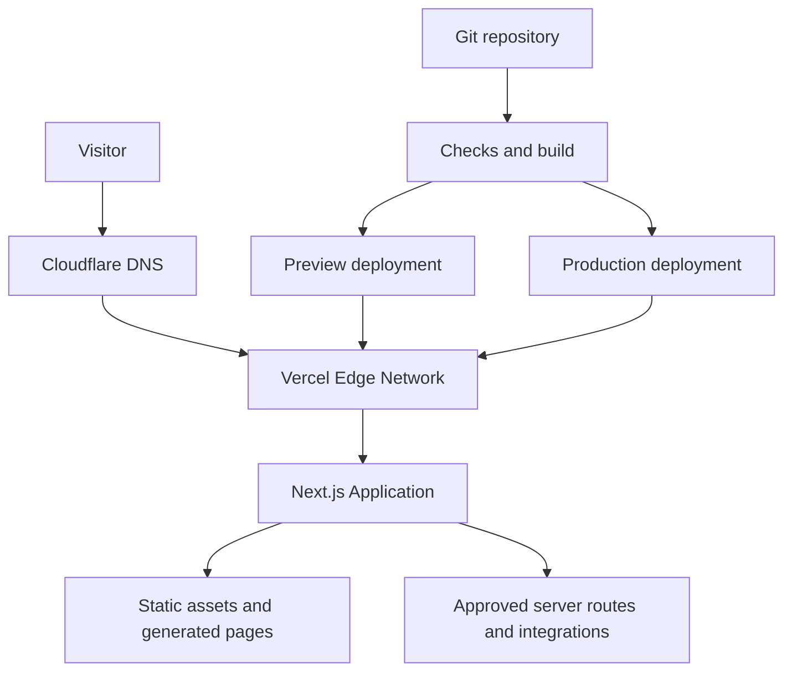

# Ahan Asa Deployment Architecture

**Document:** `DEPLOYMENT_ARCHITECTURE.md`  
**Project:** Ahan Asa (`ahanassa.com`)  
**Status:** Approved baseline for implementation  
**Last updated:** 2026-08-25  
**Primary stack:** Next.js App Router, TypeScript, Vercel, Cloudflare DNS  
**Related documents:** `TECHNICAL_ARCHITECTURE.md`, `STACK.md`, `CACHING_STRATEGY.md`, `ENVIRONMENT_VARIABLES.md`, `SECURITY_GUIDELINES.md`, `PRE_DEPLOY_CHECKLIST.md`, `POST_DEPLOY_CHECKLIST.md`

---

## 1. Purpose

This document defines how the Ahan Asa website is built, validated, released, hosted, observed, rolled back, and recovered. It is the source of truth for deployment decisions and must be read before changing domains, environments, build commands, hosting settings, CI checks, caching, or release workflows.

The deployment must remain:

- Repeatable: every release comes from a traceable Git commit.
- Reversible: production can be restored to a known-good deployment quickly.
- Isolated: development, preview, and production data and secrets never mix.
- Secure: secrets stay server-side and production access follows least privilege.
- Observable: a release is not complete until automated and manual checks pass.
- Search-safe: canonical hosts, redirects, robots directives, and sitemaps remain correct.

---

## 2. Architecture Decision Summary

| Area | Decision |
| --- | --- |
| Source control | Git repository with a protected `main` branch |
| Hosting and runtime | Vercel, using the native Next.js runtime |
| DNS authority | Cloudflare |
| Web DNS mode | **DNS-only** for Vercel-bound apex and `www` records unless a documented exception is approved |
| Canonical production URL | `https://www.ahanassa.com` |
| Apex behavior | `https://ahanassa.com/*` permanently redirects to `https://www.ahanassa.com/*` with path and query preserved |
| Production trigger | Merge or push to protected `main` after required checks pass |
| Preview trigger | Every pull request and non-production branch |
| Local environment | Developer machine only; never publicly indexed |
| Rendering strategy | Static-first; dynamic runtime only where a feature explicitly requires it |
| Release unit | Immutable Vercel deployment linked to a Git commit SHA |
| Rollback | Promote or roll back to the last verified production deployment |
| Package manager | Use the repository lockfile; exactly one package manager is permitted |
| Node.js version | Pinned in the repository and aligned with the selected Vercel runtime |
| Infrastructure changes | Reviewed and documented; never performed as an untracked dashboard-only experiment |

### Important Cloudflare boundary

Cloudflare remains the authoritative DNS provider. The normal web path uses DNS-only records so Vercel directly terminates requests and retains its native firewall, CDN, deployment protection, and request visibility. Cloudflare proxying in front of Vercel is a controlled exception because an additional reverse proxy can change firewall behavior, caching, client-IP handling, certificate troubleshooting, and incident diagnosis.

If Cloudflare proxying is later required for a specific business or security reason, record the reason in `DECISIONS.md`, define the cache bypass rules in `CACHING_STRATEGY.md`, and complete the exception tests in Section 15 before enabling it.

---

## 3. Deployment Topology



### Request path

1. The browser resolves `ahanassa.com` or `www.ahanassa.com` through Cloudflare DNS.
2. DNS returns the Vercel-configured target.
3. Vercel terminates TLS, applies its edge controls, resolves the active deployment, and serves cached/static content or invokes the required Next.js runtime.
4. The application contacts only allow-listed external services from server-side code where possible.
5. Responses include the security, cache, canonical, and locale headers or metadata defined in the related specifications.

Cloudflare Workers, Cloudflare Pages, a custom reverse proxy, and a separate container platform are **not** part of the baseline architecture.

---

## 4. Environments

| Environment | Source | URL | Data and integrations | Indexing | Purpose |
| --- | --- | --- | --- | --- | --- |
| Local | Developer branch | `http://localhost:3000` | Mock, sandbox, or explicitly approved development services | Not applicable | Implementation and local testing |
| Preview | Pull request or feature branch | Vercel-generated preview URL | Sandbox/test integrations only | Must be blocked from indexing | Review, QA, and stakeholder approval |
| Production | Protected `main` | `https://www.ahanassa.com` | Production integrations only | Indexable according to SEO specifications | Public website |

### Environment isolation rules

- Production credentials must never be available to local or preview builds unless a service has no safe sandbox and the exception is approved.
- Preview must not send real customer notifications, create real CRM leads, charge payments, or modify production records.
- Preview URLs must emit `noindex, nofollow` and should use Vercel deployment protection when stakeholder access permits it.
- `NEXT_PUBLIC_*` values are public by design and must never contain credentials or sensitive identifiers.
- A value required by browser code and a server secret must be treated as two different configuration classes.
- Environment variables are managed in the hosting environment; `.env*` files containing secrets are never committed.

The authoritative variable inventory, owners, validation rules, and rotation policy belong in `ENVIRONMENT_VARIABLES.md`.

---

## 5. Git and Release Model

### Branches

- `main`: production branch; protected; always expected to be deployable.
- Feature branches: short-lived branches named by task, for example `feat/rfq-form` or `fix/mobile-navigation`.
- Emergency fixes: branch from the current production commit, validate through preview, then merge normally unless the incident commander approves an expedited path.

Long-lived `develop` or `staging` branches are not required for the baseline. If a permanent staging environment becomes necessary, introduce it through an architecture decision rather than overloading preview.

### Required pull-request controls

- At least one qualified review for application or infrastructure changes.
- No direct pushes to `main` except an audited emergency procedure.
- Required status checks must pass before merge.
- The pull request must state user impact, test evidence, SEO impact, configuration changes, and rollback considerations.
- Generated files, dependency lockfile changes, migrations, and environment-variable changes must be explicitly called out.
- The merge commit or squash commit must describe the released behavior, not only the internal task name.

### Release identity

Every production release must be traceable to:

- Git commit SHA;
- pull request or approved change record;
- build logs;
- Vercel deployment identifier and URL;
- release timestamp;
- responsible person;
- post-deployment verification result.

---

## 6. Build Contract

The repository is the source of build truth. Dashboard settings may supply secrets and project bindings, but must not silently replace repository behavior.

### Required scripts

The exact package manager is determined by the committed lockfile. The following logical commands must exist, even if the script names vary by an approved repository convention:

```json
{
  "scripts": {
    "dev": "next dev",
    "lint": "next lint",
    "typecheck": "tsc --noEmit",
    "test": "<project test command>",
    "build": "next build",
    "start": "next start"
  }
}
```

If the installed Next.js version does not provide `next lint`, use the repository's ESLint command. Claude Code must inspect the installed version and existing scripts before modifying this block.

### Pinned inputs

- Commit exactly one lockfile.
- Pin the Node.js major version using the repository's approved mechanism.
- Do not use `latest` as a production dependency strategy.
- Dependency upgrades require a separate review when they affect Next.js, React, authentication, forms, analytics, image processing, or deployment adapters.
- CI and Vercel must use the same package manager and compatible Node.js version.

### Build-time validation order

1. Install dependencies with the frozen-lockfile mode.
2. Validate required environment-variable names without printing their values.
3. Run formatting verification if configured.
4. Run linting.
5. Run TypeScript checking.
6. Run unit and component tests.
7. Build the production application.
8. Run route, metadata, internal-link, and generated-file checks.
9. Deploy an immutable preview.
10. Run smoke and end-to-end tests against that preview.

No setting may suppress TypeScript or ESLint build errors merely to make deployment succeed. Fix the defect or document a narrowly scoped, reviewed exception.

---

## 7. Rendering and Runtime Strategy

The site is static-first because Ahan Asa is initially a marketing and procurement website. Choose the least complex runtime that satisfies each route.

| Route type | Preferred behavior | Notes |
| --- | --- | --- |
| Marketing pages | Static generation | Rebuild on content release |
| Articles and resources | Static generation or controlled revalidation | Revalidation policy belongs in the caching specification |
| RFQ/contact interface | Static UI plus secure server endpoint | Validate server-side; apply abuse controls |
| Sitemap and robots | Generated from the canonical route inventory | Must vary correctly by environment |
| Health endpoint | Lightweight dynamic or static response | Must not disclose secrets or internal topology |
| Admin/CMS | Separate protected service if introduced | Never expose an improvised public admin route |

Do not enable a full static export (`output: "export"`) unless every required Next.js feature and integration is compatible with it. Native Vercel static generation is sufficient for a static-first site and preserves the option to add secure route handlers later.

Runtime selection rules:

- Prefer the default supported runtime.
- Use edge runtime only when a measured requirement justifies it and all dependencies are compatible.
- Set function duration and regional behavior deliberately for external integrations.
- Never perform long-running procurement, document-generation, or batch work inside a user-facing request. Queue such work when it is introduced.

---

## 8. Vercel Project Configuration

### Project binding

- One Vercel project maps to the Ahan Asa production website.
- The correct Git repository is connected directly to that project.
- Production branch is `main`.
- Framework preset is Next.js unless an explicit repository configuration requires otherwise.
- Root directory remains the repository root unless the project becomes a reviewed monorepo.
- Build and install commands use framework defaults unless the repository defines intentional overrides.

### Deployment behavior

- Each pull request creates an isolated preview deployment.
- Merging to `main` creates a production candidate.
- Production is considered released only after verification, even if traffic has already moved to the deployment.
- Unverified deployments must not be manually promoted.
- Deployment retention must preserve enough verified releases to support the rollback objective in Section 12.

### Configuration-as-code rule

Use `vercel.json` only for behavior that cannot be expressed more clearly in Next.js configuration or code. Do not duplicate redirects, headers, or rewrites across `next.config.*`, middleware/proxy files, Cloudflare rules, and Vercel settings. Each rule has one owner.

Rule ownership:

| Concern | Primary owner |
| --- | --- |
| Application redirects and rewrites | Next.js configuration or application routing |
| Apex-to-`www` domain redirect | Vercel domain configuration |
| DNS records | Cloudflare DNS |
| Page metadata and canonical URLs | Next.js metadata implementation |
| Static asset caching | Next.js/Vercel defaults plus `CACHING_STRATEGY.md` |
| Security headers | One reviewed application or platform configuration layer |
| Legacy URL map | `REDIRECTS.md` and its generated implementation |

---

## 9. Domain, DNS, TLS, and Redirects

### Target state

| Host | Purpose | Behavior |
| --- | --- | --- |
| `www.ahanassa.com` | Canonical production host | Serves the active Vercel production deployment |
| `ahanassa.com` | Apex alias | Permanent redirect to the matching `www` URL |
| Vercel preview domains | QA only | Non-indexable and not canonical |

### DNS procedure

1. Add both apex and `www` domains to the correct Vercel project.
2. Read the exact DNS targets shown by Vercel; do not copy stale values from another project.
3. Create the required records in Cloudflare DNS.
4. Keep Vercel-bound web records DNS-only by default.
5. Remove conflicting `A`, `AAAA`, or `CNAME` records.
6. Wait for Vercel domain verification and certificate issuance.
7. Configure `www.ahanassa.com` as the primary domain.
8. Configure the apex to redirect to `www`, preserving path and query parameters.
9. Verify HTTP and HTTPS behavior for both hosts.

Do not hard-code example Vercel IP addresses or CNAME targets in this document because Vercel provides the project-specific required values.

### Redirect contract

All of these must resolve in at most one canonical redirect after the HTTP-to-HTTPS hop controlled by the platform:

- `http://ahanassa.com/example?x=1`
- `https://ahanassa.com/example?x=1`
- `http://www.ahanassa.com/example?x=1`
- `https://www.ahanassa.com/example?x=1`

The final URL must be:

`https://www.ahanassa.com/example?x=1`

Avoid redirect chains, loops, dropped query strings, mixed canonical hosts, and locale-changing redirects.

### TLS requirements

- TLS is issued and renewed by the serving platform.
- Production must never be launched while certificate state is pending or invalid.
- HSTS may be enabled only after every required subdomain is confirmed HTTPS-ready. Adding `includeSubDomains` or preload requires a separate irreversible-risk review.

---

## 10. Caching and CDN Responsibilities

Detailed TTLs and invalidation rules belong in `CACHING_STRATEGY.md`. Deployment must observe these boundaries:

- Vercel is the default application CDN and edge cache.
- Hashed framework assets may be cached as immutable.
- HTML, JSON, API responses, redirects, and error pages must not receive blanket “cache everything” rules.
- Authenticated, form, RFQ, preview, and personalized responses must not be publicly cached.
- Cache behavior must be testable from response headers.
- A release process must not depend on manual full-zone purges under the baseline DNS-only design.

If Cloudflare proxying is approved later:

- Bypass cache for Next.js data requests, APIs, forms, preview paths, authenticated requests, and non-GET/HEAD methods.
- Respect application cache headers unless an individual rule has documented ownership.
- Never modify Vercel or Next.js internal request headers without compatibility testing.
- Purge only the necessary cache keys after a release; a full purge is an incident tool, not the normal deployment mechanism.
- Verify that rollback restores both application deployment and edge-visible content.

---

## 11. Deployment Workflow

### A. Pull-request preview

1. Developer creates or updates a feature branch.
2. Local lint, typecheck, tests, and production build pass.
3. A pull request is opened with the required change summary.
4. CI runs all required checks.
5. Vercel creates a preview deployment.
6. Automated smoke and end-to-end tests target the preview URL.
7. Reviewer validates responsive UI, RTL behavior, forms, metadata, accessibility, and the changed user journey.
8. Any new environment variable is configured separately for Preview and Production before merge.
9. Approval is recorded in the pull request.

### B. Production release

1. Merge the approved pull request into protected `main`.
2. Vercel builds an immutable production deployment.
3. Confirm build logs contain no secret values and no unexpected warnings.
4. Run automated production smoke tests.
5. Complete the critical manual checks in Section 14.
6. Record the deployment SHA, timestamp, responsible person, and result in `CHANGELOG.md` or the release record.
7. Monitor errors, availability, Web Vitals, form delivery, and analytics during the observation window.

### C. Manual promotion

Manual promotion of a preview deployment is permitted only when:

- it is tied to the exact reviewed commit;
- all required checks passed against that deployment;
- production environment variables are validated;
- the promoter has production release authority;
- the action and reason are recorded.

Manual deployment from an uncommitted local working tree is prohibited for production.

---

## 12. Rollback and Recovery

### Recovery objectives

- **Deployment rollback target:** begin within 10 minutes of confirming a release-caused critical incident.
- **Service restoration target:** restore the last known-good application within 30 minutes where the hosting platform is operational.
- **Data recovery objective:** defined by each future stateful integration; the baseline marketing build must avoid deployment-coupled state changes.

These are operational targets, not contractual service-level agreements.

### Rollback triggers

- Homepage or critical route returns repeated `5xx` responses.
- RFQ/contact submissions fail or are routed incorrectly.
- A security regression or secret exposure is suspected.
- Canonical, robots, sitemap, or redirect behavior risks widespread SEO damage.
- A severe responsive, RTL, navigation, or accessibility defect blocks the primary user journey.
- Error rate or latency crosses the approved incident threshold.

### Rollback procedure

1. Declare the incident and freeze unrelated production changes.
2. Identify the most recent verified production deployment.
3. Use Vercel's production rollback/promote mechanism to restore it.
4. Verify canonical host, critical routes, static assets, forms, APIs, sitemap, and robots output.
5. If Cloudflare proxying is active under an exception, purge or bypass only stale affected cache entries.
6. Confirm monitoring has returned to normal.
7. Record the incident timeline and open a corrective pull request.

Do not “fix forward” under time pressure when a safe known-good rollback is available. Do not delete the failed deployment; retain it for diagnosis.

### Non-application failures

| Failure | Immediate response |
| --- | --- |
| DNS misconfiguration | Restore the last known-good Cloudflare DNS records; do not change application code |
| Certificate failure | Confirm domain verification and DNS mode; remove conflicting records; avoid unsafe TLS bypasses |
| External CRM/API outage | Degrade gracefully, preserve the lead when feasible, alert operations, and avoid repeated uncontrolled retries |
| Analytics outage | Keep the core website operational; analytics must fail non-blockingly |
| Vercel regional/platform incident | Confirm provider status, avoid repeated redeployments, communicate status, and use the approved disaster-recovery plan if thresholds are met |
| Compromised credential | Revoke and rotate it, redeploy affected environments, audit access, and invalidate exposed sessions or tokens |

---

## 13. Observability and Alerts

### Required signals

- Deployment success/failure and build duration.
- Production availability for the canonical homepage and at least one critical internal route.
- `4xx` and `5xx` trends, separated by route class where possible.
- Server-side exceptions and rejected external integration calls.
- Core Web Vitals and performance regressions.
- RFQ/contact submission success, validation failure, upstream delivery failure, and duplicate rate.
- Sitemap fetch, robots fetch, and canonical-host correctness.
- Analytics/tag-loading health without storing sensitive form data.

### Alert principles

- Alerts must be actionable and identify environment, deployment, route, severity, and first response.
- Production alerts must not expose submitted personal data or secrets.
- Synthetic checks must follow redirects and assert the final canonical URL.
- A successful HTTP status alone is insufficient; critical checks should assert expected content or response structure.
- Alert ownership and escalation destinations must be recorded before launch.

### Release observation window

For ordinary releases, actively observe the production deployment for at least 30 minutes. For domain, DNS, forms, analytics, dependency, framework, or caching changes, extend observation based on risk and traffic.

---

## 14. Required Deployment Checks

### Automated pre-merge gates

- [ ] Frozen-lockfile installation succeeds.
- [ ] Formatting check passes, if configured.
- [ ] Lint passes with no release-blocking warnings.
- [ ] Typecheck passes.
- [ ] Unit and component tests pass.
- [ ] Production build passes.
- [ ] No known high/critical exploitable dependency issue is accepted without documented risk approval.
- [ ] Route inventory contains no unintended duplicate paths.
- [ ] Internal link check passes.
- [ ] Metadata and canonical generation tests pass.
- [ ] Sitemap and robots generation tests pass.
- [ ] Preview smoke tests pass.
- [ ] Preview is non-indexable.

### Manual preview approval

- [ ] Homepage and modified pages match approved specifications.
- [ ] Persian content is RTL; embedded numbers, email, and technical terms render correctly.
- [ ] Mobile, tablet, and desktop layouts work at required breakpoints.
- [ ] Navigation, footer, CTAs, forms, validation, success, and failure states work.
- [ ] Keyboard navigation and visible focus are intact.
- [ ] Images have correct dimensions, loading behavior, and alternatives.
- [ ] No console error appears in the primary journeys.
- [ ] No test content, placeholder, preview URL, or secret is visible.

### Production verification

- [ ] `https://www.ahanassa.com` returns the expected release.
- [ ] Apex, `www`, HTTP, and HTTPS resolve to one canonical host without loops.
- [ ] Path and query strings survive host redirects.
- [ ] TLS certificate is valid.
- [ ] Homepage, key landing page, contact/RFQ page, `404`, sitemap, and robots routes work.
- [ ] Canonical and Open Graph URLs use the production host.
- [ ] Production is indexable only where intended.
- [ ] Form submission reaches the approved destination exactly once.
- [ ] Analytics and consent behavior work without blocking the page.
- [ ] Security and cache headers match their specifications.
- [ ] Monitoring and alerts identify the new deployment.
- [ ] Rollback target is known and retained.

---

## 15. Cloudflare Proxy Exception Checklist

Complete every item before changing a Vercel-bound record from DNS-only to proxied:

- [ ] Business/security reason and approver recorded in `DECISIONS.md`.
- [ ] Vercel's reverse-proxy limitations reviewed for the current platform behavior.
- [ ] Client IP and forwarding headers verified end-to-end.
- [ ] Vercel firewall, deployment protection, bot controls, and rate limits re-tested.
- [ ] Cloudflare SSL mode is strict and the origin certificate path is valid.
- [ ] No cache-everything rule applies to HTML, APIs, forms, previews, or authenticated traffic.
- [ ] Next.js static assets load across releases without stale-build mixing.
- [ ] Redirects do not loop between Cloudflare, Vercel, and Next.js.
- [ ] Preview deployments remain isolated and non-indexable.
- [ ] Rollback test proves users receive the restored version after edge caching.
- [ ] Purge permissions follow least privilege.
- [ ] Monitoring can distinguish Cloudflare-edge errors from Vercel-origin errors.
- [ ] A DNS-only rollback procedure and expected propagation behavior are documented.

If any item fails, retain DNS-only mode.

---

## 16. Security Controls in Deployment

- Production access requires individual accounts, multi-factor authentication, and least privilege.
- Shared credentials and API tokens are prohibited.
- Git, Vercel, Cloudflare, domain registrar, analytics, and integration access must have at least two authorized business owners to prevent single-person lockout.
- Repository secrets must be scanned before merge and in CI where available.
- Build and runtime logs must redact credentials and personal data.
- Dependencies, Next.js, and React security releases must be reviewed promptly; WAF protection is not a substitute for patching.
- Preview URLs must not expose production administration or unprotected diagnostic endpoints.
- Health endpoints return only minimal status information.
- Source maps, debug output, and verbose errors must follow the production security policy.
- Security headers are verified after deployment, not assumed from configuration.
- Domain registrar and Cloudflare changes require change logging and recovery-capable access.

---

## 17. Backups and Disaster Recovery

The deployed website can be reconstructed from Git plus authorized environment configuration. This does not automatically protect content or data held by external services.

### Required recoverable assets

- Git repository and release history.
- Production environment-variable inventory and rotation ownership; secret values remain in an approved secret system.
- Cloudflare DNS zone record export or documented record inventory.
- Vercel project/domain configuration record.
- CMS content export when a CMS is introduced.
- RFQ/CRM records according to the business retention policy.
- Media originals stored outside generated build output.

### Recovery test

At least twice per year, or after a major hosting/domain architecture change, verify that an authorized operator can:

1. identify the production commit;
2. reconstruct required configuration without copying secrets into chat or tickets;
3. create a working isolated deployment;
4. validate the canonical route set and forms;
5. restore DNS from the approved inventory.

---

## 18. Responsibilities

| Role | Responsibility |
| --- | --- |
| Product owner | Approves user-visible scope and planned launch timing |
| Technical owner | Owns architecture, release readiness, rollback, and incident decisions |
| Developer / Claude Code operator | Implements changes, runs required checks, and records configuration impact |
| Reviewer | Reviews code, architecture, security, SEO, and test evidence |
| Content/SEO owner | Approves indexability, metadata, redirects, sitemap, and canonical behavior |
| Operations owner | Verifies leads/integrations and receives production alerts |
| Domain administrator | Controls registrar and Cloudflare changes with recoverable access |

One person may hold multiple roles, but the responsibilities do not disappear.

---

## 19. Claude Code Rules

Claude Code must:

1. Read this file and the related specifications before deployment-related edits.
2. Inspect the repository, lockfile, installed versions, and existing provider configuration before proposing commands.
3. Never guess DNS targets, project IDs, team IDs, secret names, regions, or account settings.
4. Never print, commit, copy, or expose secret values.
5. Never bypass lint, type, test, or build failures to obtain a green deployment.
6. Never deploy an uncommitted or unexplained working tree to production.
7. Never alter production DNS, domains, environment variables, cache rules, or protection settings without explicit authorization.
8. Show the exact scope, risk, verification plan, and rollback path before a production infrastructure change.
9. Preserve unrelated user changes in a dirty working tree.
10. Update this document and `DECISIONS.md` when the actual deployment architecture changes.

### Stop conditions

Claude Code must stop and request direction when:

- the target Vercel project, Git repository, Cloudflare zone, or canonical domain is ambiguous;
- production secrets or account permissions are missing;
- a destructive DNS/domain change would remove a working production target;
- preview and production environment values cannot be safely separated;
- required checks fail and the requested action would bypass them;
- a database or external system change has no verified rollback path;
- the observed production architecture conflicts with this approved baseline.

---

## 20. Initial Setup Checklist

- [ ] Confirm the correct Git repository and owners.
- [ ] Protect `main` and configure required checks.
- [ ] Commit one lockfile and pin the Node.js major version.
- [ ] Create or connect the Vercel project.
- [ ] Configure separate Preview and Production variables.
- [ ] Add `ahanassa.com` and `www.ahanassa.com` to Vercel.
- [ ] Configure project-specific Cloudflare DNS records in DNS-only mode.
- [ ] Set `www.ahanassa.com` as canonical and apex as redirect.
- [ ] Verify TLS and the four host/protocol combinations.
- [ ] Add preview `noindex` protection.
- [ ] Configure CI build and test gates.
- [ ] Add uptime, error, form-delivery, and Web Vitals monitoring.
- [ ] Perform one preview-to-production rehearsal.
- [ ] Perform and record one rollback rehearsal before public launch.
- [ ] Record owners and emergency access for Git, Vercel, Cloudflare, registrar, analytics, and integrations.

---

## 21. Acceptance Criteria

This architecture is implemented when:

- every production release originates from an identifiable reviewed commit;
- every pull request receives an isolated, non-indexable preview;
- the production build cannot pass by ignoring type or lint errors;
- `https://www.ahanassa.com` is the only canonical production host;
- apex and protocol redirects preserve path and query without loops;
- Cloudflare DNS and Vercel responsibilities are unambiguous;
- preview and production secrets and integrations are isolated;
- critical paths, forms, SEO outputs, and monitoring are verified after release;
- a known-good deployment can be restored within the rollback target;
- production access, recovery ownership, and incident escalation are documented.

---

## 22. Open Decisions

Resolve these before the affected feature enters production:

| Decision | Current state | Owner |
| --- | --- | --- |
| Git repository URL and default organization | TBD | Technical owner |
| Package manager and lockfile | TBD until repository inspection | Technical owner |
| Pinned Node.js major version | TBD until framework version is selected | Technical owner |
| Production form/RFQ destination | TBD | Product and operations owners |
| Error monitoring provider | TBD | Technical owner |
| Synthetic uptime provider and alert channel | TBD | Operations owner |
| Analytics and consent implementation | TBD; see `ANALYTICS_TRACKING.md` | Marketing/technical owners |
| CMS and content publication workflow | TBD; see `CMS_ARCHITECTURE.md` | Content/technical owners |
| Permanent staging environment | Not required initially | Technical owner |
| Cloudflare proxy in front of Vercel | Not approved; DNS-only baseline | Technical/security owners |
| Disaster-recovery hosting alternative | Deferred until justified by business impact | Technical/product owners |

---

## 23. Official References

- [Vercel — Deployments](https://vercel.com/docs/deployments)
- [Vercel — Environments](https://vercel.com/docs/deployments/environments)
- [Vercel — Adding and configuring a custom domain](https://vercel.com/docs/domains/working-with-domains/add-a-domain)
- [Vercel — Deploying and redirecting domains](https://vercel.com/docs/domains/working-with-domains/deploying-and-redirecting)
- [Vercel — Reverse proxy servers and Vercel](https://vercel.com/docs/security/reverse-proxy)
- [Vercel — Production rollback](https://vercel.com/docs/deployments/rollback-production-deployment)
- [Next.js — Deploying](https://nextjs.org/docs/app/getting-started/deploying)
- [Next.js — Environment variables](https://nextjs.org/docs/app/guides/environment-variables)
- [Cloudflare — DNS records](https://developers.cloudflare.com/dns/manage-dns-records/)

---

## 24. Change Control

Update this document in the same pull request whenever any of these changes:

- hosting provider or runtime;
- Git branching or production trigger;
- canonical domain or redirect owner;
- Cloudflare DNS/proxy mode;
- build command, output mode, package manager, or Node.js version policy;
- environment model;
- release gates;
- caching ownership;
- rollback method or objectives;
- monitoring and alert ownership;
- disaster-recovery strategy.

Each update must include the reason, risk, migration steps, verification evidence, and rollback plan in `DECISIONS.md`.
