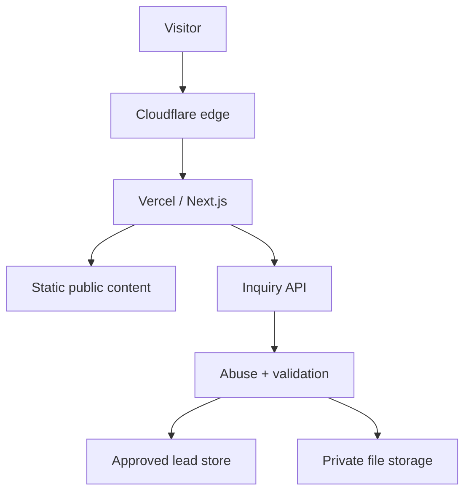
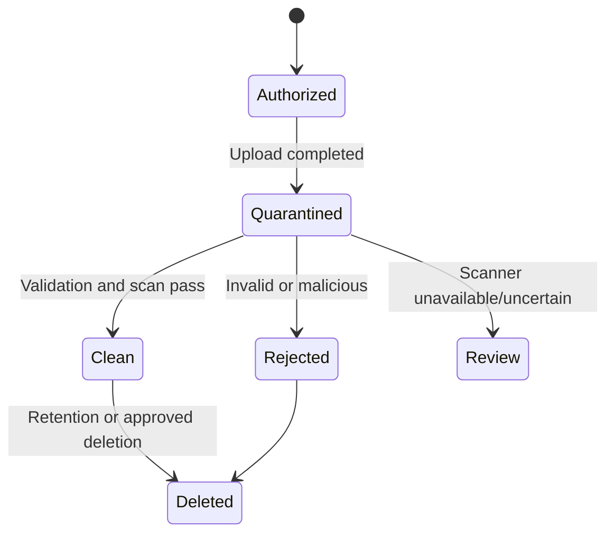

# Ahan Asa Website — Security Guidelines

> **Brand:** Ahan Asa | آهن آسا  
> **Domain:** `ahanassa.com`  
> **Document:** `SECURITY_GUIDELINES.md`  
> **Status:** Draft v1.0 — security baseline for implementation and launch  
> **Last updated:** 2026-08-25  
> **Launch locale:** Persian (`fa`), fully RTL  
> **Architecture:** Next.js App Router, static-first, Vercel behind Cloudflare  
> **Security target:** OWASP ASVS 5.0 Level 1 for the public site, with selected Level 2 controls for inquiries, personal data, integrations, and uploaded documents

---

## 1. Purpose

This document defines the mandatory security rules for designing, implementing, deploying, and operating the Ahan Asa website. It is written for Claude Code, human developers, reviewers, content operators, and service administrators.

The website is a premium B2B steel procurement platform. It is not an e-commerce store, customer portal, supplier marketplace, public price engine, or ERP in Phase 1. Its primary security-sensitive capability is the collection of procurement inquiries and, only after the required controls are approved, project documents such as invoices, bills of quantities, and material lists.

Security must support the brand promise **«ما مراقب سرمایه شما هستیم.»** by protecting visitor data, project documents, inquiry integrity, operational availability, and the credibility of the public website.

This document is a minimum baseline. A provider default, framework default, or successful deployment does not prove compliance.

## 2. Scope

These rules apply to:

- the public Persian website and all future approved locale routes;
- the canonical domain, redirects, DNS, TLS, CDN, WAF, and edge configuration;
- Next.js pages, layouts, Route Handlers, Server Components, and Client Components;
- inquiry and contact forms;
- secure document upload and download flows;
- APIs, webhooks, notifications, CRM/database adapters, and storage adapters;
- analytics, tag management, error monitoring, and other third-party scripts;
- repository access, dependencies, CI/CD, preview deployments, and production releases;
- logs, backups, retention, deletion, incident response, and operational access.

The following are outside Phase 1 unless separately approved and security-designed:

- customer or supplier accounts;
- authentication and session management for public users;
- online payment, cart, checkout, or binding online quotation;
- public inquiry tracking;
- live steel pricing or inventory;
- OCR or AI processing of uploaded documents;
- a public or internal customer portal;
- supplier marketplace features.

Adding any excluded capability requires a new threat model and an update to this document before implementation.

## 3. Source-of-truth hierarchy

Apply the project hierarchy defined in `TECHNICAL_ARCHITECTURE.md`. Within security work, use this order:

1. approved legal, privacy, contractual, and regulatory obligations;
2. `CLAUDE.md` and `PROJECT_BRIEF.md`;
3. `TECHNICAL_ARCHITECTURE.md`;
4. this `SECURITY_GUIDELINES.md`;
5. `DATA_ARCHITECTURE.md`, `FORM_ARCHITECTURE.md`, `API_INTEGRATIONS.md`, `CMS_ARCHITECTURE.md`, `ENVIRONMENT_VARIABLES.md`, and `DEPLOYMENT_ARCHITECTURE.md`;
6. framework/provider documentation for the exact locked version and account plan;
7. implementation examples.

If instructions conflict, preserve the safer current behavior, identify the conflict, and request a decision. Claude Code must not silently weaken a control to complete a task.

## 4. Security objectives

The implementation must protect:

### 4.1 Confidentiality

- Personal information must be visible only to authorized operational roles.
- Procurement inquiries and project documents must never appear in static bundles, page source, public object storage, analytics, client logs, build logs, or source control.
- Credentials and provider secrets must remain server-only.

### 4.2 Integrity

- Only approved content, claims, contact channels, and integrations may be published.
- Inquiry records must not be silently altered, duplicated, or falsely acknowledged.
- Uploaded documents must retain a verifiable relationship to the correct inquiry.
- Deployments, dependencies, and configuration changes must be reviewable and attributable.

### 4.3 Availability

- Public content should remain available even when the inquiry provider, notification provider, analytics, or upload system is unavailable.
- Abuse controls must protect server functions, storage, lead systems, and operational inboxes.
- A known healthy deployment must remain available for rollback.

### 4.4 Privacy and trust

- Collect only what is needed for the first procurement response.
- Explain collection and consent in natural Persian.
- Do not claim that a request was received unless durable persistence succeeded.
- Do not expose a document-upload control until the complete secure workflow is operational.

## 5. Security classification

Use the following data classes throughout schemas, storage, logs, access rules, and retention:

| Class | Examples | Browser/public? | Minimum handling |
| --- | --- | ---: | --- |
| Public | published pages, approved images, verified contact channels | Yes | Integrity review, safe caching |
| Internal | content drafts, non-sensitive configuration, operational metrics | No | Authorized staff access |
| Confidential | name, phone, email, company, project details, inquiry message | No | Encryption in transit/at rest, least privilege, no analytics/log payloads |
| Restricted | uploaded invoices, BOQs, material lists, supplier offers, consent/audit records, access logs | No | Private storage, explicit authorization, malware controls, access logging, approved retention |
| Secret | API tokens, signing keys, storage credentials, Turnstile secret, database credentials | Never | Secret store only, narrow scope, rotation and revocation plan |

When uncertain, use the more restrictive class until the data owner approves a lower classification.

## 6. Threat model

### 6.1 Primary assets

- the brand and canonical domain;
- public content and approved business claims;
- inquiry data and contact information;
- uploaded commercial and technical documents;
- lead records, notification routes, and integration credentials;
- Git repository, CI/CD, Cloudflare, Vercel, storage, analytics, and administrative accounts;
- availability of the public website and inquiry flow.

### 6.2 Expected threat actors and failure sources

- automated spam and bot traffic;
- malicious file uploaders;
- attackers seeking XSS, injection, SSRF, data disclosure, or denial of service;
- credential-stuffing or phishing attacks against administrators;
- compromised dependencies or third-party scripts;
- misconfigured DNS, CDN, storage, environment variables, caching, or preview deployments;
- accidental disclosure by developers, content editors, or operators;
- unauthorized insiders or excessively privileged provider accounts.

### 6.3 Priority abuse cases

1. Submit large volumes of fake inquiries.
2. Upload malware, polyglot files, macro-enabled documents, or files with misleading extensions.
3. obtain a public or reusable URL for a confidential client document.
4. inject executable content through inquiry fields, CMS content, Markdown/MDX, SVG, or file names.
5. bypass server validation by calling the API directly.
6. replay Turnstile tokens, upload authorizations, webhook events, or form submissions.
7. expose secrets through `NEXT_PUBLIC_*`, logs, source maps, preview builds, Git history, or error messages.
8. poison analytics or send PII to analytics/tag vendors.
9. deploy unauthorized code or a vulnerable dependency.
10. bypass Cloudflare controls by targeting an origin or deployment URL directly.

Review this threat model when scope, provider, form fields, file types, locale architecture, or data flow changes.

## 7. Mandatory secure architecture



Mandatory boundaries:

- Everything delivered to the browser is public and potentially cacheable, inspectable, and copyable.
- The browser must never call a CRM, database, email provider, or privileged object-storage API directly.
- All inquiry processing must pass through an Ahan Asa server-controlled endpoint.
- Public pages should remain static and server-rendered by default.
- Dynamic endpoints handling confidential data must use `no-store` and must not be statically cached.
- External providers must be accessed through narrow server-side adapters.
- Production submission stays disabled until an approved durable lead sink, privacy text, retention policy, access roles, abuse controls, and operational fallback exist.
- Upload stays disabled until private storage, scan workflow, access control, retention, and incident handling are verified end to end.

## 8. Transport, domain, DNS, and edge security

### 8.1 Canonical host and HTTPS

- Serve production only over HTTPS.
- Centralize the canonical origin in validated server configuration such as `SITE_URL`.
- Redirect all approved HTTP and alternate-host variants to the canonical HTTPS host with one intentional hop where practical.
- Never build canonical, redirect, or callback URLs from an untrusted request `Host` header.
- Validate host/origin on sensitive Route Handlers.
- Reject unexpected hosts on inquiry, upload-authorization, preview, and webhook endpoints.

### 8.2 TLS and HSTS

- Use provider-managed modern TLS and disable obsolete protocols/ciphers through the provider configuration.
- Enable HSTS only after HTTPS works on the canonical host and all included subdomains.
- Baseline production value after verification: `max-age=31536000`.
- Add `includeSubDomains` only after every subdomain is confirmed HTTPS-safe.
- HSTS preload requires a separate operational approval because rollback is slow and affects the whole domain.

### 8.3 DNS and account controls

- Cloudflare, Vercel, registrar, Git host, storage, and analytics administrator accounts require MFA.
- Prefer phishing-resistant MFA or hardware/security keys for owners and administrators.
- Do not share administrator accounts.
- Grant role-based access; routine content or analytics work must not require domain or deployment administration.
- Review account owners, recovery methods, API tokens, and unused collaborators at a defined recurring interval.
- Enable registrar lock and DNS change notifications where available.
- Document authoritative nameservers, canonical records, verification records, and ownership.

### 8.4 Edge controls

- Apply Cloudflare WAF managed rules appropriate to the plan and application.
- Rate-limit inquiry and upload-related endpoints at the edge and again in the application.
- Protect preview, draft, administrative, and diagnostic routes from public discovery and access.
- Do not rely on IP address as identity; use it only as one abuse signal and retain it according to the privacy policy.
- Avoid broad allow/deny rules that block legitimate Iranian or future regional users without evidence.
- Verify whether the Vercel origin/deployment hostname can bypass intended edge controls. Sensitive endpoints must still enforce server-side validation even when edge controls are bypassed.

## 9. HTTP security headers

Headers must be set centrally and tested on HTML, API, error, and downloadable-resource responses. Do not add incompatible headers blindly.

| Header/control | Baseline | Notes |
| --- | --- | --- |
| `Content-Security-Policy` | Enforced after report-only validation | See Section 10 |
| `Strict-Transport-Security` | `max-age=31536000` after HTTPS verification | `includeSubDomains` and preload need approval |
| `X-Content-Type-Options` | `nosniff` | All relevant responses |
| `Referrer-Policy` | `strict-origin-when-cross-origin` | Reduce cross-origin leakage |
| `X-Frame-Options` | `DENY` | Legacy fallback; CSP `frame-ancestors` is authoritative |
| `Permissions-Policy` | Deny unused capabilities | Camera, microphone, geolocation, payment, USB and other unused APIs |
| `Cross-Origin-Opener-Policy` | Evaluate `same-origin` | Test all approved integrations before enforcement |
| `Cross-Origin-Resource-Policy` | Resource-specific | Do not break approved CDN/media delivery |
| `Cache-Control` | Route-specific | Confidential/API responses must use `no-store` |

Additional rules:

- Remove unnecessary framework/server identification headers where supported.
- Do not use deprecated browser XSS filters as a substitute for output encoding and CSP.
- Private downloads must use `Content-Disposition: attachment` with a sanitized display filename and `X-Content-Type-Options: nosniff`.
- A security-header scanner result is evidence only for the tested host and route, not the full application.

## 10. Content Security Policy

### 10.1 Policy goals

The CSP must:

- block unapproved script execution;
- prevent object/plugin content;
- prevent unauthorized framing;
- restrict form submission to Ahan Asa endpoints;
- limit network, image, font, frame, and worker sources to approved origins;
- support reporting without sending sensitive page or form data.

Conceptual minimum directives:

```text
default-src 'self';
base-uri 'self';
object-src 'none';
frame-ancestors 'none';
form-action 'self';
script-src <version-appropriate strict policy>;
style-src <approved self-hosted/style policy>;
img-src 'self' data: <approved image hosts>;
font-src 'self' <approved font hosts>;
connect-src 'self' <approved analytics/Turnstile endpoints>;
frame-src <approved Turnstile/video hosts>;
upgrade-insecure-requests;
```

### 10.2 Next.js implementation rule

- Use the official CSP guidance for the exact locked Next.js version.
- A nonce-based strict CSP can require per-request dynamic rendering. Do not convert static public pages to dynamic rendering without measuring and approving the architectural impact.
- Where the locked version supports a reviewed hash/SRI or static-compatible strategy, evaluate it for static routes.
- Never add `'unsafe-eval'` in production.
- Do not retain `'unsafe-inline'` as an unreviewed permanent exception.
- Add third-party origins individually; never use broad schemes or wildcards for convenience.
- Start changes in `Content-Security-Policy-Report-Only`, review real violations, remove false positives and unapproved sources, then enforce.
- CSP reports must not include confidential form values, query parameters, or document identifiers.

### 10.3 Third-party scripts

- No script may be added through GTM, a CMS, or code without owner, purpose, privacy, performance, CSP, and removal review.
- Prefer server-rendered or self-hosted functionality over third-party JavaScript.
- Do not let GTM become an unreviewed production code-deployment channel.
- Lock GTM publishing permissions to authorized roles and require change review.
- Use Subresource Integrity only where a stable third-party asset URL and update process make it reliable; it does not replace source approval.

## 11. Input validation and output safety

### 11.1 General rules

- Treat every request header, query parameter, path segment, cookie, form value, uploaded file, CMS value, and provider response as untrusted.
- Validate on the server with explicit schemas and strict object handling.
- Reject unknown fields at confidential write boundaries.
- Apply type, length, format, enum, and business-rule limits before persistence or provider calls.
- Normalize Unicode and whitespace deliberately; do not apply destructive normalization that changes technical identifiers or document meaning.
- Use allowlists for enum-like data, file types, URLs, locale codes, and redirect destinations.
- Never construct SQL, shell commands, template code, file paths, URLs, or headers through unsafe string concatenation.
- Use parameterized database access through an approved adapter.
- Escape output for its actual context. React escaping is helpful but does not make `dangerouslySetInnerHTML`, URLs, CSS, JSON-LD, or third-party renderers safe.

### 11.2 Rich content, Markdown, MDX, and CMS content

- Repository-authored MDX may execute only reviewed imports/components.
- Untrusted editor content must never execute arbitrary MDX, JSX, JavaScript, HTML, or iframe code.
- Use an allowlisted block renderer and sanitize any permitted HTML.
- Disallow script tags, event-handler attributes, `javascript:` URLs, unapproved iframes, and inline executable SVG.
- JSON-LD builders must accept typed approved fields; never interpolate raw user input.
- External links require URL parsing and approved protocol handling.

### 11.3 SVG and media

- Treat SVG as executable content.
- Use only trusted, reviewed, or sanitized SVG assets.
- Do not accept SVG in public inquiry uploads.
- Remote image sources require explicit host allowlisting.
- Never expose confidential customer/project names in public asset filenames, metadata, alt text, or URLs.

## 12. Inquiry form security

### 12.1 Approved Phase 1 principle

The primary form may collect the minimum required fields defined in `FORM_ARCHITECTURE.md`. Current intended minimum includes name, phone, delivery city, and the information needed to understand the request. Email and additional project fields may remain optional if approved.

### 12.2 Server-controlled submission

Recommended boundary:

```text
POST /api/inquiries
Content-Type: application/json
Cache-Control: no-store
```

The server must:

1. enforce request-body and header-size limits;
2. accept only the intended HTTP method and content type;
3. validate canonical host and allowed origin behavior;
4. verify Turnstile server-side when enabled;
5. apply edge and application rate limits;
6. validate and normalize the payload with the authoritative schema;
7. reject unknown fields;
8. minimize data before persistence and notification;
9. use an idempotency mechanism for retries;
10. persist to the approved durable lead store;
11. send only a non-sensitive operational notification;
12. return a stable public response without provider or database details.

### 12.3 Honest success and failure states

- Show success only after the lead system confirms durable persistence.
- Do not treat an analytics event, client-side state change, or notification email as proof of persistence.
- Return a non-guessable public reference when operationally required; do not return a database primary key.
- On provider outage, preserve user-entered values where safe and show a localized recoverable error.
- Do not falsely state «درخواست شما ثبت شد» when the backend is missing or unavailable.
- If production submission is disabled, mark the integration point clearly in code and UI and provide only an approved real fallback contact channel.

### 12.4 CSRF, CORS, and browser-origin controls

- CORS is not an authorization mechanism.
- Deny cross-origin API access by default; allow only explicitly approved origins.
- Validate `Origin` and expected host for browser form submissions.
- Use JSON requests and an approved anti-CSRF pattern where browser credentials or cookies are introduced.
- If future authenticated sessions use cookies, require `Secure`, `HttpOnly`, an appropriate `SameSite` value, CSRF protection, rotation, and server-side authorization.
- Never place confidential form data in URLs.

### 12.5 Abuse controls

- Use Cloudflare Turnstile with mandatory server-side Siteverify validation.
- Treat Turnstile tokens as short-lived and single-use; reject expired or replayed tokens.
- Validate the hostname/action data returned by the verification service against the environment.
- Use official test keys outside production; do not ship a hidden bypass flag.
- Rate-limit by multiple signals where available, not only a single IP.
- Enforce payload, field, file-count, and submission-frequency limits.
- Add progressive controls for repeated abuse without harming accessibility or legitimate users.
- Never expose precise rule thresholds or provider internals in public errors.
- Retain abuse telemetry only for the approved security purpose and retention window.

## 13. Secure document upload

### 13.1 Launch gate

Upload must remain disabled until all items below have an approved and tested implementation:

- allowed extensions/MIME types and maximum file count/size;
- private object storage and least-privilege credentials;
- short-lived upload authorization;
- server-side metadata validation;
- malware scanning and failure handling;
- quarantine and clean-state transition;
- authorized download flow;
- access logs and operational roles;
- retention/deletion policy and privacy notice;
- incident procedure for malicious or exposed files.

An attractive upload control without this workflow is prohibited.

### 13.2 Allowed business formats

The intended formats are:

- PDF: `.pdf`;
- image: `.jpg`, `.jpeg`, `.png`;
- spreadsheet: `.xls`, `.xlsx`.

All other formats are denied by default. In particular, deny SVG, HTML, script, executable, archive, shortcut, disk-image, and macro-enabled Office formats unless a new approved business case and control set exists.

Legacy `.xls` may contain active content. It must be treated as high risk: never execute, preview, calculate, or open it server-side as part of the web request. Detect macros/active content where the scan pipeline supports it and reject or quarantine according to the approved operational policy.

### 13.3 Validation and storage rules

- Verify extension, declared MIME type, detected content signature/magic bytes, and structural validity; no single signal is sufficient.
- Sanitize the display filename and remove path components, control characters, bidirectional spoofing characters, and dangerous trailing characters.
- Generate the storage key server-side using a random, non-guessable identifier. Never use the original filename as the object key.
- Enforce file count, per-file size, total-request size, and user/account storage limits before expensive processing.
- Upload directly to private storage only through a narrowly scoped, short-lived signed authorization.
- Scope authorization to one object, intended method, maximum size, allowed content constraints where supported, and a short expiration.
- Never place storage credentials in the browser.
- Store objects in a quarantine state until validation and malware scanning succeed.
- Keep the bucket/container private; disable directory listing and anonymous object access.
- Encrypt in transit and at rest using provider-supported controls.
- Record checksum, detected type, size, scan result, inquiry relationship, upload time, retention deadline, and access log status.
- Do not parse, render, transform, OCR, or feed documents to AI in Phase 1.

### 13.4 Scan and release workflow



- A scan timeout or service failure is not a clean result.
- Operators must not receive a public direct link to quarantined content.
- Notifications may state that a document is pending review but must not attach it or expose its URL.
- Do not automatically decompress unsupported archives. Office container inspection must enforce resource limits.
- Prevent race conditions in which a file becomes downloadable before its clean state is committed.

### 13.5 Authorized download

- Require authenticated and authorized staff access through the approved internal system.
- Check the staff role and inquiry relationship on every access; knowledge of an object ID is not authorization.
- Generate short-lived, single-purpose download URLs only after authorization.
- Prefer download disposition over inline rendering for untrusted documents.
- Log document access using staff identity, document ID, time, result, and safe context; never log URL signatures.
- Revoke access when the inquiry closes, an employee leaves, a role changes, or the retention period expires.

## 14. Data privacy, retention, and deletion

### 14.1 Data minimization

- Each field requires a documented conversion or operational purpose.
- Optional fields must remain optional in UI and server validation.
- Do not collect national IDs, payment-card data, passwords, or unrelated personal information in Phase 1.
- Do not request confidential project documents before they are needed.
- Do not copy inquiry content into analytics, chat widgets, session replay, error monitoring, or marketing systems.

### 14.2 Consent and legal text

- Show the approved Persian privacy notice at the point of collection.
- Consent must be specific, understandable, unbundled where required, and never preselected.
- Store the accepted notice/version, timestamp, collection context, and evidence required by the approved policy.
- Claude Code must not invent legal wording, retention promises, cross-border-transfer claims, or regulatory compliance claims.

### 14.3 Retention gate

Production collection of personal information and documents requires an approved schedule covering:

- active inquiry data;
- unsuccessful or abandoned inquiries;
- uploaded documents;
- consent/audit records;
- security and access logs;
- provider backups and deletion lag;
- analytics and abuse telemetry.

Until the project owner and authorized legal/privacy reviewer approve concrete periods, do not invent defaults. Store a `retentionUntil` value only from the approved policy.

### 14.4 Deletion and access requests

- Define an accountable owner and verified workflow for access, correction, and deletion requests.
- Verify the requester without collecting excessive new data.
- Delete or anonymize all in-scope copies, provider records, and storage objects according to policy.
- Preserve only records that must legally or contractually remain, with documented basis and restricted access.
- Record completion without retaining the deleted confidential content in the deletion log.

## 15. Secrets and environment configuration

### 15.1 Core rules

- Never commit secrets to Git, source files, Markdown, issue text, screenshots, fixtures, generated bundles, or `.env.example` values.
- Values prefixed with `NEXT_PUBLIC_` are public. They must never contain credentials or confidential configuration.
- Read server secrets only in server-only modules.
- Use separate credentials for local/test, preview, and production.
- Use the deployment provider's encrypted/sensitive variable controls and least-privilege service credentials.
- Validate required configuration at startup or build time without printing secret values.
- Do not send full environment objects to logs or error monitoring.
- Use scoped, revocable tokens instead of personal administrator tokens.

### 15.2 Lifecycle

- Document owner, purpose, environment, scope, creation, rotation trigger, and revocation method for every secret.
- Rotate immediately after suspected exposure, unauthorized access, personnel/role change, or provider compromise.
- Revoke unused and superseded credentials.
- Test rotation and rollback without revealing the value.
- Secret scanning must run in local hooks and/or CI; a discovered secret is considered exposed even if the commit is later removed.

### 15.3 Server/client separation

- Mark secret-bearing modules as server-only where supported.
- Add tests or lint rules preventing server-only modules from Client Components.
- Never return raw provider configuration or error objects to the browser.
- Signed upload/download URLs are temporary credentials: keep them out of analytics, referrers, logs, and screenshots.

## 16. API and integration security

### 16.1 General integration rules

- No production integration may use guessed endpoints, credentials, field names, or permissions.
- Keep providers behind typed, narrow adapters.
- Define explicit connect/read/write permissions and deny unused capabilities.
- Set request timeouts, bounded retries with backoff, and circuit/failure behavior.
- Retry only idempotent operations or operations protected by an idempotency key.
- Validate provider responses before using or persisting them.
- Do not forward raw user input into email templates, provider URLs, headers, or queries.
- Do not let a notification failure roll back a lead that was already durably stored; alert operations separately.

### 16.2 Webhooks

- Accept webhooks only on a dedicated endpoint.
- Verify the provider signature over the exact raw body using the documented algorithm.
- Validate timestamp/age and reject replayed event IDs.
- Enforce body-size and content-type limits.
- Return a minimal response and process slow work asynchronously where supported.
- Store only the fields required for the approved workflow.
- Never rely on a secret URL path alone for authenticity.

### 16.3 SSRF and outbound requests

- Do not fetch arbitrary user-supplied URLs.
- Use an allowlist of schemes, hosts, ports, and paths for server-side outbound calls.
- Deny loopback, link-local, metadata-service, private-network, and unexpected redirect targets.
- Revalidate the destination after redirects and DNS resolution where the implementation permits.
- Apply short timeouts and response-size limits.

### 16.4 Email and messaging notifications

- Notifications contain a lead reference and minimal routing context, not full inquiry text or attached documents, unless explicitly approved and encrypted appropriately.
- Escape user-entered content for the message format.
- Do not use the user's email address as the provider `From` identity.
- Configure approved sender-domain authentication records and monitor failures.
- Recipients must come from server configuration, never from a public form field.

## 17. Authentication and administrative access

Phase 1 has no public customer authentication. Do not add login, account, session, password reset, or role-management code pre-emptively.

If a CMS, preview system, internal document interface, or portal is introduced:

- use an approved identity provider rather than custom password storage where practical;
- require MFA for privileged roles;
- define least-privilege roles for owner, developer, publisher, reviewer, analyst, and inquiry operator;
- separate content publishing from infrastructure administration;
- enforce authorization on the server for every action and object;
- use secure, HttpOnly, SameSite cookies and short, risk-appropriate sessions;
- rotate sessions after authentication/privilege change and revoke them after role removal;
- audit login, failed login, MFA, privilege, publication, secret, export, and document-access events;
- protect preview/draft URLs with real authorization, `no-store`, and `noindex`; secrecy of a URL is insufficient.

This future capability requires its own approved authentication/session threat model.

## 18. Logging, analytics, and monitoring

### 18.1 Safe logging

Structured server logs may contain:

- timestamp and environment;
- operation/route category;
- correlation ID;
- non-sensitive public reference;
- result category and safe duration;
- provider status category without raw payload;
- security event code and action taken.

Never log:

- full request bodies or inquiry messages;
- names, phone numbers, emails, company/project details, or delivery addresses;
- uploaded filenames, file contents, signed URLs, or document metadata beyond safe internal IDs;
- cookies, authorization headers, Turnstile tokens, webhook signatures, API keys, or environment values;
- database connection strings or provider error dumps.

Sanitize log fields to prevent log injection. Restrict log access and define retention.

### 18.2 Analytics

- Use stable event IDs and approved non-sensitive parameters.
- Never send PII, inquiry text, file names, quote values, document IDs, or exact project data.
- `inquiry_success` fires only after durable server confirmation.
- Keep preview/development traffic separate or disabled.
- Marketing/analytics tags must follow the approved consent policy.
- Session replay, keystroke capture, and form-field recording are prohibited unless separately privacy- and security-approved with masking verified.
- Test the real network payloads, not only the tag configuration UI.

### 18.3 Alerts

Monitor and alert on:

- unusual `4xx`/`5xx` patterns and application exceptions;
- inquiry persistence failures and provider outages;
- bursts of rejected submissions or Turnstile failures;
- upload scan failures, stuck quarantine, and abnormal storage growth;
- unauthorized or failed administrative access;
- unexpected DNS, domain, deployment, or environment changes;
- vulnerable production dependencies and failed security checks;
- CSP violations after noise reduction;
- public storage exposure or secret-scanning findings.

Alert messages must remain non-sensitive.

## 19. Dependency and software supply-chain security

- Use `pnpm` only and commit `pnpm-lock.yaml`.
- CI installs from the lockfile using a frozen/immutable mode.
- Add a dependency only for a documented need; prefer platform/native capabilities for small tasks.
- Review package owner, maintenance, release history, license, transitive footprint, install scripts, permissions, and known vulnerabilities.
- Pin or tightly constrain security-sensitive dependencies according to the approved update policy.
- Do not execute code copied from packages, gists, AI output, or setup scripts without review.
- Restrict package lifecycle scripts from new/untrusted dependencies until reviewed.
- Run automated dependency and secret scanning on pull requests and the production branch.
- Generate a software bill of materials for production releases when the CI platform supports it reliably.
- Critical exploitable vulnerabilities block release. Other findings require documented severity, exposure, owner, and remediation date.
- Major framework/runtime upgrades require compatibility, CSP, rendering, dependency, and security regression tests.
- Remove unused packages, scripts, environment variables, provider tokens, and integrations.

## 20. Repository, CI/CD, and deployment security

### 20.1 Repository

- Require MFA and individual accounts for repository access.
- Protect the production branch; no direct unreviewed production changes.
- Require review for workflow, dependency, infrastructure, security, and secret-handling files.
- Apply CODEOWNERS or an equivalent approval mechanism to sensitive paths when the repository platform supports it.
- Do not grant workflows broad write permissions by default.
- Pin third-party CI actions/workflows to reviewed immutable references where practical.
- Fork/unknown pull requests must not receive production secrets.

### 20.2 Required CI security gates

At minimum:

```text
pnpm lint
pnpm typecheck
pnpm test
pnpm test:e2e
pnpm build
```

Also require:

- secret scanning;
- dependency/vulnerability review;
- tests for schemas, authorization boundaries, headers, rate limits, and upload policy when enabled;
- production-build inspection for secret leakage and public source maps;
- route/status, canonical, robots, and preview-indexing checks;
- accessibility checks for security controls such as Turnstile and errors.

### 20.3 Environment isolation

| Environment | Security policy |
| --- | --- |
| Local | Test credentials only; no production data or secrets |
| Preview | Protected/noindex; isolated test lead destination; no production notifications or storage |
| Production | Production credentials and approved providers only |

- Preview deployments must not submit into production sales workflows.
- Production secrets must not be copied into local `.env` files unless explicitly required and handled by approved secure procedure.
- Environment variables must be scoped to only the environments that need them.
- Verify that preview URLs do not expose drafts, stack traces, source maps, test data, or administrative tools.

### 20.4 Release and rollback

- Block production deployment when required checks fail.
- Record the commit, reviewer, configuration change, migration, and deployment identity.
- Use a known healthy deployment for rollback.
- Security configuration changes require a rollback plan before enforcement.
- Database/storage schema changes, when introduced, must be backward-compatible or have an explicit safe rollback and data-integrity plan.
- Post-deploy smoke tests must verify canonical redirects, headers, forms, controlled failures, Turnstile, storage privacy, analytics payloads, and absence of secret exposure.

## 21. Caching and confidential response controls

- Inquiry, upload authorization, preview, authenticated, and private download responses use `Cache-Control: no-store`.
- Never cache provider error bodies or user-specific validation payloads at shared edges.
- Do not put personal or restricted data in React Server Component caches, static generation output, `unstable_cache`, CDN keys, or browser storage.
- Public static pages may use long-lived immutable deployment caching.
- Vary behavior must be explicit; avoid cache poisoning through untrusted headers or query parameters.
- Cache keys and revalidation tags must never contain PII or secrets.
- Service workers/offline caches require separate approval and must exclude inquiry/API/private routes.

## 22. Browser storage and client-side state

- Do not store inquiry data, uploaded document content, access tokens, or signed URLs in `localStorage`, `sessionStorage`, IndexedDB, analytics state, or URL parameters.
- Keep recoverable form state in memory unless an approved privacy-preserving draft requirement exists.
- Clear sensitive client state after confirmed submission or deliberate cancellation.
- Clipboard and file APIs require explicit user action.
- Do not expose hidden fields as security controls; all enforcement remains server-side.
- Avoid dangerously rendered HTML and dynamic code execution (`eval`, `new Function`).

## 23. Error handling and information disclosure

- Public errors must be localized, calm, actionable, and non-technical.
- Never return stack traces, SQL/provider messages, internal paths, secret names, bucket names, recipient addresses, rate-limit thresholds, or scan-engine details.
- Use stable public error codes such as validation, rate-limited, verification failed, and service unavailable.
- Assign correlation IDs to unexpected failures without encoding PII.
- Production error pages must not reveal framework debug output.
- A `404` remains a true `404`; a service failure must not become a misleading success page.
- Error monitoring must scrub request bodies, headers, query strings, cookies, and breadcrumbs before transmission.

## 24. Security verification strategy

### 24.1 Baseline

- Use OWASP ASVS 5.0 Level 1 as the minimum public-site verification baseline.
- Apply selected Level 2 rigor to inquiry processing, personal information, private documents, administrative access, and integrations.
- Map each applicable requirement to implementation evidence or a documented not-applicable reason.
- Automated scanners supplement, but never replace, code review and manual testing.

### 24.2 Mandatory test cases

#### Public application

- HTTPS and canonical redirect matrix is correct.
- Unexpected hosts and unsupported methods are rejected at sensitive endpoints.
- Security headers are present and CSP is effective on representative HTML/error/API routes.
- Unapproved framing, script sources, mixed content, and unsafe redirects are blocked.
- Public pages contain no draft, private, or environment-specific data.
- Unknown routes return the intended status.

#### Inquiry API

- invalid content type, oversized body, unknown fields, malformed Unicode, and invalid enums are rejected;
- HTML/script payloads are stored/rendered safely and cannot execute;
- missing, invalid, expired, replayed, wrong-host, and wrong-action Turnstile results fail;
- cross-origin and unexpected-host requests fail;
- rate limits work at edge and application layers;
- duplicate idempotency attempts create at most one lead;
- provider timeout/outage returns an honest recoverable state;
- public response/logs contain no confidential data or provider internals.

#### Upload, when enabled

- extension/MIME/signature mismatch is rejected;
- double extensions, path traversal names, bidi-spoofed names, oversized files, excessive count, and truncated files are rejected;
- SVG, HTML, executable, archive, and unsupported active-content files are rejected;
- malware test sample follows the approved safe scanner-validation method and never enters production data flow;
- files remain unavailable while quarantined or scan-failed;
- signed authorization cannot upload another key, larger object, wrong method, or after expiry;
- direct anonymous object access fails;
- unauthorized staff/document access fails;
- download URLs expire and do not appear in logs/analytics/referrers;
- retention deletion removes the object and related access path.

#### Secrets and deployment

- no server secret appears in client chunks, source maps, build logs, error payloads, or repository history;
- preview uses test destinations and is not indexable;
- production rollback is tested;
- revoked credentials no longer work;
- provider accounts enforce MFA and least privilege.

### 24.3 Release blockers

Do not launch or enable the affected feature when:

- a critical/high exploitable vulnerability is open;
- production inquiry persistence is unverified;
- upload privacy, scan, authorization, or retention is incomplete;
- a secret is exposed and not rotated/revoked;
- preview and production data are not isolated;
- CSP/headers are absent without an approved temporary exception;
- logs or analytics contain PII/restricted data;
- an administrative account lacks the required MFA;
- rollback and incident ownership are unknown.

## 25. Vulnerability handling and incident response

### 25.1 Before launch

Assign and document:

- security/incident owner;
- technical responder;
- business owner;
- legal/privacy reviewer;
- provider escalation contacts;
- approved internal communication channel;
- backup responder and access-recovery procedure.

### 25.2 Severity

| Severity | Examples | Required response |
| --- | --- | --- |
| Critical | active data disclosure, secret compromise with production access, public private storage, domain takeover | Immediate containment and owner escalation |
| High | exploitable upload bypass, authorization bypass, stored XSS, major provider/account compromise | Disable affected capability, remediate before normal operation |
| Medium | limited information disclosure, meaningful abuse-control weakness, vulnerable dependency with constrained exposure | Assign owner and time-bound remediation |
| Low | defense-in-depth gap with no demonstrated sensitive impact | Track and remediate in normal security work |

Concrete response-time commitments must be approved operationally; do not invent public SLAs.

### 25.3 Response process

1. Detect and open an incident record with time, reporter, scope, and evidence.
2. Contain: disable the affected endpoint/integration, revoke credentials, restrict access, or roll back.
3. Preserve relevant logs and configuration without copying unnecessary personal data.
4. Determine affected data, users, environments, dates, providers, and attack path.
5. Eradicate the root cause; do not only block one indicator.
6. Recover from a known healthy state and verify controls.
7. Complete required legal, contractual, provider, and user notifications through authorized owners.
8. Record lessons, follow-up tasks, and document updates.

Never publicly speculate about an incident or promise that no data was affected before investigation.

### 25.4 Vulnerability reports

- Publish a security contact or `security.txt` only when a monitored owner and response process exist.
- Do not publish personal employee addresses as the security contact.
- Acknowledge good-faith reports and avoid requesting sensitive exploit data through insecure channels.
- Test fixes in an isolated environment and credit reporters only with their permission.

## 26. Security exceptions

An exception requires a written record containing:

- control being waived;
- affected routes/data/environments;
- business reason;
- threat and worst credible impact;
- compensating controls;
- approving owner and technical reviewer;
- start and expiry date;
- verification and removal plan.

Exceptions must expire. “Provider default,” “temporary,” “works locally,” or “needed to pass the build” is not sufficient justification.

## 27. Claude Code implementation rules

Before security-relevant work, Claude Code must:

1. read `CLAUDE.md`, `TECHNICAL_ARCHITECTURE.md`, this document, and every task-relevant specialized specification;
2. inspect the existing route/data flow, locked dependency versions, environment boundaries, and tests;
3. identify the trust boundary and data classification;
4. state any unresolved provider/legal/retention decision;
5. preserve disabled features when a decision gate is incomplete;
6. implement the smallest coherent secure change;
7. run relevant tests and report exact results.

Claude Code must not:

- invent credentials, endpoints, recipient addresses, bucket names, retention periods, privacy claims, or security approvals;
- expose secrets through `NEXT_PUBLIC_*`, client code, logs, tests, screenshots, Markdown, or examples;
- enable a form that cannot durably persist a lead;
- enable upload without private storage, scanning, authorization, access logging, and retention;
- weaken CSP, validation, origin checks, rate limits, malware controls, authorization, or logging rules to make a test pass;
- add `'unsafe-eval'`, broad CSP wildcards, permissive CORS, public storage, or anonymous private-document access;
- trust client validation, client MIME type, original filenames, hidden fields, Turnstile client status, or provider callbacks without verification;
- add a CMS, authentication, customer portal, payment, chat, session replay, or unapproved analytics integration;
- add or upgrade a security-sensitive dependency without review;
- claim a vulnerability is fixed without a regression test;
- claim compliance or launch readiness without evidence.

When a required production decision is missing, Claude Code must keep the feature disabled, leave a clear typed integration boundary, and report the exact blocker.

## 28. Decision gates

| Decision | Current state | Security effect |
| --- | --- | --- |
| Canonical host | Recommended `https://www.ahanassa.com`; final production verification required | Redirect, host validation, CSP, Turnstile host |
| Lead system of record | Not approved | Production inquiry remains disabled |
| Notification provider/recipients | Not approved | No production notification integration |
| Upload storage provider | Not approved | Upload remains disabled |
| Malware scanner and uncertain-result workflow | Not approved | Upload remains disabled |
| Maximum file size/count | Must be defined in `FORM_ARCHITECTURE.md` | Upload remains disabled |
| Retention/deletion schedule | Not approved | Production collection cannot be declared ready |
| Inquiry/document access roles | Not approved | No internal document access UI |
| Privacy/consent wording | Requires authorized approval | Form cannot launch with invented legal copy |
| GTM/GA4 IDs and consent policy | Not approved | Tags remain disabled/placeholder-free |
| Error-monitoring provider | Not selected | No external error payloads |
| CMS/authentication | Not selected; not needed for Phase 1 | No login or editorial admin surface |
| HSTS subdomains/preload | Not approved | Use verified host-only baseline first |
| CSP implementation mode | Must match locked Next.js version and rendering plan | Report-only test before enforcement |

## 29. Launch security checklist

### Accounts and infrastructure

- [ ] MFA is enabled for registrar, Cloudflare, Git, Vercel, storage, analytics, and lead-system administrators.
- [ ] Individual accounts and least-privilege roles are confirmed.
- [ ] Unused collaborators, tokens, domains, and integrations are removed.
- [ ] DNS, TLS, canonical redirects, and domain ownership are verified.
- [ ] WAF and rate-limit rules are active and tested.

### Application

- [ ] Strict TypeScript, lint, tests, E2E, and production build pass.
- [ ] Security headers and enforced CSP pass on representative routes.
- [ ] No mixed content, unsafe redirect, unexpected host, or debug response remains.
- [ ] Public pages contain no private/draft data.
- [ ] API confidential responses use `no-store`.

### Inquiry

- [ ] Server schema, strict fields, limits, normalization, and safe errors are tested.
- [ ] Turnstile Siteverify, hostname/action checks, expiry/replay behavior, and production keys are verified.
- [ ] Edge and application abuse controls are verified.
- [ ] Idempotency creates exactly one lead.
- [ ] Durable lead store and failure fallback are tested.
- [ ] Logs, notifications, analytics, and error monitoring contain no PII.
- [ ] Privacy/consent text, owner, roles, and retention are approved.

### Upload, only if enabled

- [ ] Allowed PDF/JPG/PNG/XLS/XLSX policy and size/count limits are approved.
- [ ] Private storage and short-lived scoped authorization are verified.
- [ ] MIME/signature/structure validation and filename sanitization pass.
- [ ] Quarantine, malware scan, uncertain result, rejection, and deletion workflows pass.
- [ ] Anonymous/direct access fails; authorized access and expiry work.
- [ ] Access logging, retention, and incident procedure are approved.

### Deployment and operations

- [ ] Local, preview, and production credentials/destinations are isolated.
- [ ] Preview is protected and noindex.
- [ ] Secret and dependency scans pass.
- [ ] Client bundles, source maps, logs, and responses contain no secrets.
- [ ] Monitoring and non-sensitive alerts are active.
- [ ] Incident owners, provider contacts, rollback, and credential revocation are tested.

## 30. Definition of done

This security baseline is correctly implemented when:

- public content is static-first, indexable, and isolated from confidential operations;
- HTTPS, canonical-host handling, edge protection, and tested security headers are active;
- CSP permits only approved code and providers without an unreviewed permanent unsafe exception;
- every confidential write is server-validated, rate-limited, non-cacheable, and honestly acknowledged;
- inquiry data is durably stored only in an approved restricted system;
- uploads are either fully secured end to end or remain clearly disabled;
- personal and restricted data are absent from source control, client bundles, logs, analytics, notifications, and public storage;
- secrets are environment-isolated, least-privileged, scannable, rotatable, and revocable;
- dependencies and releases are reviewed, reproducible, test-gated, and rollback-ready;
- administrative accounts use MFA and least privilege;
- privacy, retention, access roles, incident ownership, and decision gates are approved;
- security tests and applicable ASVS evidence are recorded;
- no critical/high exploitable issue remains open for launch.

## 31. Related project documents

Read this document with:

- `PROJECT_BRIEF.md`
- `TECHNICAL_ARCHITECTURE.md`
- `CONTENT_MODEL.md`
- `FORM_ARCHITECTURE.md`
- `API_INTEGRATIONS.md`
- `DATA_ARCHITECTURE.md`
- `CMS_ARCHITECTURE.md`
- `ANALYTICS_TRACKING.md`
- `MEDIA_GUIDELINES.md`
- `ACCESSIBILITY.md`
- `SITEMAP_ROBOTS_SPEC.md`
- `STACK.md`
- `ENVIRONMENT_VARIABLES.md`
- `DEPLOYMENT_ARCHITECTURE.md`
- `TESTING_STRATEGY.md`
- `PRE_DEPLOY_CHECKLIST.md`
- `POST_DEPLOY_CHECKLIST.md`
- `CLAUDE.md`
- `DEVELOPMENT_RULES.md`
- `DECISIONS.md`

If a referenced file is not yet approved, this document remains the controlling interim security baseline for that subject.

## 32. Official implementation references

Use the exact locked framework/provider version and current official guidance:

- [OWASP Application Security Verification Standard](https://owasp.org/www-project-application-security-verification-standard/)
- [OWASP ASVS Cheat Sheet Index](https://cheatsheetseries.owasp.org/IndexASVS.html)
- [OWASP File Upload Cheat Sheet](https://cheatsheetseries.owasp.org/cheatsheets/File_Upload_Cheat_Sheet.html)
- [OWASP Input Validation Cheat Sheet](https://cheatsheetseries.owasp.org/cheatsheets/Input_Validation_Cheat_Sheet.html)
- [OWASP Content Security Policy Cheat Sheet](https://cheatsheetseries.owasp.org/cheatsheets/Content_Security_Policy_Cheat_Sheet.html)
- [OWASP HTTP Security Response Headers Cheat Sheet](https://cheatsheetseries.owasp.org/cheatsheets/HTTP_Headers_Cheat_Sheet.html)
- [OWASP Secrets Management Cheat Sheet](https://cheatsheetseries.owasp.org/cheatsheets/Secrets_Management_Cheat_Sheet.html)
- [OWASP Logging Cheat Sheet](https://cheatsheetseries.owasp.org/cheatsheets/Logging_Cheat_Sheet.html)
- [OWASP Vulnerable Dependency Management Cheat Sheet](https://cheatsheetseries.owasp.org/cheatsheets/Vulnerable_Dependency_Management_Cheat_Sheet.html)
- [Next.js Content Security Policy guide](https://nextjs.org/docs/app/guides/content-security-policy)
- [Cloudflare Turnstile server-side validation](https://developers.cloudflare.com/turnstile/get-started/server-side-validation/)
- [Cloudflare Turnstile testing](https://developers.cloudflare.com/turnstile/troubleshooting/testing/)
- [Vercel sensitive environment variables](https://vercel.com/docs/environment-variables/sensitive-environment-variables)
- [Vercel Security Dashboard](https://vercel.com/docs/security/security-dashboard)

Third-party examples are not authoritative when they conflict with official documentation, this document, project scope, or the locked implementation version.

---

## Approval record

| Field | Value |
| --- | --- |
| Document owner | Ahan Asa project owner |
| Security owner | TBD — required before launch |
| Technical owner | TBD |
| Legal/privacy reviewer | TBD — required before production data collection |
| Version | 1.0 |
| Status | Draft for approval |
| Effective date | After project-owner approval |
| Review cadence | At least per major release and after any material scope/provider/data/security change |
| Review triggers | New form field, upload type, provider, CMS/auth, locale, domain, incident, vulnerability, or data-flow change |
