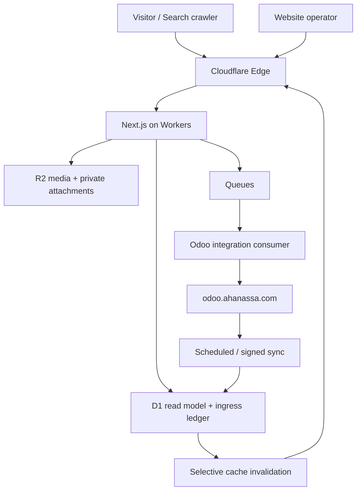
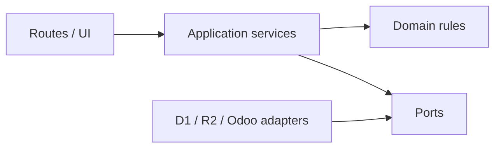
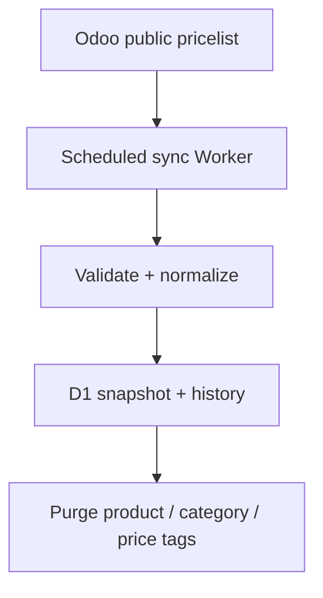
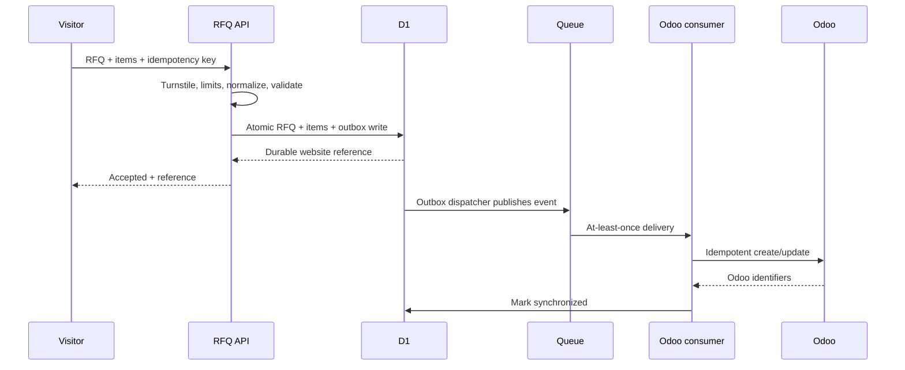
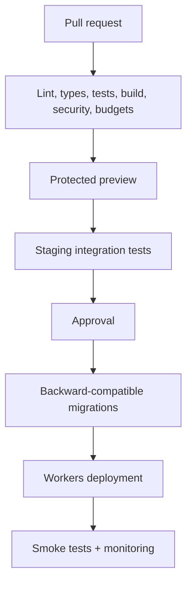

# Ahan Asa Digital Procurement Platform — Technical Architecture

> **Brand:** Ahan Asa | آهن آسا  
> **Domain:** `ahanassa.com`  
> **Canonical origin:** `https://www.ahanassa.com`  
> **ERP:** `https://odoo.ahanassa.com`  
> **Document:** `TECHNICAL_ARCHITECTURE.md`  
> **Status:** Draft v2.0 — implementation baseline  
> **Last updated:** 2026-08-25  
> **Launch locale:** Persian (`fa`), fully RTL  
> **Architecture model:** Cloudflare-native, edge-first platform with asynchronous Odoo integration

---

## 1. Purpose and scope

This document specifies the target technical architecture for the Ahan Asa website and its digital procurement workflows. It is the implementation baseline for Claude Code and human developers.

Ahan Asa is not a brochure-only website. The platform MUST support:

1. fast, indexable, accessible Persian pages;
2. operator-managed articles and SEO content;
3. a steel catalog with categories, products, variants, sizes, units, and public-price views;
4. structured RFQs containing any number of requested items within configured limits;
5. optional Excel, PDF, and image attachments;
6. durable integration with Odoo at `odoo.ahanassa.com`;
7. graceful operation when Odoo or another dependency is unavailable;
8. measurable SEO, performance, accessibility, security, and observability gates.

The initial release is not a checkout-based online store. Cart, online payment, public inventory promises, supplier marketplace, and customer self-service portal remain out of scope unless separately approved.

## 2. Normative language and authority

The terms **MUST**, **MUST NOT**, **SHOULD**, **SHOULD NOT**, and **MAY** are normative.

When approved documents conflict, apply this priority:

1. `CLAUDE.md`;
2. `PROJECT_BRIEF.md`;
3. `SYSTEM_OF_RECORD.md`;
4. `TECHNICAL_ARCHITECTURE.md`;
5. specialized specifications such as `ODOO_INTEGRATION.md`, `DATABASE_SCHEMA.md`, `RFQ_SYSTEM.md`, and `PRICING_SYSTEM.md`;
6. `DEVELOPMENT_RULES.md` and `CODING_STANDARDS.md`;
7. page, component, content, and task-level specifications.

Later approved decisions override earlier drafts. Material contradictions MUST be recorded in `DECISIONS.md`; they MUST NOT be resolved silently in code.

## 3. Binding architectural principles

### 3.1 Odoo is the commercial system of record

Odoo owns customers, contacts, CRM, commercial product/variant/UOM data, commercial pricelists, quotations, sales, purchasing, suppliers, inventory, and accounting. The website MUST NOT create a competing commercial truth.

### 3.2 Public rendering never depends on live Odoo

Public pages MUST render from static output, Cloudflare cache, or the website read model in D1. A visitor request MUST NOT synchronously call Odoo to render a product, category, article, or price page.

An Odoo outage MUST NOT prevent public pages from loading, erase the latest valid price snapshot, or prevent a valid RFQ from receiving a durable website reference.

### 3.3 D1 is the website read model and ingress ledger

D1 stores:

- articles and website-owned SEO/editorial fields;
- published catalog projections synchronized from Odoo;
- public price snapshots and approved history;
- RFQ headers, items, attachment metadata, and sync state;
- transactional outbox and processed-event records;
- application roles, permissions, and audit records.

D1 is not the final system of record for quotations, sales, accounting, supplier management, or inventory.

### 3.4 Static-first and HTML-first

Indexable pages MUST return useful content, metadata, links, canonical URL, and applicable structured data in the initial HTML. Server Components and static/cached rendering are the default. Client Components are limited to genuine interaction.

### 3.5 Asynchronous integration by default

Website-to-Odoo writes and Odoo-to-website synchronization MUST use adapters, durable state, retry-safe messages, and reconciliation. Browser requests MUST NOT wait for Odoo to complete a business operation.

### 3.6 Quality attributes are architectural constraints

Performance, SEO, accessibility, security, and observability are release requirements, not post-launch cleanup.

### 3.7 No invented business data

The application MUST NOT fabricate prices, stock, availability, brands, standards, projects, capabilities, certifications, locations, or timestamps. Missing data is omitted, marked unavailable, or retained as the last valid snapshot under an approved rule.

## 4. Target architecture



| Platform | Primary responsibility |
| --- | --- |
| Cloudflare Edge | DNS, TLS, WAF, cache, routing, rate limits, bot controls |
| Next.js on Workers | Public rendering, admin UI, APIs, validation, domain services |
| D1 | Read model, CMS data, RFQ ledger, outbox, authorization, audit data |
| R2 | Original media and private RFQ attachments |
| Cloudflare Images | Responsive transformation and modern image delivery |
| Queues | Retryable asynchronous integration events |
| Scheduled Workers | Odoo pulls, outbox dispatch, reconciliation, retention |
| Turnstile | Bot challenge signal for high-risk public mutations |
| Odoo | Commercial data, CRM, quotation, sales, purchasing, inventory, accounting |

## 5. System-of-record matrix

| Data or operation | Authoritative owner | Website responsibility |
| --- | --- | --- |
| Articles and publication | Website CMS in D1 | Render, version, publish, audit |
| Public article/product media | R2 | Optimized delivery after approval |
| Product commercial identity | Odoo | D1 projection keyed by stable external identity |
| Variants, attributes, UOM | Odoo | D1 projection for catalog and RFQ selection |
| Product/category SEO copy | Website CMS in D1 | Website-owned overlay linked to Odoo record |
| Commercial prices/pricelists | Odoo | Validated public snapshot in D1 |
| Public price history | D1 derived from approved Odoo sync | Approved tables/charts and timestamps |
| Customer/contact | Odoo | Minimal provisional record in D1 until sync/retention |
| RFQ receipt | D1 ingress ledger | Durable reference and integration state |
| RFQ business processing | Odoo | D1 retains website receipt/sync metadata |
| RFQ attachment bytes | Private R2 | Metadata in D1; controlled Odoo reference/copy |
| Quotation, sale order, purchasing, inventory, accounting | Odoo | Not duplicated publicly |
| Website identity/authorization | Approved IdP + D1 roles | Separate from Odoo credentials |

Conflict rules:

- Odoo wins for commercial fields.
- Website CMS wins for SEO/editorial fields.
- D1 RFQ receipt state is never overwritten by an Odoo failure.
- Older source data MUST NOT replace a newer valid record.
- Ambiguous conflicts move to review; they are not silently merged.

## 6. Approved technology baseline

| Concern | Decision |
| --- | --- |
| Framework | Next.js App Router with strict TypeScript |
| Runtime | Cloudflare Workers |
| Cloudflare adapter | Current compatible Cloudflare-recommended path after a recorded compatibility check |
| Styling | Tailwind CSS plus semantic tokens/custom properties |
| Package manager | `pnpm` with committed lockfile |
| Validation | Zod-compatible domain schemas; server validation authoritative |
| Database | D1 with migrations, foreign keys, indexes, repositories |
| Object storage | R2 |
| Messaging | Queues plus Dead Letter Queue |
| Bot protection | Turnstile plus edge/application rate limits |
| ERP | Odoo through a server-only adapter |
| Testing | Unit, integration, Playwright E2E, accessibility, SEO, security, performance |

AUD-034 update: the selected production adapter is confirmed as `vinext`; older OpenNext fallback language is **HISTORICAL / SUPERSEDED** unless a future owner-approved adapter decision reverses it. Therefore:

1. implementation MUST run the official compatibility check against the locked app version;
2. `vinext` MUST remain selected for the current production architecture;
3. OpenNext is not the selected adapter and may be reconsidered only through a new recorded architecture decision;
4. the chosen adapter and versions MUST be recorded in `STACK.md`, the lockfile, and `DECISIONS.md`;
5. provider APIs MUST remain behind adapters.

The project MUST NOT silently fall back to Vercel. Any hosting change requires approval and coordinated changes to deployment, caching, secrets, and observability.

## 7. Application boundaries

```text
app/                         Routes, layouts, metadata, route handlers
components/                  Reusable server-first UI
components/client/           Small interactive islands only
content/                     Seed content and controlled migrations
lib/domain/                  Provider-independent types and rules
lib/content/                 CMS schemas, repositories, publication
lib/catalog/                 Catalog queries and SEO overlays
lib/pricing/                 Public price projection and freshness
lib/rfq/                     RFQ validation, items, state machine
lib/uploads/                 Attachment policy, quarantine, scan state
lib/auth/                    Identity and authorization
lib/odoo/                    Ports, adapters, mappers, sync services
lib/outbox/                  Transactional outbox and dispatch
lib/cache/                   Keys, tags, invalidation
lib/seo/                     Metadata, canonical, sitemap, JSON-LD
lib/observability/           Safe logs, metrics, alerts
db/migrations/               Ordered D1 migrations
workers/                     Queue consumers and scheduled jobs
tests/                       Unit, integration, contract, E2E
```



Domain modules MUST NOT depend on React, route files, Odoo API details, D1 bindings, or Cloudflare request objects. Routes MUST NOT call Odoo directly.

## 8. Trust boundaries

- Everything sent to the browser is public and discoverable.
- Every browser request and uploaded file is untrusted.
- Edge controls supplement, but do not replace, application authorization.
- `/admin` requires authenticated identity and server-side permission checks.
- D1 is never directly exposed to the browser.
- Public media and private attachments MUST use separate buckets or strictly separated policies/bindings.
- Odoo is a privileged server-to-server boundary.
- Analytics MUST receive no PII, RFQ contents, quantities, filenames, or quote values.

## 9. Routing, locale, and rendering

### 9.1 URL policy

- Persian launches unprefixed; the homepage is `/`, not `/fa`.
- `/fa/...` permanently redirects to the equivalent unprefixed route.
- Future approved locales use `/en/...` and `/ar/...`.
- Unsupported/unpublished locales return true `404`.
- Canonical origin is `https://www.ahanassa.com`.
- Filter query strings are non-indexable unless an approved SEO landing exists.

### 9.2 Rendering matrix

| Route family | Rendering | Source | Cache |
| --- | --- | --- | --- |
| Home/corporate pages | Static/cached server HTML | D1 or validated content | Long edge cache |
| Category/product pages | Static/cached server HTML | D1 projection + SEO overlay | Tagged cache |
| Price pages | Cached server HTML | D1 price snapshot | Short freshness + SWR |
| Article pages | Static/cached server HTML | D1 CMS | Tagged after publish |
| RFQ shell | Static/cached server HTML | Public catalog projection | Interactive row builder |
| RFQ submission | Dynamic API | D1 + outbox | `no-store` |
| Upload authorization | Dynamic API | D1/R2 policy | `no-store` |
| Admin/preview | Dynamic authenticated | D1/integration state | `private, no-store, noindex` |
| Integration routes | Dynamic signed/authenticated | Odoo/Queues/D1 | `no-store` |

Pages MUST NOT become dynamic merely because data changes. Prefer cached server output and selective invalidation.

### 9.3 Client JavaScript

Only genuine interactions become Client Components: RFQ row builder, catalog filters/search enhancement, an approved calculator, mobile navigation, and limited admin forms. Product content, prices, specifications, breadcrumbs, metadata, and crawlable links MUST NOT require hydration.

## 10. Content and CMS

The website CMS owns articles and SEO/editorial overlays, not commercial Odoo data.

Website-managed fields include:

- article title, slug, excerpt, body, category, author, dates, and status;
- product/category SEO title, description, slug, introduction, technical copy, FAQ, internal links, images, canonical and index status;
- navigation, public reusable blocks, legal/contact content;
- media metadata, rights, alt text, focal point, and publication state.

Publication workflow:

```text
Draft -> Review -> Approved -> Published -> Archived
```

Only `Published` records enter public routes, sitemaps, feeds, cache warming, or structured data. Publishing MUST validate fields/references, record approver/time, create a revision, invalidate affected tags, update `lastmod` only for visible changes, and append an audit record.

Arbitrary executable MDX and untrusted HTML are prohibited. Rich text uses an allowlisted, sanitized document model.

## 11. Catalog and public pricing

### 11.1 Two-layer product model

```text
Odoo commercial projection
  + Website SEO/editorial overlay
  = Public product page
```

The Odoo projection may contain stable Odoo/external ID, code/name, category, variant/attributes, size/grade/standard/dimensions, UOM, public eligibility, and approved public pricelist value/time. Website overlays MUST reference a stable Odoo identity.

### 11.2 Price rules

- Commercial prices are edited in Odoo, never independently in website admin.
- Website admin MAY display sync health, failures, and a permission-controlled resync action.
- D1 retains the latest valid public snapshot and selected history.
- Failed sync MUST NOT replace a valid price with zero, null, or partial data.
- Displayed prices include unit, currency, update time, and approved tax/validity qualifier.
- Price existence MUST NOT imply inventory.
- Customer-specific pricelists MUST never be public or shared-cacheable.
- Stale prices are labeled or hidden under `PRICING_SYSTEM.md`; thresholds are configured, not invented in UI.

### 11.3 Price synchronization



Sync SHOULD use source `write_date`, stable external IDs, checksums, and a high-water mark. A periodic full reconciliation MUST detect missed, deleted, or unpublished records.

### 11.4 Indexable price pages

A category or variant price page is indexable only when it provides unique visible value: approved current price/time, unit/specification, related sizes, buying guidance, technical context, FAQ, and internal links. Thin filter combinations MUST NOT be indexed or listed in sitemaps.

## 12. RFQ architecture

### 12.1 Public boundary

The primary route remains `/request`. The canonical endpoint is:

```text
POST /api/rfqs
Content-Type: application/json
Cache-Control: no-store
```

### 12.2 RFQ items

Each RFQ contains one or more items. The visitor may add rows within configured payload/abuse limits.

```ts
type RfqItemInput = {
  categoryId?: string;
  productId?: string;
  variantId?: string;
  sizeOrVariant?: string;
  unitId?: string;
  quantity: string;
  description?: string;
  customItem?: {
    title: string;
    size?: string;
    unitText?: string;
  };
};
```

Rules:

- An item references a published catalog selection or uses the explicit custom-item path.
- Quantity is parsed as a decimal server-side; persisted commercial values MUST NOT use binary floating point.
- Unit compatibility is validated where defined.
- Browser labels and IDs are never trusted.
- The server rebuilds normalized values from authoritative records.
- At least one valid item is required.
- Row, text, file, and payload limits belong in `RFQ_SYSTEM.md` and configuration.

### 12.3 Durable submission with transactional outbox



Success is acknowledged only after RFQ, items, and outbox event are durably written. Immediate Queue publish MAY be a fast path; the outbox remains the recovery mechanism.

Each RFQ has an opaque internal ID, unique public reference such as `AA-RFQ-...`, client idempotency key, immutable event ID, sync state/retry timestamps, and Odoo identifiers after sync.

Website sync states:

```text
received -> queued -> syncing -> synced
                         |-> retry_pending
                         |-> failed_review
```

Sales stages remain in Odoo and MUST NOT be confused with technical sync state.

### 12.4 Public response

```ts
type RfqResponse =
  | { ok: true; reference: string; status: "received" }
  | {
      ok: false;
      code:
        | "VALIDATION_ERROR"
        | "RATE_LIMITED"
        | "VERIFICATION_FAILED"
        | "PAYLOAD_TOO_LARGE"
        | "SERVICE_UNAVAILABLE";
      fieldErrors?: Record<string, string[]>;
    };
```

Never expose D1 IDs, Odoo IDs, stack traces, provider payloads, Queue state, or security details.

## 13. Attachment architecture

Excel, PDF, and image uploads remain disabled until the complete secure pipeline exists:

1. client requests short-lived authorization;
2. server validates RFQ context, declared type, size, count, and abuse signals;
3. client uploads to a private R2 quarantine key;
4. system verifies actual file signature/size;
5. approved malware scanner processes the object;
6. clean object is promoted/marked usable;
7. D1 metadata is linked to RFQ;
8. Odoo receives an approved clean reference or copy;
9. download uses audited, short-lived authorization.

Mandatory controls:

- private storage and opaque keys;
- sanitized original name only as metadata;
- allowlisted extensions plus verified signatures;
- explicit per-file, total, and count limits;
- no executable, archive, macro-enabled, or ambiguous active content unless separately approved;
- quarantine until scan success;
- no bytes, filenames, or signed URLs in logs, analytics, notifications, or Queue payloads;
- orphan cleanup, retention, deletion, legal hold, and access audit;
- separation of public media and confidential attachments.

Without scanning and retention controls, upload UI MUST remain unavailable and provide an approved alternative.

## 14. Odoo integration

### 14.1 Adapter boundary

```ts
interface OdooGateway {
  upsertContact(input: OdooContactInput): Promise<OdooRef>;
  upsertRfq(input: OdooRfqInput): Promise<OdooRfqResult>;
  pullCatalog(cursor?: SyncCursor): Promise<CatalogSyncPage>;
  pullPublicPrices(cursor?: SyncCursor): Promise<PriceSyncPage>;
  getHealth(): Promise<IntegrationHealth>;
}
```

UI, routes, and domain rules MUST NOT know whether the adapter uses JSON-2, an older supported API, or an approved custom controller.

### 14.2 Odoo version gate

- Exact server version, edition, installed modules, database, and allowed API surface are TBD until verified.
- For Odoo 19, prefer the official External JSON-2 API with Bearer API key.
- For earlier Odoo, use the supported API for that deployed version.
- Legacy RPC MUST NOT be selected for a new Odoo 19 integration merely for convenience.
- Model names, custom fields, and modules MUST be inspected, not assumed.

Use a dedicated integration user such as `ahanasa_website_bot` with minimum model, field, company, and record-rule access. Credentials live only in Cloudflare Secrets. Environments use separate credentials and safe databases.

### 14.3 Provisional mapping

| Website concept | Odoo target | Gate |
| --- | --- | --- |
| Person/company | `res.partner` | Deduplication and hierarchy rules |
| Opportunity | `crm.lead` | Pipeline, team, source, UTM mapping |
| RFQ header | Custom RFQ model linked to `crm.lead`, or approved equivalent | Module/field inspection |
| RFQ item | Custom structured RFQ line model | Required to preserve lines |
| Product | `product.template` | Published subset/field mapping |
| Variant | `product.product` | Attributes and codes |
| Unit | `uom.uom` | Allowed units/conversions |
| Public price | Approved public `product.pricelist` | No private/customer list exposure |
| Attachment | Approved clean attachment/reference | Storage/access policy |

Free-text CRM notes are not an acceptable final store for all RFQ lines. Any approved temporary fallback MUST keep structured JSON in D1 and include a migration path.

Contact deduplication uses approved normalized identifiers such as verified phone, email, company registration data, or a deliberate composite. Display-name equality alone MUST NOT merge contacts; ambiguous matches require review.

### 14.4 Events and idempotency

Queues is at-least-once; duplicate delivery is possible. Each event includes:

```text
event_id
event_type
aggregate_id
aggregate_version
occurred_at
schema_version
correlation_id
```

Consumers record processed event IDs and use stable website external IDs in Odoo. Replaying an event MUST update/return the existing record, never create a duplicate lead or RFQ.

### 14.5 Failure recovery

- Use bounded exponential backoff for transient failures.
- Exhausted events go to a DLQ.
- Keep outbox records until dispatch acknowledgement.
- Reconcile stuck `received`, `queued`, `syncing`, and `retry_pending` records.
- Alert on backlog, DLQ, authentication failure, schema mismatch, and stale catalog/price sync.
- Admin retry actions require permission and audit logging.
- Never ask the visitor to resubmit because Odoo failed after D1 acceptance.

Detailed replay, poison-message, retention, and runbook rules belong in `FAILURE_RECOVERY.md` and `SYNC_STRATEGY.md`.

## 15. D1 data architecture

Exact SQL belongs in `DATABASE_SCHEMA.md`. Expected entities:

```text
users, roles, permissions, user_roles, role_permissions
articles, article_categories, content_revisions
steel_categories, steel_products, product_variants
product_attributes, units, product_seo
public_prices, price_history, sync_cursors
rfqs, rfq_items, rfq_attachments
outbox_events, processed_events, sync_failures
media, audit_logs
```

Rules:

- foreign keys enabled/enforced;
- ordered, reviewed, tested migrations;
- opaque stable IDs and separately unique public references;
- monetary values/quantities stored as minor-unit integers or validated decimals, never binary floating point;
- unambiguous UTC timestamps, locale formatting at presentation;
- explicit indexes for frequent filters, joins, and ordering;
- retention/deletion compatible with audit and legal obligations.

Expected index paths include:

```text
slug + locale + publication_status
category_id + public_status
product_id + variant_id
odoo_model + odoo_id
external_id
price_effective_at
rfq_reference
sync_status + next_retry_at
outbox_status + available_at
created_at / updated_at
```

D1 Global Read Replication MAY be enabled when measured multi-region traffic justifies it. When enabled, reads MUST use Sessions API/bookmarks where sequential consistency is required. RFQ confirmation and admin read-after-write paths require an explicit consistency strategy.

## 16. API surface

| Route | Purpose | Policy |
| --- | --- | --- |
| `POST /api/rfqs` | Persist RFQ/items/outbox | Public controlled; `no-store` |
| `POST /api/rfqs/uploads/authorize` | Quarantine authorization | Public controlled; `no-store` |
| `POST /api/rfqs/uploads/complete` | Register upload for scan | Signed/validated; `no-store` |
| `GET /api/catalog/search` | Progressive catalog search | Public bounded cache; allowlisted fields |
| `/api/admin/*` | Admin operations | Authorized; `private, no-store` |
| `POST /api/admin/revalidate` | Selective invalidation | Authorized/audited; `no-store` |
| `POST /api/integrations/odoo/webhook` | Optional signed notification | Signed/replay-protected; `no-store` |
| `GET /api/health/live` | Process liveness | Minimal public output |
| `GET /api/health/ready` | Dependency readiness | Protected |

All APIs validate content type, body size, authorization/origin as applicable, and unexpected fields; use safe stable errors/correlation IDs; apply external timeouts; and never expose raw provider errors or confidential data.

## 17. Admin and authorization

`/admin` is always dynamic, authenticated, authorized, `noindex`, and `no-store`.

Initial areas:

```text
Dashboard
Articles and revisions
Product/category SEO overlays
Catalog and price sync visibility
RFQ receipt and sync visibility
Media
Users and roles
Integration failures and retry actions
Settings and audit history
```

Commercial product/price editing occurs in Odoo. Website admin MUST NOT offer an independent commercial price editor.

Recommended roles: `super_admin`, `content_editor`, `content_approver`, `seo_manager`, `rfq_operator`, `integration_operator`, and `auditor`.

Requirements:

- deny by default and check authorization server-side on every action;
- MFA through the selected identity provider for privileged users;
- secure revocable sessions and CSRF protection where relevant;
- audit actor, action, target, timestamp, correlation ID, and safe change summary;
- no shared admin accounts;
- do not reuse Odoo passwords for website authentication.

Odoo integration does not imply a customer portal; that remains out of initial scope.

## 18. Cache architecture

```text
Browser -> Cloudflare CDN / Workers Cache -> Next.js response -> D1 read model
```

Odoo never appears in the public read path.

- Versioned assets use immutable long-lived caching.
- Public HTML uses route-specific freshness and `stale-while-revalidate` where supported by the selected cache path.
- Price pages use shorter freshness than editorial pages.
- `/api/rfqs*`, `/admin*`, `/auth*`, `/preview*`, integration/upload routes, and confidential documents bypass public cache.
- Authenticated or cookie-varying responses MUST NOT enter shared cache.
- CDN Cache-Control behavior and manual Workers Cache API behavior MUST be distinguished; unsupported directives MUST NOT be assumed.

Use stable ASCII tags such as:

```text
article:<id>
category:<id>
product:<id>
price:<variant-id>
locale:fa
```

Publishing/sync purges affected records, parent listings, and direct dependencies. Global purge is an incident action, not normal publishing.

## 19. SEO architecture

Each indexable route generates from the same visible source:

- title and meta description;
- self-referencing canonical;
- applicable hreflang;
- Open Graph metadata;
- robots directives;
- semantic H1/headings;
- crawlable links and breadcrumbs;
- applicable JSON-LD;
- correct HTTP status.

JavaScript MUST NOT replace canonical or primary metadata after load.

Potential schemas: `Organization`, `WebSite`, `BreadcrumbList`, `Article`, `Product`, and `Offer` only when the visible page contains a matching approved public offer with price, currency, unit/qualifiers, and validity. Schema MUST NOT imply unsupported inventory, availability, reviews, or offer terms.

At scale:

```text
sitemap.xml
  -> sitemap-pages.xml
  -> sitemap-categories.xml
  -> sitemap-products.xml
  -> sitemap-prices.xml
  -> sitemap-articles.xml
```

Only canonical, published, indexable `200` URLs appear. `lastmod` reflects real visible change.

Facets such as size, grade, brand, unit, origin, and standard MUST NOT create unlimited crawlable combinations. Approved SEO landings use clean routes/unique content; UI-only filters are excluded from sitemaps and canonicalized to the governing landing.

## 20. Performance architecture

### 20.1 Targets

| Metric at p75 | Internal target | Release floor |
| --- | ---: | ---: |
| LCP | `<= 2.0 s` | `<= 2.5 s` |
| INP | `<= 150 ms` | `<= 200 ms` |
| CLS | `<= 0.05` | `<= 0.10` |

Additional internal targets:

- cached public TTFB `<= 500 ms` in representative regions;
- Lighthouse CI: Performance `>=95`, Accessibility `>=95`, Best Practices `>=95`, SEO `100`;
- no unexpected horizontal overflow at required viewports.

These are project targets, not guarantees for every network/device.

### 20.2 Provisional budgets

Until `PERFORMANCE_BUDGET.md` records measured template budgets:

- route-owned initial client JS SHOULD be `<= 80 KB` compressed on SEO routes;
- total initial JS SHOULD be `<= 150 KB` compressed on representative public routes;
- initial CSS SHOULD be `<= 50 KB` compressed;
- critical first-view fonts SHOULD be `<= 120 KB` compressed;
- mobile LCP image SHOULD be `<= 200 KB` when quality permits;
- no nonessential third-party script runs before consent/interaction.

Exceptions require measurement, reason, and approval.

### 20.3 Rules

- Server Components by default; never client-render root/page trees for convenience.
- Avoid global carousel, animation, chart, map, chat, video, or form libraries.
- Use streaming only when it improves delivery without hiding SEO content.
- Reserve media and validation space.
- Preload only verified critical fonts and the true LCP asset.
- Lazy-load below-fold media/admin features.
- Prefer native controls and CSS.
- Measure dependency bundle cost.
- Collect real-user Core Web Vitals and evaluate p75.

## 21. Image and font pipeline

```text
Approved original -> R2 -> Cloudflare Images -> AVIF/WebP/fallback -> CDN
```

Public images require responsive widths/`sizes`, intrinsic dimensions/aspect ratio, correct LCP priority, alt/rights/focal/publication metadata, and trusted/sanitized SVG handling. Confidential RFQ files never use the public image path.

Fonts SHOULD be self-hosted WOFF2 when licensed, safely subset by required scripts, limited to required weights, and use deterministic fallbacks/`font-display`. Verify Persian numerals, mixed Latin/RTL identifiers, units, and tables.

## 22. Security and privacy

### 22.1 Controls

- TLS Full (strict), canonical HTTPS redirects, WAF, rate limits, bot controls;
- server-side Turnstile for protected public mutations;
- strict schemas and rejection of unexpected fields;
- parameterized D1 access;
- least-privilege bindings/Odoo rights;
- restrictive CSP without broad wildcards or `unsafe-eval`;
- HSTS after all hosts/subdomains are verified;
- `nosniff`, controlled referrer/permissions policies, CSP `frame-ancestors`;
- no open redirects, client-trusted authorization, or user-controlled storage paths.

Secrets live only in environment-scoped Cloudflare Secrets and MUST NOT appear in Git, client bundles, public variables, screenshots, docs examples, logs, analytics, or ordinary D1 records.

### 22.2 Privacy

- collect only what procurement response/operations need;
- separate operational consent from optional marketing consent;
- never send PII, addresses, free text, RFQ items/quantities, filenames, attachments, or quotes to analytics;
- redact sensitive data from logs/error monitoring;
- approve retention, access, deletion, export, incident response, legal hold, and processor regions before production;
- ensure public privacy statements match actual processing.

## 23. Observability and operations

| Area | Signals |
| --- | --- |
| Edge/app | volume, latency, `4xx`, `5xx`, exceptions, runtime limits |
| Cache | hit ratio, bypasses, stale responses, purge failures |
| D1 | query latency/errors, migration status, consistency issues |
| RFQ | accepted, rejected, durable-write failure, duplicates prevented |
| Queue | backlog age, retries, consumer failure, DLQ |
| Odoo | auth, latency, permission/schema errors, sync freshness |
| Catalog/price | last sync, drift, stale records |
| Upload | authorization, quarantine age, scans, orphan cleanup |
| SEO/UX | status/canonical/sitemap anomalies, CWV, JS/a11y regressions |

Safe structured logs contain timestamp, environment, operation, correlation/event ID, duration, and result category. They MUST NOT contain bodies, PII, RFQ lines, filenames, tokens, authorization headers, signed URLs, or raw Odoo payloads.

Runbooks cover Odoo outage, Queue backlog, DLQ replay, stale prices, failed migration, attachment incident, secret rotation, cache purge, and rollback.

## 24. Environments and deployment

| Environment | Purpose | Policy |
| --- | --- | --- |
| Local | Development/tests | Local emulation/fixtures; no production secrets |
| Preview | PR review | Isolated resources; protected and `noindex` |
| Staging | Integration/release verification | Odoo test DB and synthetic RFQs |
| Production | Canonical service | Production resources/monitoring only |



Bindings/secrets are environment-specific. Preview/staging MUST not write production Odoo data. Database changes use backward-compatible rollout where required. Keep a healthy rollback target and verify DNS, TLS, canonical redirects, Worker routes, cache policy, schema compatibility, and Odoo egress.

## 25. Configuration categories

Exact names belong in `ENVIRONMENT_VARIABLES.md`:

```text
# Public intentional values
NEXT_PUBLIC_SITE_ENV
NEXT_PUBLIC_GTM_ID
NEXT_PUBLIC_TURNSTILE_SITE_KEY

# Server configuration
SITE_URL
ODOO_BASE_URL
ODOO_DATABASE
ODOO_API_MODE
PUBLIC_PRICE_LIST_ID
PRICE_FRESHNESS_THRESHOLD
TURNSTILE_SECRET_KEY
UPLOAD_MAX_BYTES
UPLOAD_MAX_COUNT

# Cloudflare bindings/secrets
DB
PUBLIC_MEDIA_BUCKET
PRIVATE_UPLOAD_BUCKET
ODOO_SYNC_QUEUE
ODOO_SYNC_DLQ
ODOO_API_KEY
UPLOAD_SIGNING_SECRET
WEBHOOK_SIGNING_SECRET
```

Configuration is validated at startup/build boundaries. Missing required integration configuration fails the affected operation safely; optional analytics absence does not break public rendering. Server secrets are imported only from server-only modules.

## 26. Testing and gates

| Layer | Required coverage |
| --- | --- |
| Static | TypeScript, lint, format, forbidden imports, secret scan |
| Unit | schemas, decimals, state machines, URLs/SEO, cache tags, mappers |
| D1 integration | migrations, constraints, indexes, atomic RFQ/outbox |
| Odoo contract | test DB/fixtures, mapping, permissions, idempotency |
| Queue | retry, duplicate delivery, poison message, DLQ/replay |
| Component | RFQ rows/custom item, RTL, focus, admin permissions |
| E2E | catalog, price freshness, RFQ success/failure, upload, admin |
| SEO/security/performance/a11y | route signals, controls, budgets, manual QA |

Mandatory commands:

```text
pnpm lint
pnpm typecheck
pnpm test
pnpm test:integration
pnpm test:e2e
pnpm build
```

Critical scenarios:

- SEO pages return complete HTML without Odoo/client JS.
- Odoo outage does not block public rendering.
- Valid RFQ creates exactly one D1 receipt/outbox event.
- Duplicate API/Queue delivery does not duplicate Odoo records.
- failed Queue publication is recovered from outbox.
- exhausted messages reach DLQ and authorized operations UI.
- invalid price sync preserves the last valid snapshot.
- selective purge updates affected price/product pages.
- custom RFQ items prevent catalog gaps from losing leads.
- upload remains disabled until quarantine/signature/scan/retention work.
- admin permissions cannot be crossed.
- filter/admin/API routes have correct status, cache, canonical, and robots behavior.
- Persian uses `lang="fa"`, `dir="rtl"`, logical CSS, and bidi isolation.

## 27. Decision gates

| Decision | Current state | Required evidence |
| --- | --- | --- |
| Next.js adapter | vinext confirmed; OpenNext fallback superseded | Compatibility report/test |
| Exact stack versions | Not frozen here | `STACK.md` + lockfile |
| Odoo version/API | Not verified | Server inspection/API smoke test |
| Odoo RFQ model | Structured custom/equivalent model required | Module/field mapping |
| Public pricelist | Odoo-owned | ID, currency, UOM, tax, visibility rules |
| Sync cadence | Configurable delta + reconciliation | Freshness/load requirement |
| Admin IdP | Not selected here | MFA/session/recovery review |
| Attachment scanner | Not selected; upload disabled | Scanner/retention/runbook |
| Privacy retention | TBD | Legal/operational approval |
| Analytics/consent | TBD | Event/consent approval |
| Customer portal | Out of initial scope | Separate product/security spec |
| Future locales | Not published | Complete approved equivalents |

Unknowns remain TBD or disabled; developers MUST NOT invent production defaults.

## 28. Implementation sequence

1. Update architecture-related documents and decisions.
2. Lock the Cloudflare runtime adapter, bindings, local emulation, CI, and deployment.
3. Build D1 migrations, repositories, indexes, audit, and transactional outbox.
4. Build RTL public shell, canonical host, fonts, errors, and server-first components.
5. Build CMS revisions, publication, roles, audit, media, and invalidation.
6. Build Odoo catalog/UOM projection and website SEO overlay.
7. Build public pricelist sync, validation, history, freshness, and price pages.
8. Build RFQ rows/custom item, validation, D1/outbox receipt, reference, admin view.
9. Build Odoo adapter, structured mapping, Queue consumer, idempotency, DLQ, reconciliation.
10. Add private attachments only after the scan/retention pipeline is approved.
11. Harden SEO, facets, images, bundle budgets, RUM, security, and accessibility.
12. Complete staging, runbooks, production smoke tests, and rollback rehearsal.

## 29. Definition of done

The architecture is correctly implemented when:

- Persian public routes are RTL, accessible, HTML-first, and indexable;
- public rendering has no synchronous Odoo dependency;
- Odoo owns commercial truth and D1 holds a validated projection;
- articles/SEO overlays are versioned, approved, and audited;
- public prices are valid, qualified, timestamped, and freshness-controlled;
- every accepted RFQ has a durable receipt, structured items, outbox event, and reference;
- duplicates cannot create duplicate Odoo records;
- outages recover through outbox, retry, DLQ, reconciliation, and operator tools;
- custom items prevent catalog incompleteness from losing leads;
- attachments are fully private/quarantined/scanned/audited or disabled;
- admin is authenticated, authorized, `no-store`, `noindex`, and audited;
- confidential routes never enter shared cache;
- secrets/sensitive values are absent from Git, browser, analytics, and unsafe logs;
- tests, builds, performance, accessibility, SEO, and smoke gates pass;
- operational dashboards/runbooks cover critical failures;
- no unapproved checkout, inventory promise, portal, or marketplace is introduced.

## 30. Related documents

- `PROJECT_BRIEF.md`
- `STACK.md`
- `SYSTEM_OF_RECORD.md`
- `DATA_ARCHITECTURE.md`
- `DATABASE_SCHEMA.md`
- `CMS_ARCHITECTURE.md`
- `ADMIN_PANEL_SPEC.md`
- `PRODUCT_CATALOG_SPEC.md`
- `PRICING_SYSTEM.md`
- `RFQ_SYSTEM.md`
- `AUTHORIZATION_ROLES.md`
- `ODOO_INTEGRATION.md`
- `ERP_DATA_MAPPING.md`
- `SYNC_STRATEGY.md`
- `FAILURE_RECOVERY.md`
- `API_INTEGRATIONS.md`
- `FORM_ARCHITECTURE.md`
- `CACHING_STRATEGY.md`
- `PERFORMANCE_GUIDELINES.md`
- `PERFORMANCE_BUDGET.md`
- `IMAGE_OPTIMIZATION.md`
- `FONT_STRATEGY.md`
- `SEO_STRATEGY.md`
- `METADATA_SPEC.md`
- `STRUCTURED_DATA.md`
- `INTERNAL_LINKING.md`
- `SITEMAP_ROBOTS_SPEC.md`
- `SECURITY_GUIDELINES.md`
- `DEPLOYMENT_ARCHITECTURE.md`
- `ENVIRONMENT_VARIABLES.md`
- `TESTING_STRATEGY.md`
- `CLAUDE.md`
- `TASKS.md`
- `DECISIONS.md`

If a related document is absent or not updated, this v2.0 architecture controls its subject until the specialized document is approved.

## 31. Official implementation references

- [Cloudflare — Next.js on Workers](https://developers.cloudflare.com/workers/framework-guides/web-apps/nextjs/)
- [Cloudflare — Workers Cache](https://developers.cloudflare.com/workers/cache/)
- [Cloudflare — Cache-Control](https://developers.cloudflare.com/cache/concepts/cache-control/)
- [Cloudflare — cache tags](https://developers.cloudflare.com/workers/cache/configuration/)
- [Cloudflare — D1 Read Replication](https://developers.cloudflare.com/d1/best-practices/read-replication/)
- [Cloudflare — D1 Sessions API](https://developers.cloudflare.com/d1/worker-api/d1-database/)
- [Cloudflare — Queues delivery guarantees](https://developers.cloudflare.com/queues/reference/delivery-guarantees/)
- [Cloudflare — Queue retries and DLQ](https://developers.cloudflare.com/queues/configuration/batching-retries/)
- [Cloudflare — Images transformations](https://developers.cloudflare.com/images/optimization/transformations/overview/)
- [Cloudflare — Turnstile server validation](https://developers.cloudflare.com/turnstile/get-started/server-side-validation/)
- [Odoo 19 — External JSON-2 API](https://www.odoo.com/documentation/19.0/developer/reference/external_api.html)
- [Google Search — JavaScript SEO](https://developers.google.com/search/docs/crawling-indexing/javascript/javascript-seo-basics)
- [Google Search — canonical URLs](https://developers.google.com/search/docs/crawling-indexing/consolidate-duplicate-urls)
- [Google Search — structured data](https://developers.google.com/search/docs/appearance/structured-data/intro-structured-data)
- [web.dev — Core Web Vitals thresholds](https://web.dev/articles/defining-core-web-vitals-thresholds)

Official documentation and locked dependency versions take precedence over third-party examples.

---

## Approval record

| Field | Value |
| --- | --- |
| Document owner | Ahan Asa project owner |
| Technical owner | TBD |
| Version | 2.0 |
| Status | Draft for approval |
| Effective date | After project-owner approval |
| Review trigger | Material scope, Odoo version/module, runtime adapter, data, security, pricing, localization, or deployment change |
