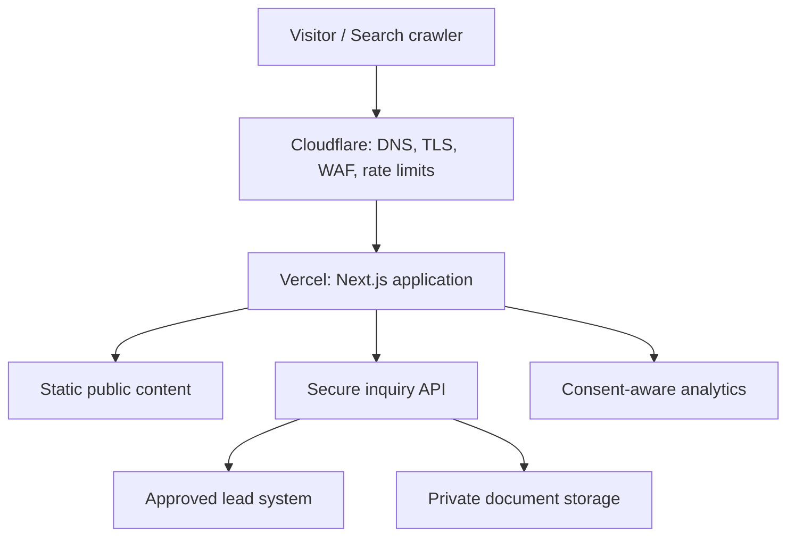
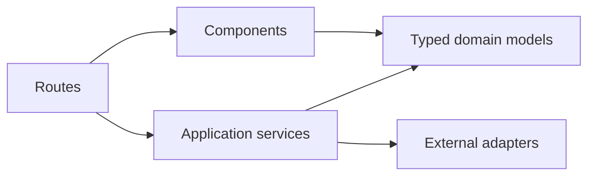
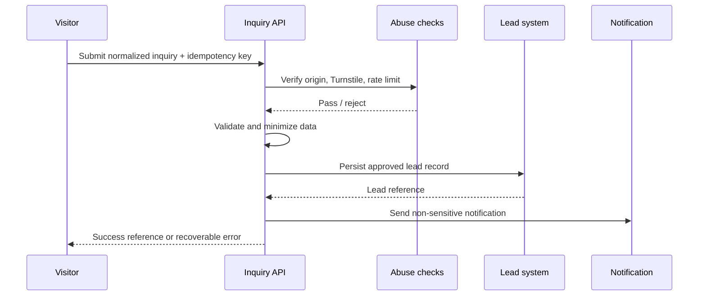
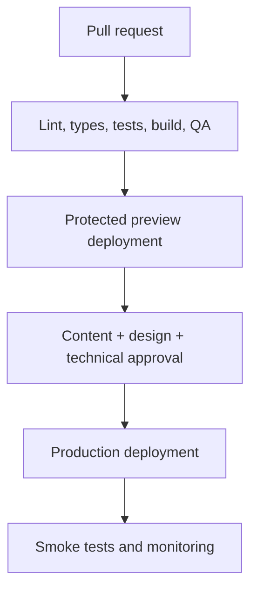

# Ahan Asa Website — Technical Architecture

> **Brand:** Ahan Asa | آهن آسا  
> **Domain:** `ahanassa.com`  
> **Document:** `TECHNICAL_ARCHITECTURE.md`  
> **Status:** Draft v1.0 — implementation baseline  
> **Last updated:** 2026-08-25  
> **Launch locale:** Persian (`fa`), fully RTL  
> **Architecture model:** Static-first public website with secure server-side inquiry handling

---

## 1. Purpose

This document defines the technical architecture for the Ahan Asa corporate website. It converts the approved business, content, SEO, interaction, and interface requirements into implementation rules that Claude Code and human developers can follow consistently.

The website is a premium B2B steel procurement platform. It is **not** an e-commerce store, public price board, supplier marketplace, customer portal, or ERP. Its primary technical responsibilities are:

1. render fast, indexable, accessible Persian content;
2. communicate the Ahan Asa procurement method and verified evidence;
3. convert qualified visitors into procurement inquiries;
4. receive inquiry data and approved project documents securely;
5. remain maintainable and ready for future localized expansion.

This document is authoritative for system boundaries, runtime behavior, rendering, data flow, security, deployment, and technical quality gates. Specialized documents remain authoritative within their own scope.

## 2. Source-of-truth hierarchy

When two instructions conflict, apply the following priority:

1. `CLAUDE.md` — repository-wide operating instructions;
2. `PROJECT_BRIEF.md` — business scope, positioning, objectives, and non-goals;
3. `TECHNICAL_ARCHITECTURE.md` — system and runtime decisions;
4. specialized approved specifications such as `ROUTES.md`, `CONTENT_MODEL.md`, `FORM_ARCHITECTURE.md`, `LOCALIZATION.md`, and SEO documents;
5. `DEVELOPMENT_RULES.md` and `CODING_STANDARDS.md` — implementation discipline;
6. page, component, motion, media, and copy specifications;
7. task-specific implementation notes.

Claude Code must not silently resolve a material contradiction. It must identify the conflicting documents, preserve the safer existing behavior, and request a decision.

## 3. Architectural principles

### 3.1 Static-first, not static-only

Public pages should be statically generated whenever their approved content is known at build time. Dynamic execution is reserved for operations that genuinely require it, including inquiry submission, secure upload authorization, integrations, preview-only content, or explicitly approved personalization.

### 3.2 Server-rendered by default

Use React Server Components by default. A component becomes a Client Component only when it needs browser state, browser APIs, event-driven interaction, or a client-only library. Do not add `"use client"` to layout, page, or section trees merely for convenience.

### 3.3 Progressive enhancement

Core content, links, navigation, metadata, and indexable page meaning must exist in server-rendered HTML. JavaScript may enhance interaction but must not be required to discover the main content or primary navigation.

### 3.4 Secure separation of public and confidential data

Public content may be generated from repository content or an approved CMS. Inquiry details, phone numbers, email addresses, invoices, bills of quantities, quotations, supplier offers, and uploaded documents must remain in secure server-side systems. They must never be embedded in static bundles, public JSON, build logs, analytics payloads, or page source.

### 3.5 Business-first architecture

Technical choices must support the approved procurement journey. Do not introduce catalog, cart, checkout, public inventory, live-price, account, or marketplace architecture unless the project scope is formally changed.

### 3.6 Future-ready without fake scope

The codebase must support future languages and integrations, but Phase 1 must not publish empty locale routes, machine-translated content, fake integrations, unavailable upload controls, or fabricated data.

### 3.7 Accessibility, performance, SEO, and security are release requirements

These concerns must be designed into components and data flows. They are not post-launch cleanup tasks.

## 4. Approved architecture summary

| Layer | Phase 1 decision | Notes |
| --- | --- | --- |
| Application | Next.js App Router | Use the current stable, project-approved release and lock it in the repository |
| Language | TypeScript with strict mode | No unchecked production data at trust boundaries |
| Rendering | Static generation and Server Components by default | Dynamic rendering only where justified |
| Styling | Tailwind CSS plus semantic CSS custom properties | Tokens must come from the approved design system |
| Localization | `next-intl` or an equivalent approved locale abstraction | Persian launches unprefixed; future locales are prefixed |
| Content | Git-managed typed content for Phase 1 | CMS integration is optional and deferred until approved |
| Articles/resources | MDX or structured source content validated at build time | No arbitrary executable MDX from untrusted editors |
| Forms | React Hook Form for complex client UX plus Zod-compatible shared schemas | Server validation is authoritative |
| Submission API | Next.js Route Handler | Stable boundary for validation, security, storage, and integrations |
| Public media | Approved asset source through `next/image` or equivalent optimization | Intrinsic dimensions required |
| Private documents | Direct upload to private object storage through short-lived signed authorization | Disabled until the complete security workflow is approved |
| Lead persistence | Adapter-based approved CRM or managed database | No production form without a verified lead sink and fallback |
| Hosting | Vercel behind Cloudflare | Preview and production environments separated |
| Analytics | GTM and GA4 after IDs, consent policy, and events are approved | Never send form content or sensitive data |
| Bot protection | Cloudflare Turnstile plus rate limiting and server validation | Turnstile verification must occur server-side |
| Testing | Unit/component tests plus Playwright E2E and accessibility checks | Critical inquiry and SEO paths are mandatory |
| Package manager | `pnpm` | Commit the lockfile; do not mix package managers |

Exact dependency versions belong in `STACK.md` and the lockfile. Major upgrades require an explicit compatibility review, successful tests, and an architecture decision record when behavior changes.

## 5. System context



### 5.1 Trust boundaries

- Everything sent to the browser is public and must be treated as discoverable.
- Cloudflare is the public edge and first abuse-control layer.
- Vercel runs the application and server-side request handling.
- The inquiry endpoint is an untrusted-input boundary.
- The lead system and private object storage contain confidential business data.
- Analytics is an external data recipient and must receive only approved, non-sensitive event data.

## 6. Application and repository boundaries

The application should be a single Next.js project unless a proven operational requirement justifies a monorepo. Do not add microservices for Phase 1.

Recommended high-level boundaries:

```text
app/                  Route composition, layouts, metadata and route handlers
components/           Reusable UI and page-section components
content/              Approved public content and content records
lib/                  Framework-independent business and technical modules
lib/content/          Content loaders, schemas and selectors
lib/i18n/             Locale routing, messages and direction helpers
lib/seo/              Metadata, canonical, hreflang and JSON-LD builders
lib/inquiries/        Inquiry schema, service, repository and adapters
lib/uploads/          Upload policy and provider adapter
lib/analytics/        Typed event definitions and safe emitters
lib/security/         Input normalization, abuse checks and security helpers
styles/               Global styles and generated/approved design tokens
public/               Public immutable assets only
tests/                Unit, integration, accessibility and E2E tests
```

`FOLDER_STRUCTURE.md` will define the exact tree. The following dependency direction is mandatory:



Routes and components may depend on domain modules. Domain modules must not depend on route files, React components, Vercel-specific request objects, or provider SDKs. External services must sit behind narrow adapters.

## 7. Routing and localization architecture

### 7.1 Public URL policy

- Phase 1 Persian URLs are unprefixed.
- The Persian homepage is `/`, not `/fa`.
- Future approved locales use stable prefixes such as `/en/...` and `/ar/...`.
- `/fa/...`, when encountered, must permanently redirect to the equivalent unprefixed Persian URL rather than create a duplicate.
- Unsupported locale routes must return a true `404`, not a fallback language page with HTTP `200`.
- Public slugs follow `ROUTES.md`; route code must not invent alternate slugs.
- Query strings must not become canonical URLs unless an approved indexable use case exists.

The localization layer may use an “as-needed” locale prefix strategy. Internally, locale-aware route composition is encouraged, but internal implementation paths must never leak into public canonical URLs.

### 7.2 Direction and language

- The root document must set `lang="fa"` and `dir="rtl"` for Persian.
- Locale configuration owns text direction; components must not hardcode global RTL assumptions.
- Use logical CSS properties such as `margin-inline-start`, `padding-inline`, `inset-inline-end`, and `text-align: start`.
- Phone numbers, URLs, email addresses, file names, standards, measurements, codes, and mixed Latin/Persian strings require explicit bidirectional isolation.
- Directional icons mirror only when their meaning is spatial or directional.
- DOM order follows reading and focus order. Visual reversal must not corrupt keyboard or screen-reader order.

### 7.3 Translation readiness

- UI messages and validation messages must be locale-addressable from the start.
- Content models must contain explicit locale variants or locale-specific records; do not mix translations in a single free-text field.
- A locale is published only when all required navigation, page content, metadata, validation, legal, and fallback messages are approved.
- Missing future translations must fail validation or remain unpublished. Do not silently fall back to Persian on an English or Arabic URL.

## 8. Rendering and caching strategy

### 8.1 Rendering matrix

| Route family | Default rendering | Cache policy | Reason |
| --- | --- | --- | --- |
| Homepage and core corporate pages | Static generation | Immutable per deployment | Fast, stable, indexable content |
| Capability, process, category and industry pages | Static generation | Immutable per deployment | Approved structured content |
| Projects/evidence | Static generation | Immutable per deployment or controlled revalidation | Verified public records only |
| Insight/resource index | Static generation | Build-time or tag-based revalidation after CMS approval | Search landing and archive |
| Article/resource detail | Static generation | Build-time or controlled revalidation | Indexable long-form content |
| Contact and RFQ page shell | Static generation | Immutable per deployment | Form UI can be static |
| Inquiry submission | Dynamic Route Handler | `no-store` | Confidential write operation |
| Upload authorization | Dynamic Route Handler | `no-store` | Short-lived security decision |
| Preview/draft routes | Dynamic and protected | `no-store`, `noindex` | Authorized editorial use only |
| Error pages | Static where possible | Deployment cache | Reliable recovery |

### 8.2 Cache rules

- Public source content should be built into the deployment until a CMS is approved.
- Never cache inquiry POST responses, upload authorizations, personalized errors, or confidential data.
- Do not call dynamic request APIs from static page trees without a documented reason.
- If a CMS is added, use explicit revalidation tags by content type and locale. Do not apply a single global short revalidation interval.
- Cache invalidation must occur only after approved content publication, not on every draft save.
- CDN cache behavior must be verified at the canonical host, not assumed from local behavior.

## 9. Content architecture

### 9.1 Phase 1 content source

Phase 1 public content is Git-managed and build-validated. This keeps publication reviewable and avoids premature CMS complexity.

Recommended formats:

- TypeScript or JSON records for structured entities and navigation;
- MDX or Markdown for approved editorial articles and resources;
- static asset manifests for images and downloadable public documents;
- Zod or equivalent schemas for every content collection.

### 9.2 Content loading rules

- Content loaders return typed domain records, not raw file structures.
- Validate required fields, slug uniqueness, locale, publication status, metadata, references, dates, media dimensions, and internal targets at build time.
- Unknown or unapproved values are omitted; do not show invented dashes, counters, badges, outcomes, partner logos, or prices.
- Draft and private records must never be included in production route generation, sitemaps, search indexes, feeds, or JSON bundles.
- Content transformations must be deterministic and testable.
- Rich text rendering must allowlist supported elements and sanitize any untrusted HTML.

### 9.3 CMS boundary

When a CMS is approved, it must implement the same domain contracts used by repository content. Page components must not import a CMS SDK directly. The approved pattern is:

```ts
interface ContentRepository {
  getPageByRoute(locale: string, route: string): Promise<PublicPage | null>;
  listPublishedArticles(locale: string): Promise<ArticleSummary[]>;
  getArticle(locale: string, slug: string): Promise<Article | null>;
  listPublishedEvidence(locale: string): Promise<EvidenceSummary[]>;
}
```

CMS selection, roles, preview, webhooks, publishing workflow, and migration belong in `CMS_ARCHITECTURE.md`.

## 10. UI and component architecture

- Implement the component contracts in `UI_COMPONENTS.md`; do not create alternate primitives that duplicate approved behavior.
- Separate primitives, composed patterns, and page sections.
- Page files compose data and sections; they should not contain large inline UI implementations.
- Business content must enter components through typed props, not hardcoded hidden constants.
- Server Components may pass serializable data to small interactive islands.
- Keep state local unless multiple distant consumers genuinely share it.
- Avoid global client state for navigation, content, inquiry forms, or theme unless a documented requirement exists.
- Prefer native HTML controls over custom widgets.
- Use CSS for simple hover, focus, reveal, and reduced-motion behavior. Add a motion library only for an approved interaction that CSS cannot express cleanly.
- Every interactive component must define loading, empty, error, disabled, focus, keyboard, reduced-motion, and narrow-screen behavior where applicable.

## 11. Inquiry and lead architecture

### 11.1 Core principle

The browser never talks directly to a CRM, email provider, database, or privileged storage API. It submits to an Ahan Asa server-controlled endpoint.



### 11.2 Endpoint contract

Recommended public endpoint:

```text
POST /api/inquiries
Content-Type: application/json
Cache-Control: no-store
```

The final payload is defined in `FORM_ARCHITECTURE.md`. The endpoint must:

1. enforce request body and header size limits;
2. verify accepted origin/host behavior where applicable;
3. validate Turnstile server-side when enabled;
4. apply edge and application-level abuse controls;
5. normalize Unicode, whitespace, phone, email, and enumerated values;
6. validate with the authoritative server schema;
7. reject unexpected fields instead of silently persisting them;
8. generate or verify an idempotency key;
9. persist to the approved system of record;
10. emit a non-sensitive operational result;
11. return a stable public error shape without internal details.

Recommended public response contract:

```ts
type InquiryResponse =
  | { ok: true; reference: string }
  | {
      ok: false;
      code:
        | "VALIDATION_ERROR"
        | "RATE_LIMITED"
        | "VERIFICATION_FAILED"
        | "SERVICE_UNAVAILABLE";
      fieldErrors?: Record<string, string[]>;
    };
```

Do not expose database IDs, provider errors, stack traces, internal email addresses, security-rule details, or raw integration responses.

### 11.3 Validation

- Client validation improves recovery but is never trusted.
- Client and server should share a schema only when doing so cannot leak server-only logic or secrets.
- Validation messages are localized and mapped to visible fields.
- Consent is never preselected.
- User-entered values must survive recoverable validation or network failure.
- Success is shown only after the lead system acknowledges persistence.
- A notification email is not sufficient evidence that a lead was durably stored unless email is the explicitly approved system of record.

### 11.4 Lead service abstraction

```ts
interface LeadRepository {
  create(input: ValidatedInquiry): Promise<{ reference: string }>;
}

interface LeadNotifier {
  notifyCreated(input: {
    reference: string;
    category: string;
    projectLocation?: string;
  }): Promise<void>;
}
```

Provider SDK calls belong in adapters. The production build must fail or the form must render an honest unavailable state when required integration configuration is missing. Never accept a lead and discard it silently.

### 11.5 Failure behavior

- Duplicate submission: return the existing public reference when safe.
- Lead persistence failure: return `SERVICE_UNAVAILABLE`; preserve user-entered client data for retry.
- Notification failure after successful persistence: log and alert operationally, but do not tell the user their persisted inquiry failed.
- Abuse rejection: return a generic safe response and do not reveal detection rules.
- Integration timeout: use bounded retries only for idempotent operations.
- Approved fallback contact information must come from configuration/content, not be invented by the component.

## 12. Secure document upload architecture

Document upload is **disabled by default** until storage, privacy, retention, malware scanning, operational access, and deletion policies are approved.

When enabled, use the following flow:

1. the browser requests upload authorization from a protected server endpoint;
2. the server validates file intent, count, declared type, size, inquiry context, and abuse controls;
3. the server returns a short-lived, single-purpose signed upload authorization;
4. the browser uploads directly to a private quarantine location;
5. the storage event or server workflow validates actual bytes and performs malware scanning;
6. only a clean object is attached to the lead record;
7. authorized staff access files through audited, short-lived signed downloads;
8. retention and deletion follow the approved policy.

Mandatory rules:

- private bucket/container; no public ACL;
- random opaque object keys; never trust the original filename as a storage path;
- allowlist business-required extensions and verified MIME signatures;
- explicit maximum file size and count;
- short expiration for upload and download authorization;
- encryption in transit and provider-supported encryption at rest;
- quarantine until scanning is complete;
- never parse office, archive, CAD, or PDF content in the public request process;
- no attachment bytes in application logs, analytics, email bodies, or source control;
- preserve the original display name only as sanitized metadata;
- reject archives, executable content, macros, or ambiguous formats unless a specific approved workflow supports them;
- remove orphaned uploads through a scheduled retention job;
- publish only privacy and security claims that match the implemented workflow.

If this pipeline is not ready, the interface must present an approved alternate submission path instead of a nonfunctional or insecure control.

## 13. Security architecture

### 13.1 Edge controls

Cloudflare should provide:

- proxied DNS for the production host;
- TLS in Full (strict) mode;
- redirect enforcement for scheme and canonical host;
- managed WAF rules appropriate to the plan;
- rate limiting for inquiry and upload endpoints;
- bot/abuse controls with carefully monitored thresholds;
- Turnstile for high-risk public submissions;
- caching rules that exclude dynamic confidential endpoints.

Edge controls supplement application validation; they do not replace it.

### 13.2 Application controls

- Treat all request data as untrusted.
- Validate input at every external boundary.
- Escape output by default; do not use `dangerouslySetInnerHTML` for untrusted content.
- Sanitize any approved rich HTML with a restrictive allowlist.
- Use parameterized database operations or a safe ORM adapter.
- Apply least privilege to every service credential.
- Keep server-only modules explicitly separated from client-importable modules.
- Prevent open redirects by allowlisting internal destinations.
- Do not trust client-provided IP, locale, role, price, filename, MIME type, or authorization state.
- Use cryptographically strong opaque public references.
- Avoid account/session architecture in Phase 1 because no public account feature is approved.

### 13.3 Security headers

Define and test at minimum:

- `Content-Security-Policy` with the smallest approved source allowlist;
- `Strict-Transport-Security` after HTTPS and subdomain behavior are verified;
- `X-Content-Type-Options: nosniff`;
- `Referrer-Policy` appropriate to analytics and privacy requirements;
- `Permissions-Policy` disabling unused browser capabilities;
- frame protection through CSP `frame-ancestors`;
- explicit cache headers for dynamic responses.

Do not weaken CSP with broad wildcards or `unsafe-eval` to accommodate an unreviewed script. Third-party embeds must be justified, documented, consent-aware where required, and added to CSP intentionally.

### 13.4 Secrets and environments

- Secrets live in environment-specific secret stores, never in Git, public runtime config, screenshots, or generated documentation.
- Only variables prefixed for browser exposure may enter client bundles, and those values must be intentionally public.
- Preview and production use separate credentials and data destinations.
- Local `.env` files remain ignored; provide a committed `.env.example` containing names and safe descriptions only.
- Rotate any credential exposed in logs, commits, tickets, or chat.
- Do not print full environment objects during builds or request handling.

### 13.5 Supply-chain controls

- Use one package manager and a committed lockfile.
- Install dependencies only for a documented need.
- Review package maintenance, license, bundle impact, and server/client behavior.
- Run dependency and code scanning in CI.
- Do not automatically apply breaking upgrades.
- Pin CI actions and deployment integrations to reviewed versions or supported release channels.

## 14. Privacy and data governance

The inquiry system must follow data minimization.

- Collect only fields needed for a useful first procurement response.
- Do not send names, phones, emails, free-text messages, filenames, document content, quotations, or quantities to analytics.
- Do not use inquiry data for marketing unless an explicit, lawful, separate consent and workflow are approved.
- Separate operational inquiry consent from optional marketing consent.
- Define data owner, authorized roles, retention duration, deletion workflow, export workflow, incident contact, and processor list before production.
- Redact PII and sensitive commercial information from logs and error reporting.
- Document cross-border data processing before choosing storage, analytics, CRM, or email regions.
- Privacy-page claims must be generated from actual operational policy, not generic boilerplate.

## 15. SEO architecture

### 15.1 Server-owned SEO

Metadata, canonical URLs, alternates, robots rules, and JSON-LD are generated on the server from the same approved content records that render the visible page.

- Use the Next.js Metadata API or equivalent server mechanism.
- One indexable URL has one self-referencing canonical.
- All URL construction uses one central absolute-URL helper.
- Canonical, Open Graph URL, sitemap URL, JSON-LD URL, and internal preferred URL must agree.
- Structured data must describe visible, verified content.
- Do not publish empty, draft, filtered, search, preview, or system URLs in the sitemap.
- Do not use client-only rendering for primary page content or SEO-critical links.
- Pagination uses crawlable links when approved; infinite scroll is not the only archive access method.

### 15.2 Canonical host

Recommended production canonical origin:

```text
https://www.ahanassa.com
```

The exact origin must be provided through a validated server environment variable such as `SITE_URL`. All HTTP, apex-host, legacy, and noncanonical variants must resolve through a single-hop permanent redirect to the canonical HTTPS URL while preserving approved paths and query strings.

If the business chooses the apex host instead, change the central configuration and edge redirects together before launch. Never mix apex and `www` signals.

### 15.3 Locale SEO

- Phase 1 Persian pages are self-canonical and unprefixed.
- Add `hreflang` only when a real translated equivalent is published.
- Every alternate cluster must include reciprocal alternates and the current page.
- Add `x-default` only after the default behavior is explicitly approved.
- Locale-specific metadata and structured text must be human-approved; do not translate only the title while leaving body content Persian.

### 15.4 Technical SEO endpoints

Implement from approved route/content registries:

- `/robots.txt`;
- `/sitemap.xml` or a sitemap index when scale requires it;
- metadata files such as favicon and social images;
- custom `404` and appropriate `not-found` behavior;
- permanent redirects from `REDIRECTS.md`;
- `Organization`, `WebSite`, `BreadcrumbList`, `Article`, and other schema only where `STRUCTURED_DATA.md` approves them.

Detailed behavior remains subordinate to `METADATA_SPEC.md`, `STRUCTURED_DATA.md`, `HREFLANG_CANONICAL.md`, `SITEMAP_ROBOTS_SPEC.md`, and `REDIRECTS.md`.

## 16. Analytics and event architecture

Analytics is adapter-based and must not be scattered as direct `dataLayer.push` or vendor calls throughout components.

```ts
type AnalyticsEvent =
  | { name: "cta_select"; ctaId: string; placement: string; locale: string }
  | { name: "inquiry_start"; formId: string; locale: string }
  | { name: "inquiry_submit"; formId: string; locale: string }
  | { name: "inquiry_success"; formId: string; locale: string }
  | { name: "inquiry_error"; formId: string; category: string; locale: string }
  | { name: "contact_select"; method: string; placement: string; locale: string }
  | { name: "resource_select"; resourceId: string; locale: string };
```

Rules:

- Final event names and parameters belong in `ANALYTICS_TRACKING.md`.
- Events use stable IDs, not Persian visible labels as identifiers.
- Never include PII, message text, uploaded filenames, exact quote values, or document metadata.
- `inquiry_success` fires only after server-confirmed persistence.
- Avoid duplicate events during hydration, rerender, navigation, or retry.
- Marketing tags must respect the approved consent and regional policy.
- Production IDs must come from environment configuration; missing IDs must not break the site.
- Development and preview traffic must be isolated or disabled.

## 17. Performance architecture

### 17.1 User-experience targets

At the 75th percentile for real users, target:

- Largest Contentful Paint: `≤ 2.5 s`;
- Interaction to Next Paint: `≤ 200 ms`;
- Cumulative Layout Shift: `≤ 0.10`.

These are acceptance targets, not guarantees independent of network and device conditions.

### 17.2 Implementation rules

- Keep the first-view route primarily server-rendered.
- Ship client JavaScript only for approved interaction.
- Use route-level and component-level code splitting where it reduces real payload.
- Do not load carousel, animation, map, chat, video, or form libraries globally.
- Reserve intrinsic media dimensions and aspect ratios.
- Preload only the true LCP asset and critical approved fonts.
- Self-host approved fonts when licensing permits; subset by required scripts and weights.
- Do not download unnecessary Latin, Arabic, or variable-font ranges for a Persian-only launch.
- Use modern image formats through the framework image pipeline while preserving a valid fallback.
- Keep decorative video out of the critical path and do not autoplay it by default.
- Third-party scripts load after consent and/or interaction when possible.
- Prevent layout shift from header, cookie controls, forms, images, fonts, and validation messages.
- Every performance exception must include a measured before/after result.

### 17.3 Build budgets

The initial implementation must establish automated budgets in CI for:

- client JavaScript by representative route;
- largest image and total first-view media;
- font files and loaded weights;
- Lighthouse performance, accessibility, SEO, and best-practice regressions;
- Core Web Vitals after production traffic is available.

Concrete byte thresholds should be recorded in `PERFORMANCE_GUIDELINES.md` after the first approved page templates establish a measured baseline. Do not set arbitrary budgets that the chosen framework cannot reliably enforce.

## 18. Media and font pipeline

### 18.1 Public imagery

- Store only approved public assets in `public/` or an approved public media source.
- Use descriptive stable filenames where practical; do not expose confidential project/customer naming.
- Provide width, height, aspect ratio, focal guidance, alt-text status, rights status, and approval state in the asset record.
- Remote image hosts require an explicit allowlist.
- SVG is treated as code: use trusted, reviewed SVG only and sanitize external sources.
- Do not optimize downloadable engineering documents as page images.

### 18.2 Fonts

- Use the approved Persian and Latin families from the brand/design specifications.
- Load only required weights.
- Prefer framework-managed local fonts with deterministic fallback metrics.
- Define Persian numerals, Latin identifiers, and mixed technical text behavior in typography utilities.
- Font failure must preserve readable content and stable layout.

## 19. Accessibility architecture

Target WCAG 2.2 Level AA for public pages and inquiry flows.

- Semantic HTML and landmarks come before ARIA.
- One clear page `h1`; headings follow content hierarchy.
- All functionality works by keyboard.
- Focus order matches DOM and reading order.
- Focus indicators are visible on light, dark, and copper-accent contexts.
- Forms have visible labels, specific errors, an error summary when useful, and accessible status announcements.
- Tap targets and input sizing follow the approved responsive/accessibility rules.
- Color is never the sole carrier of meaning.
- Reduced-motion preferences are respected without hiding content.
- Zoom at `200%` and narrow viewport reflow must not require two-dimensional scrolling except legitimate data tables.
- Automated accessibility tests supplement, but do not replace, manual keyboard and screen-reader QA.

## 20. Error handling and observability

### 20.1 Error model

- Expected domain failures use typed results.
- Unexpected failures are caught at route boundaries and logged with a correlation ID.
- Public errors are calm, localized, actionable, and free of technical details.
- The site must provide usable not-found, generic-error, and service-unavailable states.
- Do not convert real `404` or server failures into misleading `200` pages.

### 20.2 Logging

Use structured server logs containing only what operations need, such as:

- timestamp;
- environment;
- route or operation;
- correlation ID;
- result category;
- safe duration;
- provider status category without raw payload.

Never log full request bodies, contact details, message text, Turnstile tokens, authorization headers, signed URLs, file contents, or secrets.

### 20.3 Monitoring

Monitor at minimum:

- deployment and build failures;
- `5xx` rate;
- inquiry success/failure ratio;
- integration latency and timeouts;
- abuse rejection volume;
- upload scan failures when uploads are enabled;
- Core Web Vitals;
- crawl/indexing anomalies after launch.

An error-monitoring provider may be added only after privacy, data scrubbing, access, retention, and environment separation are configured.

## 21. Deployment architecture

### 21.1 Environment model

| Environment | Purpose | Data/integration policy |
| --- | --- | --- |
| Local | Development and unit testing | Local/test services only; no production secrets |
| Preview | Review each approved branch/PR | Isolated test lead destination; protected from indexing |
| Production | Public canonical website | Production integrations and monitoring only |

Preview deployments must include `noindex` protection and must not send test leads to production sales channels.

### 21.2 Delivery flow



Required production behavior:

- Vercel is connected to the approved Git repository and production branch.
- Cloudflare fronts the canonical domain.
- TLS, canonical redirects, cache exclusions, WAF, and rate limiting are verified after DNS is active.
- Environment variables are scoped separately for local, preview, and production.
- Production deployment is blocked when required checks fail.
- Rollback uses a known healthy deployment; do not “fix forward” blindly during an active incident.
- Database migrations, if introduced, require backward-compatible rollout and an explicit rollback plan.

### 21.3 Post-deploy smoke tests

At minimum, verify:

- canonical host and redirect matrix;
- homepage and representative deep routes return intended status codes;
- Persian `lang`, RTL behavior, metadata, canonical, and structured data;
- robots and sitemap behavior;
- inquiry success and controlled failure using a production-safe test path;
- no production secrets or source maps are publicly exposed;
- security headers;
- analytics event receipt without PII;
- image, font, and downloadable-resource delivery;
- mobile navigation and keyboard focus;
- error and not-found pages.

## 22. Environment-variable contract

Final names belong in `ENVIRONMENT_VARIABLES.md`. The architecture expects categories similar to:

```text
# Public and safe to expose only when intentionally prefixed
NEXT_PUBLIC_SITE_ENV=
NEXT_PUBLIC_GTM_ID=
NEXT_PUBLIC_TURNSTILE_SITE_KEY=

# Server only
SITE_URL=
TURNSTILE_SECRET_KEY=
LEAD_PROVIDER=
LEAD_DATABASE_URL=
CRM_API_URL=
CRM_API_TOKEN=
MAIL_PROVIDER_API_KEY=
MAIL_NOTIFICATION_RECIPIENT=
UPLOAD_PROVIDER=
UPLOAD_BUCKET=
UPLOAD_REGION=
UPLOAD_ACCESS_KEY_ID=
UPLOAD_SECRET_ACCESS_KEY=
UPLOAD_SIGNING_SECRET=
```

Rules:

- This list is architectural, not permission to provision every service.
- Remove variables for integrations not selected.
- Fail fast on missing required server configuration.
- Do not fail the public content build for an optional analytics ID.
- Validate URL, enum, boolean, and number variables at startup/build time.
- Never read server secrets from Client Components.

## 23. Testing strategy

### 23.1 Test layers

| Layer | Required coverage |
| --- | --- |
| Static analysis | TypeScript strict checks, ESLint, formatting, forbidden imports |
| Unit | Schemas, content loaders, URL builders, metadata, locale helpers, normalizers |
| Component | Form fields, errors, navigation, disclosure, direction, mixed text |
| Integration | Inquiry service with provider adapters, idempotency, error mapping |
| E2E | Primary navigation, representative pages, inquiry success/failure, 404, locale behavior |
| Accessibility | Automated axe-style checks plus manual keyboard and screen-reader checks |
| SEO | Canonical, metadata, status codes, sitemap membership, robots and JSON-LD validity |
| Security | Input rejection, rate-limit behavior, header checks, upload policy when enabled |
| Visual | Approved key pages and component states at representative widths |

### 23.2 Mandatory CI commands

The repository must expose stable scripts equivalent to:

```text
pnpm lint
pnpm typecheck
pnpm test
pnpm test:e2e
pnpm build
```

Use framework-supported commands appropriate to the locked version. CI must not rely on a developer’s global tools.

### 23.3 Critical E2E scenarios

- Persian homepage loads without client-side content reconstruction.
- Desktop and mobile navigation expose the same essential destinations.
- `/fa/...` redirects correctly when such a legacy form is requested.
- Unknown routes return `404`.
- Inquiry validation maps errors to fields and preserves input.
- Valid inquiry creates exactly one lead and shows a server-confirmed reference.
- Duplicate submission does not create duplicate leads.
- Provider outage returns a recoverable, honest state.
- Turnstile test keys are used outside production; security is not bypassed by shipping a hidden flag.
- Reduced motion, keyboard navigation, and focus restoration work.
- Canonical, sitemap, and structured data URLs use the production origin in production builds.

## 24. Claude Code implementation rules

Before changing application code, Claude Code must:

1. read `CLAUDE.md` and all task-relevant approved specifications;
2. inspect the existing implementation and lockfile;
3. identify whether the change affects routes, content models, SEO, forms, analytics, security, or localization;
4. preserve unrelated user changes;
5. state assumptions only where the documents do not already decide them;
6. implement the smallest coherent change;
7. run relevant validation and report exact results.

Claude Code must not:

- install or replace the framework, UI system, package manager, CMS, CRM, database, analytics, storage, or motion library without approval;
- create production integrations with guessed credentials or endpoints;
- place secrets in code or documentation;
- convert server-rendered page trees into Client Components for convenience;
- duplicate content across page files;
- invent pages, routes, prices, stock, projects, statistics, testimonials, certifications, contact details, or service areas;
- publish future locales with incomplete content;
- build a public catalog or daily-price system unless the project scope changes;
- weaken validation, CSP, rate limiting, upload policy, or accessibility to make a test pass;
- declare success without running the relevant checks.

## 25. Architecture decision gates

The architecture is implementable now for public content and page composition. The following decisions gate specific production features:

| Decision | Default/current state | Required before |
| --- | --- | --- |
| Canonical host | Recommended `https://www.ahanassa.com`; centralize in `SITE_URL` | Production DNS, metadata and redirects |
| Phase 1 content source | Git-managed typed content | Content implementation |
| CMS provider | Not selected; no CMS required for launch | Editorial dashboard or on-demand publishing |
| Lead system of record | Not yet approved | Enabling production inquiry submission |
| Notification channel | Not yet approved | Operational lead alerts |
| Upload storage and scanner | Not yet approved; upload disabled | Enabling invoice/material-list upload |
| File limits and allowed formats | Must be defined in `FORM_ARCHITECTURE.md` | Upload UI and authorization endpoint |
| Privacy retention and access roles | Not yet approved | Collecting production personal/confidential data |
| GTM/GA4 IDs and consent policy | Not yet approved | Enabling production analytics tags |
| Error-monitoring provider | Optional and not selected | Sending production errors externally |
| Future locales | Not approved for publication | Generating prefixed routes or hreflang |

Unknown decisions must remain explicit configuration or disabled capability. They must not be filled with plausible-looking production defaults.

## 26. Phase 1 implementation sequence

1. **Foundation** — initialize the approved stack, strict TypeScript, linting, tests, tokens, fonts, root layout, locale direction, and environment validation.
2. **Content engine** — implement schemas, loaders, publication rules, routes, and build-time integrity checks.
3. **Global experience** — implement header, navigation, footer, skip link, error boundaries, not-found behavior, and responsive foundations.
4. **Public pages** — build approved page templates and content with Server Components and static generation.
5. **SEO foundation** — implement central URL utilities, metadata, canonical rules, JSON-LD builders, robots, sitemap, redirects, and validation.
6. **Inquiry experience** — build form UI and server schema; keep production submission disabled until the lead system, privacy, and fallback are approved.
7. **Secure integrations** — add approved lead repository, notifications, Turnstile, rate limiting, and uploads only when their decision gates are complete.
8. **Analytics** — add the typed event layer and approved provider configuration without sensitive payloads.
9. **Hardening** — complete accessibility, security headers, performance budgets, E2E tests, preview QA, and operational monitoring.
10. **Launch** — verify DNS, redirects, canonical host, production configuration, smoke tests, Search Console, and rollback readiness.

## 27. Definition of done

The technical architecture is correctly implemented when:

- public pages are fast, accessible, server-rendered, and indexable;
- Phase 1 Persian URLs are unprefixed and globally consistent;
- route, canonical, sitemap, JSON-LD, and internal URL sources agree;
- page and component code uses typed approved content rather than invented data;
- Server Components remain the default and client JavaScript is justified;
- confidential inquiry data crosses only the approved secure server boundary;
- a production inquiry is acknowledged only after durable lead persistence;
- document upload is either fully secured and approved or honestly disabled;
- preview and production environments are isolated;
- secrets and sensitive values are absent from Git, browser bundles, logs, and analytics;
- security headers, abuse controls, validation, error handling, and monitoring are active;
- Core Web Vitals targets and accessibility acceptance checks pass;
- mandatory lint, type, test, E2E, and production-build checks pass;
- launch smoke tests and rollback procedures are documented and verified;
- no Phase 1 non-goal has been introduced accidentally.

## 28. Related project documents

This document must be read together with:

- `PROJECT_BRIEF.md`
- `BRAND_GUIDELINES.md`
- `DESIGN_DIRECTION.md`
- `DESIGN_SYSTEM.md`
- `UI_COMPONENTS.md`
- `MOTION_GUIDELINES.md`
- `RESPONSIVE_RULES.md`
- `ACCESSIBILITY.md`
- `SITEMAP.md`
- `INFORMATION_ARCHITECTURE.md`
- `ROUTES.md`
- `PAGE_SPECIFICATIONS.md`
- `CONTENT_MODEL.md`
- `MEDIA_GUIDELINES.md`
- `SEO_STRATEGY.md`
- `SEO_PAGE_MAP.md`
- `METADATA_SPEC.md`
- `STRUCTURED_DATA.md`
- `INTERNAL_LINKING.md`
- `REDIRECTS.md`
- `SITEMAP_ROBOTS_SPEC.md`
- `STACK.md`
- `FOLDER_STRUCTURE.md`
- `COMPONENT_ARCHITECTURE.md`
- `CMS_ARCHITECTURE.md`
- `API_INTEGRATIONS.md`
- `FORM_ARCHITECTURE.md`
- `ANALYTICS_TRACKING.md`
- `SECURITY_GUIDELINES.md`
- `PERFORMANCE_GUIDELINES.md`
- `DEPLOYMENT_ARCHITECTURE.md`
- `ENVIRONMENT_VARIABLES.md`
- `LOCALIZATION.md`
- `HREFLANG_CANONICAL.md`
- `TESTING_STRATEGY.md`
- `QA_CHECKLIST.md`
- `PRE_DEPLOY_CHECKLIST.md`
- `POST_DEPLOY_CHECKLIST.md`
- `CLAUDE.md`
- `DEVELOPMENT_RULES.md`
- `DECISIONS.md`

If a referenced document does not yet exist, this architecture remains the controlling interim rule for its subject.

## 29. Official implementation references

Use official documentation and the exact locked dependency version when implementing:

- [Next.js App Router](https://nextjs.org/docs/app)
- [Next.js Server and Client Components](https://nextjs.org/docs/app/getting-started/server-and-client-components)
- [Next.js Metadata API](https://nextjs.org/docs/app/api-reference/functions/generate-metadata)
- [Vercel environment variables](https://vercel.com/docs/environment-variables)
- [Vercel Next.js deployment](https://vercel.com/docs/frameworks/full-stack/nextjs)
- [Cloudflare Turnstile server-side validation](https://developers.cloudflare.com/turnstile/get-started/server-side-validation/)
- [Cloudflare rate limiting rules](https://developers.cloudflare.com/waf/rate-limiting-rules/)
- [Google localized page guidance](https://developers.google.com/search/docs/specialty/international/localized-versions)
- [Google canonical URL guidance](https://developers.google.com/search/docs/crawling-indexing/consolidate-duplicate-urls)
- [Google structured data introduction](https://developers.google.com/search/docs/appearance/structured-data/intro-structured-data)

Third-party examples are not authoritative when they conflict with official documentation, this architecture, or the locked project version.

---

## Approval record

| Field | Value |
| --- | --- |
| Document owner | Ahan Asa project owner |
| Technical owner | TBD |
| Version | 1.0 |
| Status | Draft for approval |
| Effective date | After project-owner approval |
| Review trigger | Material scope, provider, localization, data, security, or deployment change |

