# AUD-034 Historical Bundle Notice

This file is a concatenated historical/reference bundle of older source material. It is not independently authoritative for implementation. Any statement below that references `02-sources`, `03-sources`, Vercel production hosting, OpenNext/`@opennextjs/cloudflare` as the selected adapter, or Persian-only launch scope is **HISTORICAL / SUPERSEDED** by the current authority order:

```text
PROJECT_OVERRIDES.md
→ CLAUDE.md
→ 01-sources/
→ verified implementation facts
```

Current runtime: Cloudflare Workers + vinext + Vite + TypeScript. Current launch locales: `fa`, `en`, `ar`; Persian is primary/default.

---

# Ahan Asa Website — Accessibility Standard

> **Brand:** Ahan Asa | آهن آسا  
> **Domain:** `ahanassa.com`  
> **Document:** `ACCESSIBILITY.md`  
> **Status:** Draft v1.0 — Implementation and release contract  
> **Last updated:** 2026-08-25  
> **Primary experience:** Persian (Farsi), fully RTL  
> **Conformance target:** WCAG 2.2 Level AA  
> **Applies to:** All public Phase 1 pages, components, forms, files, media, and primary user journeys

---

## 1. Purpose

This document defines the accessibility requirements for the Ahan Asa website. It converts the accessibility direction established in `PROJECT_BRIEF.md`, `DESIGN_DIRECTION.md`, and `DESIGN_SYSTEM.md` into testable implementation rules for Claude Code, designers, developers, content authors, and QA reviewers.

Accessibility is part of product quality and release acceptance. It must be built into content, design, components, and engineering from the start; it is not a visual add-on or a final automated scan.

The words **MUST**, **MUST NOT**, **SHOULD**, **SHOULD NOT**, and **MAY** indicate requirement strength.

## 2. Accessibility Objective

All public Phase 1 content and functionality MUST conform to **WCAG 2.2 Level AA** across representative desktop and mobile experiences.

The implementation MUST support users who:

- navigate only with a keyboard;
- use screen readers or other assistive technologies;
- zoom, enlarge text, or use a narrow viewport;
- have low vision or color-vision differences;
- use voice input, switch access, or touch input;
- reduce or disable motion;
- need clear instructions, predictable interactions, and recoverable errors;
- read Persian RTL content containing Latin text, phone numbers, measurements, codes, and technical data.

Passing an automated audit alone does not establish conformance. Release requires automated checks, manual keyboard testing, zoom/reflow testing, and assistive-technology testing of critical journeys.

## 3. Scope

This standard applies to:

- global navigation, header, footer, breadcrumbs, and mobile menu;
- all Persian content pages and future localized versions;
- inquiry, contact, quotation, invoice, and material-list submission flows;
- form validation, confirmation, failure, retry, and loading states;
- file upload and download interactions;
- tables, technical specifications, comparison content, and mixed-direction data;
- accordions, tabs, dialogs, menus, tooltips, alerts, and status messages;
- images, icons, video, audio, and downloadable documents;
- cookie, privacy, analytics-consent, or third-party interfaces if introduced;
- errors, empty states, offline/network failure states, and `404`/`500` pages;
- SEO-critical and server-rendered content before client-side JavaScript loads.

The standard applies to both reusable components and every page-level composition. A compliant component can become inaccessible when used with the wrong label, order, color, copy, or surrounding structure.

## 4. Source Hierarchy

When requirements conflict, follow this order unless `CLAUDE.md` establishes a stricter hierarchy:

1. Approved owner decisions recorded in `DECISIONS.md`
2. `PROJECT_BRIEF.md`
3. `BRAND_GUIDELINES.md`
4. `DESIGN_DIRECTION.md`
5. `DESIGN_SYSTEM.md`
6. This `ACCESSIBILITY.md`
7. Component, page, motion, responsive, content, and QA specifications
8. Task-specific implementation instructions

This document may make accessibility rules more explicit, but it MUST NOT weaken an approved requirement in a higher-authority document.

## 5. Standards and Interpretation

### 5.1 Normative target

- Standard: **Web Content Accessibility Guidelines (WCAG) 2.2**
- Conformance level: **AA**
- Conformance scope: complete public pages and complete user processes, not isolated components
- Baseline principles: perceivable, operable, understandable, and robust

### 5.2 Supporting guidance

Use the W3C Web Accessibility Initiative resources listed in Section 37 to interpret requirements. Use WAI-ARIA Authoring Practices for the expected semantics and keyboard behavior of custom widgets.

Techniques and code examples are implementation guidance, not substitutes for meeting the WCAG success criteria.

### 5.3 Conformance claims

Ahan Asa MUST NOT publish a WCAG badge, certification statement, or claim of complete conformance until an appropriate evaluation has been completed and documented. Automated scores or overlay-tool reports MUST NOT be presented as proof of conformance.

This document is an engineering standard, not legal certification or jurisdiction-specific legal advice.

## 6. Non-Negotiable Release Baseline

Every production page and flow MUST provide:

- valid `lang` and `dir` metadata;
- semantic landmarks and a unique `main` region;
- a keyboard-accessible skip link;
- one descriptive page `h1` and logical heading order;
- complete keyboard access without traps;
- visible focus that is not hidden by sticky content;
- sufficient text and non-text contrast;
- meaningful alternative text for informative images;
- accessible names for all controls;
- persistent labels for form fields;
- programmatically connected instructions and errors;
- clear success, failure, loading, and retry feedback;
- reflow without two-dimensional page scrolling at `320 CSS px`, except legitimate data exceptions;
- usable content at `200%` text resize and `400%` browser zoom;
- alternatives to drag-only or motion-dependent interaction;
- reduced-motion support;
- no meaning conveyed only by color, position, shape, sound, or animation;
- captions and/or transcripts for meaningful time-based media;
- accessible status announcements without unnecessary focus movement;
- equivalent access when JavaScript, animation, or images fail to load.

## 7. Document Language, Direction, and RTL

### 7.1 Root metadata

The Persian website MUST begin with:

```html
<html lang="fa" dir="rtl">
```

Future locales MUST set their actual language and direction. Components MUST NOT hard-code RTL when direction can be inherited from the document or locale boundary.

### 7.2 Mixed-direction content

- Persian prose inherits `dir="rtl"`.
- Email addresses, URLs, tracking codes, SKUs, international phone numbers, and other genuinely LTR values SHOULD use a local `dir="ltr"` boundary.
- Isolated dynamic values SHOULD use `<bdi>` when their direction is unknown.
- Use Unicode bidi isolation or semantic direction boundaries; do not reorder characters manually.
- Technical values MUST preserve the relationship between number, decimal separator, unit, sign, and range.
- Copy-to-clipboard values MUST copy in their logical order, regardless of visual order.

Example:

```html
<p>
  شماره پیگیری:
  <bdi dir="ltr">AA-1405-0831</bdi>
</p>
```

### 7.3 RTL interaction order

- DOM order MUST match the intended reading and keyboard order.
- CSS visual reordering MUST NOT create a mismatch between visual, reading, and focus order.
- Do not use positive `tabindex` values to repair a layout-order problem.
- Persian process steps progress right-to-left on wide screens and top-to-bottom on narrow screens.
- Directional arrows, chevrons, previous/next controls, and progress indicators MUST mirror when their meaning depends on direction.
- Logos, phone icons, search icons, download icons, and universal media controls MUST NOT be mirrored.
- A local LTR field MUST NOT switch the direction of the entire form row.

## 8. Semantic Page Structure

### 8.1 Landmarks

Use native structural elements where available:

- `<header>` for the page or site header;
- `<nav aria-label="…">` for distinct navigation regions;
- one `<main id="main-content">` per page;
- `<aside>` only for genuinely complementary content;
- `<footer>` for site-level footer information.

When more than one navigation region exists, each MUST have a distinct Persian accessible label.

### 8.2 Skip link

The first focusable element MUST be a visible-on-focus link to the main content.

```html
<a class="skip-link" href="#main-content">رفتن به محتوای اصلی</a>
```

The target MUST accept reliable focus and MUST not be hidden beneath the sticky header.

### 8.3 Headings

- Each page MUST have one descriptive `h1` representing the page topic.
- Headings MUST represent structure, not visual size.
- Levels SHOULD be sequential; skipped levels require a structural reason.
- Do not use an empty heading or style ordinary text as a false heading.
- Accordion triggers may contain headings when they truly define document sections.
- Visually hidden headings MAY label important regions when a visible heading would be redundant.

### 8.4 Lists and grouped content

- Use ordered lists for sequence and unordered lists for collections.
- Navigation collections SHOULD use list semantics.
- Use `<dl>`, `<dt>`, and `<dd>` for key-value specifications when that relationship is correct.
- Do not simulate lists, headings, or tables with generic `<div>` elements.

### 8.5 Source and reading order

Content MUST remain logical when CSS is disabled. Grid and flexbox order properties MUST NOT be used to create a visual sequence that conflicts with DOM order.

## 9. Keyboard Access

### 9.1 Universal rules

- Every interactive function MUST be available using a keyboard.
- Tab and Shift+Tab move through interactive elements in logical order.
- Enter activates links and buttons where expected.
- Space activates native buttons and toggles where expected.
- Escape closes dismissible overlays and menus where the pattern permits.
- Arrow keys MUST follow the chosen WAI-ARIA pattern for composite widgets.
- Keyboard users MUST never become trapped in a component.
- Hidden, inert, or collapsed content MUST NOT remain in the tab order.
- Clickable non-interactive elements such as `<div onClick>` are prohibited.
- Custom keyboard behavior MUST NOT override standard browser and assistive-technology shortcuts.

### 9.2 `tabindex`

- Native interactive elements are preferred.
- `tabindex="0"` MAY add an element to sequential focus only when the element has valid semantics and keyboard behavior.
- `tabindex="-1"` MAY support programmatic focus for headings, error summaries, or dialog content.
- Positive `tabindex` values are prohibited.

### 9.3 Shortcuts

Single-character keyboard shortcuts MUST NOT be introduced unless users can turn them off, remap them, or they operate only while the relevant control has focus.

## 10. Focus Management and Appearance

### 10.1 Focus visibility

- Never remove `outline` without an accessible replacement.
- Every interactive control MUST have a visible `:focus-visible` state.
- Focus MUST remain visible on White, Warm Cream, Steel Navy, Forge Copper, image, and functional-state surfaces.
- The indicator MUST have at least `3:1` contrast against adjacent colors.
- The focus style MUST not rely on color alone when it can be confused with a border state.

Approved surface strategy:

```css
:focus-visible {
  outline: 2px solid var(--aa-color-focus-ring, #B04A2F);
  outline-offset: 3px;
}

[data-surface="navy"] :focus-visible,
[data-surface="copper"] :focus-visible {
  outline-color: #FFFFFF;
}

[data-surface="media"] :focus-visible {
  outline: 2px solid #FFFFFF;
  box-shadow: 0 0 0 4px #0B2545;
}
```

Do not use Copper alone as a focus indicator on Steel Navy because that brand pair is below the required non-text contrast threshold.

### 10.2 Focus not obscured

- Sticky headers, cookie banners, chat widgets, bottom bars, and dialogs MUST NOT fully hide the focused element.
- Use appropriate `scroll-padding-block-start` and `scroll-margin-block-start` values.
- Programmatic focus changes MUST scroll the target into a visible, understandable position.

### 10.3 Programmatic focus

Move focus only when it helps users understand a context change, for example:

- into an opened modal dialog;
- to an error summary after a failed multi-error submission;
- to the newly loaded route heading in a client-side navigation model, when required by the routing architecture;
- to a confirmation heading after a major step when the new view replaces the task context.

Do not move focus for ordinary status updates, inline validation, filter changes, or background loading.

### 10.4 Focus restoration

When a modal, mobile navigation overlay, popover, or temporary UI closes, focus MUST return to the element that opened it. If that element no longer exists, focus MUST move to the nearest logical control or heading.

## 11. Pointer, Touch, and Alternative Input

- WCAG 2.2 minimum target size is `24 × 24 CSS px`, subject to its defined exceptions.
- The Ahan Asa system standard is at least `44 × 44 CSS px` for primary buttons, icon buttons, menu items, close controls, upload controls, and mobile interactions.
- Adjacent targets MUST have enough spacing to prevent accidental activation.
- Actions MUST generally occur on click/tap release, not pointer-down.
- Users MUST be able to cancel or undo consequential pointer actions where applicable.
- Hover MUST never be the only way to reveal essential content or functionality.
- Drag-and-drop MUST have a non-drag alternative, such as a browse button or direct selection controls.
- Gestures requiring multiple fingers, paths, or device motion MUST have a simple pointer alternative.
- Device orientation MUST NOT be locked unless a specific orientation is essential.

## 12. Color and Contrast

### 12.1 Required ratios

- Normal text: at least `4.5:1`.
- Large text: at least `3:1`.
- Essential icons, focus indicators, input boundaries, and component states: at least `3:1` against adjacent colors.
- Disabled controls are not required to meet the same contrast criterion, but they MUST remain understandable and MUST NOT be used when an explanation would better support completion.

For contrast evaluation, large text means at least `24px` regular or approximately `18.66px` bold, assuming standard CSS pixel interpretation.

### 12.2 Approved brand pairs

The following ratios are inherited from `DESIGN_SYSTEM.md`:

| Pair | Ratio | Approved use |
|---|---:|---|
| Steel Navy `#0B2545` on White `#FFFFFF` | `15.39:1` | All text sizes, icons, and controls |
| White on Steel Navy | `15.39:1` | All text sizes, icons, and controls |
| White on Forge Copper `#B04A2F` | `5.43:1` | Normal text and action labels |
| Forge Copper on White | `5.43:1` | Normal text, links, and icons |
| Steel Navy on Warm Cream `#FBF5EB` | `14.19:1` | All text sizes, icons, and controls |
| Forge Copper on Warm Cream | `5.01:1` | Normal text and controlled accents |
| Steel Navy on Forge Copper | `2.83:1` | Prohibited for normal text and essential UI |

### 12.3 Color-use rules

- Color MUST NOT be the only indicator of error, success, warning, selection, status, category, or required state.
- Links inside body copy MUST have a persistent non-color cue, normally an underline.
- Selected and active states require text, icon, border, shape, weight, or another non-color cue.
- Copper is a restrained brand accent, not an error or warning color.
- Functional colors MUST use their defined semantics.
- Text over photography or video requires a tested solid or sufficiently opaque surface; unverified image-dependent contrast is prohibited.
- Gradients MUST NOT be used behind essential text unless the worst point in the gradient passes contrast testing.

### 12.4 Forced colors and high contrast

Controls MUST remain identifiable in operating-system forced-color modes. Do not remove native boundaries without supplying a forced-colors treatment. Use `currentColor`, system colors, outlines, and borders where appropriate.

## 13. Typography, Zoom, and Reflow

### 13.1 Typography

- Default body text MUST be at least `16px`.
- Supporting copy below `14px` is prohibited except for nonessential legal or data annotations that remain readable.
- Persian body copy SHOULD use the approved readable line-height from the typography system.
- Very thin font weights are prohibited.
- Essential information MUST NOT be embedded only in an image.
- Text MUST remain readable during font loading and if the preferred web font fails.

### 13.2 Text resizing

At `200%` text-only resize:

- content and controls MUST not overlap or clip;
- labels, errors, buttons, navigation, and dialogs MUST remain usable;
- text MUST not be truncated unless an accessible expansion mechanism exists;
- fixed heights MUST NOT prevent text growth.

### 13.3 Reflow and zoom

At `400%` browser zoom and a viewport equivalent to `320 CSS px` wide:

- page content MUST reflow into one primary direction;
- no page-level horizontal scrolling is allowed;
- no essential information or functionality may be lost;
- sticky elements MUST not consume an unreasonable part of the viewport;
- dialogs and menus MUST fit within the viewport and allow internal scrolling when necessary.

Legitimate two-dimensional content such as a technical table MAY scroll inside a clearly labeled container. The entire page MUST NOT become horizontally scrollable.

### 13.4 Text spacing

Content MUST remain usable when users override text spacing to WCAG test values, including increased line height, paragraph spacing, letter spacing, and word spacing. Components MUST not depend on exact single-line text fitting.

## 14. Content and Comprehension

- Write clear, direct Persian appropriate for professional B2B buyers.
- Explain technical or procurement terms when the intended audience may not know them.
- Use consistent names for the same action and destination.
- Avoid vague link text such as “اینجا کلیک کنید”.
- Instructions MUST not depend only on position, color, shape, or sensory references such as “the red button on the left.”
- Error messages MUST identify the issue and explain how to recover.
- Required and optional status MUST be stated consistently.
- Units, dates, ranges, currencies, and technical abbreviations MUST be unambiguous.
- Important purchasing scope, exclusions, or risk information MUST not be hidden only inside a collapsed accordion.
- Do not use fabricated urgency, fake counters, unsupported claims, or confusing marketplace language.

## 15. Links, Buttons, and Controls

### 15.1 Links versus buttons

- A link navigates to a URL.
- A button performs an action, changes state, submits data, or opens an interface.
- Do not use a link styled as a button for a non-navigation action.
- Do not use a button for ordinary document navigation when a real link is appropriate.

### 15.2 Accessible names

- Every control MUST have an accessible name that describes its purpose.
- Visible text SHOULD be included in the accessible name to support voice control.
- Icon-only buttons require an accessible name; a tooltip is not a substitute.
- Repeated links with the same visible text MUST remain understandable from context or have a more specific accessible name.
- Do not add redundant `aria-label` text that conflicts with visible content.

### 15.3 New windows and downloads

- Avoid opening new tabs by default.
- When a new context is necessary, communicate it in visible or accessible text.
- Download links SHOULD identify file type and, when known, file size.
- Icon decoration MUST be hidden from assistive technology when the adjacent text already names the action.

### 15.4 Disabled controls

- Prefer keeping the submit control available and explaining validation errors on activation.
- If a control must be disabled, the reason MUST be available before users reach it.
- Disabled appearance MUST not rely on opacity alone.

## 16. Images, Icons, and Graphics

### 16.1 Alternative text

- Informative images require concise alternative text that conveys their purpose in context.
- Decorative images MUST use `alt=""` and MUST NOT receive an unnecessary accessible name.
- Linked images MUST describe the link destination or action, not merely their appearance.
- Complex diagrams require a short alternative plus an adjacent detailed text explanation or data equivalent.
- Do not begin alternative text with redundant phrases equivalent to “image of.”
- Do not repeat a caption verbatim unless it is the only meaningful alternative.

### 16.2 Brand marks

- The linked Ahan Asa logo SHOULD have an accessible name equivalent to “آهن آسا — صفحه اصلی”.
- A decorative logo in a context where the brand name is already announced SHOULD use empty alternative text.
- Inline SVGs with meaning require an accessible name through an appropriate `<title>`, `aria-labelledby`, or equivalent method.
- Decorative SVGs MUST use `aria-hidden="true"` and must not be focusable.
- The approved logo geometry MUST not be modified for accessibility; instead select an approved color treatment with sufficient contrast.

### 16.3 Charts and technical graphics

If charts or diagrams are introduced:

- provide the underlying data or a meaningful text summary;
- identify units, timeframe, source, and status;
- do not distinguish series by color alone;
- ensure labels and markers meet contrast requirements;
- keep essential values available without hover.

Decorative charts or unsupported percentage graphics are prohibited.

## 17. Audio, Video, and Motion Media

- Meaningful prerecorded video requires synchronized captions.
- Meaningful audio information requires a transcript.
- Visual information needed to understand a video requires audio description or an equivalent text alternative when appropriate.
- Autoplay with sound is prohibited.
- Long decorative autoplay video is outside the approved design direction.
- Media controls MUST be keyboard accessible, labeled, and sufficiently large.
- Users MUST be able to pause, stop, or hide moving content that starts automatically and lasts more than five seconds, unless essential.
- Do not flash content more than accessibility thresholds permit.
- Captions MUST be accurate Persian captions, not unreviewed automatic output.

## 18. Motion and Reduced Motion

- Respect `prefers-reduced-motion: reduce`.
- Reduced-motion mode MUST remove parallax, scroll-linked transformations, large spatial movement, animated counters, looping decoration, and nonessential page transitions.
- State changes MUST remain understandable when animation is removed.
- Do not require motion, swiping, or animation timing to understand content or complete a task.
- Motion triggered by interaction that could cause discomfort MUST be disableable unless essential.

Minimum fallback:

```css
@media (prefers-reduced-motion: reduce) {
  *,
  *::before,
  *::after {
    scroll-behavior: auto !important;
    animation-duration: 0.01ms !important;
    animation-iteration-count: 1 !important;
    transition-duration: 0.01ms !important;
  }
}
```

Component-specific reduced-motion behavior is still required; the global fallback does not replace deliberate testing.

## 19. Forms and Inquiry Flows

### 19.1 Labels and instructions

- Every input MUST have a persistent programmatically associated label.
- Placeholder text MAY show an example but MUST NOT replace a label.
- Required fields MUST use the native `required` attribute where appropriate and visible text that explains the convention.
- Format, unit, file, and privacy instructions MUST appear before users submit.
- Related controls MUST use `fieldset` and `legend` when the relationship matters.
- Use appropriate `type`, `inputmode`, and `autocomplete` values.
- Do not disable paste in email, phone, code, or confirmation fields.

### 19.2 LTR values inside RTL forms

- Email, phone, URL, code, and reference-number inputs SHOULD use `dir="ltr"` while their visible labels remain Persian and RTL.
- Value direction MUST not change visual or keyboard order of the form.
- Country code and phone placement MUST remain consistent with the approved form specification in both RTL and future LTR locales.

### 19.3 Validation

- Validate on submit and, where helpful, after blur; do not show errors while users are still typing incomplete values.
- Do not clear valid user input after validation or server errors.
- Error styling MUST include specific text and MUST not depend only on color.
- Set `aria-invalid="true"` only while the field is invalid.
- Connect help and error text with `aria-describedby` or the framework-equivalent accessible relationship.
- When multiple errors exist, show an error summary, focus it, and link each summary item to the relevant field.
- Focus the first invalid field only when there is no error summary or after the user activates a summary link.
- Server and network errors MUST provide a safe retry path.

Example:

```html
<label for="email">ایمیل</label>
<input
  id="email"
  name="email"
  type="email"
  dir="ltr"
  autocomplete="email"
  aria-invalid="true"
  aria-describedby="email-hint email-error"
>
<p id="email-hint">نمونه: name@example.com</p>
<p id="email-error">نشانی ایمیل را با قالب صحیح وارد کنید.</p>
```

### 19.4 Submission states

- The submit button MUST prevent duplicate submissions without losing its accessible name.
- Loading feedback MUST be conveyed in text, not only by a spinner.
- A spinner is decorative when adjacent text already announces the state.
- Success and failure messages MUST be announced through an appropriate status region.
- Ordinary success messages SHOULD NOT unexpectedly steal focus.
- Confirmation MUST state what happened and what the user can expect next without inventing a response-time promise.

### 19.5 Privacy and sensitive information

- Ask only for information necessary for the approved business process.
- Explain why unusually sensitive information is requested before collection.
- Do not place personal information in URLs, analytics event labels, or client-side logs.
- Error messages MUST not expose server details or uploaded file paths.

## 20. File Upload

The invoice/material-list submission path is a primary conversion journey and MUST receive full keyboard and screen-reader testing.

- A standard file-browse control MUST always be available.
- Drag-and-drop MAY supplement browse but MUST never be the only method.
- Before selection, state accepted types, maximum size, maximum quantity, and any verified privacy/retention information.
- After selection, show and announce filename, file type, size, validation result, upload progress, success, failure, and removal options as applicable.
- Removal controls MUST identify the file they remove.
- Progress updates SHOULD be polite and must not announce every minor percentage change.
- Upload cancellation and retry MUST be keyboard accessible.
- A failed upload MUST not erase other completed fields.
- Client-side validation MUST be repeated securely on the server; accessibility feedback must remain equivalent.
- Do not claim that a file is encrypted, scanned, retained, deleted, or private unless the production workflow verifies that statement.

## 21. Navigation

### 21.1 Header and primary navigation

- Use a labeled navigation landmark.
- Current-page state MUST be programmatically indicated, normally with `aria-current="page"`.
- Desktop dropdowns MUST work by keyboard, pointer, and touch; hover alone is insufficient.
- Menu triggers MUST be buttons with accurate expanded state and controlled-element relationship.
- Navigation labels MUST remain clear when read outside visual context.

### 21.2 Mobile navigation

- The menu trigger MUST have a Persian accessible name and current `aria-expanded` state.
- If the menu behaves as an overlay, focus MUST move into it, remain contained while modal, and return to the trigger on close.
- Escape and the visible close button MUST close the overlay.
- Background content MUST be inert while a modal menu is open.
- The mobile menu MUST remain usable at `400%` zoom and in landscape orientation.
- Opening or closing the menu MUST not cause unexpected route navigation.

### 21.3 Breadcrumbs

- Render inside a labeled `<nav>` and ordered list.
- Use `aria-current="page"` on the current item or render it as plain text.
- Decorative separators MUST be hidden from assistive technology.
- Separator direction MUST be correct in RTL.

### 21.4 Pagination

- Use real links for indexable pages.
- Provide Persian previous and next labels, not icon-only controls.
- Identify the current page programmatically.
- Do not use infinite scroll for primary project, resource, insight, or evidence archives.

## 22. Component Patterns

### 22.1 Accordion and disclosure

- Use a semantic button as the trigger.
- Maintain accurate `aria-expanded` and `aria-controls` states.
- The full visible trigger row SHOULD activate the disclosure.
- The panel MUST be removed from the tab order while hidden.
- Chevron direction and motion MUST be RTL-safe and reduced-motion safe.
- Essential scope or process information MUST not exist only in a collapsed state.

### 22.2 Tabs

- Use tabs only for peer views of the same context.
- Implement the complete selected WAI-ARIA tabs pattern.
- Arrow-key behavior MUST match orientation and direction.
- Active state MUST not rely on color alone.
- Important content SHOULD have a direct link or persistent state.
- On narrow screens, use an accessible scroll affordance or a simpler disclosure pattern.

### 22.3 Modal dialogs

- Use dialogs only for focused, short tasks.
- Long inquiry or procurement workflows MUST use a dedicated page.
- Give the dialog an accessible name and, when useful, a concise description.
- Move focus to an appropriate element when opened.
- Keep focus inside the modal while open.
- Make background content inert.
- Support Escape unless closing could cause unsafe data loss; then warn and provide an explicit choice.
- Include a visible, labeled close control.
- Restore focus to the trigger on close.
- Ensure the top of long dialog content is visible when opened.

### 22.4 Tooltips and hover content

- Tooltips MAY supplement unfamiliar controls but MUST NOT replace visible labels or essential instructions.
- Content shown on hover or focus MUST be dismissible, hoverable, and persistent until dismissed, focus/hover moves away, or the information becomes invalid.
- Tooltip content MUST not contain essential actions.
- Escape SHOULD dismiss a tooltip without moving focus.

### 22.5 Alerts, toasts, and status messages

- Use `role="status"` or `aria-live="polite"` for non-urgent status changes.
- Use `role="alert"` only for important, time-sensitive errors that must be announced immediately.
- Do not automatically focus routine toasts.
- Toasts containing essential information MUST remain long enough to read and have an accessible dismissal or persistent equivalent.
- Status text MUST remain available visually; screen-reader-only announcements do not replace visible feedback.

```html
<div role="status" aria-live="polite" aria-atomic="true">
  درخواست شما با موفقیت ثبت شد.
</div>
```

### 22.6 Cards

- Do not create nested interactive controls inside an entire-card link.
- If the whole card navigates, use one semantic link with a clear accessible name and focus state.
- Do not duplicate the same destination through multiple separately focusable links unless each serves a distinct purpose.

### 22.7 Carousels

Carousels SHOULD be avoided. If one is explicitly approved:

- it MUST not auto-advance by default;
- users MUST be able to pause movement;
- controls MUST be labeled and keyboard accessible;
- current slide and total slide context MUST be available;
- hidden slides MUST not remain in the tab order;
- swipe MUST have button alternatives;
- reduced-motion preferences MUST be honored.

## 23. Tables and Technical Data

- Use real table markup for tabular relationships.
- Provide a visible heading or `<caption>` that identifies the table.
- Use `<th>` with correct `scope` for row and column headers.
- More complex tables MUST programmatically associate data and headers.
- Do not use tables for page layout.
- Units MUST appear in headers or cells in a way that remains understandable when read linearly.
- Numeric values, model codes, and Latin abbreviations MUST use safe bidi isolation.
- Sorting controls MUST be real buttons and announce the current sort direction.
- Meaning MUST not rely on cell background color alone.
- Sticky headers MUST not cover focused elements or obscure magnified content.
- On small screens, use a labeled horizontal-scroll container or a documented semantic transformation.
- If a table transforms into cards, every header-value relationship MUST remain explicit.

Example scroll wrapper:

```html
<div
  class="table-scroll"
  role="region"
  aria-label="جدول مقایسه مشخصات"
  tabindex="0"
>
  <table>…</table>
</div>
```

Only add `tabindex="0"` when keyboard scrolling is actually needed and tested; avoid adding unnecessary tab stops.

## 24. Downloadable Documents

- Public PDFs and office documents SHOULD be accessible at source.
- Essential information SHOULD also be available as accessible HTML when practical.
- Link text MUST identify document purpose and format; include file size when known.
- PDFs MUST have a document title, correct reading order, tagged headings, lists and tables, meaningful link text, alternative text for informative images, declared language, and usable form fields where applicable.
- Scanned image-only documents require OCR plus manual correction or an accessible HTML equivalent.
- Do not label a document “accessible” until it has been manually verified.
- Replacing an accessible HTML flow with a PDF-only flow requires approval.

## 25. Errors, Empty States, and System Feedback

- Error pages MUST keep the site identity, page title, main landmark, and a clear recovery path.
- `404` pages MUST offer navigation to the homepage and relevant primary destinations.
- `500` and network-error states MUST not expose technical stack traces.
- Empty results MUST explain why the state may be empty and offer a useful next step.
- Loading placeholders MUST not be announced as real content.
- Skeletons and spinners MUST not create repeated screen-reader noise.
- If content refreshes dynamically, announce only meaningful results such as “۱۲ نتیجه نمایش داده شد”.
- Do not use color, animation, or icons alone to communicate state.

## 26. Dynamic Content and Progressive Enhancement

- Core navigation, page content, contact information, and SEO-critical information MUST be available in server-rendered HTML.
- JavaScript enhancement MUST not remove native semantics.
- Client-side route changes MUST update the document title and provide an understandable focus/announcement strategy.
- Async content MUST preserve focus unless the user's action intentionally changes context.
- Hydration or network failure MUST leave a readable and navigable page where possible.
- Do not hide content with CSS before JavaScript initializes unless a no-script or resilient fallback exists.

## 27. ARIA Rules

### 27.1 Native first

Use native HTML whenever it provides the required semantics and behavior. Native `<button>`, `<a>`, `<input>`, `<select>`, `<textarea>`, `<details>`, `<dialog>`, headings, lists, and tables are preferred over custom role-based replacements when they satisfy the interaction.

### 27.2 ARIA constraints

- ARIA MUST NOT conflict with native semantics.
- Every referenced ID in `aria-labelledby`, `aria-describedby`, `aria-controls`, or `aria-errormessage` MUST exist and be unique.
- Required states such as `aria-expanded`, `aria-selected`, `aria-pressed`, and `aria-current` MUST update with the visual state.
- Hidden content MUST not be exposed through stale ARIA relationships.
- `aria-hidden="true"` MUST NOT be applied to a focusable element or an ancestor containing focus.
- Live regions MUST exist before the update they announce.
- Do not add roles or labels to “improve” semantics without testing the resulting accessibility tree.
- No ARIA is better than incorrect ARIA.

## 28. Responsive Accessibility

- Accessibility requirements apply at every supported viewport, not only desktop.
- Responsive transformations MUST preserve names, roles, states, relationships, and keyboard access.
- Content MUST not disappear solely because the viewport is small unless it is genuinely duplicate or decorative.
- Mobile order MUST follow DOM and reading order.
- Touch targets MUST remain large enough after responsive compression.
- Fixed headers and bottom CTAs MUST not cover focused controls, form errors, or browser zoom content.
- Device-safe areas MUST be respected where relevant.
- Hover-only controls MUST gain visible, persistent touch equivalents.
- Landscape mobile and enlarged-text states MUST be tested, not inferred.

## 29. Performance and Accessibility

- Accessibility MUST not depend on a slow client bundle.
- Font loading MUST avoid invisible text.
- Image dimensions MUST be reserved to prevent layout movement that disrupts magnification and focus.
- Lazy loading MUST not remove discoverability or reading order.
- Do not delay essential labels, errors, or navigation while decorative media loads.
- Avoid continuous animations, heavy blur, and large interaction libraries that reduce responsiveness.
- Input response and focus feedback SHOULD remain immediate on representative mobile devices.

## 30. Third-Party Content and Integrations

Before adding maps, chat widgets, consent tools, video players, CRM forms, CAPTCHA, analytics interfaces, or embedded content:

1. evaluate keyboard, screen-reader, zoom, contrast, and reduced-motion behavior;
2. document known limitations;
3. prefer the most accessible available configuration;
4. provide an equivalent alternative when the third party blocks a critical task;
5. ensure the embed has a descriptive title;
6. verify that it does not trap focus, obscure content, or inject unlabeled controls.

CAPTCHA MUST NOT be the sole path to form completion. Accessibility-overlay products MUST NOT be used as a substitute for accessible code and content.

## 31. Testing Strategy

### 31.1 Test layers

Accessibility verification MUST include all of the following:

1. **Static analysis** — semantic and JSX linting during development.
2. **Component tests** — names, roles, states, keyboard behavior, and focus.
3. **Automated browser tests** — axe or an equivalent rules engine on representative routes and states.
4. **Manual keyboard tests** — complete every critical journey without a pointer.
5. **Zoom/reflow tests** — `200%` text resize, `400%` zoom, `320 CSS px`, and landscape mobile.
6. **Screen-reader tests** — representative desktop and mobile combinations.
7. **Visual tests** — contrast, focus on every surface, forced colors, high contrast, and reduced motion.
8. **Content review** — headings, labels, alternative text, instructions, error clarity, and document accessibility.

### 31.2 Recommended development tooling

For a React/Next.js implementation, the project SHOULD use the appropriate current versions of:

- `eslint-plugin-jsx-a11y` or equivalent lint rules;
- `axe-core` through component and/or browser integration;
- Playwright for keyboard, focus, viewport, and critical-flow regression tests;
- Lighthouse as a supporting signal, not a conformance certificate;
- a contrast analyzer and browser accessibility-tree inspection.

Tooling choices MUST be recorded in `TESTING_STRATEGY.md` and package versions MUST be locked by the project package manager.

### 31.3 Automated-test acceptance

- No known critical or serious accessibility violations may remain on launch routes or critical states.
- Automated checks MUST include opened menus/dialogs, form errors, success states, file-upload states, accordions, and tables—not only the default page view.
- Suppression of an automated rule requires a documented false-positive rationale.
- A high Lighthouse score does not override a manual failure.

### 31.4 Manual keyboard script

For every tested page:

1. Reload and do not use the mouse.
2. Confirm the skip link appears first and reaches main content.
3. Tab forward and backward through all controls.
4. Confirm focus order matches visual and reading order.
5. Confirm focus remains visible and unobscured.
6. Operate menus, disclosures, tabs, dialogs, forms, upload, and pagination.
7. Confirm Escape, Enter, Space, and arrow keys behave according to the component pattern.
8. Confirm hidden elements are not focusable.
9. Confirm focus returns correctly after overlays close.
10. Complete the primary inquiry journey and recover from errors.

### 31.5 Assistive-technology matrix

At minimum, critical journeys SHOULD be tested with:

| Platform | Browser | Assistive technology | Priority |
|---|---|---|---|
| Windows | Chrome or Edge | NVDA | Required desktop baseline |
| macOS | Safari | VoiceOver | Required desktop baseline |
| iOS | Safari | VoiceOver | Required mobile baseline |
| Android | Chrome | TalkBack | Recommended mobile coverage |

Test Persian pronunciation, labels, reading order, mixed-direction values, errors, status announcements, and component states. Exact browser and assistive-technology versions MUST be recorded in the QA report.

## 32. Critical User Journeys

The following journeys MUST pass manual accessibility testing before release:

1. Open the homepage, use the skip link, understand the value proposition, and reach the primary CTA.
2. Open and close desktop and mobile navigation, identify current location, and reach an inner page.
3. Read a service/process page using headings and landmarks.
4. Review technical specifications or a comparison table at narrow width and high zoom.
5. Begin the inquiry flow, complete required fields, encounter and correct validation errors.
6. Select, remove, fail, retry, and successfully upload an approved invoice or material-list file when upload is enabled.
7. Submit an inquiry and understand success, failure, and next-step feedback.
8. Open, use, and close any approved dialog or disclosure.
9. Find and download an accessible resource.
10. Recover from `404`, `500`, network, and empty-result states.

## 33. Component Accessibility Contract

Each reusable interactive component MUST document:

- semantic element or ARIA pattern;
- accessible name source;
- keyboard behavior;
- focus entry, containment, and restoration behavior;
- visual states: default, hover, focus-visible, active, disabled, loading, success, and error as applicable;
- screen-reader announcements;
- RTL and LTR behavior;
- reduced-motion behavior;
- zoom/reflow behavior;
- touch target size;
- automated and manual tests;
- known restrictions and prohibited compositions.

A component is not complete until these items are defined and verified.

## 34. Defect Severity and Release Policy

### 34.1 Severity levels

| Severity | Definition | Examples | Release rule |
|---|---|---|---|
| Blocker | A critical journey is unavailable to a user group | Keyboard trap; unlabeled required input; inaccessible submission; focus lost in modal | Must fix before release |
| High | Major content or functionality is difficult or unreliable | Missing error association; hidden focus; unreadable contrast; broken RTL reading order | Must fix before release |
| Medium | Local barrier with a practical workaround | Weak link context; imperfect announcement; small isolated target | Fix before release unless formally accepted |
| Low | Improvement that does not currently block access | Redundant announcement; minor verbosity | Track with owner and due date |

### 34.2 Exceptions

An exception requires:

- affected page/component and user impact;
- relevant WCAG criterion;
- reason the issue cannot be fixed before release;
- verified alternative path;
- owner and remediation date;
- explicit approval recorded in `DECISIONS.md`.

No exception may permit a Blocker in the primary inquiry journey.

## 35. Definition of Done

A page or component is accessibility-complete only when:

- semantic structure is correct;
- keyboard behavior is complete;
- focus styling and management are verified;
- accessible names, descriptions, states, and errors are correct;
- contrast passes for all states and surfaces;
- RTL, mixed-direction values, and visual order are verified;
- reduced-motion behavior is implemented;
- `320 CSS px`, `200%` text resize, and `400%` zoom tests pass;
- touch targets meet the project standard;
- automated checks pass without undocumented suppression;
- relevant screen-reader tests pass;
- loading, empty, success, error, and retry states are tested;
- content and alternative text are approved;
- no known Blocker or High issue remains.

## 36. Claude Code Implementation Mandates

Claude Code MUST:

1. Read `PROJECT_BRIEF.md`, `BRAND_GUIDELINES.md`, `DESIGN_DIRECTION.md`, `DESIGN_SYSTEM.md`, and this document before implementing production UI.
2. Prefer semantic HTML and native controls before adding ARIA.
3. Treat `lang="fa"`, `dir="rtl"`, logical CSS properties, and bidi isolation as architecture requirements.
4. Reuse approved tokens and component patterns; do not introduce inaccessible one-off colors or interactions.
5. Implement keyboard, focus, reduced-motion, and error behavior in the initial component change.
6. Never remove focus outlines or hide labels for visual cleanliness.
7. Never use placeholder text as the only label.
8. Never encode state or meaning with color alone.
9. Never use positive `tabindex` values.
10. Never build a clickable `<div>` or `<span>` when a native interactive element applies.
11. Never introduce drag-only, hover-only, icon-only-without-name, or motion-dependent functionality.
12. Never add an accessibility overlay as a substitute for code-level remediation.
13. Add or update accessibility tests whenever an interactive component changes.
14. Test all component states, not only the default state.
15. Preserve user input and provide recovery during validation and server failure.
16. Stop and report a conflict when a requested visual treatment cannot meet this standard without changing an approved higher-level decision.

### 36.1 Required pull-request evidence

Every UI pull request SHOULD state:

- pages and components changed;
- keyboard test performed;
- automated accessibility result;
- focus behavior verified;
- RTL and mixed-direction behavior verified;
- narrow-width/zoom result;
- reduced-motion result;
- screen-reader test performed when the change affects a critical flow;
- any exception reference.

### 36.2 Prohibited shortcuts

- hiding visible text while leaving an unlabeled icon;
- adding ARIA roles without required keyboard behavior;
- suppressing automated failures without investigation;
- using `outline: none` globally;
- using CSS order to repair incorrect DOM structure;
- announcing every dynamic update through assertive live regions;
- placing essential instructions only in a tooltip, placeholder, image, or collapsed panel;
- claiming WCAG conformance based on a single tool score.

## 37. Pre-Release Accessibility Checklist

### Structure and content

- [ ] Correct page title and Persian `lang`/`dir`
- [ ] One `main` region and one descriptive `h1`
- [ ] Logical headings, landmarks, lists, and tables
- [ ] Skip link works and target is visible
- [ ] Link text is meaningful
- [ ] Images have correct alternative treatment
- [ ] No essential text exists only inside images

### Keyboard and focus

- [ ] All functions work by keyboard
- [ ] Focus order matches RTL reading and visual order
- [ ] Focus is visible on every surface
- [ ] Sticky UI does not obscure focus
- [ ] No keyboard trap exists
- [ ] Dialog and mobile-menu focus is contained and restored
- [ ] Hidden content is absent from the tab order

### Visual and responsive

- [ ] Text contrast is at least `4.5:1`
- [ ] Essential non-text contrast is at least `3:1`
- [ ] Meaning does not depend on color alone
- [ ] Target sizes meet the project standard
- [ ] `200%` text resize passes
- [ ] `400%` zoom and `320 CSS px` reflow pass
- [ ] Landscape mobile passes
- [ ] Forced colors/high contrast remains usable

### Forms and status

- [ ] Every field has a persistent label
- [ ] Required and optional fields are clear
- [ ] Instructions precede the need for them
- [ ] Errors are specific, linked, announced, and recoverable
- [ ] User input survives errors
- [ ] Loading, success, failure, and retry states are accessible
- [ ] File upload works without drag-and-drop
- [ ] Privacy text reflects the real workflow

### Motion and media

- [ ] Reduced-motion mode is verified
- [ ] No essential auto-playing or uncontrolled movement exists
- [ ] Video captions and audio transcripts are accurate
- [ ] Media controls are labeled and keyboard accessible

### Testing and governance

- [ ] Automated scans cover default and interactive states
- [ ] No unresolved Blocker or High issue remains
- [ ] Manual keyboard journey passes
- [ ] Required screen-reader combinations pass
- [ ] Third-party interfaces have been evaluated
- [ ] Downloadable documents are accessible or have HTML equivalents
- [ ] Any exception is recorded with owner and remediation date

## 38. Official References

- [Web Content Accessibility Guidelines (WCAG) 2.2](https://www.w3.org/TR/WCAG22/)
- [WCAG 2 Overview](https://www.w3.org/WAI/standards-guidelines/wcag/)
- [What’s New in WCAG 2.2](https://www.w3.org/WAI/standards-guidelines/wcag/new-in-22/)
- [How to Meet WCAG 2 — Quick Reference](https://www.w3.org/WAI/WCAG22/quickref/)
- [WAI-ARIA Authoring Practices Guide](https://www.w3.org/WAI/ARIA/apg/)
- [WAI Forms Tutorial](https://www.w3.org/WAI/tutorials/forms/)
- [WAI Images Tutorial](https://www.w3.org/WAI/tutorials/images/)
- [WAI Tables Tutorial](https://www.w3.org/WAI/tutorials/tables/)
- [WCAG Evaluation Methodology (WCAG-EM)](https://www.w3.org/WAI/test-evaluate/conformance/wcag-em/)

---

## 39. Final Standard

The Ahan Asa website must be usable without sight, without a mouse, without precise touch, without animation, and at significant magnification—while preserving the calm, premium, technically disciplined character of the brand.

Accessibility is successful when professional buyers can understand the offer, evaluate evidence, navigate technical information, submit an invoice or material list, recover from errors, and complete an inquiry independently and with confidence.

If an interface is visually polished but excludes a user from a core task, it is not approved for release.
# ACCESSIBILITY_QA.md

## چک‌لیست تضمین کیفیت دسترس‌پذیری وب‌سایت آهن آسا

> وضعیت سند: مرجع اجرایی QA و شرط انتشار  
> استاندارد هدف: **WCAG 2.2 — Level AA**  
> پلتفرم هدف: وب‌سایت Next.js، واکنش‌گرا و فارسی/RTL  
> آخرین بازبینی: 2026-08-25

---

## 1. هدف سند

این سند روش بررسی دسترس‌پذیری صفحات، قالب‌ها، کامپوننت‌ها و فرایندهای اصلی وب‌سایت آهن آسا را مشخص می‌کند. هدف این است که کاربران دارای محدودیت‌های بینایی، شنوایی، حرکتی، گفتاری یا شناختی بتوانند بدون مانع جدی از محتوای سایت و فرایندهای کلیدی مانند ارسال درخواست قیمت استفاده کنند.

قبولی در ابزارهای خودکار به‌تنهایی به معنی دسترس‌پذیر بودن سایت نیست. هر انتشار باید ترکیبی از تست خودکار، تست دستی صفحه‌کلید، تست Screen Reader و بازبینی بصری را پشت سر بگذارد.

---

## 2. دامنه تست

تست باید روی موارد زیر انجام شود:

- تمام Page Templateهای منحصربه‌فرد؛ نه فقط صفحه اصلی.
- Header، Mega Menu یا Mobile Menu، Footer و Breadcrumb.
- صفحه اصلی، صفحات خدمات/محصولات، درباره ما، تماس، پروژه‌ها و مقالات.
- فرم استعلام قیمت (RFQ)، فرم تماس، Newsletter و تمام پیام‌های موفقیت یا خطا.
- Modal، Drawer، Accordion، Tabs، Dropdown، Tooltip، Carousel و Gallery.
- محتوای فارسی و جهت RTL؛ و زبان‌های LTR یا عربی در صورت فعال بودن.
- حالت Loading، Empty، Error، Success، 404 و 500.
- نسخه Desktop، Tablet و Mobile.
- محتوای تولیدشده توسط CMS و فایل‌های قابل دانلود.

### ماتریس حداقل صفحات نمونه

| نوع صفحه | حداقل نمونه | دلیل انتخاب |
|---|---:|---|
| صفحه اصلی | 1 | بیشترین تنوع کامپوننت |
| صفحه فهرست | 1 از هر Template | فیلتر، Card و Pagination |
| صفحه جزئیات | 1 از هر Template | Heading، Media و CTA |
| فرم | تمام فرم‌ها | مسیر حیاتی تبدیل |
| صفحه محتوایی | 1 کوتاه + 1 بلند | ساختار متن و Headingها |
| وضعیت سیستم | 404، Loading، Error، Success | پیام و مدیریت Focus |
| هر زبان فعال | حداقل 1 صفحه از هر Template | `lang`، `dir` و ترتیب خواندن |

---

## 3. معیار پذیرش انتشار

انتشار فقط زمانی مجاز است که تمام شرایط زیر برقرار باشند:

- [ ] هیچ خطای **P0** یا **P1** باز وجود ندارد.
- [ ] هیچ خطای WCAG 2.2 سطح A یا AA بدون تصمیم مکتوب و برنامه اصلاح باقی نمانده است.
- [ ] مسیرهای حیاتی فقط با صفحه‌کلید قابل تکمیل هستند.
- [ ] فرم RFQ و فرم تماس با Screen Reader قابل تکمیل و ارسال هستند.
- [ ] تست خودکار روی صفحات منتخب، خطای بحرانی یا جدی گزارش نمی‌کند.
- [ ] کنتراست متن، کنترل‌ها و Focus Indicator تأیید شده است.
- [ ] Zoom، Reflow، RTL و Reduced Motion تست شده‌اند.
- [ ] تمام خطاهای شناخته‌شده در گزارش QA ثبت شده‌اند.

### سطح شدت خطا

| سطح | تعریف | نمونه | تصمیم انتشار |
|---|---|---|---|
| P0 — مسدودکننده | مسیر حیاتی برای گروهی از کاربران غیرقابل انجام است | فرم RFQ با صفحه‌کلید ارسال نمی‌شود | انتشار ممنوع |
| P1 — بحرانی | محتوای اصلی یا کنترل مهم قابل درک/استفاده نیست | منوی موبایل Keyboard Trap دارد | انتشار ممنوع |
| P2 — مهم | مانع جدی ولی دارای مسیر جایگزین است | Focus کم‌رنگ، Alt ناقص | اصلاح پیش از Release یا برنامه مصوب |
| P3 — جزئی | بهبود کیفیت و راحتی استفاده | متن لینک می‌تواند دقیق‌تر باشد | قابل برنامه‌ریزی |

---

## 4. محیط و ابزارهای تست

### مرورگرها و فناوری‌های کمکی

| سیستم | مرورگر | فناوری کمکی | اولویت |
|---|---|---|---|
| Windows | Chrome یا Edge | NVDA | الزامی |
| macOS | Safari | VoiceOver | الزامی برای Releaseهای اصلی |
| iOS | Safari | VoiceOver | الزامی برای مسیرهای حیاتی |
| Android | Chrome | TalkBack | توصیه‌شده |

### ابزارهای خودکار پیشنهادی

- axe DevTools یا `@axe-core/playwright`
- Lighthouse Accessibility Audit
- Accessibility Tree در Chrome DevTools
- Accessibility Inspector مرورگر
- `eslint-plugin-jsx-a11y` در صورت سازگاری با پیکربندی پروژه
- ابزار اندازه‌گیری Contrast مبتنی بر محاسبات WCAG

> ابزار خودکار معمولاً فقط بخشی از خطاها را پیدا می‌کند. کیفیت Alt Text، ترتیب منطقی Focus، متن لینک‌ها، درستی نام قابل‌دسترس و تجربه واقعی Screen Reader باید دستی بررسی شود.

---

## 5. تست صفحه‌کلید

تست را از بالای صفحه و بدون Mouse یا Touch انجام دهید.

- [ ] تمام Linkها، Buttonها، Inputها و کنترل‌های تعاملی با `Tab` قابل دسترسی هستند.
- [ ] با `Shift + Tab` می‌توان در جهت معکوس حرکت کرد.
- [ ] ترتیب Focus با ترتیب بصری و معنایی صفحه هماهنگ است.
- [ ] Focus Indicator در تمام پس‌زمینه‌ها واضح و قابل مشاهده است.
- [ ] Focus زیر Header ثابت، Cookie Banner یا Overlay پنهان نمی‌شود.
- [ ] هیچ عنصر پنهان یا غیرفعال Focus دریافت نمی‌کند.
- [ ] هیچ Keyboard Trap وجود ندارد.
- [ ] Link و Button با `Enter` فعال می‌شوند.
- [ ] Buttonهای استاندارد و کنترل‌های لازم با `Space` نیز فعال می‌شوند.
- [ ] کنترل سفارشی از الگوی صفحه‌کلید استاندارد همان Widget پیروی می‌کند.
- [ ] `Escape`، Modal، Drawer، Menu یا Popup باز را می‌بندد؛ مگر اینکه بسته‌شدن باعث از دست رفتن داده شود.
- [ ] پس از بسته‌شدن Modal یا Drawer، Focus به عنصر بازکننده بازمی‌گردد.
- [ ] Skip Link در ابتدای صفحه وجود دارد و Focus را به محتوای اصلی منتقل می‌کند.
- [ ] میانبر تک‌حرفی غیرضروری فعال نشده است؛ یا امکان خاموش/تغییر آن وجود دارد.

### نتیجه مورد انتظار برای Modal

1. با بازشدن Modal، Focus به عنوان یا اولین کنترل منطقی منتقل شود.
2. Focus تا زمان بسته‌شدن در Modal باقی بماند.
3. محتوای پشت Modal برای Keyboard و Screen Reader غیرقابل تعامل باشد.
4. Modal با `Escape` یا دکمه واضح «بستن» بسته شود.
5. Focus به کنترل آغازگر بازگردد.

---

## 6. ساختار معنایی و HTML

- [ ] هر صفحه دقیقاً یک `main` قابل تشخیص دارد.
- [ ] Landmarkهای `header`، `nav`، `main` و `footer` به‌درستی استفاده شده‌اند.
- [ ] هر صفحه یک `h1` توصیفی و منحصربه‌فرد دارد.
- [ ] Headingها ساختار منطقی محتوا را نشان می‌دهند و صرفاً برای Style انتخاب نشده‌اند.
- [ ] Paragraph، List، Table و Definition List با عنصر HTML مناسب ساخته شده‌اند.
- [ ] از `div` یا `span` کلیک‌پذیر به‌جای `button` یا `a` استفاده نشده است.
- [ ] لینک واقعی دارای مقصد است و عملیات داخل صفحه با `button` اجرا می‌شود.
- [ ] Table داده دارای Caption یا توضیح، Header Cell و ارتباط صحیح Header/Data است.
- [ ] DOM Order با ترتیب خواندن و ترتیب بصری سازگار است.
- [ ] محتوای ضروری فقط با CSS pseudo-element ایجاد نشده است.
- [ ] HTML تکراری، ID تکراری یا Nesting نامعتبر باعث اختلال در فناوری کمکی نمی‌شود.

---

## 7. نام، نقش و وضعیت کنترل‌ها

- [ ] هر کنترل تعاملی دارای Accessible Name دقیق و منحصربه‌فرد است.
- [ ] متن قابل مشاهده Label در Accessible Name کنترل وجود دارد.
- [ ] Icon Buttonها نامی مانند «باز کردن منو»، «جستجو» یا «بستن» دارند.
- [ ] وضعیت کنترل‌های Toggle، Accordion و Menu با `aria-expanded`، `aria-pressed` یا ویژگی مناسب اعلام می‌شود.
- [ ] کنترل‌های غیرفعال واقعاً Disabled هستند و فقط ظاهری خاکستری ندارند.
- [ ] وضعیت انتخاب‌شده در Tab، Menu یا Pagination به فناوری کمکی منتقل می‌شود.
- [ ] صفحه یا لینک جاری در Navigation با `aria-current` مشخص است.
- [ ] ARIA فقط در صورت نیاز استفاده شده و Semantic HTML در اولویت است.
- [ ] هیچ ARIA Role یا Attribute ناسازگار با عنصر وجود ندارد.
- [ ] عناصر `aria-hidden="true"` شامل Focusable Element نیستند.

---

## 8. Navigation، Header و لینک‌ها

- [ ] Navigation اصلی Label قابل‌فهم دارد.
- [ ] Desktop Menu و Mobile Menu با Keyboard و Screen Reader قابل استفاده‌اند.
- [ ] باز و بسته شدن Submenu به‌صورت صوتی اعلام می‌شود.
- [ ] متن هر لینک بدون اتکا به رنگ یا موقعیت، هدف آن را مشخص می‌کند.
- [ ] از متن‌های مبهم تکراری مانند «بیشتر» بدون Context کافی پرهیز شده است.
- [ ] لینک خارجی یا دانلودی در صورت اثر غیرمنتظره، به‌درستی مشخص شده است.
- [ ] Logo لینک‌شده نامی مانند «آهن آسا — صفحه اصلی» دارد.
- [ ] Breadcrumb به‌عنوان Navigation معرفی و صفحه جاری مشخص شده است.
- [ ] ترتیب آیتم‌های Navigation در همه صفحات سازگار است.
- [ ] راه‌های دسترسی به صفحات مهم فقط به جستجو یا Hover محدود نیست.

---

## 9. فرم‌ها و Lead Capture

تمام موارد این بخش برای فرم RFQ و تماس الزامی هستند.

- [ ] هر Input دارای `label` برنامه‌نویسی‌شده و قابل مشاهده است.
- [ ] Placeholder جایگزین Label نشده است.
- [ ] فیلدهای اجباری هم در متن و هم در Markup مشخص هستند.
- [ ] نوع داده، فرمت و مثال لازم قبل از ورود اطلاعات توضیح داده شده است.
- [ ] برای نام، ایمیل، تلفن و سایر داده‌های شناخته‌شده، `autocomplete` مناسب تعریف شده است.
- [ ] `inputmode` و `type` مناسب برای ایمیل، تلفن و عدد استفاده شده است.
- [ ] Error فقط با رنگ قرمز نمایش داده نمی‌شود.
- [ ] Error Message نام فیلد، مشکل و روش اصلاح را توضیح می‌دهد.
- [ ] پیام خطا به فیلد مربوط متصل است؛ برای مثال با `aria-describedby`.
- [ ] پس از Submit ناموفق، Focus به Error Summary یا اولین فیلد نامعتبر منتقل می‌شود.
- [ ] Error Summary دارای لینک به فیلدهای خطادار است.
- [ ] داده صحیح کاربر پس از Validation Error حذف نمی‌شود.
- [ ] پیام موفقیت یا خطا بدون نیاز به جابه‌جایی Focus اعلام می‌شود؛ برای مثال با Live Region مناسب.
- [ ] Checkbox و Radio دارای Label و Group Name روشن هستند.
- [ ] مجموعه Checkbox/Radio با `fieldset` و `legend` گروه‌بندی شده است.
- [ ] Upload File، نوع/اندازه فایل و نتیجه Upload را قابل‌فهم اعلام می‌کند.
- [ ] CAPTCHA دارای روش جایگزین دسترس‌پذیر است.
- [ ] کاربر پیش از ارسال اطلاعات مهم می‌تواند داده‌ها را مرور، اصلاح یا تأیید کند.
- [ ] اطلاعاتی که قبلاً در همان فرایند وارد شده‌اند، بدون ضرورت دوباره درخواست نمی‌شوند.

### سناریوی اجباری فرم RFQ

1. با Skip Link وارد محتوای اصلی شوید.
2. فقط با Keyboard به فرم RFQ برسید.
3. فرم را یک‌بار خالی Submit کنید و اعلام تمام Errorها را بررسی کنید.
4. یک Email و تلفن نامعتبر وارد کنید و راهنمای اصلاح را بررسی کنید.
5. داده معتبر وارد و فرم را Submit کنید.
6. اعلام موفقیت، حفظ Context و مقصد بعدی Focus را بررسی کنید.
7. همین فرایند را یک‌بار با NVDA یا VoiceOver تکرار کنید.

---

## 10. تصاویر، Iconها، نمودارها و Media

- [ ] تصویر اطلاعاتی Alt Text متناسب با هدف و Context دارد.
- [ ] تصویر تزئینی با `alt=""` از Screen Reader پنهان شده است.
- [ ] Alt Text نام فایل، عبارت «تصویرِ» یا تکرار Caption نیست.
- [ ] تصویر لینک‌شده، مقصد یا عمل لینک را توصیف می‌کند.
- [ ] SVG اطلاعاتی دارای Accessible Name است.
- [ ] Icon تزئینی از Accessibility Tree حذف شده است.
- [ ] نمودار، Infographic یا Drawing فنی دارای خلاصه متنی معادل است.
- [ ] ویدئوی ضبط‌شده Caption دقیق و هم‌زمان دارد.
- [ ] محتوای صوتی/تصویری لازم، Transcript یا Audio Description مناسب دارد.
- [ ] Media بدون اقدام کاربر با صدا پخش نمی‌شود.
- [ ] کنترل‌های Player با Keyboard و Screen Reader قابل استفاده‌اند.
- [ ] محتوای چشمک‌زن خطرناک یا بیش از سه Flash در ثانیه وجود ندارد.
- [ ] فایل PDF عمومی جداگانه از نظر دسترس‌پذیری بررسی شده یا نسخه HTML معادل دارد.

---

## 11. رنگ، کنتراست و نمایش بصری

- [ ] نسبت کنتراست متن معمولی حداقل `4.5:1` است.
- [ ] نسبت کنتراست متن بزرگ حداقل `3:1` است.
- [ ] نسبت کنتراست اجزای ضروری UI، Border کنترل‌ها، Stateها و Iconهای اطلاعاتی حداقل `3:1` است.
- [ ] رنگ تنها روش انتقال Status، خطا، انتخاب یا تفاوت داده‌ها نیست.
- [ ] Focus Indicator در تمام Stateها و پس‌زمینه‌ها قابل تشخیص است.
- [ ] متن مهم داخل تصویر قرار نگرفته است؛ مگر Logo یا موارد ضروری.
- [ ] در High Contrast Mode، متن، کنترل و Focus همچنان قابل مشاهده است.
- [ ] Placeholder کنتراست کافی دارد، اما جای Label را نمی‌گیرد.
- [ ] Stateهای Hover، Focus، Active، Selected، Disabled و Error از یکدیگر قابل تشخیص‌اند.

> در WCAG، متن بزرگ معمولاً متن Bold با اندازه حداقل 14pt یا متن عادی با اندازه حداقل 18pt است. برای پیاده‌سازی وب باید تبدیل اندازه و وزن فونت با دقت کنترل شود.

---

## 12. Zoom، Reflow و Text Spacing

- [ ] در Zoom برابر `200%` متن و عملکرد از بین نمی‌رود.
- [ ] در عرض معادل `320 CSS px` محتوای اصلی بدون Scroll افقی دوطرفه Reflow می‌شود؛ به‌جز محتوای ذاتاً دوبعدی مانند Table یا Drawing فنی.
- [ ] با بزرگ‌نمایی، Header، Modal، Cookie Banner و Sticky CTA محتوای ضروری را نمی‌پوشانند.
- [ ] متن با تنظیمات زیر بدون حذف یا هم‌پوشانی قابل استفاده است:
  - Line height برابر `1.5` برابر اندازه فونت
  - فاصله بعد از Paragraph برابر `2` برابر اندازه فونت
  - Letter spacing برابر `0.12` برابر اندازه فونت
  - Word spacing برابر `0.16` برابر اندازه فونت
- [ ] Orientation صفحه بدون ضرورت به Portrait یا Landscape محدود نشده است.
- [ ] در بزرگ‌نمایی متن سیستم‌عامل Mobile، Label و Button بریده نمی‌شوند.

---

## 13. Touch، Pointer و Target Size

- [ ] Target تعاملی حداقل الزامات WCAG 2.2 برای اندازه یا فاصله را رعایت می‌کند؛ مبنای حداقل `24 × 24 CSS px` است، مگر استثناهای استاندارد.
- [ ] برای کنترل‌های اصلی Mobile، هدف طراحی ترجیحی حداقل `44 × 44 CSS px` است.
- [ ] عملکرد فقط به Drag وابسته نیست و جایگزین Single Pointer دارد.
- [ ] Gesture چندنقطه‌ای یا Path-based دارای جایگزین ساده است.
- [ ] Down Event به‌تنهایی عملیات غیرقابل‌بازگشت را اجرا نمی‌کند.
- [ ] کنترل‌های نزدیک به هم باعث لمس تصادفی نمی‌شوند.
- [ ] عملکرد سایت به حرکت دستگاه وابسته نیست؛ یا جایگزین UI و امکان غیرفعال‌سازی دارد.

---

## 14. Motion، Animation و زمان

- [ ] تنظیم `prefers-reduced-motion: reduce` رعایت می‌شود.
- [ ] انیمیشن غیرضروری در Reduced Motion حذف یا بسیار کوتاه می‌شود.
- [ ] Parallax، Auto-scroll یا حرکت ناشی از Interaction قابل غیرفعال‌سازی است.
- [ ] Carousel خودکار دارای Pause/Stop است.
- [ ] محتوای در حال حرکت بیش از پنج ثانیه، قابل توقف یا پنهان‌سازی است.
- [ ] Timeout وجود ندارد؛ یا کاربر پیش از پایان هشدار و امکان تمدید دریافت می‌کند.
- [ ] Toast و پیام موقت به‌اندازه کافی باقی می‌مانند یا روش دیگری برای بازیابی آنها وجود دارد.
- [ ] Loading Indicator دارای متن یا Status قابل اعلام برای Screen Reader است.

---

## 15. زبان، فارسی و RTL

- [ ] عنصر `html` در صفحه فارسی دارای `lang="fa"` و جهت صحیح RTL است.
- [ ] صفحات عربی `lang="ar"` و صفحات انگلیسی `lang="en"` دارند.
- [ ] عبارت یا بخش طولانی با زبان متفاوت، `lang` مناسب دارد.
- [ ] ترتیب DOM بر اساس معنی تنظیم شده و برای RTL با CSS به‌صورت مصنوعی معکوس نشده است.
- [ ] Iconهای جهت‌دار مانند Arrow، Next و Previous در RTL معنای درست دارند.
- [ ] شماره تلفن، Email، URL و اعداد ترکیبی در RTL خوانا هستند.
- [ ] متن Persian/Latin مخلوط در Label، Button و Error Message به‌درستی نمایش داده می‌شود.
- [ ] Screen Reader متن فارسی را با زبان مناسب می‌خواند.
- [ ] Language Switcher نام هر زبان، زبان جاری و مقصد تغییر را قابل‌فهم اعلام می‌کند.
- [ ] تغییر زبان باعث از دست رفتن Context یا Focus غیرمنتظره نمی‌شود.

---

## 16. تست Screen Reader

### ترتیب بررسی هر صفحه

- [ ] عنوان صفحه هنگام Load معنی‌دار و منحصربه‌فرد اعلام می‌شود.
- [ ] Language صفحه درست تشخیص داده می‌شود.
- [ ] Landmarkها قابل پیمایش و نام‌گذاری صحیح هستند.
- [ ] فهرست Headingها ساختار صفحه را منتقل می‌کند.
- [ ] لینک‌ها خارج از Context نیز قابل‌فهم هستند.
- [ ] Form Controlها نام، نقش، وضعیت و Error صحیح دارند.
- [ ] محتوای Hidden یا تزئینی بی‌دلیل خوانده نمی‌شود.
- [ ] تغییر State، Loading، Success و Error اعلام می‌شود.
- [ ] Modal یا Drawer عنوان و Context واضح دارد.
- [ ] پس از Navigation سمت Client، عنوان/Focus به‌گونه‌ای مدیریت می‌شود که کاربر تغییر صفحه را درک کند.

### سناریوهای پیمایش

1. صفحه را خط‌به‌خط بخوانید و ترتیب محتوا را بررسی کنید.
2. فقط با فهرست Headingها ساختار صفحه را درک کنید.
3. فقط با فهرست Linkها مقصدها را بررسی کنید.
4. بین Landmarkها حرکت کنید.
5. تمام Form Controlها را پیمایش و تکمیل کنید.
6. Menu، Accordion، Tabs و Modal را باز و بسته کنید.

---

## 17. کامپوننت‌های تعاملی

### Accordion

- [ ] Header با `button` پیاده‌سازی شده است.
- [ ] وضعیت باز/بسته اعلام می‌شود.
- [ ] رابطه Button و Panel مشخص است.
- [ ] محتوای بسته Focus دریافت نمی‌کند.

### Tabs

- [ ] Roleها و رابطه Tab/Tabpanel صحیح هستند.
- [ ] Arrow Keyها مطابق الگوی استاندارد کار می‌کنند.
- [ ] Tab انتخاب‌شده و Focus‌شده مشخص است.
- [ ] Panel فعال نام قابل‌فهم دارد.

### Carousel و Gallery

- [ ] Previous، Next، Pause و وضعیت Slide نام واضح دارند.
- [ ] تغییر خودکار قابل توقف است.
- [ ] تغییر Slide غیرمنتظره Focus را جابه‌جا نمی‌کند.
- [ ] Slideهای پنهان Focus دریافت نمی‌کنند.

### Tooltip و محتوای Hover/Focus

- [ ] با Keyboard نیز قابل نمایش است.
- [ ] بدون جابه‌جایی Pointer قابل نگه‌داشتن و Hover کردن است.
- [ ] با `Escape` بسته می‌شود.
- [ ] تا زمانی که Hover یا Focus برقرار است، خودکار ناپدید نمی‌شود.

### Toast و Status Message

- [ ] بدون ربودن Focus اعلام می‌شود.
- [ ] فوریت `aria-live` متناسب با اهمیت پیام انتخاب شده است.
- [ ] پیام مهم فقط به‌صورت کوتاه و ناپایدار نمایش داده نمی‌شود.

---

## 18. تست خودکار در توسعه و CI

پیشنهاد می‌شود تست Accessibility در سه سطح اجرا شود:

1. **Lint:** جلوگیری از خطاهای رایج در زمان توسعه.
2. **Component Test:** اجرای axe روی Stateهای اصلی هر کامپوننت.
3. **End-to-End:** اجرای axe روی Page Templateها و مسیرهای حیاتی.

### قواعد CI

- تست باید روی صفحه پس از پایان Loading و Hydration اجرا شود.
- Stateهای بسته و باز Modal، Menu، Accordion و Error Form جداگانه تست شوند.
- Violation جدید با Impact برابر `critical` یا `serious` باعث Fail شدن Pipeline شود.
- Suppression فقط با دلیل، لینک Issue، مالک و تاریخ انقضا مجاز است.
- Baseline نباید برای پنهان‌کردن Regressionهای جدید به‌صورت عمومی به‌روزرسانی شود.
- نتیجه تست شامل URL، State، Rule ID، Selector و Screenshot باشد.

### نمونه تست Playwright + axe

```ts
import { test, expect } from '@playwright/test';
import AxeBuilder from '@axe-core/playwright';

test('homepage has no serious accessibility violations', async ({ page }) => {
  await page.goto('/');
  await page.waitForLoadState('networkidle');

  const results = await new AxeBuilder({ page })
    .withTags(['wcag2a', 'wcag2aa', 'wcag21aa', 'wcag22aa'])
    .analyze();

  const blockingViolations = results.violations.filter((violation) =>
    ['critical', 'serious'].includes(violation.impact ?? '')
  );

  expect(blockingViolations).toEqual([]);
});
```

> نام Tagها باید با نسخه نصب‌شده axe-core کنترل شود. نبودن Violation خودکار، جایگزین تست دستی نیست.

---

## 19. شناسه تست‌های اجباری

| ID | تست | روش | نتیجه قبولی |
|---|---|---|---|
| A11Y-001 | پیمایش کامل با Keyboard | دستی | بدون Trap و با Focus واضح |
| A11Y-002 | Skip Link و Landmark | Keyboard + Screen Reader | دسترسی مستقیم به Main |
| A11Y-003 | Heading Structure | Screen Reader/Inspector | ساختار منطقی و یک H1 |
| A11Y-004 | Form Error | Keyboard + Screen Reader | خطا قابل شناسایی و اصلاح |
| A11Y-005 | Form Success | Screen Reader | Success اعلام و Context حفظ شود |
| A11Y-006 | Contrast | ابزار + بازبینی | مطابق نسبت‌های WCAG AA |
| A11Y-007 | Zoom 200% | مرورگر | بدون حذف محتوا/عملکرد |
| A11Y-008 | Reflow 320px | مرورگر | بدون Scroll افقی غیرضروری |
| A11Y-009 | Text Spacing | Bookmarklet/CSS | بدون بریدگی و هم‌پوشانی |
| A11Y-010 | Reduced Motion | تنظیم سیستم‌عامل | حرکت غیرضروری حذف شود |
| A11Y-011 | RTL و زبان | Screen Reader + بصری | `lang`، `dir` و ترتیب صحیح |
| A11Y-012 | Modal/Menu | Keyboard + Screen Reader | Focus و State صحیح |
| A11Y-013 | Alt Text و Media | دستی | جایگزین متنی معادل |
| A11Y-014 | Touch Target | DevTools/Device | حداقل استاندارد رعایت شود |
| A11Y-015 | Automated Scan | axe + Lighthouse | بدون خطای Blocking |

---

## 20. قالب ثبت باگ Accessibility

```md
### [A11Y-XXX] عنوان کوتاه و دقیق

- Severity: P0 / P1 / P2 / P3
- WCAG: شماره معیار و سطح
- URL / Route:
- Page Template / Component:
- Browser / OS:
- Assistive Technology:
- Viewport / Zoom:

#### پیش‌شرط

...

#### مراحل بازتولید

1. ...
2. ...
3. ...

#### نتیجه فعلی

...

#### نتیجه مورد انتظار

...

#### اثر بر کاربر

...

#### شواهد

- Screenshot / Video:
- Accessibility Tree:
- Selector / Component:

#### پیشنهاد اصلاح

...

#### وضعیت بازآزمایی

- [ ] Desktop
- [ ] Mobile
- [ ] Keyboard
- [ ] Screen Reader
- [ ] RTL
```

---

## 21. Definition of Done برای هر کامپوننت

یک کامپوننت زمانی Done محسوب می‌شود که:

- [ ] از Semantic HTML مناسب استفاده کند.
- [ ] Accessible Name، Role، State و Value صحیح داشته باشد.
- [ ] تمام Stateها با Keyboard قابل استفاده باشند.
- [ ] Focus Visible و ترتیب Focus صحیح باشد.
- [ ] کنتراست تمام Stateها تأیید شده باشد.
- [ ] در 200% Zoom و 320px Reflow قابل استفاده باشد.
- [ ] در RTL و LTR مورد نیاز درست نمایش داده شود.
- [ ] Reduced Motion را رعایت کند.
- [ ] با Screen Reader حداقل یک‌بار بررسی شده باشد.
- [ ] تست خودکار مرتبط داشته باشد.
- [ ] Error، Loading، Empty و Disabled State مستند و تست شده باشند.

---

## 22. دستورالعمل برای Claude Code

Claude Code هنگام ساخت یا تغییر UI باید قواعد زیر را رعایت کند:

1. قبل از تغییر کامپوننت‌های UI، این فایل و `ACCESSIBILITY.md` را مطالعه کند.
2. Semantic HTML را بر ARIA سفارشی مقدم بداند.
3. برای هر Interactive Component، Keyboard Behavior و Focus Management را مشخص کند.
4. تست Accessibility را هم‌زمان با کامپوننت اضافه یا اصلاح کند.
5. هیچ Rule مربوط به Accessibility را بدون دلیل مکتوب Disable نکند.
6. پس از تغییر Header، Navigation، Form، Modal یا Routing، تست‌های A11Y مرتبط را اجرا کند.
7. در Pull Request، اثر تغییر بر Keyboard، Screen Reader، RTL، Contrast و Motion را گزارش کند.
8. اگر رعایت یک معیار ممکن نیست، تغییر را متوقف و Issue شامل اثر کاربری، معیار WCAG و راهکار پیشنهادی ثبت کند.

---

## 23. گزارش نهایی QA

| فیلد | مقدار |
|---|---|
| نسخه / Commit |  |
| محیط تست | Preview / Staging / Production |
| تاریخ |  |
| تست‌کننده |  |
| صفحات بررسی‌شده |  |
| Browser / Device |  |
| Screen Reader |  |
| تعداد P0 | 0 |
| تعداد P1 | 0 |
| تعداد P2 |  |
| تعداد P3 |  |
| نتیجه | Pass / Conditional Pass / Fail |
| توضیحات |  |

### تأیید نهایی

- [ ] QA Engineer
- [ ] Frontend Developer
- [ ] Product Owner
- [ ] مسئول محتوا برای Alt Text، Heading و لینک‌ها

---

## 24. منابع مرجع

- [Web Content Accessibility Guidelines (WCAG) 2.2](https://www.w3.org/TR/WCAG22/)
- [How to Meet WCAG 2.2](https://www.w3.org/WAI/WCAG22/quickref/)
- [WAI-ARIA Authoring Practices Guide](https://www.w3.org/WAI/ARIA/apg/)
- [W3C Web Accessibility Evaluation Tools List](https://www.w3.org/WAI/test-evaluate/tools/list/)

---

## 25. اصل نهایی

دسترس‌پذیری یک مرحله انتهایی QA نیست. هر Requirement، Design، Component، Content و Pull Request باید از ابتدا با معیارهای این سند ساخته و ارزیابی شود.
# Ahan Asa Website — Accessibility Standard

> **Brand:** Ahan Asa | آهن آسا  
> **Domain:** `ahanassa.com`  
> **Document:** `ACCESSIBILITY.md`  
> **Status:** Draft v1.0 — Implementation and release contract  
> **Last updated:** 2026-08-25  
> **Primary experience:** Persian (Farsi), fully RTL  
> **Conformance target:** WCAG 2.2 Level AA  
> **Applies to:** All public Phase 1 pages, components, forms, files, media, and primary user journeys

---

## 1. Purpose

This document defines the accessibility requirements for the Ahan Asa website. It converts the accessibility direction established in `PROJECT_BRIEF.md`, `DESIGN_DIRECTION.md`, and `DESIGN_SYSTEM.md` into testable implementation rules for Claude Code, designers, developers, content authors, and QA reviewers.

Accessibility is part of product quality and release acceptance. It must be built into content, design, components, and engineering from the start; it is not a visual add-on or a final automated scan.

The words **MUST**, **MUST NOT**, **SHOULD**, **SHOULD NOT**, and **MAY** indicate requirement strength.

## 2. Accessibility Objective

All public Phase 1 content and functionality MUST conform to **WCAG 2.2 Level AA** across representative desktop and mobile experiences.

The implementation MUST support users who:

- navigate only with a keyboard;
- use screen readers or other assistive technologies;
- zoom, enlarge text, or use a narrow viewport;
- have low vision or color-vision differences;
- use voice input, switch access, or touch input;
- reduce or disable motion;
- need clear instructions, predictable interactions, and recoverable errors;
- read Persian RTL content containing Latin text, phone numbers, measurements, codes, and technical data.

Passing an automated audit alone does not establish conformance. Release requires automated checks, manual keyboard testing, zoom/reflow testing, and assistive-technology testing of critical journeys.

## 3. Scope

This standard applies to:

- global navigation, header, footer, breadcrumbs, and mobile menu;
- all Persian content pages and future localized versions;
- inquiry, contact, quotation, invoice, and material-list submission flows;
- form validation, confirmation, failure, retry, and loading states;
- file upload and download interactions;
- tables, technical specifications, comparison content, and mixed-direction data;
- accordions, tabs, dialogs, menus, tooltips, alerts, and status messages;
- images, icons, video, audio, and downloadable documents;
- cookie, privacy, analytics-consent, or third-party interfaces if introduced;
- errors, empty states, offline/network failure states, and `404`/`500` pages;
- SEO-critical and server-rendered content before client-side JavaScript loads.

The standard applies to both reusable components and every page-level composition. A compliant component can become inaccessible when used with the wrong label, order, color, copy, or surrounding structure.

## 4. Source Hierarchy

When requirements conflict, follow this order unless `CLAUDE.md` establishes a stricter hierarchy:

1. Approved owner decisions recorded in `DECISIONS.md`
2. `PROJECT_BRIEF.md`
3. `BRAND_GUIDELINES.md`
4. `DESIGN_DIRECTION.md`
5. `DESIGN_SYSTEM.md`
6. This `ACCESSIBILITY.md`
7. Component, page, motion, responsive, content, and QA specifications
8. Task-specific implementation instructions

This document may make accessibility rules more explicit, but it MUST NOT weaken an approved requirement in a higher-authority document.

## 5. Standards and Interpretation

### 5.1 Normative target

- Standard: **Web Content Accessibility Guidelines (WCAG) 2.2**
- Conformance level: **AA**
- Conformance scope: complete public pages and complete user processes, not isolated components
- Baseline principles: perceivable, operable, understandable, and robust

### 5.2 Supporting guidance

Use the W3C Web Accessibility Initiative resources listed in Section 37 to interpret requirements. Use WAI-ARIA Authoring Practices for the expected semantics and keyboard behavior of custom widgets.

Techniques and code examples are implementation guidance, not substitutes for meeting the WCAG success criteria.

### 5.3 Conformance claims

Ahan Asa MUST NOT publish a WCAG badge, certification statement, or claim of complete conformance until an appropriate evaluation has been completed and documented. Automated scores or overlay-tool reports MUST NOT be presented as proof of conformance.

This document is an engineering standard, not legal certification or jurisdiction-specific legal advice.

## 6. Non-Negotiable Release Baseline

Every production page and flow MUST provide:

- valid `lang` and `dir` metadata;
- semantic landmarks and a unique `main` region;
- a keyboard-accessible skip link;
- one descriptive page `h1` and logical heading order;
- complete keyboard access without traps;
- visible focus that is not hidden by sticky content;
- sufficient text and non-text contrast;
- meaningful alternative text for informative images;
- accessible names for all controls;
- persistent labels for form fields;
- programmatically connected instructions and errors;
- clear success, failure, loading, and retry feedback;
- reflow without two-dimensional page scrolling at `320 CSS px`, except legitimate data exceptions;
- usable content at `200%` text resize and `400%` browser zoom;
- alternatives to drag-only or motion-dependent interaction;
- reduced-motion support;
- no meaning conveyed only by color, position, shape, sound, or animation;
- captions and/or transcripts for meaningful time-based media;
- accessible status announcements without unnecessary focus movement;
- equivalent access when JavaScript, animation, or images fail to load.

## 7. Document Language, Direction, and RTL

### 7.1 Root metadata

The Persian website MUST begin with:

```html
<html lang="fa" dir="rtl">
```

Future locales MUST set their actual language and direction. Components MUST NOT hard-code RTL when direction can be inherited from the document or locale boundary.

### 7.2 Mixed-direction content

- Persian prose inherits `dir="rtl"`.
- Email addresses, URLs, tracking codes, SKUs, international phone numbers, and other genuinely LTR values SHOULD use a local `dir="ltr"` boundary.
- Isolated dynamic values SHOULD use `<bdi>` when their direction is unknown.
- Use Unicode bidi isolation or semantic direction boundaries; do not reorder characters manually.
- Technical values MUST preserve the relationship between number, decimal separator, unit, sign, and range.
- Copy-to-clipboard values MUST copy in their logical order, regardless of visual order.

Example:

```html
<p>
  شماره پیگیری:
  <bdi dir="ltr">AA-1405-0831</bdi>
</p>
```

### 7.3 RTL interaction order

- DOM order MUST match the intended reading and keyboard order.
- CSS visual reordering MUST NOT create a mismatch between visual, reading, and focus order.
- Do not use positive `tabindex` values to repair a layout-order problem.
- Persian process steps progress right-to-left on wide screens and top-to-bottom on narrow screens.
- Directional arrows, chevrons, previous/next controls, and progress indicators MUST mirror when their meaning depends on direction.
- Logos, phone icons, search icons, download icons, and universal media controls MUST NOT be mirrored.
- A local LTR field MUST NOT switch the direction of the entire form row.

## 8. Semantic Page Structure

### 8.1 Landmarks

Use native structural elements where available:

- `<header>` for the page or site header;
- `<nav aria-label="…">` for distinct navigation regions;
- one `<main id="main-content">` per page;
- `<aside>` only for genuinely complementary content;
- `<footer>` for site-level footer information.

When more than one navigation region exists, each MUST have a distinct Persian accessible label.

### 8.2 Skip link

The first focusable element MUST be a visible-on-focus link to the main content.

```html
<a class="skip-link" href="#main-content">رفتن به محتوای اصلی</a>
```

The target MUST accept reliable focus and MUST not be hidden beneath the sticky header.

### 8.3 Headings

- Each page MUST have one descriptive `h1` representing the page topic.
- Headings MUST represent structure, not visual size.
- Levels SHOULD be sequential; skipped levels require a structural reason.
- Do not use an empty heading or style ordinary text as a false heading.
- Accordion triggers may contain headings when they truly define document sections.
- Visually hidden headings MAY label important regions when a visible heading would be redundant.

### 8.4 Lists and grouped content

- Use ordered lists for sequence and unordered lists for collections.
- Navigation collections SHOULD use list semantics.
- Use `<dl>`, `<dt>`, and `<dd>` for key-value specifications when that relationship is correct.
- Do not simulate lists, headings, or tables with generic `<div>` elements.

### 8.5 Source and reading order

Content MUST remain logical when CSS is disabled. Grid and flexbox order properties MUST NOT be used to create a visual sequence that conflicts with DOM order.

## 9. Keyboard Access

### 9.1 Universal rules

- Every interactive function MUST be available using a keyboard.
- Tab and Shift+Tab move through interactive elements in logical order.
- Enter activates links and buttons where expected.
- Space activates native buttons and toggles where expected.
- Escape closes dismissible overlays and menus where the pattern permits.
- Arrow keys MUST follow the chosen WAI-ARIA pattern for composite widgets.
- Keyboard users MUST never become trapped in a component.
- Hidden, inert, or collapsed content MUST NOT remain in the tab order.
- Clickable non-interactive elements such as `<div onClick>` are prohibited.
- Custom keyboard behavior MUST NOT override standard browser and assistive-technology shortcuts.

### 9.2 `tabindex`

- Native interactive elements are preferred.
- `tabindex="0"` MAY add an element to sequential focus only when the element has valid semantics and keyboard behavior.
- `tabindex="-1"` MAY support programmatic focus for headings, error summaries, or dialog content.
- Positive `tabindex` values are prohibited.

### 9.3 Shortcuts

Single-character keyboard shortcuts MUST NOT be introduced unless users can turn them off, remap them, or they operate only while the relevant control has focus.

## 10. Focus Management and Appearance

### 10.1 Focus visibility

- Never remove `outline` without an accessible replacement.
- Every interactive control MUST have a visible `:focus-visible` state.
- Focus MUST remain visible on White, Warm Cream, Steel Navy, Forge Copper, image, and functional-state surfaces.
- The indicator MUST have at least `3:1` contrast against adjacent colors.
- The focus style MUST not rely on color alone when it can be confused with a border state.

Approved surface strategy:

```css
:focus-visible {
  outline: 2px solid var(--aa-color-focus-ring, #B04A2F);
  outline-offset: 3px;
}

[data-surface="navy"] :focus-visible,
[data-surface="copper"] :focus-visible {
  outline-color: #FFFFFF;
}

[data-surface="media"] :focus-visible {
  outline: 2px solid #FFFFFF;
  box-shadow: 0 0 0 4px #0B2545;
}
```

Do not use Copper alone as a focus indicator on Steel Navy because that brand pair is below the required non-text contrast threshold.

### 10.2 Focus not obscured

- Sticky headers, cookie banners, chat widgets, bottom bars, and dialogs MUST NOT fully hide the focused element.
- Use appropriate `scroll-padding-block-start` and `scroll-margin-block-start` values.
- Programmatic focus changes MUST scroll the target into a visible, understandable position.

### 10.3 Programmatic focus

Move focus only when it helps users understand a context change, for example:

- into an opened modal dialog;
- to an error summary after a failed multi-error submission;
- to the newly loaded route heading in a client-side navigation model, when required by the routing architecture;
- to a confirmation heading after a major step when the new view replaces the task context.

Do not move focus for ordinary status updates, inline validation, filter changes, or background loading.

### 10.4 Focus restoration

When a modal, mobile navigation overlay, popover, or temporary UI closes, focus MUST return to the element that opened it. If that element no longer exists, focus MUST move to the nearest logical control or heading.

## 11. Pointer, Touch, and Alternative Input

- WCAG 2.2 minimum target size is `24 × 24 CSS px`, subject to its defined exceptions.
- The Ahan Asa system standard is at least `44 × 44 CSS px` for primary buttons, icon buttons, menu items, close controls, upload controls, and mobile interactions.
- Adjacent targets MUST have enough spacing to prevent accidental activation.
- Actions MUST generally occur on click/tap release, not pointer-down.
- Users MUST be able to cancel or undo consequential pointer actions where applicable.
- Hover MUST never be the only way to reveal essential content or functionality.
- Drag-and-drop MUST have a non-drag alternative, such as a browse button or direct selection controls.
- Gestures requiring multiple fingers, paths, or device motion MUST have a simple pointer alternative.
- Device orientation MUST NOT be locked unless a specific orientation is essential.

## 12. Color and Contrast

### 12.1 Required ratios

- Normal text: at least `4.5:1`.
- Large text: at least `3:1`.
- Essential icons, focus indicators, input boundaries, and component states: at least `3:1` against adjacent colors.
- Disabled controls are not required to meet the same contrast criterion, but they MUST remain understandable and MUST NOT be used when an explanation would better support completion.

For contrast evaluation, large text means at least `24px` regular or approximately `18.66px` bold, assuming standard CSS pixel interpretation.

### 12.2 Approved brand pairs

The following ratios are inherited from `DESIGN_SYSTEM.md`:

| Pair | Ratio | Approved use |
|---|---:|---|
| Steel Navy `#0B2545` on White `#FFFFFF` | `15.39:1` | All text sizes, icons, and controls |
| White on Steel Navy | `15.39:1` | All text sizes, icons, and controls |
| White on Forge Copper `#B04A2F` | `5.43:1` | Normal text and action labels |
| Forge Copper on White | `5.43:1` | Normal text, links, and icons |
| Steel Navy on Warm Cream `#FBF5EB` | `14.19:1` | All text sizes, icons, and controls |
| Forge Copper on Warm Cream | `5.01:1` | Normal text and controlled accents |
| Steel Navy on Forge Copper | `2.83:1` | Prohibited for normal text and essential UI |

### 12.3 Color-use rules

- Color MUST NOT be the only indicator of error, success, warning, selection, status, category, or required state.
- Links inside body copy MUST have a persistent non-color cue, normally an underline.
- Selected and active states require text, icon, border, shape, weight, or another non-color cue.
- Copper is a restrained brand accent, not an error or warning color.
- Functional colors MUST use their defined semantics.
- Text over photography or video requires a tested solid or sufficiently opaque surface; unverified image-dependent contrast is prohibited.
- Gradients MUST NOT be used behind essential text unless the worst point in the gradient passes contrast testing.

### 12.4 Forced colors and high contrast

Controls MUST remain identifiable in operating-system forced-color modes. Do not remove native boundaries without supplying a forced-colors treatment. Use `currentColor`, system colors, outlines, and borders where appropriate.

## 13. Typography, Zoom, and Reflow

### 13.1 Typography

- Default body text MUST be at least `16px`.
- Supporting copy below `14px` is prohibited except for nonessential legal or data annotations that remain readable.
- Persian body copy SHOULD use the approved readable line-height from the typography system.
- Very thin font weights are prohibited.
- Essential information MUST NOT be embedded only in an image.
- Text MUST remain readable during font loading and if the preferred web font fails.

### 13.2 Text resizing

At `200%` text-only resize:

- content and controls MUST not overlap or clip;
- labels, errors, buttons, navigation, and dialogs MUST remain usable;
- text MUST not be truncated unless an accessible expansion mechanism exists;
- fixed heights MUST NOT prevent text growth.

### 13.3 Reflow and zoom

At `400%` browser zoom and a viewport equivalent to `320 CSS px` wide:

- page content MUST reflow into one primary direction;
- no page-level horizontal scrolling is allowed;
- no essential information or functionality may be lost;
- sticky elements MUST not consume an unreasonable part of the viewport;
- dialogs and menus MUST fit within the viewport and allow internal scrolling when necessary.

Legitimate two-dimensional content such as a technical table MAY scroll inside a clearly labeled container. The entire page MUST NOT become horizontally scrollable.

### 13.4 Text spacing

Content MUST remain usable when users override text spacing to WCAG test values, including increased line height, paragraph spacing, letter spacing, and word spacing. Components MUST not depend on exact single-line text fitting.

## 14. Content and Comprehension

- Write clear, direct Persian appropriate for professional B2B buyers.
- Explain technical or procurement terms when the intended audience may not know them.
- Use consistent names for the same action and destination.
- Avoid vague link text such as “اینجا کلیک کنید”.
- Instructions MUST not depend only on position, color, shape, or sensory references such as “the red button on the left.”
- Error messages MUST identify the issue and explain how to recover.
- Required and optional status MUST be stated consistently.
- Units, dates, ranges, currencies, and technical abbreviations MUST be unambiguous.
- Important purchasing scope, exclusions, or risk information MUST not be hidden only inside a collapsed accordion.
- Do not use fabricated urgency, fake counters, unsupported claims, or confusing marketplace language.

## 15. Links, Buttons, and Controls

### 15.1 Links versus buttons

- A link navigates to a URL.
- A button performs an action, changes state, submits data, or opens an interface.
- Do not use a link styled as a button for a non-navigation action.
- Do not use a button for ordinary document navigation when a real link is appropriate.

### 15.2 Accessible names

- Every control MUST have an accessible name that describes its purpose.
- Visible text SHOULD be included in the accessible name to support voice control.
- Icon-only buttons require an accessible name; a tooltip is not a substitute.
- Repeated links with the same visible text MUST remain understandable from context or have a more specific accessible name.
- Do not add redundant `aria-label` text that conflicts with visible content.

### 15.3 New windows and downloads

- Avoid opening new tabs by default.
- When a new context is necessary, communicate it in visible or accessible text.
- Download links SHOULD identify file type and, when known, file size.
- Icon decoration MUST be hidden from assistive technology when the adjacent text already names the action.

### 15.4 Disabled controls

- Prefer keeping the submit control available and explaining validation errors on activation.
- If a control must be disabled, the reason MUST be available before users reach it.
- Disabled appearance MUST not rely on opacity alone.

## 16. Images, Icons, and Graphics

### 16.1 Alternative text

- Informative images require concise alternative text that conveys their purpose in context.
- Decorative images MUST use `alt=""` and MUST NOT receive an unnecessary accessible name.
- Linked images MUST describe the link destination or action, not merely their appearance.
- Complex diagrams require a short alternative plus an adjacent detailed text explanation or data equivalent.
- Do not begin alternative text with redundant phrases equivalent to “image of.”
- Do not repeat a caption verbatim unless it is the only meaningful alternative.

### 16.2 Brand marks

- The linked Ahan Asa logo SHOULD have an accessible name equivalent to “آهن آسا — صفحه اصلی”.
- A decorative logo in a context where the brand name is already announced SHOULD use empty alternative text.
- Inline SVGs with meaning require an accessible name through an appropriate `<title>`, `aria-labelledby`, or equivalent method.
- Decorative SVGs MUST use `aria-hidden="true"` and must not be focusable.
- The approved logo geometry MUST not be modified for accessibility; instead select an approved color treatment with sufficient contrast.

### 16.3 Charts and technical graphics

If charts or diagrams are introduced:

- provide the underlying data or a meaningful text summary;
- identify units, timeframe, source, and status;
- do not distinguish series by color alone;
- ensure labels and markers meet contrast requirements;
- keep essential values available without hover.

Decorative charts or unsupported percentage graphics are prohibited.

## 17. Audio, Video, and Motion Media

- Meaningful prerecorded video requires synchronized captions.
- Meaningful audio information requires a transcript.
- Visual information needed to understand a video requires audio description or an equivalent text alternative when appropriate.
- Autoplay with sound is prohibited.
- Long decorative autoplay video is outside the approved design direction.
- Media controls MUST be keyboard accessible, labeled, and sufficiently large.
- Users MUST be able to pause, stop, or hide moving content that starts automatically and lasts more than five seconds, unless essential.
- Do not flash content more than accessibility thresholds permit.
- Captions MUST be accurate Persian captions, not unreviewed automatic output.

## 18. Motion and Reduced Motion

- Respect `prefers-reduced-motion: reduce`.
- Reduced-motion mode MUST remove parallax, scroll-linked transformations, large spatial movement, animated counters, looping decoration, and nonessential page transitions.
- State changes MUST remain understandable when animation is removed.
- Do not require motion, swiping, or animation timing to understand content or complete a task.
- Motion triggered by interaction that could cause discomfort MUST be disableable unless essential.

Minimum fallback:

```css
@media (prefers-reduced-motion: reduce) {
  *,
  *::before,
  *::after {
    scroll-behavior: auto !important;
    animation-duration: 0.01ms !important;
    animation-iteration-count: 1 !important;
    transition-duration: 0.01ms !important;
  }
}
```

Component-specific reduced-motion behavior is still required; the global fallback does not replace deliberate testing.

## 19. Forms and Inquiry Flows

### 19.1 Labels and instructions

- Every input MUST have a persistent programmatically associated label.
- Placeholder text MAY show an example but MUST NOT replace a label.
- Required fields MUST use the native `required` attribute where appropriate and visible text that explains the convention.
- Format, unit, file, and privacy instructions MUST appear before users submit.
- Related controls MUST use `fieldset` and `legend` when the relationship matters.
- Use appropriate `type`, `inputmode`, and `autocomplete` values.
- Do not disable paste in email, phone, code, or confirmation fields.

### 19.2 LTR values inside RTL forms

- Email, phone, URL, code, and reference-number inputs SHOULD use `dir="ltr"` while their visible labels remain Persian and RTL.
- Value direction MUST not change visual or keyboard order of the form.
- Country code and phone placement MUST remain consistent with the approved form specification in both RTL and future LTR locales.

### 19.3 Validation

- Validate on submit and, where helpful, after blur; do not show errors while users are still typing incomplete values.
- Do not clear valid user input after validation or server errors.
- Error styling MUST include specific text and MUST not depend only on color.
- Set `aria-invalid="true"` only while the field is invalid.
- Connect help and error text with `aria-describedby` or the framework-equivalent accessible relationship.
- When multiple errors exist, show an error summary, focus it, and link each summary item to the relevant field.
- Focus the first invalid field only when there is no error summary or after the user activates a summary link.
- Server and network errors MUST provide a safe retry path.

Example:

```html
<label for="email">ایمیل</label>
<input
  id="email"
  name="email"
  type="email"
  dir="ltr"
  autocomplete="email"
  aria-invalid="true"
  aria-describedby="email-hint email-error"
>
<p id="email-hint">نمونه: name@example.com</p>
<p id="email-error">نشانی ایمیل را با قالب صحیح وارد کنید.</p>
```

### 19.4 Submission states

- The submit button MUST prevent duplicate submissions without losing its accessible name.
- Loading feedback MUST be conveyed in text, not only by a spinner.
- A spinner is decorative when adjacent text already announces the state.
- Success and failure messages MUST be announced through an appropriate status region.
- Ordinary success messages SHOULD NOT unexpectedly steal focus.
- Confirmation MUST state what happened and what the user can expect next without inventing a response-time promise.

### 19.5 Privacy and sensitive information

- Ask only for information necessary for the approved business process.
- Explain why unusually sensitive information is requested before collection.
- Do not place personal information in URLs, analytics event labels, or client-side logs.
- Error messages MUST not expose server details or uploaded file paths.

## 20. File Upload

The invoice/material-list submission path is a primary conversion journey and MUST receive full keyboard and screen-reader testing.

- A standard file-browse control MUST always be available.
- Drag-and-drop MAY supplement browse but MUST never be the only method.
- Before selection, state accepted types, maximum size, maximum quantity, and any verified privacy/retention information.
- After selection, show and announce filename, file type, size, validation result, upload progress, success, failure, and removal options as applicable.
- Removal controls MUST identify the file they remove.
- Progress updates SHOULD be polite and must not announce every minor percentage change.
- Upload cancellation and retry MUST be keyboard accessible.
- A failed upload MUST not erase other completed fields.
- Client-side validation MUST be repeated securely on the server; accessibility feedback must remain equivalent.
- Do not claim that a file is encrypted, scanned, retained, deleted, or private unless the production workflow verifies that statement.

## 21. Navigation

### 21.1 Header and primary navigation

- Use a labeled navigation landmark.
- Current-page state MUST be programmatically indicated, normally with `aria-current="page"`.
- Desktop dropdowns MUST work by keyboard, pointer, and touch; hover alone is insufficient.
- Menu triggers MUST be buttons with accurate expanded state and controlled-element relationship.
- Navigation labels MUST remain clear when read outside visual context.

### 21.2 Mobile navigation

- The menu trigger MUST have a Persian accessible name and current `aria-expanded` state.
- If the menu behaves as an overlay, focus MUST move into it, remain contained while modal, and return to the trigger on close.
- Escape and the visible close button MUST close the overlay.
- Background content MUST be inert while a modal menu is open.
- The mobile menu MUST remain usable at `400%` zoom and in landscape orientation.
- Opening or closing the menu MUST not cause unexpected route navigation.

### 21.3 Breadcrumbs

- Render inside a labeled `<nav>` and ordered list.
- Use `aria-current="page"` on the current item or render it as plain text.
- Decorative separators MUST be hidden from assistive technology.
- Separator direction MUST be correct in RTL.

### 21.4 Pagination

- Use real links for indexable pages.
- Provide Persian previous and next labels, not icon-only controls.
- Identify the current page programmatically.
- Do not use infinite scroll for primary project, resource, insight, or evidence archives.

## 22. Component Patterns

### 22.1 Accordion and disclosure

- Use a semantic button as the trigger.
- Maintain accurate `aria-expanded` and `aria-controls` states.
- The full visible trigger row SHOULD activate the disclosure.
- The panel MUST be removed from the tab order while hidden.
- Chevron direction and motion MUST be RTL-safe and reduced-motion safe.
- Essential scope or process information MUST not exist only in a collapsed state.

### 22.2 Tabs

- Use tabs only for peer views of the same context.
- Implement the complete selected WAI-ARIA tabs pattern.
- Arrow-key behavior MUST match orientation and direction.
- Active state MUST not rely on color alone.
- Important content SHOULD have a direct link or persistent state.
- On narrow screens, use an accessible scroll affordance or a simpler disclosure pattern.

### 22.3 Modal dialogs

- Use dialogs only for focused, short tasks.
- Long inquiry or procurement workflows MUST use a dedicated page.
- Give the dialog an accessible name and, when useful, a concise description.
- Move focus to an appropriate element when opened.
- Keep focus inside the modal while open.
- Make background content inert.
- Support Escape unless closing could cause unsafe data loss; then warn and provide an explicit choice.
- Include a visible, labeled close control.
- Restore focus to the trigger on close.
- Ensure the top of long dialog content is visible when opened.

### 22.4 Tooltips and hover content

- Tooltips MAY supplement unfamiliar controls but MUST NOT replace visible labels or essential instructions.
- Content shown on hover or focus MUST be dismissible, hoverable, and persistent until dismissed, focus/hover moves away, or the information becomes invalid.
- Tooltip content MUST not contain essential actions.
- Escape SHOULD dismiss a tooltip without moving focus.

### 22.5 Alerts, toasts, and status messages

- Use `role="status"` or `aria-live="polite"` for non-urgent status changes.
- Use `role="alert"` only for important, time-sensitive errors that must be announced immediately.
- Do not automatically focus routine toasts.
- Toasts containing essential information MUST remain long enough to read and have an accessible dismissal or persistent equivalent.
- Status text MUST remain available visually; screen-reader-only announcements do not replace visible feedback.

```html
<div role="status" aria-live="polite" aria-atomic="true">
  درخواست شما با موفقیت ثبت شد.
</div>
```

### 22.6 Cards

- Do not create nested interactive controls inside an entire-card link.
- If the whole card navigates, use one semantic link with a clear accessible name and focus state.
- Do not duplicate the same destination through multiple separately focusable links unless each serves a distinct purpose.

### 22.7 Carousels

Carousels SHOULD be avoided. If one is explicitly approved:

- it MUST not auto-advance by default;
- users MUST be able to pause movement;
- controls MUST be labeled and keyboard accessible;
- current slide and total slide context MUST be available;
- hidden slides MUST not remain in the tab order;
- swipe MUST have button alternatives;
- reduced-motion preferences MUST be honored.

## 23. Tables and Technical Data

- Use real table markup for tabular relationships.
- Provide a visible heading or `<caption>` that identifies the table.
- Use `<th>` with correct `scope` for row and column headers.
- More complex tables MUST programmatically associate data and headers.
- Do not use tables for page layout.
- Units MUST appear in headers or cells in a way that remains understandable when read linearly.
- Numeric values, model codes, and Latin abbreviations MUST use safe bidi isolation.
- Sorting controls MUST be real buttons and announce the current sort direction.
- Meaning MUST not rely on cell background color alone.
- Sticky headers MUST not cover focused elements or obscure magnified content.
- On small screens, use a labeled horizontal-scroll container or a documented semantic transformation.
- If a table transforms into cards, every header-value relationship MUST remain explicit.

Example scroll wrapper:

```html
<div
  class="table-scroll"
  role="region"
  aria-label="جدول مقایسه مشخصات"
  tabindex="0"
>
  <table>…</table>
</div>
```

Only add `tabindex="0"` when keyboard scrolling is actually needed and tested; avoid adding unnecessary tab stops.

## 24. Downloadable Documents

- Public PDFs and office documents SHOULD be accessible at source.
- Essential information SHOULD also be available as accessible HTML when practical.
- Link text MUST identify document purpose and format; include file size when known.
- PDFs MUST have a document title, correct reading order, tagged headings, lists and tables, meaningful link text, alternative text for informative images, declared language, and usable form fields where applicable.
- Scanned image-only documents require OCR plus manual correction or an accessible HTML equivalent.
- Do not label a document “accessible” until it has been manually verified.
- Replacing an accessible HTML flow with a PDF-only flow requires approval.

## 25. Errors, Empty States, and System Feedback

- Error pages MUST keep the site identity, page title, main landmark, and a clear recovery path.
- `404` pages MUST offer navigation to the homepage and relevant primary destinations.
- `500` and network-error states MUST not expose technical stack traces.
- Empty results MUST explain why the state may be empty and offer a useful next step.
- Loading placeholders MUST not be announced as real content.
- Skeletons and spinners MUST not create repeated screen-reader noise.
- If content refreshes dynamically, announce only meaningful results such as “۱۲ نتیجه نمایش داده شد”.
- Do not use color, animation, or icons alone to communicate state.

## 26. Dynamic Content and Progressive Enhancement

- Core navigation, page content, contact information, and SEO-critical information MUST be available in server-rendered HTML.
- JavaScript enhancement MUST not remove native semantics.
- Client-side route changes MUST update the document title and provide an understandable focus/announcement strategy.
- Async content MUST preserve focus unless the user's action intentionally changes context.
- Hydration or network failure MUST leave a readable and navigable page where possible.
- Do not hide content with CSS before JavaScript initializes unless a no-script or resilient fallback exists.

## 27. ARIA Rules

### 27.1 Native first

Use native HTML whenever it provides the required semantics and behavior. Native `<button>`, `<a>`, `<input>`, `<select>`, `<textarea>`, `<details>`, `<dialog>`, headings, lists, and tables are preferred over custom role-based replacements when they satisfy the interaction.

### 27.2 ARIA constraints

- ARIA MUST NOT conflict with native semantics.
- Every referenced ID in `aria-labelledby`, `aria-describedby`, `aria-controls`, or `aria-errormessage` MUST exist and be unique.
- Required states such as `aria-expanded`, `aria-selected`, `aria-pressed`, and `aria-current` MUST update with the visual state.
- Hidden content MUST not be exposed through stale ARIA relationships.
- `aria-hidden="true"` MUST NOT be applied to a focusable element or an ancestor containing focus.
- Live regions MUST exist before the update they announce.
- Do not add roles or labels to “improve” semantics without testing the resulting accessibility tree.
- No ARIA is better than incorrect ARIA.

## 28. Responsive Accessibility

- Accessibility requirements apply at every supported viewport, not only desktop.
- Responsive transformations MUST preserve names, roles, states, relationships, and keyboard access.
- Content MUST not disappear solely because the viewport is small unless it is genuinely duplicate or decorative.
- Mobile order MUST follow DOM and reading order.
- Touch targets MUST remain large enough after responsive compression.
- Fixed headers and bottom CTAs MUST not cover focused controls, form errors, or browser zoom content.
- Device-safe areas MUST be respected where relevant.
- Hover-only controls MUST gain visible, persistent touch equivalents.
- Landscape mobile and enlarged-text states MUST be tested, not inferred.

## 29. Performance and Accessibility

- Accessibility MUST not depend on a slow client bundle.
- Font loading MUST avoid invisible text.
- Image dimensions MUST be reserved to prevent layout movement that disrupts magnification and focus.
- Lazy loading MUST not remove discoverability or reading order.
- Do not delay essential labels, errors, or navigation while decorative media loads.
- Avoid continuous animations, heavy blur, and large interaction libraries that reduce responsiveness.
- Input response and focus feedback SHOULD remain immediate on representative mobile devices.

## 30. Third-Party Content and Integrations

Before adding maps, chat widgets, consent tools, video players, CRM forms, CAPTCHA, analytics interfaces, or embedded content:

1. evaluate keyboard, screen-reader, zoom, contrast, and reduced-motion behavior;
2. document known limitations;
3. prefer the most accessible available configuration;
4. provide an equivalent alternative when the third party blocks a critical task;
5. ensure the embed has a descriptive title;
6. verify that it does not trap focus, obscure content, or inject unlabeled controls.

CAPTCHA MUST NOT be the sole path to form completion. Accessibility-overlay products MUST NOT be used as a substitute for accessible code and content.

## 31. Testing Strategy

### 31.1 Test layers

Accessibility verification MUST include all of the following:

1. **Static analysis** — semantic and JSX linting during development.
2. **Component tests** — names, roles, states, keyboard behavior, and focus.
3. **Automated browser tests** — axe or an equivalent rules engine on representative routes and states.
4. **Manual keyboard tests** — complete every critical journey without a pointer.
5. **Zoom/reflow tests** — `200%` text resize, `400%` zoom, `320 CSS px`, and landscape mobile.
6. **Screen-reader tests** — representative desktop and mobile combinations.
7. **Visual tests** — contrast, focus on every surface, forced colors, high contrast, and reduced motion.
8. **Content review** — headings, labels, alternative text, instructions, error clarity, and document accessibility.

### 31.2 Recommended development tooling

For a React/Next.js implementation, the project SHOULD use the appropriate current versions of:

- `eslint-plugin-jsx-a11y` or equivalent lint rules;
- `axe-core` through component and/or browser integration;
- Playwright for keyboard, focus, viewport, and critical-flow regression tests;
- Lighthouse as a supporting signal, not a conformance certificate;
- a contrast analyzer and browser accessibility-tree inspection.

Tooling choices MUST be recorded in `TESTING_STRATEGY.md` and package versions MUST be locked by the project package manager.

### 31.3 Automated-test acceptance

- No known critical or serious accessibility violations may remain on launch routes or critical states.
- Automated checks MUST include opened menus/dialogs, form errors, success states, file-upload states, accordions, and tables—not only the default page view.
- Suppression of an automated rule requires a documented false-positive rationale.
- A high Lighthouse score does not override a manual failure.

### 31.4 Manual keyboard script

For every tested page:

1. Reload and do not use the mouse.
2. Confirm the skip link appears first and reaches main content.
3. Tab forward and backward through all controls.
4. Confirm focus order matches visual and reading order.
5. Confirm focus remains visible and unobscured.
6. Operate menus, disclosures, tabs, dialogs, forms, upload, and pagination.
7. Confirm Escape, Enter, Space, and arrow keys behave according to the component pattern.
8. Confirm hidden elements are not focusable.
9. Confirm focus returns correctly after overlays close.
10. Complete the primary inquiry journey and recover from errors.

### 31.5 Assistive-technology matrix

At minimum, critical journeys SHOULD be tested with:

| Platform | Browser | Assistive technology | Priority |
|---|---|---|---|
| Windows | Chrome or Edge | NVDA | Required desktop baseline |
| macOS | Safari | VoiceOver | Required desktop baseline |
| iOS | Safari | VoiceOver | Required mobile baseline |
| Android | Chrome | TalkBack | Recommended mobile coverage |

Test Persian pronunciation, labels, reading order, mixed-direction values, errors, status announcements, and component states. Exact browser and assistive-technology versions MUST be recorded in the QA report.

## 32. Critical User Journeys

The following journeys MUST pass manual accessibility testing before release:

1. Open the homepage, use the skip link, understand the value proposition, and reach the primary CTA.
2. Open and close desktop and mobile navigation, identify current location, and reach an inner page.
3. Read a service/process page using headings and landmarks.
4. Review technical specifications or a comparison table at narrow width and high zoom.
5. Begin the inquiry flow, complete required fields, encounter and correct validation errors.
6. Select, remove, fail, retry, and successfully upload an approved invoice or material-list file when upload is enabled.
7. Submit an inquiry and understand success, failure, and next-step feedback.
8. Open, use, and close any approved dialog or disclosure.
9. Find and download an accessible resource.
10. Recover from `404`, `500`, network, and empty-result states.

## 33. Component Accessibility Contract

Each reusable interactive component MUST document:

- semantic element or ARIA pattern;
- accessible name source;
- keyboard behavior;
- focus entry, containment, and restoration behavior;
- visual states: default, hover, focus-visible, active, disabled, loading, success, and error as applicable;
- screen-reader announcements;
- RTL and LTR behavior;
- reduced-motion behavior;
- zoom/reflow behavior;
- touch target size;
- automated and manual tests;
- known restrictions and prohibited compositions.

A component is not complete until these items are defined and verified.

## 34. Defect Severity and Release Policy

### 34.1 Severity levels

| Severity | Definition | Examples | Release rule |
|---|---|---|---|
| Blocker | A critical journey is unavailable to a user group | Keyboard trap; unlabeled required input; inaccessible submission; focus lost in modal | Must fix before release |
| High | Major content or functionality is difficult or unreliable | Missing error association; hidden focus; unreadable contrast; broken RTL reading order | Must fix before release |
| Medium | Local barrier with a practical workaround | Weak link context; imperfect announcement; small isolated target | Fix before release unless formally accepted |
| Low | Improvement that does not currently block access | Redundant announcement; minor verbosity | Track with owner and due date |

### 34.2 Exceptions

An exception requires:

- affected page/component and user impact;
- relevant WCAG criterion;
- reason the issue cannot be fixed before release;
- verified alternative path;
- owner and remediation date;
- explicit approval recorded in `DECISIONS.md`.

No exception may permit a Blocker in the primary inquiry journey.

## 35. Definition of Done

A page or component is accessibility-complete only when:

- semantic structure is correct;
- keyboard behavior is complete;
- focus styling and management are verified;
- accessible names, descriptions, states, and errors are correct;
- contrast passes for all states and surfaces;
- RTL, mixed-direction values, and visual order are verified;
- reduced-motion behavior is implemented;
- `320 CSS px`, `200%` text resize, and `400%` zoom tests pass;
- touch targets meet the project standard;
- automated checks pass without undocumented suppression;
- relevant screen-reader tests pass;
- loading, empty, success, error, and retry states are tested;
- content and alternative text are approved;
- no known Blocker or High issue remains.

## 36. Claude Code Implementation Mandates

Claude Code MUST:

1. Read `PROJECT_BRIEF.md`, `BRAND_GUIDELINES.md`, `DESIGN_DIRECTION.md`, `DESIGN_SYSTEM.md`, and this document before implementing production UI.
2. Prefer semantic HTML and native controls before adding ARIA.
3. Treat `lang="fa"`, `dir="rtl"`, logical CSS properties, and bidi isolation as architecture requirements.
4. Reuse approved tokens and component patterns; do not introduce inaccessible one-off colors or interactions.
5. Implement keyboard, focus, reduced-motion, and error behavior in the initial component change.
6. Never remove focus outlines or hide labels for visual cleanliness.
7. Never use placeholder text as the only label.
8. Never encode state or meaning with color alone.
9. Never use positive `tabindex` values.
10. Never build a clickable `<div>` or `<span>` when a native interactive element applies.
11. Never introduce drag-only, hover-only, icon-only-without-name, or motion-dependent functionality.
12. Never add an accessibility overlay as a substitute for code-level remediation.
13. Add or update accessibility tests whenever an interactive component changes.
14. Test all component states, not only the default state.
15. Preserve user input and provide recovery during validation and server failure.
16. Stop and report a conflict when a requested visual treatment cannot meet this standard without changing an approved higher-level decision.

### 36.1 Required pull-request evidence

Every UI pull request SHOULD state:

- pages and components changed;
- keyboard test performed;
- automated accessibility result;
- focus behavior verified;
- RTL and mixed-direction behavior verified;
- narrow-width/zoom result;
- reduced-motion result;
- screen-reader test performed when the change affects a critical flow;
- any exception reference.

### 36.2 Prohibited shortcuts

- hiding visible text while leaving an unlabeled icon;
- adding ARIA roles without required keyboard behavior;
- suppressing automated failures without investigation;
- using `outline: none` globally;
- using CSS order to repair incorrect DOM structure;
- announcing every dynamic update through assertive live regions;
- placing essential instructions only in a tooltip, placeholder, image, or collapsed panel;
- claiming WCAG conformance based on a single tool score.

## 37. Pre-Release Accessibility Checklist

### Structure and content

- [ ] Correct page title and Persian `lang`/`dir`
- [ ] One `main` region and one descriptive `h1`
- [ ] Logical headings, landmarks, lists, and tables
- [ ] Skip link works and target is visible
- [ ] Link text is meaningful
- [ ] Images have correct alternative treatment
- [ ] No essential text exists only inside images

### Keyboard and focus

- [ ] All functions work by keyboard
- [ ] Focus order matches RTL reading and visual order
- [ ] Focus is visible on every surface
- [ ] Sticky UI does not obscure focus
- [ ] No keyboard trap exists
- [ ] Dialog and mobile-menu focus is contained and restored
- [ ] Hidden content is absent from the tab order

### Visual and responsive

- [ ] Text contrast is at least `4.5:1`
- [ ] Essential non-text contrast is at least `3:1`
- [ ] Meaning does not depend on color alone
- [ ] Target sizes meet the project standard
- [ ] `200%` text resize passes
- [ ] `400%` zoom and `320 CSS px` reflow pass
- [ ] Landscape mobile passes
- [ ] Forced colors/high contrast remains usable

### Forms and status

- [ ] Every field has a persistent label
- [ ] Required and optional fields are clear
- [ ] Instructions precede the need for them
- [ ] Errors are specific, linked, announced, and recoverable
- [ ] User input survives errors
- [ ] Loading, success, failure, and retry states are accessible
- [ ] File upload works without drag-and-drop
- [ ] Privacy text reflects the real workflow

### Motion and media

- [ ] Reduced-motion mode is verified
- [ ] No essential auto-playing or uncontrolled movement exists
- [ ] Video captions and audio transcripts are accurate
- [ ] Media controls are labeled and keyboard accessible

### Testing and governance

- [ ] Automated scans cover default and interactive states
- [ ] No unresolved Blocker or High issue remains
- [ ] Manual keyboard journey passes
- [ ] Required screen-reader combinations pass
- [ ] Third-party interfaces have been evaluated
- [ ] Downloadable documents are accessible or have HTML equivalents
- [ ] Any exception is recorded with owner and remediation date

## 38. Official References

- [Web Content Accessibility Guidelines (WCAG) 2.2](https://www.w3.org/TR/WCAG22/)
- [WCAG 2 Overview](https://www.w3.org/WAI/standards-guidelines/wcag/)
- [What’s New in WCAG 2.2](https://www.w3.org/WAI/standards-guidelines/wcag/new-in-22/)
- [How to Meet WCAG 2 — Quick Reference](https://www.w3.org/WAI/WCAG22/quickref/)
- [WAI-ARIA Authoring Practices Guide](https://www.w3.org/WAI/ARIA/apg/)
- [WAI Forms Tutorial](https://www.w3.org/WAI/tutorials/forms/)
- [WAI Images Tutorial](https://www.w3.org/WAI/tutorials/images/)
- [WAI Tables Tutorial](https://www.w3.org/WAI/tutorials/tables/)
- [WCAG Evaluation Methodology (WCAG-EM)](https://www.w3.org/WAI/test-evaluate/conformance/wcag-em/)

---

## 39. Final Standard

The Ahan Asa website must be usable without sight, without a mouse, without precise touch, without animation, and at significant magnification—while preserving the calm, premium, technically disciplined character of the brand.

Accessibility is successful when professional buyers can understand the offer, evaluate evidence, navigate technical information, submit an invoice or material list, recover from errors, and complete an inquiry independently and with confidence.

If an interface is visually polished but excludes a user from a core task, it is not approved for release.
# ACCESSIBILITY_QA.md

## چک‌لیست تضمین کیفیت دسترس‌پذیری وب‌سایت آهن آسا

> وضعیت سند: مرجع اجرایی QA و شرط انتشار  
> استاندارد هدف: **WCAG 2.2 — Level AA**  
> پلتفرم هدف: وب‌سایت Next.js، واکنش‌گرا و فارسی/RTL  
> آخرین بازبینی: 2026-08-25

---

## 1. هدف سند

این سند روش بررسی دسترس‌پذیری صفحات، قالب‌ها، کامپوننت‌ها و فرایندهای اصلی وب‌سایت آهن آسا را مشخص می‌کند. هدف این است که کاربران دارای محدودیت‌های بینایی، شنوایی، حرکتی، گفتاری یا شناختی بتوانند بدون مانع جدی از محتوای سایت و فرایندهای کلیدی مانند ارسال درخواست قیمت استفاده کنند.

قبولی در ابزارهای خودکار به‌تنهایی به معنی دسترس‌پذیر بودن سایت نیست. هر انتشار باید ترکیبی از تست خودکار، تست دستی صفحه‌کلید، تست Screen Reader و بازبینی بصری را پشت سر بگذارد.

---

## 2. دامنه تست

تست باید روی موارد زیر انجام شود:

- تمام Page Templateهای منحصربه‌فرد؛ نه فقط صفحه اصلی.
- Header، Mega Menu یا Mobile Menu، Footer و Breadcrumb.
- صفحه اصلی، صفحات خدمات/محصولات، درباره ما، تماس، پروژه‌ها و مقالات.
- فرم استعلام قیمت (RFQ)، فرم تماس، Newsletter و تمام پیام‌های موفقیت یا خطا.
- Modal، Drawer، Accordion، Tabs، Dropdown، Tooltip، Carousel و Gallery.
- محتوای فارسی و جهت RTL؛ و زبان‌های LTR یا عربی در صورت فعال بودن.
- حالت Loading، Empty، Error، Success، 404 و 500.
- نسخه Desktop، Tablet و Mobile.
- محتوای تولیدشده توسط CMS و فایل‌های قابل دانلود.

### ماتریس حداقل صفحات نمونه

| نوع صفحه | حداقل نمونه | دلیل انتخاب |
|---|---:|---|
| صفحه اصلی | 1 | بیشترین تنوع کامپوننت |
| صفحه فهرست | 1 از هر Template | فیلتر، Card و Pagination |
| صفحه جزئیات | 1 از هر Template | Heading، Media و CTA |
| فرم | تمام فرم‌ها | مسیر حیاتی تبدیل |
| صفحه محتوایی | 1 کوتاه + 1 بلند | ساختار متن و Headingها |
| وضعیت سیستم | 404، Loading، Error، Success | پیام و مدیریت Focus |
| هر زبان فعال | حداقل 1 صفحه از هر Template | `lang`، `dir` و ترتیب خواندن |

---

## 3. معیار پذیرش انتشار

انتشار فقط زمانی مجاز است که تمام شرایط زیر برقرار باشند:

- [ ] هیچ خطای **P0** یا **P1** باز وجود ندارد.
- [ ] هیچ خطای WCAG 2.2 سطح A یا AA بدون تصمیم مکتوب و برنامه اصلاح باقی نمانده است.
- [ ] مسیرهای حیاتی فقط با صفحه‌کلید قابل تکمیل هستند.
- [ ] فرم RFQ و فرم تماس با Screen Reader قابل تکمیل و ارسال هستند.
- [ ] تست خودکار روی صفحات منتخب، خطای بحرانی یا جدی گزارش نمی‌کند.
- [ ] کنتراست متن، کنترل‌ها و Focus Indicator تأیید شده است.
- [ ] Zoom، Reflow، RTL و Reduced Motion تست شده‌اند.
- [ ] تمام خطاهای شناخته‌شده در گزارش QA ثبت شده‌اند.

### سطح شدت خطا

| سطح | تعریف | نمونه | تصمیم انتشار |
|---|---|---|---|
| P0 — مسدودکننده | مسیر حیاتی برای گروهی از کاربران غیرقابل انجام است | فرم RFQ با صفحه‌کلید ارسال نمی‌شود | انتشار ممنوع |
| P1 — بحرانی | محتوای اصلی یا کنترل مهم قابل درک/استفاده نیست | منوی موبایل Keyboard Trap دارد | انتشار ممنوع |
| P2 — مهم | مانع جدی ولی دارای مسیر جایگزین است | Focus کم‌رنگ، Alt ناقص | اصلاح پیش از Release یا برنامه مصوب |
| P3 — جزئی | بهبود کیفیت و راحتی استفاده | متن لینک می‌تواند دقیق‌تر باشد | قابل برنامه‌ریزی |

---

## 4. محیط و ابزارهای تست

### مرورگرها و فناوری‌های کمکی

| سیستم | مرورگر | فناوری کمکی | اولویت |
|---|---|---|---|
| Windows | Chrome یا Edge | NVDA | الزامی |
| macOS | Safari | VoiceOver | الزامی برای Releaseهای اصلی |
| iOS | Safari | VoiceOver | الزامی برای مسیرهای حیاتی |
| Android | Chrome | TalkBack | توصیه‌شده |

### ابزارهای خودکار پیشنهادی

- axe DevTools یا `@axe-core/playwright`
- Lighthouse Accessibility Audit
- Accessibility Tree در Chrome DevTools
- Accessibility Inspector مرورگر
- `eslint-plugin-jsx-a11y` در صورت سازگاری با پیکربندی پروژه
- ابزار اندازه‌گیری Contrast مبتنی بر محاسبات WCAG

> ابزار خودکار معمولاً فقط بخشی از خطاها را پیدا می‌کند. کیفیت Alt Text، ترتیب منطقی Focus، متن لینک‌ها، درستی نام قابل‌دسترس و تجربه واقعی Screen Reader باید دستی بررسی شود.

---

## 5. تست صفحه‌کلید

تست را از بالای صفحه و بدون Mouse یا Touch انجام دهید.

- [ ] تمام Linkها، Buttonها، Inputها و کنترل‌های تعاملی با `Tab` قابل دسترسی هستند.
- [ ] با `Shift + Tab` می‌توان در جهت معکوس حرکت کرد.
- [ ] ترتیب Focus با ترتیب بصری و معنایی صفحه هماهنگ است.
- [ ] Focus Indicator در تمام پس‌زمینه‌ها واضح و قابل مشاهده است.
- [ ] Focus زیر Header ثابت، Cookie Banner یا Overlay پنهان نمی‌شود.
- [ ] هیچ عنصر پنهان یا غیرفعال Focus دریافت نمی‌کند.
- [ ] هیچ Keyboard Trap وجود ندارد.
- [ ] Link و Button با `Enter` فعال می‌شوند.
- [ ] Buttonهای استاندارد و کنترل‌های لازم با `Space` نیز فعال می‌شوند.
- [ ] کنترل سفارشی از الگوی صفحه‌کلید استاندارد همان Widget پیروی می‌کند.
- [ ] `Escape`، Modal، Drawer، Menu یا Popup باز را می‌بندد؛ مگر اینکه بسته‌شدن باعث از دست رفتن داده شود.
- [ ] پس از بسته‌شدن Modal یا Drawer، Focus به عنصر بازکننده بازمی‌گردد.
- [ ] Skip Link در ابتدای صفحه وجود دارد و Focus را به محتوای اصلی منتقل می‌کند.
- [ ] میانبر تک‌حرفی غیرضروری فعال نشده است؛ یا امکان خاموش/تغییر آن وجود دارد.

### نتیجه مورد انتظار برای Modal

1. با بازشدن Modal، Focus به عنوان یا اولین کنترل منطقی منتقل شود.
2. Focus تا زمان بسته‌شدن در Modal باقی بماند.
3. محتوای پشت Modal برای Keyboard و Screen Reader غیرقابل تعامل باشد.
4. Modal با `Escape` یا دکمه واضح «بستن» بسته شود.
5. Focus به کنترل آغازگر بازگردد.

---

## 6. ساختار معنایی و HTML

- [ ] هر صفحه دقیقاً یک `main` قابل تشخیص دارد.
- [ ] Landmarkهای `header`، `nav`، `main` و `footer` به‌درستی استفاده شده‌اند.
- [ ] هر صفحه یک `h1` توصیفی و منحصربه‌فرد دارد.
- [ ] Headingها ساختار منطقی محتوا را نشان می‌دهند و صرفاً برای Style انتخاب نشده‌اند.
- [ ] Paragraph، List، Table و Definition List با عنصر HTML مناسب ساخته شده‌اند.
- [ ] از `div` یا `span` کلیک‌پذیر به‌جای `button` یا `a` استفاده نشده است.
- [ ] لینک واقعی دارای مقصد است و عملیات داخل صفحه با `button` اجرا می‌شود.
- [ ] Table داده دارای Caption یا توضیح، Header Cell و ارتباط صحیح Header/Data است.
- [ ] DOM Order با ترتیب خواندن و ترتیب بصری سازگار است.
- [ ] محتوای ضروری فقط با CSS pseudo-element ایجاد نشده است.
- [ ] HTML تکراری، ID تکراری یا Nesting نامعتبر باعث اختلال در فناوری کمکی نمی‌شود.

---

## 7. نام، نقش و وضعیت کنترل‌ها

- [ ] هر کنترل تعاملی دارای Accessible Name دقیق و منحصربه‌فرد است.
- [ ] متن قابل مشاهده Label در Accessible Name کنترل وجود دارد.
- [ ] Icon Buttonها نامی مانند «باز کردن منو»، «جستجو» یا «بستن» دارند.
- [ ] وضعیت کنترل‌های Toggle، Accordion و Menu با `aria-expanded`، `aria-pressed` یا ویژگی مناسب اعلام می‌شود.
- [ ] کنترل‌های غیرفعال واقعاً Disabled هستند و فقط ظاهری خاکستری ندارند.
- [ ] وضعیت انتخاب‌شده در Tab، Menu یا Pagination به فناوری کمکی منتقل می‌شود.
- [ ] صفحه یا لینک جاری در Navigation با `aria-current` مشخص است.
- [ ] ARIA فقط در صورت نیاز استفاده شده و Semantic HTML در اولویت است.
- [ ] هیچ ARIA Role یا Attribute ناسازگار با عنصر وجود ندارد.
- [ ] عناصر `aria-hidden="true"` شامل Focusable Element نیستند.

---

## 8. Navigation، Header و لینک‌ها

- [ ] Navigation اصلی Label قابل‌فهم دارد.
- [ ] Desktop Menu و Mobile Menu با Keyboard و Screen Reader قابل استفاده‌اند.
- [ ] باز و بسته شدن Submenu به‌صورت صوتی اعلام می‌شود.
- [ ] متن هر لینک بدون اتکا به رنگ یا موقعیت، هدف آن را مشخص می‌کند.
- [ ] از متن‌های مبهم تکراری مانند «بیشتر» بدون Context کافی پرهیز شده است.
- [ ] لینک خارجی یا دانلودی در صورت اثر غیرمنتظره، به‌درستی مشخص شده است.
- [ ] Logo لینک‌شده نامی مانند «آهن آسا — صفحه اصلی» دارد.
- [ ] Breadcrumb به‌عنوان Navigation معرفی و صفحه جاری مشخص شده است.
- [ ] ترتیب آیتم‌های Navigation در همه صفحات سازگار است.
- [ ] راه‌های دسترسی به صفحات مهم فقط به جستجو یا Hover محدود نیست.

---

## 9. فرم‌ها و Lead Capture

تمام موارد این بخش برای فرم RFQ و تماس الزامی هستند.

- [ ] هر Input دارای `label` برنامه‌نویسی‌شده و قابل مشاهده است.
- [ ] Placeholder جایگزین Label نشده است.
- [ ] فیلدهای اجباری هم در متن و هم در Markup مشخص هستند.
- [ ] نوع داده، فرمت و مثال لازم قبل از ورود اطلاعات توضیح داده شده است.
- [ ] برای نام، ایمیل، تلفن و سایر داده‌های شناخته‌شده، `autocomplete` مناسب تعریف شده است.
- [ ] `inputmode` و `type` مناسب برای ایمیل، تلفن و عدد استفاده شده است.
- [ ] Error فقط با رنگ قرمز نمایش داده نمی‌شود.
- [ ] Error Message نام فیلد، مشکل و روش اصلاح را توضیح می‌دهد.
- [ ] پیام خطا به فیلد مربوط متصل است؛ برای مثال با `aria-describedby`.
- [ ] پس از Submit ناموفق، Focus به Error Summary یا اولین فیلد نامعتبر منتقل می‌شود.
- [ ] Error Summary دارای لینک به فیلدهای خطادار است.
- [ ] داده صحیح کاربر پس از Validation Error حذف نمی‌شود.
- [ ] پیام موفقیت یا خطا بدون نیاز به جابه‌جایی Focus اعلام می‌شود؛ برای مثال با Live Region مناسب.
- [ ] Checkbox و Radio دارای Label و Group Name روشن هستند.
- [ ] مجموعه Checkbox/Radio با `fieldset` و `legend` گروه‌بندی شده است.
- [ ] Upload File، نوع/اندازه فایل و نتیجه Upload را قابل‌فهم اعلام می‌کند.
- [ ] CAPTCHA دارای روش جایگزین دسترس‌پذیر است.
- [ ] کاربر پیش از ارسال اطلاعات مهم می‌تواند داده‌ها را مرور، اصلاح یا تأیید کند.
- [ ] اطلاعاتی که قبلاً در همان فرایند وارد شده‌اند، بدون ضرورت دوباره درخواست نمی‌شوند.

### سناریوی اجباری فرم RFQ

1. با Skip Link وارد محتوای اصلی شوید.
2. فقط با Keyboard به فرم RFQ برسید.
3. فرم را یک‌بار خالی Submit کنید و اعلام تمام Errorها را بررسی کنید.
4. یک Email و تلفن نامعتبر وارد کنید و راهنمای اصلاح را بررسی کنید.
5. داده معتبر وارد و فرم را Submit کنید.
6. اعلام موفقیت، حفظ Context و مقصد بعدی Focus را بررسی کنید.
7. همین فرایند را یک‌بار با NVDA یا VoiceOver تکرار کنید.

---

## 10. تصاویر، Iconها، نمودارها و Media

- [ ] تصویر اطلاعاتی Alt Text متناسب با هدف و Context دارد.
- [ ] تصویر تزئینی با `alt=""` از Screen Reader پنهان شده است.
- [ ] Alt Text نام فایل، عبارت «تصویرِ» یا تکرار Caption نیست.
- [ ] تصویر لینک‌شده، مقصد یا عمل لینک را توصیف می‌کند.
- [ ] SVG اطلاعاتی دارای Accessible Name است.
- [ ] Icon تزئینی از Accessibility Tree حذف شده است.
- [ ] نمودار، Infographic یا Drawing فنی دارای خلاصه متنی معادل است.
- [ ] ویدئوی ضبط‌شده Caption دقیق و هم‌زمان دارد.
- [ ] محتوای صوتی/تصویری لازم، Transcript یا Audio Description مناسب دارد.
- [ ] Media بدون اقدام کاربر با صدا پخش نمی‌شود.
- [ ] کنترل‌های Player با Keyboard و Screen Reader قابل استفاده‌اند.
- [ ] محتوای چشمک‌زن خطرناک یا بیش از سه Flash در ثانیه وجود ندارد.
- [ ] فایل PDF عمومی جداگانه از نظر دسترس‌پذیری بررسی شده یا نسخه HTML معادل دارد.

---

## 11. رنگ، کنتراست و نمایش بصری

- [ ] نسبت کنتراست متن معمولی حداقل `4.5:1` است.
- [ ] نسبت کنتراست متن بزرگ حداقل `3:1` است.
- [ ] نسبت کنتراست اجزای ضروری UI، Border کنترل‌ها، Stateها و Iconهای اطلاعاتی حداقل `3:1` است.
- [ ] رنگ تنها روش انتقال Status، خطا، انتخاب یا تفاوت داده‌ها نیست.
- [ ] Focus Indicator در تمام Stateها و پس‌زمینه‌ها قابل تشخیص است.
- [ ] متن مهم داخل تصویر قرار نگرفته است؛ مگر Logo یا موارد ضروری.
- [ ] در High Contrast Mode، متن، کنترل و Focus همچنان قابل مشاهده است.
- [ ] Placeholder کنتراست کافی دارد، اما جای Label را نمی‌گیرد.
- [ ] Stateهای Hover، Focus، Active، Selected، Disabled و Error از یکدیگر قابل تشخیص‌اند.

> در WCAG، متن بزرگ معمولاً متن Bold با اندازه حداقل 14pt یا متن عادی با اندازه حداقل 18pt است. برای پیاده‌سازی وب باید تبدیل اندازه و وزن فونت با دقت کنترل شود.

---

## 12. Zoom، Reflow و Text Spacing

- [ ] در Zoom برابر `200%` متن و عملکرد از بین نمی‌رود.
- [ ] در عرض معادل `320 CSS px` محتوای اصلی بدون Scroll افقی دوطرفه Reflow می‌شود؛ به‌جز محتوای ذاتاً دوبعدی مانند Table یا Drawing فنی.
- [ ] با بزرگ‌نمایی، Header، Modal، Cookie Banner و Sticky CTA محتوای ضروری را نمی‌پوشانند.
- [ ] متن با تنظیمات زیر بدون حذف یا هم‌پوشانی قابل استفاده است:
  - Line height برابر `1.5` برابر اندازه فونت
  - فاصله بعد از Paragraph برابر `2` برابر اندازه فونت
  - Letter spacing برابر `0.12` برابر اندازه فونت
  - Word spacing برابر `0.16` برابر اندازه فونت
- [ ] Orientation صفحه بدون ضرورت به Portrait یا Landscape محدود نشده است.
- [ ] در بزرگ‌نمایی متن سیستم‌عامل Mobile، Label و Button بریده نمی‌شوند.

---

## 13. Touch، Pointer و Target Size

- [ ] Target تعاملی حداقل الزامات WCAG 2.2 برای اندازه یا فاصله را رعایت می‌کند؛ مبنای حداقل `24 × 24 CSS px` است، مگر استثناهای استاندارد.
- [ ] برای کنترل‌های اصلی Mobile، هدف طراحی ترجیحی حداقل `44 × 44 CSS px` است.
- [ ] عملکرد فقط به Drag وابسته نیست و جایگزین Single Pointer دارد.
- [ ] Gesture چندنقطه‌ای یا Path-based دارای جایگزین ساده است.
- [ ] Down Event به‌تنهایی عملیات غیرقابل‌بازگشت را اجرا نمی‌کند.
- [ ] کنترل‌های نزدیک به هم باعث لمس تصادفی نمی‌شوند.
- [ ] عملکرد سایت به حرکت دستگاه وابسته نیست؛ یا جایگزین UI و امکان غیرفعال‌سازی دارد.

---

## 14. Motion، Animation و زمان

- [ ] تنظیم `prefers-reduced-motion: reduce` رعایت می‌شود.
- [ ] انیمیشن غیرضروری در Reduced Motion حذف یا بسیار کوتاه می‌شود.
- [ ] Parallax، Auto-scroll یا حرکت ناشی از Interaction قابل غیرفعال‌سازی است.
- [ ] Carousel خودکار دارای Pause/Stop است.
- [ ] محتوای در حال حرکت بیش از پنج ثانیه، قابل توقف یا پنهان‌سازی است.
- [ ] Timeout وجود ندارد؛ یا کاربر پیش از پایان هشدار و امکان تمدید دریافت می‌کند.
- [ ] Toast و پیام موقت به‌اندازه کافی باقی می‌مانند یا روش دیگری برای بازیابی آنها وجود دارد.
- [ ] Loading Indicator دارای متن یا Status قابل اعلام برای Screen Reader است.

---

## 15. زبان، فارسی و RTL

- [ ] عنصر `html` در صفحه فارسی دارای `lang="fa"` و جهت صحیح RTL است.
- [ ] صفحات عربی `lang="ar"` و صفحات انگلیسی `lang="en"` دارند.
- [ ] عبارت یا بخش طولانی با زبان متفاوت، `lang` مناسب دارد.
- [ ] ترتیب DOM بر اساس معنی تنظیم شده و برای RTL با CSS به‌صورت مصنوعی معکوس نشده است.
- [ ] Iconهای جهت‌دار مانند Arrow، Next و Previous در RTL معنای درست دارند.
- [ ] شماره تلفن، Email، URL و اعداد ترکیبی در RTL خوانا هستند.
- [ ] متن Persian/Latin مخلوط در Label، Button و Error Message به‌درستی نمایش داده می‌شود.
- [ ] Screen Reader متن فارسی را با زبان مناسب می‌خواند.
- [ ] Language Switcher نام هر زبان، زبان جاری و مقصد تغییر را قابل‌فهم اعلام می‌کند.
- [ ] تغییر زبان باعث از دست رفتن Context یا Focus غیرمنتظره نمی‌شود.

---

## 16. تست Screen Reader

### ترتیب بررسی هر صفحه

- [ ] عنوان صفحه هنگام Load معنی‌دار و منحصربه‌فرد اعلام می‌شود.
- [ ] Language صفحه درست تشخیص داده می‌شود.
- [ ] Landmarkها قابل پیمایش و نام‌گذاری صحیح هستند.
- [ ] فهرست Headingها ساختار صفحه را منتقل می‌کند.
- [ ] لینک‌ها خارج از Context نیز قابل‌فهم هستند.
- [ ] Form Controlها نام، نقش، وضعیت و Error صحیح دارند.
- [ ] محتوای Hidden یا تزئینی بی‌دلیل خوانده نمی‌شود.
- [ ] تغییر State، Loading، Success و Error اعلام می‌شود.
- [ ] Modal یا Drawer عنوان و Context واضح دارد.
- [ ] پس از Navigation سمت Client، عنوان/Focus به‌گونه‌ای مدیریت می‌شود که کاربر تغییر صفحه را درک کند.

### سناریوهای پیمایش

1. صفحه را خط‌به‌خط بخوانید و ترتیب محتوا را بررسی کنید.
2. فقط با فهرست Headingها ساختار صفحه را درک کنید.
3. فقط با فهرست Linkها مقصدها را بررسی کنید.
4. بین Landmarkها حرکت کنید.
5. تمام Form Controlها را پیمایش و تکمیل کنید.
6. Menu، Accordion، Tabs و Modal را باز و بسته کنید.

---

## 17. کامپوننت‌های تعاملی

### Accordion

- [ ] Header با `button` پیاده‌سازی شده است.
- [ ] وضعیت باز/بسته اعلام می‌شود.
- [ ] رابطه Button و Panel مشخص است.
- [ ] محتوای بسته Focus دریافت نمی‌کند.

### Tabs

- [ ] Roleها و رابطه Tab/Tabpanel صحیح هستند.
- [ ] Arrow Keyها مطابق الگوی استاندارد کار می‌کنند.
- [ ] Tab انتخاب‌شده و Focus‌شده مشخص است.
- [ ] Panel فعال نام قابل‌فهم دارد.

### Carousel و Gallery

- [ ] Previous، Next، Pause و وضعیت Slide نام واضح دارند.
- [ ] تغییر خودکار قابل توقف است.
- [ ] تغییر Slide غیرمنتظره Focus را جابه‌جا نمی‌کند.
- [ ] Slideهای پنهان Focus دریافت نمی‌کنند.

### Tooltip و محتوای Hover/Focus

- [ ] با Keyboard نیز قابل نمایش است.
- [ ] بدون جابه‌جایی Pointer قابل نگه‌داشتن و Hover کردن است.
- [ ] با `Escape` بسته می‌شود.
- [ ] تا زمانی که Hover یا Focus برقرار است، خودکار ناپدید نمی‌شود.

### Toast و Status Message

- [ ] بدون ربودن Focus اعلام می‌شود.
- [ ] فوریت `aria-live` متناسب با اهمیت پیام انتخاب شده است.
- [ ] پیام مهم فقط به‌صورت کوتاه و ناپایدار نمایش داده نمی‌شود.

---

## 18. تست خودکار در توسعه و CI

پیشنهاد می‌شود تست Accessibility در سه سطح اجرا شود:

1. **Lint:** جلوگیری از خطاهای رایج در زمان توسعه.
2. **Component Test:** اجرای axe روی Stateهای اصلی هر کامپوننت.
3. **End-to-End:** اجرای axe روی Page Templateها و مسیرهای حیاتی.

### قواعد CI

- تست باید روی صفحه پس از پایان Loading و Hydration اجرا شود.
- Stateهای بسته و باز Modal، Menu، Accordion و Error Form جداگانه تست شوند.
- Violation جدید با Impact برابر `critical` یا `serious` باعث Fail شدن Pipeline شود.
- Suppression فقط با دلیل، لینک Issue، مالک و تاریخ انقضا مجاز است.
- Baseline نباید برای پنهان‌کردن Regressionهای جدید به‌صورت عمومی به‌روزرسانی شود.
- نتیجه تست شامل URL، State، Rule ID، Selector و Screenshot باشد.

### نمونه تست Playwright + axe

```ts
import { test, expect } from '@playwright/test';
import AxeBuilder from '@axe-core/playwright';

test('homepage has no serious accessibility violations', async ({ page }) => {
  await page.goto('/');
  await page.waitForLoadState('networkidle');

  const results = await new AxeBuilder({ page })
    .withTags(['wcag2a', 'wcag2aa', 'wcag21aa', 'wcag22aa'])
    .analyze();

  const blockingViolations = results.violations.filter((violation) =>
    ['critical', 'serious'].includes(violation.impact ?? '')
  );

  expect(blockingViolations).toEqual([]);
});
```

> نام Tagها باید با نسخه نصب‌شده axe-core کنترل شود. نبودن Violation خودکار، جایگزین تست دستی نیست.

---

## 19. شناسه تست‌های اجباری

| ID | تست | روش | نتیجه قبولی |
|---|---|---|---|
| A11Y-001 | پیمایش کامل با Keyboard | دستی | بدون Trap و با Focus واضح |
| A11Y-002 | Skip Link و Landmark | Keyboard + Screen Reader | دسترسی مستقیم به Main |
| A11Y-003 | Heading Structure | Screen Reader/Inspector | ساختار منطقی و یک H1 |
| A11Y-004 | Form Error | Keyboard + Screen Reader | خطا قابل شناسایی و اصلاح |
| A11Y-005 | Form Success | Screen Reader | Success اعلام و Context حفظ شود |
| A11Y-006 | Contrast | ابزار + بازبینی | مطابق نسبت‌های WCAG AA |
| A11Y-007 | Zoom 200% | مرورگر | بدون حذف محتوا/عملکرد |
| A11Y-008 | Reflow 320px | مرورگر | بدون Scroll افقی غیرضروری |
| A11Y-009 | Text Spacing | Bookmarklet/CSS | بدون بریدگی و هم‌پوشانی |
| A11Y-010 | Reduced Motion | تنظیم سیستم‌عامل | حرکت غیرضروری حذف شود |
| A11Y-011 | RTL و زبان | Screen Reader + بصری | `lang`، `dir` و ترتیب صحیح |
| A11Y-012 | Modal/Menu | Keyboard + Screen Reader | Focus و State صحیح |
| A11Y-013 | Alt Text و Media | دستی | جایگزین متنی معادل |
| A11Y-014 | Touch Target | DevTools/Device | حداقل استاندارد رعایت شود |
| A11Y-015 | Automated Scan | axe + Lighthouse | بدون خطای Blocking |

---

## 20. قالب ثبت باگ Accessibility

```md
### [A11Y-XXX] عنوان کوتاه و دقیق

- Severity: P0 / P1 / P2 / P3
- WCAG: شماره معیار و سطح
- URL / Route:
- Page Template / Component:
- Browser / OS:
- Assistive Technology:
- Viewport / Zoom:

#### پیش‌شرط

...

#### مراحل بازتولید

1. ...
2. ...
3. ...

#### نتیجه فعلی

...

#### نتیجه مورد انتظار

...

#### اثر بر کاربر

...

#### شواهد

- Screenshot / Video:
- Accessibility Tree:
- Selector / Component:

#### پیشنهاد اصلاح

...

#### وضعیت بازآزمایی

- [ ] Desktop
- [ ] Mobile
- [ ] Keyboard
- [ ] Screen Reader
- [ ] RTL
```

---

## 21. Definition of Done برای هر کامپوننت

یک کامپوننت زمانی Done محسوب می‌شود که:

- [ ] از Semantic HTML مناسب استفاده کند.
- [ ] Accessible Name، Role، State و Value صحیح داشته باشد.
- [ ] تمام Stateها با Keyboard قابل استفاده باشند.
- [ ] Focus Visible و ترتیب Focus صحیح باشد.
- [ ] کنتراست تمام Stateها تأیید شده باشد.
- [ ] در 200% Zoom و 320px Reflow قابل استفاده باشد.
- [ ] در RTL و LTR مورد نیاز درست نمایش داده شود.
- [ ] Reduced Motion را رعایت کند.
- [ ] با Screen Reader حداقل یک‌بار بررسی شده باشد.
- [ ] تست خودکار مرتبط داشته باشد.
- [ ] Error، Loading، Empty و Disabled State مستند و تست شده باشند.

---

## 22. دستورالعمل برای Claude Code

Claude Code هنگام ساخت یا تغییر UI باید قواعد زیر را رعایت کند:

1. قبل از تغییر کامپوننت‌های UI، این فایل و `ACCESSIBILITY.md` را مطالعه کند.
2. Semantic HTML را بر ARIA سفارشی مقدم بداند.
3. برای هر Interactive Component، Keyboard Behavior و Focus Management را مشخص کند.
4. تست Accessibility را هم‌زمان با کامپوننت اضافه یا اصلاح کند.
5. هیچ Rule مربوط به Accessibility را بدون دلیل مکتوب Disable نکند.
6. پس از تغییر Header، Navigation، Form، Modal یا Routing، تست‌های A11Y مرتبط را اجرا کند.
7. در Pull Request، اثر تغییر بر Keyboard، Screen Reader، RTL، Contrast و Motion را گزارش کند.
8. اگر رعایت یک معیار ممکن نیست، تغییر را متوقف و Issue شامل اثر کاربری، معیار WCAG و راهکار پیشنهادی ثبت کند.

---

## 23. گزارش نهایی QA

| فیلد | مقدار |
|---|---|
| نسخه / Commit |  |
| محیط تست | Preview / Staging / Production |
| تاریخ |  |
| تست‌کننده |  |
| صفحات بررسی‌شده |  |
| Browser / Device |  |
| Screen Reader |  |
| تعداد P0 | 0 |
| تعداد P1 | 0 |
| تعداد P2 |  |
| تعداد P3 |  |
| نتیجه | Pass / Conditional Pass / Fail |
| توضیحات |  |

### تأیید نهایی

- [ ] QA Engineer
- [ ] Frontend Developer
- [ ] Product Owner
- [ ] مسئول محتوا برای Alt Text، Heading و لینک‌ها

---

## 24. منابع مرجع

- [Web Content Accessibility Guidelines (WCAG) 2.2](https://www.w3.org/TR/WCAG22/)
- [How to Meet WCAG 2.2](https://www.w3.org/WAI/WCAG22/quickref/)
- [WAI-ARIA Authoring Practices Guide](https://www.w3.org/WAI/ARIA/apg/)
- [W3C Web Accessibility Evaluation Tools List](https://www.w3.org/WAI/test-evaluate/tools/list/)

---

## 25. اصل نهایی

دسترس‌پذیری یک مرحله انتهایی QA نیست. هر Requirement، Design، Component، Content و Pull Request باید از ابتدا با معیارهای این سند ساخته و ارزیابی شود.
# Ahan Asa Website — Accessibility Standard

> **Brand:** Ahan Asa | آهن آسا  
> **Domain:** `ahanassa.com`  
> **Document:** `ACCESSIBILITY.md`  
> **Status:** Draft v1.0 — Implementation and release contract  
> **Last updated:** 2026-08-25  
> **Primary experience:** Persian (Farsi), fully RTL  
> **Conformance target:** WCAG 2.2 Level AA  
> **Applies to:** All public # ANALYTICS_TRACKING.md

> مشخصات GA4، Google Tag Manager، Data Layer و Event Tracking وب‌سایت آهن آسا

| مشخصه | مقدار |
|---|---|
| پروژه | Ahan Asa / آهن آسا |
| دامنه اصلی | `https://ahanassa.com` |
| نوع کسب‌وکار | مدیریت تأمین فولاد و پشتیبانی خرید پروژه‌ای B2B |
| زبان فعلی | فارسی، کاملاً RTL |
| بازار اصلی | ایران |
| بازارهای توسعه آتی | عراق و عمان |
| تبدیل اصلی | ارسال موفق فاکتور، لیستوفر یا لیست خرید |
| مسیر اصلی تبدیل | `/request-consultation` |
| مسیر تماس | `/contact` |
| نسخه سند | `1.0.0` |
| وضعیت | Ready for implementation — شناسه‌های سرویس باید پس از ایجاد حساب‌ها تکمیل شوند |
| آخرین بازبینی | 2026-08-25 |

---

## 1. هدف سند

این سند قرارداد اجرایی واحد میان طراحی، توسعه، بازاریابی و فروش برای اندازه‌گیری رفتار کاربران وب‌سایت آهن آسا است. پیاده‌سازی Analytics باید بتواند بدون تبدیل سایت به یک سامانه پر از Tracker، به پرسش‌های زیر پاسخ دهد:

1. کاربران از چه کانال‌ها و کمپین‌هایی وارد سایت می‌شوند؟
2. کدام صفحات و موضوعات بیشترین تقاضای باکیفیت را ایجاد می‌کنند؟
3. کاربران چگونه از محتوا به CTA، فرم و ارسال درخواست می‌رسند؟
4. در کدام مرحله از قیف RFQ بیشترین ریزش رخ می‌دهد؟
5. چه تعداد درخواست واقعی و در آینده چه تعداد Lead واجد شرایط ایجاد می‌شود؟
6. عملکرد زبان‌ها و بازارهای آتی چگونه با یکدیگر مقایسه می‌شود؟

Analytics ابزار تصمیم‌گیری است، نه ابزار شناسایی فرد. هیچ داده شخصی یا محتوای محرمانه خرید و پروژه نباید وارد GA4 یا GTM شود.

---

## 2. اصول قطعی اندازه‌گیری

### 2.1 اصل تبدیل

- رویداد `generate_lead` فقط پس از تأیید موفقیت درخواست توسط Server ثبت شود.
- کلیک روی CTA، باز کردن فرم یا کلیک تماس، Lead قطعی محسوب نشود.
- Validation سمت Client یا نمایش ظاهری پیام موفقیت، برای ثبت `generate_lead` کافی نیست.
- هر ارسال موفق فقط یک‌بار ثبت شود؛ Refresh، Back/Forward و Retry نباید Lead تکراری بسازند.
- در گزارش‌ها «RFQ ثبت‌شده»، «تماس کمکی» و «تعامل محتوایی» از یکدیگر جدا بمانند.

### 2.2 اصل کمینه‌گرایی

- ابتدا فقط رویدادهایی پیاده‌سازی شوند که یک تصمیم تجاری مشخص را پشتیبانی می‌کنند.
- رویدادهای مبهم مانند `button_click`، `engagement` یا `interaction` ممنوع‌اند.
- Event name باید عمل را توضیح دهد و Parameters زمینه آن را کامل کنند.
- برای یک رفتار واحد، فقط یک منبع ثبت انتخاب شود؛ Enhanced Measurement و GTM نباید یک رویداد را هم‌زمان و تکراری ارسال کنند.

### 2.3 اصل حریم خصوصی

موارد زیر تحت هیچ شرایطی نباید به Google Analytics، Google Ads یا Data Layer ارسال شوند:

- نام و نام خانوادگی؛
- شماره تلفن، موبایل و واتس‌اپ؛
- ایمیل؛
- نام شرکت یا نام شخص تماس؛
- متن پیام، توضیحات پروژه یا اقلام لیست خرید؛
- آدرس پروژه یا نشانی دقیق؛
- نام فایل آپلودشده توسط کاربر؛
- محتوای فاکتور، لیستوفر، PDF، تصویر یا فایل پیوست؛
- URL دارای Query Parameter حاوی داده کاربر؛
- شناسه CRM که به‌تنهایی یا با داده دیگر بتواند فرد را شناسایی کند.

در صورت نیاز تحلیلی، فقط مقادیر طبقه‌بندی‌شده و غیرشخصی مانند `lead_type=invoice`، `file_count=2` یا `file_extensions=pdf_xlsx` ارسال شوند.

---

## 3. معماری ابزارها

| لایه | ابزار | مسئولیت |
|---|---|---|
| Presentation | وب‌سایت آهن آسا | نمایش صفحات، فرم‌ها، CTAها و Consent UI |
| Collection Contract | `window.dataLayer` | انتقال استاندارد و مستقل از DOM رویدادها و Context |
| Tag Management | Google Tag Manager | Trigger، Variable، Consent و ارسال Tagها |
| Analytics | Google Analytics 4 | تحلیل Acquisition، Engagement، Funnel و Key Events |
| Search | Google Search Console | تحلیل Query، Landing Page و Organic Search |
| Reporting | GA4 Explorations / Looker Studio | گزارش مدیریتی و بازاریابی |
| CRM — فاز بعد | CRM/API تأییدشده | وضعیت Qualification، Proposal و Contract بدون PII در GA4 |

### تصمیم معماری

1. GTM تنها درگاه Client-side برای نصب GA4 و Tagهای بازاریابی باشد.
2. `gtag.js` به‌صورت موازی و مستقل در کد سایت نصب نشود.
3. کد اپلیکیشن فقط رویدادهای معنایی را به `dataLayer` Push کند.
4. GTM مسئول تبدیل Data Layer Eventها به GA4 Event باشد.
5. Trackerهای تبلیغاتی تا زمان نیاز تجاری، تأیید حقوقی و Consent معتبر نصب نشوند.

---

## 4. حساب‌ها و شناسه‌ها

هیچ شناسه‌ای نباید توسط توسعه‌دهنده حدس زده یا در Repository عمومی ثبت شود.

| مورد | مقدار Production | وضعیت |
|---|---|---|
| GA4 Account | `[TO_BE_CREATED_OR_CONFIRMED]` | الزامی |
| GA4 Property | `[TO_BE_CREATED_OR_CONFIRMED]` | الزامی |
| Web Data Stream URL | `https://ahanassa.com` | قطعی |
| Measurement ID | `G-XXXXXXXXXX` | Placeholder |
| GTM Account | `[TO_BE_CREATED_OR_CONFIRMED]` | الزامی |
| GTM Web Container ID | `GTM-XXXXXXX` | Placeholder |
| Google Search Console Property | `sc-domain:ahanassa.com` | باید تأیید شود |
| Google Ads Account | `[NOT_REQUIRED_IN_PHASE_1]` | فاز بعد |

### متغیرهای محیطی پیشنهادی

```env
NEXT_PUBLIC_GTM_ID=GTM-XXXXXXX
NEXT_PUBLIC_GA4_ID=G-XXXXXXXXXX
NEXT_PUBLIC_SITE_ENV=production
NEXT_PUBLIC_ANALYTICS_ENABLED=true
NEXT_PUBLIC_CONSENT_MODE=basic
```

قواعد:

- مقدار واقعی Production در فایل نمونه `.env.example` نوشته نشود؛ فقط Placeholder ثبت شود.
- در `development` و `test`، ارسال به Property اصلی غیرفعال باشد.
- Staging یا Tag ارسال نکند، یا از Stream/Property مستقل استفاده کند.
- فعال‌بودن Debug فقط در محیط توسعه مجاز است.

---

## 5. تنظیمات پایه GA4

### 5.1 Property

| تنظیم | مقدار پیشنهادی |
|---|---|
| Property time zone | `Asia/Tehran` |
| Currency | `IRR` تا زمان تصمیم مالی نهایی |
| Data retention | `14 months` |
| Reset user data on new activity | روشن، مگر تصمیم مستند دیگری گرفته شود |
| Google Signals | در فاز اول خاموش |
| Ads personalization | در فاز اول خاموش |
| Internal traffic filter | تعریف و ابتدا در حالت Testing |
| Developer traffic filter | تعریف برای Debug/Development |
| Unwanted referrals | فقط بر اساس Domain واقعی سرویس‌های واسط آینده |

`14 months` بیشترین Retention قابل انتخاب برای داده‌های User-level و Event-level در نسخه استاندارد GA4 است. این مقدار به معنی مجوز جمع‌آوری داده شخصی نیست.

### 5.2 Enhanced Measurement

| قابلیت | وضعیت | توضیح |
|---|---|---|
| Page views | روشن با کنترل عدم تکرار | برای Route Change باید Strategy مشخص باشد |
| Scrolls | روشن | رویداد پیش‌فرض در حدود 90% صفحه |
| Outbound clicks | روشن | برای لینک‌های خارجی عمومی |
| Site search | فقط در صورت وجود جست‌وجوی داخلی | Query باید پاک‌سازی شود |
| Video engagement | فقط اگر ویدئوی پشتیبانی‌شده وجود دارد | پس از QA |
| File downloads | روشن برای Assetهای عمومی | برای فایل آپلودی کاربر کاربرد ندارد |
| Form interactions | خاموش | فرم‌های AJAX/RFQ به‌صورت صریح از Data Layer ثبت می‌شوند تا Duplicate ایجاد نشود |

### 5.3 Page View در SPA / Next.js

در صورت استفاده از Next.js App Router یا هر معماری SPA:

- یک Strategy بیشتر استفاده نشود: Page View خودکار یا Page View دستی.
- اگر Route Change به‌درستی توسط Tag خودکار ثبت نمی‌شود، `send_page_view=false` تنظیم و `page_view` دستی روی Route Change ارسال شود.
- Query String پیش از ارسال پاک‌سازی شود، مگر پارامترهای کمپین مجاز.
- Hash، Token، Email، Phone و هر داده فرم از `page_location` حذف شود.
- در اولین Load، فقط یک Page View ثبت شود.
- تغییر Modal، Tab، Accordion و Filter به‌تنهایی Page View نیست.

---

## 6. قرارداد نام‌گذاری

### 6.1 Event name

- فقط حروف کوچک انگلیسی، اعداد و Underscore؛
- قالب `lower_snake_case`؛
- نام با فعل آغاز شود؛
- نام ثابت باشد و متن فارسی UI وارد نام رویداد نشود؛
- از نام‌های رزروشده و Recommended گوگل، در صورت تطابق معنایی، استفاده شود؛
- تغییر نام رویداد بعد از انتشار نیازمند Migration و ثبت در `CHANGELOG.md` است.

نمونه صحیح:

```text
generate_lead
form_start
cta_click
click_phone
rfq_file_attach
```

نمونه ممنوع:

```text
Button Click
submitForm2
کلیک_دکمه
event
conversion
```

### 6.2 Parameter name

Parameters نیز باید `lower_snake_case` باشند. مقدارهای طبقه‌بندی‌شده تا حد ممکن با Slug لاتین و ثابت ارسال شوند.

### 6.3 شناسه عناصر

متن نمایشی CTA ممکن است در آینده تغییر کند؛ بنابراین گزارش‌گیری نباید فقط به `cta_text` وابسته باشد. هر CTA مهم باید یک شناسه پایدار داشته باشد:

```text
home_hero_primary
home_process_secondary
header_rfq_primary
mobile_sticky_rfq
procurement_midpage_rfq
footer_contact
```

---

## 7. Context مشترک همه رویدادهای سفارشی

| Parameter | نوع | نمونه | توضیح |
|---|---|---|---|
| `event_id` | string | UUID | شناسه یکتای رویداد برای کنترل Duplicate |
| `page_type` | enum | `home` | نوع صفحه |
| `page_path` | string | `/request-consultation` | Path پاک‌سازی‌شده و بدون داده شخصی |
| `page_section` | enum/string | `hero` | بخش صفحه |
| `language` | enum | `fa` | زبان محتوا |
| `market` | enum | `ir` | بازار هدف محتوا، نه موقعیت دقیق کاربر |
| `site_environment` | enum | `production` | `production`، `staging` یا `development` |
| `content_group` | enum | `procurement` | گروه محتوایی سطح بالا |

### مقادیر مجاز اولیه `page_type`

```text
home
procurement
process
materials_hub
material_detail
industries_hub
industry_detail
about
faq
contact
rfq
privacy
legal
not_found
```

### مقادیر مجاز اولیه `content_group`

```text
brand
procurement
process
materials
industries
company
support
lead_generation
legal
```

---

## 8. Measurement Plan

### 8.1 رویدادهای پایه و خودکار

| Event | منبع | Trigger | Key Event | پارامترهای مهم |
|---|---|---|---|---|
| `page_view` | GA4/GTM | بارگذاری صفحه یا Route Change واقعی | خیر | `page_location`, `page_title`, `page_referrer` |
| `session_start` | GA4 | آغاز Session | خیر | خودکار |
| `first_visit` | GA4 | اولین بازدید Browser | خیر | خودکار |
| `user_engagement` | GA4 | تعامل فعال | خیر | خودکار |
| `scroll` | Enhanced Measurement | رسیدن برای اولین بار به حدود 90% صفحه | خیر | `percent_scrolled` در صورت نیاز سفارشی نشود |
| `click` | Enhanced Measurement | کلیک Outbound | خیر | `link_url`, `link_domain`, `outbound` |
| `file_download` | Enhanced Measurement/GTM | کلیک دانلود Asset عمومی | خیر | `file_name`, `file_extension`, `link_url` |
| `view_search_results` | GA4 Recommended | نمایش نتایج جست‌وجوی داخلی | خیر | `search_term` پاک‌سازی‌شده |

توجه: `file_download` فقط کلیک روی لینک دانلود Asset عمومی را اندازه می‌گیرد و اثبات دریافت کامل فایل نیست.

### 8.2 CTA و Navigation

| Event | Trigger دقیق | Key Event | Parameters |
|---|---|---|---|
| `cta_click` | کلیک روی CTA تجاری دارای `data-analytics-id` | خیر | `cta_id`, `cta_text`, `cta_destination`, `page_section`, `cta_position` |
| `navigation_click` | کلیک روی آیتم‌های اصلی Header/Mobile/Footer | خیر | `navigation_area`, `item_id`, `destination_path` |
| `faq_expand` | بازشدن سؤال FAQ توسط کاربر | خیر | `faq_id`, `faq_category`, `page_section` |
| `click_phone` | کلیک لینک `tel:` | کمکی | `contact_location`, `page_section` |
| `click_email` | کلیک لینک `mailto:` | کمکی | `contact_location`, `page_section` |
| `click_whatsapp` | کلیک CTA واتس‌اپ رسمی | کمکی | `contact_location`, `page_section`, `message_template_id` |

قواعد:

- شماره تلفن، ایمیل و متن WhatsApp در Parameters ارسال نشوند.
- `cta_text` فقط متن ثابت طراحی‌شده است؛ هر متن تولیدشده توسط کاربر ممنوع است.
- کلیک روی CTA اصلی «ارسال فاکتور یا لیست خرید» باید `cta_id` یکتا بر اساس محل نمایش داشته باشد.
- CTA ثانویه «آشنایی با فرآیند خرید» با `cta_click` ثبت شود، نه Lead.

### 8.3 فرم RFQ و Lead Capture

| Event | Trigger دقیق | Key Event | Parameters |
|---|---|---|---|
| `view_rfq` | اولین نمایش واقعی صفحه/بخش فرم در Session | خیر | `form_id`, `form_variant`, `entry_point` |
| `form_start` | اولین تعامل معتبر با یکی از Fieldهای فرم | خیر | `form_id`, `form_name`, `form_variant` |
| `rfq_file_attach` | انتخاب فایل معتبر توسط کاربر | خیر | `form_id`, `file_count`, `file_extensions`, `total_size_bucket` |
| `form_validation_error` | جلوگیری از ارسال به علت Validation | خیر | `form_id`, `field_id`, `error_code`, `error_type` |
| `form_submit_attempt` | اقدام کاربر برای ارسال فرم پس از Validation Client | خیر | `form_id`, `lead_type`, `file_count` |
| `form_submit_error` | شکست درخواست Server/Network | خیر | `form_id`, `error_code`, `error_type`, `retryable` |
| `generate_lead` | پاسخ موفق Server و ایجاد Lead/RFQ | اصلی | `form_id`, `lead_type`, `submission_method`, `file_count`, `event_id` |

### قواعد فرم

1. `form_start` در هر Session و برای هر `form_id` فقط یک‌بار ثبت شود.
2. `form_validation_error` در هر تلاش ارسال ثبت شود، نه روی هر Keystroke.
3. `field_id` باید شناسه عمومی باشد؛ مانند `phone` یا `attachment`، نه مقدار Field.
4. `error_code` باید طبقه‌بندی ثابت داشته باشد؛ مانند `required`, `invalid_format`, `file_too_large`, `network_error`, `server_error`.
5. `rfq_file_attach` نام فایل را ارسال نکند.
6. `generate_lead` فقط پس از ایجاد موفق رکورد یا دریافت پاسخ موفق قابل اتکا ثبت شود.
7. Event ID سمت Server یا در مرز تأیید Server تولید و برای Deduplication استفاده شود.
8. اگر صفحه تشکر وجود دارد، Refresh آن نباید Lead جدید ایجاد کند.
9. اگر ارسال به CRM/Odoo شکست خورد اما درخواست در Backend امن ذخیره شد، معیار موفقیت باید بر اساس تصمیم `FORM_ARCHITECTURE.md` تعیین شود؛ UI به‌تنهایی مرجع نیست.

### مقادیر مجاز `lead_type`

```text
invoice
purchase_list
cutting_list
consultation
general_contact
other
```

برای جلوگیری از چندزبانه‌شدن داده، مقدار فارسی «لیستوفر» در Analytics با Slug ثابت `cutting_list` ذخیره شود.

### مقادیر مجاز `total_size_bucket`

```text
under_1mb
1_5mb
5_10mb
10_25mb
over_25mb
```

### 8.4 Asset و Content Intent

| Event | Trigger دقیق | Key Event | Parameters |
|---|---|---|---|
| `file_download` | کلیک دانلود کاتالوگ/راهنمای عمومی | خیر | پارامترهای استاندارد + `asset_id`, `asset_type`, `asset_language` |
| `copy_contact_detail` | Copy شماره یا اطلاعات تماس از UI | خیر | `contact_type`, `page_section` |
| `process_step_view` | مشاهده آگاهانه مرحله Process فقط در UI تعاملی | خیر | `step_id`, `step_order` |
| `material_filter` | تغییر Filter در Materials در صورت وجود | خیر | `filter_name`, `filter_value` |

رویداد اختصاصی برای مشاهده عادی هر صفحه ساخته نشود؛ `page_view`، `page_type` و `content_group` برای این تحلیل کافی‌اند.

### 8.5 رویدادهای فاز دوم CRM

این رویدادها فقط پس از اتصال رسمی CRM/API، تعریف شناسه غیرشخصی، Consent/Privacy Review و تست Measurement Protocol فعال شوند:

| Event | Trigger تجاری | Key Event | توضیح |
|---|---|---|---|
| `qualify_lead` | تأیید Lead به‌عنوان واجد شرایط | اصلی تجاری | GA4 Recommended Event |
| `disqualify_lead` | رد Lead با دلیل طبقه‌بندی‌شده | خیر | بدون متن آزاد |
| `proposal_issued` | صدور پیشنهاد رسمی | خیر | Custom، بدون مبلغ در فاز اول |
| `contract_won` | تبدیل Lead به قرارداد | اصلی درآمدی | فقط پس از طراحی مدل ارزش و Attribution |

اطلاعات شخصی CRM نباید به GA4 منتقل شود. اتصال Offline باید با شناسه Pseudonymous مجاز، حداقل داده و مستندات حقوقی انجام شود.

---

## 9. Key Events و Conversion Policy

### 9.1 طبقه‌بندی

| سطح | Event | وضعیت |
|---|---|---|
| Primary | `generate_lead` | از روز اول به‌عنوان Key Event فعال شود |
| Assisted | `click_phone` | در گزارش جدا؛ در صورت نیاز Key Event ثانویه |
| Assisted | `click_whatsapp` | در گزارش جدا؛ در صورت نیاز Key Event ثانویه |
| Assisted | `click_email` | ترجیحاً Event عادی |
| Content intent | `file_download` | Event عادی، مگر Asset مشخص Lead Magnet باشد |
| CRM primary | `qualify_lead` | فاز دوم |
| Revenue primary | `contract_won` | فاز دوم |

### 9.2 Counting method

- `generate_lead`: یک‌بار به‌ازای هر Event ID موفق؛ تنظیم پیشنهادی Key Event برابر `Once per event` است، در حالی که Deduplication اپلیکیشن همچنان الزامی است.
- تماس‌های کمکی: هر کلیک ثبت شود، اما در Dashboard با Lead واقعی جمع نشود.
- تغییر وضعیت CRM: فقط تغییر واقعی State ثبت شود، نه هر Save یا Sync.

### 9.3 Advertising Conversion

تا زمانی که Google Ads فعال نشده است، GA4 Key Event به‌صورت Advertising Conversion Import نشود. پس از فعال‌سازی Ads:

1. فقط `generate_lead` به‌عنوان Conversion اصلی Import شود.
2. کلیک تماس و واتس‌اپ Secondary باشند.
3. `qualify_lead` در فاز CRM برای Bidding باکیفیت‌تر بررسی شود.
4. Consent Mode v2 و Ads Consent پیش از انتشار الزامی است.

---

## 10. Data Layer Specification

### 10.1 راه‌اندازی

`window.dataLayer` باید پیش از Container GTM ایجاد شود و در هیچ نقطه‌ای Overwrite نشود:

```html
<script>
  window.dataLayer = window.dataLayer || [];
</script>
```

تنها یک Data Layer سراسری در هر صفحه استفاده شود.

### 10.2 Page context

```js
window.dataLayer.push({
  event: 'page_context',
  page_type: 'rfq',
  page_path: '/request-consultation',
  content_group: 'lead_generation',
  language: 'fa',
  market: 'ir',
  site_environment: 'production'
});
```

### 10.3 CTA click

```js
window.dataLayer.push({
  event: 'cta_click',
  event_id: crypto.randomUUID(),
  cta_id: 'home_hero_primary',
  cta_text: 'ارسال فاکتور یا لیست خرید',
  cta_destination: '/request-consultation',
  cta_position: 1,
  page_type: 'home',
  page_section: 'hero',
  language: 'fa',
  market: 'ir'
});
```

### 10.4 Form start

```js
window.dataLayer.push({
  event: 'form_start',
  event_id: crypto.randomUUID(),
  form_id: 'rfq_primary',
  form_name: 'request_consultation',
  form_variant: 'default',
  page_type: 'rfq',
  page_section: 'rfq_form',
  language: 'fa'
});
```

### 10.5 File attachment

```js
window.dataLayer.push({
  event: 'rfq_file_attach',
  event_id: crypto.randomUUID(),
  form_id: 'rfq_primary',
  file_count: 2,
  file_extensions: 'pdf_xlsx',
  total_size_bucket: '5_10mb'
});
```

نام فایل و محتوای آن عمداً در این Payload وجود ندارد.

### 10.6 Successful lead

```js
window.dataLayer.push({
  event: 'generate_lead',
  event_id: '<server-confirmed-non-pii-event-id>',
  form_id: 'rfq_primary',
  lead_type: 'purchase_list',
  submission_method: 'web_form',
  file_count: 2,
  page_type: 'rfq',
  page_path: '/request-consultation',
  language: 'fa',
  market: 'ir'
});
```

### 10.7 Error event

```js
window.dataLayer.push({
  event: 'form_submit_error',
  event_id: crypto.randomUUID(),
  form_id: 'rfq_primary',
  error_code: 'server_error',
  error_type: 'submission',
  retryable: true
});
```

### 10.8 تابع مرکزی پیشنهادی

تمام Componentها باید از یک Wrapper مرکزی استفاده کنند و مستقیماً `dataLayer.push` را تکرار نکنند:

```ts
type AnalyticsValue = string | number | boolean | undefined;

type AnalyticsPayload = Record<string, AnalyticsValue> & {
  event: string;
};

export function trackEvent(payload: AnalyticsPayload): void {
  if (typeof window === 'undefined') return;
  if (process.env.NEXT_PUBLIC_ANALYTICS_ENABLED !== 'true') return;

  window.dataLayer = window.dataLayer || [];
  window.dataLayer.push({
    ...payload,
    site_environment:
      process.env.NEXT_PUBLIC_SITE_ENV || 'development'
  });
}
```

Type declaration:

```ts
declare global {
  interface Window {
    dataLayer: Array<Record<string, unknown>>;
  }
}
```

این نمونه باید با معماری نهایی پروژه و قواعد `TECHNICAL_ARCHITECTURE.md` و `FOLDER_STRUCTURE.md` تطبیق داده شود.

---

## 11. GTM Container Specification

### 11.1 ساختار نام‌گذاری

#### Tags

```text
GA4 - Google Tag - Base
GA4 - Event - generate_lead
GA4 - Event - cta_click
GA4 - Event - form_start
GA4 - Event - form_submit_attempt
GA4 - Event - form_submit_error
GA4 - Event - rfq_file_attach
GA4 - Event - click_phone
GA4 - Event - click_whatsapp
```

#### Triggers

```text
CE - generate_lead
CE - cta_click
CE - form_start
CE - form_submit_attempt
CE - form_submit_error
CE - rfq_file_attach
CE - click_phone
CE - click_whatsapp
PV - All Pages - Production
```

#### Variables

```text
CONST - GA4 Measurement ID
CONST - Site Environment
DLV - event_id
DLV - page_type
DLV - page_section
DLV - content_group
DLV - language
DLV - market
DLV - cta_id
DLV - cta_text
DLV - cta_destination
DLV - form_id
DLV - lead_type
DLV - file_count
DLV - error_code
```

### 11.2 Folderها

```text
00 - Consent
10 - Core Analytics
20 - Lead Generation
30 - Contact Actions
40 - Content Engagement
80 - QA and Debug
90 - Deprecated
```

### 11.3 قواعد Container

- از Triggerهای عمومی CSS Click برای تبدیل اصلی استفاده نشود.
- Custom HTML فقط در صورت نبود Tag Template امن و پس از Code Review مجاز است.
- همه Tags باید Consent requirement مشخص داشته باشند.
- Tags فقط در Production ارسال شوند، مگر Stream مستقل تست تعریف شده باشد.
- نام هر Version باید شامل تاریخ، Ticket/Task و شرح کوتاه باشد.
- پیش از Publish، Preview و QA الزامی است.
- Workspace مشترک بدون توضیح و Version Note منتشر نشود.
- Tag یا Variable حذف‌شده ابتدا به Folder `90 - Deprecated` منتقل و پس از یک Release پاک شود.

---

## 12. Consent Mode v2 و Cookie Consent

### 12.1 تصمیم پایه

پیاده‌سازی اولیه باید Privacy-first و از نوع Basic Consent Mode باشد:

- قبل از رضایت، Tagهای Analytics و Advertising اجرا نشوند.
- وضعیت پیش‌فرض برای Storage و Advertising برابر `denied` باشد.
- Consent Update باید در همان صفحه و پیش از Navigation بعدی اعمال شود.
- کاربر بتواند رضایت را رد، قبول یا بعداً تغییر دهد.
- لینک «تنظیمات کوکی» در Footer و صفحه Privacy در دسترس باشد.

### 12.2 وضعیت‌های Consent

```js
gtag('consent', 'default', {
  analytics_storage: 'denied',
  ad_storage: 'denied',
  ad_user_data: 'denied',
  ad_personalization: 'denied',
  functionality_storage: 'granted',
  security_storage: 'granted',
  wait_for_update: 500
});
```

پس از رضایت Analytics:

```js
gtag('consent', 'update', {
  analytics_storage: 'granted'
});
```

رضایت تبلیغاتی به‌صورت مستقل و فقط در صورت وجود Tag تبلیغاتی مدیریت شود:

```js
gtag('consent', 'update', {
  ad_storage: 'granted',
  ad_user_data: 'granted',
  ad_personalization: 'granted'
});
```

### 12.3 دسته‌های Consent UI

| دسته | پیش‌فرض | امکان غیرفعال‌سازی | توضیح |
|---|---|---|---|
| ضروری | فعال | خیر | امنیت و عملکرد پایه فرم |
| تحلیل | غیرفعال تا رضایت | بله | GA4 |
| تبلیغات | غیرفعال تا رضایت | بله | Google Ads/Remarketing در آینده |

### 12.4 الزامات

- Consent state در Data Layer شامل شناسه شخصی نباشد.
- تغییر Consent به‌عنوان Conversion یا Marketing Event ثبت نشود.
- Banner در RTL، Keyboard-friendly و سازگار با Screen Reader باشد.
- «رد همه» نباید از «قبول همه» پنهان‌تر یا سخت‌تر باشد.
- متن حقوقی و منطقه‌ای باید پیش از Launch توسط مسئول حقوقی/حریم خصوصی تأیید شود.
- در صورت انتخاب Advanced Consent Mode در آینده، تصمیم و علت آن در `DECISIONS.md` ثبت شود.

---

## 13. Campaign و UTM Governance

### 13.1 پارامترهای مجاز

```text
utm_source
utm_medium
utm_campaign
utm_content
utm_term
```

### 13.2 قواعد مقدارگذاری

- فقط حروف کوچک لاتین، عدد، Underscore یا Hyphen؛
- بدون فاصله و بدون نام شخص؛
- Source نام Platform باشد؛
- Medium نوع کانال باشد؛
- Campaign نام Initiative پایدار باشد؛
- Content برای تمایز Creative/Placement؛
- Term فقط برای Keyword یا Segment غیرشخصی.

### 13.3 Taxonomy پیشنهادی

| Field | نمونه |
|---|---|
| `utm_source` | `google`, `linkedin`, `instagram`, `newsletter`, `partner` |
| `utm_medium` | `organic`, `cpc`, `social`, `email`, `referral`, `offline` |
| `utm_campaign` | `rfq_launch_2026`, `steel_procurement_iraq_2026` |
| `utm_content` | `hero_video_a`, `technical_post_03`, `qr_catalog_back` |
| `utm_term` | `steel_procurement` |

### 13.4 ممنوعیت‌ها

- UTM روی لینک‌های داخلی سایت استفاده نشود؛ این کار Attribution اصلی را خراب می‌کند.
- شماره مشتری، نام فروشنده، Email یا Phone در UTM قرار نگیرد.
- لینک‌های چاپی/QR باید نام‌گذاری مصوب و Short URL قابل مدیریت داشته باشند.
- تغییر نام کمپین در میانه اجرا بدون Mapping مستند ممنوع است.

---

## 14. Custom Dimensions و Metrics

فقط پارامترهایی که واقعاً در Report یا Funnel استفاده می‌شوند به Custom Definition تبدیل شوند.

### Event-scoped Dimensions پیشنهادی

| نام نمایشی | Parameter |
|---|---|
| Page Type | `page_type` |
| Page Section | `page_section` |
| Content Group | `content_group` |
| Language | `language` |
| Market | `market` |
| CTA ID | `cta_id` |
| CTA Destination | `cta_destination` |
| Form ID | `form_id` |
| Lead Type | `lead_type` |
| Asset ID | `asset_id` |
| Error Code | `error_code` |

### Custom Metrics پیشنهادی

| نام نمایشی | Parameter | واحد |
|---|---|---|
| File Count | `file_count` | Standard |
| CTA Position | `cta_position` | Standard |

`event_id` برای QA و Deduplication است و نباید بدون نیاز به Custom Dimension تبدیل شود؛ Cardinality بالا می‌تواند کیفیت گزارش‌ها را کاهش دهد.

---

## 15. Funnelها و KPIها

### 15.1 قیف اصلی RFQ

```text
Landing Page View
→ CTA Click
→ View RFQ
→ Form Start
→ Submit Attempt
→ Generate Lead
```

### 15.2 KPIهای اصلی

| KPI | فرمول |
|---|---|
| Website Lead Conversion Rate | `Users with generate_lead / Total users × 100` |
| Session Lead Conversion Rate | `Sessions with generate_lead / Sessions × 100` |
| CTA Click Rate | `Users with cta_click / Eligible page users × 100` |
| CTA-to-Form Rate | `Users with form_start after cta_click / Users with cta_click × 100` |
| Form Start Rate | `Users with form_start / Users with view_rfq × 100` |
| Form Completion Rate | `Users with generate_lead / Users with form_start × 100` |
| Submit Error Rate | `form_submit_error / form_submit_attempt × 100` |
| Assisted Contact Rate | `Users with phone/whatsapp/email click / Users × 100` |
| Organic Lead Rate | `Organic users with generate_lead / Organic users × 100` |
| Qualified Lead Rate — فاز دوم | `qualify_lead / generate_lead × 100` |

### 15.3 ابعاد تحلیل

- Source / Medium؛
- Campaign؛
- Default Channel Group؛
- Landing Page؛
- `page_type` و `content_group`؛
- Device category؛
- Language و Market؛
- New / Returning؛
- Lead type؛
- CTA ID و Page section.

### 15.4 گزارش‌های الزامی

1. Acquisition Overview؛
2. Organic Landing Pages؛
3. RFQ Funnel؛
4. CTA Performance؛
5. Form Errors؛
6. Contact Actions؛
7. Content/Asset Downloads؛
8. Language and Market — پس از چندزبانه‌شدن؛
9. Lead Quality — پس از اتصال CRM.

در Dashboard مدیریتی، `generate_lead` از Contact Clickها جدا نمایش داده شود تا تعداد Lead بزرگ‌نمایی نشود.

---

## 16. QA و Validation Plan

### 16.1 ابزارهای تست

- GTM Preview؛
- Google Tag Assistant؛
- GA4 DebugView؛
- GA4 Realtime؛
- Browser DevTools: Network، Console و Storage؛
- گزارش‌های استاندارد GA4 پس از زمان پردازش.

### 16.2 ماتریس تست

| سناریو | انتظار |
|---|---|
| اولین بارگذاری Home | دقیقاً یک `page_view` |
| Route Change در SPA | دقیقاً یک `page_view` با Path جدید |
| باز و بسته‌کردن Menu/Modal | بدون Page View جدید |
| کلیک CTA Hero | یک `cta_click` با `home_hero_primary` |
| اولین تعامل فرم | یک `form_start` |
| تعامل‌های بعدی همان فرم | بدون `form_start` تکراری |
| خطای Required | `form_validation_error` بدون مقدار Field |
| انتخاب فایل | `rfq_file_attach` بدون نام فایل |
| شکست Network | `form_submit_error` و بدون `generate_lead` |
| پاسخ موفق Server | یک `generate_lead` |
| Refresh صفحه تشکر | بدون `generate_lead` جدید |
| کلیک `tel:` | `click_phone` بدون شماره |
| رد Consent | هیچ Tag تحلیلی/تبلیغاتی اجرا نشود |
| قبول Analytics | GA4 پس از Consent فعال شود |
| تغییر نظر و لغو Analytics | ارسال بعدی Analytics متوقف شود |
| محیط Staging | هیچ داده‌ای به Property اصلی نرود |
| URL دارای Email/Phone | داده حساس پیش از ارسال حذف شود |

### 16.3 Browser و Device

حداقل روی موارد زیر تست شود:

- Chrome Desktop؛
- Firefox Desktop؛
- Safari Desktop؛
- Chrome Android؛
- Safari iOS؛
- Desktop، Tablet و Mobile Breakpointها؛
- حالت Keyboard-only و Screen Reader برای Consent Banner.

### 16.4 معیار پذیرش Release

- هیچ خطای Console مرتبط با GTM/Analytics وجود ندارد.
- هیچ PII در Requestهای Analytics دیده نمی‌شود.
- هر رویداد فقط یک‌بار و با Parameters صحیح ثبت می‌شود.
- Consent قبل از Tagها مقدار پیش‌فرض را تنظیم می‌کند.
- `generate_lead` فقط در Success واقعی ثبت می‌شود.
- Data از Development/Staging وارد Property اصلی نمی‌شود.
- Naming با این سند مطابقت دارد.
- Tag Assistant و DebugView هر دو نتیجه صحیح نشان می‌دهند.
- عملکرد فرم با مسدودبودن Trackerها مختل نمی‌شود.

---

## 17. Data Quality Monitoring

### بررسی روزانه در هفته اول Launch

- وجود `page_view` و `session_start`؛
- نبود Spike یا Drop غیرعادی؛
- نسبت منطقی `generate_lead` به رکوردهای Backend؛
- نبود Duplicate در `generate_lead`؛
- نبود URL یا Parameter مشکوک به PII؛
- وضعیت Consent و Tag firing.

### بررسی هفتگی در ماه اول

- مقایسه تعداد Lead در GA4 و Backend/CRM؛
- بررسی Top Events و Eventهای ناشناخته؛
- بررسی `not_found` و Landing Pageهای خطادار؛
- بررسی Source/Mediumهای `(not set)` و `unassigned`؛
- بررسی Referralهای ناخواسته؛
- بررسی Form error rate.

### تلورانس تطبیق

GA4 و Backend لزوماً برابر مطلق نیستند، زیرا Consent، Ad Blocker، قطع اتصال و محدودیت Browser می‌توانند مانع ثبت Client-side شوند. Backend مرجع قطعی تعداد درخواست‌های ثبت‌شده است؛ GA4 مرجع تحلیل رفتار و Attribution است.

---

## 18. امنیت، دسترسی و Governance

### 18.1 دسترسی

- حساب سازمانی مالک GA4 و GTM باشد، نه حساب شخصی پیمانکار.
- حداقل دو Administrator سازمانی قابل اعتماد وجود داشته باشد.
- اصل Least Privilege رعایت شود.
- احراز هویت دومرحله‌ای برای حساب‌های دارای Publish Access الزامی است.
- دسترسی پیمانکار پس از پایان همکاری بازبینی یا حذف شود.
- Credential یا Secret در GTM Custom HTML ذخیره نشود.

### 18.2 تغییرات

هر تغییر Tracking باید شامل موارد زیر باشد:

1. علت تجاری؛
2. Event و Parameters؛
3. Owner؛
4. محیط تست؛
5. نتیجه QA؛
6. تاریخ Publish؛
7. شماره Version Container؛
8. اثر احتمالی بر Privacy و Reporting.

### 18.3 حذف و Deprecation

- Event بدون Migration ناگهانی تغییر نام ندهد.
- Event منسوخ حداقل یک Release با وضعیت Deprecated باقی بماند.
- Reportها و Custom Definitions پیش از حذف Event بررسی شوند.
- تاریخ پایان Collection در `CHANGELOG.md` ثبت شود.

---

## 19. Performance Rules

- GTM نباید Rendering محتوای اصلی را Block کند.
- Scriptهای Third-party غیرضروری نصب نشوند.
- Custom HTML و Listenerهای سراسری متعدد ممنوع‌اند.
- Listenerهای Analytics باید Passive و سبک باشند، مگر نیاز فنی خلاف آن را ثابت کند.
- Scroll Tracking سفارشی چندمرحله‌ای در فاز اول اجرا نشود؛ Event استاندارد برای نیاز اولیه کافی است.
- Tag Sequencing و Consent نباید Submission فرم را متوقف کنند.
- شکست GA4/GTM نباید باعث شکست Navigation، Download یا RFQ شود.
- تأثیر Tagها بر Core Web Vitals پیش و پس از انتشار اندازه‌گیری شود.

---

## 20. مراحل اجرای پیشنهادی

### Phase 0 — Ownership و Setup

- ایجاد/تأیید حساب سازمانی GA4 و GTM؛
- تعیین Owner؛
- تکمیل Measurement ID و Container ID؛
- تعریف Production/Staging policy؛
- ایجاد Property و Web Stream؛
- تنظیم Time zone، Retention و Filters.

### Phase 1 — Core Measurement

- نصب GTM؛
- نصب GA4 از طریق GTM؛
- پیاده‌سازی Consent Mode v2؛
- Page View صحیح؛
- Enhanced Measurement منتخب؛
- Page Context؛
- Internal/Developer traffic testing.

### Phase 2 — Lead Funnel

- CTA tracking؛
- Form start و validation؛
- File attach metadata بدون PII؛
- Submit attempt/error؛
- `generate_lead` پس از Success واقعی؛
- Mark کردن `generate_lead` به‌عنوان Key Event؛
- ساخت RFQ Funnel.

### Phase 3 — Reporting و Optimization

- Custom Dimensions ضروری؛
- Acquisition و Landing reports؛
- CTA/Form Dashboard؛
- UTM governance؛
- تطبیق GA4 با Backend؛
- Baseline سی‌روزه.

### Phase 4 — CRM و Paid Media

- تعریف شناسه Pseudonymous؛
- Qualification events؛
- Measurement Protocol با Validation؛
- Google Ads integration؛
- Conversion import؛
- Value-based optimization فقط پس از Data quality کافی.

---

## 21. Definition of Done

پیاده‌سازی Analytics زمانی کامل است که:

- [ ] مالکیت سازمانی GA4 و GTM مشخص است.
- [ ] شناسه‌های واقعی فقط در Configuration امن قرار دارند.
- [ ] GTM تنها درگاه Client-side Analytics است.
- [ ] Consent Mode v2 پیش از Tagها اجرا می‌شود.
- [ ] Page View در Load و Route Change Duplicate ندارد.
- [ ] همه CTAهای کلیدی `data-analytics-id` پایدار دارند.
- [ ] Form funnel مطابق این سند ثبت می‌شود.
- [ ] `generate_lead` فقط پس از Success واقعی Server ارسال می‌شود.
- [ ] Refresh/Retry باعث Lead تکراری نمی‌شود.
- [ ] هیچ PII، متن آزاد یا نام فایل آپلودی به GA4 نمی‌رود.
- [ ] `generate_lead` به‌عنوان Primary Key Event فعال است.
- [ ] Contact clickها از Lead واقعی جدا گزارش می‌شوند.
- [ ] Internal و Developer traffic فیلتر شده‌اند.
- [ ] Staging/Development داده Production را آلوده نمی‌کنند.
- [ ] QA در Tag Assistant، DebugView و Realtime موفق است.
- [ ] گزارش RFQ Funnel و Acquisition ساخته شده است.
- [ ] Event dictionary و GTM Version در `CHANGELOG.md` ثبت شده‌اند.
- [ ] Privacy Policy و Cookie UI با رفتار واقعی Tracking هماهنگ‌اند.

---

## 22. موارد ممنوع برای Claude Code

Claude Code و هر توسعه‌دهنده خودکار نباید:

- شناسه GA4 یا GTM جعلی تولید کند؛
- بدون مجوز، Tracker جدید اضافه کند؛
- GA4 را هم با GTM و هم با `gtag.js` نصب کند؛
- `generate_lead` را روی Button Click یا Form Attempt ثبت کند؛
- داده فرم یا PII را در Event، URL، Log یا Data Layer قرار دهد؛
- نام فایل آپلودی کاربر را Track کند؛
- Consent را دور بزند یا قبل از تصمیم کاربر Tag غیرضروری اجرا کند؛
- Event name یا Parameter را خارج از این قرارداد تغییر دهد؛
- کد Analytics را به منطق حیاتی فرم وابسته کند؛
- Production Tag را در Local یا Staging فعال کند؛
- بدون Preview، QA و Version Note، Container را Publish کند.

در صورت تعارض این سند با `FORM_ARCHITECTURE.md`، `PRIVACY`، `SECURITY_GUIDELINES.md` یا تصمیم حقوقی جدید، Tracking متوقف و تعارض ابتدا در `DECISIONS.md` حل شود.

---

## 23. منابع رسمی

- [Google Analytics — Recommended events](https://developers.google.com/analytics/devguides/collection/ga4/reference/events)
- [Google Analytics — Enhanced measurement events](https://support.google.com/analytics/answer/9216061?hl=en)
- [Google Tag Manager — The data layer](https://developers.google.com/tag-platform/tag-manager/datalayer)
- [Google Analytics — Mark events as key events](https://support.google.com/analytics/answer/13128484?hl=en)
- [Google Tag Platform — Set up consent mode on websites](https://developers.google.com/tag-platform/security/guides/consent)
- [Google Tag Platform — Troubleshoot consent mode with Tag Assistant](https://developers.google.com/tag-platform/security/guides/consent-debugging)
- [Google Analytics — Avoid sending Personally Identifiable Information](https://support.google.com/analytics/answer/6366371?hl=en)
- [Google Analytics — Data retention](https://support.google.com/analytics/answer/7667196?hl=en)

---

## 24. تصمیم نهایی سند

معیار موفقیت وب‌سایت آهن آسا تعداد کلیک‌ها نیست؛ تعداد درخواست‌های واقعی و در آینده تعداد Leadهای واجد شرایط است. بنابراین:

> `generate_lead` تنها تبدیل اصلی فاز اول است، Backend مرجع قطعی ثبت درخواست است، GTM لایه مدیریت Tag و GA4 ابزار تحلیل رفتار و Attribution خواهد بود؛ بدون ارسال هیچ داده شخصی یا محرمانه.
# Ahan Asa Website — API & Integrations Specification

> **Brand:** Ahan Asa | آهن آسا  
> **Domain:** `ahanassa.com`  
> **Document:** `API_INTEGRATIONS.md`  
> **Status:** Draft v1.0 — implementation contract; provider selection remains gated  
> **Last updated:** 2026-08-25  
> **Primary website language:** Persian (Farsi), fully RTL

---

## 1. Purpose

This document defines how the Ahan Asa website communicates with server-side services and external systems. It establishes API boundaries, request and response contracts, security rules, failure behavior, adapter interfaces, observability requirements, and approval gates for integrations.

The Phase 1 website is a premium B2B steel-procurement website—not an e-commerce store, marketplace, live-price service, ERP, or customer portal. Its primary digital transaction is a qualified procurement inquiry, especially the **“ارسال فاکتور یا لیست خرید”** flow.

This specification must let Claude Code build a production-ready integration layer without:

- inventing a backend;
- embedding secrets in the browser or repository;
- binding the application prematurely to an unapproved vendor;
- exposing inquiry data or uploaded documents in static output;
- displaying fake submission, tracking, upload, or success states;
- implying contractual acceptance, confirmed price, inventory, or delivery.

---

## 2. Source-of-Truth Hierarchy

When implementation documents conflict, apply this priority:

1. approved legal, privacy, security, and operational decisions;
2. `PROJECT_BRIEF.md` and approved business scope;
3. `DATA_ARCHITECTURE.md` and `FORM_ARCHITECTURE.md` for data and form contracts;
4. this document for API and integration behavior;
5. `TECHNICAL_ARCHITECTURE.md`, `STACK.md`, and `ENVIRONMENT_VARIABLES.md` for implementation details;
6. `ANALYTICS_TRACKING.md` for measurement behavior;
7. component and page specifications for presentation behavior.

Claude Code must not silently resolve a material conflict. It must record the conflict in `DECISIONS.md` or stop the affected implementation until an owner approves the decision.

---

## 3. Locked Project Context

The following requirements are binding for Phase 1:

- The public website is Persian-first and fully RTL.
- The primary market is Iran; future localization and regional expansion must remain possible.
- The preferred application direction is Next.js App Router, static-first where practical.
- The preferred delivery direction is Vercel behind Cloudflare for `ahanassa.com`, subject to final infrastructure approval.
- Indexable content must be available in server-rendered or statically generated HTML.
- Confidential operations must run server-side.
- Inquiry data and client documents must never appear in static bundles, page source, public caches, analytics payloads, or client logs.
- The canonical conversion is submission of a procurement request, invoice, or material list.
- A submitted inquiry is not a purchase order, contract, price confirmation, stock reservation, or delivery guarantee.
- Production forms require authoritative server-side validation.
- A UI success state may appear only after a real server acknowledgement.
- When an integration is unavailable, the interface must present an honest, approved fallback—not a fabricated success response.

---

## 4. Phase 1 Integration Scope

### 4.1 Integration status matrix

| Integration | Phase 1 status | Purpose | Activation gate |
| --- | --- | --- | --- |
| Inquiry API | Required | Receive qualified procurement requests | Backend, storage, privacy, and operational owner approved |
| Document upload | Conditional required | Receive invoice or material-list files | Private storage, malware controls, retention, and legal copy approved |
| Lead notification | Required | Notify the responsible Ahan Asa team | Recipient, provider, template, and fallback approved |
| CRM handoff | Adapter required; provider TBD | Create/update an internal lead | CRM choice, field mapping, credentials, and ownership approved |
| Transactional email | Adapter recommended; provider TBD | Send internal notification and optional receipt | Sender domain, templates, consent basis, and provider approved |
| WhatsApp | Link-only unless approved | Start a direct conversation | Official number, copy, attribution, and operational coverage approved |
| Request tracking | Deferred/limited | Help a client reference an existing inquiry | Status source, identity check, authorization, and support process approved |
| Analytics | Required readiness | Measure source and completed conversion | Consent and event specification approved |
| Anti-abuse | Required | Reduce spam and automated submissions | Provider or server-side strategy approved |
| CMS webhook | Conditional | Revalidate approved content | CMS and signing method approved |
| Map/location | Not required | Show a verified office location | Address and map provider approved |
| Live market data | Prohibited | Live steel price or stock feed | Separate future product approval required |
| Payment/checkout | Prohibited | Online payment or order placement | Separate future product and legal approval required |
| OCR/AI document parsing | Prohibited in Phase 1 | Extract invoice or material-list data | Separate privacy, accuracy, security, and operations approval required |

### 4.2 Definition of “adapter required”

The application must isolate an external provider behind an internal interface even if the production provider has not been selected. UI components and domain logic may depend on the internal interface; they must not import a vendor SDK directly.

### 4.3 Definition of “provider TBD”

“Provider TBD” does not authorize Claude Code to choose or install a service. Until approved:

- implement types, validation, interfaces, and disabled/unavailable states;
- use a local test adapter only inside automated tests;
- do not ship a mock endpoint that returns production-looking success;
- do not add vendor SDKs, credentials, domains, or privacy claims;
- do not expose an active control that cannot complete its real workflow.

---

## 5. Architectural Boundary

### 5.1 Required flow

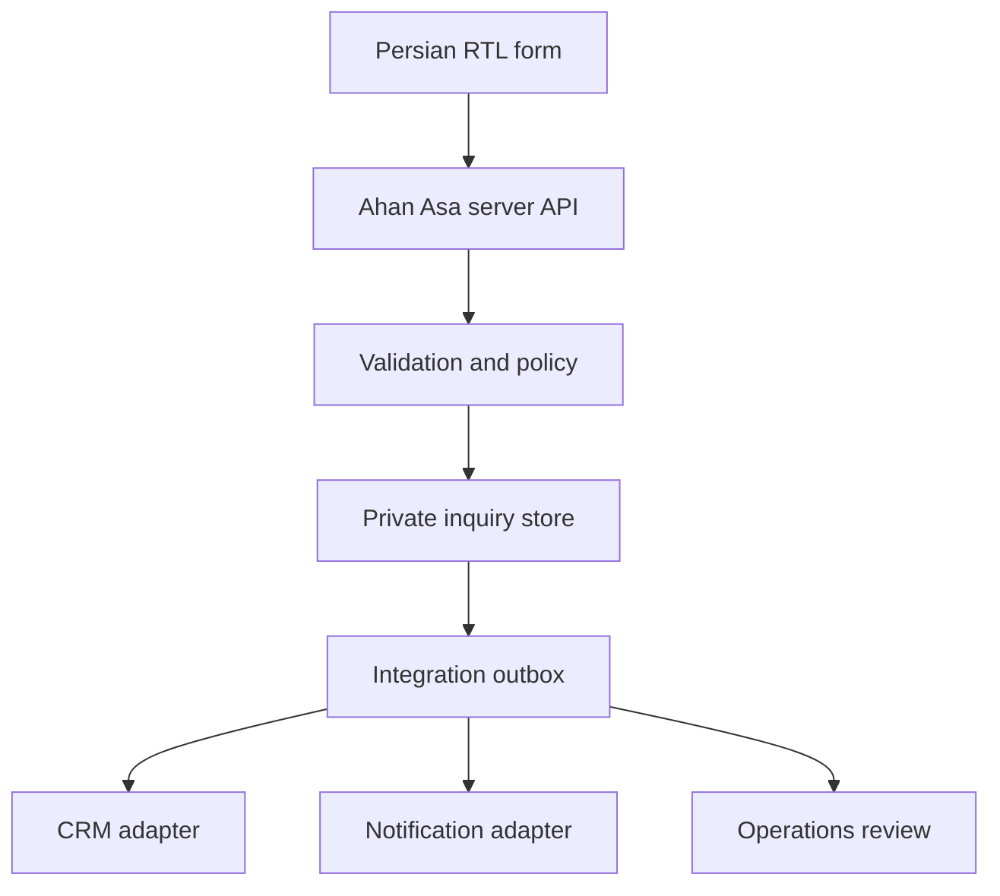

The browser communicates only with Ahan Asa-controlled application endpoints. External systems are called from trusted server-side code unless a documented integration specifically requires a client-side SDK.

### 5.2 Layer responsibilities

| Layer | Responsibilities | Must not do |
| --- | --- | --- |
| Presentation | Render Persian RTL UI, collect input, show progress and recoverable errors | Hold secrets, decide final validity, call CRM directly |
| API/BFF | Authenticate where required, validate, normalize, rate-limit, create correlation IDs | Return stack traces, leak provider payloads, trust browser validation |
| Domain service | Apply inquiry rules, deduplicate, manage status transitions | Depend on UI labels or vendor-specific fields |
| Persistence | Store inquiry records, audit metadata, upload references, outbox jobs | Make confidential objects public |
| Integration adapters | Translate internal models to approved providers | Become the source of truth for website behavior |
| Worker/outbox | Retry asynchronous handoffs, record outcomes, alert operations | Block user acknowledgement on a noncritical downstream notification |

### 5.3 Recommended internal modules

```text
lib/
  api/
    contracts/
    errors/
    responses/
  domain/
    inquiries/
    uploads/
    tracking/
  integrations/
    crm/
    email/
    messaging/
    analytics/
    anti-abuse/
    cms/
  security/
  observability/
app/
  api/
    inquiries/
    uploads/
    tracking/
    webhooks/
```

The final directory names are subordinate to `FOLDER_STRUCTURE.md`. The separation of contracts, domain rules, and vendor adapters is mandatory even if the physical layout changes.

---

## 6. API Conventions

### 6.1 Base path and versioning

- Public application endpoints use `/api/v1/...`.
- The version applies to the contract, not the deployment.
- Breaking request or response changes require a new major API version.
- Additive optional fields do not require a new version when old clients remain valid.
- Internal webhook endpoints use `/api/webhooks/...` and are not treated as public browser APIs.

### 6.2 Transport

- Production traffic requires HTTPS.
- JSON endpoints use `Content-Type: application/json; charset=utf-8`.
- Upload bytes must not pass through the application server when an approved private direct-upload flow is available.
- Never place personal data, filenames, phone numbers, emails, messages, or document references in URLs or query strings.

### 6.3 Naming and formats

- API field names use `snake_case`.
- Timestamps use ISO 8601 UTC, for example `2026-08-25T09:30:00Z`.
- Internal IDs are opaque, non-sequential identifiers.
- Locale values use BCP 47-style codes; Phase 1 public submissions use `fa-IR`.
- Phone input is normalized server-side and the original user-entered value may be retained only when operationally necessary.
- Monetary amounts require an explicit currency; no implicit rial/toman conversion is allowed.
- Units must be explicit and must not be inferred from a bare number.

### 6.4 Standard success envelope

```json
{
  "ok": true,
  "data": {},
  "meta": {
    "request_id": "req_opaque",
    "api_version": "v1"
  }
}
```

### 6.5 Standard error envelope

```json
{
  "ok": false,
  "error": {
    "code": "VALIDATION_ERROR",
    "message": "اطلاعات واردشده نیاز به اصلاح دارد.",
    "field_errors": {
      "phone": ["شماره تماس را بررسی کنید."]
    },
    "retryable": false
  },
  "meta": {
    "request_id": "req_opaque",
    "api_version": "v1"
  }
}
```

Public error messages are Persian, calm, and actionable. Provider messages, database errors, file paths, stack traces, security rules, and internal identifiers must not be exposed.

### 6.6 Correlation ID

Every API call receives or creates a request/correlation ID. It must:

- be returned in `meta.request_id`;
- appear in structured server logs;
- be safe to share with support;
- contain no personal data;
- remain distinct from the public inquiry reference.

### 6.7 Idempotency

`POST /api/v1/inquiries` and upload finalization require an idempotency key.

- The browser creates one key per intentional submission attempt.
- Retries reuse the same key.
- The server stores the key with a normalized request fingerprint for a limited approved period.
- Reuse with the same payload returns the original result.
- Reuse with a conflicting payload returns `409 IDEMPOTENCY_CONFLICT`.
- A double-click or network retry must not create duplicate inquiries or duplicate CRM records.

---

## 7. Canonical Inquiry API

### 7.1 Endpoint

```http
POST /api/v1/inquiries
```

This is the only canonical Phase 1 lead-creation endpoint. Homepage panels, `/request`, contact forms, service pages, product pages, and campaign entry points must map to this contract rather than create separate incompatible APIs.

### 7.2 Request model

```ts
type CreateInquiryRequest = {
  schema_version: "1";
  locale: "fa-IR";
  inquiry_type: "procurement_request" | "invoice_review" | "material_list_review" | "consultation";

  contact: {
    full_name: string;
    company_name?: string;
    role?: string;
    phone: string;
    email?: string;
    preferred_contact_method?: "phone" | "email" | "whatsapp";
  };

  project?: {
    name?: string;
    city?: string;
    province?: string;
    delivery_location?: string;
    required_date?: string;
  };

  requirement: {
    categories?: string[];
    description?: string;
    estimated_quantity?: {
      value: number;
      unit: "kg" | "ton" | "piece" | "meter" | "square_meter" | "other";
    };
  };

  uploads?: Array<{
    upload_id: string;
  }>;

  consent: {
    privacy_notice_version: string;
    accepted: true;
  };

  attribution?: {
    landing_path?: string;
    referrer_domain?: string;
    utm_source?: string;
    utm_medium?: string;
    utm_campaign?: string;
    utm_content?: string;
    utm_term?: string;
  };

  anti_abuse_token?: string;
};
```

Final required fields and category values belong to `FORM_ARCHITECTURE.md` and `DATA_ARCHITECTURE.md`. Claude Code must not expand the form merely because a field exists in the API model.

### 7.3 Server processing order

1. Enforce method, origin, content type, and body-size limits.
2. Create a correlation ID.
3. Apply edge and application rate limits.
4. Verify anti-abuse evidence when enabled.
5. Parse against a strict schema; reject unknown sensitive fields.
6. Normalize Persian/Arabic characters only where semantically safe.
7. Validate required fields and cross-field rules.
8. Verify each `upload_id` belongs to the current anonymous submission session, is finalized, and is eligible for attachment.
9. Apply idempotency and duplicate protection.
10. Store the canonical inquiry and consent evidence transactionally.
11. Store an outbox event for downstream integrations.
12. Return a real acknowledgement and public reference.
13. Process CRM and notification handoffs asynchronously when possible.

### 7.4 Success response

```json
{
  "ok": true,
  "data": {
    "inquiry_reference": "AA-8F4K2M",
    "status": "received",
    "next_step": "درخواست شما برای بررسی اولیه ثبت شد."
  },
  "meta": {
    "request_id": "req_opaque",
    "api_version": "v1"
  }
}
```

The public reference must be non-sequential and difficult to enumerate. The wording must not promise a response time unless an approved operating SLA exists.

### 7.5 Status codes

| HTTP | Public code | Meaning |
| --- | --- | --- |
| `201` | — | New inquiry created |
| `200` | — | Idempotent replay returned the original result |
| `400` | `BAD_REQUEST` | Malformed request |
| `403` | `ORIGIN_REJECTED` | Request origin or policy rejected |
| `409` | `IDEMPOTENCY_CONFLICT` | Key reused with a different payload |
| `413` | `PAYLOAD_TOO_LARGE` | JSON body or attachment policy exceeded |
| `422` | `VALIDATION_ERROR` | Field or business-rule validation failed |
| `429` | `RATE_LIMITED` | Submission frequency exceeded |
| `503` | `SUBMISSION_UNAVAILABLE` | The canonical store could not safely accept the inquiry |

### 7.6 Acknowledgement boundary

The form may show success after the canonical inquiry is durably stored, even if a downstream CRM or notification job is pending. It must not show success when:

- only client-side validation passed;
- an upload completed but inquiry creation failed;
- an email was attempted without storing the inquiry;
- a fake/local adapter accepted the request;
- the server cannot determine whether the inquiry was persisted.

An internal CRM failure after durable storage is an operations incident, not a reason to tell the user the inquiry was lost.

---

## 8. Document Upload API

### 8.1 Activation gate

Production upload must remain disabled until all of the following exist:

- approved private object storage;
- authenticated server-side signing;
- file type, size, and count policy;
- upload-session ownership rules;
- malware scanning or equivalent operational control;
- quarantine and rejection behavior;
- retention and deletion policy;
- privacy notice and consent wording;
- access-control and audit rules;
- an approved non-upload fallback.

### 8.2 Recommended three-step flow

#### Step 1 — Create upload intent

```http
POST /api/v1/uploads/intents
```

```json
{
  "file_name": "list.pdf",
  "file_size": 245760,
  "mime_type": "application/pdf",
  "purpose": "material_list"
}
```

The server validates policy and returns a short-lived, single-purpose upload instruction. The response must never include permanent storage credentials.

#### Step 2 — Upload privately

The browser uploads bytes using the approved short-lived instruction. The object is created in a private temporary or quarantine location. The object key must be generated by the server and must not reuse the original filename.

#### Step 3 — Finalize

```http
POST /api/v1/uploads/{upload_id}/finalize
```

Finalization verifies size, type, ownership, storage state, and scanning state. Only a finalized eligible `upload_id` may be attached to an inquiry.

### 8.3 Upload states

Internal states:

```text
intent_created
uploading
uploaded
verifying
quarantined
accepted
rejected
expired
attached
deleted
```

Public UI states remain aligned with `UI_COMPONENTS.md`: idle, selected, validating, uploading, uploaded, rejected, error, removable, and retry.

### 8.4 Baseline technical rules

- Do not trust filename extensions or browser-provided MIME type.
- Validate magic bytes/content signatures where feasible.
- Store original filename only as protected metadata after sanitization.
- Use safe directional isolation when displaying filenames.
- Reject executable, script, archive, and macro-enabled formats unless explicitly approved.
- Prevent public ACLs and predictable object keys.
- Use short expiration for upload instructions.
- Bind an upload to one submission session and purpose.
- Limit file count, per-file size, total size, and upload frequency.
- Do not render user files inline from the application origin.
- Use forced download or a separate controlled document-viewing origin if staff access is implemented.
- Do not claim encryption, scanning, confidentiality, or deletion timing until verified in production.

### 8.5 Orphan cleanup

Uploads not attached to a successfully created inquiry must expire and be deleted through a scheduled cleanup process. The retention period must be defined in the approved data-retention policy, not hard-coded in UI copy.

### 8.6 Upload failure behavior

- A failed file must not erase completed form fields.
- Retry must reuse the current file only when browser capabilities and policy allow it.
- If one of several files fails, the UI must identify the affected file.
- Inquiry submission must not silently omit a selected but failed document.
- If uploads are unavailable, display the approved fallback method and mark the upload control unavailable.

---

## 9. CRM Integration

### 9.1 Status

The application requires a CRM adapter boundary, but no CRM—including Odoo—is approved by this document. Selecting a vendor is a separate decision.

### 9.2 Internal adapter contract

```ts
type CrmLeadInput = {
  inquiry_id: string;
  inquiry_reference: string;
  submitted_at: string;
  locale: string;
  contact: {
    full_name: string;
    company_name?: string;
    role?: string;
    normalized_phone: string;
    email?: string;
    preferred_contact_method?: string;
  };
  requirement_summary: string;
  project_summary?: string;
  category_codes: string[];
  document_count: number;
  attribution?: Record<string, string>;
  privacy_notice_version: string;
};

interface CrmAdapter {
  upsertLead(input: CrmLeadInput): Promise<{
    provider_record_id: string;
    outcome: "created" | "updated";
  }>;
}
```

### 9.3 CRM rules

- The internal inquiry store is the initial system of record for website receipt.
- CRM transfer occurs through an asynchronous outbox where feasible.
- CRM record creation must be idempotent by `inquiry_id`.
- Provider IDs stay server-side.
- Provider-specific fields are mapped in the adapter, not in form components.
- Uploaded files are not copied to a CRM by default; use approved protected links or a separate controlled transfer process.
- CRM failure must be retried with bounded exponential backoff and dead-letter handling.
- After retry exhaustion, alert the operational owner.
- Manual replay requires authorization and must not create duplicate records.
- Secrets use environment or managed secret storage and never use `NEXT_PUBLIC_`.

### 9.4 Required mapping approval

Before activation, document:

- destination pipeline/team;
- lead owner assignment;
- source and campaign fields;
- category mapping;
- status mapping;
- duplicate matching policy;
- attachment behavior;
- consent and lawful processing basis;
- retry owner and manual recovery procedure;
- sandbox and production endpoints;
- field length and formatting constraints.

---

## 10. Email and Operational Notifications

### 10.1 Notification types

Potential Phase 1 messages:

1. internal new-inquiry notification;
2. internal integration-failure alert;
3. optional user receipt confirming only that the inquiry was received;
4. optional user request for missing information initiated by staff through an approved operational system.

Marketing email is outside this transactional integration and requires separate consent and governance.

### 10.2 Email adapter

```ts
interface TransactionalEmailAdapter {
  sendInternalInquiryNotice(input: InternalInquiryNotice): Promise<DeliveryResult>;
  sendInquiryReceipt(input: InquiryReceipt): Promise<DeliveryResult>;
}
```

### 10.3 Rules

- Use an approved sender domain with SPF, DKIM, and DMARC configured.
- Do not attach client documents to notification emails by default.
- Do not include full sensitive form content when a secure record link is sufficient.
- Escape all user input in HTML and text templates.
- Persian templates must be truly RTL; email addresses, references, phone numbers, and URLs require bidi isolation.
- A user receipt must repeat the inquiry reference and factual next step only.
- Email delivery must not be the only durable record of an inquiry.
- Notification failure is logged and retried; it must not generate a second inquiry.
- Recipients, reply-to address, templates, and escalation recipients are configuration—not source literals.

---

## 11. WhatsApp and Direct Messaging

### 11.1 Phase 1 default

WhatsApp is a direct-contact link, not a server integration, unless a separate business API implementation is approved.

### 11.2 Link behavior

- Use only the verified official business number.
- Generate the link through one central helper.
- Prefilled text must be concise and editable.
- Do not place form PII, document names, technical specifications, or hidden tracking identifiers in the URL.
- A user-initiated click may be measured as `contact_channel_click`; it is not a completed inquiry.
- If the number is not approved, hide the channel rather than use a placeholder.
- Opening WhatsApp must be clearly labeled as an external action.

### 11.3 Future Business API

A future WhatsApp Business API integration requires separate approval for templates, opt-in, provider, message retention, staff workflow, webhook verification, delivery-status handling, and privacy disclosure. Claude Code must not infer this approval from the presence of a WhatsApp link.

---

## 12. Request Tracking

### 12.1 Phase 1 boundary

The route `/track` may exist, but a live tracking API must not be implemented until there is an authoritative status source and a safe identity-verification model. Phase 1 has no customer account system.

Until approved, `/track` may:

- explain how to reference an inquiry using its public reference;
- provide an approved contact route;
- state that detailed project communication occurs through the assigned channel;
- avoid any fake search field, fake progress timeline, or fabricated status.

### 12.2 Future tracking contract

If approved, use a server-side endpoint such as:

```http
POST /api/v1/inquiry-status
```

It must require an approved identity check and return only a deliberately minimal public status model:

```ts
type PublicInquiryStatus =
  | "received"
  | "under_initial_review"
  | "more_information_required"
  | "commercial_review"
  | "next_step_shared"
  | "closed";
```

It must not expose supplier names, quotations, costs, internal notes, staff identifiers, files, phone numbers, email addresses, or operational system IDs. Reference-only lookup is prohibited because public references can be shared or discovered.

---

## 13. Analytics Integration

`ANALYTICS_TRACKING.md` is authoritative for event names, consent, and platform selection. This document defines integration boundaries.

### 13.1 Rules

- Analytics is initialized through one consent-aware adapter.
- No analytics SDK may receive name, phone, email, message, filename, document content, exact delivery address, or inquiry reference.
- Do not send form field values or validation messages containing user input.
- UTM data is allowlisted, length-limited, normalized, and stored separately from sensitive text.
- Server-side conversion events use an internal inquiry ID only if the analytics specification permits it; preferably use a random one-way event ID.
- Client and server events share a deduplication ID when both measure the same conversion.
- A form submit click is not `inquiry_submitted`.
- `inquiry_submitted` fires only after the canonical API returns real success.
- Upload selection or completion must not reveal filename or MIME details beyond an approved coarse document category.
- Consent denial must not block core inquiry functionality.

### 13.2 Recommended event boundary

```ts
interface AnalyticsAdapter {
  track(event: ApprovedAnalyticsEvent): void;
  identify(): never; // No user identity in Phase 1 analytics.
}
```

Suggested semantic events, pending `ANALYTICS_TRACKING.md` approval:

- `primary_cta_click`
- `inquiry_form_start`
- `inquiry_validation_error`
- `document_upload_complete`
- `inquiry_submitted`
- `inquiry_submission_error`
- `contact_channel_click`

---

## 14. Anti-Abuse and Rate Limiting

The inquiry API must use layered controls rather than depend on one CAPTCHA vendor.

### 14.1 Required controls

- per-IP and broader edge rate limits;
- per-session/idempotency limits;
- strict schema and body-size limits;
- honeypot or timing signal where accessible and appropriate;
- duplicate-content heuristics;
- upload count and byte limits;
- abuse logging without storing unnecessary raw personal data;
- provider-agnostic challenge adapter if an external challenge is approved.

### 14.2 Accessibility and resilience

- An anti-abuse challenge must not become an inaccessible barrier.
- Failure of an optional provider must have a documented fail-open or fail-closed rule.
- The rule may differ by risk level but must be approved and tested.
- Do not reveal precise abuse thresholds in public errors.
- `429` responses include a safe retry hint where appropriate.

---

## 15. CMS and Revalidation Webhooks

If Phase 1 uses local repository content only, no CMS API is required. If a CMS is approved later:

- public pages may fetch only published, approved content;
- preview and draft content require authenticated preview mode;
- CMS tokens remain server-side;
- build-time or server fetches use explicit timeouts and schema validation;
- failed content parsing must not publish malformed or unsafe output;
- rich text is rendered through an allowlist;
- media URLs are restricted to approved origins;
- webhook payloads are signed and replay-protected;
- revalidation accepts an allowlisted content identifier, not an arbitrary URL;
- webhook endpoints are rate-limited and audited;
- content API failure must follow the caching/fallback policy in `CMS_ARCHITECTURE.md` and `CACHING_STRATEGY.md`.

Recommended endpoint boundary:

```http
POST /api/webhooks/cms/revalidate
```

The endpoint must never accept a secret through a query string.

---

## 16. Webhook Security

All inbound provider webhooks must implement:

- HTTPS only;
- raw-body signature verification before JSON parsing when required by the provider;
- timestamp tolerance;
- replay protection using provider event ID or a digest;
- strict event-type allowlist;
- schema validation;
- idempotent processing;
- fast acknowledgement with asynchronous work where possible;
- structured logs with sensitive payload fields redacted;
- dead-letter handling for repeated processing failure.

Unknown event types return a safe acknowledgement or rejection according to provider rules but must never trigger generic processing.

---

## 17. External Request Policy

Every outbound server request must define:

- explicit connect and total timeout;
- maximum response size where controllable;
- retry policy by error category;
- circuit-breaker or degradation behavior for critical dependencies;
- TLS verification;
- approved hostname allowlist;
- schema validation of the response;
- redacted structured logging;
- ownership and alert threshold.

Never retry permanent validation or authentication failures automatically. Retry transient network failures, `429`, and eligible `5xx` responses with bounded exponential backoff and jitter, respecting `Retry-After` when safe.

---

## 18. Error Taxonomy

### 18.1 Public error codes

| Code | Retryable | UI behavior |
| --- | --- | --- |
| `BAD_REQUEST` | No | Show general correction message |
| `VALIDATION_ERROR` | No, until corrected | Show error summary and inline errors |
| `UPLOAD_POLICY_REJECTED` | No, until file changed | Identify policy issue for the file |
| `UPLOAD_FAILED` | Usually yes | Preserve form and offer file retry |
| `RATE_LIMITED` | Later | Preserve form and show calm retry guidance |
| `IDEMPOTENCY_CONFLICT` | No | Stop automatic retry and ask user to review |
| `SUBMISSION_UNAVAILABLE` | Yes or fallback | Preserve form and show approved fallback |
| `INTEGRATION_PENDING` | Internal only | Never expose as a failed user submission after durable receipt |

### 18.2 Internal error classes

Use typed errors such as:

- `InputValidationError`
- `PolicyViolationError`
- `RateLimitError`
- `PersistenceError`
- `UploadVerificationError`
- `ProviderAuthenticationError`
- `ProviderRateLimitError`
- `ProviderTransientError`
- `ProviderPermanentError`
- `WebhookSignatureError`
- `ConfigurationError`

Internal error types map to stable public responses. UI code must not parse arbitrary error strings.

---

## 19. Security Requirements

### 19.1 Secrets

- Secrets exist only in approved environment/secret management.
- Never commit `.env` values.
- Never expose secrets with a `NEXT_PUBLIC_` prefix.
- Separate development, preview, staging, and production credentials.
- Rotate credentials after exposure or team-access changes.
- Grant least privilege to every provider token.
- Document owner, scope, creation date, rotation expectation, and revocation procedure outside source control as appropriate.

### 19.2 Browser-to-API protection

- Prefer same-origin API calls.
- Reject unsupported origins.
- Use secure, `HttpOnly`, `SameSite` cookies only when session state is required.
- Apply CSRF protection to cookie-authenticated state-changing requests.
- Do not use wildcard CORS for inquiry or upload endpoints.
- Set strict body limits before parsing.
- Validate all fields on the server.
- Sanitize only for output context; do not treat sanitization as validation.

### 19.3 Data exposure

- API responses return the minimum data needed for the current UI state.
- Public references are not database keys.
- Logs redact or hash sensitive values according to the logging policy.
- Error monitoring must use before-send redaction.
- Preview deployments must not use production inquiry data or credentials.
- CDN and browser caches must not store confidential API responses.

### 19.4 Recommended headers for sensitive responses

```http
Cache-Control: no-store
Pragma: no-cache
X-Content-Type-Options: nosniff
Referrer-Policy: strict-origin-when-cross-origin
```

The global security-header policy belongs in `SECURITY_GUIDELINES.md`.

---

## 20. Privacy, Consent, and Retention

Before production launch, the owner must approve:

- controller/business identity shown to users;
- purpose of inquiry processing;
- required versus optional fields;
- privacy notice versioning;
- consent or other legal basis;
- recipients and processors;
- cross-border data-transfer implications;
- document access roles;
- inquiry and orphan-upload retention;
- deletion and correction request process;
- breach and incident workflow.

The system stores the privacy-notice version and submission timestamp with the inquiry. Consent text must not be preselected. Analytics consent must remain separate from the operational act of submitting an inquiry.

Sensitive documents must be accessible only to approved operational roles. Access must be auditable. A CRM, email inbox, or analytics tool must not automatically receive the full document merely because it can.

---

## 21. Observability and Audit

### 21.1 Structured logs

Each relevant event should include:

- timestamp;
- environment;
- service/route;
- correlation ID;
- internal inquiry ID where approved;
- operation and outcome;
- duration;
- provider name only at the adapter boundary;
- retry count;
- safe error code.

Do not log request bodies, document contents, original filenames, full phone numbers, emails, messages, access tokens, signed URLs, or webhook secrets.

### 21.2 Metrics

Operational metrics may include:

- inquiry API success/error rate;
- validation rejection rate by safe error category;
- upload intent, completion, rejection, and orphan rate;
- persistence latency;
- CRM handoff success and queue age;
- notification success and queue age;
- webhook signature failures;
- rate-limit volume;
- dead-letter count.

These operational metrics are not marketing analytics and must not be sent to client analytics by default.

### 21.3 Audit events

Record security-relevant actions such as:

- inquiry created;
- upload accepted, rejected, attached, or deleted;
- staff document access, if an internal interface exists;
- CRM handoff completed or manually replayed;
- retention deletion completed;
- configuration or credential rotation event where supported.

---

## 22. Environment Separation

| Environment | Real inquiries | Real recipients | Production CRM | Public indexing |
| --- | --- | --- | --- | --- |
| Local | No | No | No | No |
| Preview | No | Approved test sink only | Sandbox/no-op only | No |
| Staging | Synthetic test data only | Approved test recipients | Sandbox | No |
| Production | Yes | Approved production recipients | Approved production adapter | Yes |

Rules:

- Never clone production personal data into lower environments.
- Test fixtures must be obviously synthetic.
- Preview forms must not send to real sales channels.
- Environment-specific endpoints and keys are configuration.
- Production activation requires an explicit feature flag or deployment configuration; source branch names are not sufficient authorization.

---

## 23. Environment Variable Contract

Exact names may be normalized by `ENVIRONMENT_VARIABLES.md`; the following categories are required:

```text
APP_ENV
APP_BASE_URL

INQUIRY_STORE_*
INQUIRY_REFERENCE_SECRET
IDEMPOTENCY_*

UPLOAD_PROVIDER
UPLOAD_PRIVATE_BUCKET
UPLOAD_SIGNING_*
UPLOAD_MAX_*

CRM_PROVIDER
CRM_API_BASE_URL
CRM_API_TOKEN
CRM_PIPELINE_ID

EMAIL_PROVIDER
EMAIL_API_TOKEN
EMAIL_FROM
EMAIL_INTERNAL_RECIPIENTS

WHATSAPP_BUSINESS_NUMBER

ANTI_ABUSE_PROVIDER
ANTI_ABUSE_SECRET

CMS_PROVIDER
CMS_API_TOKEN
CMS_WEBHOOK_SECRET

ANALYTICS_*
ERROR_MONITORING_*
```

Rules:

- This is a category contract, not permission to add every variable.
- Only non-sensitive values explicitly required by browser code may be public.
- Application startup validates required variables for enabled features.
- Disabled features must not require unused secrets.
- Missing production configuration causes a clear deployment/startup failure or an explicitly safe unavailable state; it must not activate a mock provider.

---

## 24. Feature Flags and Kill Switches

Server-controlled flags are required for integration-dependent features:

```text
FEATURE_INQUIRY_SUBMISSION
FEATURE_DOCUMENT_UPLOAD
FEATURE_CRM_HANDOFF
FEATURE_INQUIRY_RECEIPT_EMAIL
FEATURE_WHATSAPP_CONTACT
FEATURE_REQUEST_TRACKING
FEATURE_CMS_WEBHOOKS
```

Requirements:

- Flags default to the safest valid state.
- A server flag controls server capability; a client flag only controls presentation.
- Hiding a button is not security.
- Disabling CRM handoff must preserve the canonical inquiry and raise an operational alert if submission remains active.
- Disabling inquiry submission must show the approved fallback and must not return fake success.
- Kill switches and restoration steps must be documented in the deployment runbook.

---

## 25. Integration Testing Strategy

### 25.1 Contract tests

Test:

- schema acceptance and rejection;
- unknown-field policy;
- standard response envelopes;
- stable error-code mapping;
- idempotent replay and conflict;
- locale and direction-sensitive values;
- provider adapter input/output mapping.

### 25.2 Security tests

Test:

- CORS/origin rejection;
- CSRF where sessions are used;
- rate limits;
- oversized JSON and files;
- MIME spoofing and blocked formats;
- expired/reused upload instructions;
- upload ownership mismatch;
- webhook invalid signature and replay;
- secret and PII redaction;
- public-reference enumeration resistance;
- cache headers on sensitive responses.

### 25.3 Failure tests

Simulate:

- network timeout;
- database unavailable;
- CRM `401`, `429`, and `5xx`;
- email provider failure;
- upload interrupted and finalize failure;
- duplicate browser submission;
- worker crash after provider success but before acknowledgement;
- webhook redelivery;
- anti-abuse provider unavailable.

### 25.4 End-to-end acceptance

Production-like staging must prove:

1. a valid Persian RTL inquiry is durably stored once;
2. the user receives a real reference;
3. server validation is authoritative;
4. invalid input preserves recoverable values;
5. upload policy and failure states are accurate;
6. CRM/notification retries do not duplicate the inquiry;
7. analytics records no PII and fires success only after acknowledgement;
8. the approved fallback works when submission is disabled;
9. keyboard and screen-reader announcements work through submission states;
10. operational owners can identify and recover failed handoffs.

---

## 26. Performance Requirements

- Marketing pages must not wait for CRM, email, or operational APIs.
- No external integration SDK is loaded globally unless required on most pages and approved.
- Load analytics and challenge scripts according to consent and interaction strategy.
- Use short server timeouts and asynchronous outbox processing for downstream handoffs.
- Keep inquiry payloads small; upload documents separately.
- Do not poll a tracking endpoint when no approved live-tracking capability exists.
- Reserve UI space for form status to prevent layout shift.
- Integration failure must not degrade unrelated static content.

---

## 27. Accessibility and RTL Requirements

- API errors map to visible Persian messages and programmatic field associations.
- Error summary receives focus after a multi-field server rejection.
- Submission and upload progress use appropriate live regions without repeated announcements.
- Focus is not moved on every progress update.
- Mixed-direction strings—references, email, phone, URLs, filenames, units—use semantic bidi isolation.
- Persian UI labels are not derived mechanically from API field names.
- A challenge integration must pass keyboard, zoom, screen-reader, and mobile tests.
- Timeout/retry behavior must give users enough time and preserve entered data.

---

## 28. Prohibited Implementation Patterns

Claude Code must not:

- return `{ success: true }` from an unconnected production route;
- submit a form directly to a CRM, spreadsheet, email provider, or webhook from the browser;
- expose service tokens in client bundles;
- use a public object-storage bucket for inquiry documents;
- put PII in URLs, logs, analytics, error-monitoring breadcrumbs, or cache keys;
- use email as the sole inquiry database;
- call provider SDKs from UI components;
- treat upload success as inquiry success;
- expose sequential inquiry IDs;
- offer reference-only tracking;
- silently drop attachments, fields, or consent evidence;
- retry non-idempotent operations without an idempotency strategy;
- hard-code recipients, official phone numbers, provider endpoints, or credentials;
- activate Odoo, WhatsApp Business API, a CMS, analytics, CAPTCHA, or email vendor without approval;
- publish live prices, stock, order, payment, account, or OCR APIs in Phase 1;
- claim privacy, encryption, scanning, retention, or response-time behavior that is not implemented and verified.

---

## 29. Claude Code Implementation Rules

When implementing this specification, Claude Code must:

1. Read `PROJECT_BRIEF.md`, `FORM_ARCHITECTURE.md`, `DATA_ARCHITECTURE.md`, `TECHNICAL_ARCHITECTURE.md`, `SECURITY_GUIDELINES.md`, `ANALYTICS_TRACKING.md`, and `ENVIRONMENT_VARIABLES.md` when available.
2. Mark missing governing documents or provider choices as explicit blockers/TBDs.
3. Build internal domain types before vendor adapters.
4. Centralize validation schemas for client hints and authoritative server validation.
5. Keep browser-safe DTOs separate from persistence and provider models.
6. Use dependency injection or explicit adapter factories for external services.
7. Provide test adapters only in test environments.
8. Fail closed for confidential storage and identity/access checks.
9. Use truthful unavailable/fallback UI for disabled integrations.
10. Add structured errors, idempotency, rate limits, redaction, and timeouts before production activation.
11. Write unit, contract, failure, and end-to-end tests for every enabled integration.
12. Update `DECISIONS.md`, `CHANGELOG.md`, and relevant environment documentation when a provider or contract is approved.
13. Never broaden Phase 1 into commerce, customer accounts, live prices, or automated document interpretation without a new approved scope.

---

## 30. Approval Gates

### Gate A — Inquiry API

- [ ] Canonical data store selected
- [ ] Form contract approved
- [ ] Server validation approved
- [ ] Privacy notice approved
- [ ] Rate limiting and anti-abuse approved
- [ ] Idempotency and duplicate policy tested
- [ ] Operations owner and fallback confirmed

### Gate B — Document upload

- [ ] Private storage selected
- [ ] Allowed file policy approved
- [ ] Malware/quarantine behavior approved
- [ ] Access roles approved
- [ ] Retention and deletion approved
- [ ] Orphan cleanup tested
- [ ] Privacy wording and fallback approved

### Gate C — CRM

- [ ] Provider and environment approved
- [ ] Field and status mapping approved
- [ ] Credentials and least privilege verified
- [ ] Idempotent upsert tested
- [ ] Retry/dead-letter process tested
- [ ] Manual recovery owner assigned

### Gate D — Notifications

- [ ] Sender domain verified
- [ ] Internal recipients approved
- [ ] Persian RTL templates approved
- [ ] Sensitive-data minimization verified
- [ ] Retry and alerting tested
- [ ] User receipt wording approved, if enabled

### Gate E — Analytics and contact channels

- [ ] Analytics event schema approved
- [ ] Consent behavior approved
- [ ] PII review passed
- [ ] Official WhatsApp/phone/email values verified
- [ ] External action labels and attribution tested

### Gate F — Production readiness

- [ ] Environment separation verified
- [ ] Feature flags and kill switches tested
- [ ] Secrets absent from repository and client bundles
- [ ] Monitoring and alerts active
- [ ] Failure drills completed
- [ ] Security, accessibility, performance, and responsive QA passed
- [ ] No fake or unapproved integration remains enabled

---

## 31. Required Decisions Register

The following decisions remain open until explicitly approved in `DECISIONS.md`:

| ID | Decision | Owner | Blocks |
| --- | --- | --- | --- |
| `API-001` | Canonical inquiry persistence technology | Technical + business owner | Production submission |
| `API-002` | Final inquiry fields and required/optional rules | Sales + operations + legal | Form contract |
| `API-003` | Private upload storage and scanning workflow | Security + operations | Document upload |
| `API-004` | File types, count, size, and retention | Operations + legal + security | Document upload copy and validation |
| `API-005` | CRM provider and field mapping | Sales operations | CRM handoff |
| `API-006` | Transactional email provider and sender identity | Technical + brand owner | Email notifications |
| `API-007` | Official WhatsApp number and operating coverage | Business owner | WhatsApp CTA |
| `API-008` | Anti-abuse implementation and outage policy | Security + technical owner | Production forms |
| `API-009` | Analytics platform, consent, and event schema | Marketing + legal + technical | Conversion tracking |
| `API-010` | Request-tracking source and identity verification | Operations + security | Live `/track` capability |
| `API-011` | CMS choice and webhook/revalidation policy | Content + technical owner | CMS integration |
| `API-012` | Incident, replay, and manual fallback ownership | Operations + technical owner | Production readiness |

Open decisions are not permission to select defaults silently.

---

## 32. Definition of Done

An integration is complete only when:

- its business purpose and owner are approved;
- its provider status is explicit;
- request/response contracts are typed and validated;
- secrets and environments are correctly separated;
- security, privacy, retention, and access rules are implemented;
- idempotency, retries, timeout, and degradation behavior are tested;
- logs and monitoring exist without leaking PII;
- Persian RTL success, error, loading, unavailable, and fallback states are accessible;
- analytics behavior is consent-aware and contains no PII;
- operational recovery has an owner and documented procedure;
- production uses a real provider or deliberately disabled capability—never a mock;
- related documentation and decision records are updated.

---

## 33. Final Principle

The integration architecture must reinforce Ahan Asa's brand promise: **“ما مراقب سرمایه شما هستیم.”**

For the website, that means every submitted request and client document is handled with accuracy, restraint, security, traceability, and honest communication. A smaller integration surface that works reliably is preferable to a broad collection of unapproved or simulated features.
# Ahan Asa Brand Guidelines

> **Brand:** Ahan Asa | آهن آسا  
> **Domain:** `ahanassa.com`  
> **Document:** `BRAND_GUIDELINES.md`  
> **Status:** Draft v1.0 — Working brand authority  
> **Last updated:** 2026-08-25  
> **Primary market:** Iran  
> **Primary public language:** Persian (Farsi), fully RTL

---

## 1. Purpose of This Document

This document defines the visual and verbal identity rules for Ahan Asa across the website, proposals, presentations, social media, stationery, advertising, and future digital products.

Its purpose is to keep every brand expression recognizable, credible, premium, and consistent with Ahan Asa's strategic position: a professional steel procurement manager and protector of client capital—not a generic steel retailer, commodity marketplace, or daily-price channel.

This document is subordinate to explicit owner decisions recorded in `DECISIONS.md` and must remain consistent with `PROJECT_BRIEF.md`. Detailed UI tokens, responsive behavior, and component rules belong in `DESIGN_SYSTEM.md`.

## 2. Brand Foundation

### 2.1 Brand name

- English: **Ahan Asa**
- Persian: **آهن آسا**
- Domain form: **ahanassa.com**

Do not change the spelling to `AhanAsa`, `Ahanasa`, `Ahan Assa`, or another unapproved form in public-facing copy. The domain remains lowercase when written as a URL.

### 2.2 Brand category

**Premium B2B steel procurement management and project purchasing support**

### 2.3 Core promise

Ahan Asa brings commercial discipline, technical awareness, supplier control, and clear coordination to high-value steel purchasing decisions so clients can reduce procurement risk and protect project capital.

### 2.4 Approved slogan

**ما مراقب سرمایه شما هستیم.**  
**We protect your capital.**

Rules:

- The Persian slogan is the primary public version for the Persian website.
- The English line is a meaning-aligned translation, not a replacement for the Persian line in Persian communication.
- Keep the Persian punctuation exactly as shown when the slogan appears as a complete sentence.
- Do not rewrite it as a price, quality, or delivery guarantee.
- Do not permanently attach the slogan to the master logo artwork unless a dedicated slogan lockup is separately approved.

### 2.5 Positioning idea

**Ahan Asa is the composed, technically aware purchasing partner standing between client capital and an uncontrolled steel procurement decision.**

The brand should feel closer to a high-end procurement consultancy and accountable industrial partner than to a traditional iron shop or crowded price-comparison portal.

## 3. Brand Character

### 3.1 Primary attributes

Every brand expression should communicate:

- **Protective** — attentive to the client's capital, exposure, and project priorities.
- **Precise** — technically and commercially disciplined.
- **Trustworthy** — transparent, evidence-led, and accountable.
- **Calm** — confident without noise, pressure, or exaggerated claims.
- **Industrial** — grounded in real materials, processes, documents, and delivery conditions.
- **Premium** — considered, composed, and high quality rather than decorative or luxurious for its own sake.
- **Human** — professional warmth and partnership, not a cold or anonymous trading platform.

### 3.2 Brand archetype

The primary archetype is the **Guardian**, supported by the **Expert**.

- Guardian behavior: protects value, anticipates risk, acts responsibly.
- Expert behavior: clarifies complexity, evaluates evidence, and provides structured guidance.
- The brand must not behave like a loud trader, bargain hunter, speculative commentator, or fear-based salesperson.

### 3.3 Desired audience reaction

A qualified visitor should think:

> “This team understands the commercial and technical consequences of my purchase and can bring order, transparency, and control to the process.”

## 4. Logo System

### 4.1 Master brand mark

The approved master mark is a geometric, symmetrical, hollow A-frame or structural-portal form in Steel Navy, containing a centered vertical four-sided diamond/rhombus in Forge Copper.

The mark expresses:

- the letter **A** from Ahan Asa;
- structural strength and engineered stability;
- a protected center representing client capital;
- the relationship between industrial structure and controlled value.

The master artwork is authoritative. Never redraw it from this written description when approved vector artwork is available.

### 4.2 Locked geometry

The core geometry must not be altered.

The approved presentation reference records the following nominal construction values:

- Icon bounding box: `W = 1.00H`
- Structural stroke/mass reference: `0.20H`
- Inner side angle reference: `60°`
- Center diamond reference: `0.40H`
- Diamond center: `X = 0`, `Y = 0`

These values are documentation references, not permission to recreate or “improve” the mark. If a numeric reference and the approved master vector ever differ, the approved master vector wins until the owner records a new decision.

Prohibited changes include:

- changing proportions, angles, stroke mass, openings, or diamond placement;
- rounding, softening, stretching, compressing, rotating, skewing, or mirroring the mark;
- adding outlines, shadows, bevels, gradients, textures, reflections, or 3D effects;
- replacing the diamond with another symbol;
- separating, overlapping, or animating the parts in a way that changes recognition;
- placing other elements inside the protected center.

### 4.3 Clear space

Define `x` as approximately `22.5%` of the icon height. Maintain at least `1x` clear space around every side of the icon or lockup.

No text, border, photograph edge, pattern, UI control, or other logo may enter this area. Use more than the minimum clear space in premium, editorial, or large-format applications.

### 4.4 Minimum size

Use the following conservative minimums unless final production testing establishes stricter values:

- Icon only, digital: `24 px` high minimum
- Full horizontal lockup, digital: `120 px` wide minimum
- Icon only, print: `8 mm` high minimum
- Full horizontal lockup, print: `30 mm` wide minimum

Below these sizes, use the icon-only asset. Never allow the internal opening or center diamond to fill in, blur, or disappear.

### 4.5 Approved logo configurations

1. **Master icon** — primary symbol for compact or distinctive brand use.
2. **English horizontal lockup** — icon plus `AHAN ASA`.
3. **English vertical lockup** — icon above `AHAN ASA`.
4. **Persian horizontal lockup** — icon plus the approved Persian wordmark.
5. **Persian vertical lockup** — icon above the approved Persian wordmark.
6. **Single-color dark version** — Steel Navy or black, subject to background and production method.
7. **Single-color light version** — white on a dark background.
8. **Favicon/app icon** — icon only; never use the full wordmark in very small spaces.

Do not build mixed Persian-English lockups without a separately approved composition.

### 4.6 English wordmark

The approved English lockup reference uses:

- Typeface: **Montserrat Bold 700**
- Case: uppercase, `AHAN ASA`
- Tracking: `+40` in design-tool units, approximately `0.04em`
- Wordmark color: Steel Navy `#0B2545`
- Reference wordmark height: `0.28H` relative to icon height
- Reference icon-to-wordmark space: `0.20H`
- Horizontal alignment: wordmark vertically centered to the icon midpoint

Use the approved outlined/vector lockup asset whenever possible. Do not reconstruct the production lockup with live text when an official asset exists.

### 4.7 Persian wordmark

The Persian name **آهن آسا** must be treated as a custom geometric wordmark, not merely typed beside the icon.

Locked direction:

- modern, bold, corporate, and structurally balanced;
- visually aligned with the geometric logic of the master icon;
- Estedad-inspired rather than calligraphic;
- correctly connected Persian letterforms;
- no traditional calligraphy, decorative swashes, or pseudo-Persian construction;
- no arbitrary disconnection, distortion, or Latin-style spacing.

**TBD — Final production asset:** Until the final Persian outlined/vector wordmark and its exact lockup measurements are approved, do not fabricate a permanent Persian logo lockup in code. Live Persian text may be used as ordinary brand-name copy, but it must not be presented as the official wordmark.

### 4.8 Logo color variants

Use these combinations:

| Background | Preferred logo treatment |
|---|---|
| White `#FFFFFF` | Steel Navy structure + Forge Copper diamond |
| Warm Cream `#FBF5EB` | Steel Navy structure + Forge Copper diamond |
| Steel Navy `#0B2545` | White structure + Forge Copper diamond, only if the approved reversed asset preserves adequate visibility |
| Dark photography | Approved white/reversed asset placed over a controlled dark area or solid overlay |
| Light photography | Primary-color asset placed over a controlled light area or solid surface |
| One-color production | Approved solid black, Steel Navy, or white monochrome asset |

Never place the full-color logo directly over visually complex steel textures, sparks, reflections, or low-contrast photography.

### 4.9 Favicon and social avatar

- Use the master icon only.
- Use a square canvas with generous optical padding.
- Preserve the centered copper diamond at sizes where it remains legible.
- Provide dedicated pixel-fitted exports at `16`, `32`, `48`, `180`, `192`, and `512 px` rather than relying only on browser scaling.
- Do not use the wordmark, slogan, or domain in the favicon.

## 5. Color System

### 5.1 Core palette

| Role | Name | HEX | RGB | CMYK* | HSL |
|---|---|---:|---:|---:|---:|
| Primary | Steel Navy | `#0B2545` | `11, 37, 69` | `84, 46, 0, 73` | `213°, 72%, 16%` |
| Accent | Forge Copper | `#B04A2F` | `176, 74, 47` | `0, 58, 73, 31` | `13°, 58%, 44%` |
| Primary neutral | Cloud White | `#FFFFFF` | `255, 255, 255` | `0, 0, 0, 0` | `0°, 0%, 100%` |
| Warm neutral | Warm Cream | `#FBF5EB` | `251, 245, 235` | production proof required | `38°, 67%, 95%` |

`*` CMYK values are digital conversion references, not press-ready guarantees. Printed work requires substrate-specific proofing and an approved color profile.

### 5.2 Color meaning

- **Steel Navy** carries authority, engineering, stability, trust, and financial discipline.
- **Forge Copper** adds industrial warmth, material authenticity, craft, and distinction.
- **Cloud White** creates clarity, space, precision, and a premium editorial tone.
- **Warm Cream** provides a restrained, human alternative to pure white and supports the authentic industrial-partner direction.

### 5.3 Recommended proportion

For typical brand and website compositions:

- `60–75%` white or warm neutral space
- `20–35%` Steel Navy
- `5–10%` Forge Copper

These are composition guides, not rigid mathematical quotas. Copper must remain an accent. Do not turn it into the dominant page background or use it on every interactive element.

### 5.4 Accessibility and contrast

WCAG contrast references for the approved colors:

| Combination | Contrast | Guidance |
|---|---:|---|
| Steel Navy on White | `15.39:1` | Approved for body text and UI |
| Steel Navy on Warm Cream | `14.19:1` | Approved for body text and UI |
| Forge Copper on White | `5.43:1` | Approved for normal text at AA; use carefully |
| Forge Copper on Warm Cream | `5.01:1` | Approved for normal text at AA; use carefully |
| White on Forge Copper | `5.43:1` | Approved for normal text at AA |
| White on Steel Navy | `15.39:1` | Approved for body text and UI |
| Steel Navy against Forge Copper | `2.83:1` | Do not use for normal text or critical UI contrast |

Do not communicate meaning through color alone. Focus states, errors, status messages, charts, and form validation require a second cue such as text, iconography, shape, or pattern.

### 5.5 Digital tokens

```css
:root {
  --brand-steel-navy: #0b2545;
  --brand-forge-copper: #b04a2f;
  --brand-cloud-white: #ffffff;
  --brand-warm-cream: #fbf5eb;
}
```

Do not add permanent brand colors inside components. Any supporting neutrals, status colors, transparency levels, or interaction-state colors must be defined centrally in `DESIGN_SYSTEM.md` and checked for contrast.

## 6. Typography

### 6.1 Typographic character

Typography should feel engineered, modern, legible, confident, and spacious. It must not feel ornamental, traditional, playful, condensed, or aggressively promotional.

### 6.2 Logo typography versus live typography

Logo wordmarks are fixed artwork. Website and document text are live typography. Never substitute a live font for an approved wordmark or use an outlined wordmark as body text.

### 6.3 Persian direction

- Preferred visual direction: **Estedad** or an approved equivalent with modern geometric structure.
- Use true Persian glyphs and correct joining behavior.
- Maintain comfortable line height and avoid excessively tight tracking.
- Do not apply artificial letter spacing to connected Persian text.
- Use Persian punctuation and true RTL paragraph behavior.
- Mixed-direction content such as phone numbers, dimensions, product codes, and URLs must receive explicit `dir="ltr"` handling where required.

### 6.4 Latin direction

- Brand-aligned Latin direction: **Montserrat** for headings and brand-adjacent display use.
- Use tabular or technically suitable numerals for tables, quantities, and commercial data when the final type system supports them.
- Avoid mixing multiple geometric sans-serif families without a defined functional reason.

### 6.5 Pending typography decision

**TBD — Live type system:** Exact Persian and Latin families, weights, fallbacks, licensing, loading strategy, and responsive scale must be approved in `TYPOGRAPHY_SYSTEM.md` or `DESIGN_SYSTEM.md`. Until then, Claude Code must not treat a temporary font choice as a permanent brand decision.

## 7. Photography and Video Direction

### 7.1 Core art direction

Imagery should express **authentic industrial partnership**: real steel, real people, real decisions, and real control. The visual tone should balance technical credibility with human warmth.

Prioritize:

- verified Ahan Asa personnel, suppliers, projects, or procurement activities;
- close details of steel surfaces, profiles, identification marks, measurements, and documentation;
- inspection, comparison, coordination, loading, dispatch, and delivery moments;
- composed environmental portraits of professionals at work;
- wide industrial scenes with disciplined geometry and clear visual hierarchy;
- natural light, controlled warm highlights, deep neutral shadows, and realistic material color;
- documentary evidence that supports a real capability or story.

### 7.2 Composition

- Favor strong structural lines, frames, negative space, and calm focal points.
- Leave clean areas for headlines or UI only when this does not distort the photograph.
- Use restrained depth and scale; steel should feel substantial, not chaotic.
- Crop deliberately and preserve the action or technical evidence that gives the image meaning.

### 7.3 Color grading

- Maintain neutral, credible steel tones.
- Allow subtle warmth in skin, sunlight, rust, or industrial highlights.
- Use Steel Navy overlays only when necessary for legibility and never so heavily that the image becomes artificial.
- Do not force copper-orange grading onto every image.

### 7.4 Prohibited imagery

- generic stock images presented as Ahan Asa facilities, inventory, team, fleet, or projects;
- fake factories, warehouses, cranes, or steel stock;
- excessive welding sparks, dramatic flames, or cinematic smoke used only for spectacle;
- staged handshakes, anonymous call-center imagery, or cliché hard-hat group photos;
- AI-generated imagery presented as operational evidence;
- glossy luxury imagery unrelated to procurement work;
- crowded collages, clip art, or generic commodity-market visuals.

AI-generated imagery may be used only as clearly non-evidentiary conceptual art and must never imply a real project, facility, employee, product, or inventory position.

## 8. Graphic Language

### 8.1 Geometry

The visual system may take inspiration from the logo's structural frame, centered protected core, symmetry, and disciplined angles. This influence should be subtle and functional.

Permitted expressions include:

- precise modular grids;
- centered focal markers;
- controlled angular crops;
- copper diamond markers for selected highlights or wayfinding;
- thin technical rules, measured spacing, and specification-like annotations;
- restrained framing devices that support hierarchy.

Do not repeatedly use the complete logo as a decorative pattern. Do not build unrelated pseudo-logos from the A-frame or diamond.

### 8.2 Iconography

- Use a consistent, modern, geometric icon family.
- Prefer simple shapes with clear meaning and balanced optical weight.
- Keep icons functional; label unfamiliar actions.
- Match stroke, corner, and fill rules across the set.
- Do not use cartoon, hand-drawn, overly rounded, or mixed-style icons.
- Do not use the brand logo as a generic UI icon.

### 8.3 Data and technical graphics

- Present quantities, process stages, comparisons, and specifications with clarity.
- Use Steel Navy as the default information color and Copper only for a controlled highlight.
- Avoid fake dashboards, decorative charts, live-price tickers, or unsupported market data.
- Label units, dates, sources, assumptions, and status clearly.

## 9. Layout and Spatial Behavior

Brand layouts should feel calm, ordered, and high-value.

- Use generous whitespace and a disciplined grid.
- Prefer a small number of strong content blocks over dense card walls.
- Create clear editorial hierarchy with decisive headlines and readable supporting text.
- Align mixed Persian and Latin content intentionally.
- Keep mobile layouts equally composed; do not preserve desktop decoration at the cost of usability.
- Use rounded corners only when defined by the design system and never as a default on every surface.
- Avoid excessive glassmorphism, gradients, shadows, floating cards, and decorative layers.

## 10. Motion Principles

Motion should express control and precision.

- Use subtle reveals, state changes, and transitions that clarify hierarchy or action.
- Keep durations short and easing composed.
- The logo may fade, scale uniformly, or reveal as one approved unit; its parts must not deform or reassemble into a different geometry.
- Respect `prefers-reduced-motion`.
- Do not delay access to content, navigation, forms, or calls to action.
- Avoid continuous loops, metallic shimmer, sparks, parallax overload, and attention-seeking effects.

Detailed values belong in `MOTION_GUIDELINES.md`.

## 11. Brand Voice

### 11.1 Voice attributes

- Expert but understandable
- Calm and confident
- Precise and evidence-led
- Protective without fearmongering
- Commercially intelligent
- Technically aware
- Transparent about scope and limitations
- Respectful and direct

### 11.2 Messaging priorities

Lead with:

1. the client's decision, exposure, and project requirement;
2. the control Ahan Asa brings to the procurement process;
3. the method or evidence supporting that control;
4. a clear and proportionate next action.

### 11.3 Preferred language

Prefer language equivalent to:

- procurement clarity;
- requirement review;
- supplier and quotation comparison;
- commercial and technical evaluation;
- documentation and delivery coordination;
- informed purchasing decision;
- protection of project capital;
- agreed scope and verified evidence.

### 11.4 Language to avoid

Do not use unsupported or absolute claims such as:

- “lowest price”;
- “zero risk”;
- “guaranteed delivery”;
- “best steel supplier”;
- “unlimited inventory”;
- “nationwide coverage” without confirmation;
- fabricated urgency or speculative market promises;
- claims of owning factories, warehouses, fleet, or inventory without evidence.

Avoid generic phrases that could belong to any steel seller. Explain what Ahan Asa actually does, how it does it, and within what scope.

## 12. Brand Applications

### 12.1 Website

- Default to White or Warm Cream surfaces with Steel Navy typography.
- Use Copper for selected emphasis, primary action where appropriate, and meaningful highlights—not as constant decoration.
- Keep the first screen focused on procurement management, capital protection, and a qualified next step.
- Do not make product cards, price tables, or market tickers the dominant brand experience.
- Use the Persian brand expression first on Persian pages.

### 12.2 Proposals and presentations

- Use the full lockup on the cover and the icon-only mark in repeated small placements.
- Keep the logo clear of page furniture and technical diagrams.
- Apply the same grid, color proportions, evidence rules, and voice as the website.
- Clearly separate confirmed information, assumptions, exclusions, and commercial conditions.

### 12.3 Social media

- Use the icon-only avatar.
- Keep post templates recognizable through typography, whitespace, and restrained color—not a large logo on every surface.
- Separate educational content from market commentary and commercial offers.
- Never present unverified prices, projects, facilities, or performance as facts.

### 12.4 Stationery and signatures

- Use approved lockups only.
- Keep legal entity details separate from the brand promise.
- Do not add unofficial slogans, seals, certifications, or partner marks.
- Contact information must be verified before release.

## 13. Co-branding and Third-Party Marks

- Ahan Asa should remain visually distinct from suppliers, clients, group companies, and partner brands.
- Do not combine logos into a new composite mark.
- Maintain clear space around every party's logo.
- Use equal visual weight only when the commercial relationship genuinely requires it.
- Client, supplier, certification, and partner logos require permission and verified relationship status.
- Do not imply endorsement, exclusivity, ownership, or partnership through layout alone.

## 14. Asset Standards

### 14.1 Required master assets

The approved brand package should ultimately contain:

- master icon in SVG, PDF, EPS or AI, and transparent PNG;
- English horizontal and vertical lockups;
- Persian horizontal and vertical lockups after final approval;
- full-color, dark monochrome, light monochrome, and approved reversed variants;
- favicon and app-icon exports;
- RGB digital exports and press-ready CMYK artwork;
- a one-page logo usage sheet and this guideline.

### 14.2 File naming

Use predictable lowercase names:

```text
ahan-asa-logo-icon-primary.svg
ahan-asa-logo-horizontal-en-primary.svg
ahan-asa-logo-vertical-en-primary.svg
ahan-asa-logo-horizontal-fa-primary.svg
ahan-asa-logo-vertical-fa-primary.svg
ahan-asa-logo-icon-white.svg
ahan-asa-logo-icon-black.svg
ahan-asa-favicon-32.png
```

Use language suffixes `fa` and `en`; color/variant suffixes should describe the actual asset. Do not use ambiguous names such as `logo-final-final2.svg`.

### 14.3 Source control

- Keep approved brand masters in a dedicated, read-only source folder in the project.
- Web-optimized copies may be generated from masters but must not overwrite them.
- Record every master-asset replacement in `CHANGELOG.md` and the decision in `DECISIONS.md` when geometry, lockup, color, or typography changes.

## 15. Implementation Rules for Claude Code

Claude Code must:

1. Use approved master logo files; never redraw the logo in CSS, HTML, canvas, or an icon library.
2. Preserve logo aspect ratio and intrinsic geometry.
3. Use the exact core color values defined here.
4. Store brand colors as centralized tokens, never scattered hard-coded variants.
5. Treat Copper as a restrained accent.
6. Implement true RTL behavior for Persian content.
7. Keep mixed-direction technical data readable and correctly aligned.
8. Use only verified imagery and claims in production.
9. Mark unresolved assets or decisions as `TBD`; never fabricate them.
10. Escalate any conflict involving the master logo, slogan, positioning, or approved colors.

Claude Code must not:

- substitute an approximate logo or wordmark;
- generate a logo with AI;
- recolor the mark outside approved variants;
- invent a Persian wordmark before its final vector is approved;
- introduce generic blue-orange distributor styling;
- create fake counters, prices, projects, testimonials, certifications, or facility imagery;
- use animation or decoration that weakens the brand's calm, controlled character.

## 16. Quality-Control Checklist

Before approving any brand application, verify:

- [ ] The brand name is spelled correctly in Persian and English.
- [ ] The correct approved logo asset and configuration are used.
- [ ] Core geometry, proportions, and clear space are preserved.
- [ ] Logo contrast and minimum size are acceptable.
- [ ] Steel Navy and Forge Copper match the approved values.
- [ ] Copper remains an accent rather than the dominant color.
- [ ] Persian typography is connected, legible, and truly RTL.
- [ ] Live text has not been mistaken for an approved wordmark.
- [ ] Photography is authentic or clearly non-evidentiary.
- [ ] No image or claim misrepresents facilities, inventory, team, clients, or projects.
- [ ] The voice is calm, precise, protective, and evidence-led.
- [ ] No absolute commercial promise appears without approved evidence.
- [ ] Accessibility does not depend on color alone.
- [ ] Third-party logos and claims are approved.
- [ ] The application still feels like a premium procurement partner, not a generic steel marketplace.

## 17. Explicitly Open Decisions

The following items remain unresolved and must not be guessed:

- **TBD — Persian master wordmark:** final outlined artwork, proportions, spacing, and approved lockups.
- **TBD — Final master asset inventory:** authoritative filenames, formats, and version identifiers.
- **TBD — Live Persian typeface:** exact family, weights, licensing, and fallback stack.
- **TBD — Live Latin typeface system:** exact roles beyond the approved English wordmark reference.
- **TBD — Supporting neutrals and semantic colors:** full UI palette belongs in `DESIGN_SYSTEM.md`.
- **TBD — Print color specification:** approved CMYK profile, Pantone equivalents if required, and physical proofs.
- **TBD — Slogan lockup:** whether a fixed logo-and-slogan composition is needed.
- **TBD — Co-branding templates:** rules for group companies, suppliers, clients, and regional partners.
- **TBD — Approved photo library:** verified people, projects, facilities, products, and usage rights.
- **TBD — Regional variants:** English or Arabic brand expressions for future Iraq, Oman, or GCC use.

## 18. Definition of Done

This guideline becomes **Approved** when the project owner confirms:

- the brand foundation, personality, positioning, and slogan;
- the master logo geometry and approved configurations;
- the Steel Navy, Forge Copper, White, and Warm Cream palette;
- the English wordmark rules;
- the Persian wordmark status and approval path;
- the imagery, voice, misuse, and implementation rules;
- an owner and decision path for every remaining `TBD` item.

Until approval, this document is the authoritative working draft. Confirmed rules may guide implementation, but unresolved items must remain visibly provisional.

---

## Approval Record

| Role | Name | Status | Date |
|---|---|---|---|
| Project Owner | A.M. Taleghani | Pending | — |
| Brand Approval | TBD | Pending | — |
| Design Approval | TBD | Pending | — |
| Production/Print Approval | TBD | Pending | — |
# Caching Strategy — Ahan Asa

> Cache, CDN, revalidation, invalidation, and verification rules for the Ahan Asa website.

| Field | Value |
| --- | --- |
| Project | Ahan Asa (`ahanassa.com`) |
| Application | Next.js App Router |
| Hosting | Vercel |
| DNS / edge security | Cloudflare |
| Document owner | Engineering |
| Status | Implementation specification |
| Last updated | 2026-08-25 |

## 1. Purpose

This document defines how the website caches pages, data, media, fonts, API responses, and user-specific requests. Its objectives are to:

- deliver fast pages from locations close to users;
- improve Core Web Vitals without serving materially stale content;
- reduce origin and CMS traffic;
- make content updates predictable;
- prevent RFQ, preview, authentication, or personalized data from entering a shared cache;
- avoid conflicts between the Cloudflare and Vercel CDN layers.

This file is normative. Claude Code must follow it when adding a route, data source, CMS integration, API endpoint, asset type, redirect, or deployment rule.

## 2. Architecture Decision

```text
Visitor
  -> Cloudflare: DNS, TLS, WAF, bot protection, static-asset delivery
  -> Vercel: application CDN, ISR/page cache, functions
  -> Next.js: route, data, request memoization, and client router caches
  -> CMS / business APIs
```

### Primary rule

Vercel and Next.js own HTML, React Server Component, ISR, and application-data caching. Cloudflare must not apply a broad **Cache Everything** rule to HTML.

Cloudflare may cache only explicitly approved, public, non-personalized asset classes. This prevents a second CDN from continuing to serve an old page after Next.js has revalidated it.

### Why this rule exists

With two CDN layers, every cacheable response can have two independent TTLs and two separate purge mechanisms. If Cloudflare caches HTML longer than Vercel, a successful Next.js revalidation can remain invisible to users. Limiting Cloudflare to static assets keeps content invalidation deterministic.

## 3. Non-negotiable Rules

1. Never cache `POST`, `PUT`, `PATCH`, or `DELETE` responses.
2. Never publicly cache RFQ, contact, authentication, admin, preview, draft, payment, or webhook routes.
3. Never cache a response containing personal, session, pricing-contract, or organization-specific data.
4. Never use `public` or `s-maxage` on a response that depends on `Cookie`, `Authorization`, user identity, or preview state.
5. Never apply Cloudflare **Cache Everything** to all routes.
6. Never set an immutable TTL on a URL whose bytes can change without the URL changing.
7. Never purge the entire Cloudflare zone for a normal CMS update.
8. Cache keys must not vary by marketing parameters such as `utm_source` unless the response truly changes.
9. A content mutation is not complete until the relevant Next.js cache tag or path is revalidated.
10. Claude Code must inspect `package.json` and `next.config.*` before choosing a Next.js caching API. It must not mix incompatible caching models.

## 4. Cache Layers and Ownership

| Layer | Owns | Must not own |
| --- | --- | --- |
| Browser | Fingerprinted JS/CSS, versioned fonts and media | HTML that must update instantly; private responses |
| Cloudflare | Approved static assets, WAF, compression, transport optimizations | HTML/RSC, RFQ/API mutations, preview, personalized content |
| Vercel CDN | Static pages, ISR output, explicitly cacheable route responses | Private/user-specific responses |
| Next.js server/runtime | Cached data, route output, request memoization | Secrets or user-specific data in shared caches |
| Client router | Navigation payloads during a session | Long-term source of truth after content mutation |

## 5. Cache Policy Matrix

TTL values are defaults. A route may use a shorter value when business freshness requires it, but any longer value requires an Architecture Decision Record.

| Resource class | Example | Browser policy | Vercel / Next.js policy | Cloudflare policy | Invalidation |
| --- | --- | --- | --- | --- | --- |
| Fingerprinted build assets | `/_next/static/*` | 1 year, `immutable` | 1 year, `immutable` | Eligible; respect origin | New deployment creates new URLs |
| Versioned fonts | `/fonts/iranyekan.v3.woff2` | 1 year, `immutable` | 1 year, `immutable` | Eligible; respect origin | Change filename/version |
| Versioned brand/media assets | `/assets/logo.v2.svg` | 1 year, `immutable` | 1 year, `immutable` | Eligible; respect origin | Change filename/version |
| Next.js optimized images | `/_next/image?...` | Follow framework response | Use Next.js image cache; minimum target 30 days | Eligible only after verifying correct `Accept` variation | Change source URL/version or purge exact asset |
| Public uploaded images | `/media/products/...` | 1 day | 30 days at CDN | Eligible; respect explicit origin header | Change URL/version; exact purge only if unavoidable |
| Marketing HTML | `/`, `/about`, `/services/*` | Revalidate on navigation | Static/ISR; default 24 hours | Bypass HTML cache | Next.js tag/path revalidation |
| Frequently edited content | `/insights/*`, `/resources/*` | Revalidate on navigation | ISR; default 1 hour | Bypass HTML cache | CMS webhook + tag/path revalidation |
| Project/case-study pages | `/projects/*` | Revalidate on navigation | ISR; default 6 hours | Bypass HTML cache | `project:{slug}` and `projects` tags |
| Product/service data | shared page data | Not directly applicable | Cache 6 hours | Not independently cached | `service:{slug}` / `services` tags |
| Navigation/footer/settings | sitewide content | Revalidate on navigation | Cache 24 hours | Not independently cached | `site-settings` tag plus affected paths |
| `sitemap.xml` | `/sitemap.xml` | 1 hour | Revalidate every 1 hour | Bypass unless explicitly tested | `seo` tag or deployment |
| `robots.txt` | `/robots.txt` | 1 hour | Static or 24 hours | Eligible; respect origin | Deployment |
| Public read-only API | `/api/public/*` | 0–60 seconds | 60 seconds by default | Bypass unless explicitly approved | API-specific tag |
| Search/autocomplete | `/api/search` | `no-store` initially | `no-store` initially | Bypass | None |
| RFQ/contact submission | `/api/rfq`, `/api/contact` | `no-store` | `no-store` | Bypass | None |
| Preview/draft/admin/auth | `/api/preview/*`, `/admin/*` | `private, no-store` | No shared cache | Bypass | None |
| Redirect responses | canonical/domain redirects | Short browser TTL during rollout | Platform configuration | Respect origin | Deployment/config update |
| 404 response | missing route/asset | No long browser cache | Maximum 60 seconds if cached | Maximum 60 seconds | Deployment/content creation |
| 5xx response | server failure | `no-store` | Do not cache | Do not cache | None |

## 6. Recommended Response Headers

### 6.1 Immutable fingerprinted assets

```http
Cache-Control: public, max-age=31536000, immutable
```

Use this only when the filename or query contains a content hash or explicit version and any byte change creates a new URL.

### 6.2 Public HTML controlled by Next.js/Vercel

Do not manually overwrite framework-generated page cache headers unless a verified requirement exists. Control page freshness with Next.js static generation, revalidation, and tags.

If a custom route must define the layers independently, use provider-specific headers deliberately:

```http
Cache-Control: public, max-age=0, must-revalidate
Vercel-CDN-Cache-Control: public, max-age=3600, stale-while-revalidate=86400
Cloudflare-CDN-Cache-Control: no-store
```

This is an advanced exception, not the default. Verify the final headers at the public domain because intermediary CDNs may consume or transform cache directives.

### 6.3 Sensitive or personalized responses

```http
Cache-Control: private, no-store, max-age=0
```

Also set appropriate authentication, CSRF, and content-type protections. `no-store` is a defense-in-depth control, not a substitute for authorization.

### 6.4 Public read-only API response

```http
Cache-Control: public, max-age=0, must-revalidate
Vercel-CDN-Cache-Control: public, max-age=60, stale-while-revalidate=300
Cloudflare-CDN-Cache-Control: no-store
```

Only use this for anonymous data that is identical for all users.

## 7. Next.js Implementation Rules

### 7.1 Version gate

Before implementation, Claude Code must determine:

- installed Next.js version;
- whether Cache Components are enabled;
- whether a route is static, ISR, or dynamic;
- whether its data source supports event-driven invalidation;
- whether the response depends on cookies, headers, authentication, or draft mode.

Use one of the following models, never a mixture copied blindly from another project.

### 7.2 Standard App Router model

Use this pattern when the project uses the standard `fetch` cache/revalidation model:

```ts
const response = await fetch(`${CMS_URL}/api/projects`, {
  next: {
    revalidate: 21_600, // 6 hours
    tags: ['projects'],
  },
});
```

For content that must be fresh on every request:

```ts
const response = await fetch(`${API_URL}/account`, {
  cache: 'no-store',
});
```

Use `unstable_cache` only when required for non-`fetch` data access and only when supported by the installed Next.js version. Do not place cookies, headers, sessions, or user identifiers inside a shared cached function.

### 7.3 Cache Components model

If Cache Components are explicitly enabled and supported by the installed version, prefer the stable APIs documented for that exact version:

```ts
import { cacheLife, cacheTag } from 'next/cache';

export async function getProjects() {
  'use cache';
  cacheLife('hours');
  cacheTag('projects');

  return db.project.findMany({
    where: { published: true },
  });
}
```

Do not enable Cache Components only to implement this document. Treat that as a separate architecture change with build, behavior, and migration testing.

### 7.4 Dynamic route rules

A route that uses cookies, authorization, draft mode, request-specific headers, or uncached user data is dynamic. It must not be forced into static rendering to improve a synthetic score.

For every dynamic route, answer these questions in code review:

1. Is the output identical for all visitors?
2. Does it contain or imply user-specific data?
3. Can it safely be served after the underlying data changes?
4. Which event invalidates it?
5. What is the worst acceptable stale period?

If any answer is unknown, default to `no-store` until the behavior is defined.

## 8. Cache Tags and Invalidation Taxonomy

Use stable, lowercase tags. Tags are part of the application contract and must not be generated from untrusted input without validation.

| Content | Collection tag | Item tag | Paths normally affected |
| --- | --- | --- | --- |
| Site settings | `site-settings` | — | All layouts/pages |
| Header/navigation | `navigation` | — | All layouts/pages |
| Homepage | `homepage` | — | `/` |
| Services | `services` | `service:{slug}` | `/`, `/services`, `/services/{slug}` |
| Projects | `projects` | `project:{slug}` | `/`, `/projects`, `/projects/{slug}` |
| Insights | `insights` | `insight:{slug}` | `/insights`, `/insights/{slug}` |
| Resources | `resources` | `resource:{slug}` | `/resources`, `/resources/{slug}` |
| SEO outputs | `seo` | — | Sitemap and metadata-dependent pages |

### Rules

- Revalidate the item tag for an item edit.
- Revalidate both the item and collection tags when an edit changes a listing card, sort order, filter, or count.
- Revalidate `homepage` when the edited item appears on the homepage.
- Revalidate `navigation` or `site-settings` only for global changes.
- Use `revalidatePath` for route output that cannot be mapped cleanly to a data tag.
- Do not call `revalidatePath('/')` as a substitute for understanding dependencies.

## 9. CMS Webhook Contract

The CMS must call a server-side revalidation endpoint after publish, update, unpublish, or delete events.

```text
POST /api/revalidate
Content-Type: application/json
X-Revalidation-Signature: <HMAC signature>

{
  "type": "project",
  "slug": "project-slug",
  "event": "update"
}
```

The endpoint must:

1. verify an HMAC signature or equivalent secret;
2. reject stale/replayed requests when the CMS supports timestamps;
3. validate `type`, `slug`, and `event` against allowlists;
4. map the event to server-defined tags and paths;
5. never accept an arbitrary tag or arbitrary path from the caller;
6. rate-limit requests;
7. record timestamp, content type, content identifier, action, and result without logging secrets;
8. return `Cache-Control: private, no-store`;
9. fail closed on invalid input;
10. be idempotent.

Cloudflare must bypass `/api/revalidate` and all webhook routes.

## 10. Cloudflare Configuration

Rules are evaluated from most specific to least specific. Keep the configuration intentionally small.

### Rule 1 — Bypass sensitive and dynamic paths

Bypass cache for:

```text
/api/*
/admin/*
/account/*
/auth/*
/preview/*
```

Also bypass when the request contains authentication/session cookies used by the application. Do not create a broad cookie bypass rule until the actual cookie names are known.

### Rule 2 — Cache immutable Next.js assets

Match:

```text
/_next/static/*
```

Settings:

- cache eligibility: eligible;
- edge TTL: respect origin;
- browser TTL: respect origin;
- cache key: default;
- do not override `immutable` headers.

### Rule 3 — Cache approved public assets

Match only approved asset locations such as:

```text
/assets/*
/fonts/*
/media/*
```

Settings:

- cache eligibility: eligible;
- edge TTL: respect origin headers;
- browser TTL: respect origin headers;
- serve stale on eligible static assets when safe;
- never strip `Content-Type`, `Content-Length`, `ETag`, or CORS headers without a documented reason.

### Rule 4 — Bypass application documents

Bypass Cloudflare cache for document requests, including HTML and React Server Component responses. Do not identify these only by file extension; Next.js routes often have no extension. Use request/response characteristics verified in Cloudflare Trace.

### Cloudflare features

| Feature | Decision |
| --- | --- |
| Brotli / modern compression | Enable |
| HTTP/2 and HTTP/3 | Enable |
| Early Hints | Test before enabling globally |
| Tiered Cache | Optional for heavy public media traffic |
| Cache Reserve | Not required initially |
| Query String Sort | Do not enable globally; test image and signed URLs first |
| Development Mode | Temporary debugging only |
| Always Online | Do not rely on it for application correctness |

## 11. Asset Versioning

Long cache lifetimes require immutable URLs.

### Required patterns

- Next.js build assets: framework-generated hashed filenames.
- Fonts: version in filename, for example `peyda-v2-regular.woff2`.
- Logos: version or content hash when replaced, for example `ahan-asa-logo.v3.svg`.
- CMS media: CMS-generated immutable asset ID or a version query managed by the CMS.
- PDFs/catalogues: versioned filename and human-readable revision date.

### Forbidden pattern

Replacing `/assets/catalog.pdf` while it has a one-year immutable cache is forbidden. Publish `/assets/ahan-asa-catalog-2026-08.pdf` and update links instead.

## 12. Image Cache Rules

1. Prefer `next/image` for responsive raster images.
2. Use a stable, versioned source URL.
3. Configure `images.remotePatterns`; do not allow arbitrary remote hosts.
4. Set a minimum optimized-image cache TTL target of 30 days when source URLs are immutable.
5. Verify that format negotiation varies correctly by the `Accept` header before Cloudflare caches `/_next/image`.
6. Do not pass signed/private image URLs through a public shared image cache.
7. If an image must be replaced at the same origin URL, purge the exact URL and related optimized variants; the preferred fix is still a new URL.

Example configuration, subject to the installed Next.js version:

```ts
const nextConfig = {
  images: {
    minimumCacheTTL: 2_592_000, // 30 days
    formats: ['image/avif', 'image/webp'],
    remotePatterns: [
      {
        protocol: 'https',
        hostname: 'cdn.ahanassa.com',
        pathname: '/media/**',
      },
    ],
  },
};

export default nextConfig;
```

## 13. Font Cache Rules

- Prefer self-hosted fonts or `next/font`.
- Preload only fonts used above the fold.
- Use WOFF2.
- Version font filenames.
- Serve versioned fonts with `public, max-age=31536000, immutable`.
- Set correct `Content-Type: font/woff2`.
- Keep CORS consistent if fonts are served from a dedicated asset hostname.
- A font upgrade must create a new URL.

## 14. API and Form Rules

### Public `GET` APIs

Caching is opt-in. A public API may be cached only when:

- output is identical for all users;
- no cookie or authorization state is used;
- rate-limit state does not change the representation;
- errors are not cached;
- an invalidation event or acceptable TTL is defined.

### RFQ and contact routes

All RFQ and contact routes must:

- accept mutation methods only;
- return `Cache-Control: private, no-store`;
- avoid redirects that expose submitted fields in a query string;
- never log sensitive payloads in CDN logs;
- apply rate limiting and bot protection;
- not echo complete user input in the response.

### Error responses

- Do not cache `401`, `403`, `429`, or `5xx` responses.
- Cache a public `404` for no more than 60 seconds unless the route space is fully immutable.
- Ensure stale-if-error behavior cannot expose private content.

## 15. Locale and Cache-Key Rules

If Ahan Asa adds multiple locales:

- prefer locale-specific paths such as `/en/...` and `/ar/...`;
- do not serve different locales from the same cache key based only on a cookie;
- redirect locale negotiation once, then cache the destination path normally;
- keep Persian default routes and prefixed international routes canonical according to `HREFLANG_CANONICAL.md`;
- verify each locale invalidation separately when content records are not shared.

Do not vary HTML by device type or user agent. Use responsive CSS and responsive images instead.

## 16. Query Parameters and Cache Keys

### Marketing parameters

`utm_source`, `utm_medium`, `utm_campaign`, `utm_content`, `utm_term`, `gclid`, and similar parameters must not create distinct application content.

Because Cloudflare does not cache HTML, marketing query normalization is not required at that layer. Analytics may read these parameters client-side or server-side without changing the rendered public page.

### Functional parameters

Search, filters, pagination, image width/quality, signed tokens, and preview parameters can change output. Do not remove them from cache keys unless the route contract proves that they are irrelevant.

Never ignore all query strings globally.

## 17. Deployment and Purge Strategy

### Normal code deployment

- Vercel deployment creates new immutable build assets.
- Static/ISR output follows the deployed application version.
- Do not purge Cloudflare globally.
- If a versioned asset URL changes, no purge is required.

### CMS content update

- CMS sends the signed webhook.
- Application revalidates item and collection tags/paths.
- Cloudflare purge is not required because HTML is bypassed.
- Versioned media changes use a new URL.

### Emergency correction

Use this order:

1. fix and deploy or correct the CMS record;
2. revalidate the exact Next.js tag/path;
3. purge only the exact Cloudflare asset URL if that asset is cached there;
4. use prefix purge only when the precise affected set is known;
5. use purge-everything only for a confirmed, sitewide cache incident.

Document emergency purges in the incident log with reason, scope, operator, and timestamp.

## 18. Observability

For representative public requests, record:

- response status;
- `Cache-Control`;
- provider-specific CDN cache-control headers when visible;
- `Age`;
- `CF-Cache-Status`;
- `x-vercel-cache` or the current Vercel cache-status header;
- `Vary`;
- `ETag` / `Last-Modified` when present;
- response time from at least two regions when practical.

Example diagnostic commands:

```bash
curl -sS -D - -o /dev/null https://www.ahanassa.com/
curl -sS -D - -o /dev/null https://www.ahanassa.com/_next/static/<hashed-file>
curl -sS -D - -o /dev/null https://www.ahanassa.com/api/rfq
```

Run a cacheable request at least twice. The first and second response should demonstrate the expected miss/hit or revalidation behavior. A `HIT` is not automatically correct; verify age, representation, locale, content type, and privacy.

## 19. QA Scenarios

The caching implementation is incomplete until these scenarios pass.

| Test | Expected result |
| --- | --- |
| First request for fingerprinted asset | Valid asset, long immutable header; edge may report MISS |
| Second request for same asset | CDN HIT or equivalent; identical bytes/content type |
| New deployment | HTML references new hashed assets; old assets remain harmless |
| CMS item update | Item page updates after targeted revalidation |
| CMS listing-card update | Collection/listing page also updates |
| Homepage-featured item update | Homepage and item page both update |
| RFQ submission | No cacheable response; request reaches application once |
| Authenticated/draft request | No shared-cache HIT; private/no-store response |
| `404` followed by content creation | New content becomes available within 60 seconds or after revalidation |
| Origin `5xx` | Dynamic/private response is not cached |
| Image format negotiation | AVIF/WebP/fallback returns correctly without format mix-up |
| Marketing query parameters | Same page content; no cache fragmentation at application layer |
| Arabic/English locale, if enabled | Correct language, direction, canonical, and isolated cache identity |
| CMS webhook replay | Rejected or safely idempotent |
| Invalid webhook tag/path | Rejected; no arbitrary purge occurs |

## 20. Performance Budget and Targets

Caching must support—not disguise—the performance budget.

| Metric | Target |
| --- | --- |
| CDN hit ratio for immutable static assets | ≥ 95% after warm-up |
| HTML freshness after CMS webhook | ≤ 60 seconds; target near-immediate |
| RFQ/contact shared-cache hit ratio | 0% |
| Unexpected cache variation by tracking query | 0 |
| Sitewide purges during normal operation | 0 |
| Stale-content incidents caused by double-CDN caching | 0 |

Core Web Vitals targets are defined in `PERFORMANCE_GUIDELINES.md`.

## 21. Implementation Checklist

### Application

- [ ] Inspect the installed Next.js version and active caching model.
- [ ] Classify every route as static, ISR, dynamic, or mutation-only.
- [ ] Define an acceptable stale period for every cached data source.
- [ ] Add stable cache tags to CMS-backed queries.
- [ ] Implement signed, allowlisted CMS revalidation.
- [ ] Set `no-store` on RFQ, contact, preview, auth, and webhook responses.
- [ ] Version fonts, logos, media replacements, and downloadable documents.
- [ ] Configure remote image hosts narrowly.
- [ ] Prevent user/session data from entering shared cached functions.

### Cloudflare

- [ ] Confirm that no global Cache Everything rule applies to HTML.
- [ ] Add bypass rules before asset cache rules.
- [ ] Cache `/_next/static/*` while respecting origin headers.
- [ ] Cache only approved public asset directories.
- [ ] Confirm `/api/*`, preview, admin, account, and auth routes bypass cache.
- [ ] Keep Browser TTL and Edge TTL set to respect origin unless documented.
- [ ] Test the final rule order with Cloudflare Trace.

### Verification

- [ ] Capture headers for representative HTML, asset, image, API, and RFQ routes.
- [ ] Test cold, warm, stale, and post-revalidation requests.
- [ ] Test invalidation for item, collection, homepage, and global settings.
- [ ] Confirm 4xx/5xx behavior.
- [ ] Test mobile and desktop without device-specific HTML caching.
- [ ] Test all locales if localization is enabled.
- [ ] Record cache decisions in deployment QA.

## 22. Claude Code Acceptance Criteria

Claude Code may mark caching work complete only when:

1. every affected route is classified;
2. response headers are verified on the deployed domain, not only locally;
3. Cloudflare and Vercel responsibilities remain separated;
4. sensitive routes demonstrably bypass shared caches;
5. CMS invalidation updates both detail and dependent listing pages;
6. immutable assets use versioned URLs;
7. cache behavior has automated tests where feasible and a manual header record where not;
8. no undocumented cache override or sitewide purge dependency remains.

## 23. Related Project Documents

- `TECHNICAL_ARCHITECTURE.md`
- `STACK.md`
- `DATA_ARCHITECTURE.md`
- `CMS_ARCHITECTURE.md`
- `API_INTEGRATIONS.md`
- `FORM_ARCHITECTURE.md`
- `SECURITY_GUIDELINES.md`
- `PERFORMANCE_GUIDELINES.md`
- `IMAGE_OPTIMIZATION.md`
- `FONT_STRATEGY.md`
- `DEPLOYMENT_ARCHITECTURE.md`
- `ENVIRONMENT_VARIABLES.md`
- `QA_CHECKLIST.md`
- `POST_DEPLOY_CHECKLIST.md`

## 24. Official References

- [Next.js caching](https://nextjs.org/docs/app/getting-started/caching)
- [Next.js revalidation](https://nextjs.org/docs/app/getting-started/revalidating)
- [Next.js `revalidatePath`](https://nextjs.org/docs/app/api-reference/functions/revalidatePath)
- [Next.js `revalidateTag`](https://nextjs.org/docs/app/api-reference/functions/revalidateTag)
- [Vercel cache-control headers](https://vercel.com/docs/caching/cache-control-headers)
- [Vercel CDN cache](https://vercel.com/docs/caching/cdn-cache)
- [Cloudflare Origin Cache Control](https://developers.cloudflare.com/cache/concepts/cache-control/)
- [Cloudflare CDN-Cache-Control](https://developers.cloudflare.com/cache/concepts/cdn-cache-control/)
- [Cloudflare Cache Rules settings](https://developers.cloudflare.com/cache/how-to/cache-rules/settings/)
- [Cloudflare revalidation](https://developers.cloudflare.com/cache/concepts/revalidation/)

---

**Default decision:** cache immutable assets aggressively, cache public content deliberately, invalidate CMS-backed content by tag/path, and never place private or transactional responses in a shared cache.
# Changelog

All notable changes to the Ahan Asa website are documented in this file.

This project follows [Keep a Changelog](https://keepachangelog.com/en/1.1.0/) and uses [Semantic Versioning](https://semver.org/spec/v2.0.0.html) where practical.

## Instructions for Claude Code

Claude Code must update this file whenever it makes a user-visible, architectural, security-related, SEO-related, or operationally significant change.

### Required workflow

1. Read this file before starting implementation.
2. Add completed changes under `Unreleased` in the appropriate category.
3. Describe the result, not the implementation process.
4. Use one concise bullet for each independently meaningful change.
5. Include affected routes, components, integrations, or documents when useful.
6. Do not record planned, attempted, reverted-before-commit, or unverified work.
7. Before a release, move applicable `Unreleased` entries into a dated version section.
8. Never silently rewrite or delete an entry from a published version.

### Change categories

- `Added` — New pages, features, components, integrations, or documentation.
- `Changed` — Material changes to existing behavior, design, content, or architecture.
- `Deprecated` — Features that remain available but are scheduled for removal.
- `Removed` — Deleted pages, features, dependencies, or integrations.
- `Fixed` — Bug fixes, compatibility corrections, and content or metadata corrections.
- `Security` — Vulnerability fixes, access-control changes, hardening, and dependency security updates.

### Writing rules

- Start each entry with a past-tense action verb such as `Added`, `Updated`, `Fixed`, `Removed`, or `Secured`.
- Write for project owners and developers; avoid vague phrases such as “minor changes” or “various fixes.”
- Do not include secrets, credentials, tokens, private customer data, or sensitive infrastructure details.
- Do not use commit hashes as the only explanation; add an issue, pull request, or commit reference only as supporting context.
- Combine repetitive low-level edits into one meaningful product-level entry.
- Mark breaking changes clearly with `**BREAKING:**` and include the required migration action.
- Keep the newest version first.
- Use ISO dates in `YYYY-MM-DD` format.

## Versioning policy

Use versions in the form `MAJOR.MINOR.PATCH`:

- `MAJOR` — Incompatible changes requiring migration or coordinated rollout.
- `MINOR` — Backward-compatible features, pages, or significant improvements.
- `PATCH` — Backward-compatible fixes, content corrections, and small refinements.

Documentation-only milestones may remain under `Unreleased` until they are included in a website release.

## [Unreleased]

### Added

- Added the project changelog and its maintenance rules for Claude Code.

### Changed

### Deprecated

### Removed

### Fixed

### Security

<!--
Add new entries above this comment. Remove empty categories when publishing a release.

Example:

## [1.2.0] - 2026-09-15

### Added

- Added a multilingual RFQ form to `/rfq` with file-upload support.

### Changed

- Updated the homepage procurement process to clarify engineering review and supplier verification.

### Fixed

- Fixed Persian canonical URLs so the default locale remains unprefixed.

### Security

- Secured public form submissions with server-side validation and rate limiting.
-->

## Release checklist

Before creating a release:

- Confirm every entry describes completed and verified work.
- Remove empty categories from the release section.
- Select the correct semantic version.
- Add the release date in ISO format.
- Update comparison links at the bottom of this file if the repository URL is available.
- Confirm breaking changes include migration instructions.
- Leave an empty `Unreleased` section ready for the next development cycle.

## Release template

```markdown
## [X.Y.Z] - YYYY-MM-DD

### Added

- Added ...

### Changed

- Updated ...

### Deprecated

- Deprecated ...

### Removed

- Removed ...

### Fixed

- Fixed ...

### Security

- Secured ...
```

<!-- Add version comparison links here after the canonical repository URL is confirmed. -->
# CLAUDE.md — Ahan Asa Website Operating Instructions

> This file is the repository-wide operating contract for Claude Code.
> It governs planning, implementation, validation, and handoff for the Ahan Asa website.

## 1. Document Control

- **Project:** Ahan Asa | آهن آسا
- **Domain:** `ahanassa.com`
- **Owner:** Cyan Sanat Iranian Co. LTD
- **Document role:** Primary Claude Code instruction file
- **Status:** Active
- **Version:** 1.0.0
- **Last updated:** 2026-08-25
- **Scope:** Entire repository unless a more specific nested `CLAUDE.md` explicitly overrides a rule for its directory

## 2. Core Directive

Act as a senior product engineer, UI/UX implementer, technical SEO specialist, accessibility reviewer, and quality owner for this project.

Before changing any file:

1. Understand the request and identify affected areas.
2. Read this file completely.
3. Read all governing project documents relevant to the task.
4. Inspect the current implementation and repository state.
5. State a short implementation plan for non-trivial work.
6. Make the smallest complete change that satisfies the approved specifications.
7. Validate the result with the strongest relevant checks available.
8. Report what changed, what was tested, and any unresolved risk.

Do not treat a prompt as permission to ignore project documentation. Do not start coding from assumptions when the repository or its specifications can answer the question.

## 3. Product Truths

These facts are binding unless the owner changes them in an approved project document:

- Ahan Asa is a **premium B2B steel procurement and sourcing partner**.
- It is positioned as a **professional purchasing manager and protector of the client's interests and capital in the steel market**.
- It is **not** an online steel shop, commodity marketplace, public price board, product directory, or cart-first e-commerce website.
- The approved brand promise is **«ما مراقب سرمایه شما هستیم.»** Use it as a supporting brand expression, never as an absolute financial guarantee or as the sole explanation of the service.
- The primary conversion is **ارسال فاکتور / لیست خرید**: the user submits an invoice, BOM, material list, or procurement request for professional review.
- The intended service flow is: request submission → review and qualification → purchasing proposal → sourcing and delivery coordination.
- The launch language is Persian (`fa-IR`) and the interface is fully RTL.
- Do not add unapproved languages, markets, product categories, service promises, prices, inventory, suppliers, statistics, certifications, testimonials, case studies, integrations, or legal claims.

## 4. Instruction Precedence

When instructions conflict, use this order:

1. The user's latest explicit instruction
2. Legal, security, privacy, and safety requirements
3. This `CLAUDE.md`
4. Approved project specifications and decision records
5. Existing tests and executable contracts
6. Established repository conventions
7. General engineering conventions

Rules for conflicts:

- Never silently choose between conflicting approved documents.
- Stop the affected part of implementation and identify the exact conflict.
- If the decision can safely wait, record the issue in `DECISIONS.md` as pending and continue only with unaffected work.
- Do not edit a specification merely to make the implementation appear compliant.
- A newer dated, approved decision in `DECISIONS.md` overrides an older specification only when it explicitly names the superseded decision or section.

## 5. Required Reading Protocol

At the start of every task, read the documents that govern the requested area. If a listed file does not exist, do not invent its contents; use existing sources of truth and report the missing specification when it materially blocks the work.

### Always read

- `CLAUDE.md`
- `PROJECT_BRIEF.md`
- `DEVELOPMENT_RULES.md`
- `DO_NOT_CHANGE.md`
- `TASKS.md`
- `DECISIONS.md`
- `README.md`

### Read by task type

| Task area | Required documents |
| --- | --- |
| Brand or visual design | `BRAND_GUIDELINES.md`, `DESIGN_DIRECTION.md`, `DESIGN_SYSTEM.md`, `COLOR_SYSTEM.md`, `TYPOGRAPHY_SYSTEM.md`, `UI_COMPONENTS.md`, `MOTION_GUIDELINES.md` |
| Page implementation | `SITEMAP.md`, `INFORMATION_ARCHITECTURE.md`, `ROUTES.md`, `PAGE_SPECIFICATIONS.md`, and the relevant page-specific specification |
| Header or navigation | `HEADER_NAVIGATION_SPEC.md`, `ROUTES.md`, `SITEMAP.md`, `INTERNAL_LINKING.md` |
| Footer | `FOOTER_SPEC.md`, `ROUTES.md`, `INTERNAL_LINKING.md` |
| Copy or content | `CONTENT_STRATEGY.md`, `CONTENT_MODEL.md`, `COPY_GUIDELINES.md`, `CTA_STRATEGY.md`, `MEDIA_GUIDELINES.md` |
| SEO | `SEO_STRATEGY.md`, `SEO_KEYWORD_MAP.md`, `SEO_PAGE_MAP.md`, `METADATA_SPEC.md`, `STRUCTURED_DATA.md`, `INTERNAL_LINKING.md`, `SITEMAP_ROBOTS_SPEC.md`, `REDIRECTS.md` |
| Architecture or dependencies | `TECHNICAL_ARCHITECTURE.md`, `STACK.md`, `FOLDER_STRUCTURE.md`, `COMPONENT_ARCHITECTURE.md`, `DATA_ARCHITECTURE.md`, `CODING_STANDARDS.md` |
| CMS, APIs, or forms | `CMS_ARCHITECTURE.md`, `API_INTEGRATIONS.md`, `FORM_ARCHITECTURE.md`, `ENVIRONMENT_VARIABLES.md`, `SECURITY_GUIDELINES.md` |
| Analytics | `ANALYTICS_TRACKING.md`, `CTA_STRATEGY.md`, `FORM_ARCHITECTURE.md`, `SECURITY_GUIDELINES.md` |
| Performance | `PERFORMANCE_GUIDELINES.md`, `IMAGE_OPTIMIZATION.md`, `FONT_STRATEGY.md`, `CACHING_STRATEGY.md` |
| Localization | `LOCALIZATION.md`, `LOCALE_CONTENT_STRUCTURE.md`, `HREFLANG_CANONICAL.md`, `METADATA_SPEC.md` |
| Testing or release | `TESTING_STRATEGY.md`, `QA_CHECKLIST.md`, `RESPONSIVE_QA.md`, `ACCESSIBILITY_QA.md`, `SEO_QA_CHECKLIST.md`, `PRE_DEPLOY_CHECKLIST.md`, `POST_DEPLOY_CHECKLIST.md`, `DEPLOYMENT_ARCHITECTURE.md` |

Do not read every document mechanically when the task is narrow. Read every document that can materially affect the requested change.

## 6. Repository Discovery Protocol

Before implementation:

1. Inspect the working tree and preserve unrelated user changes.
2. Identify the framework and commands from repository files; do not guess versions or package managers.
3. Locate existing components, patterns, tokens, utilities, tests, and content models before creating new ones.
4. Search for every affected route, component, translation key, metadata entry, schema, analytics event, and test.
5. Confirm whether generated files are committed or produced by tooling before editing them.
6. Check `DO_NOT_CHANGE.md` before modifying shared infrastructure, brand assets, configuration, or protected sections.

Never overwrite, revert, delete, or reformat unrelated work. Never use destructive Git commands unless the user explicitly requests them and the exact impact is understood.

## 7. Planning and Scope Control

For a non-trivial task, create a concise plan that includes:

- affected files or subsystems;
- governing specifications;
- implementation sequence;
- validation steps;
- risks, unknowns, or decisions required.

Then follow these rules:

- Stay within the requested scope.
- Prefer the smallest coherent implementation over broad refactoring.
- Do not perform opportunistic redesigns, dependency upgrades, migrations, or cleanup.
- Do not add packages when the existing stack can solve the problem adequately.
- Ask for a decision only when the answer materially changes the product, architecture, data handling, public claims, timeline, or irreversible work.
- When safe, make reversible implementation choices and clearly state the assumption.

## 8. Brand and Experience Guardrails

### Brand character

The experience must feel:

- precise;
- trustworthy;
- calm;
- premium;
- warm but industrial;
- expert-led and evidence-based.

Avoid the visual and verbal language of discount retail, speculative trading, noisy marketplaces, and generic steel catalogues.

### Approved core palette

- **Steel Navy:** `#0B2545`
- **Forge Copper:** `#B04A2F`
- **White:** `#FFFFFF`
- Supporting neutrals, Iron Gray, Blueprint Cream, and off-whites may be used only as defined in the approved design documents.

Copper is a restrained accent for primary actions, active or hover states, progress, and selected key figures. It must not dominate large surfaces or reduce readability.

### UI principles

- Use the design system and tokens; do not scatter arbitrary values.
- Preserve strong information hierarchy, generous whitespace, and legible Persian typography.
- Reuse approved components before creating variants.
- Every interaction must have clear default, hover, focus, active, loading, success, error, disabled, and empty states where applicable.
- Avoid decorative effects that compete with content or imply an unapproved brand direction.
- Motion should express **calm control**: restrained, purposeful, fast, and non-blocking.
- Respect `prefers-reduced-motion`; content must never depend on animation to become usable.

## 9. Persian, RTL, and Responsive Requirements

- The document language must be `fa` and direction must be `rtl` at the correct root level.
- Use logical CSS properties where practical (`margin-inline`, `padding-inline`, `inset-inline`, etc.).
- Do not fix RTL bugs with duplicated page-specific hacks when a shared logical solution exists.
- Numbers, phone fields, email addresses, URLs, file names, and technical units must use the correct local direction without breaking the surrounding RTL flow.
- Mirrored icons must be intentional; brand marks, media, charts, and universal symbols must not be mirrored automatically.
- Keyboard order, visual order, and screen-reader order must remain coherent.
- The site must work on mobile, tablet, laptop, and wide desktop layouts.
- Horizontal page scrolling is prohibited at supported viewport widths.
- Do not introduce additional locales or locale-prefixed routes before they are approved in the localization specifications.

## 10. Content and Claims Policy

Never invent or imply:

- live steel prices or price guarantees;
- stock availability or supplier relationships;
- purchasing savings, delivery times, geographic coverage, or service capacity;
- certifications, licenses, awards, years of experience, project counts, or transaction volumes;
- testimonials, client logos, case studies, team biographies, or contact details;
- warranties, legal assurances, privacy terms, or contractual commitments.

When approved evidence is unavailable:

- use an explicit placeholder only in non-production drafts;
- otherwise omit the claim or request the missing fact;
- never disguise placeholder content as real content.

Persian copy must be concise, professional, natural, and specific. Avoid exaggerated superlatives, empty corporate language, keyword stuffing, and literal machine-translation phrasing.

## 11. Conversion and Form Rules

The primary journey is upload-first and consultation-led, not cart-first.

- Prioritize **ارسال فاکتور / لیست خرید** where the relevant page specification calls for a primary CTA.
- Ask only for information required to review, qualify, and follow up on the request.
- Do not add a cart, checkout, fake price calculator, public inventory, or unnecessary RFQ fields.
- Explain accepted file types, size limits, required fields, consent, upload progress, success, failure, and retry behavior.
- Validate on both client and server where applicable.
- Treat uploaded invoices, BOMs, contact details, and procurement information as confidential business data.
- Do not log file contents, personal data, credentials, tokens, or full submissions.
- Never claim a submission succeeded until the backend confirms it.
- Preserve user input after recoverable errors.
- Analytics must record only approved events and must not expose sensitive field values or uploaded content.

## 12. Engineering Rules

- Follow `STACK.md`, lockfiles, and existing repository tooling as the source of truth for the exact stack and versions.
- Follow the current architecture; do not introduce a second routing, styling, state, form, validation, data-fetching, or testing system without an approved decision.
- Prefer server-rendered or static output where the architecture and page requirements allow it.
- Use client-side code only where interaction genuinely requires it.
- Keep components focused, typed, composable, and accessible.
- Separate content/data from presentation according to `CONTENT_MODEL.md` and `DATA_ARCHITECTURE.md`.
- Centralize reusable tokens, route definitions, metadata helpers, schemas, validation, and analytics event names.
- Do not duplicate business logic across pages.
- Do not suppress type, lint, build, hydration, or accessibility errors to obtain a passing build.
- Avoid unsafe types, silent error swallowing, fragile timing logic, and environment-specific hardcoding.
- Preserve stable public APIs and component contracts unless a breaking change is explicitly approved.

### Dependencies

Before adding or upgrading a dependency:

1. Confirm the need cannot be met cleanly by the current stack.
2. Check compatibility with the approved runtime and framework.
3. Evaluate bundle, security, maintenance, licensing, and lockfile impact.
4. Obtain approval when the change affects architecture, deployment, or long-term maintenance.

## 13. Environment and Secret Handling

- Use environment variables exactly as documented in `ENVIRONMENT_VARIABLES.md`.
- Never commit secrets, private keys, tokens, passwords, private endpoints, or real customer data.
- Never print secrets in logs, terminal output, screenshots, test fixtures, or handoff notes.
- Do not weaken authentication, validation, rate limiting, upload controls, CSP, or other security controls to simplify development.
- Maintain a safe example environment file containing names and non-sensitive examples only when the project standard requires it.
- Treat missing required production configuration as a deployment blocker, not as a reason to hardcode a fallback secret.

## 14. SEO and Discoverability

- Follow the approved page-to-keyword map; one page must not accidentally compete with another approved target.
- Every indexable page requires unique, accurate, localized metadata.
- Canonical URLs, robots directives, sitemap entries, structured data, and internal links must agree with the route architecture.
- Structured data must represent visible, verified page content. Do not fabricate ratings, reviews, prices, stock, organizations, people, or service details.
- Do not create thin programmatic pages, doorway pages, hidden text, or keyword-stuffed copy.
- Route changes require redirect and internal-link impact review.
- Persian-first launch rules take precedence over speculative multilingual expansion.

## 15. Accessibility Baseline

Target WCAG 2.2 AA unless a stricter project specification applies.

- Use semantic HTML before ARIA.
- Ensure complete keyboard access and visible focus states.
- Associate labels, instructions, validation messages, and status messages with their controls.
- Maintain sufficient color contrast in all states.
- Provide meaningful alternative text; decorative images use empty alt text.
- Preserve heading hierarchy, landmarks, accessible names, and logical reading order.
- Do not encode meaning using color, motion, position, or iconography alone.
- Dialogs, menus, uploads, accordions, carousels, and notifications must follow accessible interaction patterns.

## 16. Performance Baseline

- Protect Core Web Vitals and the budgets in `PERFORMANCE_GUIDELINES.md`.
- Prevent layout shifts by reserving media and dynamic-content space.
- Optimize images and fonts according to their dedicated specifications.
- Avoid unnecessary client JavaScript, third-party scripts, render-blocking resources, and duplicate data fetching.
- Lazy-load only below-the-fold resources; never delay critical content merely to improve a synthetic score.
- Measure material performance changes rather than claiming improvement from code inspection alone.

## 17. Validation Requirements

Run the strongest relevant checks defined by the repository and `TESTING_STRATEGY.md`. Discover exact commands from package scripts and project documentation; do not invent them.

As applicable, validate:

1. formatting;
2. linting;
3. static typing;
4. unit tests;
5. component or integration tests;
6. production build;
7. end-to-end critical journeys;
8. responsive behavior at required breakpoints;
9. keyboard and accessibility behavior;
10. metadata, canonical, robots, sitemap, and structured data;
11. form validation, upload, failure, retry, and success states;
12. broken links, runtime errors, console errors, and hydration warnings;
13. performance impact for changes affecting critical rendering or bundles.

Testing rules:

- Add or update tests when behavior changes.
- Test outcomes and contracts, not internal implementation details.
- Never delete, skip, weaken, or rewrite a legitimate test simply to pass CI.
- If a check cannot run, state the exact reason and what remains unverified.
- A successful build alone is not sufficient validation for visual, interaction, accessibility, SEO, or form changes.

## 18. Visual QA Protocol

For user-facing changes:

- inspect the rendered result, not only the source code;
- verify representative mobile, tablet, desktop, and wide layouts;
- check long Persian text, short text, empty content, validation errors, and loading states;
- verify there is no clipping, overlap, unexpected wrapping, content jump, or horizontal overflow;
- compare against approved design references and tokens;
- verify focus, hover, active, reduced-motion, and error states;
- confirm that the primary CTA remains clear without overwhelming the page.

Do not mark visual work complete based only on compilation.

## 19. Git and Change Management

- Inspect repository status before and after work.
- Preserve unrelated changes and do not assume an unclean tree belongs to you.
- Keep diffs focused and avoid unrelated formatting churn.
- Do not amend, force-push, rewrite history, change branches, or create commits unless requested.
- Do not modify lockfiles unless dependency resolution genuinely changed.
- Update `CHANGELOG.md` for user-visible or operationally meaningful completed changes according to project convention.
- Update `TASKS.md` only when task state actually changes.
- Add a decision to `DECISIONS.md` only for durable product, design, content, data, or architecture choices—not routine implementation details.

## 20. Protected Actions and Stop Conditions

Stop and ask for direction before:

- changing brand identity, positioning, slogan, logo, approved palette, or primary conversion model;
- adding prices, commerce, inventory, marketplace behavior, or public supplier data;
- introducing a locale, major route, CMS, external integration, analytics vendor, or authentication system;
- changing data retention, consent, upload privacy, legal text, or security posture;
- replacing the framework, package manager, styling system, content model, or deployment architecture;
- removing or renaming public routes without an approved redirect plan;
- performing a destructive migration or deleting production/user data;
- publishing, deploying, merging, pushing, or contacting external parties unless explicitly authorized;
- resolving a material conflict between approved documents;
- making a public business claim for which verified evidence is absent.

Also obey every restriction in `DO_NOT_CHANGE.md`.

## 21. Definition of Done

A task is complete only when all applicable statements are true:

- The requested outcome is fully implemented within scope.
- The implementation matches all governing specifications.
- Product positioning and brand rules remain intact.
- Persian and RTL behavior are correct.
- Responsive, accessibility, SEO, security, privacy, and performance implications were checked.
- Relevant states and edge cases are handled.
- Relevant tests were added or updated and all runnable checks pass.
- The production build passes when the change can affect it.
- User-facing work was visually inspected.
- No unrelated changes or unapproved dependencies were introduced.
- Documentation, tasks, decisions, and changelog were updated when warranted.
- The handoff clearly states changed files, validation performed, and any remaining limitation.

## 22. Handoff Format

End each completed implementation with a concise report:

### Outcome

What is now working or delivered.

### Changed

The important files and behavior changed.

### Validation

Commands and manual checks completed, with results.

### Remaining

Only genuine limitations, blocked checks, required owner decisions, or safe next steps. Omit this section when nothing remains.

Do not claim tests, builds, browser checks, deployments, or performance improvements that were not actually completed.

## 23. Task Start Checklist

Use this checklist before editing:

- [ ] I understand the requested outcome and boundaries.
- [ ] I read `CLAUDE.md` and the relevant governing documents.
- [ ] I checked `DO_NOT_CHANGE.md`, `TASKS.md`, and `DECISIONS.md`.
- [ ] I inspected the working tree and existing implementation.
- [ ] I identified reusable patterns and affected contracts.
- [ ] I identified missing facts, conflicts, security concerns, and destructive risks.
- [ ] I have a validation plan proportionate to the change.

## 24. Task Completion Checklist

- [ ] The result meets the request and approved specifications.
- [ ] No unsupported facts, claims, prices, or content were invented.
- [ ] RTL, responsive behavior, and accessibility were checked where relevant.
- [ ] SEO, analytics, form, security, and performance impacts were checked where relevant.
- [ ] Relevant automated checks and a production build pass, or blocked checks are disclosed.
- [ ] User-facing changes were rendered and visually verified.
- [ ] The diff is focused and unrelated user work is preserved.
- [ ] Required project documentation is current.
- [ ] The final handoff is accurate and concise.

---

**Final operating principle:** protect the client's trust, capital, data, and time. Build only what is approved, verify what is built, and never manufacture certainty where the project has not supplied evidence.
# CMS_ARCHITECTURE.md

## معماری CMS وب‌سایت آهن آسا

| مشخصه | مقدار |
|---|---|
| پروژه | Ahan Asa — آهن آسا |
| وضعیت سند | تصمیم معماری پیشنهادی |
| نسخه | 1.0 |
| تاریخ | 2026-08-25 |
| مالک تصمیم | Product / Engineering |
| اسناد مرتبط | `CONTENT_MODEL.md`، `DATA_ARCHITECTURE.md`، `TECHNICAL_ARCHITECTURE.md`، `SEO_STRATEGY.md`، `MEDIA_GUIDELINES.md`، `LOCALIZATION.md` |

---

## 1. تصمیم اجرایی

وب‌سایت آهن آسا در نسخه نخست نباید به‌طور کامل به CMS وابسته باشد. معماری مصوب، **Hybrid Headless CMS** است:

- ساختار فنی، Routeها، Componentها، فرم‌ها، قواعد تجاری، متن‌های حقوقی حساس و محتوای کم‌تغییر در مخزن کد نگهداری می‌شوند.
- محتوای تکرارشونده و قابل‌مدیریت توسط تیم محتوا—مانند مقالات، پروژه‌ها، پرسش‌های متداول و فایل‌های دانلودی—در صورت فعال‌شدن نیاز عملیاتی وارد CMS می‌شود.
- Frontend فقط از طریق یک لایه داخلی و Provider-agnostic به CMS متصل می‌شود؛ Componentها نباید مستقیماً به SDK یا Query Language یک CMS وابسته باشند.
- CMS پیشنهادی در صورت فعال‌سازی: **Sanity** به‌عنوان Headless CMS.
- سایت با Next.js App Router، رندر Static/ISR و بازاعتبارسنجی هدفمند پس از انتشار محتوا کار می‌کند.

> نتیجه: تا زمانی که انتشار محتوا محدود و تحت کنترل تیم توسعه است، CMS نصب نمی‌شود. معماری کد از روز اول برای اضافه‌شدن CMS آماده خواهد بود.

---

## 2. معیار تشخیص نیاز به CMS

CMS زمانی فعال شود که حداقل **دو مورد** از شرایط زیر برقرار باشد:

1. اعضای غیرتوسعه‌دهنده باید به‌صورت هفتگی محتوا منتشر یا اصلاح کنند.
2. انتشار مقاله، پروژه یا فایل دانلودی به چرخه منظم تبدیل شود.
3. بیش از یک نفر نیازمند Draft، Review و Approval باشد.
4. محتوای چندزبانه به‌صورت مستقل توسط مترجم یا مدیر بازار نگهداری شود.
5. Preview پیش از انتشار برای تیم مدیریت ضروری باشد.
6. زمان انتشار محتوا نباید به Commit و Deploy وابسته باشد.
7. تاریخچه تغییرات و بازگشت به نسخه قبلی به یک نیاز عملیاتی تبدیل شود.

### مواردی که به‌تنهایی دلیل کافی برای CMS نیستند

- ویرایش چند شماره تماس یا آدرس در سال
- داشتن یک فرم استعلام قیمت
- نمایش محصولات فولادی بدون قیمت‌گذاری و موجودی لحظه‌ای
- داشتن صفحات ثابت معرفی برند و خدمات
- نیاز به SEO؛ SEO خوب الزاماً به CMS وابسته نیست

---

## 3. اهداف معماری

- حفظ سرعت، امنیت و قابلیت Static Rendering سایت
- استقلال Frontend از Vendor و امکان تعویض CMS
- جلوگیری از تبدیل CMS به Page Builder بدون کنترل
- تفکیک روشن محتوای بازاریابی، داده تجاری و Leadها
- پشتیبانی آماده از فارسی RTL و زبان‌های آینده
- کنترل دقیق Metadata، Canonical، Hreflang و Structured Data
- Preview امن پیش از انتشار
- انتشار محتوا بدون Build کامل سایت
- حفظ یکپارچگی Design System و لحن برند

## 4. خارج از محدوده CMS

موارد زیر نباید در CMS ذخیره یا مدیریت شوند:

- اطلاعات فرم‌های کاربران و Leadها
- درخواست‌های RFQ و سوابق مذاکره
- قیمت لحظه‌ای آهن، موجودی، سفارش، فاکتور و پرداخت
- اطلاعات محرمانه تأمین‌کنندگان
- منطق محاسبات قیمت، وزن، حمل یا تخفیف
- Secretها، API Keyها و Environment Variableها
- Permissionهای اپلیکیشن و منطق Authentication
- CSS، Tokenهای طراحی و تنظیمات Responsive
- متن پیام‌های خطای امنیتی و Validation فرم‌ها

Leadها باید مستقیماً به CRM یا سرویس امن Lead Capture ارسال شوند. CMS پایگاه داده CRM نیست.

---

## 5. معماری کلان

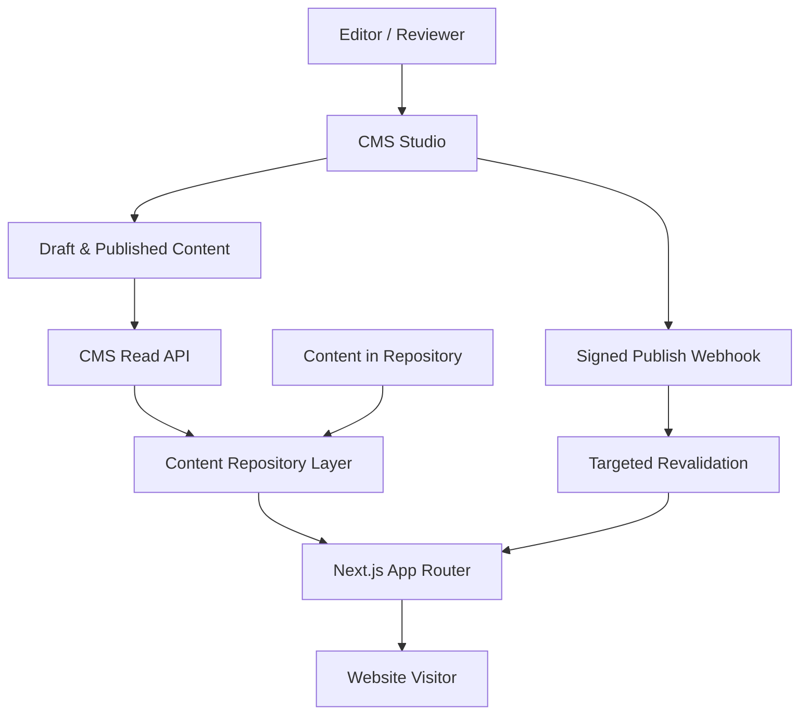

### اصل جریان داده

1. محتوای ثابت از مخزن کد خوانده می‌شود.
2. محتوای Editorial از CMS در Server Component یا لایه Server-only خوانده می‌شود.
3. داده CMS قبل از تحویل به UI، Normalize و Validate می‌شود.
4. UI فقط Typeهای داخلی پروژه را می‌شناسد.
5. انتشار CMS یک Webhook امضاشده ایجاد می‌کند.
6. Webhook فقط Tagها یا Pathهای مرتبط را Revalidate می‌کند.

---

## 6. مرز مسئولیت منابع داده

| نوع داده | منبع اصلی | دلیل |
|---|---|---|
| Route و URL policy | مخزن کد | نیازمند کنترل فنی و Review |
| Header، Footer و Navigation | ابتدا مخزن کد؛ سپس CMS با Guardrail | جلوگیری از شکستن ناوبری |
| صفحه اصلی و صفحات Conversion | مخزن کد یا مدل محدود CMS | حساس به طراحی و نرخ تبدیل |
| خدمات و قابلیت‌های اصلی | Hybrid | ساختار در کد، محتوای قابل‌ویرایش در CMS |
| گروه‌های محصولات فولادی | CMS پس از فعال‌سازی | محتوای ساختاریافته و قابل توسعه |
| مقاله و Insight | CMS | انتشار مداوم و Workflow |
| پروژه و Case Study | CMS | Collection تکرارشونده |
| FAQ | CMS با Reference | استفاده مجدد در چند صفحه |
| فایل‌های دانلودی | CMS + Asset Storage | مدیریت عنوان، نسخه و Metadata |
| SEO Metadata | همان منبع محتوای صفحه | جلوگیری از دو منبع حقیقت |
| Redirectها | فایل نسخه‌بندی‌شده در مخزن | اثر فنی و SEO بالا |
| Lead و RFQ | CRM / Backend امن | حریم خصوصی و فرایند فروش |
| قیمت و موجودی | ERP/API اختصاصی | داده عملیاتی، نه Editorial |

---

## 7. انتخاب CMS

### انتخاب پیشنهادی: Sanity

علت انتخاب:

- Headless و سازگار با Next.js
- Schema-as-code و قابلیت Version Control برای مدل محتوا
- پشتیبانی مناسب از Preview و محتوای ساختاریافته
- Asset management و Reference بین اسناد
- امکان مدل‌سازی ترجمه در سطح Document
- Webhook برای بازاعتبارسنجی هدفمند
- امکان محدودکردن تجربه Editor به ساختار برند آهن آسا

### شرط مهم انتخاب

کد Frontend نباید به Sanity قفل شود. تمام Queryها و Mappingها داخل `lib/cms/providers/sanity/` باقی می‌مانند و بیرون از این پوشه فقط Interfaceهای داخلی پروژه مصرف می‌شوند.

### گزینه‌های جایگزین

| گزینه | زمان مناسب استفاده | ملاحظه |
|---|---|---|
| Content-as-Code | نسخه اولیه و تیم محتوای کوچک | ساده‌ترین و کم‌هزینه‌ترین مسیر |
| Sanity | انتشار منظم، Preview و چندزبانه | انتخاب پیش‌فرض این سند |
| Payload | نیاز جدی به Self-hosting و کنترل Backend | هزینه عملیات و نگهداری بیشتر |
| Directus | اتصال به دیتابیس موجود و مدل‌های relational | نیازمند مدیریت زیرساخت |

تعویض Provider فقط با ADR جدید و بدون تغییر Contractهای UI انجام شود.

---

## 8. قرارداد لایه CMS

Frontend فقط از قرارداد زیر استفاده می‌کند:

```ts
export interface ContentRepository {
  getSiteSettings(locale: Locale): Promise<SiteSettings>;
  getNavigation(locale: Locale): Promise<Navigation>;
  getPageBySlug(input: SlugInput): Promise<PageContent | null>;
  getServiceBySlug(input: SlugInput): Promise<Service | null>;
  getSteelCategoryBySlug(input: SlugInput): Promise<SteelCategory | null>;
  getArticleBySlug(input: SlugInput): Promise<Article | null>;
  listArticles(input: ArticleListInput): Promise<Paginated<ArticleCard>>;
  getProjectBySlug(input: SlugInput): Promise<Project | null>;
  listProjects(input: ProjectListInput): Promise<Paginated<ProjectCard>>;
  getFaqs(input: FaqQuery): Promise<FaqItem[]>;
}
```

### قواعد قرارداد

- نوع‌های خروجی در `types/content/` تعریف شوند، نه در پوشه Provider.
- خروجی Provider باید داده خام CMS را به مدل داخلی Normalize کند.
- `null`، خطای شبکه و سند ناقص باید رفتار مشخص داشته باشند.
- Queryها فقط فیلدهای موردنیاز را دریافت کنند.
- هیچ Token یا CMS Client در Client Component وارد نشود.
- Client Component فقط داده آماده نمایش دریافت کند.

---

## 9. مدل‌های محتوای CMS

### 9.1 مدل‌های Singleton

#### `siteSettings`

- `siteName`
- `legalName`
- `tagline`
- `defaultSeo`
- `contactChannels`
- `socialLinks`
- `officeLocations`
- `defaultOgImage`
- `organizationSchemaData`

#### `navigation`

- `locale`
- `primaryItems[]`
- `utilityItems[]`
- `primaryCta`
- `mobileMenuSettings`

#### `footer`

- `locale`
- `columns[]`
- `contactSummary`
- `legalLinks[]`
- `certifications[]`
- `copyrightText`

Singletonها باید با Document ID ثابت و Action حذف غیرفعال پیاده‌سازی شوند.

### 9.2 مدل‌های Collection

#### `page`

- `title`
- `slug`
- `locale`
- `translationGroupId`
- `pageType`
- `hero`
- `sections[]`
- `seo`
- `publicationSettings`

#### `service`

- `title`
- `slug`
- `locale`
- `shortDescription`
- `valueProposition`
- `scopeItems[]`
- `processSteps[]`
- `relatedCategories[]`
- `relatedProjects[]`
- `faqs[]`
- `cta`
- `seo`

#### `steelCategory`

این مدل برای معرفی گروه‌های کالایی است و نباید نقش موجودی یا فروشگاه لحظه‌ای را بازی کند.

- `name`
- `slug`
- `locale`
- `categoryType`
- `summary`
- `standards[]`
- `commonGrades[]`
- `commonDimensions[]`
- `applications[]`
- `procurementNotes`
- `qualityControlNotes`
- `relatedServices[]`
- `relatedArticles[]`
- `seo`

#### `project`

- `title`
- `slug`
- `locale`
- `clientDisplayName` — اختیاری و فقط با اجازه انتشار
- `location`
- `year`
- `industry`
- `scope`
- `challenge`
- `solution`
- `results[]`
- `metrics[]`
- `gallery[]`
- `relatedServices[]`
- `testimonial`
- `seo`

#### `article`

- `title`
- `slug`
- `locale`
- `excerpt`
- `coverImage`
- `author`
- `reviewer`
- `publishedAt`
- `updatedAt`
- `categories[]`
- `tags[]`
- `body`
- `relatedArticles[]`
- `relatedServices[]`
- `faqItems[]`
- `seo`

#### `faqItem`

- `question`
- `answer`
- `locale`
- `topic`
- `reviewedAt`
- `reviewedBy`

#### `downloadableAsset`

- `title`
- `locale`
- `assetType`
- `summary`
- `file`
- `version`
- `revisionDate`
- `thumbnail`
- `accessMode` — `public` یا `leadGate`
- `relatedCategories[]`
- `seo`

### 9.3 Objectهای مشترک

- `seoFields`
- `cta`
- `link`
- `responsiveImage`
- `metric`
- `address`
- `contactChannel`
- `publicationSettings`
- `contentSection`

تعریف دقیق Fieldها، Enumها و روابط باید با `CONTENT_MODEL.md` همگام بماند.

---

## 10. Page Builder محدود

CMS نباید امکان طراحی آزاد صفحه را به Editor بدهد. Editor فقط می‌تواند از Sectionهای تأییدشده استفاده کند:

1. `hero`
2. `introEditorial`
3. `serviceHighlights`
4. `categoryGrid`
5. `processSteps`
6. `proofMetrics`
7. `projectShowcase`
8. `testimonialQuote`
9. `faqGroup`
10. `richText`
11. `downloadBanner`
12. `ctaBand`

### محدودیت‌ها

- رنگ دلخواه، Font دلخواه و CSS داخل CMS ممنوع است.
- Editor فقط `themeVariant`های تعریف‌شده در Design System را انتخاب می‌کند.
- ترتیب Sectionها قابل تغییر است، اما ترکیب‌های ناسازگار با Validation رد می‌شوند.
- Hero هر صفحه فقط یک‌بار مجاز است.
- بیش از دو CTA اصلی در یک Section مجاز نیست.
- Nested Page Builder و Section تو‌در‌تو ممنوع است.
- محتوای Rich Text نباید Componentهای Layout را شبیه‌سازی کند.

صفحه اصلی و Landing Pageهای کلیدی بهتر است Template ثابت داشته باشند و فقط Slotهای محتوایی آنها از CMS تغذیه شود.

---

## 11. چندزبانه و RTL/LTR

### تصمیم

- فاز اول: فارسی با `fa` به‌عنوان Locale اصلی.
- معماری از ابتدا برای `en` و `ar` آماده است، اما فعال‌سازی هر زبان نیازمند محتوای واقعی و QA مستقل است.
- ترجمه در سطح **Document** انجام می‌شود، نه یک Object بزرگ شامل تمام زبان‌ها.
- هر ترجمه مستقل Draft و Publish می‌شود.

### فیلدهای لازم هر سند

- `locale: 'fa' | 'en' | 'ar'`
- `translationGroupId`
- `slug`
- `translationStatus: missing | draft | review | approved`

### قواعد

- فارسی در مسیر Canonical اصلی سایت قرار می‌گیرد.
- زبان‌های بعدی فقط پس از تصمیم `ROUTES.md` با Prefix فعال می‌شوند.
- Slug، Title، Description، OG و Alt Text برای هر زبان مستقل هستند.
- ترجمه خودکار بدون Review انسانی منتشر نمی‌شود.
- نبود ترجمه نباید باعث نمایش محتوای فارسی زیر URL زبان دیگر شود.
- `dir="rtl"` برای فارسی و عربی و `dir="ltr"` برای انگلیسی در Layout تعیین شود؛ Editor این مقدار را کنترل نمی‌کند.

---

## 12. SEO در CMS

Object مشترک `seoFields` شامل موارد زیر است:

```ts
type SeoFields = {
  metaTitle?: string;
  metaDescription?: string;
  canonicalPath?: string;
  robots: {
    index: boolean;
    follow: boolean;
  };
  openGraphTitle?: string;
  openGraphDescription?: string;
  openGraphImage?: CmsImage;
  structuredDataVariant?: string;
};
```

### قواعد SEO

- Canonical فقط Path یا URL متعلق به Domain مجاز را قبول کند.
- Slug در هر Locale یکتا باشد.
- تغییر Slug بدون ثبت Redirect ممنوع است.
- `noindex` با هشدار واضح در Studio نمایش داده شود.
- Metadata خالی از Defaultهای کنترل‌شده استفاده کند؛ از محتوای زبان دیگر کپی نشود.
- Schema.org توسط کد تولید شود؛ Editor فقط داده‌های معتبر را وارد کند.
- JSON-LD خام و آزاد داخل CMS ممنوع است.
- FAQ Schema فقط در صورت نمایش همان FAQ در صفحه تولید شود.
- Article و Project باید `publishedAt` و `updatedAt` معتبر داشته باشند.
- Sitemap فقط اسناد Published، Canonical و Indexable را دریافت کند.

تغییر Slug باید از طریق فرایندی انجام شود که مسیر قدیم را به `REDIRECTS.md` یا Registry کنترل‌شده Redirect اضافه کند.

---

## 13. Workflow انتشار

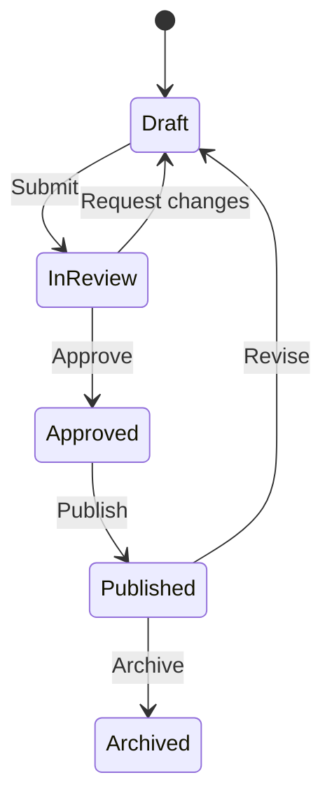

### قواعد Workflow

- نویسنده نباید محتوای حساس خود را بدون Review منتشر کند.
- صفحات اصلی، خدمات، اطلاعات حقوقی و ادعاهای تجاری به تأیید مدیر محتوا نیاز دارند.
- پروژه‌هایی که نام یا تصویر مشتری دارند، نیازمند تأیید مجوز انتشار هستند.
- تغییر `robots`, `canonicalPath`, Navigation و CTA اصلی نیازمند Review ویژه است.
- حذف محتوا با Unpublish/Archive انجام شود؛ Delete دائمی فقط برای Admin.
- انتشار گروهی برای Campaignها باید در Preview بررسی شود.

### نقش‌ها

| نقش | دسترسی |
|---|---|
| Admin | مدیریت کامل پروژه و کاربران |
| Developer | Schema، Integration و تنظیمات فنی |
| Managing Editor | تأیید و انتشار همه محتوا |
| Editor | ایجاد و ویرایش محتوای مجاز |
| Translator | ویرایش Locale تخصیص‌یافته |
| Reviewer | Comment و Approval بدون تغییر فنی |

قابلیت دقیق Roleها باید با پلن CMS تطبیق داده شود. در صورت محدودیت پلن، تعداد کاربران و دسترسی‌ها محدودتر شود؛ کنترل امنیتی نباید صرفاً با قرارداد شفاهی جایگزین شود.

---

## 14. Preview و Draft Mode

Preview باید با Draft Mode در Next.js پیاده‌سازی شود.

### جریان Preview

1. Editor از Studio گزینه Preview را انتخاب می‌کند.
2. CMS به Endpoint امن `/api/draft/enable` درخواست می‌فرستد.
3. Endpoint، Secret و مقصد را اعتبارسنجی می‌کند.
4. Draft Mode Cookie امن فعال می‌شود.
5. صفحه با Perspective پیش‌نویس و Token فقط‌خواندنی Server-side نمایش داده می‌شود.
6. خروج از Preview از `/api/draft/disable` انجام می‌شود.

### الزامات امنیتی

- Preview Secret فقط در Environment Variable نگهداری شود.
- Redirect مقصد فقط از Allowlist مسیرهای داخلی پذیرفته شود.
- Open Redirect ممنوع است.
- Draft Token هرگز به Browser Bundle نرسد.
- صفحات Preview نباید Cache عمومی شوند.
- Preview URL در Analytics به‌عنوان ترافیک واقعی ثبت نشود.

---

## 15. انتشار، Cache و Revalidation

### حالت پیش‌فرض

- صفحات عمومی با Static Rendering یا ISR تولید شوند.
- داده عمومی Published می‌تواند از CDN خوانده شود.
- داده Draft فقط Server-side و بدون CDN عمومی خوانده شود.
- هر Query دارای Cache Tag قابل پیش‌بینی باشد.

### الگوی Tagها

```text
cms:all
cms:settings:{locale}
cms:navigation:{locale}
cms:page:{locale}:{slug}
cms:service:{locale}:{slug}
cms:steel-category:{locale}:{slug}
cms:article:{locale}:{slug}
cms:article-list:{locale}
cms:project:{locale}:{slug}
cms:project-list:{locale}
```

### Webhook انتشار

- Endpoint: `/api/cms/revalidate`
- Method: `POST`
- Webhook باید Signature/Secret معتبر داشته باشد.
- Payload فقط Type، ID، Locale، Slug قبلی و Slug جدید را ارسال کند.
- Endpoint بر اساس Type، Tagهای جزئی و فهرست مرتبط را با `revalidateTag` با semantics سازگار با نسخه Next.js پروژه منقضی کند.
- در تغییر Slug، Path قدیم و جدید هر دو Revalidate شوند.
- در تغییر داده Global، Tagهای Settings یا Navigation تمام Localeهای مربوط را منقضی کنند.
- پاسخ Webhook نباید Secret یا جزئیات داخلی را افشا کند.

### سیاست Fallback

- اگر CMS موقتاً در دسترس نبود، نسخه Cache‌شده قبلی نمایش داده شود.
- اختلال CMS نباید صفحه اصلی Published را از دسترس خارج کند.
- محتوای اختیاری ناقص مخفی شود؛ محتوای اجباری ناقص نباید Publish شود.
- خطاهای CMS در Logging ثبت شوند، اما متن داخلی خطا به کاربر نمایش داده نشود.

---

## 16. Asset و Media

هر Image در CMS باید این داده‌ها را داشته باشد:

- Asset reference
- `alt` مستقل برای هر Locale
- Caption اختیاری
- Credit/License در صورت نیاز
- Focal point / hotspot
- Width و Height قابل استخراج
- Asset purpose یا usage tag

### قواعد Media

- آپلود تصویر بدون Alt برای محتوای معنادار ممنوع است.
- تصاویر تزئینی با `decorative: true` و Alt خالی مشخص شوند.
- فایل SVG آپلودشده توسط Editor فقط پس از Sanitization مجاز است.
- ویدئوی سنگین مستقیماً از CMS تحویل نشود؛ از سرویس ویدئو یا Storage/CDN مناسب استفاده شود.
- PDFها باید Title، Version، Date، Language و File Size داشته باشند.
- نام فایل‌ها انگلیسی، کوتاه، lowercase و بدون فاصله باشد.
- Crop و Resize در Delivery Layer انجام شود؛ فایل اصلی فقط یک بار ذخیره شود.
- Component تصویر باید ابعاد، `sizes`، Lazy Loading و Format بهینه را کنترل کند.

---

## 17. Validation محتوا

### Validation اجباری

- Title، Slug، Locale و وضعیت انتشار
- یکتایی Slug در هر Locale و Type
- طول منطقی Title و Meta Description با Warning، نه برش خودکار
- عدم استفاده از URL خارجی برای لینک‌های داخلی
- ممنوعیت `javascript:` و Protocolهای ناامن
- وجود Alt برای تصاویر معنادار
- وجود CTA label و destination با هم
- وجود تاریخ و نویسنده برای Article
- حداقل یک نتیجه یا شاهد معتبر برای Project منتشرشده
- ممنوعیت Publish ترجمه با `translationStatus != approved`
- عدم انتخاب یک سند به‌عنوان Related Content خودش
- کنترل Reference شکسته پیش از Publish

### Validation دامنه آهن آسا

- ادعای قیمت قطعی بدون تاریخ، منبع و Disclaimer منتشر نشود.
- ادعای استاندارد، گرید یا کیفیت باید قابل استناد و تأییدشده باشد.
- نام تأمین‌کننده یا مشتری بدون مجوز انتشار وارد نشود.
- اعداد پروژه باید Unit مشخص داشته باشند.
- CTAهای خرید نباید القای فروشگاه آنلاین کنند، مگر زیرساخت واقعی آن فعال باشد.

---

## 18. امنیت و حریم خصوصی

- Dataset عمومی فقط شامل محتوای قابل انتشار باشد.
- Write Token و Preview Token فقط Server-side نگهداری شوند.
- Tokenها حداقل Permission لازم را داشته باشند.
- CORS فقط برای Domainهای شناخته‌شده Studio و Website تنظیم شود.
- Webhook با Secret و Signature validation محافظت شود.
- Rate limiting روی Endpointهای Preview و Revalidation اعمال شود.
- PII، Lead، قرارداد، قیمت خرید و اطلاعات محرمانه در CMS ذخیره نشود.
- Logها نباید Token، Payload حساس یا محتوای Draft محرمانه را ثبت کنند.
- Dependencyها و CMS SDK در چرخه نگهداری امنیتی پروژه قرار گیرند.
- دسترسی کاربران پس از تغییر نقش یا خروج از همکاری فوراً لغو شود.
- Backup/Export دوره‌ای متناسب با نرخ تغییر محتوا تعریف شود.

---

## 19. Performance

- Queryها Projection حداقلی داشته باشند.
- فهرست‌ها نباید Body کامل مقاله یا Project را Fetch کنند.
- Pagination اجباری است؛ دریافت تمام اسناد در Runtime ممنوع است.
- Referenceها به‌صورت Batch resolve شوند و N+1 Query ایجاد نکنند.
- تصاویر با Pipeline استاندارد Next.js و URL Builder امن تحویل شوند.
- Rich Text فقط با Renderer allowlisted رندر شود.
- Componentهای CMS تا حد ممکن Server Component باقی بمانند.
- Hydration فقط برای Interactionهای واقعی انجام شود.
- تغییر محتوای یک سند نباید باعث Purge کامل Cache سایت شود.
- `cms:all` فقط در Migration یا تغییر Schema عمده استفاده شود.

### بودجه پیشنهادی

| معیار | هدف |
|---|---|
| Query صفحه جزئیات | حداکثر 1 Query اصلی + Batch references |
| Payload محتوای اولیه | فقط داده موردنیاز Above-the-fold و صفحه |
| Revalidation | کمتر از 60 ثانیه تا مشاهده نسخه Published |
| CMS dependency در Client bundle | صفر برای صفحات غیرتعاملی |
| Full-site rebuild برای تغییر Editorial | غیرضروری |

---

## 20. ساختار پوشه پیشنهادی

```text
src/
├── app/
│   ├── api/
│   │   ├── cms/revalidate/route.ts
│   │   └── draft/
│   │       ├── enable/route.ts
│   │       └── disable/route.ts
│   └── ...
├── components/
│   └── content/
│       ├── section-renderer.tsx
│       └── sections/
├── content/
│   ├── static/
│   └── defaults/
├── lib/
│   └── cms/
│       ├── index.ts
│       ├── contract.ts
│       ├── cache-tags.ts
│       ├── normalize.ts
│       ├── validation.ts
│       └── providers/
│           ├── local/
│           └── sanity/
│               ├── client.ts
│               ├── queries.ts
│               ├── repository.ts
│               └── image.ts
├── sanity/
│   ├── schemaTypes/
│   │   ├── documents/
│   │   ├── objects/
│   │   └── index.ts
│   ├── structure/
│   └── validation/
└── types/
    └── content/
```

اگر Studio در همان Repository میزبانی شود، پوشه `sanity/` حفظ می‌شود. اگر تیم و چرخه انتشار جدا شد، Studio می‌تواند به Repository مستقل منتقل شود، بدون تغییر Contract داخلی Frontend.

---

## 21. Environment Variableها

```text
CMS_PROVIDER=local|sanity
NEXT_PUBLIC_SANITY_PROJECT_ID=
NEXT_PUBLIC_SANITY_DATASET=
NEXT_PUBLIC_SANITY_API_VERSION=
SANITY_READ_TOKEN=
SANITY_PREVIEW_TOKEN=
SANITY_WEBHOOK_SECRET=
DRAFT_MODE_SECRET=
```

### قواعد

- هیچ مقدار واقعی در Git Commit نشود.
- متغیرهای `NEXT_PUBLIC_*` فقط شامل شناسه‌های غیرمحرمانه باشند.
- Production، Preview و Development از Dataset یا تنظیمات محیطی مشخص استفاده کنند.
- نام API Version ثابت و صریح باشد؛ استفاده از تاریخ جاری در Runtime ممنوع است.
- نبود Environment Variable ضروری باید در Startup/Build با پیام واضح Fail شود.

---

## 22. محیط‌ها و Datasetها

### پیشنهاد اولیه

| محیط | Dataset | کاربرد |
|---|---|---|
| Local Development | `development` | تست Schema و داده نمونه |
| Preview/Staging | `staging` یا Dataset مشترک با Draft perspective | QA محتوا و Integration |
| Production | `production` | محتوای Published عمومی |

برای تیم کوچک، دو Dataset `development` و `production` کافی است. اضافه‌کردن Staging فقط وقتی انجام شود که Release Workflow آن را توجیه کند.

انتقال Schema بین محیط‌ها از طریق Git انجام می‌شود؛ انتقال محتوا باید با Export/Import کنترل‌شده و ثبت‌شده باشد.

---

## 23. Migration و فعال‌سازی مرحله‌ای

### Phase 0 — بدون CMS

- پیاده‌سازی `ContentRepository`
- استفاده از Provider محلی
- ذخیره محتوا در TypeScript/JSON/MDX کنترل‌شده
- تثبیت Routeها، SEO و Componentها

### Phase 1 — Pilot CMS

- ایجاد Project و Dataset
- پیاده‌سازی Schemaهای پایه
- انتقال `article` و `project`
- پیاده‌سازی Preview و Webhook
- آموزش یک Editor و یک Reviewer

### Phase 2 — محتوای سازمانی

- انتقال FAQ، Downloadها و Steel Categoryها
- فعال‌سازی Localization در سطح Document
- افزودن Workflow و Validation پیشرفته

### Phase 3 — بهینه‌سازی

- داشبورد سلامت محتوا
- گزارش اسناد بدون ترجمه یا Metadata
- Scheduled/Release publishing در صورت نیاز عملیاتی و پشتیبانی پلن
- اتصال کنترل‌شده به Analytics برای سنجش عملکرد محتوا

### ترتیب Migration هر Collection

1. نهایی‌کردن Schema
2. ساخت Mapping از مدل قبلی
3. Export و Backup
4. Import به Development
5. Validation تعداد و Referenceها
6. QA بصری و SEO
7. Import Production
8. فعال‌سازی Provider CMS
9. Revalidation
10. ثبت نتیجه در `CHANGELOG.md`

---

## 24. قابلیت خروج و جلوگیری از Vendor Lock-in

- تمام مدل‌های عمومی در TypeScript مستقل تعریف شوند.
- CMS SDK فقط در Provider مربوط استفاده شود.
- Rich Text به یک AST داخلی محدود یا Renderer جداگانه Map شود.
- Asset metadata و URL اصلی قابل Export باشد.
- Export کامل Dataset و فایل‌ها دوره‌ای انجام شود.
- IDهای CMS نباید در URL عمومی استفاده شوند.
- Routeها از Slug و Registry داخلی تولید شوند.
- هیچ Component نمایشی Query خام CMS اجرا نکند.
- تغییر Provider باید فقط Repository implementation و Migration را درگیر کند.

---

## 25. Logging و Monitoring

موارد زیر ثبت شوند:

- شکست Query CMS
- Timeout و Rate-limit
- خطای Preview
- Webhook نامعتبر یا تکراری
- نتیجه Revalidation بدون ثبت Secret
- سند Published با داده ناقص که از Validation عبور کرده است
- Reference شکسته
- Image delivery failure

### Alertهای ضروری

- چند شکست متوالی Webhook
- عدم نمایش محتوای Published پس از SLA تعریف‌شده
- افزایش خطاهای CMS در Production
- انقضای Token یا Permission error
- شکست Sitemap generation یا Structured Data generation مرتبط با CMS

---

## 26. تست و QA

### Unit Test

- Normalizerها و Mapperها
- Cache tag generation
- Slug و URL validation
- SEO fallbackها
- Locale resolution
- Rich Text renderer allowlist

### Integration Test

- خواندن Published content
- خواندن Draft content فقط در Preview
- ردکردن Webhook نامعتبر
- Revalidation سند، فهرست و Route مرتبط
- رفتار Not Found برای Slug نامعتبر
- رفتار Fallback هنگام قطع CMS

### Content QA

- Preview Desktop، Tablet و Mobile
- RTL فارسی و عربی
- LTR انگلیسی
- Heading hierarchy
- Alt text و Caption
- Internal links و Related content
- Metadata، Canonical و Hreflang
- Structured Data
- تاریخ‌ها، اعداد و واحدها
- CTA و مقصد آن

### Regression Test

- تغییر Navigation
- تغییر Slug
- Unpublish مقاله یا پروژه
- حذف Asset استفاده‌شده
- انتشار ترجمه ناقص
- تغییر Schema با داده قدیمی

---

## 27. معیار پذیرش پیاده‌سازی CMS

CMS فقط زمانی آماده Production است که همه موارد زیر برقرار باشد:

- [ ] `ContentRepository` مستقل از Provider پیاده‌سازی شده است.
- [ ] هیچ CMS Token در Client Bundle وجود ندارد.
- [ ] Draft Preview امن کار می‌کند.
- [ ] Webhook امضاشده، انتشار را بدون Deploy کامل منعکس می‌کند.
- [ ] Cache فقط برای محتوای مرتبط Revalidate می‌شود.
- [ ] اسناد ناقص قابل Publish نیستند.
- [ ] Slug در هر Locale یکتا است.
- [ ] تغییر Slug فرایند Redirect مشخص دارد.
- [ ] Metadata و Sitemap فقط از Published content استفاده می‌کنند.
- [ ] JSON-LD از داده ساختاریافته و کنترل‌شده تولید می‌شود.
- [ ] UI بدون داده CMS حیاتی از کار نمی‌افتد.
- [ ] نقش‌ها و حداقل دسترسی اعمال شده‌اند.
- [ ] Backup/Export آزمایش شده است.
- [ ] راهنمای Editor نوشته شده است.
- [ ] سناریوهای RTL/LTR و چندزبانه QA شده‌اند.
- [ ] هیچ Lead یا PII در CMS ذخیره نمی‌شود.
- [ ] تست Provider محلی و Provider CMS هر دو موفق‌اند.

---

## 28. قوانین قطعی برای Claude Code

Claude Code هنگام پیاده‌سازی باید این قواعد را رعایت کند:

1. قبل از نصب CMS، وجود Triggerهای بخش 2 را بررسی کند.
2. بدون تصمیم ثبت‌شده، محتوای ثابت را به CMS منتقل نکند.
3. SDK و Queryهای CMS را خارج از Provider وارد نکند.
4. Schema را بدون هماهنگی با `CONTENT_MODEL.md` تغییر ندهد.
5. Field یا Section با کنترل مستقیم Style ایجاد نکند.
6. Secret، Token یا Dataset خصوصی را در کد Client قرار ندهد.
7. Preview و Revalidation را بدون Validation امنیتی پیاده‌سازی نکند.
8. هنگام تغییر Slug، Redirect و SEO impact را بررسی کند.
9. CMS را برای ذخیره فرم‌ها، Leadها، قیمت و موجودی استفاده نکند.
10. قبل از Migration از Dataset Export بگیرد.
11. هر تغییر Schema یا Migration را در `CHANGELOG.md` ثبت کند.
12. برای هر مدل جدید، Type، Validation، Query، Mapper و Test اضافه کند.
13. هیچ Document منتشرشده را با Script بدون Dry Run و Backup حذف نکند.
14. در صورت نبود CMS، Provider محلی و Build سایت باید همچنان کار کنند.

---

## 29. تصمیم نهایی

برای آهن آسا، CMS یک **زیرساخت اختیاری و مرحله‌ای** است، نه پیش‌نیاز شروع طراحی و توسعه. نسخه اولیه با Content-as-Code و یک `ContentRepository` مستقل ساخته می‌شود. پس از شکل‌گیری نیاز واقعی Editorial، Sanity ابتدا فقط برای Article و Project فعال می‌شود و سپس به Collectionهای دیگر گسترش می‌یابد.

این تصمیم سه مزیت اصلی دارد:

1. سرعت بیشتر در راه‌اندازی نسخه اول
2. کاهش هزینه و پیچیدگی عملیاتی
3. آمادگی برای توسعه تیم محتوا بدون بازنویسی Frontend

---

## 30. منابع فنی رسمی

- [Next.js — Revalidating cached data](https://nextjs.org/docs/app/getting-started/revalidating)
- [Next.js — `revalidateTag`](https://nextjs.org/docs/app/api-reference/functions/revalidateTag)
- [Next.js — Backend for Frontend and CMS webhooks](https://nextjs.org/docs/app/guides/backend-for-frontend)
- [Sanity — Localization](https://www.sanity.io/docs/studio/localization)
- [Sanity — Content Releases configuration](https://www.sanity.io/docs/studio/content-releases-configuration)
- [Sanity — Content operators guide](https://www.sanity.io/docs/user-guides/content-operations-cheatsheet)

# Coding Standards

> Project: Ahan Asa Website  
> Status: Mandatory  
> Primary stack: Next.js App Router, React, TypeScript  
> Applies to: Human contributors, Claude Code, automation, and generated code

## 1. Purpose

This document defines the minimum coding standards for the Ahan Asa website. Its goals are to keep the codebase predictable, secure, accessible, performant, easy to review, and safe to extend.

These rules apply to all production code, tests, scripts, configuration, styles, content schemas, and API integrations.

## 2. Requirement Language

The keywords **MUST**, **MUST NOT**, **SHOULD**, **SHOULD NOT**, and **MAY** indicate the strength of a rule:

- **MUST / MUST NOT:** Mandatory. Exceptions require a documented decision.
- **SHOULD / SHOULD NOT:** Expected default. Deviations require a clear technical reason.
- **MAY:** Optional and context-dependent.

When project documents conflict, apply this priority order:

1. Security and legal requirements
2. `CLAUDE.md`
3. `DO_NOT_CHANGE.md`
4. Approved architecture and design decisions
5. This document
6. Framework defaults and personal preferences

## 3. Core Principles

All code MUST follow these principles:

1. **Clarity over cleverness:** Prefer obvious, maintainable code.
2. **Server-first:** Use Server Components and server-side data access by default.
3. **Type safety:** Avoid untyped data and unsafe assertions.
4. **Single responsibility:** Each module should have one clear purpose.
5. **Reuse with restraint:** Extract repeated behavior, not speculative abstractions.
6. **Progressive enhancement:** Core content and actions must remain usable without unnecessary client-side JavaScript.
7. **Accessibility by default:** Accessibility is part of implementation, not a later patch.
8. **Performance by design:** Prevent avoidable JavaScript, layout shift, and oversized assets.
9. **Secure by default:** Validate external data and minimize exposed information.
10. **Small, reviewable changes:** Do not combine unrelated refactors and features.

## 4. Source Language and User-Facing Content

- Code, identifiers, comments, commit messages, and technical documentation MUST be written in English.
- User-facing text MUST come from the approved locale/content source when localization is enabled.
- Persian, Arabic, or other localized strings MUST NOT be hard-coded inside shared UI components.
- Brand names, technical product names, and approved terminology MUST use the spelling defined in the content and brand guidelines.
- Comments MUST explain intent, constraints, or non-obvious decisions; they MUST NOT restate the code.

## 5. Project Structure

The repository MUST follow `FOLDER_STRUCTURE.md`. Until that document defines otherwise, use these responsibilities:

```text
app/                 Routes, layouts, metadata, route handlers
components/          Reusable UI and feature components
components/ui/       Low-level design-system primitives
lib/                 Domain logic, utilities, schemas, integrations
content/             Structured local content and translations
public/              Static public assets
styles/              Global styles, tokens, and shared style utilities
tests/               Test setup, fixtures, and cross-feature tests
types/               Shared public TypeScript types only
```

Rules:

- Route-specific code SHOULD remain near its route.
- Reusable feature code SHOULD be grouped by domain, not by technical file type.
- A module MUST NOT import from another module's private internals.
- Shared utilities MUST have a proven use in at least two places.
- Barrel files (`index.ts`) SHOULD be avoided when they hide dependency direction or increase bundle size.
- Circular dependencies are prohibited.

## 6. Naming Conventions

| Item | Convention | Example |
| --- | --- | --- |
| React component | PascalCase | `QuoteRequestForm` |
| Type / interface / enum | PascalCase | `QuoteRequestPayload` |
| Function / variable | camelCase | `calculateTotalWeight` |
| Constant | camelCase; UPPER_SNAKE_CASE only for true global constants | `defaultLocale`, `MAX_FILE_SIZE` |
| Boolean | `is`, `has`, `can`, `should`, or `was` prefix | `isSubmitting` |
| Event handler | `handle` prefix | `handleFormSubmit` |
| Component callback prop | `on` prefix | `onSubmit` |
| Hook | `use` prefix | `useReducedMotion` |
| Route folder | kebab-case | `request-for-quote` |
| Non-component file | kebab-case | `format-phone-number.ts` |
| Component file | kebab-case or project-approved convention, used consistently | `quote-request-form.tsx` |
| CSS custom property | kebab-case | `--color-steel-navy` |
| Test | Source filename plus test suffix | `quote-request-form.test.tsx` |

Additional rules:

- Names MUST describe business meaning rather than implementation detail.
- Avoid vague names such as `data`, `item`, `value`, `helper`, or `temp` when a precise name is possible.
- Avoid abbreviations unless they are standard in the domain, such as `URL`, `SEO`, `API`, or `RFQ`.
- Do not prefix interfaces with `I` or types with `T`.

## 7. TypeScript Standards

- TypeScript strict mode MUST remain enabled.
- Production code MUST NOT use `any`. Use `unknown`, then narrow it safely.
- Public functions, exported utilities, component props, and integration boundaries MUST have explicit types.
- Prefer inferred types for obvious local variables.
- Prefer `type` for unions, intersections, mapped types, and component props.
- Use `interface` only when declaration merging or a deliberately extensible object contract is required.
- Prefer discriminated unions over multiple related booleans.
- Prefer `readonly` for immutable inputs and configuration.
- Avoid TypeScript `enum`; prefer `as const` objects or literal unions.
- Non-null assertions (`!`) and type assertions (`as`) SHOULD be avoided.
- If an assertion is unavoidable, the invariant MUST be clear and locally justified.
- External input MUST be parsed and validated at runtime; static types alone are insufficient.
- Reusable domain types SHOULD be derived from schemas or source data where practical.

Example:

```ts
type RequestState =
  | { status: 'idle' }
  | { status: 'submitting' }
  | { status: 'success'; requestId: string }
  | { status: 'error'; message: string };
```

## 8. Functions and Control Flow

- Functions SHOULD do one thing and remain small enough to understand without excessive scrolling.
- Prefer early returns to deeply nested conditionals.
- A function with more than three positional parameters SHOULD use an options object.
- Side effects MUST be visible in the function name or isolated at an integration boundary.
- Pure functions SHOULD be used for formatting, transformation, and business rules.
- Do not mutate function arguments.
- Avoid hidden global state.
- Do not use nested ternaries.
- Complex conditions SHOULD be assigned to clearly named variables.
- Time, randomness, network access, and browser globals SHOULD be injectable or isolated for testability.

## 9. React Component Standards

- Use function components only.
- Components MUST have a focused responsibility.
- Prefer composition over large collections of conditional props.
- Props MUST be typed and SHOULD be `readonly`.
- Do not store derived values in state.
- Do not use effects for calculations that can happen during render.
- Effects MUST be reserved for synchronization with external systems.
- Hooks MUST follow React's Rules of Hooks.
- List keys MUST be stable identifiers; array indexes are prohibited when order can change.
- Event handlers SHOULD contain minimal UI orchestration and delegate domain logic to tested functions.
- Components SHOULD remain deterministic for the same props and state.
- Use semantic HTML before adding ARIA.
- Do not create wrapper components that add no meaningful behavior, semantics, or styling contract.

## 10. Next.js App Router Standards

- Server Components are the default.
- Add `'use client'` only at the smallest interactive boundary that needs browser APIs, state, effects, or event handlers.
- Client Components MUST NOT import server-only modules, secrets, database clients, or privileged integrations.
- Data fetching SHOULD happen on the server and as close as practical to the consuming route or component.
- Independent server requests SHOULD run concurrently.
- Request waterfalls MUST be avoided unless one request depends on another.
- Route segments MUST provide appropriate `loading`, `error`, and `not-found` behavior where relevant.
- Metadata MUST use the Next.js metadata API and follow `METADATA_SPEC.md`.
- Internal navigation MUST use the framework's link component.
- Images MUST use the approved image component and sizing strategy unless a documented exception applies.
- Route Handlers and Server Actions MUST validate input, enforce authorization where applicable, and return controlled errors.
- Server-only modules SHOULD use the framework's server-only guard.
- Dynamic rendering, caching, and revalidation MUST be chosen explicitly according to content freshness and `CACHING_STRATEGY.md`.
- Browser-only libraries SHOULD be dynamically imported when they are not required for initial rendering.

## 11. Imports and Module Boundaries

Imports SHOULD be ordered as follows, with one blank line between groups:

1. React and Next.js
2. External packages
3. Internal absolute imports
4. Relative imports
5. Type-only imports
6. Styles and assets

Rules:

- Use the project alias for cross-feature imports.
- Use relative imports only for nearby files within the same feature or route.
- Use `import type` for type-only dependencies.
- Do not import deep private paths from packages or other features.
- Unused imports and exports are prohibited.
- Default exports SHOULD be limited to framework-required files.
- Named exports are preferred for reusable modules because they improve refactoring and discovery.

## 12. Styling Standards

- Styling MUST follow `DESIGN_SYSTEM.md`, `COLOR_SYSTEM.md`, and `TYPOGRAPHY_SYSTEM.md`.
- Use design tokens for color, spacing, typography, radius, shadow, and motion.
- Approved Ahan Asa brand values SHOULD be represented as semantic tokens, not scattered literals.
- Do not use arbitrary colors, spacing values, shadows, or font sizes when an approved token exists.
- Styles MUST be mobile-first.
- Prefer logical CSS properties such as `margin-inline`, `padding-inline`, and `inset-inline-start` for RTL/LTR compatibility.
- Avoid `!important`; any exception requires a comment explaining the constraint.
- Avoid styling by fragile DOM structure or generated class names.
- Component styles MUST not leak into unrelated components.
- Hover behavior MUST have an equivalent focus-visible state where relevant.
- Motion MUST respect `prefers-reduced-motion`.
- Do not animate layout-intensive properties when `transform` or `opacity` can achieve the result.

## 13. Localization, RTL, and LTR

- Locale handling MUST follow `LOCALIZATION.md` and `LOCALE_CONTENT_STRUCTURE.md`.
- The Persian default locale MUST use the approved unprefixed routing strategy if defined by `ROUTES.md`.
- Locale-specific routes MUST preserve canonical and hreflang rules.
- Direction MUST be set at the document or locale-layout level.
- Components MUST support both `rtl` and `ltr` without duplicated layout implementations.
- Use logical CSS properties and direction-aware icons.
- Text alignment SHOULD normally follow `start` and `end`, not `left` and `right`.
- Dates, numbers, currencies, units, and phone numbers MUST use locale-aware formatting.
- Translations MUST preserve variables, markup placeholders, and technical meaning.
- Missing translations MUST fail visibly during development rather than silently shipping the wrong locale.

## 14. Accessibility

- Target WCAG 2.2 Level AA.
- Every page MUST have a logical heading hierarchy and one clear primary heading.
- Interactive elements MUST be keyboard accessible.
- Visible focus indicators MUST NOT be removed.
- Buttons perform actions; links navigate.
- Inputs MUST have programmatically associated labels.
- Form errors MUST identify the affected field and explain how to correct it.
- Status messages SHOULD use appropriate live-region behavior without excessive announcements.
- Images MUST have meaningful alternative text or an empty `alt` when decorative.
- Color MUST NOT be the only way information is communicated.
- Text and interactive elements MUST meet approved contrast requirements.
- Dialogs, menus, accordions, and tabs MUST implement correct focus and keyboard behavior.
- ARIA MUST only supplement valid semantic HTML.
- Touch targets SHOULD be at least 44 by 44 CSS pixels.

## 15. Forms and Validation

- Forms MUST follow `FORM_ARCHITECTURE.md`.
- Validate on both client and server; server validation is authoritative.
- Use one shared schema when practical.
- Normalize inputs such as email addresses and phone numbers before persistence.
- Preserve user input after recoverable validation or network errors.
- Submission controls MUST prevent accidental duplicate submissions.
- Loading, success, validation-error, and system-error states MUST be explicit.
- Error messages MUST be helpful without exposing implementation details.
- Required fields MUST be communicated visually and programmatically.
- Lead capture MUST continue to respect the approved behavior if an external CRM is unavailable.
- Sensitive information MUST NOT be included in analytics events, URLs, or logs.

## 16. Data, APIs, and Integrations

- All external responses MUST be treated as untrusted.
- Validate request and response payloads at system boundaries.
- Integration logic MUST be isolated behind a typed adapter.
- Components MUST NOT call third-party services directly.
- Requests MUST define appropriate timeouts and controlled failure behavior.
- Retries MUST only be used for safe or idempotent operations unless protected by an idempotency mechanism.
- Expected integration failures MUST degrade gracefully and remain observable.
- API keys and secrets MUST remain server-side.
- Public configuration MUST be explicitly marked and reviewed before exposure.
- Changes to an external contract MUST update schemas, fixtures, tests, and `API_INTEGRATIONS.md`.

## 17. Error Handling and Logging

- Expected failures MUST be represented explicitly, not hidden by empty catch blocks.
- Catch errors only when the code can recover, add useful context, or convert them to a controlled boundary response.
- User-facing messages MUST be clear and non-technical.
- Logs MUST include enough context to diagnose an issue without containing secrets or personal data.
- Do not log access tokens, authorization headers, passwords, full form payloads, or unnecessary contact data.
- Production stack traces MUST NOT be exposed to users.
- Error boundaries MUST provide a useful recovery action when possible.
- Monitoring events SHOULD use stable identifiers and structured metadata.

## 18. Security Standards

- Follow `SECURITY_GUIDELINES.md` for all security controls.
- Never commit secrets, credentials, private keys, production data, or local environment files.
- Environment variables MUST be documented in `ENVIRONMENT_VARIABLES.md` and represented with safe placeholders in `.env.example`.
- Validate and sanitize user-controlled input according to its destination.
- Avoid rendering unsanitized HTML. Any use of raw HTML rendering requires documented sanitization.
- Protect state-changing endpoints against unauthorized access, cross-site request forgery where relevant, replay, and abuse.
- Apply rate limiting or equivalent abuse protection to public forms and sensitive endpoints.
- File uploads MUST restrict size, type, count, and storage behavior.
- Dependencies MUST be maintained and reviewed for security advisories.
- Security headers MUST be configured centrally.
- Redirect destinations MUST be allowlisted or safely constructed.

## 19. Performance Standards

- Follow `PERFORMANCE_GUIDELINES.md`, `IMAGE_OPTIMIZATION.md`, and `FONT_STRATEGY.md`.
- Core Web Vitals budgets MUST be treated as release criteria.
- Ship the minimum client-side JavaScript required for the experience.
- Avoid large general-purpose libraries for small features.
- Lazy-load below-the-fold media and non-critical interactive features.
- Above-the-fold images MUST have stable dimensions and the correct priority behavior.
- Fonts MUST be self-hosted or loaded through the approved optimized mechanism, with controlled subsets and weights.
- Prevent cumulative layout shift by reserving space for media, embeds, banners, and dynamic content.
- Avoid unnecessary rerenders and repeated expensive calculations, but do not add memoization without evidence.
- Bundle-impacting changes SHOULD be measured before approval.
- Third-party scripts MUST have an owner, purpose, loading strategy, privacy review, and removal path.

## 20. SEO and Structured Content

- Each indexable page MUST have unique, locale-appropriate metadata.
- Canonical, hreflang, sitemap, robots, redirects, and structured data MUST follow their dedicated specifications.
- Only one canonical URL may represent a page in each locale.
- Structured data MUST match visible content and use valid, supported schemas.
- Links MUST use descriptive anchor text.
- Heading structure MUST reflect content hierarchy, not visual styling.
- Important content MUST be present in server-rendered HTML.
- New routes MUST be checked against the sitemap, internal linking, metadata, and redirect plans.

## 21. Testing Standards

- Follow `TESTING_STRATEGY.md` and the applicable QA checklists.
- Tests MUST focus on observable behavior, business rules, and critical regressions.
- Every bug fix SHOULD include a regression test when practical.
- Pure business logic MUST have unit tests.
- Components with meaningful interaction MUST have interaction tests.
- Critical user journeys, including RFQ submission and locale navigation, MUST have end-to-end coverage.
- Tests MUST be deterministic and independent.
- Do not use arbitrary sleeps in tests; wait for observable conditions.
- Mocks SHOULD be limited to external boundaries.
- Tests MUST NOT depend on production services or real customer data.
- Snapshots SHOULD be used sparingly and only when they provide meaningful review value.
- Accessibility checks SHOULD be included in component and end-to-end testing.

## 22. Code Quality and Formatting

- The repository's formatter and linter configurations are authoritative.
- Formatting MUST be automated; contributors MUST NOT introduce personal formatting variants.
- Lint, type checking, and tests MUST pass before a change is considered complete.
- Lint rules MUST NOT be disabled globally to solve a local problem.
- A local suppression requires the narrowest possible scope and a reason comment.
- Dead code, commented-out code, debug output, and abandoned feature flags MUST be removed.
- TODO comments MUST include an owner or issue reference and the reason the work is deferred.
- Generated files MUST be clearly identified and MUST NOT be manually edited.

Recommended baseline tools:

- TypeScript strict mode
- ESLint with Next.js, React, React Hooks, accessibility, and import rules
- Prettier or an equivalent single formatter
- Unit/component testing with the project-approved test runner
- End-to-end testing with Playwright or the project-approved equivalent

## 23. Dependency Management

- Add a dependency only when its value outweighs maintenance, security, performance, and bundle costs.
- Prefer platform and framework capabilities before adding a package.
- Dependencies MUST be actively maintained, appropriately licensed, and compatible with the stack.
- Exact dependency changes MUST be committed with the lockfile.
- Do not mix package managers.
- Major version upgrades MUST be isolated, tested, and documented.
- Remove unused dependencies promptly.
- Do not modify lockfiles manually.

## 24. Git and Change Discipline

- Each commit SHOULD represent one coherent change.
- Commit messages MUST be written in English, in the imperative mood.
- Recommended format: `<type>(<scope>): <summary>`.
- Allowed common types include `feat`, `fix`, `refactor`, `test`, `docs`, `style`, `perf`, `build`, `ci`, and `chore`.
- Do not combine formatting of unrelated files with a functional change.
- Do not rewrite or delete user changes without explicit authorization.
- Large refactors MUST be separated from feature changes whenever practical.
- Breaking changes and migrations MUST be described in the pull request and changelog.
- Temporary commits MAY be used locally but SHOULD be cleaned before merge when the team workflow permits.

## 25. Pull Request and Review Requirements

Every change MUST be reviewable and include:

- A concise explanation of the problem and solution
- A list of affected routes or components
- Testing evidence
- Screenshots or recordings for meaningful visual changes
- Responsive and RTL/LTR verification when UI is affected
- Accessibility impact
- SEO impact when routes or content change
- Performance impact when bundles, images, fonts, or third-party scripts change
- Security and privacy impact for forms, integrations, authentication, or user data
- Any required documentation updates

Reviewers MUST check behavior, maintainability, accessibility, security, performance, and consistency with approved project documents—not only syntax.

## 26. Claude Code Operating Rules

Before editing code, Claude Code MUST:

1. Read `CLAUDE.md`, `DO_NOT_CHANGE.md`, and the documents relevant to the task.
2. Inspect the existing implementation and reuse established patterns.
3. Identify affected routes, components, tests, metadata, translations, and integrations.
4. Check the working tree and preserve unrelated user changes.
5. State assumptions when requirements are incomplete.

While editing, Claude Code MUST:

- Keep the change within the requested scope.
- Prefer the smallest complete solution.
- Avoid opportunistic refactors.
- Preserve public APIs unless a change is explicitly approved.
- Update all supported locales when shared user-facing content changes.
- Add or update tests with behavior changes.
- Never weaken types, validation, tests, lint rules, or security controls merely to make a check pass.
- Never replace functional production code with placeholders, mock data, or incomplete stubs.

Before declaring completion, Claude Code MUST:

1. Review the diff.
2. Run the relevant formatter, linter, type check, tests, and build.
3. Perform applicable responsive, accessibility, localization, SEO, and performance checks.
4. Confirm no secrets, debug statements, accidental assets, or unrelated changes were introduced.
5. Report what changed, what was verified, and any remaining risk or unverified item.

## 27. Definition of Done

A task is complete only when all applicable statements are true:

- The acceptance criteria are satisfied.
- The implementation follows project architecture and this standard.
- Types are safe and external data is validated.
- Loading, empty, success, and error states are handled.
- Mobile, tablet, and desktop layouts are verified.
- RTL and LTR behavior is verified for affected UI.
- Keyboard and screen-reader basics are verified.
- Metadata and structured content remain correct.
- Performance budgets are not knowingly exceeded.
- Tests are added or updated and all required checks pass.
- Documentation and changelog entries are updated when required.
- The final diff contains no unrelated changes.

## 28. Exceptions

An exception to a **MUST** rule requires a documented decision containing:

- The rule being bypassed
- The technical or business reason
- Alternatives considered
- Security, accessibility, performance, and maintenance impact
- Scope and expiration or review date
- Approver

Exceptions SHOULD be recorded in `DECISIONS.md`. Temporary exceptions MUST include a follow-up task.

## 29. Suggested Quality Commands

The exact scripts are defined by `package.json`. A standard project SHOULD expose commands equivalent to:

```bash
npm run format:check
npm run lint
npm run typecheck
npm run test
npm run test:e2e
npm run build
```

Claude Code MUST inspect the repository and use the actual package manager and script names. It MUST NOT assume these commands exist.

## 30. Maintenance

- Review this document when the framework, architecture, supported locales, deployment model, or team workflow changes.
- Keep rules aligned with automated tooling.
- When a recurring review comment appears, encode it as a lint rule, test, template, or documented standard where practical.
- Changes to this document MUST be intentional, reviewed, and recorded in `CHANGELOG.md` or `DECISIONS.md` when they alter development policy.

---

**Enforcement principle:** If a rule can be reliably automated, enforce it through configuration or CI. Documentation defines the standard; automation prevents regression.
# Ahan Asa Website — Component Architecture

> **Brand:** Ahan Asa | آهن آسا  
> **Domain:** `ahanassa.com`  
> **Document:** `COMPONENT_ARCHITECTURE.md`  
> **Status:** Draft v1.0 — Implementation contract  
> **Last updated:** 2026-08-25  
> **Primary language:** Persian (Farsi), fully RTL  
> **Application model:** Next.js App Router, TypeScript, static-first, server-first

---

## 1. Purpose

This document defines how Ahan Asa website components are divided, composed, imported, rendered, tested, and governed.

It is the implementation contract for turning the approved design system, UI component inventory, content model, information architecture, and page specifications into a maintainable frontend system.

It answers these questions:

- Which architectural layers exist?
- What may each layer own?
- Which layers may import which other layers?
- Where do Server Components and Client Components begin and end?
- Where should content, domain data, state, validation, and side effects live?
- How are page-specific compositions separated from reusable patterns?
- How should components be organized, named, exported, tested, and changed?
- How does the architecture remain Persian-first, RTL-safe, accessible, performant, and ready for future LTR locales?

This document does **not** redefine visual tokens, component appearance, page copy, routes, analytics events, form fields, backend integrations, or SEO metadata. Those remain owned by their governing documents.

---

## 2. Document Ownership and Conflict Rules

The following ownership boundaries apply:

| Concern | Governing document |
|---|---|
| Business goals, positioning, audiences | `PROJECT_BRIEF.md` |
| Technical platform and system topology | `TECHNICAL_ARCHITECTURE.md` |
| Frameworks and approved dependencies | `STACK.md` |
| Repository-wide directories | `FOLDER_STRUCTURE.md` |
| Component layers, dependencies, boundaries | `COMPONENT_ARCHITECTURE.md` |
| Visual tokens and design decisions | `DESIGN_SYSTEM.md` |
| Component inventory, variants, and behavior | `UI_COMPONENTS.md` |
| Content entities and field contracts | `CONTENT_MODEL.md` |
| User journeys and content relationships | `INFORMATION_ARCHITECTURE.md` |
| Page composition | `PAGE_SPECIFICATIONS.md` and page-specific specs |
| Forms, uploads, validation, and lead capture | `FORM_ARCHITECTURE.md` |
| Accessibility requirements | `ACCESSIBILITY.md` |
| Motion | `MOTION_GUIDELINES.md` |
| Responsive behavior | `RESPONSIVE_RULES.md` |
| Routes and locale URLs | `ROUTES.md`, `LOCALIZATION.md` |
| Analytics | `ANALYTICS_TRACKING.md` |

When documents overlap:

1. Follow the document that owns the concern.
2. Do not silently resolve a material conflict.
3. Preserve the existing working implementation until the conflict is resolved.
4. Record an approved architectural exception in `DECISIONS.md`.
5. Never convert a `TBD` into a production assumption.

---

## 3. Architectural Goals

The component architecture must optimize for:

1. **Clarity:** a developer can identify component responsibility from its name and location.
2. **Controlled reuse:** shared behavior is reused without creating universal, configuration-heavy components.
3. **Server-first delivery:** public content and navigation render without waiting for client JavaScript.
4. **Small client islands:** browser state and effects remain at the smallest practical interactive boundary.
5. **Direction safety:** one implementation supports Persian RTL and future LTR locales.
6. **Accessibility by construction:** semantic structure and interaction contracts are built into reusable layers.
7. **Content truth:** components render approved data and never invent evidence, prices, stock, claims, or operational facts.
8. **Performance:** static content does not hydrate unnecessarily; media and interactive code load deliberately.
9. **Testability:** behavior and boundaries can be tested without rendering an entire page.
10. **Change isolation:** modifying one feature does not require unrelated route or component changes.

---

## 4. Architectural Model

The Ahan Asa frontend uses five component layers plus route composition and feature/domain modules.

```text
Routes and layouts
        ↓
Page compositions
        ↓
Shells and business patterns
        ↓
Composites
        ↓
Primitives and layout utilities
        ↓
Foundations
```

Content and feature modules feed typed data into this hierarchy; they do not bypass it.

### 4.1 Layer definitions

| Layer | Responsibility | Typical examples |
|---|---|---|
| Foundations | Tokens, base styles, icons, direction helpers, low-level utilities | semantic tokens, `Icon`, `VisuallyHidden`, direction utilities |
| Primitives | Small, reusable, business-neutral UI elements | `Button`, `TextLink`, `Input`, `Badge`, `Container`, `Stack` |
| Composites | Multiple primitives forming one reusable behavior or semantic unit | `FormField`, `Accordion`, `FileUpload`, `DataTable` |
| Patterns | Reusable Ahan Asa content or task structures | `ProcurementProcess`, `EvidenceCard`, `CtaBand` |
| Shells | Global or major page framing | `SiteHeader`, `MobileNavigation`, `SiteFooter`, `PageHero` |
| Page compositions | Route-specific ordering and configuration | `HomePage`, `CapabilityDetailPage`, `InquiryPage` |
| Feature/domain modules | Business rules, validation, transformations, actions, adapters | inquiry submission, navigation config, evidence normalization |

### 4.2 Core rule

Dependencies flow downward. Lower layers must not know about higher layers.

For example:

- `Button` must not import `InquiryForm`.
- `FormField` must not import `ProcurementProcess`.
- `EvidenceCard` may import `Heading`, `Text`, `Figure`, and layout primitives.
- `HomePage` may compose shells and patterns.
- A component must not import a route file.

---

## 5. Dependency Direction Matrix

`Allowed` means the source layer may import the target layer.

| Source \ Target | Foundations | Primitives | Composites | Patterns | Shells | Pages | Features |
|---|---:|---:|---:|---:|---:|---:|---:|
| Foundations | Limited | No | No | No | No | No | No |
| Primitives | Yes | Limited | No | No | No | No | No |
| Composites | Yes | Yes | Limited | No | No | No | Limited adapters only |
| Patterns | Yes | Yes | Yes | Limited | No | No | Typed data only |
| Shells | Yes | Yes | Yes | Limited | Limited | No | Typed config only |
| Page compositions | Yes | Yes | Yes | Yes | Yes | No route imports | Yes |
| Features | Utilities only | No visual imports by domain code | No | No | No | No | Limited within feature |

### 5.1 Meaning of “Limited”

- Same-layer imports are allowed only when they create a clear semantic composition.
- Circular imports are prohibited.
- A component may not become a hidden dependency hub for unrelated components.
- Feature UI may import shared UI layers, but pure feature domain code must remain independent from React and visual components.
- Shared layers must not import feature-specific code.

### 5.2 Enforcement

Where project tooling allows, enforce boundaries with:

- TypeScript path aliases;
- ESLint import restrictions;
- dependency-cycle detection;
- code review;
- architecture tests for prohibited imports.

Suggested path aliases:

```json
{
  "@/app/*": ["./app/*"],
  "@/components/*": ["./components/*"],
  "@/features/*": ["./features/*"],
  "@/content/*": ["./content/*"],
  "@/lib/*": ["./lib/*"],
  "@/styles/*": ["./styles/*"],
  "@/types/*": ["./types/*"]
}
```

Aliases must not conceal invalid dependency direction.

---

## 6. Canonical Component Directories

The component area uses responsibility-based directories.

```text
components/
  foundations/
    icon/
    visually-hidden/
    directional-value/

  layout/
    container/
    section/
    stack/
    cluster/
    grid/
    divider/

  ui/
    button/
    button-link/
    text-link/
    icon-button/
    heading/
    text/
    badge/
    alert/
    status/

  forms/
    form-field/
    input/
    textarea/
    select/
    checkbox/
    radio-group/
    file-upload/
    error-summary/
    form-status/

  navigation/
    skip-link/
    logo-link/
    site-header/
    primary-navigation/
    navigation-disclosure/
    mobile-navigation/
    breadcrumb/
    pagination/

  media/
    responsive-image/
    figure/
    document-link/
    video-embed/

  data-display/
    definition-list/
    data-table/
    comparison-matrix/

  patterns/
    page-hero/
    section-header/
    procurement-process/
    protection-pillars/
    trust-evidence-section/
    document-submission-panel/
    faq-section/
    cta-band/
    resource-index/
    case-study-index/

  shells/
    site-shell/
    site-footer/
    content-page-shell/
```

Rules:

- This structure is canonical for new work.
- Adapt existing equivalent directories without duplicating components.
- Repository-wide moves require an explicit migration task.
- A directory is created only when at least one approved component belongs there.
- Do not add empty architecture placeholders.
- Do not create generic `common/`, `shared/`, `misc/`, or `helpers/` dumping grounds.

---

## 7. Feature and Page Organization

Reusable UI belongs under `components/`. Business workflows belong under `features/`. Route composition belongs under `app/` or a page-composition module referenced by it.

```text
features/
  inquiry/
    domain/
      inquiry.types.ts
      inquiry.schema.ts
      inquiry.mapper.ts
    server/
      submit-inquiry.ts
      inquiry-adapter.ts
    ui/
      inquiry-form/
      inquiry-success/
    tests/

  navigation/
    navigation.config.ts
    navigation.schema.ts
    navigation.mapper.ts

  resources/
    resource.types.ts
    resource.mapper.ts
    resource.query.ts

app/
  layout.tsx
  page.tsx
  inquiry/
    page.tsx
    loading.tsx
    error.tsx
  capabilities/
    page.tsx
    [slug]/
      page.tsx
```

### 7.1 Route file responsibilities

A route file may:

- resolve route parameters;
- load approved content or data;
- generate metadata through the approved SEO layer;
- choose a page composition;
- pass typed data to that composition;
- define route-level loading, error, and not-found behavior.

A route file must not:

- define reusable visual styling;
- contain a large component inventory;
- duplicate validation or transformation logic;
- own client state for nested interactions;
- construct parallel route-local navigation or CTA sources;
- fetch the same content separately for multiple child components.

### 7.2 Page-composition responsibilities

A page composition owns:

- semantic section order;
- page-level heading hierarchy;
- pattern selection;
- page-specific content mapping;
- page-level landmarks and anchor IDs;
- valid CTA placement;
- omission of unsupported optional sections.

It does not own primitive appearance or business-side effects.

---

## 8. Component Folder Anatomy

Use a folder for every nontrivial public component.

```text
button/
  Button.tsx
  Button.types.ts
  Button.module.css
  Button.test.tsx
  index.ts
```

Optional files when justified:

```text
button/
  Button.fixtures.ts
  Button.a11y.test.tsx
  Button.visual.tsx
  Button.client.tsx
  button.utils.ts
```

Rules:

- Keep styles, types, tests, and small component-specific helpers close to the component.
- Use a separate file only when it improves responsibility or testability.
- Do not split a five-line type or helper merely to satisfy a template.
- Do not place unrelated subcomponents in one file.
- Private subcomponents may remain beside the owner and must not be publicly exported.
- Examples or preview stories are added only after a preview environment is approved.

---

## 9. Naming Rules

### 9.1 Components

- Use PascalCase: `EvidenceCard`, `InquiryForm`, `SiteHeader`.
- Name by purpose, not appearance or page position.
- Prefer `PrimaryNavigation` over `BlueNav`.
- Prefer `DocumentSubmissionPanel` over `HomeUploadBox`.
- Use `Link` for navigation and `Button` for actions.
- Use `List`, `Group`, `Grid`, `Section`, or `Shell` only when the component owns that semantic relationship.

### 9.2 Files

- Public React component: `ComponentName.tsx`.
- Public types: `ComponentName.types.ts` or a clearly scoped lower-case domain file.
- Client-only implementation: `ComponentName.client.tsx`.
- Server-only implementation: `ComponentName.server.tsx` only when server APIs are used directly.
- Styles: `ComponentName.module.css`.
- Tests: `ComponentName.test.tsx`.
- Utilities: descriptive lower-case names such as `navigation.utils.ts`.

### 9.3 Props

- Public prop types use `ComponentNameProps`.
- Event props describe intent: `onDismiss`, `onRetry`, `onSelectionChange`.
- Do not expose internal DOM language such as `onInnerWrapperClick`.
- Avoid negative booleans such as `disableNotClosing`.
- Avoid multiple booleans that produce invalid combinations; prefer discriminated unions.

### 9.4 Domain types

- Use business meaning: `InquiryPayload`, `EvidenceRecord`, `NavigationItem`.
- Do not name domain types after backend tables or UI cards unless that is their true responsibility.
- Backend DTOs and public view models are separate types.

---

## 10. Public API Design

Every public component API must be:

- typed;
- minimal;
- semantic;
- variant-based;
- direction-safe;
- accessible by default;
- stable enough for reuse;
- explicit about optional content;
- restrictive against invalid states.

### 10.1 Good API example

```ts
type EvidenceCardProps = {
  title: string;
  summary?: string;
  media?: ApprovedMedia;
  facts?: EvidenceFact[];
  href?: string;
  status?: 'verified' | 'draft';
};
```

### 10.2 Prohibited API example

```ts
type CardProps = {
  blue?: boolean;
  copper?: boolean;
  rounded?: boolean;
  largeShadow?: boolean;
  leftPadding?: number;
  html?: string;
  mode?: string;
};
```

### 10.3 Escape hatches

`className` may be accepted for external placement only. It must not be used by page code to override:

- internal color;
- typography;
- focus state;
- component spacing contract;
- control size;
- error state;
- interaction behavior.

Repeated overrides require an approved variant or architecture revision.

### 10.4 Native attributes

Forward safe native attributes where useful, especially for input and action primitives. Prevent prop combinations that break semantics, accessibility, or styling contracts.

---

## 11. Composition Rules

### 11.1 Prefer composition over configuration explosion

Build larger interfaces from focused components. Do not create one component with dozens of unrelated modes.

Good:

```tsx
<Section surface="warm">
  <Container>
    <Stack gap="xl">
      <SectionHeader title={title} intro={intro} />
      <ProcurementProcess steps={steps} />
    </Stack>
  </Container>
</Section>
```

Avoid:

```tsx
<UniversalSection
  type="process"
  warm
  centered={false}
  hasCards
  copperNumbers
  mobileMode="timeline"
  desktopMode="editorial"
/>
```

### 11.2 Slots

Use slots when a component owns layout and semantics but the content varies in a controlled way.

```ts
type PageHeroProps = {
  eyebrow?: string;
  title: string;
  summary: string;
  actions?: ReactNode;
  media?: ReactNode;
};
```

Rules:

- Slots must have a documented semantic purpose.
- Do not expose every internal wrapper as a slot.
- Do not accept arbitrary markup when a typed data contract is safer.
- Across a Server/Client boundary, prefer serializable data over arbitrary render functions.

### 11.3 Compound components

Use compound components only when parts have a genuine shared state or semantic relationship. Do not use them solely for aesthetic API style.

### 11.4 Render props and higher-order components

Render props and HOCs are not default patterns. Prefer ordinary composition, hooks inside client boundaries, and pure data mappers.

---

## 12. Server Component Policy

All components are Server Components by default in the Next.js App Router model unless a genuine browser requirement exists.

Server-render by default:

- page shells;
- headings and body content;
- navigation links and footer links;
- hero copy and static media framing;
- evidence and case-study content;
- capability and material information;
- FAQ content structure where native behavior is sufficient;
- resource links;
- breadcrumb structure;
- SEO-critical internal links;
- form labels and server validation results.

### 12.1 Server component responsibilities

A Server Component may:

- load approved content;
- perform secure server-only data access;
- normalize content through pure mappers;
- select a component variant;
- render indexable HTML;
- pass serializable props to a Client Component;
- call server-only utilities that never enter the browser bundle.

It must not:

- access `window`, `document`, storage, or browser media queries;
- own browser event handlers;
- create hidden client state through uncontrolled DOM scripts;
- pass secrets or private backend payloads to client code;
- fetch public core content only after hydration.

---

## 13. Client Component Policy

Add `'use client'` only at the smallest practical interactive leaf.

Approved client-side reasons include:

- mobile navigation state;
- disclosure or tabs state that cannot use an adequate native pattern;
- focus movement, containment, or restoration;
- scroll locking;
- file selection and client-side file feedback;
- progressive form interaction;
- browser API access;
- measured layout behavior that is genuinely required;
- user-controlled media playback;
- local filter controls synchronized with the URL.

Unapproved reasons include:

- using a React hook for static derived text;
- animating content that CSS can handle;
- reading viewport width during initial render;
- using client fetch for content available at build or request time;
- making an entire page interactive because one child needs state;
- applying `onClick` to navigation instead of using a real link;
- importing a client library for a minor visual effect.

### 13.1 Split-component pattern

Prefer a server wrapper plus a focused client controller.

```text
mobile-navigation/
  MobileNavigation.tsx          # server composition and data
  MobileNavigation.client.tsx   # drawer state, focus, scroll lock
  MobileNavigation.types.ts
```

### 13.2 Client boundary props

Props crossing into a Client Component must be serializable and minimal.

Do not pass:

- database clients;
- server-only functions except approved framework server-action references;
- secrets;
- entire CMS responses;
- unfiltered backend errors;
- arbitrary class instances;
- unnecessarily large content trees.

### 13.3 Hydration safety

- Server and initial client markup must agree.
- Do not branch core initial markup using `window.innerWidth`.
- Use CSS for responsive layout when possible.
- Do not render dates, random IDs, or environment-dependent values inconsistently.
- Use stable IDs for form help, errors, and disclosure relationships.
- Do not hide hydration warnings instead of fixing their cause.

---

## 14. Client Island Budget

Each page should contain only the client islands required for its tasks.

Expected Phase 1 islands may include:

| Island | Reason |
|---|---|
| `MobileNavigation.client` | drawer, focus, Escape, scroll lock |
| `NavigationDisclosure.client` | accessible expanded state when native disclosure is insufficient |
| `InquiryForm.client` | progressive field behavior and pending state |
| `FileUpload.client` | file selection, removal, local validation feedback |
| `ResourceFilters.client` | optional URL-synchronized filters |
| `VideoEmbed.client` | consent or user-triggered loading where required |

Rules:

- A client island must not silently absorb its surrounding section.
- Static headings, explanations, and links remain server-rendered.
- Client islands must expose usable failure or no-JavaScript fallbacks where the user journey requires them.
- Bundle impact must be reviewed before adding an external interactive dependency.

---

## 15. State Ownership

State must live at the lowest level that needs to coordinate it.

### 15.1 State categories

| State type | Owner | Examples |
|---|---|---|
| Content/domain state | Server or content source | page copy, approved evidence, capability records |
| URL state | Route/search parameters | filters, pagination, active resource category |
| Server mutation state | Server action/endpoint plus form boundary | validation, submission result, reference ID |
| Local ephemeral UI state | Small Client Component | open menu, active disclosure, selected file |
| Derived state | Recomputed, not stored | active route, whether evidence exists |
| Persistent user preference | Approved storage layer only | locale preference after multilingual launch |

### 15.2 State rules

- Do not store derived values in state.
- Do not duplicate URL state in an unrelated global store.
- Do not introduce a global client state library for Phase 1 without an approved cross-route requirement.
- Do not persist drawer, accordion, or dialog state across visits.
- Form state must preserve user input after recoverable errors.
- Server-confirmed success must not be inferred from a client-only optimistic state.
- Current-route state comes from routing, not manually synchronized local state.

---

## 16. Data Flow

The preferred data path is unidirectional.

```text
Approved source
  → schema validation
  → domain model
  → view-model mapper
  → page composition
  → pattern/composite
  → primitive rendering
```

### 16.1 Source data

Source data may come from:

- version-controlled content;
- approved static configuration;
- a future CMS adapter;
- a secure server integration;
- route parameters and search parameters;
- validated server form input.

### 16.2 Domain models vs view models

Domain models express business meaning. View models express exactly what a component needs.

```ts
type EvidenceRecord = {
  id: string;
  status: 'draft' | 'verified' | 'published';
  title: LocalizedText;
  facts: EvidenceFact[];
  media?: MediaReference;
  source?: ApprovalReference;
};

type EvidenceCardViewModel = {
  id: string;
  title: string;
  summary?: string;
  facts: ReadonlyArray<{ label: string; value: string }>;
  image?: ApprovedImageViewModel;
  href?: string;
};
```

The component receives the view model. It must not know CMS fields, database tables, approval workflows, or backend error formats.

### 16.3 Mapping rules

- Validate at the system boundary.
- Normalize once, before rendering.
- Omit unsupported optional fields.
- Fail the build or publication path for missing mandatory verified content.
- Do not fill missing facts with invented placeholders.
- Do not pass raw HTML unless a separate sanitized rich-text contract approves it.

---

## 17. Content Component Contract

Content-rich components must receive structured data rather than page-local JSX duplication when the structure repeats.

```ts
type ProcessStepViewModel = {
  id: string;
  order: number;
  title: string;
  description: string;
  evidence?: string;
};
```

Rules:

- IDs are stable and semantic.
- Order is explicit when business sequence matters.
- Rendering components do not translate or rewrite content.
- Copy keys describe meaning, not visual location.
- Long Persian content must be supported without truncating essential meaning.
- Components may enforce safe length guidance but must not silently cut source copy.
- Draft or unpublished records do not enter public component props.

---

## 18. Form Architecture Boundary

The form UI is part of the component architecture; submission security and workflow are owned by `FORM_ARCHITECTURE.md`.

Preferred flow:

```text
Form primitives
  → InquiryForm client enhancement
  → server action or secure endpoint
  → server validation
  → integration adapter
  → confirmed result
  → accessible success/error state
```

### 18.1 Separation of responsibilities

| Responsibility | Owner |
|---|---|
| Label, help, error association | `FormField` and form primitives |
| Local interaction and pending UI | focused client form boundary |
| Canonical schema validation | server/domain schema |
| Anti-abuse, rate limiting, security | server/integration layer |
| CRM or email transport | server adapter |
| User-facing error mapping | feature mapper |
| Success analytics | after confirmed backend success |

### 18.2 Rules

- Client validation supplements; it does not replace server validation.
- Server errors are mapped to safe field or form messages.
- Internal stack traces and integration responses never reach components.
- Do not place a complex invoice/material-list submission flow inside a modal.
- File-upload UI must not ship before storage, scanning, limits, retention, and privacy rules are approved.
- A CTA click is not a successful inquiry.
- Personal, procurement, document, and file values must not enter analytics.

---

## 19. Navigation Architecture Boundary

Navigation has one approved data source and separate server structure/client enhancement.

```text
navigation config
  → schema validation
  → route-aware mapper
  → server-rendered navigation links
  → small disclosure/drawer client controller
```

Rules:

- Core destinations render as real links on the server.
- Route files do not define their own primary-navigation arrays.
- The logo, labels, URLs, and primary inquiry action are server-rendered.
- Client code owns only open/close state, focus behavior, Escape behavior, and scroll lock.
- Current state is derived from the active route.
- Mobile and desktop use the same approved content source.
- Do not duplicate separate RTL and LTR navigation trees.
- Do not fetch primary navigation after hydration.

---

## 20. Direction and Localization Architecture

The Persian implementation is primary, but component structure must remain locale-neutral.

### 20.1 Root contract

Persian routes render:

```html
<html lang="fa" dir="rtl">
```

### 20.2 Component rules

- Inherit document direction by default.
- Use CSS logical properties for layout intent.
- Do not reverse arrays to simulate RTL.
- DOM order follows reading and task order.
- Mirror only icons whose meaning is directional.
- Isolate phone numbers, emails, URLs, filenames, codes, dimensions, and Latin identifiers.
- Do not maintain `ComponentRtl` and `ComponentLtr` variants.
- Locale changes content and direction; it does not fork the architecture.

### 20.3 Localization data

Components receive already-resolved localized strings or structured localized view models. Components must not:

- hard-code Persian fallback copy inside generic primitives;
- call translation loaders independently at many leaf nodes;
- infer direction from characters;
- silently fall back to an unrelated locale route;
- publish a locale switcher before multiple complete locales exist.

---

## 21. Styling Architecture

### 21.1 Token source

All component styling uses approved `--aa-*` primitive and semantic tokens from `DESIGN_SYSTEM.md`.

### 21.2 Scope

- Use component-scoped CSS Modules or the approved equivalent from `STACK.md`.
- Use global CSS only for reset, font faces, document-level defaults, tokens, and deliberate utilities.
- Page files must not override component internals with fragile selectors.
- Do not use IDs for visual styling.
- Do not depend on DOM depth or sibling position outside the component contract.

### 21.3 Logical CSS

Use:

- `margin-inline`, `margin-block`;
- `padding-inline`, `padding-block`;
- `inset-inline-start`, `inset-inline-end`;
- `border-inline-start`, `border-block-end`;
- `inline-size`, `block-size`;
- logical text and flex/grid alignment.

Physical properties require a documented genuinely physical reason.

### 21.4 Variants

Variants are semantic and finite:

```ts
type SectionSurface = 'canvas' | 'subtle' | 'warm' | 'inverse';
type ActionVariant = 'primary' | 'conversion' | 'secondary' | 'ghost';
```

Do not expose raw color, shadow, radius, z-index, or pixel values as public props.

### 21.5 Responsive styling

- Start with the narrow layout.
- Add complexity when content has space.
- Use approved breakpoints and content-driven checks.
- Avoid JavaScript breakpoints for ordinary layout.
- Support `320 CSS px`, long Persian text, and `200%` zoom.
- Container queries require explicit architectural approval and a real component-level need.

---

## 22. Accessibility Architecture

Accessibility is a cross-layer responsibility, not a final page patch.

### 22.1 Ownership by layer

| Layer | Accessibility responsibility |
|---|---|
| Foundations | focus tokens, visually hidden utility, direction isolation |
| Primitives | native roles, labels, target size, states |
| Composites | relationships, keyboard model, error/status association |
| Patterns | heading order, content sequence, evidence adjacency |
| Shells | landmarks, skip link, navigation focus behavior |
| Pages | one H1, logical order, unique labels, complete journey |

### 22.2 Requirements

- Target WCAG 2.2 AA.
- Prefer native HTML before ARIA.
- Every interactive component has a visible `:focus-visible` state.
- Keyboard and DOM order remain logical in RTL.
- State is not communicated by color alone.
- Async feedback is announced without unnecessary focus movement.
- Dialogs and drawers restore focus.
- Errors are specific, connected to fields, and summarized when appropriate.
- Reduced motion preserves complete content and task functionality.
- Component APIs must not make inaccessible states easy to create.

---

## 23. Error, Empty, Loading, and Success Boundaries

State ownership must match the failure scope.

| Scope | Preferred boundary |
|---|---|
| Route data failure | route `error.tsx` or server error handling |
| Missing route record | `notFound()` / route not-found boundary |
| Section optional data absent | omit section or honest empty state |
| Interactive component failure | local recoverable error state |
| Form validation | field errors plus `ErrorSummary` |
| Integration failure | mapped safe form-level error with retry path |
| Confirmed success | feature-level success state/page |

Rules:

- Loading UI must reserve stable dimensions.
- Skeletons represent real pending repeatable content, never fake evidence.
- Errors must preserve recoverable user data.
- Error copy must not reveal internal systems.
- Empty states must not imply content exists when it does not.
- Success appears only after the responsible server system confirms it.

---

## 24. Media Component Boundaries

Media components own presentation and delivery behavior; content models own media truth and metadata.

### 24.1 `ResponsiveImage`

Owns:

- framework image integration;
- stable dimensions or aspect ratio;
- responsive `sizes`;
- loading priority policy input;
- alt-text contract;
- focal-position handling when approved.

Does not own:

- invented alt text;
- unapproved crops;
- evidence claims;
- logo reconstruction;
- page-specific decorative overlays.

### 24.2 `Figure`

Owns semantic image-caption adjacency. A page or content mapper supplies the approved caption and source note.

### 24.3 `VideoEmbed`

Must be user-controlled, caption-ready, reduced-motion safe, and lazy by default. It must not become a general third-party script wrapper.

### 24.4 Logo assets

Logo components consume approved brand assets only. They must not redraw, distort, mirror, recolor beyond approved variants, or use presentation-board raster images as production marks.

---

## 25. Import and Export Rules

### 25.1 Canonical exports

Each public component has one canonical entry point:

```ts
export { Button } from './Button';
export type { ButtonProps } from './Button.types';
```

Preferred import:

```ts
import { Button } from '@/components/ui/button';
```

### 25.2 Barrel rules

- A component-folder `index.ts` is allowed.
- Small, layer-specific barrels may be used only when they do not blur client/server boundaries.
- Do not create one root `components/index.ts` that re-exports the entire system.
- Do not re-export server-only code through a client entry point.
- Do not expose private subcomponents.
- Deep imports into another component's internal files are prohibited.

### 25.3 Server-only and client-only protection

Use the stack-approved server-only/client-only safeguards for modules that access:

- environment secrets;
- backend credentials;
- file storage;
- CRM/email adapters;
- server headers/cookies;
- browser APIs.

---

## 26. Third-Party Component Policy

A third-party UI or interaction dependency may be added only when:

1. a confirmed component need exists;
2. native HTML/CSS and current dependencies are insufficient;
3. accessibility behavior is verified;
4. RTL and Persian behavior are verified;
5. bundle and runtime cost are acceptable;
6. styling can follow the Ahan Asa design system without fragile overrides;
7. maintenance and license status are acceptable;
8. the decision is recorded in `DECISIONS.md`.

Do not add a dependency solely for:

- a basic accordion;
- a simple drawer transition;
- a tooltip without a confirmed need;
- trivial class-name joining;
- decorative counters;
- scroll-reveal animation;
- a generic card system;
- a marketplace widget.

Wrapper components must isolate vendor APIs from page code.

---

## 27. Testing Architecture

Testing follows architectural risk.

### 27.1 Pure units

Test without React where possible:

- schema validation;
- content mappers;
- URL builders;
- active-route matching;
- direction-value classification;
- evidence publication rules;
- safe error mapping.

### 27.2 Component tests

Test public behavior rather than internal DOM structure:

- semantic role and accessible name;
- keyboard behavior;
- focus placement/restoration;
- expanded, current, invalid, busy, selected, and pressed states;
- error/help relationships;
- missing optional data;
- long Persian content;
- mixed-direction values;
- server-rendered links and critical content.

### 27.3 Integration tests

Prioritize:

- header and mobile navigation;
- inquiry submission and recovery;
- file selection after workflow approval;
- route-driven filters and pagination;
- server/client boundary hydration;
- success only after backend confirmation.

### 27.4 End-to-end journeys

Required core journeys:

1. Discover service model from the homepage.
2. Understand Ahan Asa's procurement-manager role.
3. Review process and verified evidence.
4. Navigate to a capability or material orientation page.
5. Start an inquiry or submit an approved document workflow.
6. Recover from validation or network failure.
7. Complete the same journey by keyboard at mobile and desktop layouts.

### 27.5 Visual and manual checks

Verify:

- Persian RTL;
- future LTR fixture where practical;
- `320px` reflow;
- `200%` zoom;
- long Persian labels;
- White, Warm Cream, subtle neutral, and inverse surfaces;
- reduced motion;
- forced colors/high contrast where supported;
- missing, loading, error, empty, and success states;
- Windows and macOS font rendering;
- touch, mouse, keyboard, and representative screen readers.

---

## 28. Component Testability Rules

- Prefer role, name, and visible state queries.
- Use stable semantic `data-testid` hooks only when accessible queries are insufficient.
- Never use visible Persian copy as the only selector for analytics or brittle implementation tests.
- Do not expose internal wrapper class names as a testing contract.
- Avoid mocking the entire framework when a pure mapper can be tested separately.
- Test server and client halves at their appropriate boundaries.
- Component fixtures must use plausible but clearly non-production data.
- Never ship test fixtures as public evidence.

---

## 29. Performance Architecture

### 29.1 Rendering

- Server-render public narrative and navigation.
- Prefer static generation for stable public pages according to the technical architecture.
- Do not hydrate static sections.
- Keep client boundaries small and below the server-rendered content shell.

### 29.2 Bundles

- Import icons individually or from a small approved local set.
- Avoid a site-wide client barrel.
- Lazy-load below-the-fold heavy interactive modules.
- Do not lazy-load critical headings, navigation, or primary CTA meaning.
- Review dependency cost before adding libraries.

### 29.3 Layout stability

- Reserve logo and media dimensions.
- Loading labels preserve control width.
- Sticky header state does not alter page geometry unexpectedly.
- Fonts follow `FONT_STRATEGY.md` and must avoid unacceptable layout shift.

### 29.4 Runtime

- Prefer CSS transforms and opacity for approved motion.
- Remove event listeners and observers on cleanup.
- Avoid unthrottled scroll work.
- Do not measure layout repeatedly when CSS can solve the layout.
- Avoid client-side content waterfalls.

---

## 30. Security and Privacy Boundaries

Components are not a security boundary, but the architecture must prevent accidental exposure.

- Secrets remain in server-only modules.
- Client props contain only public or user-entered data required for the active task.
- Backend DTOs are mapped before reaching UI.
- Raw HTML is rejected unless sanitized through an approved pipeline.
- External URLs come from approved configuration.
- File metadata and personal data never enter analytics.
- Error components receive safe public error models, not raw exceptions.
- Hidden inputs do not establish authorization or trust.
- Client-side validation does not establish security.
- Draft routes, supplier data, operational contacts, and admin endpoints must not leak into public navigation/config bundles.

---

## 31. Analytics Boundary

Components expose semantic interaction hooks; the analytics layer owns transport and final event naming.

Good component-level intent:

```ts
type TrackedAction = {
  analyticsId: 'primary-inquiry' | 'upload-material-list' | 'view-process';
};
```

Rules:

- IDs describe intent, not visual position.
- Components do not call vendor analytics SDKs directly unless wrapped by the approved tracking layer.
- A wrapper and its only action must not both emit the same event.
- Navigation must not wait for tracking.
- Sensitive field values, filenames, messages, phone numbers, email addresses, and document contents are prohibited.
- Submission success events occur only after server confirmation.

---

## 32. Reuse Decision Framework

Before creating a component, decide in this order:

1. Can semantic HTML and existing styles solve it locally?
2. Does an approved primitive already exist?
3. Can existing primitives be composed without duplication?
4. Does the structure repeat with the same responsibility on two or more confirmed pages?
5. Is the repeated unit a generic composite or an Ahan Asa business pattern?
6. Does it require a feature boundary because it contains domain behavior or side effects?
7. Would extraction improve clarity, testing, or accessibility?

Do **not** extract merely because:

- a JSX block is visually long;
- two sections share a background color;
- a layout occurs once;
- a component could theoretically be reused;
- a code generator prefers more files.

Do extract when:

- semantics and interaction repeat;
- accessibility behavior must be standardized;
- a stable visual/data contract repeats;
- server/client separation becomes clearer;
- a business pattern is approved across pages;
- testing one isolated responsibility reduces risk.

---

## 33. Change and Deprecation Policy

### 33.1 Non-breaking change

Usually includes:

- adding an optional prop with a safe default;
- fixing accessibility without changing intended behavior;
- improving internal implementation while preserving the public contract;
- adding an approved variant that does not alter existing output.

### 33.2 Breaking change

Includes:

- renaming/removing a public prop or export;
- changing semantic root or keyboard behavior;
- changing required data shape;
- moving a component without a compatibility plan;
- changing default visual hierarchy;
- moving a Server Component into a client boundary;
- changing analytics intent identifiers.

### 33.3 Procedure

For material changes:

1. Identify all consumers.
2. Confirm the governing requirement.
3. Update the component and tests.
4. Migrate consumers in the same controlled task or provide an explicit transition.
5. Remove deprecated APIs after no consumers remain.
6. Record architecture-level decisions in `DECISIONS.md`.
7. Update `CHANGELOG.md` when user-visible or integration behavior changes.

Do not maintain indefinite duplicate components such as `ButtonNew`, `HeaderV2`, or `CardFinal`.

---

## 34. Prohibited Patterns

Do not create:

- duplicate RTL and LTR components;
- page-specific copies of shared primitives;
- a universal component with unrelated modes;
- root-level client layouts for small interactions;
- route files containing large reusable component definitions;
- shared components that import route modules;
- primitives that import patterns or features;
- circular imports;
- root barrel files that mix server-only and client-only exports;
- raw brand-color, spacing, radius, or shadow props;
- components named after colors or temporary positions;
- business logic hidden inside presentation primitives;
- direct CMS/database DTO rendering;
- client-side fetching of SEO-critical page copy;
- client-only navigation links;
- global state for local disclosure or menu behavior;
- CSS physical direction hacks for RTL;
- `dangerouslySetInnerHTML` without an approved sanitized pipeline;
- nested interactive elements;
- actions implemented as links or navigation implemented as buttons;
- complex inquiry flows inside modals;
- fake price, inventory, counter, ranking, testimonial, supplier, project, or certification components;
- placeholder production content;
- third-party UI libraries introduced without an architecture decision.

---

## 35. Reference Component Blueprints

### 35.1 Static business pattern

```tsx
// Server Component by default
type ProcurementProcessProps = {
  heading: string;
  intro?: string;
  steps: readonly ProcessStepViewModel[];
};

export function ProcurementProcess({
  heading,
  intro,
  steps,
}: ProcurementProcessProps) {
  return (
    <section aria-labelledby="procurement-process-title">
      <SectionHeader
        titleId="procurement-process-title"
        title={heading}
        intro={intro}
      />
      <ol>
        {steps.map((step) => (
          <li key={step.id}>
            <Heading as="h3" size="h4">{step.title}</Heading>
            <Text>{step.description}</Text>
          </li>
        ))}
      </ol>
    </section>
  );
}
```

### 35.2 Server shell plus client island

```tsx
// MobileNavigation.tsx — server-capable wrapper
export function MobileNavigation({ config }: MobileNavigationProps) {
  return <MobileNavigationClient config={toClientNavigation(config)} />;
}
```

```tsx
// MobileNavigation.client.tsx
'use client';

export function MobileNavigationClient({ config }: ClientNavigationProps) {
  // Own only drawer/disclosure state, focus, Escape, and scroll lock.
  return null;
}
```

### 35.3 Server mutation boundary

```ts
'use server';

export async function submitInquiry(
  previousState: InquiryFormState,
  formData: FormData,
): Promise<InquiryFormState> {
  // Validate, authorize/limit, adapt, submit, and return a safe public state.
  throw new Error('Implementation governed by FORM_ARCHITECTURE.md');
}
```

Blueprints show responsibility only. They are not permission to ship unresolved workflow behavior.

---

## 36. Claude Code Implementation Workflow

Before creating or changing a component, Claude Code must:

1. Read this document and the governing component/page specifications.
2. Inspect the existing repository and preserve unrelated user changes.
3. Search for an existing primitive, composite, pattern, or feature that already owns the responsibility.
4. Identify the correct layer and allowed imports.
5. Identify server/client, data, state, side-effect, direction, responsive, accessibility, and test requirements.
6. Confirm all business content and evidence fields are approved or safely optional.
7. Report any document conflict or unresolved production dependency.

During implementation, Claude Code must:

1. Build semantic server-rendered structure first.
2. Add the smallest required client boundary.
3. Use approved tokens and logical CSS.
4. Use typed view models and validated boundary data.
5. Implement applicable default, hover, focus, active, selected, disabled, loading, success, error, and empty states.
6. Preserve no-JavaScript access to core links and content.
7. Add tests at the lowest useful level.
8. Avoid unrelated dependency, route, config, or repository changes.

Before completion, Claude Code must:

1. Run formatting, lint, type checks, tests, and production build.
2. Check for circular or prohibited imports.
3. Verify Persian RTL, mixed-direction content, `320px`, `200%` zoom, keyboard, and reduced motion.
4. Confirm the client bundle did not expand without justification.
5. Confirm no sensitive data enters client props, logs, or analytics.
6. Report changed files, checks run, results, remaining `TBD`s, and deviations.
7. Record approved exceptions in `DECISIONS.md`.

---

## 37. Pull Request Architecture Checklist

- [ ] Component has one clear responsibility
- [ ] Component is in the correct architectural layer
- [ ] Import direction follows the dependency matrix
- [ ] No circular dependency is introduced
- [ ] Existing components were reused where appropriate
- [ ] Public API is typed, semantic, and minimal
- [ ] Invalid prop combinations are prevented
- [ ] Server rendering remains the default
- [ ] `'use client'` is placed at the smallest practical boundary
- [ ] Client props are serializable and contain no secrets
- [ ] State is owned at the lowest coordinating level
- [ ] URL state is not duplicated in global/local state unnecessarily
- [ ] Domain models are mapped to view models before rendering
- [ ] Components do not render raw backend/CMS DTOs
- [ ] Styles use approved tokens and logical properties
- [ ] No page-level override breaks component internals
- [ ] Persian RTL and mixed-direction values work correctly
- [ ] Future LTR does not require a duplicate component
- [ ] Semantic HTML and keyboard behavior are correct
- [ ] Focus, error, status, and reduced-motion behavior are covered
- [ ] Layout works at `320px` and `200%` zoom
- [ ] Static/SEO-critical content is server-rendered
- [ ] Loading dimensions are stable
- [ ] No unapproved third-party dependency is added
- [ ] No fabricated content or unsupported business claim is introduced
- [ ] Automated tests cover the appropriate risk
- [ ] Manual high-risk interaction checks are complete
- [ ] Architecture changes are recorded when required

---

## 38. Initial Implementation Sequence

Implement architecture in dependency order.

### Phase 1 — Foundations

- tokens and global document styles;
- `Icon`, `VisuallyHidden`, `DirectionalValue`;
- layout primitives;
- typography and action primitives;
- import-boundary tooling.

### Phase 2 — Global shell

- `SkipLink`;
- `LogoLink`;
- server-rendered header/navigation structure;
- mobile navigation client island;
- footer;
- root page shell.

### Phase 3 — Core page patterns

- `PageHero`;
- `SectionHeader`;
- `ProcurementProcess`;
- `ProtectionPillars`;
- verified evidence patterns;
- `CtaBand`;
- homepage composition.

### Phase 4 — Inquiry feature

- form primitives;
- inquiry domain schema and safe view state;
- server submission boundary;
- progressive client form behavior;
- accessible error and success flows;
- upload only after its complete workflow approval.

### Phase 5 — Content expansion

- capability/material page compositions;
- resource and evidence indexes;
- breadcrumb and pagination;
- FAQ pattern;
- optional filters synchronized with URLs.

Each phase must pass its architecture and accessibility checks before higher layers depend on it.

---

## 39. Explicitly Deferred Decisions

This document does not guess:

- exact final repository paths if `FOLDER_STRUCTURE.md` mandates a conflicting existing structure;
- final package versions;
- final CMS provider or adapter;
- final inquiry transport, CRM, email, or storage integration;
- file types, limits, scanning, retention, privacy, and upload storage;
- final analytics provider event names;
- final preview/story environment;
- any state-management library;
- any form, schema, animation, icon, or component dependency not approved in `STACK.md`;
- final multilingual route strategy;
- final Persian font assets and loading method;
- dark mode, which is not approved for Phase 1;
- verified projects, clients, suppliers, certifications, metrics, prices, inventory, contacts, service areas, or response promises.

These are controlled dependencies. They must remain visible as `TBD` until their owning document or project owner resolves them.

---

## 40. Definition of Done

The component architecture is implemented successfully when:

1. Every public component belongs to a clear layer.
2. Dependency direction is understandable and enforceable.
3. Route files remain thin and page compositions remain declarative.
4. Shared UI is separated from business workflows.
5. Domain data is validated and mapped before rendering.
6. Public content and navigation are server-rendered by default.
7. Client JavaScript is limited to justified interactive islands.
8. State and side effects have explicit owners.
9. Persian RTL, mixed-direction values, and future LTR use one component system.
10. Accessibility requirements are built into every layer.
11. Components use the approved design system without raw visual values.
12. Forms expose no false success, unsafe errors, or unapproved upload behavior.
13. Tests cover pure rules, component behavior, feature integration, and core journeys.
14. No circular dependencies, duplicate components, uncontrolled barrels, or architecture dumping grounds remain.
15. Claude Code can identify where new work belongs without inventing a parallel pattern.

---

## 41. Final Directive

The Ahan Asa component system must behave like the brand itself: precise, calm, controlled, and protective of the buyer's decision.

Architecture must make the correct implementation path obvious. When a proposed shortcut conflicts with content truth, semantics, accessibility, RTL integrity, server-first delivery, performance, or maintainability, those requirements take priority.

---

## Approval Record

| Role | Name | Status | Date |
|---|---|---|---|
| Project Owner | A.M. Taleghani | Pending | — |
| Technical Architecture | TBD | Pending | — |
| Frontend Architecture | TBD | Pending | — |
| UX/UI Review | TBD | Pending | — |
| Accessibility Review | TBD | Pending | — |
| Security/Privacy Review | TBD | Pending | — |

# Ahan Asa Website — Content Model

> **Brand:** Ahan Asa | آهن آسا  
> **Domain:** `ahanassa.com`  
> **Document:** `CONTENT_MODEL.md`  
> **Status:** Draft v1.0 — Implementation-ready content contract  
> **Last updated:** 2026-08-25  
> **Primary website language:** Persian (`fa`), fully RTL  
> **Launch model:** Static-first public website with secure server-side inquiry handling

---

## 1. Purpose

This document defines the content entities, fields, relationships, validation rules, publication states, and public/private data boundaries for the Ahan Asa website.

It is the canonical content contract between:

- Content strategy and editorial work
- UI components and page templates
- SEO and structured data
- Front-end implementation
- Forms and lead capture
- Future CMS or database integrations
- Analytics and conversion tracking

This document defines **what data exists and how it relates**. It does not select a CMS, database, ORM, hosting provider, or final folder structure. Those decisions belong in `CMS_ARCHITECTURE.md`, `DATA_ARCHITECTURE.md`, `TECHNICAL_ARCHITECTURE.md`, and `FOLDER_STRUCTURE.md`.

---

## 2. Strategic Foundation

The content model must reinforce the approved positioning:

> Ahan Asa is a professional steel procurement manager and protector of the client's interests—not a generic steel shop, public marketplace, or live price board.

The primary Phase 1 journey is:

1. The visitor understands the procurement-management value.
2. The visitor evaluates the process, capabilities, material knowledge, and evidence.
3. The visitor sends a purchase list, invoice, or project inquiry.
4. Ahan Asa reviews the request through a controlled internal process.
5. The client receives a considered proposal or a request for clarification.

The model must therefore prioritize:

- Clear service explanation
- Procurement-risk education
- Verified evidence
- Structured material information
- Low-friction inquiry submission
- Secure handling of client documents
- Future extensibility without Phase 1 overengineering

---

## 3. Scope and System Boundaries

### 3.1 In scope

- Global website content
- Navigation and footer data
- Reusable content blocks
- Homepage and institutional pages
- Procurement capabilities
- Procurement process
- Material categories
- Industries and customer applications
- Case studies and verified evidence
- Insights and educational articles
- Downloadable resources
- FAQs
- Contact and inquiry configuration
- SEO metadata and social-sharing metadata
- Media metadata and accessibility text
- Public publication workflow
- Secure inquiry payload contract
- Conceptual handoff to CRM or internal operations

### 3.2 Out of scope for the public content layer

- Live steel prices
- Public product inventory
- Shopping cart and checkout
- Public supplier marketplace
- Supplier commercial terms
- Internal supplier ratings
- Customer accounts or dashboards
- Quote calculation logic
- Payments and accounting
- Procurement contracts
- Internal order administration
- Sensitive client or project documents
- OCR and AI invoice-processing implementation

### 3.3 Three data zones

| Zone | Examples | Storage rule | Browser exposure |
|---|---|---|---|
| Public content | Capabilities, articles, material guides, FAQs | Static source or approved CMS | Public and indexable when published |
| Controlled assets | Gated resources, approved evidence documents | Private or controlled storage when required | Only through authorized delivery flow |
| Confidential operations | Inquiries, invoices, supplier offers, quotes, customer details | Secure server-side database and private object storage | Never embedded in static bundles or page source |

No field from the confidential operations zone may be imported into client-side code unless explicitly minimized, authorized, and required for the current user interaction.

---

## 4. Content-Modelling Principles

### 4.1 Structured before free-form

Use structured fields for repeated meaning such as title, summary, proof, CTA, specifications, process stages, and FAQs. Do not hide essential data inside a single rich-text field.

### 4.2 Template-led, not page-builder-led

Core page families must use defined templates. A limited block system may be used for editorial flexibility, but arbitrary drag-and-drop layouts are not the source of truth.

### 4.3 Single source of truth

Reusable facts must be stored once and referenced. Examples include material categories, capability names, author profiles, approved statistics, legal notices, and contact channels.

### 4.4 Evidence before claims

Every quantified result, client name, project detail, testimonial, certification, or performance claim must reference an approved evidence record.

### 4.5 Persian-first, localization-ready

Phase 1 is Persian. Entity identity, routes, and relationships must not depend on Persian display text so that future locales can reuse the same canonical records.

### 4.6 Static-first public delivery

Published public content should be compatible with static generation or server rendering. Core copy and metadata must not require client-side JavaScript to become visible or indexable.

### 4.7 Secure by classification

Every model must have an explicit classification: `public`, `controlled`, `confidential`, or `restricted`.

### 4.8 Honest incompleteness

If data is missing, omit the component or show an approved neutral state. Never fabricate projects, prices, metrics, logos, testimonials, locations, inventory, or operational capabilities.

---

## 5. Naming and Data Conventions

### 5.1 Identifiers

- Every entity requires an immutable `id`.
- IDs use lowercase ASCII kebab case or UUIDs.
- Human-readable titles must never be used as database identity.
- Renaming a title must not break relationships.

Examples:

```text
capability-supplier-evaluation
material-structural-steel
article-total-cost-vs-unit-price
case-study-example-001
```

### 5.2 Slugs

- Slugs use lowercase Latin characters and hyphens.
- Slugs are unique within a locale and page family.
- A changed published slug requires a permanent redirect entry.
- Persian page labels remain Persian; Latin slugs are a technical convention, not public copy.

### 5.3 Dates

- Store dates as ISO 8601.
- Store timestamps in UTC.
- Format dates for Persian users at presentation time.
- `publishedAt` represents first publication.
- `updatedAt` represents meaningful editorial revision, not automated build time.

### 5.4 Directionality

- Persian prose uses `rtl`.
- Phone numbers, email addresses, URLs, model codes, standards, dimensions, and technical identifiers use isolated `ltr` presentation.
- Direction is a rendering concern; content must not contain manual spaces or Unicode tricks to simulate alignment.

### 5.5 Numerals and units

- Store numeric values as numbers, never preformatted strings.
- Store unit separately using a controlled unit code.
- Convert to Persian digits only in the presentation layer when the approved copy standard requires it.
- Never store combined values such as `"20 tons"` when calculation, filtering, or localization may be required.

Example:

```json
{
  "value": 20,
  "unit": "t"
}
```

### 5.6 Empty values

- Use `null` for an intentionally absent optional scalar.
- Use `[]` for an intentionally empty collection.
- Do not use placeholder values such as `TBD`, `N/A`, `Lorem ipsum`, or `0` in published content.

---

## 6. Shared Primitives

These primitives may be implemented as TypeScript types, schema fragments, or CMS components.

### 6.1 `LocalizedText`

| Field | Type | Required | Rule |
|---|---|---:|---|
| `fa` | string | Yes in Phase 1 | Natural professional Persian |
| `en` | string or null | No | Add only with approved translation |
| `ar` | string or null | No | Future use |

Do not publish a locale when required fields for that locale are incomplete.

### 6.2 `Link`

| Field | Type | Required | Rule |
|---|---|---:|---|
| `label` | localized string | Yes | Descriptive; avoid vague “click here” copy |
| `href` | string | Yes | Internal route, HTTPS URL, phone, or email |
| `type` | enum | Yes | `internal`, `external`, `download`, `phone`, `email` |
| `newTab` | boolean | No | Default `false`; usually `true` only for external links |
| `ariaLabel` | localized string | Conditional | Required when visible label lacks context |
| `analyticsId` | string | No | Stable tracking name, not localized |

### 6.3 `CTA`

| Field | Type | Required | Rule |
|---|---|---:|---|
| `id` | string | Yes | Stable reference |
| `label` | localized string | Yes | Action-oriented |
| `supportingText` | localized string | No | Clarifies value or next step |
| `link` | `Link` | Yes | Valid target |
| `variant` | enum | Yes | `primary`, `secondary`, `text`, `inverse` |
| `icon` | controlled token or null | No | Decorative icons hidden from assistive tech |
| `eventName` | string | Yes | Analytics event contract |
| `audience` | enum[] | No | Optional targeting metadata; no hidden personalization in Phase 1 |

### 6.4 `MediaAsset`

| Field | Type | Required | Rule |
|---|---|---:|---|
| `id` | string | Yes | Immutable |
| `kind` | enum | Yes | `image`, `video`, `document`, `logo`, `diagram` |
| `source` | string | Yes | Asset reference, never an unverified remote hotlink |
| `alt` | localized string | Conditional | Required for meaningful images; empty for decorative images |
| `caption` | localized string | No | Factual context |
| `credit` | localized string | No | Creator/source when needed |
| `copyrightStatus` | enum | Yes | `owned`, `licensed`, `client-approved`, `unknown` |
| `focalPoint` | `{x,y}` | No | Normalized values from 0 to 1 |
| `width` | integer | Yes for raster | Intrinsic pixels |
| `height` | integer | Yes for raster | Intrinsic pixels |
| `mimeType` | string | Yes | Valid MIME type |
| `fileSize` | integer | No | Bytes |
| `poster` | asset reference | Conditional | Required for video |
| `transcript` | localized rich text | Conditional | Required for meaningful spoken video |
| `privacyClass` | enum | Yes | `public`, `controlled`, `confidential`, `restricted` |
| `approvalStatus` | enum | Yes | `pending`, `approved`, `rejected`, `expired` |

Assets with `copyrightStatus: unknown` or without approval must not be published.

### 6.5 `SEOFields`

| Field | Type | Required | Rule |
|---|---|---:|---|
| `metaTitle` | localized string | Yes for indexable pages | Unique and intent-aligned |
| `metaDescription` | localized string | Yes for indexable pages | Accurate page summary |
| `canonicalPath` | string | Yes | Internal canonical path, not arbitrary external URL |
| `indexing` | enum | Yes | `index-follow`, `noindex-follow`, `noindex-nofollow` |
| `openGraphTitle` | localized string | No | Falls back to `metaTitle` |
| `openGraphDescription` | localized string | No | Falls back to `metaDescription` |
| `openGraphImage` | asset reference | No | Approved social image |
| `schemaTypes` | enum[] | No | Allowed structured-data types only |
| `primaryKeyword` | string | No | Editorial planning only; never rendered mechanically |
| `secondaryKeywords` | string[] | No | No keyword stuffing |

Final character guidance and schema policy belong in `METADATA_SPEC.md` and `STRUCTURED_DATA.md`.

### 6.6 `PublicationFields`

| Field | Type | Required | Rule |
|---|---|---:|---|
| `status` | enum | Yes | `draft`, `in-review`, `approved`, `scheduled`, `published`, `archived` |
| `ownerId` | reference | Yes | Accountable content owner |
| `reviewerIds` | reference[] | No | Commercial, technical, legal, or brand review |
| `createdAt` | datetime | Yes | System managed |
| `updatedAt` | datetime | Yes | System managed |
| `publishedAt` | datetime or null | Conditional | Required when published |
| `scheduledAt` | datetime or null | Conditional | Required when scheduled |
| `expiresAt` | datetime or null | No | Useful for time-sensitive notices and evidence |
| `version` | integer | Yes | Increments on approved revision |

### 6.7 `ProofReference`

| Field | Type | Required | Rule |
|---|---|---:|---|
| `evidenceId` | reference | Yes | Points to controlled `EvidenceRecord` |
| `claim` | localized string | Yes | Exact public claim supported |
| `displayMode` | enum | Yes | `inline`, `metric`, `badge`, `footnote`, `hidden-review-only` |
| `approvedAt` | datetime | Yes | Audit value |
| `approvedBy` | reference | Yes | Accountable reviewer |

---

## 7. Base Public Content Record

Every indexable or routable public entity extends the following base:

| Field | Type | Required | Rule |
|---|---|---:|---|
| `id` | string | Yes | Immutable |
| `contentType` | enum | Yes | Registered model name |
| `locale` | locale code | Yes | `fa` in Phase 1 |
| `title` | string | Yes | Public H1 or entity name |
| `slug` | string | Conditional | Required for routable entities |
| `summary` | string | Yes | Short, standalone description |
| `eyebrow` | string or null | No | Small contextual label |
| `heroMediaId` | reference or null | No | Approved asset only |
| `seo` | `SEOFields` | Yes for routable entity | Explicit indexing decision |
| `publication` | `PublicationFields` | Yes | Must be published to enter production routes |
| `tags` | reference[] | No | Controlled taxonomy only |
| `relatedContentIds` | reference[] | No | Curated; no circular dependency failure |
| `primaryCtaId` | reference or null | No | Usually inquiry CTA |
| `secondaryCtaId` | reference or null | No | Supporting journey |
| `privacyClass` | enum | Yes | Public content normally `public` |

---

## 8. Global Models

### 8.1 `SiteSettings`

Singleton per locale.

| Field | Type | Required | Notes |
|---|---|---:|---|
| `siteName` | localized string | Yes | آهن آسا |
| `legalName` | localized string | Conditional | Publish only after verification |
| `tagline` | localized string | Yes | ما مراقب سرمایه شما هستیم. |
| `defaultSeo` | `SEOFields` subset | Yes | Fallback only |
| `logoPrimaryId` | asset reference | Yes | Approved master lockup |
| `logoInverseId` | asset reference | Yes | Approved inverse lockup |
| `faviconSetId` | asset-set reference | Yes | Approved exports |
| `contactChannels` | `ContactChannel[]` | Yes | Approved public channels |
| `businessHours` | structured schedule or null | No | No invented hours |
| `serviceRegions` | reference[] | No | Only active verified regions |
| `socialProfiles` | `Link[]` | No | Official profiles only |
| `defaultInquiryCtaId` | CTA reference | Yes | Sitewide fallback |
| `legalLinks` | link references | Yes | Privacy and terms |

### 8.2 `NavigationMenu`

| Field | Type | Required | Notes |
|---|---|---:|---|
| `id` | string | Yes | e.g. `header-primary-fa` |
| `location` | enum | Yes | `header`, `mobile`, `footer`, `utility` |
| `locale` | locale | Yes | `fa` |
| `items` | `NavigationItem[]` | Yes | Ordered |
| `publicationStatus` | enum | Yes | Draft/published control |

`NavigationItem` supports one level of child groups in Phase 1. Deeper nesting requires explicit information-architecture approval.

### 8.3 `FooterConfiguration`

| Field | Type | Required |
|---|---|---:|
| `brandStatement` | localized string | Yes |
| `columnGroups` | navigation-group references | Yes |
| `contactChannelIds` | reference[] | Yes |
| `legalLinkIds` | reference[] | Yes |
| `copyrightTemplate` | localized string | Yes |
| `trustNote` | localized string or null | No |
| `primaryCtaId` | CTA reference or null | No |

### 8.4 `Announcement`

Optional and disabled by default.

| Field | Type | Required | Notes |
|---|---|---:|---|
| `message` | localized string | Yes | Factual and time-bound |
| `link` | `Link` or null | No | Relevant destination |
| `severity` | enum | Yes | `info`, `important`, `service` |
| `startsAt` | datetime | Yes | Publication window |
| `endsAt` | datetime | Yes | Must expire automatically |
| `dismissible` | boolean | Yes | Default `true` |

Do not use announcements to fabricate urgency or market scarcity.

---

## 9. Page and Domain Models

### 9.1 `HomePage`

Singleton per locale.

| Field | Type | Required | Relationship |
|---|---|---:|---|
| `hero` | `HeroContent` | Yes | One |
| `trustStatement` | rich text | Yes | One |
| `valuePillars` | `ValuePillar[]` | Yes | 3–4 items |
| `featuredCapabilityIds` | references | Yes | 3–6 published capabilities |
| `processStepIds` | references | Yes | Ordered approved process |
| `featuredMaterialIds` | references | No | Only verified categories |
| `riskEducationItems` | `RiskItem[]` | Yes | Client-centered |
| `featuredCaseStudyIds` | references | No | Omit section if no verified cases |
| `featuredInsightIds` | references | No | 3–4 published items |
| `faqIds` | references | No | Visible FAQs only |
| `closingCtaId` | CTA reference | Yes | Inquiry-focused |

The homepage must not contain a public price ticker, fake counters, unverified client logos, or an oversized product catalog.

### 9.2 `StandardPage`

Used for limited institutional pages that do not justify a domain-specific model.

| Field | Type | Required |
|---|---|---:|
| Base public fields | inherited | Yes |
| `intro` | rich text | Yes |
| `sections` | approved block union[] | Yes |
| `breadcrumbs` | derived | Yes |

Allowed blocks are defined in Section 11. `StandardPage` must not replace `Capability`, `MaterialCategory`, `CaseStudy`, or `Article` merely for convenience.

### 9.3 `AboutPage`

| Field | Type | Required | Notes |
|---|---|---:|---|
| Base public fields | inherited | Yes | One page per locale |
| `positioningStatement` | rich text | Yes | Approved language |
| `mission` | rich text | Yes | Approved mission |
| `vision` | rich text | Yes | Approved vision |
| `values` | `ValueItem[]` | Yes | Evidence-aware |
| `operatingPrinciples` | `PrincipleItem[]` | Yes | Client protection and healthy margin |
| `teamMemberIds` | references | No | Only approved real profiles |
| `credentialEvidenceIds` | references | No | Verified only |
| `closingCtaId` | reference | Yes | Inquiry or consultation |

### 9.4 `Capability`

Represents what Ahan Asa can responsibly do for a client.

| Field | Type | Required | Notes |
|---|---|---:|---|
| Base public fields | inherited | Yes | Routable |
| `capabilityType` | enum | Yes | Controlled taxonomy |
| `clientProblem` | rich text | Yes | Start from buyer need |
| `serviceDefinition` | rich text | Yes | Exact scope |
| `includedActivities` | string[] | Yes | Concrete activities |
| `excludedActivities` | string[] | Yes | Prevent scope ambiguity |
| `requiredInputs` | string[] | Yes | What client provides |
| `deliverables` | string[] | No | Only actual outputs |
| `processStepIds` | references | Yes | Ordered subset |
| `materialCategoryIds` | references | No | Relevant categories |
| `industryIds` | references | No | Relevant sectors |
| `riskIds` | references | No | Risks addressed |
| `evidenceIds` | references | No | Verified proof |
| `faqIds` | references | No | Capability-specific |
| `relatedCapabilityIds` | references | No | Curated |
| `inquiryPreset` | object | No | Preselects form context, never hidden personal data |

Initial capability candidates, subject to operational approval:

- Purchase-list and invoice review
- Requirement clarification within the supplied list
- Sourcing and supplier evaluation
- Commercial and quotation comparison
- Procurement coordination
- Documentation review and control
- Logistics and delivery coordination

Do not claim engineering design, structural calculation, laboratory inspection, guaranteed delivery, or legal certification unless separately approved.

### 9.5 `MaterialCategory`

Represents a meaningful procurement category, not a shop SKU.

| Field | Type | Required | Notes |
|---|---|---:|---|
| Base public fields | inherited | Yes | Routable when sufficient content exists |
| `categoryCode` | string | Yes | Stable internal code |
| `parentCategoryId` | reference or null | No | Maximum two public levels in Phase 1 |
| `aliases` | string[] | No | Search and editorial normalization |
| `definition` | rich text | Yes | Plain-language explanation |
| `commonApplications` | string[] | Yes | Factual |
| `commonForms` | string[] | No | e.g. sheet, section, bar |
| `selectionFactors` | `SelectionFactor[]` | Yes | Specification, standard, quantity, origin, etc. |
| `requiredRequestData` | `RequirementField[]` | Yes | Data needed for a useful inquiry |
| `commonRisks` | `RiskItem[]` | Yes | No fear-based exaggeration |
| `standards` | `StandardReference[]` | No | Verified codes only |
| `capabilityIds` | references | Yes | Relevant procurement services |
| `industryIds` | references | No | Relevant applications |
| `articleIds` | references | No | Curated education |
| `faqIds` | references | No | Category-specific |
| `priceDisplayPolicy` | enum | Yes | Phase 1 default: `quote-required` |

Material pages must not imply live inventory, fixed price, manufacturer authorization, or exclusive supply without verified data.

### 9.6 `Industry`

| Field | Type | Required |
|---|---|---:|
| Base public fields | inherited | Yes |
| `industryCode` | string | Yes |
| `procurementContext` | rich text | Yes |
| `typicalNeeds` | string[] | Yes |
| `commonRisks` | reference[] | Yes |
| `materialCategoryIds` | references | Yes |
| `capabilityIds` | references | Yes |
| `caseStudyIds` | references | No |
| `qualificationNote` | rich text | No |

An industry page should exist only when Ahan Asa has sufficient operational understanding and useful unique content. Thin pages created only for SEO are prohibited.

### 9.7 `ProcurementProcess`

Singleton process definition per approved service model.

| Field | Type | Required |
|---|---|---:|
| Base public fields | inherited | Yes |
| `scopeStatement` | rich text | Yes |
| `stepIds` | `ProcessStep` references | Yes |
| `clientResponsibilities` | string[] | Yes |
| `ahanAsaResponsibilities` | string[] | Yes |
| `decisionPoints` | `DecisionPoint[]` | No |
| `expectedOutputs` | string[] | Yes |
| `limitations` | string[] | Yes |
| `faqIds` | references | No |
| `closingCtaId` | reference | Yes |

### 9.8 `ProcessStep`

| Field | Type | Required | Notes |
|---|---|---:|---|
| `id` | string | Yes | Stable |
| `order` | integer | Yes | Unique within process |
| `title` | localized string | Yes | Short |
| `summary` | localized string | Yes | User-facing |
| `inputs` | string[] | No | Required information/documents |
| `activities` | string[] | Yes | Actual actions |
| `outputs` | string[] | No | Client-visible outcome |
| `statusLabel` | localized string | No | For future tracking UI |
| `responsibleParty` | enum | Yes | `client`, `ahan-asa`, `joint`, `third-party` |
| `durationNote` | localized string or null | No | No guarantee unless approved |

Proposed public sequence:

1. Request and purchase list received
2. Items and requirements reviewed
3. Supply options checked
4. Options and commercial conditions compared
5. Proposal prepared
6. Client confirmation received
7. Purchase and delivery coordinated
8. Outcome recorded

Public wording may simplify the internal workflow but must not misrepresent it.

### 9.9 `RiskTopic`

Reusable educational record.

| Field | Type | Required |
|---|---|---:|
| `id` | string | Yes |
| `title` | localized string | Yes |
| `problem` | rich text | Yes |
| `commercialImpact` | rich text | Yes |
| `mitigationApproach` | rich text | Yes |
| `disclaimer` | rich text or null | No |
| `capabilityIds` | references | No |
| `materialCategoryIds` | references | No |
| `evidenceIds` | references | No |

Suggested topics include specification mismatch, unreliable supplier selection, incomplete documentation, delivery delay, quantity error, price-validity risk, logistics mismatch, and total-cost misunderstanding.

### 9.10 `CaseStudy`

Only for real, approved cases.

| Field | Type | Required | Notes |
|---|---|---:|---|
| Base public fields | inherited | Yes | Routable |
| `caseStatus` | enum | Yes | `completed`, `active`, `anonymized` |
| `clientDisplayName` | string or null | No | Requires permission |
| `clientIndustryId` | reference | Yes | May remain generic |
| `location` | structured place or null | No | Use permitted granularity |
| `dateRange` | structured dates or null | No | Verified |
| `challenge` | rich text | Yes | No confidential detail |
| `scope` | rich text | Yes | Actual Ahan Asa responsibility |
| `materialCategoryIds` | references | Yes | One or more |
| `capabilityIds` | references | Yes | One or more |
| `approach` | rich text | Yes | Factual process |
| `result` | rich text | Yes | Verified outcome |
| `metrics` | `VerifiedMetric[]` | No | Each requires evidence |
| `galleryIds` | asset references | No | Approved assets only |
| `testimonialId` | reference or null | No | Permission required |
| `evidenceIds` | references | Yes | At least one internal record |
| `confidentialityNotes` | internal string | Yes | Never public |
| `approvalExpiresAt` | datetime or null | No | Re-review deadline |

If client identity cannot be published, use an honest anonymized label such as “Industrial project — Central Iran,” not a fabricated company name.

### 9.11 `EvidenceRecord`

Controlled review entity; not necessarily public.

| Field | Type | Required | Notes |
|---|---|---:|---|
| `id` | string | Yes | Immutable |
| `evidenceType` | enum | Yes | `contract`, `invoice`, `delivery-record`, `photo`, `email-approval`, `certificate`, `calculation`, `client-confirmation`, `other` |
| `title` | internal string | Yes | Clear reviewer label |
| `sourceAssetIds` | controlled asset refs | Yes | Private by default |
| `supportedClaims` | string[] | Yes | Exact claims |
| `owner` | reference | Yes | Accountable person |
| `verificationStatus` | enum | Yes | `unverified`, `verified`, `rejected`, `expired` |
| `verifiedBy` | reference or null | Conditional | Required when verified |
| `verifiedAt` | datetime or null | Conditional | Required when verified |
| `clientPermission` | enum | Yes | `not-required`, `pending`, `granted`, `denied`, `expired` |
| `publicDisclosureLevel` | enum | Yes | `none`, `anonymized`, `summary`, `full` |
| `expiresAt` | datetime or null | No | Revalidation date |
| `privacyClass` | enum | Yes | Usually `controlled` or `confidential` |

### 9.12 `VerifiedMetric`

| Field | Type | Required |
|---|---|---:|
| `label` | localized string | Yes |
| `value` | number | Yes |
| `unit` | controlled unit | Yes |
| `qualifier` | localized string or null | No |
| `evidenceId` | reference | Yes |
| `asOfDate` | date | Yes |
| `roundingPolicy` | enum | Yes |

No animated counter should be rendered without a verified metric record.

### 9.13 `Testimonial`

| Field | Type | Required |
|---|---|---:|
| `quote` | localized string | Yes |
| `personName` | string or null | No |
| `personRole` | localized string or null | No |
| `organization` | string or null | No |
| `portraitId` | asset reference or null | No |
| `caseStudyId` | reference or null | No |
| `permissionEvidenceId` | reference | Yes |
| `approvalStatus` | enum | Yes |
| `approvedAt` | datetime | Yes |
| `expiresAt` | datetime or null | No |

Anonymous testimonials may be used only if authentic and transparently labeled.

### 9.14 `Article`

| Field | Type | Required | Notes |
|---|---|---:|---|
| Base public fields | inherited | Yes | Routable |
| `articleType` | enum | Yes | `guide`, `analysis`, `checklist`, `explainer`, `case-note`, `update` |
| `authorId` | reference | Yes | Real approved author/editor |
| `reviewerId` | reference or null | Conditional | Required for technical/commercial guidance |
| `body` | approved block union[] | Yes | Structured long-form content |
| `tableOfContents` | derived boolean/config | Yes | Do not author duplicate labels |
| `readingTime` | derived integer | Yes | Derived from content |
| `materialCategoryIds` | references | No | Relevant cluster |
| `capabilityIds` | references | No | Relevant services |
| `industryIds` | references | No | Relevant readers |
| `faqIds` | references | No | Visible on page if used in schema |
| `sources` | `SourceReference[]` | Conditional | Required for external factual claims |
| `reviewDueAt` | date | Yes | Content freshness control |
| `changelog` | `RevisionNote[]` | No | Material public updates |

Market-sensitive articles must display a clear “reviewed/updated” date and must not present stale pricing as current.

### 9.15 `Resource`

| Field | Type | Required |
|---|---|---:|
| Base public fields | inherited | Yes |
| `resourceType` | enum | Yes |
| `assetId` | asset reference | Yes |
| `versionLabel` | string | Yes |
| `fileFormat` | enum | Yes |
| `fileSize` | integer | Yes |
| `pageCount` | integer or null | No |
| `language` | locale | Yes |
| `accessMode` | enum | Yes: `public`, `lead-gated`, `controlled` |
| `leadFormId` | reference or null | Conditional |
| `description` | rich text | Yes |
| `includedTopics` | string[] | Yes |
| `relatedMaterialIds` | references | No |
| `relatedCapabilityIds` | references | No |
| `validFrom` | date | Yes |
| `reviewDueAt` | date | Yes |

A lead-gated asset URL must not be exposed in page source before the authorized delivery step if the business expects real access control.

### 9.16 `FAQ`

| Field | Type | Required |
|---|---|---:|
| `id` | string | Yes |
| `question` | localized string | Yes |
| `answer` | localized rich text | Yes |
| `category` | taxonomy reference | Yes |
| `audience` | taxonomy reference[] | No |
| `relatedEntityIds` | references | No |
| `reviewerId` | reference | Yes |
| `reviewDueAt` | date | Yes |
| `publication` | publication fields | Yes |

FAQ structured data may be emitted only when the exact question and answer are visibly rendered and current schema policy allows it.

### 9.17 `PersonProfile`

| Field | Type | Required |
|---|---|---:|
| `id` | string | Yes |
| `displayName` | localized string | Yes |
| `role` | localized string | Yes |
| `shortBio` | localized string | Yes |
| `expertise` | taxonomy reference[] | No |
| `portraitId` | asset reference or null | No |
| `publicContactLinks` | link[] | No |
| `credentialEvidenceIds` | references | No |
| `profileVisibility` | enum | Yes |
| `consentStatus` | enum | Yes |

Never infer or publish personal credentials, employment history, contact details, or photographs without authorization.

### 9.18 `ContactChannel`

| Field | Type | Required |
|---|---|---:|
| `id` | string | Yes |
| `channelType` | enum | Yes: `phone`, `email`, `whatsapp`, `address`, `form` |
| `label` | localized string | Yes |
| `value` | string | Yes |
| `displayValue` | localized string | Yes |
| `availabilityNote` | localized string or null | No |
| `purpose` | enum[] | Yes |
| `isPrimary` | boolean | Yes |
| `verificationStatus` | enum | Yes |

Only verified channels may be published.

### 9.19 `LegalPage`

| Field | Type | Required |
|---|---|---:|
| Base public fields | inherited | Yes |
| `legalType` | enum | Yes: `privacy`, `terms`, `cookie`, `disclaimer` |
| `effectiveDate` | date | Yes |
| `body` | rich text | Yes |
| `approvedBy` | reference | Yes |
| `previousVersionPath` | string or null | No |

Legal copy must be reviewed by an authorized decision-maker. Claude Code must not invent legal commitments.

---

## 10. Inquiry and Procurement Data Models

These models define the secure boundary required by the website. They are not public content and must not be bundled into static client-side data.

### 10.1 `InquiryFormDefinition`

Configuration model; safe to expose only after removing secrets and internal routing details.

| Field | Type | Required |
|---|---|---:|
| `id` | string | Yes |
| `formType` | enum | Yes: `quick-contact`, `procurement-request`, `resource-access` |
| `title` | localized string | Yes |
| `description` | localized string | Yes |
| `fields` | `FormFieldDefinition[]` | Yes |
| `consentText` | localized rich text | Yes |
| `privacyPageId` | reference | Yes |
| `submitLabel` | localized string | Yes |
| `successMessage` | localized rich text | Yes |
| `errorMessage` | localized rich text | Yes |
| `allowedFileTypes` | MIME enum[] | No |
| `maximumFileSizeBytes` | integer | No |
| `analyticsEvents` | event reference[] | Yes |

No endpoint secret, recipient email, CRM credential, storage bucket key, or anti-abuse secret may exist in this model.

### 10.2 `ProcurementInquiry`

| Field | Type | Required | Classification |
|---|---|---:|---|
| `id` | UUID | Yes | Confidential |
| `referenceNumber` | string | Yes | Controlled display |
| `submittedAt` | datetime | Yes | Confidential |
| `sourcePage` | string | Yes | Internal analytics |
| `sourceCampaign` | structured attribution or null | No | Internal analytics |
| `contact` | `CustomerContact` | Yes | Confidential PII |
| `company` | `CompanyInput` or null | No | Confidential |
| `project` | `ProjectInput` or null | No | Confidential |
| `requestedMaterialCategories` | reference[] | No | Confidential |
| `message` | string | No | Confidential |
| `documentIds` | secure asset references | No | Restricted |
| `preferredContactMethod` | enum or null | No | Confidential |
| `consent` | `ConsentRecord` | Yes | Restricted audit record |
| `status` | enum | Yes | Confidential |
| `assignedTo` | internal reference or null | No | Restricted |
| `spamAssessment` | internal object | Yes | Restricted |
| `retentionUntil` | datetime | Yes | Restricted |

Minimum public form fields should be determined by conversion need, not by internal curiosity. Optional fields must remain optional in validation and UI.

### 10.3 `CustomerContact`

| Field | Type | Required |
|---|---|---:|
| `fullName` | string | Yes |
| `phoneCountryCode` | string | Yes |
| `phoneNationalNumber` | string | Yes |
| `email` | string or null | No |
| `role` | string or null | No |
| `preferredLanguage` | locale | Yes |

Normalize phone data on the server. Preserve the original submitted value separately only when operationally required.

### 10.4 `SecureDocument`

| Field | Type | Required | Rule |
|---|---|---:|---|
| `id` | UUID | Yes | Never predictable public path |
| `ownerInquiryId` | reference | Yes | Authorization scope |
| `originalFileName` | string | Yes | Sanitize before display |
| `storageKey` | string | Yes | Private storage only |
| `mimeType` | allowed MIME | Yes | Server-verified, not client-trusted |
| `sizeBytes` | integer | Yes | Enforce limit |
| `checksum` | string | Yes | Integrity/deduplication |
| `malwareScanStatus` | enum | Yes | `pending`, `clean`, `rejected`, `failed` |
| `uploadedAt` | datetime | Yes | Audit |
| `retentionUntil` | datetime | Yes | Privacy policy |
| `accessLogEnabled` | boolean | Yes | Default `true` |

Files must be stored privately, scanned, size-limited, type-validated, and accessed through authorized server-side flows.

### 10.5 `InquiryStatus`

Approved public/internal labels must map to stable codes:

| Code | Public meaning | Internal meaning |
|---|---|---|
| `received` | درخواست دریافت شد | Submission accepted |
| `under-review` | در حال بررسی | Initial review |
| `needs-information` | نیازمند تکمیل اطلاعات | Waiting for client clarification |
| `sourcing` | در حال بررسی گزینه‌های تأمین | Supplier/market review |
| `proposal-ready` | پیشنهاد آماده است | Quote/proposal completed |
| `awaiting-client` | منتظر تأیید شما | Client decision pending |
| `approved` | تأیید شد | Client approved proposal |
| `procurement-in-progress` | خرید در حال انجام است | Procurement active |
| `shipping` | در حال ارسال | Logistics active |
| `delivered` | تحویل شد | Delivery confirmed |
| `closed` | درخواست بسته شد | Operationally closed |
| `cancelled` | لغو شد | Cancelled with reason |

Phase 1 does not require a public tracking portal. These codes establish compatibility with future internal software.

### 10.6 Conceptual internal entities

The future operational system may require:

- `RequestItem`
- `Supplier`
- `SupplierOffer`
- `ComparisonRecord`
- `CustomerQuote`
- `Order`
- `PaymentRecord`
- `Shipment`
- `DeliveryConfirmation`
- `InternalNote`
- `ActivityLog`

These are not fully specified here. Their database fields, permissions, audit rules, and workflows must be defined in dedicated internal product and data architecture documents before implementation.

---

## 11. Approved Content Blocks

The block system is limited to the following types:

| Block | Purpose | Key validation |
|---|---|---|
| `RichTextBlock` | Editorial prose | Semantic headings; no arbitrary inline styles |
| `ImageBlock` | Meaningful or decorative image | Approved asset and correct alt policy |
| `VideoBlock` | Hosted or approved embedded video | Poster, captions/transcript, consent |
| `QuoteBlock` | Highlighted statement | Must not impersonate testimonial |
| `MetricBlock` | Verified quantitative proof | Evidence reference required |
| `ChecklistBlock` | Actionable list | Clear item grammar |
| `ComparisonTableBlock` | Exact option comparison | Headers, caption, mobile behavior |
| `ProcessBlock` | Ordered operational explanation | References approved process steps |
| `RiskBlock` | Problem and mitigation | No fear-based exaggeration |
| `FAQBlock` | Curated questions | References published FAQ records |
| `RelatedContentBlock` | Internal linking | References published entities |
| `CTASectionBlock` | Conversion step | Approved CTA record required |
| `DocumentDownloadBlock` | Resource access | Access policy enforced |
| `DisclaimerBlock` | Scope or legal clarification | Approved copy only |

Disallowed without new approval:

- Arbitrary HTML
- Executable scripts in content
- Inline iframes from unknown domains
- Unstructured style controls
- Per-page font or color overrides
- Fake dashboard widgets
- Public price-ticker blocks
- User-entered HTML rendered without sanitization

---

## 12. Taxonomy Models

### 12.1 Controlled taxonomies

| Taxonomy | Purpose | Publicly visible? |
|---|---|---:|
| `CapabilityType` | Group procurement services | Yes |
| `MaterialCategory` | Organize procurement subjects | Yes |
| `Industry` | Organize customer applications | Yes |
| `Audience` | Editorial targeting | Sometimes |
| `RiskTopic` | Connect education to service value | Yes |
| `ArticleType` | Filter insights | Yes |
| `ResourceType` | Filter downloads | Yes |
| `FAQCategory` | Group questions | Yes |
| `Region` | Verified service coverage | Yes when approved |
| `ContentTag` | Lightweight editorial relation | Usually not indexable |

### 12.2 Taxonomy rules

- A taxonomy term needs a stable ID, Persian label, optional description, and publication status.
- Synonyms belong in `aliases`; they must not create duplicate terms.
- Tags must not automatically generate indexable archive pages.
- A taxonomy landing page becomes indexable only when it has unique value, editorial introduction, useful child content, and explicit SEO approval.
- Taxonomy changes require relationship validation to prevent orphan pages.

---

## 13. Relationship Map

| Source entity | Relationship | Target entity | Cardinality |
|---|---|---|---:|
| Homepage | features | Capability | Many |
| Homepage | features | MaterialCategory | Many |
| Homepage | explains | ProcessStep | Many, ordered |
| Capability | addresses | RiskTopic | Many |
| Capability | applies to | MaterialCategory | Many-to-many |
| Capability | serves | Industry | Many-to-many |
| MaterialCategory | used in | Industry | Many-to-many |
| Article | educates about | Capability/Material/Industry/Risk | Many-to-many |
| CaseStudy | demonstrates | Capability | Many-to-many |
| CaseStudy | involves | MaterialCategory | Many-to-many |
| CaseStudy | supports claims with | EvidenceRecord | One-to-many |
| Testimonial | authorized by | EvidenceRecord | One |
| Resource | relates to | Capability/Material | Many-to-many |
| FAQ | belongs to | One or more public entities | Many-to-many |
| CTA | points to | Route, inquiry form, or contact channel | One |
| Inquiry | originates from | Public page/CTA/campaign | One or more attribution values |

### 13.1 Relationship integrity rules

- Public entities may reference only published public targets.
- Draft content may reference draft or published targets in preview.
- Deleting a referenced entity is blocked until relations are removed or redirected.
- Archiving a routable entity requires a redirect or approved `410` decision.
- Related-content lists must be curated or generated by explicit rules; never random.
- Bidirectional relationships are stored once where possible and derived in the opposite direction.

---

## 14. Publication Workflow and Governance

### 14.1 Status flow

```text
draft → in-review → approved → scheduled/published → archived
```

Rejected review returns the item to `draft` with a revision note.

### 14.2 Review types

| Content | Required review |
|---|---|
| General brand copy | Brand/editorial |
| Capability scope | Operational + commercial |
| Material guidance | Technical + editorial |
| Price or market statement | Commercial + dated source review |
| Project/case study | Operational + client permission + brand |
| Quantified claim | Evidence owner + approver |
| Legal page | Authorized legal/business approver |
| Form consent/privacy copy | Privacy/legal + technical |

### 14.3 Publication gates

An entity cannot be published unless:

- Required Persian fields are complete.
- Slug and canonical path are unique.
- SEO index policy is explicit.
- Referenced entities and media are valid.
- Meaningful media has approved alt text.
- Claims have proof references where required.
- No placeholder content exists.
- Review requirements are satisfied.
- No confidential data appears in public fields.
- The page has a valid route and at least one useful internal entry path.

### 14.4 Freshness policy

| Content type | Recommended review cycle |
|---|---|
| Contact and service coverage | Quarterly or on change |
| Capability scope | Every 6 months |
| Material evergreen guide | Every 6–12 months |
| Market-sensitive article | Monthly or as explicitly dated |
| Case study permissions | Annually or per agreement |
| Legal pages | On legal/process change |
| Downloadable resources | At each revision and at least annually |

These are defaults; `CONTENT_STRATEGY.md` may set stricter schedules.

---

## 15. Localization Model

### 15.1 Phase 1

- Only `fa` is publishable by default.
- Persian content is authored directly, not machine-translated from English.
- Persian is served with `lang="fa"` and `dir="rtl"`.

### 15.2 Future locales

- All translations share the same canonical entity ID.
- Each locale has its own slug, metadata, publication state, and review status.
- A missing translation must return no localized route rather than silently showing Persian under another locale.
- Hreflang is emitted only for valid published equivalents.
- Translations may adapt examples and terminology but must preserve verified facts.

### 15.3 Mixed-script data

Use structured fields for:

- Persian display title
- Latin manufacturer or standard name
- Model/code
- Unit and numeric value

Do not concatenate these into a single preformatted field when the UI may need correct bidi isolation.

---

## 16. SEO and Structured-Data Rules

- Every indexable route maps to exactly one canonical public entity.
- Only published entities enter XML sitemaps.
- Draft, preview, form-success, internal search, and confidential routes are `noindex`.
- Canonical URLs are derived from the route registry and locale mapping.
- Breadcrumbs are derived from information architecture, not manually duplicated.
- Article schema requires visible author, publication date, modification date, and image where appropriate.
- FAQ schema requires visible matching content and separate schema-policy approval.
- Organization data comes from verified `SiteSettings`; no invented founding date, address, rating, or social profile.
- Product schema must not be used for material category pages unless a real product offer with valid required fields exists.
- Aggregate rating schema is prohibited without authentic, policy-compliant review data.
- Internal links should reference entity IDs and resolve through the route registry.

---

## 17. Search, Filtering, and Derived Data

### 17.1 Search index fields

Only published public data may enter site search:

- Title
- Summary
- Approved aliases
- Body plain text
- Material category
- Capability
- Industry
- Article/resource type

No inquiry, customer, supplier, quote, or private document data may enter public search.

### 17.2 Filter rules

- Filter values come from controlled taxonomy IDs.
- Empty filters are hidden.
- Filter combinations should not create indexable URL variants unless approved in SEO strategy.
- Result counts are derived at build/request time, not manually entered.

### 17.3 Derived fields

The following should be computed rather than authored:

- Reading time
- Breadcrumb labels and paths
- Article table of contents
- Related reverse relationships
- Sitemap entries
- Open Graph URL
- Canonical absolute URL
- File-size display label
- Persian/Latin numeral presentation
- Copyright year
- Collection result counts

---

## 18. Form Validation and Privacy Requirements

### 18.1 Validation

- Validate on both client and server.
- Server validation is authoritative.
- Reject executable and unapproved file types.
- Enforce file size and count limits.
- Normalize but do not silently alter meaningful user input.
- Error copy must identify the field and correction without exposing system details.
- Preserve entered values after recoverable validation errors.

### 18.2 Consent

Store:

- Consent text/version shown
- Consent state
- Timestamp
- Form ID/version
- Privacy-policy version

Do not pre-check optional marketing consent.

### 18.3 Retention and deletion

- Define retention periods before production launch.
- Automatically expire abandoned uploads when operationally possible.
- Restrict access according to job role.
- Log access to sensitive documents.
- Provide an internal deletion/anonymization procedure.

### 18.4 Anti-abuse

The model supports honeypot, rate-limit, origin validation, file scanning, and server-side spam assessment. Anti-abuse decisions and secrets remain outside public content configuration.

---

## 19. Reference TypeScript Contract

This example is normative for meaning but not for final file placement or library choice.

```ts
type Locale = "fa" | "en" | "ar";
type PrivacyClass = "public" | "controlled" | "confidential" | "restricted";
type PublicationStatus =
  | "draft"
  | "in-review"
  | "approved"
  | "scheduled"
  | "published"
  | "archived";

interface PublicationFields {
  status: PublicationStatus;
  ownerId: string;
  reviewerIds: string[];
  createdAt: string;
  updatedAt: string;
  publishedAt: string | null;
  scheduledAt: string | null;
  expiresAt: string | null;
  version: number;
}

interface SEOFields {
  metaTitle: string;
  metaDescription: string;
  canonicalPath: string;
  indexing: "index-follow" | "noindex-follow" | "noindex-nofollow";
  openGraphTitle?: string;
  openGraphDescription?: string;
  openGraphImageId?: string;
  schemaTypes: string[];
  primaryKeyword?: string;
  secondaryKeywords: string[];
}

interface BasePublicContent {
  id: string;
  contentType: string;
  locale: Locale;
  title: string;
  slug: string;
  summary: string;
  eyebrow?: string;
  heroMediaId?: string;
  seo: SEOFields;
  publication: PublicationFields;
  tags: string[];
  relatedContentIds: string[];
  primaryCtaId?: string;
  secondaryCtaId?: string;
  privacyClass: "public";
}

interface Capability extends BasePublicContent {
  contentType: "capability";
  capabilityType: string;
  clientProblem: ContentBlock[];
  serviceDefinition: ContentBlock[];
  includedActivities: string[];
  excludedActivities: string[];
  requiredInputs: string[];
  deliverables: string[];
  processStepIds: string[];
  materialCategoryIds: string[];
  industryIds: string[];
  riskIds: string[];
  evidenceIds: string[];
  faqIds: string[];
}

interface MaterialCategory extends BasePublicContent {
  contentType: "material-category";
  categoryCode: string;
  parentCategoryId: string | null;
  aliases: string[];
  definition: ContentBlock[];
  commonApplications: string[];
  commonForms: string[];
  selectionFactors: SelectionFactor[];
  requiredRequestData: RequirementField[];
  commonRisks: RiskItem[];
  standards: StandardReference[];
  capabilityIds: string[];
  industryIds: string[];
  articleIds: string[];
  faqIds: string[];
  priceDisplayPolicy: "quote-required" | "indicative" | "fixed";
}

interface ProcurementInquiry {
  id: string;
  referenceNumber: string;
  submittedAt: string;
  sourcePage: string;
  sourceCampaign: Attribution | null;
  contact: CustomerContact;
  company: CompanyInput | null;
  project: ProjectInput | null;
  requestedMaterialCategories: string[];
  message: string | null;
  documentIds: string[];
  preferredContactMethod: "phone" | "email" | "whatsapp" | null;
  consent: ConsentRecord;
  status: InquiryStatus;
  assignedTo: string | null;
  retentionUntil: string;
  privacyClass: "confidential";
}
```

Undefined referenced types must be implemented from the field tables in this document or in the relevant technical architecture document. Claude Code must not replace them with `any` in production schemas.

---

## 20. Example Public Record

The following example demonstrates shape only. It is not approved production copy.

```json
{
  "id": "capability-purchase-list-review",
  "contentType": "capability",
  "locale": "fa",
  "title": "بررسی فهرست خرید آهن",
  "slug": "purchase-list-review",
  "summary": "اقلام، مشخصات و اطلاعات لازم برای شروع یک تأمین قابل‌اتکا بررسی می‌شوند.",
  "privacyClass": "public",
  "includedActivities": [
    "بررسی خوانایی و کامل‌بودن فهرست اقلام",
    "شناسایی اطلاعات مفقود برای استعلام",
    "دسته‌بندی اقلام برای بررسی تأمین"
  ],
  "excludedActivities": [
    "طراحی سازه یا تعیین نیاز فنی پروژه از صفر",
    "تأیید مهندسی نقشه‌ها و محاسبات"
  ],
  "processStepIds": [
    "process-request-received",
    "process-items-reviewed"
  ],
  "materialCategoryIds": [],
  "industryIds": [],
  "riskIds": ["risk-incomplete-specification"],
  "evidenceIds": [],
  "faqIds": [],
  "tags": [],
  "relatedContentIds": [],
  "seo": {
    "metaTitle": "بررسی فهرست خرید آهن | آهن آسا",
    "metaDescription": "آهن آسا فهرست خرید شما را برای شناسایی اقلام و اطلاعات لازم جهت شروع فرآیند تأمین بررسی می‌کند.",
    "canonicalPath": "/capabilities/purchase-list-review",
    "indexing": "noindex-follow",
    "schemaTypes": [],
    "secondaryKeywords": []
  },
  "publication": {
    "status": "draft",
    "ownerId": "content-owner",
    "reviewerIds": [],
    "createdAt": "2026-08-25T00:00:00Z",
    "updatedAt": "2026-08-25T00:00:00Z",
    "publishedAt": null,
    "scheduledAt": null,
    "expiresAt": null,
    "version": 1
  }
}
```

The example remains `draft` and `noindex-follow` until operational scope, copy, route, and metadata are approved.

---

## 21. Implementation Rules for Claude Code

Claude Code must:

1. Treat this document as the semantic source of truth for content entities.
2. Use schema validation at the data boundary.
3. Keep public content separate from inquiry and operational data.
4. Generate routes only from published, valid public records.
5. Fail the build or validation step on duplicate IDs, duplicate slugs, broken references, invalid publication states, or forbidden public fields.
6. Derive repeated display values rather than duplicate them across records.
7. Use exhaustive discriminated unions for content blocks.
8. Avoid `any` for model definitions and validation results.
9. Sanitize rich text and prohibit arbitrary script execution.
10. Keep secrets, storage keys, CRM routes, and internal recipients in server-side environment configuration.
11. Enforce private storage and authorized delivery for confidential uploads.
12. Preserve correct RTL/LTR behavior at presentation time.
13. Exclude draft, preview, confidential, and form-status routes from indexing and sitemaps.
14. Avoid schema markup unsupported by visible page content.
15. Add automated tests for schema, relations, route uniqueness, and public/private leakage.

Claude Code must not:

- Invent missing content or evidence.
- Turn material categories into e-commerce products without approval.
- Expose supplier, customer, quote, or invoice data in static files.
- Add public prices or stock claims from placeholder data.
- Publish a locale by falling back to another language.
- Create thin SEO pages automatically for every taxonomy term.
- Change approved IDs or published slugs without a migration and redirect plan.
- Render raw user HTML.
- Use public asset paths for uploaded invoices or purchase lists.

---

## 22. Validation Checklist

### Schema

- [ ] Every record has a valid immutable ID.
- [ ] Every routable record has a unique locale-aware slug.
- [ ] Required fields pass runtime validation.
- [ ] Enum values come from registered controlled lists.
- [ ] Dates and timestamps use valid ISO 8601 values.
- [ ] Numeric values and units are stored separately.

### Relationships

- [ ] Every reference resolves.
- [ ] Public records reference only publishable public targets.
- [ ] Ordered relationships contain no duplicate position.
- [ ] No deletion creates orphaned public routes.
- [ ] Related-content loops do not break rendering.

### Editorial and evidence

- [ ] Persian copy is final and professionally reviewed.
- [ ] No lorem ipsum, `TBD`, fake counter, or placeholder logo exists.
- [ ] Every public claim matches approved operational reality.
- [ ] Every metric has a verified evidence record.
- [ ] Client names, logos, photos, and testimonials have permission.
- [ ] Capability inclusions and exclusions are explicit.

### SEO

- [ ] Indexing policy is explicit.
- [ ] Canonical path matches route registry.
- [ ] Metadata is unique and accurate.
- [ ] Structured data matches visible content.
- [ ] Published pages are internally reachable.
- [ ] Draft and confidential routes never enter sitemaps.

### Accessibility and media

- [ ] Meaningful images have contextual Persian alt text.
- [ ] Decorative media uses empty alt text.
- [ ] Video has captions/transcript where required.
- [ ] Tables have semantic headers and captions.
- [ ] Mixed-direction values render correctly.

### Privacy and security

- [ ] Inquiry PII is server-side only.
- [ ] Uploaded documents use private storage.
- [ ] MIME type, size, and malware checks are enforced.
- [ ] Consent version and timestamp are recorded.
- [ ] Retention policy is configured.
- [ ] Logs do not expose document contents or sensitive form values.

---

## 23. Phase 1 Minimum Content Inventory

Before launch, the content repository should contain at minimum:

| Entity | Minimum |
|---|---:|
| `SiteSettings` | 1 Persian record |
| `NavigationMenu` | Header, mobile, footer |
| `HomePage` | 1 |
| `AboutPage` | 1 |
| `Capability` | Only approved active capabilities; recommended 4–7 |
| `ProcurementProcess` | 1 |
| `ProcessStep` | Complete approved sequence |
| `MaterialCategory` | Only categories with useful complete content |
| `Industry` | Optional at launch; no thin pages |
| `CaseStudy` | 0 is acceptable; never fabricate |
| `Article` | A small high-quality foundation set |
| `Resource` | Only current verified files |
| `FAQ` | Questions based on real buyer concerns |
| `ContactChannel` | At least one verified primary channel |
| `InquiryFormDefinition` | Primary procurement inquiry form |
| `LegalPage` | Privacy and required terms/disclaimers |

The launch is not blocked by the absence of case studies, testimonials, counters, partner logos, or downloadable resources. Their sections must simply remain hidden until valid records exist.

---

## 24. Open Decisions

The following decisions require business or technical approval before final implementation:

- Exact Phase 1 material category inventory
- Whether the primary CTA says “send invoice,” “send purchase list,” or a broader “submit procurement request”
- Whether users may upload documents before providing contact details
- Maximum upload count, type, and size
- Data-retention period for inquiries and abandoned uploads
- Initial CRM/internal-system destination and failure fallback
- Whether lead-gated resources exist at launch
- Which service regions may be publicly stated
- Whether any team profiles, client logos, testimonials, or cases have publication permission
- Final Persian URL policy
- Final CMS choice, if any
- Final schema library and source-file format
- Whether public inquiry-status tracking is a later product requirement

Until resolved, the implementation must choose the safest reversible behavior, keep unsupported sections unpublished, and record the decision in `DECISIONS.md`.

---

## 25. Definition of Done

`CONTENT_MODEL.md` is successfully implemented when:

- All public page families map to validated structured records.
- Public/private data separation is enforced in code and storage.
- The site can build from approved Persian content without placeholders.
- Content relationships drive navigation, related content, and internal linking reliably.
- Published routes, metadata, and sitemap entries derive from one source of truth.
- Inquiry data is accepted only through a secure server-side boundary.
- Uploaded documents never become public assets.
- Evidence-dependent components remain hidden until verified records exist.
- The model can later connect to a CMS or internal procurement system without rewriting page semantics.
- Automated validation prevents malformed, orphaned, misleading, or confidential content from reaching production.

---

## 26. Related Documents

This model must remain aligned with:

- `PROJECT_BRIEF.md`
- `BRAND_GUIDELINES.md`
- `CONTENT_STRATEGY.md`
- `COPY_GUIDELINES.md`
- `INFORMATION_ARCHITECTURE.md`
- `SITEMAP.md`
- `ROUTES.md`
- `PAGE_SPECIFICATIONS.md`
- `HOMEPAGE_SPEC.md`
- `UI_COMPONENTS.md`
- `SEO_STRATEGY.md`
- `METADATA_SPEC.md`
- `STRUCTURED_DATA.md`
- `INTERNAL_LINKING.md`
- `FORM_ARCHITECTURE.md`
- `DATA_ARCHITECTURE.md`
- `CMS_ARCHITECTURE.md`
- `TECHNICAL_ARCHITECTURE.md`
- `LOCALIZATION.md`
- `ANALYTICS_TRACKING.md`
- `SECURITY_GUIDELINES.md`
- `CLAUDE.md`
- `DECISIONS.md`

If a conflict exists, the latest explicitly approved decision in `DECISIONS.md` takes precedence, followed by `PROJECT_BRIEF.md`; the conflicting document must then be updated so the repository returns to one consistent source of truth.
# Ahan Asa Website — Content Strategy

> **Brand:** Ahan Asa | آهن آسا  
> **Domain:** `ahanassa.com`  
> **Document:** `CONTENT_STRATEGY.md`  
> **Status:** Draft v1.0 — Content operating standard  
> **Last updated:** 2026-08-25  
> **Primary public language:** Persian (Farsi), fully RTL  
> **Primary market:** Iran  
> **Primary conversion:** Submit an invoice, bill of quantities, or steel purchase list

---

## 1. Purpose of This Document

This document defines what content Ahan Asa should publish, why it should exist, whom it should serve, how it should move a visitor toward a qualified inquiry, and how content should be created, approved, measured, maintained, and retired.

It is an execution standard for strategy, UX, writing, design, development, SEO, sales, procurement, and operations. It is not a list of generic blog ideas and must not be used to turn the website into a commodity marketplace or daily-price portal.

The public website must position Ahan Asa as a professional steel procurement manager that reduces the complexity of sourcing, comparison, purchasing, coordination, and delivery for project buyers.

### 1.1 Strategic outcome

Every published content item must help a qualified visitor do at least one of the following:

1. Understand what Ahan Asa manages.
2. Recognize a procurement risk or decision they may have overlooked.
3. Prepare a clearer purchase request.
4. Evaluate Ahan Asa's method and credibility.
5. Submit a usable invoice, bill of quantities, or purchase list.
6. Progress from inquiry to a well-informed commercial conversation.

If content does not support one of these outcomes, it should not be prioritized.

## 2. Source-of-Truth Hierarchy

When documents disagree, use the following precedence:

1. Approved business and legal decisions
2. `PROJECT_BRIEF.md`
3. `BRAND_GUIDELINES.md`
4. This document, `CONTENT_STRATEGY.md`
5. `INFORMATION_ARCHITECTURE.md`, `SITEMAP.md`, and `ROUTES.md`
6. `CONTENT_MODEL.md`
7. `COPY_GUIDELINES.md` and `CTA_STRATEGY.md`
8. `SEO_STRATEGY.md`, `SEO_KEYWORD_MAP.md`, and `SEO_PAGE_MAP.md`
9. Individual page briefs and campaign requests

This document governs content purpose and operating rules. It does not independently approve services, material categories, geographic coverage, supplier relationships, project claims, pricing claims, or guarantees.

## 3. Brand and Business Context

### 3.1 Category definition

Ahan Asa is a **steel procurement management and project purchasing support brand**.

It is not presented as:

- A generic online steel shop
- A public marketplace of unverified suppliers
- A live commodity trading screen
- A daily-price content farm
- A technical designer replacing the client's engineer or consultant
- A manufacturer, warehouse owner, fleet operator, or stockholder unless such claims are separately verified and approved

### 3.2 Core positioning

**آهن آسا؛ مدیر خرید حرفه‌ای و حافظ منافع شما در خرید آهن.**

The content must make the operational meaning of this position clear: Ahan Asa helps organize and manage the purchasing decision across requirements, sourcing options, commercial comparison, supplier evaluation, documentation, coordination, and delivery milestones within the agreed scope.

### 3.3 Brand promise

**ما مراقب سرمایه شما هستیم.**

This promise must be communicated through evidence, method, boundaries, and responsible decisions—not repeated as an unsupported advertising slogan.

### 3.4 Core customer experience

The preferred starting point is simple:

> The customer sends an invoice, bill of quantities, or purchase list; Ahan Asa manages the purchasing complexity behind it.

The website should reduce cognitive load. It must not force a non-specialist buyer to browse dozens of near-identical product cards and make technical or commercial comparisons without support.

## 4. Content Mission

Use clear, reliable, and decision-oriented content to transform steel procurement from a confusing price search into a controlled project purchasing process.

The content mission has four responsibilities:

- **Clarify:** explain what information is needed and what decisions matter.
- **Protect:** surface risks that can affect cost, quality, timing, documentation, or delivery.
- **Guide:** show the next useful action without overwhelming the visitor.
- **Prove:** support the brand's claims with verified process, evidence, and outcomes.

## 5. Content Principles

All content must follow these principles.

### 5.1 Decision value before traffic volume

Prioritize content that helps real buyers make or prepare a purchase decision. High search volume alone is not sufficient justification.

### 5.2 Managed procurement before product selling

Explain the decision, control, and coordination layer around steel purchasing. Product information is useful only when it supports a real procurement task.

### 5.3 Total purchase outcome before unit price

Price is one factor. Content should also address specification fit, quantity, availability, supplier reliability, documentation, payment terms, loading, transport, delivery timing, inspection, and the cost of error.

### 5.4 Clarity before volume

Use concise explanations, structured comparisons, checklists, examples, and progressive disclosure. Do not publish long text merely to appear authoritative or satisfy an assumed SEO word count.

### 5.5 Evidence before claims

Do not publish a number, client name, project result, capability, partnership, testimonial, certificate, market fact, or guarantee without a verifiable source and approval.

### 5.6 Calm confidence before urgency

Avoid fear-based sales, artificial scarcity, countdowns, sensational market warnings, and aggressive claims. Real price-validity or supply constraints may be stated precisely when documented.

### 5.7 Plain Persian before unnecessary jargon

Use natural professional Persian. Technical and commercial terminology is allowed where needed, but it must be explained for a buyer who may know the project requirement without knowing the steel market.

### 5.8 Useful boundaries before implied responsibility

State what Ahan Asa does, what information it relies on, and when engineering, legal, financial, inspection, or other specialist approval remains the client's responsibility.

### 5.9 One page, one dominant job

Every page must have one primary user question, one primary intent, and one primary conversion goal. Supporting goals must not compete with it.

### 5.10 Maintainability before publishing speed

No content should be published without an owner, evidence state, review date, and update path.

## 6. Audience Strategy

The primary audience is B2B project buyers in Iran who have a defined or partly defined steel requirement but do not want to manage the full complexity of market search and procurement alone.

The buyer may be technically experienced yet still lack current supplier, pricing, logistics, or commercial knowledge. “Non-specialist” therefore means non-specialist in the complete steel procurement process, not necessarily inexperienced in construction or industry.

### 6.1 Priority audience segments

| Priority | Segment | Typical situation | Primary concern | Content response | Preferred action |
| --- | --- | --- | --- | --- | --- |
| P1 | Project owner or investor | Capital is exposed to a high-value purchase | Costly mistakes, lack of control, unreliable delivery | Explain controls, accountability, decision criteria, and reporting | Submit the purchase list or request consultation |
| P1 | Procurement or purchasing manager | Must source several items under time pressure | Supplier comparison, documentation, availability, terms | Provide structured process, required inputs, comparison logic, and handoff | Send BOQ/invoice and delivery requirements |
| P1 | Contractor or project manager | Material is needed for an active project | Timing, coordination, specification compliance, site delivery | Show procurement stages, schedule inputs, and risk checkpoints | Start a project inquiry |
| P2 | Industrial company or factory owner | Purchase affects production, expansion, or maintenance | Reliability, continuity, commercial confidence | Use application-specific guidance and evidence | Discuss procurement scope |
| P2 | Fabricator or installer | Needs material aligned with fabrication or erection | Dimensions, grade, quantity, documentation, delivery sequence | Offer category guidance and requirement checklist | Send material list |
| P2 | Engineer, consultant, or technical office | Influences approval but may not place the order | Technical clarity and traceability | Explain documentation, specifications, substitutions, and approval boundaries | Share requirements or guide buyer to inquiry |
| P3 | General researcher or price-only visitor | Early exploration or commodity comparison | Quick price | Educate on quote inputs and price validity; do not optimize the experience around unqualified price requests | Review buying guide or prepare request |

### 6.2 Shared audience questions

Every major content family should answer one or more of these questions:

- Do they understand what I need?
- What information must I send?
- How will sourcing options be evaluated?
- Is the cheapest quotation actually the best purchase?
- What could cause price, quality, documentation, or delivery problems?
- What will Ahan Asa manage and what remains my responsibility?
- What happens after I submit my documents?
- Can I trust the process and the people behind it?
- How quickly will I receive an initial response?
- How is my commercial and project information handled?

## 7. Jobs to Be Done

### 7.1 Functional job

“When I have a steel invoice, BOQ, or purchase list, help me turn it into a controlled purchase without forcing me to search, compare, and coordinate every option myself.”

### 7.2 Emotional job

“Help me feel that the purchase is being handled carefully and that my capital is not being exposed to avoidable mistakes.”

### 7.3 Social job

“Help me make and communicate a defensible purchasing decision to partners, management, consultants, or investors.”

### 7.4 Operational job

“Give me a clear next step, tell me what documents are missing, and keep the request understandable from submission through delivery coordination.”

## 8. Narrative Architecture

The website-wide story should follow this sequence:

1. **The purchase looks simple but is not:** an item list and a headline price do not capture the complete decision.
2. **Unmanaged complexity creates exposure:** unclear specifications, unreliable suppliers, mismatched terms, incomplete documentation, and poor delivery coordination can cost time and capital.
3. **Ahan Asa provides a managed path:** the buyer sends the requirement; Ahan Asa structures the procurement process within an agreed scope.
4. **The method is visible:** inputs, evaluation criteria, stages, responsibilities, and limitations are explained clearly.
5. **Confidence comes from proof:** verified cases, redacted documents, process evidence, credentials, and measurable outcomes support the promise.
6. **The next action is simple:** send the invoice, BOQ, or purchase list and receive a useful initial review.

The homepage should communicate this story in compressed form. Supporting pages should expand individual parts without repeating identical paragraphs.

## 9. Message Framework

### 9.1 Master message

Ahan Asa manages the complexity of project steel purchasing so buyers can make clearer, safer, and more controlled decisions.

### 9.2 Messaging pillars

| Pillar | Customer problem | Ahan Asa message | Proof required | Suitable content |
| --- | --- | --- | --- | --- |
| Requirement clarity | Incomplete or inconsistent purchase information causes bad quotations | A clear request is the foundation of a reliable purchase | Requirement checklist, review workflow, documented corrections | Process page, checklist, guide, FAQ |
| Sourcing control | The buyer cannot easily compare supplier suitability | Options should be evaluated against the actual project need | Approved evaluation criteria, supplier review process, comparison sample | Capability page, methodology, resource |
| Commercial protection | Lowest unit price may hide risk or additional cost | The decision should consider total purchasing conditions | Quote comparison structure, payment and validity fields, risk examples | Guide, comparison, case study |
| Technical awareness | Material descriptions can be ambiguous or incomplete | Commercial sourcing must respect approved technical requirements | Specification fields, technical review boundary, document examples | Category guide, glossary, FAQ |
| Delivery coordination | A purchase can fail after commercial approval | Delivery milestones and responsibilities require coordination | Delivery workflow, communication records, outcome evidence | Process page, case study, FAQ |
| Accountability and transparency | Buyers do not know what happens after sending a request | Every stage should have a clear status, owner, and next action | Real workflow, service levels when approved, status model | RFQ page, process page, confirmation content |

### 9.3 Message priority by page depth

- **First screen:** what Ahan Asa does, for whom, and the primary action.
- **First page scroll:** why managed procurement is different from ordinary steel selling.
- **Evaluation content:** how the method works, what is assessed, and where responsibilities sit.
- **Trust content:** verified evidence, cases, documentation, credentials, and privacy treatment.
- **Conversion content:** what to send, what happens next, and what response the visitor can expect.

## 10. Content and Customer Journey

| Journey stage | User state | Content objective | Primary content types | Conversion objective |
| --- | --- | --- | --- | --- |
| Discover | Has a procurement question or recognizes the brand | Earn attention by answering a relevant commercial or technical question | Search landing page, insight, referral page, social content | Continue to relevant capability or guide |
| Understand | Is unsure what Ahan Asa actually does | Define the service and differentiate it from product retail | Homepage, about, service overview, process overview | Explore method or required inputs |
| Evaluate | Is comparing options or validating competence | Explain scope, criteria, workflow, evidence, and boundaries | Capability page, category guide, case study, FAQ, resource | Start inquiry or review submission requirements |
| Trust | Needs confidence before sharing project information | Demonstrate credibility and responsible data handling | Verified case, redacted document, team credential, privacy content | Begin secure submission |
| Convert | Is ready to request help | Minimize uncertainty and effort | RFQ/upload page, contextual help, confirmation content | Complete qualified submission |
| Progress | Has submitted a request | Set expectations and reduce follow-up friction | Confirmation, status explanation, email/SMS copy, FAQ | Provide missing information or await next step |
| Retain | Has completed or paused a purchase | Support repeat purchasing and advocacy | Follow-up guide, saved requirement format, case approval request | Repeat inquiry, referral, approved testimonial |

## 11. Website Content Architecture

The authoritative page inventory belongs in `SITEMAP.md` and `ROUTES.md`. The following defines the content role of each required family.

### 11.1 Homepage

**Primary question:** Can Ahan Asa take responsibility for managing this purchasing complexity?

Required content roles:

- Clear category and audience definition
- Core value and brand promise
- Primary “send your list” action
- Managed procurement differentiator
- Short method overview
- Priority buyer scenarios
- Verified trust or process evidence
- Selected educational content
- Objection-handling FAQ
- Final conversion block

The homepage must not become a catalog grid, price table, news feed, or long company biography.

### 11.2 About page

**Primary question:** Why does Ahan Asa exist, and why should I trust its judgment?

Required content roles:

- Business purpose and philosophy
- Definition of “protecting capital”
- Team or accountable leadership when approved
- Real operational principles
- Scope and responsibility boundaries
- Verified company information

### 11.3 Capabilities and service pages

**Primary question:** What exactly can Ahan Asa manage for my purchase?

Each capability page must define:

- Customer situation
- Included activities
- Required client inputs
- Decision criteria
- Deliverables or outputs
- Dependencies and exclusions
- Relevant evidence
- Next action

Do not publish a capability merely because competitors list it. Operational approval is required.

### 11.4 Procurement process page

**Primary question:** What happens after I send my invoice or purchase list?

The process should cover, where operationally accurate:

1. Request receipt
2. Human review and clarification
3. Item normalization or confirmation
4. Sourcing and supplier evaluation
5. Preparation of purchasing proposal
6. Client approval
7. Purchase coordination
8. Shipping and delivery coordination
9. Result recording and follow-up

For every stage, clarify the input, responsible party, output, possible delay, and next step. Do not publish response-time commitments until operations approves them.

### 11.5 Material or procurement category pages

**Primary question:** What must I know or provide when purchasing this category?

Category content should support procurement rather than imitate e-commerce. Each page should include:

- Typical project use
- Important identification and specification fields
- Quantity and unit conventions
- Documents or approvals commonly required
- Commercial variables that affect the quotation
- Common purchasing errors
- Delivery or handling considerations when verified
- Related buying guide, process, and inquiry action

The launch category list remains `[TBD — requires commercial and operational approval]`. Claude Code must not invent categories, SKUs, brands, specifications, inventory, or availability.

### 11.6 Industry or application pages

**Primary question:** Does Ahan Asa understand procurement in a context like mine?

Publish only when the page has distinct buyer needs, workflow, evidence, and terminology. Do not create thin pages that merely swap the industry name.

### 11.7 Case studies and procurement evidence

**Primary question:** Has this method produced a credible outcome in a comparable situation?

Every case must use approved and verifiable information. Recommended structure:

- Client or anonymized buyer type
- Project context
- Purchase requirement
- Constraints and risks
- Ahan Asa's approved scope
- Actions taken
- Decision logic
- Delivery or commercial outcome
- Verified metrics with units and dates
- Limitations or factors outside Ahan Asa's control
- Related capability and inquiry path

An anonymized case is acceptable if confidentiality requires it, but it must not imply a named relationship or unsupported result.

### 11.8 Insights and resources

**Primary question:** Can this content help me make or prepare a better purchase?

Suitable formats:

- Buying guides
- Procurement checklists
- Quote comparison guides
- Requirement templates
- Supplier evaluation explainers
- Documentation guides
- Logistics and delivery planning guides
- Commercial-risk explainers
- Glossary entries connected to a purchase task
- Verified market explainers with visible date and source

Unsuitable formats:

- Rewritten generic steel definitions with no decision value
- High-volume articles created only to target keywords
- Unsourced price forecasts
- News copied from other publishers
- Unverified claims about mills, suppliers, standards, or market conditions
- Articles outside Ahan Asa's actual service scope

### 11.9 FAQ content

FAQs must resolve real friction, not repeat marketing copy. Questions should come from sales conversations, form abandonment, search behavior, and operational support.

Each answer must be self-contained, direct, scoped, and linked to the next relevant action. FAQ structured data may be implemented only according to current search-engine eligibility and `STRUCTURED_DATA.md`; visible FAQs remain useful regardless of rich-result eligibility.

### 11.10 RFQ, upload, and contact content

**Primary question:** What should I send, is it safe, and what happens next?

Required content:

- Accepted request types and file formats
- Minimum useful information
- Optional information that improves the response
- Confidentiality and privacy explanation
- Upload limits and security behavior
- Human-review statement if accurate
- What happens after submission
- Expected response wording only when approved
- Alternative contact or recovery path if upload fails

The form must request only information needed for the first useful response. Explanatory content should appear near the relevant field, not only in a distant FAQ.

### 11.11 Legal, privacy, and policy content

Legal content must be approved by the responsible owner. It must accurately describe data collection, file handling, retention, contact permissions, cookies, and third-party processing. Claude Code must not fabricate a privacy policy or legal commitment.

### 11.12 System and transactional content

Empty, loading, success, error, expired quote, missing-document, and unavailable-service states are part of the content system. Each state must explain:

- What happened
- Whether the request was received
- What the user can do now
- How to recover or contact support

## 12. Editorial Content Pillars

### Pillar 1 — Prepare the requirement

Help buyers create a request that can produce a meaningful quotation.

Core themes:

- How to prepare a steel purchase list
- Required fields and units
- How to identify missing or ambiguous information
- Documents to attach
- How to communicate delivery location and timing

### Pillar 2 — Compare the complete purchase

Help buyers compare offers beyond the headline unit price.

Core themes:

- Quote normalization
- Payment terms and price validity
- Quantity, wastage, packaging, loading, and transport
- Specification equivalence and approved substitutions
- Total procurement cost and hidden exposure

### Pillar 3 — Evaluate supply risk

Explain how supplier, documentation, and availability risks affect the outcome.

Core themes:

- Supplier evaluation criteria
- Traceability and documentation
- Availability confirmation
- Quality and inspection boundaries
- Warning signs in incomplete quotations

### Pillar 4 — Plan coordination and delivery

Help buyers prepare the operational side of the purchase.

Core themes:

- Delivery sequencing
- Site or workshop receiving requirements
- Loading and transport questions
- Milestones, communication, and responsibility handoffs
- Managing changes after quotation

### Pillar 5 — Understand material-category decisions

Provide category-specific procurement guidance after category approval.

Core themes:

- Specification and unit fields
- Common market descriptions and ambiguities
- Commercial variables
- Typical documentation
- Common errors and decision checklist

### Pillar 6 — See the method in practice

Build trust through real evidence.

Core themes:

- Anonymized or approved case studies
- Before-and-after request clarity
- Redacted comparison documents
- Lessons learned
- Verified outcomes and process improvements

## 13. Initial Cornerstone Content Plan

The following is a strategic launch backlog, not automatic approval to publish. Titles are working concepts; final Persian titles require keyword, intent, and editorial review.

| Priority | Working content concept | Pillar | Journey stage | Business value | Primary next action |
| --- | --- | --- | --- | --- | --- |
| P0 | What Ahan Asa manages in a steel purchase | Method | Understand | Defines the category and filters poor-fit inquiries | Review the process |
| P0 | What happens after you send a purchase list | Method | Evaluate | Reduces uncertainty around submission | Send the list |
| P0 | Steel purchase-list preparation checklist | Prepare | Discover/Evaluate | Improves lead completeness | Download/use checklist, then submit |
| P0 | Information required for a meaningful steel quotation | Prepare | Evaluate | Reduces clarification cycles | Complete inquiry |
| P0 | How to compare steel quotations beyond unit price | Compare | Discover/Evaluate | Demonstrates commercial value | Request managed comparison |
| P0 | Ahan Asa scope, responsibilities, and exclusions | Method | Trust | Prevents expectation mismatch | Discuss scope |
| P1 | Common ambiguities in steel invoices and BOQs | Prepare | Discover | Builds expertise and improves input quality | Send for review |
| P1 | Supplier-evaluation checklist for project steel purchasing | Risk | Evaluate | Supports differentiation | Request sourcing support |
| P1 | Quote validity, payment terms, and delivery conditions | Compare | Evaluate | Addresses real commercial risk | Submit requirements |
| P1 | Delivery information to define before requesting a price | Delivery | Discover/Evaluate | Improves quote quality | Add delivery details and submit |
| P1 | A verified procurement case study | Evidence | Trust | Converts method into proof | Start a similar inquiry |
| P2 | Approved material-category buying guides | Category | Discover/Evaluate | Builds qualified organic entry points | Send category-specific list |
| P2 | Procurement glossary linked to buyer decisions | Category | Discover | Supports comprehension and internal linking | Continue to guide/process |

### 13.1 Recommended publication sequence

1. Complete all core commercial pages and transactional content.
2. Publish the P0 preparation and comparison resources.
3. Publish at least one verified case or evidence page when evidence is available.
4. Add P1 content using real sales and operations questions.
5. Add category and application clusters only after the offering and keyword map are approved.

Publishing blog volume before core pages, form guidance, and proof are complete is not allowed.

## 14. Content-Type Standards

### 14.1 Core page

- Stable purpose and URL
- One dominant user question
- Clear summary in the first screen
- Scannable sections
- Contextual evidence
- One primary CTA
- Review every six months or after a business change

### 14.2 Guide or article

- Specific decision or task
- Direct answer near the beginning
- Original structure and practical examples
- Author/reviewer attribution when appropriate
- Sources for time-sensitive or technical facts
- Visible publish and update dates
- Related core page and conversion path
- Review every six to twelve months based on volatility

### 14.3 Checklist or template

- Defined audience and use case
- Version number and revision date
- Clear instructions
- Required versus optional fields
- No hidden marketing claim presented as a standard
- Printable and accessible format where relevant
- Owner and review schedule

### 14.4 Case study

- Evidence record and permission state
- Approved naming/anonymization
- Clear Ahan Asa scope
- Verified facts and units
- No causal claim beyond the evidence
- Review if confidentiality, project status, or metrics change

### 14.5 Market or price-related update

- Publish only when a qualified owner and reliable source exist
- Visible “as of” date and time where necessary
- Source and methodology
- Geographic, product, unit, tax, loading, transport, and validity context
- Clear statement that the figure is informational and not a binding quotation
- Expiry, archival, or update rule

Phase 1 should not depend on recurring public price content.

## 15. Content Brief Requirements

No page or article should enter production without a content brief containing:

```yaml
content_id: ""
working_title: ""
page_family: ""
status: "proposed | approved | drafting | review | published | archived"
owner: ""
approvers: []
primary_audience: ""
journey_stage: ""
primary_user_question: ""
user_job: ""
business_objective: ""
primary_conversion: ""
secondary_conversion: ""
search_intent: ""
primary_keyword: "TBD in SEO_KEYWORD_MAP.md"
supporting_topics: []
required_sections: []
required_evidence: []
claims_requiring_approval: []
internal_links_in: []
internal_links_out: []
media_requirements: []
structured_data_candidate: ""
author: ""
technical_reviewer: ""
commercial_reviewer: ""
legal_review_required: false
publish_date: ""
review_date: ""
expiry_date: ""
analytics_events: []
```

Fields may later be implemented in frontmatter, a CMS, or another content source according to `CONTENT_MODEL.md`. Field names should not be hard-coded into production before that document is approved.

## 16. Evidence and Claims Policy

### 16.1 Claim classes

| Class | Example | Minimum approval |
| --- | --- | --- |
| Brand statement | “We manage procurement complexity” | Brand/business owner |
| Operational claim | “We evaluate suppliers using defined criteria” | Operations owner plus evidence of actual process |
| Performance claim | Time, cost, error, or delivery improvement | Evidence owner plus commercial approval |
| Client/project claim | Name, logo, quantity, location, testimonial | Written permission and evidence record |
| Technical claim | Grade, standard, tolerance, compatibility, inspection statement | Qualified technical reviewer and source |
| Market/price claim | Price, trend, availability, forecast | Commercial owner, dated source, methodology, and expiry |
| Legal/privacy claim | Data retention, confidentiality, liability | Authorized legal/business approval |

### 16.2 Evidence states

Every material claim must be marked internally as one of:

- `verified_public` — approved for public use
- `verified_anonymized` — approved only without identifying details
- `internal_only` — verified but not approved for publication
- `pending` — awaiting evidence or approval
- `rejected` — must not be used
- `expired` — previously valid but requires revalidation

Only `verified_public` and appropriately anonymized `verified_anonymized` claims may appear on the public website.

### 16.3 Prohibited claims

Do not state or imply:

- Lowest price
- Zero risk
- Guaranteed profit or saving
- Guaranteed delivery
- Best supplier or best quality without a defined, supportable basis
- Nationwide or international coverage without operational approval
- Owned inventory, warehouse, factory, fleet, laboratory, or exclusive supplier relationship without evidence
- Specific response time, quote time, or service level without approval
- Compliance certification that does not apply to the entity or service
- A live or current price when the source and timestamp are absent

## 17. Voice and Editorial Direction

Detailed rules belong in `COPY_GUIDELINES.md`. At strategy level, the voice must be:

- Expert but understandable
- Calm and composed
- Precise and concrete
- Protective without being alarmist
- Commercially intelligent
- Technically aware
- Transparent about uncertainty and scope
- Respectful of the reader's time

### 17.1 Preferred communication pattern

Use:

> Problem → consequence → decision criteria → Ahan Asa's role → evidence → next action

Avoid:

> Brand praise → vague superlatives → unsupported promise → aggressive CTA

### 17.2 Persian writing requirements

- Write natural Iranian Persian for the initial market.
- Use correct RTL punctuation and spacing.
- Use Persian half-space consistently.
- Avoid literal translations from English.
- Explain necessary English abbreviations at first use.
- Keep mixed-direction content such as dimensions, standards, URLs, phone numbers, and product codes readable.
- Use the approved numeral convention once defined in `COPY_GUIDELINES.md`.
- Do not use decorative or archaic language that weakens clarity.

### 17.3 Example message direction

Approved strategic ideas that may be refined in copy:

- «فاکتور یا لیست خریدتان را ارسال کنید؛ مسیر تأمین را برای شما مدیریت می‌کنیم.»
- «خرید بهتر فقط به قیمت واحد وابسته نیست.»
- «قبل از خرید، مشخصات، شرایط تأمین و تحویل باید کنار هم دیده شوند.»
- «ما مراقب سرمایه شما هستیم.»

These are message directions, not automatically approved final UI copy.

## 18. Conversion Content Strategy

The primary conversion is a **qualified project purchasing inquiry**, preferably initiated by uploading or sharing an invoice, BOQ, or purchase list.

### 18.1 Conversion principles

- Explain value before asking for sensitive project information.
- Tell the visitor exactly what to prepare.
- Let a visitor start even when some information is missing.
- Distinguish required and optional fields.
- Explain privacy and file handling near the upload control.
- State what happens after submission.
- Provide a failure-recovery path.
- Preserve submitted data if a recoverable validation error occurs.
- Do not gate basic educational content unnecessarily.

### 18.2 Contextual CTA logic

| Content context | Primary CTA intent |
| --- | --- |
| Homepage | Submit invoice or purchase list |
| Process page | Start a managed procurement request |
| Capability page | Discuss the relevant procurement scope |
| Category guide | Send a category-specific purchase list |
| Checklist/template | Prepare and submit the request |
| Case study | Start a comparable inquiry |
| FAQ | Resolve objection, then continue to submission |
| About/trust page | Speak with a procurement advisor or submit request |

Exact labels, hierarchy, placement, and fallback actions belong in `CTA_STRATEGY.md`.

### 18.3 Qualification without unnecessary friction

Content should help gather:

- Buyer and company identity
- Project context and location
- Required material or category
- Quantity or purchase list
- Specification/document references
- Delivery location and target timing
- Commercial constraints when relevant
- Preferred contact method

Do not require the visitor to calculate unknown values or answer specialist questions without help. Unknown should be an allowed state where operations can clarify it later.

## 19. SEO Relationship

Content strategy and SEO must support each other without becoming interchangeable.

This document decides:

- Which buyer problems deserve content
- Which page family should answer them
- What value and evidence the content must provide
- How content supports trust and conversion

The SEO documentation decides:

- Search demand and keyword selection
- Intent validation
- Keyword-to-page mapping
- URL, metadata, canonical, and hreflang rules
- Internal-link implementation
- Structured data
- Indexation and sitemap policy

### 19.1 SEO content rules

- One search intent should have one canonical destination unless research justifies separation.
- Do not create city, industry, or product variants with substantially duplicated content.
- Do not publish placeholder pages to occupy URLs.
- Answer the primary query early, then provide decision depth.
- Use internal links when they help the next user task, not merely to distribute authority.
- Keep time-sensitive claims visibly dated.
- Preserve old useful URLs when updating or consolidating content; redirects belong in `REDIRECTS.md`.
- AI-assisted drafts require human fact, originality, scope, and usefulness review.

## 20. Content Distribution and Reuse

The website is the canonical source for durable brand, process, capability, guide, and case-study content.

Approved website content may be adapted for:

- LinkedIn thought leadership
- Sales follow-up messages
- Procurement checklists
- Proposal support material
- Email education sequences
- Short explanatory videos
- Presentation slides
- FAQ responses

Reuse must be adaptation, not blind duplication. Each channel requires the correct length, context, CTA, and evidence. Social posts and sales messages must link back to a stable canonical page when deeper explanation is needed.

### 20.1 One-source-many-assets model

A verified cornerstone guide can produce:

- One canonical website guide
- One downloadable checklist
- Three to five short social posts
- One sales enablement summary
- One FAQ cluster
- One short video outline

Derived assets inherit the source's evidence status and expiry date.

## 21. Media Content Strategy

Detailed technical standards belong in `MEDIA_GUIDELINES.md` and `IMAGE_OPTIMIZATION.md`.

Content should prioritize:

- Real procurement documents with sensitive data removed
- Real project and delivery imagery with permission
- Material identification details where educational
- Clear process diagrams
- Structured comparison examples
- Team or working-session imagery when authentic
- Industrial photography that does not imply unowned facilities or inventory

Avoid:

- Generic stock photos presented as Ahan Asa operations
- Decorative steel imagery with no explanatory value
- Fake dashboards, documents, signatures, stamps, or quotations
- AI-generated facilities, employees, projects, certificates, or inventory presented as real
- Text embedded in images when semantic HTML can communicate it accessibly

Every meaningful image needs an editorial purpose, rights status, caption where needed, and appropriate alternative text.

## 22. Accessibility and Comprehension

Content must remain understandable and usable for a wide range of readers.

- Use descriptive headings and logical hierarchy.
- Keep paragraphs focused and lists purposeful.
- Define uncommon technical terms.
- Do not rely on color, shape, animation, or imagery alone to communicate meaning.
- Provide text equivalents for diagrams and media.
- Use descriptive link text.
- Make error, validation, status, and success messages explicit.
- Keep tables readable on small screens and provide an alternative structure when necessary.
- Avoid unnecessary motion-dependent explanations.
- Do not use all-caps English labels as the only explanation in a Persian interface.

Technical conformance belongs in `ACCESSIBILITY.md` and `ACCESSIBILITY_QA.md`.

## 23. Localization and Future Markets

Phase 1 is Persian-first and focused on Iran. Content architecture should be localization-ready, but no language or market should be launched without:

- Approved operational coverage
- Native or professionally reviewed content
- Market-specific terminology and examples
- Local contact and conversion handling
- Legal and privacy review
- Separate keyword and intent research
- Correct RTL/LTR behavior
- Approved canonical and hreflang rules

Translation is not a market strategy. English, Arabic, or other versions must be adapted to the audience, procurement practice, location, units, standards, and operating scope. Unsupported regional claims are prohibited.

## 24. Governance and Roles

One person may hold several roles during Phase 1, but the responsibilities must remain explicit.

| Role | Responsibility |
| --- | --- |
| Business owner | Approves positioning, scope, commercial commitments, and publication priorities |
| Content strategist | Maintains this strategy, content portfolio, briefs, and journey coverage |
| Managing editor | Owns calendar, quality control, consistency, and publication readiness |
| Writer | Produces original audience-focused drafts from approved briefs |
| Technical reviewer | Verifies specifications, terminology, standards, and technical boundaries |
| Commercial reviewer | Verifies sourcing, pricing, supplier, quotation, and delivery statements |
| Legal/privacy reviewer | Approves legal, privacy, confidentiality, testimonial, and liability content |
| Evidence owner | Maintains source records, permissions, dates, and claim status |
| SEO owner | Validates intent, keyword mapping, metadata, internal links, and organic performance |
| Designer | Ensures content hierarchy, media purpose, responsiveness, and readability |
| Developer | Implements approved structured content without altering meaning or inventing copy |
| Analytics owner | Defines events, dashboards, attribution, and reporting quality |
| Sales/operations owner | Supplies real questions, objections, lead-quality feedback, and outcome data |

## 25. Editorial Workflow

All content follows this lifecycle:

1. **Discover need** — from business priority, user research, sales question, search demand, or content gap.
2. **Check duplication** — confirm that an existing page cannot answer the need through improvement.
3. **Approve brief** — define audience, job, evidence, intent, page role, and conversion.
4. **Collect evidence** — acquire sources, permissions, operational detail, and examples before drafting claims.
5. **Draft** — write for the user task and approved voice.
6. **Review** — editorial, technical, commercial, SEO, and legal review as required.
7. **Design and build** — preserve semantic hierarchy and content priority.
8. **QA** — verify facts, links, RTL, accessibility, metadata, analytics, responsive behavior, and form paths.
9. **Publish** — record owner, publish date, review date, evidence state, and canonical URL.
10. **Measure** — evaluate search, engagement, conversion, lead quality, and operational usefulness.
11. **Maintain** — update, consolidate, redirect, archive, or remove based on evidence.

No writer, designer, developer, or AI agent may skip the evidence and approval stages for convenience.

## 26. Review Cadence and Freshness

| Content class | Default review interval | Immediate review trigger |
| --- | --- | --- |
| Homepage and core positioning | Quarterly | Change in service model, market, CTA, or positioning |
| Capability and process pages | Quarterly | Operational workflow or scope change |
| RFQ/upload guidance | Monthly during launch, then quarterly | Form, security, response, or file-policy change |
| Legal/privacy pages | At least annually | Legal, data, vendor, cookie, or retention change |
| Category guides | Every six months | Specification, offering, availability, or commercial change |
| Evergreen buying guides | Every six to twelve months | New evidence, regulation, standard, or recurring user confusion |
| Market/price content | According to declared validity | Source expiry or market change |
| Case studies | Annually | Permission, project status, metric, or confidentiality change |
| FAQ | Quarterly | New sales objections or support questions |

Every review should result in one state: `confirmed`, `updated`, `consolidated`, `redirected`, `archived`, or `removed`.

## 27. Measurement Framework

Traffic alone is not success. Measurement must connect content behavior to qualified commercial outcomes.

### 27.1 Primary business metrics

- Qualified inquiry volume
- Inquiry-to-opportunity rate
- Percentage of inquiries containing a usable document or purchase list
- Lead completeness score
- Opportunity value influenced by content, when attribution is reliable
- Repeat inquiry rate
- Lead response time after content-assisted submission

### 27.2 Content and journey metrics

- Primary CTA start and completion rate by page
- Upload start, success, failure, and recovery rate
- Form abandonment by field or step
- Movement from educational content to capability/process/RFQ pages
- Assisted conversions from guides, FAQs, and case studies
- Engagement with evidence and process content
- Returning visitor conversion rate
- Internal search terms, if site search exists

### 27.3 Organic metrics

- Non-brand impressions and clicks
- Qualified organic landing pages
- Search intent coverage by approved cluster
- Click-through rate by page and query class
- Indexation and canonical health
- Organic inquiry quality, not only organic sessions

### 27.4 Content quality indicators

- Percentage of published pages with current owner and review date
- Percentage of material claims with valid evidence state
- Outdated-content rate
- Duplicate or cannibalizing page count
- Broken-link and orphan-page count
- Content-related support questions and correction requests
- Sales usefulness rating for core pages and resources

Event names and implementation belong in `ANALYTICS_TRACKING.md`. Numerical targets should be set after a reliable baseline exists.

## 28. Content Prioritization Model

Score proposed content from 1 to 5 on each factor:

| Factor | Question |
| --- | --- |
| Audience value | Does it solve an important buyer problem? |
| Business value | Can it improve qualification, trust, conversion, or sales efficiency? |
| Strategic fit | Does it reinforce managed procurement positioning? |
| Evidence readiness | Do we have credible sources and approved operational knowledge? |
| Search/referral opportunity | Is there validated discoverability or distribution potential? |
| Differentiation | Can Ahan Asa provide a perspective competitors do not? |
| Reuse potential | Can it support several channels or sales tasks? |
| Maintenance cost | Can the content remain accurate without excessive effort? |

Recommended prioritization formula:

```text
Priority Score =
(Audience Value × 2)
+ (Business Value × 2)
+ Strategic Fit
+ Evidence Readiness
+ Search/Referral Opportunity
+ Differentiation
+ Reuse Potential
− Maintenance Cost
```

High traffic potential cannot compensate for low evidence readiness or poor strategic fit.

## 29. Phase 1 Launch Content Requirements

Before launch, the following content must be complete and approved:

### 29.1 Core brand and commercial content

- Homepage content
- About and trust content
- Approved service/capability overview
- Procurement process explanation
- Scope, responsibility, and exclusion statements
- Priority material/category overview only if commercially approved
- Contact content

### 29.2 Conversion content

- RFQ/upload page
- Field labels, help, validation, privacy notice, and consent wording
- Upload success and failure states
- Submission confirmation and next-step content
- Fallback contact path
- Internal notification or CRM-facing context where applicable

### 29.3 Trust and evidence content

- Verified business identity and contact data
- Approved process evidence
- At least one genuine evidence asset if available
- Clear replacement strategy if case studies or testimonials are not yet available
- Privacy and file-handling explanation

### 29.4 Discoverability content

- Final titles, descriptions, headings, and indexable body content for every launch page
- Internal links among relevant core pages
- At least two to four P0 educational resources if quality and evidence are sufficient
- No empty blog, case-study, category, or resource archive

### 29.5 System content

- Navigation and footer labels
- 404 and general error content
- Loading and empty states where required
- Cookie and privacy controls if applicable
- Accessibility labels and alternative text

## 30. Content Acceptance Checklist

A content item is ready only when all applicable items pass.

### Strategy

- [ ] One primary audience is identified.
- [ ] One primary user question and job are defined.
- [ ] The page has a distinct purpose within the journey.
- [ ] The content reinforces managed procurement positioning.
- [ ] The conversion is relevant to the page context.

### Accuracy and evidence

- [ ] Operational scope is approved.
- [ ] All material claims have valid evidence states.
- [ ] Technical and commercial facts were reviewed by qualified owners.
- [ ] Client, project, supplier, and testimonial permissions are recorded.
- [ ] Time-sensitive information has a visible date, source, and expiry rule.
- [ ] No invented number, project, certificate, partner, team member, facility, inventory, or guarantee appears.

### Editorial quality

- [ ] The primary answer appears early.
- [ ] The Persian is natural, precise, and consistent.
- [ ] Jargon is necessary and explained.
- [ ] Headings are descriptive and sequential.
- [ ] Repetition, filler, and generic claims are removed.
- [ ] Responsibility boundaries are clear.

### UX and accessibility

- [ ] Content remains understandable when scanned.
- [ ] RTL and mixed-direction data render correctly.
- [ ] Links and CTAs are descriptive.
- [ ] Images have rights status and appropriate alternative text.
- [ ] Tables and documents work on mobile.
- [ ] Form guidance and error messages are actionable.

### SEO and technical delivery

- [ ] Search intent and keyword mapping are approved.
- [ ] Page does not duplicate or cannibalize an existing page.
- [ ] Metadata and canonical instructions are complete.
- [ ] Internal links support a real next step.
- [ ] Structured data, if any, matches visible content.
- [ ] Analytics events are specified and tested.
- [ ] Owner, publish date, review date, and status are recorded.

## 31. Anti-Patterns and Explicit Prohibitions

- Do not build the homepage around daily steel prices.
- Do not use a generic product-card catalog as the primary user journey.
- Do not create one article for every superficial keyword variation.
- Do not publish “complete guides” that offer no original decision support.
- Do not write as if Ahan Asa replaces project engineering or design approval.
- Do not hide critical scope, quote-validity, transport, tax, payment, or delivery conditions in fine print.
- Do not use unverifiable counters such as years, clients, tonnage, cities, or successful orders.
- Do not publish fake reviews, logos, certificates, or case studies.
- Do not present AI-generated images or sample documents as operational evidence.
- Do not copy manufacturer, competitor, or publisher content.
- Do not let keyword density damage natural Persian.
- Do not automatically translate content and publish it without native review.
- Do not leave drafts, lorem ipsum, `[TBD]`, mock prices, or sample contact data in production.

## 32. Claude Code Implementation Rules

Claude Code must follow these rules when implementing content:

1. Read `PROJECT_BRIEF.md`, `BRAND_GUIDELINES.md`, this document, the approved sitemap/route documents, `COPY_GUIDELINES.md`, and the relevant page specification before changing public content.
2. Treat approved content as data and meaning, not decorative filler.
3. Do not rewrite approved copy merely to fit a component; adapt the component or request a content decision.
4. Do not invent production content, claims, statistics, projects, categories, supplier names, prices, addresses, contact details, legal text, or testimonials.
5. Keep all unresolved business content explicitly marked in source data as `TBD`; block it from production rendering.
6. Do not expose placeholder routes or empty archive pages to indexing.
7. Preserve semantic heading order and make core content server-rendered and indexable.
8. Store repeated content in a controlled reusable source rather than duplicating strings across components.
9. Keep page-specific content page-specific; do not create a generic block that erases intent differences.
10. Support Persian RTL and correct mixed-direction rendering for numbers, standards, dimensions, SKUs, email addresses, phone numbers, and URLs.
11. Keep media metadata, captions, alternative text, rights status, and evidence references associated with the correct asset.
12. Implement publish status, review metadata, and draft exclusion according to `CONTENT_MODEL.md`.
13. Do not publish future locales or market variants until their content status is approved.
14. Do not add a live price feed, market ticker, product checkout, supplier marketplace, or automated technical recommendation unless separately approved in project scope.
15. When implementation encounters a conflict between documents, stop and record the conflict in `DECISIONS.md`; do not silently choose.

## 33. Open Decisions

The following must be resolved in later documents or by the responsible owner:

- Final launch material/category list
- Final approved capability and service list
- Minimum request size, project type, or geographic qualification rules
- Exact Persian CTA labels
- Final Persian numeral, punctuation, and terminology standard
- Contact channels and response-time commitments
- Secure upload file types, limits, retention, and deletion policy
- Whether status tracking is included in Phase 1
- Evidence available for launch
- Named team and leadership information
- Approved supplier, client, project, certificate, and partner references
- Editorial owner and approval workflow participants
- Publishing cadence after launch
- Initial SEO keyword and page map
- Analytics platform, event taxonomy, and baseline targets
- Future locale and market sequence

Until approved, these items must remain internal `TBD` values and must not be inferred by writers, designers, developers, or AI agents.

## 34. Definition of Success

The content strategy is working when:

- A first-time visitor quickly understands that Ahan Asa manages steel purchasing rather than merely listing products or prices.
- Qualified buyers know what to send and what will happen next.
- Submitted inquiries contain clearer and more usable project information.
- Sales and operations spend less time correcting basic expectation and scope misunderstandings.
- Core claims are supported by current evidence.
- Educational content moves visitors toward process, capability, evidence, and inquiry pages.
- Organic visibility grows around commercially relevant procurement questions without producing thin or generic content.
- The website remains accurate, calm, premium, and useful as the business evolves.

---

## Document Control

| Field | Value |
| --- | --- |
| Document owner | `[TBD]` |
| Business approver | `[TBD]` |
| Editorial approver | `[TBD]` |
| Technical/commercial reviewers | `[TBD]` |
| Version | `1.0` |
| Status | `Draft — awaiting business approval` |
| Effective date | `[TBD]` |
| Next review date | `[TBD]` |

### Change Log

| Version | Date | Change | Author/owner |
| --- | --- | --- | --- |
| 1.0 | 2026-08-25 | Initial content strategy aligned with the approved Ahan Asa project brief and brand direction | OpenAI / pending owner approval |
# Ahan Asa Website — Copy Guidelines

> **Brand:** Ahan Asa | آهن آسا  
> **Domain:** `ahanassa.com`  
> **Document:** `COPY_GUIDELINES.md`  
> **Status:** Draft v1.0 — Editorial and interface copy standard  
> **Last updated:** 2026-08-25  
> **Primary website language:** Persian (Farsi), fully RTL  
> **Document language:** English, with authoritative Persian copy examples

---

## 1. Purpose

This document defines how Ahan Asa writes across its website, forms, navigation, system messages, SEO fields, downloadable resources, and future digital touchpoints.

Its purpose is to ensure that every sentence presents Ahan Asa as a disciplined steel procurement management partner—not as a commodity marketplace, a traditional steel retailer, or a price-only intermediary.

This document governs:

- Brand voice and contextual tone
- Persian writing, punctuation, spacing, and numeral rules
- Approved brand and procurement terminology
- Messaging structure and content hierarchy
- Claims, evidence, qualifications, and risk language
- Headlines, body copy, CTA labels, forms, and system messages
- Page-type copy patterns
- SEO copy quality
- Accessibility and readability
- Editorial review and implementation requirements for Claude Code

This document does not authorize new services, markets, guarantees, prices, project claims, response times, or operational capabilities.

---

## 2. Source of Truth and Conflict Resolution

Copy must remain consistent with approved business facts and the project documentation set.

Use the following authority order:

1. Applicable law, signed contracts, and approved legal or compliance language
2. Verified business facts and explicitly approved operational scope
3. `PROJECT_BRIEF.md`
4. `BRAND_GUIDELINES.md`
5. `CONTENT_STRATEGY.md` and approved SEO maps, when available
6. This document
7. Page and component specifications
8. Draft copy, mockups, prototypes, and placeholders

If two approved documents conflict, do not silently choose one. Preserve the safer existing public claim, flag the conflict, and record the final decision in `DECISIONS.md`.

---

## 3. Brand Meaning in One Sentence

### 3.1 Internal positioning statement

Ahan Asa is a premium B2B steel procurement management partner that combines commercial discipline, technical understanding, supplier evaluation, and delivery coordination to help clients protect project capital.

### 3.2 Public Persian descriptor

Preferred short descriptor:

**مدیریت تأمین فولاد پروژه**

Approved expanded descriptor:

**مدیریت خرید و تأمین فولاد برای پروژه‌های ساختمانی و صنعتی**

Use the short descriptor in compact brand contexts. Use the expanded form when a new visitor needs immediate category clarity.

### 3.3 Core promise

**آهن آسا با بررسی نیاز فنی، ارزیابی گزینه‌های تأمین و هماهنگی فرآیند خرید، به شما کمک می‌کند تصمیمی مطمئن‌تر و قابل‌کنترل‌تر بگیرید.**

This is a messaging direction, not a contractual guarantee. Adapt it to the verified scope of each page or service.

### 3.4 Approved slogan

**ما مراقب سرمایه شما هستیم.**

English meaning-aligned version:

**We protect your capital.**

The Persian version is primary on the Persian website. Do not replace it with an improvised synonym.

---

## 4. Audience

Primary readers include:

- Project owners and investors
- Contractors and general contractors
- Procurement and purchasing managers
- Project directors and project managers
- Technical office and commercial managers
- Industrial companies and factory owners
- EPC companies
- Steel fabricators and installers
- Engineers, architects, and consultants influencing material approval

Assume that readers are commercially serious but have different levels of technical knowledge. Copy must remain credible to specialists without forcing non-specialists to decode unnecessary jargon.

### 4.1 Reader state

Most visitors arrive with one or more of these concerns:

- The specification or quantity may be incomplete.
- Quotations may not be directly comparable.
- The cheapest offer may create hidden cost or execution risk.
- Supplier reliability or documentation may be uncertain.
- Timing, logistics, and delivery need coordination.
- They may already have an invoice, quotation, BOM, drawing, or material list.

Write to help the reader make the next decision. Do not dramatize the problem.

---

## 5. Brand Voice

Ahan Asa has one consistent voice. Tone changes by context, but the underlying character does not.

### 5.1 Voice attributes

#### Expert, but understandable

Use technical and commercial knowledge to clarify decisions. Explain specialist terms when they materially affect the purchase.

Good:

> پیش از مقایسه قیمت‌ها، مشخصات فنی، مقدار، شرایط پرداخت و محل تحویل هر پیشنهاد را یکسان‌سازی می‌کنیم.

Avoid:

> با بهره‌گیری از راهکارهای جامع و تخصصی، بهترین خدمات را ارائه می‌دهیم.

#### Calm, not aggressive

Use measured confidence. Do not create panic, false scarcity, or pressure.

Good:

> اگر زمان تحویل برای پروژه تعیین‌کننده است، این موضوع باید پیش از انتخاب تأمین‌کننده در ارزیابی لحاظ شود.

Avoid:

> همین حالا اقدام کنید؛ فردا برای خرید دیر است!

#### Precise, not promotional

Name the action, condition, input, and result. Replace superlatives with process or evidence.

Good:

> پیشنهادها بر اساس مشخصات، شرایط تجاری، مدارک و برنامه تحویل مقایسه می‌شوند.

Avoid:

> کامل‌ترین و حرفه‌ای‌ترین خدمات خرید آهن در ایران

#### Protective, not fear-driven

Explain risk as something to manage, not as a threat used to force conversion.

Good:

> اختلاف در استاندارد یا وزن مبنا می‌تواند مقایسه قیمت را گمراه‌کننده کند.

Avoid:

> یک انتخاب اشتباه می‌تواند کل سرمایه شما را نابود کند.

#### Transparent, not overconfident

State scope, dependencies, exclusions, and what happens next.

Good:

> پس از بررسی مدارک، امکان تأمین و اطلاعات لازم برای ارائه پیشنهاد به شما اعلام می‌شود.

Avoid:

> فاکتور خود را بفرستید و قطعی‌ترین قیمت بازار را فوری دریافت کنید.

#### Premium, but practical

Premium quality comes from clarity, restraint, accountability, and editorial discipline—not ornate language.

Good:

> هر پیشنهاد باید قابل‌مقایسه، مستند و متناسب با نیاز واقعی پروژه باشد.

Avoid:

> تجربه‌ای بی‌نظیر و لوکس از خرید آهن‌آلات

---

## 6. Voice Formula

Most Ahan Asa copy should follow this logic:

1. Identify the client's decision, requirement, or risk.
2. Explain why it matters in plain Persian.
3. State Ahan Asa's specific role.
4. Clarify the required input, method, or evidence.
5. Offer one relevant next action.

Example:

> **قیمت پایین‌تر همیشه به معنای خرید بهتر نیست.**  
> اختلاف در مشخصات، وزن مبنا، شرایط پرداخت یا زمان تحویل می‌تواند هزینه واقعی خرید را تغییر دهد. آهن آسا پیشنهادهای قابل‌تأمین را بر اساس معیارهای فنی و تجاری مشخص بررسی می‌کند. برای شروع، فاکتور یا لیست خرید پروژه را ارسال کنید.

Do not begin every section with “Ahan Asa is…” or “We are…”. Begin with the client's situation whenever possible.

---

## 7. Contextual Tone

| Context | Tone | Required behavior | Avoid |
|---|---|---|---|
| Homepage hero | Clear, composed, decisive | Explain role, value, and primary action immediately | Abstract slogans without category clarity |
| Capability page | Precise, accountable | Define scope, inputs, outputs, and boundaries | Broad promises and vague service lists |
| Material page | Technical but accessible | Explain selection and procurement considerations | Turning the page into an unsupported live catalog |
| Process page | Structured, reassuring | Name stages, responsibilities, and decision gates | Decorative timelines with no operational meaning |
| Case study | Factual, evidence-led | Separate situation, action, and verified outcome | Inflated success language |
| Article/resource | Educational, neutral | Answer the search intent before promoting the brand | Repeated conversion interruptions |
| RFQ/form | Direct, supportive | Explain why information is requested and what follows | Unnecessary fields or ambiguous labels |
| Validation error | Calm, specific | Identify the field and recovery action | Blame, alarm, or generic “Error” |
| Success message | Reassuring, bounded | Confirm receipt and explain next step | Promising a quote or response time without approval |
| FAQ | Candid, concise | Answer first, qualify second | Evasive brand language |
| Legal/privacy | Exact, formal, readable | Use approved legal wording | Marketing claims or casual language |
| 404/system state | Helpful, brief | Explain the state and provide recovery paths | Jokes that reduce trust |

---

## 8. Persian Language Standard

### 8.1 Language level

Use contemporary, professional Persian that sounds native, composed, and direct.

- Address the reader respectfully as **شما**.
- Use active voice when responsibility is known.
- Use formal written verbs, not colloquial spellings.
- Prefer familiar words over bureaucratic or literary alternatives.
- Keep technical terms only when they improve accuracy.
- Explain unavoidable specialist terminology on first use.
- Do not translate established codes, grades, standards, file formats, or product designations.

Preferred:

> برای بررسی دقیق‌تر، محل تحویل و زمان موردنیاز را مشخص کنید.

Avoid colloquial copy:

> لوکیشن و تایم مدنظرتون رو بفرستید تا چک کنیم.

Avoid bureaucratic copy:

> خواهشمند است نسبت به اعلام محل تحویل و بازه زمانی موردنظر اقدام فرمایید.

### 8.2 Brand self-reference

- Use **آهن آسا** when clarity or accountability matters.
- Use **ما** sparingly when the context already identifies the brand.
- Do not repeatedly use “شرکت ما”، “مجموعه ما”، or “تیم حرفه‌ای ما”.
- Do not refer to the brand as **فروشگاه** or **بازار آهن**.

### 8.3 Sentence and paragraph length

- Target one main idea per sentence.
- Prefer sentences of approximately 10–22 Persian words for interface and marketing copy.
- Break sentences longer than approximately 30 words unless legal or technical accuracy requires them.
- Keep interface paragraphs to 1–3 sentences.
- Use bullets for three or more parallel requirements, conditions, or outputs.
- Avoid fragments when they make responsibility or meaning unclear.

### 8.4 Active and accountable language

Preferred:

> آهن آسا مشخصات و شرایط هر پیشنهاد را بررسی می‌کند.

Use passive voice only when the actor is unknown, irrelevant, or deliberately omitted for privacy:

> اطلاعات تماس شما فقط برای پیگیری درخواست استفاده می‌شود.

Avoid hiding responsibility:

> بررسی‌های لازم انجام خواهد شد.

---

## 9. Persian Orthography and Typography

### 9.1 Character standard

Use Persian Unicode characters consistently:

- Persian **ی**, not Arabic **ي**
- Persian **ک**, not Arabic **ك**
- Persian digits in public Persian prose and UI, subject to the mixed-direction rules below
- Unicode multiplication sign **×**, not Latin `x`, in displayed dimensions

Normalize imported text before publication.

### 9.2 Half-space

Use a zero-width non-joiner where standard Persian requires it.

Correct examples:

- می‌کند
- نمی‌شود
- پروژه‌های صنعتی
- تصمیم‌گیری
- قیمت‌گذاری
- سرمایه‌گذاری
- قابل‌مقایسه
- پروژه‌محور
- تأمین‌کننده
- پیگیری
- به‌صورت
- مرحله‌به‌مرحله

Do not insert a half-space between the two words of the brand name: **آهن آسا**.

### 9.3 Punctuation

- Use Persian comma: **،**
- Use Persian semicolon: **؛**
- Use Persian question mark: **؟**
- Use guillemets for quotations: **« »**
- Use one space after punctuation where the writing direction permits it.
- Do not place a space before punctuation.
- Use an ellipsis only when meaning requires omission: **…**
- Avoid repeated punctuation such as **!!!** or **؟؟**.
- Avoid exclamation marks in normal website copy.

### 9.4 Numerals

Use Persian digits in Persian prose and interface labels:

- **۳ مرحله**
- **۲۰۰ تن**
- **۱۵٪**
- **۳٫۵ میلی‌متر**
- **۱۰ تا ۱۵ روز کاری**

Preserve Latin characters and direction for technical identifiers when accuracy or industry convention requires them:

- `S235JR`
- `ST37`
- `ASTM A36`
- `PDF`
- `BOM`
- `RFQ`

Do not convert digits inside verified model numbers, standard references, URLs, email addresses, tracking codes, or uploaded filenames.

### 9.5 Dimensions and units

- Use a non-breaking relationship between value and unit in implementation where possible.
- Use one consistent unit basis within a comparison.
- Write dimensions in logical reading order and preserve the source specification.
- Preferred display: **۸۰ × ۸۰ × ۳ میلی‌متر**
- Preferred quantity: **۲۵۰ تن**
- Preferred area: **۱٬۲۰۰ مترمربع**
- Preferred decimal: **۲٫۵ میلی‌متر**
- Do not mix `mm`, **میلی‌متر**, and **م‌م** in the same content block.

### 9.6 Currency and pricing

Always state:

- Currency: **ریال** or **تومان**
- Unit basis: per kilogram, per ton, per item, or total
- Whether tax, freight, loading, insurance, or other material conditions are included, when relevant
- Quote validity, only when approved and actually applicable

Never use **تومن** in public copy. Never present a bare number as a usable procurement price.

### 9.7 Dates and time

- Use one approved date system per interface context.
- Persian public content should use Persian digits.
- State the calendar when ambiguity is possible.
- Avoid relative claims such as “today's price” unless the data is genuinely current and timestamped.
- Do not publish a response-time commitment unless operations have approved it.

### 9.8 Bidirectional content

Render these items with explicit LTR handling inside the RTL interface:

- Phone numbers
- Email addresses
- URLs
- File names
- Product codes and standards
- Latin-formatted dates
- Tracking or reference codes

Do not depend on browser auto-direction for critical data. Keep surrounding Persian punctuation outside the LTR span where possible.

---

## 10. Preferred Terminology

### 10.1 Core terminology

| Use | Meaning and use | Avoid or qualify |
|---|---|---|
| مدیریت تأمین فولاد | Primary category term | فروش اینترنتی آهن |
| تأمین فولاد پروژه | Project-oriented public term | آهن‌فروشی |
| مدیریت خرید و تأمین | Use when both decision and sourcing activities are in scope | خرید تضمینی |
| فاکتور یا لیست خرید | Primary user input when either may exist | فقط «فاکتور» if a BOM/list is also acceptable |
| درخواست تأمین | Preferred lead or RFQ concept | سفارش قطعی unless a binding order exists |
| پیشنهاد تأمین | A scoped commercial proposal | قیمت نهایی before verification |
| بررسی فنی و تجاری | Use only when both are genuinely performed | کارشناسی کامل without defined scope |
| ارزیابی گزینه‌های تأمین | Comparison according to stated criteria | بهترین تأمین‌کننده |
| شرایط تجاری | Price, payment, validity, delivery, and related terms | شرایط عالی |
| هماهنگی تحویل | Use within the agreed responsibility boundary | تضمین تحویل |
| مدارک و مستندات | Certificates, invoices, packing lists, and approved documents | مدارک کامل without naming requirements |
| سرمایه پروژه | Use in the context of financial exposure and purchasing control | پول شما in formal pages |
| کارشناس تأمین | Preferred human contact role when accurate | مشاور ارشد unless role is approved |
| پروژه‌های ساختمانی و صنعتی | Preferred scope descriptor | تمام صنایع |

### 10.2 Use carefully

The following terms require a defined scope or evidence:

- **مشاوره** — specify the subject and whether the output is advisory.
- **تضمین** — use only with documented contractual authority.
- **کنترل کیفیت** — distinguish document review, inspection coordination, and laboratory testing.
- **بازرسی** — state who performs it and under what standard or agreement.
- **بهینه‌سازی** — identify what is optimized and how it is measured.
- **صرفه‌جویی** — provide a verified baseline and calculation.
- **کاهش ریسک** — identify the risk and method; do not imply elimination.
- **قیمت روز** — use only with a timestamp, source, unit, and validity context.
- **تأمین مستقیم** — state the actual commercial relationship if this affects meaning.
- **سراسر ایران** — publish only after operational confirmation.

### 10.3 Prohibited or strongly discouraged language

Do not use these without specific, verifiable, and approved evidence:

- بهترین
- ارزان‌ترین
- پایین‌ترین قیمت بازار
- بدون ریسک
- تضمین صددرصدی
- تحویل فوری
- قطعی‌ترین قیمت
- کامل‌ترین مجموعه
- بزرگ‌ترین شبکه
- بی‌رقیب
- شماره یک
- هر نوع فولاد
- هر مقدار
- در هر نقطه
- خرید آسان و سریع
- فرصت استثنایی
- فقط امروز
- موجودی محدود

Also avoid empty phrases such as:

- کیفیت برتر
- خدمات متمایز
- راهکارهای نوین
- تیم مجرب
- مشتری‌مداری
- از صفر تا صد

These phrases may appear only when followed by specific meaning, evidence, or scope.

---

## 11. Claims and Evidence Standard

Every material public claim must be one of the following:

1. **Verified fact** — supported by approved business data or evidence.
2. **Scoped process statement** — describes what Ahan Asa actually does.
3. **Qualified benefit** — explains a likely benefit without promising an outcome.
4. **Clearly labeled aspiration** — used only in non-operational brand contexts.

### 11.1 Claim test

Before publishing, ask:

- What exactly is being claimed?
- Who or what does it apply to?
- What evidence supports it?
- Is the evidence current?
- Is a condition or boundary missing?
- Could a buyer reasonably interpret this as a guarantee?
- Would sales and operations describe the service the same way?

If the answer is uncertain, weaken or remove the claim and flag it for approval.

### 11.2 Evidence rules

- Use real project names, quantities, clients, locations, dates, outcomes, and images only after approval.
- State the measurement basis for quantified outcomes.
- Distinguish completed work, active work, proposals, and conceptual examples.
- Redact confidential data in sample documents.
- Do not use unverified partner or client logos.
- Do not present stock or AI-generated imagery as operational evidence.
- Do not invent testimonials, awards, facilities, inventory, fleet, supplier relationships, or years of experience.

### 11.3 Safer benefit construction

Prefer:

> مقایسه پیشنهادها بر مبنای مشخصات و شرایط یکسان، تصمیم‌گیری را شفاف‌تر می‌کند.

Avoid:

> ما همیشه ارزان‌ترین و مطمئن‌ترین خرید را برای شما تضمین می‌کنیم.

Prefer:

> بررسی مدارک و شرایط تحویل می‌تواند بخشی از ریسک خرید را پیش از تعهد تجاری آشکار کند.

Avoid:

> با آهن آسا هیچ ریسکی در خرید فولاد ندارید.

---

## 12. Slogan Usage

The approved slogan is:

**ما مراقب سرمایه شما هستیم.**

Use it:

- In selected brand-level moments
- Near the brand story or final brand signature
- In campaigns where the surrounding copy explains how the promise is supported
- With the exact approved punctuation and wording

Do not:

- Repeat it in every section
- Use it as a substitute for explaining the service
- place it beside unsupported guarantees
- Convert it into fear-based language
- Modify it to “ما تضمین‌کننده سرمایه شما هستیم”
- Translate it back into an unnatural Persian variant

---

## 13. Headline System

### 13.1 Headline principles

Headlines should communicate a decision, value, risk, process, or result. They should remain meaningful outside the visual layout.

Preferred patterns:

- **[Decision] را با [method/value] مدیریت کنید.**
- **پیش از [commitment], [critical action].**
- **[Problem] فقط مسئله قیمت نیست.**
- **از [input] تا [bounded outcome].**
- **برای [audience/situation], [specific value].**

Examples:

- **خرید فولاد پروژه را به تصمیمی مطمئن‌تر تبدیل کنید.**
- **پیش از تأیید خرید، پیشنهادها را بر مبنای یکسان مقایسه کنید.**
- **ریسک تأمین فقط در قیمت خلاصه نمی‌شود.**
- **از بررسی لیست خرید تا هماهنگی تأمین و تحویل.**
- **برای پروژه‌ای که خطا در خرید آن پرهزینه است.**

### 13.2 Headline limits

- Prefer approximately 4–12 Persian words.
- Avoid ending headings with a period unless the heading is a complete campaign statement.
- Use question headings only when the section directly answers the question.
- Do not use the same generic pattern on every page.
- Do not insert keywords unnaturally.
- Avoid unexplained English words in Persian headings.

### 13.3 Subheadings

A subheading should add method, audience, evidence, or scope. It must not restate the headline with synonyms.

Good pair:

> **پیشنهادها را فقط با عدد نهایی مقایسه نکنید.**  
> مشخصات، وزن مبنا، شرایط پرداخت، اعتبار پیشنهاد و برنامه تحویل بر هزینه واقعی خرید اثر می‌گذارند.

Weak pair:

> **خریدی مطمئن با آهن آسا**  
> با آهن آسا خریدی مطمئن و راحت را تجربه کنید.

---

## 14. Body Copy and Scanning

### 14.1 Preferred section rhythm

1. Decision-oriented heading
2. One concise explanatory statement
3. Specific process, evidence, comparison, or detail
4. One relevant next action

### 14.2 Lists

Use parallel grammar. If one item begins with a verb, all items should begin with a verb. Do not use bullets merely to decorate short phrases.

Preferred:

- مشخصات فنی را یکسان‌سازی کنید.
- شرایط پرداخت را مقایسه کنید.
- اعتبار پیشنهاد را بررسی کنید.
- برنامه تحویل را با نیاز پروژه تطبیق دهید.

Avoid mixing forms:

- بررسی مشخصات
- شرایط پرداخت مناسب است
- تحویل
- تأمین‌کننده را انتخاب کنید

### 14.3 Emphasis

- Use bold text for scan-critical meaning, not entire paragraphs.
- Do not use all caps for English technical terms.
- Do not use decorative quotation marks around ordinary labels.
- Do not repeat the same benefit in heading, paragraph, card, and CTA.

---

## 15. CTA Strategy and Button Copy

### 15.1 Primary conversion

The primary conversion is to send an existing invoice or material list and begin a managed procurement conversation.

Preferred primary CTA:

**ارسال فاکتور یا لیست خرید**

Approved contextual alternatives:

- **ثبت درخواست تأمین**
- **ارسال درخواست پروژه**
- **درخواست بررسی لیست خرید**
- **درخواست مشاوره تأمین**

Use an alternative only when it more accurately describes the destination or expected outcome.

### 15.2 Secondary CTAs

- **آشنایی با فرآیند تأمین**
- **مشاهده حوزه‌های تأمین**
- **بررسی نمونه پروژه‌ها**
- **مطالعه راهنمای خرید**
- **گفت‌وگو با کارشناس تأمین**
- **مشاهده اطلاعات تماس**

### 15.3 CTA writing rules

- Label the result of the action.
- Keep button text short, usually 2–6 words.
- Use one dominant primary action per major section.
- Ensure the label matches the destination.
- Use the same label for the same action across pages.
- Add nearby helper copy when the consequence is not obvious.
- Do not claim that a click produces an immediate price or final proposal unless true.

Avoid:

- **کلیک کنید**
- **اینجا بزنید**
- **بیشتر**
- **ادامه** when the next step can be named
- **شروع کنید** without explaining what starts
- **دریافت بهترین قیمت**
- **خرید فوری**

### 15.4 Link copy

Links must make sense out of context for accessibility.

Preferred:

- **جزئیات فرآیند ارزیابی پیشنهادها**
- **راهنمای آماده‌سازی لیست خرید فولاد**

Avoid repeated generic links such as **بیشتر بدانید**.

---

## 16. Working Homepage Hero Copy

The following is an approved working direction, not immutable final copy:

Eyebrow:

**مدیریت تأمین فولاد پروژه**

Headline:

**خرید فولاد پروژه را به تصمیمی مطمئن‌تر تبدیل کنید.**

Supporting copy:

**فاکتور یا لیست خریدتان را ارسال کنید؛ آهن آسا نیاز فنی، گزینه‌های تأمین و شرایط تجاری را بررسی می‌کند تا مسیر خرید شفاف‌تر و قابل‌کنترل‌تر باشد.**

Primary CTA:

**ارسال فاکتور یا لیست خرید**

Secondary CTA:

**آشنایی با فرآیند تأمین**

Do not add unsupported speed, price, savings, coverage, or guarantee claims to the hero.

---

## 17. Page-Type Copy Rules

### 17.1 Homepage

The homepage must answer, in order:

1. What does Ahan Asa do?
2. Who is it for?
3. Why is managed procurement more valuable than price-only buying?
4. How does the process work?
5. What evidence supports trust?
6. What should the visitor do next?

Do not open with a product grid, daily prices, generic company history, or unsupported counters.

### 17.2 About page

- Lead with the business belief and role, not a ceremonial company introduction.
- Explain why Ahan Asa exists and how it approaches procurement.
- State real ownership, team, history, registrations, locations, and experience only when approved.
- Avoid “we are a dynamic group of experienced professionals”.

Suggested opening direction:

> خرید فولاد زمانی قابل‌کنترل است که تصمیم فنی، شرایط تجاری و اجرای تأمین در یک مسیر هماهنگ بررسی شوند. آهن آسا برای مدیریت همین مسیر شکل گرفته است.

### 17.3 Capability or service page

Include:

1. Client situation
2. Defined service scope
3. Decisions or risks addressed
4. Required client inputs
5. Ahan Asa method
6. Outputs or deliverables
7. Responsibility boundaries
8. Verified evidence
9. Relevant CTA

Use verbs that describe real work: **بررسی می‌کنیم، مقایسه می‌کنیم، هماهنگ می‌کنیم، مستند می‌کنیم، اعلام می‌کنیم**.

### 17.4 Material category page

- Explain the category and common purchase context.
- Identify decision-critical specifications and documents.
- Help the user prepare an inquiry.
- Clarify Ahan Asa's procurement role.
- Do not publish an unverified product inventory or live-price impression.
- Do not write technical advice beyond the approved competence and evidence.

### 17.5 Process page

For every stage, specify:

- Input
- Ahan Asa action
- Client decision or responsibility
- Output
- Condition for moving forward

Avoid vague stages such as **بررسی، اقدام، نتیجه**.

### 17.6 Case study

Use this factual sequence:

1. Situation
2. Requirement
3. Constraint or risk
4. Scope of Ahan Asa's work
5. Method and coordination
6. Verified outcome
7. Relevant lesson
8. CTA for a similar requirement

Clearly label confidential, anonymized, active, or conceptual cases.

### 17.7 Insight or resource

- Answer the user's question early.
- Separate facts, recommendations, and commercial considerations.
- Cite sources where appropriate.
- State publication and update dates.
- Avoid turning every paragraph into a sales message.
- Use one contextual CTA after the reader receives substantial value.

### 17.8 FAQ

- Start with a direct answer.
- Add conditions or exceptions next.
- Keep most answers to approximately 40–100 Persian words.
- Link to a deeper page when needed.
- Do not duplicate the same FAQ across many pages solely for SEO.

### 17.9 Contact and RFQ

Clarify:

- What the user can send
- Which information is required and optional
- Why a document is requested
- Accepted file types and size limits
- What happens after submission
- How information is handled
- What alternative contact method exists if upload fails

### 17.10 Legal and privacy

- Use approved legal text without marketing edits.
- Define the organization, data purpose, retention, and contact method accurately.
- Do not promise security, confidentiality, or deletion behavior beyond implemented policy.
- Write for comprehension, but do not paraphrase legally required language without approval.

### 17.11 Empty, error, and unavailable states

State:

1. What happened
2. Whether user data is preserved
3. What the user can do next
4. An alternative path when appropriate

Example 404:

> **این صفحه پیدا نشد.**  
> ممکن است نشانی صفحه تغییر کرده باشد. می‌توانید به صفحه اصلی برگردید یا از مسیرهای زیر ادامه دهید.

---

## 18. Forms and Microcopy

### 18.1 Field labels

- Use persistent visible labels.
- Name the requested information directly.
- Mark optional fields with **اختیاری** rather than marking every required field.
- Do not use placeholder text as the only label.
- Do not ask for data that has no defined operational use.

Preferred labels:

- نام و نام خانوادگی
- نام شرکت
- سمت یا واحد سازمانی
- شماره تماس
- ایمیل سازمانی (اختیاری)
- نام پروژه (اختیاری)
- محل پروژه یا تحویل
- نوع محصول یا مقطع
- مقدار تقریبی (اختیاری)
- زمان موردنیاز (اختیاری)
- توضیحات درخواست
- فاکتور، لیست خرید یا مدارک پروژه
- روش تماس ترجیحی (اختیاری)

### 18.2 Placeholder rules

Use placeholders only as format examples.

Good:

- **مثال: تهران، شهرک صنعتی شمس‌آباد**
- **example@company.com**

Avoid:

- **اینجا تایپ کنید**
- Long instructions inside a field
- Example data that looks like a real person's private information

### 18.3 Helper text

Helper text should explain purpose, format, or consequence.

Examples:

- **اگر مقدار دقیق مشخص نیست، برآورد فعلی را وارد کنید.**
- **فایل‌های PDF، XLSX، XLS، CSV، DOCX، JPG و PNG تا سقف مجاز فرم پذیرفته می‌شوند.**
- **مدارک ارسالی فقط برای بررسی درخواست تأمین استفاده می‌شوند؛ متن نهایی باید با سیاست حریم خصوصی هماهنگ باشد.**

Do not publish file types, size limits, confidentiality language, or retention claims until the implementation and policy confirm them.

### 18.4 Validation messages

Validation must identify the problem and recovery action.

Preferred:

- **نام و نام خانوادگی را وارد کنید.**
- **شماره تماس را با کد کشور وارد کنید.**
- **ساختار ایمیل صحیح نیست؛ نمونه: name@company.com**
- **حجم این فایل بیشتر از حد مجاز است. فایل کوچک‌تری انتخاب کنید.**
- **این نوع فایل پذیرفته نمی‌شود. یکی از فرمت‌های اعلام‌شده را انتخاب کنید.**

Avoid:

- **ورودی نامعتبر**
- **خطا!**
- **فیلد الزامی است** without naming the field
- Blaming language such as **اطلاعات را اشتباه وارد کرده‌اید**

### 18.5 Submission labels and states

Before submission:

- **ارسال درخواست تأمین**

During submission:

- **در حال ارسال درخواست…**

Successful receipt:

> **درخواست شما دریافت شد.**  
> تیم آهن آسا اطلاعات و مدارک ارسالی را بررسی می‌کند و از طریق روش تماس ثبت‌شده با شما در ارتباط خواهد بود.

Only add a response-time promise or reference number if the system and operations support it.

Recoverable failure:

> **ارسال درخواست کامل نشد.**  
> اطلاعات واردشده حفظ شده است. دوباره تلاش کنید یا از مسیر تماس جایگزین استفاده کنید.

Use the first sentence only if entered data is actually preserved.

Upload failure:

> **فایل ارسال نشد.**  
> اتصال اینترنت و حجم فایل را بررسی کنید، سپس دوباره تلاش کنید.

### 18.6 Consent and privacy

Consent must be specific and must not be bundled with unrelated marketing permission.

Working direction, subject to legal approval:

> با ارسال این فرم، با استفاده از اطلاعات واردشده برای بررسی و پیگیری درخواست موافقت می‌کنم.

Marketing consent, if ever required, must be separate and optional.

---

## 19. Navigation, Labels, and Interface Copy

### 19.1 Navigation labels

- Use nouns for destinations and verbs for actions.
- Keep top-level labels concise.
- Use one term consistently across navigation, headings, breadcrumbs, and metadata.
- Do not invent creative labels that hide the destination.

Preferred working labels:

- خدمات تأمین
- حوزه‌های تأمین
- فرآیند همکاری
- پروژه‌ها
- منابع و راهنماها
- درباره آهن آسا
- تماس با ما
- ارسال درخواست تأمین

Final navigation remains subordinate to `SITEMAP.md` and `HEADER_NAVIGATION_SPEC.md`.

### 19.2 Breadcrumbs

- Use the exact page title or approved concise label.
- Keep logical hierarchy.
- Do not add “صفحه” before every label.
- Ensure directional separators are correct in RTL.

### 19.3 Tabs, filters, and chips

- Use parallel noun labels.
- Include **همه** only when it genuinely resets the set.
- Do not rely on color alone to show selection.
- For an empty result, name the active filter and show how to reset it.

### 19.4 Tooltips

Use tooltips only for supplementary clarification. Essential meaning must remain visible without hover.

### 19.5 Confirmation dialogs

State the object and consequence.

Preferred:

> **این فایل حذف شود؟**  
> برای افزودن دوباره آن باید فایل را مجدداً انتخاب کنید.

Buttons:

- **حذف فایل**
- **انصراف**

Avoid generic **بله / خیر** when specific verbs are possible.

---

## 20. SEO Copy Rules

SEO copy must satisfy search intent while preserving brand truth and readability.

### 20.1 Page titles

- Give every indexable page a unique title.
- Place the primary topic naturally near the beginning when practical.
- Add the brand name only when it improves identification.
- Avoid repeated lists of synonyms.
- Do not claim price freshness, geography, inventory, or service scope without evidence.

Working pattern:

**[موضوع یا خدمت اصلی] | آهن آسا**

### 20.2 Meta descriptions

- Summarize the page's actual value.
- Include a truthful next action when useful.
- Do not repeat the title verbatim.
- Avoid unsupported superlatives and urgency.
- Write for human selection, not only keyword inclusion.

### 20.3 Heading hierarchy

- One clear page-level H1.
- Headings must represent the content beneath them.
- Do not use headings only for visual styling.
- Do not repeat the exact keyword unnaturally in every H2.

### 20.4 Search-intent integrity

- A price-intent page must explain price basis, variables, date, validity, and next step.
- A product-intent page must provide useful specification and procurement guidance.
- An informational page must answer the question before conversion copy.
- A location page must represent real service coverage and distinct local value.
- Do not create thin city, product, or synonym pages.

### 20.5 Keyword language

Use natural Persian variants where they match real user language, but preserve the preferred brand term in prominent copy. Search wording does not authorize inaccurate positioning.

For example, a resource may acknowledge **خرید آهن‌آلات پروژه** as a search phrase while explaining that Ahan Asa's service is **مدیریت خرید و تأمین فولاد پروژه**.

---

## 21. Accessibility and Inclusive Copy

- Use plain Persian for critical instructions.
- Make link text meaningful outside its paragraph.
- Never communicate state through color alone.
- Do not put essential text only inside images.
- Provide useful alt text for informative images.
- Use empty alt text for decorative images.
- Describe image purpose, not every visual detail.
- Label form fields and groups explicitly.
- Make errors programmatically associated with their fields.
- Announce upload and submission states accessibly.
- Avoid directional instructions such as “روی دکمه سمت چپ بزنید”. Name the control instead.
- Avoid ableist, exclusionary, or gender-assumptive language.
- Do not use technical complexity as a signal of authority.

Example alt text:

> مقایسه چهار عامل مشخصات فنی، شرایط پرداخت، مدارک و زمان تحویل در ارزیابی پیشنهاد تأمین

Avoid:

> تصویر زیبا و حرفه‌ای آهن آسا

---

## 22. Future Localization

Persian is the only approved launch language. Do not publish unsupported English, Arabic, or other locale pages.

When localization is approved:

- Translate meaning and intent, not Persian sentence structure.
- Revalidate legal, commercial, currency, unit, and geographic statements per market.
- Preserve product standards and official designations.
- Do not translate the brand name inconsistently.
- Use **Ahan Asa** as the approved English form.
- Do not assume the English slogan is approved for every campaign.
- Keep copy in locale files or structured content, not hard-coded inside components.
- Never mix unfinished translation with production copy.

---

## 23. Placeholders and Missing Information

Claude Code, designers, and writers must never invent production facts to complete a layout.

Use explicit internal placeholders:

- `[CONTENT REQUIRED: verified project quantity]`
- `[APPROVAL REQUIRED: service coverage]`
- `[LEGAL TEXT REQUIRED: privacy retention period]`
- `[DATA REQUIRED: accepted upload size]`
- `[EVIDENCE REQUIRED: client approval]`

Placeholder rules:

- Placeholders must never be exposed on the production website.
- Lorem ipsum is prohibited in approved review builds.
- Fake names, prices, counters, projects, testimonials, logos, and statistics are prohibited.
- A missing proof section should be omitted or clearly marked in a non-production preview—not filled with invented evidence.
- Content fallbacks must not create false claims.

---

## 24. Good vs. Weak Copy Examples

| Weak or prohibited | Preferred direction | Why |
|---|---|---|
| بهترین قیمت آهن را از ما بخواهید. | پیشنهادها را بر اساس مشخصات، شرایط تجاری و زمان تحویل مقایسه کنید. | Replaces an unsupported superlative with a decision method. |
| ما صفر تا صد خرید شما را انجام می‌دهیم. | دامنه بررسی، تأمین و هماهنگی تحویل بر اساس نیاز و توافق پروژه مشخص می‌شود. | Defines scope instead of implying unlimited responsibility. |
| با یک کلیک خرید کنید. | فاکتور یا لیست خرید پروژه را ارسال کنید. | Matches the real conversion. |
| تأمین بدون ریسک | مدیریت ریسک‌های فنی، تجاری و تحویل | Does not promise elimination of risk. |
| تیم حرفه‌ای ما بهترین خدمات را ارائه می‌دهد. | هر پیشنهاد بر اساس معیارهای فنی و تجاری مشخص بررسی می‌شود. | Shows process instead of self-praise. |
| فرم زیر را تکمیل فرمایید. | اطلاعات پروژه را وارد کنید. | Direct and contemporary. |
| خطا در ارسال | درخواست ارسال نشد؛ اطلاعات را بررسی و دوباره تلاش کنید. | Explains recovery. |
| اطلاعات بیشتر | جزئیات فرآیند تأمین | Meaningful link destination. |
| قیمت روز میلگرد | قیمت میلگرد بر اساس مشخصات، مقدار، محل تحویل و زمان استعلام | Adds essential purchasing context. |
| تأمین فوری در سراسر کشور | امکان و برنامه تأمین پس از بررسی مقدار، مقصد و زمان موردنیاز اعلام می‌شود. | Avoids unverified speed and coverage. |

---

## 25. Reusable Copy Templates

Templates provide structure, not permission to publish unsupported claims.

### 25.1 Section introduction

> **[Decision-oriented heading]**  
> [Explain why the decision matters in one sentence.] [State Ahan Asa's specific role, method, or boundary in one sentence.]

### 25.2 Capability introduction

> وقتی [client situation], فقط مقایسه [obvious factor] کافی نیست. آهن آسا [verified action] را بر اساس [criteria] انجام می‌دهد تا [qualified benefit].

### 25.3 Process stage

> **[Stage name]**  
> ورودی: [required input]  
> اقدام: [Ahan Asa action]  
> خروجی: [verified output]  
> تصمیم بعدی: [client or project gate]

### 25.4 Case-study result

> در این پروژه، [verified action] باعث شد [verified outcome] در مقایسه با [documented baseline].

If the baseline or causality cannot be proven, write:

> در این پروژه، [verified action] انجام شد و [verified observed outcome] ثبت شد.

### 25.5 FAQ answer

> **[Direct answer].** [Key condition or exception.] [Relevant next step or link, if necessary.]

### 25.6 Final CTA block

> **برای بررسی درخواست تأمین آماده‌اید؟**  
> فاکتور، لیست خرید یا اطلاعات فعلی پروژه را ارسال کنید. پس از بررسی اولیه، اطلاعات تکمیلی موردنیاز و مسیر ادامه کار به شما اعلام می‌شود.  
> **CTA: ارسال فاکتور یا لیست خرید**

### 25.7 Empty evidence state for internal previews

> `[EVIDENCE REQUIRED: add only an approved case, redacted document, or verified process sample. Do not publish this section until evidence is available.]`

---

## 26. Editorial Workflow

Every substantial page should pass through these stages:

1. **Intent** — define audience, page job, search intent, and conversion role.
2. **Facts** — collect approved services, scope, evidence, inputs, outputs, and limitations.
3. **Outline** — build the decision sequence before writing headlines.
4. **Draft** — write natural Persian using this document.
5. **Accuracy review** — verify claims with the responsible business owner.
6. **Language review** — check Persian fluency, terminology, punctuation, and half-spaces.
7. **UX review** — test labels, hierarchy, forms, errors, and mobile scan behavior.
8. **SEO review** — confirm intent, uniqueness, metadata, and internal-link language.
9. **Accessibility review** — verify headings, links, labels, alt text, and status messages.
10. **Publish and monitor** — record the owner and update trigger.

### 26.1 Required content record

For each important page or reusable copy set, maintain:

- Content owner
- Reviewer or approver
- Status: draft, review, approved, published, archived
- Last reviewed date
- Evidence or source references
- Update trigger
- Target audience and intent
- Primary CTA

---

## 27. Copy QA Checklist

### 27.1 Positioning

- [ ] Does the page present Ahan Asa as a procurement management partner rather than a commodity seller?
- [ ] Is the audience or buying situation clear?
- [ ] Is the user's decision or risk more prominent than brand self-praise?
- [ ] Does the page state Ahan Asa's actual role and boundaries?

### 27.2 Accuracy and evidence

- [ ] Is every material claim verified, scoped, or clearly qualified?
- [ ] Are numbers, dates, projects, clients, locations, and outcomes approved?
- [ ] Are price, delivery, coverage, savings, inspection, and guarantee statements sufficiently bounded?
- [ ] Are placeholders and unsupported proof removed from production?

### 27.3 Persian language

- [ ] Are **ی** and **ک** Persian characters?
- [ ] Are half-spaces correct?
- [ ] Are punctuation and Persian question marks correct?
- [ ] Are Persian digits used where required?
- [ ] Are technical codes and LTR strings preserved accurately?
- [ ] Is the prose professional, natural, and free of bureaucratic inflation?

### 27.4 Structure and UX

- [ ] Does each section have one clear purpose?
- [ ] Can the page be scanned on mobile?
- [ ] Do headings describe the content beneath them?
- [ ] Are lists grammatically parallel?
- [ ] Is there one relevant dominant CTA per major section?
- [ ] Do CTA labels describe the destination or result?

### 27.5 Forms and states

- [ ] Does every field have a visible label?
- [ ] Are required and optional fields clear?
- [ ] Does helper text explain purpose or format?
- [ ] Does every error explain how to recover?
- [ ] Does the success state explain the next step without an unsupported promise?
- [ ] Does the privacy statement match implemented policy?

### 27.6 SEO and accessibility

- [ ] Is the primary search intent answered?
- [ ] Are the title, description, H1, and body unique and natural?
- [ ] Are links meaningful out of context?
- [ ] Is essential copy available as text rather than only inside media?
- [ ] Are alt texts purposeful?
- [ ] Are status messages understandable without color or animation?

---

## 28. Acceptance Criteria

Copy is approved only when:

- A new visitor can understand Ahan Asa's category, audience, value, and next action without prior knowledge.
- The language is native Persian, calm, specific, and commercially credible.
- The brand sounds protective without using fear or absolute guarantees.
- Service scope, responsibilities, dependencies, and next steps are understandable.
- No copy creates an unsupported impression of price leadership, inventory, speed, geography, ownership, automation, or market dominance.
- CTA and form language accurately describes the real process.
- Technical terms, numerals, units, and mixed-direction strings are displayed correctly.
- The page is scannable, accessible, SEO-aligned, and usable on mobile.
- All material claims can be traced to an approved source or responsible owner.

---

## 29. Implementation Mandates for Claude Code

Claude Code must:

1. Read `PROJECT_BRIEF.md`, `BRAND_GUIDELINES.md`, `CONTENT_STRATEGY.md`, this document, and the relevant page specifications before adding or changing production copy.
2. Keep public Persian copy in structured content or locale files rather than scattering hard-coded strings across components.
3. Preserve correct RTL behavior and explicitly isolate LTR technical strings.
4. Preserve Persian Unicode characters, half-spaces, punctuation, and numerals through rendering and data transformations.
5. Use the exact approved brand name **آهن آسا**, English form **Ahan Asa**, and slogan **ما مراقب سرمایه شما هستیم.**
6. Keep the primary action **ارسال فاکتور یا لیست خرید** consistent unless a more accurate approved contextual label is required.
7. Never fabricate prices, statistics, projects, clients, testimonials, facilities, inventory, supplier relationships, certifications, response times, or service coverage.
8. Never convert an internal placeholder into persuasive production copy without approved facts.
9. Reuse centralized labels and message keys for repeated actions, fields, errors, and system states.
10. Ensure button, link, form, error, upload, success, loading, empty, and 404 states all contain purposeful copy.
11. Do not hide essential instructions in placeholders, tooltips, hover states, images, or animation.
12. Do not use English fallback copy on Persian production pages.
13. Do not generate keyword-stuffed variants or thin location/product pages.
14. Stop and flag any requested copy that implies an unverified guarantee, scope, capability, market, or evidence.
15. Record any material deviation from this document in `DECISIONS.md` before implementation.

---

## 30. Final Editorial Principle

Every line should help a serious buyer understand the decision, the risk, Ahan Asa's role, or the next step.

If a sentence adds only excitement, self-praise, or visual volume, remove it.

The Ahan Asa standard is not “more persuasive copy.” It is clearer, more accountable, and more useful copy.
# Ahan Asa CTA Strategy

**File:** `CTA_STRATEGY.md`  
**Brand:** Ahan Asa — آهن آسا  
**Version:** 1.0  
**Date:** 2026-08-25  
**Status:** Implementation baseline  
**Primary locale:** Persian (`fa-IR`, RTL)  
**Document language:** English, with approved Persian interface copy

---

## 1. Purpose

This document defines the call-to-action system for the Ahan Asa website: what actions are promoted, how they are named, where they appear, how they behave, and how they are measured.

The CTA system must position Ahan Asa as a professional steel procurement manager and protector of client capital—not as a commodity shop, public price board, marketplace, or generic steel seller.

The system is designed to:

- convert relevant visitors into qualified procurement inquiries;
- make the next step clear for non-specialist buyers;
- let ready buyers submit an invoice or material list immediately;
- help uncertain buyers understand the procurement process before committing;
- reduce anxiety around a high-value purchasing decision;
- preserve trust through clear expectations and non-manipulative language;
- support Persian-first RTL interfaces and future multilingual expansion;
- create consistent analytics across all conversion entry points.

---

## 2. Strategic Foundation

### 2.1 Brand position

Ahan Asa is:

> A professional steel procurement-management partner that helps clients evaluate requirements, compare sourcing options, reduce avoidable purchasing risk, and coordinate procurement and delivery.

Approved brand promise:

> **ما مراقب سرمایه شما هستیم.**

The CTA system must express protection, clarity, professional review, and guided action. It must not imply aggressive selling or instant commodity checkout.

### 2.2 Primary website goal

The primary website goal is to generate qualified requests from visitors who have one or more of the following:

- an existing supplier invoice;
- a material or purchase list;
- a bill of quantities or project document;
- a defined steel procurement requirement;
- a need for professional purchasing guidance.

### 2.3 Primary conversion

The dominant website conversion is:

> **ارسال فاکتور یا لیست خرید**

Every primary CTA instance must lead to the same canonical request flow. A visitor must be able to begin this flow from any major decision page without first browsing products or creating an account.

### 2.4 Conversion promise

The CTA does not promise the lowest price, immediate supply, guaranteed savings, or an instant quotation. It promises a professional first review and a clear next step.

Recommended support message:

> فاکتور یا لیست خریدتان را بفرستید تا نیاز شما بررسی و مسیر مناسب تأمین مشخص شود.

### 2.5 Conversion journey

The CTA architecture supports this journey:

1. The visitor submits an invoice, material list, or written requirement.
2. Ahan Asa reviews the submitted information.
3. Missing or ambiguous requirements are clarified.
4. Sourcing and purchasing options are evaluated.
5. A proposal or next-step recommendation is presented.
6. The client confirms the intended purchase path.
7. Supply and delivery coordination proceed within the agreed scope.

The website must not imply that submission itself creates a purchase order or contractual commitment.

---

## 3. CTA Principles

### 3.1 One dominant action

Each viewport or content section must have one visually dominant action. Secondary actions may be present, but they must not compete with the primary CTA.

### 3.2 Intent before promotion

CTA language must describe the user’s next action, not advertise Ahan Asa with vague claims.

Use:

- `ارسال فاکتور یا لیست خرید`
- `آشنایی با فرآیند خرید`
- `پیگیری درخواست`

Avoid:

- `شروع کنید`
- `همین حالا اقدام کنید`
- `فرصت را از دست ندهید`
- `بهترین خرید را تجربه کنید`
- `ارزان‌ترین قیمت را بگیرید`

### 3.3 Low-pressure confidence

The tone must be calm, precise, protective, warm, and professional. Do not use artificial urgency, countdowns, scarcity, fear-based pressure, or repeated promotional overlays.

### 3.4 Explain the next step

High-commitment CTAs must be paired with short supporting copy that tells the visitor:

- what to send;
- what Ahan Asa will do;
- what the visitor can expect next;
- whether the action creates any obligation.

### 3.5 Context without fragmentation

Service, category, guide, and campaign pages may pass context into the request flow. They must not create separate inconsistent forms or isolated lead systems.

### 3.6 Proof before pressure

Trust should be built through process clarity, evidence, transparent scope, and verified facts. CTA prominence must never compensate for missing proof.

### 3.7 Progressive commitment

Visitors at different stages need different actions:

- early research: learn or understand;
- problem recognition: review the process or service;
- requirement definition: prepare or submit information;
- ready to act: send documents;
- returning lead: track or complete a request.

### 3.8 No dead-end CTA

Every CTA must lead to a real, accessible, implemented destination or action. Placeholder buttons, non-functional upload areas, fake chat, fake tracking, and simulated submission success are prohibited.

---

## 4. CTA Hierarchy

| Level | Role | Approved Persian label | Typical destination | Visual weight |
|---|---|---|---|---|
| Primary | Start procurement request | `ارسال فاکتور یا لیست خرید` | Canonical Request flow | Highest |
| Secondary | Reduce uncertainty | `آشنایی با فرآیند خرید` | How It Works / Process page | Medium |
| Contextual | Continue from a specific topic | `ارسال درخواست برای این گروه` or topic-specific equivalent | Request flow with editable context | Medium |
| Consultation | Ask for guided help | `درخواست مشاوره خرید` | Request flow with consultation intent | Medium or low |
| Support | Reach the company | `تماس با ما` | Contact page | Low |
| Utility | Continue an existing journey | `پیگیری درخواست` | Verified tracking or follow-up flow | Low, persistent where appropriate |
| Educational | Continue learning | `مشاهده راهنمای خرید` | Relevant guide | Text or tertiary |
| Form action | Submit completed request | `ارسال برای بررسی` | Form submission | Highest within form |

### 4.1 Priority rule

The primary CTA must remain the most visible acquisition action across the website. `تماس با ما`, phone, messaging, social links, product browsing, and guide links must not displace it.

### 4.2 Contextual CTA rule

A contextual CTA is allowed only when the page has already established a clear topic. Its destination must remain the canonical request flow.

Examples:

- `ارسال درخواست خرید ورق`
- `ارسال درخواست خرید پروفیل`
- `ارسال لیست این پروژه`
- `درخواست بررسی مشخصات فنی`

Do not publish a topic-specific label unless the related category or service is approved and live.

### 4.3 Utility action rule

Utility actions serve existing leads and should remain findable without competing with new-lead acquisition.

`پیگیری درخواست` may appear in:

- utility navigation;
- mobile menu;
- footer;
- submission confirmation;
- follow-up messages.

It must not appear as the dominant homepage hero action.

---

## 5. Approved CTA Copy Library

### 5.1 Global primary CTA

**Canonical label**

> `ارسال فاکتور یا لیست خرید`

Use in:

- homepage hero;
- desktop header when space permits;
- mobile navigation;
- major service and category endings;
- final CTA blocks;
- campaign landing pages with procurement intent.

**Compact label**

> `ارسال فاکتور`

Use only in space-constrained header or sticky-mobile contexts when the nearby interface or accessible name makes the broader invoice/material-list scope clear.

Required accessible name when the visible label is shortened:

> `ارسال فاکتور یا لیست خرید`

### 5.2 Hero secondary CTA

> `آشنایی با فرآیند خرید`

Destination: the approved process page or the corresponding process section on the same page.

### 5.3 Consultation CTA

> `درخواست مشاوره خرید`

Use when the visitor may not yet have a complete document or is unsure what information is required.

Supporting copy:

> اگر هنوز فاکتور یا لیست نهایی ندارید، مسئله خریدتان را برای ما توضیح دهید.

### 5.4 Request-page actions

| Situation | Label |
|---|---|
| Add document | `افزودن فایل` |
| Replace document | `جایگزینی فایل` |
| Remove document | `حذف فایل` |
| Add another document | `افزودن فایل دیگر` |
| Submit request | `ارسال برای بررسی` |
| Return to edit | `ویرایش اطلاعات` |
| Retry failed submission | `تلاش دوباره` |
| Use written inquiry fallback | `ثبت درخواست بدون فایل` |

### 5.5 Confirmation actions

| Purpose | Label |
|---|---|
| View reference or request state | `پیگیری درخواست` |
| Submit another requirement | `ثبت درخواست جدید` |
| Return to homepage | `بازگشت به صفحه اصلی` |

### 5.6 Navigation and discovery actions

| Purpose | Label |
|---|---|
| View process | `مشاهده فرآیند خرید` |
| View all services | `مشاهده خدمات` |
| View material categories | `مشاهده گروه‌های کالایی` |
| View buying guide | `مشاهده راهنمای خرید` |
| Read related guide | `مطالعه راهنمای مرتبط` |
| View FAQ | `مشاهده پرسش‌های متداول` |
| General contact | `تماس با ما` |

### 5.7 Final CTA block

**Headline**

> فاکتور یا لیست خرید دارید؟

**Body**

> آن را برای آهن آسا بفرستید تا نیاز شما بررسی و مسیر مناسب تأمین مشخص شود.

**Primary button**

> `ارسال فاکتور یا لیست خرید`

**Secondary text link**

> `درخواست مشاوره خرید`

Alternative final headline for pages where the visitor has already reviewed the process:

> خرید پروژه‌تان را با یک بررسی دقیق شروع کنید.

### 5.8 Empty and error-state CTAs

| State | Message | CTA |
|---|---|---|
| No document selected | `هنوز فایلی اضافه نشده است.` | `افزودن فایل` |
| Unsupported file | `این نوع فایل قابل ارسال نیست.` | `انتخاب فایل دیگر` |
| File too large | `حجم فایل بیشتر از حد مجاز است.` | `انتخاب فایل دیگر` |
| Upload interrupted | `بارگذاری کامل نشد.` | `تلاش دوباره` |
| Submission failed | `درخواست شما ثبت نشد. اطلاعاتتان حفظ شده است.` | `تلاش دوباره` |
| Tracking unavailable | `در حال حاضر امکان نمایش وضعیت درخواست وجود ندارد.` | `تماس با ما` |
| 404 | `صفحه موردنظر پیدا نشد.` | `بازگشت به صفحه اصلی` |

Exact file types, size limits, retention policy, and response times must come from `FORM_ARCHITECTURE.md` and approved operational policy. Do not invent them in UI copy.

---

## 6. Copy Construction Rules

### 6.1 Use action-first labels

Prefer a verb followed by a clear object:

- `ارسال فاکتور`
- `مشاهده فرآیند خرید`
- `ثبت درخواست`
- `افزودن فایل`

Avoid labels that name only a destination without clarifying action when context is ambiguous:

- `بیشتر`
- `اینجا`
- `ادامه`
- `جزئیات`

### 6.2 Keep labels specific

A CTA label should usually contain two to five Persian words. Longer labels are allowed when shortening would change scope or meaning.

### 6.3 Use the user’s language

Prefer familiar procurement language over internal business terminology.

Use:

- `فاکتور`
- `لیست خرید`
- `درخواست`
- `بررسی`
- `فرآیند خرید`

Avoid unexplained internal terms:

- lead;
- opportunity;
- pipeline;
- ticket;
- RFQ, unless the audience and context require it and a Persian explanation is provided.

### 6.4 Do not overpromise

Prohibited CTA claims include:

- `دریافت ارزان‌ترین قیمت`
- `تضمین بهترین قیمت`
- `خرید بدون ریسک`
- `تحویل فوری`
- `قیمت قطعی آنلاین`
- `استعلام لحظه‌ای`

These phrases may be used only if the underlying operational capability, legal wording, and evidence are formally approved. Default implementation must omit them.

### 6.5 Avoid forced urgency

Do not use:

- `همین حالا`
- `فقط امروز`
- `آخرین فرصت`
- countdown timers;
- fake stock warnings;
- preselected consent;
- repeated exit-intent modals.

### 6.6 Match promise to destination

The destination must deliver exactly what the CTA promises.

Examples:

- `ارسال فاکتور یا لیست خرید` opens the Request flow, not Contact.
- `آشنایی با فرآیند خرید` opens the process explanation, not a form.
- `پیگیری درخواست` opens a verified tracking or follow-up route, not a generic dashboard mockup.
- `تماس با ما` opens verified contact information, not the procurement upload form unless clearly explained.

---

## 7. CTA Selection by User Intent

| User state | Evidence on page | Primary next action | Secondary next action |
|---|---|---|---|
| Does not understand Ahan Asa | Role and value proposition | `آشنایی با فرآیند خرید` | `مشاهده خدمات` |
| Understands the problem but lacks a final list | Guidance and required inputs | `درخواست مشاوره خرید` | `مشاهده راهنمای خرید` |
| Has an invoice or list | Submission expectations | `ارسال فاکتور یا لیست خرید` | `آشنایی با فرآیند خرید` |
| Evaluating a material category | Category scope and buying considerations | Category-context request CTA | Related guide |
| Evaluating a service | Scope, inputs, outputs, boundaries | `ارسال فاکتور یا لیست خرید` | Process page |
| Reading an educational guide | Useful answer and related decision context | Contextual request CTA | Related category/service |
| Has already submitted | Confirmation and reference information | `پیگیری درخواست` | `ثبت درخواست جدید` |
| Needs general company information | Verified contact and scope | `تماس با ما` | `درخواست مشاوره خرید` |

### 7.1 Selection logic

Use the following decision order:

1. If the user is already inside a form, the form’s next valid step is the primary action.
2. If the user has submitted a request, tracking or confirmation is the primary action.
3. If the page represents high procurement intent, use the global primary CTA.
4. If the page represents a defined category or service, use a contextual CTA leading to the canonical Request flow.
5. If the visitor needs understanding before submission, prioritize the process or guidance action.
6. If no specialized intent is established, use Contact only as a support action.

---

## 8. Page Placement Matrix

### 8.1 Homepage

Required CTA locations:

| Location | Primary | Secondary | Rule |
|---|---|---|---|
| Header | `ارسال فاکتور یا لیست خرید` | None | One dominant header action |
| Hero | `ارسال فاکتور یا لیست خرید` | `آشنایی با فرآیند خرید` | Primary filled, secondary quieter |
| Process section end | `ارسال فاکتور یا لیست خرید` | Optional process detail link | Show only after next-step explanation |
| Services/categories | Contextual text links | None | Do not place a primary button on every card |
| Final CTA | `ارسال فاکتور یا لیست خرید` | `درخواست مشاوره خرید` | Include next-step copy |

Maximum recommended full-strength primary buttons on the homepage: three visible instances across the complete page, excluding the persistent header. Repetition must follow meaningful decision points, not arbitrary spacing.

### 8.2 How It Works / Process page

- Early page: `ارسال فاکتور یا لیست خرید` may appear after the opening explanation.
- Mid-page: use text links only where useful.
- End of process: primary Request CTA with a concise explanation of required inputs and the next operational step.
- Do not place a CTA after every process stage.

### 8.3 Services hub

- Service cards use descriptive links such as `مشاهده جزئیات خدمت` only when the card title alone is not the link.
- The hub’s dominant conversion remains `ارسال فاکتور یا لیست خرید`.
- Avoid separate request forms for each service.

### 8.4 Service detail page

Recommended sequence:

1. Service scope and user problem.
2. Inputs, outputs, and boundaries.
3. Process or methodology.
4. Evidence where verified.
5. Relevant primary CTA.

CTA label:

> `ارسال فاکتور یا لیست خرید`

Optional contextual support:

> اطلاعات و مدارک خریدتان را بفرستید تا نیاز شما در چارچوب این خدمت بررسی شود.

### 8.5 Material categories hub

- Category cards should lead to category pages, not directly trigger a form.
- Mixed-category users must be told that one list may contain multiple material groups.
- The hub-level primary CTA remains the canonical Request action.

### 8.6 Material category page

Preferred contextual labels:

- `ارسال درخواست خرید این گروه`
- `ارسال لیست خرید این گروه`
- a specifically approved category label, such as `ارسال درخواست خرید ورق`

The category context may be passed to the request flow but must remain editable. Do not imply verified inventory, price, supplier, or delivery availability.

### 8.7 Guide or article page

- Education comes first.
- Place one contextual CTA after the answer or decision framework is complete.
- A final CTA may be used at the end.
- Avoid sticky promotional buttons, mid-paragraph interruptions, and repeated banners.

Recommended supporting copy:

> برای بررسی این موضوع در خرید پروژه خود، مشخصات یا لیستتان را ارسال کنید.

Recommended CTA:

> `ارسال مشخصات برای بررسی`

### 8.8 About page

Primary next step:

> `آشنایی با فرآیند خرید`

Conversion action after brand role and principles are established:

> `درخواست مشاوره خرید`

The page must not use self-congratulatory claims as CTA support.

### 8.9 FAQ page

- Answers may link to relevant process, service, category, or guide pages.
- Use `ارسال فاکتور یا لیست خرید` only after high-intent questions or in the final CTA block.
- Use `تماس با ما` as a fallback for unresolved general questions.

### 8.10 Contact page

- Contact methods remain support options.
- The procurement Request flow must be clearly distinguished from general contact.
- Do not duplicate the full procurement form unless the page is intentionally the canonical Request page.

### 8.11 Request page

This page has one dominant action: complete and submit the request.

Rules:

- do not show the global header CTA as another competing button;
- do not show unrelated promotions;
- preserve entered data across recoverable validation failures;
- explain accepted submission modes;
- show privacy and consent information before submission;
- use `ارسال برای بررسی` as the submit label;
- never use `خرید`, `پرداخت`, or `ثبت سفارش` unless the action truly creates that transaction.

### 8.12 Confirmation page

The confirmation page must show:

- that the request was received;
- a verified reference identifier when supported;
- what happens next;
- an approved response expectation when operationally verified;
- `پیگیری درخواست` only if a real follow-up mechanism exists;
- a fallback contact route when needed.

No fake tracking state, estimated response time, or generated reference number may be displayed.

### 8.13 404 and system pages

The primary recovery action is `بازگشت به صفحه اصلی`. A secondary Request CTA may appear only when it is contextually useful and does not obscure the recovery task.

---

## 9. Global Header CTA

### 9.1 Desktop

- Keep one visually distinct primary action.
- Use the canonical label where width allows.
- Do not add a second filled Contact or phone button.
- The CTA remains visible in sticky navigation only if sticky navigation is approved and does not reduce content space excessively.

### 9.2 Mobile

- Keep the primary action visible in or immediately adjacent to the navigation menu.
- The compact visible label `ارسال فاکتور` is allowed only with the full accessible name.
- Do not use a permanent bottom CTA if it covers content, overlaps browser controls, competes with form completion, or creates visual pressure.
- If a sticky bottom CTA is implemented, it must disappear while the Request form is active and must respect safe-area insets.

### 9.3 Logged or returning state

If a verified returning-lead state exists, `پیگیری درخواست` may become more prominent for that user. It must not silently replace the acquisition path for all visitors.

---

## 10. CTA Components

### 10.1 Required variants

The component system should support:

- `primary`
- `secondary`
- `tertiary`
- `text-link`
- `utility`
- `destructive` for removal actions only
- `icon-only` only where the icon has a universal, unambiguous meaning and an accessible name

### 10.2 Recommended API

```ts
type CTAIntent =
  | "submit_documents"
  | "learn_process"
  | "request_consultation"
  | "category_request"
  | "contact"
  | "track_request"
  | "continue_learning"
  | "form_submit";

type CTAVariant =
  | "primary"
  | "secondary"
  | "tertiary"
  | "text-link"
  | "utility"
  | "destructive";

type CTAContext = {
  sourcePage: string;
  sourceSection?: string;
  serviceSlug?: string;
  categorySlug?: string;
  guideSlug?: string;
  campaignId?: string;
};

type CTAProps = {
  intent: CTAIntent;
  variant: CTAVariant;
  href?: string;
  label: string;
  accessibleLabel?: string;
  context?: CTAContext;
  disabled?: boolean;
  loading?: boolean;
};
```

### 10.3 Component behavior

- Navigation uses semantic links.
- Form submission uses semantic buttons.
- Do not attach navigation to a `div` or non-semantic clickable container.
- Do not use `target="_blank"` for internal conversion flows.
- Context parameters must not contain sensitive document or personal data.
- Every link destination must remain usable without JavaScript where technically feasible.
- Button width must respond to content and layout; do not truncate Persian labels.

### 10.4 Icons

Icons may clarify document upload, direction, tracking, or external destinations. They must not replace essential labels.

For RTL interfaces:

- directional icons must reflect the interface direction;
- file, upload, contact, and status icons remain semantically stable;
- icon order must not separate the verb from its object;
- decorative icons must be hidden from assistive technology.

### 10.5 Loading state

When a submission is in progress:

- preserve the button width;
- change the label to `در حال ارسال…`;
- expose the busy state programmatically;
- prevent duplicate submissions;
- do not remove form content;
- do not show success until the server confirms receipt.

### 10.6 Disabled state

Use disabled states only when an action is genuinely unavailable. Explain why near the control. Do not rely on opacity alone to communicate state.

---

## 11. Visual Hierarchy

### 11.1 Brand color roles

Approved brand colors:

- Steel Navy: `#0B2545`
- Forge Copper: `#B04A2F`
- White: `#FFFFFF`

CTA usage:

- Steel Navy should carry primary interface authority.
- White may be used for text on approved dark CTA backgrounds.
- Forge Copper is an accent for selective emphasis, active detail, focus support, or carefully controlled conversion highlights.
- Copper must not become the background of every button or section.
- Exact state colors and contrast-safe values belong in `DESIGN_SYSTEM.md`.

### 11.2 Visual priority

| Variant | Typical treatment | Rule |
|---|---|---|
| Primary | Filled, high-contrast | One dominant action per decision area |
| Secondary | Outline or restrained tonal surface | Must remain quieter than primary |
| Tertiary | Minimal or ghost | For lower-commitment actions |
| Text link | Text with clear interactive affordance | Use inside editorial content |
| Utility | Compact neutral treatment | Must not compete with acquisition CTA |
| Destructive | Semantic destructive treatment | Only for remove/cancel actions |

### 11.3 Size and spacing

- Touch target must be at least `44 × 44 CSS px` unless a stricter approved accessibility standard applies.
- Text must not wrap awkwardly at common widths; full-width mobile buttons are acceptable where useful.
- Adjacent actions must have sufficient spacing to prevent accidental activation.
- Primary and secondary actions may stack on small screens, with the primary action first in reading and keyboard order.
- RTL visual order and DOM order must remain logically aligned.

### 11.4 Motion

- Hover and press feedback must be subtle and fast.
- Do not use bouncing, pulsing, shaking, or infinite CTA animations.
- Do not animate layout in a way that moves the target during interaction.
- Respect `prefers-reduced-motion`.
- Loading motion must communicate progress without implying completion.

---

## 12. Request Flow Strategy

### 12.1 Entry modes

The canonical flow should support:

- invoice upload;
- material-list upload;
- other approved project-document upload;
- written inquiry when a file is not available.

Exact supported file types, limits, fields, validation, data handling, and integrations are governed by `FORM_ARCHITECTURE.md`.

### 12.2 Minimum first-step friction

The first step should ask only for information required to begin a useful review. Do not present a 15–20-field RFQ before the visitor can understand the process.

Previously established working direction for the compact first request includes:

- document upload;
- name;
- phone;
- delivery city.

These remain implementation candidates until finalized in `FORM_ARCHITECTURE.md`. Do not silently add mandatory company, budget, exact tonnage, national ID, address, or account-creation fields.

### 12.3 Context transfer

CTA context may prefill:

- originating service;
- material category;
- guide topic;
- source page;
- campaign attribution.

The visitor must be able to review and change visible context. Hidden analytics values must not change the user’s request meaning.

### 12.4 Privacy reassurance

Near document submission, provide concise and accurate information about document handling, privacy, and consent. Do not claim confidentiality, encryption, retention periods, or deletion behavior unless verified and documented.

### 12.5 Fallback path

If upload or submission is unavailable:

- preserve entered information where possible;
- explain the failure plainly;
- offer `تلاش دوباره`;
- offer a verified alternative contact path only when operationally supported;
- never show a false success state.

---

## 13. Accessibility Requirements

### 13.1 Semantics

- Use `<a>` for navigation and `<button>` for actions.
- Give icon-only controls an accessible name.
- Keep visible and accessible labels consistent.
- Do not nest interactive elements.
- Ensure disabled and busy states are announced correctly.

### 13.2 Keyboard use

- All CTA controls must be keyboard accessible.
- Focus order must follow the visual and reading order.
- Focus must remain visible against every CTA background.
- Modal or drawer flows must manage initial focus, focus containment, Escape behavior, and focus return.

### 13.3 Contrast and state

- Text, borders, focus indicators, and disabled states must meet the approved accessibility contrast target.
- Hover must not be the only indication of interactivity.
- Color must not be the only way to communicate success, error, selection, or disabled state.

### 13.4 Zoom and responsive behavior

- CTA copy must remain complete at `200%` zoom.
- Interfaces must remain usable from `320px` width.
- Buttons must not overlap, clip, or require horizontal scrolling.
- Sticky actions must not obscure focused fields or validation messages.

### 13.5 Error handling

- Move or direct focus to the error summary when submission fails validation.
- Link summary items to the affected fields.
- Keep entered values.
- Use clear Persian error text.
- Do not use color-only inline errors.

---

## 14. RTL and Localization Rules

### 14.1 Persian-first behavior

- Persian CTA labels are the source public copy for Phase 1.
- Components must support RTL without manual per-page overrides.
- DOM order must reflect logical reading order.
- Numbers, file names, phone values, and technical codes may require isolated LTR spans.

### 14.2 Translation policy

Future English, Arabic, or other locale CTAs must be translated by intent, not word-for-word. The same CTA intent key should map to an approved locale-specific label.

Example structure:

```ts
const ctaLabels = {
  fa: {
    submit_documents: "ارسال فاکتور یا لیست خرید",
    learn_process: "آشنایی با فرآیند خرید",
    request_consultation: "درخواست مشاوره خرید",
    track_request: "پیگیری درخواست",
    form_submit: "ارسال برای بررسی",
  },
};
```

Do not publish an incomplete locale solely to expose translated CTAs.

### 14.3 Label length

Components must allow locale expansion. Do not hardcode button widths based on Persian copy. Do not reduce font size merely to force a translation onto one line.

---

## 15. Analytics and Measurement

### 15.1 Measurement objective

CTA analytics must distinguish attention from meaningful procurement progress. Click-through rate alone is not success.

Primary measurement chain:

1. CTA impression where ethically and technically useful.
2. CTA selection.
3. Request flow start.
4. Document added or inquiry mode selected.
5. Validation completion.
6. Successful request submission.
7. Qualified inquiry.
8. Inquiry-to-opportunity progression.

### 15.2 Recommended events

| Event | Trigger | Required properties |
|---|---|---|
| `cta_view` | Approved CTA becomes meaningfully visible | `cta_id`, `intent`, `variant`, `page_type`, `section` |
| `cta_click` | User activates CTA | `cta_id`, `intent`, `label_key`, `page_type`, `section`, `destination` |
| `request_start` | Canonical Request flow begins | `source_page`, `source_section`, `request_intent` |
| `request_mode_select` | Upload or written mode selected | `mode` |
| `document_add` | File accepted by client validation | `file_category`, `file_count`; never file name or content |
| `request_validation_error` | Submission blocked by validation | `field_key`, `error_key`; never raw personal input |
| `request_submit` | Submission attempt begins | `request_intent`, `document_count` |
| `request_success` | Server confirms receipt | approved non-sensitive reference state |
| `request_failure` | Submission fails | sanitized `error_category` |
| `track_request_click` | Tracking action selected | `source_page`, `source_section` |

### 15.3 Privacy constraints

Never send these values to analytics:

- name;
- phone;
- email;
- company name when identifiable;
- file name;
- document content;
- invoice number;
- material-list content;
- free-text inquiry;
- exact request reference unless explicitly approved as non-sensitive.

### 15.4 CTA identity format

Use stable, semantic IDs:

```text
header_primary_submit_documents
home_hero_primary_submit_documents
home_hero_secondary_learn_process
service_end_primary_submit_documents
category_end_contextual_request
guide_end_contextual_review
request_form_submit
confirmation_track_request
```

Do not use visual position alone, such as `blue_button_2`.

### 15.5 Core KPIs

- qualified inquiry volume;
- CTA-to-request-start rate;
- request-start-to-submission rate;
- form completion rate;
- document-upload completion rate;
- validation failure rate by field;
- service/category/guide-to-request transition rate;
- inquiry-to-opportunity rate;
- mobile versus desktop completion quality;
- response time after successful submission, once operationally measurable.

---

## 16. Experimentation Guardrails

Allowed tests:

- primary CTA supporting copy;
- placement after verified decision points;
- primary/secondary layout order;
- concise versus expanded next-step explanation;
- upload-first versus intent-choice-first entry, when both flows remain clear;
- contextual CTA wording that preserves the same promise.

Prohibited tests:

- deceptive urgency;
- hiding Contact or privacy information;
- preselected consent;
- misleading button copy;
- fake live activity;
- fake scarcity or price movement;
- CTA colors that fail accessibility;
- removing essential process or scope information to force clicks;
- counting accidental clicks as conversion improvement.

Test success must be evaluated against qualified submissions and downstream quality, not only click rate.

---

## 17. Implementation Rules for Claude Code

### 17.1 Single source of truth

CTA labels, intent keys, destinations, and analytics IDs must be centralized. Do not duplicate hardcoded Persian strings across page files.

Recommended structure:

```text
/content/cta/fa.ts
/content/cta/types.ts
/lib/analytics/cta-events.ts
/components/actions/CTA.tsx
/components/actions/CTAGroup.tsx
/components/request/RequestEntry.tsx
```

The final location must follow `FOLDER_STRUCTURE.md` and `COMPONENT_ARCHITECTURE.md` when those documents are approved.

### 17.2 Canonical destination

All acquisition CTA variants must resolve through one canonical Request route defined in `ROUTES.md`. Do not invent multiple URLs for identical request flows.

### 17.3 Context schema

Context should use approved non-sensitive identifiers, for example:

```text
?intent=category_request&category=sheet
```

Rules:

- allowlist values;
- ignore unknown values safely;
- never expose private user data in the URL;
- let the user change any visible preselection;
- preserve attribution separately from user-entered request meaning.

### 17.4 Rendering rules

- Do not render a CTA when its destination is not implemented.
- Do not render empty `href` values or `#` placeholders.
- Do not simulate submission, tracking, contact availability, or backend status.
- Do not add phone, WhatsApp, chat, or messaging CTAs until the channel is verified and approved.
- Do not invent response-time promises.
- Do not create a price-request CTA that suggests live or guaranteed pricing.

### 17.5 Content governance

New CTA copy requires review against:

- user intent;
- destination behavior;
- brand tone;
- legal and operational accuracy;
- accessibility;
- analytics naming;
- locale coverage.

---

## 18. Anti-Patterns

The following are prohibited:

- multiple filled buttons competing in one section;
- a different primary CTA label on every page;
- generic `بیشتر بدانید` repeated across unrelated destinations;
- an upload CTA that opens a general Contact page;
- a Contact CTA that silently starts a purchase request;
- auto-opening chat or upload modals;
- exit-intent popups;
- sticky CTAs covering content or form controls;
- CTA animation used as constant attention pressure;
- category cards that all contain identical high-weight buttons;
- disabled controls with no explanation;
- success messages shown before server confirmation;
- invented tracking references;
- unverified price, availability, delivery, or savings promises;
- analytics containing personal or document data;
- CTA strings embedded separately in each component;
- internal links opening new tabs without a clear reason;
- hiding the Request route behind mandatory category selection;
- requiring account creation before a first inquiry.

---

## 19. QA Checklist

### 19.1 Strategy

- [ ] The page has one clear primary next action.
- [ ] CTA priority matches user intent and page purpose.
- [ ] The global primary action remains `ارسال فاکتور یا لیست خرید`.
- [ ] Contact and utility actions do not compete with acquisition.
- [ ] Educational pages inform before asking for submission.

### 19.2 Copy

- [ ] The label begins with a clear action.
- [ ] The object of the action is specific.
- [ ] The CTA does not use vague, urgent, or manipulative language.
- [ ] Supporting copy explains what happens next where needed.
- [ ] No unverified price, timing, availability, savings, or confidentiality claim appears.
- [ ] Persian wording is natural, concise, and consistent.

### 19.3 Destination and behavior

- [ ] The CTA leads to the promised destination.
- [ ] All primary acquisition CTAs lead to the canonical Request flow.
- [ ] Context passed from the source page is accurate, non-sensitive, and editable.
- [ ] No placeholder route, fake chat, fake tracking, or fake success state exists.
- [ ] Form data survives recoverable validation and network errors where feasible.
- [ ] Duplicate submission is prevented.

### 19.4 Visual and responsive

- [ ] Primary, secondary, utility, and destructive actions are visually distinct.
- [ ] Copper is used as a controlled accent, not on every action.
- [ ] CTA labels do not truncate or clip.
- [ ] Touch targets meet minimum size requirements.
- [ ] Mobile stacking preserves primary-first order.
- [ ] Sticky actions do not cover content or form controls.
- [ ] Interaction motion respects reduced-motion preferences.

### 19.5 Accessibility

- [ ] Links and buttons use correct semantics.
- [ ] Keyboard focus is visible.
- [ ] Focus order matches logical reading order.
- [ ] Accessible names match visible meaning.
- [ ] Loading, disabled, error, and success states are announced.
- [ ] The interface works at `320px` width and `200%` zoom.
- [ ] Color is not the only state indicator.

### 19.6 Analytics and privacy

- [ ] CTA ID and intent are stable and semantic.
- [ ] Source page and section are captured.
- [ ] Request start, success, and failure are distinct events.
- [ ] No personal, file-name, document, invoice, or free-text data enters analytics.
- [ ] Tracking is tested in production-safe debug mode before release.

---

## 20. Dependencies and Open Decisions

This strategy defines CTA intent and approved baseline wording. The following implementation details remain owned by their dedicated documents or verified operational decisions:

| Decision | Governing source | Default until approved |
|---|---|---|
| Canonical Request URL | `ROUTES.md` | Use a route constant; do not hardcode an invented path |
| Form fields and validation | `FORM_ARCHITECTURE.md` | Use only confirmed minimum fields |
| Upload file types and size | `FORM_ARCHITECTURE.md` | Display no unsupported limits |
| Storage, privacy, and retention | Security/privacy documentation | Make no unverified claims |
| Response time | Operations/SLA decision | Do not promise a timeframe |
| Phone, messaging, or chat channels | Contact/content approval | Do not add unverified channels |
| Tracking mechanism | Technical and CRM architecture | Omit or mark unavailable; never simulate |
| Exact button tokens | `DESIGN_SYSTEM.md` | Follow approved semantic component tokens |
| Event implementation | `ANALYTICS_TRACKING.md` | Use this document’s semantic event model as input |
| Locale-specific labels | `LOCALIZATION.md` and locale content | Publish only complete, approved locale copy |

---

## 21. Definition of Done

The CTA system is implementation-ready when:

- [ ] every public page has a purpose-aligned next action;
- [ ] the canonical Request route is approved and implemented;
- [ ] the primary CTA label is centralized and consistent;
- [ ] contextual CTAs pass only safe, editable context;
- [ ] Request, confirmation, error, and fallback states are real and accessible;
- [ ] mobile and desktop hierarchies preserve one dominant action;
- [ ] all CTA destinations work without placeholder behavior;
- [ ] analytics distinguish click, request start, submission, success, and qualification;
- [ ] privacy-sensitive information is excluded from analytics;
- [ ] copy contains no unverified promises or manipulative urgency;
- [ ] all checks in Section 19 pass.

---

## 22. Final Approved Baseline

The core CTA system for Ahan Asa is:

| Purpose | Approved Persian copy |
|---|---|
| Global primary conversion | **ارسال فاکتور یا لیست خرید** |
| Hero secondary action | **آشنایی با فرآیند خرید** |
| Guided alternative | **درخواست مشاوره خرید** |
| Form submission | **ارسال برای بررسی** |
| Existing request utility | **پیگیری درخواست** |
| General support | **تماس با ما** |

Final CTA message:

> **فاکتور یا لیست خرید دارید؟**  
> آن را برای آهن آسا بفرستید تا نیاز شما بررسی و مسیر مناسب تأمین مشخص شود.

Primary button:

> **ارسال فاکتور یا لیست خرید**

This baseline is binding unless a later approved decision is recorded in `DECISIONS.md` and reflected in this file.
# Ahan Asa Website — Data Architecture

> **Brand:** Ahan Asa | آهن آسا  
> **Domain:** `https://ahanassa.com`  
> **Document:** `DATA_ARCHITECTURE.md`  
> **Status:** Implementation baseline v1.0  
> **Last updated:** 2026-08-25  
> **Primary market:** Iran  
> **Primary locale:** Persian (`fa-IR`), fully RTL  
> **Delivery model:** Static-first public website with secure server-side inquiry handling

---

## 1. Purpose

This document defines how Ahan Asa website data is created, validated, stored, related, accessed, protected, migrated, retained, and observed.

It converts the semantic models in `CONTENT_MODEL.md` into an implementation-oriented architecture while preserving the approved product boundary:

> Ahan Asa is a professional steel procurement manager and protector of the client's interests—not a public steel marketplace, online shop, inventory system, or live-price board.

This architecture must support the Phase 1 website and primary inquiry journey without prematurely building a full procurement ERP.

This document is authoritative for:

- data zones and trust boundaries;
- sources of truth;
- logical stores and ownership;
- public-content serialization and validation;
- confidential inquiry persistence;
- document-upload architecture;
- identifiers, relationships, constraints, and state transitions;
- data access, privacy, retention, backup, and recovery requirements;
- migration, integration, analytics, and testing rules;
- implementation constraints for Claude Code.

This document does **not** choose a specific cloud vendor, database provider, CMS product, CRM, email service, object-storage provider, or ORM. Product selection belongs in `STACK.md`, `CMS_ARCHITECTURE.md`, `API_INTEGRATIONS.md`, and `DEPLOYMENT_ARCHITECTURE.md`.

---

## 2. Binding Project Context

The architecture must preserve these approved project decisions:

- The site uses Next.js App Router and TypeScript.
- Public pages are static-first and server-rendered where appropriate.
- Persian is the only public Phase 1 locale and uses unprefixed routes.
- Future English and Arabic support must be structurally possible without publishing incomplete locales.
- Public content is procurement-led, not catalog-led.
- The primary conversion is submission of an invoice, BOQ, purchase list, or project requirement.
- The primary conversion route is `/request`.
- The primary submission endpoint is `/api/inquiries`.
- Secure file upload through `/api/uploads` is conditional on approved storage, privacy, retention, and scanning controls.
- `/request/confirmation` contains no personal or project-sensitive data and remains non-indexable.
- Customer accounts, request dashboards, supplier portals, live inventory, prices, carts, checkout, payments, and public supplier data are outside Phase 1.
- Missing data must result in omitted components or approved pending states, never fabricated content.

When another document conflicts with this one, use the following precedence for data-related decisions:

1. approved legal/privacy decision;
2. `DECISIONS.md` architecture decision record;
3. `DATA_ARCHITECTURE.md`;
4. `CONTENT_MODEL.md`;
5. `ROUTES.md`;
6. implementation detail.

Conflicts must be recorded and resolved; Claude Code must not silently choose one interpretation.

---

## 3. Architecture Principles

### 3.1 Separate public and confidential data

Public content and confidential operational data must never share the same client-delivered source bundle. Inquiry data, contact details, uploaded documents, supplier information, quotes, and internal notes remain server-only.

### 3.2 Static-first, not database-dependent by default

Public pages must remain buildable and indexable when no CMS or operational database is available. The public website must not require a client-side database fetch to display core copy, navigation, metadata, or SEO content.

### 3.3 Relational core for confidential workflow

When persistent inquiry storage is enabled, use a managed PostgreSQL-compatible relational database as the logical baseline. The domain contains relationships, state transitions, uniqueness requirements, audit records, and transactional writes that benefit from relational constraints.

The provider and ORM remain replaceable implementation choices.

### 3.4 Private object storage for client files

Invoices, BOQs, drawings, spreadsheets, and purchase lists must use private object storage. They must never be placed in `/public`, committed to Git, stored as database blobs, or exposed through permanent public URLs.

### 3.5 Validate at every trust boundary

TypeScript types improve development safety but do not validate runtime input. Public content, environment configuration, form payloads, database writes, webhooks, and integration responses require runtime schema validation.

### 3.6 One source of truth per fact

Reusable facts are stored once and referenced by stable ID. Display duplication is derived at build or request time.

### 3.7 Append history; do not overwrite accountability

Material status changes, consent, integration attempts, access to confidential documents, and data deletion must be auditable. Current state may be stored on the primary record, but important changes require append-only events.

### 3.8 Minimize before collecting

Collect only data required to evaluate and respond to the inquiry. Do not request identity documents, financial credentials, passwords, or unrelated personal data.

### 3.9 Provider independence at the domain boundary

Domain models must not contain provider-specific IDs or response payloads. Provider identifiers belong in integration mapping fields or adapter tables.

### 3.10 No speculative system scope

The data model must not create Phase 1 tables or public routes for full supplier management, quote calculation, order management, payments, inventory, OCR, AI recommendations, or customer accounts unless their feature scope is separately approved.

---

## 4. Data Zones and Classification

Every record and asset must have one explicit privacy classification.

| Class | Meaning | Examples | Browser exposure | Default store |
|---|---|---|---|---|
| `public` | Approved for public publication | capabilities, materials, articles, FAQs, approved projects | Allowed | versioned content source or approved CMS |
| `controlled` | Shareable only through an approved flow | gated resource, redacted evidence pack | Conditional | controlled/private object storage |
| `confidential` | Business or personal data required for operations | inquiry, contact, company, project, submitted document | Prohibited except minimized response | relational database + private object storage |
| `restricted` | Highest-sensitivity operational data | supplier terms, quotes, internal evaluation, privileged notes | Prohibited | future secured operations system |

### 4.1 Mandatory rules

- A record inherits the highest classification of any non-separable embedded field.
- Public pages must not query confidential or restricted stores during static generation.
- No confidential or restricted value may enter HTML source, client props, hydration payloads, source maps, logs, analytics, search indexes, sitemaps, metadata, URLs, or cache keys.
- Controlled files require an explicit access policy; obscurity of a URL is not authorization.
- Restricted data is outside the public website repository.

---

## 5. System Context and Trust Boundaries

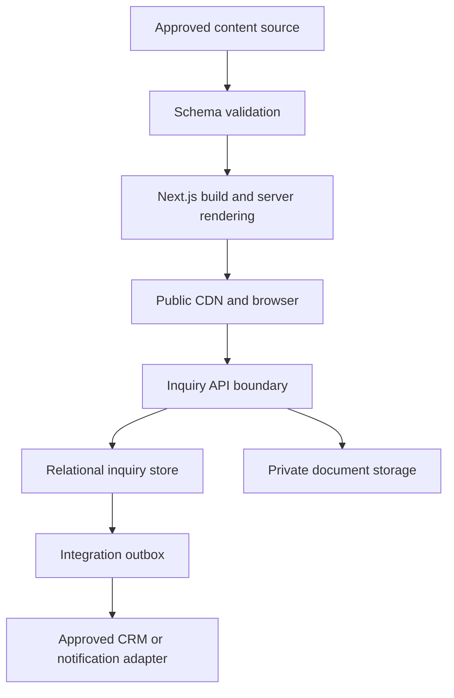

Trust boundaries:

1. **Editorial boundary:** untrusted draft content becomes publishable only after schema, relationship, approval, and privacy checks.
2. **Browser boundary:** all browser input is untrusted regardless of client validation.
3. **API boundary:** server validation, abuse controls, authorization, and normalization occur before persistence.
4. **Storage boundary:** database and object-storage credentials exist only on the server.
5. **Integration boundary:** outbound and inbound provider data is validated and logged through adapters.
6. **Operations boundary:** staff access to confidential records requires approved authentication and authorization outside the public site UI.

---

## 6. Logical Data Stores

### 6.1 Store A — Public content source

**Purpose:** canonical source for published website content in Phase 1.

**Baseline:** version-controlled, UTF-8, structured content files validated during development, CI, and production build.

**Preferred serialization:** JSON-compatible structured records. Rich content uses the approved discriminated block union from `CONTENT_MODEL.md`, not arbitrary executable MDX or raw HTML.

**Contains:**

- site settings;
- route-linked page records;
- navigation and footer configuration;
- capabilities and process steps;
- material categories;
- industries;
- approved projects/case studies;
- evidence-safe public claims;
- insights and resources;
- FAQs;
- CTA records;
- media metadata;
- SEO fields and publication data;
- controlled taxonomies.

**Must not contain:**

- form submissions;
- phone numbers or emails supplied by visitors;
- uploaded client documents;
- supplier offers;
- internal notes;
- credentials or secrets;
- placeholder prices, stock, client names, metrics, or testimonials.

### 6.2 Store B — Public media store

**Purpose:** approved public images, video posters, logos, diagrams, and downloadable public resources.

Assets require metadata defined in `MediaAsset`, including dimensions, MIME type, copyright status, approval status, privacy class, and accessibility text.

Public media may use immutable hashed filenames and CDN caching. A public file cannot later be treated as confidential; confidential material requires a new private object and removal/migration procedures.

### 6.3 Store C — Relational inquiry store

**Purpose:** persistent server-side storage for qualified website inquiries and their audit context.

**Baseline technology class:** managed PostgreSQL-compatible database.

**Activation rule:** this store is required when the website itself persists inquiries. If Phase 1 forwards leads to an approved CRM without local persistence, the same logical validation, consent, idempotency, and audit contract still applies at the integration boundary.

**Contains only the minimum operational dataset:**

- inquiry;
- contact;
- optional company and project context;
- material-category references;
- document metadata, never file bytes;
- consent record;
- source attribution;
- state history;
- integration delivery status;
- security-minimized abuse metadata where approved.

### 6.4 Store D — Private object storage

**Purpose:** confidential client-uploaded documents.

Requirements:

- private bucket/container;
- encryption in transit and at rest;
- random non-semantic object keys;
- no original filename in the object path;
- short-lived authorized access only;
- MIME verification independent of filename extension;
- size and count limits;
- quarantine and scanning state;
- lifecycle deletion rules;
- access logging where supported;
- separate environments and credentials.

### 6.5 Store E — Integration outbox

**Purpose:** reliable delivery of committed inquiries to approved downstream systems without making form success depend on a fragile synchronous notification.

The outbox may be a database table or a provider-neutral queue, but it must support:

- event ID;
- event type and schema version;
- aggregate ID;
- creation timestamp;
- delivery status;
- attempt count;
- next-attempt timestamp;
- provider mapping;
- last sanitized error code;
- completed/dead-letter timestamp.

### 6.6 Store F — Analytics

Analytics is a derived, minimized behavioral dataset—not an operational source of truth. It may contain stable page, content, campaign, and event keys but must not contain PII, uploaded filenames, project messages, document contents, or internal inquiry details.

---

## 7. Source-of-Truth Matrix

| Data domain | Authoritative source | Derived consumers | Write owner |
|---|---|---|---|
| Public page content | Public content source / future CMS | website, sitemap, search, JSON-LD | approved editorial workflow |
| Route identity | typed route manifest | navigation, canonical, sitemap, analytics | technical + IA owner |
| Public media metadata | public content source | image components, OG, resource pages | content/media owner |
| Public asset bytes | public media store | CDN and browser | media pipeline |
| Inquiry | relational inquiry store or approved CRM | staff workflow, aggregate reporting | inquiry service |
| Uploaded document metadata | relational inquiry store | authorized operations UI | upload service |
| Uploaded document bytes | private object storage | authorized retrieval only | upload service |
| Consent evidence | relational inquiry store | privacy audit | inquiry service |
| Inquiry status | relational inquiry store / approved CRM after handoff | staff reporting | operations workflow |
| Integration delivery | outbox/integration log | retries and monitoring | integration worker |
| Analytics events | analytics platform | dashboards | analytics pipeline |

No downstream system may silently become authoritative merely because it contains a copy.

---

## 8. Public Content Data Architecture

### 8.1 Record shape

All routable public records extend the base model defined in `CONTENT_MODEL.md`:

- immutable `id`;
- stable `contentType`;
- locale;
- title, slug, summary;
- structured body fields;
- SEO fields;
- publication fields;
- taxonomy and relationship IDs;
- CTA references;
- privacy class.

### 8.2 File record rules

- One canonical entity record per file or CMS record.
- IDs use stable lowercase ASCII kebab case.
- Slugs use lowercase Latin kebab case and match `ROUTES.md`.
- Relationships store IDs, not copied titles or URLs.
- Files use UTF-8 without manual direction-control tricks.
- Numbers remain numeric; units use controlled codes.
- Dates are ISO 8601; timestamps are UTC.
- `null` means intentionally absent; `[]` means an intentionally empty collection.
- Published records cannot contain `TBD`, `N/A`, lorem ipsum, placeholder URLs, or fake data.

### 8.3 Locale model

The canonical entity ID is shared across future locale variants, while each locale owns its own:

- slug;
- display copy;
- metadata;
- publication status;
- review status;
- localized media text.

Phase 1 publication rules:

- only `fa` records are publishable by default;
- no locale fallback is allowed on public localized routes;
- future `/en/**` or `/ar/**` pages exist only for complete approved records;
- hreflang is emitted only for real, reciprocal, indexable equivalents.

### 8.4 Public relationship integrity

The validator must reject:

- duplicate IDs;
- duplicate locale-aware slugs;
- unresolved references;
- references from public records to confidential data;
- published records referencing draft-only required entities;
- invalid parent/child taxonomies;
- route collisions with reserved system paths;
- circular structures that break navigation or rendering;
- archived routable content without a redirect or explicit removal decision.

### 8.5 Publication projection

The build process creates a read-only projection containing only records that:

1. pass runtime schema validation;
2. satisfy relationship rules;
3. have `publication.status = published`;
4. have an approved locale;
5. have a valid canonical route;
6. pass privacy and evidence gates.

Draft and preview projections must never be included in the production static bundle.

### 8.6 Derived public data

Compute rather than manually duplicate:

- canonical absolute URLs;
- breadcrumbs;
- sitemap records;
- hreflang mappings;
- reverse relationships;
- reading time;
- article table of contents;
- Open Graph URL;
- result counts;
- file-size labels;
- localized number and date formatting;
- related-content candidates under explicit rules.

---

## 9. Public Content Validation Pipeline

The required pipeline is:

```text
Author or edit record
→ Parse source
→ Validate schema
→ Validate IDs and enums
→ Validate relationships
→ Validate routes and slugs
→ Validate publication and locale
→ Validate media and evidence
→ Validate SEO/privacy rules
→ Build published projection
→ Render pages and derived outputs
```

Validation must run:

- during local development;
- in automated tests;
- in CI before merge/deploy;
- during production build;
- on CMS webhook/revalidation if a CMS is later adopted.

Warnings are acceptable only for non-publishable drafts. A violation affecting published content must fail the build.

---

## 10. Inquiry Domain Boundary

The website inquiry domain is intentionally smaller than the future procurement operations domain.

### 10.1 In Phase 1

- accept an inquiry;
- capture minimum contact and optional company/project context;
- associate selected material categories;
- securely associate approved uploaded documents;
- record consent and source attribution;
- assign a non-sensitive reference number when approved;
- record review state and staff-facing events;
- deliver the inquiry to an approved destination;
- support retention, deletion, and audit requirements.

### 10.2 Outside Phase 1

- public customer login;
- request tracking portal;
- supplier master and performance scoring;
- quotation line calculation;
- order, payment, shipment, and invoice accounting;
- live stock or price ingestion;
- automated product normalization;
- OCR/AI extraction as a decision-maker;
- recommendation engine.

Those capabilities must enter a separate bounded context and architecture review rather than expanding the website inquiry tables casually.

---

## 11. Logical Inquiry Schema

Names below describe logical tables or aggregates. Physical naming and ORM syntax may vary, but meaning and constraints must remain stable.

### 11.1 `inquiry`

| Field | Type | Null | Constraint / purpose |
|---|---|---:|---|
| `id` | UUID | No | Internal primary key; never sequential public ID |
| `reference_number` | string | No | Unique, random-enough customer-safe reference |
| `form_id` | string | No | Stable form identity |
| `form_version` | integer | No | Payload and consent traceability |
| `locale` | locale code | No | `fa` in Phase 1 |
| `status` | enum | No | Current inquiry state |
| `message` | text | Yes | Plain text only; length-limited |
| `preferred_contact_method` | enum | Yes | phone, email, WhatsApp, or approved value |
| `source_page_key` | string | No | Stable route key, not raw referrer text |
| `source_content_id` | string | Yes | Public entity ID when applicable |
| `assigned_to` | string/UUID | Yes | Internal identity only when operations system exists |
| `submitted_at` | timestamptz | No | Server timestamp in UTC |
| `updated_at` | timestamptz | No | Server managed |
| `retention_until` | timestamptz | No | Computed from approved retention policy |
| `privacy_class` | enum | No | Always `confidential` |
| `schema_version` | integer | No | Data migration and compatibility |

Indexes:

- unique index on `reference_number`;
- index on `(status, submitted_at)`;
- index on `retention_until`;
- optional index on `assigned_to` only when used.

### 11.2 `contact`

| Field | Type | Null | Constraint / purpose |
|---|---|---:|---|
| `id` | UUID | No | Primary key |
| `full_name` | string | No | Trimmed, length-limited |
| `phone_e164` | string | Conditional | Normalized international form when phone supplied |
| `phone_country_code` | string | Conditional | Stored separately when required by UX |
| `email_normalized` | string | Conditional | Lowercase domain; preserve safe original display separately only if needed |
| `preferred_language` | locale code | No | `fa` default |
| `created_at` | timestamptz | No | UTC |
| `updated_at` | timestamptz | No | UTC |

At least one approved contact channel must be present. Contact data must not be exported to analytics.

Whether repeated contacts are merged is an operations decision. Phase 1 must prefer duplicate inquiries over an unsafe automatic person merge.

### 11.3 `inquiry_contact`

| Field | Type | Null | Constraint / purpose |
|---|---|---:|---|
| `inquiry_id` | UUID | No | Foreign key to inquiry |
| `contact_id` | UUID | No | Foreign key to contact |
| `role` | enum | No | requester, project-contact, or approved role |
| `is_primary` | boolean | No | Exactly one primary requester per inquiry |

Unique constraint: `(inquiry_id, contact_id, role)`.

### 11.4 `company_input`

This table stores visitor-supplied company context; it is not a verified company master.

| Field | Type | Null | Constraint / purpose |
|---|---|---:|---|
| `id` | UUID | No | Primary key |
| `inquiry_id` | UUID | No | Unique foreign key for Phase 1 |
| `company_name` | string | Yes | Plain text, length-limited |
| `role_or_department` | string | Yes | Optional |
| `industry_id` | string | Yes | Public taxonomy ID when selected |
| `city` | string | Yes | Optional project/business context |
| `country_code` | string | No | `IR` default only when justified by UX |

Do not treat visitor-supplied company data as legally verified.

### 11.5 `project_input`

| Field | Type | Null | Constraint / purpose |
|---|---|---:|---|
| `id` | UUID | No | Primary key |
| `inquiry_id` | UUID | No | Unique foreign key for Phase 1 |
| `project_title` | string | Yes | Optional; confidential |
| `project_type` | string/enum | Yes | Controlled value when possible |
| `project_stage` | enum | Yes | Approved form values only |
| `delivery_city` | string | Yes | Operational context |
| `required_by_date` | date | Yes | User intent, not a promise |
| `technical_concern` | text | Yes | Plain text; length-limited |

Dates and locations supplied by the visitor remain unverified input until reviewed.

### 11.6 `inquiry_material`

| Field | Type | Null | Constraint / purpose |
|---|---|---:|---|
| `inquiry_id` | UUID | No | Foreign key |
| `material_category_id` | string | No | Stable public taxonomy ID |
| `source` | enum | No | selected, document-review, or staff-added |
| `created_at` | timestamptz | No | UTC |

Unique constraint: `(inquiry_id, material_category_id, source)`.

Do not create product or quantity rows from uploaded documents in Phase 1 unless a separate human-reviewed extraction feature is approved.

### 11.7 `document`

Stores metadata only.

| Field | Type | Null | Constraint / purpose |
|---|---|---:|---|
| `id` | UUID | No | Internal primary key |
| `inquiry_id` | UUID | Yes | Null only during short-lived upload session |
| `upload_session_id` | UUID | Yes | Links pre-submission upload |
| `storage_key` | string | No | Random private object key; unique |
| `original_filename` | string | No | Sanitized for display; never used as storage key |
| `detected_mime_type` | string | No | Server-verified |
| `claimed_mime_type` | string | Yes | Browser claim for audit only |
| `size_bytes` | bigint | No | Positive and within limit |
| `sha256` | string | Yes | Integrity/deduplication aid, not authorization |
| `scan_status` | enum | No | pending, clean, rejected, failed, expired |
| `upload_status` | enum | No | initiated, uploaded, attached, deleted |
| `uploaded_at` | timestamptz | Yes | UTC |
| `retention_until` | timestamptz | No | Approved lifecycle |
| `privacy_class` | enum | No | `confidential` |

No table stores a permanent public URL. Authorized retrieval is generated on demand and expires quickly.

### 11.8 `upload_session`

Required only if uploads occur before final inquiry creation.

| Field | Type | Null | Constraint / purpose |
|---|---|---:|---|
| `id` | UUID | No | Primary key |
| `token_hash` | string | No | Unique; raw token never stored |
| `status` | enum | No | active, completed, expired, blocked |
| `created_at` | timestamptz | No | UTC |
| `expires_at` | timestamptz | No | Short lifetime |
| `origin_fingerprint` | string | Yes | Minimized anti-abuse value only when approved |

Expired sessions and unattached objects must be deleted automatically.

### 11.9 `consent_record`

| Field | Type | Null | Constraint / purpose |
|---|---|---:|---|
| `id` | UUID | No | Primary key |
| `inquiry_id` | UUID | No | Foreign key |
| `consent_type` | enum | No | privacy-processing, marketing, or approved value |
| `granted` | boolean | No | Marketing may never default to true |
| `text_version` | string | No | Exact approved copy version |
| `privacy_policy_version` | string | No | Policy shown at submission |
| `captured_at` | timestamptz | No | Server timestamp |
| `capture_source` | string | No | Form ID/version |

Consent records are append-only. A withdrawal creates a new event or status; it must not erase historical proof of what was shown and accepted.

### 11.10 `attribution`

| Field | Type | Null | Constraint / purpose |
|---|---|---:|---|
| `inquiry_id` | UUID | No | Primary/foreign key |
| `utm_source` | string | Yes | Length-limited and sanitized |
| `utm_medium` | string | Yes | Length-limited and sanitized |
| `utm_campaign` | string | Yes | Length-limited and sanitized |
| `utm_content` | string | Yes | Length-limited and sanitized |
| `utm_term` | string | Yes | Length-limited and sanitized |
| `landing_page_key` | string | No | Stable route key |
| `cta_origin` | string | Yes | Stable CTA ID |
| `referrer_host` | string | Yes | Host only where possible; no sensitive query string |

Raw URLs with arbitrary query strings must not be retained by default.

### 11.11 `inquiry_event`

Append-only history.

| Field | Type | Null | Constraint / purpose |
|---|---|---:|---|
| `id` | UUID | No | Primary key |
| `inquiry_id` | UUID | No | Foreign key |
| `event_type` | enum | No | submitted, status-changed, assigned, note-added, integration-delivered, deleted, etc. |
| `from_status` | enum | Yes | Required for state change |
| `to_status` | enum | Yes | Required for state change |
| `actor_type` | enum | No | system, staff, integration |
| `actor_id` | string/UUID | Yes | Protected internal identity |
| `reason_code` | string | Yes | Controlled when applicable |
| `metadata` | JSON | Yes | Versioned, minimized, no arbitrary secret payload |
| `created_at` | timestamptz | No | UTC |

The event table is not a substitute for application logs and must not become an unstructured dump.

### 11.12 `integration_outbox`

| Field | Type | Null | Constraint / purpose |
|---|---|---:|---|
| `id` | UUID | No | Event ID |
| `aggregate_type` | string | No | `inquiry` in Phase 1 |
| `aggregate_id` | UUID | No | Inquiry ID |
| `event_type` | string | No | Versioned contract name |
| `schema_version` | integer | No | Payload compatibility |
| `payload` | JSON | No | Minimum required downstream data |
| `status` | enum | No | pending, processing, delivered, retry, dead-letter |
| `attempt_count` | integer | No | Starts at zero |
| `next_attempt_at` | timestamptz | Yes | Retry schedule |
| `provider_key` | string | No | Adapter identity, not secret |
| `provider_record_id` | string | Yes | Mapping after success |
| `last_error_code` | string | Yes | Sanitized |
| `created_at` | timestamptz | No | UTC |
| `completed_at` | timestamptz | Yes | UTC |

Unique delivery semantics must be enforced by event ID and provider mapping.

---

## 12. Entity Relationship Summary

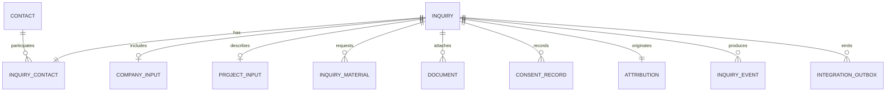

Public content entity IDs may be referenced from `inquiry_material`, `source_content_id`, and analytics context. No foreign key from the public content file store is possible; application validation must ensure those IDs exist in the approved public taxonomy registry.

---

## 13. Identifier Strategy

### 13.1 Public content

- Human-readable immutable ASCII IDs, e.g. `material-rebar`.
- Locale-specific slugs are mutable only through an approved redirect migration.
- URLs are never used as entity IDs.

### 13.2 Confidential records

- Use database-generated UUIDs.
- UUID v7 is preferred when supported consistently; UUID v4 is acceptable.
- Never expose internal primary keys in public URLs or analytics.

### 13.3 Customer-safe reference

If an inquiry reference is shown, it must:

- be generated server-side;
- be unique;
- contain no phone, date of birth, email, sequential database ID, or project name;
- not function as authentication;
- not allow enumeration of other inquiries.

Example shape only:

```text
AA-8K4P-Q7M2
```

The exact format belongs in the form/API specification.

### 13.4 Idempotency

`POST /api/inquiries` must support safe duplicate-submission handling.

Preferred behavior:

- client generates a per-attempt idempotency key;
- server binds it to a normalized payload fingerprint for a limited window;
- same key and same payload returns the original successful result;
- same key with different payload is rejected;
- idempotency records expire under an approved retention period.

Do not deduplicate solely by phone number, email, filename, or message similarity.

---

## 14. State Models

### 14.1 Inquiry status

Approved baseline:

```text
received
→ under-review
→ needs-clarification
→ qualified
→ converted OR declined
→ closed
```

Rules:

- `received` means persisted successfully, not commercially accepted.
- `qualified` means reviewed against approved operational criteria.
- `converted` means handed into an approved procurement/CRM workflow.
- `declined` requires an internal reason code.
- deletion/anonymization is a data-governance action, not a commercial status.
- every transition is validated and appended to `inquiry_event`.

### 14.2 Document status

```text
initiated → uploaded → pending-scan → clean → attached
                               ↘ rejected
active states → expired/deleted
```

Only `clean` documents may become available to authorized staff. Scan failure must fail closed, not mark the file safe.

### 14.3 Integration delivery

```text
pending → processing → delivered
                    ↘ retry → processing
                    ↘ dead-letter
```

The browser receives success after durable inquiry persistence, not after every downstream notification succeeds.

---

## 15. Inquiry Submission Transaction

### 15.1 Without document upload

1. Receive request at `/api/inquiries`.
2. Enforce request size, origin, rate-limit, and anti-abuse policy.
3. Parse and validate the versioned payload.
4. Normalize contact and attribution fields.
5. Start a database transaction.
6. Create contact, inquiry, optional company/project records, materials, consent, and attribution.
7. Create initial `inquiry_event`.
8. Create integration outbox event.
9. Commit.
10. Return a minimized success response.
11. Process delivery asynchronously.

### 15.2 With document upload

1. Create short-lived upload session.
2. Validate intended file count, extension, declared MIME, and size before issuing upload permission.
3. Upload directly or through the server to quarantine storage.
4. Verify actual object size and detected MIME.
5. Scan or otherwise validate under the approved security design.
6. Submit inquiry referencing clean or pending approved document tokens.
7. In one transaction, persist inquiry records and attach valid documents.
8. Expire the upload session.
9. Delete orphaned or rejected objects according to lifecycle rules.

The user must never be told that a document was accepted when persistence or attachment failed.

### 15.3 Success response

The API returns only:

- `success`;
- customer-safe reference when enabled;
- generic next-step message key;
- safe retry semantics.

It must not return internal IDs, storage keys, provider IDs, staff identity, supplier information, or internal status details.

---

## 16. File Upload Contract

The upload feature remains disabled until file types, size/count limits, storage, scanning, retention, consent, and authorized recipient access are approved.

### 16.1 Allowed-type policy

The final allowlist belongs in `FORM_ARCHITECTURE.md` and `SECURITY_GUIDELINES.md`. It should be limited to business-relevant formats such as approved PDF, image, and spreadsheet types.

Never trust:

- filename extension;
- browser-supplied MIME type;
- client-side validation;
- a password-protected or encrypted file that cannot be inspected;
- a compressed archive unless explicitly approved.

### 16.2 Filename treatment

- Preserve a sanitized display filename only for authorized staff context.
- Strip path segments and control characters.
- Apply a length limit.
- Do not use the filename as an object key.
- Do not include it in analytics, logs, public HTML, email subject lines, or URLs.

### 16.3 Download treatment

- Authorize every retrieval request.
- Generate short-lived access.
- Set safe content disposition.
- Prevent inline execution for risky types.
- Record access when required.
- Recheck deletion/retention state before issuing access.

---

## 17. API Data Contracts

All API payloads are versioned. Versioning may use an explicit field or media/route contract, but must be testable.

Conceptual submission shape:

```ts
type InquirySubmissionV1 = {
  schemaVersion: 1;
  idempotencyKey: string;
  form: {
    id: "primary-procurement-inquiry";
    version: number;
    locale: "fa";
  };
  contact: {
    fullName: string;
    phone?: string;
    email?: string;
    preferredContactMethod?: "phone" | "email" | "whatsapp";
  };
  company?: {
    name?: string;
    roleOrDepartment?: string;
    industryId?: string;
  };
  project?: {
    title?: string;
    stage?: string;
    deliveryCity?: string;
    requiredByDate?: string;
    technicalConcern?: string;
  };
  materialCategoryIds: string[];
  message?: string;
  documentTokens: string[];
  consent: {
    privacyProcessing: true;
    marketing?: boolean;
    textVersion: string;
    privacyPolicyVersion: string;
  };
  attribution?: {
    landingPageKey: string;
    sourceContentId?: string;
    ctaOrigin?: string;
    utmSource?: string;
    utmMedium?: string;
    utmCampaign?: string;
    utmContent?: string;
    utmTerm?: string;
  };
};
```

Rules:

- The server schema is authoritative.
- Unknown fields are rejected or stripped according to a documented policy; they are never blindly persisted.
- Server-derived timestamps, status, privacy class, reference number, and retention date are not accepted from the client.
- Taxonomy IDs are checked against approved registries.
- Error responses identify correctable fields without exposing internals.
- Database or provider error messages never pass through to the browser.

---

## 18. Access-Control Model

### 18.1 Public website

- Read-only access to published public content.
- Write access only through narrowly scoped form endpoints.
- No direct database or object-storage credentials in client code.

### 18.2 Internal operations

The internal interface is outside Phase 1 public scope. When built, it requires:

- authenticated staff identity;
- role-based authorization;
- least privilege;
- separate permissions for viewing PII, downloading files, changing status, exporting data, and deleting/anonymizing records;
- session security and revocation;
- audit records for sensitive actions.

Suggested logical roles for future approval:

| Role | Minimum data capability |
|---|---|
| Inquiry triage | view and classify assigned inquiries |
| Procurement reviewer | view approved inquiry details and documents |
| Manager | assign, change status, view operational summaries |
| Privacy administrator | retention, export, deletion/anonymization workflow |
| System integration | narrow machine access to approved fields only |

No role receives unrestricted database access through the application by default.

---

## 19. Privacy, Minimization, and Sensitive Data

### 19.1 Prohibited collection

The website must not request or intentionally store:

- account passwords;
- bank-card data;
- unnecessary identity documents;
- personal national identifiers unless a separately approved legal process requires them;
- supplier credentials;
- unrelated health, political, religious, or biometric data;
- secrets embedded in free-form technical files knowingly requested by the website.

### 19.2 Free-text risk

Users may place personal or confidential information inside messages or documents. Therefore:

- free text is confidential;
- it is never copied to analytics;
- logs contain field presence and length, not content;
- outbound notification content is minimized;
- staff guidance must discourage unnecessary copying into external systems.

### 19.3 Log minimization

Application logs may contain:

- request correlation ID;
- route and method;
- status code;
- latency;
- schema version;
- normalized error code;
- integration event ID;
- non-sensitive record ID in protected server logs.

They must not contain:

- name, phone, email;
- message text;
- original filename;
- uploaded file contents;
- authorization token;
- signed URL;
- provider secret;
- complete request payload.

### 19.4 IP and anti-abuse data

Store raw IP addresses only when legally and operationally approved. Prefer transient processing, truncation, hashing with rotation, or provider-level rate limiting. Any retained anti-abuse value requires a purpose and expiration.

---

## 20. Retention, Deletion, and Anonymization

No production inquiry or upload feature may launch without an approved retention schedule.

### 20.1 Proposed retention classes for owner/legal approval

| Data | Proposed baseline | Action at expiry |
|---|---:|---|
| Unattached upload session | 24 hours | delete object and session metadata |
| Rejected/quarantined file | 7 days or less | hard delete unless security investigation requires hold |
| Idempotency record | 7 days | delete |
| Failed integration diagnostic | 30–90 days | delete or aggregate |
| Unqualified inquiry | 12 months | delete or irreversibly anonymize |
| Qualified/converted inquiry | 24 months after last activity | review, delete, or move under approved business/legal basis |
| Consent evidence | aligned with inquiry and legal defense period | delete/anonymize under policy |
| Aggregated anonymous metrics | longer only if non-identifying | retain under analytics policy |

These values are proposals, not legal conclusions. Final values must be recorded in an approved policy and implemented as configuration, not scattered constants.

### 20.2 Deletion workflow

Deletion must cover:

1. primary relational records;
2. private objects and derived previews;
3. search indexes;
4. caches;
5. pending outbox messages where lawful;
6. downstream integration copies through a documented request;
7. backups according to backup-expiry limitations.

The system records that a deletion occurred without retaining the deleted personal payload.

### 20.3 Legal or operational hold

Any hold requires an authorized reason, scope, owner, start time, and review date. A generic `do_not_delete` flag without governance is prohibited.

---

## 21. Data Security Controls

- TLS for all data in transit.
- Provider-managed encryption at rest for database, backups, and object storage.
- Environment-separated credentials.
- Secret rotation and revocation process.
- Server-only environment variables.
- Parameterized database access through approved query layer/ORM.
- Content Security Policy and safe response headers under `SECURITY_GUIDELINES.md`.
- Rate limiting and bot controls at `/api/inquiries` and `/api/uploads`.
- Strict payload size limits before parsing large bodies.
- File scanning and quarantine when uploads are enabled.
- Dependency and migration review before deployment.
- No production data in source control, fixtures, screenshots, preview deployments, or client error reports.
- No unrestricted database administration endpoint in the website application.

Application-level field encryption may be added for selected PII if required by the threat model, provider capabilities, or law. It must include key rotation, search limitations, and recovery procedures; ad hoc encryption helpers are prohibited.

---

## 22. Search and Index Architecture

### 22.1 Public search

If site search is enabled, the index may include only published public fields approved in `CONTENT_MODEL.md`:

- title;
- summary;
- approved aliases;
- approved body text;
- content type;
- material category;
- capability;
- industry;
- resource/article type.

The search index is derived and disposable. It is never authoritative.

### 22.2 Prohibited search content

Never index:

- inquiries;
- names, phones, emails;
- uploaded document names or contents;
- supplier data;
- quote/order data;
- internal notes;
- draft/private content.

### 22.3 Filtering and SEO

Filter state is derived from taxonomy IDs. Filter combinations do not create indexable records or public content entities unless explicitly approved by SEO and information architecture.

---

## 23. Analytics Data Boundary

Allowed event context:

```text
event_name
page_key
route_family
locale
content_id
content_type
cta_id
cta_origin
form_id
form_version
form_step
submission_result
error_code
utm_source
utm_medium
utm_campaign
```

Prohibited analytics fields:

```text
name
phone
email
company name
project title
message text
filename
document URL
inquiry database ID
customer-safe reference number
supplier or quote details
```

`generate_lead` or equivalent success events must be emitted only after authoritative server-side acceptance, not merely after a button click or confirmation-page load.

---

## 24. Integration Architecture

Every integration uses an adapter with a domain-owned input contract.

```text
Inquiry domain event
→ outbox
→ integration adapter
→ provider API
→ mapped provider record ID
→ delivery result
```

Rules:

- Provider payloads are created at the adapter boundary.
- Provider field names do not leak into domain models.
- Webhooks require signature verification, timestamp/replay controls, schema validation, and idempotency.
- Retries use bounded exponential backoff and a dead-letter state.
- Notification failure does not delete or duplicate the committed inquiry.
- Secrets stay in environment configuration.
- A provider outage produces an operational alert and retry, not a false user failure after durable persistence.
- Manual fallback must be documented before launch.

The first approved lead destination must be named in `API_INTEGRATIONS.md`; until then, Claude Code may implement an adapter interface and a safe development stub that stores no fake production success.

---

## 25. Caching and Revalidation

### 25.1 Public data

- Published public pages and assets may use CDN caching.
- Immutable media uses content-hashed URLs and long cache lifetimes.
- HTML/data revalidation follows the content publication model.
- A future CMS webhook may trigger narrow revalidation by content ID or route key.

### 25.2 Confidential data

- Do not cache form submissions at browser, CDN, or shared proxy layers.
- API responses containing any confidential value use restrictive cache headers.
- Signed object access expires quickly and is never cached as a public asset.
- Confirmation pages display only safe transient information.
- Server caches must never use raw PII or document names as cache keys.

---

## 26. Environments and Test Data

Required environments:

| Environment | Data rule |
|---|---|
| Local | synthetic fixtures only; no copied production PII |
| Preview | public draft content as approved; inquiry integrations disabled or sandboxed |
| Staging | synthetic or explicitly anonymized data; separate database and storage |
| Production | real data; production-only credentials and policies |

Rules:

- Never share database schemas through the same live database instance merely by a loose environment column.
- Private storage buckets/containers are separate per environment.
- Preview deployments cannot access production inquiry data.
- Test fixtures use obviously fictional names, domains, phone numbers, companies, projects, and documents.
- Production exports may not be used in development unless a formal anonymization process is approved and verified.

---

## 27. Database Constraints and Transaction Rules

The physical schema must enforce, not merely document:

- primary keys;
- foreign keys where stores are co-located;
- unique reference numbers;
- unique object storage keys;
- valid enum/check constraints where practical;
- positive file sizes;
- consent requirements;
- one primary requester per inquiry;
- valid timestamps and retention dates;
- deletion behavior that does not orphan private files silently.

Transaction boundaries:

- inquiry, consent, attribution, initial event, and outbox event are committed atomically;
- attaching documents to a submitted inquiry is atomic at the database level;
- object upload itself is not a database transaction, so compensating cleanup is mandatory;
- status transition and its audit event are committed together;
- integration delivery is never allowed to create a second inquiry record on retry.

---

## 28. Schema Evolution and Migrations

### 28.1 Versioning

- Public content schemas have explicit version or migration support.
- API payloads have explicit schema versions.
- Database migrations are ordered, immutable after application, and committed to version control.
- Integration events carry schema version.

### 28.2 Migration strategy

Use expand-and-contract for production changes:

1. add backward-compatible structure;
2. deploy code able to read old and new shapes;
3. backfill with monitored batches;
4. switch writes;
5. verify;
6. remove obsolete structure in a later migration.

### 28.3 Prohibited migration behavior

- destructive production migration without backup and recovery plan;
- renaming a published public ID without relationship migration;
- changing a published slug without redirect entry;
- using runtime application startup to perform uncontrolled destructive migrations;
- treating an ORM-generated diff as automatically safe;
- storing secrets or production data inside migration files.

### 28.4 Backfill requirements

Every material backfill defines:

- selection criteria;
- batch size;
- idempotency behavior;
- expected record count;
- progress logging without PII;
- rollback or correction method;
- post-run validation.

---

## 29. Backup, Recovery, and Continuity

Before real inquiry data is accepted, production requires:

- automated encrypted database backups;
- point-in-time recovery where supported;
- object-storage versioning or equivalent recovery protection where appropriate;
- backup retention consistent with the privacy policy;
- documented restore procedure;
- periodic restore test;
- owner for recovery decisions;
- monitoring for backup failure.

Launch targets for approval:

| Measure | Target |
|---|---:|
| Inquiry database RPO | 24 hours maximum; lower if provider supports it |
| Inquiry service RTO | 8 hours maximum |
| Backup restore test | at least quarterly |
| Critical integration retry visibility | same business day |

Backups must not become a way to retain personal data indefinitely. Expired backups age out under the approved backup lifecycle.

---

## 30. Observability and Data Quality

### 30.1 Operational metrics

Track without PII:

- inquiry submissions attempted/accepted/rejected;
- validation failure rate by error code;
- upload initiation/completion/rejection;
- document scan latency and failure;
- database write latency and error rate;
- outbox pending age;
- integration delivery/retry/dead-letter counts;
- orphan upload cleanup count;
- retention deletion count;
- public content validation failures;
- broken relationship and route collision counts.

### 30.2 Data quality checks

- valid contact channel present;
- unique reference number;
- consent version present;
- retention date present;
- source route key recognized;
- selected taxonomy IDs recognized;
- attached documents exist and are in allowed state;
- no public record contains confidential fields;
- no confidential data reaches analytics or static output;
- outbox events correspond to committed inquiries;
- no expired upload remains accessible.

### 30.3 Alerts

Alert on:

- sustained inquiry persistence failure;
- upload security/scanning outage when uploads are enabled;
- unusual rate-limit volume;
- outbox backlog age beyond threshold;
- repeated dead-letter deliveries;
- backup failure;
- retention cleanup failure;
- public build blocked by privacy leakage or broken references.

---

## 31. Performance and Scale Assumptions

The architecture optimizes for a high-value B2B inquiry workflow, not marketplace traffic or high-frequency price data.

Phase 1 assumptions:

- public reads greatly exceed confidential writes;
- public delivery benefits from static generation and CDN caching;
- inquiry writes are low-to-moderate volume but require correctness;
- file uploads are larger and riskier than form payloads;
- integration delivery can be asynchronous;
- relational queries are primarily by status, time, assignment, and reference;
- no multi-region write architecture is required initially.

Scale first through:

1. CDN/static delivery for public pages;
2. managed database connection pooling;
3. direct-to-private-storage upload when approved;
4. asynchronous outbox processing;
5. appropriate indexes based on measured queries;
6. archival and retention enforcement.

Do not introduce microservices, event streaming platforms, distributed databases, or data warehouses without measured need and an approved architecture decision.

---

## 32. Future Procurement Domain Separation

If the business validates the manual process and develops an internal procurement platform, create separate bounded contexts:

| Future context | Candidate entities | Boundary rule |
|---|---|---|
| Request intake | inquiry, contact, document, consent | may evolve from this website architecture |
| Requirement review | reviewed item, normalized specification, clarification | human-verified; separate from raw upload |
| Supplier management | supplier, capability, region, commercial terms, performance | restricted; never public by default |
| Quotation | quote, quote item, validity, terms, approval | transactional and versioned |
| Order | purchase order, order item, milestone | separate lifecycle from inquiry |
| Logistics | shipment, carrier, delivery event, proof | operational and time-sensitive |
| Finance | payment, invoice, margin | high-sensitivity; separate controls |
| Intelligence | price observation, supplier signal, recommendation | derived; human verification required |

The website inquiry ID may become an external reference in those contexts. Their internal schemas must not be embedded into the public website data model in advance.

---

## 33. Repository and Code-Level Contracts

Exact folders belong in `FOLDER_STRUCTURE.md`, but the implementation must expose these conceptual modules:

```text
domain/public-content
domain/inquiry
domain/upload
domain/consent
domain/attribution
domain/integration
data/public-content-source
data/database
data/object-storage
data/analytics
validation
```

Required boundaries:

- UI components consume typed view models, not raw provider or database objects.
- Server route handlers call domain services, not storage SDKs directly.
- Database and storage adapters are server-only modules.
- Public content loaders cannot import inquiry repositories.
- Client components cannot import server-only schemas containing secrets or internal fields.
- Domain types do not depend on ORM-generated types as their only contract.
- Mapping functions are explicit and tested.

---

## 34. Reference Interfaces

These interfaces are normative for responsibilities, not package or filename selection.

```ts
interface PublicContentRepository {
  getById<T>(contentType: string, id: string, locale: string): Promise<T | null>;
  listPublished<T>(contentType: string, locale: string): Promise<T[]>;
  resolveRoute(path: string, locale: string): Promise<PublicRouteEntity | null>;
}

interface InquiryRepository {
  create(input: ValidatedInquiry): Promise<CreatedInquiry>;
  findByReference(reference: string): Promise<InquirySummary | null>;
  transition(input: InquiryTransition): Promise<Inquiry>;
}

interface PrivateDocumentStore {
  beginUpload(input: UploadIntent): Promise<UploadAuthorization>;
  verifyUpload(token: string): Promise<VerifiedUpload>;
  authorizeRead(documentId: string, actor: AuthorizedActor): Promise<ExpiringAccess>;
  delete(documentId: string, reason: DeletionReason): Promise<void>;
}

interface InquiryDeliveryAdapter {
  deliver(event: InquirySubmittedEvent): Promise<DeliveryResult>;
}
```

Production implementations must not use `any` for validation results, persisted records, or integration payloads.

---

## 35. Required Automated Tests

### 35.1 Public content

- parse all records;
- validate schema and enums;
- reject duplicate IDs and slugs;
- reject broken references;
- reject confidential fields in public records;
- verify only published approved records generate routes;
- verify canonical, sitemap, breadcrumb, and hreflang derivation;
- reject unsupported locale fallback;
- validate media approval and accessibility metadata;
- validate evidence requirements for claims.

### 35.2 Inquiry API

- valid minimal submission;
- phone-only and email-only allowed cases according to form policy;
- missing contact channel;
- malformed phone/email;
- excessive field length;
- unexpected fields;
- invalid taxonomy ID;
- invalid or old consent version;
- idempotent retry;
- conflicting idempotency key;
- rate-limit and anti-abuse path;
- transaction rollback;
- safe public error response;
- outbox event created exactly once.

### 35.3 Upload

- allowed file;
- extension/MIME mismatch;
- oversized file;
- too many files;
- incomplete upload;
- rejected scan;
- scan failure fails closed;
- expired token;
- object cannot be read publicly;
- unattached object cleanup;
- deletion removes authorized access;
- filename never becomes object key or analytics value.

### 35.4 Privacy leakage

- no PII in analytics payloads;
- no PII in logs and error responses;
- no confidential values in static HTML or hydration data;
- no private URLs in page source;
- no inquiry pages in sitemap;
- confirmation page remains noindex and safe on refresh.

### 35.5 Migrations and recovery

- migration applies to empty and representative schema;
- rollback/correction path is documented;
- backfill is idempotent;
- restore procedure is tested;
- retention job deletes intended records and leaves legal holds intact.

---

## 36. Implementation Sequence

### Phase A — Public website foundation

1. Implement content schemas from `CONTENT_MODEL.md`.
2. Implement typed public content repository.
3. Add relationship, route, publication, privacy, and SEO validation.
4. Generate static/server-rendered Persian pages from the published projection.
5. Add synthetic test fixtures only.

### Phase B — Inquiry without upload

1. Approve final form fields and consent copy.
2. Implement server validation and normalized payload.
3. Provision isolated relational store or approved CRM destination.
4. Implement transaction, idempotency, event, and outbox behavior.
5. Implement minimized success/failure states.
6. Verify retention, backups, alerts, and manual fallback.

### Phase C — Secure upload

1. Approve file allowlist, size/count limits, retention, and staff access.
2. Provision private storage and quarantine flow.
3. Implement upload session and scanning/verification.
4. Attach documents transactionally to inquiries.
5. Implement orphan cleanup and authorized retrieval.
6. Complete security and privacy QA before activation.

### Phase D — Approved integration

1. Select lead destination.
2. Implement adapter and mapping tests.
3. Implement retries, dead-letter handling, and monitoring.
4. Reconcile provider record IDs.
5. Run failure and recovery drills.

### Phase E — Future operations system

Proceed only after real customer and procurement workflows are validated. Create separate architecture documents for staff authentication, supplier management, quotation, orders, logistics, finance, and AI-assisted processing.

---

## 37. Open Decisions

The following must be resolved before the related production capability launches:

| Decision | Current status | Blocks |
|---|---|---|
| Public content source: repository only or CMS | Repository baseline; CMS TBD | CMS editing, preview, revalidation |
| PostgreSQL provider | TBD | local inquiry persistence |
| ORM/query layer | TBD | physical schema and migrations |
| Lead system of record | TBD | CRM delivery and ownership |
| Private object-storage provider | TBD | document upload |
| File allowlist and limits | TBD | document upload |
| Malware/active-content scanning method | TBD | document upload |
| Final retention schedule | Requires owner/legal approval | all real inquiry persistence |
| Staff authentication and roles | Deferred | internal inquiry interface |
| Canonical production host (`www` or apex) | TBD in `ROUTES.md` | absolute URLs and redirects |
| Exact contact requirements | TBD in `FORM_ARCHITECTURE.md` | API validation |
| Consent and privacy text versions | TBD | form launch |
| Backup provider features and recovery targets | TBD | production readiness |
| Customer-safe reference format | TBD | confirmation and support process |
| Future CMS localization workflow | Deferred | English/Arabic publication |

Claude Code may create interfaces and tests around an open decision, but it must not activate the dependent production behavior using guessed provider names, credentials, policies, limits, or claims.

---

## 38. Claude Code Implementation Rules

Claude Code must:

1. Read `CONTENT_MODEL.md`, `ROUTES.md`, `TECHNICAL_ARCHITECTURE.md`, `FORM_ARCHITECTURE.md`, `SECURITY_GUIDELINES.md`, and this document before implementing data behavior.
2. Keep public content, confidential inquiry data, private files, integrations, and analytics in separate modules.
3. Use runtime validation at all data boundaries.
4. Use a typed central route and taxonomy registry.
5. Fail builds on invalid published content.
6. Keep public content available without client-side fetching.
7. Keep database and storage code server-only.
8. Store file metadata in the database and bytes in private object storage.
9. Use transactional inquiry creation with consent, attribution, event, and outbox.
10. Implement idempotency before enabling public submission.
11. Use migrations for schema changes.
12. Add privacy-leakage tests.
13. Use synthetic fixtures in non-production environments.
14. Record unresolved provider decisions rather than inventing them.
15. Preserve stable IDs and migrate slug changes with redirects.
16. Emit analytics only from an allowlisted event schema.
17. Ensure the form can fail safely and provide an approved fallback.
18. Make upload unavailable unless every upload gate is implemented and tested.

Claude Code must not:

- put inquiries, contacts, suppliers, quotes, or uploads in static JSON shipped to the browser;
- store uploaded files in `/public` or Git;
- store file bytes in the relational database;
- expose direct permanent object URLs;
- log request bodies or PII;
- send PII to GA4, GTM, pixels, session replay, or error monitoring;
- trust client validation, extensions, MIME claims, or hidden fields;
- use sequential public inquiry IDs;
- create customer accounts, dashboards, pricing, checkout, inventory, or supplier-marketplace tables in Phase 1;
- silently merge contacts;
- silently fall back to Persian under future locale routes;
- render raw user HTML;
- mark an integration stub as a successful production delivery;
- hard-code retention periods, recipients, provider URLs, secrets, or bucket names before approval;
- use `any` to bypass schema or adapter typing;
- perform destructive migrations automatically during application startup.

---

## 39. Production Readiness Checklist

### Public content

- [ ] All public schemas match `CONTENT_MODEL.md`.
- [ ] IDs, slugs, routes, relationships, and taxonomies validate.
- [ ] Only approved Persian records publish in Phase 1.
- [ ] Draft, archived, preview, and confidential records are excluded.
- [ ] No fake prices, stock, metrics, clients, suppliers, projects, or evidence exist.
- [ ] Public assets have rights, approval, metadata, and accessibility treatment.

### Inquiry

- [ ] Final field contract is approved.
- [ ] Server validation is authoritative.
- [ ] Idempotency works.
- [ ] Database transaction includes consent, attribution, event, and outbox.
- [ ] Success means durable persistence.
- [ ] Safe fallback exists for integration failure.
- [ ] Reference number is non-sensitive and non-enumerable.

### Uploads

- [ ] Upload scope and legal basis are approved.
- [ ] Private storage is isolated by environment.
- [ ] File allowlist, size, and count limits are enforced.
- [ ] MIME detection and scanning are implemented.
- [ ] Orphan cleanup works.
- [ ] Retrieval is authorized and short-lived.
- [ ] Retention deletion is verified.

### Privacy and security

- [ ] Data inventory and classification are complete.
- [ ] Consent and privacy-policy versions are recorded.
- [ ] Retention schedule is approved and configured.
- [ ] PII is absent from analytics, logs, URLs, HTML, caches, and error responses.
- [ ] Staff access is authenticated, authorized, and auditable where applicable.
- [ ] Secrets are server-only and environment-specific.
- [ ] Rate limiting and abuse protections are active.

### Operations

- [ ] Production database and storage backups are active.
- [ ] Restore procedure has been tested.
- [ ] Integration retries and dead-letter monitoring work.
- [ ] Alerts have owners and response instructions.
- [ ] Migration and rollback procedures are documented.
- [ ] Staging uses synthetic/anonymized data only.
- [ ] Retention and orphan-cleanup jobs are monitored.

---

## 40. Acceptance Criteria

This data architecture is implemented correctly when:

1. A production build can render all approved Persian public pages from validated public content without accessing confidential stores.
2. Invalid, draft, duplicate, broken, or privacy-unsafe public content cannot enter production.
3. A visitor can submit a valid inquiry once, retry safely, and receive a truthful minimized outcome.
4. The system persists the inquiry, consent, attribution, audit event, and delivery intent atomically.
5. Downstream delivery failure can be retried without losing or duplicating the inquiry.
6. Uploaded documents, when enabled, are private, verified, attached safely, and deleted under policy.
7. No PII or confidential business data appears in public output, analytics, routine logs, URLs, or caches.
8. Data can be migrated, backed up, restored, retained, deleted, and audited under documented procedures.
9. Provider choices can change behind adapters without changing the approved domain model or public URL architecture.
10. The architecture supports future CMS and procurement-system growth without pretending those systems exist in Phase 1.

---

## 41. Related Documents

- `PROJECT_BRIEF.md`
- `CONTENT_MODEL.md`
- `CONTENT_STRATEGY.md`
- `INFORMATION_ARCHITECTURE.md`
- `ROUTES.md`
- `TECHNICAL_ARCHITECTURE.md`
- `STACK.md`
- `FOLDER_STRUCTURE.md`
- `CMS_ARCHITECTURE.md`
- `API_INTEGRATIONS.md`
- `FORM_ARCHITECTURE.md`
- `ANALYTICS_TRACKING.md`
- `SECURITY_GUIDELINES.md`
- `ENVIRONMENT_VARIABLES.md`
- `CACHING_STRATEGY.md`
- `DEPLOYMENT_ARCHITECTURE.md`
- `LOCALIZATION.md`
- `HREFLANG_CANONICAL.md`
- `TESTING_STRATEGY.md`
- `DECISIONS.md`

---

## Approval Record

| Role | Name | Status | Date |
|---|---|---|---|
| Project Owner | A.M. Taleghani | Pending | — |
| Technical Architecture | TBD | Pending | — |
| Data/Backend | TBD | Pending | — |
| Security/Privacy | TBD | Pending | — |
| Operations | TBD | Pending | — |

# Ahan Asa Website — Architecture and Design Decisions

> **Brand:** Ahan Asa | آهن آسا  
> **Domain:** `ahanassa.com`  
> **Canonical production origin:** `https://www.ahanassa.com`  
> **Document:** `DECISIONS.md`  
> **Version:** 1.0  
> **Status:** Active baseline — project-owner approval required for material changes  
> **Last updated:** 2026-08-25  
> **Launch locale:** Persian (`fa-IR`), fully RTL  
> **Document language:** English, with approved Persian interface expressions where relevant

---

## 1. Purpose

This file is the decision register for the Ahan Asa website. It records the architecture, product, content, and design decisions that materially constrain implementation. It exists to prevent contradictory specifications, silent technology changes, design drift, and plausible-looking assumptions from becoming production behavior.

This file answers four questions for every material choice:

1. What was decided?
2. Why was it decided?
3. What consequences and constraints follow from it?
4. What must happen before the decision may change?

This is not a general project diary. Routine code changes belong in `CHANGELOG.md`; incomplete work belongs in `TASKS.md`; detailed implementation rules belong in the relevant specialist specification.

---

## 2. Decision Authority and Conflict Resolution

### 2.1 Authority model

- `DECISIONS.md` is the authoritative register of accepted architecture and design outcomes.
- `CLAUDE.md` governs how Claude Code operates, verifies work, and applies project documents.
- `PROJECT_BRIEF.md` governs business scope, positioning, objectives, audiences, and non-goals.
- Specialist documents govern implementation detail within their approved scope.
- Code and configuration must implement the approved documents; existing code is not automatically authoritative merely because it already exists.

`CLAUDE.md` and `DECISIONS.md` have different authority domains. Neither may silently override the other. If an operating instruction conflicts with an accepted project decision, Claude Code must stop, identify the conflict, and request resolution.

### 2.2 Specialist-document hierarchy

After the authority model above, use this order for substantive decisions:

1. `PROJECT_BRIEF.md`
2. Accepted records in `DECISIONS.md`
3. `BRAND_GUIDELINES.md` for brand assets and identity
4. `TECHNICAL_ARCHITECTURE.md` for system boundaries and runtime behavior
5. `DESIGN_DIRECTION.md` for experience and visual intent
6. Specialist specifications such as `ROUTES.md`, `FORM_ARCHITECTURE.md`, `SECURITY_GUIDELINES.md`, `DESIGN_SYSTEM.md`, and SEO documents
7. `DEVELOPMENT_RULES.md` and `CODING_STANDARDS.md`
8. Page, component, content, motion, and task-level specifications

An accepted decision record may intentionally supersede an older statement in another document. When this happens, the affected document must be updated in the same change set or explicitly listed as pending synchronization.

### 2.3 Safety rule

Legal, security, privacy, accessibility, and verified production constraints are hard gates. No lower-level decision may weaken them for convenience, speed, aesthetics, or test completion.

### 2.4 Conflict protocol

When two approved sources conflict:

1. Do not implement either interpretation silently.
2. Preserve the safer existing production behavior.
3. Identify both sources and the exact contradiction.
4. Create a proposed decision record or amend the relevant accepted record.
5. Obtain the required approval.
6. Update every affected specification, test, and implementation.

---

## 3. Decision Status and Record Format

### 3.1 Status values

| Status | Meaning |
| --- | --- |
| `Accepted` | Approved baseline and mandatory until superseded |
| `Proposed` | Ready for review but not authorized for production |
| `Deferred` | Deliberately unresolved; dependent capability must remain disabled or provider-neutral |
| `Rejected` | Considered and intentionally not selected |
| `Superseded` | Replaced by a newer decision; retained for history |
| `Deprecated` | Still present temporarily but scheduled for removal |

### 3.2 Decision ID format

- Architecture and cross-project decisions: `ADR-###`
- Design and experience decisions: `DDR-###`
- A record ID is never reused.
- A changed decision receives either an explicit amendment or a new record that names the superseded ID.

### 3.3 Required fields for new records

Every new record must include:

- ID and title
- Status
- Date
- Owner or approver
- Scope
- Context
- Decision
- Rationale
- Consequences
- Implementation constraints
- Alternatives rejected or deferred
- Review or supersession trigger
- Affected documents

---

## 4. Current Decision Index

| ID | Decision | Status |
| --- | --- | --- |
| `ADR-001` | Position Ahan Asa as a procurement manager, not a steel marketplace | Accepted |
| `ADR-002` | Keep Phase 1 focused and exclude commerce, price-board, portal, and marketplace features | Accepted |
| `ADR-003` | Publish Persian first with true RTL and unprefixed canonical routes | Accepted |
| `ADR-004` | Use “send invoice or material list” as the primary conversion model | Accepted |
| `ADR-005` | Use a static-first Next.js App Router architecture | Accepted |
| `ADR-006` | Use Server Components by default and minimize client JavaScript | Accepted |
| `ADR-007` | Use repository-managed typed content at launch; defer CMS selection | Accepted |
| `ADR-008` | Use a single application with adapter boundaries; no Phase 1 microservices | Accepted |
| `ADR-009` | Keep inquiry handling behind a secure Ahan Asa server boundary | Accepted |
| `ADR-010` | Disable document upload until the full private-file workflow is approved | Accepted |
| `ADR-011` | Use no public application database at launch | Accepted |
| `ADR-012` | Use Cloudflare in front of Vercel with `www` as canonical host | Accepted |
| `ADR-013` | Use native Next.js SEO features and a central canonical route registry | Accepted |
| `ADR-014` | Use a provider-neutral analytics event layer and prohibit PII in events | Accepted |
| `ADR-015` | Enforce security, privacy, accessibility, performance, and QA as release gates | Accepted |
| `ADR-016` | Pin the runtime, framework, package manager, and dependency graph | Accepted |
| `DDR-001` | Use “calm control for high-value procurement” as the experience thesis | Accepted |
| `DDR-002` | Use Steel Navy, restrained Forge Copper, and White as the core palette | Accepted |
| `DDR-003` | Preserve approved logo masters; never reconstruct the mark in code | Accepted |
| `DDR-004` | Use Persian-native editorial typography with approved local font assets | Accepted |
| `DDR-005` | Use spacious editorial composition, not card-grid or marketplace composition | Accepted |
| `DDR-006` | Use project-owned components and centralized design tokens | Accepted |
| `DDR-007` | Use verified documentary imagery; prohibit misleading operational imagery | Accepted |
| `DDR-008` | Use quiet, purposeful motion with reduced-motion support | Accepted |
| `DDR-009` | Treat mobile, RTL, and bidirectional content as structural design requirements | Accepted |
| `DDR-010` | Build trust through evidence, process, scope, and transparent next steps | Accepted |

---

## 5. Accepted Architecture Decisions

### ADR-001 — Procurement-Management Positioning

**Status:** Accepted  
**Date:** 2026-08-25  
**Owner:** Ahan Asa project owner  
**Scope:** Business architecture, information architecture, content, UI, SEO, and conversion

### Context

The Iranian steel market contains many sellers, product catalogs, daily-price boards, and commodity marketplaces. Ahan Asa intends to occupy a higher-value position based on disciplined purchasing management, technical awareness, supplier evaluation, commercial control, and delivery coordination.

### Decision

Ahan Asa will be presented as a **premium B2B steel procurement-management partner that protects the client's capital throughout the purchasing decision and coordination process**.

The public experience must not position the brand as:

- a traditional iron shop;
- a public steel marketplace;
- a supplier directory;
- a daily-price publisher;
- a consumer e-commerce store;
- an owner of unverified inventory, factories, warehouses, or fleets.

The approved brand promise is:

> **ما مراقب سرمایه شما هستیم.**

The English meaning-aligned expression is “We protect your capital,” but Persian remains primary on the launch website.

### Rationale

This position differentiates Ahan Asa through decision quality, control, and accountability rather than unit-price competition. It also aligns the website with high-value B2B buyers and complex project procurement.

### Consequences

- Navigation leads with service, process, evidence, and buyer decisions rather than a product catalog.
- Product or material pages explain procurement considerations rather than presenting unverified inventory.
- Copy must distinguish advisory, management, supply, logistics, and contractual responsibilities accurately.
- SEO may target commercial procurement intent, but landing pages must preserve the service model.
- “Lowest price,” “zero risk,” and “guaranteed delivery” claims are prohibited unless contractually true and approved.

### Change trigger

A formal business-model change approved by the project owner, followed by updates to `PROJECT_BRIEF.md`, the full information architecture, legal scope, conversion model, and technical architecture.

### Affected documents

`PROJECT_BRIEF.md`, `INFORMATION_ARCHITECTURE.md`, `CONTENT_STRATEGY.md`, `COPY_GUIDELINES.md`, `SEO_STRATEGY.md`, `SITEMAP.md`, `PAGE_SPECIFICATIONS.md`

---

### ADR-002 — Phase 1 Scope and Explicit Non-Goals

**Status:** Accepted  
**Date:** 2026-08-25  
**Scope:** Product scope and technical boundaries

### Decision

Phase 1 is a Persian corporate, trust, content, and qualified-lead website. Unless separately approved, it will not include:

- shopping cart, checkout, or online payment;
- live price feeds, trading dashboards, or automatic quotation promises;
- customer or supplier accounts;
- supplier marketplace or directory functionality;
- public inventory, ERP, warehouse, or stock-management functions;
- automated contract generation;
- uncontrolled chat widgets;
- unsupported regional service claims;
- incomplete or machine-translated language versions.

### Rationale

These features create business, legal, data, security, and operational obligations that are not required to validate the initial positioning and inquiry model.

### Consequences

- Code must not scaffold excluded domain models “for later” unless a current requirement needs them.
- UI must not imply automation, stock availability, or transaction capabilities that do not exist.
- A future commerce or portal initiative requires its own architecture decision and threat, data, legal, and operational review.

---

### ADR-003 — Persian-First Localization and URL Policy

**Status:** Accepted  
**Date:** 2026-08-25  
**Scope:** Localization, routing, SEO, design, and content

### Decision

- Phase 1 publishes only Persian (`fa-IR`).
- The document root uses `lang="fa"` and `dir="rtl"`.
- Persian canonical routes are unprefixed; the homepage is `/`, not `/fa`.
- Any `/fa/...` equivalent permanently redirects to the unprefixed Persian route.
- Future approved locales use stable prefixes such as `/en/...` and `/ar/...`.
- Unsupported or incomplete locales return a real `404`; they do not silently fall back to Persian.
- No hreflang is emitted for unpublished locales.
- A small typed locale/content interface is sufficient for Phase 1. `next-intl` or another runtime localization library is deferred until a second complete locale is approved, unless an earlier adoption decision demonstrates a clear migration benefit.

### Rationale

The policy gives the initial Persian market the cleanest canonical URLs while preserving an explicit path for future multilingual expansion.

### Consequences

- Shared UI primitives must not embed unstructured Persian strings.
- Locale owns direction; components use logical CSS properties.
- Phone, email, URLs, file names, standards, dimensions, and codes require explicit bidirectional isolation.
- Translation completeness, metadata, navigation, validation messages, legal copy, and fallbacks are publication gates.

### Rejected alternatives

- Publishing empty `/en` or `/ar` structures for “future SEO.”
- Machine-translated production pages.
- Prefixing Persian with `/fa` without a demonstrated need.

---

### ADR-004 — Primary Conversion Model

**Status:** Accepted  
**Date:** 2026-08-25  
**Scope:** Conversion, forms, navigation, content, and analytics

### Decision

The dominant conversion is:

> **ارسال فاکتور یا لیست خرید**

The user may begin with an invoice, bill of quantities, material list, or written procurement requirement. The website promises a professional first review and a clear next step; it does not promise an instant quotation, the lowest price, guaranteed savings, or guaranteed delivery.

### Consequences

- Major pages must expose a clear route to the same canonical inquiry flow.
- Each major section should have no more than one visually dominant action.
- The form asks only for information needed for a useful first response.
- Optional project detail uses progressive disclosure.
- Post-submission messaging explains what was received, what is reviewed next, and how follow-up occurs.
- A success state is shown only after the approved durable lead destination confirms persistence.

### Deferred dependency

Production submission remains gated by approval of the lead system of record, retention, privacy, notification, failure recovery, and operational ownership.

---

### ADR-005 — Static-First Next.js App Router

**Status:** Accepted  
**Date:** 2026-08-25  
**Scope:** Application framework and rendering

### Decision

Use a single Next.js App Router application with TypeScript strict mode. Public content pages are statically generated when content is known at build time. Dynamic server execution is reserved for genuine mutations, secure integrations, protected previews, and other approved runtime needs.

The approved stack baseline is controlled by `STACK.md` and the lockfile. At the date of this decision it targets:

- Node.js `24.x` LTS;
- pnpm `11.x` through Corepack;
- a security-patched Next.js `16.3.x` release;
- compatible security-patched React `19.2.x`;
- TypeScript `6.0.x` strict baseline;
- Tailwind CSS `4.3.x` plus semantic CSS custom properties.

Exact patches must be rechecked and pinned at initialization and before production release. Security patches do not require abandoning the accepted architecture, but a major-line change requires an explicit decision.

### Rationale

This architecture supports indexable Persian content, strong performance, secure server-side mutations, preview deployments, and future localization without introducing unnecessary infrastructure.

### Rejected alternatives

- Pages Router;
- client-side SPA-only rendering;
- Create React App;
- WordPress or a coupled page builder at launch;
- a monorepo or microservices without a proven requirement.

---

### ADR-006 — Server Components and Minimal Client Boundaries

**Status:** Accepted  
**Date:** 2026-08-25  
**Scope:** Component architecture and performance

### Decision

React Server Components are the default. A Client Component is permitted only at the smallest practical boundary when browser state, browser APIs, user events, focus management, measurement, or a client-only dependency is genuinely required.

### Consequences

- Pages and layouts must not become Client Components to support one interactive descendant.
- Core copy, navigation, metadata, structured data, and primary links exist in server-rendered HTML.
- Static content does not use React Query, SWR, or another client-fetching layer.
- State remains local unless multiple distant consumers demonstrably need shared state.
- Global state frameworks are not approved for Phase 1.
- Every client boundary must justify its bundle, hydration, accessibility, and failure cost.

---

### ADR-007 — Git-Managed Typed Content; CMS Deferred

**Status:** Accepted  
**Date:** 2026-08-25  
**Scope:** Content architecture and publication

### Decision

Phase 1 public content is maintained in the repository using:

- typed TypeScript records or validated structured data for entities;
- controlled Markdown/MDX for approved long-form content;
- Zod validation at build time;
- stable IDs and explicit relationships;
- asset manifests containing dimensions, rights, alt-text status, and approval state where applicable.

No external CMS is required at launch. Components consume domain records through repository interfaces so a future CMS can implement the same contract without rewriting the presentation layer.

### Consequences

- Invalid slugs, references, metadata, publication states, or confidential records must fail the production build.
- Draft content must not enter routes, sitemap, JSON payloads, or structured data.
- MDX is trusted repository content only; arbitrary scripts, raw unreviewed HTML, and unrestricted component imports are prohibited.
- A CMS may be selected only after workflow, roles, preview, localization, portability, backup, security, cost, and ownership are approved.

---

### ADR-008 — Single Application with Adapter Boundaries

**Status:** Accepted  
**Date:** 2026-08-25  
**Scope:** System decomposition

### Decision

Use one Next.js application for Phase 1. External providers sit behind narrow server-only interfaces for content, leads, notifications, uploads, analytics, and monitoring. Domain models do not depend on React route files, Vercel request objects, or provider SDKs.

### Consequences

- Page files compose data and sections; they do not contain large inline systems.
- Provider SDKs remain inside adapters.
- A provider change should not alter public component contracts.
- No microservice is introduced without an independent scaling, security, ownership, or lifecycle requirement.

---

### ADR-009 — Secure Inquiry Boundary

**Status:** Accepted  
**Date:** 2026-08-25  
**Scope:** Forms, integrations, security, and privacy

### Decision

The browser submits inquiries only to an Ahan Asa-controlled server boundary implemented with a Server Action or Route Handler. The browser never calls a CRM, ERP, email provider, database, or privileged storage service directly.

The baseline uses:

- semantic native form controls;
- progressive enhancement;
- native constraints for immediate guidance;
- shared Zod-compatible schemas where safe;
- authoritative server-side validation and normalization;
- honeypot, timing, duplicate, origin/content-type, and rate controls;
- server-generated reference and idempotency handling;
- calm, localized, stable public error codes;
- a provider-neutral lead adapter.

React Hook Form is not a baseline dependency. It may be added only if demonstrated form complexity materially improves maintainability without weakening progressive enhancement.

### Consequences

- No credentials or provider response details reach the browser.
- Unexpected fields are rejected or explicitly ignored by policy; they are never blindly persisted.
- A notification is not proof of durable lead storage unless the approved architecture names it as the system of record.
- Provider failure must produce an honest recoverable state and approved fallback.

---

### ADR-010 — Private Document Upload Is Gated

**Status:** Accepted  
**Date:** 2026-08-25  
**Scope:** File uploads and confidential documents

### Decision

Invoice, quotation, BOQ, and material-list upload remains disabled in production until all of the following are approved and implemented:

- private object-storage provider and ownership;
- short-lived server-authorized upload flow;
- allowed types, signature verification, size and count limits;
- malware scanning and quarantine behavior;
- randomized object keys;
- retention, deletion, access roles, and auditability;
- time-limited download access;
- privacy notice and operational handling;
- failure, retry, and support fallback;
- tests for validation, authorization, abuse, and deletion.

### Consequences

- Uploaded documents are never placed under `/public`.
- File names, signed URLs, document metadata, and document content never enter analytics.
- UI must not display a functional upload promise until the back-end workflow passes its gate.
- Until enabled, the inquiry flow must provide an honest alternative for describing the requirement or using an approved contact channel.

---

### ADR-011 — No Public Application Database at Launch

**Status:** Accepted  
**Date:** 2026-08-25  
**Scope:** Data architecture

### Decision

Public content does not require a production database in Phase 1. Do not add Prisma, Drizzle, or another ORM without an approved persistence requirement.

Confidential inquiries may be persisted only through the approved lead-system adapter or an explicitly approved managed data store with retention, backup, access, deletion, and incident responsibilities.

### Consequences

- Public content remains build-time and repository-managed.
- Inquiry data, uploaded documents, quotations, or personal data must not be stored in `localStorage`, `sessionStorage`, IndexedDB, browser-readable cookies, page source, or public JSON.
- A future database decision requires a data model, classification, residency, retention, backup, migration, access-control, deletion, and ownership review.

---

### ADR-012 — Cloudflare, Vercel, and Canonical Host

**Status:** Accepted  
**Date:** 2026-08-25  
**Scope:** Hosting, domain, deployment, and edge security

### Decision

- Deploy the Next.js application on Vercel.
- Use Cloudflare for DNS, TLS edge policy, canonical redirects, WAF/rate controls where configured, and optional Turnstile.
- The canonical production origin is `https://www.ahanassa.com`.
- `ahanassa.com` permanently redirects to `www.ahanassa.com`, preserving path and query.
- HTTP permanently redirects to HTTPS.
- Normal requests should resolve through no more than one redirect hop.
- Preview deployments are protected from indexing and isolated from production integrations.

### Environment model

- Local development
- Per-pull-request preview
- Production from the protected main branch

A separate staging environment is added only if a persistent integration-testing need and owner exist.

### Consequences

- Cloudflare and Vercel rules must be tested together to prevent loops and conflicting cache behavior.
- Production, preview, and local secrets and destinations remain separated.
- Rollback uses a known healthy deployment.

---

### ADR-013 — Native Next.js SEO Architecture

**Status:** Accepted  
**Date:** 2026-08-25  
**Scope:** Technical SEO and discoverability

### Decision

Use native Next.js capabilities and typed project utilities for:

- Metadata API output;
- canonical URLs;
- Open Graph and social metadata;
- `sitemap.ts` and `robots.ts`;
- server-rendered JSON-LD;
- central route and indexability registries;
- build-time internal-link, canonical, metadata, and structured-data validation.

Do not install a generic SEO plugin.

### Consequences

- Core page meaning must be visible without client-side fetching.
- Preview origins never become canonical.
- JSON-LD derives from verified visible content and cannot claim unsupported prices, ratings, inventory, locations, or services.
- Route, canonical, sitemap, internal links, and structured data must agree.

---

### ADR-014 — Provider-Neutral Analytics and PII Exclusion

**Status:** Accepted  
**Date:** 2026-08-25  
**Scope:** Analytics, consent, privacy, and measurement

### Decision

Implement a typed first-party event interface before selecting an analytics provider. Stable event IDs and allowlisted parameters are used instead of visible Persian labels.

Analytics must never contain:

- names, phone numbers, email addresses, or free-text messages;
- uploaded file names, URLs, or document metadata;
- quotation contents or confidential project details;
- raw provider errors, tokens, or identifiers that expose a person or confidential inquiry.

GA4, GTM, Vercel Analytics, Speed Insights, or another provider remains deferred until consent/legal basis, ownership, environments, event dictionary, retention, internal traffic, and QA are approved.

### Consequences

- Vendor calls are not scattered through components.
- Success events fire only after server-confirmed success.
- Development and preview traffic are disabled or isolated.
- Missing optional analytics configuration must not break the public site.

---

### ADR-015 — Quality Attributes Are Release Gates

**Status:** Accepted  
**Date:** 2026-08-25  
**Scope:** Accessibility, performance, security, SEO, responsive behavior, and QA

### Decision

Accessibility, performance, security, SEO, responsive behavior, and privacy are acceptance conditions for every relevant feature. They are not post-launch cleanup work.

Minimum launch direction includes:

- WCAG 2.2 Level AA target;
- keyboard-complete navigation and inquiry flow;
- correct semantic structure, labels, errors, focus, and reduced motion;
- real-device mobile QA;
- Core Web Vitals targets at the 75th percentile: LCP `≤ 2.5 s`, INP `≤ 200 ms`, CLS `≤ 0.10`;
- validated status codes, canonical behavior, robots, sitemap, and JSON-LD;
- server-side validation, safe errors, secrets isolation, and abuse controls;
- automated and manual verification before production.

### Consequences

- A visually attractive implementation is not complete if it fails these gates.
- Automated accessibility tests supplement manual keyboard and screen-reader review.
- Performance exceptions require measured evidence and approval.
- Security controls may not be weakened merely to make a test pass.

---

### ADR-016 — Version Pinning and Dependency Restraint

**Status:** Accepted  
**Date:** 2026-08-25  
**Scope:** Toolchain, dependencies, CI, and maintenance

### Decision

- Use pnpm only and commit `pnpm-lock.yaml`.
- Pin the exact pnpm patch through `packageManager` and declare the Node policy in repository runtime files.
- CI installs with a frozen lockfile.
- Do not use unbounded `latest` or `*` ranges in production manifests.
- Do not enable canary, beta, release-candidate, or experimental production features without an accepted decision.
- Every runtime dependency requires a real use case, compatibility review, maintenance and license review, security review, and bundle/runtime impact check.
- Major framework, runtime, TypeScript, styling, provider, or architecture changes require a new decision record.

### Consequences

- Security patches take priority and must be validated promptly.
- Do not install overlapping state, form, SEO, animation, data-fetching, or component libraries.
- Dependabot or Renovate may be selected, but not both, and the selection must be documented.

---

## 6. Accepted Design Decisions

### DDR-001 — Experience Thesis: Calm Control

**Status:** Accepted  
**Date:** 2026-08-25  
**Scope:** UI/UX, brand expression, and content presentation

### Decision

The experience thesis is:

> **Calm control for high-value steel procurement.**

The website should feel like a composed executive procurement desk that receives the request clearly, organizes complexity, explains decisions, shows evidence, and keeps the next step visible.

The intended emotional progression is:

> Uncertainty → Recognition → Clarity → Trust → Confident action

### Consequences

- Premium quality comes from restraint, typography, composition, evidence, interaction quality, and implementation precision.
- The interface must not resemble a bazaar, trading terminal, warehouse catalog, generic construction template, or decorative luxury campaign.
- Complexity is progressively disclosed instead of displayed as a dense system.

---

### DDR-002 — Core Color Palette

**Status:** Accepted  
**Date:** 2026-08-25  
**Scope:** Brand and UI color

### Decision

The core palette is:

- Steel Navy `#0B2545` — primary authority, trust, typography, and structural color;
- Forge Copper `#B04A2F` — restrained accent for meaningful emphasis and action;
- White `#FFFFFF` — primary spatial surface.

Additional neutrals and semantic status colors must be defined centrally in `COLOR_SYSTEM.md` and mapped through semantic tokens.

### Consequences

- Copper is not the default background and must not appear on every control.
- The site is not a continuous dark-navy experience.
- Success, warning, error, and information colors remain semantically distinct from copper.
- Color is never the sole carrier of meaning.
- Gradients are not a default visual language and require explicit approval.

---

### DDR-003 — Approved Logo Masters Are Immutable Inputs

**Status:** Accepted  
**Date:** 2026-08-25  
**Scope:** Brand assets and implementation

### Decision

Use only approved master logo and icon assets. Preserve geometry, proportions, clear space, aspect ratio, and approved color variants.

Claude Code must not:

- redraw the mark in CSS, HTML, canvas, or an icon library;
- generate or approximate the mark with AI;
- alter its geometry or proportions;
- invent an unapproved Persian wordmark;
- recolor it outside approved variants;
- repurpose it as a generic UI icon.

### Consequences

- Authoritative masters remain separate from optimized web exports.
- A geometry, lockup, color, or wordmark change requires an accepted design decision and asset replacement record.
- Missing final assets remain explicitly `TBD`; they are not approximated.

---

### DDR-004 — Persian-Native Typography

**Status:** Accepted  
**Date:** 2026-08-25  
**Scope:** Typography, localization, performance, and brand

### Decision

Typography must feel modern, geometric, corporate, highly legible, and native to Persian. Estedad defines the preferred visual direction, but the production family, weights, files, and license must be approved in `FONT_STRATEGY.md` and the font manifest before release.

Production fonts are self-hosted through `next/font/local` using approved WOFF2 assets. Remote production font CDNs are not approved.

### Consequences

- Persian punctuation, نیم‌فاصله, line rhythm, numerals, and bidirectional technical data receive explicit QA.
- No artificial letter spacing is applied to Persian text.
- Only required families, weights, and subsets are shipped.
- The font fallback must preserve readability and limit layout shift.
- The Persian wordmark remains an asset, not styled live text.

---

### DDR-005 — Editorial Composition Instead of Marketplace Grids

**Status:** Accepted  
**Date:** 2026-08-25  
**Scope:** Layout, page composition, and responsive design

### Decision

Use a precise responsive grid, generous whitespace, strong editorial hierarchy, controlled asymmetry on large screens, and a clear linear reading sequence on mobile.

Prefer:

- editorial bands;
- split narrative/evidence layouts;
- document-like panels;
- bordered rows and structured lists;
- process and responsibility models;
- exact tables where comparison improves a decision.

Do not wrap every paragraph, metric, icon, or CTA in a card. Cards are reserved for genuinely independent content objects.

### Consequences

- The homepage tells one coherent decision journey rather than a sequence of disconnected modules.
- Shape language remains architectural: subtly softened corners, restrained shadows, and meaningful frames.
- Pills are reserved for tags, filters, or statuses.
- Glassmorphism, metallic textures, glow, bevel, heavy gradients, and decorative industrial effects are not baseline patterns.

---

### DDR-006 — Project-Owned Component and Token System

**Status:** Accepted  
**Date:** 2026-08-25  
**Scope:** Design system and component architecture

### Decision

Use a project-owned design system implemented through this hierarchy:

1. approved primitive brand values;
2. semantic CSS custom properties;
3. Tailwind theme mappings;
4. component recipes and variants;
5. page composition.

Do not install a monolithic UI library or generic theme. Native HTML is preferred for controls and disclosures when it provides robust accessible behavior. A headless primitive may be added only for a genuinely complex widget after accessibility, RTL, styling, maintenance, and bundle review.

### Consequences

- Components do not invent colors, spacing, radii, shadows, or typography values.
- Primitives, composed patterns, and page sections remain separate.
- Every interactive component defines focus, keyboard, disabled, loading, error, reduced-motion, and narrow-screen behavior as applicable.
- `styled-components`, Emotion, Sass, Less, and copied bulk component collections are not approved for Phase 1.

---

### DDR-007 — Documentary and Verifiable Imagery

**Status:** Accepted  
**Date:** 2026-08-25  
**Scope:** Photography, media, evidence, and trust

### Decision

Images must explain procurement context, materials, documentation, inspection, logistics, delivery, scale, or professional service. Real evidence must be verified and approved.

AI-generated imagery may be used only as clearly non-evidentiary conceptual artwork. It must never represent a real client, project, warehouse, factory, fleet, stock level, supplier, delivery, or operational capability.

### Prohibited imagery

- unverified facilities or inventory;
- generic handshakes and staged business teams;
- decorative sparks, molten metal, flames, or orange-blue industrial clichés;
- fake project or client evidence;
- anonymous warehouse panoramas without informational purpose.

### Consequences

- Asset records include rights and approval state.
- `next/image` handles responsive raster delivery with intrinsic dimensions.
- Authentic evidence photography is not mirrored or misleadingly cropped.
- Only the actual LCP image receives priority loading.

---

### DDR-008 — Quiet, Purposeful Motion

**Status:** Accepted  
**Date:** 2026-08-25  
**Scope:** Motion and interaction

### Decision

Motion must be controlled, precise, quiet, responsive, and purposeful. Use CSS transitions, CSS keyframes, or the Web Animations API first. Add the `motion` package only when an approved interaction cannot be implemented clearly and accessibly with CSS/WAAPI.

### Consequences

- Motion never delays content, navigation, or conversion.
- Core meaning remains available when motion is disabled.
- `prefers-reduced-motion` is mandatory.
- Page-wide parallax, scroll hijacking, cursor effects, continuous decorative loops, GSAP, Three.js, WebGL hero scenes, and unnecessary loading screens are rejected for Phase 1.

---

### DDR-009 — Mobile, RTL, and Bidirectional Design Are Structural

**Status:** Accepted  
**Date:** 2026-08-25  
**Scope:** Responsive design, localization, accessibility, and forms

### Decision

The mobile experience is a primary procurement entry point, not a compressed desktop layout. RTL governs reading, grid, navigation, breadcrumb, process, form, icon, and focus behavior from the beginning.

### Consequences

- DOM order matches reading and keyboard order.
- Logical CSS properties are the default.
- Split layouts become an intentional single-column sequence.
- Process diagrams reflow vertically.
- Tables use an accessible responsive strategy or controlled horizontal access.
- Mobile navigation and document/inquiry entry are easy to operate with touch and keyboard.
- Directional icons mirror only when meaning requires it; logos, photographs, and non-directional symbols do not.

---

### DDR-010 — Trust Through Evidence and Transparency

**Status:** Accepted  
**Date:** 2026-08-25  
**Scope:** Content design, claims, evidence, and conversion

### Decision

Trust is built through clear role definition, process stages, responsibilities, required inputs, verified cases, redacted documentation, approved credentials, privacy handling, and explicit next steps.

The following are prohibited unless verified and approved:

- fake testimonials;
- unverified client or partner logos;
- invented years of experience, counters, awards, certifications, prices, savings, or delivery rates;
- false scarcity or fake real-time activity;
- unsupported “best,” “lowest,” “guaranteed,” or “zero-risk” claims.

### Consequences

- When evidence is limited, use honest process-based credibility rather than fabricated proof.
- Every quantified claim needs a source, owner, approval state, and scope.
- Forms and confirmation states explain what will happen next.
- Legal and operational boundaries remain visible rather than hidden in vague copy.

---

## 7. Deferred Decisions and Safe Defaults

Deferred means intentionally unresolved. Claude Code must not substitute a familiar provider or plausible production value.

| ID | Decision required | Current safe default | Approval gate / authority |
| --- | --- | --- | --- |
| `OPEN-001` | Final CRM/ERP or lead system of record | Provider-neutral adapter; production submission disabled until durable handoff is proven | `FORM_ARCHITECTURE.md`, `API_INTEGRATIONS.md` |
| `OPEN-002` | Durable retry queue and operational fallback | Honest service-unavailable state plus approved manual contact path | `FORM_ARCHITECTURE.md` |
| `OPEN-003` | Notification channel and recipients | No production notification integration | `API_INTEGRATIONS.md`, recipient/operations approval |
| `OPEN-004` | Private upload storage, scanner, file limits, and retention | Upload disabled | `FORM_ARCHITECTURE.md`, `SECURITY_GUIDELINES.md`, privacy approval |
| `OPEN-005` | Analytics provider, consent, IDs, and retention | Typed event interface only; no production vendor tag | `ANALYTICS_TRACKING.md` |
| `OPEN-006` | Error-monitoring provider | Structured redacted server logging interface only | `SECURITY_GUIDELINES.md` / observability decision |
| `OPEN-007` | CMS provider and editorial workflow | Git-managed typed content | `CMS_ARCHITECTURE.md` |
| `OPEN-008` | Database/ORM for new persistence needs | No public application database or ORM | `DATA_ARCHITECTURE.md` |
| `OPEN-009` | Final Persian font family, production files, weights, and license | Preserve approved fallback and design direction; do not ship unlicensed assets | `FONT_STRATEGY.md`, `BRAND_GUIDELINES.md` |
| `OPEN-010` | Final Persian logo lockups/wordmark assets | Use only approved available masters; missing variants remain `TBD` | `BRAND_GUIDELINES.md` and owner approval |
| `OPEN-011` | Exact CSP, security headers, CORS, and upload allowlists | Use the safest framework/platform baseline; do not weaken protections | `SECURITY_GUIDELINES.md` |
| `OPEN-012` | Exact public cache TTL, tags, and invalidation | Immutable per deployment for static content; `no-store` for private writes | `CACHING_STRATEGY.md` |
| `OPEN-013` | Second locale and localization runtime | Persian only; typed locale-ready interface | `LOCALIZATION.md`, approved complete content set |
| `OPEN-014` | Verified case studies, client marks, metrics, and photography | Do not publish unsupported evidence | Content owner and `MEDIA_GUIDELINES.md` |
| `OPEN-015` | Public legal entity details and approved contact channels | Do not invent or expose unverified contact information | Project owner / legal approval |
| `OPEN-016` | Dependency-update automation | Manual controlled updates; do not install both competing bots | `DEVELOPMENT_RULES.md` |

---

## 8. Rejected Directions

The following directions have been considered incompatible with the accepted Phase 1 product unless a new decision explicitly changes scope:

### Product and content

- Commodity marketplace positioning
- Public daily-price board
- E-commerce checkout and payment
- Supplier/customer portal
- Unverified automatic quotation
- Machine-translated production locales
- Fake scarcity, counters, testimonials, facilities, inventory, partners, or projects

### Architecture and stack

- WordPress or coupled page-builder architecture
- Client-side SPA-only rendering
- Next.js Pages Router
- Multiple package managers
- Global state framework without a proven requirement
- Public database or ORM without a persistence requirement
- Direct browser-to-CRM/ERP access
- Public storage of confidential documents
- Generic SEO plugin or full UI theme
- Global client fetching for static content

### Design

- Traditional آهن‌فروشی or steel-bazaar aesthetic
- Dense catalog grids and price tables as the homepage foundation
- Excessive cards and pill-shaped controls
- Dominant copper backgrounds
- Heavy gradients, glow, bevel, metallic texture, carbon fiber, rust, sparks, or flames
- Default glassmorphism
- Decorative autoplay hero video
- Page-wide parallax, scroll hijacking, cursor effects, or WebGL hero scenes

---

## 9. Change-Control Procedure

### 9.1 Changes that require a new or amended decision

A decision record is required before implementing any of the following:

- change to business positioning, primary audience, primary conversion, or Phase 1 non-goals;
- new locale publication or canonical URL strategy;
- major runtime, framework, React, TypeScript, Tailwind, or package-manager change;
- CMS, CRM/ERP, database, storage, analytics, monitoring, search, or messaging provider selection;
- enabling document uploads or collecting a new category of personal/confidential data;
- new authentication, account, commerce, portal, live-price, or marketplace capability;
- canonical host, hosting platform, CDN/edge, or environment-model change;
- material logo, palette, typography, layout, component-system, or motion-direction change;
- reduction of an accessibility, security, privacy, performance, SEO, or testing gate;
- introduction of a substantial runtime dependency or experimental platform feature;
- any implementation that contradicts an accepted record.

### 9.2 Approval workflow

1. Create the proposed decision with context, options, consequences, risks, rollback, and affected documents.
2. Mark it `Proposed`; do not implement production behavior yet.
3. Obtain approval from the project owner and the relevant technical, design, legal, privacy, or operational owner.
4. Change status to `Accepted` and record the effective date.
5. Update all affected project documents in the same change set.
6. Implement the smallest coherent change.
7. Run relevant build, test, accessibility, security, performance, SEO, and visual checks.
8. Update `CHANGELOG.md` and link the implementation commit or pull request.

### 9.3 Emergency security changes

An urgent security patch may be applied before normal documentation completion when delay creates material exposure. The change must:

- preserve or strengthen security;
- avoid unnecessary scope changes;
- pass the safest available verification;
- be documented in `DECISIONS.md` and `CHANGELOG.md` immediately after stabilization;
- include rollback or compatibility notes.

### 9.4 Supersession rules

- Never delete an accepted historical record merely because the decision changed.
- Mark the old record `Superseded` and link the replacement ID.
- State which implementation and document versions are affected.
- Remove obsolete code only after migration and rollback considerations are complete.

---

## 10. Claude Code Enforcement Rules

Before material implementation, Claude Code must:

1. Read this file, `CLAUDE.md`, `PROJECT_BRIEF.md`, and all task-relevant specifications.
2. Inspect the repository, lockfile, existing code, and current user changes.
3. Map the requested change to the decision index and open-decision table.
4. Stop if the request depends on a deferred provider, missing approval, or conflicting source.
5. Never convert a `Deferred` item into a production default through assumption.
6. Implement accepted decisions through centralized tokens, schemas, routes, and adapters.
7. Avoid unrelated dependency, formatting, content, and architecture changes.
8. Add or update tests that prove the accepted behavior.
9. Run the relevant verification commands and report exact results.
10. Update this file only when a material decision changes—not for routine implementation detail.

Claude Code must not claim that a decision is approved merely because it appears plausible, exists in a mockup, is common in another project, or is already partially present in code.

---

## 11. Decision Review Checklist

Before accepting a proposed decision, confirm:

- [ ] The business problem and affected user journey are clear.
- [ ] The decision is consistent with Ahan Asa's procurement-management positioning.
- [ ] Scope, owner, and approval authority are identified.
- [ ] At least one credible alternative was considered.
- [ ] Security, privacy, legal, accessibility, SEO, performance, and RTL impact were reviewed.
- [ ] Data classification, retention, and provider ownership are defined where relevant.
- [ ] Mobile and bidirectional-content behavior are understood.
- [ ] Operational failure, fallback, monitoring, and rollback are defined.
- [ ] New dependencies and recurring costs are justified.
- [ ] Claims and evidence remain verifiable.
- [ ] Affected documents, tests, and implementation locations are listed.
- [ ] The decision is specific enough for Claude Code to implement without guessing.

---

## 12. Baseline Acceptance Checklist

The implementation conforms to this decision register only when:

- [ ] The website clearly presents Ahan Asa as a procurement manager rather than a commodity seller.
- [ ] Phase 1 contains no unapproved commerce, price-board, marketplace, portal, or account scope.
- [ ] Persian is unprefixed, fully RTL, and implemented with correct bidirectional behavior.
- [ ] The invoice/material-list inquiry is the dominant conversion path.
- [ ] Public content is static-first, server-rendered, typed, and build-validated.
- [ ] Server Components remain the default and client boundaries are minimal.
- [ ] No deferred provider has been introduced without approval.
- [ ] Inquiry submission crosses only the approved server boundary.
- [ ] Upload is either fully approved and secured or disabled.
- [ ] No confidential data, PII, file metadata, or secrets enter browser bundles, logs, analytics, or public assets.
- [ ] `www.ahanassa.com` is canonical and redirect behavior is verified without loops.
- [ ] Brand colors, approved logo assets, Persian typography, and editorial composition follow the accepted direction.
- [ ] UI uses centralized semantic tokens and project-owned components.
- [ ] Imagery and claims are verified, licensed/approved, and non-misleading.
- [ ] Mobile, accessibility, reduced motion, performance, SEO, security, and QA gates pass.
- [ ] Runtime and dependencies are pinned and CI uses the frozen lockfile.
- [ ] Every material deviation has an accepted decision record.

---

## 13. Related Documents

This register must be read with:

- `CLAUDE.md`
- `PROJECT_BRIEF.md`
- `BRAND_GUIDELINES.md`
- `DESIGN_DIRECTION.md`
- `DESIGN_SYSTEM.md`
- `COLOR_SYSTEM.md`
- `TYPOGRAPHY_SYSTEM.md`
- `UI_COMPONENTS.md`
- `MOTION_GUIDELINES.md`
- `RESPONSIVE_RULES.md`
- `ACCESSIBILITY.md`
- `SITEMAP.md`
- `INFORMATION_ARCHITECTURE.md`
- `ROUTES.md`
- `CONTENT_STRATEGY.md`
- `CONTENT_MODEL.md`
- `COPY_GUIDELINES.md`
- `CTA_STRATEGY.md`
- `TECHNICAL_ARCHITECTURE.md`
- `STACK.md`
- `FOLDER_STRUCTURE.md`
- `COMPONENT_ARCHITECTURE.md`
- `DATA_ARCHITECTURE.md`
- `CMS_ARCHITECTURE.md`
- `API_INTEGRATIONS.md`
- `FORM_ARCHITECTURE.md`
- `ANALYTICS_TRACKING.md`
- `SECURITY_GUIDELINES.md`
- `PERFORMANCE_GUIDELINES.md`
- `DEPLOYMENT_ARCHITECTURE.md`
- `ENVIRONMENT_VARIABLES.md`
- `LOCALIZATION.md`
- `HREFLANG_CANONICAL.md`
- `TESTING_STRATEGY.md`
- `QA_CHECKLIST.md`
- `PRE_DEPLOY_CHECKLIST.md`
- `POST_DEPLOY_CHECKLIST.md`
- `DEVELOPMENT_RULES.md`
- `CODING_STANDARDS.md`
- `DO_NOT_CHANGE.md`
- `TASKS.md`
- `CHANGELOG.md`

If a referenced document does not yet exist, the accepted decisions in this file remain the controlling baseline for their subjects.

---

## 14. Approval Record

| Field | Value |
| --- | --- |
| Document owner | Ahan Asa project owner |
| Architecture owner | TBD |
| Design owner | TBD |
| Version | 1.0 |
| Status | Active baseline; material changes require approval |
| Effective date | Upon project-owner approval |
| Review cadence | At each phase boundary and before production launch |
| Review triggers | Scope, provider, data, localization, security, deployment, identity, or design-system change |
# Ahan Asa Deployment Architecture

**Document:** `DEPLOYMENT_ARCHITECTURE.md`  
**Project:** Ahan Asa (`ahanassa.com`)  
**Status:** Approved baseline for implementation  
**Last updated:** 2026-08-25  
**Primary stack:** Next.js App Router, TypeScript, Vercel, Cloudflare DNS  
**Related documents:** `TECHNICAL_ARCHITECTURE.md`, `STACK.md`, `CACHING_STRATEGY.md`, `ENVIRONMENT_VARIABLES.md`, `SECURITY_GUIDELINES.md`, `PRE_DEPLOY_CHECKLIST.md`, `POST_DEPLOY_CHECKLIST.md`

---

## 1. Purpose

This document defines how the Ahan Asa website is built, validated, released, hosted, observed, rolled back, and recovered. It is the source of truth for deployment decisions and must be read before changing domains, environments, build commands, hosting settings, CI checks, caching, or release workflows.

The deployment must remain:

- Repeatable: every release comes from a traceable Git commit.
- Reversible: production can be restored to a known-good deployment quickly.
- Isolated: development, preview, and production data and secrets never mix.
- Secure: secrets stay server-side and production access follows least privilege.
- Observable: a release is not complete until automated and manual checks pass.
- Search-safe: canonical hosts, redirects, robots directives, and sitemaps remain correct.

---

## 2. Architecture Decision Summary

| Area | Decision |
| --- | --- |
| Source control | Git repository with a protected `main` branch |
| Hosting and runtime | Vercel, using the native Next.js runtime |
| DNS authority | Cloudflare |
| Web DNS mode | **DNS-only** for Vercel-bound apex and `www` records unless a documented exception is approved |
| Canonical production URL | `https://www.ahanassa.com` |
| Apex behavior | `https://ahanassa.com/*` permanently redirects to `https://www.ahanassa.com/*` with path and query preserved |
| Production trigger | Merge or push to protected `main` after required checks pass |
| Preview trigger | Every pull request and non-production branch |
| Local environment | Developer machine only; never publicly indexed |
| Rendering strategy | Static-first; dynamic runtime only where a feature explicitly requires it |
| Release unit | Immutable Vercel deployment linked to a Git commit SHA |
| Rollback | Promote or roll back to the last verified production deployment |
| Package manager | Use the repository lockfile; exactly one package manager is permitted |
| Node.js version | Pinned in the repository and aligned with the selected Vercel runtime |
| Infrastructure changes | Reviewed and documented; never performed as an untracked dashboard-only experiment |

### Important Cloudflare boundary

Cloudflare remains the authoritative DNS provider. The normal web path uses DNS-only records so Vercel directly terminates requests and retains its native firewall, CDN, deployment protection, and request visibility. Cloudflare proxying in front of Vercel is a controlled exception because an additional reverse proxy can change firewall behavior, caching, client-IP handling, certificate troubleshooting, and incident diagnosis.

If Cloudflare proxying is later required for a specific business or security reason, record the reason in `DECISIONS.md`, define the cache bypass rules in `CACHING_STRATEGY.md`, and complete the exception tests in Section 15 before enabling it.

---

## 3. Deployment Topology

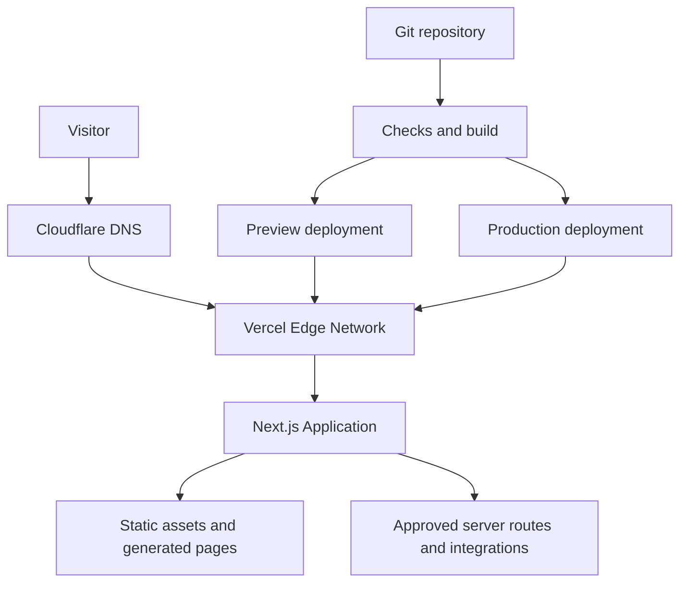

### Request path

1. The browser resolves `ahanassa.com` or `www.ahanassa.com` through Cloudflare DNS.
2. DNS returns the Vercel-configured target.
3. Vercel terminates TLS, applies its edge controls, resolves the active deployment, and serves cached/static content or invokes the required Next.js runtime.
4. The application contacts only allow-listed external services from server-side code where possible.
5. Responses include the security, cache, canonical, and locale headers or metadata defined in the related specifications.

Cloudflare Workers, Cloudflare Pages, a custom reverse proxy, and a separate container platform are **not** part of the baseline architecture.

---

## 4. Environments

| Environment | Source | URL | Data and integrations | Indexing | Purpose |
| --- | --- | --- | --- | --- | --- |
| Local | Developer branch | `http://localhost:3000` | Mock, sandbox, or explicitly approved development services | Not applicable | Implementation and local testing |
| Preview | Pull request or feature branch | Vercel-generated preview URL | Sandbox/test integrations only | Must be blocked from indexing | Review, QA, and stakeholder approval |
| Production | Protected `main` | `https://www.ahanassa.com` | Production integrations only | Indexable according to SEO specifications | Public website |

### Environment isolation rules

- Production credentials must never be available to local or preview builds unless a service has no safe sandbox and the exception is approved.
- Preview must not send real customer notifications, create real CRM leads, charge payments, or modify production records.
- Preview URLs must emit `noindex, nofollow` and should use Vercel deployment protection when stakeholder access permits it.
- `NEXT_PUBLIC_*` values are public by design and must never contain credentials or sensitive identifiers.
- A value required by browser code and a server secret must be treated as two different configuration classes.
- Environment variables are managed in the hosting environment; `.env*` files containing secrets are never committed.

The authoritative variable inventory, owners, validation rules, and rotation policy belong in `ENVIRONMENT_VARIABLES.md`.

---

## 5. Git and Release Model

### Branches

- `main`: production branch; protected; always expected to be deployable.
- Feature branches: short-lived branches named by task, for example `feat/rfq-form` or `fix/mobile-navigation`.
- Emergency fixes: branch from the current production commit, validate through preview, then merge normally unless the incident commander approves an expedited path.

Long-lived `develop` or `staging` branches are not required for the baseline. If a permanent staging environment becomes necessary, introduce it through an architecture decision rather than overloading preview.

### Required pull-request controls

- At least one qualified review for application or infrastructure changes.
- No direct pushes to `main` except an audited emergency procedure.
- Required status checks must pass before merge.
- The pull request must state user impact, test evidence, SEO impact, configuration changes, and rollback considerations.
- Generated files, dependency lockfile changes, migrations, and environment-variable changes must be explicitly called out.
- The merge commit or squash commit must describe the released behavior, not only the internal task name.

### Release identity

Every production release must be traceable to:

- Git commit SHA;
- pull request or approved change record;
- build logs;
- Vercel deployment identifier and URL;
- release timestamp;
- responsible person;
- post-deployment verification result.

---

## 6. Build Contract

The repository is the source of build truth. Dashboard settings may supply secrets and project bindings, but must not silently replace repository behavior.

### Required scripts

The exact package manager is determined by the committed lockfile. The following logical commands must exist, even if the script names vary by an approved repository convention:

```json
{
  "scripts": {
    "dev": "next dev",
    "lint": "next lint",
    "typecheck": "tsc --noEmit",
    "test": "<project test command>",
    "build": "next build",
    "start": "next start"
  }
}
```

If the installed Next.js version does not provide `next lint`, use the repository's ESLint command. Claude Code must inspect the installed version and existing scripts before modifying this block.

### Pinned inputs

- Commit exactly one lockfile.
- Pin the Node.js major version using the repository's approved mechanism.
- Do not use `latest` as a production dependency strategy.
- Dependency upgrades require a separate review when they affect Next.js, React, authentication, forms, analytics, image processing, or deployment adapters.
- CI and Vercel must use the same package manager and compatible Node.js version.

### Build-time validation order

1. Install dependencies with the frozen-lockfile mode.
2. Validate required environment-variable names without printing their values.
3. Run formatting verification if configured.
4. Run linting.
5. Run TypeScript checking.
6. Run unit and component tests.
7. Build the production application.
8. Run route, metadata, internal-link, and generated-file checks.
9. Deploy an immutable preview.
10. Run smoke and end-to-end tests against that preview.

No setting may suppress TypeScript or ESLint build errors merely to make deployment succeed. Fix the defect or document a narrowly scoped, reviewed exception.

---

## 7. Rendering and Runtime Strategy

The site is static-first because Ahan Asa is initially a marketing and procurement website. Choose the least complex runtime that satisfies each route.

| Route type | Preferred behavior | Notes |
| --- | --- | --- |
| Marketing pages | Static generation | Rebuild on content release |
| Articles and resources | Static generation or controlled revalidation | Revalidation policy belongs in the caching specification |
| RFQ/contact interface | Static UI plus secure server endpoint | Validate server-side; apply abuse controls |
| Sitemap and robots | Generated from the canonical route inventory | Must vary correctly by environment |
| Health endpoint | Lightweight dynamic or static response | Must not disclose secrets or internal topology |
| Admin/CMS | Separate protected service if introduced | Never expose an improvised public admin route |

Do not enable a full static export (`output: "export"`) unless every required Next.js feature and integration is compatible with it. Native Vercel static generation is sufficient for a static-first site and preserves the option to add secure route handlers later.

Runtime selection rules:

- Prefer the default supported runtime.
- Use edge runtime only when a measured requirement justifies it and all dependencies are compatible.
- Set function duration and regional behavior deliberately for external integrations.
- Never perform long-running procurement, document-generation, or batch work inside a user-facing request. Queue such work when it is introduced.

---

## 8. Vercel Project Configuration

### Project binding

- One Vercel project maps to the Ahan Asa production website.
- The correct Git repository is connected directly to that project.
- Production branch is `main`.
- Framework preset is Next.js unless an explicit repository configuration requires otherwise.
- Root directory remains the repository root unless the project becomes a reviewed monorepo.
- Build and install commands use framework defaults unless the repository defines intentional overrides.

### Deployment behavior

- Each pull request creates an isolated preview deployment.
- Merging to `main` creates a production candidate.
- Production is considered released only after verification, even if traffic has already moved to the deployment.
- Unverified deployments must not be manually promoted.
- Deployment retention must preserve enough verified releases to support the rollback objective in Section 12.

### Configuration-as-code rule

Use `vercel.json` only for behavior that cannot be expressed more clearly in Next.js configuration or code. Do not duplicate redirects, headers, or rewrites across `next.config.*`, middleware/proxy files, Cloudflare rules, and Vercel settings. Each rule has one owner.

Rule ownership:

| Concern | Primary owner |
| --- | --- |
| Application redirects and rewrites | Next.js configuration or application routing |
| Apex-to-`www` domain redirect | Vercel domain configuration |
| DNS records | Cloudflare DNS |
| Page metadata and canonical URLs | Next.js metadata implementation |
| Static asset caching | Next.js/Vercel defaults plus `CACHING_STRATEGY.md` |
| Security headers | One reviewed application or platform configuration layer |
| Legacy URL map | `REDIRECTS.md` and its generated implementation |

---

## 9. Domain, DNS, TLS, and Redirects

### Target state

| Host | Purpose | Behavior |
| --- | --- | --- |
| `www.ahanassa.com` | Canonical production host | Serves the active Vercel production deployment |
| `ahanassa.com` | Apex alias | Permanent redirect to the matching `www` URL |
| Vercel preview domains | QA only | Non-indexable and not canonical |

### DNS procedure

1. Add both apex and `www` domains to the correct Vercel project.
2. Read the exact DNS targets shown by Vercel; do not copy stale values from another project.
3. Create the required records in Cloudflare DNS.
4. Keep Vercel-bound web records DNS-only by default.
5. Remove conflicting `A`, `AAAA`, or `CNAME` records.
6. Wait for Vercel domain verification and certificate issuance.
7. Configure `www.ahanassa.com` as the primary domain.
8. Configure the apex to redirect to `www`, preserving path and query parameters.
9. Verify HTTP and HTTPS behavior for both hosts.

Do not hard-code example Vercel IP addresses or CNAME targets in this document because Vercel provides the project-specific required values.

### Redirect contract

All of these must resolve in at most one canonical redirect after the HTTP-to-HTTPS hop controlled by the platform:

- `http://ahanassa.com/example?x=1`
- `https://ahanassa.com/example?x=1`
- `http://www.ahanassa.com/example?x=1`
- `https://www.ahanassa.com/example?x=1`

The final URL must be:

`https://www.ahanassa.com/example?x=1`

Avoid redirect chains, loops, dropped query strings, mixed canonical hosts, and locale-changing redirects.

### TLS requirements

- TLS is issued and renewed by the serving platform.
- Production must never be launched while certificate state is pending or invalid.
- HSTS may be enabled only after every required subdomain is confirmed HTTPS-ready. Adding `includeSubDomains` or preload requires a separate irreversible-risk review.

---

## 10. Caching and CDN Responsibilities

Detailed TTLs and invalidation rules belong in `CACHING_STRATEGY.md`. Deployment must observe these boundaries:

- Vercel is the default application CDN and edge cache.
- Hashed framework assets may be cached as immutable.
- HTML, JSON, API responses, redirects, and error pages must not receive blanket “cache everything” rules.
- Authenticated, form, RFQ, preview, and personalized responses must not be publicly cached.
- Cache behavior must be testable from response headers.
- A release process must not depend on manual full-zone purges under the baseline DNS-only design.

If Cloudflare proxying is approved later:

- Bypass cache for Next.js data requests, APIs, forms, preview paths, authenticated requests, and non-GET/HEAD methods.
- Respect application cache headers unless an individual rule has documented ownership.
- Never modify Vercel or Next.js internal request headers without compatibility testing.
- Purge only the necessary cache keys after a release; a full purge is an incident tool, not the normal deployment mechanism.
- Verify that rollback restores both application deployment and edge-visible content.

---

## 11. Deployment Workflow

### A. Pull-request preview

1. Developer creates or updates a feature branch.
2. Local lint, typecheck, tests, and production build pass.
3. A pull request is opened with the required change summary.
4. CI runs all required checks.
5. Vercel creates a preview deployment.
6. Automated smoke and end-to-end tests target the preview URL.
7. Reviewer validates responsive UI, RTL behavior, forms, metadata, accessibility, and the changed user journey.
8. Any new environment variable is configured separately for Preview and Production before merge.
9. Approval is recorded in the pull request.

### B. Production release

1. Merge the approved pull request into protected `main`.
2. Vercel builds an immutable production deployment.
3. Confirm build logs contain no secret values and no unexpected warnings.
4. Run automated production smoke tests.
5. Complete the critical manual checks in Section 14.
6. Record the deployment SHA, timestamp, responsible person, and result in `CHANGELOG.md` or the release record.
7. Monitor errors, availability, Web Vitals, form delivery, and analytics during the observation window.

### C. Manual promotion

Manual promotion of a preview deployment is permitted only when:

- it is tied to the exact reviewed commit;
- all required checks passed against that deployment;
- production environment variables are validated;
- the promoter has production release authority;
- the action and reason are recorded.

Manual deployment from an uncommitted local working tree is prohibited for production.

---

## 12. Rollback and Recovery

### Recovery objectives

- **Deployment rollback target:** begin within 10 minutes of confirming a release-caused critical incident.
- **Service restoration target:** restore the last known-good application within 30 minutes where the hosting platform is operational.
- **Data recovery objective:** defined by each future stateful integration; the baseline marketing build must avoid deployment-coupled state changes.

These are operational targets, not contractual service-level agreements.

### Rollback triggers

- Homepage or critical route returns repeated `5xx` responses.
- RFQ/contact submissions fail or are routed incorrectly.
- A security regression or secret exposure is suspected.
- Canonical, robots, sitemap, or redirect behavior risks widespread SEO damage.
- A severe responsive, RTL, navigation, or accessibility defect blocks the primary user journey.
- Error rate or latency crosses the approved incident threshold.

### Rollback procedure

1. Declare the incident and freeze unrelated production changes.
2. Identify the most recent verified production deployment.
3. Use Vercel's production rollback/promote mechanism to restore it.
4. Verify canonical host, critical routes, static assets, forms, APIs, sitemap, and robots output.
5. If Cloudflare proxying is active under an exception, purge or bypass only stale affected cache entries.
6. Confirm monitoring has returned to normal.
7. Record the incident timeline and open a corrective pull request.

Do not “fix forward” under time pressure when a safe known-good rollback is available. Do not delete the failed deployment; retain it for diagnosis.

### Non-application failures

| Failure | Immediate response |
| --- | --- |
| DNS misconfiguration | Restore the last known-good Cloudflare DNS records; do not change application code |
| Certificate failure | Confirm domain verification and DNS mode; remove conflicting records; avoid unsafe TLS bypasses |
| External CRM/API outage | Degrade gracefully, preserve the lead when feasible, alert operations, and avoid repeated uncontrolled retries |
| Analytics outage | Keep the core website operational; analytics must fail non-blockingly |
| Vercel regional/platform incident | Confirm provider status, avoid repeated redeployments, communicate status, and use the approved disaster-recovery plan if thresholds are met |
| Compromised credential | Revoke and rotate it, redeploy affected environments, audit access, and invalidate exposed sessions or tokens |

---

## 13. Observability and Alerts

### Required signals

- Deployment success/failure and build duration.
- Production availability for the canonical homepage and at least one critical internal route.
- `4xx` and `5xx` trends, separated by route class where possible.
- Server-side exceptions and rejected external integration calls.
- Core Web Vitals and performance regressions.
- RFQ/contact submission success, validation failure, upstream delivery failure, and duplicate rate.
- Sitemap fetch, robots fetch, and canonical-host correctness.
- Analytics/tag-loading health without storing sensitive form data.

### Alert principles

- Alerts must be actionable and identify environment, deployment, route, severity, and first response.
- Production alerts must not expose submitted personal data or secrets.
- Synthetic checks must follow redirects and assert the final canonical URL.
- A successful HTTP status alone is insufficient; critical checks should assert expected content or response structure.
- Alert ownership and escalation destinations must be recorded before launch.

### Release observation window

For ordinary releases, actively observe the production deployment for at least 30 minutes. For domain, DNS, forms, analytics, dependency, framework, or caching changes, extend observation based on risk and traffic.

---

## 14. Required Deployment Checks

### Automated pre-merge gates

- [ ] Frozen-lockfile installation succeeds.
- [ ] Formatting check passes, if configured.
- [ ] Lint passes with no release-blocking warnings.
- [ ] Typecheck passes.
- [ ] Unit and component tests pass.
- [ ] Production build passes.
- [ ] No known high/critical exploitable dependency issue is accepted without documented risk approval.
- [ ] Route inventory contains no unintended duplicate paths.
- [ ] Internal link check passes.
- [ ] Metadata and canonical generation tests pass.
- [ ] Sitemap and robots generation tests pass.
- [ ] Preview smoke tests pass.
- [ ] Preview is non-indexable.

### Manual preview approval

- [ ] Homepage and modified pages match approved specifications.
- [ ] Persian content is RTL; embedded numbers, email, and technical terms render correctly.
- [ ] Mobile, tablet, and desktop layouts work at required breakpoints.
- [ ] Navigation, footer, CTAs, forms, validation, success, and failure states work.
- [ ] Keyboard navigation and visible focus are intact.
- [ ] Images have correct dimensions, loading behavior, and alternatives.
- [ ] No console error appears in the primary journeys.
- [ ] No test content, placeholder, preview URL, or secret is visible.

### Production verification

- [ ] `https://www.ahanassa.com` returns the expected release.
- [ ] Apex, `www`, HTTP, and HTTPS resolve to one canonical host without loops.
- [ ] Path and query strings survive host redirects.
- [ ] TLS certificate is valid.
- [ ] Homepage, key landing page, contact/RFQ page, `404`, sitemap, and robots routes work.
- [ ] Canonical and Open Graph URLs use the production host.
- [ ] Production is indexable only where intended.
- [ ] Form submission reaches the approved destination exactly once.
- [ ] Analytics and consent behavior work without blocking the page.
- [ ] Security and cache headers match their specifications.
- [ ] Monitoring and alerts identify the new deployment.
- [ ] Rollback target is known and retained.

---

## 15. Cloudflare Proxy Exception Checklist

Complete every item before changing a Vercel-bound record from DNS-only to proxied:

- [ ] Business/security reason and approver recorded in `DECISIONS.md`.
- [ ] Vercel's reverse-proxy limitations reviewed for the current platform behavior.
- [ ] Client IP and forwarding headers verified end-to-end.
- [ ] Vercel firewall, deployment protection, bot controls, and rate limits re-tested.
- [ ] Cloudflare SSL mode is strict and the origin certificate path is valid.
- [ ] No cache-everything rule applies to HTML, APIs, forms, previews, or authenticated traffic.
- [ ] Next.js static assets load across releases without stale-build mixing.
- [ ] Redirects do not loop between Cloudflare, Vercel, and Next.js.
- [ ] Preview deployments remain isolated and non-indexable.
- [ ] Rollback test proves users receive the restored version after edge caching.
- [ ] Purge permissions follow least privilege.
- [ ] Monitoring can distinguish Cloudflare-edge errors from Vercel-origin errors.
- [ ] A DNS-only rollback procedure and expected propagation behavior are documented.

If any item fails, retain DNS-only mode.

---

## 16. Security Controls in Deployment

- Production access requires individual accounts, multi-factor authentication, and least privilege.
- Shared credentials and API tokens are prohibited.
- Git, Vercel, Cloudflare, domain registrar, analytics, and integration access must have at least two authorized business owners to prevent single-person lockout.
- Repository secrets must be scanned before merge and in CI where available.
- Build and runtime logs must redact credentials and personal data.
- Dependencies, Next.js, and React security releases must be reviewed promptly; WAF protection is not a substitute for patching.
- Preview URLs must not expose production administration or unprotected diagnostic endpoints.
- Health endpoints return only minimal status information.
- Source maps, debug output, and verbose errors must follow the production security policy.
- Security headers are verified after deployment, not assumed from configuration.
- Domain registrar and Cloudflare changes require change logging and recovery-capable access.

---

## 17. Backups and Disaster Recovery

The deployed website can be reconstructed from Git plus authorized environment configuration. This does not automatically protect content or data held by external services.

### Required recoverable assets

- Git repository and release history.
- Production environment-variable inventory and rotation ownership; secret values remain in an approved secret system.
- Cloudflare DNS zone record export or documented record inventory.
- Vercel project/domain configuration record.
- CMS content export when a CMS is introduced.
- RFQ/CRM records according to the business retention policy.
- Media originals stored outside generated build output.

### Recovery test

At least twice per year, or after a major hosting/domain architecture change, verify that an authorized operator can:

1. identify the production commit;
2. reconstruct required configuration without copying secrets into chat or tickets;
3. create a working isolated deployment;
4. validate the canonical route set and forms;
5. restore DNS from the approved inventory.

---

## 18. Responsibilities

| Role | Responsibility |
| --- | --- |
| Product owner | Approves user-visible scope and planned launch timing |
| Technical owner | Owns architecture, release readiness, rollback, and incident decisions |
| Developer / Claude Code operator | Implements changes, runs required checks, and records configuration impact |
| Reviewer | Reviews code, architecture, security, SEO, and test evidence |
| Content/SEO owner | Approves indexability, metadata, redirects, sitemap, and canonical behavior |
| Operations owner | Verifies leads/integrations and receives production alerts |
| Domain administrator | Controls registrar and Cloudflare changes with recoverable access |

One person may hold multiple roles, but the responsibilities do not disappear.

---

## 19. Claude Code Rules

Claude Code must:

1. Read this file and the related specifications before deployment-related edits.
2. Inspect the repository, lockfile, installed versions, and existing provider configuration before proposing commands.
3. Never guess DNS targets, project IDs, team IDs, secret names, regions, or account settings.
4. Never print, commit, copy, or expose secret values.
5. Never bypass lint, type, test, or build failures to obtain a green deployment.
6. Never deploy an uncommitted or unexplained working tree to production.
7. Never alter production DNS, domains, environment variables, cache rules, or protection settings without explicit authorization.
8. Show the exact scope, risk, verification plan, and rollback path before a production infrastructure change.
9. Preserve unrelated user changes in a dirty working tree.
10. Update this document and `DECISIONS.md` when the actual deployment architecture changes.

### Stop conditions

Claude Code must stop and request direction when:

- the target Vercel project, Git repository, Cloudflare zone, or canonical domain is ambiguous;
- production secrets or account permissions are missing;
- a destructive DNS/domain change would remove a working production target;
- preview and production environment values cannot be safely separated;
- required checks fail and the requested action would bypass them;
- a database or external system change has no verified rollback path;
- the observed production architecture conflicts with this approved baseline.

---

## 20. Initial Setup Checklist

- [ ] Confirm the correct Git repository and owners.
- [ ] Protect `main` and configure required checks.
- [ ] Commit one lockfile and pin the Node.js major version.
- [ ] Create or connect the Vercel project.
- [ ] Configure separate Preview and Production variables.
- [ ] Add `ahanassa.com` and `www.ahanassa.com` to Vercel.
- [ ] Configure project-specific Cloudflare DNS records in DNS-only mode.
- [ ] Set `www.ahanassa.com` as canonical and apex as redirect.
- [ ] Verify TLS and the four host/protocol combinations.
- [ ] Add preview `noindex` protection.
- [ ] Configure CI build and test gates.
- [ ] Add uptime, error, form-delivery, and Web Vitals monitoring.
- [ ] Perform one preview-to-production rehearsal.
- [ ] Perform and record one rollback rehearsal before public launch.
- [ ] Record owners and emergency access for Git, Vercel, Cloudflare, registrar, analytics, and integrations.

---

## 21. Acceptance Criteria

This architecture is implemented when:

- every production release originates from an identifiable reviewed commit;
- every pull request receives an isolated, non-indexable preview;
- the production build cannot pass by ignoring type or lint errors;
- `https://www.ahanassa.com` is the only canonical production host;
- apex and protocol redirects preserve path and query without loops;
- Cloudflare DNS and Vercel responsibilities are unambiguous;
- preview and production secrets and integrations are isolated;
- critical paths, forms, SEO outputs, and monitoring are verified after release;
- a known-good deployment can be restored within the rollback target;
- production access, recovery ownership, and incident escalation are documented.

---

## 22. Open Decisions

Resolve these before the affected feature enters production:

| Decision | Current state | Owner |
| --- | --- | --- |
| Git repository URL and default organization | TBD | Technical owner |
| Package manager and lockfile | TBD until repository inspection | Technical owner |
| Pinned Node.js major version | TBD until framework version is selected | Technical owner |
| Production form/RFQ destination | TBD | Product and operations owners |
| Error monitoring provider | TBD | Technical owner |
| Synthetic uptime provider and alert channel | TBD | Operations owner |
| Analytics and consent implementation | TBD; see `ANALYTICS_TRACKING.md` | Marketing/technical owners |
| CMS and content publication workflow | TBD; see `CMS_ARCHITECTURE.md` | Content/technical owners |
| Permanent staging environment | Not required initially | Technical owner |
| Cloudflare proxy in front of Vercel | Not approved; DNS-only baseline | Technical/security owners |
| Disaster-recovery hosting alternative | Deferred until justified by business impact | Technical/product owners |

---

## 23. Official References

- [Vercel — Deployments](https://vercel.com/docs/deployments)
- [Vercel — Environments](https://vercel.com/docs/deployments/environments)
- [Vercel — Adding and configuring a custom domain](https://vercel.com/docs/domains/working-with-domains/add-a-domain)
- [Vercel — Deploying and redirecting domains](https://vercel.com/docs/domains/working-with-domains/deploying-and-redirecting)
- [Vercel — Reverse proxy servers and Vercel](https://vercel.com/docs/security/reverse-proxy)
- [Vercel — Production rollback](https://vercel.com/docs/deployments/rollback-production-deployment)
- [Next.js — Deploying](https://nextjs.org/docs/app/getting-started/deploying)
- [Next.js — Environment variables](https://nextjs.org/docs/app/guides/environment-variables)
- [Cloudflare — DNS records](https://developers.cloudflare.com/dns/manage-dns-records/)

---

## 24. Change Control

Update this document in the same pull request whenever any of these changes:

- hosting provider or runtime;
- Git branching or production trigger;
- canonical domain or redirect owner;
- Cloudflare DNS/proxy mode;
- build command, output mode, package manager, or Node.js version policy;
- environment model;
- release gates;
- caching ownership;
- rollback method or objectives;
- monitoring and alert ownership;
- disaster-recovery strategy.

Each update must include the reason, risk, migration steps, verification evidence, and rollback plan in `DECISIONS.md`.
# Ahan Asa Website — UI/UX Design Direction

> **Brand:** Ahan Asa | آهن آسا  
> **Domain:** `ahanassa.com`  
> **Document:** `DESIGN_DIRECTION.md`  
> **Status:** Draft v1.0 — Design direction for approval  
> **Last updated:** 2026-08-25  
> **Primary experience:** Persian-first, fully RTL  
> **Core idea:** **Calm control for high-value steel procurement**

---

## 1. Purpose of This Document

This document defines the intended visual and experiential direction of the Ahan Asa website. It translates the approved business positioning and brand character into practical UI/UX guidance for designers, developers, content teams, and Claude Code.

It answers:

- What should the website feel like?
- What should a visitor understand in the first few seconds?
- How should the brand's promise of protecting the client's capital become visible in the interface?
- How should information, proof, navigation, forms, imagery, and motion work together?
- What design directions are explicitly out of scope?

This document defines creative intent and experience rules. Exact tokens, font sizes, spacing values, breakpoints, component variants, and code-level specifications belong in `DESIGN_SYSTEM.md`, `TYPOGRAPHY_SYSTEM.md`, `RESPONSIVE_RULES.md`, and `UI_COMPONENTS.md`.

### 1.1 Source hierarchy

Design decisions must follow this order:

1. `PROJECT_BRIEF.md` — business, audience, scope, and product truth
2. `BRAND_GUIDELINES.md` — approved brand identity and asset rules
3. `DESIGN_DIRECTION.md` — visual and experiential direction
4. `DESIGN_SYSTEM.md` — tokens and repeatable UI rules
5. Page and component specifications — implementation detail

If a later document conflicts with an approved brand or business decision, stop and resolve the conflict before implementation.

---

## 2. The Design Thesis

### 2.1 One-sentence direction

**Ahan Asa should feel like a composed procurement office that brings order, clarity, and protection to a complicated steel purchase—not like a steel bazaar, price board, warehouse catalog, or consumer e-commerce store.**

### 2.2 Experience metaphor

The digital experience should resemble an **executive procurement desk**:

- The client's request is received clearly.
- Complexity is handled behind the scenes.
- Decisions are explained in plain language.
- The next step is always visible.
- Evidence replaces exaggerated promises.
- The interface remains calm even when the underlying market is complex.

### 2.3 Core experiential promise

The user should feel:

> “I can send my invoice or material list, understand what happens next, and trust that this process will be handled responsibly.”

This is the UI/UX expression of the approved brand promise:

> **ما مراقب سرمایه شما هستیم.**

---

## 3. Desired User Perception

Within the first screen and first navigation interaction, the website should communicate:

1. Ahan Asa manages steel purchasing; it is not merely another seller.
2. The user can begin with an existing invoice or material list.
3. The company understands both commercial and technical procurement risk.
4. The process is structured, accountable, and understandable.
5. The visual quality reflects the seriousness of a high-value B2B decision.

### 3.1 Desired emotional sequence

The experience should move the visitor through this sequence:

**Uncertainty → Recognition → Clarity → Trust → Confident action**

### 3.2 Desired brand attributes

- Precise
- Protective
- Trustworthy
- Calm
- Commercially intelligent
- Technically aware
- Modern
- Premium but practical
- Human without becoming casual

### 3.3 Perceptions to avoid

- Cheap or discount-led
- Aggressive sales-oriented
- Traditional iron shop
- Commodity trading terminal
- Large impersonal marketplace
- Overly technical engineering software
- Luxury without operational substance
- Startup-style novelty without trust

---

## 4. Non-Negotiable Experience Principles

### 4.1 Protection must be expressed through clarity

“Protecting capital” must not be presented only as a slogan. It should be visible through:

- Clear scope and responsibilities
- Transparent process stages
- Explicit next steps
- Honest limitations
- Legible comparisons
- Evidence and documentation
- Clear form expectations
- No hidden or misleading interactions

### 4.2 Complexity stays behind the interface

The customer should not be forced to navigate a large catalog, understand supplier terminology, or make unnecessary decisions before contacting Ahan Asa.

The interface should progressively reveal detail only when it helps the next decision.

### 4.3 Industrial intelligence without industrial clutter

The website may use steel, documentation, logistics, and technical imagery, but it must not rely on visual clichés such as dark metallic textures, sparks, flames, excessive black backgrounds, or heavy mechanical decoration.

### 4.4 Premium means restrained, not decorative

Premium quality should come from typography, composition, whitespace, photography, interaction quality, and precise implementation—not from gold effects, glossy surfaces, large gradients, or excessive animation.

### 4.5 Proof before claims

Real process evidence, redacted documents, verified procurement cases, supplier evaluation logic, and clear methodology should carry more visual weight than unsupported adjectives.

### 4.6 Persian must feel native

The website must be designed from the beginning for Persian reading behavior and RTL interaction. It must never feel like an English layout mirrored at the final stage.

### 4.7 Every page should support a decision

Each page must help the visitor do at least one of the following:

- Understand the service
- Evaluate trust
- Clarify fit
- Learn the process
- Prepare the required information
- Submit an invoice, material list, or inquiry

---

## 5. Visual Territory

### 5.1 Approved territory

**Premium industrial advisory**

This territory combines:

- Editorial clarity
- Procurement discipline
- Industrial credibility
- Financial responsibility
- Quiet confidence
- Human guidance

### 5.2 Visual keywords

- Structured
- Spacious
- Composed
- Geometric
- Editorial
- Document-driven
- Responsible
- Tactile but clean
- Strong but not heavy

### 5.3 Productive tension

The identity should balance the following pairs:

| Industrial strength | Human reassurance |
| --- | --- |
| Precision | Simplicity |
| Authority | Approachability |
| Premium quality | Practical action |
| Technical awareness | Plain-language guidance |
| Strong geometry | Generous whitespace |

Neither side should dominate completely.

---

## 6. Color Direction

### 6.1 Approved brand colors

- **Steel Navy:** `#0B2545`
- **Forge Copper:** `#B04A2F`
- **White:** `#FFFFFF`

### 6.2 Role of Steel Navy

Steel Navy is the primary expression of trust, control, seriousness, and technical authority. Use it for:

- Primary typography
- Key navigation states
- High-confidence sections
- Primary controls where appropriate
- Important diagrams and structural lines
- Dark editorial bands used sparingly

The site should not become a continuous dark-navy interface. Large dark sections must be balanced with bright, breathable surfaces.

### 6.3 Role of Forge Copper

Forge Copper is an accent, not a dominant background color. It should communicate human attention, decision points, protection, and action.

Preferred uses:

- Small emphasis marks
- Active states
- Selected data points
- Key icons or line details
- Limited CTA emphasis
- Editorial annotations

Avoid large copper panels, copper-on-copper combinations, or using the accent on every interactive element.

### 6.4 Role of white and neutrals

White is the primary spatial field and should create clarity and calm. Any additional neutral grays, warm whites, borders, semantic colors, or derived tints must be defined centrally in `COLOR_SYSTEM.md`; they must not be invented independently inside components.

### 6.5 Color behavior

- Brand colors must retain accessible contrast.
- Color must never be the only indicator of status or selection.
- Success, warning, error, and information colors must remain semantically distinct from Forge Copper.
- Gradients are not part of the default visual language. Any exceptional use requires explicit approval.

---

## 7. Typography Direction

### 7.1 Persian typography character

Persian typography should feel:

- Modern
- Geometric
- Corporate
- Highly legible
- Confident without appearing loud
- Compatible with the approved Persian logotype direction

**Estedad** is the primary visual reference and preferred candidate, subject to final licensing, performance, and technical approval. If another family is selected, it must preserve the same modern, balanced, and non-calligraphic character.

### 7.2 Hierarchy

- Headlines should be editorial and decisive, with controlled line length.
- Body text should be comfortable for technical and commercial explanations.
- Labels, metadata, and process states should be concise and visually disciplined.
- Large type is encouraged only where it strengthens meaning; it must not create inefficient mobile layouts.
- Excessive bold text weakens hierarchy and should be avoided.

### 7.3 Persian text quality

- Use correct Persian punctuation and نیم‌فاصله.
- Prevent isolated short words at line endings when practical.
- Avoid narrow text columns that produce fragmented Persian rhythm.
- Use Persian or Latin numerals according to the approved content rule, not component-by-component preference.
- Phone numbers, URLs, file names, product codes, dimensions, and technical values require explicit mixed-direction handling.

### 7.4 Latin typography

Latin text is secondary on the Persian site. It should support technical data and the English brand name without competing with Persian content. The final Persian/Latin pairing belongs in `TYPOGRAPHY_SYSTEM.md`.

---

## 8. Layout and Composition

### 8.1 Overall composition

The site should use a precise responsive grid, strong alignment, generous whitespace, and a limited number of high-value modules per viewport.

Preferred characteristics:

- Clear editorial bands rather than endless identical cards
- Alternation between narrative, evidence, and action
- Strong section openings
- Controlled asymmetry on large screens
- Simple, linear reading order on mobile
- Deliberate empty space around important decisions

### 8.2 Density

Content density should be **moderate and intentional**:

- More spacious than a marketplace
- More informative than a luxury campaign site
- Less dense than an ERP dashboard
- More structured than a generic corporate brochure

### 8.3 Containers and alignment

- Use consistent content boundaries across pages.
- Allow selected media or color fields to extend beyond the text grid only when they support hierarchy.
- Align headings, body copy, proof, and CTAs to a visible system.
- Avoid decorative misalignment that weakens precision.
- Avoid horizontal scrolling except for intentionally designed data tables with a clear mobile treatment.

### 8.4 Shape language

The approved logo is geometric and architectural. UI geometry should echo its precision without copying the symbol into every element.

- Corners may be subtly softened, not excessively rounded.
- Cards must not look like playful app tiles.
- Lines, dividers, frames, and document-like panels are preferred to ornamental containers.
- Pills should be reserved for true tags, filters, or statuses—not used as the default shape for all buttons and labels.

---

## 9. Surface, Depth, and Materiality

### 9.1 Surface direction

The primary surface language is flat, clean, and architectural. Depth should come from layering, spacing, borders, and subtle shadows rather than glossy effects.

### 9.2 Shadows

Use shadows only to explain elevation or focus:

- Header separation during scroll
- Active upload area
- Dialogs and overlays
- Floating mobile actions when required

Avoid dramatic card shadows, glow, inner bevels, or fake metallic depth.

### 9.3 Texture

Subtle real-world texture may appear inside approved photography. Do not apply steel grain, brushed metal, noise, carbon fiber, rust, sparks, or ornamental texture as generic UI backgrounds.

### 9.4 Glassmorphism

Glassmorphism is not part of the default system. If used at all, it must be limited to a specific media-overlay context, remain readable, and have a robust fallback.

---

## 10. Global Navigation and Website Shell

### 10.1 Header

The header should feel quiet, stable, and easy to scan.

It should prioritize:

- Clear brand identification
- A short, task-oriented navigation
- One primary conversion action
- Correct RTL order and predictable keyboard behavior

The primary action should center on sending an invoice/material list or starting a procurement inquiry. It must remain visible without turning the header into a promotional banner.

### 10.2 Navigation behavior

- Use plain-language labels.
- Avoid deep mega-menus in Phase 1 unless the approved sitemap genuinely requires them.
- Show clear current-page state.
- On mobile, use a fast, accessible navigation pattern with no hidden critical path.
- Do not force users to select a product category before they understand the service.

### 10.3 Footer

The footer should provide reassurance and orientation, not a dense keyword dump. It should contain:

- Essential navigation
- Contact channels
- Legal and privacy links
- Approved company identity
- A restrained final CTA
- Optional concise explanation of Ahan Asa's role

---

## 11. Homepage Experience Direction

The homepage should tell one coherent story. It must not behave like a list of disconnected promotional modules.

### 11.1 Recommended narrative order

#### 1. Hero — role, value, and first action

The first screen should answer:

- What does Ahan Asa do?
- Who is it for?
- What should I do next?

Working message direction, pending `COPY_GUIDELINES.md` approval:

> **خرید آهن را به یک تصمیم مطمئن تبدیل کنید.**  
> فاکتور یا لیست خریدتان را بفرستید؛ آهن آسا فرآیند بررسی، انتخاب و تأمین را برای شما مدیریت می‌کند.

Working CTA direction:

- Primary: **ارسال فاکتور یا لیست خرید**
- Secondary: **آشنایی با فرآیند خرید**

The hero should not open with daily prices, a product grid, generic claims, or an image of anonymous warehouse inventory.

#### 2. Problem recognition

Show that the risk is larger than unit price: specification, supplier, availability, timing, documentation, payment terms, logistics, and delivery.

The user should feel understood, not frightened.

#### 3. Ahan Asa's role

Explain the difference between a conventional seller and a procurement manager. A concise comparison or two-column explanation may be used if it remains respectful and evidence-based.

#### 4. How the process works

Present a short, understandable sequence:

1. Send invoice or list
2. Review requirements
3. Evaluate sourcing options
4. Present a clear proposal
5. Confirm purchase
6. Coordinate supply and delivery within the agreed scope

The interface may summarize stages, but must not imply automated capabilities that do not yet exist.

#### 5. Protection pillars

Communicate the four value pillars:

- Requirement clarity
- Sourcing control
- Commercial protection
- Delivery coordination

Do not turn these into four generic equal cards by default. Use a more editorial composition when possible.

#### 6. Evidence and trust

Use verified evidence such as real process samples, approved cases, redacted documents, credentials, or transparent methodology. If evidence is limited, show the process honestly instead of fabricating statistics.

#### 7. Relevant capabilities or material categories

Provide orientation without turning the homepage into a catalog. Categories should help a user identify fit and continue to the right page.

#### 8. Guidance and resources

Feature useful content that helps visitors make safer procurement decisions.

#### 9. FAQ and objection handling

Answer practical questions about scope, required information, response process, pricing validity, delivery, documentation, and what Ahan Asa does not do.

#### 10. Final action

End with a clear, low-friction invitation to send the existing invoice or material list, along with a concise explanation of what happens after submission.

---

## 12. Page Archetypes

### 12.1 Capability or service page

Recommended structure:

1. User situation
2. Scope of service
3. Risks or decisions managed
4. Ahan Asa approach
5. Required client input
6. Process and deliverables
7. Evidence
8. FAQ
9. Relevant inquiry CTA

### 12.2 Material category page

Material pages should support procurement intent without becoming unverified live catalogs.

Recommended structure:

1. Category overview
2. Common purchase contexts
3. Key specification and documentation considerations
4. Procurement risks
5. What information the client should send
6. Ahan Asa's role
7. Related resources
8. Inquiry CTA

### 12.3 Process page

The process page should turn operational complexity into an understandable, accountable sequence. Use stages, responsibilities, inputs, outputs, and decision gates. Avoid a decorative timeline that lacks real information.

### 12.4 Evidence or case-study page

Recommended structure:

1. Client situation
2. Purchasing requirement
3. Risk or constraint
4. Procurement response
5. Coordination and documentation
6. Verified outcome
7. Lessons or relevant method
8. CTA for a similar requirement

### 12.5 Resource or article page

Prioritize reading comfort, clear hierarchy, useful diagrams, related content, and a contextual CTA. Do not interrupt educational content with repeated aggressive conversion blocks.

### 12.6 Contact and RFQ pages

These pages should reduce anxiety and clarify:

- What the user should send
- Accepted information and file types
- What will happen next
- Expected communication channel
- Privacy and handling of documents
- Alternative contact path if upload fails

---

## 13. Primary Conversion Experience

### 13.1 Conversion concept

The primary conversion is not “Buy now.” It is:

**Send an existing invoice or material list and begin a managed procurement conversation.**

### 13.2 Form philosophy

- Ask only for information needed for a useful first response.
- Use progressive disclosure for optional project detail.
- Allow the user to submit a request even if some commercial details are unknown.
- Explain why sensitive project documents are requested.
- Preserve entered data when recoverable validation errors occur.
- Use direct, specific validation messages.
- Provide a clear fallback contact method.
- Do not imply that document analysis is automated if it is manually reviewed in V1.

### 13.3 Upload experience

The upload interface should:

- Make file selection obvious on desktop and mobile
- Show accepted formats and size limits before selection
- Display file name, state, and removal control
- Support keyboard interaction
- Distinguish upload progress, validation, success, and failure
- Confirm successful receipt without promising a quote or delivery time prematurely

### 13.4 Post-submission state

The confirmation should state:

- The request was received
- What the team will review
- What the next contact step is
- How the user can add missing information
- A reference number, only if the system actually generates one

Avoid generic “Thank you” screens with no operational guidance.

---

## 14. Component-Level Direction

### 14.1 Buttons

- Primary actions should be unmistakable but not oversized.
- Button labels should describe the result of the action.
- Use one dominant primary action per section.
- Secondary and text actions should remain visually distinct.
- Do not use copper for every button by default.

### 14.2 Cards

Cards should group meaningful, independent content. Avoid wrapping every paragraph, icon, metric, and link in a card.

Preferred alternatives include:

- Editorial lists
- Bordered rows
- Split layouts
- Document panels
- Comparison bands
- Anchored annotations

### 14.3 Process steps

Process UI should clarify sequence, current understanding, input, and outcome. Numbered stages and restrained connecting lines are preferred over playful illustrations.

### 14.4 Tables and comparisons

Tables should be used when exact comparison improves a purchasing decision. They require:

- Clear column meaning
- RTL-aware alignment
- Proper handling of numbers and technical units
- A usable mobile strategy
- No color-only interpretation

### 14.5 Accordions

Use accordions for secondary questions, not to hide essential service scope or critical conversion information.

### 14.6 Status and feedback

System feedback should be immediate, calm, specific, and accessible. Do not use alarming language for recoverable form errors.

---

## 15. Imagery and Art Direction

### 15.1 Image purpose

Every image should support one of these functions:

- Show real materials or purchasing context
- Explain a process
- Provide evidence
- Humanize professional service
- Clarify scale, documentation, logistics, or delivery

### 15.2 Preferred image families

- Real steel materials photographed with clean composition
- Procurement documents, lists, drawings, and controlled desk scenes
- Supplier or material inspection, when genuine and approved
- Loading, logistics, and delivery coordination
- Detail photography showing specification and traceability
- Professional human interaction in real work contexts
- Abstract architectural compositions derived from the approved brand geometry

### 15.3 Photographic style

- Natural or controlled neutral light
- Strong composition and negative space
- Accurate material color
- Documentary credibility
- Restrained grading
- Clear focal point
- No exaggerated HDR or cinematic orange-and-blue treatment

### 15.4 Prohibited imagery

- Images implying ownership of unverified factories, warehouses, fleets, or inventory
- Generic handshakes
- Anonymous stock-business teams posing at screens
- Sparks, molten metal, flames, or workers included only as industrial decoration
- AI-generated facilities or projects presented as real evidence
- Repeated warehouse panoramas with no informational purpose
- Decorative images that compete with the primary CTA

### 15.5 AI-generated imagery

AI-generated visuals may be used only as clearly non-evidentiary conceptual artwork. They must never represent a real client, project, facility, stock level, supplier, delivery, or operational capability.

---

## 16. Iconography, Diagrams, and Data

### 16.1 Icon style

- Simple geometric construction
- Consistent stroke and optical weight
- Legible at small sizes
- Functional rather than decorative
- Compatible with RTL direction where meaning is directional

Avoid mixing multiple icon families or using generic 3D industrial icons.

### 16.2 Diagrams

Use diagrams when they reduce cognitive load. Good candidates include:

- Procurement stages
- Responsibility boundaries
- Supplier evaluation factors
- Document flow
- Inquiry-to-delivery sequence

Diagrams must remain understandable without animation and should stack logically on mobile.

### 16.3 Metrics and data

- Display only verified metrics.
- Provide units, context, and source meaning.
- Do not use animated counters for decorative impact.
- Do not fabricate market feeds, price trends, partner counts, delivery rates, or project statistics.

---

## 17. Motion and Micro-Interaction

### 17.1 Motion character

Motion should feel:

- Controlled
- Precise
- Quiet
- Responsive
- Purposeful

### 17.2 Appropriate uses

- Subtle entrance of major editorial content
- Clear hover and focus feedback
- Upload and form state transitions
- Navigation state changes
- Process-step emphasis
- Lightweight visual explanation of sequence

### 17.3 Motion limits

- No motion may delay access to content or conversion.
- Avoid parallax-heavy sections, cursor effects, continuous loops, or decorative floating objects.
- Avoid loading screens unless technically necessary.
- Respect `prefers-reduced-motion`.
- Core meaning must remain available with motion disabled.

Exact duration, easing, distance, and stagger rules belong in `MOTION_GUIDELINES.md`.

---

## 18. Responsive and Mobile Direction

### 18.1 Mobile is a primary procurement entry point

The mobile experience must not be a compressed desktop layout. It should prioritize:

- Immediate role clarity
- Easy contact and document submission
- Short, readable content blocks
- Large enough interactive targets
- Simple navigation
- Stable layout during media and font loading

### 18.2 Responsive behavior

- Editorial split layouts should become a clear single reading sequence.
- Evidence and context must remain adjacent after stacking.
- Process diagrams should reflow vertically.
- Tables require responsive transformation or controlled horizontal access.
- CTAs may become full-width where useful, but should not create permanent visual pressure.
- Sticky mobile actions may be used only when they do not cover content or compete with form completion.

### 18.3 Content priority

Responsive layouts must preserve information hierarchy, not only component order. The mobile user should encounter role, value, trust, and action in the correct sequence.

---

## 19. RTL and Bidirectional Content

### 19.1 RTL is structural

RTL must govern:

- Grid and content flow
- Navigation order
- Breadcrumbs
- Icon direction
- Form alignment
- Tables
- Process sequence
- Carousel controls, if any
- Back/forward meaning

### 19.2 Mixed-direction data

Use explicit direction handling for:

- Phone numbers
- Email addresses
- URLs
- File names
- Product codes
- Dimensions and units
- Dates when Latin formatted
- Currency and quantities

Do not depend on browser auto-detection for critical data.

### 19.3 Mirroring rule

Mirror directional controls and sequences when meaning requires it. Do not mirror logos, non-directional icons, product photographs, or symbols whose meaning would change.

---

## 20. Accessibility Direction

Accessibility is part of premium quality and release acceptance.

The design must support:

- WCAG-aligned color contrast
- Visible keyboard focus
- Logical focus order
- Semantic heading hierarchy
- Clear labels and instructions
- Error identification and recovery
- Sufficient touch targets
- Zoom and text resizing
- Reduced motion
- Screen-reader-friendly upload and form status
- Content comprehension in plain Persian

Do not remove focus outlines without providing a stronger accessible alternative. Placeholder text must not replace labels.

Exact standards and test procedures belong in `ACCESSIBILITY.md` and `ACCESSIBILITY_QA.md`.

---

## 21. Performance as a Design Constraint

The premium experience must feel fast and stable.

- The hero must not depend on a heavy autoplay video.
- Important content must not wait for decorative JavaScript.
- Images must have defined dimensions and responsive sources.
- Fonts must be loaded strategically to minimize layout shift.
- Animation libraries must be justified by real experience value.
- Above-the-fold media should be visually strong but byte-efficient.
- The primary conversion path must remain usable on slow or unstable mobile connections.

Performance requirements belong in `PERFORMANCE_GUIDELINES.md`; design review must reject concepts that cannot meet them reasonably.

---

## 22. Trust Design

Trust should be designed as a system, not a logo strip.

### 22.1 Preferred trust signals

- Clear explanation of Ahan Asa's role
- Named and understandable process
- Real team or accountable contact identity, when approved
- Redacted sample documentation
- Verified cases and outcomes
- Transparent quotation validity and scope language
- Clear privacy and document-handling explanation
- Real business and contact information
- Useful educational content
- Consistent response expectations

### 22.2 Trust signals to reject

- Unverified client logos
- Fake testimonials
- Generic awards
- Unsupported “best price” claims
- Invented years of experience
- Fabricated counters
- False scarcity
- Fake real-time purchase notifications
- Security badges without actual meaning

---

## 23. Content and Interface Relationship

The interface should make expert content easier to understand, not reduce everything to slogans.

### 23.1 Copy rhythm

Preferred section rhythm:

1. Clear decision-oriented heading
2. One concise explanatory statement
3. Evidence, process, or useful detail
4. One relevant next action

### 23.2 Language behavior

- Lead with the client's decision and risk.
- Explain specialist terms when they are necessary.
- Use calm, accountable language.
- Avoid fear-driven copy.
- Avoid generic self-praise.
- Avoid repeating the slogan in every section.

Final wording remains governed by `COPY_GUIDELINES.md`.

---

## 24. Explicit Do / Do Not Rules

### Do

- Create a Persian-native RTL experience.
- Use whitespace to communicate control.
- Make “send invoice or material list” the clearest entry path.
- Explain what happens after every important action.
- Use verified process and evidence.
- Use navy as the primary authority color and copper as a restrained accent.
- Design for non-expert understanding without reducing credibility for professional buyers.
- Make forms and file upload excellent on mobile.
- Use clear comparison, process, and responsibility models.
- Keep the experience fast, accessible, and calm.

### Do not

- Build the homepage as a product marketplace.
- Lead with a steel price ticker or price-per-kilogram promise.
- Use the visual language of a traditional آهن‌فروشی.
- Cover every section with cards.
- Use heavy gradients, metallic textures, glow, bevel, or excessive glass effects.
- Use copper as the dominant page background.
- Use fake statistics, clients, facilities, inventory, or projects.
- Hide important scope inside accordions.
- Force the user to understand steel taxonomy before contacting Ahan Asa.
- Create long or animated flows that delay invoice submission.
- Alter the approved logo geometry.

---

## 25. Initial Prototype Priorities

Before designing every page, validate these five experience areas:

1. **Desktop homepage hero and first narrative sequence**
2. **Mobile homepage and navigation**
3. **Invoice/material-list submission flow**
4. **Process explanation module**
5. **Evidence/case-study presentation pattern**

Prototype testing should answer:

- Can a new visitor explain Ahan Asa's role after the first screen?
- Does the site feel like a procurement partner rather than a seller?
- Can the user find the invoice submission path immediately?
- Does the user understand what happens after submission?
- Does the interface feel trustworthy without relying on unsupported claims?
- Is the mobile flow comfortable for document upload and contact entry?

---

## 26. Acceptance Criteria for the Design Direction

A proposed design is aligned only if all of the following are true:

- The first screen communicates role, value, audience, and action.
- The visual system feels premium, industrial, calm, and credible.
- The experience is visibly different from a commodity marketplace.
- Persian typography and RTL composition feel native.
- The approved logo and colors are used correctly.
- Copper is restrained and purposeful.
- The homepage follows a coherent decision journey.
- The invoice/material-list path is prominent and low-friction.
- Process, scope, and next steps are understandable to a non-expert buyer.
- Professional buyers can still find sufficient technical and commercial substance.
- Trust is based on real information and evidence.
- Mobile, accessibility, and performance constraints are reflected in the design itself.
- No concept depends on fake prices, statistics, projects, facilities, or capabilities.

If a concept is visually attractive but fails these criteria, it is not approved.

---

## 27. Implementation Mandates for Claude Code

Claude Code must:

1. Read `PROJECT_BRIEF.md`, `BRAND_GUIDELINES.md`, this document, and the approved system specifications before creating production UI.
2. Treat Persian RTL behavior as a foundational layout requirement.
3. Preserve the approved master logo geometry and asset proportions.
4. Use centralized tokens and components; do not introduce ad hoc colors, spacing, radii, or shadows.
5. Maintain one clear primary action per major section.
6. Keep the invoice/material-list submission path functional and visible across responsive layouts.
7. Never fabricate content, claims, metrics, testimonials, prices, facilities, suppliers, or projects to complete a layout.
8. Use honest placeholders clearly marked for replacement when final assets are unavailable.
9. Implement accessible focus, forms, upload states, errors, and reduced-motion behavior from the start.
10. Protect performance by avoiding unnecessary client-side rendering and decorative dependencies.
11. Stop and report any conflict between this document and an approved higher-authority document.
12. Record material design deviations in `DECISIONS.md` before implementation.

---

## 28. Items Requiring Later Definition

The following are intentionally not finalized here:

- Final font family, weights, and loading method
- Exact type scale
- Exact spacing and grid tokens
- Exact corner radii and shadow tokens
- Full neutral and semantic color palette
- Final page inventory and routes
- Final Persian navigation labels
- Final CTA wording
- Final form fields and integrations
- Approved photography library
- Verified case studies, client marks, and metrics
- Exact motion values
- Accessibility conformance target and QA tooling
- Final breakpoints and responsive component rules

These decisions must be completed in their relevant documents and must remain consistent with this direction.

---

## 29. Final Direction Statement

The Ahan Asa website should transform a complicated industrial purchase into a clear, reassuring, and accountable digital journey.

It should look premium because it is disciplined. It should feel protective because it is transparent. It should feel intelligent because complexity has been organized—not displayed for effect.

The final experience must make the brand promise tangible:

> **ما مراقب سرمایه شما هستیم.**

# Ahan Asa Website — Design System

> **Brand:** Ahan Asa | آهن آسا  
> **Domain:** `ahanassa.com`  
> **Document:** `DESIGN_SYSTEM.md`  
> **Status:** Draft v1.0 — Implementation contract  
> **Last updated:** 2026-08-25  
> **Primary experience:** Persian (Farsi), fully RTL  
> **Primary users:** Professional B2B steel buyers, project owners, contractors, EPC teams, procurement managers, and technical decision-makers

---

## 1. Purpose

This document defines the reusable visual foundations, design tokens, interaction rules, component states, and implementation constraints for the Ahan Asa website.

It translates the strategic direction in `PROJECT_BRIEF.md`, the identity rules in `BRAND_GUIDELINES.md`, and the experience principles in `DESIGN_DIRECTION.md` into a system Claude Code and human contributors can implement consistently.

The system must make Ahan Asa feel like a premium steel procurement management partner: precise, composed, protective, technically aware, commercially disciplined, and trustworthy. It must not resemble a crowded steel marketplace, consumer e-commerce store, generic construction template, or speculative price dashboard.

This document is normative. The words **MUST**, **MUST NOT**, **SHOULD**, and **MAY** indicate requirement strength.

## 2. System Principles

### 2.1 Control before decoration

Every design decision must improve comprehension, trust, navigation, comparison, qualification, or conversion. Decorative elements must never compete with evidence, specifications, process, or client decisions.

### 2.2 Premium through restraint

Premium quality is expressed through proportion, typography, whitespace, alignment, material photography, and interaction quality—not through excessive gradients, glow, animation, glass effects, or ornamental detail.

### 2.3 Proof before claims

Components must support verified projects, real documents, real process evidence, and qualified statements. The UI must never invent metrics, clients, testimonials, certifications, inventory, prices, locations, or operational capabilities.

### 2.4 Procurement, not commodity retail

Interfaces should prioritize requirements, risk, specifications, supplier evaluation, documentation, coordination, and delivery. Product grids, price tickers, shopping-cart patterns, discount styling, urgency counters, and consumer retail conventions are outside Phase 1.

### 2.5 Persian-first, direction-safe

The initial website is Persian and fully RTL. Layout, icons, mixed-direction data, tables, forms, focus order, and motion must behave correctly in RTL. The same component architecture must support future LTR locales without component duplication.

### 2.6 Accessible by default

Accessibility is part of the component definition, not a later QA pass. Keyboard access, visible focus, semantic HTML, sufficient contrast, error recovery, reduced motion, and readable type are required.

### 2.7 System over exceptions

Pages must be composed from approved tokens, primitives, patterns, and components. One-off values and duplicated variants require a recorded reason and should be promoted into the system only when reusable.

## 3. Authority and Change Control

When rules conflict, follow this order unless `CLAUDE.md` defines a stricter hierarchy:

1. Approved owner decision recorded in `DECISIONS.md`
2. `PROJECT_BRIEF.md`
3. `BRAND_GUIDELINES.md`
4. `DESIGN_DIRECTION.md`
5. `DESIGN_SYSTEM.md`
6. Page, content, motion, responsive, accessibility, and technical specifications
7. Task-specific implementation instruction

The following must not be changed without explicit approval:

- Master logo geometry, proportions, or internal spacing
- Steel Navy `#0B2545`
- Forge Copper `#B04A2F`
- White `#FFFFFF`
- Warm Cream `#FBF5EB`
- The Persian-first, fully RTL launch direction
- The restrained premium-industrial character
- The primary conversion model based on consultation or project inquiry

Supporting gray, feedback, and data colors in this document are functional interface tokens, not additions to the master brand palette. `COLOR_SYSTEM.md` may refine them later while preserving the four approved brand colors and accessibility.

## 4. Token Architecture

Tokens must use three layers:

1. **Primitive tokens** — raw values such as color, size, radius, and duration.
2. **Semantic tokens** — purpose-based aliases such as `text-primary` and `action-primary-bg`.
3. **Component tokens** — local mappings such as `button-primary-bg`.

Components must consume semantic or component tokens. Raw values must not be repeated inside component styles.

### 4.1 Naming convention

Use lowercase kebab-case in CSS custom properties:

```css
--aa-{category}-{role}-{state};
```

Examples:

```css
--aa-color-text-primary;
--aa-color-action-primary-hover;
--aa-space-6;
--aa-radius-md;
--aa-motion-duration-fast;
```

### 4.2 Token governance

- Never use a raw hex color in a component file.
- Never introduce an arbitrary spacing value when a system token is suitable.
- Never use physical directional properties such as `margin-left` when a logical property such as `margin-inline-start` expresses the intent.
- Prefer semantic tokens over palette names in component code.
- Dark sections must use explicit dark-surface semantic tokens; do not invert colors automatically.
- A new token requires a reusable purpose, not a single-page preference.

## 5. Color System

### 5.1 Approved brand primitives

| Token | Value | Role |
|---|---:|---|
| `--aa-color-brand-navy-900` | `#0B2545` | Trust, authority, navigation, key dark surfaces |
| `--aa-color-brand-copper-600` | `#B04A2F` | Selective conversion accent, active state, controlled emphasis |
| `--aa-color-white` | `#FFFFFF` | Primary surface, clarity, negative logo use |
| `--aa-color-brand-cream-50` | `#FBF5EB` | Warm editorial surface and human reassurance |

### 5.2 Supporting neutral primitives

| Token | Value | Intended use |
|---|---:|---|
| `--aa-color-neutral-950` | `#101828` | Strong body text on light surfaces |
| `--aa-color-neutral-800` | `#1D2939` | Secondary headings |
| `--aa-color-neutral-700` | `#344054` | Primary body text |
| `--aa-color-neutral-600` | `#475467` | Secondary text |
| `--aa-color-neutral-500` | `#667085` | Metadata; use only at sufficient size |
| `--aa-color-neutral-300` | `#D0D5DD` | Strong borders and dividers |
| `--aa-color-neutral-200` | `#EAECF0` | Default borders |
| `--aa-color-neutral-100` | `#F2F4F7` | Muted surfaces |
| `--aa-color-neutral-50` | `#F9FAFB` | Alternate section surface |

### 5.3 Functional primitives

| Token | Value | Intended use |
|---|---:|---|
| `--aa-color-success-700` | `#157347` | Success text and strong success indicators |
| `--aa-color-success-50` | `#ECFDF3` | Success surface |
| `--aa-color-warning-800` | `#854D0E` | Warning text |
| `--aa-color-warning-50` | `#FFFBEB` | Warning surface |
| `--aa-color-danger-700` | `#B42318` | Error text and destructive actions |
| `--aa-color-danger-50` | `#FEF3F2` | Error surface |
| `--aa-color-info-700` | `#175CD3` | Informational text and links where needed |
| `--aa-color-info-50` | `#EFF8FF` | Informational surface |

Functional colors must communicate state, not decoration. Never use success green to imply an unverified business result or copper to imply an error.

### 5.4 Semantic light-theme tokens

```css
:root {
  color-scheme: light;

  --aa-color-bg-canvas: #FFFFFF;
  --aa-color-bg-subtle: #F9FAFB;
  --aa-color-bg-warm: #FBF5EB;
  --aa-color-bg-muted: #F2F4F7;
  --aa-color-bg-inverse: #0B2545;

  --aa-color-surface-primary: #FFFFFF;
  --aa-color-surface-secondary: #F9FAFB;
  --aa-color-surface-selected: #F7ECE8;

  --aa-color-text-primary: #101828;
  --aa-color-text-secondary: #475467;
  --aa-color-text-tertiary: #667085;
  --aa-color-text-brand: #0B2545;
  --aa-color-text-accent: #B04A2F;
  --aa-color-text-inverse: #FFFFFF;

  --aa-color-border-subtle: #EAECF0;
  --aa-color-border-strong: #D0D5DD;
  --aa-color-border-accent: #B04A2F;

  --aa-color-action-primary-bg: #0B2545;
  --aa-color-action-primary-text: #FFFFFF;
  --aa-color-action-primary-hover: #12355F;
  --aa-color-action-primary-active: #071C35;

  --aa-color-action-accent-bg: #B04A2F;
  --aa-color-action-accent-text: #FFFFFF;
  --aa-color-action-accent-hover: #963D27;
  --aa-color-action-accent-active: #7E321F;

  --aa-color-action-secondary-bg: #FFFFFF;
  --aa-color-action-secondary-text: #0B2545;
  --aa-color-action-secondary-border: #0B2545;
  --aa-color-action-secondary-hover: #F2F4F7;
  --aa-color-action-secondary-active: #EAECF0;

  --aa-color-focus-ring: #B04A2F;
  --aa-color-selection-bg: #F1D9D0;
  --aa-color-selection-text: #0B2545;
}
```

### 5.5 Contrast requirements

Verified reference contrast ratios:

| Pair | Ratio | Approved use |
|---|---:|---|
| Steel Navy on White | `15.39:1` | All text sizes, icons, controls |
| White on Steel Navy | `15.39:1` | All text sizes, icons, controls |
| White on Forge Copper | `5.43:1` | Normal text and primary buttons |
| Forge Copper on White | `5.43:1` | Normal text, links, icons |
| Steel Navy on Warm Cream | `14.19:1` | All text sizes, icons, controls |
| Forge Copper on Warm Cream | `5.01:1` | Normal text and controlled accents |
| Steel Navy on Forge Copper | `2.83:1` | Not approved for normal text |

Rules:

- Normal text must meet at least WCAG AA `4.5:1`.
- Large text and essential non-text UI must meet at least `3:1`.
- Do not place Steel Navy text on Forge Copper or Forge Copper text on Steel Navy for essential content.
- Copper must remain an accent and action color, not a large default page background.
- White and Warm Cream should dominate the public website; neutral gray surfaces are functional alternatives.
- Gradients are not part of the default system. Any later use requires approval and must not reduce readability.

## 6. Typography System

### 6.1 Typeface roles

| Role | Typeface | Fallback |
|---|---|---|
| Persian display, body, and UI | `Estedad Variable` | `Vazirmatn`, `Tahoma`, sans-serif |
| Latin display, text, and interface | `Montserrat Variable` | `Arial`, sans-serif |
| Numbers and mixed technical data | Inherit the surrounding approved family | tabular numerals where alignment matters |

The Persian brand name inside an approved logo lockup is artwork, not live text. It must never be reconstructed with a web font when the official asset is available.

### 6.2 Font-loading rules

- Self-host approved WOFF2 variable files when licensing permits.
- Use `font-display: swap` or an equivalent framework strategy.
- Preload only the critical launch-locale font files.
- Subset by script only when shaping and all required Persian characters remain verified.
- Do not request fonts from a third-party origin in production without approval.
- Prevent synthetic bold and italic where possible.

### 6.3 Weight scale

| Token | Value | Usage |
|---|---:|---|
| `--aa-font-weight-regular` | `400` | Body and long reading |
| `--aa-font-weight-medium` | `500` | Labels, navigation, controls |
| `--aa-font-weight-semibold` | `600` | Subheadings and emphasis |
| `--aa-font-weight-bold` | `700` | Display headings and key statements |

Avoid very thin weights. Industrial confidence must come from clear structure, not artificially heavy text everywhere.

### 6.4 Fluid type tokens

| Token | Size | Line height | Typical usage |
|---|---|---:|---|
| `--aa-text-display-xl` | `clamp(2.75rem, 6vw, 5.75rem)` | `1.05` | Exceptional homepage statement only |
| `--aa-text-display-lg` | `clamp(2.25rem, 4.5vw, 4.5rem)` | `1.1` | Hero heading |
| `--aa-text-display-md` | `clamp(2rem, 3.5vw, 3.5rem)` | `1.15` | Major section heading |
| `--aa-text-heading-lg` | `clamp(1.75rem, 2.5vw, 2.5rem)` | `1.25` | Page and feature headings |
| `--aa-text-heading-md` | `clamp(1.375rem, 2vw, 1.75rem)` | `1.35` | Card groups and subsections |
| `--aa-text-heading-sm` | `1.125rem` | `1.45` | Component title |
| `--aa-text-body-lg` | `1.125rem` | `1.9` | Lead copy |
| `--aa-text-body-md` | `1rem` | `1.85` | Default Persian body copy |
| `--aa-text-body-sm` | `0.875rem` | `1.75` | Supporting copy |
| `--aa-text-label` | `0.875rem` | `1.5` | Form labels and controls |
| `--aa-text-caption` | `0.75rem` | `1.6` | Captions and metadata |

Persian line height is intentionally more generous than common Latin defaults. Final font metrics must be visually tested with real Persian content.

### 6.5 Typography rules

- Body copy should generally remain between `45ch` and `70ch`.
- Hero copy should generally remain between `18ch` and `28ch`.
- Use sentence case; avoid simulated uppercase for Persian.
- Do not justify Persian paragraphs.
- Use real headings in sequential semantic order.
- Do not center long text or technical explanations.
- Use non-breaking spaces only where linguistically required; do not use them to force layout.
- Use correct Persian half-spaces and punctuation in final content.
- Mixed Latin identifiers, phone numbers, emails, URLs, quantities, standards, and codes need explicit bidirectional isolation.
- Tables and aligned quantities may use tabular numerals.

## 7. Spacing System

The base unit is `4px`. Components must use the approved scale.

| Token | Value | Typical usage |
|---|---:|---|
| `--aa-space-0` | `0` | Reset |
| `--aa-space-1` | `0.25rem` | Tight icon detail |
| `--aa-space-2` | `0.5rem` | Icon-label gap |
| `--aa-space-3` | `0.75rem` | Compact control spacing |
| `--aa-space-4` | `1rem` | Default internal gap |
| `--aa-space-5` | `1.25rem` | Form group gap |
| `--aa-space-6` | `1.5rem` | Card internal spacing |
| `--aa-space-8` | `2rem` | Component group spacing |
| `--aa-space-10` | `2.5rem` | Compact section rhythm |
| `--aa-space-12` | `3rem` | Mobile section rhythm |
| `--aa-space-16` | `4rem` | Tablet section rhythm |
| `--aa-space-20` | `5rem` | Desktop section rhythm |
| `--aa-space-24` | `6rem` | Large desktop section rhythm |
| `--aa-space-32` | `8rem` | Exceptional editorial separation |

Rules:

- Use spacing to express hierarchy before adding borders or backgrounds.
- Section padding should scale fluidly between `3rem` and `7.5rem` unless a component has a documented exception.
- Dense technical data can be compact; marketing and trust-building sections should breathe.
- Avoid stacking multiple separators, shadows, and surface changes to solve a spacing problem.

## 8. Layout and Grid

### 8.1 Page container

```css
.container {
  inline-size: min(100% - (2 * var(--aa-page-gutter)), var(--aa-container-max));
  margin-inline: auto;
}

:root {
  --aa-container-max: 80rem;
  --aa-reading-max: 46rem;
  --aa-page-gutter: clamp(1rem, 3vw, 2rem);
}
```

### 8.2 Grid

- Mobile: 4 columns, `16px` gutter.
- Tablet: 8 columns, `20–24px` gutter.
- Desktop: 12 columns, `24–32px` gutter.
- Use CSS Grid for page composition and Flexbox for one-dimensional component alignment.
- Editorial asymmetry is permitted only when reading order remains obvious.
- Avoid long rows of equal cards. Prefer two or three meaningful items, progressive disclosure, or editorial grouping.
- Text, media, and technical evidence must align to shared grid lines.

### 8.3 Breakpoint contract

Breakpoints are layout thresholds, not device labels:

| Token | Value | Intended transition |
|---|---:|---|
| `--aa-breakpoint-sm` | `30rem` / `480px` | Small phone refinements |
| `--aa-breakpoint-md` | `48rem` / `768px` | Multi-column tablet layouts |
| `--aa-breakpoint-lg` | `64rem` / `1024px` | Desktop navigation and compositions |
| `--aa-breakpoint-xl` | `80rem` / `1280px` | Full editorial grid |
| `--aa-breakpoint-2xl` | `96rem` / `1536px` | Large-screen whitespace, not larger text by default |

Prefer intrinsic responsiveness with `minmax()`, `auto-fit`, `clamp()`, and container queries. Media queries should handle meaningful structural changes.

### 8.4 Responsive behavior

- Content and primary actions must remain available from `320px` viewport width.
- No horizontal page scrolling is allowed at `320px` except within an explicitly labeled data region.
- Multi-column sections collapse according to content priority, not visual symmetry.
- The primary CTA must remain easy to find but must not permanently cover content.
- Desktop mega-navigation must become a clear, keyboard-safe mobile disclosure pattern.
- Tables should first reduce nonessential columns; use an accessible scroll region only when the comparison cannot be reformatted.
- Touch targets must be at least `44 × 44px`.
- Hover must enhance but never reveal essential information unavailable by keyboard or touch.

## 9. Shape, Border, and Elevation

### 9.1 Radius tokens

| Token | Value | Usage |
|---|---:|---|
| `--aa-radius-xs` | `0.25rem` | Small technical tags |
| `--aa-radius-sm` | `0.5rem` | Inputs and compact controls |
| `--aa-radius-md` | `0.75rem` | Buttons and standard cards |
| `--aa-radius-lg` | `1rem` | Major cards and media frames |
| `--aa-radius-xl` | `1.5rem` | Featured panels only |
| `--aa-radius-pill` | `999px` | Status chips only |

Rounded corners must remain controlled. Do not apply pill shapes to every button, card, field, and label.

### 9.2 Border tokens

```css
--aa-border-width-default: 1px;
--aa-border-width-strong: 2px;
--aa-border-style-default: solid;
```

Borders are preferred over shadows for grouping technical and procurement information.

### 9.3 Shadow tokens

```css
--aa-shadow-xs: 0 1px 2px rgb(16 24 40 / 0.05);
--aa-shadow-sm: 0 4px 12px rgb(16 24 40 / 0.07);
--aa-shadow-md: 0 12px 32px rgb(16 24 40 / 0.10);
--aa-shadow-focus: 0 0 0 4px rgb(176 74 47 / 0.20);
```

Rules:

- Default cards use a border, not a shadow.
- `shadow-sm` is suitable for menus, popovers, and lifted interactive surfaces.
- `shadow-md` is limited to dialogs and major overlays.
- No colored glow, glassmorphism blur, or deep floating-card shadow is allowed by default.

## 10. Iconography and Graphics

- Use one consistent monoline icon family with simple geometric construction.
- Default stroke width should appear consistent at `20px` and `24px` sizes.
- Icons must support labels; unlabeled icons are limited to universally understood actions.
- Directional icons such as arrows and chevrons must mirror in RTL when their meaning is directional.
- Non-directional icons such as download, search, document, phone, and warning must not mirror.
- Avoid generic industry clichés: gears, random hexagons, sparks, excessive isometric factories, and decorative circuit patterns.
- Technical graphics may reference steel sections, document control, checklists, supply paths, and coordinated milestones.
- Decorative linework must never imply fabricated engineering data.

## 11. Logo Application in the Interface

- Use only approved master assets and lockups.
- Never redraw the symbol with CSS, a font, or a third-party icon.
- Never change the A-frame, centered diamond, stroke, proportions, alignment, or internal spacing.
- Never add shadows, bevels, textures, gradients, outlines, or animation to the master mark.
- Use the horizontal lockup in the main website header unless the approved responsive asset specification says otherwise.
- Use the icon-only asset for favicon, compact mobile contexts, and approved app icons.
- Use the inverted white version on Steel Navy surfaces.
- Do not place the logo directly on complex photography without an approved solid or controlled overlay surface.
- Define `x` as approximately `22.5%` of the icon height and preserve at least `1x` clear space on every side.
- Minimum digital size is `24px` high for the icon-only asset and `120px` wide for the full horizontal lockup. Below the full-lockup minimum, use the icon-only asset.
- The approved master vector remains authoritative if a written construction value ever differs from the production asset.

## 12. Motion System

Motion should reinforce confidence and continuity. It must feel precise, quiet, and intentional.

### 12.1 Duration tokens

```css
--aa-motion-duration-instant: 80ms;
--aa-motion-duration-fast: 160ms;
--aa-motion-duration-base: 240ms;
--aa-motion-duration-slow: 400ms;
--aa-motion-duration-reveal: 600ms;
```

### 12.2 Easing tokens

```css
--aa-motion-ease-standard: cubic-bezier(0.2, 0, 0, 1);
--aa-motion-ease-enter: cubic-bezier(0, 0, 0, 1);
--aa-motion-ease-exit: cubic-bezier(0.3, 0, 1, 1);
```

### 12.3 Motion rules

- Button, link, border, and color transitions: `160–240ms`.
- Menu, accordion, and disclosure transitions: `200–300ms`.
- Optional section reveal: maximum `600ms`, small opacity and translate change only.
- Do not animate layout dimensions when a transform or discrete state is clearer.
- Never animate essential content so that it remains hidden if JavaScript fails.
- Avoid parallax, cursor-following effects, continuous loops, dramatic page wipes, and loading theatrics.
- Motion must not delay navigation or form submission.
- If motion is needed, the approved logo asset may only fade or scale uniformly as one intact unit. Never animate, separate, redraw, rotate, or reassemble its parts.

### 12.4 Reduced motion

```css
@media (prefers-reduced-motion: reduce) {
  *, *::before, *::after {
    scroll-behavior: auto !important;
    animation-duration: 0.01ms !important;
    animation-iteration-count: 1 !important;
    transition-duration: 0.01ms !important;
  }
}
```

The final implementation must preserve state clarity when motion is removed.

## 13. Interaction States

Every interactive component must define:

- Default
- Hover, where supported
- Focus-visible
- Active/pressed
- Disabled
- Loading, when an asynchronous action exists
- Success, when confirmation is relevant
- Error, when recovery is relevant

### 13.1 Focus-visible

- Focus must never be removed without an accessible replacement.
- Default focus uses a `2px` Copper outline plus adequate offset or the approved focus shadow.
- Focus must remain visible on light, Navy, and Copper surfaces.
- Focus order must follow the semantic reading and action order in RTL.

### 13.2 Disabled state

- Disabled controls must remain legible and visually distinct.
- Do not use opacity alone to communicate disabled state.
- Do not disable a submit action without explaining what is missing when the reason is not obvious.

### 13.3 Loading state

- Preserve component dimensions while loading.
- Use clear text such as the Persian equivalent of “Sending…” where action feedback matters.
- Prevent duplicate submissions.
- A spinner must include an accessible status label.
- Skeletons may represent pending repeatable content but must not simulate fake data or metrics.

## 14. Core Components

This section defines behavior and intent. `UI_COMPONENTS.md` may later add exact APIs, variants, and examples without contradicting these rules.

### 14.1 Button

Variants:

| Variant | Use | Visual contract |
|---|---|---|
| Primary | Default main action | Navy background, white label |
| Conversion accent | Highest-value inquiry action, used selectively | Copper background, white label |
| Secondary | Lower-priority action | White/transparent surface, Navy border and label |
| Ghost | Local, low-emphasis action | Transparent surface, Navy label |
| Destructive | Confirmed destructive action only | Danger color, never Copper |

Rules:

- Minimum height: `44px`; preferred desktop height: `48px`.
- Minimum horizontal padding: `20px`.
- Use concise action labels; avoid vague “Click here” copy.
- Maximum one dominant button—Primary or Conversion accent—per action group.
- The Copper conversion-accent variant must not become the default for every button or section.
- Icon placement follows reading direction and meaning, not a hard-coded physical side.
- Loading state retains the label context and button width.
- Links styled as buttons must navigate; buttons must perform actions.

### 14.2 Text link

- Default inline link uses a visible underline or another persistent non-color cue.
- Hover may strengthen underline or color.
- External links need accessible indication when opening a new context.
- Do not use Copper for noninteractive decorative text that resembles a link.

### 14.3 Icon button

- Minimum target: `44 × 44px`.
- Must have an accessible name.
- Tooltip is supplementary and must not be the only label.
- Use only for familiar actions such as close, search, download, or navigation control.

### 14.4 Input and textarea

- Label is always visible above the field; placeholders are examples, not labels.
- Minimum control height: `48px`.
- Use logical text alignment and set `dir="ltr"` only for genuinely LTR values such as email, phone, URL, and codes.
- Required status must be communicated in text and programmatically.
- Help text appears before error text in the information hierarchy.
- Error state includes icon or text, border change, and a specific recovery message.
- Preserve user input after validation or server errors.
- Textarea supports manual vertical resize unless layout requirements prohibit it.

### 14.5 Select, checkbox, and radio

- Native controls are preferred when they satisfy the experience.
- Custom controls must reproduce full keyboard and assistive-technology behavior.
- Checkbox is for independent choices; radio is for one choice in a group.
- The entire visible label area should activate the control.
- Selected state must not rely on color alone.

### 14.6 File upload

- Clearly state allowed file types, maximum size, quantity, and privacy conditions before upload.
- Provide browse and drag-and-drop where appropriate; browse must always work.
- Show filename, progress, success, error, and removal controls.
- Never imply that a file is secure, retained, or deleted unless the actual workflow supports the claim.
- Production upload must remain disabled until storage, privacy, retention, malware scanning, and lead handoff are approved.

### 14.7 Form

- Group related fields with `fieldset` and `legend` where appropriate.
- Use one clear primary submission action.
- Validate on submit and, when helpful, after a field loses focus; do not show errors while the user is still typing an incomplete value.
- Move focus to the error summary after a failed submission when multiple errors exist.
- Connect every error to its field programmatically.
- Confirmation must state what happened and what the user should expect next without inventing a response SLA.
- Always provide a tested failure and retry path.

### 14.8 Card

Approved variants:

- Capability card
- Process card
- Evidence/case card
- Resource card
- Contact-method card
- Technical note card

Rules:

- Default surface is white with a subtle border.
- Cards must not be nested more than one level.
- Entire-card links require one semantic link with clear focus treatment; do not create conflicting nested links.
- Do not use cards when a simple list, editorial section, table, or definition layout communicates better.
- Avoid repetitive rows of visually identical cards on the homepage.

### 14.9 Badge and tag

- Use for verified category, document type, process stage, or status.
- Do not use promotional badges such as “Best,” “No. 1,” or “Guaranteed” without evidence and approval.
- Status must include text, not color alone.
- Use pill radius only for compact tags and statuses.

### 14.10 Alert and callout

Variants: information, success, warning, error, and neutral technical note.

- Each uses a semantic icon, title when needed, and concise action guidance.
- Alerts must not use brand Copper as a substitute for warning or error semantics.
- Dismissible alerts require a labeled close control and must not hide critical unrecoverable information.

### 14.11 Accordion

- Use for FAQs or secondary detail, never to hide essential primary-page content.
- Trigger is a semantic button with `aria-expanded` and `aria-controls`.
- The full trigger row is clickable.
- Directional chevron mirrors correctly in RTL.
- Content remains available without motion.
- FAQ schema must reflect visible content exactly and must be added only when SEO specifications approve it.

### 14.12 Tabs

- Use only when panels are peer views of the same context.
- Do not use tabs as primary page navigation.
- Support arrow-key navigation according to the selected ARIA pattern.
- On narrow screens, reflow, scroll with clear affordance, or convert to a disclosure pattern.
- Deep-link or preserve active state when the content is important.

### 14.13 Breadcrumb

- Use on inner pages with more than one hierarchy level.
- Render inside a labeled `nav` and an ordered list.
- The current page is text, not a link.
- Separators are decorative and hidden from assistive technology.
- Separator direction must work in RTL.

### 14.14 Table and comparison matrix

- Use real table markup for tabular data.
- Provide a caption or visible contextual heading.
- Define column and row headers correctly.
- Align numeric content consistently and isolate bidirectional values.
- Do not encode meaning by background color alone.
- Sticky headers may be used for long verified datasets.
- On small screens, preserve semantics through controlled horizontal scrolling or a documented row-to-card transformation.

### 14.15 Modal and dialog

- Use only for focused decisions or short tasks that should not become a page.
- Trap focus while open and restore it to the trigger on close.
- Support Escape unless closing would cause unsafe data loss; in that case provide an explicit warning.
- Lock background scrolling without causing layout shift.
- A long RFQ or complex procurement workflow should be a page, not a modal.

### 14.16 Tooltip

- Supplement unfamiliar technical terms or controls.
- Must work with hover and keyboard focus.
- Must not contain essential instructions, complex interaction, or primary calls to action.
- Must not replace visible labels.

### 14.17 Pagination

- Use real links for indexable content collections.
- Include previous and next labels, not icons alone.
- Clearly identify the current page.
- Do not use infinite scroll for primary resource, insight, project, or evidence archives.

## 15. Navigation Components

### 15.1 Header

- Default header is calm, spacious, and visually light.
- Use the approved horizontal logo lockup.
- Show the primary navigation and one high-value CTA; avoid multiple competing header actions.
- Desktop navigation begins only when labels fit without compression.
- Sticky behavior is optional; if used, it must not consume excessive viewport height or create constant motion.
- The header must remain usable at `200%` zoom.

### 15.2 Desktop navigation

- Use clear Persian labels based on user tasks and information architecture.
- Dropdowns open through accessible button behavior, not hover alone.
- Menus must remain within the viewport and support keyboard traversal.
- A mega menu is justified only when the approved sitemap requires grouped navigation.

### 15.3 Mobile navigation

- Use a labeled menu button with correct expanded state.
- Preserve a logical reading order and visible close action.
- Do not hide the primary inquiry path behind multiple nested levels.
- Avoid full-screen visual effects that delay access to links.
- Ensure focus containment and restoration when implemented as an overlay.

### 15.4 Footer

- Reinforce brand role, primary navigation, contact routes, legal links, and approved trust information.
- Do not turn the footer into a keyword dump.
- Do not publish unverified addresses, registrations, certifications, service areas, or partner logos.
- Use the inverted logo only on an approved Navy surface.

## 16. Page-Level Patterns

### 16.1 Hero

The default hero contains:

1. Optional concise eyebrow
2. One clear `h1`
3. Short value proposition
4. One primary and at most one secondary action
5. Approved visual or evidence element

Rules:

- The first viewport must explain what Ahan Asa does and who it serves.
- Avoid abstract slogans without service context.
- Do not use autoplay video by default.
- Do not place critical text inside an image.
- Hero height follows content; full-screen height is not required.
- The slogan “ما مراقب سرمایه شما هستیم.” may support the value proposition but must not replace a clear category explanation.

### 16.2 Section header

- Optional eyebrow, one heading, and a concise introduction.
- Align by default to the reading start edge.
- Centered section headers are limited to short ceremonial or closing sections.
- Keep introduction width controlled for scanning.

### 16.3 Procurement process

- Use a numbered sequence with explicit stage names and outcomes.
- Show responsibility and boundaries where approved.
- Reading and progression flow follows RTL in Persian.
- On mobile, convert to a vertical sequence without losing numbering or relationships.
- Never imply automated, guaranteed, or active services not yet operationally verified.

### 16.4 Trust and evidence

Evidence hierarchy:

1. Verified project or procurement case
2. Approved sample document or methodology
3. Verified credential, certification, or client approval
4. Transparent process explanation
5. Approved testimonial

If evidence is unavailable, use process clarity and honest operating principles. Do not substitute invented counters, anonymous praise, stock partner logos, or vague claims.

### 16.5 Case study / evidence card

Preferred fields when verified:

- Project or procurement context
- Location and date
- Material or scope
- Client challenge
- Ahan Asa role
- Procurement response
- Verified outcome
- Supporting document or image

Omit unknown fields. Never display placeholder numbers as if they were real.

### 16.6 CTA band

- Use after the visitor has received enough context to act.
- Include one clear next step and concise reassurance.
- Use Navy as the preferred dark CTA surface. On Navy, prefer a White button with Navy text; reserve Copper for a small accent or an explicitly tested conversion treatment.
- Do not repeat the same CTA band after every section.

### 16.7 Empty and unavailable states

- Explain the state honestly and offer the next useful action.
- Never fill an empty project/resource area with fabricated content.
- Use “coming soon” only when a real publication plan exists.
- Technical failure messages must not expose secrets, stack traces, or internal systems.

## 17. Media and Image Treatment

- Prioritize real steel, procurement, documentation, inspection, loading, logistics, project, and technical coordination imagery.
- Photography should feel architectural, documentary, controlled, and credible.
- Do not use stock images that imply Ahan Asa owns a factory, warehouse, fleet, inventory, or team it does not own.
- Avoid generic handshakes, staged hard-hat portraits, glowing digital steel, and implausible AI industrial scenes.
- Use aspect-ratio tokens to keep layouts stable: `16:9`, `4:3`, `3:2`, `1:1`, and editorial portrait where justified.
- Provide meaningful alternative text for informative images and empty alternative text for decorative images.
- Captions should clarify verified context, not repeat visible content.
- Use responsive image sizing, modern formats, explicit dimensions, and lazy loading below the fold.
- Do not apply heavy color overlays or filters that distort evidence.

## 18. RTL, LTR, and Bidirectional Content

### 18.1 Direction rules

- Set `lang="fa"` and `dir="rtl"` at the document root for Persian.
- Future locales must set their own root language and direction.
- Use CSS logical properties: `margin-inline`, `padding-block`, `inset-inline-start`, `border-start-start-radius`, and logical text alignment.
- Do not maintain separate RTL and LTR component implementations.
- Layout source order must remain logical; do not visually reverse inaccessible DOM order.

### 18.2 Mixed-direction values

Use `dir="ltr"` and `unicode-bidi: isolate` for:

- Phone numbers
- Email addresses
- URLs and domains
- Product standards and codes
- Latin project identifiers
- File names
- Dimensions and technical expressions when written in Latin syntax

Do not apply global LTR direction to an entire form row merely because one field contains an LTR value.

### 18.3 Icons and sequence

- Mirror arrows, chevrons, progress direction, and previous/next controls when their meaning depends on reading direction.
- Do not mirror logos, phone icons, download icons, search icons, media controls, or standard symbols.
- Persian process steps progress from the visual right toward the left on wide screens and from top to bottom on narrow screens.

## 19. Accessibility Requirements

The target is WCAG 2.2 AA for all public Phase 1 pages and flows.

### 19.1 Required baseline

- Semantic landmarks: header, nav, main, complementary where appropriate, and footer
- One clear page `h1` and sequential heading hierarchy
- Keyboard operation for every interactive control
- Visible focus indicator
- Skip link to main content
- Accurate accessible names and descriptions
- Form labels, instructions, errors, and success announcements
- Correct language and direction metadata
- Minimum text and non-text contrast
- Reflow at `320 CSS px` and `400%` zoom where applicable
- Target size of at least `24 × 24px`, with the system standard set to `44 × 44px` for primary controls
- Reduced-motion support
- No color-only meaning
- Captions/transcripts for meaningful video and audio
- Status messages announced without unexpected focus change

### 19.2 Visual accessibility

- Default body text must not be smaller than `16px`.
- Supporting copy below `14px` is prohibited except for nonessential legal or data annotations that remain readable.
- Text embedded in imagery is prohibited for essential information.
- Background photography must not compromise contrast.
- Focus states must be tested on every surface variant.

## 20. Content Density and Data Presentation

- Use progressive disclosure for complex procurement detail.
- Begin with decision-relevant summaries, then expose methods, specifications, and documents.
- Prefer definition lists for key-value project information.
- Prefer tables for real comparisons where aligned values matter.
- Prefer a process diagram only when sequence or responsibility is the core relationship.
- Avoid dashboards unless the underlying live, approved data and user need exist.
- Avoid decorative charts and unsupported percentage graphics.
- Every number must have a source, unit, timeframe, and approval status where relevant.

## 21. Performance Constraints

- Design for static-first rendering and resilient server-rendered core content.
- Do not require client JavaScript for reading navigation, page content, or SEO-critical text.
- Use client components only for genuine interaction.
- Reserve image and media dimensions to prevent layout shift.
- Avoid large animation libraries for simple transitions.
- Do not ship a general icon package when a small approved subset is sufficient.
- Limit initial font payload and avoid redundant weights.
- Above-the-fold media must have an explicit loading strategy.
- Component visual quality must not depend on expensive blur, video, or continuous animation.

Release targets will be finalized in `PERFORMANCE_GUIDELINES.md`; until then, designs must aim for Core Web Vitals in the “good” range on representative mobile hardware and networks.

## 22. Design Token Starter Contract

The following starter block may be implemented centrally. It is a contract, not permission to bypass later specialized documents.

```css
:root {
  --aa-color-brand-navy-900: #0B2545;
  --aa-color-brand-copper-600: #B04A2F;
  --aa-color-white: #FFFFFF;
  --aa-color-brand-cream-50: #FBF5EB;

  --aa-color-neutral-950: #101828;
  --aa-color-neutral-800: #1D2939;
  --aa-color-neutral-700: #344054;
  --aa-color-neutral-600: #475467;
  --aa-color-neutral-500: #667085;
  --aa-color-neutral-300: #D0D5DD;
  --aa-color-neutral-200: #EAECF0;
  --aa-color-neutral-100: #F2F4F7;
  --aa-color-neutral-50: #F9FAFB;

  --aa-color-bg-canvas: var(--aa-color-white);
  --aa-color-bg-subtle: var(--aa-color-neutral-50);
  --aa-color-bg-warm: var(--aa-color-brand-cream-50);
  --aa-color-bg-muted: var(--aa-color-neutral-100);
  --aa-color-bg-inverse: var(--aa-color-brand-navy-900);
  --aa-color-text-primary: var(--aa-color-neutral-950);
  --aa-color-text-secondary: var(--aa-color-neutral-600);
  --aa-color-text-tertiary: var(--aa-color-neutral-500);
  --aa-color-text-brand: var(--aa-color-brand-navy-900);
  --aa-color-text-accent: var(--aa-color-brand-copper-600);
  --aa-color-text-inverse: var(--aa-color-white);
  --aa-color-border-subtle: var(--aa-color-neutral-200);
  --aa-color-border-strong: var(--aa-color-neutral-300);
  --aa-color-action-primary-bg: var(--aa-color-brand-navy-900);
  --aa-color-action-primary-text: var(--aa-color-white);
  --aa-color-action-accent-bg: var(--aa-color-brand-copper-600);
  --aa-color-action-accent-text: var(--aa-color-white);
  --aa-color-action-secondary-bg: var(--aa-color-white);
  --aa-color-action-secondary-text: var(--aa-color-brand-navy-900);
  --aa-color-action-secondary-border: var(--aa-color-brand-navy-900);

  --aa-font-family-fa: "Estedad Variable", "Vazirmatn", Tahoma, sans-serif;
  --aa-font-family-latin: "Montserrat Variable", Arial, sans-serif;
  --aa-font-weight-regular: 400;
  --aa-font-weight-medium: 500;
  --aa-font-weight-semibold: 600;
  --aa-font-weight-bold: 700;

  --aa-space-1: 0.25rem;
  --aa-space-2: 0.5rem;
  --aa-space-3: 0.75rem;
  --aa-space-4: 1rem;
  --aa-space-5: 1.25rem;
  --aa-space-6: 1.5rem;
  --aa-space-8: 2rem;
  --aa-space-10: 2.5rem;
  --aa-space-12: 3rem;
  --aa-space-16: 4rem;
  --aa-space-20: 5rem;
  --aa-space-24: 6rem;
  --aa-space-32: 8rem;

  --aa-radius-xs: 0.25rem;
  --aa-radius-sm: 0.5rem;
  --aa-radius-md: 0.75rem;
  --aa-radius-lg: 1rem;
  --aa-radius-xl: 1.5rem;
  --aa-radius-pill: 999px;

  --aa-shadow-xs: 0 1px 2px rgb(16 24 40 / 0.05);
  --aa-shadow-sm: 0 4px 12px rgb(16 24 40 / 0.07);
  --aa-shadow-md: 0 12px 32px rgb(16 24 40 / 0.10);
  --aa-shadow-focus: 0 0 0 4px rgb(176 74 47 / 0.20);

  --aa-motion-duration-instant: 80ms;
  --aa-motion-duration-fast: 160ms;
  --aa-motion-duration-base: 240ms;
  --aa-motion-duration-slow: 400ms;
  --aa-motion-duration-reveal: 600ms;
  --aa-motion-ease-standard: cubic-bezier(0.2, 0, 0, 1);
  --aa-motion-ease-enter: cubic-bezier(0, 0, 0, 1);
  --aa-motion-ease-exit: cubic-bezier(0.3, 0, 1, 1);

  --aa-container-max: 80rem;
  --aa-reading-max: 46rem;
  --aa-page-gutter: clamp(1rem, 3vw, 2rem);
}
```

## 23. Implementation Rules for Claude Code

Before creating or changing any interface, Claude Code must:

1. Read `PROJECT_BRIEF.md`, `BRAND_GUIDELINES.md`, `DESIGN_DIRECTION.md`, this document, and any approved page specification relevant to the task.
2. Identify unresolved dependencies and `TBD` production data.
3. Reuse an existing token or component before creating a new one.
4. Preserve the approved logo assets and brand colors.
5. Implement Persian semantics and RTL behavior first, then verify direction-safe future LTR behavior.
6. Use real semantic HTML before adding ARIA.
7. Keep SEO-critical content server-rendered and accessible without client-side interaction.
8. Test keyboard, focus, contrast, loading, empty, error, and narrow-screen states.
9. Avoid introducing claims, metrics, prices, projects, contact data, or integrations not present in approved source data.
10. Record any approved system-level exception in `DECISIONS.md`.

Claude Code must not:

- Redesign, trace, recreate, deform, separate, or alter the master logo; only an intact fade or uniform scale is permitted
- Add colors to the brand identity without approval
- Use Copper as a dominant page background
- Create fake live-price tickers, dashboards, inventory states, or commercial urgency
- Introduce consumer shopping patterns into Phase 1
- Use raw colors and arbitrary spacing inside components
- Duplicate a component for RTL and LTR
- hide essential content behind animation, hover, accordions, or JavaScript
- Add libraries solely for a minor effect that can be achieved natively
- Resolve material document conflicts silently

## 24. Component Acceptance Checklist

A component is complete only when all applicable items pass:

- [ ] Uses approved semantic tokens
- [ ] Has a clear, reusable purpose
- [ ] Uses semantic HTML
- [ ] Works in Persian RTL
- [ ] Remains structurally safe for future LTR
- [ ] Works at `320px` and through the approved responsive range
- [ ] Supports keyboard interaction
- [ ] Shows a visible `:focus-visible` state
- [ ] Meets color-contrast requirements
- [ ] Has default, hover, focus, active, disabled, loading, error, and success states as applicable
- [ ] Does not rely on hover or color alone
- [ ] Handles long Persian text and real content variation
- [ ] Handles empty, missing, and error data honestly
- [ ] Does not introduce unverified business claims or evidence
- [ ] Avoids unnecessary client-side JavaScript
- [ ] Does not cause unexpected layout shift
- [ ] Respects reduced-motion preferences
- [ ] Includes automated and manual tests appropriate to its risk
- [ ] Is documented when its usage is not self-evident

## 25. Page Acceptance Checklist

A page is ready for QA only when:

- [ ] The first screen communicates the page purpose and Ahan Asa's role clearly
- [ ] Heading hierarchy is valid and there is one page `h1`
- [ ] Primary and secondary actions follow the approved hierarchy
- [ ] The layout uses approved container, grid, spacing, and type tokens
- [ ] No placeholder claim, metric, project, logo, price, or contact detail appears as real
- [ ] All media is approved, optimized, dimensioned, and described appropriately
- [ ] RTL, mixed-direction content, tables, forms, and icons are correct
- [ ] Keyboard and screen-reader paths are coherent
- [ ] Error, empty, loading, and success states are covered
- [ ] Content reflows without loss or horizontal page scrolling
- [ ] SEO-critical content is present in server-rendered HTML
- [ ] Motion is optional, restrained, and reduced-motion safe
- [ ] Primary conversion works and has a tested fallback

## 26. Explicitly Deferred Decisions

The system must not guess the following:

- Final outlined Persian wordmark asset and its exact lockup measurements
- Final Estedad font files, licenses, subsets, and loading configuration
- Final English/Arabic typography pairings for future locales
- Dark mode; no dark-mode theme is approved for Phase 1
- Exact navigation model pending `SITEMAP.md` and `INFORMATION_ARCHITECTURE.md`
- Exact component APIs pending `UI_COMPONENTS.md` and technical architecture
- Exact form fields, upload behavior, consent, storage, and lead integration
- Exact material categories, projects, client proof, metrics, service area, and contact data
- Analytics, CRM/Odoo, messaging, and consent implementation
- Final performance budgets and automated QA tooling

Until approved, implementations should use honest structural placeholders in development only and must not expose them as production facts.

## 27. Definition of Done for This Design System

This document becomes **Approved** when the project owner confirms:

- The brand-to-interface translation is accurate.
- The token architecture and starter values are accepted.
- The color, typography, spacing, layout, shape, and motion principles are accepted.
- The core component behaviors match the intended premium B2B procurement experience.
- RTL, accessibility, performance, evidence, and implementation constraints are accepted.
- Deferred decisions are assigned to their specialized documents or explicitly postponed.

Until approval, this document is an authoritative working draft. Confirmed rules may guide implementation, but unresolved decisions must not be converted into production assumptions.

---

## Approval Record

| Role | Name | Status | Date |
|---|---|---|---|
| Project Owner | A.M. Taleghani | Pending | — |
| Brand Approval | TBD | Pending | — |
| UX/UI Approval | TBD | Pending | — |
| Frontend Approval | TBD | Pending | — |
| Accessibility Review | TBD | Pending | — |
# DEVELOPMENT_RULES.md

> **پروژه:** وب‌سایت آهن آسا (Ahan Asa)  
> **نوع سند:** قوانین اجرایی توسعه  
> **مخاطب:** Claude Code، توسعه‌دهندگان و بازبین‌های کد  
> **وضعیت:** مرجع الزامی  
> **نسخه:** 1.0  
> **آخرین بازبینی:** 2026-08-25

---

## 1. هدف سند

این سند قواعدی را تعریف می‌کند که در تمام مراحل توسعه، بازطراحی، رفع خطا، بهینه‌سازی و انتشار وب‌سایت آهن آسا باید رعایت شوند. هدف اصلی آن جلوگیری از تغییرات کنترل‌نشده، حفظ کیفیت فنی و بصری، کاهش بدهی فنی و فراهم‌کردن یک روش کار قابل‌پیش‌بینی برای Claude Code و اعضای تیم است.

این سند مشخصات طراحی، معماری یا محتوا را جایگزین نمی‌کند؛ بلکه روش اجرای آن مشخصات را تعیین می‌کند.

---

## 2. واژگان الزام

- **MUST / MUST NOT:** الزام قطعی است و تخطی از آن فقط با تأیید صریح مالک پروژه مجاز است.
- **SHOULD / SHOULD NOT:** قاعده پیش‌فرض است؛ استثنا باید دلیل فنی روشن و مستند داشته باشد.
- **MAY:** اختیاری است و بر اساس نیاز تسک انتخاب می‌شود.

هرجا میان سرعت اجرا و صحت، امنیت، دسترس‌پذیری یا قابلیت نگهداری تعارض وجود دارد، کیفیت و پایداری در اولویت است.

---

## 3. ترتیب اعتبار اسناد

در صورت تعارض، ترتیب زیر ملاک تصمیم‌گیری است:

1. دستور صریح و فعلی مالک پروژه
2. `DO_NOT_CHANGE.md`
3. `CLAUDE.md`
4. تصمیمات ثبت‌شده در `DECISIONS.md`
5. `PROJECT_BRIEF.md` و اسناد برند، طراحی، محتوا و SEO
6. اسناد معماری فنی مانند `TECHNICAL_ARCHITECTURE.md` و `STACK.md`
7. مشخصات صفحه، کامپوننت یا قابلیت مرتبط
8. این سند
9. الگوهای موجود در کدبیس

اگر تعارض مهمی رفع نشد، اجرای بخش مبهم باید متوقف و سؤال مشخص مطرح شود. حدس‌زدن درباره تصمیمات برند، معماری، داده، امنیت یا رفتار تجاری مجاز نیست.

---

## 4. اصول پایه توسعه

1. هر تغییر باید مستقیماً به یک نیاز، باگ یا معیار پذیرش مرتبط باشد.
2. کمترین تغییر لازم برای رسیدن به نتیجه صحیح انجام شود.
3. کد موجود ابتدا خوانده و سپس تغییر داده شود.
4. الگوهای تثبیت‌شده پروژه بر ترجیح شخصی توسعه‌دهنده مقدم‌اند.
5. هیچ قابلیت، وابستگی یا abstraction بدون نیاز واقعی اضافه نشود.
6. خروجی باید در موبایل، دسکتاپ، RTL، حالت‌های خطا و مسیر build قابل اتکا باشد.
7. هیچ تسکی با عبارت‌هایی مانند «احتمالاً درست است» یا «باید کار کند» تکمیل‌شده تلقی نمی‌شود؛ نتیجه باید بررسی شود.

---

## 5. پروتکل اجباری قبل از شروع هر تسک

Claude Code یا توسعه‌دهنده **MUST** پیش از ویرایش:

1. `CLAUDE.md` و اسناد مرتبط با تسک را بخواند.
2. `DO_NOT_CHANGE.md` را برای محدوده‌های محافظت‌شده بررسی کند.
3. وضعیت repository و تغییرات موجود را بررسی کند.
4. فایل‌ها، مسیرها و کامپوننت‌های مرتبط را پیدا و رفتار فعلی را درک کند.
5. معیار پذیرش را از درخواست استخراج کند.
6. محدوده تغییر را مشخص کند.
7. اگر تسک مبهم، پرریسک یا دارای چند تفسیر معنادار است، قبل از اجرا سؤال بپرسد.

برای تغییرات چندفایلی یا معماری، یک برنامه کوتاه شامل فایل‌های احتمالی، ترتیب اجرا و روش اعتبارسنجی تهیه شود.

### مواردی که بدون سؤال قابل فرض هستند

- استفاده از conventions موجود پروژه
- رفع خطاهای واضح lint یا type که مستقیماً ناشی از تغییر جاری هستند
- حفظ رفتار فعلی در بخش‌هایی که درخواست تغییر آنها داده نشده است
- انتخاب راه‌حل ساده‌تر وقتی هر دو گزینه خروجی یکسان و ریسک مشابه دارند

### مواردی که نباید فرض شوند

- متن نهایی تجاری، قیمت، آمار پروژه یا ادعای قابل انتشار
- اطلاعات تماس، مقصد فرم‌ها و دریافت‌کنندگان lead
- تغییر ساختار URL یا canonical
- حذف صفحه، محتوا، asset، integration یا داده
- نصب dependency جدید
- تغییر design token، فونت، لوگو یا رنگ برند
- تغییر schema داده یا قرارداد API

---

## 6. کنترل محدوده تغییرات

- فقط فایل‌های لازم برای تسک ویرایش شوند.
- refactor نامرتبط، تغییر سلیقه‌ای naming، مرتب‌سازی گسترده imports و بازنویسی فایل‌های سالم ممنوع است.
- فایل‌های تغییرکرده توسط کاربر یا سایر اعضای تیم نباید overwrite یا revert شوند.
- اگر تغییرات موجود با تسک تداخل دارند، کار متوقف و تداخل دقیق گزارش شود.
- generated files فقط از مسیر generator رسمی پروژه تغییر کنند؛ ویرایش دستی آنها ممنوع است.
- lockfile فقط وقتی تغییر کند که dependency واقعاً و آگاهانه تغییر کرده باشد.
- تغییر بزرگ باید به واحدهای کوچک، قابل بررسی و قابل بازگشت تقسیم شود.

---

## 7. قوانین Git و تاریخچه تغییرات

- کار روی branch تعیین‌شده پروژه انجام شود.
- قبل و بعد از تغییر، `git status` بررسی شود.
- هیچ دستور مخربی مانند `reset --hard`، پاک‌کردن branch یا force push بدون مجوز صریح اجرا نشود.
- تغییرات نامرتبط وارد commit نشوند.
- پیام commit باید هدف تغییر را توضیح دهد، نه صرفاً نام فایل را.
- commit نباید شامل secret، فایل `.env`، خروجی build، cache، log یا فایل موقت باشد.
- اگر پروژه برای هر تسک commit مستقل می‌خواهد، هر commit باید buildable و قابل review باشد.
- تغییرات مهم کاربر بدون اجازه amend، squash یا rewrite نشوند.

الگوی پیشنهادی پیام commit:

```text
<type>(<scope>): <short outcome>
```

انواع پیشنهادی: `feat`، `fix`، `refactor`، `perf`، `seo`، `a11y`، `test`، `docs`، `chore`.

---

## 8. معماری و ساختار پروژه

مرجع نهایی stack و معماری، `STACK.md` و `TECHNICAL_ARCHITECTURE.md` هستند. قواعد پیش‌فرض پروژه آهن آسا:

- Next.js App Router و TypeScript استفاده شود.
- خروجی صفحات عمومی تا حد امکان static و سازگار با SSG باشد.
- Server Component انتخاب پیش‌فرض است.
- فقط بخشی که واقعاً به state، event مرورگر، hook یا Web API نیاز دارد Client Component شود.
- مرزهای `'use client'` کوچک و نزدیک به بخش تعاملی نگه داشته شوند.
- منطق دامنه، داده، نمایش و integration از یکدیگر جدا باشند.
- page و layout نباید به فایل‌های عظیم و چندمسئولیتی تبدیل شوند.
- routeها، metadata و ساختار locale مطابق اسناد routing و SEO پیاده شوند.
- importها از مسیرهای استاندارد پروژه استفاده کنند و وابستگی دوری ایجاد نکنند.

### ممنوعیت‌های معماری

- تبدیل کل صفحه به Client Component برای یک interaction کوچک
- دریافت داده یکسان در چند لایه بدون نیاز
- قراردادن business logic پیچیده داخل JSX
- ایجاد utility یا wrapper عمومی برای یک مورد مصرف واحد و ساده
- دسترسی مستقیم UI به secret یا سرویس خصوصی
- وابستگی کامپوننت پایه به یک صفحه خاص

---

## 9. TypeScript و کیفیت کد

- TypeScript strict باید حفظ شود.
- استفاده از `any` ممنوع است مگر در مرز یک کتابخانه ناسازگار و همراه با توضیح کوتاه.
- `unknown` باید با type guard یا validation محدود شود.
- typeها تا حد امکان از منبع داده استخراج یا در نزدیک‌ترین دامنه مصرف تعریف شوند.
- typeهای عمومی تکراری باید به محل مشترک مناسب منتقل شوند؛ type تک‌مصرفی جهانی نشود.
- نام‌ها باید دقیق، انگلیسی و مبتنی بر معنا باشند.
- functionها کوتاه و تک‌مسئولیتی باشند.
- magic number و magic string مهم به constant معنادار تبدیل شوند.
- condition پیچیده به متغیر یا function دارای نام روشن شکسته شود.
- comment فقط «چرا» را توضیح دهد؛ کدی که برای توضیح «چه کاری» به comment نیاز دارد باید خواناتر شود.
- dead code، import بدون استفاده، `console.log` و کد کامنت‌شده در خروجی نهایی باقی نماند.
- خطاها پنهان یا silently swallowed نشوند.

### Naming

| مورد | الگو |
| --- | --- |
| React component | `PascalCase` |
| function / variable | `camelCase` |
| constant سراسری | `UPPER_SNAKE_CASE` |
| type / interface | `PascalCase` |
| route segment | `kebab-case` |
| CSS class | مطابق convention فعال پروژه |
| فایل component | مطابق convention یکپارچه repository |

در صورت تفاوت convention موجود، همان الگوی غالب repository حفظ شود.

---

## 10. React و Componentها

- هر component یک مسئولیت روشن داشته باشد.
- composition بر propهای پیچیده و شرط‌های متعدد ترجیح دارد.
- تکرار واقعی UI استخراج شود؛ شباهت ظاهری موقت به‌تنهایی دلیل ساخت component عمومی نیست.
- propها حداقلی، type-safe و قابل فهم باشند.
- state تا نزدیک‌ترین محل مصرف نگه داشته شود.
- state مشتق‌شدنی ذخیره نشود.
- `useEffect` فقط برای همگام‌سازی با سیستم بیرونی استفاده شود، نه برای محاسباتی که در render ممکن‌اند.
- key لیست‌ها پایدار باشد و از index برای لیست قابل تغییر استفاده نشود.
- interactive element باید از عنصر semantic مناسب مانند `button` یا `a` استفاده کند.
- loading، empty، error، success و disabled state در قابلیت‌های داده‌محور یا فرم‌ها تعریف شوند.
- component عمومی نباید متن تجاری hard-coded داشته باشد، مگر اینکه مشخصاً محتوای ثابت همان component باشد.

---

## 11. Styling و Design System

- تمام تصمیمات بصری باید از `BRAND_GUIDELINES.md`، `DESIGN_SYSTEM.md`، `COLOR_SYSTEM.md` و `TYPOGRAPHY_SYSTEM.md` پیروی کنند.
- رنگ برند، spacing، radius، shadow، typography و breakpoint باید از tokenهای پروژه استفاده کنند.
- مقادیر بصری تکرارشونده نباید به‌صورت پراکنده hard-code شوند.
- سیستم styling جدید در کنار سیستم موجود اضافه نشود.
- style inline فقط برای مقدار کاملاً dynamic و غیرقابل بیان با روش استاندارد پروژه مجاز است.
- specificity غیرضروری و `!important` ممنوع است، مگر برای override مستند یک سیستم خارجی.
- layout باید با Grid/Flexbox و قواعد منطقی ساخته شود؛ موقعیت‌دهی absolute برای ساختار اصلی صفحه استفاده نشود.
- طراحی باید premium، مینیمال، دقیق و سازگار با هویت آهن آسا باشد؛ افزودن تزئینات، gradient یا animation خارج از design direction ممنوع است.

### رنگ‌های پایه برند

تا زمانی که سند برند نسخه جدیدی اعلام نکرده است:

- Steel Navy: `#0B2545`
- Forge Copper: `#B04A2F`
- White: `#FFFFFF`

این مقادیر باید از token مرکزی مصرف شوند، نه اینکه در componentها تکرار شوند.

---

## 12. Responsive Design

- پیاده‌سازی mobile-first باشد.
- هیچ صفحه‌ای نباید اسکرول افقی ناخواسته ایجاد کند.
- UI فقط در چند viewport ثابت بررسی نشود؛ رفتار بین breakpointها نیز باید روان باشد.
- متن، grid، جدول، فرم، navigation، تصویر و CTA باید در عرض‌های باریک قابل استفاده باشند.
- targetهای لمسی حداقل اندازه مناسب داشته باشند.
- layout نباید به طول دقیق متن فارسی وابسته باشد.
- breakpoint جدید فقط در صورت حل یک شکست واقعی layout ایجاد شود.
- ترتیب بصری و ترتیب DOM نباید به شکلی متفاوت شوند که تجربه keyboard یا screen reader مخدوش شود.

حداقل viewportهای کنترل دستی، مگر اینکه `RESPONSIVE_QA.md` مقادیر دیگری تعیین کند:

- 360px
- 390px
- 768px
- 1024px
- 1440px

---

## 13. RTL، فارسی و آمادگی چندزبانه

- زبان اصلی رابط فعلی فارسی و جهت پایه RTL است، مگر اسناد localization خلاف آن را تعیین کنند.
- از CSS logical properties مانند `margin-inline`، `padding-inline`، `inset-inline` و `text-align: start` استفاده شود.
- استفاده غیرضروری از `left` و `right` برای قواعد وابسته به جهت ممنوع است.
- اعداد، واحدها، علائم و نام‌های لاتین باید در متن RTL خوانا بمانند.
- برای متن‌های mixed-direction در صورت نیاز `dir="ltr"` یا `bdi` به‌صورت محدود استفاده شود.
- متن قابل نمایش به کاربر نباید در منطق component پراکنده شود اگر ساختار localization پروژه وجود دارد.
- route، canonical و hreflang فقط مطابق `LOCALIZATION.md` و `HREFLANG_CANONICAL.md` تغییر کنند.
- ترجمه ماشینی بدون بازبینی برای محتوای منتشرشده مجاز نیست.

---

## 14. محتوا و Copy

- متن‌های سایت باید از `CONTENT_STRATEGY.md`، `COPY_GUIDELINES.md` و مشخصات صفحه پیروی کنند.
- ادعای فنی، عدد، قیمت، زمان تحویل، گواهی یا سابقه پروژه بدون منبع تأییدشده اضافه نشود.
- placeholder، Lorem Ipsum و متن آزمایشی وارد production نشود.
- لحن آهن آسا باید حرفه‌ای، شفاف، مطمئن و مبتنی بر مدیریت دقیق خرید فولاد باشد؛ از اغراق و شعارهای اثبات‌نشده پرهیز شود.
- شعار مصوب برند «ما مراقب سرمایه شما هستیم.» بدون تأیید بازنویسی نشود.
- CTAها باید مطابق `CTA_STRATEGY.md` و متناسب با intent صفحه باشند.
- متن دکمه باید نتیجه اقدام را روشن کند؛ استفاده بی‌دلیل از عبارت‌های مبهم مانند «کلیک کنید» ممنوع است.

---

## 15. تصاویر، فونت و Assetها

- asset موجود قبل از افزودن asset جدید بررسی و در صورت مناسب‌بودن reuse شود.
- نام فایل‌ها توصیفی، انگلیسی، lowercase و مبتنی بر `kebab-case` باشد.
- تصویر raster با اندازه متناسب با محل نمایش و format بهینه ارائه شود.
- تصاویر محتوایی `alt` دقیق داشته باشند؛ تصاویر تزئینی `alt=""` داشته باشند.
- تصویر نباید برای نمایش متن مهم استفاده شود.
- نسبت تصویر مشخص باشد تا layout shift ایجاد نشود.
- تصویر hero یا LCP فقط در صورت نیاز واقعی preload یا priority شود.
- فونت از strategy مصوب پروژه بارگذاری شود و fallback مناسب داشته باشد.
- SVG ناشناس یا دریافت‌شده از منبع غیرقابل اعتماد بدون بررسی وارد کد نشود.
- logo و فایل‌های اصلی برند بدون مجوز edit، trace یا recolor نشوند.

---

## 16. Accessibility

هدف پایه، انطباق با WCAG 2.2 سطح AA است، مگر `ACCESSIBILITY.md` معیار سخت‌گیرانه‌تری تعریف کند.

- ساختار heading منطقی و بدون پرش بی‌دلیل باشد.
- landmarkهای semantic مانند `header`، `nav`، `main` و `footer` استفاده شوند.
- تمام تعامل‌ها با keyboard قابل انجام باشند.
- focus indicator واضح حذف نشود.
- contrast متن و کنترل‌ها کافی باشد.
- فرم‌ها label واقعی، پیام خطای قابل فهم و ارتباط programmatic با خطا داشته باشند.
- تغییر state مهم برای فناوری کمکی قابل تشخیص باشد.
- dialog، menu، accordion و tab رفتار keyboard استاندارد داشته باشند.
- motion باید ترجیح `prefers-reduced-motion` را رعایت کند.
- hover تنها راه آشکارشدن اطلاعات یا اقدام ضروری نباشد.
- placeholder جای label را نگیرد.

ARIA فقط وقتی استفاده شود که HTML semantic کافی نیست. ARIA نادرست از نبود ARIA بدتر است.

---

## 17. Performance

اهداف کمی نهایی در `PERFORMANCE_GUIDELINES.md` تعریف می‌شوند. قواعد اجرایی:

- JavaScript سمت client حداقل نگه داشته شود.
- component سنگین یا کتابخانه بزرگ فقط در محل نیاز load شود.
- dependency جدید از نظر حجم، نگهداری و امکان پیاده‌سازی با ابزار موجود بررسی شود.
- تصاویر، فونت‌ها و third-party scriptها نباید مسیر critical rendering را بی‌دلیل مسدود کنند.
- داده ثابت در build تولید شود و داده پویا با strategy مناسب cache شود.
- layout shift ناشی از تصویر، فونت، banner یا محتوای async کنترل شود.
- animation فقط روی propertyهای کم‌هزینه مانند `transform` و `opacity` انجام شود.
- listener، timer و observer در زمان مناسب پاک‌سازی شوند.
- بهینه‌سازی زودهنگام پیچیده ممنوع است؛ ابتدا مشکل باید اندازه‌گیری یا به‌طور روشن قابل اثبات باشد.

---

## 18. SEO فنی

- هر صفحه indexable باید title، description، canonical و metadata مناسب داشته باشد.
- تنها یک H1 روشن برای موضوع اصلی صفحه در نظر گرفته شود، مگر ساختار محتوایی دلیل معتبر دیگری داشته باشد.
- لینک داخلی باید با عنصر `a` یا `Link` و URL crawlable ساخته شود.
- تغییر slug، حذف route یا جابه‌جایی محتوا بدون redirect map ممنوع است.
- صفحه آزمایشی، preview، endpoint داخلی و نتیجه فرم نباید ناخواسته index شود.
- structured data باید با محتوای قابل مشاهده صفحه منطبق باشد.
- schema، sitemap، robots، canonical و hreflang نباید با یکدیگر تناقض داشته باشند.
- metadata جعلی یا keyword stuffing ممنوع است.
- حفظ intent و keyword target صفحه بر تغییرات صرفاً ادبی اولویت دارد.

---

## 19. فرم‌ها، Lead Capture و Integrationها

- قرارداد فرم مطابق `FORM_ARCHITECTURE.md` و integration مطابق `API_INTEGRATIONS.md` باشد.
- validation هم در client برای تجربه کاربر و هم در server برای امنیت انجام شود.
- ورودی کاربر هرگز trusted فرض نشود.
- پیام خطا نباید secret، stack trace یا جزئیات داخلی سرویس را نمایش دهد.
- submit تکراری کنترل شود و stateهای pending، success و failure مشخص باشند.
- شکست CRM یا سرویس جانبی نباید به از‌دست‌رفتن خاموش lead منجر شود؛ رفتار fallback باید طبق معماری فرم تعریف شود.
- شماره تلفن، ایمیل و سایر اطلاعات شخصی فقط به مقصد مصوب ارسال شوند.
- داده حساس در log، analytics، URL یا local storage ثبت نشود.
- endpoint، کلید، شناسه و destination نباید از پروژه یا حافظه حدس زده شوند.
- eventهای analytics باید از naming و data contract تعریف‌شده در `ANALYTICS_TRACKING.md` پیروی کنند.

---

## 20. امنیت و Secretها

- secret فقط از environment variable سمت server خوانده شود.
- متغیری که در مرورگر expose می‌شود نباید حاوی secret باشد.
- `.env` واقعی، token، credential، private key یا داده شخصی commit نشود.
- HTML تولیدشده از ورودی یا CMS بدون sanitization render نشود.
- از `dangerouslySetInnerHTML` فقط با ضرورت مستند و محتوای sanitize‌شده استفاده شود.
- URL و redirect ورودی validate شوند تا open redirect ایجاد نشود.
- dependency فقط از منبع معتبر و با نیاز مشخص اضافه شود.
- خطای امنیتی با patch سطحی پنهان نشود؛ علت ریشه‌ای باید رفع شود.
- headerها، CSP، rate limiting، anti-spam و سیاست‌های cache مطابق `SECURITY_GUIDELINES.md` و معماری deployment تنظیم شوند.

---

## 21. Environment Variables

- تمام variableها باید در `ENVIRONMENT_VARIABLES.md` ثبت شوند.
- برای هر variable، نام، هدف، محیط مصرف، الزامی/اختیاری بودن و نمونه غیرحساس تعریف شود.
- دسترسی مستقیم به `process.env` در سراسر پروژه پراکنده نشود؛ از لایه validation مرکزی استفاده شود.
- نبود variable الزامی باید با پیام روشن در build یا startup مشخص شود.
- default ناامن برای production تعریف نشود.
- secret در fallback، test fixture عمومی یا error message قرار نگیرد.

---

## 22. Dependency Management

قبل از نصب هر package جدید باید مشخص شود:

1. آیا ابزار موجود همان نیاز را پوشش می‌دهد؟
2. آیا پیاده‌سازی کوچک داخلی ساده‌تر و امن‌تر است؟
3. اثر package بر bundle و client JavaScript چیست؟
4. آیا package فعال، معتبر و با نسخه stack سازگار است؟
5. آیا license آن برای پروژه قابل قبول است؟

نصب dependency جدید بدون اعلام دلیل و اثر آن مجاز نیست. packageهای هم‌پوشان برای یک مسئله واحد وارد پروژه نشوند.

---

## 23. تست و اعتبارسنجی

هر تغییر باید متناسب با ریسک خود تست شود. حداقل مراحل پایان کار:

1. اجرای formatter یا بررسی formatting مطابق پروژه
2. اجرای lint
3. اجرای type-check
4. اجرای تست‌های مرتبط
5. اجرای production build برای تغییرات مؤثر بر build، routing، data fetching یا configuration
6. کنترل دستی سناریوی اصلی و حالت‌های failure مرتبط
7. کنترل responsive و keyboard برای تغییر UI
8. بررسی metadata، link و structured data برای تغییر SEO

- تست نباید صرفاً برای سبزشدن تغییر داده شود؛ رفتار صحیح باید معیار باشد.
- حذف، skip یا ضعیف‌کردن تست برای عبور build ممنوع است.
- اگر ابزار یا محدودیت محیط مانع اجرای یک check شد، همان مورد دقیقاً در گزارش نهایی ذکر شود.
- خطاهای ازپیش‌موجود باید از خطاهای ایجادشده توسط تسک تفکیک شوند.

### تست متناسب با نوع تغییر

| نوع تغییر | حداقل اعتبارسنجی |
| --- | --- |
| متن یا محتوای ساده | render صفحه + بررسی لینک‌ها و جهت متن |
| component UI | lint + type-check + viewport + keyboard |
| route یا metadata | build + URL + canonical + sitemap impact |
| فرم یا API | validation + success + error + duplicate submission |
| dependency/config | install reproducibility + build + runtime check |
| refactor | تست رفتار قبلی + مقایسه خروجی |
| performance | اندازه‌گیری قبل و بعد در شرایط مشابه |

---

## 24. قوانین رفع باگ

- ابتدا باگ reproduce و دامنه اثر آن مشخص شود.
- علت ریشه‌ای از symptom جدا شود.
- fix باید کوچک‌ترین سطحی را تغییر دهد که علت را به‌درستی رفع می‌کند.
- برای باگ قابل تکرار، در صورت امکان regression test اضافه شود.
- تغییر نباید با fallback خاموش، catch خالی یا حذف validation مشکل را پنهان کند.
- اگر باگ ناشی از داده یا integration بیرونی است، رفتار degraded و پیام مناسب نیز بررسی شود.

---

## 25. قوانین Refactor

Refactor فقط در یکی از شرایط زیر مجاز است:

- مستقیماً برای اجرای تسک ضروری باشد.
- پیچیدگی یا تکرار موجود مانع تغییر امن باشد.
- به‌عنوان تسک مستقل با معیار پذیرش مشخص درخواست شده باشد.

در refactor:

- رفتار عمومی بدون درخواست تغییر نکند.
- قبل و بعد از تغییر تست اجرا شود.
- تغییر ساختاری با تغییر محتوایی یا طراحی بزرگ در یک مرحله مخلوط نشود.
- abstraction جدید باید حداقل دو کاربرد واقعی یا دلیل معماری روشن داشته باشد.

---

## 26. Logging و مدیریت خطا

- log باید هدف عملیاتی مشخص داشته باشد.
- اطلاعات شخصی، token، payload حساس و stack trace در client log نشود.
- پیام کاربر ساده و قابل اقدام باشد؛ جزئیات فنی در محل امن ثبت شوند.
- خطاها در boundary مناسب مدیریت شوند.
- retry فقط برای خطاهای موقت و با تعداد محدود انجام شود.
- fallback نباید داده نادرست یا موفقیت جعلی نشان دهد.
- در production، `console.log` تشخیصی باقی نماند.

---

## 27. Deployment و محیط‌ها

- رفتار local، preview و production تا حد امکان یکسان باشد.
- تغییر config مربوط به Vercel، Cloudflare، domain، redirect، cache یا header پرریسک است و باید مطابق اسناد deployment انجام شود.
- دامنه production آهن آسا `ahanassa.com` است؛ شکل canonical دقیق دامنه باید از سند deployment/SEO پیروی کند.
- هیچ deployment production، تغییر DNS یا تغییر redirect بدون درخواست یا مجوز صریح انجام نشود.
- migration یا تغییر ناسازگار باید plan بازگشت داشته باشد.
- feature ناقص پشت لینک عمومی یا navigation production قرار نگیرد.
- بعد از انتشار، `POST_DEPLOY_CHECKLIST.md` اجرا شود.

---

## 28. موارد ممنوع

Claude Code و توسعه‌دهنده **MUST NOT**:

- فایل یا route را صرفاً به دلیل «استفاده‌نشدن ظاهری» حذف کنند.
- API، ایمیل، تلفن، credential، آمار یا محتوای تجاری جعل کنند.
- بدون درخواست، redesign گسترده انجام دهند.
- برای رفع یک خطا، lint، TypeScript، validation یا تست را غیرفعال کنند.
- با `any`، `@ts-ignore` یا disable rule خطا را پنهان کنند؛ استثنا فقط با دلیل مستند مجاز است.
- dependency، framework یا سیستم styling موازی اضافه کنند.
- ساختار URL، canonical یا locale را خودسرانه تغییر دهند.
- asset اصلی برند را تغییر دهند.
- کد کاربر را revert یا تغییرات نامرتبط را پاک کنند.
- دستورات مخرب Git یا filesystem اجرا کنند.
- نتیجه تست‌نشده را کامل اعلام کنند.
- فایل‌های documentation را با وضعیت واقعی پروژه ناسازگار رها کنند.

---

## 29. تعریف تکمیل‌شدن تسک (Definition of Done)

یک تسک فقط زمانی تکمیل است که:

- [ ] معیارهای پذیرش درخواست برآورده شده‌اند.
- [ ] تغییر از اسناد مرجع پیروی می‌کند.
- [ ] محدوده تغییر کنترل‌شده و فاقد ویرایش نامرتبط است.
- [ ] lint و type-check مرتبط موفق‌اند.
- [ ] تست‌های مرتبط موفق‌اند یا محدودیت اجرا دقیقاً گزارش شده است.
- [ ] build در صورت لزوم موفق است.
- [ ] UI در viewportهای مرتبط و RTL بررسی شده است.
- [ ] keyboard و accessibility پایه بررسی شده‌اند.
- [ ] اثر SEO، performance، security و analytics در صورت ارتباط بررسی شده است.
- [ ] secret، log، placeholder و dead code وارد خروجی نشده‌اند.
- [ ] documentation و changelog لازم به‌روزرسانی شده‌اند.
- [ ] گزارش نهایی، فایل‌های تغییرکرده و نتایج validation را شفاف بیان می‌کند.

---

## 30. قالب گزارش پایان کار

گزارش Claude Code پس از هر تسک باید کوتاه، دقیق و مبتنی بر نتیجه باشد:

```markdown
## نتیجه
<آنچه برای کاربر تغییر کرده است>

## فایل‌های تغییرکرده
- `path/to/file`: <هدف تغییر>

## اعتبارسنجی
- `lint`: Passed / Failed / Not run
- `type-check`: Passed / Failed / Not run
- `tests`: Passed / Failed / Not run
- `build`: Passed / Failed / Not run

## نکات باقی‌مانده
- <ریسک، محدودیت یا اقدام بعدی؛ در صورت وجود>
```

عبارت‌های مبهم مانند «بهینه شد» کافی نیستند؛ نتیجه قابل مشاهده یا فنی باید مشخص شود.

---

## 31. نگهداری این سند

- این سند با تغییر workflow، stack یا سیاست‌های کنترل کیفیت بازبینی شود.
- قواعد اختصاصی جدید باید در بخش مرتبط اضافه شوند، نه به‌صورت پراکنده در فایل‌ها.
- هر تغییر مهم این سند در `CHANGELOG.md` ثبت شود.
- اگر یک قاعده چند بار به استثنا نیاز پیدا کرد، به‌جای نادیده‌گرفتن آن، قاعده یا معماری بازبینی شود.
- نمونه‌های داخل سند راهنما هستند؛ اسناد نسخه‌دار پروژه مرجع نهایی مقادیر و تنظیمات‌اند.

---

## 32. دستور اجرایی برای Claude Code

```text
Before making any change:
1. Read CLAUDE.md, DO_NOT_CHANGE.md, DEVELOPMENT_RULES.md, and all task-relevant specs.
2. Inspect the current repository state and preserve unrelated user changes.
3. State the acceptance criteria and the smallest safe implementation scope.
4. Ask before making an ambiguous, destructive, architectural, dependency, routing, SEO, or production change.
5. Implement using existing project conventions.
6. Validate the result with the relevant lint, type-check, tests, build, responsive, accessibility, SEO, performance, and security checks.
7. Report the outcome, changed files, validation results, and any remaining risk.
```

این دستور خلاصه جایگزین بخش‌های کامل سند نیست؛ Claude Code موظف است کل سند را رعایت کند.
# DO_NOT_CHANGE.md — Protected Areas and Change Boundaries

| Field | Value |
| --- | --- |
| Brand | Ahan Asa / آهن آسا |
| Domain | `ahanassa.com` |
| Document | Protected Areas and Change Boundaries |
| Status | Approved — Binding |
| Version | 1.0.0 |
| Last updated | 2026-08-25 |
| Primary locale | Persian (`fa`), RTL |
| Applies to | Claude Code, developers, agents, scripts, migrations, and automated tools |

> **Binding rule:** Claude MUST read this file before editing, generating, deleting, renaming, moving, or replacing any project file. The rules in this document are constraints, not suggestions.

## 1. Purpose

This document defines the parts of the Ahan Asa website that Claude MUST NOT change without explicit, target-specific written authorization from the project owner.

It exists to prevent accidental changes to:

- Approved brand identity and positioning.
- Production infrastructure and public URLs.
- Security, credentials, customer data, and lead flows.
- Persian-first RTL behavior and search-engine signals.
- Verified content, commercial claims, and legal text.
- Stable integrations, analytics identifiers, and data contracts.
- Approved architecture, dependencies, and public interfaces.

This file does not replace `CLAUDE.md`, `DEVELOPMENT_RULES.md`, `CODING_STANDARDS.md`, or the project specifications. It establishes the highest project-level protection boundary for implementation work.

## 2. Meaning of “Explicit Authorization”

A protected item may be changed only when the project owner’s current instruction clearly identifies:

1. The exact protected target.
2. The intended change.
3. The permitted scope.

The following broad instructions are **not** authorization to modify protected areas:

- “Improve the website.”
- “Modernize the design.”
- “Clean up the code.”
- “Refactor this page.”
- “Fix all issues.”
- “Optimize performance or SEO.”
- “Make it more professional.”
- “Update dependencies.”
- “Use your best judgment.”

Permission for one protected item MUST NOT be interpreted as permission for related items. Authorization expires when the named task is complete.

## 3. Authority and Conflict Resolution

For protected-area decisions, use this order of authority:

1. A direct, explicit instruction from the project owner in the current task.
2. This `DO_NOT_CHANGE.md` document.
3. Approved records in `DECISIONS.md`.
4. `CLAUDE.md` and `DEVELOPMENT_RULES.md`.
5. Approved brand, design, content, SEO, technical, and QA specifications.
6. Existing implementation patterns.
7. Claude’s assumptions or preferences.

If two authoritative documents conflict, Claude MUST:

1. Stop work on the conflicting area.
2. Preserve the current implementation.
3. Identify the exact conflict and affected files.
4. Ask the project owner for a decision.
5. Record the approved resolution in `DECISIONS.md` before implementation.

Claude MUST NOT silently choose one interpretation.

## 4. Protection Levels

| Level | Meaning | Required action |
| --- | --- | --- |
| **P0 — Immutable** | Must never be changed by Claude unless the owner explicitly names the exact change. | Stop and request authorization. |
| **P1 — Approval required** | May be changed only through a scoped task with impact review and verification. | Explain impact, obtain authorization, then change. |
| **P2 — Preserve behavior** | Internal implementation may change, but public behavior and contracts must remain identical. | Test before and after. |

When a target fits more than one level, the strictest level applies.

## 5. P0 — Brand Identity

Claude MUST NOT change, redraw, reinterpret, approximate, or regenerate the following:

### 5.1 Brand names

- Persian name: **آهن آسا**
- English name: **Ahan Asa**
- Domain identity: **`ahanassa.com`**
- Approved slogan: **ما مراقب سرمایه شما هستیم.**

Claude MUST NOT:

- Alter spelling, spacing, capitalization, or transliteration.
- Translate or rewrite the slogan as a replacement for the approved Persian wording.
- Create an alternate product, service, or sub-brand name without authorization.
- Insert “AhanAsa,” “AhanAsa.com,” “Ahan Asa Steel,” or another variation as the official name.

### 5.2 Master logo

The approved logo is a geometric A-frame with a centered rhombus. Master logo assets and approved lockups are P0.

Claude MUST NOT:

- Redraw, trace, recreate, simplify, or “improve” the logo.
- Change its geometry, proportions, spacing, alignment, or centered rhombus.
- Stretch, compress, crop, rotate, skew, distort, or mirror it.
- Add gradients, shadows, glows, outlines, textures, patterns, 3D effects, borders, or extra text.
- Change the approved colors inside a master logo asset.
- Generate a substitute logo with AI or code.
- Export over a master source file.
- Use an unapproved lockup or place the slogan inside the logo.

Only approved logo files from the designated brand-assets directory may be used. If an asset is missing, Claude MUST report the missing asset instead of recreating it.

### 5.3 Core brand colors

The following primary brand colors are P0 tokens:

| Token | Approved value | Meaning |
| --- | --- | --- |
| Steel Navy | `#0B2545` | Primary brand color |
| Forge Copper | `#B04A2F` | Accent brand color |
| White | `#FFFFFF` | Primary light surface |

Claude MUST NOT replace, retune, approximate, or globally remap these values. New supporting tokens may be proposed only when they do not redefine these core colors and are approved through `DECISIONS.md`.

## 6. P0 — Brand Positioning and Commercial Model

Ahan Asa is a **premium B2B steel procurement management brand**. It protects the client’s capital through controlled sourcing, commercial diligence, technical coordination, and accountable procurement.

Claude MUST NOT reposition Ahan Asa as:

- A retail steel shop.
- A commodity marketplace.
- A public price board.
- An e-commerce store.
- A steel manufacturer, mill, warehouse, or stockholder unless verified and approved evidence is supplied.
- A discount, lowest-price, or mass-market brand.
- A generic directory of suppliers.

The primary conversion model is a professional procurement inquiry based on a customer’s invoice, bill of materials, purchase list, or project requirement.

Claude MUST NOT add or imply:

- Shopping cart or checkout flows.
- Instant purchasing.
- Live prices or automatic quotations.
- Public inventory quantities.
- “Buy now” behavior.
- Unverified delivery guarantees.
- Unsupported nationwide or international coverage claims.

Any change to the commercial model, lead qualification model, or value proposition is P0.

## 7. P0 — Truth, Evidence, and Business Claims

Claude MUST NOT invent, infer, embellish, or publish any factual business claim without an approved source.

Protected factual categories include:

- Prices, discounts, margins, or savings percentages.
- Purchase volumes, tonnage, order counts, or transaction totals.
- Customer names, logos, testimonials, or case studies.
- Supplier names, partnerships, exclusivity, or authorization status.
- Certifications, licenses, memberships, awards, or guarantees.
- Warehouses, factories, offices, fleet, personnel, or geographic coverage.
- Years of experience, market rank, response times, or delivery times.
- Product availability, stock, dimensions, grades, standards, or origin.
- Performance metrics and comparative claims.

Placeholders MUST remain visibly marked as placeholders and MUST NOT be converted into plausible production content.

When approved evidence is absent, Claude MUST use neutral wording or flag the content as pending. It MUST NOT “complete” missing facts for design realism.

## 8. P0 — Production Identity and Routing

The approved production origin is:

`https://www.ahanassa.com`

Claude MUST NOT change:

- The primary domain or canonical production origin.
- The `www` host policy.
- Canonical URL generation.
- Production base URLs in metadata, sitemap, structured data, or Open Graph output.
- Domain redirects, DNS assumptions, Cloudflare rules, or Vercel domain settings.
- Existing public route slugs or locale strategy.

These changes require an explicit migration task, redirect map, SEO impact review, rollback plan, and post-deployment verification.

Claude MUST NOT introduce a second production origin, hard-code preview URLs, or allow preview/development domains to appear in canonical tags, sitemaps, structured data, emails, or public content.

## 9. P0 — Localization and Direction

The launch experience is Persian-first:

- Primary locale: `fa`
- Primary direction: `rtl`
- Persian content is the authoritative launch content.

Claude MUST NOT:

- Change the primary locale.
- Convert the Persian interface to LTR.
- remove or bypass locale-aware formatting.
- Replace approved Persian copy with machine-translated or English placeholder copy.
- Change locale routing, `lang`, `dir`, canonical, or hreflang behavior without authorization.
- Use left/right-dependent layout logic where logical CSS properties are required.
- Introduce mixed-direction UI defects in phone numbers, prices, units, codes, or file names.

Adding a locale is an architecture, content, SEO, and QA change; it is not a simple translation task.

## 10. P0 — Secrets, Credentials, and Confidential Data

Claude MUST NOT:

- Read, print, expose, copy, summarize, or commit real secret values.
- Move secrets into client-side variables, public bundles, static JSON, source maps, logs, or analytics.
- Create secret fallbacks in source code.
- Commit `.env*` files containing real values.
- Rename, delete, rotate, or reuse production credentials.
- Use production credentials in local or preview environments.
- Send preview or test leads to production CRM, email, storage, analytics, or notification destinations.
- Log RFQ contents, uploaded documents, contact data, tokens, headers, or full request bodies.
- Place customer documents in publicly addressable storage.
- weaken authentication, authorization, rate limiting, validation, upload controls, or abuse protection.

Only variable names and safe examples may appear in `.env.example`. All secret-dependent code must fail safely when required configuration is missing.

## 11. P0 — Customer Data and Lead Integrity

Customer and procurement data is confidential. This includes contact information, invoices, bills of materials, purchase lists, uploaded files, commercial terms, and project details.

Claude MUST NOT:

- Delete, overwrite, duplicate, migrate, export, or backfill production customer data.
- Alter lead destinations or recipient lists.
- Change consent language, retention behavior, or privacy handling.
- Make uploads public or guessable.
- Store confidential form payloads in browser storage.
- Send personally identifiable information to analytics platforms.
- Use real customer data as fixtures, screenshots, demos, or test content.
- perform a production form submission as part of automated testing.

Form field names, validation rules, API payloads, CRM mappings, notification destinations, storage keys, and webhook contracts are P1. Their observable behavior must be preserved unless the task explicitly changes the contract.

## 12. P1 — Legal, Privacy, and Consent Content

Claude MUST NOT rewrite, shorten, translate, or remove approved:

- Privacy notices.
- Terms and conditions.
- Consent text.
- Data-retention statements.
- Copyright and ownership notices.
- Regulatory or compliance statements.
- Disclaimers and warranty limitations.

Fixing a typo in legal text still requires explicit authorization. Claude may identify an issue but MUST preserve the published wording until approval is given.

## 13. P1 — SEO-Critical Assets

Claude MUST NOT change SEO-critical behavior as a side effect of visual work, refactoring, dependency updates, or performance optimization.

Protected assets include:

- Public route slugs.
- Canonical URLs.
- Hreflang and `x-default` relationships.
- `robots.txt` directives.
- XML sitemap inclusion and exclusion rules.
- Redirect status codes and destinations.
- Index/noindex decisions.
- Page titles and meta descriptions that are mapped to approved keywords.
- Open Graph URLs and social preview assets.
- Structured-data entity identity and factual values.
- Internal-link targets and breadcrumb hierarchy.

Claude MUST NOT delete an indexed route or change a slug without an approved redirect. It MUST NOT add structured data for content that is not visible and true on the page.

## 14. P1 — Information Architecture and Primary Journeys

Claude MUST NOT add, remove, rename, reorder, merge, or split approved top-level navigation items, pages, or conversion journeys without authorization.

Protected journeys include:

- Understanding the procurement-management value proposition.
- Reviewing services and process.
- Establishing trust through evidence.
- Submitting an invoice, BOM, purchase list, or procurement requirement.
- Contacting Ahan Asa through approved channels.

A visual redesign may not hide, replace, or materially delay the primary inquiry action.

## 15. P1 — Design Direction and Design Tokens

The approved experience is premium, calm, restrained, trustworthy, protective, and evidence-led.

Claude MUST NOT:

- Turn the site into a generic marketplace or industrial template.
- Introduce excessive gradients, glow, glassmorphism, animation, parallax, or decorative effects.
- Use loud promotional patterns, countdowns, fake scarcity, or manipulative urgency.
- Add motion that interferes with reading, RTL navigation, form completion, or reduced-motion preferences.
- Replace approved typefaces, spacing scales, breakpoints, container widths, radii, shadows, or component tokens globally.
- Create one-off visual tokens when an approved semantic token exists.
- modify design-system primitives solely to fix one page.

Global token or primitive changes are P1 because they can affect the entire website. Page-level styling may change only within approved tokens and specifications.

## 16. P1 — Technical Architecture

The approved baseline is:

- Next.js with App Router.
- TypeScript.
- Static-first delivery.
- Server rendering by default.
- Progressive enhancement for interaction.
- Vercel deployment behind Cloudflare.
- Secure server-side processing for inquiries and uploads.

Claude MUST NOT, without explicit architecture approval:

- Replace the framework, router, language, hosting platform, or CDN/proxy layer.
- Convert the application into a client-rendered SPA.
- Add a CMS, database, state-management framework, authentication provider, or backend service.
- Change rendering strategy globally.
- Move confidential processing to the browser.
- Enable dynamic rendering across the site to solve a local issue.
- Change package manager, build commands, deployment commands, or runtime version.
- introduce a new external dependency when the platform or existing code already provides the required capability.
- Replace stable components with generated equivalents across the project.

Architecture changes require an approved decision record in `DECISIONS.md`.

## 17. P1 — Dependencies and Lockfiles

Claude MUST NOT:

- Run broad or unscoped dependency upgrades.
- Change major versions without a dedicated migration task.
- Replace or delete the lockfile.
- Switch package managers.
- Add packages for trivial utilities.
- Disable security checks to make a build pass.
- apply automated vulnerability fixes that introduce major-version changes without review.

An approved dependency change must include the reason, alternatives considered, bundle/runtime impact, license check, security review, build verification, and rollback path.

## 18. P1 — Analytics and External Integrations

Claude MUST NOT change or fabricate:

- Analytics property IDs, tag-manager container IDs, or measurement IDs.
- Consent defaults or firing conditions.
- Event names, parameters, or conversion definitions.
- CRM endpoints and field mappings.
- Email sender, recipient, or reply-to configuration.
- Webhook URLs or verification secrets.
- File-storage buckets, paths, access policies, or retention settings.
- Third-party service endpoints.

Claude MUST NOT send duplicate page views or conversion events, and MUST NOT attach confidential form data to analytics events.

Integration changes require a contract review and environment-specific test plan. Local, Preview, and Production must remain isolated.

## 19. P1 — Accessibility and Semantic Contracts

Claude MUST NOT remove or degrade:

- Semantic heading hierarchy.
- Keyboard access and visible focus.
- Form labels, instructions, errors, and status announcements.
- Alternative text or accessible names.
- Landmark structure.
- Color contrast.
- Reduced-motion support.
- Touch-target usability.
- Screen-reader relationships.

Visual similarity is not permission to replace semantic HTML with non-semantic elements. Accessibility fixes may improve a protected component, but its public behavior and visual role must remain intact unless broader change is authorized.

## 20. P2 — Public Contracts and Stable Behavior

Claude may refactor internal implementation only if all public behavior remains stable.

Protected contracts include:

- Exported component props and types.
- Route parameters and query parameters.
- Form field names and validation behavior.
- API request and response schemas.
- Environment-variable names.
- Analytics event schemas.
- CSS hooks used by tests or integrations.
- File and asset URLs referenced externally.
- Error codes and user-facing submission states.

Before changing a contract, Claude MUST search for every consumer. If external consumers cannot be verified, the contract must be treated as P1.

## 21. Protected Files and Directories

The exact repository paths may evolve, but the following categories are protected regardless of location:

| Target | Level | Rule |
| --- | --- | --- |
| `DO_NOT_CHANGE.md` | P0 | Claude may not edit this file unless the owner explicitly requests an edit to this file. |
| Master logo and approved brand assets | P0 | Use only; never regenerate or overwrite. |
| Real environment files and secrets | P0 | Never expose, edit, or commit. |
| Production deployment and domain configuration | P0 | No change without a dedicated infrastructure task. |
| Customer uploads and production data | P0 | Never inspect, mutate, export, or use as test data. |
| Legal and privacy copy | P1 | No content change without approval. |
| Redirect, canonical, sitemap, and robots configuration | P1 | Require SEO impact review. |
| Analytics and integration configuration | P1 | Preserve IDs, destinations, and contracts. |
| Lockfile and runtime configuration | P1 | Change only in a dependency or runtime task. |
| Generated migration history | P1 | Never rewrite applied history. |
| Snapshots and golden visual references | P1 | Update only after intentional UI approval. |

If the repository later adds a path-specific protected registry, it extends this table; it does not weaken it.

## 22. Prohibited Destructive and Bulk Actions

Claude MUST NOT:

- Delete or replace an entire directory to solve a local problem.
- Rewrite the whole application when a scoped patch is sufficient.
- Run mass search-and-replace across protected names, URLs, routes, tokens, or copy.
- Remove files because they appear unused without verifying build-time, runtime, route, test, and external references.
- Regenerate configuration files with defaults.
- Overwrite user changes or unrelated work.
- Rewrite Git history, force-push, discard changes, or reset the repository destructively.
- Delete migrations, backups, uploaded content, or production records.
- Disable tests, lint rules, type checks, security controls, or monitoring to obtain a passing result.
- hide errors with broad exception handling, `any`, suppression comments, or silent fallbacks.

## 23. Allowed Work Without Additional Approval

Claude may perform the following only when they remain outside protected boundaries:

- Fix a localized implementation bug while preserving public contracts.
- Add tests that do not rewrite approved snapshots or production data.
- Improve internal type safety without changing behavior.
- Improve performance without altering SEO, rendering semantics, analytics, accessibility, or visual output.
- Refactor private implementation within one scoped component when all callers and tests remain valid.
- Correct formatting in non-protected code without changing content or behavior.
- Add documentation that accurately describes the existing approved system.

“Allowed” does not waive the requirements in `DEVELOPMENT_RULES.md`, `CODING_STANDARDS.md`, or the applicable QA documents.

## 24. Required Pre-Change Check

Before modifying any file, Claude MUST:

- [ ] Read `CLAUDE.md` and this file.
- [ ] Identify the exact requested outcome.
- [ ] List the files expected to change.
- [ ] Search those files for protected names, tokens, routes, contracts, integrations, and comments.
- [ ] Check relevant approved specifications and `DECISIONS.md`.
- [ ] Classify each affected area as P0, P1, P2, or unprotected.
- [ ] Confirm that the request explicitly authorizes any P0 or P1 change.
- [ ] Preserve unrelated user changes.
- [ ] Define verification and rollback before implementation.

If protection status is uncertain, treat the target as P1.

## 25. Required Change-Control Procedure

For an authorized protected change, Claude MUST:

1. State the protected target and why the change is required.
2. Describe affected pages, components, routes, data, SEO, analytics, and integrations.
3. Confirm the exact owner authorization.
4. Create or update the relevant entry in `DECISIONS.md`.
5. Make the smallest possible patch.
6. Avoid unrelated cleanup.
7. Run the relevant automated and manual checks.
8. Document the change in `CHANGELOG.md`.
9. Report residual risk and rollback instructions.

Authorization to edit implementation does not automatically authorize changes to this document.

## 26. Verification Requirements

After any authorized protected change, verify all applicable items:

- [ ] Brand names, logo, slogan, and colors remain correct.
- [ ] Persian layout remains RTL across required breakpoints.
- [ ] Public URLs, canonical tags, hreflang, sitemap, robots, and redirects are correct.
- [ ] No preview or local origin appears in production output.
- [ ] No secret or confidential data appears in source, logs, bundles, or analytics.
- [ ] Local, Preview, and Production destinations remain isolated.
- [ ] Forms validate, submit once, show correct states, and preserve payload contracts.
- [ ] Analytics fires only approved events and contains no PII.
- [ ] Keyboard, focus, labels, errors, contrast, and reduced motion remain accessible.
- [ ] Type check, lint, tests, and production build pass.
- [ ] Relevant pages receive responsive and visual QA.
- [ ] The implementation matches the approved decision and nothing more.

## 27. Required Behavior When Blocked

When a request would change a protected area without sufficient authorization, Claude MUST respond with:

1. The exact protected item.
2. Its protection level.
3. The rule that prevents the change.
4. The minimum clarification or authorization required.
5. A safe alternative that stays within the current scope, when one exists.

Claude MUST NOT proceed partially in a way that creates an inconsistent or broken state.

## 28. Emergency Fixes

An incident does not grant unlimited modification rights.

During an explicitly declared production incident, Claude may propose the smallest reversible containment patch, but MUST NOT deploy or apply a protected change unless the owner has authorized the incident action. The response must preserve evidence, avoid destructive cleanup, document the temporary deviation, define rollback, and require follow-up review.

Temporary fixes MUST NOT silently become permanent architecture.

## 29. Definition of Done

A task affecting protected areas is complete only when:

- The authorization was explicit and scoped.
- The patch is limited to the authorized target.
- Approved brand and commercial positioning remain intact.
- Security, privacy, data, and environment boundaries remain intact.
- Public routes, SEO signals, integrations, and contracts are verified.
- Required tests and QA checks pass.
- `DECISIONS.md` and `CHANGELOG.md` are updated where applicable.
- No unrelated protected item changed.
- Rollback instructions are available.

## 30. Final Instruction to Claude

When in doubt, preserve the current approved state.

Do not infer permission. Do not fabricate facts. Do not broaden scope. Do not trade brand integrity, customer confidentiality, accessibility, SEO, or production safety for speed.

If a requested improvement conflicts with this document, stop at the boundary and request a precise decision from the project owner.
# Environment Variables Specification

**Project:** Ahan Asa (`ahanassa.com`)  
**Status:** Implementation contract  
**Primary stack:** Next.js App Router · TypeScript · Vercel · Cloudflare  
**Launch locale:** Persian (`fa-IR`) · RTL  
**Last updated:** 2026-08-25

---

## 1. Purpose

This document defines how Ahan Asa declares, stores, validates, exposes, and rotates environment variables.

The objectives are to:

- keep secrets out of source control and browser bundles;
- prevent Preview deployments from sending real leads or notifications;
- make Local, Preview, and Production behavior explicit;
- provide a single source of truth for the canonical site origin;
- fail deployments early when required configuration is missing or invalid;
- keep integrations replaceable through server-side adapters;
- give Claude Code an exact contract for adding or changing configuration.

This file defines configuration policy. It must be read together with:

- `SECURITY_GUIDELINES.md`
- `DEPLOYMENT_ARCHITECTURE.md`
- `API_INTEGRATIONS.md`
- `FORM_ARCHITECTURE.md`
- `ANALYTICS_TRACKING.md`
- `TECHNICAL_ARCHITECTURE.md`

---

## 2. Non-negotiable rules

1. **Never commit secrets.** Real tokens, passwords, private keys, webhook secrets, connection strings, and production recipient addresses must never appear in Git, Markdown files, screenshots, test fixtures, or issue descriptions.
2. **Only `NEXT_PUBLIC_*` variables may enter the browser bundle.** A variable with this prefix is public even when stored in a protected deployment dashboard.
3. **Do not place confidential data in public variables.** CRM credentials, email API keys, storage credentials, anti-bot secrets, signing keys, and private endpoints are server-only.
4. **Preview must be isolated from Production.** Preview deployments must use test credentials, test storage, test CRM destinations, and non-production recipients—or keep the integration disabled.
5. **Local development uses test credentials only.** Production credentials must never be copied to `.env.local`.
6. **Production configuration is managed outside the repository.** Use the approved deployment platform's encrypted environment-variable store.
7. **All variables are validated at startup/build time.** Missing, malformed, or contradictory configuration must stop the build or server initialization.
8. **The browser calls only Ahan Asa-controlled endpoints.** Third-party CRM, email, and storage calls are performed by server-side adapters.
9. **Feature flags do not provide security.** Authorization, origin validation, rate limiting, and server-side validation remain mandatory even when a feature is hidden in the UI.
10. **Environment variables hold deployment-specific configuration—not normal product content.** Brand copy, navigation, locale strings, file-type allowlists, and design values belong in typed source configuration or the CMS.

---

## 3. Environment model

| Environment | `APP_ENV` | Purpose | Credentials | Lead destination | Indexing |
| --- | --- | --- | --- | --- | --- |
| Local | `local` | Developer machine | Mock or dedicated test only | Local/mock/test inbox | Not public |
| Preview | `preview` | Pull request and stakeholder QA | Dedicated test only | Isolated test CRM/inbox/bucket | `noindex, nofollow` |
| Production | `production` | Public website | Approved production credentials | Approved production systems | Indexable |

### 3.1 Environment invariants

- `APP_ENV=production` requires `SITE_URL=https://ahanassa.com` unless the canonical hostname is deliberately changed through an approved architecture decision.
- `APP_ENV=preview` must never use a production CRM database, production notification recipient, or production upload bucket.
- `APP_ENV=local` must not send external notifications unless a developer explicitly enables an approved test provider.
- Preview pages must be protected where appropriate and must emit `noindex, nofollow` independently of any environment variable exposed to the browser.
- `NODE_ENV` is controlled by the framework/runtime. Application behavior must use `APP_ENV`, not overload `NODE_ENV`.

---

## 4. Naming convention

Use uppercase `SCREAMING_SNAKE_CASE`.

| Pattern | Meaning | Example |
| --- | --- | --- |
| `NEXT_PUBLIC_*` | Intentionally public, embedded in browser JavaScript | `NEXT_PUBLIC_GTM_ID` |
| `*_URL` | Absolute URL with protocol | `SITE_URL` |
| `*_HOSTS` / `*_ORIGINS` | Comma-separated allowlist | `ALLOWED_HOSTS` |
| `*_TOKEN`, `*_SECRET`, `*_KEY` | Sensitive server-only credential unless explicitly documented as public | `CRM_API_TOKEN` |
| `*_ENABLED` | Boolean serialized as `true` or `false` | `CRM_ENABLED` |
| `*_TIMEOUT_MS` | Integer duration in milliseconds | `CRM_TIMEOUT_MS` |
| `*_MAX_BYTES` | Integer byte limit | `UPLOAD_MAX_BYTES` |

Do not use vague names such as `API_KEY`, `URL`, `PASSWORD`, or `TOKEN` without a service/domain prefix.

---

## 5. Authoritative variable registry

### 5.1 Core application variables

| Variable | Exposure | Required | Example | Rule |
| --- | --- | --- | --- | --- |
| `APP_ENV` | Server | Always | `preview` | Enum: `local`, `preview`, `production` |
| `SITE_URL` | Server | Always | `https://ahanassa.com` | Absolute HTTPS URL in Production; no trailing slash |
| `ALLOWED_HOSTS` | Server | Preview/Production | `ahanassa.com,www.ahanassa.com` | Exact comma-separated hostnames; no protocol or wildcard |
| `TRUSTED_ORIGINS` | Server | Form/API enabled | `https://ahanassa.com` | Exact comma-separated origins used for sensitive POST checks |
| `LOG_LEVEL` | Server | Optional | `info` | Enum: `debug`, `info`, `warn`, `error`; Production default `info` |
| `BUILD_ID` | Server | Optional | Git commit SHA | Used for diagnostics; never contains secrets or user data |

`SITE_URL` is the only canonical-origin source for metadata, canonical URLs, Open Graph URLs, sitemap URLs, robots rules, and server-generated absolute links. Do not infer the Production canonical URL from request headers or `VERCEL_URL`.

### 5.2 Public analytics and consent variables

| Variable | Exposure | Required | Example | Rule |
| --- | --- | --- | --- | --- |
| `NEXT_PUBLIC_GTM_ID` | Public | When GTM enabled | `GTM-XXXXXXX` | Must match `^GTM-[A-Z0-9]+$` |
| `NEXT_PUBLIC_ANALYTICS_ENABLED` | Public | Optional | `false` | Enables client loading only; default `false` outside Production |
| `NEXT_PUBLIC_CONSENT_MODE` | Public | Optional | `required` | Enum: `required`, `disabled`; default `required` |

Rules:

- Prefer GTM as the single client-side analytics entry point.
- Do not expose server-side analytics secrets with `NEXT_PUBLIC_*`.
- Analytics must not receive inquiry text, phone numbers, email addresses, uploaded filenames, document contents, or other personal/commercial data.
- Preview analytics is disabled by default. If enabled for QA, it must use a separate test property/container.

### 5.3 Inquiry and CRM variables

| Variable | Exposure | Required | Example | Rule |
| --- | --- | --- | --- | --- |
| `CRM_ENABLED` | Server | Always | `false` | Default `false`; Production activation requires approval |
| `CRM_PROVIDER` | Server | When enabled | `odoo` | Enum defined by implemented adapters, e.g. `odoo`, `custom` |
| `CRM_BASE_URL` | Server | When enabled | `https://crm.example.com` | Absolute HTTPS URL; never expose to the browser |
| `CRM_DATABASE` | Server | Provider-specific | `ahanasa_prod` | Confidential identifier; separate per environment |
| `CRM_API_TOKEN` | Secret | When enabled | `<secret>` | Dedicated least-privilege service credential |
| `CRM_TIMEOUT_MS` | Server | Optional | `8000` | Integer; recommended range `1000–15000` |
| `CRM_TEST_MODE` | Server | Preview/Local when enabled | `true` | Must be `false` only in approved Production configuration |
| `CRM_TEST_TAG` | Server | Preview/Local | `preview` | Added to non-production records for unmistakable identification |

If the chosen CRM requires a username/password or client credentials instead of a token, introduce provider-specific names such as `ODOO_USERNAME` and `ODOO_API_KEY`. Do not repurpose unrelated variables.

Form submission must remain recoverable when the CRM is unavailable. The server endpoint should return a controlled response, log a non-sensitive correlation ID, and use the approved fallback defined in `FORM_ARCHITECTURE.md`; it must not leak provider errors to the browser.

### 5.4 Email notification variables

| Variable | Exposure | Required | Example | Rule |
| --- | --- | --- | --- | --- |
| `EMAIL_NOTIFICATIONS_ENABLED` | Server | Always | `false` | Default `false` outside Production |
| `EMAIL_PROVIDER` | Server | When enabled | `resend` | Must match an implemented adapter |
| `EMAIL_API_KEY` | Secret | When enabled | `<secret>` | Dedicated credential with minimum required permissions |
| `EMAIL_FROM` | Server | When enabled | `Ahan Asa Website <website@ahanassa.com>` | Must use an authenticated domain |
| `EMAIL_TO` | Sensitive server config | When enabled | `<approved-recipient>` | Comma-separated allowlisted recipients; never client-visible |
| `EMAIL_REPLY_TO` | Server | Optional | `info@ahanassa.com` | Static approved address; do not set directly from user input |

The submitter's email may be placed in message content only after validation. Never use untrusted form input as the SMTP/API `from` address or an unrestricted header value.

### 5.5 Upload and object-storage variables

Ahan Asa inquiry flows may accept an invoice, material list, or procurement document. Uploads are confidential and must not enter static assets or a public bucket.

| Variable | Exposure | Required | Example | Rule |
| --- | --- | --- | --- | --- |
| `UPLOADS_ENABLED` | Server | Always | `false` | Default `false` until secure storage is configured |
| `UPLOAD_MAX_BYTES` | Server | When enabled | `10485760` | Positive integer; server enforces the same or stricter limit |
| `STORAGE_PROVIDER` | Server | When enabled | `s3-compatible` | Must match an implemented adapter |
| `STORAGE_ENDPOINT` | Server | Provider-specific | `https://storage.example.com` | HTTPS endpoint; never browser-exposed |
| `STORAGE_REGION` | Server | Provider-specific | `eu-central-1` | Provider region identifier |
| `STORAGE_BUCKET` | Sensitive server config | When enabled | `ahanasa-inquiries-prod` | Private bucket; unique per environment |
| `STORAGE_ACCESS_KEY_ID` | Secret | When enabled | `<secret>` | Least-privilege service account |
| `STORAGE_SECRET_ACCESS_KEY` | Secret | When enabled | `<secret>` | Rotate according to Section 12 |
| `STORAGE_SIGNED_URL_TTL_SECONDS` | Server | Optional | `300` | Short-lived access; recommended `60–900` |

The allowed MIME types and extensions belong in reviewed source configuration, not a mutable environment variable. Every upload requires server-side type, extension, size, and content validation; randomized object names; private access; and an explicit retention policy.

### 5.6 Anti-abuse variables

| Variable | Exposure | Required | Example | Rule |
| --- | --- | --- | --- | --- |
| `NEXT_PUBLIC_TURNSTILE_SITE_KEY` | Public | When Turnstile enabled | `<public-site-key>` | Public by design |
| `TURNSTILE_SECRET_KEY` | Secret | When Turnstile enabled | `<secret>` | Server verification only |
| `TURNSTILE_ENABLED` | Server | Always | `false` | Production forms should enable after keys are configured |
| `TURNSTILE_EXPECTED_HOSTNAMES` | Server | When enabled | `ahanassa.com,www.ahanassa.com` | Exact comma-separated hostnames |
| `RATE_LIMIT_PROVIDER` | Server | Optional | `upstash` | Omit only when edge/server protection is provided elsewhere and documented |
| `RATE_LIMIT_REDIS_URL` | Secret | Provider-specific | `<secret-url>` | Server-only connection URL |
| `RATE_LIMIT_REDIS_TOKEN` | Secret | Provider-specific | `<secret>` | Least-privilege token |

Cloudflare WAF and rate limiting complement application controls; they do not replace server-side input validation, origin checks, or abuse controls.

### 5.7 Signing, webhook, and scheduled-task variables

Define these only when the related feature exists.

| Variable | Exposure | Required | Rule |
| --- | --- | --- | --- |
| `WEBHOOK_SIGNING_SECRET` | Secret | For inbound/outbound signed webhooks | Minimum 32 random bytes; unique per environment |
| `CRON_SECRET` | Secret | For protected scheduled endpoints | Minimum 32 random bytes; never passed in a query string when headers are supported |
| `INQUIRY_REFERENCE_HMAC_KEY` | Secret | When generating non-guessable inquiry references | Minimum 32 random bytes; separate from webhook/cron secrets |

Never reuse one secret for multiple purposes.

### 5.8 Platform-provided variables

Vercel may inject variables such as `VERCEL`, `VERCEL_ENV`, `VERCEL_URL`, and commit metadata. They may be used for diagnostics or safe defaults, but:

- do not manually redefine them;
- do not use `VERCEL_URL` as the Production canonical origin;
- do not use platform variables as authorization evidence;
- do not make security-critical decisions solely from branch names;
- wrap any platform-specific access in the central environment module.

Cloudflare API tokens, zone IDs, and account IDs are deployment-automation credentials—not website runtime variables. Add them only to the relevant CI environment when automation explicitly requires them, using least-privilege tokens.

---

## 6. Conditional requirements

Configuration validation must enforce these dependencies:

| Condition | Required variables / behavior |
| --- | --- |
| `CRM_ENABLED=true` | `CRM_PROVIDER`, `CRM_BASE_URL`, provider credential, timeout validation |
| `EMAIL_NOTIFICATIONS_ENABLED=true` | `EMAIL_PROVIDER`, `EMAIL_API_KEY`, `EMAIL_FROM`, `EMAIL_TO` |
| `UPLOADS_ENABLED=true` | Storage provider configuration, private bucket, upload size limit |
| `TURNSTILE_ENABLED=true` | Public site key, secret key, expected hostnames |
| `NEXT_PUBLIC_ANALYTICS_ENABLED=true` | Valid `NEXT_PUBLIC_GTM_ID`; Production consent behavior configured |
| `APP_ENV=preview` | Production destinations forbidden; analytics off or test-only; `CRM_TEST_MODE=true` if CRM is enabled |
| `APP_ENV=production` | `SITE_URL=https://ahanassa.com`; HTTPS trusted origins; approved host allowlist |

The validation layer must reject a state where a feature is enabled but any required dependent variable is missing.

---

## 7. Repository files and Git policy

| File | Commit? | Purpose |
| --- | --- | --- |
| `.env.example` | Yes | Complete key inventory with safe placeholders and comments |
| `.env.local` | No | Developer-specific test values |
| `.env.test` | Yes, only if secret-free | Deterministic automated-test defaults |
| `.env.production` | No | Do not use as a production secret store |
| `lib/env/server.ts` | Yes | Server-only parsing and validation |
| `lib/env/client.ts` | Yes | Explicit public-variable parsing only |

Required `.gitignore` rules:

```gitignore
.env
.env.*
!.env.example
!.env.test
```

Before each commit and deployment, scan the repository for accidental secrets. If a real credential was committed, deleting it from the current file is insufficient: revoke/rotate it immediately and follow the incident process in `SECURITY_GUIDELINES.md`.

---

## 8. Canonical `.env.example`

The repository must contain a secret-free `.env.example` based on this template. Empty values are intentional placeholders, not operational defaults.

```dotenv
# -----------------------------------------------------------------------------
# Core
# -----------------------------------------------------------------------------
APP_ENV=local
SITE_URL=http://localhost:3000
ALLOWED_HOSTS=localhost,127.0.0.1
TRUSTED_ORIGINS=http://localhost:3000
LOG_LEVEL=debug
BUILD_ID=

# -----------------------------------------------------------------------------
# Analytics — public values
# -----------------------------------------------------------------------------
NEXT_PUBLIC_ANALYTICS_ENABLED=false
NEXT_PUBLIC_GTM_ID=
NEXT_PUBLIC_CONSENT_MODE=required

# -----------------------------------------------------------------------------
# CRM / inquiry routing — server only
# -----------------------------------------------------------------------------
CRM_ENABLED=false
CRM_PROVIDER=
CRM_BASE_URL=
CRM_DATABASE=
CRM_API_TOKEN=
CRM_TIMEOUT_MS=8000
CRM_TEST_MODE=true
CRM_TEST_TAG=local

# -----------------------------------------------------------------------------
# Email notifications — server only
# -----------------------------------------------------------------------------
EMAIL_NOTIFICATIONS_ENABLED=false
EMAIL_PROVIDER=
EMAIL_API_KEY=
EMAIL_FROM=
EMAIL_TO=
EMAIL_REPLY_TO=

# -----------------------------------------------------------------------------
# Confidential uploads — server only
# -----------------------------------------------------------------------------
UPLOADS_ENABLED=false
UPLOAD_MAX_BYTES=10485760
STORAGE_PROVIDER=
STORAGE_ENDPOINT=
STORAGE_REGION=
STORAGE_BUCKET=
STORAGE_ACCESS_KEY_ID=
STORAGE_SECRET_ACCESS_KEY=
STORAGE_SIGNED_URL_TTL_SECONDS=300

# -----------------------------------------------------------------------------
# Anti-abuse
# -----------------------------------------------------------------------------
TURNSTILE_ENABLED=false
NEXT_PUBLIC_TURNSTILE_SITE_KEY=
TURNSTILE_SECRET_KEY=
TURNSTILE_EXPECTED_HOSTNAMES=localhost
RATE_LIMIT_PROVIDER=
RATE_LIMIT_REDIS_URL=
RATE_LIMIT_REDIS_TOKEN=

# -----------------------------------------------------------------------------
# Optional protected endpoints
# -----------------------------------------------------------------------------
WEBHOOK_SIGNING_SECRET=
CRON_SECRET=
INQUIRY_REFERENCE_HMAC_KEY=
```

Do not add real-looking example secrets. Use empty values or explicit placeholders such as `<secret>` only in documentation.

---

## 9. Central validation module

All access to `process.env` must be centralized. Application components, route handlers, and integration adapters import typed configuration instead of reading arbitrary keys directly.

Recommended structure:

```text
lib/
└── env/
    ├── client.ts
    └── server.ts
```

### 9.1 Server example

```ts
// lib/env/server.ts
import "server-only";
import { z } from "zod";

const booleanString = z
  .enum(["true", "false"])
  .transform((value) => value === "true");

const serverSchema = z
  .object({
    APP_ENV: z.enum(["local", "preview", "production"]),
    SITE_URL: z.string().url().transform((value) => value.replace(/\/$/, "")),
    ALLOWED_HOSTS: z.string().min(1),
    TRUSTED_ORIGINS: z.string().min(1),
    LOG_LEVEL: z.enum(["debug", "info", "warn", "error"]).default("info"),

    CRM_ENABLED: booleanString.default("false"),
    CRM_PROVIDER: z.string().optional(),
    CRM_BASE_URL: z.string().url().optional(),
    CRM_API_TOKEN: z.string().min(20).optional(),
    CRM_TEST_MODE: booleanString.default("true"),

    EMAIL_NOTIFICATIONS_ENABLED: booleanString.default("false"),
    EMAIL_PROVIDER: z.string().optional(),
    EMAIL_API_KEY: z.string().min(20).optional(),
    EMAIL_FROM: z.string().optional(),
    EMAIL_TO: z.string().optional(),

    UPLOADS_ENABLED: booleanString.default("false"),
    STORAGE_BUCKET: z.string().optional(),
    STORAGE_ACCESS_KEY_ID: z.string().optional(),
    STORAGE_SECRET_ACCESS_KEY: z.string().optional(),
  })
  .superRefine((env, ctx) => {
    if (env.APP_ENV === "production" && env.SITE_URL !== "https://ahanassa.com") {
      ctx.addIssue({
        code: z.ZodIssueCode.custom,
        path: ["SITE_URL"],
        message: "Production SITE_URL must be https://ahanassa.com",
      });
    }

    if (env.APP_ENV === "preview" && env.CRM_ENABLED && !env.CRM_TEST_MODE) {
      ctx.addIssue({
        code: z.ZodIssueCode.custom,
        path: ["CRM_TEST_MODE"],
        message: "Preview CRM integrations must run in test mode",
      });
    }

    if (env.CRM_ENABLED && (!env.CRM_PROVIDER || !env.CRM_BASE_URL || !env.CRM_API_TOKEN)) {
      ctx.addIssue({
        code: z.ZodIssueCode.custom,
        path: ["CRM_ENABLED"],
        message: "Enabled CRM requires provider, base URL, and API token",
      });
    }
  });

export const serverEnv = serverSchema.parse(process.env);
```

The implementation must extend the cross-field validation to cover every enabled adapter. The sample is illustrative and does not replace full tests.

### 9.2 Client example

Next.js replaces public variables statically. Reference each public key explicitly; do not dynamically index `process.env`.

```ts
// lib/env/client.ts
import { z } from "zod";

const clientSchema = z.object({
  NEXT_PUBLIC_ANALYTICS_ENABLED: z.enum(["true", "false"]).default("false"),
  NEXT_PUBLIC_GTM_ID: z.string().regex(/^GTM-[A-Z0-9]+$/).optional().or(z.literal("")),
  NEXT_PUBLIC_CONSENT_MODE: z.enum(["required", "disabled"]).default("required"),
  NEXT_PUBLIC_TURNSTILE_SITE_KEY: z.string().optional(),
});

export const clientEnv = clientSchema.parse({
  NEXT_PUBLIC_ANALYTICS_ENABLED: process.env.NEXT_PUBLIC_ANALYTICS_ENABLED,
  NEXT_PUBLIC_GTM_ID: process.env.NEXT_PUBLIC_GTM_ID,
  NEXT_PUBLIC_CONSENT_MODE: process.env.NEXT_PUBLIC_CONSENT_MODE,
  NEXT_PUBLIC_TURNSTILE_SITE_KEY: process.env.NEXT_PUBLIC_TURNSTILE_SITE_KEY,
});
```

### 9.3 Import boundary

- `server.ts` must import `server-only`.
- Client Components may import only `client.ts`.
- Shared UI modules must not import server configuration.
- Route Handlers, Server Actions, and server adapters may import `server.ts`.
- Logging must report missing key names, never secret values.

---

## 10. Vercel configuration matrix

Each variable must be assigned only to the environments that need it.

| Variable group | Development | Preview | Production |
| --- | --- | --- | --- |
| Core origin/host | Local values | Preview-safe values | Canonical Production values |
| Analytics | Disabled | Disabled or test container | Approved Production container |
| CRM | Mock/test | Test database or disabled | Production database |
| Email | Local sink/disabled | Test recipient/disabled | Approved recipients |
| Storage | Local/test | Dedicated private test bucket | Dedicated private Production bucket |
| Turnstile | Test keys/disabled | Preview/test hostname keys | Production hostname keys |
| Rate limiting | Local fallback | Test namespace | Production namespace |

Rules:

- Variables scoped to Preview must not be copied automatically to Production.
- Sensitive Production changes require an authorized operator and a deployment record.
- After changing a build-time `NEXT_PUBLIC_*` variable, redeploy; already-built assets retain the old value.
- Preview deployments from untrusted contributions must not receive sensitive variables.
- Do not print environment values in build logs to diagnose configuration.

---

## 11. Cloudflare boundary

Cloudflare owns DNS, TLS edge termination, redirects, WAF, bot controls, and selected rate limits. Application environment variables own runtime configuration.

The website must:

- trust only the intended hostnames;
- use HTTPS canonical URLs;
- validate `Origin`/`Host` on sensitive endpoints;
- avoid trusting spoofable forwarding headers without platform guarantees;
- never expose Cloudflare API credentials to the Next.js runtime unless an approved runtime feature genuinely requires them.

Cloudflare secrets used by CI/CD must be scoped to the exact zone and action required. They belong in the CI secret store, not `.env.example` unless deployment automation is part of this repository and the key names are documented without values.

---

## 12. Secret lifecycle

### 12.1 Creation

- Generate secrets with a cryptographically secure generator.
- Use separate secrets for Local/test, Preview, and Production.
- Use separate credentials for separate services and purposes.
- Grant only the minimum required scopes.

### 12.2 Rotation

Rotate a secret:

- immediately after suspected disclosure;
- immediately if committed to Git, even if later removed;
- when an operator or vendor with access is removed;
- when required by provider policy;
- on the scheduled security-review cadence defined by `SECURITY_GUIDELINES.md`.

Where a provider supports overlap, add the new credential, deploy and verify, then revoke the old credential. Record the change without recording the secret value.

### 12.3 Revocation and incident handling

1. Disable or revoke the exposed credential.
2. Issue a replacement with minimum scope.
3. Update the affected deployment environments.
4. Redeploy and verify the integration.
5. Review access and provider logs.
6. Remove exposed material from reachable artifacts/history as appropriate.
7. Document the incident and corrective action without copying the secret.

---

## 13. Logging and privacy

Never log:

- the full environment object;
- authentication headers or provider responses containing credentials;
- inquiry descriptions, phone numbers, email addresses, invoice data, or uploaded document contents;
- signed URLs;
- storage object paths when they expose customer information;
- raw third-party errors returned to the browser.

Permitted diagnostic fields include:

- `APP_ENV`;
- build/commit identifier;
- adapter name;
- non-sensitive status code/category;
- elapsed time;
- generated correlation ID;
- configuration key name that failed validation, without its value.

---

## 14. Testing requirements

Automated tests must cover:

1. missing required core variables;
2. malformed `SITE_URL`, hostnames, origins, booleans, and integers;
3. Production with a non-canonical or non-HTTPS `SITE_URL`;
4. enabled adapter with missing dependent secrets;
5. Preview configured with Production-like destinations or `CRM_TEST_MODE=false`;
6. server variables being unreachable from client bundles;
7. analytics remaining disabled in Preview by default;
8. redaction of secrets and personal/commercial inquiry data from logs;
9. controlled provider timeout and error handling;
10. build failure on invalid configuration.

CI tests use deterministic fake values. They must never require or contact Production providers.

---

## 15. Claude Code operating rules

When Claude Code adds or changes an environment variable, it must:

1. explain why deployment-specific configuration is necessary;
2. classify the value as public, server-only, sensitive configuration, or secret;
3. choose a specific name following Section 4;
4. add the key without a real value to `.env.example`;
5. add typed validation to the correct central module;
6. add conditional validation for enabled integrations;
7. update this registry and any affected architecture document;
8. add or update automated tests;
9. confirm that no server-only value enters client code or static output;
10. state which Vercel environments require the key;
11. avoid changing deployment values directly unless the task explicitly authorizes it;
12. never print, copy, invent, or commit a real credential.

Claude Code must not:

- introduce a `NEXT_PUBLIC_*` variable merely to make server configuration easier to access;
- access `process.env` throughout arbitrary components;
- silently default a missing Production secret to an insecure value;
- make Preview send real inquiries or notifications;
- use environment variables for ordinary page content or styling;
- rename or delete an existing key without a migration plan.

---

## 16. Adding, renaming, and removing variables

### Add

1. Document the key and owner.
2. Add validation and tests.
3. Add a placeholder to `.env.example`.
4. Configure Local/test and Preview.
5. Verify failure and success paths.
6. Configure Production through the approved secret store.
7. Deploy and verify without logging the value.

### Rename

Use a two-deployment migration when downtime or integration failure is possible:

1. code temporarily accepts old and new keys, preferring the new key;
2. configure and verify the new key in every environment;
3. remove the old key from code and deployment configuration;
4. update documentation and tests.

Never keep indefinite aliases.

### Remove

1. prove the key has no runtime, build, CI, or provider dependency;
2. remove references, tests, and `.env.example` entry;
3. deploy;
4. delete/revoke the stored value and related provider credential;
5. verify logs and health checks.

---

## 17. Ownership matrix

| Responsibility | Owner |
| --- | --- |
| Variable naming and schema | Technical lead |
| Production secret entry/change | Authorized deployment owner |
| CRM scope and destination approval | Business owner + technical lead |
| Notification recipients | Business owner |
| Storage privacy and retention | Technical lead + data owner |
| Analytics identifiers and consent behavior | Analytics owner + technical lead |
| Credential rotation | Service owner |
| Documentation and tests | Implementing developer |

No single developer should invent a Production destination or activate a provider without the relevant owner approval.

---

## 18. Definition of done

Environment configuration is complete only when:

- [ ] `.env.example` contains every supported key and no real secret.
- [ ] `.gitignore` blocks local and Production environment files.
- [ ] Server and client variables are separated into typed modules.
- [ ] The build fails clearly on invalid or incomplete configuration.
- [ ] `SITE_URL` produces the correct canonical origin.
- [ ] Local, Preview, and Production use isolated credentials and destinations.
- [ ] Preview cannot create Production leads, send Production notifications, or store files in the Production bucket.
- [ ] No secret appears in client bundles, static HTML, source maps, logs, analytics, or error responses.
- [ ] Enabled integrations have timeouts and controlled failure behavior.
- [ ] Production uses HTTPS-only origins and exact host allowlists.
- [ ] Deployment-variable ownership and rotation responsibilities are documented.
- [ ] Tests cover required and contradictory configuration states.
- [ ] All affected technical documents remain consistent with this specification.

---

## 19. Final principle

Environment variables are part of the application's security and deployment contract. Ahan Asa must remain safe when an integration is disabled, fail clearly when required configuration is invalid, and keep every confidential inquiry and credential on trusted server-side boundaries.
# Ahan Asa Website — Folder Structure

> **Brand:** Ahan Asa | آهن آسا  
> **Domain:** `ahanassa.com`  
> **Document:** `FOLDER_STRUCTURE.md`  
> **Status:** Draft v1.0 — Repository organization contract  
> **Last updated:** 2026-08-25  
> **Launch experience:** Persian (`fa`), fully RTL  
> **Application model:** Next.js App Router, TypeScript, server-first, static-first where practical

---

## 1. Purpose

This document defines the official repository and source-code folder structure for the Ahan Asa website. It converts the approved route, content, component, media, SEO, security, and operational requirements into a predictable physical organization that Claude Code and human developers can follow.

The structure is designed to:

- keep public pages, reusable UI, business features, content, and server-only operations separate;
- preserve the public URL contract in `ROUTES.md` without coupling it to arbitrary implementation details;
- make Persian RTL the complete Phase 1 experience while remaining ready for approved future locales;
- keep indexable content compatible with static generation or server rendering;
- prevent confidential inquiries, customer information, supplier information, and uploaded documents from entering client bundles or public assets;
- support reusable, accessible, testable components without creating a generic or over-engineered component framework;
- make SEO, structured data, analytics, routes, and media metadata centralized and auditable;
- give Claude Code explicit placement and dependency rules;
- allow future CMS, CRM, storage, and localization integrations without creating inactive production features now.

This document defines **where code and assets belong**. It does not choose unresolved vendors, invent product categories, activate future languages, approve uploads, or authorize new public routes.

---

## 2. Source-of-Truth Order

Folder decisions must respect the following hierarchy:

1. Explicit owner decisions recorded in `DECISIONS.md`
2. `PROJECT_BRIEF.md`
3. `TECHNICAL_ARCHITECTURE.md`
4. `STACK.md`
5. `ROUTES.md`
6. `CONTENT_MODEL.md`
7. `UI_COMPONENTS.md`
8. `MEDIA_GUIDELINES.md`
9. This `FOLDER_STRUCTURE.md`
10. Feature-specific specifications and implementation details

If an existing approved repository already contains production code, this structure is a target contract—not permission for an uncontrolled repository-wide move. A material migration must be planned, tested, and recorded before paths are changed.

Claude Code must stop and report a conflict when moving a file would change:

- a public URL;
- canonical or hreflang behavior;
- server/client boundaries;
- content ownership;
- confidential-data handling;
- import direction;
- a stable component API;
- a deployment or integration contract.

---

## 3. Architectural Principles

### 3.1 Route files stay thin

Files inside `src/app/` coordinate Next.js routing, metadata, rendering mode, error states, and page composition. They must not become repositories for business logic, large content objects, raw queries, or repeated visual markup.

### 3.2 Server-first by default

Components and feature modules are server-compatible by default. Add `"use client"` only at the smallest boundary that genuinely requires browser state, event handling, focus management, measurement, or a browser-only API.

### 3.3 Static-first public content

Approved public content must remain compatible with static generation or server rendering. Core Persian copy, metadata, breadcrumbs, structured data, and internal links must not depend on client-side JavaScript to appear.

### 3.4 Confidential data is server-only

Inquiries, contact details, invoices, bills of quantities, purchase lists, supplier offers, quotations, uploaded documents, consent records, and internal status data belong only in server-side systems and private storage.

### 3.5 Business features do not leak into primitives

Generic primitives such as `Button`, `Input`, and `Container` must not import procurement content, route pages, inquiry services, or Ahan Asa-specific records. Business-aware patterns compose primitives, never the reverse.

### 3.6 One source for repeated facts

Routes, contact channels, organization details, locale configuration, media records, content entities, and schema facts must be defined centrally. Do not duplicate them as literals across pages.

### 3.7 Public assets are publication outputs

Only approved, optimized, non-confidential derivatives belong in `public/`. Working files, source photography, unredacted documents, licenses, and confidential originals do not.

### 3.8 Phase 1 stays honest

Reserved folders may be documented, but Claude Code must not publish empty languages, fake projects, assumed material categories, request tracking, a CMS integration, provider webhooks, or an upload flow before approval.

---

## 4. Approved Repository Tree

The following is the target structure. Entries marked **conditional** are created only when their corresponding capability is approved.

```text
ahan-asa-website/
├── .github/
│   ├── ISSUE_TEMPLATE/
│   ├── pull_request_template.md
│   └── workflows/
│       ├── ci.yml
│       └── quality.yml
│
├── docs/
│   ├── 00-governance/
│   ├── 10-brand-design/
│   ├── 20-content-pages/
│   ├── 30-seo/
│   ├── 40-architecture/
│   ├── 50-quality-release/
│   └── archive/
│
├── public/
│   ├── media/
│   │   ├── brand/
│   │   │   ├── logos/
│   │   │   └── favicons/
│   │   ├── images/
│   │   │   ├── home/
│   │   │   ├── process/
│   │   │   ├── procurement/
│   │   │   ├── products/
│   │   │   ├── industries/
│   │   │   ├── cases/
│   │   │   ├── team/
│   │   │   ├── insights/
│   │   │   └── shared/
│   │   ├── video/
│   │   │   ├── files/
│   │   │   ├── posters/
│   │   │   └── captions/
│   │   ├── diagrams/
│   │   ├── social/
│   │   └── downloads/
│   └── fonts/
│
├── scripts/
│   ├── validate-content.ts
│   ├── validate-media.ts
│   ├── validate-routes.ts
│   ├── validate-structured-data.ts
│   ├── check-internal-links.ts
│   └── generate-content-index.ts
│
├── src/
│   ├── app/
│   │   ├── (site)/
│   │   │   ├── about/
│   │   │   │   └── page.tsx
│   │   │   ├── procurement/
│   │   │   │   └── page.tsx
│   │   │   ├── procurement-process/
│   │   │   │   └── page.tsx
│   │   │   ├── steel-products/
│   │   │   │   ├── [categorySlug]/
│   │   │   │   │   └── page.tsx
│   │   │   │   └── page.tsx
│   │   │   ├── industries/
│   │   │   │   ├── [industrySlug]/
│   │   │   │   │   └── page.tsx
│   │   │   │   └── page.tsx
│   │   │   ├── projects/
│   │   │   │   ├── [projectSlug]/
│   │   │   │   │   └── page.tsx
│   │   │   │   └── page.tsx
│   │   │   ├── insights/
│   │   │   │   ├── [articleSlug]/
│   │   │   │   │   └── page.tsx
│   │   │   │   └── page.tsx
│   │   │   ├── resources/
│   │   │   │   ├── [resourceSlug]/
│   │   │   │   │   └── page.tsx
│   │   │   │   └── page.tsx
│   │   │   ├── faq/
│   │   │   │   └── page.tsx
│   │   │   ├── contact/
│   │   │   │   └── page.tsx
│   │   │   ├── privacy/
│   │   │   │   └── page.tsx
│   │   │   ├── terms/
│   │   │   │   └── page.tsx
│   │   │   ├── layout.tsx
│   │   │   ├── loading.tsx
│   │   │   └── page.tsx
│   │   │
│   │   ├── request/
│   │   │   ├── confirmation/
│   │   │   │   └── page.tsx
│   │   │   └── page.tsx
│   │   │
│   │   ├── api/
│   │   │   ├── health/
│   │   │   │   └── route.ts
│   │   │   ├── inquiries/
│   │   │   │   └── route.ts
│   │   │   ├── uploads/                 # conditional
│   │   │   │   └── route.ts             # conditional
│   │   │   ├── revalidate/              # reserved; do not create before CMS approval
│   │   │   └── webhooks/                # reserved; provider routes need approval
│   │   │
│   │   ├── error.tsx
│   │   ├── global-error.tsx
│   │   ├── global.css
│   │   ├── icon.tsx
│   │   ├── layout.tsx
│   │   ├── manifest.ts
│   │   ├── not-found.tsx
│   │   ├── robots.ts
│   │   └── sitemap.ts
│   │
│   ├── components/
│   │   ├── ui/
│   │   ├── layout/
│   │   ├── forms/
│   │   ├── navigation/
│   │   ├── patterns/
│   │   ├── media/
│   │   └── providers/
│   │
│   ├── config/
│   │   ├── analytics.ts
│   │   ├── env.client.ts
│   │   ├── env.server.ts
│   │   ├── locales.ts
│   │   ├── navigation.ts
│   │   ├── routes.ts
│   │   ├── site.ts
│   │   └── social.ts
│   │
│   ├── content/
│   │   ├── fa/
│   │   │   ├── pages/
│   │   │   ├── capabilities/
│   │   │   ├── process/
│   │   │   ├── materials/
│   │   │   ├── industries/
│   │   │   ├── projects/
│   │   │   ├── insights/
│   │   │   ├── resources/
│   │   │   ├── faq/
│   │   │   └── legal/
│   │   ├── registry/
│   │   │   ├── content-registry.ts
│   │   │   ├── media-registry.ts
│   │   │   └── taxonomy-registry.ts
│   │   ├── loaders/
│   │   └── types/
│   │
│   ├── features/
│   │   ├── inquiry/
│   │   ├── procurement/
│   │   ├── materials/
│   │   ├── industries/
│   │   ├── projects/
│   │   ├── insights/
│   │   ├── resources/
│   │   └── search/                       # conditional
│   │
│   ├── i18n/
│   │   ├── direction.ts
│   │   ├── formatters.ts
│   │   ├── locale-registry.ts
│   │   └── messages/
│   │       └── fa.json
│   │
│   ├── lib/
│   │   ├── analytics/
│   │   ├── accessibility/
│   │   ├── metadata/
│   │   ├── routing/
│   │   ├── schema/
│   │   ├── validation/
│   │   └── utils/
│   │
│   ├── server/
│   │   ├── analytics/
│   │   ├── anti-abuse/
│   │   ├── audit/
│   │   ├── inquiries/
│   │   ├── integrations/
│   │   │   ├── crm/                      # adapter only after provider approval
│   │   │   ├── notifications/
│   │   │   └── storage/
│   │   ├── observability/
│   │   ├── privacy/
│   │   └── uploads/                      # conditional
│   │
│   ├── styles/
│   │   ├── tokens.css
│   │   ├── reset.css
│   │   ├── base.css
│   │   ├── utilities.css
│   │   └── print.css
│   │
│   ├── types/
│   │   ├── analytics.ts
│   │   ├── content.ts
│   │   ├── forms.ts
│   │   ├── media.ts
│   │   ├── routes.ts
│   │   └── seo.ts
│   │
│   └── test/
│       ├── factories/
│       ├── fixtures/
│       ├── mocks/
│       └── setup.ts
│
├── tests/
│   ├── accessibility/
│   ├── e2e/
│   ├── integration/
│   ├── seo/
│   └── visual/
│
├── assets-source/                        # non-public; preferably external/private
│   ├── brand/
│   ├── photography/
│   ├── video/
│   ├── diagrams/
│   └── documents/
│
├── .editorconfig
├── .env.example
├── .gitignore
├── CLAUDE.md
├── CHANGELOG.md
├── DECISIONS.md
├── DEVELOPMENT_RULES.md
├── README.md
├── next.config.ts
├── package.json
├── tsconfig.json
└── package-lock.json / pnpm-lock.yaml       # exactly one approved lockfile
```

### 4.1 Tree interpretation

- A directory shown in the tree is not automatically authorized for production use.
- Conditional and reserved directories must remain absent until their release conditions are satisfied.
- Empty directories must not be committed only to mirror this document.
- The selected package manager owns exactly one lockfile.
- Build output, dependency directories, local environment files, and test artifacts are never committed.

---

## 5. Root-Level Files

Root files exist only when they affect the entire repository or must be immediately visible to contributors and Claude Code.

| File | Purpose | Rule |
|---|---|---|
| `CLAUDE.md` | Primary Claude Code operating instructions | Must point to authoritative documents and protected areas |
| `README.md` | Setup, commands, architecture summary, and contribution entry point | Must not contain production secrets |
| `DEVELOPMENT_RULES.md` | Development behavior and code-change policy | Applies to all contributors |
| `DECISIONS.md` | Approved architectural and business decisions | Must record material choices and unresolved decisions |
| `CHANGELOG.md` | User-visible or architecture-relevant changes | Do not use as a raw commit dump |
| `.env.example` | Names and descriptions of required variables | Placeholder values only |
| `.gitignore` | Excludes secrets, builds, dependencies, local files, and private source assets | Must include `.env*` except `.env.example` |
| `next.config.ts` | Framework-wide settings | Keep redirects and headers centralized or generated from approved config |
| `tsconfig.json` | TypeScript and path alias rules | Strict mode required; avoid overly broad aliases |
| `package.json` | Scripts and approved dependencies | Dependencies require a real project need |

Project specifications belong under `docs/`, not scattered through application folders.

---

## 6. Documentation Structure

Recommended document placement:

```text
docs/
  00-governance/
    PROJECT_BRIEF.md
    TASKS.md
    DO_NOT_CHANGE.md
    CODING_STANDARDS.md
  10-brand-design/
    BRAND_GUIDELINES.md
    DESIGN_DIRECTION.md
    DESIGN_SYSTEM.md
    UI_COMPONENTS.md
    MOTION_GUIDELINES.md
    RESPONSIVE_RULES.md
    ACCESSIBILITY.md
    MEDIA_GUIDELINES.md
  20-content-pages/
    SITEMAP.md
    INFORMATION_ARCHITECTURE.md
    PAGE_SPECIFICATIONS.md
    HOMEPAGE_SPEC.md
    HEADER_NAVIGATION_SPEC.md
    FOOTER_SPEC.md
    CONTENT_STRATEGY.md
    CONTENT_MODEL.md
    COPY_GUIDELINES.md
    CTA_STRATEGY.md
  30-seo/
    SEO_STRATEGY.md
    SEO_KEYWORD_MAP.md
    SEO_PAGE_MAP.md
    METADATA_SPEC.md
    STRUCTURED_DATA.md
    INTERNAL_LINKING.md
    REDIRECTS.md
    SITEMAP_ROBOTS_SPEC.md
  40-architecture/
    TECHNICAL_ARCHITECTURE.md
    STACK.md
    FOLDER_STRUCTURE.md
    COMPONENT_ARCHITECTURE.md
    DATA_ARCHITECTURE.md
    CMS_ARCHITECTURE.md
    API_INTEGRATIONS.md
    FORM_ARCHITECTURE.md
    ANALYTICS_TRACKING.md
    SECURITY_GUIDELINES.md
    PERFORMANCE_GUIDELINES.md
    IMAGE_OPTIMIZATION.md
    FONT_STRATEGY.md
    CACHING_STRATEGY.md
    DEPLOYMENT_ARCHITECTURE.md
    ENVIRONMENT_VARIABLES.md
    LOCALIZATION.md
    LOCALE_CONTENT_STRUCTURE.md
    HREFLANG_CANONICAL.md
  50-quality-release/
    TESTING_STRATEGY.md
    QA_CHECKLIST.md
    SEO_QA_CHECKLIST.md
    RESPONSIVE_QA.md
    ACCESSIBILITY_QA.md
    PRE_DEPLOY_CHECKLIST.md
    POST_DEPLOY_CHECKLIST.md
```

Rules:

- The numeric prefixes establish reading order without renaming the approved document files.
- Root `CLAUDE.md`, `README.md`, `DECISIONS.md`, `CHANGELOG.md`, and `DEVELOPMENT_RULES.md` remain at root because they govern everyday work.
- Superseded documents move to `docs/archive/` with a date and replacement reference; they are not silently overwritten or left beside active copies.
- Code must not import Markdown specifications at runtime.
- Moving existing documents into this structure requires one recorded documentation migration, with all links updated in the same change.

---

## 7. App Router Structure

### 7.1 Route group policy

`src/app/(site)/` is a route group. Parentheses organize the code without appearing in the public URL. It owns the public marketing and editorial shell.

`src/app/request/` sits outside `(site)` so the conversion experience may use a more focused layout, error handling, and noindex policy without weakening the public shell.

API route handlers live only under `src/app/api/`.

### 7.2 Public route mapping

| Public URL | App Router file | Status |
|---|---|---|
| `/` | `src/app/(site)/page.tsx` | Launch |
| `/about` | `src/app/(site)/about/page.tsx` | Launch |
| `/procurement` | `src/app/(site)/procurement/page.tsx` | Launch |
| `/procurement-process` | `src/app/(site)/procurement-process/page.tsx` | Launch |
| `/steel-products` | `src/app/(site)/steel-products/page.tsx` | Launch |
| `/steel-products/[category-slug]` | `src/app/(site)/steel-products/[categorySlug]/page.tsx` | Conditional records only |
| `/industries` | `src/app/(site)/industries/page.tsx` | Launch when substantive |
| `/industries/[industry-slug]` | `src/app/(site)/industries/[industrySlug]/page.tsx` | Conditional records only |
| `/projects` | `src/app/(site)/projects/page.tsx` | Launch only with substantive evidence or methodology |
| `/projects/[project-slug]` | `src/app/(site)/projects/[projectSlug]/page.tsx` | Verified records only |
| `/insights` | `src/app/(site)/insights/page.tsx` | Launch |
| `/insights/[article-slug]` | `src/app/(site)/insights/[articleSlug]/page.tsx` | Published records only |
| `/resources` | `src/app/(site)/resources/page.tsx` | Launch |
| `/resources/[resource-slug]` | `src/app/(site)/resources/[resourceSlug]/page.tsx` | Approved resources only |
| `/faq` | `src/app/(site)/faq/page.tsx` | Launch |
| `/contact` | `src/app/(site)/contact/page.tsx` | Launch |
| `/privacy` | `src/app/(site)/privacy/page.tsx` | Launch after legal approval |
| `/terms` | `src/app/(site)/terms/page.tsx` | Conditional |
| `/request` | `src/app/request/page.tsx` | Launch, noindex-follow |
| `/request/confirmation` | `src/app/request/confirmation/page.tsx` | Internal, noindex-nofollow |

The route parameter uses idiomatic TypeScript camelCase inside code while the generated public slug remains kebab-case.

### 7.3 Route file contract

A public `page.tsx` may:

- resolve an approved content record;
- call `generateMetadata` through centralized metadata helpers;
- declare static parameters for published dynamic records;
- return `notFound()` for missing, draft, restricted, or unavailable content;
- compose an approved page template or feature view;
- emit page-specific structured data through the approved schema layer.

A public `page.tsx` must not:

- contain a full page's production copy inline;
- call confidential integrations directly;
- query private records for public rendering;
- recreate navigation, breadcrumbs, or metadata rules;
- use client fetching for indexable core content;
- add a public route not present in `ROUTES.md`;
- publish placeholders for conditional records.

### 7.4 Special files

| File | Responsibility |
|---|---|
| `src/app/layout.tsx` | Root HTML, `lang="fa"`, `dir="rtl"`, global providers, fonts, and site-wide metadata defaults |
| `src/app/(site)/layout.tsx` | Header, main landmark, footer, persistent approved CTA, and public shell |
| `src/app/not-found.tsx` | Genuine Persian 404 recovery page |
| `src/app/error.tsx` | Recoverable segment error boundary; client boundary kept minimal |
| `src/app/global-error.tsx` | Minimal fatal fallback without sensitive diagnostics |
| `src/app/robots.ts` | Robots output derived from environment and route policy |
| `src/app/sitemap.ts` | Published, canonical, indexable records only |
| `src/app/manifest.ts` | Approved web app metadata; not an authorization for PWA complexity |
| `src/app/icon.tsx` | Approved brand favicon/app icon generation |

---

## 8. Component Structure

The approved component groups are:

```text
src/components/
  ui/          # reusable primitives
  layout/      # direction-safe layout foundations
  forms/       # shared form controls and states
  navigation/  # global and contextual navigation
  patterns/    # reusable Ahan Asa experience patterns
  media/       # approved media presentation
  providers/   # minimal top-level client contexts
```

### 8.1 `components/ui/`

Examples: `Button`, `IconButton`, `Input`, `Textarea`, `Select`, `Checkbox`, `Badge`, `Alert`, `Spinner`, `VisuallyHidden`.

Rules:

- no business-specific copy;
- no imports from `features/`, `content/`, `server/`, or `app/`;
- use semantic tokens, logical properties, and native semantics;
- public APIs are typed and intentionally small.

### 8.2 `components/layout/`

Examples: `Container`, `Section`, `Stack`, `Cluster`, `Grid`, `Divider`.

Layout components express reusable spatial relationships, not Ahan Asa business sections.

### 8.3 `components/forms/`

Examples: `FormField`, `PhoneField`, `FileUpload`, `ErrorSummary`, `ConsentField`, `SubmitButton`.

The business-specific inquiry orchestration belongs in `features/inquiry/`, while accessible shared form behavior stays here.

### 8.4 `components/navigation/`

Examples: `SiteHeader`, `PrimaryNavigation`, `MobileNavigation`, `Breadcrumb`, `FooterNavigation`, `SkipLink`.

Navigation values come from `src/config/navigation.ts` and the route manifest. Components must not define independent path literals.

### 8.5 `components/patterns/`

Examples: `PageHero`, `ProcurementProcess`, `EvidenceCard`, `RiskControlPanel`, `CtaBand`, `RelatedContent`, `FAQSection`.

Patterns may understand approved Ahan Asa content shapes but must not contain unverified production facts.

### 8.6 `components/media/`

Examples: `ResponsiveImage`, `Figure`, `VideoEmbed`, `DocumentLink`, `MediaCaption`, `DirectionalValue`.

Media components resolve approved records and preserve alt text, dimensions, captions, truth classification, performance, and reduced-motion behavior.

### 8.7 Component colocation

Use a component folder when the component owns multiple related files:

```text
Button/
  Button.tsx
  Button.module.css
  Button.test.tsx
  Button.types.ts
  index.ts
```

For a simple component, a single `Button.tsx` plus a local test is acceptable. Do not create a folder merely to hold one trivial file.

One canonical export path must exist for every public shared component. Avoid a repository-wide barrel that hides circular imports or includes server-only modules in client bundles.

---

## 9. Feature Structure

`src/features/` owns cohesive business capabilities. A feature may combine components, public data selectors, validation, view models, and actions that belong to one user task.

Recommended internal feature shape:

```text
src/features/inquiry/
  components/
    InquiryForm.tsx
    InquirySuccess.tsx
  actions/
    submitInquiry.ts
  schemas/
    inquiryInput.ts
  mappers/
    mapInquiryInput.ts
  analytics/
    inquiryEvents.ts
  types.ts
  index.ts
```

Rules:

- feature client code may call an approved route handler or server action, but may not import databases, credentials, private storage, or provider SDKs;
- provider-specific implementation stays under `src/server/integrations/`;
- feature code may import `components/`, `config/`, `lib/`, `types/`, and approved public content;
- one feature must not import another feature's private internal files;
- shared behavior used by several features moves downward only after the reuse is real.

Do not create a `common/`, `misc/`, or `helpers/` dumping ground.

---

## 10. Content Structure

### 10.1 Phase 1 public content

Persian public content lives under `src/content/fa/`. This does not imply that every entity is automatically published.

```text
src/content/fa/
  pages/
    home.ts
    about.ts
    procurement.ts
    procurement-process.ts
    contact.ts
  capabilities/
  process/
  materials/
  industries/
  projects/
  insights/
  resources/
  faq/
  legal/
```

The exact source format—TypeScript, JSON, MDX, or an approved CMS adapter—must be selected in the content and CMS architecture. The logical grouping remains the same.

### 10.2 Content registry

`src/content/registry/` provides the stable lookup layer between route keys and content records.

- `content-registry.ts` resolves published entities by stable ID, locale, type, and slug.
- `media-registry.ts` resolves approved public media metadata.
- `taxonomy-registry.ts` resolves controlled tags and relationships.

Route code must resolve records through the registry or an approved repository interface, not by directly scanning arbitrary files.

### 10.3 Publication rules

Only records that pass publication, approval, evidence, privacy, route, metadata, and media validation may enter a production build.

Content folders must never contain:

- customer contact records;
- inquiry submissions;
- unredacted invoices or bills of quantities;
- supplier offers or quotations;
- private project documents;
- secrets or integration values;
- fabricated placeholder records.

### 10.4 Future CMS boundary

If a CMS is approved, keep the public content interface stable:

```text
src/content/loaders/
  static-content-loader.ts
  cms-content-loader.ts     # only after approval
```

Page and component code must consume typed domain records, not provider-specific CMS response objects.

---

## 11. Localization and Direction

### 11.1 Phase 1

- Persian is the only active locale.
- The canonical Persian site is unprefixed.
- Root HTML uses `lang="fa"` and `dir="rtl"`.
- UI messages live in `src/i18n/messages/fa.json` only when they are interface strings rather than editorial content.
- Editorial and SEO content lives in `src/content/fa/`.

### 11.2 Future locales

Do not create empty `en/` or `ar/` content trees, locale navigation, hreflang entries, or placeholder pages.

When another locale is approved:

1. record the localization decision;
2. choose the approved App Router locale strategy;
3. add complete locale content and UI messages;
4. add locale-aware route resolution;
5. verify direction, canonical, reciprocal hreflang, sitemap, analytics, and fallbacks;
6. keep Persian unprefixed and redirect `/fa/**` to its canonical unprefixed equivalent.

`src/i18n/locale-registry.ts` may define the supported-locale type, but it must not mark an incomplete locale as active.

---

## 12. Configuration Structure

`src/config/` contains validated, application-wide public contracts.

| File | Responsibility |
|---|---|
| `site.ts` | Canonical origin, verified organization basics, default locale, brand identifiers |
| `routes.ts` | Typed route manifest and stable page keys |
| `navigation.ts` | Header, mobile, footer, contextual, and CTA navigation derived from approved routes |
| `locales.ts` | Active and reserved locale configuration |
| `social.ts` | Approved social profiles only |
| `analytics.ts` | Non-secret event names and consent-aware public settings |
| `env.client.ts` | Validated allowlist of browser-safe variables |
| `env.server.ts` | Validated server-only variables; must import `server-only` |

Configuration must not become a substitute for structured content. Long Persian copy does not belong in `config/`.

### 12.1 Route manifest placement

The typed route manifest belongs in `src/config/routes.ts` and must contain stable values such as:

- route key;
- path or path builder;
- status;
- indexability;
- sitemap eligibility;
- navigation role;
- locale support;
- canonical behavior.

Pages, navigation, breadcrumbs, sitemap generation, metadata, and internal links must consume this contract.

---

## 13. Shared Library Structure

`src/lib/` contains low-level, reusable, business-neutral application capabilities.

```text
src/lib/
  accessibility/   # focus, announcements, direction helpers
  analytics/       # privacy-safe event utilities
  metadata/        # canonical, OG, robots, alternates
  routing/         # slug and path utilities
  schema/          # JSON-LD builders and sanitization
  validation/      # reusable validation primitives
  utils/           # narrow pure utilities only
```

Rules:

- `lib/` must not import `app/` or feature-private modules;
- provider SDK wrappers do not belong in `lib/`;
- generic names are acceptable only when the module has a narrow documented responsibility;
- a utility must be pure unless its side effects are explicit in its name and contract;
- structured-data builders accept verified typed inputs and must not invent missing facts.

---

## 14. Server-Only Structure

`src/server/` is the protected boundary for confidential operations and approved external systems.

```text
src/server/
  anti-abuse/
  audit/
  inquiries/
    create-inquiry.ts
    inquiry-repository.ts
    inquiry-service.ts
  integrations/
    crm/
    notifications/
    storage/
  observability/
  privacy/
  uploads/
```

### 14.1 Mandatory server rules

- Every public entry module under `src/server/` must enforce a server-only import boundary.
- Client components must never import from `src/server/` directly or indirectly.
- Secrets are read only through `src/config/env.server.ts`.
- Provider payloads are mapped to internal types at the adapter boundary.
- Logs must exclude PII, document contents, supplier-sensitive data, raw tokens, and secrets.
- Public errors remain generic; protected diagnostics retain only the minimum necessary detail.
- No provider folder is created until the provider is approved.
- No upload code is created until file types, limits, scanning, storage, retention, consent, and access policies are approved.

### 14.2 Inquiry flow boundary

The intended dependency flow is:

```text
request page
  → inquiry feature
    → validated server action or /api/inquiries
      → inquiry service
        → anti-abuse and consent checks
          → approved repository/integration adapters
```

Route handlers validate the transport request. The service layer applies business rules. Integration adapters translate to external systems. No layer skips the one below it to call a provider directly.

---

## 15. API Route Structure

| Endpoint | Folder | Creation rule |
|---|---|---|
| `POST /api/inquiries` | `src/app/api/inquiries/route.ts` | Required for the approved inquiry flow unless an approved server-action architecture replaces it |
| `POST /api/uploads` | `src/app/api/uploads/route.ts` | Conditional; omit until upload governance is approved |
| `GET /api/health` | `src/app/api/health/route.ts` | Minimal status only; no sensitive diagnostics |
| `POST /api/revalidate` | `src/app/api/revalidate/route.ts` | Reserved; create only with an approved CMS and authentication design |
| Provider webhook | `src/app/api/webhooks/[provider]/route.ts` | Reserved; provider name and verification require approval |

An API route handler should normally contain only:

1. method and content-type checks;
2. input parsing and schema validation;
3. authentication, authorization, or anti-abuse checks where relevant;
4. a call to a server service;
5. a minimized public response;
6. safe error translation.

---

## 16. Media and Public Asset Structure

### 16.1 Public derivatives

`public/media/` contains only files safe for unrestricted browser access.

```text
public/media/
  brand/logos/
  brand/favicons/
  images/home/
  images/process/
  images/procurement/
  images/products/
  images/industries/
  images/cases/
  images/team/
  images/insights/
  images/shared/
  video/files/
  video/posters/
  video/captions/
  diagrams/
  social/
  downloads/
```

### 16.2 Source assets

`assets-source/` is non-public. It may be stored outside the code repository when originals are large, licensed, sensitive, or difficult to reproduce.

Never place the following in `public/`:

- editable master logo files not intended for public download;
- unredacted documents;
- original customer or supplier files;
- unapproved project photography;
- license documents;
- rejected or restricted media;
- full-resolution masters retained only for production;
- a file whose public-disclosure status is unknown.

### 16.3 Asset naming

Use lowercase ASCII kebab-case with a stable subject and role:

```text
ahan-asa-logo-horizontal-navy.svg
procurement-document-review-hero-1600.webp
steel-marking-inspection-detail-01.webp
procurement-process-overview-fa.svg
```

Do not use opaque camera names, spaces, Persian filenames, final-final suffixes, timestamps, or confidential project identifiers in public paths.

### 16.4 No duplication

A shared binary belongs in `images/shared/` or an appropriate global folder and is referenced through the media registry. Do not copy the same asset into several route folders to simplify imports.

---

## 17. Styling Structure

Global foundations live in `src/styles/`:

| File | Purpose |
|---|---|
| `tokens.css` | Approved `--aa-*` primitive and semantic tokens |
| `reset.css` | Minimal predictable browser normalization |
| `base.css` | Global document typography, surfaces, links, and RTL defaults |
| `utilities.css` | Small approved utilities only |
| `print.css` | Useful print behavior for guides and documents |

`src/app/global.css` imports these files in the approved order and contains no feature-specific styling.

Component-specific styles stay next to the component when CSS Modules or another approved scoped strategy is used.

Rules:

- no page-specific rules in global styles;
- no raw brand values repeated across components;
- no physical directional properties where logical properties work;
- no arbitrary token creation inside feature files;
- no global selectors that reach into a component's private DOM structure;
- no inline style objects for routine design-system styling.

---

## 18. Types and Validation

### 18.1 Type placement

- component-private types stay with the component;
- feature-private types stay with the feature;
- public cross-feature types live in `src/types/`;
- content contracts live in `src/content/types/` when specific to the content repository;
- input validation schemas stay close to the boundary that uses them;
- provider DTOs stay inside the provider adapter.

### 18.2 Type rules

- no production `any` for content, inquiry, route, metadata, media, or integration data;
- do not duplicate an existing domain type under another name;
- do not expose provider response types beyond the adapter;
- derive types from validation schemas only when the result remains readable and stable;
- public and confidential models must remain distinct even when they share some fields.

---

## 19. Tests

### 19.1 Colocated tests

Unit tests for a component or pure module should normally stay beside the source:

```text
Button.tsx
Button.test.tsx
```

### 19.2 Repository-level tests

```text
tests/
  accessibility/   # automated and scripted accessibility checks
  e2e/             # critical browser journeys
  integration/     # route, server service, and adapter contracts
  seo/             # metadata, canonical, sitemap, robots, schema
  visual/          # approved responsive visual baselines
```

### 19.3 Fixture safety

Fixtures must be synthetic and unmistakably fictional. Never copy real customer names, phone numbers, invoices, documents, supplier offers, tokens, or production payloads into the repository.

At minimum, tests must cover:

- typed route manifest integrity;
- unknown dynamic records returning `404`;
- draft and restricted content not publishing;
- Persian `lang` and RTL direction;
- canonical and robots policy;
- sitemap exclusions;
- inquiry validation and safe failures;
- client bundles not importing server-only modules;
- media registry integrity;
- accessibility of navigation and forms.

---

## 20. Scripts

Scripts automate repeatable checks; they must not silently rewrite approved production content.

| Script | Responsibility |
|---|---|
| `validate-content.ts` | Required fields, publication state, privacy class, references, and placeholders |
| `validate-media.ts` | Registry entries, dimensions, alt text, approval status, and file existence |
| `validate-routes.ts` | Duplicate paths, route status, dynamic record coverage, and path format |
| `validate-structured-data.ts` | Allowed schema types and required verified fields |
| `check-internal-links.ts` | Broken, redirected, prohibited, or unpublished internal targets |
| `generate-content-index.ts` | Deterministic public index generation when required |

Scripts that mutate files must support a dry-run mode and clearly report changed paths.

---

## 21. Import Direction

Allowed dependency direction:

```text
app
  → features
    → components
      → styles / low-level lib / shared types

app and route handlers
  → server services
    → server integrations

app / features
  → content registry
    → content loaders
```

Forbidden directions:

```text
components/ui       → features
components          → app
content             → app
lib                 → app
client component    → server
server integration  → page component
provider adapter    → public UI
```

### 21.1 Path aliases

Use a small, predictable alias set:

```json
{
  "paths": {
    "@/*": ["./src/*"]
  }
}
```

One root alias is preferable to many overlapping aliases. Relative imports are acceptable within a local component or feature folder; use `@/` when crossing architectural areas.

---

## 22. File Naming Rules

| Item | Convention | Example |
|---|---|---|
| React component | PascalCase | `EvidenceCard.tsx` |
| Hook | camelCase with `use` | `useInquiryProgress.ts` |
| Utility/module | kebab-case or established lowercase convention | `normalize-phone.ts` |
| Type-only module | descriptive lowercase | `routes.ts` |
| App Router segment | kebab-case | `procurement-process/` |
| Dynamic segment | camelCase in brackets | `[articleSlug]/` |
| Test | source name + `.test` | `Button.test.tsx` |
| E2E specification | journey + `.spec` | `submit-inquiry.spec.ts` |
| CSS Module | component name + `.module.css` | `Button.module.css` |
| Public asset | lowercase kebab-case | `steel-inspection-detail.webp` |
| Content slug | lowercase Latin kebab-case | `purchase-list-review` |

Avoid:

- `index.tsx` as the primary component implementation;
- generic files such as `utils2.ts`, `data.ts`, `helpers.ts`, or `temp.ts`;
- numbered components such as `Section3.tsx`;
- appearance-only names such as `BlueBox.tsx`;
- abbreviations that obscure business meaning;
- Persian or mixed-direction source filenames.

---

## 23. Environment and Secret Files

Allowed committed file:

```text
.env.example
```

Never commit:

```text
.env
.env.local
.env.production
.env.preview
*.pem
*.key
credentials*.json
```

`env.client.ts` exposes only an explicit allowlist of browser-safe values. A `NEXT_PUBLIC_*` prefix is not sufficient evidence that a value is safe.

`env.server.ts` validates required server variables and must never be imported by a client component. Real phone numbers, emails, legal identifiers, canonical hosts, and public profiles should be sourced through verified site configuration or content—not duplicated across environment files without reason.

---

## 24. Generated and Ignored Directories

The following are generated or local and must not be treated as source:

```text
.next/
node_modules/
coverage/
playwright-report/
test-results/
storybook-static/        # only if Storybook is approved
dist/
out/
.vercel/
*.tsbuildinfo
```

Do not edit generated output to fix a source problem. Do not ask Claude Code to inspect or refactor dependency or build directories unless diagnosing a specific failure.

---

## 25. Reserved and Prohibited Structures

### 25.1 Reserved until approval

- `src/app/[locale]/` or another locale route tree;
- `src/content/en/` and `src/content/ar/`;
- `src/app/api/uploads/`;
- `src/server/uploads/`;
- `src/app/api/revalidate/`;
- `src/app/api/webhooks/[provider]/`;
- provider-specific CMS, CRM, storage, notification, or analytics adapters;
- request-status or tracking routes;
- authenticated account, supplier, or customer portal areas.

### 25.2 Prohibited in Phase 1

```text
src/app/shop/
src/app/cart/
src/app/checkout/
src/app/prices/
src/app/daily-prices/
src/app/marketplace/
src/app/account/
src/app/supplier-portal/
```

These structures would incorrectly position Ahan Asa as a retailer, live price board, or marketplace and require a recorded scope change.

---

## 26. Claude Code Placement Rules

Before creating or moving a file, Claude Code must answer:

1. Is this file part of routing, UI, a business feature, public content, shared infrastructure, or a server-only operation?
2. Does an approved folder already own that responsibility?
3. Will the import direction remain valid?
4. Could the file expose confidential data or secrets to the browser?
5. Does the change create or alter a public URL?
6. Is the capability launch, conditional, reserved, or prohibited?
7. Is the content verified and approved for publication?
8. Does a canonical reusable implementation already exist?

Claude Code must:

- inspect the nearest existing structure before creating a parallel folder;
- preserve route paths defined in `ROUTES.md`;
- keep route files thin;
- keep `"use client"` boundaries narrow;
- place provider code behind server adapters;
- colocate component tests and styles where practical;
- update imports, tests, documentation, and ownership references in the same change when moving files;
- record material architecture changes in `DECISIONS.md` and user-visible changes in `CHANGELOG.md`;
- leave unrelated user changes untouched.

Claude Code must not:

- create `common/`, `shared2/`, `new-components/`, or duplicate architecture trees;
- move many files solely for aesthetic consistency;
- invent future locale folders or translated content;
- add a CMS or external provider folder before approval;
- store production content inside JSX when a content record should own it;
- import `src/server/` into a client graph;
- put confidential or unapproved documents in `public/`;
- convert a conditional route into a published placeholder;
- hardcode navigation paths outside the route manifest;
- create a new public page because a component or folder name suggests one.

---

## 27. Change and Migration Policy

A structural move is material when it changes more than local file placement or affects a public contract.

For a material migration:

1. document the reason and target structure;
2. list affected routes, imports, tests, build scripts, content loaders, and deployment behavior;
3. move one coherent architectural area at a time;
4. preserve public URLs and content identity;
5. run type, lint, unit, integration, route, SEO, and production-build checks;
6. verify no server-only module entered the client bundle;
7. update `README.md`, `CLAUDE.md`, and architecture documents;
8. record the decision and migration result.

Do not combine a large structural migration with unrelated design, copy, or feature changes.

---

## 28. Release Validation

The structure passes release review only when:

- every public route maps to `ROUTES.md`;
- Persian remains the unprefixed default experience;
- the root document outputs `lang="fa"` and `dir="rtl"`;
- dynamic routes generate only approved published records;
- missing, draft, or restricted records return genuine `404` behavior;
- route files contain composition rather than large content or business logic;
- client components do not import server-only modules;
- public assets are optimized and approved;
- confidential records and uploads are absent from public/static folders;
- the route manifest drives navigation, canonicals, sitemap, and internal links;
- API endpoints follow their launch, conditional, internal, or reserved status;
- tests use synthetic data only;
- exactly one lockfile exists;
- no secret or local environment file is tracked;
- documentation links resolve after any move;
- the production build, type check, lint, and required tests pass.

---

## 29. Phase 1 Creation Order

Claude Code should create the implementation in this order:

1. Root configuration, strict TypeScript, linting, and environment validation
2. `src/styles/`, fonts, root layout, Persian language, and RTL direction
3. `src/config/site.ts`, `routes.ts`, `navigation.ts`, and locale registry
4. Core `components/ui/` and `components/layout/`
5. Header, navigation, footer, breadcrumbs, and public site shell
6. Public content types, Persian content repository, registries, and validators
7. Public route pages and page templates
8. Metadata, canonical, robots, sitemap, and structured-data infrastructure
9. Inquiry form UI and validation
10. Approved server-side inquiry service and `/api/inquiries`
11. Media registry, optimized production assets, and page media
12. Accessibility, SEO, integration, visual, and E2E tests
13. Conditional content routes only when their verified records exist
14. Uploads, CMS, webhooks, providers, and future locales only after separate approval

This sequence creates a usable, honest website foundation without allowing unresolved integrations or content to dictate the architecture.

---

## 30. Approval Checklist

This document becomes **Approved** when the project owner confirms:

- the repository uses a `src/` layout;
- the App Router route mapping matches the approved public route inventory;
- Persian is unprefixed in Phase 1;
- `(site)` and `request` use the intended shell separation;
- the component groups are approved;
- public content is organized under `src/content/fa/` until a CMS decision is made;
- route, navigation, site, environment, and locale configuration are centralized;
- confidential operations are isolated under `src/server/`;
- the `public/media/` and non-public `assets-source/` separation is accepted;
- conditional upload, CMS, webhook, provider, tracking, and locale folders remain absent until approved;
- documentation will be organized under `docs/` using the stated groups;
- the selected package manager and lockfile are recorded.

---

## 31. Open Decisions

The following decisions remain outside this document and must be resolved in their governing specifications:

| Decision | Owner document | Structural effect |
|---|---|---|
| Exact dependency and package versions | `STACK.md` | Config and package files |
| Final component file convention and styling implementation | `COMPONENT_ARCHITECTURE.md` | Colocation and component exports |
| Static files vs CMS | `CMS_ARCHITECTURE.md` | `content/loaders/` and revalidation |
| Inquiry persistence and CRM destination | `FORM_ARCHITECTURE.md`, `API_INTEGRATIONS.md` | `server/inquiries/` and adapters |
| Secure document-upload policy | `SECURITY_GUIDELINES.md`, `FORM_ARCHITECTURE.md` | Upload route, service, and private storage |
| Canonical apex vs `www` host | `HREFLANG_CANONICAL.md`, deployment decision | `config/site.ts` and redirects |
| Future locale priority and routing implementation | `LOCALIZATION.md` | Locale route and content trees |
| Approved material categories and industries | Content and owner decisions | Dynamic content records, not new route families |
| Verified project inventory | Content approval workflow | `content/fa/projects/` records |
| Hosting, CDN, and runtime details | `DEPLOYMENT_ARCHITECTURE.md` | Deployment config and workflows |
| Analytics provider and consent model | `ANALYTICS_TRACKING.md` | Providers and public configuration |

Until these decisions are approved, the structure must preserve clean extension points without creating inactive production functionality.

---

## 32. Final Contract

The Ahan Asa repository must communicate the same qualities as the brand: controlled, precise, calm, transparent, and protective.

The practical contract is:

- `app/` owns URLs and rendering coordination;
- `components/` owns reusable interface building blocks;
- `features/` owns cohesive user and business capabilities;
- `content/` owns approved public meaning;
- `config/` owns centralized application contracts;
- `lib/` owns low-level reusable infrastructure;
- `server/` owns confidential operations and provider adapters;
- `public/` owns approved publication-ready assets only;
- `tests/` and `scripts/` enforce the contract;
- `docs/` explains why the contract exists.

No folder name authorizes a capability, claim, route, integration, language, or publication that the business has not approved.
# Ahan Asa Website — Font Strategy

> **Brand:** Ahan Asa | آهن آسا  
> **Domain:** `ahanassa.com`  
> **Canonical production origin:** `https://www.ahanassa.com`  
> **Document:** `FONT_STRATEGY.md`  
> **Status:** Draft v1.0 — Implementation contract  
> **Last updated:** 2026-08-25  
> **Primary website language:** Persian (`fa-IR`), fully RTL  
> **Framework baseline:** Next.js App Router with `next/font/local`

---

## 1. Purpose

This document defines the production font-loading contract for the Ahan Asa website. It determines which font assets may be shipped, how they are loaded, which files are preloaded, how fallback behavior is controlled, how font-related layout shift is measured, and how Persian and mixed-direction content remain readable.

This is an implementation document for Claude Code and human developers. It supplements:

- `BRAND_GUIDELINES.md` for typographic character and brand usage;
- `TYPOGRAPHY_SYSTEM.md` for type scale, roles, line height, and composition;
- `STACK.md` for framework and dependency decisions;
- `PERFORMANCE_GUIDELINES.md` for site-wide budgets and Core Web Vitals;
- `LOCALIZATION.md` for future locale routing and RTL/LTR behavior;
- `CACHING_STRATEGY.md` for final CDN and cache policy.

This document governs font delivery. It does not redesign the type scale or recreate the official Ahan Asa wordmark.

---

## 2. Decision Keywords

- **MUST** — mandatory for production.
- **MUST NOT** — prohibited unless a later approved decision replaces this rule.
- **SHOULD** — default implementation; deviation requires a recorded reason.
- **MAY** — optional and permitted only when it serves a verified requirement.
- **GATE** — a condition that must pass before an asset or behavior can be activated.

Claude Code MUST NOT silently change the primary family, add a remote font provider, add a second production family, or bypass the licensing gate. Material changes must be recorded in `DECISIONS.md`.

---

## 3. Locked Strategy at a Glance

| Area | Production rule |
|---|---|
| Delivery | Self-hosted font files only |
| Framework API | `next/font/local` |
| Remote fonts | Prohibited |
| Google Fonts runtime request | Prohibited |
| Font CDN | Prohibited |
| Phase 1 locale | Persian only, `lang="fa"`, `dir="rtl"` |
| Preferred Persian family | Yekan Bakh, subject to license and asset approval gate |
| Guaranteed release baseline | Estedad Variable, self-hosted, OFL-1.1 |
| Secondary emergency fallback | Vazirmatn Variable, self-hosted, OFL-1.1 |
| System fallback | `Tahoma`, `Arial`, `sans-serif` |
| Phase 1 web families | One active family |
| Preferred format | WOFF2 variable font |
| Style | Normal only unless real italic content is approved |
| Required weights | `400`, `500`, `600`, `700`, `800` |
| Preload | One active normal variable WOFF2 file only |
| Display policy | `swap` |
| Font synthesis | Disabled |
| Initial font requests | One |
| Initial font transfer target | `≤ 140 KB` compressed |
| Initial font transfer hard limit | `≤ 180 KB` compressed |
| Font-attributable CLS | `≤ 0.02` per representative page |
| Runtime font requests to third parties | Zero |

---

## 4. Approved Family Decision

### 4.1 Preferred production family: Yekan Bakh

Yekan Bakh is the preferred live Persian typeface for Ahan Asa because it supports the approved premium, editorial, modern, and confident direction.

Yekan Bakh may become the active production family only when all of the following are complete:

1. the project owner has provided or approved the source files;
2. a valid webfont license permits self-hosting on `ahanassa.com` and approved preview domains;
3. the license record is stored with the font assets;
4. the production WOFF2 files have a documented source and version;
5. the approved files contain the required Persian glyphs, punctuation, numerals, and weights;
6. the initial-route font budget passes;
7. visual regression and layout-shift tests pass.

Until every gate passes, Yekan Bakh MUST NOT be committed, copied from another site, downloaded from an unverified distributor, or referenced from a third-party URL.

### 4.2 Guaranteed release baseline: Estedad Variable

If the Yekan Bakh gate has not passed, the production site MUST use the locally hosted Estedad variable WOFF2 file. Estedad is the approved deterministic release baseline, not an arbitrary browser fallback.

Reasons:

- it matches the modern geometric direction already approved in `BRAND_GUIDELINES.md`;
- it supports Arabic and Latin codepoints needed in Persian interfaces;
- it provides a `wght` variable axis from `100` to `900`;
- it is optimized for screen and web use;
- the upstream project is licensed under SIL Open Font License 1.1.

Only an official release asset or a reproducible project-approved build may be used. The repository MUST retain the applicable license text.

### 4.3 Emergency replacement: Vazirmatn Variable

Vazirmatn Variable is an approved emergency replacement if Estedad fails a verified glyph, rendering, browser, or accessibility requirement.

Activating Vazirmatn requires:

- a documented defect in the active baseline;
- a visual comparison on Persian production content;
- the same performance and QA checks defined here;
- a decision entry in `DECISIONS.md`.

Vazirmatn MUST NOT be downloaded at runtime from Google Fonts, jsDelivr, npm CDN, GitHub raw URLs, or any other external host. The official project asset must be copied into the repository and served locally with its OFL-1.1 license.

### 4.4 Latin inside Persian pages

Phase 1 MUST NOT load a separate Latin family merely for occasional English text, URLs, standards, grades, dimensions, or product codes. The active Persian family’s Latin coverage and the system fallback stack must handle these fragments.

A dedicated Latin family may be introduced only when an English locale is approved for publication and `LOCALIZATION.md` defines locale-specific loading. It MUST NOT be preloaded on Persian routes unless measurement proves it is used in above-the-fold content and the performance budget remains valid.

### 4.5 Official wordmark

The official Persian or English Ahan Asa wordmark is fixed vector artwork. It MUST NOT be recreated with Yekan Bakh, Estedad, Vazirmatn, Montserrat, live HTML text, CSS, canvas, or generated SVG paths.

---

## 5. Weight and Style Map

### 5.1 Required weights

The production family must provide these functional weights:

| Weight | Token | Approved use |
|---:|---|---|
| `400` | `--font-weight-regular` | Body copy, descriptions, long-form content |
| `500` | `--font-weight-medium` | Navigation, inputs, metadata, compact labels |
| `600` | `--font-weight-semibold` | Buttons, emphasized UI, card titles |
| `700` | `--font-weight-bold` | Section headings, strong labels, key figures |
| `800` | `--font-weight-extrabold` | Hero and major display headings only |

Do not load `100`, `200`, `300`, or `900` solely because a variable font supports them. They are outside the approved Phase 1 role map.

### 5.2 Variable font rule

If the approved WOFF2 file is variable, declare the real supported range, then constrain application tokens to `400–800`. Do not animate the weight axis.

### 5.3 Static font policy

Multiple static weight files are not approved for Phase 1 because they conflict with the locked one-request initial font budget. The active production family must provide a reliable variable WOFF2 file covering the required `400–800` role range.

If the licensed Yekan Bakh package does not provide a variable asset that passes QA and the byte budget, its activation gate remains closed and the site uses Estedad Variable. Do not weaken the request budget to force the preferred commercial family into production.

### 5.4 Style rule

The Persian Phase 1 interface uses normal/upright text. Italic font files MUST NOT be loaded unless approved content contains a real semantic italic role and the selected Persian family renders it correctly.

### 5.5 Font synthesis

Browsers MUST NOT synthesize missing bold or italic faces.

```css
html {
  font-synthesis: none;
}
```

If a required weight is missing, implementation must fail review; it must not rely on browser-generated faux bold.

---

## 6. Asset Governance

### 6.1 Repository location

Use this structure:

```text
src/
├── app/
│   ├── fonts.ts
│   └── layout.tsx
└── styles/
    ├── globals.css
    └── tokens.css

assets/
└── fonts/
    ├── approved/
    │   ├── ahan-asa-fa-variable.woff2
    │   ├── LICENSE.txt
    │   └── FONT_MANIFEST.md
    └── source/
        └── README.md
```

If `src/app/fonts.ts` imports assets outside its directory and the framework version does not accept that path, place the web-ready files in `src/app/_fonts/` while keeping authoritative source packages under `assets/fonts/source/`.

Font files MUST NOT be placed in `public/` when they are managed through `next/font/local`.

### 6.2 Web asset naming

Application imports must use stable, brand-owned names rather than vendor download names:

```text
ahan-asa-fa-variable.woff2
```

The original vendor filename, family, version, weight range, source URL or purchase record, license, checksum, and conversion history belong in `FONT_MANIFEST.md`.

### 6.3 Required manifest fields

```md
# Font Manifest

- Active family:
- Vendor/upstream:
- Source version:
- Source acquisition date:
- License name:
- License evidence/location:
- Permitted domains:
- Original filename:
- Production filename:
- Format:
- Style:
- Weight range:
- Unicode/script coverage:
- SHA-256:
- Conversion/subsetting performed:
- Conversion tool and version:
- Approved by:
- Approval date:
```

No production font may have a missing license or unknown provenance.

### 6.4 Source integrity

- Preserve the original licensed package separately from optimized web outputs.
- Do not overwrite source files during conversion.
- Record SHA-256 checksums for source and production assets.
- Do not rename or modify a font when its license prohibits that operation.
- Preserve OFL license files when shipping Estedad or Vazirmatn.
- Treat commercial font files as licensed project assets; do not expose source packages unnecessarily.

### 6.5 Conversion and subsetting

Conversion or subsetting is allowed only when the license permits modification and redistribution.

Any generated webfont must:

- be WOFF2;
- preserve OpenType shaping required for Persian;
- preserve required glyph composition and joining behavior;
- preserve required Persian and Arabic punctuation;
- preserve Persian and Latin numerals used by the product;
- pass shaping tests before replacement;
- be reproducible from a pinned toolchain;
- be documented in `FONT_MANIFEST.md`.

Do not subset Arabic-script fonts with a naive character list. Contextual forms, marks, ligatures, join controls, OpenType tables, punctuation, and mixed-script content must remain valid.

---

## 7. Next.js Implementation

### 7.1 Single source of truth

Font declarations MUST exist in one module only: `src/app/fonts.ts`. Pages and components MUST NOT call `localFont()` independently.

### 7.2 Variable-font implementation

Use this implementation when the approved active asset is a variable WOFF2 file:

```ts
// src/app/fonts.ts
import localFont from "next/font/local";

export const ahanAsaPersian = localFont({
  src: [
    {
      path: "./_fonts/ahan-asa-fa-variable.woff2",
      weight: "100 900",
      style: "normal",
    },
  ],
  variable: "--font-ahan-asa-fa",
  display: "swap",
  preload: true,
  fallback: ["Tahoma", "Arial", "sans-serif"],
});
```

The declared weight range MUST match the real font metadata. Do not copy `100 900` if the approved commercial asset supports a narrower range.

### 7.3 Family activation procedure

The application uses the stable production filename `ahan-asa-fa-variable.woff2`. Activating a newly approved family requires replacing that reviewed asset, updating `FONT_MANIFEST.md`, running the full release gates, and committing the new content checksum. Components and pages must not change their family name or CSS variable.

If a candidate family has only static files, do not create a parallel static configuration. Keep the current approved variable baseline active.

### 7.4 Root layout

```tsx
// src/app/layout.tsx
import type { Metadata } from "next";
import { ahanAsaPersian } from "./fonts";
import "@/styles/globals.css";

export const metadata: Metadata = {
  metadataBase: new URL("https://www.ahanassa.com"),
};

export default function RootLayout({
  children,
}: Readonly<{ children: React.ReactNode }>) {
  return (
    <html
      lang="fa"
      dir="rtl"
      className={ahanAsaPersian.variable}
    >
      <body>{children}</body>
    </html>
  );
}
```

Do not add `suppressHydrationWarning` merely to hide a direction, locale, or class mismatch.

### 7.5 Global CSS

```css
/* src/styles/globals.css */
html {
  font-synthesis: none;
  text-rendering: optimizeLegibility;
}

body {
  font-family:
    var(--font-ahan-asa-fa),
    Tahoma,
    Arial,
    sans-serif;
  font-weight: 400;
}

button,
input,
textarea,
select {
  font: inherit;
}

code,
kbd,
samp,
pre {
  font-family: ui-monospace, "Cascadia Mono", "Segoe UI Mono", monospace;
}
```

Do not apply `text-rendering: geometricPrecision` globally. Do not apply artificial letter spacing to Persian text.

### 7.6 Tailwind CSS mapping

For the approved Tailwind CSS 4 CSS-first configuration:

```css
@theme inline {
  --font-sans: var(--font-ahan-asa-fa), Tahoma, Arial, sans-serif;

  --font-weight-regular: 400;
  --font-weight-medium: 500;
  --font-weight-semibold: 600;
  --font-weight-bold: 700;
  --font-weight-extrabold: 800;
}
```

Components use semantic type recipes from `TYPOGRAPHY_SYSTEM.md`. They MUST NOT introduce ad hoc `font-family` declarations.

### 7.7 Forbidden implementation patterns

The following are prohibited:

```css
/* Prohibited: remote provider */
@import url("https://fonts.googleapis.com/css2?family=...");

/* Prohibited: remote CDN */
@font-face {
  src: url("https://cdn.example.com/font.woff2");
}

/* Prohibited: uncontrolled public asset duplication */
@font-face {
  src: url("/fonts/copy-final-2.woff");
}
```

Also prohibited:

- `<link rel="stylesheet">` to a font provider;
- runtime JavaScript font loaders;
- Base64-embedding fonts into CSS or JavaScript;
- icon fonts;
- loading the same asset through both `next/font/local` and manual `@font-face`;
- defining font imports in multiple layouts or components;
- importing a full font npm package when one reviewed WOFF2 asset is sufficient.

---

## 8. Loading and Preload Policy

### 8.1 Default loading sequence

1. The server renders HTML using the generated `next/font` class and CSS variable.
2. The browser discovers one same-origin WOFF2 preload for the active Phase 1 family.
3. Text paints immediately using the fallback stack if the webfont is not ready.
4. The active webfont swaps in when available.
5. No client component or runtime script participates in font loading.

### 8.2 Preload rules

- Preload exactly one active normal variable WOFF2 asset on Persian Phase 1 routes.
- Do not manually duplicate a preload emitted by `next/font`.
- Do not preload inactive fallback families.
- Do not preload italic assets.
- Do not preload a Latin-only family on Persian routes.
- Do not preload fonts used only below the fold, in print, or in unpublished locales.
- If a page does not use the global family, remove the usage rather than adding another preload.

### 8.3 `font-display`

Use `display: "swap"` through `next/font/local`.

The project chooses immediate readable fallback text over invisible text. `block` is prohibited. `fallback` or `optional` may not replace `swap` without measured evidence, a content readability review, and a recorded decision.

### 8.4 Preconnect and DNS hints

No font-origin `preconnect` or `dns-prefetch` is required because production fonts are served from the application’s own origin. Do not add connection hints for Google Fonts, fonts.gstatic.com, jsDelivr, unpkg, GitHub, or a vendor CDN.

### 8.5 Priority isolation

Font loading must not compete with unnecessary scripts, autoplay video, or multiple priority images. The only `fetchpriority="high"` image should be the verified LCP image when one exists. Font preloading remains limited to the active critical asset.

---

## 9. Fallback and Layout Stability

### 9.1 Fallback stack

The baseline stack is:

```css
font-family:
  var(--font-ahan-asa-fa),
  Tahoma,
  Arial,
  sans-serif;
```

Do not place Cairo, IBM Plex Sans Arabic, a remote Google family, or a generic Arabic family before the approved Persian face. A non-Persian Arabic font must not override Persian glyphs.

### 9.2 Metric verification

Fallback metrics must be verified against the exact production WOFF2 asset. The team must compare at least:

- hero heading width and line count;
- main navigation width;
- button width;
- body paragraph height;
- form label and error height;
- table header wrapping;
- large Persian numerals;
- mixed Persian/Latin specification strings.

Do not guess `size-adjust`, `ascent-override`, `descent-override`, or `line-gap-override` values. If metric overrides are introduced, they must be generated or measured from the exact active font and committed with the test evidence.

### 9.3 Stable layout rules

- Do not size navigation or buttons to the exact width of one font rendering.
- Use resilient gaps and min/max inline sizes.
- Reserve stable block size for hero headings where late font swap could alter line count.
- Avoid fixed-height text containers.
- Avoid clipping with `overflow: hidden` on live text.
- Keep line-height unitless.
- Test with the font request blocked and delayed.
- Prevent horizontal overflow at `320 px` and above.

### 9.4 CLS thresholds

The following are mandatory on representative production pages:

| Metric | Target | Failure threshold |
|---|---:|---:|
| Font-attributable CLS | `≤ 0.02` | `> 0.02` |
| Total page CLS | `≤ 0.05` preferred | `> 0.10` |
| Hero line-count change after swap | `0` | Any change |
| Navigation wrap change after swap | `0` | Any change |
| CTA displacement after swap | `≤ 2 px` | `> 2 px` |

If the active commercial font cannot meet these limits, adjust responsive measures, approved type sizes, or verified fallback metrics. Do not hide the shift with delayed visibility.

---

## 10. Performance Budgets

### 10.1 Initial-route budget

For a cold-cache Persian landing page:

| Budget | Target | Hard limit |
|---|---:|---:|
| Initial font requests | `1` | `1` |
| Initial WOFF2 transfer | `≤ 140 KB` | `≤ 180 KB` |
| Total active font families | `1` | `1` |
| Third-party font requests | `0` | `0` |
| Duplicate font downloads | `0` | `0` |
| Font-loading JavaScript | `0 KB` | `0 KB` |

The transfer size must be measured from a production build with compression and cache disabled. File size on disk is supporting evidence, not the final network measurement.

### 10.2 Budget failure response

When a font exceeds the hard limit, use this order:

1. verify that the file is WOFF2 and not TTF/OTF/WOFF;
2. remove unused styles and non-required static weights;
3. use a license-compliant variable asset when smaller than the static set;
4. create a license-compliant, shaping-safe subset using a reproducible process;
5. use the approved Estedad baseline if the preferred commercial asset still fails;
6. record the final decision.

Do not solve the problem by moving the same oversized file to an external CDN.

### 10.3 Core Web Vitals relationship

Font loading must support:

- immediate readable text for LCP content;
- no unacceptable layout shift;
- no runtime JavaScript work;
- stable hero and CTA geometry;
- repeat-view delivery from an immutable cache.

Passing the byte budget does not excuse poor CLS. Passing CLS does not excuse a remote or unlicensed font request.

---

## 11. Caching and Response Rules

The final cache architecture belongs in `CACHING_STRATEGY.md`; the following minimum rules are binding:

- generated font URLs must be content-hashed;
- font assets must be same-origin;
- hashed production assets should receive a one-year immutable browser cache;
- the response must use the correct `font/woff2` MIME type;
- CORS headers must not be broadened unnecessarily for same-origin use;
- font assets must not set cookies;
- HTML must not use the same immutable cache policy as hashed font assets;
- a font replacement must produce a new content hash.

Expected production direction:

```http
Content-Type: font/woff2
Cache-Control: public, max-age=31536000, immutable
```

Do not hard-code a hashed Next.js font URL in content, CSS, tests, or documentation. The build owns that URL.

---

## 12. Persian, RTL, and Mixed-Direction Rules

### 12.1 Document root

Phase 1 must render:

```html
<html lang="fa" dir="rtl">
```

Direction is semantic and must be present in server-rendered HTML. It must not be applied after hydration.

### 12.2 Persian text quality

- Use correct Persian characters: `ی` and `ک`, not Arabic variants where Persian is intended.
- Preserve zero-width non-joiners and correct half-spaces.
- Do not add tracking/letter spacing to connected Persian text.
- Use real Persian punctuation and appropriate line breaking.
- Do not replace live text with an image to fix typography.
- Do not convert every numeral automatically when the technical meaning requires Latin digits.

### 12.3 Mixed-direction isolation

URLs, email addresses, phone numbers, standards, steel grades, measurements, tracking codes, and model numbers must be isolated:

```tsx
<bdi dir="ltr">S355JR</bdi>
<bdi dir="ltr">120 × 60 × 4 mm</bdi>
<a href="mailto:info@ahanassa.com" dir="ltr">
  info@ahanassa.com
</a>
```

Supporting CSS:

```css
.technical-value {
  direction: ltr;
  unicode-bidi: isolate;
  font-variant-numeric: tabular-nums;
}
```

Do not change the entire component to LTR because one value is LTR.

### 12.4 Numerals

- Editorial Persian copy should follow the approved content rule for Persian numerals.
- Technical grades, standards, URLs, emails, phone links, and machine-readable identifiers must preserve their source characters.
- Tabular commercial or technical data should use `font-variant-numeric: tabular-nums` when the active font supports it.
- JavaScript numeral conversion must not run solely for decoration.

---

## 13. Future Locale Loading

Only Persian is published in Phase 1. Unsupported language routes and their fonts MUST NOT be added prematurely.

When an English, Arabic, or Russian locale is approved:

1. define its live typeface and license in an updated font decision;
2. load it in the smallest locale-specific layout boundary;
3. do not preload it on unrelated locales;
4. verify `lang` and `dir` server-side;
5. verify glyph coverage and fallbacks independently;
6. keep the global initial-route budget valid;
7. test cross-locale navigation for duplicate downloads;
8. update `LOCALIZATION.md`, `TYPOGRAPHY_SYSTEM.md`, and this document.

Arabic pages must not automatically reuse the Persian family merely because both use Arabic script. The Arabic reading experience, numerals, punctuation, glyph preferences, and brand direction require explicit approval.

---

## 14. Accessibility Requirements

Font loading and typography must support WCAG 2.2 AA implementation.

- Essential text must remain readable when the webfont fails.
- Text must remain usable at `200%` browser zoom.
- Layout must support text spacing overrides without clipping or overlap.
- Controls must inherit the interface font and remain legible.
- Placeholder text must not carry essential instructions.
- The design must not rely on weight alone to communicate state.
- Thin weights below `400` are prohibited for UI and body text.
- Long Persian paragraphs must use the approved readable line length and unitless line height.
- User styles that replace the font must not break component geometry.
- Icon meaning must not depend on an icon font.

Font swap must not move keyboard focus targets or cause the currently focused control to leave the visible area.

---

## 15. Security and Privacy

- No font request may expose user navigation to a third-party font provider.
- No font stylesheet may be injected from user-controlled content.
- Content Security Policy must not require external `font-src` origins.
- Production should use `font-src 'self'` plus only any framework-required same-origin schemes.
- Do not embed secrets, customer identifiers, or environment values in font URLs.
- Sanitize and validate third-party font packages before committing them.
- Do not execute vendor installers or opaque font-conversion binaries in CI.
- Record the source and checksum of every binary font asset.

Expected CSP direction:

```text
font-src 'self';
```

The final policy belongs in `SECURITY_GUIDELINES.md` and deployment headers.

---

## 16. Testing Strategy

### 16.1 Required test pages

Test at minimum:

- homepage;
- services overview;
- product/material detail;
- request/RFQ form;
- tracking interface;
- long-form guide;
- table or specification-heavy page;
- error and not-found pages.

### 16.2 Required Persian specimen

Use a reviewed specimen containing:

```text
آهن آسا؛ مدیریت هوشمند خرید فولاد و حفاظت از سرمایه پروژه
ی ک پ چ ژ گ هٔ ء ـ نیم‌فاصله
۰۱۲۳۴۵۶۷۸۹ 0123456789
قیمت، وزن، ضخامت، استاندارد و زمان تحویل
S355JR — ST37 — 120 × 60 × 4 mm
info@ahanassa.com — www.ahanassa.com
```

The specimen must be expanded when production content introduces new languages, technical symbols, currency signs, or industry notation.

### 16.3 Browser matrix

Test the production build on current supported versions of:

- Chrome on Windows and Android;
- Edge on Windows;
- Safari on macOS and iOS;
- Firefox on Windows or macOS.

At least one Windows test is mandatory because Tahoma/Arial fallback behavior differs from Apple and Android systems.

### 16.4 Network tests

Verify under:

- normal broadband;
- Fast 3G or equivalent throttling;
- disabled cache;
- warm cache;
- blocked WOFF2 request;
- delayed WOFF2 request;
- offline repeat navigation after the asset has been cached.

### 16.5 Automated assertions

Production tests should assert:

- no request hostname outside the approved application/analytics allowlist serves a font;
- all font responses are WOFF2;
- no Google Fonts or fonts.gstatic.com request occurs;
- no `.ttf`, `.otf`, or `.woff` file is requested;
- the initial page makes one font request;
- every font response returns `200` on first load;
- repeat requests use memory/disk cache or a valid conditional response;
- the root HTML contains `lang="fa"` and `dir="rtl"`;
- computed `font-family` begins with the generated Ahan Asa family;
- computed weights match the five approved roles;
- `document.fonts.check()` succeeds for required specimens;
- font blocking does not hide or disable essential content.

Illustrative Playwright check:

```ts
import { expect, test } from "@playwright/test";

test("Persian font delivery stays local and bounded", async ({ page }) => {
  const fontRequests: string[] = [];

  page.on("request", (request) => {
    if (request.resourceType() === "font") {
      fontRequests.push(request.url());
    }
  });

  await page.goto("/", { waitUntil: "networkidle" });

  expect(fontRequests).toHaveLength(1);
  expect(new URL(fontRequests[0]!).origin).toBe(new URL(page.url()).origin);
  expect(fontRequests[0]).toMatch(/\.woff2(?:\?|$)/);
  expect(page.locator("html")).toHaveAttribute("lang", "fa");
  expect(page.locator("html")).toHaveAttribute("dir", "rtl");
});
```

The test must be adapted if the production framework reports cached requests differently. Do not weaken the underlying one-font and same-origin requirements.

### 16.6 Visual regression states

Capture each representative page in three states:

1. font available normally;
2. font request delayed;
3. font request blocked.

Compare line count, navigation wrapping, CTA position, input height, table layout, and horizontal overflow.

---

## 17. Build and Release Gates

A release fails if any item below is true:

- the active font lacks verified provenance or license evidence;
- a runtime request reaches Google Fonts or another font CDN;
- more than one initial font request occurs;
- the initial font transfer exceeds `180 KB`;
- TTF, OTF, WOFF, Base64, or an icon font ships to the browser;
- a required Persian glyph is missing or malformed;
- Persian joining or half-spaces render incorrectly;
- the hero or navigation changes line count after swap;
- font-attributable CLS exceeds `0.02`;
- content becomes invisible or unusable when the font is blocked;
- synthetic bold or italic appears;
- a component introduces its own unapproved family;
- the wordmark is recreated as live text;
- the production root lacks `lang="fa"` or `dir="rtl"`;
- a future-locale font is preloaded on Persian routes without approval.

---

## 18. Claude Code Implementation Rules

Claude Code MUST:

1. read `BRAND_GUIDELINES.md`, `TYPOGRAPHY_SYSTEM.md`, `STACK.md`, `PERFORMANCE_GUIDELINES.md`, and this file before changing fonts;
2. use `next/font/local` from one central module;
3. keep the active asset self-hosted and same-origin;
4. enforce the license and provenance gate;
5. use the approved family decision order;
6. keep one active Phase 1 family and one initial font request;
7. expose the family through `--font-ahan-asa-fa`;
8. apply the variable at the root layout;
9. preserve Persian RTL behavior and mixed-direction isolation;
10. disable font synthesis;
11. measure production transfer size and font-attributable CLS;
12. inspect generated HTML and the network waterfall after framework upgrades;
13. update tests, manifest, and decision records when the font asset changes.

Claude Code MUST NOT:

- use `next/font/google`;
- add Google Fonts CSS;
- fetch fonts during build from a remote provider;
- add a font CDN or npm font package without approval;
- guess commercial licensing rights;
- copy a font from another Ahan Asa, SIPANEL, AvizSazeh, or unrelated website;
- fabricate or trace the official wordmark;
- add a separate Latin family to Persian routes for decorative reasons;
- ship unneeded styles or weights;
- manually duplicate Next.js-generated preloads;
- set hard-coded `font-family` values inside page components;
- conceal font-related layout shift with loaders or delayed opacity;
- convert Persian text to outlines or images.

---

## 19. Operational Change Procedure

Any primary font change must follow this sequence:

1. record the reason and candidate in `DECISIONS.md`;
2. verify purchase, license, permitted domains, and redistribution conditions;
3. archive the original package and license record;
4. generate or select the reviewed WOFF2 output;
5. update `FONT_MANIFEST.md` and SHA-256 values;
6. update the central `next/font/local` declaration;
7. run glyph, RTL, mixed-direction, browser, network, accessibility, and visual tests;
8. compare transfer size and Core Web Vitals with the existing production asset;
9. obtain project-owner approval;
10. deploy to preview;
11. verify the preview waterfall and response headers;
12. release with a new content hash;
13. record the change in `CHANGELOG.md`.

Rollback consists of restoring the last approved central font declaration and asset manifest. Do not reuse a previous hashed URL manually.

---

## 20. Decision Record

| Decision | Status | Owner | Evidence required |
|---|---|---|---|
| Yekan Bakh is the preferred live Persian family | Approved direction | Project Owner | This document and design approval |
| Yekan Bakh production activation | Gated | Project Owner | License, assets, manifest, performance and QA |
| Estedad Variable is the guaranteed release baseline | Approved | Technical Lead | Official asset, OFL-1.1, manifest and QA |
| Vazirmatn Variable is the emergency replacement | Conditional | Technical Lead | Documented defect, OFL-1.1, comparison and QA |
| One active Phase 1 family | Locked | Technical Lead | Production network test |
| Self-hosting via `next/font/local` | Locked | Technical Lead | Build and network inspection |
| Remote font providers | Prohibited | Project Owner | CSP and network test |
| Separate Latin family in Phase 1 | Not approved | Project Owner | Future locale decision |

---

## 21. Acceptance Checklist

### Assets and legal

- [ ] The active family follows the approved decision order.
- [ ] Source, version, license, and permitted use are documented.
- [ ] Original and production files have recorded SHA-256 values.
- [ ] Required license text is stored with the assets.
- [ ] The production file is WOFF2.
- [ ] No unverified commercial asset exists in the repository.

### Implementation

- [ ] Font configuration exists only in `src/app/fonts.ts`.
- [ ] `next/font/local` is used.
- [ ] The CSS variable is `--font-ahan-asa-fa`.
- [ ] The root document renders `lang="fa"` and `dir="rtl"`.
- [ ] Body and native controls inherit the approved family.
- [ ] Required weights `400`, `500`, `600`, `700`, and `800` render correctly.
- [ ] `font-synthesis: none` is active.
- [ ] No component defines an unapproved font family.
- [ ] No official wordmark is reproduced with live text.

### Loading and performance

- [ ] One same-origin font request occurs on the initial Persian route.
- [ ] No remote font provider or third-party font CDN is contacted.
- [ ] The transferred asset is `≤ 140 KB`, or a documented exception remains below `180 KB`.
- [ ] No duplicate preload exists.
- [ ] No TTF, OTF, WOFF, Base64 font, or icon font ships.
- [ ] Font-attributable CLS is `≤ 0.02`.
- [ ] Hero and navigation line counts do not change after swap.
- [ ] Hashed font assets receive immutable caching.

### Language and accessibility

- [ ] Persian glyphs, joining, punctuation, numerals, and half-spaces pass review.
- [ ] Mixed-direction technical strings are isolated correctly.
- [ ] Content remains readable when the font is delayed or blocked.
- [ ] Layout remains usable at `200%` zoom and from `320 px` viewport width.
- [ ] Controls do not clip under fallback or user-replaced fonts.
- [ ] Browser coverage includes Windows, macOS/iOS, and Android.

---

## 22. Definition of Done

`FONT_STRATEGY.md` is implemented when:

1. an approved active WOFF2 asset exists with complete provenance and license evidence;
2. the central `next/font/local` configuration follows this document;
3. Persian routes load one same-origin font asset and no remote fonts;
4. all required weights and Persian specimens pass visual review;
5. loading, fallback, CLS, cache, browser, and accessibility gates pass;
6. the asset manifest and automated checks are committed;
7. the project owner approves Yekan Bakh or confirms the Estedad release baseline;
8. unresolved future-locale families remain unloaded and explicitly deferred.

Until Yekan Bakh’s production gate passes, Estedad Variable is the mandatory release baseline.

---

## 23. Authoritative References

- [Next.js Font Component — App Router](https://nextjs.org/docs/app/api-reference/components/font)
- [Estedad official repository](https://github.com/aminabedi68/Estedad)
- [Estedad OFL-1.1 license](https://github.com/aminabedi68/Estedad/blob/master/OFL.txt)
- [Vazirmatn official repository](https://github.com/rastikerdar/vazirmatn)
- [Vazirmatn OFL-1.1 license](https://github.com/rastikerdar/vazirmatn/blob/master/OFL.txt)

External references support implementation and licensing review; the project rules in this document remain authoritative for Ahan Asa.

---

## Approval Record

| Role | Name | Status | Date |
|---|---|---|---|
| Project Owner | A.M. Taleghani | Pending | — |
| Brand Approval | TBD | Pending | — |
| Technical Approval | TBD | Pending | — |
| Accessibility Review | TBD | Pending | — |
| Performance Review | TBD | Pending | — |
# Ahan Asa Website — Footer Specification

> **Brand:** Ahan Asa | آهن آسا  
> **Domain:** `ahanassa.com`  
> **Document:** `FOOTER_SPEC.md`  
> **Status:** Draft v1.0 — Normative implementation contract  
> **Last updated:** 2026-08-25  
> **Primary experience:** Persian (`fa-IR`), fully RTL  
> **Component owner:** Global website shell  
> **Primary component:** `SiteFooter`

---

## 1. Purpose

This document defines the content, information hierarchy, layout, interaction, accessibility, responsive behavior, data contract, analytics, and implementation rules for the Ahan Asa website footer.

The footer is not a leftover link container. It is the final orientation and conversion layer of every public page. It must:

- restate Ahan Asa's role as a professional steel procurement management partner;
- provide a clear next step for visitors who already have an invoice or purchase list;
- expose the most useful navigation and contact routes without duplicating the entire sitemap;
- reinforce trust through clarity, restraint, and verified information;
- provide required legal and policy links;
- remain fast, crawlable, keyboard-safe, and fully usable in Persian RTL;
- avoid turning Ahan Asa into a price portal, marketplace, or generic steel retailer.

This specification applies to all public Phase 1 pages unless a documented legal or technical requirement explicitly provides an exception.

---

## 2. Source Hierarchy

Footer decisions must follow this order unless `CLAUDE.md` defines a stricter project-wide hierarchy:

1. Approved owner decisions in `DECISIONS.md`
2. `PROJECT_BRIEF.md`
3. `BRAND_GUIDELINES.md`
4. `DESIGN_DIRECTION.md`
5. `DESIGN_SYSTEM.md`
6. `INFORMATION_ARCHITECTURE.md`
7. `SITEMAP.md`
8. `ROUTES.md`
9. `UI_COMPONENTS.md`
10. `RESPONSIVE_RULES.md`
11. `ACCESSIBILITY.md`
12. `MOTION_GUIDELINES.md`
13. This document
14. Page-specific specifications
15. Task-specific implementation instructions

If a route, contact value, social profile, legal entity name, address, service area, registration, certification, or trust claim is not approved in an authoritative source, it must not be published. Use a disabled content flag in source data; never display placeholder business information to users.

---

## 3. Footer Strategy

### 3.1 Strategic role

The footer has four jobs, in this order:

1. **Convert qualified intent** — help a visitor send an existing invoice or steel purchase list.
2. **Orient** — expose a small, useful set of next destinations.
3. **Reassure** — explain the brand role and make verified contact routes easy to find.
4. **Complete** — provide legal, privacy, copyright, and optional locale controls.

### 3.2 Desired impression

The footer should feel:

- composed;
- protective;
- precise;
- premium through restraint;
- technically credible;
- easy to scan;
- visibly connected to the rest of the design system.

It must not feel:

- crowded;
- promotional or urgent;
- like a directory of keywords;
- like a list of every steel product in the market;
- decorative for its own sake;
- dependent on animation;
- filled with unverified trust badges or partner logos.

### 3.3 Footer thesis

**A calm final decision point: understand the role, choose the next route, or send the purchase requirement.**

---

## 4. Non-Negotiable Rules

1. The primary footer conversion action is **sending an invoice or purchase list**, not viewing daily prices.
2. The approved Persian-first RTL direction must be preserved.
3. Use the approved reversed logo asset on the Steel Navy footer surface; never recreate the logo with text, CSS, or an icon font.
4. The core footer surface is Steel Navy `#0B2545`.
5. Forge Copper `#B04A2F` is an accent, not a large footer background and not the default color for long text.
6. Do not publish fake metrics, supplier counts, project counts, customer logos, awards, certificates, addresses, registrations, or geographic coverage.
7. Do not include a daily-price ticker, product-price table, or market feed in the footer.
8. Do not duplicate the full sitemap or use repetitive keyword-rich links.
9. All internal destinations must use canonical, locale-aware routes and real anchor elements.
10. All visible contact values must come from verified configuration, not component code.
11. Legal and company information must not disappear at narrow widths.
12. Essential links must remain usable without hover, animation, or client-side JavaScript.
13. No page may render two competing footer CTA bands.
14. Newsletter signup is excluded from Phase 1 unless `CONTENT_STRATEGY.md`, privacy requirements, consent behavior, and the delivery integration are approved.
15. The footer must meet WCAG 2.2 AA.

---

## 5. Footer Anatomy

The global footer is composed of two visually related but semantically distinct regions:

```text
FooterCTA
└── Qualified conversion invitation

SiteFooter
├── FooterBrand
├── FooterNavigation
│   ├── Procurement group
│   ├── Resources group
│   └── Company group
├── FooterContact
├── FooterUtilityRow
│   ├── Legal links
│   ├── Copyright
│   └── Optional locale control
└── Optional verified social links
```

### 5.1 Required components

| Component | Requirement | Purpose |
|---|---|---|
| `FooterCTA` | Required on standard public pages | Converts qualified visitors without aggressive repetition |
| `FooterBrand` | Required | Displays approved reversed lockup, role statement, and optional slogan |
| `FooterNavigation` | Required | Provides concise next-step navigation |
| `FooterContact` | Required when at least one contact route is verified | Provides real, actionable contact options |
| `FooterUtilityRow` | Required | Provides legal, copyright, and utility information |
| `FooterSocialLinks` | Optional | Displays only verified, actively maintained official profiles |

### 5.2 Conditional components

| Component | Show only when |
|---|---|
| Physical address | The exact public-facing address and display format are approved |
| Business hours | Hours, time zone, and exception handling are approved |
| Legal entity name | The entity responsible for the website and policy wording is confirmed |
| Registration or license | The identifier is verified and publication is approved |
| Certification badge | Certification is valid, relevant, current, and permission to display exists |
| Client or supplier logo | The relationship is verified and display permission exists |
| Social profile | URL is official, verified, maintained, and appropriate for the brand |
| Cookie settings link | Nonessential cookies exist and a consent-management interface is implemented |
| Accessibility statement | The page exists and accurately describes the current product |
| Language switcher | A second locale is complete enough for public release |

Empty conditional areas must not leave blank columns, empty headings, or decorative placeholders.

---

## 6. `FooterCTA` Specification

### 6.1 Purpose

The pre-footer CTA gives a qualified visitor one clear final action after reading a page. It should reduce uncertainty about what to send and what happens next.

It must not imply:

- an instant quotation;
- guaranteed availability;
- guaranteed lowest price;
- automatic technical design;
- immediate supplier commitment;
- confirmed delivery before review.

### 6.2 Approved Persian content

**Heading**

> فاکتور یا لیست خرید آهن دارید؟

**Body copy**

> اگر اقلام موردنیازتان مشخص است، فاکتور یا لیست خرید را بفرستید تا آهن آسا درخواست را بررسی و مسیر انتخاب، تأمین و تحویل را در محدوده توافق‌شده هماهنگ کند.

**Primary action**

> ارسال فاکتور یا لیست خرید

**Secondary action**

> آشنایی با فرایند خرید

**Optional process reassurance**

> پس از دریافت، اطلاعات بررسی می‌شود و برای ادامه با شما هماهنگ می‌کنیم.

### 6.3 Content constraints

- The heading must remain specific to an existing invoice or purchase list.
- The body must not say that Ahan Asa replaces the client's engineer, designer, or structural consultant.
- Keep the body to a maximum of roughly 150 Persian characters where practical.
- Use one primary and at most one secondary action.
- Do not add urgency copy such as “همین حالا”, countdowns, scarcity, or artificial availability messages.
- Do not add a phone number inside the CTA if the same number appears in `FooterContact`.

### 6.4 Placement exceptions

The standard `FooterCTA` may be omitted or simplified on:

- the RFQ submission page, where the form itself is the primary conversion;
- a successful RFQ confirmation page;
- legal and privacy pages, if the CTA would feel intrusive;
- system error pages where recovery must remain the only priority.

For those pages, render `SiteFooter` normally unless the error state makes global navigation unsafe.

### 6.5 Visual treatment

- Preferred surface: Warm Cream `#FBF5EB` or White `#FFFFFF`.
- Text: Steel Navy `#0B2545`.
- Copper may appear as a small directional accent, rule, or approved primary-action treatment.
- Do not use a gradient.
- Avoid a floating card detached from the grid. The CTA should read as a composed closing section.
- The CTA and footer must connect cleanly; avoid a decorative gap that makes them feel unrelated.

### 6.6 Layout

- Mobile: single column; copy first, actions second.
- `md`: copy and action group may remain stacked or form a controlled two-column layout.
- `lg` and above: copy may occupy 7–8 grid columns and actions 4–5 columns.
- Primary action appears first in DOM and reading order.
- On Persian pages, action alignment starts from the RTL reading edge.
- Buttons may stack below `480px`; they must not shrink below readable or touch-safe dimensions.

---

## 7. `FooterBrand` Specification

### 7.1 Required content

The brand block contains:

1. Approved reversed Ahan Asa logo lockup
2. Clear role statement
3. Optional slogan as supporting text
4. Optional verified social links

### 7.2 Approved role statement

Primary Persian role statement:

> مدیریت حرفه‌ای خرید و تأمین آهن برای پروژه‌ها و کسب‌وکارها.

This statement may be refined by `COPY_GUIDELINES.md`, but it must keep the procurement-management meaning. It must not be reduced to “فروش آهن” or rewritten as an unverified market claim.

### 7.3 Approved slogan

> ما مراقب سرمایه شما هستیم.

Rules:

- The slogan is supporting brand expression, not the only explanation of the business.
- Do not visually fuse the slogan into the logo asset.
- Use it once in the footer; do not repeat it in the CTA body.
- If space is constrained, preserve the role statement and omit the slogan before shortening the role statement.

### 7.4 Logo rules

- Use the official Persian reversed horizontal lockup when approved and available.
- Until the Persian lockup is approved, use an approved available reversed asset; do not typeset an imitation wordmark.
- Minimum full-lockup width: `120px`.
- Preserve at least the approved `1x` clear space.
- Use icon-only only if the full lockup cannot meet minimum size.
- Never animate the master mark.
- Never add shadow, glow, outline, embossing, or Copper recoloring to the reversed mark.

---

## 8. Footer Navigation Architecture

### 8.1 Principles

- Footer navigation is curated, not exhaustive.
- Prefer 3 concise groups with 3–5 links each.
- Every link must answer a plausible next-step question.
- Do not repeat the same destination in multiple groups unless a legal or usability requirement justifies it.
- Do not expose unpublished, empty, or placeholder pages.
- Group labels must be visible; a list of unlabeled links is not permitted.
- Internal links must resolve through centralized route helpers.

### 8.2 Proposed Phase 1 group model

The following is the preferred content model. `ROUTES.md` remains authoritative for final paths and release status.

#### Group A — خرید و تأمین

| Link ID | Persian label | Semantic destination | Requirement |
|---|---|---|---|
| `procurement-process` | فرایند خرید | `route.process` | Required |
| `procurement-services` | خدمات مدیریت خرید | `route.capabilities` | Required |
| `material-scope` | حوزه‌های تأمین | `route.materials` | Only when the page contains approved scope |
| `purchase-faq` | سؤالات متداول | `route.faq` or approved homepage anchor | Required when FAQ content exists |
| `submit-requirement` | ارسال فاکتور یا لیست خرید | `route.rfq` | Required; may use stronger visual emphasis |

#### Group B — راهنما و تجربه

| Link ID | Persian label | Semantic destination | Requirement |
|---|---|---|---|
| `buying-guides` | راهنمای خرید آهن | `route.resources` | Show when at least one useful resource is published |
| `insights` | مقالات و تحلیل‌ها | `route.insights` | Show when archive is published and maintained |
| `evidence` | تجربه‌ها و نمونه‌های واقعی | `route.evidence` | Show only with verified evidence |
| `required-information` | برای بررسی درخواست چه اطلاعاتی لازم است؟ | `route.requirementsGuide` | Optional; use a shorter approved label if needed |

#### Group C — آهن آسا

| Link ID | Persian label | Semantic destination | Requirement |
|---|---|---|---|
| `about` | درباره آهن آسا | `route.about` | Required |
| `contact` | تماس با ما | `route.contact` | Required |
| `privacy` | حریم خصوصی | `route.privacy` | Prefer utility row; do not duplicate by default |
| `terms` | شرایط استفاده | `route.terms` | Prefer utility row; do not duplicate by default |

### 8.3 Route contract

This document defines semantic route keys, not final path strings. Claude Code must:

1. Resolve every key through `ROUTES.md` or the project's central route registry.
2. Preserve the current locale.
3. Use canonical paths.
4. Avoid query parameters for ordinary footer navigation.
5. Use a real URL fragment only when the target is a stable, unique, accessible section.
6. Remove a link when its destination is not released; never use `href="#"`.
7. Avoid linking to a filtered or transient client-only state unless that behavior is explicitly approved.

### 8.4 Link priority

Within each RTL list, place the highest-value and most understandable destination first. The RFQ link may have an arrow or stronger weight, but it must still look like navigation—not a second competing primary button.

### 8.5 Prohibited footer links

Do not add any of the following without an approved page and business requirement:

- daily steel price;
- live market prices;
- all cities or provinces;
- a long list of product keywords;
- supplier portal;
- customer dashboard;
- order tracking;
- careers;
- franchise;
- investor relations;
- mobile app download;
- unsupported languages;
- empty project or testimonial archives.

---

## 9. `FooterContact` Specification

### 9.1 Purpose

Contact information must offer a direct, low-friction path while setting no false expectation about response speed or operational coverage.

### 9.2 Preferred order

Render only verified items, in this order:

1. Phone
2. Email
3. WhatsApp or approved direct messenger
4. Physical address
5. Business hours

If only one or two methods are verified, render only those methods and allow the layout to reflow.

### 9.3 Persian labels

| Contact type | Label |
|---|---|
| Section heading | ارتباط با آهن آسا |
| Phone | تلفن |
| Email | ایمیل |
| WhatsApp | واتس‌اپ |
| Address | نشانی |
| Hours | ساعات پاسخ‌گویی |

### 9.4 Data rules

- Values must come from a typed, centralized, verified content source.
- Phone display text may be localized, but the `tel:` value must use an international machine-readable format.
- Email `href` must use `mailto:` and visible text must match the approved address.
- WhatsApp URL must use the approved business number and must not contain sensitive prefilled information.
- The address must be plain text with an optional approved map link; never embed an interactive map in the footer.
- Business hours must state the relevant time zone if visitors may be outside Iran.
- Do not claim 24/7 availability unless it is operationally true and approved.
- Do not add “پاسخ‌گویی فوری” or response-time guarantees without evidence.

### 9.5 Mixed-direction behavior

Phone numbers, email addresses, URLs, and Latin registration strings must be isolated from RTL text.

Use one of these patterns:

```html
<a href="tel:+98XXXXXXXXXX" dir="ltr">+98 XX XXX XXXX</a>
```

```html
<bdi>info@example.com</bdi>
```

Never reverse number order with manual character manipulation or CSS-only visual reordering.

---

## 10. Social Links

### 10.1 Policy

Social links are optional. A short, trustworthy footer without social icons is better than linking to inactive, unofficial, or empty accounts.

### 10.2 Requirements

- Every profile must be verified as official.
- Profile ownership and maintenance responsibility must be known.
- Use approved outline icons from the project icon system.
- Icon-only links require accurate Persian accessible names such as `لینکدین آهن آسا`.
- Minimum interactive target: `44 × 44px`.
- External links may open in a new tab only when project policy approves it; if used, include `rel="noopener noreferrer"` and an accessible new-window hint.
- Do not use platform brand colors that disrupt the footer palette.
- Do not show follower counts.
- Do not embed feeds, posts, or third-party social scripts in the footer.

### 10.3 Preferred order

If approved and active:

1. LinkedIn
2. Instagram
3. Other business-relevant channels

Do not add a platform merely because an icon is available.

---

## 11. Legal and Utility Row

### 11.1 Required content

The bottom utility row must contain:

- copyright statement;
- privacy link;
- terms or website-use link when published;
- optional cookie settings control when required;
- optional locale switcher when multiple locales are released.

### 11.2 Approved copyright pattern

> © {currentYear} آهن آسا. تمامی حقوق محفوظ است.

Rules:

- Generate `currentYear` safely at build or render time.
- Do not expose a hydration mismatch.
- If a legal entity must be named, use the approved legal wording from policy documents.
- Do not imply that the brand name itself is the registered legal entity unless confirmed.

### 11.3 Legal link labels

| Link | Persian label |
|---|---|
| Privacy | حریم خصوصی |
| Terms | شرایط استفاده |
| Cookie settings | تنظیمات حریم خصوصی |
| Accessibility statement | دسترس‌پذیری |

### 11.4 Locale control

The footer locale control is secondary to the header locale control and may be omitted when only Persian is launched.

When enabled:

- list only complete, released locales;
- link to the equivalent localized route when available;
- otherwise link to that locale's homepage and make the behavior consistent;
- update `lang` and `dir` at document level after navigation;
- never label an incomplete machine-translated version as fully supported.

---

## 12. Visual Design

### 12.1 Color contract

| Element | Preferred token/value | Rule |
|---|---|---|
| Footer background | semantic footer surface mapped to Steel Navy `#0B2545` | Required core surface |
| Primary footer text | White `#FFFFFF` | Use for headings and essential text |
| Secondary footer text | approved high-contrast light neutral | Must meet `4.5:1` |
| Divider | approved low-emphasis light border | Must remain visible without creating a boxed grid |
| Accent | Forge Copper `#B04A2F` | Small accents only; not long text on Navy |
| Pre-footer CTA surface | Warm Cream `#FBF5EB` or White | Maintain Steel Navy text contrast |
| Focus ring | approved high-contrast focus token | Must remain visible on Navy and Cream |

Do not use Steel Navy text on Forge Copper for essential content; the approved contrast is insufficient for normal text.

### 12.2 Typography

- Persian UI and copy: `Estedad Variable`, with approved fallbacks.
- Footer body copy must not be smaller than `16px` by default.
- Utility/legal text may use `14px` only if contrast and readability remain strong.
- Group headings should use a compact, confident weight rather than oversized display typography.
- Keep line height generous enough for Persian diacritics and multi-line links.
- Use the typography scale from `DESIGN_SYSTEM.md`; do not define an isolated footer type system.

### 12.3 Shape and decoration

- The main footer is a full-width structural surface, not a rounded floating card.
- The pre-footer CTA may use an approved large radius only if it remains aligned with the main grid.
- Avoid shadows on the Navy footer.
- Use one subtle top divider or surface transition; do not stack multiple rules.
- Do not add industrial textures, steel patterns, grids, bolts, sparks, flames, or decorative stock imagery.
- Do not place a large watermark logo behind text.

### 12.4 Image policy

The default footer contains no photography or video. If a future campaign adds imagery, it must remain outside the essential navigation region and follow `MEDIA_GUIDELINES.md`.

---

## 13. Layout and Grid

### 13.1 Container

Use the global container contract:

```css
.container {
  inline-size: min(100% - (2 * var(--aa-page-gutter)), var(--aa-container-max));
  margin-inline: auto;
}
```

Reference tokens:

```css
:root {
  --aa-container-max: 80rem;
  --aa-page-gutter: clamp(1rem, 3vw, 2rem);
}
```

### 13.2 Desktop composition

At `lg` and above, use the 12-column global grid.

Preferred allocation:

- Brand block: 4 columns
- Navigation group A: 2 columns
- Navigation group B: 2 columns
- Navigation group C: 2 columns
- Contact block: 2 columns

The exact spans may adapt to real content, but:

- the brand block remains visually dominant;
- navigation columns align to shared grid lines;
- the contact block must not become too narrow for email or phone content;
- empty groups must collapse rather than preserve unused columns.

### 13.3 Vertical rhythm

- Use approved spacing tokens only.
- Footer top and bottom padding should feel generous but not create a ceremonial empty area.
- Separate brand/navigation content from the utility row with one clear spacing step and optional divider.
- Link rows should have enough block padding to provide usable touch and focus areas.
- Do not compress the footer solely to reduce page length.

### 13.4 Reading order

Persian DOM order and visual order must match:

1. Brand block
2. Procurement navigation
3. Resources navigation
4. Company navigation
5. Contact
6. Legal and copyright

Do not use CSS `order` to create a desktop arrangement that differs from keyboard or screen-reader order.

---

## 14. Responsive Behavior

### 14.1 Breakpoint contract

Use the global mobile-first breakpoints:

| Token | Minimum width | Footer behavior |
|---|---:|---|
| `base` | `0px` | Single-column stacked layout |
| `sm` | `480px` | Buttons may align inline; contact values gain space |
| `md` | `768px` | Two or three structured columns |
| `lg` | `1024px` | Full multi-column footer grid |
| `xl` | `1280px` | Standard wide desktop rhythm |
| `2xl` | `1440px` or project token | More whitespace, not more links or larger copy by default |

`RESPONSIVE_RULES.md` is authoritative if the final `2xl` token differs.

### 14.2 Mobile — `320px` to `767px`

- Stack brand, navigation groups, contact, and utility content.
- Keep all group headings visible.
- Prefer static link lists when each group has five or fewer links.
- A disclosure pattern is permitted only when content volume justifies it.
- If disclosures are used, they must be native or accessible buttons with correct expanded state; do not make the heading itself an unlabeled clickable area.
- Legal information must remain visible and must not be hidden inside a collapsed group by default.
- FooterCTA buttons stack at narrow widths and become full available width only when that improves usability.
- Long emails and URLs must wrap safely without causing horizontal page scroll.
- Apply safe-area padding where needed on notched devices.

### 14.3 Tablet — `md`

- Use two or three columns based on actual content.
- Brand may span the full first row if that produces clearer hierarchy.
- Contact may share a row with Company navigation if values remain readable.
- Utility links may wrap; they must not overflow or become excessively separated.

### 14.4 Desktop — `lg` and above

- Use the full 12-column composition.
- Keep group headings and first links aligned across columns.
- Do not stretch link groups across the entire width.
- FooterCTA uses a controlled two-column composition when copy length permits.
- The utility row may place copyright on the RTL start side and legal links on the opposite side, while preserving logical DOM order.

### 14.5 Large screens

- Keep the footer within `--aa-container-max`.
- Add whitespace outside the content container; do not increase content density.
- Do not enlarge the logo beyond its appropriate role.
- Do not spread a few links across extreme distances.

### 14.6 Zoom and reflow

The footer must remain usable at:

- `200%` browser zoom;
- `400%` zoom/reflow where applicable;
- increased OS text size;
- a `320 CSS px` viewport.

No footer content may overlap, disappear, or require horizontal page scrolling.

---

## 15. Interaction States

### 15.1 Text links

Every footer link must implement:

- default;
- hover;
- focus-visible;
- active/pressed;
- visited, if the global design system exposes a controlled visited state;
- disabled-by-data as omission, not as a nonfunctional visible link.

### 15.2 Hover

- Hover must be subtle and functional.
- Preferred treatment: text color change plus directional underline or arrow movement of no more than a few pixels.
- Hover must not cause layout shift.
- Essential meaning cannot depend on hover.
- Apply hover enhancements only under `@media (hover: hover) and (pointer: fine)`.

### 15.3 Focus

- Use `:focus-visible` with a clearly visible high-contrast ring or underline.
- Focus must not be clipped by overflow containers.
- The focus treatment must be equally visible on Navy, White, and Warm Cream.
- Focus order follows DOM and reading order.

### 15.4 Contact actions

- Phone and email links must be directly actionable.
- Do not intercept them with a modal unless there is a documented need.
- If click-to-copy is added later, keep the original link behavior available and provide an announced confirmation.

### 15.5 Disclosure behavior

If mobile link groups use disclosure:

- use a button with `aria-expanded` and `aria-controls`;
- keep the group label readable whether open or closed;
- do not trap focus;
- do not close a group merely because focus leaves it;
- do not persist disclosure state across unrelated pages;
- default the most important procurement group open;
- in reduced-motion mode, change state without animated height.

---

## 16. Motion and Micro-Interaction

### 16.1 Motion principle

Footer motion must express **calm control**. It may confirm interaction but must never delay access to navigation or contact information.

### 16.2 Approved motion

- Link underline or arrow transition: fast token, approximately `160ms`.
- Focus state: immediate or instant token.
- Disclosure expansion: base token, approximately `240ms`, only when technically safe.
- Optional FooterCTA entrance: one restrained controlled fade-up when the global page reveal system already uses it.

### 16.3 Prohibited motion

- Staggering every footer link into view;
- animating the logo;
- looping arrows or pulsing CTA buttons;
- parallax;
- bouncing social icons;
- animated counters;
- automatic disclosure opening;
- scroll-jacking near the end of the page;
- any effect that hides server-rendered footer content until JavaScript runs.

### 16.4 Reduced motion

Under `prefers-reduced-motion: reduce`:

- remove reveal movement;
- remove smooth scrolling initiated by footer links;
- use immediate disclosure state changes;
- preserve visible hover, focus, pressed, and active states without motion dependence.

---

## 17. Accessibility Requirements

### 17.1 Semantic structure

Use one page-level `<footer>` landmark.

Recommended structure:

```html
<footer aria-labelledby="site-footer-title">
  <h2 id="site-footer-title" class="visually-hidden">پاورقی وب‌سایت آهن آسا</h2>
  <!-- FooterCTA may have its own visible h2 -->
  <!-- Brand, navigation, contact, and utility content -->
</footer>
```

Each navigation group should use a labeled `<nav>` or one labeled footer `<nav>` containing clearly headed lists. Avoid creating many redundant navigation landmarks without distinct accessible names.

### 17.2 Link lists

- Use `<ul>` and `<li>` for grouped navigation.
- Use `<a>` for destinations.
- Do not use `div` or `span` elements as links.
- Do not put buttons inside links or links inside buttons.
- Icon-only links require accessible names.
- Decorative icons use `aria-hidden="true"`.

### 17.3 Heading hierarchy

- `FooterCTA` heading is normally `h2`.
- The site footer has a visually hidden `h2` landmark title.
- Group headings may use `h3` when nested under that footer title.
- Do not choose heading levels for visual size.

### 17.4 Target size

- Primary buttons: minimum `44 × 44px`.
- Contact and social controls: minimum `44 × 44px`.
- Text links must have sufficient block spacing or an equivalent target area.
- Closely packed legal links must still meet the minimum pointer target or spacing exception requirements.

### 17.5 Contrast

- Normal text: at least `4.5:1`.
- Large text and essential non-text UI: at least `3:1`.
- Focus indicators: at least `3:1` against adjacent colors.
- Disabled-looking low-opacity footer text is prohibited for active links.
- Placeholder-gray contact information is prohibited.

### 17.6 External links

If an external link opens a new window, include a visible or screen-reader-accessible indication. Do not announce “opens in a new window” for internal links.

### 17.7 Screen readers

- The logo link accessible name should be `آهن آسا — صفحه اصلی`.
- Contact labels must not depend solely on icons.
- Persian text must be under `lang="fa"` and RTL direction at the document level.
- Latin substrings must use `bdi` or explicit direction where necessary.
- Disclosure state must be announced correctly.

---

## 18. SEO and Crawlability

1. Footer internal links must be server-rendered anchor elements with valid `href` values.
2. Do not implement primary footer navigation through click handlers or client-only router state.
3. Link only to canonical, indexable pages unless a legal or functional destination must be non-indexable.
4. Do not add location or product keyword lists for SEO manipulation.
5. Use concise descriptive Persian anchor text; avoid repeated exact-match keyword variants.
6. Do not link to search-result pages, empty filters, or parameterized duplicates unless explicitly approved.
7. Do not use `nofollow` on ordinary internal navigation.
8. Do not place hidden SEO text in the footer.
9. Organization structured data is owned by the global metadata architecture, not inferred from visible footer copy.
10. A visible address or phone number must not automatically be added to JSON-LD unless the same verified data source owns both outputs.

---

## 19. Content and Data Model

### 19.1 Single source of truth

Footer content must come from structured content/configuration, not duplicated JSX strings across layouts.

Recommended conceptual model:

```ts
type VerificationState = "verified" | "pending" | "disabled";

type FooterLink = {
  id: string;
  label: string;
  routeKey?: string;
  href?: string;
  external?: boolean;
  newWindow?: boolean;
  state: "published" | "hidden";
  analyticsId: string;
};

type FooterGroup = {
  id: string;
  label: string;
  links: FooterLink[];
};

type ContactItem = {
  id: "phone" | "email" | "whatsapp" | "address" | "hours";
  label: string;
  displayValue: string;
  href?: string;
  dir?: "ltr" | "rtl" | "auto";
  verification: VerificationState;
};

type SocialItem = {
  id: string;
  label: string;
  href: string;
  icon: string;
  verification: VerificationState;
};

type FooterContent = {
  locale: string;
  direction: "rtl" | "ltr";
  brand: {
    logoAsset: string;
    logoAlt: string;
    homeLabel: string;
    roleStatement: string;
    slogan?: string;
  };
  cta?: {
    enabled: boolean;
    heading: string;
    body: string;
    primary: FooterLink;
    secondary?: FooterLink;
    reassurance?: string;
  };
  groups: FooterGroup[];
  contacts: ContactItem[];
  socials: SocialItem[];
  legalLinks: FooterLink[];
  copyrightTemplate: string;
};
```

### 19.2 Validation rules

At build time or in content validation:

- reject `href="#"`;
- reject empty labels;
- reject duplicate link IDs;
- reject duplicate destinations unless explicitly allow-listed;
- reject unverified contact and social items from the published output;
- reject external links without valid `https:` URLs, except approved `mailto:` and `tel:` actions;
- reject missing legal links required by the deployed tracking and form behavior;
- reject a CTA without a valid primary destination;
- warn if a navigation group has more than five links;
- warn if total primary footer navigation exceeds fifteen links;
- warn if link labels exceed the approved compact length;
- reject an unsupported locale from public navigation.

### 19.3 No placeholder leakage

The following strings must never ship:

- `TODO`;
- `TBD`;
- `Lorem ipsum`;
- `example.com`;
- dummy phone numbers;
- placeholder social handles;
- generic address text;
- fake registration numbers.

---

## 20. Localization and Direction

### 20.1 Persian launch

- Primary content is Persian.
- Set `lang="fa"` and `dir="rtl"` at document level.
- Use Persian punctuation and natural professional Persian copy.
- Do not translate route slugs inside components; use the route registry.
- Do not concatenate translated fragments to build sentences.

### 20.2 Future locales

- Content structure may be shared, but labels and copy must be locale-specific.
- LTR layouts must use logical CSS properties, not duplicated left/right styles.
- The brand name may use locale-specific approved lockups.
- Contact values remain shared when operationally identical, while display formatting may differ.
- Do not publish an English or Arabic footer before its linked pages and legal content are complete.

### 20.3 Logical CSS

Prefer:

- `margin-inline`;
- `padding-inline`;
- `border-inline-start`;
- `inset-inline-start`;
- `text-align: start`;
- `inline-size` and `block-size`.

Avoid directional hardcoding such as `margin-left` unless the value is truly physical and documented.

---

## 21. Analytics Contract

### 21.1 Required events

| Event | Trigger | Allowed parameters |
|---|---|---|
| `footer_cta_click` | Primary or secondary FooterCTA action | `cta_id`, `destination_key`, `locale`, `page_type` |
| `footer_nav_click` | Internal footer navigation | `link_id`, `group_id`, `destination_key`, `locale` |
| `footer_contact_click` | Phone, email, WhatsApp, or map action | `contact_type`, `locale`, `page_type` |
| `footer_social_click` | Verified social profile link | `platform`, `locale` |
| `footer_legal_click` | Privacy, terms, accessibility, or settings | `link_id`, `locale` |
| `footer_locale_change` | Footer locale selection | `from_locale`, `to_locale`, `route_match_state` |

### 21.2 Privacy rules

- Do not send phone numbers, email addresses, contact text, invoice names, filenames, or user-entered data to analytics.
- Do not send full URLs containing query parameters.
- Use stable semantic IDs.
- Respect consent and analytics availability.
- Analytics failure must never block navigation.
- Do not fire click events on impression alone.

### 21.3 Event quality

- Prevent duplicate events from nested click handlers.
- Track the actual activated link, including keyboard activation.
- Keep event naming consistent with `ANALYTICS_TRACKING.md` if it defines a different project-wide convention.

---

## 22. Performance Requirements

1. `SiteFooter` should be a server component or equivalent static/server-rendered shell by default.
2. Do not make the entire footer a client component for analytics or disclosures; isolate the smallest interactive subcomponent.
3. Do not load third-party social embeds, maps, chat widgets, or market feeds in the footer.
4. Use optimized SVG logo and icon assets.
5. Set explicit asset dimensions to prevent layout shift.
6. Avoid footer-specific font downloads.
7. Avoid JavaScript for layout.
8. Disclosure JavaScript, if used, must be minimal and progressively enhanced.
9. Footer rendering must not delay Largest Contentful Paint.
10. No motion may trigger expensive continuous layout or paint work.

Preferred CSS animation properties are `transform` and `opacity`; animated `height` should be avoided or carefully controlled.

---

## 23. Security and Link Safety

- Sanitize CMS-managed URLs.
- Allow-list protocols: `https:`, approved `http:` only for exceptional legacy links, `mailto:`, and `tel:`.
- Reject `javascript:` and unsafe data URLs.
- External new-window links require `noopener noreferrer`.
- Do not expose internal CRM endpoints, upload storage URLs, private form handlers, or staff contact data.
- Do not place email addresses in client-side obfuscation that breaks accessibility.
- Contact form routes must use the approved public RFQ flow.
- Do not expose environment variables or configuration secrets in footer data.

---

## 24. Component Responsibilities

### 24.1 `SiteFooter`

Owns:

- global semantic footer landmark;
- composition and responsive grid;
- locale-specific content selection;
- omission of empty regions;
- utility row placement.

Does not own:

- route definitions;
- business data verification;
- legal policy content;
- analytics implementation details outside event dispatch;
- page-specific CTA copy.

### 24.2 `FooterCTA`

Owns:

- closing conversion content;
- primary and secondary actions;
- approved page-level suppression mode.

Does not own the RFQ form itself.

### 24.3 `FooterNavigation`

Owns:

- labeled groups;
- semantic lists;
- link rendering;
- optional mobile disclosure behavior.

Does not invent routes or expose unpublished content.

### 24.4 `FooterContact`

Owns:

- verified contact item rendering;
- mixed-direction formatting;
- accessible labels.

Does not hardcode phone, email, address, hours, or social data.

### 24.5 `FooterUtilityRow`

Owns:

- copyright;
- legal links;
- optional cookie settings trigger;
- optional locale control.

---

## 25. Suggested File Placement

Adapt names to `FOLDER_STRUCTURE.md` and `COMPONENT_ARCHITECTURE.md`. A typical Next.js structure may use:

```text
components/
└── site-shell/
    └── footer/
        ├── site-footer.tsx
        ├── footer-cta.tsx
        ├── footer-navigation.tsx
        ├── footer-contact.tsx
        ├── footer-social-links.tsx
        ├── footer-utility-row.tsx
        ├── footer.module.css
        ├── footer.types.ts
        └── footer.test.tsx

content/
└── footer/
    ├── fa.ts
    └── en.ts            # only when approved

lib/
├── routes.ts
├── verified-business-data.ts
└── analytics/
    └── footer-events.ts
```

Do not create this exact structure if the project already has an approved shell or content architecture. Reuse existing conventions.

---

## 26. State and Failure Handling

### 26.1 Missing contact data

- Omit unverified contact items.
- If no contact item is verified, keep the RFQ and Contact-page navigation routes and remove the contact block.
- Do not display “اطلاعات تماس به‌زودی” unless an approved publication plan exists.

### 26.2 Missing optional routes

- Omit the link.
- Reflow the group.
- If a group becomes empty, omit the group.
- Do not link to a 404, disabled route, or empty archive.

### 26.3 Analytics unavailable

- Navigation proceeds normally.
- No user-facing error is shown.

### 26.4 Logo asset failure

- Use the approved local fallback asset if configured.
- Do not replace it with typed imitation branding.
- Preserve an accessible home link label.

### 26.5 JavaScript unavailable

- All links work.
- Static mobile lists remain visible.
- If disclosure requires JavaScript, the no-JavaScript state defaults to expanded content.

---

## 27. Test Matrix

### 27.1 Viewports

Test at:

| Width | Condition |
|---:|---|
| `320px` | Minimum supported mobile |
| `375px` | Common narrow mobile |
| `430px` | Large mobile |
| `768px` | Tablet / `md` boundary |
| `1024px` | `lg` boundary and full layout transition |
| `1280px` | Standard desktop |
| `1440px` | Wide desktop |
| `1920px` | Large-screen max-width behavior |

Test 1px below and above any breakpoint used by the component.

### 27.2 Content stress cases

- Long Persian group label;
- long email address;
- international phone formatting;
- four-line role statement;
- one contact method only;
- no social links;
- one empty navigation group;
- all optional links enabled;
- future LTR locale;
- 200% zoom;
- increased text size;
- reduced motion;
- forced colors/high-contrast mode where supported.

### 27.3 Input methods

- Keyboard only;
- mouse;
- touch;
- screen reader;
- voice control where available.

### 27.4 Browsers

- Current Chrome;
- Current Edge;
- Current Firefox;
- Current Safari;
- iOS Safari;
- Android Chrome.

---

## 28. Acceptance Criteria

The footer is ready for release only when:

- [ ] The role statement clearly identifies procurement management, not generic steel selling
- [ ] The primary CTA is “ارسال فاکتور یا لیست خرید” or an approved equivalent
- [ ] The CTA does not promise instant pricing, guaranteed availability, or guaranteed delivery
- [ ] The reversed approved logo asset is used correctly on Steel Navy
- [ ] No logo geometry, typography, or color has been recreated or modified
- [ ] All links resolve to real, released, canonical destinations
- [ ] No `href="#"`, dead route, empty archive, or placeholder page is linked
- [ ] Footer navigation is concise and does not duplicate the full sitemap
- [ ] No keyword dump, daily-price feed, or product-price list appears
- [ ] All visible contact data is verified and centralized
- [ ] No unverified address, registration, certification, partner logo, service area, or metric appears
- [ ] Persian copy, punctuation, RTL order, and mixed-direction values are correct
- [ ] Navigation uses semantic lists and real anchor elements
- [ ] One page-level footer landmark is present
- [ ] Heading hierarchy is valid
- [ ] Keyboard focus is visible and not clipped
- [ ] All targets are adequately sized
- [ ] Text, icon, focus, and border contrast meet WCAG 2.2 AA
- [ ] Layout works from `320px` through large desktop widths
- [ ] Legal and copyright information remains visible on mobile
- [ ] No horizontal page scroll occurs
- [ ] Footer remains functional without JavaScript
- [ ] Reduced-motion behavior is correct
- [ ] Internal links preserve locale and canonical routing
- [ ] Analytics fires once per valid activation and contains no PII
- [ ] No third-party embeds, market feeds, or heavy scripts are loaded
- [ ] No layout shift is introduced by logo or icon assets
- [ ] The footer has been checked at 200% zoom and with real Persian content

---

## 29. QA Scenarios

### Scenario A — Qualified visitor on an article

1. Visitor reaches the end of a buying guide.
2. FooterCTA asks whether they have an invoice or purchase list.
3. Primary action opens the approved RFQ route.
4. Secondary action opens the procurement process.
5. Visitor can still reach About, Contact, and Privacy without competing CTAs.

**Pass condition:** the conversion path is clear, factual, and non-aggressive.

### Scenario B — Mobile visitor with long contact values

1. Viewport is `320px`.
2. Email and phone display in correct order.
3. Values wrap or isolate direction safely.
4. No page-level horizontal scroll occurs.
5. Touch targets remain at least `44px`.

**Pass condition:** all contact actions remain readable and usable.

### Scenario C — Unverified social and address data

1. Social items and address have `pending` verification.
2. Published footer renders neither.
3. No empty heading, gap, or placeholder remains.

**Pass condition:** the layout collapses cleanly and no unsupported information appears.

### Scenario D — Keyboard navigation

1. User tabs from the final main-content control into FooterCTA.
2. Focus follows visual and RTL reading order.
3. Focus indicators remain clearly visible on Cream and Navy surfaces.
4. User activates every link with the keyboard.

**Pass condition:** no trap, skipped control, clipped ring, or confusing order exists.

### Scenario E — JavaScript disabled

1. Footer HTML is server-rendered.
2. All important links remain visible.
3. Navigation works with normal browser behavior.
4. Analytics and optional motion are absent without affecting completion.

**Pass condition:** core footer functionality remains intact.

---

## 30. Explicitly Deferred Decisions

Claude Code must not guess:

- final route paths before `ROUTES.md` is authoritative;
- final published page set before `SITEMAP.md` and `INFORMATION_ARCHITECTURE.md` are reconciled;
- official phone, email, WhatsApp, address, or business hours;
- public legal entity wording;
- privacy and terms page text;
- active social platforms and profile URLs;
- whether an English or Arabic locale is ready;
- whether cookie consent or a settings control is required;
- whether a physical office address should be public;
- whether any certification, registration, supplier, or client mark may appear;
- the final approved Persian reversed logo asset filename;
- any newsletter or account-related functionality.

Until confirmed, these items remain absent from the production footer.

---

## 31. Implementation Instructions for Claude Code

Before implementing or changing the footer, Claude Code must:

1. Read the authoritative files listed in the source hierarchy.
2. Resolve final routes from the central route registry.
3. Resolve business data only from a verified configuration source.
4. Inventory existing global shell, button, link, icon, container, and typography components.
5. Reuse approved primitives before creating new ones.
6. Implement the Persian RTL version first.
7. Render SEO-critical links on the server.
8. Keep client-side code limited to optional disclosures, consent controls, or analytics boundaries.
9. Add semantic HTML before ARIA.
10. Test real Persian copy, long mixed-direction values, and missing optional data.
11. Validate keyboard, focus, contrast, zoom, reflow, reduced motion, and no-JavaScript behavior.
12. Record any approved exception in `DECISIONS.md`.

Claude Code must stop and request clarification rather than inventing any unresolved route, business fact, legal statement, contact value, or trust claim.

---

## 32. Definition of Done

`SiteFooter` is complete when it functions as a reliable final layer of the Ahan Asa experience: it explains the brand's procurement role, offers a qualified action, exposes a concise and accurate navigation set, provides verified contact routes, completes legal obligations, preserves Persian RTL semantics, and remains accessible and performant across all supported conditions.

The footer must make the visitor feel that Ahan Asa is organized, accountable, and protective of project capital—without noise, pressure, or unsupported claims.

# Ahan Asa Form Architecture

**File:** FORM_ARCHITECTURE.md  
**Brand:** Ahan Asa — آهن آسا  
**Version:** 1.0  
**Date:** 2026-08-25  
**Status:** Implementation baseline  
**Primary locale:** Persian (fa-IR, RTL)  
**Document language:** English, with approved Persian interface copy

---

## 1. Purpose

This document defines the complete form and lead-capture architecture for the Ahan Asa website: form inventory, conversion flows, field contracts, validation, file handling, server submission, lead normalization, routing, privacy, accessibility, analytics, failure recovery, security, testing, and implementation rules.

It is the implementation authority for:

- the primary procurement request at **/request**;
- secure invoice and material-list submission;
- consultation requests that enter the same canonical flow;
- contact capture where a structured request is appropriate;
- optional future resource-access forms;
- server-side inquiry creation through **/api/inquiries**;
- conditional secure upload handling through **/api/uploads**;
- provider-neutral delivery to an approved CRM or internal lead store.

This document must be read with:

- PROJECT_BRIEF.md
- CTA_STRATEGY.md
- CONTENT_MODEL.md
- ROUTES.md
- ACCESSIBILITY.md
- API_INTEGRATIONS.md when available
- ANALYTICS_TRACKING.md when available
- SECURITY_GUIDELINES.md when available
- ENVIRONMENT_VARIABLES.md when available

If a later document changes a field, provider, retention period, route, or legal requirement, the conflict must be recorded in DECISIONS.md and this document must be updated before implementation.

---

## 2. Strategic Context

### 2.1 Brand role

Ahan Asa is a premium B2B steel procurement-management partner. It helps clients clarify purchasing requirements, assess sourcing options, reduce avoidable procurement risk, and coordinate an agreed purchasing path.

Approved brand promise:

> **ما مراقب سرمایه شما هستیم.**

The form experience must feel like the beginning of a professional procurement review—not a retail checkout, public price inquiry, marketplace listing, or commodity lead trap.

### 2.2 Primary conversion

The dominant conversion is:

> **ارسال فاکتور یا لیست خرید**

All major acquisition CTAs must lead to one canonical request flow at **/request**. Page context may prefill the flow, but it must not create a separate form architecture for every service, material category, article, or campaign.

### 2.3 Accepted starting points

A user may begin with any one of the following:

- supplier invoice;
- material or purchase list;
- bill of quantities;
- project procurement document;
- written steel requirement;
- request for procurement consultation when the list is incomplete.

The website must not require a visitor to create an account, browse a catalog, choose a supplier, or calculate a quotation before submitting.

### 2.4 What submission means

Submission means:

1. Ahan Asa has received the information for an initial review.
2. The request may require clarification.
3. Sourcing or comparison work starts only within the approved operational process.
4. A proposal or next step may follow after review.

Submission does not mean:

- a purchase order has been created;
- a price is final;
- stock has been reserved;
- supply or delivery is guaranteed;
- a contract has been formed;
- payment is due;
- an instant quotation has been generated.

### 2.5 Primary success measure

The main outcome is not the highest possible form count. It is a reliable number of usable, consented, attributable procurement inquiries that the operations team can review without unnecessary re-entry or ambiguity.

---

## 3. Architecture Principles

### 3.1 One canonical lead path

Use one request route, one field model, one validation contract, and one server-side inquiry pipeline. Contextual forms must be configurations of the same system, not isolated implementations.

### 3.2 Minimum necessary friction

Ask only for information needed to:

- identify a responsible contact;
- understand what should be reviewed;
- safely access submitted documents;
- return with a relevant next step.

Do not collect fields merely because a CRM supports them.

### 3.3 Document-first, not document-required

Documents are strongly encouraged because they improve request quality, but they are not mandatory. A user without a file must be able to submit a written requirement or consultation request.

### 3.4 Conditional completeness

Every valid submission must include:

- full name;
- phone number;
- privacy acknowledgement;
- at least one usable requirement input:
  - one successfully uploaded document; or
  - a meaningful written description.

Optional fields remain optional in the interface, schema, API, CRM adapter, and internal process.

### 3.5 Server authority

Client-side validation improves usability. Server-side validation is authoritative. The browser must never decide that:

- an uploaded file is safe;
- a hidden context value is trusted;
- a request is not spam;
- a lead was successfully created;
- a user may access a stored document.

### 3.6 Progressive enhancement

The form should remain understandable if client-side enhancements fail. Where technically practical, standard fields, labels, privacy links, and a basic submit path must remain available.

### 3.7 Privacy by design

Invoices, purchase lists, contact data, supplier information, project details, and internal routing data are confidential. They must never appear in:

- static page bundles;
- public asset folders;
- query strings;
- analytics events;
- client-readable logs;
- public object-storage URLs;
- confirmation-page source;
- email attachments sent through uncontrolled channels.

### 3.8 Honest feedback

Success may be shown only after the server confirms durable receipt of the inquiry and all referenced documents. A visual upload completion state is not submission success.

### 3.9 No dead-end failure

A failed request must preserve safe user input, identify the recoverable problem, and offer retry. An approved verified contact channel may be shown as a fallback, but failure must never be disguised as success.

### 3.10 Accessible by default

The full request flow—including validation, upload, step navigation, loading, error, retry, and confirmation—must meet WCAG 2.2 AA requirements defined in ACCESSIBILITY.md.

---

## 4. Phase 1 Scope

### 4.1 Included

- canonical procurement request;
- optional multi-file upload;
- written-request fallback;
- consultation intent;
- page and CTA context capture;
- contact data;
- privacy acknowledgement;
- server-side validation;
- abuse protection;
- inquiry persistence;
- provider-neutral CRM delivery;
- internal notification after durable receipt;
- confirmation state;
- consent-aware analytics without PII;
- accessible error recovery.

### 4.2 Conditional

These may ship only when the corresponding operational and technical capability is approved:

- secure file upload;
- CRM synchronization;
- customer acknowledgement by email or SMS;
- WhatsApp as a verified alternate contact channel;
- resource-access forms;
- marketing consent;
- CAPTCHA or managed bot challenge;
- public reference number.

### 4.3 Deferred or prohibited in Phase 1

- live quotation;
- automatic pricing;
- online payment;
- cart or checkout;
- purchase-order creation;
- public inventory;
- supplier marketplace;
- customer account;
- customer dashboard;
- public request tracking;
- OCR or AI interpretation of invoices;
- automated commercial promises;
- unverified response-time claims;
- newsletter capture without an approved newsletter program;
- document collection through a third-party form embed.

---

## 5. Form Inventory

| Form ID | User-facing purpose | Route or entry | Phase 1 status | Destination |
|---|---|---|---|---|
| procurement-request | Send invoice, list, BOQ, document, or written need | /request | Required | /api/inquiries |
| procurement-consultation | Ask for guidance without a final list | /request with approved intent context | Required configuration | /api/inquiries |
| contextual-request | Continue from a material, service, guide, or campaign | /request with validated context | Required configuration | /api/inquiries |
| general-contact | Structured business inquiry | Prefer /request with contact intent | Limited | /api/inquiries |
| resource-access | Access an intentionally gated resource | Resource page | Deferred by default | /api/inquiries or approved access service |
| marketing-subscription | Newsletter or updates | None at launch | Deferred | Approved marketing provider |
| request-tracking | Follow an existing request | Reserved route | Deferred | Approved authenticated service |

### 5.1 Canonicalization rule

The first four rows are not separate React form implementations. They are approved configurations of one Request Flow and one Inquiry schema.

### 5.2 Contact-page rule

The Contact page should prioritize verified phone, email, address, and other approved channels. If a form is needed, it should use the canonical request system with a general-contact intent. Do not build a second uncontrolled contact form.

### 5.3 Resource-access rule

Public resources should be ungated by default. A form may gate a resource only when:

- the resource has meaningful commercial value;
- the user receives the resource regardless of lead qualification;
- the required fields are proportionate;
- the access and privacy copy are approved;
- delivery is technically reliable;
- the resource remains accessible to keyboard and assistive-technology users.

### 5.4 Marketing-subscription rule

Do not display a newsletter field until there is:

- a real publication program;
- a named owner;
- an approved sending provider;
- double opt-in or another legally approved mechanism;
- unsubscribe handling;
- a separate optional marketing consent.

Procurement consent must never be reused as marketing consent.

---

## 6. Canonical Request Experience

### 6.1 Route contract

| Route | Method | Role | Indexing |
|---|---|---|---|
| /request | GET | Render the canonical request experience | noindex, follow |
| /request/confirmation | GET | Display successful receipt without sensitive data | noindex, nofollow |
| /api/inquiries | POST | Validate and durably create an inquiry | Not indexable |
| /api/uploads | POST or approved presigned flow | Initialize or receive secure uploads | Conditional; not indexable |

The user stays on **/request** while moving through steps. Do not publish step URLs such as **/request/step-1**.

### 6.2 Recommended four-step flow

| Step | Persian title | Purpose | Required to continue |
|---|---|---|---|
| 1 | نوع درخواست | Establish the user's starting point | One intent |
| 2 | اطلاعات و مدارک خرید | Collect files or a written requirement | One clean upload or meaningful description |
| 3 | اطلاعات تماس | Identify the responsible contact | Full name and valid phone |
| 4 | بازبینی و ارسال | Confirm details and consent | Required acknowledgement |

### 6.3 Step 1 — Request intent

Approved options:

| Code | Persian label | Meaning |
|---|---|---|
| invoice-review | بررسی فاکتور | The user has a supplier invoice |
| material-list | ارسال لیست خرید | The user has a material or purchase list |
| project-document | ارسال مدارک پروژه | The user has a BOQ or project document |
| written-requirement | ثبت نیاز خرید | The user will describe the requirement |
| consultation | مشاوره برای تعریف خرید | The user needs help defining the requirement |

Rules:

- exactly one primary intent is required;
- options must be semantic radio controls, not inaccessible cards;
- a contextual CTA may preselect an intent, but the user must be able to change it;
- campaign or page context must not silently lock the intent;
- choosing an intent must not imply a price, availability, or service commitment.

### 6.4 Step 2 — Requirement and documents

The user may:

- upload one or more approved files;
- enter a written description;
- provide both.

At least one clean file or a meaningful description is required before final submission. A selected or uploading file does not satisfy this condition.

Recommended Persian support copy:

> فاکتور، لیست خرید یا مدارک پروژه را اضافه کنید. اگر فایل آماده ندارید، نیاز خریدتان را بنویسید.

The form must explain:

- accepted file types;
- per-file and total size limits;
- that files are reviewed for the submitted request;
- that submission is not a purchase order;
- that sensitive passwords should not be included in the description.

### 6.5 Step 3 — Contact

Collect the minimum reliable contact information:

- full name;
- phone country code;
- phone number.

Email, company, role, preferred contact method, and location are optional unless a later operational decision makes one necessary.

### 6.6 Step 4 — Review and consent

Display a readable summary:

- request type;
- filenames and sizes, not file contents;
- written description;
- contact information;
- optional context;
- privacy acknowledgement.

The user must be able to return to any previous step without losing data.

Submit label:

> **ارسال برای بررسی**

Do not use:

- خرید
- پرداخت
- ثبت سفارش
- دریافت قیمت قطعی
- رزرو موجودی

### 6.7 Single-page fallback

If product testing shows that steps create unnecessary friction, the same fields may be displayed in one page. This is a presentation change, not a schema change. The required data, validation, accessibility, security, analytics, and API contracts remain identical.

---

## 7. Field Contract

### 7.1 Public field matrix

| Field key | Persian label | Type | Requirement | Validation summary |
|---|---|---|---|---|
| intent | نوع درخواست | radio enum | Required | Approved enum only |
| documents | فایل‌ها | file list | Conditional | At least one clean file or description |
| requirementDescription | توضیحات نیاز خرید | textarea | Conditional | Meaningful text when no clean file |
| materialCategories | گروه‌های کالایی | multiselect | Optional | Approved taxonomy IDs only |
| estimatedQuantity | مقدار تقریبی | text | Optional | Sanitized, length-limited; no forced unit |
| deliveryLocation | محل تحویل | text | Optional | Sanitized, length-limited |
| projectName | نام پروژه | text | Optional | Sanitized, length-limited |
| companyName | نام شرکت | text | Optional | Sanitized, length-limited |
| fullName | نام و نام خانوادگی | text | Required | Human-readable, length-limited |
| phoneCountryCode | پیش‌شماره کشور | combobox/text | Required | Approved calling-code pattern |
| phoneNationalNumber | شماره تماس | tel | Required | Locale-aware digits, server normalized |
| email | ایمیل | email | Optional | Valid only when present |
| role | سمت | text | Optional | Sanitized, length-limited |
| preferredContactMethod | روش ترجیحی تماس | radio/select | Optional | Approved channel enum |
| privacyAcknowledged | تأیید حریم خصوصی | checkbox | Required | Must be true |
| marketingConsent | دریافت اطلاع‌رسانی | checkbox | Deferred/optional | Separate, unchecked |

### 7.2 Hidden and server-derived fields

| Field key | Source | Client visibility | Trust rule |
|---|---|---|---|
| formVersion | application config | Hidden | Server must allowlist |
| locale | route/application | Hidden | Server must allowlist |
| direction | derived from locale | Not submitted if unnecessary | Server derives |
| sourcePage | server/referrer-safe context | Hidden | Validate same-site path |
| sourceSection | CTA context | Hidden | Allowlist or length-limit |
| ctaIntent | CTA component | Hidden | Allowlist |
| categorySlug | contextual CTA | Hidden | Validate against published taxonomy |
| serviceSlug | contextual CTA | Hidden | Validate against published content |
| guideSlug | contextual CTA | Hidden | Validate against published content |
| campaignId | approved campaign config | Hidden | Never trust arbitrary value |
| utmSource | landing attribution | Hidden/internal | Sanitize; no PII |
| utmMedium | landing attribution | Hidden/internal | Sanitize; no PII |
| utmCampaign | landing attribution | Hidden/internal | Sanitize; no PII |
| referrerHost | server-derived | Not editable | Store origin only where possible |
| idempotencyKey | client-generated UUID | Technical | Server verifies uniqueness |
| submittedAt | server clock | Not editable | Never accept client timestamp as authority |
| userAgentClass | server-derived | Internal | Minimize; do not fingerprint unnecessarily |
| spamSignals | server-derived | Internal | Never expose scoring logic |

### 7.3 Fields prohibited at launch

Do not collect:

- national ID;
- bank or card information;
- account password;
- supplier-portal credentials;
- payment proof unless a later transaction flow is approved;
- exact financial capacity;
- personal address unrelated to delivery;
- public social profile;
- birth date;
- unnecessary identity documents;
- internal lead score from the user;
- a free-form “how did you hear about us?” field when attribution already provides sufficient context.

### 7.4 Conditional requirement rule

The API-level invariant is:

> fullName + valid phone + privacyAcknowledged + (one clean document OR meaningful requirementDescription)

Client code and server code must implement the same logical condition from a shared schema where practical.

### 7.5 Meaningful description

The written requirement must:

- contain at least 20 non-whitespace characters after normalization;
- contain no more than 3,000 characters;
- not consist only of repeated characters, a phone number, or a URL;
- accept Persian, Arabic, Latin, and mixed-direction technical content;
- preserve line breaks;
- be rendered as plain text internally unless separately sanitized.

The minimum is a quality safeguard, not a reason to reject concise but valid technical input. Server logging should flag edge cases for review rather than expose detailed anti-spam rules.

---

## 8. Field-Level Validation

### 8.1 General rules

- Validate on blur only after a user has interacted with a field.
- Validate again on step continuation.
- Validate all required conditions on final submission.
- Do not clear a field after an error.
- Place a specific error next to the field.
- Link error text using **aria-describedby** or **aria-errormessage**.
- Move focus to the error summary after a failed final submission.
- Do not rely on red color alone.
- Do not validate every keystroke in a disruptive way.
- Server errors override client assumptions.

### 8.2 Full name

Recommended constraints:

- 2 to 100 Unicode characters after trimming;
- Persian, Arabic, Latin, spaces, hyphens, apostrophes, and common name punctuation allowed;
- numeric-only values rejected;
- HTML treated as plain text;
- repeated whitespace normalized.

Error copy:

> نام و نام خانوادگی را وارد کنید.

### 8.3 Phone

Rules:

- display country code separately;
- default to **+98** for Persian launch, while allowing change;
- accept Persian and Arabic-Indic digits and normalize them to ASCII server-side;
- remove spaces, hyphens, parentheses, and direction marks before validation;
- store the normalized number in E.164 form when possible;
- keep the display value separate only when operationally necessary;
- do not require a leading zero after a country code;
- do not expose whether the number already exists in the system.

Error copy:

> شماره تماس را با پیش‌شماره صحیح وارد کنید.

### 8.4 Email

Rules:

- optional;
- trim surrounding spaces;
- normalize domain case;
- do not over-restrict valid addresses;
- maximum 254 characters;
- no confirmation field;
- if acknowledgement by email is not operational, do not imply that email will be sent.

Error copy:

> ایمیل را به شکل صحیح وارد کنید.

### 8.5 Optional text fields

Recommended maximums:

| Field | Maximum |
|---|---:|
| companyName | 160 characters |
| projectName | 160 characters |
| role | 100 characters |
| deliveryLocation | 200 characters |
| estimatedQuantity | 100 characters |
| sourceSection | 100 characters |

Reject control characters and null bytes. Render all content as escaped text.

### 8.6 Material categories

- values must be approved stable taxonomy IDs;
- labels are localized in the interface;
- unknown values are rejected or safely ignored according to the shared schema;
- “سایر” may reveal a short optional text field;
- do not require the user to know the exact category;
- allow mixed-category lists.

### 8.7 Consent

Privacy acknowledgement must:

- be unchecked by default;
- use a real checkbox;
- link to **/privacy**;
- use specific wording;
- identify request handling, not marketing;
- be versioned in the submitted ConsentRecord.

Provisional Persian copy pending legal approval:

> با ارسال این درخواست، تأیید می‌کنم اطلاعات و مدارک ارائه‌شده برای بررسی و پیگیری درخواست خرید من استفاده شود و اطلاعیه حریم خصوصی را مطالعه کرده‌ام.

Legal approval is required before launch. Claude Code must not silently rewrite this into a broader consent.

---

## 9. File Upload Architecture

### 9.1 Launch file policy

Recommended launch limits:

| Rule | Value |
|---|---|
| Maximum files | 5 |
| Maximum size per file | 10 MiB |
| Maximum combined size | 25 MiB |
| Temporary incomplete-upload lifetime | Maximum 24 hours |
| Public access | Never |
| Malware scan | Required before operational access |

Accepted extensions and MIME families:

| Extension | Expected MIME | Purpose |
|---|---|---|
| .pdf | application/pdf | Invoice, BOQ, specification |
| .xlsx | application/vnd.openxmlformats-officedocument.spreadsheetml.sheet | Material list |
| .xls | application/vnd.ms-excel | Legacy spreadsheet |
| .csv | text/csv or approved compatible value | Tabular list |
| .docx | application/vnd.openxmlformats-officedocument.wordprocessingml.document | Project document |
| .jpg / .jpeg | image/jpeg | Photograph or scan |
| .png | image/png | Image or screenshot |

Rejected by default:

- executable files;
- scripts;
- HTML;
- SVG;
- macro-enabled Office files;
- password-protected archives;
- ZIP, RAR, 7z, and other archives;
- disk images;
- unknown binary formats;
- double-extension files intended to disguise type.

### 9.2 User interface

The upload component must provide:

- visible **افزودن فایل** button;
- native file picker;
- optional drag-and-drop enhancement;
- accepted types and limits before selection;
- filename, type, and formatted size after selection;
- individual progress where real progress is available;
- individual status: selected, uploading, scanning, ready, failed, rejected;
- remove and retry actions;
- accessible status announcements;
- keyboard operation;
- no drag-only requirement.

### 9.3 Status model

| Code | Persian display | Can satisfy submission requirement? |
|---|---|---:|
| selected | آماده بارگذاری | No |
| uploading | در حال بارگذاری | No |
| uploaded | بارگذاری شد؛ در حال بررسی | No |
| scanning | در حال بررسی امنیت فایل | No |
| clean | آماده ارسال | Yes |
| rejected-type | نوع فایل مجاز نیست | No |
| rejected-size | حجم فایل بیشتر از حد مجاز است | No |
| malware-rejected | امکان پذیرش این فایل وجود ندارد | No |
| upload-failed | بارگذاری کامل نشد | No |
| scan-failed | بررسی فایل کامل نشد | No |
| removed | حذف شد | No |

Do not expose malware signatures, storage keys, vendor details, or security rules in public errors.

### 9.4 Preferred secure upload flow

1. Browser requests an upload authorization from **/api/uploads** with filename, size, and declared type.
2. Server validates session, limits, type allowlist, rate limit, and current form state.
3. Server creates a random private storage key and short-lived upload authorization.
4. Browser uploads directly to private object storage or streams through the server.
5. Storage or server verifies size and file signature.
6. Malware scanning runs.
7. Server returns an opaque document token and clean/pending state.
8. Final **/api/inquiries** submission references only approved opaque document tokens.
9. Server atomically binds clean documents to the created inquiry.
10. Unbound temporary uploads expire automatically.

### 9.5 Upload security rules

- Never trust filename extension or browser MIME alone.
- Verify file signature where technically possible.
- Generate the storage key; never use the original filename as the key.
- Preserve the original filename only as sanitized metadata.
- Strip path separators and control characters.
- Keep the bucket/container private.
- Use short-lived, scope-limited upload authorization.
- Do not allow overwrite.
- Encrypt in transit and at rest.
- Scan before staff access.
- Log authorized internal access.
- Do not render uploaded HTML or active document content in the public site.
- Use attachment disposition for authorized downloads where appropriate.
- Do not attach documents directly to notification emails.

### 9.6 Failed upload behavior

- Preserve other completed fields.
- Allow retry of only the failed file.
- Allow removal and alternative selection.
- Allow written-description fallback.
- Prevent final submission while a required file is still uploading or scanning, unless a sufficient written description exists and the user removes the pending file.
- Do not silently omit a failed file from submission.

### 9.7 Retention decisions

The following are implementation defaults pending legal and operational approval:

| Data | Default |
|---|---|
| Unbound temporary upload | Delete within 24 hours |
| Rejected/quarantined upload | Delete within 7 days unless required for a documented security investigation |
| Submitted inquiry documents | Retain for 180 days after the last relevant inquiry activity |
| Access logs | Retain according to approved security policy |
| Consent evidence | Retain for the life of the related inquiry record and required audit period |

Before launch, the privacy owner must approve or replace these periods. Retention values must be configurable, not scattered as hard-coded literals.

---

## 10. Client Form State

### 10.1 State model

Recommended state:

~~~ts
type RequestIntent =
  | "invoice-review"
  | "material-list"
  | "project-document"
  | "written-requirement"
  | "consultation";

type UploadState =
  | "selected"
  | "uploading"
  | "uploaded"
  | "scanning"
  | "clean"
  | "failed"
  | "rejected";

type RequestDraft = {
  formVersion: string;
  currentStep: 1 | 2 | 3 | 4;
  intent?: RequestIntent;
  requirementDescription?: string;
  materialCategoryIds: string[];
  estimatedQuantity?: string;
  deliveryLocation?: string;
  projectName?: string;
  companyName?: string;
  fullName?: string;
  phoneCountryCode: string;
  phoneNationalNumber?: string;
  email?: string;
  role?: string;
  preferredContactMethod?: "phone" | "email" | "whatsapp";
  uploads: ClientUploadItem[];
  privacyAcknowledged: boolean;
  marketingConsent?: boolean;
  context: SafeRequestContext;
  idempotencyKey: string;
};
~~~

### 10.2 State-machine phases

| State | Allowed next states |
|---|---|
| idle | editing |
| editing | validating, uploading |
| uploading | editing, ready, upload-error |
| upload-error | uploading, editing |
| validating | editing, ready |
| ready | submitting, editing |
| submitting | succeeded, submission-error |
| submission-error | submitting, editing |
| succeeded | terminal/new-request |

### 10.3 Persistence

Default behavior:

- preserve state during internal step navigation;
- preserve state after recoverable validation or server failure;
- do not place form values in the URL;
- do not place uploaded file bytes in localStorage;
- do not persist personal data across long periods by default;
- use sessionStorage only when a privacy review approves it;
- if session restoration is enabled, exclude document tokens after expiration;
- clear the draft after confirmed success.

### 10.4 Navigation protection

If a user has meaningful unsent content and leaves the route:

- avoid aggressive modal traps;
- browser unload protection may be used only when data loss is likely;
- internal navigation may show an accessible confirmation dialog;
- the dialog must identify what may be lost;
- do not block departure after successful submission.

---

## 11. API Contract

### 11.1 Endpoint

**POST /api/inquiries**

The endpoint is the single public server entry for accepted inquiry configurations.

### 11.2 Request headers

| Header | Requirement |
|---|---|
| Content-Type | application/json for tokenized upload flow |
| Accept | application/json |
| Idempotency-Key | Required UUID |
| X-CSRF-Token | Required when the chosen framework/session model needs it |

Do not send secrets or provider credentials from the browser.

### 11.3 Conceptual request payload

~~~json
{
  "formVersion": "1.0",
  "locale": "fa-IR",
  "intent": "material-list",
  "contact": {
    "fullName": "نام کاربر",
    "phoneCountryCode": "+98",
    "phoneNationalNumber": "9120000000",
    "email": null,
    "role": null,
    "preferredContactMethod": "phone"
  },
  "company": {
    "name": null
  },
  "project": {
    "name": null,
    "deliveryLocation": null
  },
  "requestedMaterialCategoryIds": [],
  "estimatedQuantity": null,
  "requirementDescription": "شرح نیاز خرید",
  "documentTokens": ["opaque_document_token"],
  "context": {
    "sourcePage": "/steel-products",
    "sourceSection": "final-cta",
    "ctaIntent": "submit_documents",
    "categorySlug": null,
    "serviceSlug": null,
    "guideSlug": null,
    "campaignId": null
  },
  "attribution": {
    "utmSource": null,
    "utmMedium": null,
    "utmCampaign": null
  },
  "consent": {
    "privacyAcknowledged": true,
    "privacyNoticeVersion": "approved-version-id",
    "marketingConsent": false
  }
}
~~~

Values above are examples, not production data.

### 11.4 Success response

~~~json
{
  "ok": true,
  "submissionId": "opaque-public-safe-id",
  "referenceNumber": null,
  "confirmationPath": "/request/confirmation"
}
~~~

Rules:

- **submissionId** must be opaque and not grant record access.
- **referenceNumber** is returned only when the backend creates a customer-safe reference.
- no internal database ID, CRM ID, assignment, supplier name, score, or security result may be returned.

### 11.5 Validation error response

~~~json
{
  "ok": false,
  "code": "VALIDATION_FAILED",
  "message": "اطلاعات واردشده نیاز به اصلاح دارد.",
  "fieldErrors": {
    "phoneNationalNumber": "شماره تماس را با پیش‌شماره صحیح وارد کنید."
  },
  "retryable": true
}
~~~

### 11.6 System error response

~~~json
{
  "ok": false,
  "code": "SUBMISSION_UNAVAILABLE",
  "message": "درخواست ثبت نشد. اطلاعات شما در این صفحه حفظ شده است؛ دوباره تلاش کنید.",
  "retryable": true
}
~~~

Public errors must remain generic. Correlation IDs may be logged internally; expose one only when support operations can use it safely.

### 11.7 Response status guidance

| Status | Use |
|---|---|
| 201 | Inquiry durably created |
| 400 | Malformed request |
| 403 | CSRF or origin failure |
| 409 | Idempotency conflict or safe duplicate response |
| 413 | Payload or file limit exceeded |
| 422 | Field or conditional validation failed |
| 429 | Rate limit |
| 500 | Unexpected server failure |
| 503 | Required downstream service unavailable and no durable queue exists |

### 11.8 Durable receipt rule

Return success only when:

- the inquiry is durably stored in the website-controlled data boundary; and
- clean referenced documents are bound to it; and
- any required asynchronous delivery job has been durably queued.

A CRM timeout does not have to fail the user submission if the website has already stored the inquiry and queued a safe retry. Without durable local storage or a durable queue, a failed required CRM write must not be shown as success.

### 11.9 Idempotency

- Generate a unique Idempotency-Key when the draft begins.
- Reuse it for retries of the same final submission.
- Store the request hash and result for a bounded period.
- Return the original safe success result for an identical replay.
- Reject conflicting payloads that reuse the same key.
- Generate a new key only after confirmed success or an intentional new request.

This prevents double leads when a user double-clicks, refreshes, or retries after a network timeout.

---

## 12. Server Processing Pipeline

The required order is:

1. Verify method, content type, origin, and request size.
2. Apply rate limiting and abuse checks.
3. Parse safely.
4. Normalize locale-sensitive digits and whitespace.
5. Validate the shared schema.
6. Verify contextual IDs against approved content.
7. Verify document tokens, ownership, expiry, scan state, and limits.
8. Evaluate the conditional completeness rule.
9. Record the consent version and timestamp.
10. Check idempotency.
11. Create the confidential inquiry transactionally.
12. Bind documents to the inquiry.
13. Commit durable delivery or synchronization work.
14. Create a non-sensitive public-safe result.
15. Emit server-side operational telemetry.
16. Return success.

If a later stage fails, the transaction or compensating process must avoid:

- orphaned long-lived files;
- an inquiry without its declared documents;
- multiple CRM leads;
- success without durable receipt;
- leaked provider errors.

---

## 13. Inquiry Data Model

### 13.1 Canonical entity

The secure system must map submission data to the CONTENT_MODEL.md **ProcurementInquiry** model:

| Group | Core fields |
|---|---|
| Identity | id, referenceNumber, submittedAt |
| Origin | formVersion, locale, sourcePage, sourceCampaign |
| Contact | fullName, normalized phone, optional email, role, preferred method |
| Organization | optional company |
| Project | optional project name and delivery location |
| Requirement | intent, category references, quantity text, description |
| Documents | secure document references |
| Consent | notice version, acknowledgement, optional marketing consent |
| Operations | status, assignment, spam assessment, retentionUntil |

### 13.2 Classification

| Classification | Examples | Rule |
|---|---|---|
| Public-safe | form ID, allowed file types, approved labels | May be sent to client |
| Confidential | name, phone, email, company, project, message | Authorized operational access only |
| Restricted | documents, consent audit, internal assignment, spam signals | Least-privilege access and audit |
| Analytics-only | page context, non-PII campaign fields | No contact data |

### 13.3 Initial status

An accepted request begins with:

> **received — درخواست دریافت شد**

Phase 1 does not expose the full status model publicly. Internal statuses may follow CONTENT_MODEL.md, but no tracking UI may be added until authentication, privacy, operational ownership, and route scope are approved.

---

## 14. CRM and Downstream Integration

### 14.1 Provider-neutral boundary

No CRM provider is approved by this document. Implement a provider-neutral server adapter:

~~~ts
interface InquiryDestination {
  deliver(inquiryId: string): Promise<DeliveryResult>;
}
~~~

Provider credentials, field mappings, pipeline IDs, stage IDs, webhook secrets, and endpoints must stay in protected server configuration.

### 14.2 Mapping contract

The adapter should receive normalized internal data, not raw browser payloads.

Recommended mapping:

| Internal field | Destination concept |
|---|---|
| referenceNumber | External reference |
| intent | Lead/request type |
| fullName | Contact name |
| normalizedPhone | Primary phone |
| email | Email |
| companyName | Company |
| projectName | Project |
| deliveryLocation | Delivery/project location |
| materialCategories | Procurement categories |
| estimatedQuantity | Quantity note |
| requirementDescription | Requirement summary |
| secureDocumentLinks | Authenticated internal links, never public URLs |
| sourcePage | Web source |
| campaign | Approved attribution |
| consent | Audit metadata or secure reference |

### 14.3 Delivery guarantees

- Use retry with bounded exponential backoff for transient failures.
- Use a dead-letter or failed-delivery state after retries.
- Alert an owner when delivery remains failed.
- Preserve one internal inquiry as the source of truth.
- Do not create a new lead on every retry.
- Record provider response IDs in restricted logs or integration metadata.
- Do not expose provider state to the public user.

### 14.4 Duplicate handling

Idempotent retries must never create duplicates.

Possible business duplicates—such as the same phone submitting a different request—must not be automatically deleted or merged. Flag them for operational review using:

- normalized phone;
- optional normalized email;
- similar documents or checksum;
- short submission interval;
- same requirement context.

Do not expose duplicate detection to the user.

### 14.5 Internal notification

After durable receipt, an internal notification may contain:

- reference number;
- request intent;
- contact name;
- masked or approved contact detail;
- short sanitized summary;
- secure authenticated link to the internal record.

It must not contain:

- document attachments;
- public document links;
- full invoice contents;
- credentials;
- unescaped HTML from the user.

### 14.6 Customer acknowledgement

Customer acknowledgement is conditional on an approved provider and verified operations.

If enabled:

- send only after durable receipt;
- identify Ahan Asa clearly;
- include the safe reference when available;
- state only an approved next step;
- do not promise an unverified response time;
- do not include submitted documents;
- provide a verified contact path;
- respect the submitted language.

---

## 15. Lead Routing and Qualification

### 15.1 Initial routing

All valid Phase 1 procurement inquiries enter one monitored **Procurement Intake** queue unless a later operational map is approved.

The system may add non-public routing hints:

- request intent;
- material categories;
- delivery location;
- document present;
- consultation required;
- campaign;
- language.

### 15.2 Assignment

Assignment must be deterministic and auditable:

1. Apply an approved routing rule.
2. Assign to an active owner or queue.
3. Record assignment time and rule version.
4. Notify the owner.
5. Escalate unassigned items to a fallback queue.

Do not silently drop a lead because a category, region, or owner is unknown.

### 15.3 Qualification

Qualification is an internal operational activity. The public form must not imitate a loan, insurance, or credit application.

Useful signals may include:

- clean document attached;
- description completeness;
- named delivery location;
- stated quantity;
- business email;
- approved category;
- duplicate/spam confidence.

Signals must not:

- create discriminatory decisions;
- be sent to analytics;
- be displayed to users;
- replace human review for commercially meaningful requests;
- infer sensitive personal characteristics.

### 15.4 Public response expectations

Do not publish “response within X minutes/hours” until operations have measured and approved it. Internal service targets may exist without becoming public promises.

---

## 16. WhatsApp and Direct Contact

### 16.1 Role

WhatsApp may be an alternate assisted-contact channel. It is not the source of truth for website form submission.

### 16.2 Rules

- Use only a verified business number.
- Use a normal link that works without a custom widget.
- A prefilled message may include a generic, non-sensitive context.
- Do not put name, phone, email, invoice number, material list, or document URL in the link.
- Do not auto-open WhatsApp without user action.
- Do not show “submitted” after a WhatsApp click.
- Do not copy form data into the clipboard or message without explicit user action.
- Track only the channel click and page context; never track the message contents.
- Explain that documents sent through WhatsApp follow that channel's handling rules.
- Do not use WhatsApp as the only fallback for form failure.

Recommended generic Persian message:

> سلام، برای ثبت یا تکمیل درخواست خرید آهن راهنمایی می‌خواهم.

### 16.3 Form coexistence

Inside the active Request flow:

- do not show a visually competing sticky WhatsApp button;
- a quiet fallback link may appear after a real submission failure;
- leaving for WhatsApp must not clear the current draft;
- returning to the page must not create a duplicate submission.

---

## 17. Privacy and Consent

### 17.1 Notice timing

Show concise privacy information before final submission, with a link to **/privacy**. Do not hide essential handling information only inside a modal.

### 17.2 Purpose limitation

Submitted data may be used only for approved purposes:

- reviewing the request;
- contacting the requester;
- clarifying requirements;
- managing the procurement inquiry;
- protecting the service against abuse;
- meeting legal or audit obligations.

Marketing requires separate optional consent.

### 17.3 Consent record

Record:

- consent type;
- notice version;
- approved text ID;
- boolean choice;
- server timestamp;
- locale;
- form version;
- inquiry ID.

Do not store an unnecessary full IP address as consent evidence unless legal and security owners explicitly require it.

### 17.4 Data minimization

- Do not send form values to third-party analytics.
- Do not store browser autofill data before submission.
- Do not log raw payloads.
- Mask phone and email in operational logs.
- Redact filenames from general application logs.
- Do not use session replay on the Request route.
- Disable third-party widgets that capture keystrokes.

### 17.5 User rights and deletion

The Privacy page must identify the approved contact path for access, correction, or deletion requests. The implementation must support locating data by secure internal reference without exposing a public lookup endpoint.

---

## 18. Security and Abuse Protection

### 18.1 Required controls

- HTTPS only;
- strict request-size limits;
- same-origin and CSRF protection where applicable;
- schema validation;
- output escaping;
- rate limiting;
- honeypot field;
- minimum human-completion timing signal;
- file type, size, signature, and malware checks;
- private storage;
- least-privilege credentials;
- secret rotation;
- secure headers;
- dependency review;
- protected logs;
- alerting on failure spikes;
- idempotency.

### 18.2 Rate limiting

Apply layered limits to:

- upload authorization;
- upload completion checks;
- inquiry submission;
- acknowledgement resend if introduced.

Limits must account for shared corporate networks and mobile carrier NAT. A block must provide an accessible, non-accusatory recovery message.

### 18.3 Bot challenge

Use passive controls first. If a managed challenge is necessary:

- invoke it only after risk signals where possible;
- do not make a visual puzzle the only completion path;
- test keyboard and screen-reader access;
- document third-party data processing;
- obtain analytics/privacy approval;
- provide an equivalent fallback.

### 18.4 Honeypot

- visually hide it without exposing it to assistive technology or keyboard users;
- use a plausible but non-sensitive server-recognized field;
- never rely on it alone;
- do not reveal the exact rejection reason;
- do not retain its value as lead data.

### 18.5 Logging

Operational logs may include:

- request result code;
- route;
- form version;
- non-sensitive context;
- latency;
- provider delivery state;
- upload state counts;
- correlation ID.

Logs must exclude:

- raw phone;
- email;
- description;
- filenames;
- file URLs or tokens;
- document content;
- consent copy;
- CRM credentials;
- full request body.

---

## 19. Accessibility Contract

### 19.1 Structure

- Use a real **form** element.
- Every control needs a persistent visible label.
- Use **fieldset** and **legend** for radio and checkbox groups.
- Mark required and optional status in visible text.
- Instructions must appear before they are needed.
- Step titles must be real headings.
- Progress must not rely on color alone.
- DOM order must match Persian RTL reading order.

### 19.2 Step navigation

- Step changes must update the visible title.
- Move focus to the new step heading after forward/back navigation.
- Announce progress such as **مرحله ۲ از ۴**.
- Back must not erase data.
- Browser Back must not unexpectedly resubmit.
- Completed-step indicators must not be the only way to edit a step.
- Do not trap focus inside the form.

### 19.3 Errors

On failed final validation:

1. Show a summary at the top of the form.
2. Give it an appropriate heading.
3. Move focus to the summary.
4. Link each summary item to its field.
5. Keep field-level errors.
6. Preserve all valid values and clean uploads.

Example summary heading:

> لطفاً موارد زیر را اصلاح کنید.

### 19.4 Dynamic status

Use restrained live regions:

- polite for upload progress completion and normal status;
- assertive only when immediate action is required;
- avoid announcing every percentage update;
- announce file name plus final outcome;
- keep visual status text available after announcement.

### 19.5 File control

- Native picker is required.
- Drag and drop is optional.
- Remove and retry are semantic buttons.
- Filename direction must be isolated for mixed Persian/Latin text.
- Progress must include a text equivalent.
- Focus must move predictably after removal.

### 19.6 Input direction

- Page and labels use RTL.
- Email, phone, filenames, measurements, model codes, and URLs need bidi isolation.
- Do not force an entire field to LTR when mixed Persian content is expected.
- Numeric input behavior must be tested with Persian and Latin digits.

### 19.7 Touch, zoom, and responsive behavior

- Touch targets must meet the project minimum of 44 × 44 CSS px.
- The form must reflow at 320 CSS px.
- It must work at 200% text resize and 400% zoom.
- Sticky site CTAs must be removed or suppressed while the form is active.
- The mobile keyboard must not hide the active field or error.
- Error summaries and upload lists must not require horizontal page scrolling.

### 19.8 Reduced motion

Step changes and success states may use subtle motion, but:

- motion must not communicate the only state change;
- reduced-motion preference must be honored;
- no celebratory autoplay animation may delay the result;
- focus movement and announcements remain authoritative.

---

## 20. UX Copy Contract

### 20.1 Page opening

Recommended title:

> فاکتور یا لیست خریدتان را برای بررسی ارسال کنید

Recommended introduction:

> مدارک یا توضیحات خرید را بفرستید تا نیاز شما بررسی و مسیر مناسب تأمین مشخص شود. ارسال این فرم به‌معنای ثبت سفارش یا ایجاد تعهد خرید نیست.

### 20.2 Required and optional labels

Use:

- **ضروری**
- **اختیاری**

Do not rely only on an asterisk. If an asterisk is used, explain it once before the form.

### 20.3 File copy

| Purpose | Persian copy |
|---|---|
| Add | افزودن فایل |
| Add more | افزودن فایل دیگر |
| Replace | جایگزینی فایل |
| Remove | حذف فایل |
| Retry | تلاش دوباره |
| Empty | هنوز فایلی اضافه نشده است. |
| Unsupported | این نوع فایل قابل ارسال نیست. |
| Too large | حجم فایل بیشتر از حد مجاز است. |
| Failed | بارگذاری کامل نشد. |
| Ready | فایل آماده ارسال است. |

### 20.4 Submission states

| State | Button or message |
|---|---|
| Ready | ارسال برای بررسی |
| Submitting | در حال ارسال… |
| Success | درخواست شما دریافت شد. |
| Validation failure | لطفاً اطلاعات مشخص‌شده را اصلاح کنید. |
| Server failure | درخواست ثبت نشد. اطلاعات شما در این صفحه حفظ شده است؛ دوباره تلاش کنید. |

### 20.5 Confirmation

Required confirmation content:

- explicit receipt;
- safe reference only when real;
- next operational step;
- response expectation only when verified;
- fallback contact path;
- **ثبت درخواست جدید**;
- **بازگشت به صفحه اصلی**.

Do not display:

- fake progress;
- fake assignment;
- generated response time;
- internal lead status;
- customer name or phone in the URL;
- uploaded document links.

---

## 21. Analytics and Measurement

### 21.1 Principles

- Analytics must never receive PII or document data.
- Analytics consent rules apply.
- Measurement must distinguish intent, start, friction, and durable success.
- A button click is not a lead.
- A file selection is not a submission.
- Only server-confirmed success counts as a primary conversion.

### 21.2 Event schema

| Event | Trigger | Allowed parameters |
|---|---|---|
| request_form_view | Request form becomes visible | form_id, form_version, locale, source_page |
| request_form_start | First meaningful interaction | form_id, intent_context, source_section |
| request_intent_select | User selects intent | intent |
| request_step_complete | Valid step continued | step_number, step_name |
| request_file_select | Approved local selection attempt | file_type_group, size_bucket, file_count |
| request_upload_success | One file reaches clean state | file_type_group, size_bucket |
| request_upload_error | Upload fails or is rejected | error_category, file_type_group |
| request_validation_error | Validation blocks progress | step_number, field_key, error_category |
| request_submit_attempt | User activates final submit | form_id, intent, has_document, has_description |
| request_submit_success | Server confirms durable receipt | form_id, intent, has_document, source_page |
| request_submit_error | Submission fails | error_category, retryable |
| request_retry | User retries | stage |
| direct_contact_click | User selects verified direct channel | channel, source_page, source_section |

### 21.3 Prohibited analytics parameters

Never send:

- name;
- phone;
- email;
- company;
- project name;
- delivery location;
- exact quantity;
- description;
- filename;
- file size in raw bytes;
- document token;
- submission ID;
- reference number;
- full URL containing user-provided values;
- CRM ID;
- IP address as an event parameter.

### 21.4 Event quality

- Deduplicate success by idempotency result.
- Do not fire success from the client before API confirmation.
- Prefer server-side conversion confirmation where the analytics architecture supports it.
- Use bounded enums rather than free text.
- Bucket file size.
- Version event definitions.
- Record consent mode without sending consent text.

### 21.5 Funnel

Primary funnel:

1. request_form_view
2. request_form_start
3. request_step_complete: requirement
4. request_step_complete: contact
5. request_submit_attempt
6. request_submit_success

Diagnostic views may segment by:

- intent;
- source page;
- source section;
- device category;
- locale;
- document versus written description;
- validation category;
- upload failure category.

Do not optimize the form by removing necessary privacy or security controls merely to improve completion rate.

---

## 22. Failure and Recovery Matrix

| Failure | User state preserved | User action | System action |
|---|---:|---|---|
| Client field invalid | Yes | Correct field | No API call |
| File type rejected | Yes | Choose another or use description | Discard rejected bytes |
| File too large | Yes | Choose smaller file or description | Do not authorize upload |
| Upload interrupted | Yes | Retry file | Resume only if secure implementation supports it |
| Malware rejected | Other fields yes | Remove file or use description | Quarantine/delete by policy |
| Scan unavailable | Yes | Retry later or use description | Do not mark file clean |
| Network failure on submit | Yes | Retry | Reuse idempotency key |
| API validation failure | Yes | Correct fields | Return field map |
| Durable store unavailable | Yes | Retry/fallback contact | Return failure, alert operations |
| CRM unavailable with durable queue | N/A after success | No action required | Queue retry |
| CRM unavailable without durable queue | Yes | Retry later | Do not claim success |
| Duplicate retry | N/A | Show original confirmation | Return idempotent result |
| Analytics unavailable | Yes | Continue normally | Do not block submission |
| Notification unavailable | N/A | No user impact | Retry/alert internally |

### 22.1 No-data-loss rule

On a retryable error:

- preserve all text and selections;
- preserve clean file tokens while valid;
- preserve the same idempotency key;
- restore focus to the error;
- do not require reaccepting unchanged privacy text unless the notice version changed;
- never ask the user to reconstruct the entire request without necessity.

---

## 23. Performance and Reliability

### 23.1 Loading

- Do not load upload SDKs until the upload area is near interaction, unless this harms reliability.
- Keep essential form HTML in the initial page response.
- Avoid a large form library when native controls and a shared schema are sufficient.
- Reserve space for errors and file rows to reduce layout shift.
- Lazy third-party contact widgets must not delay the form.

### 23.2 Timeouts

- Show an in-progress state during real submission.
- Do not use an arbitrary client timeout to assume failure while the server may still commit.
- After an uncertain timeout, retry with the same idempotency key.
- Upload authorization and signed URLs must expire.
- A polling flow for scan state must use bounded intervals and stop on navigation or terminal state.

### 23.3 Availability

The request page must:

- render even when analytics fails;
- allow written inquiry when optional upload infrastructure is unavailable, if the core API is healthy;
- show a truthful maintenance state when the inquiry API is unavailable;
- avoid fake offline storage of sensitive requests.

### 23.4 Monitoring

Monitor:

- inquiry success rate;
- API latency;
- validation rejection rate by category;
- upload initialization and completion;
- scan failure rate;
- durable queue depth;
- CRM delivery failures;
- unassigned inquiries;
- duplicate prevention;
- notification failures.

Alerts must not contain raw user data.

---

## 24. Responsive Behavior

### 24.1 Desktop

- Keep the form column readable rather than excessively wide.
- Place support copy near the relevant field.
- A separate summary rail is allowed only if it remains synchronized and accessible.
- Do not let decorative media compete with the form.

### 24.2 Mobile

- Use one column.
- Keep labels above controls.
- Use full-width primary step actions where useful.
- Keep Back visually secondary.
- Do not show the global sticky CTA.
- Keep file actions reachable without horizontal scrolling.
- Use safe-area insets.
- Avoid automatic focus that unexpectedly opens the keyboard on page load.

### 24.3 Breakpoint independence

Validation, field order, required conditions, and API payload must not change by viewport. Responsive design may change presentation only.

---

## 25. Component Architecture

Recommended components:

| Component | Responsibility |
|---|---|
| RequestForm | Own flow state and submission orchestration |
| FormProgress | Expose current and total steps |
| RequestIntentFieldset | Select approved starting point |
| RequirementFields | Description, categories, quantity, location |
| SecureUpload | File selection and orchestration |
| UploadItem | One file's status and actions |
| ContactFields | Name, phone, optional contact fields |
| PhoneField | Country code, normalization-friendly number input |
| ConsentFields | Privacy and optional marketing consent |
| ReviewSummary | Readable pre-submit summary |
| FieldError | Field-specific error contract |
| ErrorSummary | Linked list of final validation errors |
| SubmissionStatus | Loading, error, and success announcement |
| FormFallbackContact | Verified fallback channel after failure |

### 25.1 Shared schema

Use one schema definition for:

- field names;
- enum values;
- limits;
- conditional requirement;
- client validation;
- server validation;
- test fixtures;
- CRM mapping types.

The server must still independently enforce all rules.

### 25.2 No provider logic in UI

Components must not import:

- CRM SDKs;
- storage admin clients;
- notification credentials;
- analytics secrets;
- internal pipeline IDs.

UI components submit to the website's own server contract.

---

## 26. Suggested Type Contracts

~~~ts
type SafeRequestContext = {
  sourcePage: string;
  sourceSection?: string;
  ctaIntent?: string;
  categorySlug?: string;
  serviceSlug?: string;
  guideSlug?: string;
  campaignId?: string;
};

type InquirySubmission = {
  formVersion: string;
  locale: "fa-IR";
  intent: RequestIntent;
  contact: {
    fullName: string;
    phoneCountryCode: string;
    phoneNationalNumber: string;
    email?: string;
    role?: string;
    preferredContactMethod?: "phone" | "email" | "whatsapp";
  };
  company?: {
    name?: string;
  };
  project?: {
    name?: string;
    deliveryLocation?: string;
  };
  requestedMaterialCategoryIds: string[];
  estimatedQuantity?: string;
  requirementDescription?: string;
  documentTokens: string[];
  context: SafeRequestContext;
  attribution?: {
    utmSource?: string;
    utmMedium?: string;
    utmCampaign?: string;
  };
  consent: {
    privacyAcknowledged: true;
    privacyNoticeVersion: string;
    marketingConsent?: boolean;
  };
};
~~~

These types are conceptual. The runtime schema remains authoritative.

---

## 27. SEO and Indexing

- **/request**: noindex, follow.
- **/request/confirmation**: noindex, nofollow.
- API routes: never in sitemap.
- Do not place form data in query parameters.
- Do not generate indexable step routes.
- Confirmation content must not expose PII to crawlers or shared previews.
- Page metadata should describe the request action without promising instant quotation.
- Canonical for **/request** points to itself.
- Unsupported locale form routes must not be published as empty translations.

---

## 28. Testing Strategy

### 28.1 Unit tests

Test:

- digit normalization;
- E.164 conversion;
- whitespace normalization;
- enum allowlists;
- conditional file-or-description rule;
- size aggregation;
- filename sanitization;
- context validation;
- consent version requirement;
- idempotency behavior;
- analytics parameter redaction.

### 28.2 Component tests

Test:

- every visible label;
- required and optional indicators;
- radio and checkbox semantics;
- step progress;
- focus after step change;
- field errors;
- error summary links;
- file add/remove/retry;
- upload status announcements;
- submit busy state;
- draft preservation;
- success and failure rendering;
- RTL and mixed-direction content.

### 28.3 API integration tests

Test:

- valid description-only request;
- valid file request;
- valid combined request;
- missing contact;
- missing requirement input;
- invalid context;
- expired document token;
- unclean document;
- size and count limits;
- CSRF/origin failure;
- rate limit;
- duplicate identical retry;
- conflicting idempotency key;
- CRM success;
- CRM transient failure with durable queue;
- durable-store failure;
- notification failure after accepted request.

### 28.4 End-to-end journeys

At minimum:

1. Submit a Persian written requirement with name and phone.
2. Upload a valid PDF, remove it, add an XLSX, and submit.
3. Trigger and correct every required-field error.
4. Lose network during upload and retry.
5. Lose network after submit and recover idempotently.
6. Complete the flow using keyboard only.
7. Complete at 320 CSS px and 400% zoom.
8. Complete with NVDA or VoiceOver.
9. Verify no PII appears in the URL, analytics payload, or browser console.
10. Verify confirmation refresh does not resubmit.

### 28.5 Security tests

- malicious MIME/extension mismatch;
- double extension;
- oversized file;
- decompression/archive rejection;
- HTML/SVG rejection;
- macro-enabled document rejection;
- path traversal filename;
- XSS in every text field;
- SQL/NoSQL injection strings;
- forged document token;
- token reuse by another session;
- expired upload authorization;
- CSRF;
- abusive request burst;
- log redaction;
- unauthorized private-file access.

### 28.6 Accessibility acceptance

No Blocker or High accessibility issue may remain in:

- empty form;
- every step;
- validation state;
- upload progress;
- upload failure;
- submission loading;
- submission failure;
- confirmation.

Automated testing alone is insufficient.

---

## 29. Acceptance Criteria

The Phase 1 form architecture is complete only when:

- every primary CTA resolves to **/request**;
- no competing lead form exists;
- one intent is required;
- name and phone are required;
- file upload is optional;
- description is required when no clean file exists;
- all optional fields are optional end to end;
- **/api/inquiries** validates on the server;
- success requires durable receipt;
- retries are idempotent;
- file storage is private;
- files are verified and scanned;
- PII is absent from URLs and analytics;
- privacy acknowledgement is versioned;
- CRM delivery cannot create duplicate leads on retry;
- provider failure has a monitored recovery path;
- the form is keyboard and screen-reader usable;
- errors preserve data and support recovery;
- confirmation contains no fake status or promise;
- Phase 1 exclusions remain excluded;
- legal, retention, contact, and provider decision gates are closed.

---

## 30. Required Decision Register Before Launch

The following values must be explicitly confirmed and recorded in DECISIONS.md:

| Decision | Proposed baseline | Owner |
|---|---|---|
| CRM or inquiry destination | Provider-neutral adapter; provider TBD | Product/Operations |
| Durable source of truth | Website-controlled secure inquiry store | Technical |
| File upload enabled | Yes only with private storage and scanning | Technical/Security |
| File limits | 5 files; 10 MiB each; 25 MiB total | Product/Technical |
| Accepted file types | PDF, XLSX, XLS, CSV, DOCX, JPG, PNG | Operations/Security |
| Submitted-file retention | 180 days after last activity | Legal/Operations |
| Temporary-upload retention | 24 hours | Security |
| Privacy notice text/version | Pending legal approval | Legal |
| Verified phone/email/WhatsApp | Pending verification | Operations |
| Public reference number | Disabled unless backend supports it | Product/Technical |
| Customer acknowledgement channel | Disabled until provider approved | Operations |
| Public response-time promise | None | Operations |
| CAPTCHA/provider | None by default; risk-based only | Security/Privacy |
| Marketing consent/newsletter | Deferred | Marketing/Legal |

An unresolved value must not be invented by Claude Code.

---

## 31. Claude Code Implementation Mandates

Claude Code MUST:

1. Read PROJECT_BRIEF.md, CTA_STRATEGY.md, CONTENT_MODEL.md, ROUTES.md, ACCESSIBILITY.md, and this file before changing forms.
2. Use **/request** as the canonical acquisition flow.
3. Use **/api/inquiries** as the public submission endpoint.
4. Keep CRM, storage, notification, and security credentials server-only.
5. Implement client and server validation from a shared contract where practical.
6. Preserve server authority.
7. Enforce the file-or-description conditional requirement.
8. Keep optional fields optional across UI, API, storage, and integration mapping.
9. Never put PII or document tokens in URLs.
10. Never send PII or filenames to analytics.
11. Never claim success before durable receipt.
12. Implement idempotent final submission.
13. Store files privately and require verified clean status before operational access.
14. Preserve entered data after recoverable failure.
15. Implement accessible labels, errors, focus, statuses, and keyboard behavior initially—not as later cleanup.
16. Suppress persistent global CTAs while the Request form is active.
17. Use verified contact channels only.
18. Do not add public tracking, accounts, checkout, payment, live prices, inventory, or automated quotation.
19. Do not select a CRM, CAPTCHA, email, SMS, storage, or analytics provider without an approved decision.
20. Stop and report a conflict when another document requests a prohibited behavior or an unapproved operational promise.

### 31.1 Prohibited implementation shortcuts

- client-only submission;
- email-only form delivery without durable storage;
- public upload folder;
- raw form payload logging;
- provider SDK in client components;
- base64 file upload inside analytics or JSON lead fields;
- validation only after data reaches the CRM;
- success based on a 200 response from an upload endpoint;
- one new endpoint per page or CTA;
- unlabelled icon controls;
- placeholder-only labels;
- disabling paste;
- forcing account creation;
- mandatory company or email without an approved reason;
- prechecked consent;
- hidden marketing opt-in;
- public sequential request IDs;
- fake progress or fake response estimates.

---

## 32. Implementation Checklist

### Product and copy

- [ ] Canonical intent options approved
- [ ] Persian labels approved
- [ ] Privacy text legally approved
- [ ] Confirmation next-step copy operationally verified
- [ ] No instant-price or purchase-order implication
- [ ] Optional fields remain optional

### Frontend

- [ ] One RequestForm implementation
- [ ] Shared schema integrated
- [ ] Four-step or approved single-page presentation
- [ ] RTL and bidi-safe technical values
- [ ] Accessible upload control
- [ ] Error summary and field links
- [ ] Busy, failure, retry, and success states
- [ ] Draft preserved on recoverable failure
- [ ] Sticky global CTA suppressed on form route
- [ ] No PII in URL, storage, console, or analytics

### Backend

- [ ] /api/inquiries implemented
- [ ] /api/uploads implemented only if approved
- [ ] Server validation complete
- [ ] Idempotency complete
- [ ] Durable inquiry store complete
- [ ] Transactional document binding complete
- [ ] Private storage and scanning complete
- [ ] Rate limit and abuse controls complete
- [ ] CRM adapter and retry complete
- [ ] Internal notification safe
- [ ] Log redaction verified
- [ ] Retention jobs verified

### Analytics

- [ ] Events use approved bounded parameters
- [ ] PII audit passes
- [ ] Success fires only after durable receipt
- [ ] Consent behavior verified
- [ ] Duplicate success events prevented
- [ ] Session replay disabled on request flow

### QA

- [ ] Description-only request passes
- [ ] File request passes
- [ ] Upload retry passes
- [ ] Duplicate submit prevented
- [ ] Server failure preserves data
- [ ] Keyboard flow passes
- [ ] Screen-reader flow passes
- [ ] 320 CSS px and 400% zoom pass
- [ ] Security file cases pass
- [ ] Confirmation refresh does not resubmit
- [ ] No Blocker or High defect remains

---

## 33. Definition of Done

FORM_ARCHITECTURE.md is implemented when Ahan Asa has one secure, honest, accessible, measurable, and operationally usable inquiry system that:

- accepts an invoice, material list, project document, written requirement, or consultation request;
- requires only the minimum reliable contact and requirement information;
- protects confidential documents and personal data;
- produces a durable inquiry before showing success;
- prevents duplicate delivery;
- preserves user work through recoverable errors;
- supplies operations with normalized context;
- remains independent of an unapproved provider;
- does not behave like a store, public price engine, or automated quotation service;
- faithfully expresses the promise that Ahan Asa protects the client's capital through professional procurement review.

# Ahan Asa Header and Navigation Specification

**File:** `HEADER_NAVIGATION_SPEC.md`  
**Project:** Ahan Asa (`آهن آسا`)  
**Domain:** `ahanassa.com`  
**Status:** Normative implementation specification  
**Version:** `1.0`  
**Last updated:** `2026-08-25`  
**Primary locale:** Persian (`fa-IR`, RTL)  
**Applies to:** All public website routes and shared page shells

---

## 1. Purpose

This document defines the structure, behavior, visual treatment, responsiveness, accessibility, motion, data contract, and implementation requirements of the Ahan Asa global header and navigation system.

The header is not a decorative banner. It is the site's primary orientation and conversion interface. It must help a qualified visitor quickly understand where they are, find relevant procurement information, and begin a project or material-list inquiry without interpreting Ahan Asa as an online retailer, commodity marketplace, or public steel-price board.

Claude Code must treat this file as the governing specification for:

- `SkipLink`;
- `LogoLink`;
- `SiteHeader`;
- `PrimaryNavigation`;
- desktop dropdown disclosures;
- `MobileNavigation`;
- mobile navigation accordions;
- current-page indication;
- header inquiry CTA placement;
- sticky and scrolled header states;
- direction-safe behavior for Persian and future locales.

This document specifies the global header only. Breadcrumbs, footer navigation, page-local tabs, filters, pagination, and in-page anchor navigation remain governed by their own component and page specifications.

---

## 2. Governing Documents and Authority

Claude Code must read the following documents before implementing or changing the header:

1. `PROJECT_BRIEF.md`
2. `BRAND_GUIDELINES.md`
3. `DESIGN_DIRECTION.md`
4. `DESIGN_SYSTEM.md`
5. `UI_COMPONENTS.md`
6. `RESPONSIVE_RULES.md`
7. `MOTION_GUIDELINES.md`
8. `SITEMAP.md`, when approved
9. `INFORMATION_ARCHITECTURE.md`, when approved
10. `ROUTES.md`, when approved
11. `CTA_STRATEGY.md` and `COPY_GUIDELINES.md`, when approved
12. `LOCALIZATION.md`, when approved
13. `ACCESSIBILITY.md`, when approved

### 2.1 Conflict rules

- Brand asset rules in `BRAND_GUIDELINES.md` override local visual convenience.
- Design tokens in `DESIGN_SYSTEM.md` override raw values in component code.
- Responsive rules in `RESPONSIVE_RULES.md` override screenshot-specific layout choices.
- Motion values in `MOTION_GUIDELINES.md` override unapproved animation.
- Final page names, hierarchy, route targets, and Persian navigation labels must come from `SITEMAP.md`, `INFORMATION_ARCHITECTURE.md`, and `ROUTES.md`.
- Final CTA wording must come from `CTA_STRATEGY.md` and `COPY_GUIDELINES.md`.
- This file governs header composition and behavior. It must not be used to invent missing routes or final marketing copy.
- Any unresolved conflict must be recorded in `DECISIONS.md` before implementation continues.

---

## 3. Strategic Role

The header must support the following visitor decisions in this order:

1. **Identity:** Confirm that the visitor is on the official Ahan Asa website.
2. **Category:** Reinforce Ahan Asa as a steel procurement-management partner.
3. **Orientation:** Expose a small, understandable set of information paths.
4. **Evaluation:** Provide direct access to capabilities, material categories, industries, evidence, resources, and company information when those routes are approved.
5. **Action:** Keep one primary procurement or project-inquiry path easy to find.

### 3.1 Business intent

The header should contribute to qualified lead generation, not superficial click volume. It must make it easy for contractors, developers, industrial and EPC teams, procurement managers, project owners, and technical decision-makers to begin a useful conversation.

### 3.2 Required impression

The header must feel:

- controlled;
- precise;
- calm;
- premium through restraint;
- technically credible;
- commercially intelligent;
- spacious without wasting functional space.

### 3.3 Prohibited impression

The header must not resemble:

- a consumer e-commerce header;
- a crowded steel-price portal;
- a trading dashboard;
- a traditional iron-shop website;
- a coupon or promotion bar;
- a generic corporate template with excessive dropdown panels.

---

## 4. Scope and Non-Goals

### 4.1 Included

- global skip link;
- official logo link;
- primary navigation;
- one high-value inquiry CTA;
- desktop disclosure menus where approved;
- mobile menu trigger and drawer;
- current route indication;
- focus, keyboard, pointer, touch, and screen-reader behavior;
- sticky/scrolled visual state;
- server-rendered navigation content;
- future direction-safe locale support.

### 4.2 Excluded by default

The Phase 1 header must not include the following unless a later approved specification provides a clear requirement:

- live steel prices;
- stock or inventory counters;
- shopping cart;
- user account or login;
- wishlist;
- order tracking;
- public checkout;
- promotional ticker;
- rotating announcement bar;
- social-media icon row;
- multiple competing CTA buttons;
- unverified certification, supplier, or partner logos;
- search before the content inventory justifies it;
- language selector before a second public locale is approved;
- mega menu before the approved information architecture proves it necessary;
- contact details repeated as a crowded utility bar;
- slogan used as the only explanation of the business category.

---

## 5. Global Document Structure

The page shell must follow this landmark order:

```html
<body>
  <a href="#main-content">...</a>
  <header>...</header>
  <main id="main-content" tabindex="-1">...</main>
  <footer>...</footer>
</body>
```

Rules:

- The skip link is the first focusable element in the document.
- The header uses the semantic `<header>` element.
- Primary navigation uses a labelled `<nav>` element and a semantic list.
- Core links exist in server-rendered HTML.
- JavaScript enhances disclosures and drawer behavior; it must not create the only copy of the navigation.
- There must be exactly one primary navigation landmark per page shell.
- Additional navigation landmarks require distinct accessible labels.
- The `main` target must receive programmatic focus when the skip link is activated without creating an unwanted persistent outline after pointer navigation.

---

## 6. Navigation Information Model

The header must consume an approved, typed navigation configuration. Page files and header components must not duplicate labels, URLs, active-match rules, or child relationships.

### 6.1 Content roles

The approved information architecture may expose the following functional roles. These are semantic roles, not permission to invent final labels or routes:

| Role | Purpose | Preferred treatment |
|---|---|---|
| Home | Return to locale root | Logo link; avoid a duplicate top-level item unless research proves it necessary |
| Procurement | Explain the managed purchasing service and process | Direct link or approved disclosure group |
| Materials | Help buyers locate relevant steel/material categories | Approved disclosure group if several routes exist |
| Industries | Orient visitors by project or sector context | Direct link or compact disclosure group |
| Evidence | Reach verified projects, case studies, or delivery evidence | Direct link |
| Resources | Reach approved technical/procurement knowledge | Direct link or compact disclosure group |
| Company | Reach about, approach, team, or contact context | Direct link or compact disclosure group |
| Inquiry | Begin a procurement consultation or submit a project/material list | Single high-value CTA |

The final Phase 1 top-level list should normally contain no more than **six navigational choices plus one CTA**. If the approved architecture requires more, first consider grouping or moving low-priority destinations to the footer. Do not reduce legibility or create a mega menu merely to preserve every possible link in the header.

### 6.2 Navigation depth

- Prefer direct top-level links.
- Use a disclosure only when one parent concept owns multiple meaningful destinations.
- Desktop navigation supports one visible child level by default.
- Mobile navigation may expose the same child level as an accordion.
- A third navigational level is prohibited in the global header unless separately approved and validated through user testing.
- Every child must have a distinct destination and a clear relationship to its parent.
- Do not create empty groups, single-item dropdowns, duplicate links, or promotional filler.

### 6.3 Overview destinations

When a group also has an overview page, use one of these approved patterns consistently:

1. The group trigger opens the disclosure, and the first child is an explicit overview link; or
2. A direct parent link and a separate adjacent disclosure button are used, with separate accessible names and targets.

Do not make one element behave as both a navigation link and a submenu button.

### 6.4 Link eligibility

A destination may appear in the header only when:

- the route is approved;
- the page is publishable;
- its label is approved for the active locale;
- it does not lead to placeholder or fabricated content;
- its visibility state is explicitly enabled;
- its access requirements are compatible with a public header.

Draft, hidden, empty, blocked, or unavailable destinations must not be exposed as if complete.

---

## 7. Header Anatomy

### 7.1 Required composition

The shared `SiteHeader` contains:

1. `SkipLink`, visually hidden until focused;
2. `LogoLink`;
3. `PrimaryNavigation` on desktop-capable layouts;
4. at most one `HeaderInquiryLink`;
5. `MobileMenuButton` below the approved collapse point;
6. `MobileNavigation` when opened.

### 7.2 Persian RTL visual order

For the Persian interface:

- the logo occupies the logical inline-start area, visually on the right;
- the primary navigation follows the logo in logical reading order;
- the inquiry CTA occupies the logical inline-end action area, visually toward the left;
- the mobile menu control remains near the action area and is not separated from the header controls by visual reordering;
- DOM order must follow reading and focus logic; CSS `order` must not create a misleading keyboard sequence.

### 7.3 Container alignment

- Use the global page container from `DESIGN_SYSTEM.md`.
- Header content aligns with the primary page grid.
- The logo, navigation baseline, and action controls must feel optically balanced, not mathematically crowded.
- Use logical padding and margins only.
- Do not stretch navigation across the full viewport beyond the approved maximum container.

### 7.4 Header sizing

Use the following component-level tokens:

```css
:root {
  --aa-header-height-mobile: 4.5rem;   /* 72px */
  --aa-header-height-desktop: 5rem;    /* 80px */
  --aa-header-height-compact: 4.25rem; /* 68px */
  --aa-header-z: 40;
  --aa-navigation-z: 50;
  --aa-overlay-z: 45;
}
```

Rules:

- These are minimum stable shell heights, not a reason to crop translated labels.
- The header may grow when zoom, text size, or locale length requires it.
- Do not enforce a fixed height that clips content at 200% zoom.
- The compact state applies to desktop sticky behavior only and must preserve `44px` targets.
- Mobile height must remain stable while the drawer opens.

---

## 8. LogoLink Specification

### 8.1 Asset

- Use the approved horizontal lockup in the header when it fits at or above its documented minimum size.
- Use the approved Persian horizontal lockup on Persian pages once the final outlined/vector asset is approved.
- Until that Persian asset is approved, do not fabricate a permanent lockup from live Persian text.
- If the full lockup cannot retain its `120px` digital minimum width, use the approved master icon rather than shrinking or redrawing the lockup.
- Do not mirror, crop, stretch, recolor, rebuild, animate, or separate the logo geometry.
- The full-color logo may appear only on a controlled light surface.
- The reversed asset may appear only on an approved Steel Navy surface.

### 8.2 Link behavior

- The logo links to the active locale's home route.
- The link has a locale-appropriate accessible name meaning “Ahan Asa — Home”.
- On the home route, the logo remains a link unless an accessibility review documents a reason to render it as the current home reference.
- The logo link must not open a new tab.
- The clear-space area must not overlap the navigation or CTA hit areas.

### 8.3 Recommended rendered size

| Context | Lockup treatment | Target size |
|---|---|---|
| Desktop | Approved horizontal lockup | `120–152px` inline size |
| Tablet/large mobile | Approved horizontal lockup | `120–136px` inline size |
| Constrained small mobile | Approved master icon | `28–36px` block size |

Optical testing with the production asset is required. Never use these ranges to violate minimum size, clear space, or aspect ratio.

---

## 9. PrimaryNavigation Specification

### 9.1 Semantic structure

```html
<nav aria-label="[localized primary navigation label]">
  <ul>
    <li><a href="...">...</a></li>
    <li>
      <button type="button" aria-expanded="false" aria-controls="...">...</button>
      <div id="...">...</div>
    </li>
  </ul>
</nav>
```

Rules:

- Use ordinary list and disclosure semantics for website navigation.
- Do not add `role="menu"`, `role="menuitem"`, or application-style menu behavior to standard site navigation.
- Direct destinations use links.
- Disclosure controls use buttons.
- Every visible label must be real text, not part of an image.
- Labels must remain on one line in desktop mode; collapse the navigation before compressing type or control spacing excessively.

### 9.2 Current-page state

- Apply `aria-current="page"` to the exact current destination link.
- A parent group may receive a separate visual active-descendant state when one of its children is current.
- Current state must use more than color alone: font weight, underline/border, marker, or another approved non-color cue.
- The exact current link must remain identifiable inside an opened disclosure.
- Active matching must use route-aware logic, not loose string inclusion that creates false matches.
- Query strings and fragments must not incorrectly change the primary current-page state.

### 9.3 Visual treatment

- Navigation text uses the approved Persian UI font and `--aa-font-weight-medium`.
- Use `--aa-text-label` or a verified equivalent that remains readable with real Persian labels.
- Default text color is the approved strong text token on the header surface.
- Hover and active states may use Steel Navy and restrained Copper indicators.
- Do not make every item Copper.
- Do not use persistent capsules, filled tabs, or oversized pills for all links.
- Navigation item interactive height is at least `44px`.
- Use stable spacing; label width changes must not shift neighboring items on hover.

### 9.4 Hover and pointer intent

- Hover may preview a disclosure only when keyboard and click behavior remain fully available.
- Click/tap on the trigger must deterministically toggle the disclosure.
- Use a small pointer-leave tolerance to prevent accidental closure while moving into the panel.
- Do not use long hover delays.
- A disclosure must not open merely because the pointer crosses the header during normal page movement.
- On hybrid devices, click and keyboard behavior remain authoritative.

---

## 10. Desktop Disclosure Navigation

### 10.1 Eligibility

Use a desktop dropdown only for an approved group with at least two useful destinations. Use a mega menu only when the approved sitemap cannot remain understandable in a compact dropdown.

The initial implementation should prefer a compact disclosure panel. Promotional cards, background photography, fabricated statistics, featured products, and supplier logos are prohibited inside the navigation panel.

### 10.2 Panel geometry

- Position relative to the owning trigger or approved navigation cluster.
- Use logical inset properties.
- Keep the panel inside the viewport with collision handling.
- Minimum width must accommodate the longest approved label without forced truncation.
- Maximum width should remain content-driven; a dropdown must not become a full-width mega panel by accident.
- Use an approved light surface, `--aa-radius-lg`, border token, and `--aa-shadow-sm`.
- Panel content follows normal RTL reading order on Persian pages.
- The panel must not cover the owning trigger's focus indicator.

### 10.3 Interaction contract

- Trigger exposes `aria-expanded` and `aria-controls`.
- Trigger state changes immediately when opened or closed.
- `Enter` or `Space` toggles the trigger.
- `Escape` closes the panel and returns focus to the owning trigger.
- `Tab` and `Shift+Tab` move through links in normal document order.
- Clicking or tapping outside closes the panel.
- Moving focus outside the disclosure closes it without moving focus unexpectedly.
- Opening one disclosure closes another open disclosure.
- Route change closes all disclosures.
- Browser back/forward navigation must not restore an unusable floating panel state.

### 10.4 Optional arrow-key enhancement

Arrow-key traversal may be implemented only if it follows a documented disclosure-navigation pattern and does not break standard Tab navigation. It is not a substitute for ordinary focus order.

### 10.5 Disclosure motion

Entrance:

- opacity `0 → 1`;
- block-axis movement `4px → 0`;
- duration `160ms`;
- approved enter easing.

Exit:

- opacity `1 → 0`;
- duration `80–160ms`;
- approved exit easing.

Focus and semantic state changes must not wait for animation completion. Under `prefers-reduced-motion: reduce`, remove the positional movement and use an immediate or minimal opacity change.

---

## 11. Header Inquiry CTA

### 11.1 Purpose

The header contains at most one high-value CTA that starts the approved procurement consultation, project inquiry, or material-list submission path.

### 11.2 Content governance

- Final Persian wording comes from `CTA_STRATEGY.md` and `COPY_GUIDELINES.md`.
- The header must consume the approved content key, not hard-code separate copy.
- The label must describe the outcome, not use vague text such as “Click here”, “Start”, or “More”.
- Do not create a false promise of instant price, guaranteed availability, or immediate delivery.

### 11.3 Behavior

- Use a semantic link when the action navigates to an inquiry route.
- Use a button only when it opens an approved same-page dialog or sheet.
- Prefer navigation to a dedicated, index-safe inquiry route when the workflow is substantial.
- Preserve an approved source/context parameter without exposing sensitive data.
- The CTA must remain reachable in both desktop and mobile navigation.
- Do not duplicate the same CTA repeatedly inside the open mobile drawer unless the header version becomes inaccessible there.

### 11.4 Visual hierarchy

- Use the approved `conversion` or `primary` `ButtonLink` variant.
- Forge Copper is reserved for the selected conversion treatment and must remain restrained elsewhere.
- Default height: `48px`; absolute minimum interactive height: `44px`.
- The label must remain legible and untruncated.
- Do not reduce the font size to keep the CTA inline.
- At narrow widths, use the approved compact label from the content system; do not invent an icon-only conversion action unless the icon has an unambiguous accessible name and usability approval.

---

## 12. Sticky and Scrolled Header Behavior

### 12.1 Default model

The preferred Phase 1 model is a stable, light header surface from initial render. It may become sticky when this improves orientation on long pages.

```css
.site-header {
  position: sticky;
  inset-block-start: 0;
  z-index: var(--aa-header-z);
}
```

### 12.2 Surface states

| State | Surface | Border/shadow | Height |
|---|---|---|---|
| Initial | Approved White or Warm Cream | Subtle border or none according to page composition | Mobile/Desktop default |
| Scrolled | Opaque approved light surface | Block-end border and optional `--aa-shadow-xs` | Desktop may use compact height |
| Drawer open | Stable header surface matching drawer relationship | No competing elevation | Mobile default remains stable |
| Focus within | No visual disappearance or auto-hide | Focus ring remains unobstructed | Must accommodate content |

### 12.3 Scroll threshold

- Use a stable threshold based on measured header/page position.
- Use hysteresis so minor scroll reversals do not flicker between states.
- Do not continuously resize the header in response to every scroll pixel.
- Do not animate the logo between variants.
- Do not hide the header automatically while the user is tabbing, a disclosure is open, the mobile drawer is open, or a form error/anchor target is being navigated to.
- Auto-hide-on-scroll is not approved for Phase 1.

### 12.4 Transition

- Background, border, or shadow may transition over `160–240ms`.
- Height changes must not cause a layout jump.
- Reserve the header's layout space from initial render.
- Under reduced motion, make the state change immediate.

### 12.5 Anchor offset

All in-page anchor targets and focused error targets must account for the sticky header:

```css
[id] {
  scroll-margin-block-start: calc(var(--aa-header-height-desktop) + var(--aa-space-4));
}
```

Use the responsive header token appropriate to the current layout.

---

## 13. Mobile Header

### 13.1 Collapse rule

The default structural collapse point is below `lg` (`1024px`). Desktop navigation may remain collapsed above that width when real labels, zoom, or content pressure do not fit safely. It must never remain expanded merely to match a nominal breakpoint.

At `200%` browser zoom, switching to the mobile pattern is acceptable and preferred over clipping, shrinking, or horizontal scrolling.

### 13.2 Required mobile composition

The compact mobile header includes:

- `LogoLink` at logical inline-start;
- one primary inquiry action when its approved label fits;
- a labelled menu button with at least a `44 × 44px` hit area.

At the narrowest supported widths:

- preserve logo recognition;
- preserve the menu control;
- preserve a discoverable inquiry path;
- allow the primary inquiry action to use its approved compact treatment or remain immediately visible at the top/bottom of the drawer;
- never allow three compressed controls to overlap or create page-level horizontal scroll.

### 13.3 Menu button

- Use a `<button type="button">`.
- Provide a visible familiar menu icon and a localized accessible name.
- Expose `aria-expanded` and `aria-controls`.
- Do not rely on the icon shape as the only accessible label.
- The button must remain in a stable position when its state changes.
- A menu-to-close icon transformation is optional; a visible close action inside the drawer remains required.

---

## 14. MobileNavigation Drawer

### 14.1 Model

Use an accessible full-height drawer or sheet. The drawer enters from the logical inline-end edge. In Persian RTL, this is visually the left edge.

Recommended geometry:

```css
.mobile-navigation {
  inline-size: min(100%, 26rem);
  block-size: 100dvh;
  max-block-size: 100dvh;
  overflow-y: auto;
  overscroll-behavior: contain;
  padding-block-end: max(var(--aa-space-6), env(safe-area-inset-bottom));
}
```

- At small mobile widths, the sheet may occupy the full viewport width.
- From `sm`, a bounded drawer with a scrim is preferred when content remains comfortable.
- The drawer must not exceed the viewport or rely on `100vh` alone on mobile browsers.
- The header/drawer relationship must remain visually obvious.

### 14.2 Internal order

1. Drawer heading or accessible title;
2. visible close button;
3. primary navigation list;
4. nested accordion groups in the same information order as desktop;
5. primary inquiry CTA;
6. only approved secondary contact or locale controls, if applicable.

Do not reorder destinations between desktop and mobile for visual novelty. Do not move essential destinations into unlabeled icon rows.

### 14.3 Dialog and focus behavior

When implemented as a modal drawer:

- expose an appropriate dialog name;
- use `aria-modal="true"` when the background is inert;
- move focus into the open drawer immediately after it becomes programmatically active;
- prefer the close button or drawer heading strategy as the initial focus target;
- contain focus within the drawer;
- `Escape` closes it;
- closing restores focus to the menu trigger;
- background content becomes inert and cannot receive pointer or keyboard interaction;
- background scrolling is locked without changing layout width;
- focus behavior must not wait for entrance animation completion.

If native `<dialog>` is used, its behavior must be tested across supported browsers and assistive technologies. A visual sheet alone is not sufficient.

### 14.4 Close behavior

The drawer closes when:

- the close control is activated;
- `Escape` is pressed;
- the scrim is intentionally activated;
- a navigation destination is selected;
- a completed route change occurs.

Do not close merely because focus moves within the drawer. If navigation fails, preserve enough state for the user to recover.

### 14.5 Background scroll lock

- Preserve the page's scroll position.
- Prevent horizontal layout shift from scrollbar removal.
- Restore the previous scroll position when closing.
- Do not apply scroll-lock techniques that break iOS viewport behavior or move the page to the top.

### 14.6 Drawer motion

Open:

- translate from logical inline-end to resting position;
- maximum duration `400ms`;
- scrim fade `240ms`.

Close:

- maximum duration `240ms`;
- restore focus after the drawer is programmatically closed.

Under reduced motion:

- remove large translation;
- use an immediate state change or short opacity transition;
- preserve focus, scroll, and semantic state behavior.

---

## 15. Mobile Nested Navigation

### 15.1 Accordion pattern

- Direct destinations remain links.
- Parent disclosures use full-row buttons.
- Each trigger exposes `aria-expanded` and `aria-controls`.
- The indicator icon rotates only to communicate expanded state.
- Child links remain in DOM order directly after their trigger.
- Opening and closing must not unexpectedly move focus.
- The current child remains visibly and programmatically identified.

### 15.2 Expansion behavior

- One or more groups may remain open when this improves comparison; the implementation must be consistent.
- Automatically expand the ancestor of the current route on initial drawer open.
- Do not automatically collapse the current group while the user navigates within the drawer.
- Do not persist open groups across unrelated sessions unless a clear user benefit is documented.
- Panel motion follows `MOTION_GUIDELINES.md`: chevron `160ms`, panel up to `240ms`.

### 15.3 Nesting limit

Do not reproduce a desktop flyout hierarchy as multiple sliding mobile screens. Use a single understandable scroll surface with at most one approved child level for Phase 1.

---

## 16. Responsive Behavior Matrix

| Condition | Header behavior | Navigation behavior | Inquiry action |
|---|---|---|---|
| `320–479px` | Stable compact header; icon-only logo allowed if required | Menu button + full-width or near-full-width drawer | Approved compact treatment or immediately visible drawer CTA |
| `480–767px` | Horizontal lockup when minimum size and spacing fit | Drawer; accordions for approved groups | Header CTA when comfortable; drawer CTA always discoverable |
| `768–1023px` | Spacious mobile/tablet header | Drawer by default; no hover dependency | Visible header CTA plus drawer path without crowding |
| `1024–1279px` | Desktop mode only if real labels fit | Inline primary nav; compact dropdown disclosures | One visible CTA |
| `1280–1535px` | Full desktop container | Inline nav with approved spacing | One visible CTA |
| `1536px+` | Increase whitespace, not header complexity | Same navigation density; no arbitrary extra items | Same CTA size/hierarchy |
| `200% zoom` | May switch to compact/mobile composition | Drawer/disclosure remains keyboard safe | Remains reachable and untruncated |
| Reduced motion | Stable visual state | Immediate/minimal disclosure and drawer motion | Immediate state feedback |

### 16.1 Reflow requirements

- Support reflow to `320 CSS px` without page-level horizontal scrolling.
- Support text resizing and browser zoom without clipped labels.
- Do not hide primary destinations merely to fit a screenshot.
- Do not use DOM reversal to simulate RTL.
- Preserve at least `44 × 44px` interactive targets.
- The open drawer must remain usable in landscape orientation and with the virtual keyboard visible.

---

## 17. Visual Specification

### 17.1 Surface

- Preferred default: Cloud White or approved Warm Cream.
- Scrolled state: opaque light surface with a subtle block-end border and optional `--aa-shadow-xs`.
- Do not use transparent glassmorphism, heavy blur, colored glow, or deep shadow.
- Do not place the primary logo and navigation directly over uncontrolled photography or video.
- Do not introduce a dark header variant without an approved page-shell requirement and reversed logo asset.

### 17.2 Color

- Steel Navy carries primary text, structure, and brand authority.
- Forge Copper is a restrained accent for selected conversion or state emphasis.
- White and Warm Cream carry the premium editorial surface.
- Selected/current states must not depend on Copper alone.
- All text, icons, borders, focus rings, and CTA combinations must pass the approved contrast target.

### 17.3 Spacing

- Use `--aa-space-*` tokens only.
- Logo-to-navigation separation must preserve official logo clear space.
- Navigation item gaps should remain comfortable and consistent.
- Use at least `--aa-space-2` between an icon and label.
- Do not solve label collisions by reducing approved page gutters below responsive standards.

### 17.4 Shape and elevation

- Standard header remains rectangular and aligned to the page shell.
- Do not turn the whole header into a floating pill.
- Buttons use approved radius tokens.
- Dropdowns use an approved border, `--aa-radius-lg`, and `--aa-shadow-sm`.
- Drawer uses no decorative rounding on a full-viewport edge unless the bounded sheet design clearly preserves usable space.

### 17.5 Icons

- Use one approved icon system.
- Menu, close, and chevron icons must have consistent stroke weight.
- Directional chevrons mirror only when their meaning follows reading direction.
- Do not mirror the logo, checkmarks, download icons, or non-directional symbols.
- Icons supplement visible or accessible labels; they do not replace unclear actions.

---

## 18. Interaction States

Every header control must define:

| State | Requirement |
|---|---|
| Default | Purpose and hierarchy are clear |
| Hover | Enhancement only; no essential reveal unavailable elsewhere |
| Focus-visible | Immediate, high-contrast `2px` Copper outline or approved focus shadow with offset |
| Active/pressed | Direct feedback without large movement |
| Current/selected | Non-color indicator plus programmatic state |
| Expanded | Trigger and controlled content expose synchronized state |
| Disabled | Avoid for navigation; unavailable destinations should normally be omitted |
| Loading | Not applicable to ordinary navigation; route progress must not disable basic escape paths |
| Error | Navigation failure provides a recoverable page-level response, not a silent dead control |

Focus indicators must remain visible on all approved surfaces and must not be clipped by overflow containers.

---

## 19. Accessibility Requirements

### 19.1 Target behavior

The header must be usable with:

- keyboard only;
- touch only;
- pointer/mouse;
- screen reader;
- browser zoom at `200%`;
- text resizing;
- reduced motion;
- high-contrast or forced-color conditions where supported.

### 19.2 Keyboard order

Expected focus order in desktop mode:

1. Skip link;
2. logo link;
3. primary navigation items in DOM/reading order;
4. disclosure child links when open;
5. inquiry CTA;
6. next page-shell focus target.

Expected focus order in mobile mode before the drawer opens:

1. Skip link;
2. logo link;
3. inquiry action when present;
4. menu trigger.

Inside the modal drawer, focus remains within the drawer until closed.

### 19.3 Names and state

- Primary navigation has a localized accessible label.
- Menu and close controls have localized accessible names.
- Disclosure buttons expose expanded state.
- Current links expose current-page state.
- Decorative icons use `aria-hidden="true"`.
- Do not duplicate visible labels with noisy accessible-name text.
- Announce route loading only when the framework introduces a meaningful wait; do not produce repeated live-region noise for instant navigation.

### 19.4 Contrast and target size

- Meet the approved WCAG conformance target; until a stricter target is documented, design and test against WCAG 2.2 AA.
- Text contrast is at least `4.5:1` for normal-size text.
- Meaningful non-text controls and focus indicators meet at least `3:1` against adjacent colors.
- Interactive targets are at least `44 × 44px` unless an approved accessibility specification documents an exception.
- Adjacent targets require enough spacing to prevent accidental activation.

### 19.5 No-JavaScript baseline

Without client-side JavaScript:

- direct top-level links remain usable;
- logo and inquiry links remain usable;
- core navigation content remains present in HTML;
- grouped destinations must remain discoverable through an approved fallback, such as overview links or progressively enhanced disclosures.

The mobile drawer may require enhancement, but the server-rendered page must not become a dead end.

---

## 20. RTL, LTR, and Mixed-Direction Rules

### 20.1 Root direction

Persian pages use:

```html
<html lang="fa" dir="rtl">
```

### 20.2 Direction-safe implementation

- Use CSS logical properties exclusively for layout intent.
- Use `margin-inline`, `padding-inline`, `inset-inline`, `border-inline`, and logical alignment.
- Do not maintain separate RTL and LTR header component trees.
- Do not hard-code the drawer to `left` or `right`; use logical inline-end behavior.
- Do not reverse arrays in JavaScript to simulate RTL.
- DOM order follows linguistic and task order.

### 20.3 Mixed-direction content

Phone numbers, emails, URLs, route codes, and Latin technical labels must use directional isolation when displayed. They must not break surrounding Persian navigation order.

### 20.4 Future locales

- A locale switcher must not render until at least two complete, public, approved locales exist.
- When introduced, it must use locale-native names and preserve an equivalent route when one exists.
- It must not silently route to an unrelated page when a translation is missing.
- LTR support changes direction tokens and content; it must not fork the component architecture.

---

## 21. Content and Copy Rules

- Persian labels must be concise, natural, professional, and written with correct half-spaces and punctuation.
- Do not translate labels word-for-word from English when the Persian task meaning differs.
- The brand slogan “ما مراقب سرمایه شما هستیم.” may support brand communication elsewhere but must not replace a clear navigation category or inquiry label.
- Avoid aggressive urgency, discount language, or unverified superiority claims.
- Do not use placeholder labels in production.
- Do not truncate approved Persian labels with ellipses in primary navigation.
- Do not insert manual line breaks into header labels.
- Content keys must be semantic, such as `navigation.materials` or `header.primaryInquiry`, not visual, such as `navItem3` or `orangeButton`.

---

## 22. Technical Architecture

### 22.1 Component boundaries

Recommended structure:

```text
components/
  navigation/
    SiteHeader.tsx
    LogoLink.tsx
    PrimaryNavigation.tsx
    NavigationDisclosure.tsx
    HeaderInquiryLink.tsx
    MobileMenuButton.tsx
    MobileNavigation.tsx
    MobileNavigationGroup.tsx
    SkipLink.tsx
    navigation.types.ts
    navigation.utils.ts
    site-header.css
```

Adapt paths to the approved repository architecture. Do not create duplicate components when equivalent primitives already exist.

### 22.2 Rendering boundary

- Render the header shell, logo, approved labels, URLs, and direct links on the server.
- Keep client-side code limited to disclosure state, drawer state, focus management, scroll lock, and optional scrolled-state enhancement.
- Do not convert the entire application shell into a client component solely for the menu.
- Do not fetch core navigation after hydration.
- Avoid third-party menu or animation dependencies when platform semantics and existing primitives are sufficient.

### 22.3 Typed data contract

```ts
export type NavigationItem = {
  id: string;
  label: string;
  href?: string;
  match?: 'exact' | 'section';
  external?: boolean;
  children?: NavigationItem[];
  visibility?: 'public' | 'hidden';
};

export type HeaderAction = {
  id: 'primary-inquiry';
  label: string;
  href: string;
  analyticsId: string;
};

export type HeaderNavigationConfig = {
  locale: string;
  direction: 'rtl' | 'ltr';
  primaryLabel: string;
  items: NavigationItem[];
  primaryAction: HeaderAction;
};
```

Rules:

- Do not allow arbitrary component-level HTML from content data.
- Validate unique IDs and valid internal URLs at build time.
- Reject more than the approved navigation depth.
- Reject an item that has neither `href` nor approved children.
- Reject hidden or unpublished child routes from the public config.
- External links must be explicit; the component must not infer them from fragile string matching.
- Navigation data must come from the approved route/content source, not multiple page-local arrays.

### 22.4 State model

State must remain minimal and deterministic:

```ts
type NavigationUiState = {
  openDesktopGroupId: string | null;
  isMobileOpen: boolean;
  openMobileGroupIds: string[];
  isScrolled: boolean;
};
```

- Do not store derived current-route state in local component state.
- Do not persist drawer open state across routes.
- Close incompatible states when the layout crosses the collapse threshold.
- Prevent body-scroll lock from remaining active after unmount or route change.

### 22.5 Hydration safety

- Initial server and client markup must agree.
- Do not render desktop markup on the server and replace it with unrelated mobile markup after hydration.
- CSS may control layout visibility while both patterns share approved content, or a hydration-safe responsive architecture may be used.
- Do not use `window.innerWidth` during initial render to decide core navigation content.

---

## 23. SEO and Crawlability

- All public destinations use real crawlable anchor links.
- Do not use click handlers or non-link elements for navigation.
- Do not hide primary destinations behind client-fetched content.
- Internal URLs must use the canonical route pattern from `ROUTES.md`.
- The logo home link points to the canonical active-locale home route.
- Header links must not add unnecessary query parameters.
- Do not apply `nofollow` to normal internal navigation.
- Do not expose faceted, search, draft, or duplicate routes in the primary navigation.
- Navigation labels should describe destinations clearly without keyword stuffing.
- Structured data must not describe links or organization facts that are not visibly supported.

---

## 24. Performance Requirements

- The header must appear correctly during initial paint.
- Reserve logo dimensions to prevent layout shift.
- Inline or preload only the assets justified by the broader performance/font strategy.
- Use optimized SVG or approved production logo assets; do not ship presentation-board raster images as header logos.
- Avoid large navigation bundles and third-party interaction libraries.
- Do not preload drawer-only media because promotional drawer media is not approved.
- Sticky state observation should use efficient browser APIs and must not attach expensive unthrottled scroll work.
- Event listeners must be removed on cleanup.
- Menu animation must use opacity and transform rather than layout-heavy properties where practical.
- Header behavior must remain responsive on low-powered mobile devices.

---

## 25. Analytics Contract

Track only meaningful navigation and conversion behavior. Recommended events:

| Event | Trigger | Required parameters |
|---|---|---|
| `header_nav_click` | A primary or child navigation link is activated | `item_id`, `destination`, `level`, `locale`, `device_mode` |
| `header_group_open` | A desktop/mobile group is intentionally expanded | `group_id`, `locale`, `device_mode` |
| `header_primary_cta_click` | Header inquiry CTA is activated | `action_id`, `destination`, `locale`, `device_mode` |
| `mobile_menu_open` | Mobile drawer is opened | `locale`, `viewport_class` |
| `mobile_menu_close` | Drawer closes | `close_method`, `locale` |

Rules:

- Analytics must not delay navigation.
- Do not send label text when a stable semantic ID is sufficient.
- Do not capture uploaded document names, inquiry content, phone numbers, email addresses, or other personal/sensitive information.
- Avoid duplicate events caused by both pointer and click handlers.
- `close_method` may use controlled values such as `button`, `escape`, `scrim`, `navigation`, or `route_change`.
- Final event governance remains subordinate to `ANALYTICS_TRACKING.md`.

---

## 26. Security and Privacy

- Internal navigation must not expose secrets, environment values, unpublished slugs, or admin routes.
- External URLs must come from approved configuration.
- Do not use `target="_blank"` by default. When required, communicate the new context and use safe `rel` values.
- Sanitize or reject unsupported content input; do not inject raw HTML into labels.
- Inquiry source parameters must use a controlled allowlist.
- Do not expose private document-upload endpoints in navigation before the workflow and permissions are approved.
- Do not claim secure upload, confidentiality, retention, or encryption behavior unless implemented and verified.

---

## 27. Failure and Edge Cases

The implementation must handle:

- very long Persian labels;
- missing optional child groups;
- a current route inside a disclosure;
- route changes while the drawer is open;
- viewport rotation while the drawer is open;
- browser zoom that forces desktop-to-mobile collapse;
- JavaScript loading failure;
- back/forward navigation;
- slow route transition;
- focus inside a dropdown when the pointer leaves;
- sticky state during anchor navigation;
- reduced motion;
- forced colors;
- missing final Persian wordmark asset;
- a locale without an equivalent route;
- small viewports with safe-area insets;
- content growth after localization.

### 27.1 Missing assets or content

- If the approved Persian lockup is unavailable, use the approved fallback defined by `BRAND_GUIDELINES.md`; do not fabricate one.
- If a route or label is not approved, omit it rather than publishing placeholder navigation.
- If the primary inquiry route is temporarily unavailable, use only an approved operational fallback and state the limitation honestly.
- If navigation data fails to load at build time, fail the build or render a controlled minimal server configuration; do not silently publish an empty header.

---

## 28. Testing Matrix

### 28.1 Viewports

Verify at minimum:

- `320 × 568`
- `360 × 800`
- `390 × 844`
- `480 × 900`
- `768 × 1024`
- `1024 × 768`
- `1280 × 800`
- `1440 × 900`
- `1536 × 864`
- `1920 × 1080`

These are verification sizes, not permission to add one-off breakpoints.

### 28.2 Zoom and text

- `200%` browser zoom at desktop width;
- text-only zoom where supported;
- longest approved Persian labels;
- mixed Persian/Latin content;
- Windows and macOS default rendering;
- mobile portrait and landscape.

### 28.3 Interaction

- keyboard-only complete navigation;
- forward and reverse Tab order;
- Enter/Space disclosure activation;
- Escape close and focus restoration;
- outside-click close;
- touch open/close;
- hybrid pointer device;
- route change from an open drawer;
- viewport crossing `lg` while a menu is open;
- background scroll lock and restoration;
- current-page state for exact and descendant routes.

### 28.4 Assistive technology

Test representative combinations approved by the accessibility plan, including at minimum one Windows screen reader/browser combination and one Apple screen reader/browser combination. Verify:

- navigation landmark name;
- menu button name and expanded state;
- disclosure trigger state;
- current-page announcement;
- drawer/dialog name;
- focus containment and restoration;
- no inaccessible background while modal;
- skip-link operation.

### 28.5 Visual states

- initial and scrolled header;
- White and approved Warm Cream surfaces;
- every control state;
- open dropdown near both viewport edges;
- open drawer with long content;
- reduced-motion mode;
- forced-color mode;
- production logo at minimum allowed size.

---

## 29. Acceptance Criteria

The header and navigation are complete only when all of the following are true:

- [ ] A new visitor can identify the official Ahan Asa brand immediately.
- [ ] The header supports procurement orientation rather than retail behavior.
- [ ] One high-value inquiry path is easy to reach on desktop and mobile.
- [ ] Final labels and URLs come from approved navigation/route sources.
- [ ] Core links are server rendered and crawlable.
- [ ] The header reflows without page-level horizontal scrolling at `320px`.
- [ ] The full interface remains usable at `200%` zoom.
- [ ] All interactive targets meet the minimum target size.
- [ ] Direct links, triggers, and buttons use correct native semantics.
- [ ] Current page and active descendant states are visible and programmatic.
- [ ] Desktop disclosures work by keyboard, pointer, and touch-capable hybrid input.
- [ ] The mobile drawer has a visible close action, focus containment, Escape support, and focus restoration.
- [ ] Background scroll locks without layout shift and always restores.
- [ ] RTL layout uses logical properties and correct visual/DOM order.
- [ ] No logo asset is reconstructed, mirrored, distorted, or shrunk below minimum size.
- [ ] Sticky state does not flicker, jump, hide anchor targets, or animate the logo.
- [ ] Motion follows the approved timings and reduced-motion behavior.
- [ ] No fabricated price, inventory, evidence, supplier, or promotional content appears.
- [ ] No third-party dependency is introduced without a documented need.
- [ ] Analytics avoid personal or sensitive data and do not block navigation.
- [ ] Automated accessibility checks and manual keyboard/screen-reader tests pass.
- [ ] No placeholder labels, routes, or unavailable destinations remain in production.

---

## 30. Claude Code Implementation Procedure

Before implementation, Claude Code must:

1. Read all governing documents listed in Section 2.
2. Inspect the existing page shell, routing configuration, logo assets, tokens, and navigation components.
3. Identify unrelated user changes and preserve them.
4. Resolve final navigation data from approved sitemap, IA, routes, CTA, and copy sources.
5. Confirm which official logo asset is production-ready.
6. Document unresolved decisions rather than inventing them.

During implementation, Claude Code must:

1. Reuse existing primitives and tokens.
2. Build semantic server-rendered structure first.
3. Add the smallest client enhancement required for disclosures, drawer, focus, and scroll behavior.
4. Implement mobile-first and direction-safe CSS.
5. Cover every state and edge case defined in this specification.
6. Add route-aware current-state logic.
7. Add analytics only through the approved tracking layer.
8. Avoid runtime, dependency, or route changes outside the approved task scope.

Before completion, Claude Code must:

1. Run formatting, linting, type checks, tests, and production build.
2. Verify the viewport, zoom, keyboard, focus, RTL, motion, and no-JavaScript cases.
3. Confirm no layout shift is introduced by logo or sticky behavior.
4. Confirm the inquiry CTA destination and source tracking.
5. Report changed files, tests run, results, remaining TBD items, and any deviations.
6. Record approved material deviations in `DECISIONS.md`.

---

## 31. Required Data Before Production Sign-Off

The following inputs must be resolved by their owning documents or business owner. Their absence must not be concealed through invented content:

| Item | Owning source | Required for |
|---|---|---|
| Final Phase 1 page inventory | `SITEMAP.md` | Navigation eligibility |
| Final hierarchy/grouping | `INFORMATION_ARCHITECTURE.md` | Direct links vs disclosures |
| Canonical internal routes | `ROUTES.md` | Link destinations and active matching |
| Final Persian labels | IA / `COPY_GUIDELINES.md` | Visible navigation copy |
| Final header CTA wording | `CTA_STRATEGY.md` / `COPY_GUIDELINES.md` | Inquiry action label |
| Inquiry route and fallback | `FORM_ARCHITECTURE.md` | Conversion behavior |
| Final Persian horizontal lockup | Approved brand asset set | Persian header identity |
| Production font and loading | `TYPOGRAPHY_SYSTEM.md` / `FONT_STRATEGY.md` | Label fit and rendering |
| Analytics property and consent rules | `ANALYTICS_TRACKING.md` | Event deployment |
| Accessibility conformance/tooling | `ACCESSIBILITY.md` / QA docs | Release sign-off |

These are controlled dependencies, not permission to delay all component development. The semantic shell, typed data contract, responsive behavior, and accessible interaction can be built with clearly marked non-production fixtures, but production must not ship with placeholder content.

---

## 32. Final Directive

The Ahan Asa header must behave like a disciplined procurement interface: clear enough to orient a first-time visitor, restrained enough to protect the premium brand, accessible enough to work without assumptions about input method, and direct enough to make a qualified project or material-list inquiry easy to begin.

When a design choice conflicts with clarity, route truth, accessibility, performance, or the approved brand system, those requirements win.
# Ahan Asa Website — Homepage Specification

> **Brand:** Ahan Asa | آهن آسا  
> **Domain:** `ahanassa.com`  
> **Document:** `HOMEPAGE_SPEC.md`  
> **Status:** Draft v1.0 — Implementation specification  
> **Last updated:** 2026-08-25  
> **Primary route:** `/`  
> **Primary language:** Persian (Farsi), fully RTL  
> **Page type:** Corporate positioning, trust, qualification, and lead-generation homepage  
> **Core experience:** Calm control for high-value steel procurement

---

## 1. Purpose

This document defines the complete product, content, UX, visual, responsive, accessibility, SEO, analytics, and implementation requirements for the Ahan Asa homepage.

It is intended to be sufficiently precise for Claude Code, designers, developers, content editors, SEO specialists, and QA reviewers to build and validate the homepage without inventing business claims, page behavior, content hierarchy, or visual patterns.

The homepage must position Ahan Asa as a **steel procurement management partner**, not as:

- a traditional iron retailer;
- a public steel-price board;
- a commodity marketplace;
- a consumer e-commerce store;
- a warehouse catalog;
- a generic construction company;
- or an unverified supplier directory.

The page must turn a complex, high-value purchasing decision into a calm and understandable next step.

---

## 2. Governing Documents and Source Priority

Claude Code must read the following approved or working documents before implementing or modifying the homepage:

1. `PROJECT_BRIEF.md` — business truth, audience, scope, and non-goals
2. `BRAND_GUIDELINES.md` — identity, logo, brand-color, and asset rules
3. `DESIGN_DIRECTION.md` — intended visual and emotional experience
4. `DESIGN_SYSTEM.md` — tokens, typography, layout, states, and system rules
5. `UI_COMPONENTS.md` — component contracts and reusable patterns
6. `MOTION_GUIDELINES.md` — motion, transitions, and reduced-motion rules
7. `RESPONSIVE_RULES.md` — responsive behavior and breakpoint contracts
8. `ACCESSIBILITY.md` — accessibility requirements when available
9. `INFORMATION_ARCHITECTURE.md` — page purpose and content relationships when available
10. `ROUTES.md` — final route ownership when available
11. `CONTENT_STRATEGY.md`, `COPY_GUIDELINES.md`, and `CTA_STRATEGY.md` — final copy rules when available
12. `FORM_ARCHITECTURE.md` — inquiry, upload, privacy, validation, and handoff behavior when available
13. `SEO_STRATEGY.md`, `SEO_PAGE_MAP.md`, and `METADATA_SPEC.md` — final search intent and metadata when available

If this document conflicts with a higher-priority approved source, implementation must stop until the conflict is resolved. Missing downstream documents do not authorize Claude Code to guess final business data, legal text, routes, integrations, or claims.

---

## 3. Homepage Job

The homepage has five primary jobs:

1. **Position** — explain within seconds that Ahan Asa manages project-based steel purchasing.
2. **Differentiate** — show why managed procurement is different from buying only on unit price.
3. **Build trust** — demonstrate a controlled process through verified evidence or transparent methodology.
4. **Qualify** — help visitors decide whether Ahan Asa fits their project and purchasing need.
5. **Convert** — lead a qualified visitor toward submitting an invoice, material list, or project inquiry.

The homepage is not required to explain every material, service, or technical topic. Its role is to create a coherent decision path and link users to deeper pages.

---

## 4. Primary Page Outcome

After reviewing the homepage, a qualified visitor should be able to say:

> “Ahan Asa is not simply selling steel. It helps structure, evaluate, and coordinate the purchasing decision. I understand what information to send and what will happen next.”

The desired emotional sequence is:

**Uncertainty → Recognition → Clarity → Trust → Confident action**

---

## 5. Target Users and Homepage Intent

### 5.1 Primary users

- Project owners and investors
- Contractors and general contractors
- Industrial companies and factory owners
- EPC companies
- Procurement and purchasing managers
- Project directors and project managers
- Technical-office and commercial managers
- Steel-structure fabricators and installers
- Consultants and engineers influencing material approval

### 5.2 Primary visitor intents

| Intent | Homepage response |
|---|---|
| “Can this company understand my requirement?” | Explain requirement review and technical/commercial clarification. |
| “Can it source the right material?” | Explain structured sourcing and evaluation without promising unsupported inventory. |
| “Can it reduce procurement risk?” | Show the four protection pillars and process controls. |
| “What happens after I send my list?” | Show a visible, numbered procurement process and next-step expectation. |
| “Is this company credible?” | Show verified evidence, approved documents, methodology, or credentials. |
| “Does it cover my material or project?” | Provide a controlled capabilities/category orientation. |
| “How do I start?” | Offer a clear invoice/material-list or project-inquiry action. |

### 5.3 Users the page should intentionally discourage

The page should not be optimized around:

- consumer purchases;
- instant checkout expectations;
- speculative daily-price browsing;
- anonymous price-only requests with no meaningful project context;
- supplier sign-up or marketplace behavior;
- unsupported urgent-delivery expectations.

The experience should remain respectful and helpful, but it should make Ahan Asa's project-oriented scope clear.

---

## 6. Conversion Strategy

### 6.1 Primary conversion

The primary homepage conversion is:

**Submit an invoice, material list, or project procurement inquiry.**

Working Persian CTA direction, pending `CTA_STRATEGY.md` approval:

> **ارسال فاکتور یا لیست خرید**

The action should link to the approved dedicated inquiry/submission route. A complex RFQ or document-submission flow must not open inside a modal.

### 6.2 Secondary conversion

The secondary action is educational:

> **آشنایی با فرآیند خرید**

It should link to the relevant process section on the homepage or the approved methodology page.

### 6.3 CTA hierarchy

- The hero may contain one primary and one secondary action.
- The header may contain at most one high-value CTA.
- Mid-page contextual links may lead to detail pages but must not compete visually with the primary conversion.
- One final `CtaBand` may repeat the primary next step after sufficient context.
- Do not place an identical high-emphasis CTA after every section.
- Do not use pulsing, shaking, bouncing, countdown, scarcity, or fake-urgency treatments.

### 6.4 Submission promise

Every submission CTA must be supported by a concise explanation of:

- what the user can send;
- what Ahan Asa will review;
- what the user should expect next;
- any approved privacy or file-handling note;
- and any approved alternative contact path.

No response-time promise, service-level commitment, file-security claim, or guaranteed outcome may be shown unless operationally and legally approved.

---

## 7. Homepage Narrative Architecture

The homepage must read as one coherent story, not as a stack of disconnected marketing cards.

### 7.1 Required narrative sequence

1. Global header and skip navigation
2. Hero: role, value, and first action
3. Problem recognition: procurement risk is larger than unit price
4. Role clarification: seller versus procurement manager
5. Procurement process: what happens after the user sends a request
6. Protection pillars: how Ahan Asa protects the purchasing decision
7. Evidence and trust: proof, documentation, or transparent methodology
8. Capabilities/material orientation: confirm fit without becoming a catalog
9. Guidance/resources: help the buyer make a safer decision
10. FAQ: resolve practical objections and scope questions
11. Final action: submit an existing invoice or material list
12. Global footer

### 7.2 Optional section

A short `DocumentSubmissionPanel` may appear between evidence and capabilities if the approved form workflow and destination route are ready. If used, it must not duplicate the full final CTA band or contain a long form.

### 7.3 Prohibited homepage modules

- live or simulated steel-price ticker;
- crowded product catalog;
- shopping cart or “buy now” flow;
- supplier marketplace;
- fake stock-status indicators;
- unverified inventory counter;
- unsupported “number of clients/projects/tons” statistics;
- unapproved client or supplier logo wall;
- fictional testimonials;
- autoplay hero video;
- decorative carousel as the main information structure;
- generic “Why choose us?” icon grid with unsupported claims;
- large map implying unverified service coverage;
- newsletter pop-up before the visitor understands the brand;
- full-screen intro, loader, or animated logo sequence.

---

## 8. Global Page Shell

### 8.1 Document root

The Persian homepage must render with:

```html
<html lang="fa" dir="rtl">
```

Direction must be inherited from the document root. Components must use CSS logical properties and must not maintain separate RTL and LTR implementations.

### 8.2 Skip link

The first focusable element must be a visible-on-focus skip link targeting the homepage `<main>` element.

Working Persian label:

> **رفتن به محتوای اصلی**

### 8.3 Header

Use the approved `SiteHeader` and `PrimaryNavigation` components.

The homepage header must include:

- approved Ahan Asa logo lockup or icon according to minimum-size rules;
- primary navigation from the final sitemap;
- one approved high-value CTA;
- accessible mobile menu trigger at the content-driven collapse point.

Requirements:

- Header content must exist in server-rendered HTML.
- Exact navigation labels remain governed by `SITEMAP.md` and `INFORMATION_ARCHITECTURE.md`.
- The logo links to `/` and has an accessible name.
- Sticky behavior is optional, not required.
- If sticky, the header may gain a border or restrained shadow after a stable scroll threshold.
- The header must not continuously shrink, expand, or swap logo variants on scroll.
- Mobile navigation must manage focus, restore focus on close, lock page scroll without layout shift, and remain usable at 200% zoom.

### 8.4 Main

- Use one semantic `<main id="main-content">`.
- Use exactly one page-level `<h1>`.
- Every major section should use a semantic `<section>` with an accessible heading.
- Decorative media must not interrupt the reading or focus order.

### 8.5 Footer

Use the approved `SiteFooter` component.

The footer should contain only verified and useful information:

- concise brand role statement;
- essential navigation;
- approved contact channels;
- legal/privacy links;
- approved company identity;
- restrained final orientation or CTA.

The footer must not become a keyword dump, duplicate the entire sitemap, or imply unverified group-company relationships.

---

## 9. Section 1 — Hero

### 9.1 Purpose

The first screen must answer three questions:

1. What does Ahan Asa do?
2. Who is it for?
3. What should the visitor do next?

The answer must be understandable without scrolling, watching media, opening a menu, or interpreting the slogan alone.

### 9.2 Required content

1. Optional short eyebrow identifying the category
2. One clear Persian `<h1>`
3. One concise supporting paragraph
4. One primary CTA
5. At most one secondary CTA
6. One approved visual or evidence element
7. Optional supporting slogan, visually subordinate to the category explanation

### 9.3 Working Persian copy direction

This copy is provisional until `COPY_GUIDELINES.md` and final stakeholder approval:

**Eyebrow**  
`مدیریت تأمین و خرید پروژه‌ای فولاد`

**H1**  
`خرید آهن را به یک تصمیم مطمئن تبدیل کنید.`

**Supporting paragraph**  
`فاکتور یا لیست خریدتان را بفرستید؛ آهن آسا نیاز پروژه، گزینه‌های تأمین و مسیر خرید را با نگاه فنی و تجاری بررسی و هماهنگ می‌کند.`

**Primary CTA**  
`ارسال فاکتور یا لیست خرید`

**Secondary CTA**  
`آشنایی با فرآیند خرید`

**Supporting brand line**  
`ما مراقب سرمایه شما هستیم.`

The slogan must support the explanation. It must never replace the category, service, or action description.

### 9.4 Layout

Wide layout:

- Use an editorial split, not a centered campaign poster by default.
- Text and actions occupy the logical inline-start side of the composition.
- Approved media/evidence occupies the complementary area.
- Both areas align to the shared page grid.
- The text column must retain a readable line length.
- The hero height follows content; it must not be forced to `100vh`.

Narrow layout:

- Reflow into one clear semantic sequence.
- Preferred order: eyebrow → H1 → body → actions → supporting media/evidence.
- Actions may stack full-width when labels would compress.
- Media must not push the core explanation below an arbitrary full-screen fold.

### 9.5 Hero visual direction

Preferred visual options, in order:

1. Approved documentary image from a real procurement, material, inspection, coordination, or delivery context
2. Approved redacted document composition demonstrating disciplined review
3. Abstract technical composition based on real steel-section geometry and document-control logic
4. Carefully selected non-deceptive editorial industrial image that does not imply ownership of a facility, inventory, team, or fleet

Prohibited hero visuals:

- anonymous warehouse inventory presented as Ahan Asa's stock;
- sparks, fire, molten steel, fake metallic texture, gears, or industrial clichés;
- hands shaking over a contract;
- staged business team pretending to be Ahan Asa staff;
- AI-generated project evidence presented as real;
- busy collage of product categories;
- critical copy embedded inside the image;
- decorative numbers, dashboards, charts, or price feeds without a real data source.

### 9.6 Interaction and motion

- Hero copy must be immediately visible without JavaScript.
- Optional entrance motion may reveal the hero content group once using opacity and a restrained block-axis offset.
- Do not stagger every line, word, button, and media element.
- Do not use parallax, continuous loops, cursor-following motion, animated backgrounds, or automatic video.
- In reduced-motion mode, render the final state immediately.

### 9.7 Hero acceptance criteria

- A first-time user can identify Ahan Asa's category, value, and next step within approximately five seconds.
- The H1 remains meaningful without the image.
- The primary CTA is visible and operable on a 320 CSS px viewport.
- The hero works with images disabled.
- No unverified claim appears above the fold.
- The hero does not resemble a price marketplace or consumer store.

---

## 10. Section 2 — Problem Recognition

### 10.1 Purpose

Show that procurement risk is broader than the headline unit price. The section should create recognition, not fear.

### 10.2 Core message

The purchasing decision may involve:

- correct specification;
- accurate quantity and scope;
- supplier suitability;
- documentation and traceability;
- availability and timing;
- payment and commercial terms;
- logistics and delivery coordination;
- cost of mismatch, delay, or rework.

### 10.3 Recommended composition

Use an editorial statement paired with a restrained structured list or annotated procurement document.

Preferred pattern:

- section eyebrow;
- decisive heading;
- short explanatory paragraph;
- seven risk/decision items grouped into no more than three meaningful categories;
- one transition line leading to Ahan Asa's role.

Do not render eight identical floating cards. Use whitespace, dividers, numbering, or a document-like layout before using decorative containers.

### 10.4 Working Persian heading direction

> **قیمت واحد، تمام هزینه خرید نیست.**

Supporting direction:

> `یک انتخاب نامتناسب، تأخیر در تأمین یا نقص در مدارک می‌تواند هزینه‌ای بیشتر از اختلاف اولیه قیمت ایجاد کند.`

This statement must remain qualified. It must not imply guaranteed savings or quantify consequences without evidence.

### 10.5 Interaction

This section is primarily informational and must not require tabs, hover, drag, or expansion to understand the core message.

---

## 11. Section 3 — Ahan Asa's Role

### 11.1 Purpose

Clarify the difference between a conventional transaction and procurement management without attacking competitors or making absolute superiority claims.

### 11.2 Core contrast

| Transaction-focused purchase | Managed procurement with Ahan Asa |
|---|---|
| Starts primarily from a requested item and quoted price | Starts from the project requirement, specification, timing, and purchasing priorities |
| Compares headline commercial offers | Reviews relevant technical, commercial, documentation, and delivery conditions |
| Ends mainly at order placement | Coordinates the approved path through agreed procurement and delivery milestones |
| Leaves more evaluation burden with the buyer | Makes responsibilities, decisions, and next steps more explicit |

The left column must not be labeled “bad,” “unsafe,” or “wrong.” The comparison is educational, not adversarial.

### 11.3 Layout

- Wide screens may use an accessible two-column comparison.
- Narrow screens must preserve relationships through paired rows or a semantic stacked transformation.
- Do not separate all left items from all right items on mobile in a way that makes comparison difficult.
- If a `<table>` is used, it must remain accessible and must not create page-level horizontal scrolling.

### 11.4 CTA

Optional low-emphasis text link:

> **مدیریت خرید آهن آسا چگونه کار می‌کند؟**

This link may move to the next process section or to the approved methodology route.

---

## 12. Section 4 — Procurement Process

### 12.1 Purpose

Explain what happens after the visitor sends an invoice, material list, or project inquiry.

Use the approved `ProcurementProcess` pattern and `ProcessCard` data contract.

### 12.2 Required process stages

The working six-stage model is:

1. **Request submission** — client sends invoice, material list, or project requirement.
2. **Requirement review** — relevant specifications, quantities, timing, location, documents, and priorities are clarified.
3. **Sourcing evaluation** — suitable sourcing options are identified and compared according to approved criteria.
4. **Proposal and decision** — a clear commercial/technical proposal or decision summary is presented within the agreed scope.
5. **Purchase confirmation** — approved terms, responsibilities, and procurement actions are confirmed.
6. **Supply and delivery coordination** — documentation, supplier communication, and delivery milestones are coordinated within the agreed scope.

Final operational naming and responsibilities require business-owner approval.

### 12.3 Required data per step

Each step may contain:

- step number;
- stage title;
- client input;
- Ahan Asa activity;
- decision or output;
- scope boundary, when needed.

Unknown or unapproved responsibilities must be omitted, not inferred.

### 12.4 Layout and direction

Wide Persian layout:

- The visual progression may move from right to left.
- Logical DOM order must remain step 1 through step 6.
- Connecting lines are secondary and restrained.
- Prefer an editorial sequence or grouped stages over six small equal app cards.

Narrow layout:

- Use a vertical numbered sequence from top to bottom.
- Keep number, title, input, responsibility, and output adjacent.
- Do not require horizontal swipe to understand the process.

### 12.5 Motion

- If revealed on scroll, animate the process container or a maximum of four grouped items, not every label independently.
- The complete process must remain readable when motion is disabled.
- Do not animate fake completion bars or percentages.

### 12.6 Process CTA

Use a contextual secondary action only if helpful:

> **برای شروع چه اطلاعاتی لازم است؟**

This should link to approved preparation guidance or the inquiry page.

---

## 13. Section 5 — Protection Pillars

### 13.1 Purpose

Translate the promise “ما مراقب سرمایه شما هستیم” into four practical procurement controls.

### 13.2 Required pillars

#### 1. Requirement clarity

Clarify material specifications, quantities, documentation, timing, location, and delivery expectations before commitment.

#### 2. Sourcing control

Identify and compare relevant supply options according to approved project priorities and evaluation criteria.

#### 3. Commercial protection

Evaluate specification compliance, supplier risk, documentation, timing, logistics, payment conditions, and total procurement implications—not unit price alone.

#### 4. Delivery coordination

Coordinate agreed procurement steps and maintain clear communication through approved order and delivery milestones.

### 13.3 Composition

Do not default to four equal icon cards.

Preferred wide-screen treatments:

- one large lead statement plus a two-by-two editorial framework;
- a document/control diagram with four supporting explanations;
- sequential paired sections with real evidence;
- or a structured `DefinitionList` treatment.

Preferred narrow treatment:

- a single ordered flow;
- strong headings and short paragraphs;
- minimal decorative icons;
- no horizontal carousel.

### 13.4 Claim integrity

The pillars describe the operating intent and approved scope. They must not be converted into absolute claims such as:

- “zero-risk purchasing”;
- “always the lowest price”;
- “guaranteed delivery”;
- “complete elimination of waste”;
- or “best supplier every time.”

---

## 14. Section 6 — Evidence and Trust

### 14.1 Purpose

Replace marketing self-praise with verifiable proof.

Use the approved `TrustEvidenceSection`, `EvidenceCard`, `Figure`, `DocumentLink`, or `CaseStudyCard` patterns as appropriate.

### 14.2 Evidence priority

Display evidence in this order of preference:

1. Verified project or procurement case
2. Approved redacted document or real methodology sample
3. Verified credential, certification, or approved client reference
4. Transparent process explanation
5. Approved testimonial with permission

### 14.3 Supported evidence fields

- procurement/project context;
- location and date where approved;
- material/category;
- verified quantity or scale;
- Ahan Asa scope;
- problem or decision managed;
- verified outcome;
- approved supporting image/document;
- source or approval status.

### 14.4 Conditional rendering

If verified project evidence is not ready:

- do not render empty project cards;
- do not create fictional placeholders;
- do not show zero-value counters;
- do not substitute stock photography as evidence;
- render an approved methodology/document-control block instead;
- optionally link to a “How we evaluate procurement” resource.

The homepage must remain complete and credible without fabricated social proof.

### 14.5 Client, supplier, and certification logos

Logos may appear only when:

- the relationship is real and current;
- display permission is confirmed;
- the layout does not imply endorsement, exclusivity, ownership, or partnership beyond the approved relationship;
- brand-clear-space rules are respected.

Otherwise, omit the logo area entirely.

### 14.6 Layout

- Feature one strong evidence item before showing a small supporting set.
- Avoid dense logo walls and endless card rows.
- Captions, dates, specifications, and scope boundaries must remain visually stable.
- Documentary media must not be cropped in a way that removes relevant context.

### 14.7 CTA

Optional contextual link:

> **مشاهده نمونه‌های تأمین و مستندات**

Only render this link if the destination contains approved content.

---

## 15. Optional Document Submission Panel

### 15.1 Use condition

Render this section only after the document-upload workflow, file rules, privacy language, storage, retention, security, fallback, and destination route are approved.

### 15.2 Purpose

Keep the main conversion path visible after the visitor has understood Ahan Asa's role and reviewed evidence.

### 15.3 Composition

- concise title;
- one-sentence explanation;
- supported-input guidance;
- one primary action;
- approved privacy/processing note;
- approved fallback contact link, if available.

### 15.4 Restrictions

- Do not embed a long RFQ.
- Do not open the full flow in a modal.
- Do not publish file-type or size promises before backend validation exists.
- Do not claim encryption, secure storage, deletion timelines, or confidentiality without approval.
- Do not show upload success until the actual approved workflow confirms it.

---

## 16. Section 7 — Capabilities and Material Orientation

### 16.1 Purpose

Help qualified visitors confirm fit and continue to the correct detail page without turning the homepage into a catalog.

### 16.2 Content model

Each approved item may include:

- category/capability title;
- concise buyer-oriented description;
- typical decision or requirement managed;
- approved visual or technical symbol;
- destination link;
- availability or scope note when necessary.

### 16.3 Category rules

- Final categories must come from approved business data and information architecture.
- Do not infer categories from generic steel marketplaces.
- Do not publish unverified sizes, standards, origins, inventory, brands, or prices.
- Do not imply every category is continuously available.
- Do not create empty destination pages merely to fill a homepage grid.

### 16.4 Layout

- Prefer three to six curated links maximum in the first release.
- Use an editorial index, structured list, or no more than three columns when content supports it.
- Cards must explain a buyer outcome, not display a generic product icon and slogan.
- On narrow screens, use a single-column list or deliberate compact two-column pattern only when labels remain readable.
- Do not use an auto-advancing carousel.

### 16.5 Section CTA

> **مشاهده حوزه‌های تأمین**

Render only when an approved category/capability hub exists.

---

## 17. Section 8 — Guidance and Resources

### 17.1 Purpose

Demonstrate expertise by helping buyers make safer procurement decisions before they contact Ahan Asa.

### 17.2 Recommended first-release topics

Topic directions may include:

- how to prepare a material list for quotation;
- how to compare steel quotations beyond unit price;
- documents to review before purchase;
- how timing and logistics affect procurement decisions;
- common specification and quantity errors;
- supplier-evaluation considerations.

Final topics must follow the content and SEO strategies.

### 17.3 Content count

- Feature two or three approved resources.
- Do not create placeholder articles to fill the section.
- If fewer than two meaningful resources exist, replace the index with one featured guide or omit the section until ready.

### 17.4 Card content

- content type;
- useful title;
- concise takeaway;
- reading time only if automatically and accurately calculated;
- publication/update date when relevant;
- direct server-rendered link.

### 17.5 SEO and interaction

- Links must be discoverable in server-rendered HTML.
- Do not use infinite scroll.
- Do not require filters on the homepage.
- Avoid clickbait, fake urgency, and unsupported market predictions.

---

## 18. Section 9 — FAQ

### 18.1 Purpose

Resolve practical questions that commonly block a qualified inquiry.

Use `FaqSection` composed from the approved accessible `Accordion`.

### 18.2 Recommended question set

Final Persian wording requires content approval. Recommended topics:

1. What information should I send for an initial review?
2. Can I send an existing supplier invoice or material list?
3. Does Ahan Asa sell steel directly or manage procurement?
4. How are sourcing options and quotations evaluated?
5. Does Ahan Asa coordinate documentation and delivery?
6. Which projects or purchasing teams are a good fit?
7. How are pricing validity and market changes handled?
8. What happens after I submit a request?

Use approximately five to seven questions on the homepage. Move detailed questions to the dedicated FAQ or service pages.

### 18.3 Content rules

- Answers must state scope and limitations clearly.
- Do not guarantee price, delivery, availability, supplier performance, or response time.
- Critical submission requirements must also appear near the CTA and must not exist only inside a collapsed answer.
- FAQ content must be visible in the DOM and accessible without pointer hover.
- `FAQPage` structured data is not automatically added by the visual component and requires separate SEO approval.

### 18.4 Accordion behavior

- Each trigger is a semantic button.
- Expanded state is programmatically exposed.
- Keyboard behavior is predictable.
- Focus remains visible.
- Opening an item must not cause a disruptive page jump.
- Large height animations are discouraged.
- All content remains readable with reduced motion.

---

## 19. Section 10 — Final CTA Band

### 19.1 Purpose

Convert clarity and trust into one low-friction next step.

Use the approved `CtaBand` and optionally a concise `DocumentSubmissionPanel` link.

### 19.2 Working Persian copy direction

**Heading**  
`فاکتور یا لیست خریدتان آماده است؟`

**Supporting text**  
`اطلاعات موجود را ارسال کنید تا نیاز پروژه و مسیر مناسب بررسی شود.`

**Primary CTA**  
`ارسال درخواست خرید`

**Optional secondary link**  
`ابتدا با مشاور تأمین گفت‌وگو کنید`

The secondary link may appear only when the contact channel and availability are approved.

### 19.3 Visual treatment

- Preferred surface: Steel Navy.
- Preferred primary control on Navy: White background with Navy text.
- Forge Copper may appear as a restrained accent, not a full dominant field.
- Keep the composition concise and spacious.
- Do not use a full-page form inside the band.

### 19.4 Reassurance

Include only approved, truthful reassurance such as:

- what the team will review;
- whether incomplete information can still be submitted;
- what general next step follows.

Do not invent privacy, response-time, callback, or quotation commitments.

---

## 20. Content Hierarchy and Copy Rules

### 20.1 Messaging order

Homepage messages must follow this hierarchy:

1. Client decision and risk
2. Ahan Asa's procurement-management role
3. Structured process
4. Practical protection and evidence
5. Fit and guidance
6. Action

### 20.2 Voice

The Persian copy must be:

- expert but understandable;
- calm rather than aggressive;
- precise rather than promotional;
- protective without fear-mongering;
- commercially intelligent;
- technically credible;
- transparent about boundaries;
- human without becoming casual.

### 20.3 Copy restrictions

Do not use:

- “lowest price”;
- “zero risk”;
- “guaranteed delivery”;
- “best supplier”;
- “number one”;
- unsupported superlatives;
- fabricated urgency;
- vague “quality is our priority” language without explanation;
- generic slogans that could belong to any steel seller;
- invented figures, projects, clients, suppliers, facilities, or certifications.

### 20.4 Persian quality

- Use correct Persian punctuation and نیم‌فاصله.
- Use approved numeral policy consistently.
- Avoid excessive bold text.
- Keep headings concise and decisive.
- Keep paragraphs scannable but do not fragment every sentence into a card.
- Isolate phone numbers, emails, URLs, standards, dimensions, product codes, and filenames with correct bidirectional handling.

### 20.5 Content status labels

All implementation content must be classified as one of:

- `approved` — cleared for production;
- `draft` — visible only in review environments;
- `conditional` — rendered only when its data condition is true;
- `omitted` — not implemented until approved.

No draft business claim may silently enter production.

---

## 21. Visual Design Rules

### 21.1 Overall character

The homepage must feel:

- premium and minimalist;
- composed and editorial;
- industrial without visual clutter;
- strong but not heavy;
- technically aware;
- financially responsible;
- modern Persian-first;
- precise and trustworthy.

### 21.2 Color roles

Use approved semantic tokens. The core brand primitives are:

- Steel Navy `#0B2545` — trust, authority, key dark surfaces
- Forge Copper `#B04A2F` — selective action and emphasis
- White `#FFFFFF` — primary surface and clarity
- Warm Cream `#FBF5EB` — restrained editorial warmth

Requirements:

- White and Warm Cream should dominate the page.
- Navy may establish key high-confidence sections.
- Copper is an accent and action color, not a repeated background.
- Functional success, warning, error, and information colors must remain semantically separate from Copper.
- Gradients are not part of the default design language.
- Essential content must meet approved contrast requirements.

### 21.3 Typography

- Preferred Persian family: Estedad, subject to final licensing and technical approval.
- Use approved design-system weights and fluid type tokens.
- Use only one H1.
- Body text must preserve comfortable Persian line height.
- Display sizes must scale down intentionally; they must not create inefficient mobile screens.
- The Persian brand name inside the official logo lockup is artwork, not live text reconstructed with a web font.

### 21.4 Layout

Use the shared design-system values:

```css
--aa-page-max: 82rem;
--aa-content-max: 68rem;
--aa-reading-max: 46rem;
--aa-page-gutter: clamp(1rem, 3vw, 2rem);
```

- Section block padding should scale fluidly within the approved `3rem` to `7.5rem` range unless a documented component exception exists.
- Use CSS Grid for page composition and Flexbox for one-dimensional alignment.
- Use shared grid lines across text, evidence, media, and actions.
- Prefer two or three meaningful columns, editorial grouping, or progressive disclosure over long equal-card rows.
- No page-level horizontal scrolling is allowed.

### 21.5 Shape and depth

- Use subtly softened geometric corners.
- Default cards use borders, not dramatic shadows.
- Shadows are reserved for real elevation such as menus, dialogs, or lifted interactive states.
- Avoid glossy effects, metallic textures, glow, bevels, and default glassmorphism.
- Pills are reserved for true tags, filters, or status chips.

### 21.6 Iconography

- Use one approved icon family.
- Icons support meaning and never replace visible labels for critical actions.
- Directional icons mirror according to RTL meaning.
- Upload, download, phone, document, clock, standards, and brand marks do not mirror merely because the page is RTL.
- Avoid decorative gears, random hexagons, sparks, circuits, or isometric factory clichés.

---

## 22. Responsive Specification

### 22.1 Principle

Responsive behavior is based on content fit, not device labels. Components should first use intrinsic sizing, `minmax()`, `auto-fit`, `clamp()`, logical properties, and container queries where appropriate.

### 22.2 Breakpoint contract

Use the approved system breakpoints as structural reference points:

| Token | Width | Intended role |
|---|---:|---|
| `sm` | 30rem / 480px | Small layout refinements |
| `md` | 48rem / 768px | Tablet and meaningful two-column opportunities |
| `lg` | 64rem / 1024px | Desktop navigation and editorial splits when content fits |
| `xl` | 80rem / 1280px | Full editorial grid |
| `2xl` | 96rem / 1536px | More whitespace, not automatically larger text |

Actual component changes should occur when content requires them.

### 22.3 Required viewport support

- Reflow correctly at 320 CSS px without page-level horizontal scroll.
- Remain usable at browser zoom up to 200%.
- Preserve content at large text settings.
- Support portrait and landscape orientations.
- Avoid viewport-height dependencies that fail under mobile browser chrome or virtual keyboards.

### 22.4 Section behavior matrix

| Section | Wide behavior | Narrow behavior |
|---|---|---|
| Header | Inline navigation and one CTA when labels fit | Accessible menu control; CTA remains easy to reach |
| Hero | Editorial split | One clear semantic sequence |
| Problem recognition | Statement plus structured list/media | Stacked statement and grouped list |
| Role comparison | Two-column or paired-row comparison | Relationship-preserving paired stack |
| Procurement process | RTL horizontal/editorial sequence | Vertical numbered sequence |
| Protection pillars | Editorial two-by-two or structured diagram | Single ordered flow |
| Evidence | One featured item plus supporting set | Featured item followed by stacked evidence |
| Categories | Editorial index or up to three columns | One column or deliberate compact two-column list |
| Resources | Two or three featured items | Stacked links/cards |
| FAQ | Bounded accordion group | Full-width accordion |
| CTA band | Concise horizontal composition | Stacked content with dominant full-width action where needed |

### 22.5 Mobile action rules

- Primary actions may become full width when it improves clarity.
- Do not render a permanent sticky bottom CTA by default.
- If a sticky action is later approved, it must not cover content, cookie/privacy controls, form errors, browser UI, or the virtual keyboard.
- Touch targets must be at least 44 × 44 CSS px.
- Hover must never be required to discover information or actions.

### 22.6 Media rules

- Provide responsive image dimensions and prevent layout shift.
- Use art direction only when the crop remains truthful.
- Do not hide evidence captions on mobile.
- Do not reorder DOM content merely to create a visual RTL arrangement.

---

## 23. Motion and Interaction Specification

### 23.1 Motion character

Motion must feel precise, quiet, and intentional. It should reinforce continuity and state, not decorate the page.

Use approved duration/easing tokens from `DESIGN_SYSTEM.md` and `MOTION_GUIDELINES.md`.

### 23.2 Allowed homepage motion

- restrained hero group entrance;
- subtle section-group reveal for a limited number of narrative/evidence blocks;
- short button/link state transitions;
- stable header border/shadow transition after scroll;
- restrained image hover for genuine links;
- accordion expansion that preserves accessibility;
- truthful form/upload state feedback after the workflow is approved.

### 23.3 Prohibited motion

- parallax;
- cursor-following effects;
- continuous decorative loops;
- autoplay background video;
- marquee or ticker motion;
- animated counters by default;
- pulsing CTAs;
- bouncing arrows;
- animated logo reconstruction;
- dramatic page wipes;
- loading theatrics;
- cards that float, glow, or scale as a whole on hover;
- content hidden indefinitely if JavaScript fails.

### 23.4 Scroll reveal budget

Do not reveal every section and every child. A reasonable homepage budget is:

- one hero group;
- up to three narrative groups;
- one process container;
- one evidence block;
- one editorial media block;
- one final CTA band.

The exact set should be smaller if motion does not materially improve comprehension.

### 23.5 Reduced motion

Under `prefers-reduced-motion: reduce`:

- remove nonessential transforms and reveals;
- show all content in its final state;
- preserve focus, hover, selected, expanded, loading, success, and error clarity;
- do not disable essential state feedback.

---

## 24. Accessibility Requirements

### 24.1 Semantic structure

- One `<h1>` in the hero.
- Logical heading order; do not skip levels for visual styling.
- Major page bands use `<section aria-labelledby="...">` where appropriate.
- Navigation uses semantic `<nav>` and lists.
- Comparisons use semantic tables, definition lists, or correctly related groups.
- Process uses an ordered list when sequence matters.
- Resource and category items use real links.
- Buttons perform actions; links navigate.

### 24.2 Keyboard

- All controls are usable without a pointer.
- Focus order follows semantic reading and action order.
- Visible focus is never removed.
- Menus, accordions, dialogs, and upload controls follow their approved keyboard contract.
- No keyboard trap exists outside an approved modal/dialog.

### 24.3 Focus

- Use the approved visible focus token, including on Navy and Copper surfaces.
- Focus must not be obscured by sticky headers or overlays.
- Hash navigation should move focus according to the approved focus-management strategy.

### 24.4 Contrast and non-color cues

- Text and essential controls must meet approved WCAG contrast targets.
- Color must not be the only indicator of current state, category, error, or success.
- Links inside body copy need a persistent affordance such as underline.

### 24.5 Images and media

- Informative images receive concise, meaningful Persian alt text.
- Decorative images use empty alt text and do not duplicate adjacent content.
- Evidence images need captions or contextual labels where necessary.
- Do not write alt text that asserts an unverified project, facility, or relationship.

### 24.6 Forms and uploads

When forms are approved:

- every field has a persistent visible label;
- required/optional state is explicit;
- errors are specific and programmatically connected;
- submission errors preserve entered values;
- multiple errors produce an accessible summary;
- status updates use appropriate live regions;
- success is announced only after confirmed success;
- file constraints and privacy information remain visible.

### 24.7 Text resizing and reflow

- Content remains readable at 200% zoom.
- No essential text is clipped.
- Controls grow or wrap rather than shrinking below usable size.
- Persian line height remains comfortable at all sizes.

---

## 25. SEO Specification

### 25.1 Search role

The homepage primarily owns brand/entity discovery and the high-level commercial category of steel procurement management. It must not compete with detailed category, service, guide, or project pages for every keyword.

Final keyword ownership requires `SEO_KEYWORD_MAP.md` and `SEO_PAGE_MAP.md`.

### 25.2 Indexability

- Core content, navigation, links, and headings must be server-rendered.
- The root Persian page must be indexable unless an explicit prelaunch environment rule applies.
- Do not depend on client-side fetches to expose the main value proposition.
- Do not hide important text inside images, canvas, or video.

### 25.3 Working metadata direction

Final copy requires metadata approval. Working direction only:

**Title direction**  
`آهن آسا | مدیریت تأمین و خرید پروژه‌ای فولاد`

**Description direction**  
`آهن آسا با بررسی فنی و تجاری نیاز پروژه، ارزیابی گزینه‌های تأمین و هماهنگی فرآیند خرید فولاد، به تصمیم‌گیری مطمئن‌تر کمک می‌کند.`

Restrictions:

- Do not add “lowest price,” “daily price,” or unsupported geographic terms merely for clicks.
- Avoid duplicate title/description text across pages.
- Keep brand and category clear.

### 25.4 Canonical and locale behavior

- Canonical target for the Phase 1 Persian homepage is the approved production origin plus `/`.
- Exact host, `www` policy, protocol, and future locale alternates must follow `HREFLANG_CANONICAL.md` and deployment configuration.
- Do not add unlaunched locale alternates.
- `x-default` behavior requires localization approval.

### 25.5 Structured data

Potential global/page entities may include:

- `Organization` or a more precise approved business type;
- `WebSite`;
- `WebPage`.

Rules:

- Structured data must reflect visible, verified facts.
- Do not add fake ratings, reviews, prices, offers, addresses, service areas, founding dates, or social profiles.
- FAQ schema is not automatic and requires separate eligibility/SEO approval.
- Reuse stable entity identifiers across pages.

### 25.6 Internal linking

The homepage should link to approved:

- procurement/capability overview;
- methodology/process page;
- material/category hub;
- verified case studies/evidence;
- resource hub and selected guides;
- FAQ;
- contact;
- project inquiry/document submission.

Use descriptive Persian anchor text. Avoid “click here” and keyword-stuffed repeated links.

---

## 26. Performance Requirements

### 26.1 Rendering strategy

- Use static-first/server rendering appropriate to Next.js App Router.
- Keep the homepage a server component by default.
- Add client components only for genuine interaction such as navigation disclosure, accordion, or approved upload behavior.
- Do not hydrate static narrative sections unnecessarily.

### 26.2 Media

- Use optimized responsive images with explicit dimensions or stable aspect ratios.
- Prioritize only the true above-the-fold image when necessary.
- Lazy-load below-the-fold media.
- Provide modern formats where supported without losing documentary fidelity.
- Do not load autoplay video on initial render.
- Avoid large decorative background images.

### 26.3 Fonts

- Self-host approved font assets when technically and legally approved.
- Preload only critical launch-locale files.
- Avoid unnecessary weights and duplicate Latin/Persian downloads.
- Use appropriate `font-display` behavior and tested fallbacks.
- Prevent layout shift from font loading.

### 26.4 JavaScript

- Core homepage reading and navigation must work without client-side JavaScript.
- Avoid animation, carousel, icon, or UI libraries for functionality already achievable with existing project tools.
- Do not ship a client-side state system for static content.

### 26.5 Stability

- Reserve space for images, evidence, forms, and async states.
- Avoid late insertion of banners above the hero.
- Header state changes must not shift page layout.
- Consent or privacy controls must not cover the primary mobile action.

### 26.6 Core Web Vitals intent

Final numeric budgets belong in `PERFORMANCE_GUIDELINES.md`. The homepage must nevertheless be designed to support:

- fast Largest Contentful Paint;
- low Cumulative Layout Shift;
- responsive Interaction to Next Paint;
- minimal main-thread work;
- no render-blocking decorative scripts.

---

## 27. Data and Content Model

Homepage content must be structured, typed, and separable from component presentation.

### 27.1 Suggested page model

```ts
type HomepageContent = {
  seo: SeoContent;
  hero: HeroContent;
  problem: ProblemRecognitionContent;
  roleComparison: RoleComparisonContent;
  process: ProcurementStep[];
  protectionPillars: ProtectionPillar[];
  evidence?: EvidenceItem[];
  documentSubmission?: DocumentSubmissionContent;
  capabilities?: CapabilityPreview[];
  resources?: ResourcePreview[];
  faq?: FaqItem[];
  finalCta: CtaBandContent;
};
```

### 27.2 Conditional section contract

```ts
type ConditionalSection<T> = {
  status: 'approved' | 'draft' | 'conditional' | 'omitted';
  items?: T[];
  fallback?: 'methodology' | 'featured-guide' | 'omit';
};
```

Production rendering rules:

- `approved` may render.
- `draft` must not render in production.
- `conditional` renders only when all required data and destination routes exist.
- `omitted` does not render and leaves no empty visual shell.

### 27.3 Evidence model

```ts
type EvidenceItem = {
  id: string;
  type: 'case-study' | 'document' | 'credential' | 'methodology' | 'testimonial';
  title: string;
  summary: string;
  scope?: string;
  location?: string;
  date?: string;
  materialCategory?: string;
  quantity?: string;
  outcome?: string;
  image?: ApprovedMedia;
  document?: ApprovedDocument;
  href?: string;
  verificationStatus: 'approved';
};
```

Do not create an `EvidenceItem` from unverified marketing notes or stock imagery.

### 27.4 Link integrity

- Every CTA and preview card must have a valid approved destination.
- Do not render dead links, `#` placeholders, or buttons without actions.
- If a destination is unavailable, omit or replace the action according to an approved fallback.

---

## 28. Recommended Component Composition

The page should be composed from approved shared components, not one-off page styles.

```tsx
<>
  <SkipLink href="#main-content" />
  <SiteHeader />

  <main id="main-content">
    <PageHero {...hero} />
    <ProblemRecognition {...problem} />
    <RoleComparison {...roleComparison} />
    <ProcurementProcess steps={process} />
    <ProtectionPillars items={protectionPillars} />
    <TrustEvidenceSection items={evidence} fallback="methodology" />
    {documentSubmission ? (
      <DocumentSubmissionPanel {...documentSubmission} />
    ) : null}
    {capabilities?.length ? (
      <CapabilityPreviewSection items={capabilities} />
    ) : null}
    {resources?.length ? (
      <ResourcePreviewSection items={resources} />
    ) : null}
    {faq?.length ? <FaqSection items={faq} /> : null}
    <CtaBand {...finalCta} />
  </main>

  <SiteFooter />
</>
```

Component names are conceptual until final folder and component architecture are approved. Claude Code must reuse existing canonical components where available.

---

## 29. Analytics and Event Intent

Final event names, payloads, consent behavior, and platform integration belong in `ANALYTICS_TRACKING.md`.

The homepage should be ready to measure:

- hero primary CTA activation;
- hero secondary/process-link activation;
- header inquiry CTA activation;
- procurement-process engagement when a genuine interaction exists;
- evidence/case-study link activation;
- capability/category link activation;
- resource link activation;
- FAQ expansion by question identifier;
- final CTA activation;
- inquiry start;
- file-selection start, if approved;
- confirmed inquiry submission;
- submission error and recovery, without collecting sensitive field content.

Rules:

- Do not track every scroll pixel or hover.
- Do not send invoice contents, filenames, personal details, technical specifications, or free-text messages in analytics payloads.
- Do not label a CTA click as a completed lead.
- Submission success is recorded only after confirmed success.
- Respect consent and privacy requirements.
- Event implementation must not block navigation or submission.

---

## 30. Error, Empty, and Failure States

### 30.1 Missing content

- Missing evidence → show approved methodology fallback or omit section.
- Missing categories → omit section; do not show empty cards.
- Fewer than two resources → show one featured guide or omit section.
- Missing contact channel → omit that channel.
- Missing image → use a designed content-only layout, not an unrelated stock image.

### 30.2 Broken destinations

Build or content validation must fail for required CTAs with missing routes. Optional sections with unavailable destinations must not render.

### 30.3 Form or upload failure

When the workflow is approved:

- preserve entered values;
- explain what failed in plain Persian;
- provide an honest retry path;
- show an approved fallback channel when available;
- never display success before confirmation;
- never silently discard a document or inquiry.

### 30.4 No-JavaScript behavior

- All narrative content remains visible.
- Navigation links remain usable.
- Primary inquiry CTA still reaches a functional page.
- Accordions should use an approved progressive-enhancement or accessible native fallback strategy.
- Motion-ready classes must not hide content before enhancement is available.

---

## 31. Security and Privacy Boundaries

- Do not expose API keys, environment variables, private endpoints, or supplier data in client code.
- Do not place upload credentials or storage paths in the page payload.
- Validate and sanitize all user-controlled data on the server.
- File validation must occur server-side even if client guidance exists.
- The homepage must not promise security properties not implemented and reviewed.
- Contact information, legal identity, privacy notice, and consent language must be approved before launch.
- Analytics must not capture sensitive procurement content.
- Third-party scripts require explicit approval and documented purpose.

---

## 32. Implementation Rules for Claude Code

Before implementation, Claude Code must:

1. Read all available governing documents listed in Section 2.
2. Inspect the existing repository and component library before creating files.
3. Confirm the actual Next.js version, routing model, styling system, and content source.
4. Identify which homepage content is approved, conditional, missing, or provisional.
5. Confirm final routes for every CTA and internal link.
6. Confirm approved logo and media assets.
7. Confirm whether document submission links to a page or has an approved short inline flow.
8. Record unresolved business, content, integration, and legal decisions instead of guessing.

During implementation, Claude Code must:

- use semantic HTML;
- use design-system semantic tokens, not raw one-off values;
- use CSS logical properties;
- preserve one implementation for RTL and future LTR;
- reuse approved components;
- keep static sections server-rendered;
- add client boundaries only where interaction requires them;
- keep content separate from presentation;
- implement conditional rendering without empty shells;
- include all required interaction states;
- preserve focus and keyboard behavior;
- add tests appropriate to the project;
- avoid unrelated refactors.

Claude Code must not:

- fabricate copy, project data, clients, suppliers, metrics, prices, service areas, certifications, or testimonials;
- create a generic template inconsistent with Ahan Asa's brand;
- add packages without approval and a demonstrated need;
- introduce a carousel, animation library, form provider, CMS, or analytics platform by assumption;
- place the RFQ in a modal;
- add a shopping cart, live-price feed, marketplace, or account flow;
- duplicate components for RTL and LTR;
- hard-code physical `left`/`right` layout rules when logical properties express intent;
- publish draft content to production;
- change global brand tokens locally to make one section work.

---

## 33. QA Test Matrix

### 33.1 Content and business truth

- [ ] The first screen explains the service, audience, and next step.
- [ ] The slogan supports rather than replaces the service explanation.
- [ ] Every claim is approved and verifiable.
- [ ] No fake price, inventory, metric, project, client, supplier, certification, or testimonial appears.
- [ ] All scope boundaries are accurate.
- [ ] Persian copy uses correct punctuation and نیم‌فاصله.
- [ ] No lorem ipsum, dead copy, or placeholder CTA remains.

### 33.2 Structure and navigation

- [ ] Exactly one H1 exists.
- [ ] Heading order is logical.
- [ ] Skip link works.
- [ ] Header and footer navigation are semantic.
- [ ] Every CTA has a valid destination.
- [ ] No `#` placeholder links exist.
- [ ] Internal anchor navigation does not hide headings behind the header.

### 33.3 Responsive

- [ ] Page reflows at 320 CSS px.
- [ ] No page-level horizontal scrolling occurs.
- [ ] Hero action labels do not clip.
- [ ] Role comparison relationships remain understandable on mobile.
- [ ] Process becomes a clear vertical sequence.
- [ ] Evidence captions remain adjacent to media.
- [ ] Actions remain usable at 200% zoom.
- [ ] Mobile browser chrome and virtual keyboard do not cover critical controls.

### 33.4 RTL and mixed direction

- [ ] Document root uses `lang="fa" dir="rtl"`.
- [ ] Logical properties control spacing and position.
- [ ] Process direction is correct visually and semantically.
- [ ] Directional icons mirror only when meaning requires it.
- [ ] Phone, email, URL, standards, dimensions, and codes are isolated correctly.
- [ ] DOM order remains logical for keyboard and assistive technology.

### 33.5 Accessibility

- [ ] All controls work with keyboard only.
- [ ] Focus is visible on all surfaces.
- [ ] Color is not the only state indicator.
- [ ] Informative images have accurate Persian alt text.
- [ ] Decorative images have empty alt text.
- [ ] Accordion semantics and keyboard behavior are correct.
- [ ] Touch targets meet minimum size.
- [ ] Text and controls meet approved contrast requirements.
- [ ] Reduced motion shows complete final content.
- [ ] Automated accessibility checks pass, followed by manual review.

### 33.6 Performance

- [ ] The hero media has stable dimensions.
- [ ] Below-the-fold media is lazy-loaded.
- [ ] No autoplay video loads on initial render.
- [ ] Static narrative sections do not hydrate unnecessarily.
- [ ] Font loading does not cause unacceptable layout shift.
- [ ] No decorative third-party script blocks rendering.
- [ ] Header state change does not shift layout.

### 33.7 SEO

- [ ] Homepage is server-rendered and indexable in production.
- [ ] Title and description are approved and unique.
- [ ] Canonical points to the approved production homepage.
- [ ] Main copy is live text, not image text.
- [ ] Internal links use descriptive anchors.
- [ ] Structured data contains only verified visible facts.
- [ ] No unsupported locale alternates are published.

### 33.8 Forms and analytics

- [ ] CTA clicks are not counted as successful leads.
- [ ] Confirmed submissions produce the correct success event.
- [ ] Sensitive procurement or personal content is absent from analytics.
- [ ] Errors preserve data and provide a retry path.
- [ ] No success state appears before backend confirmation.
- [ ] Consent and privacy behavior follow approved requirements.

### 33.9 Browser and interaction

- [ ] Keyboard, touch, mouse, and screen-reader paths are reviewed.
- [ ] Essential information is available without hover.
- [ ] The page remains readable with JavaScript disabled.
- [ ] The page works with images blocked.
- [ ] Sticky elements do not cover content.
- [ ] Back, forward, hash navigation, and scroll restoration behave predictably.

---

## 34. Definition of Done

The homepage is ready for release only when:

1. The project owner approves the positioning, narrative order, working Persian copy, and primary CTA.
2. Every production claim and evidence item has an approval source.
3. All required destination routes exist and work.
4. The approved inquiry/document-submission workflow is functional or the homepage links to a valid fallback.
5. The implementation uses approved design tokens and components.
6. Persian RTL behavior is correct across layout, navigation, icons, numbers, links, forms, and motion.
7. Mobile, desktop, zoom, keyboard, screen-reader, and reduced-motion checks pass.
8. Metadata, canonical behavior, internal links, and structured data pass SEO review.
9. Performance and accessibility acceptance thresholds pass.
10. Analytics records meaningful actions without sensitive content.
11. No placeholder, fake evidence, dead action, or unsupported capability remains.
12. Production deployment passes the approved post-deploy checklist.

---

## 35. Open Decisions

The following remain `TBD` until their governing documents or business approvals are complete:

- final Persian hero and CTA copy;
- final navigation labels and grouping;
- final inquiry/submission route;
- inline short-form approval versus dedicated-page-only submission;
- file types, limits, privacy, storage, scanning, retention, and fallback behavior;
- final material/capability categories;
- verified cases, quantities, outcomes, clients, supplier marks, credentials, and testimonials;
- approved contact channels and availability;
- final homepage search intent and keyword ownership;
- final metadata and structured-data entity fields;
- final analytics event names and consent behavior;
- approved hero/evidence photography;
- final Persian font assets, weights, licensing, and loading method;
- final performance budgets;
- final production canonical host and future locale policy.

Claude Code must preserve these as explicit decisions. It must not resolve them by assumption.

---

## 36. Approval Record

| Role | Name | Status | Date |
|---|---|---|---|
| Project Owner | A.M. Taleghani | Pending | — |
| Brand Approval | TBD | Pending | — |
| UX/UI Approval | TBD | Pending | — |
| Content Approval | TBD | Pending | — |
| SEO Approval | TBD | Pending | — |
| Frontend Approval | TBD | Pending | — |
| Accessibility Review | TBD | Pending | — |
| Legal/Privacy Review | TBD | Pending | — |

---

**End of `HOMEPAGE_SPEC.md`**
# Ahan Asa Website — Canonical and Hreflang Specification

> **Brand:** Ahan Asa | آهن آسا  
> **Domain:** `ahanassa.com`  
> **Canonical production origin:** `https://www.ahanassa.com`  
> **Document:** `HREFLANG_CANONICAL.md`  
> **Status:** v1.0 — Normative implementation contract  
> **Last updated:** 2026-08-25  
> **Launch locale:** Persian (`fa-IR`), fully RTL, unprefixed  
> **Future reserved locales:** English (`en`), Arabic (`ar`)

---

## 1. Purpose

This document defines the single canonical URL policy and the alternate-language relationship policy for the Ahan Asa website. It is the source of truth for:

- canonical origin, host, protocol, path, and query normalization;
- page-level `rel="canonical"` output;
- `hreflang` activation, values, reciprocity, and completeness;
- `x-default` behavior;
- locale-equivalence data and localized slug mapping;
- canonical behavior for indexable, non-indexable, redirected, missing, and parameterized URLs;
- Next.js App Router implementation;
- sitemap, redirect, metadata, structured-data, and internal-link consistency;
- automated validation and launch acceptance.

The goal is to ensure that each public document has one authoritative URL and that search engines receive alternate-language relationships only when genuinely equivalent localized pages exist.

This specification does not authorize publication of a language, page, product category, project, service, market, claim, or translation that is not otherwise approved.

---

## 2. Normative Language

The words **MUST**, **MUST NOT**, **REQUIRED**, **SHOULD**, **SHOULD NOT**, and **MAY** are normative.

- **Canonical URL:** the preferred authoritative URL for a document.
- **Self-canonical:** a canonical URL that points to the current page's normalized URL.
- **Alternate:** a real localized version of the same page identity.
- **Locale cluster:** all approved localized versions of one page identity.
- **Page identity:** a stable locale-independent key that relates translations.
- **Active locale:** a locale approved for production and supported by complete public content.
- **Reserved locale:** a planned locale that must not yet be rendered, indexed, linked, or advertised.

---

## 3. Authority and Conflict Resolution

Use the following authority order for canonical and hreflang decisions:

1. Explicit owner decisions recorded in `DECISIONS.md`
2. This `HREFLANG_CANONICAL.md`
3. `ROUTES.md`
4. `REDIRECTS.md`
5. `SITEMAP_ROBOTS_SPEC.md`
6. `METADATA_SPEC.md`
7. `STRUCTURED_DATA.md`
8. `STACK.md` and `TECHNICAL_ARCHITECTURE.md`
9. Framework code and deployment configuration

### 3.1 Canonical-host decision

This specification adopts the canonical production origin already stated in `STACK.md`:

```text
https://www.ahanassa.com
```

This resolves the earlier `www` versus apex placeholder recorded in `ROUTES.md`, `REDIRECTS.md`, and `SITEMAP_ROBOTS_SPEC.md`.

Required synchronization change:

- mark `https://www.ahanassa.com` as the approved canonical origin in those documents;
- replace `<canonical-host>` with `www.ahanassa.com`;
- define `https://ahanassa.com/**` as non-canonical and permanently redirected;
- remove launch-blocking language that says the host is still undecided.

If the business owner later changes the canonical host, the change must be recorded in `DECISIONS.md` and released atomically across redirects, metadata, sitemap, robots, JSON-LD, Open Graph, internal absolute links, analytics configuration, and search-engine properties.

---

## 4. Locked Canonical URL Shape

Every production canonical HTML URL MUST follow this shape:

```text
https://www.ahanassa.com/<normalized-path>
```

| Component | Required value |
|---|---|
| Scheme | `https` |
| Host | `www.ahanassa.com` |
| Port | Omitted |
| Persian locale prefix | Omitted |
| Non-default locale prefix | Required after activation: `/en`, `/ar` |
| Path alphabet | Lowercase Latin ASCII |
| Multiword separator | Hyphen (`-`) |
| Trailing slash | Omitted except root `/` |
| File extension | Omitted for HTML routes |
| Fragment | Never included in canonical or hreflang URLs |
| Query string | Omitted unless a future approved page identity explicitly requires it |

Examples:

```text
https://www.ahanassa.com/
https://www.ahanassa.com/about
https://www.ahanassa.com/procurement-process
https://www.ahanassa.com/insights/how-to-compare-steel-quotations
```

Future examples, only after locale activation:

```text
https://www.ahanassa.com/en/about
https://www.ahanassa.com/ar/about
```

Invalid canonical forms:

```text
http://www.ahanassa.com/about
https://ahanassa.com/about
https://www.ahanassa.com/fa/about
https://www.ahanassa.com/About
https://www.ahanassa.com/about/
https://www.ahanassa.com/about?utm_source=campaign
https://preview-deployment.vercel.app/about
```

---

## 5. Locale Policy

### 5.1 Locale registry

| Locale key | Language tag | Direction | URL pattern | Status | Search output |
|---|---|---:|---|---|---|
| `fa` | `fa-IR` for document/OG context; `fa` for hreflang | RTL | `/{path}` | Active at launch | Canonical only in Phase 1 |
| `en` | `en` | LTR | `/en/{path}` | Reserved | No route, canonical, hreflang, or sitemap entry |
| `ar` | `ar` | RTL | `/ar/{path}` | Reserved | No route, canonical, hreflang, or sitemap entry |

The HTML document language for launch pages is:

```html
<html lang="fa" dir="rtl">
```

`fa-IR` MAY be used in content records and Open Graph locale output (`fa_IR`), but hreflang uses `fa` because the current Persian content is language-targeted rather than a distinct multi-region Persian variant.

### 5.2 Phase 1 rule: canonical only

Persian is the only active locale in Phase 1. Therefore every eligible page MUST emit a self-canonical, and the site MUST NOT emit:

- `hreflang="fa"` as a single-language cluster;
- `hreflang="en"`;
- `hreflang="ar"`;
- `hreflang="x-default"`;
- `/fa/**` alternate URLs;
- alternate-language entries in XML sitemaps.

Hreflang becomes useful and is activated only when at least two complete, indexable, equivalent locale versions of a page are published.

### 5.3 Default-locale routing

Persian canonical URLs are unprefixed:

```text
/               # Persian homepage
/about          # Persian About page
/procurement    # Persian Procurement page
```

`/fa` and `/fa/**` MUST NOT render duplicate content. If reachable, they MUST return a one-hop permanent redirect to the equivalent unprefixed path:

```text
/fa                         → /
/fa/about                   → /about
/fa/procurement-process     → /procurement-process
```

### 5.4 Reserved-locale behavior

Until formally activated:

- `/en`, `/en/**`, `/ar`, and `/ar/**` MUST return genuine `404` responses;
- they MUST NOT redirect to Persian;
- they MUST NOT render Persian content inside a prefixed route;
- they MUST NOT appear in navigation, a language switcher, canonical tags, hreflang, XML sitemap, internal links, Open Graph alternate locales, or JSON-LD;
- they MUST NOT be created as placeholder or machine-translated pages.

---

## 6. Canonical Tag Rules

### 6.1 Indexable HTML pages

Every indexable `200` HTML page MUST:

- emit exactly one canonical link;
- self-canonicalize to its normalized absolute production URL;
- return `200` at the canonical destination;
- be allowed for indexing;
- use the same URL in Open Graph `url`, structured-data `url`/`@id`, sitemap, breadcrumbs, and internal links where applicable.

Example:

```html
<link rel="canonical" href="https://www.ahanassa.com/about" />
```

### 6.2 Non-indexable but public utility pages

The canonical policy depends on page identity:

| Route/state | Robots | Canonical policy |
|---|---|---|
| `/request` | `noindex, follow` | Self-canonical to `/request` |
| `/request/confirmation` | `noindex, nofollow` | Omit canonical unless a documented indexing reason is approved |
| Search results, internal tools, preview pages | `noindex` | Omit canonical; do not canonicalize to an unrelated page |
| Draft or preview content | `noindex` | Omit production canonical unless the preview system is explicitly designed to show the future canonical for review only and cannot be indexed |

A canonical tag MUST NOT be used to disguise a thin, private, unavailable, or unrelated page.

### 6.3 Redirects

A redirecting URL does not need an HTML canonical because it must not render an indexable HTML document.

Required behavior:

- aliases and replaced URLs return `301` or `308` to the canonical destination;
- destination URLs self-canonicalize;
- redirects go directly to the final normalized URL;
- redirect chains and loops are prohibited;
- `/fa/**`, apex-host, HTTP, uppercase, and approved trailing-slash variants resolve in one hop where edge configuration allows.

### 6.4 Error responses

`404`, `410`, `401`, `403`, and `5xx` responses MUST NOT:

- emit a canonical to the homepage;
- emit hreflang;
- appear in the XML sitemap;
- return `200` with a visually styled error message.

The custom `not-found` UI must preserve the correct `404` status.

### 6.5 Cross-domain canonical

Cross-domain canonical tags are prohibited unless a separately approved syndication or migration decision identifies:

- the external owner;
- exact source and destination URLs;
- content rights;
- reciprocal migration/redirect behavior;
- monitoring and rollback.

No partner, supplier, marketplace, CDN, preview, document host, or social URL may become the canonical for an Ahan Asa HTML page by default.

---

## 7. Query Parameters and Duplicate URL Handling

### 7.1 Tracking parameters

Tracking parameters never form part of the canonical URL.

Examples include:

```text
utm_source
utm_medium
utm_campaign
utm_term
utm_content
gclid
fbclid
msclkid
ref
```

Example request and canonical:

```text
Requested: https://www.ahanassa.com/procurement?utm_source=linkedin
Canonical: https://www.ahanassa.com/procurement
```

The page MAY remain accessible with approved tracking parameters for attribution, but metadata and internal links MUST omit them. Redirect behavior must follow the privacy-safe query whitelist in `REDIRECTS.md`.

### 7.2 Filters, sorting, and search

Phase 1 does not authorize indexable parameter-driven landing pages.

| Parameter class | Default indexation | Canonical |
|---|---|---|
| UI filter/sort/view state | `noindex, follow` when separately rendered | Clean parent route if content is substantially the same |
| Internal search query | `noindex, follow` | Omit canonical unless the implementation explicitly defines a clean search route policy |
| Pagination | Indexable only after a dedicated decision | Each page self-canonicalizes; never canonicalize all pages to page 1 |
| Form state or step | `noindex` | Stable parent form route where the response is not a distinct document |
| Sensitive token or customer reference | `noindex, nofollow` | Omit canonical; never expose sensitive values in the URL |

If a filter combination later becomes a genuine SEO landing page, it MUST receive a clean static route and its own approved content, metadata, internal links, sitemap entry, and self-canonical.

### 7.3 URL fragments

Fragments such as `#faq` identify a position inside a document and MUST be removed from canonical and hreflang URLs.

---

## 8. Hreflang Activation Gate

A new locale may participate in hreflang only when all of these conditions are true:

- the locale is approved in `DECISIONS.md`;
- routing is deployed and stable;
- the page returns canonical `200` HTML;
- the page is indexable;
- the translation is complete and human-reviewed;
- title, description, Open Graph, structured data, headings, navigation, legal content, forms, and contact scope are localized;
- the page represents the same primary purpose as its counterparts;
- localized links and media are valid;
- the canonical points to the current-language URL, not another language;
- reciprocal hreflang output is complete;
- the page is present in the correct locale sitemap if XML alternates are later enabled;
- locale-specific QA passes.

Failing any gate means that alternate is omitted from the cluster.

The site MUST NOT wait for every page in a locale to be translated before launching any locale pages, but each published cluster must be internally complete and valid. A missing translation is omitted; it is never substituted with Persian content.

---

## 9. Hreflang Cluster Rules

When at least two valid locale counterparts exist, each page in the cluster MUST list:

1. itself;
2. every other valid counterpart;
3. the same `x-default` destination.

Relationships MUST be reciprocal. If Persian references English, English must reference Persian in the same release.

### 9.1 Value policy

Use these hreflang values:

```text
fa
en
ar
x-default
```

Do not use `fa-IR`, `en-US`, `en-GB`, `ar-IQ`, or another region code until the site contains intentionally region-specific variants and that targeting decision is documented.

Language and region subtags use the standard form when later required: lowercase language plus uppercase region, such as `en-GB`.

### 9.2 Absolute URLs

Every hreflang `href` MUST:

- be an absolute HTTPS URL;
- use `www.ahanassa.com`;
- contain the correct locale path;
- contain no tracking parameter or fragment;
- resolve directly with `200`;
- self-canonicalize;
- be indexable.

### 9.3 Page equivalence

Pages belong in one cluster only when they have the same page identity and substantially the same purpose.

Valid examples:

- Persian About ↔ English About ↔ Arabic About;
- Persian procurement process ↔ localized versions of the same process;
- one Persian insight article ↔ actual translations of that article.

Invalid examples:

- Persian homepage ↔ English contact page;
- a product-category page ↔ a generic category hub;
- a published project page ↔ a locale homepage because the translation is missing;
- a short summary ↔ a materially different market-specific sales page;
- a `noindex` request confirmation ↔ an indexable request page.

### 9.4 Missing localized counterpart

If one page is not translated, omit only that locale from that cluster.

Example: if `/about` and `/en/about` exist but Arabic does not, both pages output `fa`, `en`, and `x-default`; neither outputs `ar`.

The language switcher must also omit or disable the missing Arabic counterpart according to `LOCALIZATION.md`; it must not send the user to the Arabic homepage as an automatic substitute.

---

## 10. `x-default` Policy

### 10.1 Phase 1

Do not output `x-default` while Persian is the only active locale.

### 10.2 Multilingual phase

Once a page has a valid multilingual cluster, `x-default` MUST point to the unprefixed Persian version because Persian is the default-language experience and the root routing does not perform automatic geo/language redirection.

Example:

```html
<link rel="alternate" hreflang="x-default" href="https://www.ahanassa.com/about" />
```

If a locale-neutral language-selector page is created later, the owner may change `x-default` to that page only when:

- the selector is useful, indexable, and not a forced interstitial;
- all clusters and delivery methods are updated together;
- the decision is recorded in `DECISIONS.md`;
- the unprefixed Persian routing strategy is reconsidered explicitly.

`x-default` is not a substitute for `fa`; a multilingual cluster containing Persian must output both `fa` and `x-default`, even when both point to the same URL.

---

## 11. Example Output

### 11.1 Phase 1 Persian About page

URL:

```text
https://www.ahanassa.com/about
```

Required head output:

```html
<link rel="canonical" href="https://www.ahanassa.com/about" />
```

No hreflang links are emitted.

### 11.2 Future Persian, English, and Arabic About cluster

Persian `/about`, English `/en/about`, and Arabic `/ar/about` each output the same cluster:

```html
<link rel="canonical" href="CURRENT_PAGE_ABSOLUTE_URL" />
<link rel="alternate" hreflang="fa" href="https://www.ahanassa.com/about" />
<link rel="alternate" hreflang="en" href="https://www.ahanassa.com/en/about" />
<link rel="alternate" hreflang="ar" href="https://www.ahanassa.com/ar/about" />
<link rel="alternate" hreflang="x-default" href="https://www.ahanassa.com/about" />
```

Only the canonical line changes between the three pages.

### 11.3 Partial future cluster

If only Persian and English versions exist:

```html
<link rel="alternate" hreflang="fa" href="https://www.ahanassa.com/procurement" />
<link rel="alternate" hreflang="en" href="https://www.ahanassa.com/en/procurement" />
<link rel="alternate" hreflang="x-default" href="https://www.ahanassa.com/procurement" />
```

Arabic is omitted everywhere in the cluster.

---

## 12. Stable Page-Identity Model

Localized relationships MUST be stored by stable page identity, not inferred by comparing slugs.

Recommended record:

```ts
type Locale = 'fa' | 'en' | 'ar'

type LocalizedRoute = {
  locale: Locale
  path: string
  status: 'draft' | 'review' | 'published' | 'archived'
  indexable: boolean
  translationComplete: boolean
}

type PageRouteRecord = {
  pageId: string
  type:
    | 'page'
    | 'steelProductCategory'
    | 'industry'
    | 'project'
    | 'insight'
    | 'resource'
  routes: Partial<Record<Locale, LocalizedRoute>>
}
```

Example:

```ts
const aboutRoute: PageRouteRecord = {
  pageId: 'page.about',
  type: 'page',
  routes: {
    fa: {
      locale: 'fa',
      path: '/about',
      status: 'published',
      indexable: true,
      translationComplete: true,
    },
    en: {
      locale: 'en',
      path: '/en/about',
      status: 'draft',
      indexable: false,
      translationComplete: false,
    },
  },
}
```

In this state, the Persian page emits only its canonical. The English draft emits neither a production alternate nor a sitemap entry.

### 12.1 Eligible alternate predicate

A route is hreflang-eligible only when all conditions are true:

```ts
const isAlternateEligible = (route: LocalizedRoute) =>
  route.status === 'published' &&
  route.indexable === true &&
  route.translationComplete === true
```

Production validation must also confirm `200`, self-canonical, origin, normalization, and reciprocity.

---

## 13. Localized Slugs

Localized slugs MAY differ when that produces clearer language-specific URLs. Never construct an alternate by replacing only the locale prefix or translating a slug at request time.

Example mapping:

| Page ID | Persian | English | Arabic |
|---|---|---|---|
| `page.home` | `/` | `/en` | `/ar` |
| `page.about` | `/about` | `/en/about` | `/ar/about` |
| `page.procurement` | `/procurement` | `/en/procurement` | `/ar/procurement` |
| `page.process` | `/procurement-process` | `/en/procurement-process` | `/ar/procurement-process` |
| `page.request` | `/request` | `/en/request` | `/ar/request` |

This table is an architecture example, not authorization to launch `en` or `ar`.

When a localized slug changes:

- add a one-hop permanent redirect from the old localized path;
- update the page-identity record;
- update canonical and every hreflang cluster member;
- update sitemap and internal links;
- do not reuse the old slug for unrelated content.

---

## 14. Next.js App Router Implementation

### 14.1 Single origin source

Validate one production origin at startup/build time:

```ts
// lib/seo/site-url.ts
const productionOrigin = 'https://www.ahanassa.com'

export function getSiteUrl(): URL {
  const raw = process.env.NEXT_PUBLIC_SITE_URL

  if (!raw) {
    throw new Error('NEXT_PUBLIC_SITE_URL is required')
  }

  const url = new URL(raw)

  if (process.env.NODE_ENV === 'production' && url.origin !== productionOrigin) {
    throw new Error(`Invalid production site origin: ${url.origin}`)
  }

  return url
}
```

Do not derive the canonical origin from the request `Host` header. A manipulated, preview, or alternate host must never enter metadata.

### 14.2 Root metadata base

```ts
// app/layout.tsx
import type { Metadata } from 'next'
import { getSiteUrl } from '@/lib/seo/site-url'

export const metadata: Metadata = {
  metadataBase: getSiteUrl(),
}
```

### 14.3 Metadata builder

Use one typed helper for canonical and language alternates:

```ts
// lib/seo/build-alternates.ts
import type { Metadata } from 'next'

type Locale = 'fa' | 'en' | 'ar'

type AlternateInput = {
  currentPath: string
  currentLocale: Locale
  cluster: Partial<Record<Locale, string>>
}

const localeOrder: Locale[] = ['fa', 'en', 'ar']

export function buildAlternates({
  currentPath,
  cluster,
}: AlternateInput): NonNullable<Metadata['alternates']> {
  const published = localeOrder.flatMap((locale) => {
    const path = cluster[locale]
    return path ? [[locale, path] as const] : []
  })

  // Phase 1 or a page with no valid localized counterpart:
  if (published.length < 2) {
    return { canonical: currentPath }
  }

  const faPath = cluster.fa

  if (!faPath) {
    throw new Error('A multilingual Ahan Asa cluster requires a Persian default')
  }

  return {
    canonical: currentPath,
    languages: {
      ...Object.fromEntries(published),
      'x-default': faPath,
    },
  }
}
```

The helper must receive only alternates already validated as published, indexable, complete, and equivalent. It must not query drafts or guess route relationships.

### 14.4 Static page example

```ts
// app/about/page.tsx
import type { Metadata } from 'next'
import { buildAlternates } from '@/lib/seo/build-alternates'

export const metadata: Metadata = {
  alternates: buildAlternates({
    currentLocale: 'fa',
    currentPath: '/about',
    cluster: { fa: '/about' },
  }),
}
```

### 14.5 Dynamic page example

`generateMetadata` must load the published record by stable ID/slug, validate it, and return `notFound()` for unavailable records. It must not canonicalize an unknown slug to the route hub.

```ts
export async function generateMetadata(
  props: PageProps<'/insights/[slug]'>,
): Promise<Metadata> {
  const { slug } = await props.params
  const article = await getPublishedInsightBySlug('fa', slug)

  if (!article) notFound()

  return {
    title: article.seoTitle,
    description: article.metaDescription,
    alternates: buildAlternates({
      currentLocale: 'fa',
      currentPath: article.path,
      cluster: article.publishedLocalePaths,
    }),
  }
}
```

### 14.6 Metadata merging warning

Next.js metadata objects are merged by route segment, and nested fields may be replaced. Page metadata must not accidentally remove `alternates`, `openGraph`, or robots values inherited from another segment. Prefer shared builders that return the complete relevant nested object.

### 14.7 Server-rendered output

Canonical and hreflang links MUST be present in the initial server-rendered document metadata. Do not inject them after hydration with a Client Component, effect, tag manager, or browser-only library.

---

## 15. Delivery Method

### 15.1 Primary method

HTML `<head>` metadata generated by the Next.js Metadata API is the primary hreflang delivery method.

Reasons:

- it is colocated with page metadata;
- it is easy to inspect per route;
- it supports route-specific partial translation clusters;
- it reduces divergence from page canonical state.

### 15.2 XML sitemap alternates

Phase 1 XML sitemaps contain canonical Persian URLs only and no alternate-language extensions.

XML hreflang MAY be added after multilingual activation, but only when generated from the same page-identity records as HTML metadata. It must never be a separately maintained manual map.

If both HTML and XML methods are used, they MUST produce identical clusters. A mismatch blocks release.

### 15.3 HTTP headers

Use an HTTP `Link` header for non-HTML resources only when such a resource has approved localized equivalents and must be indexed independently. This is not required for Phase 1.

Do not output three independently maintained implementations for HTML, XML, and HTTP headers.

---

## 16. Sitemap Consistency

Every URL in `sitemap.xml` MUST:

- be absolute;
- use `https://www.ahanassa.com`;
- be normalized;
- return `200`;
- be indexable;
- self-canonicalize;
- represent published content;
- exclude `/fa/**`, redirected aliases, preview URLs, query variants, error URLs, form confirmations, and reserved locales.

Phase 1 sitemap examples:

```text
https://www.ahanassa.com/
https://www.ahanassa.com/about
https://www.ahanassa.com/procurement
```

When locale alternates are activated, sitemap generation must use the same `pageId → locale → path` source as metadata generation.

---

## 17. Redirect Consistency

The edge/application redirect system MUST enforce:

| Input | Final destination | Status |
|---|---|---:|
| `http://ahanassa.com/about` | `https://www.ahanassa.com/about` | `308` |
| `http://www.ahanassa.com/about` | `https://www.ahanassa.com/about` | `308` |
| `https://ahanassa.com/about` | `https://www.ahanassa.com/about` | `308` |
| `https://www.ahanassa.com/fa/about` | `https://www.ahanassa.com/about` | `308` |
| Approved trailing slash `/about/` | `https://www.ahanassa.com/about` | `308` or platform-normalized equivalent |

Normal protocol, host, locale-prefix, and slash corrections should collapse into one external hop. Cloudflare and Vercel rules must be tested together to prevent double redirects and loops.

Unsupported `/en/**` or `/ar/**` paths are not aliases. They return `404` until those locales are active.

---

## 18. Internal Links, Open Graph, and Structured Data

### 18.1 Internal links

Internal navigation MUST link directly to canonical paths. Do not rely on redirects for routine navigation.

- Persian links use unprefixed paths.
- Future localized navigation uses the locale's stored path.
- tracking parameters are added only by an approved campaign/analytics boundary, not hardcoded into ordinary internal links.
- alternate locale links come from the same page-identity cluster as hreflang.

### 18.2 Open Graph

For each page:

- `og:url` equals the page canonical;
- Persian uses `og:locale = fa_IR`;
- future English uses the approved underscore form, normally `en_US` only if that regional convention is explicitly chosen, otherwise the metadata policy must define the appropriate value;
- `og:locale:alternate` includes only active localized counterparts;
- preview or non-canonical hosts never appear.

### 18.3 Structured data

JSON-LD URLs and identifiers MUST use the canonical production origin. A locale page's schema graph must point to its own canonical localized page, with language properties matching visible content.

Do not use hreflang to repair incorrect JSON-LD URLs or use JSON-LD to replace canonical/hreflang links.

---

## 19. Language Switcher Contract

The switcher is a user-navigation feature; hreflang is a search annotation. Both must use the same locale cluster data.

When only Persian is active:

- do not show an inactive language control that leads to `404`, Persian duplicates, or placeholder pages.

When additional locales are active:

- selecting a language navigates to the exact page counterpart when it exists;
- do not infer counterparts from path strings;
- do not redirect users automatically based only on IP or browser language;
- do not force a locale with a cookie before the user can access the requested canonical URL;
- if a counterpart is unavailable, follow the explicit missing-translation UX in `LOCALIZATION.md` and never misrepresent the locale homepage as the page's hreflang alternate.

Crawler requests must receive the same canonical content and metadata as users; cloaking is prohibited.

---

## 20. Special Content Cases

### 20.1 Projects and confidential cases

Only approved public project pages receive canonicals or hreflang. Private case data, client portals, secure documents, and unapproved project names must never appear in canonical URLs or alternate mappings.

### 20.2 Resources and PDFs

The resource landing page is normally the indexable canonical HTML document. Download files should be handled according to `SITEMAP_ROBOTS_SPEC.md` and the approved resource policy.

Do not automatically canonicalize every PDF to its landing page. If a PDF is independently indexable and materially equivalent to an HTML page, choose either:

- an HTTP `Link: <...>; rel="canonical"` policy; or
- a deliberate independently indexed PDF policy.

The decision must be explicit per resource type.

### 20.3 Archived or merged content

When content is merged:

- redirect the retired URL to the closest genuine replacement only when intent is substantially equivalent;
- remove the retired URL from canonical clusters and sitemap;
- update all locale counterparts in the same release;
- use `410` or `404` when no honest replacement exists;
- never canonicalize many unrelated retired pages to the homepage.

### 20.4 Syndicated articles

If Ahan Asa republishes or syndicates content, canonical ownership must be agreed before publication. No external canonical is inferred from author, source, or partner attribution alone.

---

## 21. Environment Policy

| Environment | Indexation | Canonical behavior |
|---|---|---|
| Production | Per route policy | `https://www.ahanassa.com/**` |
| Vercel preview | `noindex, nofollow` | Must not self-canonicalize the preview host; production canonical may be shown only for explicit review and must never make preview indexable |
| Local development | Not public | Local URLs allowed for developer inspection only |
| Staging, if later approved | Authentication and/or `noindex` | Never enters sitemap or hreflang clusters |

Production builds MUST fail if `NEXT_PUBLIC_SITE_URL` does not exactly equal the approved production origin.

Preview hosts MUST NOT be added as domain properties, sitemap hosts, Open Graph URLs, schema identifiers, or hreflang alternates.

---

## 22. Validation Rules

### 22.1 Build-time validation

The content/route validation command MUST fail when:

- a published page has no canonical path;
- two page identities claim the same locale path;
- a canonical is relative after final metadata resolution;
- a canonical contains the wrong scheme, host, port, query, fragment, locale prefix, case, or trailing slash;
- a locale alternate is draft, incomplete, non-indexable, redirected, or missing;
- a multilingual cluster lacks self-reference;
- reciprocity differs across cluster members;
- `x-default` does not resolve to the Persian route;
- reserved locales enter production output;
- a sitemap URL differs from the page's canonical;
- a canonicalized page returns an error or redirect in the built route manifest;
- an unknown dynamic slug silently canonicalizes to a hub or homepage.

### 22.2 Production crawl validation

For every public route, verify:

- final HTTP status;
- redirect hop count;
- canonical count and resolved URL;
- robots meta and `X-Robots-Tag`;
- hreflang count and values;
- alternate response status;
- alternate self-canonical;
- reciprocity;
- sitemap membership;
- internal-link target;
- Open Graph URL;
- structured-data URL/IDs;
- HTML `lang` and `dir`.

### 22.3 Search Console monitoring

After launch or migration, monitor:

- duplicate without user-selected canonical;
- alternate page with proper canonical;
- Google chose different canonical;
- redirected URLs still submitted in sitemap;
- soft `404`;
- crawled/discovered but not indexed;
- hreflang return-tag or invalid-language errors when multilingual output begins.

Search-engine selection may differ temporarily during recrawling. Fix technical inconsistency first; do not add contradictory signals or repeated redirects to force selection.

---

## 23. Required Automated Tests

### 23.1 Unit tests

Test URL helpers for:

- root and nested paths;
- host and HTTPS enforcement;
- removal of query and fragment;
- no trailing slash;
- unprefixed Persian;
- prefixed future locales;
- locale-order determinism;
- `x-default` behavior;
- rejection of missing Persian default in multilingual clusters;
- exclusion of draft/incomplete/noindex routes.

### 23.2 Metadata integration tests

At minimum, test:

| Case | Canonical | Hreflang |
|---|---|---|
| Phase 1 homepage | Self | None |
| Phase 1 static page | Self | None |
| Phase 1 dynamic article | Self | None |
| `/request` | Self | None |
| Confirmation page | Omitted | None |
| Unknown dynamic slug | None; `404` | None |
| Reserved `/en/about` | None; `404` | None |
| Future `fa + en` cluster | Current page self | `fa`, `en`, `x-default` |
| Future `fa + en + ar` cluster | Current page self | `fa`, `en`, `ar`, `x-default` |
| Missing Arabic counterpart | Current page self | No `ar` |

### 23.3 End-to-end redirect tests

Run against the production-like edge topology:

- apex HTTP → canonical HTTPS `www` in one hop;
- apex HTTPS → canonical HTTPS `www` in one hop;
- `/fa/**` → unprefixed Persian in one hop;
- final destination returns `200` and self-canonical;
- reserved locale returns `404` without redirect;
- no Cloudflare/Vercel redirect loop;
- safe query behavior matches `REDIRECTS.md`.

---

## 24. Release Procedure for a New Locale

1. Record locale approval, ownership, scope, and launch date in `DECISIONS.md`.
2. Complete route and content inventory in `LOCALE_CONTENT_STRUCTURE.md`.
3. Complete human translation, editorial review, market review, and legal review.
4. Publish locale-aware routes without exposing drafts.
5. Validate localized slugs, metadata, schema, forms, navigation, and direction.
6. Build page-identity clusters from published records.
7. Enable HTML hreflang only for valid clusters.
8. Enable `x-default` to the unprefixed Persian counterpart.
9. Update XML sitemap locale entries from the same data source.
10. Enable the language switcher only for real counterparts.
11. Run full canonical, redirect, reciprocity, accessibility, and crawl tests.
12. Deploy atomically and monitor logs and Search Console.

Never launch a locale by enabling route middleware before its complete content and metadata are ready.

---

## 25. Migration or Domain Change Procedure

If the canonical domain or host changes:

1. approve and record the migration;
2. inventory every existing canonical URL;
3. prepare a one-to-one redirect map;
4. change the validated canonical origin once;
5. regenerate canonical, hreflang, sitemap, Open Graph, JSON-LD, and internal absolute links;
6. update Cloudflare, Vercel, Search Console, analytics, email templates, and external profiles;
7. verify one-hop redirects for every protocol/host variant;
8. keep redirects for the required migration period;
9. monitor canonical selection and crawl errors;
10. do not combine the migration with unnecessary slug or information-architecture changes.

---

## 26. Prohibited Patterns

Claude Code and contributors MUST NOT:

- use the request host to build canonicals;
- hardcode mixed apex and `www` URLs;
- output `/fa` as a canonical Persian prefix;
- render reserved locales with Persian fallback content;
- emit hreflang for one active language in Phase 1;
- emit `x-default` before multilingual activation;
- point all canonicals to the homepage or a hub;
- canonicalize paginated pages to page 1;
- include tracking parameters or fragments in canonical/hreflang URLs;
- reference redirected, `404`, `noindex`, draft, or private URLs as alternates;
- infer translations from matching slugs;
- maintain independent manual hreflang maps in components and sitemaps;
- inject canonical/hreflang client-side;
- use canonical tags instead of required redirects;
- use hreflang instead of correct language routing;
- auto-redirect crawlers or users by IP in a way that prevents access to a requested locale;
- silently resolve content or locale conflicts in code;
- publish automatic machine translations as production alternates.

---

## 27. Claude Code Execution Rules

Before implementing or changing canonical/hreflang behavior, Claude Code MUST:

1. read `DECISIONS.md`, this document, `ROUTES.md`, `REDIRECTS.md`, `METADATA_SPEC.md`, `SITEMAP_ROBOTS_SPEC.md`, `STRUCTURED_DATA.md`, `LOCALIZATION.md`, and `LOCALE_CONTENT_STRUCTURE.md` when present;
2. inspect the actual Next.js version and current route tree;
3. locate all existing canonical, metadata, sitemap, JSON-LD, and redirect generators;
4. confirm the current published locale registry;
5. use one validated production-origin helper;
6. use one page-identity source for metadata, switcher, and sitemap relationships;
7. preserve unrelated routes and user changes;
8. add or update unit, integration, and end-to-end tests;
9. run build, typecheck, lint, content validation, route validation, and Playwright checks;
10. report document conflicts and blocked locale records instead of fabricating values.

No implementation is complete until rendered production-like HTML and edge redirects have been verified.

---

## 28. Acceptance Checklist

### Canonical origin

- [ ] Production origin is exactly `https://www.ahanassa.com`.
- [ ] HTTP and apex hosts redirect permanently to canonical HTTPS `www`.
- [ ] Normal host/protocol normalization takes one hop.
- [ ] Preview and staging hosts are not indexable or canonical.
- [ ] All absolute SEO signals use the same origin.

### Persian launch

- [ ] Persian canonical routes are unprefixed.
- [ ] `/fa` aliases redirect to unprefixed equivalents.
- [ ] `/en/**` and `/ar/**` return genuine `404` until activation.
- [ ] Each eligible Persian page emits exactly one self-canonical.
- [ ] Phase 1 emits no hreflang and no `x-default`.
- [ ] HTML uses `lang="fa"` and `dir="rtl"`.

### Multilingual readiness

- [ ] Stable page IDs relate translations.
- [ ] Draft and incomplete translations cannot enter alternate clusters.
- [ ] Every multilingual cluster is self-referential and reciprocal.
- [ ] Every alternate is absolute, canonical, indexable, and `200`.
- [ ] `x-default` points to the unprefixed Persian counterpart.
- [ ] Missing translations are omitted, not redirected or replaced.
- [ ] Language-switcher data and hreflang data cannot diverge.

### Consistency and QA

- [ ] Canonical, sitemap, redirects, Open Graph, JSON-LD, and internal links agree.
- [ ] No query parameter or fragment enters canonical/hreflang output.
- [ ] `404`, `410`, redirect, preview, confirmation, and private pages do not emit alternates.
- [ ] Dynamic missing records return `404` rather than canonicalizing to a hub.
- [ ] Automated unit, metadata, crawl, and redirect tests pass.
- [ ] `ROUTES.md`, `REDIRECTS.md`, and `SITEMAP_ROBOTS_SPEC.md` are synchronized with the locked `www` host.

---

## 29. Decision Register

| ID | Decision | Status | Effective date |
|---|---|---|---|
| `HC-001` | Canonical production origin is `https://www.ahanassa.com` | Adopted | 2026-08-25 |
| `HC-002` | Persian is unprefixed and is the only Phase 1 locale | Adopted | 2026-08-25 |
| `HC-003` | Phase 1 emits canonical links but no hreflang or `x-default` | Adopted | 2026-08-25 |
| `HC-004` | English `/en/**` and Arabic `/ar/**` remain reserved and return `404` | Adopted | 2026-08-25 |
| `HC-005` | HTML metadata is the primary future hreflang delivery method | Adopted | 2026-08-25 |
| `HC-006` | Future `x-default` points to the unprefixed Persian counterpart | Adopted | 2026-08-25 |
| `HC-007` | Hreflang relationships are generated from stable page identity, never slug inference | Adopted | 2026-08-25 |
| `HC-008` | XML alternates, if enabled, use the same cluster data as HTML | Adopted | 2026-08-25 |

---

## 30. References

- Google Search Central — Localized versions and hreflang: `https://developers.google.com/search/docs/specialty/international/localized-versions`
- Google Search Central — Canonical URL consolidation: `https://developers.google.com/search/docs/crawling-indexing/consolidate-duplicate-urls`
- Google Search Central — Multilingual and multi-regional sites: `https://developers.google.com/search/docs/specialty/international/managing-multi-regional-sites`
- Next.js — `generateMetadata` and Metadata fields: `https://nextjs.org/docs/app/api-reference/functions/generate-metadata`
- Next.js — Metadata files and conventions: `https://nextjs.org/docs/app/api-reference/file-conventions/metadata`

---

## Approval Record

| Role | Name | Status | Date |
|---|---|---|---|
| Project Owner | TBD | Pending confirmation | — |
| SEO Owner | TBD | Pending confirmation | — |
| Technical Owner | TBD | Pending confirmation | — |
| Localization Owner | TBD | Pending before second locale | — |

# Ahan Asa Website — Image Optimization Standards

> **Brand:** Ahan Asa | آهن آسا  
> **Domain:** `https://www.ahanassa.com`  
> **Document:** `IMAGE_OPTIMIZATION.md`  
> **Status:** Draft v1.0 — Implementation and release contract  
> **Last updated:** 2026-08-25  
> **Primary experience:** Persian (Farsi), fully RTL  
> **Accessibility target:** WCAG 2.2 Level AA  
> **Implementation context:** Next.js App Router, static/server-rendered public pages, responsive delivery  
> **Optimization thesis:** **Deliver the smallest truthful image that remains visually credible at its actual rendered size.**

---

## 1. Purpose

This document defines the mandatory standards for preparing, exporting, storing, delivering, rendering, caching, testing, and maintaining images on the Ahan Asa website.

It is an implementation contract for Claude Code, frontend developers, designers, photographers, editors, content managers, SEO specialists, and QA reviewers. Its goals are to ensure that every image:

- supports Ahan Asa's position as a premium B2B steel procurement management partner;
- remains truthful and does not fabricate operational evidence;
- loads efficiently on real mobile and desktop connections;
- does not cause layout shift;
- is delivered at an appropriate resolution and format;
- remains accessible, indexable where appropriate, and compatible with Persian RTL;
- is stored, named, versioned, and governed predictably;
- can be replaced or localized without rewriting page components.

This document governs still images, logos, raster illustrations, diagrams, screenshots, document previews, poster frames, favicons, and social-sharing images. Video encoding is governed by `MEDIA_GUIDELINES.md`.

The words **MUST**, **MUST NOT**, **SHOULD**, **SHOULD NOT**, and **MAY** indicate requirement strength.

---

## 2. Source Hierarchy and Conflict Rules

Image decisions must follow this hierarchy unless `CLAUDE.md` defines a stricter order:

1. Approved owner decisions recorded in `DECISIONS.md`
2. `PROJECT_BRIEF.md`
3. `BRAND_GUIDELINES.md`
4. `DESIGN_DIRECTION.md`
5. `DESIGN_SYSTEM.md`
6. `MEDIA_GUIDELINES.md`
7. `ACCESSIBILITY.md`
8. `PERFORMANCE_GUIDELINES.md`
9. This `IMAGE_OPTIMIZATION.md`
10. Page-specific specifications and implementation tasks

This document specializes image optimization. It MUST NOT redefine:

- logo geometry or brand colors;
- media truth, rights, consent, or approval status;
- page hierarchy or routes;
- Core Web Vitals targets set by `PERFORMANCE_GUIDELINES.md`;
- content claims or project evidence.

If two approved documents conflict, Claude Code MUST stop, describe the conflict, and record the approved resolution in `DECISIONS.md`. It MUST NOT silently choose the easier implementation.

Unknown production facts, asset identities, domains, focal points, licenses, or performance exceptions must be marked `TBD`; they must not be guessed.

---

## 3. Brand and Truth Context

Ahan Asa is a premium steel procurement manager whose approved promise is:

> **ما مراقب سرمایه شما هستیم.**  
> **We protect your capital.**

Optimization must preserve the credibility of real steel, documentation, inspection, comparison, logistics, delivery, and accountable professionals. Compression, cropping, retouching, or AI enhancement MUST NOT:

- alter material grade, finish, dimensions, markings, quantity, condition, or origin;
- remove or add inventory, damage, equipment, people, PPE, documents, or labels;
- imply ownership of a factory, warehouse, fleet, inventory, or project;
- convert stock or conceptual imagery into apparent Ahan Asa evidence;
- hide a relevant defect or change the commercial meaning of an image;
- damage the legibility of verified marks or technical details that the page discusses.

When a lower file size conflicts with evidentiary clarity, the image must be redesigned, cropped differently, moved below the fold, or granted a documented exception. It must not be compressed until its evidence becomes unreliable.

---

## 4. Non-Negotiable Outcomes

Every production image MUST satisfy all applicable outcomes:

1. **Truth:** source, rights, truth class, and approval are known.
2. **Purpose:** the image explains, proves, contextualizes, humanizes, navigates, or reinforces the brand.
3. **Correct dimensions:** intrinsic width and height or a stable aspect-ratio container are present before load.
4. **Responsive delivery:** the browser can select an appropriately sized resource.
5. **Efficient format:** format and compression match the image type.
6. **Correct priority:** only the actual likely LCP image receives elevated loading priority.
7. **Accessible meaning:** alt text, caption, and text equivalent match the image's role.
8. **Stable layout:** loading, success, and failure states do not create material layout shift.
9. **Safe metadata:** public derivatives contain no unnecessary EXIF, GPS, private thumbnails, or editing history.
10. **Measured release:** representative mobile and desktop routes pass the budgets in this document.

Images that fail any mandatory requirement are not production-ready.

---

## 5. Image Lifecycle

Use this lifecycle for every production image:

```text
receive source
  → verify provenance and rights
  → assign truth class and purpose
  → preserve master
  → select crop and focal point
  → create derivatives
  → strip unsafe metadata
  → compress and visually inspect
  → register dimensions and content metadata
  → implement responsive delivery
  → test performance, accessibility, RTL, and failure state
  → approve and publish
  → monitor and review
```

Required separation:

- `assets-source/` contains masters and MUST NOT be publicly served.
- `public/media/` contains only approved public derivatives when static public delivery is used.
- `content/media/` contains structured asset metadata or registry records.
- User-uploaded invoices, material lists, and commercial documents MUST NOT enter the public media pipeline.

Do not generate a web derivative from another compressed derivative. Always return to the best approved master.

---

## 6. Image Role Classification

Each placement must declare one role because role determines size, loading, crop, alt behavior, and QA.

| Role | Typical placement | Default behavior |
|---|---|---|
| `lcp-hero` | Primary hero visual in the first viewport | Early discovery, high priority when confirmed, never lazy |
| `hero-support` | Secondary first-viewport evidence | Normal/eager only when truly visible; no automatic high priority |
| `editorial` | Process, service, article, or evidence section | Responsive; lazy when below the fold |
| `card` | Archive, service, case, or resource card | Shared fixed ratio; lazy unless initially visible and necessary |
| `thumbnail` | Compact list, avatar, or preview | Small responsive source; lazy by default |
| `document-preview` | Invoice, list, drawing, certificate, or PDF preview | Accessible adjacent explanation; never the sole document access method |
| `diagram` | Process, responsibility, comparison, or technical explanation | SVG when appropriate; text/data equivalent for complex meaning |
| `logo` | Header, footer, favicon, social identity | Approved master variant only; never processed like photography |
| `poster` | Video poster | Load before deferred video; role budget applies |
| `social` | Open Graph or campaign share image | Fixed platform canvas; not loaded into page UI unless needed |
| `decorative` | Nonessential texture or visual accent | Empty alt; defer or remove when costly |

The same binary MAY have multiple placement records if its crop, alt text, caption, or loading role changes by context.

---

## 7. Approved Aspect Ratios and Source Dimensions

Use a limited ratio system. Arbitrary ratios require a page-specific reason.

| Use | Preferred ratio | Recommended approved master | Typical rendered range |
|---|---:|---:|---:|
| Homepage editorial hero | `3:2` or `16:10` | At least `2400 × 1600` | `320–1440px` wide |
| Inner-page hero / wide evidence | `16:9` | At least `2400 × 1350` | `320–1280px` wide |
| Editorial / process image | `4:3` | At least `2000 × 1500` | `280–800px` wide |
| Card / archive image | `3:2` | At least `1600 × 1067` | `240–560px` wide |
| Professional portrait | `4:5` | At least `1600 × 2000` | `240–640px` wide |
| Avatar / compact mark | `1:1` | At least 2× largest rendered size | `32–160px` wide |
| Document preview | `4:3` or source-page ratio | At least `1600px` wide | `280–800px` wide |
| Open Graph image | `1200:630` | Exactly `1200 × 630` | Platform-controlled |

Rules:

- Preserve one uncropped master.
- Do not upscale a low-resolution source to satisfy the table.
- Master size is not permission to deliver that size to every viewport.
- The delivered candidate should normally be close to rendered CSS width × effective device pixel ratio, capped by a useful maximum.
- Do not produce 3× or 4× variants automatically when the visible benefit is negligible.
- Record a focal point for crop-sensitive images.
- Use a separate mobile composition when one crop cannot protect the real subject across breakpoints.
- Essential evidence, faces, marks, documents, or safety context must not sit in unsafe crop zones.

---

## 8. Format Selection

### 8.1 Format matrix

| Asset type | Preferred format | Allowed fallback / exception |
|---|---|---|
| Photography | AVIF through the image pipeline | WebP or optimized JPEG when compatibility or visual quality requires it |
| Logo master | Sanitized SVG | PNG only for a destination that cannot use SVG |
| UI icon | Optimized inline SVG or curated SVG component | Raster icons are prohibited for normal UI |
| Flat illustration / diagram | SVG | AVIF/WebP/PNG when genuinely raster or excessively complex as vector |
| Transparent raster | AVIF or WebP with alpha | PNG when exact compatibility or lossless edges require it |
| Screenshot | WebP by default | PNG when lossless UI/text detail is required |
| Document preview | WebP/AVIF | PNG for linework or tiny text after visual comparison |
| Video poster | AVIF/WebP | Optimized JPEG when needed |
| Animated image | MP4/WebM video | Animated GIF is prohibited except an approved tiny compatibility asset |
| Favicon | SVG plus required PNG/ICO fallbacks | Follow browser/platform requirements |
| Open Graph | JPEG, PNG, or supported static format | Prefer predictable social-platform compatibility over marginal byte savings |

### 8.2 Selection rules

- Use AVIF for photographic assets when the production pipeline, browser support, cache behavior, and encoding latency have been verified.
- Preserve WebP or JPEG fallback behavior through the framework or CDN pipeline.
- Do not convert vector logos or icons into AVIF/WebP for ordinary website use.
- Use PNG only when transparency, sharp UI detail, or lossless output produces a measurable visual benefit.
- Never publish BMP, TIFF, PSD, RAW, HEIC, or camera-original formats.
- Do not embed large base64 images in HTML, CSS, JSON, or JavaScript.
- Avoid inline SVG for large illustrations when it substantially increases HTML size; serve a sanitized external SVG where semantics and styling allow it.

---

## 9. Transfer-Size Budgets

Budgets apply to the actual resource selected for the user's viewport, not merely to a master file or largest generated variant.

| Role | Target transfer size | Maximum without documented exception |
|---|---:|---:|
| LCP hero image | `≤ 200 KB` | `300 KB` |
| Large editorial/evidence image | `≤ 140 KB` | `220 KB` |
| Card image | `≤ 80 KB` | `120 KB` |
| Thumbnail/avatar | `≤ 40 KB` | `70 KB` |
| Poster image | `≤ 140 KB` | `220 KB` |
| Optimized UI SVG | `≤ 8 KB` typical | `20 KB` |
| Logo lockup SVG | As small as safely possible | `40 KB` |
| Open Graph image | `≤ 250 KB` target | `400 KB` |

### 9.1 Initial image payload budget

For a representative mobile cold load:

- the initial viewport SHOULD request no more than `350 KB` of image bytes before meaningful interaction;
- the initial page load SHOULD request no more than `500 KB` of image bytes before the user approaches below-the-fold media;
- a route MUST NOT preload an image that is not rendered in the initial viewport;
- hidden carousel slides, alternate themes, hover images, and desktop-only images MUST NOT compete with the LCP image.

These page-level numbers are guardrails. `PERFORMANCE_GUIDELINES.md` remains authoritative if it defines stricter route budgets.

### 9.2 Exceptions

A budget exception requires all of the following:

1. clear user or evidentiary value;
2. before/after measurements on representative mobile and desktop conditions;
3. confirmation that a better crop, format, dimensions, or quality setting cannot solve the problem;
4. approval recorded in `DECISIONS.md`;
5. a reduced mobile asset or fallback where practical;
6. an owner and review date.

Visual preference alone is not sufficient justification.

---

## 10. Core Web Vitals Contract

Images must support these field targets at the 75th percentile:

| Metric | Good target | Image-related responsibility |
|---|---:|---|
| Largest Contentful Paint (LCP) | `≤ 2.5 s` | Discover and fetch the correct hero candidate early; minimize bytes and render delay |
| Cumulative Layout Shift (CLS) | `≤ 0.1` | Reserve dimensions; stabilize responsive wrappers, placeholders, captions, and failure states |
| Interaction to Next Paint (INP) | `≤ 200 ms` | Avoid expensive client image galleries, synchronous processing, and decode-driven UI work |

The project MUST use field data when sufficient traffic exists. Lab tools support diagnosis but do not replace real-user measurement.

Image optimization is not complete merely because a file is compressed. LCP can still fail when:

- the resource is discovered late;
- the image is inserted only after client JavaScript runs;
- a CSS background hides the URL from early discovery;
- the wrong candidate is selected due to missing or inaccurate `sizes`;
- many high-priority resources compete for bandwidth;
- the element remains hidden behind animation or client hydration;
- the server or CDN responds slowly;
- render-blocking CSS or long main-thread tasks delay paint.

---

## 11. LCP Image Rules

### 11.1 Identification

For every page template, identify the expected LCP element during implementation and verify it in a performance trace. Do not assume that every hero image is the LCP; sometimes the heading or another visible block is larger.

### 11.2 Mandatory behavior

The confirmed likely LCP image MUST:

- be present in the initial server-rendered HTML;
- use semantic image markup when it conveys content;
- not use lazy loading;
- have an explicit high-priority or framework preload strategy supported by the installed Next.js version;
- have accurate `srcset`/generated candidates and `sizes`;
- be served from the same origin or an approved optimized origin where practical;
- fit within the LCP size budget;
- render without waiting for a reveal animation, carousel initialization, or client-only component;
- have stable dimensions before download;
- use the final intended crop at each supported viewport.

### 11.3 Priority limits

- A normal route MUST have no more than one high-priority image.
- A second elevated image requires measured evidence and a recorded reason.
- Do not apply priority permanently in the global media registry because the same asset may be LCP on one route and below the fold on another.
- Do not preload both mobile and desktop art-directed sources unless the browser can select without downloading both and the implementation has been verified.
- Do not preload Open Graph images, hidden images, or video posters that are not visible at load.

### 11.4 Hero fallback

If the approved hero image is missing, production should use a text-first hero with an approved stable surface. It MUST NOT deploy a generic warehouse image as false evidence.

---

## 12. Loading Policy

| Situation | Loading policy | Priority policy |
|---|---|---|
| Confirmed likely LCP image | Eager / framework preload as appropriate | High |
| Other immediately visible essential image | Browser/framework default or eager only if measured | Auto |
| Below-the-fold image | Lazy | Auto/low |
| Hidden tab/accordion content | Lazy and load near/after intent | Low |
| Carousel slide after first | Lazy; must not preload | Low |
| Video poster in initial viewport | Image rules based on visible role | Only high if it is actually LCP |
| Click-to-play media below fold | Poster lazy; video `preload="none"` | Low |
| Decorative image | Prefer omission; otherwise lazy | Low |

Native or framework-managed lazy loading is preferred. A custom Intersection Observer loader requires a documented reason and must preserve no-JavaScript content access where relevant.

Do not lazy-load an image likely to become LCP. Do not mark every above-the-fold image as high priority.

---

## 13. Responsive Image Selection

### 13.1 Required principle

The browser must know the image's approximate rendered width before choosing a source candidate. Therefore, `sizes` is mandatory for responsive images that use `fill` or whose CSS width changes by breakpoint.

### 13.2 `sizes` rules

- Write `sizes` from actual layout behavior, not from a generic copied string.
- Evaluate media conditions from narrowest to widest.
- Use a final fixed or viewport-relative value that reflects the largest layout.
- Account for page gutters and maximum container width.
- Update `sizes` when grid columns or container widths change.
- Verify the chosen candidate in browser DevTools at each QA viewport.
- Missing `sizes` on a `fill` image is a release defect.

Examples:

```tsx
// Full-bleed mobile, capped editorial width on larger screens.
sizes="(max-width: 767px) 100vw, (max-width: 1279px) calc(100vw - 64px), 1200px"

// One column on mobile, two columns on tablet, three columns on desktop.
sizes="(max-width: 767px) calc(100vw - 32px), (max-width: 1023px) calc(50vw - 32px), 384px"

// Text-and-image split layout.
sizes="(max-width: 767px) calc(100vw - 32px), (max-width: 1279px) 46vw, 560px"
```

These are reference patterns, not universal values. Claude Code MUST inspect the implemented container and gap tokens.

### 13.3 Candidate width policy

The configured device and image sizes should cover actual layout widths without creating an excessive derivative matrix. Start with the framework defaults and change them only after auditing real component widths.

Do not add arbitrary widths for every design comp. Consolidate nearby rendered widths when quality remains acceptable.

---

## 14. Intrinsic Dimensions and Layout Stability

Every raster image must use one of these patterns:

1. static import with known intrinsic dimensions;
2. explicit `width` and `height` matching the source ratio;
3. `fill` inside a positioned wrapper with a declared, stable `aspect-ratio` or fixed dimensions.

Required rules:

- Never rely on downloaded image dimensions to establish layout.
- Width and height attributes define aspect ratio; CSS may scale the image responsively.
- Caption and credit areas must reserve predictable space or flow below the image without overlay shift.
- Skeletons and placeholders must match the final frame dimensions.
- Error fallbacks must preserve the same frame.
- A modal or lightbox must reserve dimensions before the full-resolution image arrives.
- Do not animate width, height, or aspect ratio during initial rendering.
- Responsive art direction must keep each selected source compatible with the declared container ratio.

Reference wrapper:

```tsx
<figure className={styles.figure}>
  <div className={styles.frame}>
    <Image
      src={media.src}
      alt={media.alt}
      fill
      sizes={media.sizes}
      className={styles.image}
    />
  </div>
  {media.caption ? <figcaption>{media.caption}</figcaption> : null}
</figure>
```

```css
.frame {
  position: relative;
  aspect-ratio: 3 / 2;
  overflow: hidden;
  background: var(--aa-color-bg-muted);
  border-radius: var(--aa-radius-lg);
}

.image {
  object-fit: cover;
}
```

---

## 15. Cropping and Art Direction

Cropping is an editorial decision, not only a CSS setting.

### 15.1 Focal-point rules

- Store focal points as normalized values, for example `{ x: 0.62, y: 0.38 }`.
- Review the crop at `320`, `375`, `768`, `1024`, `1280`, and `1536px` viewport widths where applicable.
- Keep faces, PPE, inspection marks, document details, material labels, and the action being described visible.
- Do not crop out context that changes the truth of an evidence image.
- Do not mirror real photographs to create RTL copy space.
- Do not use one `object-position` for all images.

### 15.2 Mobile art direction

Use a dedicated mobile source when:

- the desktop subject becomes too small;
- the meaningful action is lost in a narrow crop;
- necessary negative space changes sides;
- a portrait crop communicates the evidence more clearly;
- the mobile crop would otherwise remove safety or technical context.

Separate sources must represent the same approved reality and share the same truth and rights record.

### 15.3 Text overlays

- Essential text MUST remain live HTML.
- Text baked into photography is prohibited for primary meaning.
- When live text overlays an image, use a tested solid/gradient support layer without distorting the image.
- Verify contrast across every responsive crop and image variant.
- Prefer a separate text surface when reliable contrast cannot be guaranteed.

---

## 16. Compression and Visual Quality

### 16.1 Quality strategy

There is no universal quality number. Quality must be selected by asset role, format, dimensions, and subject detail.

Suggested starting ranges for evaluation:

| Asset | AVIF quality starting range | WebP quality starting range | JPEG quality starting range |
|---|---:|---:|---:|
| Hero / evidence photography | `50–65` | `68–80` | `72–82` |
| Editorial / card photography | `45–60` | `65–76` | `68–78` |
| Thumbnail | `40–55` | `60–72` | `65–75` |
| Screenshot with text | Test cautiously | `75–88` | Avoid unless visually acceptable |

These values are starting points, not release guarantees. The framework, encoder, and image content may interpret quality differently.

### 16.2 Visual inspection

Inspect at the actual rendered size and at 100% source view for:

- ringing around steel edges and text;
- banding in gradients, skies, painted surfaces, and shadows;
- blocked dark areas that hide material condition;
- color shifts in steel, coating, rust, PPE, brand Navy, or Copper;
- smeared markings, numbers, barcodes, or document lines;
- halos from sharpening;
- noise amplified by encoding;
- lost facial or safety detail;
- alpha-edge artifacts around logos and icons.

If evidence detail remains illegible at the normal rendered size, provide an approved zoom/detail view or adjacent text. Do not force an oversized image into the initial page load.

### 16.3 Double-compression prohibition

- Do not upload a previously compressed website derivative as a new master.
- Do not repeatedly save JPEG files.
- Do not let both an external CDN and the application pipeline apply uncontrolled destructive transformations.
- When two transformation layers exist, document which layer owns resizing, format negotiation, and quality.

---

## 17. Next.js Image Component Contract

### 17.1 Default implementation

Use `next/image` for approved content photography unless a documented constraint requires semantic `<picture>`/`` markup or another implementation.

Claude Code MUST:

- inspect the installed Next.js version before selecting version-specific props;
- prefer static imports for repository-managed local images when practical;
- provide useful `alt` text or `alt=""` according to purpose;
- use explicit dimensions or `fill` within a stable wrapper;
- provide accurate `sizes` for responsive/fill images;
- keep image markup server-rendered;
- derive priority from page placement;
- restrict remote sources with precise allowlisting;
- use supported modern output formats;
- test the production build, not only development mode.

Current Next.js documentation uses `preload` for cases where the image is unambiguously the LCP element. Older pinned releases may use `priority`. The project MUST follow the installed version's supported API and record any compatibility decision; it MUST NOT combine redundant preload mechanisms without measurement.

### 17.2 Reference component

```tsx
import Image from "next/image";

type OptimizedImageProps = {
  src: string;
  alt: string;
  width: number;
  height: number;
  sizes: string;
  isLcp?: boolean;
  quality?: number;
};

export function OptimizedImage({
  src,
  alt,
  width,
  height,
  sizes,
  isLcp = false,
  quality,
}: OptimizedImageProps) {
  return (
    <Image
      src={src}
      alt={alt}
      width={width}
      height={height}
      sizes={sizes}
      quality={quality}
      loading={isLcp ? "eager" : "lazy"}
      fetchPriority={isLcp ? "high" : "auto"}
    />
  );
}
```

The reference demonstrates intent only. If the installed framework's preload API is used, avoid adding unnecessary duplicate loading hints.

### 17.3 Fill pattern

```tsx
<div className={styles.mediaFrame}>
  <Image
    src={media.src}
    alt={media.alt}
    fill
    sizes="(max-width: 767px) calc(100vw - 32px), 560px"
    style={{
      objectFit: "cover",
      objectPosition: `${media.focalPoint.x * 100}% ${media.focalPoint.y * 100}%`,
    }}
  />
</div>
```

### 17.4 Prohibited implementation patterns

- `fill` without a dimensioned parent;
- missing or generic `sizes="100vw"` for a small card;
- `unoptimized` used to bypass configuration or quality problems;
- priority/preload on every hero-adjacent image;
- client-side image insertion for SEO-critical or LCP content;
- remote URLs assembled from untrusted user input;
- using query parameters as an uncontrolled remote image proxy;
- hard-coded intrinsic dimensions that do not match the source ratio;
- importing a large image library into a client bundle;
- relying on development-mode behavior as proof of production optimization.

---

## 18. Next.js Configuration Rules

The exact configuration must match the installed Next.js version and deployment architecture.

Reference direction:

```ts
import type { NextConfig } from "next";

const nextConfig: NextConfig = {
  images: {
    formats: ["image/avif", "image/webp"],
    remotePatterns: [
      // Add only approved exact protocols, hostnames, ports, and pathnames.
    ],
    // Add an explicit qualities allowlist when required/supported by
    // the installed Next.js release and the approved component API.
  },
};

export default nextConfig;
```

Rules:

- Prefer no remote hosts until one is operationally required.
- Use exact `remotePatterns`; broad wildcard host allowlists are prohibited.
- Query-string behavior must be constrained where the framework supports it.
- SVG delivery requires a separate security review; do not enable dangerous SVG behavior casually.
- Do not set a global loader or CDN solely for convenience.
- Custom loaders must preserve correct width transformation, format negotiation, cacheability, and URL safety.
- Configure candidate widths and qualities from measured component needs, not guesswork.
- Changes to image configuration require production-build regression testing.

---

## 19. Local, Remote, and CMS Images

### 19.1 Local repository images

- Use approved static assets only.
- Prefer static imports when they improve dimension inference and build-time safety.
- Public derivatives must use stable, descriptive, lowercase Latin filenames.
- Do not place confidential masters in the repository's public tree.

### 19.2 Remote images

Remote images are allowed only when:

- the host is approved and narrowly allowlisted;
- rights and provenance are recorded;
- URLs are stable and use HTTPS;
- width and height metadata are available before render;
- cache behavior and failure handling are known;
- hotlinking is contractually and technically permitted;
- the remote origin does not create a misleading privacy or tracking behavior.

Remote images SHOULD be ingested into the approved media pipeline when ownership and licensing permit. Essential evidence MUST NOT depend on an uncontrolled third-party URL.

### 19.3 CMS images

A CMS record must provide:

- stable asset ID;
- source URL or approved media reference;
- width and height;
- MIME type;
- focal point where needed;
- locale/context-specific alt text;
- optional caption;
- truth class;
- rights and approval status;
- modification/version identifier;
- expiry where applicable.

The frontend MUST reject or safely fall back from incomplete production records. It must not infer dimensions by downloading the image in the browser.

---

## 20. Caching and URL Versioning

### 20.1 Immutable derivatives

Generated or manually exported derivatives should use content-hashed URLs or a versioned asset identity. Immutable image bytes MUST NOT be overwritten at the same long-lived URL.

Where infrastructure supports it, immutable derivatives SHOULD use a long browser/CDN lifetime with `immutable`. Exact headers belong in `CACHING_STRATEGY.md` and deployment configuration.

### 20.2 Mutable content

When an asset must retain a semantic name, update its versioned path or query only through an approved cache-busting strategy. Do not depend on manual cache purges as the normal publishing workflow.

### 20.3 Optimizer cache

- Confirm cache keys vary correctly by source, width, quality, and negotiated format.
- Forward the `Accept` header correctly through proxies/CDNs when format negotiation depends on it.
- Do not allow a proxy to cache one negotiated format and serve it incorrectly to incompatible clients.
- Review cache hit rate and origin transformation load after launch.
- Prevent unbounded transformation variants caused by arbitrary user-controlled widths or qualities.

### 20.4 Replacement and removal

When removing or replacing a restricted, expired, or incorrect image:

- remove every route and metadata reference;
- update Open Graph and structured content references;
- invalidate or version affected derivatives where necessary;
- ensure old public URLs no longer expose restricted content when removal is legally required;
- record material changes in `CHANGELOG.md`.

---

## 21. Filename and Folder Standards

### 21.1 Filename pattern

Use:

```text
{subject}-{context?}-{locale?}-{role?}-{width?}.{ext}
```

Examples:

```text
steel-profile-marking-inspection-fa-hero-2400.avif
material-list-review-fa-editorial-1200.webp
loading-check-case-qazvin-card-800.avif
ahan-asa-logo-horizontal-primary.svg
procurement-process-fa-og-1200x630.jpg
```

Rules:

- lowercase Latin characters only;
- hyphens between words;
- no spaces, underscores, Persian characters, random IDs, or camera filenames;
- no vague suffixes such as `final`, `new`, `latest`, `copy`, or `v2-final`;
- include locale only when pixels contain locale-specific content;
- include width only for manually managed derivatives;
- never use the filename to assert an unverified client, project, location, grade, or result.

### 21.2 Repository organization

```text
assets-source/
  brand/
  photography/
  diagrams/
  screenshots/
  social/

public/
  media/
    brand/
      logos/
      favicons/
    images/
      home/
      process/
      services/
      cases/
      team/
      insights/
      shared/
    diagrams/
    posters/
    social/

content/
  media/
    media-registry.ts
```

If the repository already has an approved equivalent, map these roles into it. Do not create a second parallel asset architecture.

---

## 22. Media Registry Contract

Recommended type:

```ts
type ImageRole =
  | "lcp-hero"
  | "hero-support"
  | "editorial"
  | "card"
  | "thumbnail"
  | "document-preview"
  | "diagram"
  | "logo"
  | "poster"
  | "social"
  | "decorative";

type ImageTruthClass =
  | "verified-evidence"
  | "verified-context"
  | "licensed-stock"
  | "conceptual"
  | "restricted";

type ImageAsset = {
  id: string;
  src: string;
  width: number;
  height: number;
  aspectRatio: `${number}:${number}`;
  mimeType: string;
  role: ImageRole;
  truthClass: ImageTruthClass;
  purpose:
    | "evidence"
    | "explanation"
    | "context"
    | "humanization"
    | "navigation"
    | "brand";
  altByLocale?: Partial<Record<"fa" | "en" | "ar", string>>;
  captionByLocale?: Partial<Record<"fa" | "en" | "ar", string>>;
  focalPoint?: { x: number; y: number };
  mobileSrc?: string;
  mobileWidth?: number;
  mobileHeight?: number;
  sourceOwner: string;
  rightsStatus: "owned" | "licensed" | "permission" | "restricted";
  approvalStatus: "draft" | "approved" | "rejected" | "expired";
  approvedBy?: string;
  approvedAt?: string;
  expiresAt?: string;
  version?: string;
  notes?: string;
};
```

Rules:

- `restricted`, `rejected`, and `expired` records MUST NOT resolve to public URLs.
- Width and height are mandatory for raster images.
- `alt` is contextual; page usage may override a generic description when meaning changes.
- Loading priority is placement-specific and SHOULD NOT be stored as an unconditional permanent asset property.
- Rights records may reference controlled internal systems but must not expose private documents publicly.
- The registry is the preferred source of repeated image metadata.

---

## 23. Accessibility

### 23.1 Alternative text decision table

| Image use | Required accessible treatment |
|---|---|
| Informative image | Concise, context-specific Persian `alt` text |
| Decorative image | `alt=""`; no redundant title or ARIA label |
| Linked image with adjacent identical title | Usually empty alt to avoid duplicate announcement |
| Image-only link | Alt/accessibility name describes destination or action |
| Complex diagram | Short alt plus adjacent detailed explanation or equivalent data |
| Logo linking home | Accessible name equivalent to `آهن آسا — صفحه اصلی` |
| Document preview | Alt identifies the preview; accessible document/link remains available |

### 23.2 Persian alt rules

- Describe the information contributed in this exact placement.
- Do not begin with redundant equivalents of “image of” or “photo of.”
- Do not keyword-stuff.
- Do not repeat the visible caption unless it is the only meaningful alternative.
- Mention a person, client, supplier, location, grade, quantity, date, or project only when verified and approved.
- Preserve the logical order of technical codes, dimensions, units, and mixed-direction values.
- Use nearby text for lengthy explanations.

Good:

```text
کنترل مشخصات حک‌شده روی پروفیل فولادی پیش از بارگیری
```

Prohibited:

```text
عکس آهن و کارخانه آهن آسا، خرید آهن با بهترین قیمت
```

### 23.3 Additional accessibility rules

- Essential text must not be embedded in an image.
- Image failure must not remove the page's primary meaning or action.
- Zoomed content at 200% and reflow at `320 CSS px` must remain usable.
- Charts and technical diagrams require an accessible data or text equivalent.
- Captions must be real text, not pixels.
- Do not use color alone to distinguish grades, statuses, or process stages.
- Background images that convey information require equivalent semantic content.

---

## 24. RTL and Bidirectional Safety

- Real photographs MUST NOT be mirrored to suit RTL layout.
- Logos, material marks, text, safety signs, vehicle orientation, documents, and human handedness must remain authentic.
- Use layout and mobile art direction—not image flipping—to create copy space.
- Persian captions and credits follow RTL reading order.
- Latin filenames, URLs, standards, grades, and dimensions should be isolated with direction-safe markup when displayed.
- Directional diagrams may have locale-specific versions when sequence meaning genuinely changes.
- Non-directional diagrams should use direction-neutral composition where practical.
- Text inside a locale-specific social image must be reviewed for Persian shaping, punctuation, numerals, and safe areas.

---

## 25. SVG, Icons, and Logos

### 25.1 SVG security and optimization

All SVG files MUST be trusted and sanitized. Remove:

- scripts and event handlers;
- external references;
- embedded unapproved raster images;
- editor metadata and comments;
- hidden layers and unused definitions;
- unnecessary precision, groups, and transforms;
- embedded fonts.

Preserve:

- `viewBox`;
- accessible naming behavior where the SVG is informative;
- approved geometry and brand colors;
- sufficient precision for correct rendering.

### 25.2 UI icons

- Use an approved curated subset, not a full icon package.
- Prefer `currentColor` for interface icons.
- Decorative icons must be hidden from assistive technology.
- Meaningful standalone icons require an accessible name.
- Directional arrows and chevrons may mirror in RTL; non-directional symbols must not.

### 25.3 Ahan Asa logo

- Use only approved master files and lockups from `BRAND_GUIDELINES.md`.
- Never trace, redraw, simplify, animate internally, recolor, distort, crop, or re-export the logo through a lossy image pipeline.
- Use SVG for normal website display.
- Use approved PNG/ICO fallbacks only where required.
- Do not use `next/image` transformations as a substitute for proper logo variants.
- Preserve minimum size and clear space.
- The final Persian wordmark/lockup remains `TBD` until formally approved; no temporary reconstruction may become production identity.

---

## 26. Screenshots and Document Previews

- Crop screenshots to the information being discussed.
- Redact confidential and personal information irreversibly before export.
- Inspect names, numbers, prices, quantities, signatures, phone numbers, email, bank data, addresses, QR codes, barcodes, browser tabs, notifications, reflections, and metadata.
- Use WebP when text remains crisp; use PNG when lossless detail is necessary.
- Do not scale a low-resolution screenshot above its native size.
- Do not use a screenshot instead of semantic HTML for tables, calculations, or instructions.
- A document preview must link to an accessible approved document or have an adjacent text equivalent.
- Preview images follow normal size, loading, alt, caption, truth, and rights rules.
- Original unredacted documents MUST NOT be stored in `public/`.

---

## 27. Open Graph and Social Images

### 27.1 Canvas

- Default Open Graph canvas: exactly `1200 × 630`.
- Keep essential subject matter and live-looking text inside a conservative central safe area.
- Use a dedicated social composition; do not assume the page hero crop will work.
- Keep text concise and large enough to survive thumbnail rendering.
- Use approved brand Navy `#0B2545`, Forge Copper `#B04A2F`, and White `#FFFFFF` according to the brand system.

### 27.2 Content rules

- The image must accurately represent the page.
- Do not show unverified inventory, factories, clients, projects, prices, certifications, or claims.
- Do not place technical detail so small that it becomes misleading or unreadable.
- A localized social image is required only when it contains text that changes by locale.
- Open Graph URLs must be absolute HTTPS URLs on the approved production domain or approved asset host.
- Social image generation must fail safely when required data or an approved asset is missing.

### 27.3 Performance boundary

Open Graph images affect crawler fetch and sharing quality but are not part of the normal page viewport payload unless displayed. Do not preload them in the page.

---

## 28. Placeholders and Progressive Rendering

- A placeholder must reserve the final geometry.
- Blur placeholders MAY be used for prominent photography when generated from the approved asset and kept very small.
- Large base64 placeholders that materially inflate server-rendered HTML are prohibited.
- Dominant-color placeholders must use a representative, non-misleading color.
- Skeleton shimmer is discouraged; use a quiet static surface unless motion adds clear value.
- Placeholders must disappear without a flash, jump, or long opacity transition.
- A placeholder MUST NOT be mistaken for evidence or remain visible as production content.
- In reduced-motion mode, avoid animated placeholder effects.

---

## 29. Failure and Missing-Asset Behavior

If an image fails:

- preserve the frame dimensions to prevent layout shift;
- keep headings, captions, claims, forms, and CTA available;
- show a neutral approved fallback only when it helps comprehension;
- do not expose raw URLs, stack traces, storage details, or private filenames;
- log the failure through the approved monitoring system without collecting unnecessary personal data;
- avoid endless retries;
- do not replace verified evidence with unrelated stock automatically.

If a required image is missing before release:

1. keep the layout structurally complete;
2. use a clearly labeled development-only placeholder if needed;
3. record the missing asset in `TASKS.md`;
4. use a text-first production treatment when possible;
5. block publication when the image is required to support a claim.

---

## 30. Security, Privacy, and Rights

- Strip unnecessary EXIF, GPS, camera serial, embedded thumbnails, comments, and editing metadata from public raster derivatives.
- Do not assume metadata stripping alone removes visible sensitive information.
- Sanitize SVG files and reject active or externally referenced content.
- Validate remote URLs server-side against the approved host and path policy.
- Do not expose local filesystem paths or private storage URLs.
- Do not create a general-purpose unauthenticated image proxy.
- Apply width, quality, and source allowlists to prevent transformation abuse.
- Do not publish images from search engines, competitors, suppliers, clients, or social media without verified permission.
- License and consent expiry must trigger review or removal.
- User uploads are untrusted and must follow `FORM_ARCHITECTURE.md` and `SECURITY_GUIDELINES.md`; they must never become public website images automatically.

---

## 31. Build and Optimization Pipeline

### 31.1 Required pipeline capabilities

The approved pipeline should be able to:

- read real source dimensions;
- normalize orientation;
- convert to `sRGB`;
- create approved crops and responsive sizes;
- encode AVIF/WebP and necessary fallbacks;
- preserve transparency when required;
- strip unsafe metadata;
- optimize SVG safely;
- report output dimensions and byte size;
- detect files exceeding role budgets;
- reject unsupported formats and malformed images;
- generate or update registry metadata;
- avoid modifying master files.

### 31.2 Tooling rules

- Prefer the framework's production image optimizer for runtime variants unless build-time output is required by architecture.
- `sharp` MAY be used for controlled build-time or editorial derivatives.
- SVG optimization MAY use a pinned, reviewed configuration.
- Pin tool versions in the project's package manager.
- Do not introduce multiple overlapping image pipelines.
- Optimization scripts must be deterministic and safe to rerun.
- Generated output must not silently overwrite unrelated assets.

### 31.3 Suggested validation output

Each processed asset should report:

```text
asset id
source path
output path
format
width × height
byte size
role budget
pass/fail
metadata stripped
registry status
```

---

## 32. Automated Quality Gates

The project SHOULD implement CI checks for:

- raster files missing dimensions in the registry;
- image components missing `alt`;
- `fill` images missing `sizes`;
- unapproved remote hosts;
- oversized files in `public/media/`;
- camera-original or unsupported formats;
- spaces, underscores, Persian characters, or banned suffixes in public filenames;
- SVGs containing scripts or external references;
- restricted/expired assets referenced by public routes;
- multiple high-priority images on a route;
- production references to development placeholders;
- missing Open Graph dimensions;
- broken image URLs in the production build.

Automated checks do not replace manual crop, truth, accessibility, or visual-quality review.

---

## 33. Manual QA Matrix

Test representative routes with at least:

| Context | Viewport / condition | What to verify |
|---|---|---|
| Small mobile | `320px` width | Reflow, crop, candidate size, alt/caption order, no horizontal scroll |
| Standard mobile | `375–430px` width | LCP request, mobile art direction, image payload |
| Tablet | `768px` width | Grid transition, `sizes`, crop, no duplicate downloads |
| Desktop | `1280px` width | Max-width behavior, source selection, focal point |
| Large desktop | `1536px+` width | No unnecessary upscale or oversized resource |
| High DPR | 2× representative device | Sharpness without wasteful 3×/4× delivery |
| Slow network | Mobile throttling | LCP discovery, placeholder, content availability |
| Disabled JS | Where applicable | Server-rendered image/content and meaningful fallback |
| Reduced motion | OS/browser preference | No reveal delay or animated placeholder dependency |
| Failed request | Blocked/missing image | Stable frame and preserved meaning |

For each case inspect:

- selected resource URL, intrinsic size, and transfer bytes;
- computed rendered size;
- loading and fetch priority;
- request start relative to HTML and other critical resources;
- LCP element and subpart timing;
- CLS contributions;
- cache status and content type;
- alt, caption, and accessible name;
- visual fidelity of steel, documents, people, and brand assets.

---

## 34. Measurement and Monitoring

### 34.1 Before release

- Run a production build.
- Test representative templates, not only the homepage.
- Use a cold cache and a warm cache.
- Test at least one real mid-range mobile device or representative emulation.
- Compare lab findings with any available field data.
- Record the LCP element, selected image candidate, byte size, and request timing.
- Investigate image-specific CLS entries.

### 34.2 After release

Monitor:

- field LCP and CLS by route template and device type;
- image/CDN error rate;
- cache hit ratio;
- optimizer response latency;
- top image bytes by traffic;
- unexpectedly requested widths or qualities;
- 404s from replaced assets;
- mobile/desktop candidate mismatches;
- routes with more than one elevated-priority image.

When traffic is insufficient for page-level field data, use origin/template data plus controlled lab and real-device tests. Do not claim success solely from a single Lighthouse run.

---

## 35. Claude Code Execution Rules

Before creating or changing image behavior, Claude Code MUST:

1. Read `PROJECT_BRIEF.md`, `BRAND_GUIDELINES.md`, `DESIGN_DIRECTION.md`, `DESIGN_SYSTEM.md`, `MEDIA_GUIDELINES.md`, `PERFORMANCE_GUIDELINES.md`, and this document.
2. Inspect the installed Next.js version and existing `next.config` image settings.
3. Inspect current image components, asset folders, registry/content model, and deployment constraints.
4. Identify the likely LCP element for affected templates.
5. Reuse the approved image component and registry before creating a new abstraction.
6. Preserve Persian RTL and future LTR safety.
7. Preserve source truth, rights, crop intent, and brand identity.
8. Build and test affected representative routes.
9. Record unresolved assets or decisions in `TASKS.md` or `DECISIONS.md` as appropriate.

Claude Code MUST NOT:

- fabricate or download replacement evidence;
- optimize, redraw, or recolor the master logo as photography;
- mark all images as priority/preload;
- use `unoptimized` as a shortcut;
- add broad remote host wildcards;
- create a second image pipeline without approval;
- publish camera originals or unredacted sources;
- place essential images behind client-only rendering or reveal animation;
- add arbitrary image widths, qualities, or third-party services without measurement;
- make image components depend on RTL-specific duplicated markup;
- silently exceed a budget;
- change approved asset meaning through crop or compression.

---

## 36. Pull Request Evidence

Any pull request that materially changes image delivery should include:

- affected routes/templates;
- before/after screenshots at mobile and desktop widths;
- before/after selected image dimensions and transfer bytes;
- LCP/CLS impact or a statement explaining why they are unaffected;
- confirmation of `sizes`, intrinsic dimensions, and loading priority;
- confirmation that no new unapproved remote origin was added;
- confirmation of alt/caption behavior;
- confirmation that truth, rights, and approval status are unchanged;
- any approved budget exception and its `DECISIONS.md` reference.

---

## 37. Release Checklist

### 37.1 Source and truth

- [ ] Source master is preserved outside the public delivery tree.
- [ ] Truth class, purpose, owner, rights, and approval are recorded.
- [ ] Crop and compression preserve operational truth.
- [ ] No unverified factory, warehouse, inventory, client, supplier, project, or result is implied.
- [ ] Conceptual or stock imagery is not presented as Ahan Asa evidence.

### 37.2 Format and bytes

- [ ] Format matches the asset type.
- [ ] Actual selected viewport resource meets its role budget.
- [ ] No original camera or design-source file is shipped.
- [ ] Unsafe metadata is removed.
- [ ] Compression artifacts were reviewed at rendered size.
- [ ] Mobile does not receive an unnecessary desktop-sized asset.

### 37.3 Rendering

- [ ] Intrinsic dimensions or a stable aspect ratio are reserved.
- [ ] `sizes` matches the real layout.
- [ ] Responsive candidates are generated correctly.
- [ ] Crop and focal point pass mobile, tablet, and desktop review.
- [ ] Failure state preserves layout and meaning.
- [ ] No image is stretched, unintentionally mirrored, or upscaled.

### 37.4 LCP and loading

- [ ] Expected LCP element was measured.
- [ ] LCP image is present in initial HTML and is not lazy-loaded.
- [ ] Only the actual LCP image receives elevated priority.
- [ ] Hidden and below-the-fold images do not compete for initial bandwidth.
- [ ] LCP image fits the `≤ 200 KB` target or has an approved exception.
- [ ] No reveal animation delays the LCP element.

### 37.5 Accessibility and RTL

- [ ] Informative image has useful contextual Persian alt text.
- [ ] Decorative image has empty alt text.
- [ ] Complex diagram has an equivalent explanation/data source.
- [ ] Caption adds context and does not fabricate facts.
- [ ] Real imagery is not mirrored for RTL.
- [ ] Mixed-direction codes, dimensions, and filenames display correctly.
- [ ] Essential text remains live HTML.

### 37.6 Security and delivery

- [ ] SVG is trusted and sanitized.
- [ ] Remote host/path is narrowly allowlisted.
- [ ] No private storage URL or local path is exposed.
- [ ] Cache/version behavior is correct.
- [ ] Production content type is correct.
- [ ] Broken, expired, restricted, and development-placeholder assets are absent.

### 37.7 Social and SEO

- [ ] Open Graph image is exactly `1200 × 630` and page-relevant.
- [ ] Social crop and text safe area were reviewed.
- [ ] Absolute URL uses the approved HTTPS domain.
- [ ] Image sitemap or structured references, if implemented, use approved indexable assets only.
- [ ] Filenames are descriptive, stable, lowercase Latin, and hyphenated.

---

## 38. Definition of Done

An image implementation is complete only when:

1. the asset is truthful, rights-cleared, approved, and purpose-defined;
2. source and public derivative are separated;
3. format, crop, dimensions, and compression suit the actual placement;
4. the selected mobile and desktop resources meet role budgets;
5. responsive `sizes` and candidate selection were verified;
6. the likely LCP image is discovered early and no unnecessary image competes with it;
7. layout remains stable before, during, and after loading or failure;
8. alt text, caption, text equivalents, and RTL behavior pass review;
9. caching, URL versioning, remote-host security, and metadata stripping are correct;
10. production build and representative route tests pass;
11. any exception is approved, documented, owned, and scheduled for review.

---

## 39. Pending Decisions

The following remain `TBD` until explicitly approved:

- exact production Next.js version and image API compatibility policy;
- final device-width and image-width arrays after real component audit;
- final allowed quality values after visual and byte testing;
- approved image CDN or remote image origins, if any;
- final cache-control rules and Cloudflare/Vercel responsibility split;
- production media registry/CMS implementation;
- final master storage or DAM location;
- named asset approvers and exception approvers;
- final Persian wordmark and authoritative logo filenames;
- automated CI toolchain and performance-test thresholds beyond this contract;
- RUM implementation and dashboard ownership;
- image sitemap policy, if required by `SEO_STRATEGY.md`.

Claude Code must preserve flexibility until these decisions are recorded. Temporary configuration MUST NOT become an undocumented permanent standard.

---

## 40. Technical References

Implementation should be checked against the currently installed framework version and current primary documentation:

- [Next.js Image Component](https://nextjs.org/docs/app/api-reference/components/image)
- [Next.js image configuration](https://nextjs.org/docs/app/api-reference/config/next-config-js/images)
- [web.dev — Optimize Largest Contentful Paint](https://web.dev/articles/optimize-lcp)
- [web.dev — Optimize Cumulative Layout Shift](https://web.dev/articles/optimize-cls)
- [MDN — HTML image element](https://developer.mozilla.org/en-US/docs/Web/HTML/Reference/Elements/img)
- [WCAG 2.2 — Text alternatives](https://www.w3.org/WAI/WCAG22/Understanding/non-text-content.html)

External documentation informs implementation but does not override approved Ahan Asa brand, truth, accessibility, security, or architecture decisions.

---

## 41. Final Rule

For Ahan Asa, an optimized image is not simply a smaller file. It is a **truthful, appropriately sized, accessible, stable, and early-or-late-loaded asset according to its real role**.

When choosing between visual spectacle and credible performance, choose credible performance. When choosing between aggressive compression and reliable evidence, preserve the evidence and redesign the delivery.

# Ahan Asa Website — Information Architecture

> **Brand:** Ahan Asa | آهن آسا  
> **Domain:** `ahanassa.com`  
> **Document:** `INFORMATION_ARCHITECTURE.md`  
> **Status:** Draft v1.0 — IA implementation contract  
> **Last updated:** 2026-08-25  
> **Primary locale:** Persian (`fa-IR`), fully RTL  
> **Primary conversion:** Submit an invoice, material list, or procurement inquiry

---

## 1. Purpose

This document defines how information is organized, labeled, connected, prioritized, and exposed across the Ahan Asa website. It is the implementation contract for navigation, page relationships, content hierarchy, findability, user journeys, and conversion paths.

The architecture must make Ahan Asa understandable as a **professional steel procurement manager and protector of the client's interests**, not as a steel shop, commodity marketplace, daily-price board, or supplier directory.

The website must help a visitor move through this decision sequence:

**Discover → Understand → Evaluate → Trust → Qualify → Act → Handoff**

The corresponding emotional sequence is:

**Uncertainty → Recognition → Clarity → Trust → Confident action**

---

## 2. Authority and Document Boundaries

### 2.1 Source hierarchy

If documents conflict, use this authority order:

1. `DECISIONS.md`
2. `PROJECT_BRIEF.md`
3. `BRAND_GUIDELINES.md`
4. `DESIGN_DIRECTION.md`
5. `SITEMAP.md`
6. `INFORMATION_ARCHITECTURE.md`
7. `DESIGN_SYSTEM.md`
8. `RESPONSIVE_RULES.md`
9. Page-, component-, content-, and implementation-specific documents

Unresolved conflicts must be recorded as `TBD` and escalated. Claude Code must not silently select a convenient interpretation.

### 2.2 What this document controls

- User mental models and primary tasks
- Information hierarchy and content grouping
- Global, local, utility, contextual, and footer navigation
- Page purposes and relationships
- Page archetypes and required information order
- Labels and naming principles
- Taxonomy and controlled vocabulary
- User journeys and conversion routes
- Internal-linking logic
- Breadcrumb and wayfinding rules
- Indexability intent at the IA level
- Content growth and governance rules

### 2.3 What this document does not control

- Final route syntax and redirect rules: `ROUTES.md`
- Exact page inventory: `SITEMAP.md`
- Page-level copy and modules: `PAGE_SPECIFICATIONS.md`
- Content fields and CMS schemas: `CONTENT_MODEL.md`
- Final CTA wording: `CTA_STRATEGY.md`
- Form fields, validation, storage, and integrations: `FORM_ARCHITECTURE.md`
- Metadata, keywords, schema, canonicals, and hreflang: SEO documents
- Visual tokens and component styling: `DESIGN_SYSTEM.md`

This IA may describe conditional destinations, but a conditional destination must not be published until it exists in the approved sitemap and has verified content.

---

## 3. Strategic IA Principles

### 3.1 Lead with the service model, not the catalog

Users must first understand that Ahan Asa manages the purchasing decision and process. Product categories provide orientation; they must not dominate the experience or imply an e-commerce catalog.

### 3.2 Organize around buyer decisions

The architecture should answer, in order:

1. What does Ahan Asa do?
2. Is this relevant to my project and role?
3. How does the process work?
4. What services and material categories are covered?
5. What protects my capital and reduces procurement risk?
6. What evidence supports the claims?
7. What must I send?
8. What happens after I submit?

### 3.3 Maintain one obvious primary action

The dominant conversion path is:

**ارسال فاکتور یا لیست خرید**

This action may be entered from any decision page without forcing the user to browse product categories first.

### 3.4 Use progressive disclosure

- Level 1 explains the brand, service model, and next action.
- Level 2 helps users evaluate process, services, categories, and credibility.
- Level 3 provides detailed guidance, specifications, FAQs, and evidence.
- Transactional detail is requested only when necessary for a useful response.

### 3.5 Separate education from conversion

Guides should inform first and convert contextually. Repeated aggressive CTAs must not interrupt technical reading. Conversion pages should remain concise and task-focused.

### 3.6 Proof before claims

Real cases, redacted documents, approved supplier relationships, verified statistics, credentials, and genuine testimonials may support trust. Missing evidence must be replaced with transparent process explanation, not fabricated proof.

### 3.7 Keep every important page reachable

- No published page may be orphaned.
- Every primary destination must be reachable from global navigation or a clearly related hub.
- Every indexable page should be reachable within three meaningful interactions from the homepage.
- A user must always have a clear next step and a clear route back to a parent context.

### 3.8 Design Persian as the native information model

Persian labels, reading order, grouping, and task language are primary. Future LTR locales must reuse the logical model without forcing the Persian experience into an LTR-derived structure.

---

## 4. Users, Mental Models, and Top Tasks

### 4.1 Primary audience groups

| Audience | Primary concern | Information needed first | Preferred next action |
|---|---|---|---|
| Project owner or investor | Capital exposure, accountability, total risk | Value proposition, process, protection model, evidence | Submit documents or request consultation |
| Procurement or commercial manager | Supplier comparison, commercial terms, documentation, timing | Services, process, required inputs, deliverables | Send invoice or material list |
| Project or technical manager | Specification compliance, quantities, schedule, coordination | Material category detail, technical review, process | Submit requirements and files |
| Contractor or EPC team | Reliable sourcing and delivery coordination | Scope, categories, workflow, response expectations | Start a project inquiry |
| Fabricator or installer | Correct material, dimensions, documentation, delivery | Product/category scope and technical considerations | Send a structured list |
| Architect, engineer, or consultant | Approval, standards, specification clarity | Guides, category pages, methodology, evidence | Review guidance or refer project data |
| Returning lead | Status and next required action | Tracking utility and contact channel | Track or complete missing information |

### 4.2 Top user tasks

Priority order:

1. Submit an existing invoice or material list.
2. Understand what Ahan Asa does differently from a conventional seller.
3. Understand the procurement process and what happens next.
4. Determine whether the project, material, location, and need fit the service.
5. Review services and material categories.
6. Evaluate credibility, methodology, and verified evidence.
7. Learn what information and documents are required.
8. Read practical procurement and technical guidance.
9. Contact a procurement advisor.
10. Track a previously submitted request, when tracking is operationally approved.

### 4.3 Non-target mental models

The architecture must not reinforce these expectations:

- Browse thousands of SKUs and add them to a cart.
- Check speculative live prices or a public price ticker.
- Select only the cheapest supplier.
- Open a consumer account or seller account.
- Trade steel through a marketplace.
- Receive an instant binding quotation without requirement review.

Labels such as `فروشگاه`, `خرید آنلاین`, `سبد خرید`, `فروشنده‌ها`, `قیمت لحظه‌ای`, and `معامله` must not be used unless the business model formally changes.

---

## 5. Information Domains

The site's information is grouped into seven domains.

| Domain | User question | Primary destination | IA role |
|---|---|---|---|
| Brand and promise | Who is Ahan Asa and why should I care? | Homepage, About | Orientation and positioning |
| Process | How does managed procurement work? | How It Works | Reduce uncertainty and explain accountability |
| Capabilities | What work does Ahan Asa perform? | Services | Explain actions, scope, inputs, and outputs |
| Material scope | What kinds of steel requirements can be handled? | Products / material categories | Help users identify fit without becoming a catalog |
| Evidence and trust | What proves this method is credible? | Verified sections and conditional case studies | Support evaluation |
| Knowledge | How can I make a safer purchasing decision? | Guides, FAQ | Education, search discovery, objection handling |
| Action and service | How do I start or continue? | Request, Track, Contact | Conversion and post-submission support |

These domains must remain distinct. For example, `Services` explains **what Ahan Asa does**, while `Products` explains **what material requirement the service may apply to**.

---

## 6. Hierarchical Model

### 6.1 Level 0 — Global shell

- Header
- Primary navigation
- Utility navigation
- Global primary CTA
- Breadcrumbs where required
- Footer
- Legal and privacy access

### 6.2 Level 1 — Primary destinations

- Home
- How It Works
- Services
- Products / Material Categories
- Guides
- About
- FAQ
- Contact
- Request
- Track, as a utility rather than a marketing destination

### 6.3 Level 2 — Detail destinations

- Individual material category pages
- Individual guide/article pages
- Conditional verified case-study pages
- Conditional service detail pages if the approved sitemap later separates services

### 6.4 Level 3 — Supporting information

- Contextual FAQ groups
- Specification considerations
- Required document checklists
- Redacted evidence and downloads
- Related guides and related material categories
- Legal notices and system messages

Level 3 information should normally remain embedded in its parent page unless its volume, search intent, or reuse justifies a distinct route.

---

## 7. Canonical Page Inventory and Purpose

The following reflects the current Phase 1 route model. `SITEMAP.md` and `ROUTES.md` remain authoritative for final inclusion and syntax.

| Route | Persian label | Page role | Primary user intent | Primary next step |
|---|---|---|---|---|
| `/` | صفحه اصلی | Brand and decision overview | Understand the offer and choose a path | Submit documents or learn the process |
| `/how-it-works` | فرآیند همکاری | Process authority page | Understand stages, roles, inputs, outputs, and timing | Prepare and submit a request |
| `/services` | خدمات | Capability hub | Evaluate procurement-management scope | Select a relevant service context or inquire |
| `/products` | گروه‌های کالایی | Material-orientation hub | Identify whether the requirement fits | Open a category or submit a list |
| `/products/[slug]` | نام گروه کالایی | Material category detail | Review buying context, specifications, and risks | Send requirements for that category |
| `/guides` | راهنماهای خرید | Knowledge hub | Learn and reduce purchasing risk | Read a guide or move to a related decision page |
| `/guides/[slug]` | عنوان راهنما | Guide/article detail | Resolve a specific informational question | Continue to related service/category/request |
| `/about` | درباره آهن آسا | Brand credibility | Understand positioning, principles, and accountable role | Review process or contact |
| `/faq` | پرسش‌های متداول | Objection and scope resolution | Resolve practical concerns | Start request or contact |
| `/contact` | تماس با ما | General contact | Ask a non-RFQ question or choose a contact channel | Contact the appropriate team |
| `/request` | ارسال درخواست خرید | Primary conversion | Submit invoice, material list, or inquiry | Complete submission and receive next-step confirmation |
| `/track` | پیگیری درخواست | Post-submission utility | Check an existing request | View approved status or provide missing information |

### 7.1 Supporting routes

| Route | Purpose | Indexability intent |
|---|---|---|
| `/privacy` | Explain data, document-upload, and contact-information handling | Usually indexable or `noindex` per SEO/legal decision |
| `/terms` | Website and service terms where approved | Usually indexable or `noindex` per SEO/legal decision |
| `/request/success` or equivalent state | Confirm successful submission | `noindex` |
| `/404` | Recover from an invalid destination | `noindex` |
| Error and maintenance states | Explain failure and recovery | `noindex` |

### 7.2 Conditional evidence routes

Routes such as `/case-studies` and `/case-studies/[slug]` may be added only when:

- the sitemap formally approves them;
- at least one complete, verified, publishable case exists;
- client, project, quantity, timeline, and outcome claims are approved;
- the page contains decision-useful evidence rather than a decorative portfolio entry.

Until then, verified evidence should appear contextually on Home, Services, How It Works, and relevant category pages.

---

## 8. Global Navigation

### 8.1 Primary desktop navigation

Recommended visible order in RTL reading flow:

1. `فرآیند همکاری`
2. `خدمات`
3. `گروه‌های کالایی`
4. `راهنماهای خرید`
5. `درباره آهن آسا`

Primary CTA:

**ارسال فاکتور یا لیست خرید**

The brand mark links to Home. Navigation labels must remain short, literal, and task-oriented.

### 8.2 Utility navigation

Utility destinations should not compete visually with the primary CTA:

- `پیگیری درخواست`
- `پرسش‌های متداول`
- `تماس با ما`
- Future locale switcher only after a complete locale is approved and published

### 8.3 Mobile navigation

- Preserve the same conceptual order as desktop.
- Keep the primary CTA visible without hiding essential navigation.
- Expose Track as a clear utility item.
- Use one level of disclosure for Phase 1; do not create a deep accordion tree.
- Do not require a hover state.
- Closing, focus return, escape behavior, and keyboard order must be predictable.
- Menu content must remain usable from `320px` width and at `200%` zoom.

### 8.4 Dropdown and mega-menu policy

Phase 1 should not use a mega-menu. A simple products disclosure may be added only when enough approved category pages exist to justify it. It must include a direct link to the Products hub and must not expose an empty or speculative category.

### 8.5 Current-location state

- The active primary destination must be visually and programmatically identifiable.
- A material detail page activates `گروه‌های کالایی`.
- A guide detail page activates `راهنماهای خرید`.
- Request and Track use utility/current-page state rather than falsely activating Services.

---

## 9. Footer Architecture

The footer provides reassurance and recovery, not a keyword dump.

### 9.1 Footer groups

| Group | Contents |
|---|---|
| Brand | Approved identity, concise role statement, approved slogan |
| Start | Submit invoice/list, How It Works, Services |
| Explore | Material categories, Guides, FAQ |
| Company | About, Contact |
| Existing request | Track request |
| Legal | Privacy, Terms, approved company details |
| Contact | Verified phone, email, address, and approved direct channels only |

### 9.2 Footer constraints

- Do not repeat every page or guide.
- Do not publish supplier, client, certification, or partner logos without approval.
- Do not add location links for markets where active coverage is unverified.
- Do not place a dense products taxonomy in the footer.
- Finish with one restrained CTA, not multiple competing buttons.

---

## 10. Homepage Information Hierarchy

The homepage must tell one coherent story. The recommended order is:

1. **Hero** — role, value, audience, and immediate action
2. **Quick submission entry** — upload or describe the existing invoice/material list
3. **How it works** — concise procurement sequence
4. **Why managed procurement** — distinction from conventional product selling
5. **Material categories** — orientation, not a product grid
6. **Services and responsibilities** — what Ahan Asa manages
7. **Capital-protection framework** — requirement clarity, sourcing control, commercial protection, delivery coordination
8. **Experience and methodology** — verified credentials, process artifacts, and operating logic
9. **Trust evidence** — approved suppliers, cases, statistics, and testimonials only when individually verified
10. **Guides** — decision-support content
11. **FAQ** — high-priority objections and scope questions
12. **Final CTA** — send invoice/list, with a concise explanation of the next step
13. **Footer**

### 10.1 Evidence fallback rule

If supplier marks, case studies, statistics, or testimonials are not approved, omit those modules. Do not show empty carousels, placeholder logos, invented counters, or anonymous quotations. Replace them with methodology, redacted document examples, process responsibilities, and transparent scope.

### 10.2 Homepage link targets

Each summary module must link to one canonical next destination:

- Process summary → How It Works
- Service summary → Services
- Category summary → Products or one category page
- Guide summary → Guides or one guide
- FAQ summary → FAQ
- Every appropriate action → Request

---

## 11. Page Archetypes and Required Information Order

### 11.1 How It Works page

1. Purpose and expected outcome
2. What the client sends
3. Stage-by-stage workflow
4. Ahan Asa responsibility at each stage
5. Client decision or input at each stage
6. Outputs and documents
7. Commercial and technical review points
8. Delivery and communication milestones
9. Scope boundaries and common questions
10. Request CTA

The workflow must communicate real inputs, outputs, responsibilities, and decision gates. It must not be a decorative timeline.

### 11.2 Services hub

1. Service-model overview
2. Problems addressed
3. Capability groups
4. Inputs required from the client
5. Deliverables or outcomes
6. Relationship to the four value pillars
7. Related material contexts
8. Evidence or methodology
9. FAQ
10. Request CTA

Recommended capability taxonomy:

- Requirement and specification review
- Sourcing and supplier evaluation
- Quotation and commercial comparison
- Documentation and order coordination
- Logistics and delivery coordination

These labels are functional groupings, not promises of unlimited scope. Final service naming requires business approval.

### 11.3 Products / material-category hub

1. Explain why categories are provided
2. Clarify that this is not a live catalog or price board
3. Present approved top-level material categories
4. Explain how to submit mixed-category lists
5. Link to specification and buying guides
6. Request CTA

### 11.4 Material category page

1. Category definition
2. Common project and purchasing contexts
3. Common forms, grades, dimensions, or standards, only when verified
4. Required specifications and documents
5. Common procurement risks
6. What the client should send
7. Ahan Asa's role in this category
8. Related services
9. Related guides and FAQs
10. Category-context request CTA

Category pages must not expose unverified availability, inventory, supplier, price, or delivery claims.

### 11.5 Guides hub

1. Knowledge promise
2. Featured or foundational guides
3. Guide topics
4. Optional filtering after content volume justifies it
5. Contextual conversion block

Site-wide search is not required for Phase 1. Add guide search or filters only when the content set is large enough that scanning is inefficient. A practical review trigger is approximately 12–20 approved resources, but the decision must be based on observed findability problems, not an arbitrary count.

### 11.6 Guide/article page

1. Clear question or decision title
2. Short answer or executive summary
3. Scope, assumptions, and update date
4. Structured explanatory content
5. Tables, checklists, or diagrams where useful
6. Risks and common mistakes
7. Sources or evidence where applicable
8. Related material category and service
9. Related guides
10. Contextual request CTA

### 11.7 About page

1. Ahan Asa's role and reason for existence
2. Client problem and brand promise
3. Procurement-management philosophy
4. Principles and accountability
5. Verified team or experience evidence
6. Scope and operating boundaries
7. Process or consultation CTA

The page should build trust through clarity and evidence, not a long self-congratulatory company history.

### 11.8 FAQ page

Group questions by user intent:

- Starting a request
- Required documents and information
- Scope of procurement management
- Pricing, validity, and comparison
- Specifications and quality documentation
- Logistics and delivery
- Communication and tracking
- Privacy and document handling

Each answer should link to one deeper canonical page when more detail is needed. Do not duplicate full guide content inside FAQ answers.

### 11.9 Contact page

1. Explain when to use Contact versus Request
2. Display verified contact channels
3. General-message form, if approved
4. Expected response method or service hours, if verified
5. Privacy notice
6. Link to Request for procurement needs

### 11.10 Request page

1. Explain what can be submitted
2. State supported file and information expectations
3. Offer entry modes: invoice upload, material-list upload, or written inquiry
4. Collect the minimum information required for a useful first response
5. Show privacy and consent information
6. Confirm what happens after submission
7. Provide an accessible failure and fallback route

The page must not imply an instant quotation. It should explain that requirements are reviewed before a meaningful proposal.

### 11.11 Track page

Track is a secure, account-independent utility in Phase 1, not a customer portal.

It may expose only approved information after verification of a request identifier and an approved second factor such as the submitted phone or email. It must never reveal confidential commercial data through a guessable code.

Potential status labels remain `TBD` until operations, privacy, and implementation owners approve them. Do not fabricate progress data or expose an empty tracking experience. If tracking is not operational at launch, remove the public route and label rather than displaying a nonfunctional interface.

---

## 12. Procurement Process Information Model

The website should consistently describe the process using these conceptual stages:

| Stage | User input | Ahan Asa activity | User-facing output |
|---|---|---|---|
| 1. Submit | Invoice, list, drawings, specifications, schedule, contact data | Receive and register the requirement | Submission confirmation |
| 2. Clarify | Answers to missing technical or commercial questions | Normalize scope, quantities, specifications, and priorities | Clarified requirement summary |
| 3. Evaluate | Approved evaluation criteria | Review sourcing options, suppliers, compliance, and commercial terms | Comparable options or reviewed proposal |
| 4. Decide | Client selection or approval | Confirm scope, conditions, documents, and next actions | Approved procurement basis |
| 5. Coordinate | Required approvals and delivery information | Coordinate order, documentation, logistics, and communication within scope | Milestone updates and delivery coordination |
| 6. Close | Receipt, issue, or completion confirmation | Record completion and unresolved items | Completion or issue-resolution record |

The public page may simplify these labels, but it must not omit meaningful decision gates or imply that every request follows an identical path.

---

## 13. Material Taxonomy

### 13.1 Taxonomy role

Material categories support recognition, SEO, technical education, and request context. They are not inventory categories and must not behave like store departments.

### 13.2 Proposed top-level categories

The following structure is provisional until commercial and technical approval:

1. Beams and structural sections
2. Rebar and reinforcement products
3. Steel plates and sheets
4. Tubes and hollow structural sections
5. Steel pipes
6. Profiles, channels, angles, and related sections

The final Persian labels, overlaps, standards, and category slugs must be validated against real procurement scope and keyword research before publication.

### 13.3 Category rules

- One material belongs to one canonical primary category.
- Synonyms may support search and copy but must not create duplicate pages automatically.
- Commercial names, standards, grades, forms, and dimensions are attributes, not top-level navigation by default.
- A mixed request must be submitted through one Request flow rather than multiple category carts.
- Do not create thin pages for every grade, dimension, or city.
- Do not create supplier-brand pages without an approved relationship and clear user value.

### 13.4 Suggested category attributes

- Persian name
- English/technical name
- Canonical slug
- Common synonyms
- Common forms and standards
- Typical purchase contexts
- Required specification fields
- Required documents
- Common risks
- Related services
- Related guides
- Publication and verification status

---

## 14. Guide Taxonomy

### 14.1 Primary topics

- Preparing a procurement request
- Specifications and quantity clarity
- Supplier and quotation evaluation
- Commercial terms and total-cost considerations
- Quality documentation and compliance
- Logistics, delivery, and timing
- Common purchasing risks and mistakes
- Material-category buying guides

### 14.2 Content types

- Guide
- Checklist
- Comparison
- Explainer
- FAQ collection
- Downloadable template, only when a real useful asset exists

### 14.3 Taxonomy constraints

- Use a small, stable set of user-facing topics.
- Do not expose author, audience, format, and technical tags as separate navigation systems unless they improve findability.
- Avoid tag pages with one item.
- Every guide requires one primary topic and may have limited secondary relationships.
- Archive organization must reflect user decisions, not internal department names.

---

## 15. Labeling System

### 15.1 Label principles

- Use plain Persian understood by professional buyers.
- Prefer task labels over internal business terminology.
- Keep primary navigation labels short.
- Use one term consistently for the same concept.
- Explain specialist terms at first use.
- Avoid inflated claims and promotional labels.
- Use correct نیم‌فاصله, Persian punctuation, and true RTL text.

### 15.2 Approved working labels

| Concept | Preferred Persian label | Avoid |
|---|---|---|
| Process | فرآیند همکاری | روند جادویی خرید, سازوکار اختصاصی |
| Services | خدمات | راهکارهای بی‌رقیب |
| Material categories | گروه‌های کالایی | فروشگاه, محصولات موجود |
| Knowledge hub | راهنماهای خرید | بلاگ, اخبار روز آهن unless content truly matches |
| Primary conversion | ارسال فاکتور یا لیست خرید | خرید فوری, دریافت ارزان‌ترین قیمت |
| General inquiry | تماس با ما | شروع معامله |
| Existing inquiry | پیگیری درخواست | پنل مشتری, حساب من |

Final public copy remains subject to `COPY_GUIDELINES.md` and `CTA_STRATEGY.md`.

---

## 16. User Journeys

### 16.1 Ready buyer with an existing invoice

**Entry:** Home, referral, campaign, or direct visit  
**Path:** Hero/quick submission → Request → Confirmation → Human or system handoff  
**Required reassurance:** Accepted inputs, privacy, next step, expected contact method  
**Do not require:** Browsing categories, reading About, or creating an account

### 16.2 Buyer evaluating Ahan Asa

**Entry:** Home or About  
**Path:** Positioning → How It Works → Services → Evidence/FAQ → Request  
**Decision questions:** Scope, accountability, methodology, proof, required inputs

### 16.3 Technical evaluator researching a material

**Entry:** Search → Material category or guide  
**Path:** Category/guide → Related service → Required-information checklist → Request  
**Decision questions:** Specification, documentation, risk, applicability

### 16.4 Procurement manager resolving an objection

**Entry:** Search, FAQ, or sales-shared link  
**Path:** FAQ/guide → How It Works or Services → Contact/Request  
**Decision questions:** Comparison method, price validity, documentation, delivery, privacy

### 16.5 Returning lead

**Entry:** Direct Track link or utility navigation  
**Path:** Track → Secure verification → Approved status/required action → Contact or document completion  
**Fallback:** Verified contact channel if self-service tracking is unavailable

---

## 17. Internal Linking Architecture

### 17.1 Relationship model

```text
Home
├── How It Works
├── Services
│   ├── Related material categories
│   ├── Related guides
│   └── Request
├── Products
│   └── Material category
│       ├── Related services
│       ├── Related guides
│       └── Request
├── Guides
│   └── Guide
│       ├── Related category
│       ├── Related service
│       └── Contextual request
├── About
├── FAQ
├── Contact
└── Request

Utility: Track
```

### 17.2 Required link rules

- Every service context links to at least one related category or guide and to Request.
- Every material category links to related service responsibilities, at least one relevant guide when available, and Request.
- Every guide links to one primary decision destination: a category, service, How It Works, or Request.
- Every FAQ group links to its canonical deeper explanation where one exists.
- About links to How It Works and an appropriate contact or request action.
- Contact clearly routes procurement inquiries to Request.
- Request links to privacy information and explains the next process stage.
- Track links to verified support but does not expose marketing distractions during a status task.

### 17.3 Link quality rules

- Use descriptive Persian anchor text.
- Avoid repeated `بیشتر بدانید` links without context.
- Do not link every keyword occurrence.
- Do not create circular links that offer no new decision value.
- Do not generate related content purely by shared tags; relationships must be curated or governed by explicit rules.

---

## 18. Breadcrumbs and Wayfinding

### 18.1 Breadcrumb requirements

Breadcrumbs are required on:

- Material category pages
- Guide/article pages
- Conditional case-study pages
- Any future service detail page

Breadcrumbs are optional on Home and top-level hubs. They are normally unnecessary on Request, Track, Contact, and short utility pages.

### 18.2 Breadcrumb patterns

```text
صفحه اصلی / گروه‌های کالایی / [نام گروه]
صفحه اصلی / راهنماهای خرید / [عنوان راهنما]
صفحه اصلی / نمونه‌ها / [عنوان مطالعه موردی]
```

### 18.3 Wayfinding rules

- Breadcrumb order and separators must work naturally in RTL.
- Visual order, DOM order, screen-reader order, and structured-data order must agree.
- Page title must match the destination meaning even when navigation uses a shorter label.
- Parent hubs must provide meaningful return paths, not only browser-back dependency.

---

## 19. Search, Filtering, and Sorting

### 19.1 Phase 1 policy

Do not add site-wide search by default. The initial architecture should rely on clear hubs, controlled categories, related links, and concise navigation.

### 19.2 When search becomes justified

Consider search when:

- content volume makes hub scanning inefficient;
- users repeatedly fail to locate known information;
- guides span several stable topics;
- search analytics can be reviewed and maintained;
- Persian normalization, synonyms, نیم‌فاصله, and spelling variants are handled properly.

### 19.3 Filter rules

- Filters refine a current set; they must not replace primary categories.
- Show only filters with meaningful result distribution.
- Preserve selected state in an accessible, shareable manner when appropriate.
- Avoid empty filter combinations.
- Provide a clear reset action.
- Never filter product categories by unverified inventory or price.

---

## 20. Conversion Architecture

### 20.1 CTA hierarchy

| Priority | Action | Typical locations |
|---|---|---|
| Primary | ارسال فاکتور یا لیست خرید | Header, Hero, process end, category/service end, final CTA |
| Secondary | آشنایی با فرآیند خرید | Hero, About, Services, guides |
| Contextual | ارسال درخواست مرتبط با این گروه | Material category pages |
| Support | تماس با ما | About, FAQ, Contact, form fallback |
| Utility | پیگیری درخواست | Header utility, footer, confirmation message |

### 20.2 Entry consistency

All primary CTA instances lead to the same canonical Request flow. Context may be passed as a non-sensitive preselection, but the user must be able to change it.

### 20.3 Request state model

- Entry
- Input and document preparation
- Validation
- Review before submission, if implemented
- Submitting
- Success and next-step explanation
- Recoverable error
- Offline or alternative-contact fallback

The flow must preserve user-entered data after recoverable errors where technically and legally appropriate.

### 20.4 Success state

The confirmation must state:

- that the submission was received;
- what will happen next;
- which contact channel will be used, if known;
- a reference identifier only when genuinely generated and stored;
- how to correct or supplement information;
- how privacy applies to uploaded documents.

Never display a fake reference number, response time, or progress stage.

---

## 21. Content Relationships

### 21.1 Core entities

| Entity | Key relationships |
|---|---|
| Service | Material categories, process stages, guides, FAQs, evidence, request context |
| Material category | Services, specification attributes, guides, FAQs, request context |
| Guide | Primary topic, related category, related service, FAQ, CTA |
| FAQ | Intent group, canonical explanatory page, contact/request action |
| Evidence item | Claim supported, service, category, verification status, permission status |
| Request context | Source page, selected category/service, campaign attribution, documents |

### 21.2 Relationship requirements

- Relationships must be explicit and reusable, not inferred only from free-text keywords.
- Each content item requires a publication status and an evidence/approval state.
- Deleting or unpublishing an item must not create broken related links.
- Related-content modules must degrade gracefully when fewer approved items exist.

---

## 22. SEO and Indexability at the IA Level

### 22.1 Search-intent separation

| Page family | Primary intent |
|---|---|
| Home | Brand and category-level procurement positioning |
| How It Works | Procurement process and methodology |
| Services | Procurement-management capabilities |
| Material category | Category-specific commercial and technical buying intent |
| Guide | Informational question or decision support |
| About | Brand trust and organizational intent |
| FAQ | Practical objections and long-tail questions |
| Request | Conversion and branded transactional intent |
| Track | Private utility; not an organic landing page |

### 22.2 Indexability policy

- Home, How It Works, Services, Products, approved category pages, Guides, approved guide pages, About, FAQ, and Contact are intended to be indexable.
- Request indexability is an SEO decision; it must have unique useful content if indexed.
- Track, success, error, preview, staging, internal search results, and sensitive utility states must be `noindex`.
- Thin, empty, draft, duplicate, or unverified category and guide pages must not be published.
- Future locale URLs must not be exposed until translated content and metadata are complete.

### 22.3 Cannibalization rules

- Do not use Services and Products to target the same primary intent.
- A guide answers a question; a category page supports a procurement decision.
- FAQ summarizes objections; it does not replace comprehensive guides.
- City or supplier pages require distinct real value and approval; they must not be mass-generated.

---

## 23. Localization and Directionality

### 23.1 Phase 1

- Persian is the only public locale.
- Primary routes remain unprefixed unless `ROUTES.md` decides otherwise.
- Core content must be server-rendered or statically available without client-side language hydration.
- Navigation and content order must be authored for RTL.

### 23.2 Future locales

The information model must support future English and Arabic without publishing them prematurely.

- Store route identity separately from display labels.
- Store relationships by stable content ID, not translated title.
- Permit locale-specific slugs only if the routing strategy approves them.
- Do not mix untranslated Persian content into a public LTR locale.
- Locale navigation must preserve the nearest equivalent destination or fall back according to an approved policy.

### 23.3 Mixed-direction content

Phone numbers, emails, URLs, model codes, grades, dimensions, standards, and tracking references require explicit direction handling. Their visual order must remain correct inside Persian paragraphs, tables, forms, and breadcrumbs.

---

## 24. Accessibility and Findability

- Use semantic landmarks for header, navigation, main content, complementary content, and footer.
- Provide a skip link to main content.
- Navigation names exposed to assistive technology must match visible meaning.
- Heading hierarchy must reflect information hierarchy; styling must not determine semantic level.
- Link purpose must be understandable from its text and nearby context.
- Current-page and expanded/collapsed states must be programmatically available.
- Breadcrumbs require a navigation label and ordered-list semantics.
- Forms must group related information and explain errors next to the relevant field.
- Do not hide essential content on mobile.
- Content and navigation must remain usable at `200%` zoom, with keyboard only, and with reduced motion.

---

## 25. Analytics Hooks for IA Validation

The following events should be available to the analytics specification:

- Primary navigation selection
- Utility navigation selection
- Header CTA selection
- Homepage quick-submission start
- How It Works completion or key-stage engagement
- Service-to-request transition
- Category-to-request transition
- Guide-to-decision-page transition
- FAQ expansion and linked next step
- Request start, validation error, upload success/failure, and completion
- Contact-channel selection
- Track attempt, success, failure, and fallback selection
- Internal zero-result search, if search is later added

Do not send uploaded document names, personal data, message content, phone numbers, emails, or confidential project data to analytics.

---

## 26. Content Governance

### 26.1 Ownership

Every published item requires an owner for:

- factual accuracy;
- commercial scope;
- technical review;
- legal/privacy approval where relevant;
- update schedule;
- publication status.

### 26.2 Publication states

Recommended internal states:

- Draft
- In review
- Approved
- Published
- Update required
- Archived

Only `Published` items may appear in public navigation, related-content modules, feeds, and sitemaps.

### 26.3 Evidence states

Evidence-bearing content should also record:

- Verification pending
- Verified internally
- Permission pending
- Approved for public use
- Restricted/redacted
- Expired or withdrawn

### 26.4 Review triggers

Review affected IA and links when:

- a service is added, removed, or renamed;
- a material category changes scope;
- a new locale or market launches;
- tracking or account functionality changes;
- a case study or supplier relationship becomes publishable;
- search data shows repeated navigation failure;
- a legal or privacy requirement changes document handling;
- content volume makes current hubs difficult to scan.

---

## 27. Implementation Rules for Claude Code

Claude Code must:

1. Preserve the distinction between procurement management, services, and material categories.
2. Keep Request reachable from every high-intent page.
3. Use the approved Persian labels or mark alternatives as `TBD`.
4. Keep the global navigation shallow in Phase 1.
5. Implement true RTL DOM and interaction behavior.
6. Generate breadcrumbs only for approved hierarchical page families.
7. Keep related links governed by explicit content relationships.
8. Prevent draft, empty, or unverified pages from appearing in navigation or sitemaps.
9. Treat Track as a secure utility, not a customer portal or SEO landing page.
10. Keep future locales structurally possible but publicly disabled until approved.
11. Preserve the primary information order across responsive layouts.
12. Use verified content only; missing proof must not be replaced with fabricated data.

Claude Code must not:

- convert Products into an e-commerce catalog;
- add cart, checkout, account, marketplace, or price-ticker navigation;
- create deep mega-menus for speculative content;
- auto-generate thin pages for grades, dimensions, cities, suppliers, or keywords;
- invent service scope, material availability, tracking statuses, response times, statistics, clients, suppliers, or cases;
- expose confidential request data in URLs, analytics, metadata, or public tracking responses;
- publish placeholder pages to fill navigation;
- duplicate content between Services, Products, Guides, and FAQ without a canonical purpose.

---

## 28. IA Acceptance Criteria

The architecture is ready for implementation when all of the following are true:

- [ ] A first-time visitor can identify Ahan Asa's role, audience, and primary action from the first screen.
- [ ] Global navigation contains no more than the approved primary destinations and one dominant CTA.
- [ ] The distinction between How It Works, Services, Products, Guides, FAQ, and Request is unambiguous.
- [ ] Every published page has a parent context, a clear purpose, and at least one meaningful next step.
- [ ] No important indexable page is orphaned or more than three meaningful interactions from Home.
- [ ] Ready buyers can reach Request without browsing categories or creating an account.
- [ ] Returning leads can find Track without it competing with acquisition content.
- [ ] Category pages operate as procurement decision pages, not SKU listings.
- [ ] Guides link to relevant decision and conversion destinations without aggressive interruption.
- [ ] Breadcrumbs, current-page states, and mobile navigation work in true RTL.
- [ ] Draft, thin, unverified, duplicate, and sensitive pages are excluded from public navigation and indexing.
- [ ] Evidence modules disappear cleanly when approved evidence is unavailable.
- [ ] Future locale support does not expose incomplete languages.
- [ ] All labels, relationships, routes, and page states are representable in the chosen content/data architecture.
- [ ] Accessibility, responsive, privacy, security, and analytics requirements are reflected in navigation and conversion flows.

---

## 29. Open Decisions

The following decisions remain `TBD` and must not be guessed:

- Final approval and exact contents of `SITEMAP.md`
- Final Persian public labels for service capability groups
- Final material category inventory, Persian names, overlaps, and canonical slugs
- Whether Request is indexable
- Whether public account-independent tracking will launch in Phase 1
- Approved tracking verification method and status vocabulary
- Whether verified evidence supports dedicated case-study routes at launch
- Final privacy and terms route requirements
- Whether Guides require filters or search at launch
- Final regional and multilingual route strategy
- Final contact channels and response expectations
- Final document-upload limits, file types, retention, and privacy behavior

Any implementation depending on these decisions must use a safe disabled state, omit the feature, or remain explicitly marked `TBD`; it must not invent production behavior.

---

## 30. Definition of Done

This document becomes **Approved** when the project owner confirms:

- the information domains and user-task priority;
- the Level 1 navigation and utility navigation;
- the role and hierarchy of each page family;
- the homepage narrative order;
- the service, material, and guide taxonomy direction;
- the Request and Track boundaries;
- the internal-linking and breadcrumb rules;
- the Phase 1 indexability intent;
- an owner and decision path for every remaining `TBD` item.

Until approval, this document is the authoritative working draft for information-architecture decisions. It does not authorize publication of unverified routes, claims, categories, evidence, or tracking functionality.

---

## Approval Record

| Role | Name | Status | Date |
|---|---|---|---|
| Project Owner | A.M. Taleghani | Pending | — |
| IA / UX Approval | TBD | Pending | — |
| Content Approval | TBD | Pending | — |
| Commercial Scope Approval | TBD | Pending | — |
| Technical Approval | TBD | Pending | — |

# Ahan Asa Website — Internal Linking Architecture

> **Brand:** Ahan Asa | آهن آسا  
> **Domain:** `ahanassa.com`  
> **Document:** `INTERNAL_LINKING.md`  
> **Version:** 1.0  
> **Status:** Implementation baseline  
> **Last updated:** 2026-08-25  
> **Primary locale:** Persian (`fa-IR`), fully RTL  
> **Document language:** English, with approved Persian interface examples

---

## 1. Purpose

This document defines the internal-link architecture for the Ahan Asa website: which pages must link to one another, why each link exists, how anchor text is written, where links appear, how link equity flows, and how the system is validated.

The architecture must help users and search engines understand that Ahan Asa is a professional B2B steel procurement-management partner and protector of client capital—not an online steel shop, public price board, marketplace, stock catalog, or supplier directory.

The system is designed to:

- make the procurement model understandable within a small number of clicks;
- connect each commercial page to a relevant next decision;
- reinforce distinct page topics without creating keyword cannibalization;
- distribute authority from strong hubs to approved child pages;
- give important pages sufficient contextual inbound links;
- connect educational content to commercial pages without making it promotional;
- lead qualified users toward the canonical request flow;
- prevent orphan, dead-end, duplicate, placeholder, and over-linked pages;
- remain crawlable, accessible, Persian-first, and compatible with future locales.

Internal links are part of the product experience, content model, SEO system, and conversion system. They must not be added as an afterthought or generated solely from repeated keywords.

---

## 2. Source of Truth and Conflict Rules

Internal-link decisions must follow this authority order:

1. approved owner decisions in `DECISIONS.md`;
2. `PROJECT_BRIEF.md`;
3. `SITEMAP.md` for page existence and parent–child relationships;
4. `INFORMATION_ARCHITECTURE.md` for user journeys and content grouping;
5. `ROUTES.md` for exact paths, parameters, locale behavior, and route status;
6. `SEO_KEYWORD_MAP.md` for query and topic ownership;
7. `SEO_PAGE_MAP.md` for page-level SEO purpose;
8. `CONTENT_STRATEGY.md` and `CONTENT_MODEL.md` for editorial relationships;
9. `CTA_STRATEGY.md` for conversion actions;
10. this file for internal-link obligations and implementation rules.

If a path in this file differs from `ROUTES.md`, `ROUTES.md` wins. If a page is not approved in `SITEMAP.md`, it must not be published or linked merely because it appears in a component, CMS record, or older draft.

### 2.1 Current approved architecture

The current architecture uses these primary route families:

- `/procurement` for procurement-management capabilities;
- `/process` for the collaboration and purchasing process;
- `/materials` for material-group guidance;
- `/industries` for buyer and industry needs;
- `/projects` for verified evidence, only when released;
- `/insights` for editorial knowledge, only when released;
- `/resources` for durable tools and downloads, only when released;
- `/request-consultation` as the canonical acquisition flow.

Older draft paths such as `/services`, `/products`, `/how-it-works`, or `/request` must not be used unless `ROUTES.md` explicitly defines them as redirects. Never preserve an obsolete route through an internal link.

### 2.2 Conditional dependencies

`SEO_KEYWORD_MAP.md` and `SEO_PAGE_MAP.md` remain mandatory inputs before final production anchor optimization. Until those documents are approved:

- use descriptive, natural Persian anchors;
- derive topics from the visible page purpose and approved sitemap label;
- do not invent exact-match keyword targets;
- do not split pages merely to create more link destinations;
- record unresolved topic ownership before launch.

---

## 3. Strategic Linking Model

The link system follows the buyer journey:

1. **Discover** — understand what Ahan Asa manages.
2. **Understand** — learn how procurement is controlled.
3. **Evaluate** — review relevant material, industry, and decision guidance.
4. **Trust** — examine verified evidence, process, boundaries, and company information.
5. **Qualify** — identify required inputs and suitable scope.
6. **Act** — send an invoice, BOQ, or purchase list.
7. **Handoff** — receive confirmation and a clear operational next step.

Links should move users forward or laterally to relevant supporting information. They must not repeatedly pull every user back to the homepage.

### 3.1 Authority-flow model

```text
Homepage
├── Procurement hub
│   ├── Requirements and specifications
│   ├── Sourcing and supplier evaluation
│   ├── Quotation comparison
│   ├── Documentation and quality control
│   └── Logistics and delivery coordination
├── Process
├── Materials hub
│   └── Approved material pages
├── Industries hub
│   └── Approved industry pages
├── Verified evidence
│   └── Approved project details
├── Knowledge
│   ├── Insights and articles
│   └── Resources and tools
└── Request consultation
```

The homepage distributes authority to core hubs. Hubs distribute authority to their approved children. Detail pages return context to their parent hub and connect to the most relevant adjacent decision page. Knowledge and evidence pages support commercial pages; commercial pages selectively return users to the most useful knowledge or evidence.

---

## 4. Internal-Link Layers

Every internal link belongs to one of the following layers.

| Layer | Purpose | Typical component | Sitewide? |
|---|---|---|---|
| Global navigation | Expose primary destinations | Header, mobile drawer | Yes |
| Global support | Expose secondary, legal, and contact destinations | Footer, utility navigation | Yes |
| Hierarchical | Show parent–child structure | Hub cards, breadcrumbs | On relevant families |
| Contextual | Explain or continue a decision | Inline text link, callout | Page-specific |
| Related-content | Offer a small set of genuinely adjacent pages | Related links block | Page-specific |
| Evidence | Connect a claim to verified support | Case-study link, proof reference | When evidence exists |
| Educational | Connect a commercial question to a guide or resource | Guide/resource link | When helpful |
| Conversion | Move a qualified user into the request flow | CTA link/button | Major decision pages |
| Transactional | Support an active request or confirmation | Confirmation link | System/flow pages |

No single layer should carry the whole architecture. A page appearing only in the XML sitemap or footer is not considered adequately integrated.

---

## 5. Global Rules

### 5.1 Link only to canonical, live routes

- Every internal link must use the canonical path defined in `ROUTES.md`.
- Do not link through redirects.
- Do not link to `conditional`, `reserved`, draft, preview, staging, deleted, or placeholder routes.
- Do not link to a dynamic record until its publication state, canonical slug, evidence state, and indexation rule are approved.
- Do not link to a URL that returns `3xx`, `4xx`, `5xx`, soft-404, or incomplete placeholder content.
- Use root-relative URLs in the application unless an absolute canonical URL is technically required.
- Follow the project-wide trailing-slash and lowercase rules from `ROUTES.md`.

### 5.2 Use real anchors

Public navigation must use crawlable HTML anchors with valid `href` values. In Next.js, use the approved `Link` abstraction when client-side navigation is useful, while preserving rendered `<a href>` semantics.

Do not use:

- `div`, `span`, or button elements as substitutes for links;
- `onClick`-only navigation;
- JavaScript-generated URLs unavailable in initial HTML;
- links hidden until client-side data fetching completes;
- inaccessible nested interactive controls;
- empty anchors or icon-only anchors without accessible names.

### 5.3 Do not use `nofollow` on normal internal links

Normal internal navigation, contextual links, breadcrumbs, and conversion links must remain followable. Do not attempt to sculpt authority with `rel="nofollow"`.

Use link attributes only for their actual purpose:

- `aria-current="page"` for the current destination;
- `hreflang` only in approved locale alternates, not ordinary content links;
- `download` only for real downloadable resources where that behavior is intended;
- `target="_blank"` only when a documented UX reason exists, never by default.

### 5.4 One canonical destination per concept

Each dominant topic must have one owner page. Multiple anchors may vary naturally, but they must point to the same canonical owner when they express the same intent.

Do not create competing pages for:

- procurement management;
- the procurement process;
- a single material group;
- a single industry need;
- one guide topic;
- one project or resource.

### 5.5 Relevant links before numerous links

Every link must answer at least one question:

- Does this clarify the current topic?
- Does this help the user evaluate the purchase?
- Does this prove a visible claim?
- Does this show the parent, child, or next stage?
- Does this help prepare a qualified request?

If none applies, remove the link.

---

## 6. Canonical Route Families and Status

| Family | Canonical pattern | Status | Link rule |
|---|---|---|---|
| Home | `/` | Launch Core | Linked by logo and selected contextual references; not used as a universal fallback |
| Procurement hub | `/procurement` | Launch Core | Strong global and contextual inbound links |
| Procurement capability | `/procurement/[approved-slug]` | Launch Core | Linked from hub, relevant process steps, material/industry pages, and related capability pages |
| Process | `/process` | Launch Core | Linked globally and from pages explaining scope or next steps |
| Materials hub | `/materials` | Launch Core | Linked globally and from procurement/process content |
| Material detail | `/materials/[approved-slug]` | Conditional | Link only after category release gate passes |
| Industries hub | `/industries` | Launch Core | Linked globally and from relevant commercial content |
| Industry detail | `/industries/[approved-slug]` | Post-Launch | Link only after unique content and evidence approval |
| Projects hub | `/projects` | Conditional | Link only after evidence release gate passes |
| Project detail | `/projects/[project-slug]` | Conditional | Link only to verified published projects |
| Insights hub | `/insights` | Conditional | Link only when hub has a useful approved collection |
| Insight detail | `/insights/[article-slug]` | Conditional | Link from relevant topic owners; no forced reciprocal linking |
| Resources hub | `/resources` | Conditional | Link only when at least one useful resource and hub context are live |
| Resource detail | `/resources/[resource-slug]` | Conditional | Link from relevant decision pages and guides |
| About | `/about` | Launch Core | Global/footer plus trust-context links |
| FAQ | `/faq` | Launch Core | Footer and contextual links from questions the page expands |
| Contact | `/contact` | Launch Core | Utility/footer; lower priority than the primary request flow |
| Consultation request | `/request-consultation` | Launch Core | Canonical primary conversion destination |
| Thank-you | `/request-consultation/thank-you` | System/noindex | Reach only after valid submission; never place in navigation or content |
| Legal | `/privacy`, `/terms-of-use` | Required when approved | Footer and relevant form consent only |

Approved procurement child paths are:

- `/procurement/requirements-and-specifications`;
- `/procurement/sourcing-and-supplier-evaluation`;
- `/procurement/quotation-comparison`;
- `/procurement/documentation-and-quality-control`;
- `/procurement/logistics-and-delivery`.

Approved conditional material paths are:

- `/materials/structural-sections`;
- `/materials/rebar-and-wire`;
- `/materials/plates-sheets-and-coils`;
- `/materials/hollow-sections`;
- `/materials/pipes-and-tubes`;
- `/materials/custom-and-fabricated-steel`.

Conditional pages must not appear in components, navigation, footer, sitemap, related-content lists, or editorial copy before publication approval.

---

## 7. Page-Level Link Obligations

The following matrix defines minimum relationships. “Required” means the link must exist when the destination is live and contextually supported.

| Source page/family | Required outgoing links | Preferred contextual links | Required inbound sources |
|---|---|---|---|
| Homepage | Procurement hub, Process, Materials hub, Industries hub, primary request | About; live evidence; selected live guide/resource | Logo, not-found recovery, selected brand references |
| Procurement hub | Five procurement children, Process, primary request | Materials, Industries, verified evidence, relevant resources | Header, Homepage, Footer, procurement children, related knowledge |
| Procurement child | Procurement hub, relevant next/previous capability, Process, primary request | Relevant material/industry, one useful guide/resource, verified evidence | Procurement hub, related capability, relevant material/industry/knowledge |
| Process | Procurement hub, relevant capability pages, primary request | Materials, FAQ, relevant resource | Header, Homepage, Footer, commercial pages, CTA secondary links |
| Materials hub | Published material children, Procurement hub, Process, primary request | Requirements, quotation comparison, documentation, relevant guides | Header, Homepage, Footer, procurement and industry pages |
| Material detail | Materials hub, Requirements, relevant procurement capability, primary request | Industry page, guide/resource, verified project | Materials hub, relevant procurement/industry/knowledge pages |
| Industries hub | Procurement hub, Process, Materials hub, primary request | Published industry children, verified evidence | Header, Homepage, Footer, relevant commercial pages |
| Industry detail | Industries hub, relevant material groups, relevant capability, primary request | Project, guide, resource | Industries hub, related materials, knowledge, verified project |
| Projects hub | Published project details, Procurement hub, primary request | Relevant capabilities, materials, industries | Homepage when approved, Header/Footer when approved, About, related pages |
| Project detail | Projects hub, capability used, relevant material/industry, primary request | Related guide/resource; next relevant project | Projects hub, directly related commercial pages, selected insight/resource |
| Insights hub | Published articles, Procurement or Materials hub | Resources and primary request with low visual weight | Header/Footer only after release, Homepage selected content |
| Insight article | Parent hub, one or two topic-owner pages | Relevant resource, verified project, request CTA when intent is commercial | Insights hub, relevant topic owner, related articles where genuinely useful |
| Resources hub | Published resources, relevant commercial hubs | Insights and primary request | Header/Footer only after release, Homepage selected content |
| Resource detail | Parent hub, topic-owner page, relevant process/capability | Related insight, request flow | Resources hub, relevant commercial and editorial pages |
| About | Procurement hub, Process, Contact, primary request | Verified projects/evidence | Header/Footer, Homepage, trust sections, selected articles |
| FAQ | Procurement hub, Process, relevant topic owner, primary request | Contact for non-procurement support | Footer, contextual question references, request page help |
| Contact | Primary request for procurement needs, About, Privacy | FAQ | Utility navigation, Footer, About, system recovery |
| Request page | Process, Privacy, FAQ or Contact for support | Relevant preparation resource | Header CTA, Homepage, every major commercial page, contextual CTAs |

### 7.1 Minimum inbound-link rule

Every indexable launch page must have:

- at least one structural inbound link from a parent, hub, header, or footer;
- at least one contextual inbound link from another relevant indexable page where a natural relationship exists;
- a crawl depth appropriate to its importance;
- no dependency on search, filters, JavaScript state, or XML sitemap discovery alone.

New detail pages should not be published until their inbound-link plan is approved.

---

## 8. Homepage Linking Rules

The homepage is the strongest discovery and authority-distribution page. It must link to the site’s major live decisions without becoming a directory.

Required homepage links:

1. procurement-management hub;
2. procurement process;
3. materials hub;
4. industries hub;
5. canonical request flow;
6. about/trust destination where context supports it.

Conditional homepage links:

- published material children featured in a material-group section;
- verified projects in an evidence section;
- selected insights or resources in a knowledge section;
- FAQ page through a clear “more questions” link.

Rules:

- Every featured card must have one canonical destination.
- A whole-card link may be used only with accessible, valid markup; do not add several nested anchors to the same destination.
- Avoid repeating the same destination with identical visible anchors in adjacent sections.
- The primary CTA may appear in more than one strategic location, but repeated instances must serve different journey moments and use consistent labeling.
- Do not link to all detail pages from the homepage merely to reduce crawl depth.
- Conditional families disappear cleanly when unpublished; no empty headings or “coming soon” cards remain.

---

## 9. Hub-and-Cluster Rules

### 9.1 Hub responsibilities

Every hub must:

- introduce the family and its decision value;
- link to every published direct child;
- use unique summaries rather than duplicate child-page introductions;
- explain how child topics relate;
- link to the most relevant next-stage hub or process page;
- provide a proportionate path to the request flow;
- receive a breadcrumb or contextual return link from every child.

### 9.2 Child responsibilities

Every child page must:

- link back to its parent hub;
- link to one or two adjacent children only when the user relationship is real;
- link to the next useful decision, not automatically to every sibling;
- avoid copying a generic “related services” block across the whole family;
- link to a relevant guide, resource, or project only when published and useful;
- provide the canonical request action with editable topic context where approved.

### 9.3 Sibling-link rule

Sibling links are not mandatory merely because pages share a parent. Use them when:

- one capability naturally follows another;
- two materials are commonly evaluated together;
- a guide explicitly compares or distinguishes the sibling topics;
- a project includes both topics;
- the next page resolves a predictable user question.

Do not render a complete sibling list at the bottom of every page if the parent hub already performs that job.

---

## 10. Procurement Capability Sequence

The procurement family may use a logical decision sequence:

1. `/procurement/requirements-and-specifications`
2. `/procurement/sourcing-and-supplier-evaluation`
3. `/procurement/quotation-comparison`
4. `/procurement/documentation-and-quality-control`
5. `/procurement/logistics-and-delivery`

This sequence is conceptual, not a rigid carousel. Each capability page should link to the most likely previous or next decision only when the page copy supports it.

Recommended contextual relationships:

| Page | Strongest adjacent destination | Reason |
|---|---|---|
| Requirements and Specifications | Sourcing and Supplier Evaluation | Clear inputs enable reliable sourcing |
| Sourcing and Supplier Evaluation | Quotation Comparison | Suitable options must be compared consistently |
| Quotation Comparison | Documentation and Quality Control | Commercial comparison must include documentation and compliance |
| Documentation and Quality Control | Logistics and Delivery | Approved documents and responsibilities support controlled delivery |
| Logistics and Delivery | Process or Request | The user can understand the full workflow or begin an inquiry |

Use natural contextual phrasing. Do not label the pages “Step 1–5” unless the approved service workflow formally defines them as fixed steps.

---

## 11. Materials Linking Rules

Material pages support procurement decisions; they are not catalog or inventory pages.

Every published material page should link to:

- `/materials` as parent context;
- `/procurement/requirements-and-specifications` for information quality;
- one additional procurement capability based on the material’s actual buying risk;
- `/process` when the buyer needs workflow clarity;
- `/request-consultation` with approved, editable material context;
- one relevant guide/resource or project when real content exists.

Examples of useful relationships:

- specification-heavy materials → Requirements and Documentation pages;
- supplier-sensitive materials → Sourcing and Supplier Evaluation;
- commercially complex orders → Quotation Comparison;
- staged or site-sensitive deliveries → Logistics and Delivery.

Prohibited behavior:

- auto-linking every mention of `میلگرد`, `ورق`, `پروفیل`, `لوله`, or other product words;
- linking unapproved grade, standard, size, brand, factory, city, or price pages;
- generating filter URLs as crawlable landing pages;
- creating material links that imply live inventory, official dealership, lowest price, or guaranteed supply;
- linking a generic phrase such as `محصولات` to different destinations on different pages.

---

## 12. Industry Linking Rules

The launch Industries hub may serve multiple buyer groups on one complete page. Individual industry pages remain unpublished until each has unique needs, workflow, proof, and content ownership.

When industry children are approved, each must link to:

- `/industries`;
- the relevant procurement capability or capabilities;
- the relevant published material group pages;
- `/process`;
- verified industry evidence, when available;
- `/request-consultation`.

Do not publish or link industry pages that merely replace the industry name in a shared template. A distinct internal-link neighborhood is one release criterion: each page should have at least two meaningful topical relationships beyond its parent and CTA.

---

## 13. Projects and Evidence Links

Projects exist to substantiate visible claims. They must not be used as decorative galleries or fabricated social proof.

### 13.1 Project detail requirements

A published project detail should link to:

- the Projects hub;
- the procurement capability actually demonstrated;
- the material and industry pages actually involved, if those pages are live;
- a related guide/resource only when it explains a decision present in the case;
- the request flow with neutral, non-guaranteeing copy.

### 13.2 Commercial-page evidence links

A commercial page may link to a project only when:

- the project fact is verified and approved;
- the visible claim and project evidence directly correspond;
- the anchor accurately describes what the reader will see;
- the project page does not imply a broader capability than the evidence supports.

Avoid generic anchors such as `نمونه کار` when a more descriptive phrase is possible, for example:

- `مشاهده نمونه مدیریت تأمین این پروژه`
- `بررسی تجربه هماهنگی خرید و تحویل`

Do not link client names, statistics, certificates, supplier logos, or outcome claims to unrelated pages.

---

## 14. Insights and Resources Links

### 14.1 Editorial-to-commercial links

An insight article should contain a small number of useful links to canonical topic owners. Links must appear where the reader needs the next explanation, not in keyword-stuffed paragraphs.

Typical pattern:

- article → relevant procurement capability;
- article → relevant material or industry page;
- article → supporting resource/checklist;
- article → request flow only when the reader is likely ready to act.

### 14.2 Commercial-to-editorial links

Commercial pages may link to a guide or resource that reduces uncertainty. They should not display a generic feed of the latest articles when topic relevance is unknown.

### 14.3 Related-content limit

Use a curated set, normally two to four items. Prefer topical adjacency over recency. Each item must have:

- a real destination;
- a unique descriptive title;
- an approved publication state;
- a visible relationship to the current page;
- no duplicate destination elsewhere in the same block.

### 14.4 Archives and taxonomy

Tag, author, date, filter, and search-result URLs must not become indexable internal-link targets during Phase 1 unless separately approved in the sitemap and SEO map. Taxonomy chips may filter the current interface without generating crawlable thin archives.

---

## 15. Conversion Linking

The canonical primary conversion is:

> **ارسال فاکتور یا لیست خرید** → `/request-consultation`

All major commercial pages must provide a clear path to this single flow. Do not create separate forms or destination paths for every material, service, article, or campaign.

### 15.1 Approved supporting anchors

- `ارسال فاکتور یا لیست خرید`
- `ارسال لیست خرید برای بررسی`
- `درخواست مشاوره خرید`
- `آشنایی با فرآیند خرید` → `/process`
- `تماس با ما` → `/contact`

Topic-specific conversion labels are allowed only for approved live topics, for example:

- `ارسال درخواست خرید ورق`
- `ارسال درخواست خرید پروفیل`
- `درخواست بررسی مشخصات فنی`

### 15.2 Context passing

When the request flow accepts source context:

- pass only an approved non-sensitive topic key or source identifier;
- keep all fields editable by the user;
- do not place personal, commercial, document, or project data in the URL;
- canonicalize the request page to `/request-consultation`;
- prevent query variants from entering the XML sitemap or becoming indexable;
- do not use internal UTM parameters.

### 15.3 CTA restraint

Internal linking must not turn every paragraph into a conversion prompt. A page may include:

- a primary action at the appropriate decision point;
- an optional mid-page contextual action after sufficient explanation;
- a final action after scope, process, or proof.

Adjacent repeated CTA links should be consolidated. Trust and clarity must precede pressure.

---

## 16. Anchor Text System

### 16.1 Anchor principles

Anchor text must be:

- clear in Persian without surrounding context where practical;
- descriptive of the destination;
- natural in the sentence;
- consistent with the destination’s approved topic;
- varied only when user intent varies;
- free from exaggerated claims or keyword stuffing.

### 16.2 Anchor types

| Type | Example | Use |
|---|---|---|
| Exact destination label | `فرآیند همکاری` | Navigation, hubs, breadcrumbs |
| Descriptive partial phrase | `روش مقایسه پیشنهادهای خرید` | Contextual editorial links |
| Action-oriented | `ارسال فاکتور یا لیست خرید` | Canonical conversion |
| Evidence-oriented | `مشاهده تجربه مدیریت تأمین پروژه` | Verified project links |
| Educational | `راهنمای آماده‌سازی لیست خرید` | Insight/resource links |
| Parent reference | `بازگشت به گروه‌های کالایی` | Breadcrumb or contextual return |

### 16.3 Good and poor examples

| Avoid | Prefer | Reason |
|---|---|---|
| `اینجا کلیک کنید` | `آشنایی با فرآیند خرید` | Destination is understandable |
| `بیشتر` | `مشاهده جزئیات مدیریت تأمین` | Meaning survives out of context |
| `محصولات` | `گروه‌های کالایی فولاد` | Matches the non-retail architecture |
| `خدمات` | `مدیریت تأمین فولاد` | Reinforces the approved position |
| `بهترین قیمت آهن` | `بررسی شرایط و پیشنهادهای خرید` | Avoids unsupported price claim |
| `خرید فوری` | `ارسال لیست خرید برای بررسی` | Reflects the actual workflow |
| repeated exact-match phrase | natural topic-specific phrase | Avoids manipulation and poor reading |

### 16.4 Repetition rule

Repeated links to the same destination within one content block should normally be consolidated. If the same destination appears in header, breadcrumb, body, and CTA, each instance must serve a distinct interface role.

Do not force a unique anchor for every occurrence. Consistency is more valuable than artificial variation.

### 16.5 Linked area

Link the smallest complete phrase that accurately names the destination. Avoid linking full paragraphs, long clauses, punctuation, or unrelated adjectives.

---

## 17. Link Placement and Density

There is no sitewide numeric quota. Link count must follow page length, complexity, and intent.

### 17.1 Placement priority

Prefer:

1. a natural contextual link near the relevant statement;
2. a structural link in a hub or breadcrumb;
3. a curated related-content block near the end;
4. a relevant conversion link after sufficient explanation.

Avoid:

- dense lists inserted only for search engines;
- multiple links in every paragraph;
- a large “all pages” block on every page;
- repeated footer-like link sections inside body content;
- links in headings unless the component intentionally represents linked cards or navigation;
- links that interrupt Persian reading flow or create ambiguous tap targets.

### 17.2 First-main-content link

Where natural, the first contextual main-content link should point to the page most necessary to understand or continue the current topic—not automatically to the parent or CTA.

### 17.3 Duplicate destinations

Within the main content, avoid linking to the same destination more than once unless:

- the page is long and the later link serves a different decision point;
- one link is explanatory and another is the final action;
- accessibility and responsive component behavior require a separate instance.

---

## 18. Breadcrumbs

Breadcrumbs are required for approved detail-page families and optional on top-level hubs.

Recommended patterns:

```text
خانه ← مدیریت تأمین ← مقایسه پیشنهادهای خرید
خانه ← گروه‌های کالایی ← ورق، شیت و کویل
خانه ← پروژه‌ها ← [نام پروژه]
خانه ← دانش و بینش‌ها ← [عنوان مقاله]
```

In the Persian RTL interface, visual direction must be correct while DOM order remains logical for assistive technology.

Rules:

- Use real canonical anchors for ancestors.
- The current page is plain text or uses `aria-current="page"`; it must not link to itself.
- Do not invent breadcrumb ancestors that are absent from the sitemap.
- Do not include query parameters, filters, or session state.
- Breadcrumb structured data must match the visible breadcrumb.
- Keep labels concise and consistent with navigation naming.
- On mobile, preserve meaningful ancestors; do not replace the trail with an unlabeled back icon.

---

## 19. Header, Footer, and Utility Links

### 19.1 Header

The header exposes a small set of understandable primary destinations and one high-value request action. Final labels and availability come from `HEADER_NAVIGATION_SPEC.md`, `SITEMAP.md`, and `ROUTES.md`.

Header links must:

- be server-rendered and crawlable;
- use canonical paths;
- show exact and descendant active states;
- avoid query parameters;
- omit conditional destinations until released;
- remain accessible by keyboard, pointer, and touch.

### 19.2 Footer

The footer supports orientation; it does not duplicate the entire sitemap. It should expose approved links in compact groups:

- procurement and process;
- published material groups;
- evidence and knowledge, when live;
- company, contact, and consultation;
- privacy and terms.

The footer alone is insufficient as the only inbound link for an important indexable page.

### 19.3 Utility links

Contact, legal, and any future request-tracking function may use utility placement. A tracking link must not be shown until a real, approved route and operational workflow exist in `ROUTES.md`.

---

## 20. Conditional, Noindex, and System Pages

### 20.1 Conditional pages

Until release approval, conditional pages must have no internal links. Do not create hidden links, disabled anchors, preloaded menu items, or placeholder cards.

When activated:

1. update the route manifest;
2. publish complete content;
3. add canonical metadata and indexation state;
4. add parent/hub link;
5. add at least one relevant contextual inbound link;
6. add breadcrumb relationship;
7. add outbound continuation and conversion links;
8. include the page in the XML sitemap when indexable;
9. test all responsive and accessibility states.

### 20.2 Noindex pages

Noindex does not mean unlinked. A noindex operational page may be linked when users need it, but it must not receive promotional or SEO-oriented internal links.

Examples:

- privacy/terms links required by forms;
- support links required during a transaction;
- authenticated or personalized destinations after approval.

### 20.3 Thank-you page

`/request-consultation/thank-you` must:

- be reachable only after valid submission or an approved recovery state;
- remain out of global navigation, body links, related-content blocks, and XML sitemap;
- provide useful links to Process, Homepage, or Contact as appropriate;
- avoid exposing submitted data in the URL or page source.

### 20.4 Error pages

404 and error pages should provide a small recovery set:

- Homepage;
- Procurement hub;
- Materials hub;
- Contact or Request, depending on the state.

Do not render the full sitemap or link to unpublished content.

---

## 21. Future Localization

Phase 1 is Persian-first at unprefixed routes. Unsupported locales must not be linked or published as placeholders.

When another locale is approved:

- internal links must remain within the active locale by default;
- language-switcher links must target the true equivalent page when available;
- if no equivalent exists, follow `LOCALIZATION.md` rather than silently redirecting to an unrelated locale homepage;
- translated anchors must reflect local search language and user terminology, not literal mechanical translation;
- cross-locale links must not replace `hreflang` alternates;
- each locale must use its own canonical route pattern and approved content state;
- Persian RTL and future LTR layouts must use logical CSS properties and correct DOM order.

Do not hardcode `/fa`, `/en`, or `/ar` strings across components. Use the centralized route and locale layer from `ROUTES.md`.

---

## 22. Accessibility Requirements

Internal links must meet WCAG-aligned project requirements.

- Link purpose must be understandable from its text or accessible context.
- Color must not be the only link indicator in body copy.
- Focus states must be clearly visible against every background.
- Touch targets must meet the approved minimum target size.
- Links and buttons must not be visually identical when their behaviors differ.
- External-opening behavior must be communicated when used.
- Repeated navigation blocks should support appropriate landmarks and skip links.
- Breadcrumbs require a labeled navigation landmark.
- Card links must have one clear accessible name and avoid nested interactive elements.
- Icon links require localized accessible names.
- RTL visual ordering must not reverse logical keyboard or screen-reader order.
- Link hover effects must not be the only cue and must respect reduced-motion preferences.

---

## 23. Technical Implementation

### 23.1 Central route registry

All link destinations must come from a typed, centralized route registry aligned with `ROUTES.md`.

Conceptual TypeScript model:

```ts
type InternalLinkKey =
  | 'home'
  | 'procurement'
  | 'process'
  | 'materials'
  | 'industries'
  | 'projects'
  | 'insights'
  | 'resources'
  | 'about'
  | 'faq'
  | 'contact'
  | 'requestConsultation';

type InternalLinkRecord = {
  key: InternalLinkKey | string;
  href: string;
  labelFa: string;
  status: 'launch' | 'conditional' | 'reserved' | 'internal';
  indexable: boolean;
  parentKey?: string;
};
```

Do not duplicate route strings across navigation, cards, content templates, breadcrumbs, and CTA components.

### 23.2 Content relationship model

Dynamic records should use controlled relationships rather than storing arbitrary URLs.

```ts
type ContentRelations = {
  parentKey?: string;
  relatedCapabilityKeys?: string[];
  relatedMaterialKeys?: string[];
  relatedIndustryKeys?: string[];
  relatedProjectKeys?: string[];
  relatedInsightKeys?: string[];
  relatedResourceKeys?: string[];
  primaryNextStepKey?: string;
};
```

Requirements:

- validate every relation against a published record;
- exclude drafts and expired content at build time;
- prevent self-links and duplicate targets;
- limit displayed related items by relevance and component capacity;
- fail the build or content validation when a required parent is missing;
- preserve editorial ordering when explicitly set.

### 23.3 Rendering

- Core links should exist in server-rendered HTML.
- Do not depend on client-only intersection observers to insert critical links.
- Navigation should work without speculative prefetch.
- Prefetch policy must consider page weight and device/network conditions.
- Do not prefetch every footer or related-content link by default.
- Fragment links must target stable unique IDs and account for sticky-header offset.
- Do not create crawlable links for accordion state, tabs, sorting, or filters unless the destination is an approved route.

### 23.4 Self-link prevention

Components must remove or neutralize links whose canonical destination equals the current canonical page. Active header items may remain anchors if required by the navigation implementation, but body, breadcrumb-current, related-content, and card grids must not create unnecessary self-links.

### 23.5 URL normalization

Validation must detect:

- http/https or host inconsistencies;
- `www`/non-`www` inconsistencies;
- duplicate slashes;
- uppercase path variants;
- trailing-slash variants;
- encoded Persian or accidental whitespace variants;
- redirect targets;
- fragments without matching IDs;
- query variants without approved use;
- old route aliases.

---

## 24. Analytics and Measurement

Measure link performance to improve findability and journey design—not to maximize clicks indiscriminately.

Recommended event model:

```text
internal_link_click
```

Recommended non-sensitive parameters:

- `source_path`;
- `destination_path`;
- `link_role` (`navigation`, `contextual`, `related`, `breadcrumb`, `cta`, `footer`);
- `component_id`;
- `content_family`;
- `position_group` (`header`, `main`, `aside`, `footer`);
- `locale`;
- `cta_variant` where approved.

Do not collect:

- anchor text containing user-entered content;
- invoice, BOQ, project, phone, email, or company data;
- uploaded filename or document metadata;
- full query strings that may contain sensitive context.

Key review signals:

- orphan and near-orphan pages;
- click paths to the request flow;
- repeated backtracking to hubs;
- low-use global links;
- contextual links that help users continue;
- broken or redirected internal destinations;
- pages with high entrances and no useful continuation;
- search-engine discovery and crawl anomalies.

Analytics must never block navigation.

---

## 25. Crawl Depth and Priority

Target crawl depth from the homepage:

| Page type | Preferred maximum depth |
|---|---:|
| Core hubs and Process | 1 click |
| Core capability pages | 2 clicks |
| Published material/industry pages | 2 clicks |
| Project, insight, and resource hubs | 1–2 clicks after release |
| Project/article/resource details | 2–3 clicks |
| Legal pages | 1 click through footer |

These are architecture targets, not reasons to add irrelevant homepage links. A page may be deeper when its importance is lower and it remains clearly reachable through a strong hub.

High-priority pages should receive links from high-value, relevant pages. Do not try to equalize internal-link counts across the site.

---

## 26. Orphan and Dead-End Prevention

### 26.1 Orphan definition

An indexable page is orphaned when no crawlable internal link from another live indexable or navigational page reaches it. XML sitemap inclusion does not solve the problem.

### 26.2 Near-orphan definition

A page is a near-orphan when its only inbound link is:

- the footer;
- an XML sitemap;
- an archive, filter, or search result;
- a JavaScript-only interface;
- a low-value system page;
- a single unrelated article.

### 26.3 Dead-end definition

A page is a dead end when it offers no relevant continuation beyond global navigation. Every substantive page should provide at least one of:

- a parent/hub return;
- a related decision;
- a useful educational resource;
- a verified evidence page;
- the next process step;
- a qualified conversion action.

---

## 27. Prohibited Patterns

The following are prohibited:

- linking to unpublished or placeholder pages;
- links that pass through redirects;
- automated keyword linking across every occurrence;
- sitewide exact-match keyword blocks;
- footer link stuffing;
- hidden, zero-size, off-canvas, or visually obscured SEO links;
- links matching the background color;
- identical anchor text pointing to several unrelated pages;
- several different anchors pointing to duplicate versions of one page;
- orphan pages relying only on XML sitemap discovery;
- related-content widgets based only on recency;
- fabricated project, supplier, price, certificate, or case-study links;
- internal UTM parameters;
- linking to sort, filter, tag, search, preview, or session URLs;
- linking to the thank-you page before submission;
- self-links in breadcrumbs or related-content blocks;
- opening ordinary internal links in a new tab;
- linking entire large content sections with ambiguous accessible names;
- creating doorway pages for cities, factories, grades, standards, or prices without approved unique intent and content;
- using the primary request CTA label for destinations other than the canonical request flow.

---

## 28. Editorial Workflow

Before publishing or substantially revising a page, the content owner must define:

1. parent/hub relationship;
2. dominant topic and SEO owner;
3. required structural inbound link;
4. at least one relevant contextual inbound opportunity;
5. required outgoing explanation or continuation;
6. related content, if any;
7. conversion destination and label;
8. breadcrumb path;
9. conditional destination dependencies;
10. review date and evidence state.

### 28.1 New-page release checklist

- [ ] Page exists in `SITEMAP.md`.
- [ ] Canonical route exists and is active in `ROUTES.md`.
- [ ] Topic ownership is approved in SEO maps.
- [ ] Parent/hub page links to it.
- [ ] At least one relevant contextual inbound link is identified.
- [ ] Breadcrumb is correct.
- [ ] Outgoing links are useful and live.
- [ ] Request or next-step path is proportionate.
- [ ] No link implies unsupported claims.
- [ ] XML sitemap and indexation states match.
- [ ] Responsive, RTL, keyboard, and screen-reader behavior pass.

### 28.2 Content retirement

When a page is removed or merged:

- update or remove all internal links before release;
- replace links with the most relevant canonical destination, not automatically the homepage;
- add an approved permanent redirect when the old URL had value or external references;
- remove the old URL from related-content records, navigation, breadcrumb data, and XML sitemap;
- update anchor text when the destination topic changes;
- document the decision in `REDIRECTS.md` and `CHANGELOG.md`.

---

## 29. Automated Validation

The build and QA pipeline should validate:

- every internal `href` resolves to an approved canonical route;
- no live component links to `conditional`, `reserved`, draft, or missing content;
- no internal link resolves through a redirect;
- no indexable page is orphaned;
- no breadcrumb points to a missing ancestor;
- no related-content block contains self-links or duplicates;
- no fragment points to a missing ID;
- no internal link uses an unapproved host or protocol;
- no internal UTM parameters exist;
- no page exceeds component-specific related-link limits;
- all required launch pages receive structural inbound links;
- thank-you, preview, and system routes are absent from public link graphs;
- locale prefixes and alternates follow `ROUTES.md`;
- empty anchors and non-descriptive icon links are absent.

Recommended crawl outputs:

- URL;
- canonical URL;
- route status;
- indexation state;
- crawl depth;
- inbound link count by role;
- outbound link count by role;
- source pages;
- anchor texts;
- response status;
- redirect chain;
- orphan/near-orphan/dead-end flags.

---

## 30. Manual QA Checklist

### Architecture

- [ ] Every launch page is reachable through a logical user path.
- [ ] Every child links to its true parent.
- [ ] Every hub links to all and only published children.
- [ ] Conditional families disappear completely when inactive.
- [ ] Important pages do not rely only on footer links.
- [ ] Crawl depth reflects business and content priority.

### Relevance and copy

- [ ] Each contextual link helps answer a current user question.
- [ ] Persian anchor text accurately describes its destination.
- [ ] Identical anchors do not point to conflicting topics.
- [ ] Anchors avoid retail, price-board, and marketplace framing.
- [ ] Exact-match phrases are not repeated unnaturally.
- [ ] Related-content lists are curated by topic, not recency alone.

### Conversion

- [ ] All primary acquisition links reach `/request-consultation`.
- [ ] The primary label remains `ارسال فاکتور یا لیست خرید` where space allows.
- [ ] Topic context is non-sensitive, approved, and editable.
- [ ] Contact links do not replace the primary request path on commercial pages.
- [ ] No CTA promises instant price, lowest price, guaranteed savings, or guaranteed supply.

### Technical SEO

- [ ] Internal links use canonical URLs and do not redirect.
- [ ] Links are crawlable in rendered HTML.
- [ ] Normal internal links have no `nofollow`.
- [ ] No query, tag, filter, preview, or system URLs leak into the link graph.
- [ ] Breadcrumb markup matches visible links.
- [ ] No orphan, near-orphan, or unintended dead-end page remains.
- [ ] XML sitemap, canonicals, redirects, and internal links agree.

### Accessibility and responsive behavior

- [ ] Link purpose is understandable.
- [ ] Focus states are visible.
- [ ] Body links are distinguishable without color alone.
- [ ] Card links contain no nested controls.
- [ ] RTL order is visually and programmatically correct.
- [ ] Links remain usable at `320px` width and `200%` zoom.
- [ ] Keyboard and screen-reader tests pass.
- [ ] Sticky header does not hide fragment targets.

---

## 31. Phase 1 Minimum Link Graph

At minimum, the launch site must implement this graph:

| Source | Must link to |
|---|---|
| `/` | `/procurement`, `/process`, `/materials`, `/industries`, `/about`, `/request-consultation` |
| `/procurement` | all five live procurement children, `/process`, `/request-consultation` |
| each procurement child | `/procurement`, one relevant adjacent capability, `/process` or relevant hub, `/request-consultation` |
| `/process` | `/procurement`, relevant capability pages, `/materials`, `/request-consultation` |
| `/materials` | published material children, `/procurement`, `/process`, `/request-consultation` |
| `/industries` | `/procurement`, `/materials`, `/process`, `/request-consultation` |
| `/about` | `/procurement`, `/process`, `/contact`, `/request-consultation` |
| `/faq` | relevant topic-owner pages, `/process`, `/request-consultation` |
| `/contact` | `/about`, `/request-consultation`, required legal pages |
| `/request-consultation` | `/process`, `/faq` or `/contact`, `/privacy` when required |
| every detail page | parent hub, relevant next decision, canonical request flow |

Conditional Projects, Insights, Resources, material children, and industry children are added only after their release gates pass.

---

## 32. Acceptance Criteria

The internal-link architecture is complete only when:

- all internal destinations match the approved sitemap and route manifest;
- Ahan Asa’s procurement-management model is more prominent than material browsing;
- every indexable page has structural and relevant contextual discovery;
- hubs and children form clear two-way relationships;
- the procurement capability cluster has useful sequential and lateral paths;
- commercial, educational, and evidence pages support one another without forced reciprocity;
- every major commercial page leads proportionately to the canonical request flow;
- anchors are natural Persian, descriptive, and aligned with topic ownership;
- no link implies live pricing, inventory, marketplace behavior, or unverified capability;
- conditional and system pages are correctly excluded from public links;
- header, footer, breadcrumbs, related content, and CTAs serve distinct roles;
- rendered links remain crawlable, canonical, accessible, and responsive;
- automated crawling finds no broken links, redirect links, orphans, near-orphans, unintended dead ends, duplicate destinations, or invalid fragments;
- internal links, canonicals, redirects, structured data, navigation, and XML sitemap agree;
- the link graph can be maintained through centralized routes and controlled content relationships rather than scattered hardcoded URLs.

---

## 33. Implementation Handoff

Before Claude Code implements the internal-link system, it must read:

1. `PROJECT_BRIEF.md`;
2. `SITEMAP.md`;
3. `INFORMATION_ARCHITECTURE.md`;
4. `ROUTES.md`;
5. `SEO_KEYWORD_MAP.md`;
6. `SEO_PAGE_MAP.md`;
7. `HEADER_NAVIGATION_SPEC.md`;
8. `FOOTER_SPEC.md`;
9. `CONTENT_MODEL.md`;
10. `CTA_STRATEGY.md`;
11. this file.

Implementation must begin with a route/content relationship manifest and an automated crawl test. Claude Code must not invent missing routes, labels, redirects, projects, materials, industries, claims, metrics, supplier relationships, or keyword targets. Any conflict or missing dependency must be recorded for approval rather than silently resolved in code.

# LOCALE_CONTENT_STRUCTURE.md

> **پروژه:** وب‌سایت آهن آسا (`ahanassa.com`)  
> **موضوع:** ساختار محتوای زبان‌ها  
> **وضعیت:** نسخه اجرایی اولیه  
> **نسخه سند:** `1.0.0`  
> **آخرین به‌روزرسانی:** `2026-08-25`  
> **اسناد مرتبط:** `LOCALIZATION.md`، `ROUTES.md`، `CONTENT_MODEL.md`، `METADATA_SPEC.md`، `HREFLANG_CANONICAL.md`، `SEO_KEYWORD_MAP.md`

---

## 1. هدف سند

این سند منبع اصلی تصمیم‌گیری درباره سازمان‌دهی، نگهداری، ترجمه، انتشار و کنترل کیفیت محتوای چندزبانه وب‌سایت آهن آسا است.

این سند باید مشخص کند:

- هر زبان چه جایگاهی در سایت دارد.
- محتوا و ترجمه‌ها در چه فایل‌ها یا مدل‌هایی ذخیره می‌شوند.
- چه بخش‌هایی ترجمه‌پذیر و چه بخش‌هایی مشترک هستند.
- route، slug، metadata، CTA، فرم و داده‌های ساختاریافته چگونه در هر زبان مدیریت می‌شوند.
- در صورت نبود ترجمه چه رفتاری مجاز است.
- یک زبان چه زمانی آماده انتشار و index شدن است.

هدف، جلوگیری از محتوای ناقص، ترجمه‌های ناسازگار، کلیدهای تکراری، fallback ناخواسته و صفحات چندزبانه مخلوط است.

---

## 2. تصمیم پایه زبان‌ها

| Locale | زبان | جهت | پیشوند URL | وضعیت اولیه | نقش |
|---|---|---:|---|---|---|
| `fa` | فارسی | RTL | بدون پیشوند | فعال | زبان اصلی و منبع مرجع |
| `en` | English | LTR | `/en` | آماده‌سازی | بازار و ارتباطات بین‌المللی |
| `ar` | العربية | RTL | `/ar` | آماده‌سازی | بازار عراق و کشورهای عربی |

### 2.1 قواعد قطعی

1. فارسی locale پیش‌فرض است و در URL پیشوند `/fa` ندارد.
2. مسیر `/fa/*` در صورت ایجاد یا وجود legacy باید با `308` به معادل فارسی بدون پیشوند منتقل شود.
3. انگلیسی و عربی فقط زمانی فعال می‌شوند که حداقل محتوای الزامی آن زبان کامل و تأیید شده باشد.
4. زبان غیرفعال نباید در language switcher، sitemap، hreflang یا navigation عمومی نمایش داده شود.
5. هیچ صفحه عمومی نباید ترکیبی از دو زبان باشد؛ استثنا فقط نام برند، استاندارد، کد فنی یا اصطلاح تثبیت‌شده است.
6. فارسی منبع پیش‌فرض محتوا است، اما ترجمه انگلیسی و عربی باید بومی‌سازی شود و ترجمه کلمه‌به‌کلمه الزامی نیست.

---

## 3. منبع مرجع محتوا

### 3.1 Source of Truth

- زبان مرجع تجاری و محتوایی: `fa`
- شناسه مرجع بین زبان‌ها: `contentId`
- زبان‌ها باید با شناسه مشترک به یک موجودیت متصل شوند، نه با slug یا عنوان.
- slug، عنوان، توضیحات، متن بدنه، CTA و metadata در هر locale مستقل هستند.
- داده‌های غیرزبانی مانند کد محصول، تاریخ پروژه، وزن، استاندارد فنی و شناسه رکورد مشترک باقی می‌مانند.

### 3.2 اصل جداسازی

هر موجودیت محتوایی باید به دو لایه تقسیم شود:

1. **داده مشترک:** مستقل از زبان؛ مانند شناسه، وضعیت، تصویر، تاریخ، مشخصات عددی و روابط.
2. **داده محلی‌شده:** وابسته به زبان؛ مانند title، slug، summary، body، alt text و SEO metadata.

---

## 4. ساختار URL بر اساس زبان

```text
فارسی:   https://www.ahanassa.com/products/steel-sheet
English: https://www.ahanassa.com/en/products/steel-sheet
Arabic:  https://www.ahanassa.com/ar/products/steel-sheet
```

### 4.1 قواعد URL

- URL فارسی بدون `/fa` است.
- URL انگلیسی با `/en` و عربی با `/ar` آغاز می‌شود.
- slug هر زبان می‌تواند مستقل و متناسب با جست‌وجوی همان بازار باشد.
- استفاده از حروف فارسی و عربی در slug مجاز است، اما برای آهن آسا slug لاتین کوتاه و پایدار ترجیح دارد.
- تغییر slug منتشرشده نیازمند ثبت redirect دائمی در `REDIRECTS.md` است.
- locale نباید از query string مانند `?lang=en` کنترل شود.
- هر صفحه فقط یک URL canonical در هر locale دارد.

### 4.2 مثال route map

| شناسه صفحه | فارسی | انگلیسی | عربی |
|---|---|---|---|
| `home` | `/` | `/en` | `/ar` |
| `about` | `/about` | `/en/about` | `/ar/about` |
| `products` | `/products` | `/en/products` | `/ar/products` |
| `services` | `/services` | `/en/services` | `/ar/services` |
| `contact` | `/contact` | `/en/contact` | `/ar/contact` |
| `rfq` | `/rfq` | `/en/rfq` | `/ar/rfq` |

جدول کامل routeها باید در `ROUTES.md` نگهداری شود.

---

## 5. ساختار پیشنهادی فایل‌ها

ساختار زیر برای Next.js App Router و یک لایه ترجمه مانند `next-intl` پیشنهاد می‌شود:

```text
src/
├── app/
│   └── [locale]/
│       ├── layout.tsx
│       ├── page.tsx
│       ├── about/
│       ├── products/
│       ├── services/
│       ├── contact/
│       └── rfq/
├── i18n/
│   ├── config.ts
│   ├── routing.ts
│   ├── request.ts
│   └── types.ts
├── messages/
│   ├── fa/
│   │   ├── common.json
│   │   ├── navigation.json
│   │   ├── forms.json
│   │   ├── validation.json
│   │   └── pages.json
│   ├── en/
│   │   └── ...
│   └── ar/
│       └── ...
├── content/
│   ├── shared/
│   │   ├── products/
│   │   ├── services/
│   │   └── settings/
│   ├── fa/
│   │   ├── pages/
│   │   ├── products/
│   │   ├── services/
│   │   ├── projects/
│   │   └── insights/
│   ├── en/
│   │   └── ...
│   └── ar/
│       └── ...
└── lib/
    ├── locale/
    ├── content/
    └── seo/
```

### 5.1 تفکیک `messages` و `content`

| محل | کاربرد | نمونه |
|---|---|---|
| `messages/{locale}` | متن‌های کوتاه رابط کاربری | دکمه، label، پیام خطا، navigation |
| `content/{locale}` | محتوای تحریریه‌ای و SEO | صفحات، محصولات، خدمات، پروژه‌ها، مقالات |
| `content/shared` | داده مستقل از زبان | ID، تصویر، مشخصات عددی، relation، status |

متن طولانی صفحه نباید داخل فایل عمومی ترجمه مانند `common.json` ذخیره شود.

---

## 6. Namespaceهای ترجمه رابط کاربری

| Namespace | محتوا |
|---|---|
| `common` | واژه‌ها و اقدام‌های عمومی |
| `navigation` | منو، breadcrumb و language switcher |
| `header` | announcement، جست‌وجو و CTA هدر |
| `footer` | لینک‌ها، اطلاعات تماس و copyright |
| `forms` | label، placeholder و helper text |
| `validation` | پیام‌های خطا و موفقیت |
| `filters` | فیلتر، مرتب‌سازی و pagination |
| `products` | اصطلاحات مشترک رابط محصولات |
| `services` | اصطلاحات مشترک رابط خدمات |
| `projects` | اصطلاحات مشترک رابط پروژه‌ها |
| `seo` | عبارات قالبی محدود و قابل‌کنترل |
| `accessibility` | aria-label و متن‌های screen reader |

### 6.1 نمونه فایل پیام

```json
{
  "common": {
    "actions": {
      "requestQuote": "درخواست قیمت",
      "contactSales": "تماس با فروش",
      "learnMore": "اطلاعات بیشتر"
    },
    "states": {
      "loading": "در حال بارگذاری…",
      "empty": "موردی یافت نشد",
      "error": "خطایی رخ داده است"
    }
  }
}
```

---

## 7. قواعد نام‌گذاری کلیدها

### 7.1 الگوی کلید

```text
domain.section.element.variant
```

نمونه‌ها:

```text
navigation.primary.products
forms.rfq.fields.phone.label
forms.rfq.validation.phone.invalid
pages.home.hero.primaryCta
accessibility.carousel.nextSlide
```

### 7.2 قواعد الزامی

- کلیدها فقط انگلیسی و با `camelCase` نوشته شوند.
- کلید باید مفهوم را بیان کند، نه متن فعلی را.
- کلیدهایی مانند `text1`، `label2` و `homepageText` ممنوع هستند.
- یک کلید با معناهای متفاوت reuse نشود.
- متن ترجمه‌شده نباید به‌عنوان کلید استفاده شود.
- placeholderها باید نام‌دار باشند: `{productName}`، نه `{0}`.
- جمع، جنسیت و حالت‌های دستوری با سازوکار ICU مدیریت شوند، نه با اتصال رشته‌ها.

---

## 8. مدل محتوای محلی‌شده

### 8.1 مدل داده مشترک

```ts
type SharedContentRecord = {
  contentId: string;
  contentType: "page" | "product" | "service" | "project" | "insight";
  status: "draft" | "review" | "approved" | "published" | "archived";
  publishedAt?: string;
  updatedAt: string;
  media: MediaReference[];
  relations: string[];
  technicalData?: Record<string, number | string | boolean>;
};
```

### 8.2 مدل محتوای هر locale

```ts
type LocalizedContentRecord = {
  contentId: string;
  locale: "fa" | "en" | "ar";
  translationStatus: "missing" | "draft" | "review" | "approved" | "published";
  slug: string;
  title: string;
  eyebrow?: string;
  summary: string;
  body: ContentBlock[];
  primaryCta?: LocalizedCta;
  secondaryCta?: LocalizedCta;
  seo: LocalizedSeo;
  mediaText: Record<string, LocalizedMediaText>;
  reviewer?: string;
  reviewedAt?: string;
};
```

### 8.3 مدل SEO محلی‌شده

```ts
type LocalizedSeo = {
  metaTitle: string;
  metaDescription: string;
  ogTitle?: string;
  ogDescription?: string;
  focusKeyword?: string;
  secondaryKeywords?: string[];
  indexable: boolean;
};
```

---

## 9. دسته‌بندی محتوا بر اساس نیاز ترجمه

| نوع داده | مشترک | محلی‌شده | توضیح |
|---|---:|---:|---|
| `contentId` | ✓ | — | شناسه ثابت بین زبان‌ها |
| عنوان و خلاصه | — | ✓ | متناسب با زبان و بازار |
| slug | — | ✓ | مستقل در هر locale |
| متن بدنه | — | ✓ | ترجمه و بومی‌سازی کامل |
| تصویر اصلی | ✓ | — | مگر بازار به تصویر متفاوت نیاز داشته باشد |
| alt/caption تصویر | — | ✓ | باید در هر زبان نوشته شود |
| کد محصول | ✓ | — | بدون ترجمه |
| مشخصات عددی | ✓ | — | مقدار مشترک، نمایش locale-aware |
| واحد اندازه‌گیری | مقدار مشترک | ✓ | label و قالب نمایش محلی‌شده |
| قیمت | مقدار و ارز | ✓ | قالب نمایش محلی‌شده؛ تبدیل خودکار ممنوع مگر تعریف شده باشد |
| CTA | مقصد مشترک | ✓ | label و پیام متناسب با بازار |
| metadata | — | ✓ | تحقیق و نگارش مستقل برای هر زبان |
| Schema/JSON-LD | بخشی | ✓ | متن‌ها و URLها باید با locale هماهنگ باشند |

---

## 10. ساختار انواع محتوا

### 10.1 صفحات ثابت

```text
content/{locale}/pages/
├── home.mdx
├── about.mdx
├── contact.mdx
├── rfq.mdx
└── privacy.mdx
```

### 10.2 محصولات و مقاطع فولادی

```text
content/{locale}/products/
├── steel-sheet.mdx
├── steel-beam.mdx
├── rebar.mdx
├── hollow-section.mdx
└── steel-pipe.mdx
```

### 10.3 خدمات

```text
content/{locale}/services/
├── procurement-management.mdx
├── supplier-evaluation.mdx
├── price-inquiry.mdx
├── logistics-coordination.mdx
└── quality-control.mdx
```

### 10.4 پروژه‌ها و مطالعات موردی

```text
content/{locale}/projects/{project-id}.mdx
```

### 10.5 محتوای آموزشی و بازار

```text
content/{locale}/insights/{content-id}.mdx
```

نام فایل باید بر پایه `contentId` یا slug پایدار انتخاب شود. ارتباط بین ترجمه‌ها نباید وابسته به ترجمه عنوان باشد.

---

## 11. نمونه frontmatter محتوا

```yaml
---
contentId: product-steel-sheet
locale: fa
translationStatus: approved
slug: products/steel-sheet
title: ورق فولادی
summary: تأمین مهندسی‌شده ورق فولادی با کنترل مشخصات، قیمت و تحویل.
seo:
  metaTitle: خرید و تأمین ورق فولادی | آهن آسا
  metaDescription: استعلام و تأمین ورق فولادی با کنترل فنی، ارزیابی تأمین‌کننده و هماهنگی تحویل توسط آهن آسا.
  focusKeyword: خرید ورق فولادی
  indexable: true
primaryCta:
  label: درخواست استعلام
  href: /rfq?product=steel-sheet
reviewedAt: 2026-08-25
---
```

---

## 12. سیاست ترجمه و بومی‌سازی

### 12.1 مواردی که باید ترجمه شوند

- navigation، breadcrumb و footer
- تمام تیترها، توضیحات و متن بدنه
- CTAها و microcopy
- فرم‌ها و پیام‌های validation
- alt، caption و transcript رسانه
- title، description، OG و داده ساختاریافته
- پیام‌های cookie، privacy، consent و صفحات حقوقی
- ایمیل و پیام تأیید فرم در صورت ارسال بر اساس locale

### 12.2 مواردی که نباید ترجمه شوند

- نام ثبت‌شده برند: `Ahan Asa` / `آهن آسا`
- کد فنی، SKU و شماره استاندارد
- نام تجاری تأمین‌کننده، مگر شکل رسمی محلی آن موجود باشد
- URL، ایمیل و شماره تلفن
- مقادیر عددی اصلی و شناسه‌های دیتابیس

### 12.3 واژه‌نامه

یک glossary مرکزی باید برای اصطلاحات تجاری و فنی نگهداری شود:

```text
content/glossary/
├── terminology.json
├── forbidden-translations.json
└── brand-terms.json
```

نمونه:

| مفهوم | فارسی | English | العربية |
|---|---|---|---|
| مدیریت تأمین | مدیریت تأمین | Procurement Management | إدارة التوريد |
| درخواست قیمت | درخواست قیمت | Request a Quote | طلب عرض سعر |
| کنترل کیفیت | کنترل کیفیت | Quality Control | ضبط الجودة |

هر تغییر مهم در اصطلاحات باید در تمام محتواهای فعال اعمال و ثبت شود.

---

## 13. سیاست fallback

### 13.1 رابط کاربری

- fallback فنی پیام‌های UI می‌تواند از `en` به `fa` فقط در محیط توسعه انجام شود.
- در production، نبود کلید ترجمه باید خطای قابل‌ردیابی ایجاد کند و در QA شناسایی شود.
- نمایش متن فارسی داخل صفحه انگلیسی یا عربی عمومی مجاز نیست.

### 13.2 محتوای صفحه

- محتوای تحریریه‌ای fallback بین زبان‌ها ندارد.
- اگر ترجمه صفحه وجود ندارد، آن route در locale مقصد ساخته یا منتشر نشود.
- redirect خودکار کاربر از صفحه ناموجود به زبان دیگر ممنوع است.
- در صورت درخواست route ناموجود، صفحه `404` همان locale نمایش داده شود.

### 13.3 metadata

- metadata هر locale باید کامل و مستقل باشد.
- fallback فارسی برای title یا description انگلیسی/عربی ممنوع است.
- صفحه فاقد metadata تأییدشده نباید indexable باشد.

---

## 14. چرخه وضعیت ترجمه

```text
missing → draft → review → approved → published
```

| وضعیت | تعریف | قابلیت انتشار |
|---|---|---:|
| `missing` | ترجمه وجود ندارد | خیر |
| `draft` | ترجمه اولیه یا ماشینی | خیر |
| `review` | در انتظار بازبینی تخصصی/زبانی | خیر |
| `approved` | تأیید محتوا و زبان | آماده |
| `published` | در production منتشر شده | بله |

ترجمه ماشینی فقط می‌تواند draft تولید کند و بدون بازبینی انسانی به وضعیت `approved` یا `published` نرسد.

---

## 15. حداقل محتوای لازم برای فعال‌سازی هر زبان

یک locale زمانی فعال می‌شود که همه موارد زیر آماده باشد:

- صفحه اصلی
- درباره ما
- فهرست محصولات و صفحات اصلی محصولات
- خدمات اصلی
- تماس با ما
- فرم RFQ و تمام پیام‌های آن
- header، footer و navigation
- صفحه 404 و خطاهای عمومی
- privacy و consent موردنیاز
- metadata تمام routeهای قابل index
- hreflang و canonical صحیح
- sitemap مستقل locale
- حداقل یک reviewer زبان مقصد
- QA کامل در desktop و mobile

فعال‌سازی بخشی از زبان فقط در صورتی مجاز است که routeهای ناقص اصلاً تولید نشوند و navigation آن زبان به صفحه ناموجود لینک ندهد.

---

## 16. ماتریس تکمیل محتوا

این ماتریس باید در فرایند تولید محتوا یا CMS قابل گزارش باشد:

| contentId | fa | en | ar | مالک محتوا | آخرین بازبینی |
|---|---|---|---|---|---|
| `page-home` | Published | Draft | Missing | Marketing | — |
| `page-about` | Approved | Review | Missing | Brand | — |
| `page-rfq` | Approved | Draft | Draft | Sales | — |
| `product-steel-sheet` | Approved | Missing | Missing | Product | — |

مقادیر جدول نمونه هستند و باید با وضعیت واقعی جایگزین شوند.

---

## 17. SEO چندزبانه

### 17.1 اصول

- keyword map برای هر زبان و بازار مستقل است.
- ترجمه مستقیم keyword فارسی، جایگزین keyword research نیست.
- title و description باید مطابق intent همان زبان نوشته شوند.
- canonical هر صفحه به همان URL در همان locale اشاره می‌کند.
- hreflang فقط بین نسخه‌های واقعاً موجود و indexable ایجاد می‌شود.
- `x-default` به نسخه فارسی اصلی یا selector عمومی مورد تأیید اشاره می‌کند.
- صفحه draft یا ناقص در sitemap و hreflang قرار نمی‌گیرد.

### 17.2 نمونه hreflang منطقی

```html
<link rel="alternate" hreflang="fa-IR" href="https://www.ahanassa.com/products/steel-sheet" />
<link rel="alternate" hreflang="en" href="https://www.ahanassa.com/en/products/steel-sheet" />
<link rel="alternate" hreflang="ar" href="https://www.ahanassa.com/ar/products/steel-sheet" />
<link rel="alternate" hreflang="x-default" href="https://www.ahanassa.com/products/steel-sheet" />
```

این تگ‌ها فقط وقتی مجازند که هر سه صفحه منتشر شده باشند.

---

## 18. Language Switcher

- فقط localeهای فعال و دارای نسخه متناظر صفحه نمایش داده شوند.
- کاربر در صورت تغییر زبان باید به نسخه همان `contentId` منتقل شود.
- انتقال همه صفحات به homepage زبان مقصد ممنوع است.
- اگر نسخه متناظر وجود ندارد، زبان مقصد برای همان صفحه disabled یا پنهان شود.
- انتخاب کاربر می‌تواند در cookie ذخیره شود، اما URL منبع قطعی locale است.
- تشخیص زبان مرورگر فقط برای پیشنهاد زبان مجاز است؛ redirect اجباری بدون رضایت کاربر انجام نشود.
- label زبان‌ها به شکل خودنام نوشته شود: `فارسی`، `English`، `العربية`.

---

## 19. قالب‌بندی locale-aware

### 19.1 اعداد

- مقدار در داده خام عدد باقی بماند.
- نمایش با `Intl.NumberFormat` انجام شود.
- استفاده از اعداد فارسی یا لاتین بر اساس تصمیم طراحی هر locale باشد.
- شماره تلفن، کد رهگیری، SKU و استانداردها تغییر شکل داده نشوند.

### 19.2 تاریخ و زمان

- تاریخ در داده خام با ISO 8601 ذخیره شود.
- نمایش تاریخ با formatter هر locale انجام شود.
- تقویم فارسی در `fa` تنها با تصمیم صریح محصول استفاده شود.
- timezone عملیات باید مشخص و مستقل از locale باشد.

### 19.3 ارز و قیمت

- amount و currency جدا ذخیره شوند.
- نام و قالب ارز ترجمه‌پذیر است؛ مبلغ به‌طور خودکار تبدیل نمی‌شود.
- مشخص شود قیمت با ارزش افزوده، حمل و اعتبار زمانی استعلام چه وضعیتی دارد.

### 19.4 واحدها

- مقدار پایه و واحد canonical ذخیره شود.
- label واحد در هر زبان محلی‌سازی شود.
- تبدیل واحد فقط با قاعده تجاری تأییدشده انجام شود.

---

## 20. رسانه در زبان‌های مختلف

برای هر asset موارد زیر باید قابل محلی‌سازی باشد:

- `alt`
- `caption`
- `credit`
- `transcript`
- متن داخل تصویر یا ویدئو
- نسخه بازارمحور asset در صورت نیاز

تصویر دارای متن فارسی نباید بدون نسخه مناسب در صفحه انگلیسی یا عربی استفاده شود. متن جایگزین باید هدف تصویر را در context همان زبان توصیف کند و ترجمه مکانیکی نام فایل نباشد.

---

## 21. فرم‌ها و Lead Capture

- label، placeholder، helper text و validation برای هر locale مستقل باشند.
- مقدار فنی گزینه‌ها ثابت و label آنها ترجمه‌پذیر باشد.
- locale صفحه همراه lead ذخیره و به CRM ارسال شود.
- پیام تأیید، ایمیل پاسخ و اعلان داخلی باید locale-aware باشند.
- کد کشور تلفن از شماره تلفن جدا ذخیره شود.
- متن رضایت‌نامه و privacy بر اساس locale نمایش داده شود.
- تغییر زبان نباید داده واردشده فرم را بدون هشدار حذف کند.

نمونه مقدار ثابت:

```ts
{
  value: "steel_sheet",
  labelKey: "forms.rfq.productOptions.steelSheet"
}
```

---

## 22. Structured Data

- `name`، `description`، `url`، `inLanguage` و متن breadcrumb با locale صفحه هماهنگ باشند.
- داده‌های مشترک سازمان مانند لوگو و شناسه حقوقی از منبع مرکزی دریافت شوند.
- `inLanguage` برای فارسی `fa-IR`، انگلیسی `en` و عربی متناسب با بازار هدف تعیین شود.
- Schema صفحه منتشرنشده یا ترجمه‌نشده تولید نشود.
- URLهای JSON-LD نباید بین localeها مخلوط شوند.

---

## 23. RTL و LTR در محتوا

- جهت سند از locale تعیین شود: `dir="rtl"` برای `fa` و `ar`، و `dir="ltr"` برای `en`.
- جهت نباید با بررسی متن یا CSS دستی حدس زده شود.
- ایمیل، URL، کد فنی و شماره استاندارد داخل متن RTL باید با wrapper مناسب `dir="ltr"` نمایش داده شوند.
- آیکون‌های جهت‌دار مانند arrow، chevron و progress باید در RTL mirror شوند؛ لوگو و آیکون‌های غیرجهتی mirror نشوند.
- alignment معنایی با `start` و `end` تعریف شود، نه `left` و `right`.

---

## 24. مدیریت تغییرات محتوای مرجع

هر تغییر مهم در نسخه فارسی باید وضعیت ترجمه‌های وابسته را بررسی کند.

### 24.1 تغییرات مهم

- تغییر معنی یا ادعای تجاری
- تغییر مشخصات فنی
- تغییر CTA یا فرایند فروش
- تغییر شرایط حقوقی
- تغییر metadata یا هدف keyword
- اضافه یا حذف section

در این موارد ترجمه‌های منتشرشده به وضعیت `review` بازگردند یا با flag زیر مشخص شوند:

```ts
translationOutdated: true
sourceRevision: 12
translatedFromRevision: 10
```

تغییرات جزئی نگارشی که معنی را تغییر نمی‌دهند، الزاماً ترجمه‌ها را منقضی نمی‌کنند.

---

## 25. Validation خودکار

در build یا CI موارد زیر باید بررسی شوند:

- نبود کلید ترجمه در locale فعال
- کلید اضافی یا orphan در فایل‌های ترجمه
- اختلاف placeholderها بین زبان‌ها
- محتوای `published` بدون metadata
- تکراری بودن slug در یک locale
- نبود نسخه locale برای لینک داخلی
- وجود متن فارسی در محتوای انگلیسی و بالعکس، با allowlist اصطلاحات مجاز
- صفحه indexable با `translationStatus` غیر از `published`
- hreflang به route ناموجود یا non-indexable
- alt خالی برای تصویر محتوایی
- لینک داخلی به locale اشتباه
- JSON نامعتبر یا schema ناقص

خطاهای انتشار باید build را fail کنند؛ warningهای تحریریه‌ای باید در گزارش QA ثبت شوند.

---

## 26. QA محتوای هر locale

### 26.1 زبان و محتوا

- [ ] تمام متن‌ها متعلق به locale فعلی هستند.
- [ ] ترجمه از نظر فنی، تجاری و نگارشی بازبینی شده است.
- [ ] اصطلاحات با glossary هماهنگ هستند.
- [ ] CTA با هدف صفحه و بازار مقصد تناسب دارد.
- [ ] ادعاها، قیمت‌ها و شرایط فروش به‌روز هستند.
- [ ] هیچ placeholder یا متن آزمایشی باقی نمانده است.

### 26.2 مسیر و لینک

- [ ] URL، canonical و breadcrumb صحیح هستند.
- [ ] language switcher به نسخه متناظر می‌رود.
- [ ] تمام لینک‌های داخلی در همان locale باز می‌شوند.
- [ ] routeهای ناقص در navigation یا sitemap نیستند.
- [ ] redirectهای slug قدیمی ثبت و آزمایش شده‌اند.

### 26.3 SEO

- [ ] meta title و description یکتا هستند.
- [ ] keyword و intent مختص بازار مقصد است.
- [ ] hreflang فقط به صفحات منتشرشده اشاره می‌کند.
- [ ] OG و structured data با locale هماهنگ هستند.
- [ ] صفحه دارای یک H1 واضح و محلی‌شده است.

### 26.4 UI و دسترس‌پذیری

- [ ] RTL/LTR صحیح است.
- [ ] متن‌های طولانی باعث overflow یا شکست layout نمی‌شوند.
- [ ] فونت، line-height و فاصله‌گذاری خوانا هستند.
- [ ] aria-labelها ترجمه شده‌اند.
- [ ] focus order و keyboard navigation در هر دو جهت درست است.

---

## 27. الگوهای ممنوع

- قراردادن همه ترجمه‌ها در یک فایل بسیار بزرگ
- استفاده از متن خام داخل componentهای مشترک
- تشخیص locale فقط با `window.location`
- ساخت URL ترجمه با replace کردن رشته مسیر
- fallback محتوای صفحه از فارسی به انگلیسی یا بالعکس
- انتشار ترجمه ماشینی بدون review
- استفاده از یک metadata مشترک برای همه زبان‌ها
- استفاده از slug یا title به‌عنوان شناسه رابطه بین زبان‌ها
- هدایت language switcher به homepage به‌جای صفحه متناظر
- قرار دادن زبان غیرفعال در sitemap یا hreflang
- ترکیب `left/right` ثابت با layout چندجهته
- چسباندن رشته‌ها برای ساخت جمله ترجمه‌شده

---

## 28. قرارداد اجرایی برای Claude Code

Claude Code هنگام ایجاد یا تغییر محتوای چندزبانه باید:

1. ابتدا `LOCALE_CONTENT_STRUCTURE.md` و `LOCALIZATION.md` را بخواند.
2. locale فعال، وضعیت ترجمه و `contentId` را مشخص کند.
3. متن رابط کاربری را داخل component hard-code نکند.
4. برای متن کوتاه از namespace مناسب و برای متن تحریریه‌ای از `content/{locale}` استفاده کند.
5. route، metadata، canonical، hreflang و linkهای داخلی را با هم به‌روزرسانی کند.
6. در نبود ترجمه، صفحه زبان دیگر را fallback نکند.
7. زبان جدید را بدون تکمیل معیارهای بخش 15 فعال نکند.
8. قبل از پایان کار validation ترجمه و build را اجرا کند.
9. هر تغییر slug را در `REDIRECTS.md` ثبت کند.
10. هر تصمیم جدید درباره locale را در `DECISIONS.md` ثبت کند.

---

## 29. Definition of Done

یک صفحه محلی‌شده زمانی کامل است که:

- `contentId` مشترک و locale صحیح دارد.
- ترجمه در وضعیت `approved` یا `published` است.
- slug یکتا و route قابل دسترس است.
- title، summary، body و CTA کامل هستند.
- metadata، OG و structured data محلی‌شده‌اند.
- canonical و hreflang معتبر هستند.
- همه لینک‌های داخلی locale-safe هستند.
- رسانه‌ها alt/caption مناسب دارند.
- فرم‌ها و پیام‌ها در همان زبان نمایش داده می‌شوند.
- صفحه در mobile و desktop و RTL/LTR بررسی شده است.
- تست‌های محتوایی و build بدون خطای blocking اجرا شده‌اند.

---

## 30. تصمیمات باز پیش از فعال‌سازی زبان‌های جدید

موارد زیر باید پیش از انتشار انگلیسی یا عربی نهایی شوند:

- [ ] اولویت تجاری بین `en` و `ar`
- [ ] بازار دقیق عربی: عراق، عمان، GCC یا عربی عمومی
- [ ] کد hreflang دقیق عربی مانند `ar-IQ` یا `ar-OM`
- [ ] سیاست تقویم و نمایش اعداد فارسی
- [ ] سیاست نمایش ارز و واحدها در هر بازار
- [ ] مالک ترجمه و reviewer هر زبان
- [ ] دامنه صفحات موردنیاز برای launch هر locale
- [ ] سیاست ترجمه نام محصولات و استانداردهای فولادی
- [ ] زبان ایمیل‌ها و پیام‌های CRM
- [ ] امکان استفاده از asset متفاوت برای هر بازار

تا زمان تصمیم‌گیری، مقدارهای پیشنهادی این سند مبنای پیاده‌سازی هستند و localeهای `en` و `ar` در وضعیت آماده‌سازی باقی می‌مانند.

---

## 31. خلاصه تصمیم اجرایی

```text
Primary locale: fa
Default URL prefix: none
Secondary locales: en, ar
Secondary locale state: disabled until complete
UI translations: src/messages/{locale}
Editorial content: src/content/{locale}
Shared data: src/content/shared
Cross-locale identity: contentId
Production content fallback: disabled
Translation approval: human review required
Indexing: published content only
```

این سند باید هم‌زمان با اضافه شدن زبان، تغییر معماری محتوا، تغییر CMS یا فعال شدن بازار جدید به‌روزرسانی شود.
# Localization Architecture

**Project:** Ahan Asa (آهن آسا)  
**Document:** `LOCALIZATION.md`  
**Status:** Implementation specification  
**Version:** 1.0  
**Last updated:** 2026-08-25  
**Primary stack:** Next.js App Router, TypeScript, static-first rendering  

---

## 1. Purpose

This document defines how the Ahan Asa website must support multiple languages and both right-to-left and left-to-right interfaces. It is the implementation contract for routing, translation, layout direction, formatting, forms, content, accessibility, performance, analytics, and quality assurance.

The objectives are to:

- deliver a first-class Persian experience rather than a translated English layout;
- support English and Arabic without duplicating application logic;
- prevent mixed-direction layout defects;
- keep every locale indexable and technically consistent;
- make missing, stale, or machine-generated translations visible before deployment;
- allow additional markets and locales to be added without restructuring the application.

This document does not define the final sitemap, page copy, keyword targeting, canonical tags, or translation ownership in detail. Those concerns belong to:

- `ROUTES.md`
- `CONTENT_MODEL.md`
- `COPY_GUIDELINES.md`
- `SEO_KEYWORD_MAP.md`
- `LOCALE_CONTENT_STRUCTURE.md`
- `HREFLANG_CANONICAL.md`
- `METADATA_SPEC.md`

Where documents conflict, explicit route and SEO decisions in `ROUTES.md` and `HREFLANG_CANONICAL.md` take precedence. This document controls localization behavior and UI direction.

---

## 2. Core Decisions

| Area | Required decision |
| --- | --- |
| Primary locale | Persian for Iran: `fa-IR` |
| Public locale code | `fa` |
| Primary URL format | Persian pages are unprefixed |
| Secondary locales | English `en`; Arabic `ar` |
| Secondary URL format | Locale-prefixed: `/en/...` and `/ar/...` |
| Text direction | `fa` and `ar`: RTL; `en`: LTR |
| Default fallback | Persian content only as an internal development fallback; never silently shown on published English or Arabic pages |
| Framework | Next.js App Router with `next-intl`, unless `STACK.md` explicitly replaces it |
| Rendering | Static generation by default; server rendering only where required |
| Language detection | First visit may use a suggestion; never force repeated redirects based on browser language |
| Locale persistence | Explicit user selection stored in a cookie |
| Internal identifiers | Locale-neutral, stable IDs and enums |
| Translation model | Structured message catalogs plus locale-specific page content |
| CSS strategy | Logical properties; no direction-specific duplication unless visually necessary |
| Search indexing | Each published locale has self-consistent metadata, canonical, and hreflang annotations |

These are implementation requirements. Any deviation must be recorded in `DECISIONS.md` before code changes.

---

## 3. Supported Locale Matrix

| Public code | Language/market | BCP 47 tag | Direction | URL prefix | Initial status | Default numeral presentation |
| --- | --- | --- | --- | --- | --- | --- |
| `fa` | Persian / Iran | `fa-IR` | RTL | none | Primary and complete | Persian in editorial UI; Latin where technical accuracy requires it |
| `en` | English / international | `en` | LTR | `/en` | Published only when complete | Latin |
| `ar` | Arabic / regional | `ar` | RTL | `/ar` | Published only when complete | Locale-aware; technical values may remain Latin |

### 3.1 Locale registry

All locale behavior must be derived from one typed registry. Do not scatter arrays such as `['fa', 'en', 'ar']` across the codebase.

```ts
export const locales = ['fa', 'en', 'ar'] as const;
export type Locale = (typeof locales)[number];

export const defaultLocale: Locale = 'fa';

export const localeConfig = {
  fa: {
    languageTag: 'fa-IR',
    dir: 'rtl',
    label: 'فارسی',
    htmlLang: 'fa-IR',
    urlPrefix: '',
  },
  en: {
    languageTag: 'en',
    dir: 'ltr',
    label: 'English',
    htmlLang: 'en',
    urlPrefix: '/en',
  },
  ar: {
    languageTag: 'ar',
    dir: 'rtl',
    label: 'العربية',
    htmlLang: 'ar',
    urlPrefix: '/ar',
  },
} as const;
```

If the Arabic content later becomes market-specific, introduce a deliberate locale such as `ar-IQ` or `ar-OM`; do not change the semantic meaning of the existing `ar` code silently.

### 3.2 Locale lifecycle

Each locale has one of these states:

- `draft`: visible only in preview and excluded from production navigation, sitemap, hreflang, and indexing;
- `partial`: available for internal QA but not public;
- `published`: complete, reviewed, linked, indexed, and included in locale switching;
- `retired`: permanently redirected according to `REDIRECTS.md`.

Locale publication is an explicit release decision. The existence of a message file must not automatically publish a locale.

---

## 4. URL and Routing Policy

### 4.1 Required URL model

```text
/                         Persian homepage
/en                      English homepage
/ar                      Arabic homepage
/{route}                 Persian page
/en/{route}              English equivalent
/ar/{route}              Arabic equivalent
```

Persian must never be publicly duplicated under `/fa`. If legacy or accidental `/fa` URLs exist, they must permanently redirect to the matching unprefixed Persian URL.

Examples below are illustrative; final route segments must come from `ROUTES.md`:

| Content identity | Persian | English | Arabic |
| --- | --- | --- | --- |
| Homepage | `/` | `/en` | `/ar` |
| About | `/about` | `/en/about` | `/ar/about` |
| Contact | `/contact` | `/en/contact` | `/ar/contact` |
| RFQ | `/rfq` | `/en/rfq` | `/ar/rfq` |

### 4.2 Route identity

Every translatable page must have a locale-neutral content identity, for example `about`, `contact`, or a UUID. Locale variants are siblings of the same entity, not unrelated pages.

```ts
type LocalizedPage = {
  id: string;
  routeKey: string;
  locales: Partial<Record<Locale, PageTranslation>>;
};
```

This identity is used for:

- language-switcher destinations;
- canonical and hreflang generation;
- translation completeness checks;
- analytics comparison;
- redirect mapping;
- CMS relationships.

### 4.3 Slugs

- Public slugs must be explicitly defined in `ROUTES.md` or the content record.
- Never translate slugs at runtime by passing them through a message catalog.
- Never use a translated page title as an implicit slug.
- Dynamic content must store a slug per published locale.
- Slugs must be lowercase where the script supports case, hyphen-separated, stable, and free of tracking parameters.
- Changing a published slug requires a permanent redirect from the previous localized URL.
- If localized slugs are not yet approved, use the same stable Latin route segment across locales. Consistency is safer than automatic transliteration.

### 4.4 Locale detection and redirects

Required behavior:

1. A URL prefix always wins.
2. An explicit locale cookie may be used for suggestions and future navigation.
3. Browser `Accept-Language` may inform a one-time, dismissible suggestion.
4. Search bots, shared links, and returning users must not be forcibly redirected away from a valid locale URL.
5. Unknown locale-like prefixes return a localized 404 or redirect only when an unambiguous historical mapping exists.
6. Query strings and fragments must be preserved during valid locale switching where safe.

Do not use IP geolocation as a hard redirect mechanism. Country and language are not equivalent.

### 4.5 Middleware boundaries

Middleware must process public content routes only. Exclude at minimum:

- `/api/*`
- `/_next/*`
- static files with extensions;
- monitoring and health endpoints;
- webhooks;
- preview endpoints where locale resolution is handled explicitly;
- `robots.txt`, `sitemap.xml`, and other root technical files.

The exact matcher belongs in the application configuration and must be covered by routing tests.

---

## 5. Application Structure

Recommended structure:

```text
app/
  [locale]/
    layout.tsx
    page.tsx
    [...localized routes]
  api/
i18n/
  config.ts
  navigation.ts
  request.ts
  routing.ts
messages/
  fa/
    common.json
    navigation.json
    forms.json
    validation.json
  en/
    common.json
    navigation.json
    forms.json
    validation.json
  ar/
    common.json
    navigation.json
    forms.json
    validation.json
content/
  pages/
  products/
  insights/
lib/
  formatting/
  localization/
```

The actual layout may follow `FOLDER_STRUCTURE.md`, but it must preserve the separation between:

- short reusable interface messages;
- long editorial or SEO content;
- locale-neutral business data;
- locale-specific presentation fields;
- formatting utilities;
- routing configuration.

### 5.1 Message catalogs vs. page content

Use message catalogs for:

- buttons and controls;
- navigation labels;
- form labels and validation;
- dialogs and notices;
- system states;
- accessibility labels;
- short repeated interface copy.

Use typed content files or the CMS for:

- page titles and body content;
- service or product descriptions;
- project stories;
- articles and resources;
- FAQs;
- SEO metadata;
- market-specific commercial statements.

Do not place entire marketing pages inside one large JSON translation value.

---

## 6. Translation Key Contract

### 6.1 Key naming

Keys must describe meaning, not the current source-language sentence.

Good:

```json
{
  "navigation": {
    "requestQuote": "...",
    "openMenu": "..."
  },
  "rfq": {
    "submit": "...",
    "successTitle": "..."
  }
}
```

Avoid:

```json
{
  "click_here": "...",
  "send_your_request_now": "...",
  "button1": "..."
}
```

Rules:

- Use stable, semantic, camelCase keys.
- Namespace keys by feature or component.
- Do not reuse a key merely because two English strings happen to match.
- Include translator context for ambiguous terms.
- Use ICU messages for variables, pluralization, and selection.
- Never concatenate translated fragments to build a sentence.
- Do not embed HTML in translation strings.
- Rich text must use controlled placeholder tags supported by the translation library.

### 6.2 Variables and plurals

```json
{
  "resultsCount": "{count, plural, =0 {No results} one {# result} other {# results}}",
  "welcome": "Welcome, {name}"
}
```

- Variables must have typed names.
- User-supplied values must remain escaped.
- Plural categories must follow the target locale, not English assumptions.
- Avoid passing preformatted sentence fragments into translations.

### 6.3 Catalog parity

CI must compare published locale catalogs with the source catalog and fail when:

- a required key is missing;
- an unknown key suggests drift or a typo;
- ICU syntax is invalid;
- placeholders differ between locales;
- a message is empty;
- a value is still marked `TODO_TRANSLATE`;
- a prohibited machine-translation marker remains.

Unused-key reporting may begin as a warning and become an error after the catalog stabilizes.

---

## 7. Translation Quality and Governance

### 7.1 Content must be localized, not mechanically translated

Each locale may require different:

- terminology;
- sentence length and hierarchy;
- examples and proof points;
- units or currency presentation;
- contact expectations;
- CTA wording;
- legal notices;
- keyword focus;
- image alternatives.

Commercial promises, prices, delivery regions, standards, and contact channels must be verified for the target market. Translation must never imply availability that the business has not approved.

### 7.2 Review workflow

Required states for localized content:

```text
source draft → translation → linguistic review → technical review → SEO review → approved → published
```

Review roles may be combined for small releases, but the states must remain visible.

Technical review is mandatory for steel grades, standards, dimensions, weights, tolerances, product names, commercial terms, and procurement terminology.

### 7.3 Machine translation

Machine translation may be used only as a draft accelerator. It must not be published without human linguistic and technical review. Generated drafts must be labeled in the content workflow and excluded from production until approved.

### 7.4 Terminology glossary

Maintain a project glossary with at least:

- approved brand spelling: `Ahan Asa` and `آهن آسا`;
- product and steel terminology;
- procurement and logistics terms;
- CTA translations;
- units and standards;
- terms that remain untranslated;
- forbidden or misleading alternatives.

Brand names, legal company names, trademarks, standards, grade names, and technical codes must not be freely translated.

---

## 8. RTL and LTR Architecture

### 8.1 Document attributes

The root layout must set both `lang` and `dir` from the validated locale registry.

```tsx
<html lang={localeConfig[locale].htmlLang} dir={localeConfig[locale].dir}>
  <body>{children}</body>
</html>
```

Never derive `dir` from user input. Never leave `lang` fixed to one language.

### 8.2 CSS logical properties

Use logical properties by default:

| Avoid | Use |
| --- | --- |
| `margin-left` | `margin-inline-start` |
| `margin-right` | `margin-inline-end` |
| `padding-left` | `padding-inline-start` |
| `left` / `right` for flow alignment | `inset-inline-start` / `inset-inline-end` |
| `border-left` | `border-inline-start` |
| `text-align: left` | `text-align: start` |
| `float: right` | modern grid/flex layout |

Physical properties are allowed only for genuinely physical placement, such as an image focal point or a decorative object that must stay on one side in every locale.

### 8.3 Flex, grid, and source order

- Preserve a semantic DOM order that makes sense for keyboard and screen-reader navigation.
- Do not use `row-reverse` merely to repair RTL visuals.
- Prefer logical alignment and locale-aware component variants.
- Grid areas may be deliberately mirrored when the visual reading order requires it.
- Never change keyboard focus order with CSS `order`.

### 8.4 Icons and directional assets

Mirror icons that express direction:

- forward/back arrows;
- chevrons;
- pagination direction;
- undo/redo where semantics follow writing direction;
- breadcrumb separators where appropriate.

Do not mirror:

- logos;
- phone, email, download, search, play, pause, or close icons;
- maps or geographic images;
- charts and technical diagrams;
- product photography;
- numbers and mathematical symbols without an explicit rule.

Directional icons should receive a locale-aware transform through a shared component, not ad hoc page CSS.

### 8.5 Mixed-direction text

Steel specifications, phone numbers, emails, URLs, part codes, standards, and Latin brand names frequently appear inside RTL copy. Protect them with semantic isolation:

```tsx
<bdi>{value}</bdi>
```

or:

```css
.technical-value {
  direction: ltr;
  unicode-bidi: isolate;
  display: inline-block;
}
```

Use LTR isolation for values such as:

- `S235JR`
- `ASTM A36`
- `HEB 200`
- `+98 21 ...`
- `info@ahanassa.com`
- URLs and tracking codes.

Never insert invisible Unicode direction characters manually into CMS content unless a documented exception requires them.

### 8.6 Components requiring explicit RTL QA

- header and mega-menu;
- mobile drawer;
- breadcrumbs;
- tabs and carousels;
- accordions;
- pagination;
- data tables;
- filters and sort controls;
- form fields with prefixes or suffixes;
- phone and country-code inputs;
- range sliders;
- charts and timelines;
- toast notifications;
- modal close controls;
- previous/next article navigation.

---

## 9. Typography

- Font assignments must come from `FONT_STRATEGY.md` and `TYPOGRAPHY_SYSTEM.md`.
- Persian and Arabic fonts must contain the required glyphs, punctuation, numerals, diacritics, and weights.
- Do not rely on browser-synthesized bold or italic for scripts where the result is visually poor.
- English and technical Latin text may use the approved Latin companion font.
- Line height must be tested independently per script.
- Avoid fixed-height text containers.
- UI controls must tolerate at least 30% text expansion in English and Arabic.
- Do not use letter-spacing on connected Persian or Arabic text.
- Use non-breaking spans selectively for grade names, dimensions, and units that must not split.

Any font subset must be verified against real Persian and Arabic content before deployment. A subset missing Arabic presentation forms or Persian-specific characters is a release blocker.

---

## 10. Numbers, Dates, Time, Units, and Currency

### 10.1 Formatting utilities

Use `Intl` or the localization library. Do not format display values with handcrafted replacements.

```ts
new Intl.NumberFormat(languageTag, options).format(value);
new Intl.DateTimeFormat(languageTag, options).format(date);
```

Formatting functions must accept a locale explicitly or obtain it from the validated request context.

### 10.2 Numbers

- Store numbers as numeric values, never localized strings.
- Localize thousands and decimal separators for display.
- Keep technical identifiers unchanged.
- Choose Persian or Latin digits according to the component policy, not by global string replacement.
- Input parsers should accept expected Persian, Arabic, and Latin digits, normalize them, and validate the result.
- Copy-to-clipboard values should use a machine-safe canonical representation where relevant.

### 10.3 Dates and calendars

- Store timestamps in UTC using ISO 8601.
- Display dates in the visitor's locale and approved calendar.
- Persian editorial dates may use the Solar Hijri calendar when product requirements call for it.
- Contracts, standards, shipping records, and cross-border documents must state the calendar unambiguously.
- Never convert a date by changing only the year digits.
- Time-zone-sensitive values must name the time zone when ambiguity matters.

### 10.4 Measurements

- Store a canonical numeric value and unit separately.
- Never translate unit symbols as ordinary prose.
- Use a non-breaking space between values and units where typographically appropriate.
- Preserve decimal precision required by engineering data.
- Unit conversion must be a business decision; localization alone must not convert engineering values.

Examples include `mm`, `m`, `m²`, `kg`, `t`, and `kg/m`.

### 10.5 Currency

- Store amount and ISO currency code separately.
- Do not assume Persian means IRR or Arabic means a particular Gulf currency.
- Display rial, toman, USD, EUR, or another currency only when the data explicitly specifies it.
- If toman is used, label it clearly because it is not the ISO currency unit.
- Pricing claims require market approval and must not be copied automatically between locales.

---

## 11. Forms and Validation

Forms must follow `FORM_ARCHITECTURE.md` and these localization requirements.

### 11.1 Labels and messages

- Every visible label, placeholder, hint, error, success message, and consent statement must be localized.
- Placeholders must not replace labels.
- Validation errors must explain how to correct the field.
- Server errors must return stable error codes; the UI maps them to localized messages.
- Never return raw backend or English exception text to the visitor.

### 11.2 Data entry

- Person and company names must support Unicode.
- Do not reject Persian or Arabic characters with Latin-only regex patterns.
- Email and URL fields are rendered LTR inside RTL forms.
- Phone fields use an explicit country code and a normalized E.164 value where possible.
- Country, province, and city choices must use stable codes rather than translated labels as stored values.
- Numeric inputs must normalize accepted digit sets before validation.
- File-upload constraints and error messages must be localized.

### 11.3 Submission payload

Every lead or RFQ must include:

```ts
{
  locale: 'fa' | 'en' | 'ar',
  languageTag: string,
  sourcePath: string,
  submittedAt: string,
  // normalized business fields
}
```

Preserve the visitor's original text. Do not translate lead content automatically before storage. If an internal translation is generated for sales operations, retain it as a separate field with provenance.

### 11.4 Form direction

The form layout follows the page direction, but the following typically remain LTR:

- email;
- URL;
- phone number;
- product code;
- standard or grade code;
- tracking/reference number.

Prefixes and suffixes must appear in the correct logical order in both directions.

---

## 12. Navigation and Language Switching

### 12.1 Language switcher

The language switcher must:

- use each language's native label: `فارسی`, `English`, `العربية`;
- link to the equivalent page, not always the homepage;
- fall back to the target locale homepage only when no equivalent is published;
- clearly indicate the current language;
- be keyboard and screen-reader accessible;
- avoid country flags as language labels;
- preserve safe query parameters only;
- update the locale cookie after an explicit selection.

If the equivalent target page is unavailable, either disable that option with an accessible explanation or link to the target homepage according to the global product decision. The behavior must be consistent sitewide.

### 12.2 Localized navigation

- Navigation structure may differ by market only when approved in `INFORMATION_ARCHITECTURE.md`.
- A label may be localized, but its destination must use the route mapping rather than string manipulation.
- Mobile and desktop navigation must share the same route source.
- Breadcrumbs use localized labels and the public localized URLs.

---

## 13. Metadata and Search Boundaries

Detailed SEO rules belong to `HREFLANG_CANONICAL.md`, `METADATA_SPEC.md`, and `SITEMAP_ROBOTS_SPEC.md`. Localization implementation must ensure:

- localized `title` and meta description;
- localized Open Graph fields;
- correct `<html lang>`;
- a self-referencing canonical for each indexable locale URL;
- hreflang links only between valid, published equivalents;
- `x-default` according to the approved SEO specification;
- locale-aware structured data text;
- locale-aware breadcrumbs;
- locale-specific sitemap inclusion;
- no English metadata on Persian or Arabic pages;
- no indexing of partial or placeholder translations.

Do not automatically translate keywords. Search intent and terminology must be researched per language and market.

Structured data IDs should remain stable across locale variants where they describe the same organization or entity, while human-readable fields are localized.

---

## 14. Media Localization

- Decorative images may be shared across locales.
- Images containing text must have locale-specific variants or be redesigned without embedded text.
- Alt text must be localized according to the image's purpose; decorative images use empty alt text.
- Captions, credits, transcripts, and subtitles must be localized.
- Video subtitles should use valid BCP 47 language tags.
- Product and engineering imagery must not be mirrored.
- Locale-specific media must keep a shared asset identity and explicit locale variants.
- Do not place essential translated copy inside raster images.

Asset selection must remain compatible with `MEDIA_GUIDELINES.md` and `IMAGE_OPTIMIZATION.md`.

---

## 15. Content Model Requirements

Localized content must distinguish global, market-specific, and translated fields.

```ts
type LocalizedString = Partial<Record<Locale, string>>;

type ContentEntity = {
  id: string;
  statusByLocale: Partial<Record<Locale, 'draft' | 'review' | 'published'>>;
  slugByLocale: Partial<Record<Locale, string>>;
  title: LocalizedString;
  summary: LocalizedString;
  body: Partial<Record<Locale, unknown>>;
  metadata: Partial<Record<Locale, SeoMetadata>>;
  updatedAt: string;
};
```

Rules:

- Global IDs never change with language.
- Publication status is per locale.
- Slugs and metadata are per locale.
- Localized fields must not overwrite one another.
- Source locale and translation provenance must be recorded where a CMS supports them.
- Market-specific facts are modeled explicitly rather than hidden inside translation text.
- Deleting one locale must not delete the shared entity.

The final schema belongs in `CONTENT_MODEL.md` and `CMS_ARCHITECTURE.md`.

---

## 16. Fallback and Error Policy

### 16.1 UI messages

During development, a missing translation may fall back to Persian and log a structured warning. In production:

- published locales must have complete required catalogs;
- missing critical UI messages are build or release failures;
- an observable fallback must be reported to monitoring;
- raw translation keys must never be visible to visitors.

### 16.2 Page content

Never render a Persian page body inside an English or Arabic route without an explicit bilingual content design. If the translation is unavailable:

- do not publish that locale variant;
- remove it from locale navigation, sitemap, and hreflang;
- return the approved not-found behavior or redirect only if specified.

### 16.3 Not-found and error pages

404, 500, maintenance, empty-state, and offline messages must be localized. Error routes must preserve the best known locale without leaking technical details.

---

## 17. Accessibility Requirements

- Set correct `lang` and `dir` on the document.
- Apply `lang` to inline passages in another language when pronunciation matters.
- Maintain semantic headings and landmark order across directions.
- Ensure the language switcher exposes its name, current state, and destination language.
- Localize accessible names, labels, instructions, errors, and live-region messages.
- Verify focus indicators in RTL and LTR.
- Do not use visual position such as “on the right” in instructions unless it is dynamically localized and still necessary.
- Screen readers must read mixed-direction technical values intelligibly.
- Keyboard interaction must follow component semantics, not visual mirroring assumptions.
- Text must remain usable at 200% zoom and with content expansion.

All relevant criteria in `ACCESSIBILITY.md` and `ACCESSIBILITY_QA.md` remain mandatory.

---

## 18. Performance Requirements

- Load only the catalogs required for the active locale and route.
- Split catalogs by namespace or feature when beneficial.
- Do not ship all locale content to the client.
- Resolve translations on the server for server-rendered content.
- Minimize client components used solely for localization.
- Preload only the fonts required for the current script and critical rendering path.
- Avoid duplicate RTL and LTR stylesheets when logical CSS can support both.
- Statically generate all stable locale routes.
- Cache locale-neutral data independently where safe.
- Include each locale in bundle-size and Core Web Vitals testing.

Localization must not cause hydration mismatches. Locale, time zone, and formatting inputs must be deterministic between server and client.

---

## 19. Analytics and Consent

Every relevant analytics event should include the active locale as a property, for example:

```ts
{
  event: 'rfq_submit',
  locale: 'fa',
  page_path: '/rfq'
}
```

Requirements:

- Report the public locale code consistently.
- Keep event names locale-neutral.
- Do not translate analytics property keys.
- Record the canonical public path, not an internal route template.
- Track language-switch events without storing sensitive content.
- Localize consent interfaces and honor the applicable market policy.
- Never send raw form values or translated lead text to analytics.

The complete event contract belongs in `ANALYTICS_TRACKING.md`.

---

## 20. Testing Strategy

### 20.1 Automated tests

Required automated coverage:

- locale registry and direction mapping;
- prefix and unprefixed route resolution;
- `/fa/*` redirect behavior if applicable;
- route equivalents used by the language switcher;
- message catalog parity and ICU validation;
- missing-message behavior;
- `lang` and `dir` output;
- number, date, currency, and unit formatting;
- digit normalization in forms;
- email, phone, URL, and technical-value direction isolation;
- localized metadata generation;
- no partial locales in navigation or sitemap;
- safe query preservation during locale switching;
- locale included in form submissions and analytics events.

### 20.2 Visual regression matrix

At minimum, capture representative pages for:

| Locale | Desktop | Tablet | Mobile |
| --- | --- | --- | --- |
| Persian RTL | Required | Required | Required |
| English LTR | Required | Required | Required |
| Arabic RTL | Required | Required | Required |

Test the longest realistic translations, not only short placeholder copy.

### 20.3 Manual QA checklist

For every published locale:

- [ ] Correct URL and redirect behavior
- [ ] Correct document `lang` and `dir`
- [ ] Header, footer, navigation, and mobile drawer complete
- [ ] Language switcher reaches the equivalent page
- [ ] No raw keys, empty strings, or fallback-language leakage
- [ ] Titles, headings, and body copy linguistically reviewed
- [ ] Technical terminology reviewed
- [ ] Forms accept expected scripts and digits
- [ ] Validation and success states localized
- [ ] Email, phone, URLs, and codes display in the correct order
- [ ] Icons mirror only where semantically appropriate
- [ ] Tables, carousels, breadcrumbs, and pagination work in both directions
- [ ] Dates, numbers, units, and currency are unambiguous
- [ ] Metadata, canonical, hreflang, OG, and structured data are correct
- [ ] Images, alt text, captions, and video subtitles are appropriate
- [ ] Keyboard and screen-reader flows remain logical
- [ ] No clipping at 200% zoom or with long content
- [ ] No locale-specific console errors or hydration warnings
- [ ] Analytics and RFQ payloads contain the correct locale

---

## 21. Release Gates

A locale may be published only when all of the following are true:

- route mapping is complete;
- all critical interface messages exist;
- required page content is approved;
- technical terminology has been reviewed;
- metadata is complete and language-correct;
- canonical and hreflang validation passes;
- navigation and locale switching pass;
- representative RTL/LTR visual regression passes;
- form validation and submission pass;
- accessibility checks pass;
- no fallback-language leakage exists;
- sitemap and indexing status match the locale state;
- analytics records the correct locale;
- the owner approves the market-specific commercial claims.

Partial translation is not a production-ready locale.

---

## 22. Implementation Checklist for Claude Code

Claude Code must complete localization in this order:

1. Read `STACK.md`, `ROUTES.md`, `FOLDER_STRUCTURE.md`, `CONTENT_MODEL.md`, and the SEO specifications.
2. Create one typed locale registry.
3. Configure locale-aware App Router routing.
4. Implement unprefixed Persian and prefixed English/Arabic URLs.
5. Add validated `lang` and `dir` attributes to the root layout.
6. Create locale-aware navigation helpers and ban hardcoded locale prefixes in components.
7. Establish message namespaces and typed access where supported.
8. Separate interface messages from editorial page content.
9. Convert shared layout CSS to logical properties.
10. Add direction-aware icons and mixed-direction isolation utilities.
11. Implement number, date, digit, unit, and currency formatters.
12. Localize forms and include locale metadata in submissions.
13. Implement equivalent-page language switching.
14. Integrate localized metadata and route identities with the SEO layer.
15. Add catalog validation, routing tests, and visual regression coverage.
16. Keep incomplete locales out of production navigation and indexing.
17. Run the full locale QA matrix before deployment.

Claude Code must not:

- invent translations for publication;
- publish an incomplete locale;
- create duplicate Persian routes under `/fa`;
- hardcode `dir="rtl"` or `lang="fa"` globally;
- concatenate translated sentences;
- use country flags as the only language indicator;
- translate route slugs at runtime;
- rely on CSS `row-reverse` as a universal RTL solution;
- expose raw backend errors;
- convert currencies or engineering units implicitly;
- reuse Persian metadata on English or Arabic pages;
- create locale redirects based solely on IP location;
- add locale-specific logic outside the shared registry without documentation.

---

## 23. Definition of Done

Localization is complete when a visitor can enter any published locale directly, navigate the full approved journey, switch to an equivalent page, read correctly directed and reviewed content, submit a localized form, and receive localized feedback without encountering mixed-language leakage, direction defects, invalid formatting, duplicate URLs, or inconsistent SEO annotations.

The architecture is complete when a new locale can be added primarily by:

1. registering it in the locale configuration;
2. adding approved message catalogs and content variants;
3. defining route and SEO mappings;
4. adding font or formatting exceptions if necessary;
5. passing the same automated and manual release gates.

---

## 24. Open Decisions

The following must be confirmed before the affected feature is finalized:

- whether Arabic is neutral `ar` or targeted to a specific market such as Iraq or Oman;
- whether Persian editorial dates use Solar Hijri everywhere or only in selected content;
- whether technical numeric values use Latin digits across all locales;
- whether public slugs remain shared Latin segments or are localized per language;
- what the language switcher does when an equivalent page is unavailable;
- which locale is used as `x-default`;
- which currencies and price-display rules are permitted per market;
- who approves Persian, English, and Arabic technical terminology;
- whether a CMS or repository-managed content files own long-form translations.

Record the confirmed answers in `DECISIONS.md`, then update the related source-of-truth document.

# Ahan Asa Website — Media Guidelines

> **Brand:** Ahan Asa | آهن آسا  
> **Domain:** `https://www.ahanassa.com`  
> **Document:** `MEDIA_GUIDELINES.md`  
> **Status:** Draft v1.0 — Content, design, and implementation contract  
> **Last updated:** 2026-08-25  
> **Primary experience:** Persian (Farsi), fully RTL  
> **Accessibility target:** WCAG 2.2 Level AA  
> **Media thesis:** **Authentic industrial evidence, presented with calm control**

---

## 1. Purpose

This document defines the official rules for photography, video, logos, icons, diagrams, social images, downloadable files, and other media used on the Ahan Asa website.

It converts the approved brand and design direction into a practical contract for content producers, photographers, videographers, designers, editors, developers, SEO specialists, and Claude Code.

The goals are to ensure that every media asset:

- supports Ahan Asa's position as a premium steel procurement manager and protector of client capital;
- communicates real commercial and technical credibility;
- is truthful, approved, legally usable, accessible, and localization-safe;
- loads quickly without causing layout shift;
- remains legible and useful on mobile, desktop, RTL, and future LTR experiences;
- is stored, named, optimized, and maintained predictably.

Media is not decoration. Every asset must explain, prove, orient, humanize, or help the visitor make a decision.

The words **MUST**, **MUST NOT**, **SHOULD**, **SHOULD NOT**, and **MAY** indicate requirement strength.

---

## 2. Source Hierarchy

Media decisions must follow this order unless `CLAUDE.md` defines a stricter hierarchy:

1. Approved owner decisions recorded in `DECISIONS.md`
2. `PROJECT_BRIEF.md`
3. `BRAND_GUIDELINES.md`
4. `DESIGN_DIRECTION.md`
5. `DESIGN_SYSTEM.md`
6. `ACCESSIBILITY.md`
7. `MOTION_GUIDELINES.md`
8. `UI_COMPONENTS.md`
9. `CONTENT_STRATEGY.md` and `CONTENT_MODEL.md`
10. This `MEDIA_GUIDELINES.md`
11. Page-specific and task-specific specifications

This document may make media rules more explicit, but it MUST NOT alter the approved logo, brand colors, business claims, accessibility target, or design thesis.

When documents conflict, Claude Code must stop and record the conflict instead of silently choosing a new direction.

---

## 3. Brand Context

### 3.1 Positioning

Ahan Asa is a **premium B2B steel procurement management partner**, not:

- a traditional iron shop;
- a retail steel store;
- a commodity marketplace;
- a daily-price board;
- a speculative trading channel;
- a generic industrial directory.

The approved promise is:

> **ما مراقب سرمایه شما هستیم.**  
> **We protect your capital.**

Media must express protection through real evidence, disciplined composition, traceability, technical awareness, and transparent process—not through fear, spectacle, or unsupported claims.

### 3.2 Desired media qualities

- Authentic
- Precise
- Protective
- Calm
- Industrial
- Premium through restraint
- Technically credible
- Commercially intelligent
- Human and accountable

### 3.3 Core visual balance

Media should combine:

- accurate steel and material representation;
- real procurement activity;
- clean editorial composition;
- evidence of inspection, documentation, comparison, logistics, and delivery;
- professional human presence;
- generous negative space and clear focal hierarchy.

---

## 4. Non-Negotiable Media Principles

### 4.1 Truth before appearance

No image, video, logo, certificate, document, statistic, client name, facility, supplier, fleet, stock level, delivery, or project may be presented as Ahan Asa evidence unless its identity, rights, and claim have been verified.

### 4.2 Evidence before decoration

Real process evidence should carry more weight than generic industrial atmosphere. A photograph of a verified inspection mark, material list, comparison process, loading check, or delivery record is more valuable than a dramatic warehouse panorama.

### 4.3 Purpose before placement

Every asset must have a documented purpose. Approved purposes are:

1. **Evidence** — prove a real activity, capability, result, or case.
2. **Explanation** — make a process, responsibility, specification, or sequence easier to understand.
3. **Context** — show material, logistics, documentation, or purchasing conditions.
4. **Humanization** — show accountable professionals in a real work setting.
5. **Navigation** — help users recognize a section, resource, or action.
6. **Brand recognition** — display the approved logo or brand geometry.

If an asset performs none of these functions, it should not be published.

### 4.4 No fabricated operational proof

Stock, composite, rendered, or AI-generated media MUST NOT imply:

- ownership of a factory, warehouse, fleet, inventory, or equipment;
- a real client, employee, supplier, project, inspection, or delivery;
- a real stock position, product availability, or operational capacity;
- a certification, partnership, geographic presence, or completed transaction.

### 4.5 Content survives media failure

Core meaning, navigation, evidence labels, forms, and calls to action must remain understandable if an image, video, animation, or third-party embed fails to load.

### 4.6 Performance and accessibility are release requirements

An attractive asset that causes unacceptable loading, layout instability, unreadable text, inaccessible meaning, or reduced-motion failure is not approved.

---

## 5. Media Truth and Approval Classes

Every non-brand asset must be assigned one of these classes before publication.

| Class | Definition | Allowed use | Required disclosure |
|---|---|---|---|
| `verified-evidence` | Real Ahan Asa activity, person, document, project, supplier interaction, or delivery that has been verified and approved | Case studies, process proof, company pages, evidence blocks | Accurate caption and source record when context requires it |
| `verified-context` | Real industrial or procurement context, accurately licensed, but not an Ahan Asa operation | General educational or contextual sections | Must not imply ownership or direct involvement |
| `licensed-stock` | Licensed photo or footage with no evidentiary claim | Limited neutral context only | Internal license record; public clarification if confusion is possible |
| `conceptual` | Illustration, render, abstract composition, or AI-generated concept | Clearly conceptual explanation or editorial art | Label internally; label publicly when a reasonable user may read it as real |
| `restricted` | Unverified, confidential, expired-license, misleading, low-quality, or legally unclear media | None | Must not be published |

Rules:

- `verified-evidence` requires an identifiable internal approver.
- `licensed-stock` must not dominate case studies, About content, or operational proof.
- `conceptual` media must never be listed as a project photograph.
- Unknown provenance defaults to `restricted`.
- Changing a caption does not convert an unverified image into verified evidence.

---

## 6. Photography Direction

### 6.1 Preferred subjects

Prioritize:

- verified Ahan Asa personnel performing real work;
- steel profiles, plates, coils, sheets, markings, labels, tolerances, and surface details;
- measurement, inspection, comparison, and traceability activities;
- material lists, invoices, drawings, packing lists, certificates, and controlled documentation scenes;
- supplier evaluation and coordination, when permission exists;
- loading, bundling, lifting, dispatch, transport preparation, and delivery checks;
- composed environmental portraits of professionals;
- wide industrial scenes with disciplined geometry and a clear informational reason;
- client-side coordination or handover moments with documented consent;
- detail shots that show why a procurement decision matters.

### 6.2 Preferred photographic style

- Documentary credibility
- Natural or controlled neutral light
- Accurate material and skin color
- Strong structural lines
- Calm focal point
- Generous negative space
- Moderate, realistic contrast
- Restrained depth of field
- Clean edge discipline
- Minimal visual clutter
- Subtle human warmth

Steel should feel substantial, precise, and real—not dark, chaotic, or theatrical.

### 6.3 Composition

- Compose for the actual placement and its responsive crops.
- Keep the meaningful action, identification mark, document, or person away from unsafe crop edges.
- Leave copy-safe negative space only when it occurs naturally or is planned during capture.
- Use geometry, frames, lines, and repetition to create order.
- Preserve scale references when scale is important.
- Avoid placing essential evidence under overlays, controls, or gradient fades.
- Record the preferred focal point for every crop-sensitive asset.
- Capture both horizontal and vertical versions when the subject cannot survive responsive cropping.

### 6.4 People

- Show real professionals in real contexts whenever possible.
- Poses must feel natural, attentive, and work-focused.
- Required personal protective equipment must be worn correctly.
- Do not stage unsafe behavior for visual effect.
- Obtain documented permission before publishing an identifiable person.
- Do not identify a person, employer, or project beyond the approved disclosure scope.
- Avoid tokenistic, anonymous, or generic team imagery.

### 6.5 Documents and screens

Documents and screens may contain confidential or personally identifiable information. Before publication:

- redact names, phone numbers, email addresses, signatures, bank information, pricing, quantities, account details, barcodes, QR codes, addresses, vehicle plates, and project identifiers unless explicitly approved;
- verify that redaction is irreversible in the exported asset;
- flatten redacted documents before export;
- inspect reflections, background screens, whiteboards, labels, badges, and metadata;
- do not use blur alone when the original may remain recoverable;
- retain an approved unredacted original only in controlled source storage.

### 6.6 Color grading

- Use an `sRGB` working and export profile for web media.
- Maintain credible neutral steel tones.
- Allow restrained warmth in skin, sunlight, rust, or real industrial highlights.
- Use Steel Navy `#0B2545` overlays only when needed for legibility.
- Use Forge Copper `#B04A2F` as a controlled accent, not a universal color cast.
- Avoid crushed blacks, clipped highlights, excessive desaturation, heavy teal-orange grading, fake film grain, or exaggerated HDR.
- Do not recolor products, finishes, labels, safety markings, or evidence in a misleading way.

### 6.7 Retouching

Permitted:

- exposure, white-balance, lens, perspective, and restrained tonal correction;
- removal of temporary dust or sensor spots;
- privacy redaction;
- minor cleanup that does not alter operational truth.

Prohibited:

- adding or removing inventory, equipment, people, markings, damage, defects, documents, or safety equipment;
- combining separate operational moments into one apparent event;
- changing material grade, finish, dimensions, condition, quantity, or origin;
- replacing skies, factories, warehouses, or logistics environments to imply a different reality;
- retouching that makes a conceptual image appear documentary.

### 6.8 Prohibited photographic clichés

- staged handshakes;
- anonymous call-center teams;
- people pointing at meaningless charts;
- excessive welding sparks, flames, molten metal, smoke, or glowing furnaces used only for drama;
- generic hard-hat lineups;
- repeated warehouse panoramas with no informational purpose;
- glossy luxury visuals unrelated to procurement;
- dark brushed-metal or carbon-fiber backgrounds;
- crowded collages;
- fake dashboards, price screens, market tickers, or unsupported charts.

---

## 7. Recommended Capture Plan

The initial media library should prioritize a small set of versatile, verified assets rather than a large collection of generic images.

| Family | Minimum useful set | Orientation | Primary use |
|---|---:|---|---|
| Procurement desk | 6–10 images | Landscape + portrait | Home, process, service pages |
| Steel detail and traceability | 10–15 images | Mixed | Educational, evidence, capability |
| Inspection and measurement | 8–12 images | Mixed | Process, trust, case studies |
| Supplier coordination | 6–8 images | Landscape | Process and service explanation |
| Loading and dispatch | 8–12 images | Landscape + vertical | Logistics, cases, delivery proof |
| Professional portraits | 4–8 images | Portrait + environmental | About, contact, articles |
| Documents and drawings | 8–12 images | Top-down + oblique | Process, resources, forms |
| Verified case study | 8–20 images per case | Wide, standard, detail | Project or case-study pages |

For important sessions, capture:

- one wide establishing frame;
- one medium action frame;
- multiple evidence details;
- one people-focused frame where appropriate;
- one horizontal copy-safe option;
- one vertical mobile/social option;
- clean ambient audio and short stable video clips when video is approved.

---

## 8. Page-Level Media Roles

### 8.1 Homepage

- Hero media should introduce controlled procurement, not anonymous stock volume.
- Prefer one strong verified or accurately contextual image over a carousel.
- The first viewport must keep the value proposition and primary inquiry action dominant.
- The hero must not suggest that Ahan Asa owns unverified inventory or facilities.
- Supporting media should explain the process, risk controls, documentation, and human accountability.

### 8.2 Service and process pages

- Use diagrams, documents, and genuine action images to explain responsibilities and decisions.
- Avoid decorative product galleries.
- A process stage should use an image only when the image adds information.

### 8.3 Case studies

- Use only `verified-evidence` media.
- Caption images with the real phase, subject, or procurement relevance.
- Separate conceptual diagrams from site or delivery photographs.
- Do not infer dates, quantities, locations, outcomes, or client names from an image.
- If verified media is unavailable, publish a strong text-first case or do not publish the case.

### 8.4 About and team pages

- Use real, consented portraits and work contexts.
- Avoid presenting stock models as employees.
- Keep titles, identities, and responsibilities accurate and current.

### 8.5 Insights and resources

- Feature images should identify the topic without turning every article into a warehouse photograph.
- Prefer technical details, document fragments, diagrams, measured geometry, and restrained conceptual compositions.
- Educational diagrams must remain understandable in text or data form.

### 8.6 Contact and inquiry flows

- Media must not distract from forms, upload requirements, privacy notices, or error messages.
- Decorative backgrounds behind form fields are prohibited.
- File-type icons and upload illustrations must remain secondary to clear written instructions.

---

## 9. Image Aspect Ratios and Source Sizes

Use a limited ratio system. Do not create arbitrary ratios for each page.

| Role | Preferred ratio | Recommended source | Notes |
|---|---:|---:|---|
| Homepage/editorial hero | `3:2` or `16:10` | At least `2400 × 1600` | Maintain separate mobile art direction if focal point cannot survive |
| Page hero / wide evidence | `16:9` | At least `2400 × 1350` | Avoid text baked into image |
| Editorial feature | `4:3` | At least `2000 × 1500` | Default for process and article sections |
| Card / archive thumbnail | `3:2` | At least `1600 × 1067` | Stable shared card ratio |
| Portrait | `4:5` | At least `1600 × 2000` | Preserve headroom and PPE |
| Square avatar or compact mark | `1:1` | Role-specific | Use only where square framing is intentional |
| Document preview | `4:3` or source-page ratio | At least `1600 px` wide | Must not substitute for an accessible document |
| Open Graph / social share | `1200:630` | Exactly `1200 × 630` | Keep critical content inside safe area |

Rules:

- Do not upscale low-resolution sources.
- Preserve an uncropped master.
- Export responsive variants from the master, never from another compressed derivative.
- Use focal-point metadata instead of one hard-coded `object-position` for all viewports.
- Reserve the final rendered aspect ratio before loading.
- Use CSS `aspect-ratio` or explicit intrinsic dimensions to prevent layout shift.

---

## 10. Image Formats

### 10.1 Format matrix

| Asset | Preferred format | Fallback or exception |
|---|---|---|
| Photography | AVIF through the framework image pipeline | WebP/JPEG when compatibility, tooling, or content requires it |
| Logo master | SVG | PNG only for systems that cannot use SVG |
| UI icons | Optimized inline SVG or tree-shaken SVG component | PNG prohibited for normal UI icons |
| Illustrations/diagrams | SVG when vector | AVIF/WebP/PNG for raster or highly complex artwork |
| Transparent raster | WebP or AVIF with alpha | PNG when exact compatibility is required |
| Screenshots | WebP or PNG | Use PNG when pixel-sharp UI detail must remain lossless |
| Animated media | MP4/WebM video | Animated GIF is prohibited except an approved tiny compatibility asset |
| Print/download media | PDF or source-specific format | Must meet document accessibility and file rules |

### 10.2 SVG rules

- Use approved, sanitized SVG files only.
- Remove editor metadata, hidden layers, unnecessary groups, comments, and unused definitions.
- Preserve `viewBox`.
- Do not hard-code a width and height that prevents responsive scaling.
- Logo SVGs retain approved brand colors and geometry.
- UI icons should use the approved semantic color strategy, normally `currentColor`.
- Do not embed untrusted scripts, external references, raster blobs, or fonts in SVG.

### 10.3 Raster export rules

- Export web derivatives in `sRGB`.
- Remove unnecessary EXIF, GPS, camera serial, thumbnail, and editing metadata.
- Keep copyright and provenance in the media registry rather than relying only on embedded metadata.
- Inspect banding, halos, sharpening, text edges, gradients, and steel detail at actual rendered size.
- Do not export oversized images and rely on CSS to reduce them.

---

## 11. Image Performance Budget

Budgets apply to the resource selected for the user's viewport, not only to the largest source file.

| Role | Target transfer size | Maximum without documented exception |
|---|---:|---:|
| LCP hero image | `≤ 200 KB` | `300 KB` |
| Large editorial/evidence image | `≤ 140 KB` | `220 KB` |
| Card image | `≤ 80 KB` | `120 KB` |
| Thumbnail/avatar | `≤ 40 KB` | `70 KB` |
| Poster image | `≤ 140 KB` | `220 KB` |
| Optimized UI SVG | `≤ 8 KB` typical | `20 KB` |
| Logo lockup SVG | As small as safely possible | `40 KB` |

Requirements:

- A page must not load original camera files.
- Only one image may receive LCP/priority treatment on a normal page.
- Above-the-fold non-LCP media should load only when necessary.
- Below-the-fold images must use native or framework-managed lazy loading.
- Responsive `srcset` and `sizes` must reflect the real layout width.
- Mobile users must not download desktop-size media unnecessarily.
- Do not use CSS background images for meaningful content or LCP media when a semantic image component is appropriate.
- Do not embed large base64 images in HTML, CSS, or JavaScript.
- Reserve dimensions before load and test for cumulative layout shift.
- Failed media requests must not collapse layouts or conceal content.

Budget exceptions require:

1. documented user value;
2. measured impact on representative mobile and desktop conditions;
3. approval recorded in `DECISIONS.md`;
4. a fallback or reduced asset where practical.

---

## 12. Framework Image Implementation

For a Next.js implementation:

- Use `next/image` for content photography unless a documented technical reason requires another method.
- Supply real `width` and `height`, or use `fill` inside a dimensioned wrapper.
- Provide an accurate `sizes` attribute.
- Use `priority` or `fetchPriority="high"` only for the actual LCP image.
- Do not mark all hero-adjacent images as priority.
- Keep remote image hosts limited to approved domains in `next.config`.
- Prefer repository-managed or approved CDN assets over unpredictable third-party hotlinks.
- Use server-rendered image markup; do not convert a component to client-side only for image loading.
- Do not use unblurred low-resolution placeholders as permanent content.
- A blur placeholder MAY be used when it is generated safely and does not materially increase HTML.

Reference pattern:

```tsx
<Image
  src={media.src}
  alt={media.alt}
  width={media.width}
  height={media.height}
  sizes="(max-width: 767px) 100vw, (max-width: 1199px) 50vw, 720px"
  priority={media.isLcp}
/>
```

The implementation must derive loading behavior from placement and route, not from a permanent `priority: true` value stored on every asset.

---

## 13. Alternative Text and Captions

### 13.1 Decision rule

| Media role | Required treatment |
|---|---|
| Informative image | Concise context-specific `alt` text |
| Decorative image | `alt=""` and no redundant accessible name |
| Linked image | Alternative text describes destination or action |
| Complex diagram | Short `alt` plus adjacent detailed explanation or data equivalent |
| Logo link | Accessible name equivalent to `آهن آسا — صفحه اصلی` |
| Repeated thumbnail beside same linked title | Usually empty `alt` to avoid duplicate announcement |

### 13.2 Writing Persian alt text

- Describe the information the image contributes in that exact context.
- Do not begin with redundant wording equivalent to “تصویرِ” or “عکسِ”.
- Keep wording concise; use an adjacent caption for longer context.
- Do not stuff keywords.
- Do not repeat the visible caption word for word unless it is the only meaningful alternative.
- Mention a person, client, location, grade, quantity, or project only when verified and approved.
- For technical details, preserve the logical order of measurements, grades, standards, and units.

Good:

```text
کنترل مشخصات حک‌شده روی پروفیل فولادی پیش از بارگیری
```

Weak:

```text
عکس آهن و کارخانه آهن آسا خرید آهن با بهترین قیمت
```

### 13.3 Captions

Captions should add evidence or context rather than restate the alt text. A useful caption may identify:

- process stage;
- real location and date, when disclosure is approved;
- material or document shown;
- why the detail matters;
- whether the image is conceptual or contextual rather than Ahan Asa evidence.

---

## 14. Video Direction

### 14.1 Approved video purposes

- Explain the procurement process.
- Demonstrate a verified inspection, coordination, loading, or delivery activity.
- Present a concise expert explanation.
- Support a verified case study.
- Show material scale or detail that a still image cannot explain adequately.
- Humanize the team through real professional behavior.

Video must not exist merely to make the website feel dynamic.

### 14.2 Video style

- Stable, deliberate camera movement
- Clean cuts
- Real ambient sound where useful
- Accurate color and exposure
- Readable documentation and material detail
- Limited on-screen text
- Calm pacing
- No exaggerated speed ramps, glitch effects, light leaks, sparks, or cinematic industrial spectacle

### 14.3 Duration guidance

| Type | Preferred duration | Maximum normal duration |
|---|---:|---:|
| Silent contextual loop | `6–10 s` | `12 s` |
| Process explainer | `30–60 s` | `90 s` |
| Expert statement | `30–75 s` | `120 s` |
| Case-study film | `60–120 s` | `180 s` |
| Detailed training/resource | Content-driven | Requires chaptering and separate approval |

Longer content should be divided into useful chapters or published as a resource rather than placed inline on a conversion page.

### 14.4 Autoplay

- Autoplay with sound is prohibited.
- Decorative autoplay background video is prohibited by default.
- A short contextual loop may autoplay only when separately approved, muted, `playsInline`, nonessential, and replaceable by a poster image.
- Autoplay media lasting more than five seconds must provide a clear pause/stop control.
- Autoplay must be disabled in reduced-motion mode.
- A user on a small screen or data-constrained connection should receive the poster image instead of a heavy loop where practical.
- Do not use autoplay video as the default homepage hero treatment in Phase 1.

### 14.5 Controls

- Use native controls or an accessible tested player.
- Controls must be keyboard accessible and have clear Persian labels.
- Play, pause, mute, volume, captions, fullscreen, and seek behavior must be understandable.
- Minimum control target is `44 × 44 CSS px`.
- Focus must remain visible over every video frame.
- Essential controls may not appear only on hover.

---

## 15. Video Encoding and Delivery

### 15.1 Delivery formats

- Primary broadly compatible delivery: MP4 with H.264 video and AAC audio.
- WebM may be supplied as an additional optimized source when measured benefit justifies it.
- Use `1080p` as the normal maximum inline resolution unless a verified use case requires more.
- Supply a smaller mobile rendition for approved inline video.
- Use adaptive streaming or an approved video platform for long-form or high-traffic media instead of shipping one oversized file.

### 15.2 Encoding baseline

Suggested starting points, subject to visual QA:

- Frame rate: preserve source cadence; normally `24`, `25`, or `30 fps`.
- Do not export `60 fps` unless the subject genuinely benefits.
- H.264 profile: High, broadly compatible level.
- Keyframe interval: approximately `2 s` for web delivery.
- Audio: AAC, `48 kHz`, typically `128–192 kbps` stereo or appropriate mono.
- Loudness should be consistent and comfortable; avoid abrupt level changes.
- Remove unused audio tracks and metadata.

Quality is judged at the intended display size. Bitrate is not a substitute for visual review.

### 15.3 Video size budgets

| Type | Target | Maximum without exception |
|---|---:|---:|
| Approved mobile contextual loop | `≤ 1.5 MB` | `2.5 MB` |
| Approved desktop contextual loop | `≤ 2.5 MB` | `4 MB` |
| Short click-to-play inline video | Stream or deferred load | No initial-page transfer before user intent |

Rules:

- Use `preload="none"` for below-the-fold click-to-play video.
- Use `preload="metadata"` only when duration or dimensions are needed before play.
- The poster must load before video bytes unless autoplay has been explicitly approved.
- Video must not compete with the page LCP resource.
- No third-party player script may load globally when video is absent.

---

## 16. Captions, Transcripts, and Audio Description

- Meaningful prerecorded video requires accurate synchronized captions.
- Persian video requires reviewed Persian captions; unreviewed automatic captions are not acceptable.
- Meaningful audio information requires a transcript.
- Important visual information requires audio description or an equivalent adjacent text explanation where appropriate.
- Caption files should use WebVTT (`.vtt`) for web delivery.
- Caption language and `srclang` must be correct.
- Speaker identification and meaningful non-speech audio should be included when needed.
- Transcripts must be available in accessible HTML near the video or through a clearly labeled disclosure.
- Text embedded in the video does not replace captions or a transcript.
- Captions must remain readable over light and dark scenes.

Reference:

```html
<video controls preload="none" poster="/media/video/posters/procurement-process-fa-1600.avif">
  <source src="/media/video/procurement-process-fa.mp4" type="video/mp4" />
  <track
    kind="captions"
    src="/media/video/captions/procurement-process-fa.vtt"
    srclang="fa"
    label="فارسی"
    default
  />
</video>
```

---

## 17. Posters and Video Thumbnails

- Every nontrivial video must have a deliberate poster.
- The poster must truthfully represent the video.
- Do not use clickbait expressions, fake play events, exaggerated labels, or unrelated frames.
- A play icon overlay must be a real control or part of the link to the player.
- Poster text should normally remain live HTML outside the image.
- Preserve the same focal point between poster and initial video frame where practical.
- Posters follow normal image format, alt, size, and performance rules.

---

## 18. Logo Assets

### 18.1 Authority

`BRAND_GUIDELINES.md` is the authority for logo geometry, clear space, variants, colors, minimum sizes, and wordmarks.

The approved master logo MUST NOT be:

- redrawn from a written description;
- stretched, compressed, rotated, mirrored, cropped, or skewed;
- recolored outside approved variants;
- given a gradient, outline, shadow, glow, bevel, texture, or 3D effect;
- disassembled or morphed for animation;
- used as a generic icon, bullet, pattern, or loading indicator.

### 18.2 Approved web roles

- Header: approved horizontal lockup.
- Footer on Steel Navy: approved reversed lockup.
- Favicon/app icon: master icon only.
- Social avatar: master icon only with generous optical padding.
- Structured-data organization logo: approved stable raster or SVG URL that meets search-engine requirements.

### 18.3 Persian wordmark status

The Persian name `آهن آسا` may appear as normal live text. It must not be presented as the official Persian logo lockup until the final outlined/vector Persian wordmark and lockup measurements are approved.

Claude Code MUST NOT fabricate the missing official Persian wordmark.

### 18.4 Logo source handling

- Keep authoritative vector masters separate from generated web exports.
- Web derivatives must be traceable to a named master version.
- Do not optimize the only master file destructively.
- Use approved SVGs in the interface; do not rebuild the logo with CSS shapes.
- Record replacement of a master or public lockup in `CHANGELOG.md` and the decision source in `DECISIONS.md`.

### 18.5 Favicons

Provide dedicated tested outputs for:

- `favicon.ico`
- `16 × 16`
- `32 × 32`
- `48 × 48`
- Apple touch icon `180 × 180`
- PWA icons `192 × 192` and `512 × 512`

At small sizes, verify that the internal opening and Forge Copper diamond remain recognizable. Do not place the wordmark, slogan, or domain in a favicon.

---

## 19. Iconography

### 19.1 Style

- Use one approved simple geometric icon family or a deliberately curated compatible subset.
- Maintain consistent stroke weight, corner treatment, cap style, optical size, and fill behavior.
- Icons must remain legible at common `16`, `20`, and `24 px` sizes.
- Prefer outline icons for standard UI actions unless the design system approves a filled state.
- Do not mix outline, duotone, cartoon, 3D, hand-drawn, and filled icon families.
- Do not use generic 3D industrial icon packs.

### 19.2 Meaning and labels

- Familiar decorative icons beside visible text use `aria-hidden="true"`.
- Icon-only controls require an accessible Persian name.
- Unfamiliar icons require a visible label; a tooltip alone is insufficient.
- Do not use color alone to communicate status.
- Do not use the Ahan Asa logo as a functional icon.

### 19.3 RTL behavior

Directional icons may mirror only when their meaning depends on reading or spatial direction, such as previous/next arrows or disclosure movement.

The following normally do not mirror:

- logo;
- download/upload symbols;
- phone;
- search;
- play/pause;
- media controls;
- standard, certification, product, and technical symbols;
- clocks, calendars, maps, and globally fixed metaphors.

Mirroring must be semantic and component-controlled. Do not mirror an entire icon container blindly.

### 19.4 Delivery

- Ship only the icon subset used by the application.
- Prefer tree-shaken SVG components or a controlled local sprite.
- Avoid icon fonts.
- Avoid loading a full library for a small subset.
- Sanitize third-party SVGs before use.

---

## 20. Illustrations, Diagrams, and Data Graphics

### 20.1 Approved uses

Use diagrams when they materially reduce cognitive load, especially for:

- procurement stages;
- responsibility boundaries;
- supplier evaluation factors;
- inquiry-to-delivery flow;
- document flow;
- technical comparison;
- risk-control sequence.

### 20.2 Visual language

- Use Steel Navy as the default information color.
- Use Forge Copper only for a controlled highlight or current emphasis.
- Use neutrals from the approved design system for secondary structure.
- Derive geometry subtly from the brand's structural frame and protected center.
- Do not repeat the full logo as a decorative diagram motif.
- Avoid fake dashboards, decorative gauges, unsupported percentage circles, and simulated live market data.

### 20.3 Data integrity

Every data graphic must identify, where relevant:

- source;
- timeframe;
- unit;
- status or verification date;
- assumptions;
- whether values are exact, estimated, illustrative, or indexed.

Do not fabricate data to complete a layout.

### 20.4 Accessibility and mobile

- Provide a meaningful text summary or underlying data.
- Do not distinguish series by color alone.
- Keep essential values visible without hover.
- Ensure text and markers meet contrast requirements.
- Stack or simplify logically on mobile rather than shrinking text below readable size.
- Preserve logical reading order in DOM and visual presentation.
- Diagrams must remain understandable without animation.

---

## 21. Text Inside Images

Text should remain live HTML whenever possible.

Text baked into images is prohibited for:

- headings;
- calls to action;
- body copy;
- technical specifications;
- legal or safety information;
- primary navigation;
- evidence captions;
- localized messages.

Limited exceptions:

- approved logo wordmarks;
- authentic photographed labels or documents;
- social graphics where the platform requires a composed image;
- charts or diagrams that also provide an accessible equivalent.

For permitted baked text:

- verify Persian shaping and punctuation;
- keep source text in the asset record;
- localize through a separate export rather than overlaying multiple languages;
- maintain safe margins and legibility at the smallest expected display;
- do not stretch or mirror text for RTL.

---

## 22. RTL and Localization

### 22.1 General

- Persian media metadata is the default for the Persian site.
- The root experience uses `lang="fa"` and `dir="rtl"`.
- Asset layout must feel designed for RTL, not mechanically mirrored.
- A photograph is not mirrored merely to make the subject face the other direction.
- Mirroring real-world evidence, markings, vehicles, PPE, documents, or text is prohibited.

### 22.2 Direction-aware art direction

If a composition needs space for Persian copy on the right or left:

- select a different authentic crop;
- capture an alternate composition;
- use layout to move the copy;
- or place copy on a separate solid surface.

Do not flip evidence imagery or distort the subject.

### 22.3 Localized derivatives

Use locale suffixes only when the visual itself contains locale-specific content:

- `procurement-process-fa.svg`
- `procurement-process-en.svg`
- `case-study-map-fa.avif`

Do not duplicate a language-neutral photograph only to add a locale suffix.

### 22.4 Mixed-direction metadata

URLs, email addresses, filenames, standards, grades, SKUs, phone numbers, dimensions, and codes must preserve their logical LTR order inside Persian copy using appropriate direction isolation.

---

## 23. Social and SEO Media

### 23.1 Open Graph image

Default requirements:

- Size: `1200 × 630 px`
- Ratio: `1.91:1`
- Color space: `sRGB`
- Format: AVIF/WebP/JPEG/PNG according to platform support and image content
- Target size: `≤ 250 KB`
- Maximum normal size: `400 KB`

### 23.2 Composition

- Keep the logo inside a safe area with approved clear space.
- Use one short, legible message at most.
- Keep critical text away from outer edges and common platform crops.
- Use the Persian title for Persian routes.
- Do not put full paragraphs, keyword lists, phone-number clusters, or tiny specifications on social images.
- Do not imply a verified case, price, offer, or availability status that the page does not support.

### 23.3 Metadata consistency

- `og:image`, page title, description, visible heading, and image content must describe the same page intent.
- Provide `og:image:alt` where supported.
- Social image URLs must be stable and absolute on `https://www.ahanassa.com`.
- Locale-specific pages may use localized social images when the visible image contains text.
- Do not use a generic homepage image for every case study or resource if a truthful specific asset exists.

### 23.4 Image SEO

- Use descriptive Latin filenames; do not keyword-stuff.
- Keep alt text written for accessibility and context, not rankings.
- Place meaningful images near relevant text.
- Captions should be factual.
- Do not create indexable thin image galleries.
- Image structured data, licenses, and credits must be accurate when used.

---

## 24. Downloadable Assets

### 24.1 Types

Downloadable assets may include:

- procurement checklists;
- guides;
- capability documents;
- case-study PDFs;
- technical references;
- forms or templates;
- approved brand or press assets.

### 24.2 Requirements

- The filename must be descriptive and stable.
- The visible link must identify purpose and format; include file size when known.
- The page should provide a short HTML summary before download.
- Essential user journeys must not depend on inaccessible PDF-only content.
- Downloads must not contain tracked changes, hidden comments, unredacted data, editing history, or unintended metadata.
- Public documents require an owner, version, publication date, and review status.
- Replaced documents should preserve stable URLs when doing so does not create legal or accuracy risk.

### 24.3 PDF accessibility

Public PDFs must provide, where applicable:

- document title;
- declared language;
- tagged headings, lists, tables, and reading order;
- meaningful link text;
- alternative text for informative images;
- bookmarks for longer documents;
- selectable, searchable text;
- usable form fields;
- adequate contrast;
- manually verified export.

Image-only scans require corrected OCR or an accessible HTML equivalent.

### 24.4 Naming examples

```text
ahan-asa-procurement-checklist-fa-v1-2026-08.pdf
ahan-asa-supplier-evaluation-guide-fa-v1-2026-08.pdf
ahan-asa-brand-assets-en-v1-2026-08.zip
```

Avoid names such as:

```text
final.pdf
final-final-2.pdf
new brochure.pdf
scan0001.pdf
```

---

## 25. File Naming Convention

### 25.1 Rules

- Use lowercase Latin characters.
- Use hyphens between words.
- Do not use spaces, underscores, Persian characters, or unexplained abbreviations.
- Describe subject before technical derivative.
- Add locale only when content is localized.
- Add role, ratio, or width only when it distinguishes derivatives.
- Do not include `final`, `new`, `latest`, or editor-generated suffixes.
- Use a version only for public versioned downloads or master governance—not every responsive image.

### 25.2 Pattern

```text
{subject}-{context?}-{locale?}-{role?}-{width?}.{ext}
```

Examples:

```text
steel-profile-marking-inspection-card-1600.avif
procurement-document-review-fa-og-1200x630.jpg
loading-check-case-qazvin-hero-2400.avif
ahan-asa-logo-horizontal-primary.svg
ahan-asa-icon-reversed.svg
procurement-process-fa.vtt
```

---

## 26. Repository Organization

Authoritative source files and public web derivatives must remain separate.

Recommended structure:

```text
assets-source/
  brand/
  photography/
  video/
  diagrams/
  documents/

public/
  media/
    brand/
      logos/
      favicons/
    images/
      home/
      process/
      services/
      cases/
      team/
      insights/
      shared/
    video/
      files/
      posters/
      captions/
    diagrams/
    social/
    downloads/

content/
  media/
    media-registry.ts
```

Rules:

- `assets-source/` is not served publicly and may be maintained outside the production repository if the source files are too large or confidential.
- `public/media/` contains only approved, optimized, public derivatives.
- Do not place unredacted originals in `public/`.
- Do not duplicate the same binary across several page folders without a documented reason.
- Shared assets belong in `shared/`, not copied into every route.
- Page code should reference the registry or approved content model rather than inventing media metadata inline repeatedly.
- If the existing repository uses a different established structure, map these roles into it instead of creating a parallel asset system.

---

## 27. Media Registry

Every production asset should have a structured record. The implementation may use TypeScript, JSON, a CMS, or another approved content source, but the information model must remain equivalent.

Reference schema:

```ts
type MediaTruthClass =
  | "verified-evidence"
  | "verified-context"
  | "licensed-stock"
  | "conceptual"
  | "restricted";

type MediaAsset = {
  id: string;
  type: "image" | "video" | "logo" | "icon" | "diagram" | "document";
  src: string;
  width?: number;
  height?: number;
  aspectRatio?: string;
  locale?: "fa" | "en" | "ar" | "shared";
  alt?: string;
  caption?: string;
  purpose: "evidence" | "explanation" | "context" | "humanization" | "navigation" | "brand";
  truthClass: MediaTruthClass;
  focalPoint?: { x: number; y: number };
  poster?: string;
  captions?: Array<{ locale: string; src: string }>;
  transcript?: string;
  sourceOwner: string;
  rightsStatus: "owned" | "licensed" | "permission" | "restricted";
  consentReference?: string;
  approvalStatus: "draft" | "approved" | "rejected" | "expired";
  approvedBy?: string;
  approvedAt?: string;
  expiresAt?: string;
  notes?: string;
};
```

Rules:

- `restricted` assets must never resolve to a public URL.
- Evidence assets require approval information.
- License and consent references may remain internal and must not expose private records publicly.
- Alt text is locale- and context-specific; one global description may not fit every placement.
- One binary may have several contextual metadata entries when its meaning differs by placement.

---

## 28. Rights, Consent, Privacy, and Security

### 28.1 Rights record

Before publication, record:

- creator or source;
- owner;
- license type;
- permitted channels and territories;
- modification rights;
- attribution requirement;
- start and expiry date where relevant;
- consent reference for identifiable people;
- approval status.

### 28.2 Prohibited sourcing

- Do not download and republish media from search results, supplier websites, competitors, social networks, or news pages without rights.
- Do not hotlink third-party assets.
- Do not assume that a client or supplier relationship includes media permission.
- Do not use a platform screenshot if its terms, account data, or visible content make publication unsafe.

### 28.3 Privacy

- Remove GPS and unnecessary EXIF metadata from public derivatives.
- Do not expose signatures, identity documents, bank data, personal contact data, access badges, vehicle plates, security systems, private addresses, or confidential commercial details.
- Do not publish precise location data for sensitive facilities unless approved.
- Do not store consent documents or unredacted masters in the public asset tree.

### 28.4 Upload safety

If users upload invoices or material lists:

- user uploads must not become public media assets;
- uploaded filenames and metadata must be treated as untrusted;
- file type and size must be validated server-side;
- files must not be rendered inline from an unsafe public URL;
- retention, access, privacy, malware scanning, and deletion follow `FORM_ARCHITECTURE.md` and `SECURITY_GUIDELINES.md`.

---

## 29. AI-Generated and Synthetic Media

AI-generated visuals MAY be used only as clearly non-evidentiary conceptual artwork.

They MUST NOT represent or imply:

- a real Ahan Asa project;
- a real facility, warehouse, office, vehicle, or inventory;
- a real client, supplier, employee, or partner;
- a real inspection, delivery, document, product, certification, or transaction;
- a material condition, dimension, grade, finish, or technical detail that may influence purchasing.

Requirements:

- classify the asset as `conceptual`;
- retain source and generation information internally;
- review for fake text, unsafe equipment, impossible structures, distorted PPE, incorrect steel geometry, misleading scale, and false branding;
- disclose that it is conceptual when a reasonable visitor could interpret it as documentary;
- never use synthetic media to fill an evidence gap on a case study, About page, or capability claim.

If a real photograph is available and suitable, it is preferred.

---

## 30. Motion Applied to Media

Media motion follows `MOTION_GUIDELINES.md`.

Approved default:

- optional directional image-mask reveal for one important editorial image;
- subtle opacity or small-distance transition;
- final content visible immediately when motion is disabled.

Limits:

- no more than one image-mask reveal in a viewport;
- no parallax-heavy media;
- no cursor-driven tilt;
- no continuous zoom;
- no Ken Burns effect by default;
- no logo morphing;
- no looping decorative industrial footage;
- no motion that obscures evidence or delays the primary CTA.

For `prefers-reduced-motion: reduce`:

- remove image-mask reveals, autoplay loops, parallax, scale entrances, and large transforms;
- show the final poster or image state immediately;
- preserve play/pause and other functional controls;
- keep focus behavior immediate and stable.

---

## 31. Content Delivery and External Platforms

- Third-party embeds require documented privacy, performance, consent, and accessibility review.
- Do not load YouTube, Vimeo, map, social, or analytics-heavy media embeds before user intent if a privacy-preserving poster/link can be used.
- Use click-to-load patterns when appropriate.
- Third-party media cookies must follow the approved consent strategy.
- A blocked embed must display a useful fallback link or explanation.
- External platforms must not be the only copy of an essential Ahan Asa resource.
- Remote asset domains must be allowlisted narrowly.

---

## 32. Lifecycle and Governance

### 32.1 Roles

| Role | Responsibility |
|---|---|
| Owner/brand authority | Approves sensitive brand, claim, client, and evidence use |
| Content owner | Defines purpose, caption, context, and page placement |
| Rights owner/reviewer | Confirms license, consent, privacy, and expiry |
| Designer/editor | Produces truthful, brand-aligned derivatives |
| Developer | Implements responsive, accessible, performant delivery |
| QA reviewer | Verifies visual, technical, accessibility, and truth requirements |

One person may hold several roles, but approval status must remain explicit.

### 32.2 Asset states

```text
received → reviewed → edited → rights-cleared → approved → optimized → published
                                           ↘ rejected/restricted
published → reviewed periodically → retained / replaced / archived
```

### 32.3 Review triggers

Re-review an asset when:

- its license or consent expires;
- a person, client, supplier, project, or capability changes status;
- a page claim changes;
- a source file or master logo is replaced;
- a new locale is added;
- accessibility or performance standards change;
- the asset becomes misleading through changed business context.

### 32.4 Removal

When an asset must be removed:

- remove all route references and generated derivatives;
- replace it with a truthful fallback only when needed;
- update social metadata and cached variants where practical;
- preserve internal records when legally or operationally required;
- record material public changes in `CHANGELOG.md`.

---

## 33. Claude Code Implementation Rules

Claude Code MUST:

- inspect existing asset folders, image components, configuration, and content models before creating a new structure;
- use approved media only;
- preserve the approved logo master and variants;
- keep meaningful content in semantic HTML;
- add dimensions or aspect ratios to every raster media placement;
- use responsive source selection and correct `sizes`;
- assign appropriate loading priority;
- preserve Persian RTL and mixed-direction content;
- implement alt text, captions, transcripts, and control labels according to purpose;
- use a small approved icon subset;
- avoid new remote hosts, players, dependencies, or CDNs without approval;
- keep source masters and public derivatives separate;
- fail visibly in development when a required approved asset or metadata field is missing.

Claude Code MUST NOT:

- invent client logos, project images, certificates, facilities, team portraits, statistics, or testimonials;
- treat a placeholder as production evidence;
- fabricate the pending Persian logo lockup;
- copy images from the web;
- generate AI imagery and present it as real;
- encode critical text inside an image;
- mark every image as priority;
- ship original camera files;
- add autoplay background video by default;
- add a full icon library or heavy video player for limited use;
- mirror real-world evidence to fit RTL;
- publish unredacted user or commercial data.

### 33.1 Missing asset behavior

If a required production asset is missing:

1. Keep the layout structurally complete.
2. Use a clearly non-production placeholder only in local development.
3. Mark the requirement in `TASKS.md`.
4. Do not deploy the placeholder as evidence.
5. Prefer a text-first production section over misleading replacement media.

---

## 34. QA Checklist

### 34.1 Truth and brand

- [ ] Asset has a clear purpose.
- [ ] Truth class is assigned.
- [ ] Evidence is verified and approved.
- [ ] Caption and surrounding claim are accurate.
- [ ] No unverified ownership, stock, facility, client, supplier, or project is implied.
- [ ] Logo uses the correct approved master and variant.
- [ ] Color grading preserves material truth.
- [ ] AI or conceptual media is not presented as documentary evidence.

### 34.2 Rights and privacy

- [ ] Owner, source, license, and permitted use are recorded.
- [ ] Identifiable people have approved consent.
- [ ] Documents, screens, labels, reflections, and backgrounds were inspected.
- [ ] Sensitive information is irreversibly redacted.
- [ ] GPS and unnecessary metadata are removed.
- [ ] License and consent have not expired.

### 34.3 Visual quality

- [ ] Crop preserves the meaningful subject.
- [ ] Mobile and desktop crops were reviewed.
- [ ] Focal point is recorded where needed.
- [ ] No unintended stretching, mirroring, or upscaling occurs.
- [ ] Exposure, white balance, sharpening, and compression are acceptable.
- [ ] Copy and controls remain readable over media.
- [ ] The asset does not overpower the primary action.

### 34.4 Accessibility

- [ ] Informative image has useful contextual alt text.
- [ ] Decorative image uses empty alt text.
- [ ] Linked image describes the destination or action.
- [ ] Complex visual has an equivalent explanation or data source.
- [ ] Video has accurate captions and a transcript where required.
- [ ] Media controls work by keyboard and have Persian labels.
- [ ] Focus remains visible.
- [ ] Reduced-motion behavior was tested.
- [ ] Meaning remains available when media fails.

### 34.5 Performance

- [ ] Correct format and compression are used.
- [ ] Selected viewport resource meets the role budget.
- [ ] Intrinsic dimensions or aspect ratio are reserved.
- [ ] `srcset`/framework variants and `sizes` are correct.
- [ ] Only the true LCP image has high priority.
- [ ] Below-the-fold media is deferred.
- [ ] Mobile does not download desktop-only media.
- [ ] Video bytes do not load before intent unless explicitly approved.
- [ ] No unnecessary global player or icon-library code ships.

### 34.6 RTL, localization, and SEO

- [ ] Persian text shapes and reads correctly.
- [ ] Technical LTR values remain in logical order.
- [ ] Real media is not mirrored for RTL.
- [ ] Locale suffix is used only when needed.
- [ ] Filename is descriptive and stable.
- [ ] Open Graph image matches the page intent.
- [ ] Social image remains legible in common crops.
- [ ] Absolute media URL uses `https://www.ahanassa.com` where required.

---

## 35. Release Acceptance Criteria

Media is ready for production only when:

1. every asset has verified purpose, provenance, rights, and approval status;
2. no media creates a false operational, project, client, supplier, or inventory impression;
3. logo geometry and color treatment match `BRAND_GUIDELINES.md`;
4. informative images have correct contextual alternatives;
5. meaningful video has reviewed captions and required transcript/equivalent;
6. responsive crops work on representative mobile, tablet, and desktop widths;
7. image dimensions are reserved and no material layout shift occurs;
8. selected resources meet their performance budgets or have an approved exception;
9. reduced-motion and media-failure states remain usable;
10. Persian RTL, mixed-direction values, captions, and filenames were verified;
11. social and SEO media accurately represent their page;
12. unredacted sources, user uploads, expired-license files, and restricted assets are absent from the public tree.

---

## 36. Pending Decisions

The following items require explicit approval or confirmation before they become permanent production standards:

- final outlined/vector Persian wordmark and its approved lockups;
- authoritative master-logo filenames and version identifiers;
- final icon family or curated icon source;
- final repository or DAM location for confidential source masters;
- named media approvers and approval workflow;
- standard photography consent and location-release templates;
- approved external video platform, if long-form video is introduced;
- final CMS/media-registry implementation;
- approved CDN or remote-image domains, if any;
- project-specific evidence disclosure rules.

Until these decisions are recorded, Claude Code must preserve flexibility and must not promote a temporary choice into a permanent brand standard.

---

## 37. Final Rule

When choosing between a more dramatic asset and a more truthful, useful, legible, and efficient asset, choose the latter.

For Ahan Asa, premium media means **controlled evidence with human and industrial credibility**—not visual spectacle.
# Ahan Asa Website — Metadata Specification

> **Brand:** Ahan Asa | آهن آسا  
> **Domain:** `ahanassa.com`  
> **Document:** `METADATA_SPEC.md`  
> **Status:** Draft v1.0 — implementation contract for approval  
> **Last updated:** 2026-08-25  
> **Launch locale:** Persian (`fa-IR`), fully RTL  
> **Primary scope:** HTML title, meta description, canonical, robots, Open Graph, and social-share metadata

---

## 1. Purpose

This document defines how metadata must be authored, stored, generated, rendered, validated, and maintained across the Ahan Asa website.

It is an implementation contract for Claude Code, developers, SEO specialists, content editors, designers, and QA reviewers. It covers:

- HTML `<title>`;
- meta description;
- canonical URL;
- robots directives;
- Open Graph metadata;
- X/Twitter card metadata;
- locale metadata;
- dynamic metadata templates;
- social-share images;
- fallback and inheritance behavior;
- page-family rules;
- Next.js App Router implementation;
- quality assurance and change control.

This file does not replace:

- `SEO_KEYWORD_MAP.md` for keyword ownership;
- `SEO_PAGE_MAP.md` for search intent and page mapping;
- `ROUTES.md` for canonical paths and indexation states;
- `HREFLANG_CANONICAL.md` for multilingual equivalence;
- `STRUCTURED_DATA.md` for JSON-LD;
- `MEDIA_GUIDELINES.md` for the full media system;
- `COPY_GUIDELINES.md` for site-wide copy rules.

---

## 2. Brand and Search Positioning

All metadata must reinforce the approved position:

> Ahan Asa is a professional steel procurement-management partner that protects the client's commercial and project interests. It is not an online steel shop, price board, supplier marketplace, or commodity trading platform.

### 2.1 Approved identity

| Field | Approved value |
|---|---|
| Persian brand name | `آهن آسا` |
| Latin brand name | `Ahan Asa` |
| Domain | `ahanassa.com` |
| Brand promise | `ما مراقب سرمایه شما هستیم.` |
| Brand essence | `آسایش از خرید درست` |
| Primary service category | Steel procurement management and project purchasing support |
| Primary market | Iran |
| Launch language | Persian |
| Launch direction | RTL |
| Primary conversion | Sending an invoice, BOM, material list, or procurement request |

### 2.2 Metadata tone

Metadata must feel:

- precise;
- calm;
- protective;
- commercially intelligent;
- technically credible;
- premium but restrained;
- clear to non-expert buyers.

Metadata must not use:

- clickbait;
- artificial urgency;
- keyword stuffing;
- vague corporate superlatives;
- exaggerated certainty;
- unsupported market, geographic, inventory, price, or delivery claims.

### 2.3 Prohibited claims

Do not use any equivalent of the following unless a separately approved evidence record explicitly authorizes it:

- `کمترین قیمت` / lowest price;
- `بهترین قیمت بازار`;
- `تضمین قیمت`;
- `تضمین تحویل`;
- `بدون ریسک`;
- `موجودی قطعی`;
- `ارسال فوری`;
- `بهترین تأمین‌کننده آهن`;
- `قیمت لحظه‌ای آهن`;
- `فروش مستقیم کارخانه`;
- active coverage in Iraq, Oman, or GCC markets;
- unverified supplier, factory, certification, project, client, or inventory claims.

---

## 3. Source of Truth and Conflict Resolution

Metadata decisions follow this priority:

1. Explicit owner decisions in `DECISIONS.md`
2. `PROJECT_BRIEF.md`
3. `BRAND_GUIDELINES.md`
4. Approved `SITEMAP.md` and `ROUTES.md`
5. `SEO_STRATEGY.md`
6. `SEO_KEYWORD_MAP.md`
7. `SEO_PAGE_MAP.md`
8. `COPY_GUIDELINES.md`
9. `METADATA_SPEC.md`
10. Page-level content records and implementation

The canonical route, page identity, primary intent, metadata, H1, visible introduction, and internal-link anchors must describe the same subject.

If the approved route inventory conflicts across project documents, Claude Code must not publish duplicate variants. It must:

1. use a stable internal `pageKey`;
2. flag the conflicting routes;
3. obtain or apply the recorded route decision;
4. update `ROUTES.md`, `SITEMAP.md`, `SEO_PAGE_MAP.md`, redirects, and this file together.

---

## 4. Core Principles

### 4.1 One page, one metadata identity

Every canonical, indexable page requires a unique:

- title;
- description;
- canonical URL;
- primary search intent;
- social-share identity.

Do not reuse the homepage title or description as a site-wide fallback on published pages.

### 4.2 Human meaning before keyword coverage

The title and description must help a real visitor understand:

- what the page contains;
- whether it matches their need;
- why opening it is useful.

Use the mapped primary phrase naturally. Do not enumerate keyword variants.

### 4.3 Important meaning first

Place the decisive page subject toward the beginning of the title and description. Do not spend the beginning on generic brand language.

Homepage exception: the brand may appear first because the homepage owns brand/entity discovery.

### 4.4 Metadata must match visible content

Metadata must not promise information, inventory, prices, services, files, evidence, or geographic coverage that the page does not visibly provide.

### 4.5 No false control over search snippets

Search engines may rewrite title links and snippets. Character counts in this document are editorial targets, not guaranteed display limits.

---

## 5. Required Metadata Matrix

| Field | Indexable page | Noindex utility | Dynamic detail | Required rule |
|---|---:|---:|---:|---|
| HTML title | Yes | Yes | Yes | Unique and descriptive |
| Meta description | Yes | Yes | Yes | Accurate page summary |
| Canonical | Yes | Yes | Yes | Absolute approved HTTPS URL |
| Robots | Explicit | Explicit | Explicit | Derived from route manifest |
| `og:title` | Yes | Yes | Yes | May be slightly more editorial than HTML title |
| `og:description` | Yes | Yes | Yes | Share-focused, accurate summary |
| `og:url` | Yes | Yes | Yes | Must equal canonical |
| `og:type` | Yes | Yes | Yes | Determined by page family |
| `og:site_name` | Yes | Yes | Yes | `آهن آسا` |
| `og:locale` | Yes | Yes | Yes | `fa_IR` |
| `og:image` | Yes | Recommended | Yes | Absolute HTTPS URL |
| `og:image:alt` | Yes | Recommended | Yes | Describe image purpose/content |
| X/Twitter card | Yes | Recommended | Yes | `summary_large_image` by default |
| Hreflang | Only approved locales | No | Only approved locales | Never publish incomplete alternates |

---

## 6. HTML Title Specification

### 6.1 Format

Preferred formats:

```text
Homepage: آهن آسا | [primary positioning]
Inner page: [page subject] | آهن آسا
Detail page: [specific topic] | آهن آسا
```

Use the vertical bar `|` as the standard separator. Do not mix `-`, `–`, `—`, `•`, and `|` across templates.

### 6.2 Editorial budget

- Preferred working range: approximately 35–65 Persian characters including spaces.
- A shorter title is acceptable when it is complete and distinctive.
- A longer title is acceptable when removing text would materially reduce clarity.
- The linter must warn, not automatically rewrite, titles outside the working range.
- Never truncate source text with `...` inside the HTML title.

### 6.3 Title requirements

Every title must:

- uniquely identify the page;
- express the page's primary intent;
- use natural Persian;
- use the approved brand spelling `آهن آسا`;
- avoid repeating the same word unnecessarily;
- avoid all-caps Latin text;
- remain understandable outside the site's navigation context.

### 6.4 Title anti-patterns

Reject:

```text
خانه | آهن آسا
محصولات | آهن آسا
خدمات آهن آهن خرید آهن قیمت آهن | آهن آسا
بهترین و ارزان‌ترین خرید آهن با تضمین قیمت
آهن آسا | آهن آسا | مدیریت خرید آهن
```

### 6.5 Relationship to H1

The title and H1 may differ, but must share the same page intent.

- Title: concise search-result label.
- H1: primary on-page promise or question.
- They must not target different subjects.
- Exact duplication is allowed but not required.

Homepage example:

```text
Title: آهن آسا | مدیریت تأمین و خرید پروژه‌ای فولاد
H1: خرید آهن را به یک تصمیم مطمئن تبدیل کنید.
```

---

## 7. Meta Description Specification

### 7.1 Purpose

The description is a concise, accurate preview of the page. It should communicate the page's value without reading like an advertisement or a list of keywords.

### 7.2 Editorial budget

- Preferred working range: approximately 110–170 Persian characters including spaces.
- The range is not a search-engine limit.
- Descriptions may be truncated or replaced according to the query and device.
- The linter should warn on very short, very long, duplicate, or missing descriptions.

### 7.3 Recommended structure

Use one or two natural sentences containing:

1. the page subject;
2. the practical value or scope;
3. an optional low-pressure next step.

Example:

```text
آهن آسا نیاز فنی و تجاری پروژه، گزینه‌های تأمین و مسیر خرید فولاد را بررسی و هماهنگ می‌کند تا تصمیم خرید با کنترل بیشتری انجام شود.
```

### 7.4 Description rules

- Describe the actual page, not the whole company.
- Use the primary phrase naturally when it improves clarity.
- Avoid opening every description with the same sentence.
- Do not repeat the title word for word.
- Do not list material names unless the page genuinely covers them.
- Do not include phone numbers, temporary campaigns, volatile prices, or unverified response times.
- Do not use quotation marks merely to attract attention.
- Do not end with fake urgency such as `همین حالا بخرید`.

### 7.5 Dynamic descriptions

A dynamic page may be published only when a human-readable description can be produced from approved fields. Do not concatenate optional fields into broken or repetitive Persian.

Bad:

```text
خرید ورق ورق فولادی قیمت ورق مشخصات ورق تأمین ورق از آهن آسا
```

Good pattern:

```text
[categoryName] را از نظر مشخصات، مدارک موردنیاز و ریسک‌های خرید پروژه‌ای بررسی کنید و اطلاعات لازم برای ثبت درخواست را بشناسید.
```

---

## 8. Canonical URL Rules

### 8.1 Canonical origin

All absolute URLs must derive from one validated configuration value:

```text
NEXT_PUBLIC_SITE_URL=https://<approved-canonical-host>
```

The final choice between apex and `www` remains a deployment decision. Do not hardcode both forms.

### 8.2 Canonical requirements

- HTTPS only.
- Exactly one canonical per HTML page.
- Self-referencing canonical on every canonical page.
- Canonical must use the approved route and trailing-slash policy.
- `og:url` must equal the canonical.
- Internal links and XML sitemap entries must use the same URL.
- `/fa/...` must not canonicalize as a second Persian copy; it must redirect to the unprefixed Persian route if introduced as a legacy alias.

### 8.3 Query parameters

- Tracking parameters must not create new canonical identities.
- Filter, sort, search, pagination, preview, and campaign states follow `ROUTES.md` and `SITEMAP_ROBOTS_SPEC.md`.
- Never use canonical tags to conceal materially different pages.
- Never canonicalize an unpublished dynamic route to a parent page; return a true `404` instead.

---

## 9. Robots Metadata

### 9.1 Route-manifest ownership

Robots behavior must be derived from a controlled route manifest, not inferred from URL text at runtime.

Recommended states:

| Page state | Robots |
|---|---|
| Complete canonical content page | `index, follow` |
| Primary request form | `noindex, follow` |
| Confirmation/success page | `noindex, nofollow` |
| Preview/draft | `noindex, nofollow, noarchive` |
| Internal search/filter state | `noindex, follow` unless stricter rule approved |
| Error, maintenance, or secure utility | `noindex, nofollow` |
| Unpublished dynamic slug | Return `404`; do not render a noindex placeholder |

Default `index, follow` may be implicit in HTML, but the application content model should still store the intended indexation state for QA.

### 9.2 Critical rule

Do not block a URL in `robots.txt` when crawlers must see a `noindex` directive on that URL.

### 9.3 Meta keywords

Do not output `<meta name="keywords">`. Google does not use it for ranking or indexation.

---

## 10. Open Graph Specification

### 10.1 Required base properties

Every published shareable page must provide:

```html
<meta property="og:title" content="...">
<meta property="og:type" content="website">
<meta property="og:image" content="https://...">
<meta property="og:url" content="https://...">
```

The Ahan Asa implementation must also provide:

```html
<meta property="og:description" content="...">
<meta property="og:site_name" content="آهن آسا">
<meta property="og:locale" content="fa_IR">
<meta property="og:image:alt" content="...">
<meta property="og:image:width" content="1200">
<meta property="og:image:height" content="630">
```

### 10.2 Open Graph title

- May omit the brand suffix when `og:site_name` already identifies the brand.
- Should remain clear when displayed without surrounding page context.
- Preferred working range: 40–80 Persian characters.
- Must not introduce claims absent from the page.

### 10.3 Open Graph description

- May be slightly more editorial than the search description.
- Must accurately summarize the visible page.
- Preferred working range: 100–200 Persian characters.
- Avoid repeating the Open Graph title.

### 10.4 Open Graph types

| Page family | `og:type` |
|---|---|
| Homepage, hub, capability, about, contact, legal, request | `website` |
| Insight article | `article` |
| Resource detail with substantive editorial landing page | `article` |
| Verified project/case study | `article` when editorial metadata exists; otherwise `website` |
| Material or industry detail | `website` |

When `article` is used, add approved values where available:

- `article:published_time`;
- `article:modified_time`;
- `article:author` only for a real public author URL;
- `article:section`;
- restrained `article:tag` values from the controlled taxonomy.

Do not fabricate dates, authors, or categories.

### 10.5 Locale

- HTML locale: `fa-IR`.
- Open Graph locale: `fa_IR`.
- Do not add `og:locale:alternate` for English or Arabic until those locales are fully approved and public.

---

## 11. X/Twitter Card Specification

Default card:

```text
twitter:card = summary_large_image
```

Required fields:

- `twitter:title`;
- `twitter:description`;
- `twitter:image`;
- `twitter:image:alt`.

Rules:

- Reuse Open Graph title, description, and image unless a verified platform-specific reason requires an override.
- Add `twitter:site` only after an official account is approved.
- Do not publish placeholder handles.
- Do not use `summary` for pages whose main share asset is designed for the 1.91:1 format.

---

## 12. Social-Share Image System

### 12.1 Standard asset

| Property | Standard |
|---|---|
| Canvas | `1200 × 630 px` |
| Aspect ratio | `1.91:1` |
| Format | JPEG or PNG |
| Color space | sRGB |
| URL | Absolute HTTPS |
| Minimum variants | One verified site default plus approved page-family variants |

### 12.2 Default image direction

The default Ahan Asa image should use:

- Steel Navy `#0B2545`;
- Forge Copper `#B04A2F`;
- White `#FFFFFF`;
- the approved master icon or lockup;
- restrained steel/document-control visual language;
- generous negative space;
- no fake facility, supplier, inventory, truck, or project imagery.

### 12.3 Text and safe area

- Keep important content at least 72 px from every canvas edge.
- Keep the logo and core title inside a conservative central safe zone.
- Limit text to one concise title plus optional category label.
- Do not place meta descriptions, paragraphs, URLs, or CTAs in the image.
- Use the official Persian logo artwork; do not reconstruct its lettering with a web font.
- Ensure Persian joining, glyph shaping, punctuation, and direction render correctly.

### 12.4 Image hierarchy

Use the first available approved asset in this order:

1. page-specific verified project, guide, or category image;
2. approved page-family generated image;
3. default Ahan Asa brand image.

Never use:

- low-resolution images;
- a client logo without permission;
- confidential invoice/BOM text;
- supplier quotations or personal data;
- unlicensed stock media;
- an image that implies a capability or asset Ahan Asa does not own.

### 12.5 Alt text

`og:image:alt` must describe the image rather than repeat the page title mechanically.

Examples:

```text
هویت بصری آهن آسا در کنار نمایی انتزاعی از کنترل اسناد خرید فولاد
چک‌لیست مقایسه فنی و تجاری پیشنهادهای خرید فولاد
```

---

## 13. Page-Level Metadata Registry

The following is the working Persian metadata set for the current route contract. The final route path must be taken from the approved `ROUTES.md`; where project documents conflict, the metadata remains attached to the stable `pageKey` until the path is resolved.

### 13.1 Core pages

| `pageKey` | Current route | HTML title | Meta description | Robots | OG type |
|---|---|---|---|---|---|
| `home` | `/` | `آهن آسا | مدیریت تأمین و خرید پروژه‌ای فولاد` | `آهن آسا نیاز فنی و تجاری پروژه، گزینه‌های تأمین و مسیر خرید فولاد را بررسی و هماهنگ می‌کند تا تصمیم خرید با کنترل بیشتری انجام شود.` | Index, follow | website |
| `about` | `/about` | `درباره آهن آسا | مدیریت خرید پروژه‌ای فولاد` | `با رویکرد، اصول و نقش آهن آسا در مدیریت خرید پروژه‌ای فولاد آشنا شوید؛ روشی مبتنی بر بررسی فنی، مقایسه تجاری و کنترل فرآیند.` | Index, follow | website |
| `procurement` | `/procurement` | `مدیریت خرید آهن و فولاد پروژه‌ای | آهن آسا` | `مدیریت خرید آهن در آهن آسا از تعریف نیاز و ارزیابی گزینه‌های تأمین تا مقایسه پیشنهادها، کنترل مدارک و هماهنگی تحویل را پوشش می‌دهد.` | Index, follow | website |
| `procurementProcess` | `/procurement-process` | `فرآیند مدیریت خرید آهن؛ از نیاز تا تحویل | آهن آسا` | `مراحل همکاری با آهن آسا را از ارسال فاکتور یا لیست خرید تا بررسی نیاز، انتخاب مسیر تأمین، هماهنگی خرید و پیگیری تحویل ببینید.` | Index, follow | website |
| `steelProductsHub` | `/steel-products` | `گروه‌های کالایی فولاد برای خرید پروژه‌ای | آهن آسا` | `گروه‌های کالایی مورد تأیید برای خرید پروژه‌ای فولاد را همراه با اطلاعات موردنیاز، ملاحظات فنی و مسیر ثبت درخواست بررسی کنید.` | Index, follow | website |
| `industriesHub` | `/industries` | `مدیریت خرید فولاد برای پروژه‌ها و صنایع | آهن آسا` | `نیازهای متفاوت خرید فولاد در پروژه‌های ساختمانی، صنعتی و اجرایی را بشناسید و ببینید چه اطلاعاتی برای بررسی درخواست لازم است.` | Index, follow | website |
| `projectsHub` | `/projects` | `تجربه‌ها و شواهد خرید پروژه‌ای فولاد | آهن آسا` | `نمونه‌های تأییدشده از مسئله خرید، دامنه همکاری و روش کنترل فنی و تجاری آهن آسا را در پروژه‌های قابل انتشار بررسی کنید.` | Index only with substantive verified evidence | website |
| `insightsHub` | `/insights` | `راهنمای خرید و تأمین آهن و فولاد | آهن آسا` | `راهنماهای کاربردی آهن آسا درباره تعریف نیاز، مقایسه پیشنهادها، ارزیابی تأمین‌کننده، کنترل مدارک و برنامه‌ریزی تحویل فولاد.` | Index, follow | website |
| `resourcesHub` | `/resources` | `منابع و چک‌لیست‌های خرید فولاد | آهن آسا` | `به منابع تأییدشده، چک‌لیست‌ها و ابزارهای کاربردی برای آماده‌سازی درخواست و کنترل بهتر فرآیند خرید پروژه‌ای فولاد دسترسی پیدا کنید.` | Index, follow | website |
| `faq` | `/faq` | `پرسش‌های متداول مدیریت خرید آهن | آهن آسا` | `پاسخ پرسش‌های رایج درباره ثبت درخواست، مدارک لازم، مقایسه پیشنهادها، کنترل مشخصات، هماهنگی خرید و تحویل فولاد را بخوانید.` | Index, follow | website |
| `contact` | `/contact` | `تماس با آهن آسا | مشاوره خرید فولاد` | `برای پرسش‌های عمومی یا گفت‌وگو درباره مدیریت خرید پروژه‌ای فولاد با آهن آسا تماس بگیرید؛ برای درخواست خرید، فاکتور یا لیست خود را ارسال کنید.` | Index, follow | website |
| `request` | `/request` | `ارسال فاکتور یا لیست خرید | آهن آسا` | `فاکتور، BOM یا لیست خرید فولاد پروژه را ارسال کنید تا نیاز فنی و تجاری، اطلاعات لازم و مسیر مناسب بررسی درخواست مشخص شود.` | Noindex, follow | website |
| `privacy` | `/privacy` | `حریم خصوصی و اطلاعات درخواست‌ها | آهن آسا` | `نحوه جمع‌آوری، استفاده، نگهداری و حفاظت از اطلاعات تماس و مدارک ارسالی در وب‌سایت آهن آسا را بررسی کنید.` | Index, follow after legal approval | website |
| `terms` | `/terms` | `شرایط استفاده از وب‌سایت | آهن آسا` | `شرایط استفاده از وب‌سایت، ثبت درخواست خرید، ارسال مدارک و حدود مسئولیت‌های مرتبط با خدمات آنلاین آهن آسا را مطالعه کنید.` | Index only when substantive and legally approved | website |

### 13.2 Operational and system pages

| Page/state | HTML title | Description | Robots | Canonical/OG rule |
|---|---|---|---|---|
| Request confirmation | `درخواست شما دریافت شد | آهن آسا` | `درخواست شما ثبت شد. ادامه پیگیری فقط از مسیرهای تأییدشده آهن آسا انجام می‌شود.` | Noindex, nofollow | May omit canonical or self-canonical according to technical policy; never enter sitemap |
| Request failure | `ارسال درخواست کامل نشد | آهن آسا` | `ارسال درخواست کامل نشد. اطلاعات را بررسی کنید یا از مسیر تماس تأییدشده کمک بگیرید.` | Noindex, nofollow | No social indexing |
| 404 | `صفحه پیدا نشد | آهن آسا` | `نشانی واردشده معتبر نیست یا صفحه موردنظر در دسترس نیست.` | Noindex, nofollow | No canonical to homepage |
| 500/error | `خطایی رخ داد | آهن آسا` | `نمایش این بخش با خطا روبه‌رو شد. دوباره تلاش کنید یا به صفحه اصلی بازگردید.` | Noindex, nofollow | No canonical to homepage |
| Maintenance | `وب‌سایت موقتاً در دسترس نیست | آهن آسا` | `وب‌سایت آهن آسا موقتاً در دسترس نیست. لطفاً کمی بعد دوباره تلاش کنید.` | Noindex, nofollow | Return correct maintenance status; do not index |
| Draft/preview | Content title plus `پیش‌نمایش` | Internal only | Noindex, nofollow, noarchive | Must not share production canonical as an indexable duplicate |

The final public Persian labels remain governed by `COPY_GUIDELINES.md` and `CTA_STRATEGY.md`.

---

## 14. Dynamic Page Templates

### 14.1 Material category

```text
Title: [نام گروه کالا]؛ راهنمای خرید پروژه‌ای | آهن آسا
Description: [نام گروه کالا] را از نظر مشخصات، مدارک موردنیاز و ریسک‌های خرید پروژه‌ای بررسی کنید و اطلاعات لازم برای ثبت درخواست را بشناسید.
OG title: راهنمای خرید پروژه‌ای [نام گروه کالا]
OG type: website
```

Publication requirements:

- approved category name and slug;
- unique intent and substantive content;
- verified scope;
- no implied inventory, price, agency, brand authorization, or guaranteed supply;
- unique title and description after Persian rendering.

### 14.2 Industry/application page

```text
Title: مدیریت خرید فولاد برای [نام صنعت/کاربرد] | آهن آسا
Description: ملاحظات فنی، تجاری و اجرایی خرید فولاد برای [نام صنعت/کاربرد] را بشناسید و اطلاعات لازم برای بررسی یک درخواست پروژه‌ای را آماده کنید.
OG title: خرید پروژه‌ای فولاد برای [نام صنعت/کاربرد]
OG type: website
```

Do not generate city, region, or industry pages without unique content and approved operational relevance.

### 14.3 Project/case study

```text
Title: [عنوان تأییدشده پروژه یا مسئله] | تجربه آهن آسا
Description: [مسئله خرید]، دامنه همکاری آهن آسا و روش تأییدشده کنترل فنی و تجاری در [عنوان عمومی پروژه] را بررسی کنید.
OG title: [عنوان کوتاه و تأییدشده مطالعه موردی]
OG type: article
```

Required source fields:

- approved public title;
- approved anonymization when needed;
- verified scope and result;
- publication permission;
- approved image;
- publication and update dates when `article` is used.

Do not expose confidential project identifiers, clients, prices, quantities, documents, locations, or outcomes in metadata.

### 14.4 Insight article

```text
Title: [عنوان مقاله] | آهن آسا
Description: [خلاصه مستقل و دقیق مقاله که پرسش اصلی، دامنه پاسخ و فایده عملی آن را توضیح می‌دهد.]
OG title: [عنوان اشتراک‌گذاری؛ در صورت نیاز کوتاه‌تر از عنوان مقاله]
OG type: article
```

Requirements:

- approved title and search intent;
- original description, not the first paragraph copied blindly;
- publication and modification dates;
- real reviewed author or organization attribution;
- no unsupported forecasts or standards claims.

### 14.5 Resource detail

```text
Title: [نام منبع یا چک‌لیست] | منابع آهن آسا
Description: [نوع منبع] برای [مخاطب/کاربرد]؛ شامل [محتوای واقعی و تأییدشده] و اطلاعات نسخه یا تاریخ به‌روزرسانی.
OG title: [نام منبع]
OG type: article
```

The metadata must not promise a download unless the file exists and its access flow works.

---

## 15. Data Model

Recommended content contract:

```ts
type Indexation = 'index-follow' | 'noindex-follow' | 'noindex-nofollow';

type OpenGraphType = 'website' | 'article';

type SeoMetadata = {
  pageKey: string;
  locale: 'fa-IR';
  title: string;
  description: string;
  canonicalPath: `/${string}` | '/';
  indexation: Indexation;
  openGraph: {
    title?: string;
    description?: string;
    type: OpenGraphType;
    image?: {
      src: string;
      width: 1200;
      height: 630;
      alt: string;
    };
    publishedTime?: string;
    modifiedTime?: string;
    section?: string;
    tags?: string[];
  };
  twitter?: {
    title?: string;
    description?: string;
    image?: string;
    imageAlt?: string;
  };
  alternates?: Array<{
    locale: string;
    path: string;
  }>;
};
```

### 15.1 Validation schema

At build time, validate:

- non-empty strings after trimming;
- unique `pageKey`;
- unique canonical path per locale;
- unique title and description among indexable pages;
- title/description editorial-budget warnings;
- no unresolved template tokens such as `[نام گروه کالا]`;
- valid absolute resolved canonical and image URLs;
- indexation state matching route policy;
- image dimensions and alt text;
- article fields only with valid ISO dates;
- no unpublished alternates;
- no confidential data patterns.

---

## 16. Next.js App Router Implementation

### 16.1 Root layout

Use a single metadata base and site-wide defaults. Page metadata must override the default title and description.

```ts
import type { Metadata } from 'next';

const siteUrl = process.env.NEXT_PUBLIC_SITE_URL;

if (!siteUrl) {
  throw new Error('NEXT_PUBLIC_SITE_URL is required');
}

export const metadata: Metadata = {
  metadataBase: new URL(siteUrl),
  title: {
    default: 'آهن آسا | مدیریت تأمین و خرید پروژه‌ای فولاد',
    template: '%s | آهن آسا',
  },
  description:
    'آهن آسا نیاز فنی و تجاری پروژه، گزینه‌های تأمین و مسیر خرید فولاد را بررسی و هماهنگ می‌کند.',
  applicationName: 'آهن آسا',
  openGraph: {
    siteName: 'آهن آسا',
    locale: 'fa_IR',
    type: 'website',
    images: [
      {
        url: '/og/default-1200x630.jpg',
        width: 1200,
        height: 630,
        alt: 'هویت بصری آهن آسا و مدیریت خرید پروژه‌ای فولاد',
      },
    ],
  },
  twitter: {
    card: 'summary_large_image',
  },
};
```

Do not pass a title already containing `| آهن آسا` into a template that appends it again. The homepage should use an absolute title override when the brand-first format is required.

### 16.2 Static page example

```ts
export const metadata: Metadata = {
  title: 'مدیریت خرید آهن و فولاد پروژه‌ای',
  description:
    'مدیریت خرید آهن در آهن آسا از تعریف نیاز و ارزیابی گزینه‌های تأمین تا مقایسه پیشنهادها، کنترل مدارک و هماهنگی تحویل را پوشش می‌دهد.',
  alternates: {
    canonical: '/procurement',
  },
  robots: {
    index: true,
    follow: true,
  },
  openGraph: {
    title: 'مدیریت خرید پروژه‌ای آهن و فولاد',
    description:
      'از تعریف نیاز تا ارزیابی تأمین، کنترل مدارک و هماهنگی تحویل؛ رویکرد آهن آسا به مدیریت خرید پروژه‌ای فولاد.',
    url: '/procurement',
    type: 'website',
  },
};
```

### 16.3 Dynamic page example

```ts
import type { Metadata } from 'next';
import { notFound } from 'next/navigation';

export async function generateMetadata({ params }): Promise<Metadata> {
  const { slug } = await params;
  const category = await getPublishedCategory(slug);

  if (!category) notFound();

  const path = `/steel-products/${category.slug}`;

  return {
    title: `${category.nameFa}؛ راهنمای خرید پروژه‌ای`,
    description: category.seoDescription,
    alternates: { canonical: path },
    robots: { index: true, follow: true },
    openGraph: {
      title: `راهنمای خرید پروژه‌ای ${category.nameFa}`,
      description: category.ogDescription ?? category.seoDescription,
      url: path,
      type: 'website',
      images: [category.ogImage],
    },
  };
}
```

Dynamic metadata and page rendering must load the same approved content record. Do not let metadata resolve for a page that later renders `not found` or unpublished content.

### 16.4 File-based image generation

Next.js file conventions such as `opengraph-image` and `twitter-image` may be used for static or generated assets. Generated images must:

- use the approved brand system;
- load approved Persian font files locally;
- render correct Persian shaping;
- be deterministic for the same content version;
- fail the build or fall back safely when required assets are absent;
- never include confidential source fields.

### 16.5 Server rendering

Critical metadata must be present in server-rendered HTML. Do not inject or replace it only after client-side hydration.

---

## 17. Inheritance and Fallback Rules

### 17.1 Allowed inheritance

These values may inherit from the root:

- metadata base;
- site name;
- locale;
- default OG image;
- X/Twitter card type;
- favicon and app icons;
- generic verification tags.

### 17.2 Forbidden fallback behavior

Published pages must not silently inherit:

- homepage title;
- homepage description;
- homepage canonical;
- `index, follow` when the route is a utility page;
- article dates from another record;
- localized alternates that do not exist;
- a misleading category or project image.

Missing required page metadata must fail content validation for production.

---

## 18. Localization and Direction

### 18.1 Persian launch

- Document language: `<html lang="fa" dir="rtl">` or the approved BCP 47 variant used consistently by the application.
- Content locale: `fa-IR`.
- Open Graph locale: `fa_IR`.
- Persian routes are unprefixed.
- Persian punctuation and joining must be preserved.
- Avoid mixing Persian and Latin words unless the term is necessary and familiar.

### 18.2 Future locales

When English or Arabic is approved:

- every locale gets human-authored title, description, and OG copy;
- do not translate keywords literally without localized search research;
- canonical points to the current-language page;
- hreflang points only to real, indexable equivalents;
- missing translations are omitted, not filled with Persian content;
- `x-default` behavior follows `HREFLANG_CANONICAL.md`;
- Open Graph alternates use the correct underscore locale syntax.

---

## 19. Sensitive Data and Privacy

Metadata, URLs, social images, analytics payloads, and structured data must never contain:

- customer names without permission;
- personal phone numbers or emails;
- invoice numbers;
- request identifiers;
- uploaded file names;
- material quantities tied to a confidential request;
- quotation values, supplier prices, or commercial terms;
- internal project codes;
- authentication tokens;
- unpublished client, supplier, or project details.

This rule applies to confirmation pages and preview deployments as well as indexable pages.

---

## 20. CMS and Editorial Workflow

### 20.1 Required editor fields

For every indexable content record:

- page title/H1;
- SEO title;
- meta description;
- canonical slug/path;
- primary intent or mapped page key;
- indexation state;
- OG title override, optional;
- OG description override, optional;
- OG image and alt text;
- publication state;
- publication date and modified date for articles;
- reviewer/approval state.

### 20.2 Preview

The editor preview must show:

- search-result-style title and description;
- mobile and desktop truncation risk as an approximation, not a guarantee;
- social card preview;
- canonical URL;
- robots state;
- unresolved validation warnings.

### 20.3 Approval

Metadata may reach production only when:

1. page copy is approved;
2. route and indexation state are approved;
3. SEO intent is mapped;
4. claims are verified;
5. image rights and privacy are cleared;
6. QA passes.

---

## 21. Automated Validation

The build or CI pipeline should fail on:

- missing title or description on a publishable page;
- duplicate canonical URL;
- non-HTTPS production canonical;
- canonical host mismatch;
- unresolved template placeholder;
- missing dynamic record;
- `index` on a draft, confirmation, preview, secure, or error route;
- unpublished locale alternate;
- missing OG image on an indexable detail page with no valid fallback;
- invalid article date;
- a production route with placeholder copy;
- sensitive-data patterns in metadata fields.

The pipeline should warn on:

- duplicate or near-duplicate titles/descriptions;
- titles or descriptions outside the editorial budget;
- title/H1 intent mismatch;
- missing image alt text;
- default OG image used on a high-value detail page;
- stale `modifiedTime` after a substantive update;
- Open Graph copy identical to an unsuitable search snippet;
- unapproved claims or geographic terms.

Do not auto-rewrite approved Persian metadata in CI.

---

## 22. Manual QA Checklist

For every representative page family, verify:

- [ ] One HTML title exists.
- [ ] Title is unique, natural, and intent-aligned.
- [ ] Description is unique and accurately summarizes visible content.
- [ ] Canonical is absolute, HTTPS, and resolves to the approved URL.
- [ ] Canonical, `og:url`, sitemap URL, and internal links agree.
- [ ] Robots state matches the route manifest.
- [ ] Indexable pages return `200` and are not blocked from crawling.
- [ ] Unpublished slugs return a genuine `404`.
- [ ] `/fa` does not expose a duplicate Persian site.
- [ ] `og:title`, `og:description`, `og:image`, and `og:image:alt` exist.
- [ ] OG image is 1200 × 630, readable, and correctly branded.
- [ ] Persian text in generated images is correctly shaped and ordered.
- [ ] X/Twitter card metadata resolves to the intended large image.
- [ ] Article dates and authors are real and visible where required.
- [ ] No unsupported alternate locale is emitted.
- [ ] No confidential data appears in head markup or social images.
- [ ] Search and social previews are checked using current validation tools.
- [ ] Page source, not only the hydrated DOM, contains critical metadata.

---

## 23. Monitoring and Maintenance

After launch:

- monitor Google Search Console for duplicate titles, canonical discrepancies, indexing exclusions, and unexpected snippet behavior;
- inspect representative URLs after route, CMS, or deployment changes;
- review click-through performance by query and page before rewriting metadata;
- change one meaningful variable at a time when testing title or description improvements;
- retain a change record with date, page, old value, new value, reason, and observed outcome;
- refresh metadata when page scope changes materially;
- do not change canonical slugs solely to improve wording;
- ensure removed or merged pages follow `REDIRECTS.md`.

Search-engine rewrites are not automatically defects. Investigate alignment among title, H1, visible introduction, anchors, and page intent before changing copy.

---

## 24. Claude Code Rules

Claude Code must:

1. Read the approved route and SEO maps before implementing metadata.
2. Generate metadata from a typed, centralized content source.
3. Use one canonical-origin configuration value.
4. Preserve Persian as the unprefixed Phase 1 locale.
5. Keep titles, descriptions, canonicals, robots, OG, and social cards aligned.
6. Return `404` for unpublished dynamic records.
7. Exclude drafts, filters, confirmations, utilities, and previews from indexation.
8. Validate unique metadata during build or CI.
9. Use only approved claims, images, authors, dates, and evidence.
10. Record material metadata changes in `CHANGELOG.md`.
11. Update the SEO page map when a page's primary intent changes.
12. Preserve sensitive-data boundaries in every metadata surface.

Claude Code must not:

- generate pages or metadata from keyword lists alone;
- invent service, inventory, price, supplier, market, or delivery claims;
- publish `meta keywords`;
- duplicate homepage metadata across routes;
- use a canonical tag as a substitute for redirects or correct routing;
- canonicalize missing pages to the homepage;
- create `/fa` duplicates;
- emit hreflang for incomplete locales;
- place customer or request data in the document head;
- reconstruct the approved Persian logo as ordinary type inside OG images;
- publish placeholder titles such as `Page`, `Home`, `Coming Soon`, or `Untitled`;
- silently resolve route conflicts that affect SEO.

---

## 25. Acceptance Criteria

This specification is ready for implementation when:

- [ ] The canonical host is approved.
- [ ] The route conflict, if any, between sitemap and route documents is resolved.
- [ ] Every launch page has an approved `pageKey`, route, title, description, robots state, and OG type.
- [ ] Homepage metadata is approved against the homepage copy.
- [ ] Dynamic metadata fields exist in the content model.
- [ ] The default OG image is approved and exported.
- [ ] Page-family OG templates are designed or a valid default fallback is accepted.
- [ ] Indexation rules match `ROUTES.md` and `SITEMAP_ROBOTS_SPEC.md`.
- [ ] Future locales remain disabled until complete.
- [ ] CI validation and representative QA tests pass.
- [ ] No metadata contains unsupported claims or sensitive data.

---

## 26. Open Decisions

| Decision | Current state | Owner/document |
|---|---|---|
| Canonical apex vs `www` host | `TBD` | Technical/deployment decision |
| Final route set where `SITEMAP.md` and `ROUTES.md` differ | `TBD` | Project owner + SEO + technical |
| Final homepage primary keyword | Pending SEO-map approval | `SEO_KEYWORD_MAP.md` / `SEO_PAGE_MAP.md` |
| Final launch material categories | `TBD` | Business owner + content model |
| Public Projects launch and project claims | Conditional | Business/legal/content approval |
| Default OG image artwork | Pending design approval | Brand + media owner |
| Page-family OG image templates | Pending design decision | Design system + media guidelines |
| Official social account handle | Not approved | Brand owner |
| English and Arabic launch | Reserved | Localization decision |
| Legal page wording and indexation readiness | Pending legal approval | Legal owner |
| Resource gating and download behavior | Pending | Content/form architecture |

Unresolved items must remain explicit. They must not be filled with assumptions in production.

---

## 27. Reference Basis

This specification follows these external implementation principles:

- Google may create title links from several page signals; titles should be descriptive and concise.
- Google may create snippets from page content and may use the meta description when it better represents the page.
- Search display has no guaranteed character limit; truncation varies by device and context.
- Canonical signals should be consistent across redirects, `rel="canonical"`, internal links, and XML sitemap URLs.
- Open Graph requires `og:title`, `og:type`, `og:image`, and `og:url` as its core properties.
- Next.js App Router metadata should use the Metadata API, `generateMetadata`, or supported metadata file conventions.

Official references:

- Google Search Central — Title links: `https://developers.google.com/search/docs/appearance/title-link`
- Google Search Central — Snippets and meta descriptions: `https://developers.google.com/search/docs/appearance/snippet`
- Google Search Central — Canonical URLs: `https://developers.google.com/search/docs/crawling-indexing/consolidate-duplicate-urls`
- Google Search Central — Robots meta tags: `https://developers.google.com/search/docs/crawling-indexing/robots-meta-tag`
- Open Graph protocol: `https://ogp.me/`
- Next.js — `generateMetadata`: `https://nextjs.org/docs/app/api-reference/functions/generate-metadata`
- Next.js — Metadata and OG images: `https://nextjs.org/docs/app/getting-started/metadata-and-og-images`

---

## Approval Record

| Role | Name | Status | Date |
|---|---|---|---|
| Project Owner | A.M. Taleghani | Pending | — |
| Brand Approval | TBD | Pending | — |
| Content/SEO Approval | TBD | Pending | — |
| Technical Approval | TBD | Pending | — |
| Legal/Privacy Approval | TBD | Pending | — |

---

**End of `METADATA_SPEC.md`**
# Ahan Asa Website — Motion & Micro-Interaction Guidelines

> **Brand:** Ahan Asa | آهن آسا  
> **Domain:** `ahanassa.com`  
> **Document:** `MOTION_GUIDELINES.md`  
> **Status:** Draft v1.0 — Implementation contract  
> **Last updated:** 2026-08-25  
> **Primary experience:** Persian (Farsi), fully RTL  
> **Motion thesis:** **Calm control, made visible**

---

## 1. Purpose

This document defines the motion language, micro-interaction behavior, timing tokens, accessibility rules, performance limits, and implementation requirements for the Ahan Asa website.

Motion must strengthen the approved positioning of Ahan Asa as a composed, precise, and protective steel procurement management partner. It must clarify hierarchy, confirm actions, explain relationships, and help users move through complex procurement information with confidence.

Motion is not a decorative layer. It is a functional part of the interface and must never:

- delay access to information;
- hide essential content;
- compete with procurement evidence;
- make the experience feel playful, urgent, speculative, or retail-oriented;
- weaken performance, accessibility, SEO, or layout stability;
- imply live data, progress, availability, or operational capability that does not exist.

This document is normative. The words **MUST**, **MUST NOT**, **SHOULD**, and **MAY** indicate requirement strength.

---

## 2. Source Hierarchy

Motion decisions must follow this order unless `CLAUDE.md` defines a stricter hierarchy:

1. Approved owner decisions recorded in `DECISIONS.md`
2. `PROJECT_BRIEF.md`
3. `BRAND_GUIDELINES.md`
4. `DESIGN_DIRECTION.md`
5. `DESIGN_SYSTEM.md`
6. `UI_COMPONENTS.md`
7. `MOTION_GUIDELINES.md`
8. Page-specific specifications
9. Task-specific implementation instructions

When a motion treatment conflicts with accessibility, usability, performance, or verified business truth, the motion treatment must be removed or simplified.

---

## 3. Motion Strategy

### 3.1 Core expression

The Ahan Asa motion system should feel:

- calm;
- controlled;
- deliberate;
- precise;
- protective;
- technically refined;
- premium through restraint;
- responsive without appearing hurried.

The system should not feel:

- bouncy;
- playful;
- theatrical;
- restless;
- game-like;
- aggressively sales-driven;
- mechanically animated;
- dependent on constant movement.

### 3.2 User value

Every animation must perform at least one of these jobs:

1. **Orient** — show where an element came from or where attention should move.
2. **Connect** — explain a relationship between a trigger and its result.
3. **Confirm** — acknowledge an input, selection, upload, or completed action.
4. **Prevent error** — make validation, disabled states, or boundaries understandable.
5. **Preserve continuity** — prevent abrupt context changes during navigation or disclosure.
6. **Prioritize** — reveal information in a controlled reading order.

If an animation performs none of these jobs, it should not be implemented.

### 3.3 Signature motion

Ahan Asa has two approved signature reveal patterns:

- **Controlled fade-up** for text, structured content, and supporting UI.
- **Directional image mask** for approved editorial or industrial imagery.

These patterns must remain subtle. They are not mandatory on every section and must never be combined into a dense sequence of effects.

### 3.4 Motion hierarchy

Use three levels only:

| Level | Purpose | Examples | Typical duration |
| --- | --- | --- | --- |
| Micro | Immediate control feedback | Button, link, checkbox, field, icon | `80–160ms` |
| Component | Open, close, insert, confirm | Accordion, menu, tooltip, alert | `160–240ms` |
| Editorial | Controlled page or section reveal | Hero copy, section intro, image mask | `400–600ms` |

Do not apply editorial motion to routine controls. Do not use long durations to make simple interactions appear premium.

---

## 4. Non-Negotiable Principles

### 4.1 Content is available before motion

- Core content must be present in semantic server-rendered HTML.
- Essential content must remain readable when JavaScript fails or is disabled.
- Motion enhancement must not be required to reveal navigation, headings, evidence, forms, tables, or calls to action.
- A user must never wait for a reveal sequence before using the page.

### 4.2 Feedback is immediate

- Interactive feedback should begin within `100ms` of input.
- A pressed control must visibly acknowledge the press.
- Network actions must switch to an honest pending state without creating layout shift.
- If an operation completes instantly, do not force an artificial loading animation.

### 4.3 Restraint creates premium quality

- Use one dominant motion idea in a viewport at a time.
- Prefer opacity and small-distance movement over large transforms.
- Prefer a stable surface with refined state changes over floating, tilting, or glowing cards.
- Motion density should decrease as information density increases.

### 4.4 Motion never carries meaning alone

State changes must also be communicated through text, iconography, position, shape, or other persistent visual treatment. Color or animation alone is insufficient.

### 4.5 Direction is semantic

Horizontal movement must follow logical inline direction and the meaning of the control. It must not be based on an assumed left-to-right layout.

### 4.6 No fabricated activity

Do not animate counters, price ticks, delivery maps, supplier activity, dashboards, or progress indicators unless they represent real, approved data and actual system state.

---

## 5. Motion Tokens

Motion values must be defined centrally. Components must not introduce arbitrary timing, easing, distance, rotation, or scale values.

### 5.1 Duration tokens

| Token | Value | Approved use |
| --- | ---: | --- |
| `--aa-motion-duration-instant` | `80ms` | Press feedback, small color acknowledgment |
| `--aa-motion-duration-fast` | `160ms` | Hover, focus-supporting visual change, tooltip |
| `--aa-motion-duration-base` | `240ms` | Menu, accordion, alert, field-state transition |
| `--aa-motion-duration-slow` | `400ms` | Dialog, drawer, major component transition |
| `--aa-motion-duration-reveal` | `600ms` | Hero or editorial reveal only |

Rules:

- User-triggered exits should normally be faster than entrances.
- Nothing in the standard interface should exceed `600ms`.
- Repeating status motion may use its own cycle but must follow Section 18.
- Delays must not be used on controls, validation, menus, dialogs, or navigation feedback.

### 5.2 Easing tokens

| Token | Value | Character |
| --- | --- | --- |
| `--aa-motion-ease-standard` | `cubic-bezier(0.2, 0, 0, 1)` | General transition with a composed finish |
| `--aa-motion-ease-enter` | `cubic-bezier(0, 0, 0, 1)` | Decisive entrance and expansion |
| `--aa-motion-ease-exit` | `cubic-bezier(0.3, 0, 1, 1)` | Efficient exit and collapse |
| `--aa-motion-ease-linear` | `linear` | Real progress or spinner rotation only |

Spring and bounce easing are prohibited in the default brand system.

### 5.3 Distance tokens

| Token | Value | Approved use |
| --- | ---: | --- |
| `--aa-motion-distance-1` | `2px` | Press and hover refinement |
| `--aa-motion-distance-2` | `4px` | Tooltip or small popover |
| `--aa-motion-distance-3` | `8px` | Menu or compact component entrance |
| `--aa-motion-distance-4` | `16px` | Standard fade-up |
| `--aa-motion-distance-5` | `24px` | Maximum editorial entrance |

No standard element may travel more than `24px`. Full drawer translation is an exception because it communicates the drawer's physical relationship to the viewport edge.

### 5.4 Scale tokens

| Token | Value | Approved use |
| --- | ---: | --- |
| `--aa-motion-scale-pressed` | `0.98` | Short active state for buttons and compact controls |
| `--aa-motion-scale-enter` | `0.99` | Dialog or popover entrance when needed |
| `--aa-motion-scale-hover` | `1.01` | Exceptional media or icon treatment only |

- Card scaling on hover is prohibited by default.
- No interface element may exceed `1.02` scale through standard interaction.
- Text must not scale independently from its container.

### 5.5 Stagger tokens

| Token | Value | Use |
| --- | ---: | --- |
| `--aa-motion-stagger-tight` | `40ms` | Two to four closely related items |
| `--aa-motion-stagger-base` | `60ms` | Editorial sequence of no more than four items |
| `--aa-motion-stagger-max` | `180ms` | Maximum total delay across a group |

Do not stagger long lists, tables, search results, cards, form fields, FAQ items, or navigation links. The user must not wait for a sequence to finish.

### 5.6 Reference CSS

```css
:root {
  --aa-motion-duration-instant: 80ms;
  --aa-motion-duration-fast: 160ms;
  --aa-motion-duration-base: 240ms;
  --aa-motion-duration-slow: 400ms;
  --aa-motion-duration-reveal: 600ms;

  --aa-motion-ease-standard: cubic-bezier(0.2, 0, 0, 1);
  --aa-motion-ease-enter: cubic-bezier(0, 0, 0, 1);
  --aa-motion-ease-exit: cubic-bezier(0.3, 0, 1, 1);
  --aa-motion-ease-linear: linear;

  --aa-motion-distance-1: 2px;
  --aa-motion-distance-2: 4px;
  --aa-motion-distance-3: 8px;
  --aa-motion-distance-4: 16px;
  --aa-motion-distance-5: 24px;

  --aa-motion-scale-pressed: 0.98;
  --aa-motion-scale-enter: 0.99;
  --aa-motion-scale-hover: 1.01;

  --aa-motion-stagger-tight: 40ms;
  --aa-motion-stagger-base: 60ms;
  --aa-motion-stagger-max: 180ms;
}
```

---

## 6. Approved Animated Properties

### 6.1 Preferred properties

Use these by default:

- `opacity`;
- `transform`;
- `clip-path` for a limited number of approved image-mask reveals;
- background, border, outline, and text color for short state transitions;
- shadow opacity or shadow token change;
- grid-track or measured height only for small disclosure components.

### 6.2 Restricted properties

Use only with a documented component need:

- `height` and `width`;
- `padding` and `margin`;
- `filter`;
- `backdrop-filter`;
- `box-shadow` with large blur areas;
- SVG path animation.

### 6.3 Prohibited patterns

- Layout-changing animation across large page regions
- Continuous parallax
- Scroll-jacking or forced scroll position
- Cursor-following elements
- Magnetic buttons
- 3D card tilt
- Background particles
- Liquid, elastic, bounce, or overshoot effects
- Large blur-to-focus entrances
- Continuous gradient movement
- Decorative marquee text
- Autoplay background video by default
- Animated noise or grain
- Logo geometry morphing
- Copper glow around controls
- Flashing or attention-seeking CTA loops

The approved Ahan Asa logo must never be stretched, rotated, disassembled, traced, or morphed as part of an animation.

---

## 7. Motion Density and Budget

### 7.1 Per-viewport budget

Within one viewport, use:

- no more than one editorial reveal group;
- no more than four staggered elements;
- no more than three simultaneous translated elements;
- no more than one image-mask reveal;
- no continuous decorative animation.

### 7.2 Per-page budget

- Not every section should animate.
- Repeated sections should not all use the same entrance pattern.
- Long pages should prioritize motion at key transitions: hero, process explanation, evidence, and final qualified action.
- Dense technical sections, tables, FAQs, legal content, and forms should remain mostly stable.

### 7.3 Attention budget

Motion must not compete with:

- the primary heading;
- critical qualification information;
- form errors;
- document upload status;
- evidence captions;
- legal or privacy conditions;
- the primary CTA.

When two moving elements compete, remove the less functional motion.

---

## 8. Page Load and First View

### 8.1 First paint

- The page background, header, main heading, value proposition, and primary action must render immediately.
- Do not use a branded preloader.
- Do not fade the entire page in from blank.
- Do not delay the header or primary CTA.
- Do not use a full-screen logo animation.

### 8.2 Hero entrance

An optional hero sequence may use:

1. Eyebrow and heading: fade-up, `600ms`.
2. Supporting copy: fade-up, `600ms`, delayed `60ms`.
3. Action group: fade-up, `600ms`, delayed `120ms`.
4. Approved hero image: image-mask, `600ms`, delayed no more than `120ms`.

Constraints:

- Maximum total stagger is `180ms`.
- The content remains visible and usable without the animation.
- Do not animate every word or line separately.
- Do not use split-letter, typewriter, scramble, or counting effects.
- On slower devices, reduced-motion environments, restored pages, or back/forward navigation, the sequence may be skipped.

### 8.3 Returning navigation

Do not replay long hero reveals every time the user returns through browser history. Preserve a stable, immediate experience.

---

## 9. Scroll-Triggered Reveal

### 9.1 Standard fade-up

Approved behavior:

- Start: `opacity: 0`, `translateY(16px)`.
- End: `opacity: 1`, `translateY(0)`.
- Duration: `600ms` for editorial content or `400ms` for a compact block.
- Easing: enter easing.
- Trigger once only.

### 9.2 Trigger guidance

Recommended observer behavior:

- Trigger when roughly `15%` of the element is visible.
- Use a bottom root margin near `-10%` of the viewport.
- Do not trigger repeatedly when the user scrolls back and forth.
- Do not attach a separate scroll listener to each element.
- Elements already visible on initial load should not wait for a scroll event.

### 9.3 Approved subjects

- Section heading and short introduction
- One evidence block
- One process group
- One editorial image
- One final CTA band

### 9.4 Subjects that should not use scroll reveal

- Long text paragraphs
- Every card in a grid
- Form fields
- Tables and comparison rows
- FAQ items
- Footer link groups
- Legal content
- Errors, alerts, or status messages
- Content that may be deep-linked or found through in-page search

### 9.5 No-JavaScript safety

Content must default to visible. A motion-ready state may be applied only after the enhancement logic is available. The implementation must avoid a flash in which readable content appears, disappears, and reappears.

---

## 10. Image and Media Motion

### 10.1 Directional image mask

The image-mask reveal is an editorial signature, not a default image behavior.

Approved behavior:

- Reveal from the logical inline-start edge toward inline-end, or from block-end upward when horizontal direction would be ambiguous.
- Duration: `600ms`.
- Easing: enter easing.
- Optional image movement inside the mask: maximum `8px` or scale from `1.01` to `1`.
- Run once.

RTL requirements:

- For Persian, inline-start is the visual right edge.
- Future LTR locales must reverse the horizontal mask direction without duplicating components.
- The image itself must not be mirrored.

### 10.2 Image hover

For a genuinely clickable evidence or resource image:

- A small image scale up to `1.01` may be used.
- Duration: `240ms`.
- The container must clip overflow.
- A persistent text label or icon must still communicate clickability.
- Do not zoom documentary images enough to crop evidence or technical detail.

### 10.3 Video

- Do not autoplay video by default.
- Show an accessible play button and poster image.
- Media controls must remain standard and understandable.
- Do not animate sound on or start audio automatically.
- Respect reduced motion by avoiding animated poster treatments.

### 10.4 Carousels

Carousels are not a default pattern. If one is approved:

- It must not autoplay.
- It must support keyboard, touch, and visible controls.
- Slide changes should use a direct `240–400ms` translation or crossfade.
- The current position must be announced and visually identified.
- Swipe direction and previous/next controls must respect RTL meaning.

---

## 11. Navigation Motion

### 11.1 Header

- Sticky-header changes may use a `160–240ms` background, border, or shadow transition.
- Do not continuously shrink and expand the header during small scroll movements.
- If the header changes after scrolling, use a stable threshold and hysteresis to prevent flicker.
- The logo must not animate between variants while scrolling.

### 11.2 Desktop dropdown

Entrance:

- Opacity `0 → 1`.
- Translate block-start from `-4px → 0` or block-end from `4px → 0`, according to placement.
- Duration: `160ms`.
- Easing: enter.

Exit:

- Opacity `1 → 0`.
- Duration: `80–160ms`.
- Easing: exit.

The menu must open through accessible button activation, not hover alone. Motion must not delay focus movement or keyboard use.

### 11.3 Mobile navigation drawer

- Enter from the logical inline-end edge unless the approved navigation specification defines another relationship.
- Duration: `400ms` maximum.
- Scrim fade: `240ms`.
- Close duration: `240ms`.
- Focus moves inside only after the dialog/drawer is programmatically open; it must not wait for visual animation completion.
- Restore focus to the menu button on close.
- Lock page scroll without shifting layout.

In Persian RTL, logical inline-end is the visual left edge. Do not hard-code `left` or `right` without direction-aware tokens.

### 11.4 Breadcrumb and pagination

- Links use standard hover, active, and focus feedback only.
- Current-page changes must not use sliding underline motion that suggests a tab interface.
- Previous and next icons mirror when their meaning depends on reading direction.

---

## 12. Buttons and Links

### 12.1 Primary and secondary buttons

Default transition:

```css
transition:
  background-color var(--aa-motion-duration-fast) var(--aa-motion-ease-standard),
  border-color var(--aa-motion-duration-fast) var(--aa-motion-ease-standard),
  color var(--aa-motion-duration-fast) var(--aa-motion-ease-standard),
  box-shadow var(--aa-motion-duration-fast) var(--aa-motion-ease-standard),
  transform var(--aa-motion-duration-instant) var(--aa-motion-ease-standard);
```

Approved feedback:

- Hover on hover-capable devices: optional `translateY(-1px)` plus approved color or shadow token.
- Active: `translateY(0)` and optional `scale(0.98)`.
- Focus-visible: immediate visible focus ring; never delayed behind hover animation.
- Disabled: no hover or press movement.
- Loading: preserve width, label context, and accessible name.

Rules:

- Buttons must not bounce.
- Copper may support meaningful hover, active, selected, or progress states but must remain restrained.
- A hover state must not be required to identify the control.
- Avoid moving arrows that repeatedly point toward the CTA.

### 12.2 Text links

- Use a short color and underline transition of `160ms` or less.
- Underlines may grow from logical inline-start only when the result remains obvious without motion.
- Inline links inside body copy should keep a persistent underline or equally clear affordance.
- External-link and download icons do not need motion.

### 12.3 Icon buttons

- Use a direct color/background transition.
- Press scale may be used if it does not reduce the hit target.
- Rotation is allowed only when it communicates a state, such as an expanded chevron.
- Decorative icon spinning is prohibited.

---

## 13. Cards, Lists, and Evidence

### 13.1 Card hover

Clickable cards may use:

- Border change;
- Shadow change from `xs` to `sm`;
- Maximum upward translation of `2px`;
- Duration: `160–240ms`.

Cards must not:

- tilt;
- rotate;
- glow;
- expand unpredictably;
- scale as a whole by default;
- reveal essential information only on hover.

### 13.2 Non-clickable cards

Non-clickable cards should not move on hover. Motion implies interactivity and must not create a false affordance.

### 13.3 Repeated lists

- Do not stagger every card or row.
- If a short, curated group uses reveal motion, animate the group container or no more than four items.
- Search results and archives should appear immediately.

### 13.4 Evidence integrity

Motion must not crop, blur, cover, or rapidly replace evidence. Captions, specifications, dates, and outcome information must remain stable and readable.

---

## 14. Disclosure Components

### 14.1 Accordion

- Chevron rotation: `160ms`.
- Panel expansion/collapse: `240ms`.
- Use enter easing when opening and exit easing when closing.
- The trigger state changes immediately through `aria-expanded`.
- Content remains in a logical DOM position.
- Essential content must not depend on watching the animation.

Avoid animating large FAQ collections simultaneously. Opening one item must not cause unexpected page jumps.

### 14.2 Tabs

- Active indicator: `160–240ms`.
- Panel change: direct replacement or a `160ms` crossfade.
- Do not slide panels horizontally unless spatial order is real and remains direction-correct in RTL.
- Keyboard focus and selected state must update immediately.
- Avoid animating panel height across significantly different content sizes.

### 14.3 Tooltip

- Delay before opening: `300–500ms` for pointer hover; no unnecessary delay for keyboard focus.
- Entrance: opacity and `4px` movement, `160ms`.
- Exit: `80ms`.
- Tooltips must not contain essential instructions or primary actions.

### 14.4 Popover

- Entrance: opacity plus `scale(0.99 → 1)` or `4px` movement.
- Duration: `160–240ms`.
- Origin should align with the trigger relationship.
- Placement and movement must adapt to viewport collision without implying the wrong direction.

---

## 15. Forms and Procurement Inquiry Flow

Forms are high-value conversion interfaces. Their motion must communicate control and reduce uncertainty.

### 15.1 Field interaction

- Border, background, label, and supporting icon changes: `160ms`.
- Focus ring appears immediately through `:focus-visible`.
- Labels must not depend on animated placeholders.
- Floating-label patterns are discouraged unless they preserve permanent label clarity.
- Field height and surrounding layout must remain stable across focus.

### 15.2 Validation

- Error appearance may use a short `160ms` opacity transition.
- Do not shake fields.
- Do not flash error borders.
- Error text must be specific, persistent, and programmatically connected to the field.
- When multiple errors exist, move focus to an error summary after submission.
- Preserve entered values after client or server errors.

### 15.3 Submission

On submit:

1. Acknowledge input immediately.
2. Disable duplicate submission while the same request is pending.
3. Preserve button width and surrounding layout.
4. Keep a meaningful label such as “در حال ارسال…” rather than showing an unlabeled spinner.
5. Announce pending and completion status when appropriate.
6. Show success only after confirmed success.
7. Show an honest retry path after failure.

Do not display a success animation before the server or approved fallback confirms the outcome.

### 15.4 Success state

- Use a small icon draw, fade, or scale from `0.98` to `1` over `240ms`.
- State what happened and what the user should expect next.
- Do not use confetti, fireworks, celebration particles, or exaggerated checkmark animation.
- Do not invent a response time or service-level commitment.

### 15.5 File upload

- Drag-active state: `160ms` border/background transition.
- Upload progress must represent actual transferred progress when determinable.
- If progress is indeterminate, show a labeled indeterminate status—not a fabricated percentage.
- File insertion/removal may use a `160–240ms` fade and `8px` block movement.
- Removal must remain reversible where the workflow supports recovery.
- Error and privacy information must remain visible without animation.

### 15.6 Multi-step forms

Use a multi-step flow only when approved by `FORM_ARCHITECTURE.md`.

- Progress changes must reflect completed, current, and remaining steps honestly.
- Step transitions may use a `240ms` crossfade.
- Avoid lateral sliding when it creates RTL ambiguity.
- Do not block browser back behavior without a documented reason.
- Preserve user data when navigating between steps.

---

## 16. Feedback, Status, and System States

### 16.1 Alerts

- Inline alerts appear in document flow.
- Entrance: opacity plus `8px` block movement, `240ms`.
- Critical errors should appear immediately without decorative movement.
- Dismissal: `160ms`, followed by layout removal only after the visible exit.
- Do not auto-dismiss critical errors.

### 16.2 Toasts

Use toasts only for brief, non-critical confirmation.

- Enter from the logical inline-end or block-end according to placement.
- Entrance: `240ms`; exit: `160ms`.
- Pause dismissal when hovered or focused.
- Provide sufficient reading time.
- Never use a toast as the only record of a critical form error or contractual status.

### 16.3 Loading

- Prefer local loading states over full-page loaders.
- Preserve the final layout geometry.
- Use a static skeleton or a restrained opacity pulse only when useful.
- Endless shimmer is prohibited.
- Use one spinner per active region, not one per row.
- Loading indicators must have accessible status text.

### 16.4 Empty states

Empty states should appear without theatrical motion. Explain the condition and offer the next useful action. Never animate placeholder metrics, projects, suppliers, or documents to make an empty section appear active.

### 16.5 Live updates

If approved live content is added later:

- Updates must not reorder focused content unexpectedly.
- New information should be announced politely where appropriate.
- Do not flash rows or use ticker motion.
- Give users control over frequent updates.

---

## 17. Dialogs, Drawers, and Overlays

### 17.1 Dialog

Entrance:

- Scrim opacity: `0 → approved value`, `240ms`.
- Dialog opacity: `0 → 1`.
- Dialog scale: `0.99 → 1` or block movement `8px → 0`.
- Duration: `240–400ms`.

Exit:

- Duration: `160–240ms`.
- Restore focus after closure.

Rules:

- Focus trapping and `aria-modal` behavior are functional requirements independent of animation.
- Escape closes the dialog unless doing so would cause unsafe data loss.
- Do not place long RFQ flows in a modal.
- Background scroll lock must not shift page width.

### 17.2 Side drawer

- Translate from the edge to which the drawer is spatially attached.
- Use logical inline properties and direction-aware transforms.
- Duration: `400ms` maximum.
- Do not combine translation with large scale or blur.

### 17.3 Lightbox or evidence viewer

- Use a simple fade and small scale.
- Maintain image aspect ratio and technical legibility.
- Provide next/previous controls only when a real ordered set exists.
- Control semantics and keyboard behavior must work in RTL.
- The viewer must not present stock media as project evidence.

---

## 18. Continuous and Repeating Motion

Continuous motion is prohibited unless it communicates an active, temporary system state.

### 18.1 Allowed cases

- Indeterminate spinner during a real pending operation
- Progress movement during a real upload or processing state
- Media playback initiated by the user

### 18.2 Rules

- Stop motion as soon as the state ends.
- Keep spinner rotation linear and restrained.
- Provide a text label or accessible status.
- Pause or remove nonessential motion when the page is not visible.
- Do not use pulsing CTAs, breathing logos, moving decorative lines, or infinite background loops.
- Reduced-motion mode must replace nonessential repeating motion with a static state.

---

## 19. Process and Data Visualization

### 19.1 Procurement process

The approved process may reveal stage by stage only when the user enters the section.

- Maximum of four staggered stages in one group.
- For longer processes, reveal the container rather than every step.
- On desktop Persian layouts, spatial progression follows visual right to left.
- On mobile, progression is top to bottom.
- Numbering, labels, and responsibilities remain visible without animation.

### 19.2 Progress indicators

Use only for actual user or system progress.

- Do not animate decorative “completion” bars.
- Do not use percentages without a real denominator.
- Motion must stop at the confirmed current state.
- Use Copper as a restrained progress accent only when consistent with approved component semantics.

### 19.3 Counters

- Animated counters are prohibited by default.
- Verified numbers should normally render immediately.
- If an approved explanatory visualization later requires counting, the final value must be available to assistive technology immediately and reduced-motion users must see the final value without animation.

### 19.4 Charts and tables

- Tables should not animate row-by-row.
- Charts are allowed only for verified, useful data.
- Chart animation must not obscure scale, source, unit, or timeframe.
- Reduced-motion mode shows the final chart state immediately.

---

## 20. Page and Route Transitions

### 20.1 Default behavior

Phase 1 does not require animated route transitions. Fast, stable navigation is more important than visual continuity.

### 20.2 Allowed treatment

If route transitions are approved and do not delay navigation:

- Use a subtle content crossfade of `160–240ms`.
- Keep the header and global navigation stable.
- Move focus to the new main heading or follow the approved focus-management strategy.
- Update the document title and route state immediately.
- Preserve native browser history and scroll restoration.

### 20.3 Prohibited treatment

- Full-screen wipes
- Logo interstitials
- Long page curtains
- Artificial minimum loading time
- Route transitions that cover content while data is already ready
- Transitions that replay on hash navigation
- Directional slides that imply the wrong hierarchy in RTL

---

## 21. RTL and Bidirectional Motion

### 21.1 Direction rules

Use logical direction tokens rather than assumptions about visual left and right.

```css
:root {
  --aa-inline-enter-sign: -1;
}

[dir="rtl"] {
  --aa-inline-enter-sign: 1;
}

.aa-motion-inline-enter {
  transform: translateX(
    calc(var(--aa-motion-distance-3) * var(--aa-inline-enter-sign))
  );
}
```

The exact sign must be verified against the component's meaning and attachment edge. Do not use this utility blindly.

### 21.2 Elements that mirror direction

- Back and forward arrows
- Previous and next controls
- Breadcrumb chevrons
- Process progression arrows
- Drawer or panel entrances tied to an inline edge
- Directional underline or mask reveals

### 21.3 Elements that do not mirror

- Ahan Asa logo
- Phone icon
- Email icon
- Search icon
- Download/upload icon
- Media playback controls
- Clock and calendar symbols
- Product marks, standards, codes, and technical imagery

### 21.4 Mixed-direction content

Phone numbers, email addresses, URLs, standards, dimensions, filenames, and codes may use `dir="ltr"` and `unicode-bidi: isolate`. Their content direction must not reverse the motion or reading order of the surrounding Persian component.

### 21.5 Source order

Do not change DOM order only to achieve a visual motion direction. Keyboard, screen-reader, and reading order must remain logical.

---

## 22. Accessibility and Reduced Motion

### 22.1 Requirement

The website must respect `prefers-reduced-motion: reduce` and remain fully understandable and usable with motion removed.

### 22.2 Reduced-motion behavior

In reduced-motion mode:

- Remove scroll-triggered translations.
- Remove image-mask reveals.
- Remove scale entrances.
- Remove parallax and continuous decorative motion.
- Replace route transitions with immediate updates or a very short opacity change.
- Keep essential state acknowledgment, focus indication, and real progress communication.
- Show final content and final data states immediately.
- Do not substitute one large motion with another effect such as blur or flashing.

### 22.3 Reference CSS

```css
@media (prefers-reduced-motion: reduce) {
  *,
  *::before,
  *::after {
    scroll-behavior: auto !important;
    animation-duration: 0.01ms !important;
    animation-iteration-count: 1 !important;
    transition-duration: 0.01ms !important;
    transition-delay: 0ms !important;
  }

  [data-motion],
  [data-motion-state] {
    opacity: 1 !important;
    clip-path: none !important;
    transform: none !important;
  }
}
```

This global safety rule does not replace component-level reduced-motion design. Each interactive component must still be tested for state clarity when transitions are effectively immediate.

### 22.4 Focus and keyboard

- Focus movement must not wait for animation completion.
- Focus rings must not fade in slowly.
- Hover-only animation must be paired with keyboard-equivalent visual feedback where relevant.
- Hidden or exiting elements must not remain focusable.
- Opening overlays must receive focus according to their interaction model.
- Closing overlays must restore focus predictably.

### 22.5 Vestibular and cognitive safety

- Avoid large-field motion.
- Avoid unexpected zoom.
- Avoid motion linked directly to every scroll pixel.
- Avoid flashing more than three times per second; the default system should not flash at all.
- Keep motion patterns consistent so users can predict interface behavior.

---

## 23. Responsive and Input-Aware Behavior

### 23.1 Mobile

- Use shorter distances and fewer simultaneous elements.
- Prefer `8–16px` reveal distances.
- Avoid animation that moves content beneath the user's finger.
- Preserve tap targets of at least `44 × 44px` for primary controls.
- Do not depend on hover states.
- Avoid fixed decorative motion that consumes viewport space or battery.

### 23.2 Desktop

- Hover refinements may be enabled only when `hover: hover` and `pointer: fine` apply.
- Wider layouts may use direction-aware image masks and process progression.
- Desktop does not justify additional decorative motion.

```css
@media (hover: hover) and (pointer: fine) {
  .aa-button:hover {
    transform: translateY(-1px);
  }
}
```

### 23.3 Touch and hybrid devices

- Do not leave controls visually stuck in hover state.
- Use active and focus-visible states for reliable feedback.
- Test with keyboard, mouse, touch, and touchpad where practical.

### 23.4 Orientation and resizing

- Do not replay reveals after a simple resize or orientation change.
- Overlays and drawers must settle into a valid layout immediately after breakpoint changes.
- Motion must not trap content off-screen when the viewport changes.

---

## 24. Performance Requirements

### 24.1 General

- Prefer CSS transitions and keyframes for simple state changes.
- Use a small shared Intersection Observer utility for reveal logic.
- Do not add a large animation dependency for effects achievable with CSS.
- If an animation library already exists, use only approved features and prevent unnecessary client bundles.
- Do not convert server components to client components only to add decorative motion.

### 24.2 Rendering

- Prefer compositor-friendly `transform` and `opacity`.
- Avoid expensive filters and large animated shadows.
- Limit simultaneous image masks.
- Reserve media dimensions before load.
- Do not animate properties that create repeated layout and paint across large regions.

### 24.3 Scroll performance

- Use Intersection Observer for entrance triggers.
- Do not run unthrottled scroll handlers.
- Do not calculate layout on every animation frame.
- Do not use scroll-linked animation in Phase 1 unless separately approved and performance-tested.

### 24.4 Layout stability

- Motion must not create cumulative layout shift.
- Loading, error, success, and pending states must reserve appropriate space where possible.
- Scrollbar removal for overlays must compensate for viewport width changes.
- Font loading must not cause motion sequences to begin before final text metrics settle.

### 24.5 Lifecycle

- Clean up observers, timers, and event listeners.
- Pause user-initiated media when appropriate, but do not unexpectedly reset it.
- Stop temporary animations when components unmount.
- Respect document visibility for active repeating status motion.

---

## 25. Implementation Architecture

### 25.1 Progressive enhancement

The baseline page is semantic, visible, and usable. Motion is added only after capability and preference checks.

Recommended layers:

1. **Tokens** — central CSS custom properties.
2. **Primitive transitions** — button, link, field, surface, focus, disclosure.
3. **Motion utilities** — reveal, inline entrance, image mask, status rotation.
4. **Component behavior** — menus, drawers, dialogs, forms, upload states.
5. **Page choreography** — rare, documented composition of approved primitives.

### 25.2 Suggested data attributes

```html
<section data-motion="reveal" data-motion-distance="4">
  ...
</section>

<figure data-motion="image-mask" data-motion-direction="inline">
  ...
</figure>
```

Allowed values should be typed or validated centrally. Page code must not invent arbitrary attribute values.

### 25.3 State naming

Use clear state names:

- `idle`
- `hovered`
- `focused`
- `pressed`
- `expanded`
- `collapsed`
- `loading`
- `success`
- `error`
- `disabled`
- `entering`
- `entered`
- `exiting`
- `exited`

Do not mix visual animation phases with business workflow statuses.

### 25.4 Presence and unmounting

- An exiting element may remain mounted only for its short exit duration.
- It must be removed from interaction and accessibility flow at the correct time.
- Critical updates should not wait for exit animation.
- Cancel or finish exit behavior safely if the state reverses quickly.

### 25.5 Event integrity

- Visual completion must not be treated as business-operation completion.
- Submission success comes from the approved response state, not an animation callback.
- Do not fire analytics events from animation lifecycle callbacks unless the event explicitly measures visibility and the analytics specification approves it.

---

## 26. Component Motion Matrix

| Component | Entrance/open | Hover/focus | Active/selection | Exit/close | Reduced motion |
| --- | --- | --- | --- | --- | --- |
| Primary button | None | Color, shadow, max `-1px` | `0.98` optional | None | State changes only |
| Text link | None | Color/underline `160ms` | Persistent underline/color | None | Immediate |
| Clickable card | Optional group reveal | Border/shadow, max `-2px` | Persistent focus/pressed state | None | No translation |
| Dropdown | Fade + `4px`, `160ms` | Item background/color | Selected marker | Fade `80–160ms` | Immediate open/close |
| Mobile drawer | Inline translation, `400ms` | Control states only | Current item marker | `240ms` | Immediate or short fade |
| Accordion | None | Trigger state | Chevron + panel `240ms` | `240ms` | Immediate |
| Tabs | None | Trigger state | Indicator/crossfade `160–240ms` | Direct replacement | Immediate |
| Tooltip | Fade + `4px`, `160ms` | Trigger focus visible | N/A | `80ms` | Immediate |
| Dialog | Fade + scale, `240–400ms` | Control states | N/A | `160–240ms` | Immediate/short fade |
| Input | None | Border/ring `160ms` | Value retained | None | Immediate |
| Error | Fade `160ms` | N/A | Persistent | Direct when resolved | Immediate |
| Success | Fade/scale `240ms` | N/A | Persistent message | Context dependent | Immediate |
| Upload item | Fade + `8px`, `240ms` | Controls only | Real progress | Fade `160ms` | Immediate |
| Alert | Fade + `8px`, `240ms` | Dismiss control | Persistent semantic state | `160ms` | Immediate |
| Toast | Inline/block entrance `240ms` | Pause dismissal | Persistent during timeout | `160ms` | Short fade or immediate |
| Hero copy | Fade-up `600ms` optional | N/A | N/A | None | Immediate |
| Editorial image | Mask `600ms` optional | Scale to `1.01` if clickable | N/A | None | Immediate |
| Table | None | Row highlight only if useful | Sort/filter state | None | Immediate |
| Process | Group or max four-item reveal | Step control if interactive | Persistent current state | None | Immediate |

---

## 27. Motion Copy and Sound

### 27.1 Status copy

Motion should be paired with concise, honest Persian status language. Examples must be finalized in `COPY_GUIDELINES.md`.

The interface should distinguish clearly between:

- preparing;
- uploading;
- submitting;
- submitted;
- failed;
- retry available;
- saved locally, if such a real feature exists;
- received by the approved backend, if confirmed.

Do not use vague success language when the operational result is uncertain.

### 27.2 Sound and haptics

- Website interactions must not play sound by default.
- Do not add sound effects to buttons, submissions, notifications, or success states.
- Haptic behavior is outside the Phase 1 website scope unless a future native application defines it separately.

---

## 28. Motion Anti-Patterns

Claude Code and contributors must reject:

- animated splash screens;
- bouncing arrows telling users to scroll;
- typewriter hero headings;
- word-by-word or letter-by-letter text reveals;
- card walls entering one by one;
- counters that count from zero without a functional reason;
- fake price ticker movement;
- pulsing “contact us” or WhatsApp buttons;
- floating objects around steel imagery;
- steel beams flying into place as decoration;
- logo assembly or rotation;
- long page-transition curtains;
- autoplay carousels;
- confetti after RFQ submission;
- shake animations on validation errors;
- spring-based menus and dialogs;
- animated gradients or copper glow;
- hover effects on non-interactive content;
- motion that reveals text only after scrolling;
- a different animation style on every page;
- animation packages added only for fade and transform effects.

---

## 29. QA and Acceptance Tests

### 29.1 Functional QA

- Every animated control works with keyboard only.
- Hover, focus, active, disabled, loading, success, and error states are distinct where applicable.
- Menus, drawers, dialogs, tabs, and accordions expose correct semantic state immediately.
- Rapid repeated input does not leave elements stuck between states.
- Browser back/forward navigation does not replay disruptive transitions.
- Deep links and hash navigation reach visible content without waiting for animation.
- Form submissions cannot be duplicated accidentally during a real pending state.

### 29.2 RTL QA

- Horizontal entrance direction is correct in Persian.
- Previous/next, breadcrumb, process, and disclosure icons behave correctly.
- Source order remains logical.
- Mixed LTR values do not reverse surrounding motion.
- Mobile drawer attachment and translation direction match the approved layout.
- The logo and technical imagery are never mirrored.

### 29.3 Accessibility QA

- `prefers-reduced-motion: reduce` removes nonessential transforms, masks, and continuous movement.
- Content remains visible when JavaScript is disabled.
- Focus indicators are immediate and visible on every surface.
- Focus does not enter hidden or exiting content.
- Opening and closing overlays manage focus correctly.
- Status messages are available to assistive technology.
- No animation flashes or produces large unexpected viewport movement.
- Zoom and reflow do not break overlay or motion geometry.

### 29.4 Performance QA

- No animation causes unexpected layout shift.
- Scroll remains smooth on representative mid-range mobile hardware.
- No unthrottled scroll listener is introduced.
- Observers and event listeners are cleaned up.
- No large animation dependency is added without explicit approval.
- Above-the-fold content does not wait for animation JavaScript.
- Long tasks, excessive paints, or repeated layouts are investigated and removed.

### 29.5 Visual QA

- Movement distances stay within approved tokens.
- Timing and easing use approved tokens.
- Motion feels consistent across pages.
- Copper remains a restrained accent.
- No more than one dominant editorial motion appears in a viewport.
- Dense sections remain calm and stable.
- Error and success feedback are clear without theatrical effects.

### 29.6 Test environments

At minimum, test:

- Modern Chrome, Firefox, Safari, and Edge
- iOS Safari and Android Chrome
- Keyboard-only navigation
- Touch input
- `prefers-reduced-motion: reduce`
- Slow network and delayed form response
- JavaScript disabled for content availability
- RTL Persian with long realistic copy
- Mixed Persian and Latin technical values
- Browser zoom at `200%`
- Narrow viewport at `320 CSS px`

---

## 30. Implementation Checklist for Claude Code

Before adding or changing motion, Claude Code must:

1. Read `PROJECT_BRIEF.md`, `BRAND_GUIDELINES.md`, `DESIGN_DIRECTION.md`, `DESIGN_SYSTEM.md`, `UI_COMPONENTS.md`, and this document.
2. Identify the user-facing purpose of the motion.
3. Confirm that the same outcome is understandable without motion.
4. Reuse approved duration, easing, distance, and scale tokens.
5. Verify Persian RTL direction and future-safe LTR behavior.
6. Define the reduced-motion result before implementing the animated result.
7. Keep semantic content visible and server rendered.
8. Prefer CSS and existing utilities over a new client dependency.
9. Test keyboard, focus, touch, reduced motion, loading, error, and rapid interaction states.
10. Confirm that motion does not create false operational status or unsupported evidence.
11. Record any approved exception in `DECISIONS.md`.

Claude Code must not:

- invent a new motion style for one page;
- introduce arbitrary timing values;
- convert a server component to a client component solely for decorative reveal;
- install an animation library without explicit architectural approval;
- hide core content until hydration;
- use hover as the only interaction signal;
- animate the approved logo geometry;
- animate unverified prices, metrics, projects, partners, suppliers, or progress;
- use motion to make incomplete content appear finished;
- bypass reduced-motion behavior;
- accept visual polish that degrades performance, accessibility, or conversion clarity.

---

## 31. Definition of Done

A motion implementation is complete only when:

- its purpose is clear and functional;
- its values come from approved tokens;
- it behaves correctly in Persian RTL;
- its reduced-motion state is implemented;
- content remains available without JavaScript;
- it works with keyboard, touch, and pointer input as applicable;
- it creates no unexpected layout shift;
- it does not delay navigation, reading, validation, or submission;
- it does not imply false data or capability;
- it has been tested in loading, success, error, disabled, and rapid-interaction states where applicable;
- it passes the relevant QA checks in this document;
- any exception has explicit approval and is recorded.

---

## 32. Open Dependencies

The following future documents may refine, but must not weaken, these rules:

- `RESPONSIVE_RULES.md` — breakpoint-specific motion density and component reflow
- `ACCESSIBILITY.md` — detailed WCAG implementation and assistive-technology behavior
- `PERFORMANCE_GUIDELINES.md` — bundle, rendering, and Core Web Vitals budgets
- `FORM_ARCHITECTURE.md` — submission, upload, validation, and CRM handoff states
- `PAGE_SPECIFICATIONS.md` — approved page-level choreography
- `COPY_GUIDELINES.md` — Persian status, error, pending, and success language
- `ANALYTICS_TRACKING.md` — legitimate visibility and interaction events
- `CLAUDE.md` — enforcement order and mandatory development workflow

Until those documents are approved, this file and the existing design-system constraints are the implementation baseline.

---

## 33. Approval Gate

Before this document moves from **Draft** to **Approved**, confirm:

- the five duration tokens;
- the three easing curves;
- the `24px` maximum standard travel distance;
- the controlled fade-up signature;
- the limited directional image-mask signature;
- the prohibition on bounce, parallax, autoplay, animated counters, and decorative loops;
- the hero stagger limit of `180ms`;
- the reduced-motion policy;
- the Persian RTL drawer and inline-motion direction;
- the requirement to keep all core content visible without animation.

Once approved, changes to signature motion, timing tokens, direction rules, accessibility behavior, or prohibited patterns require an explicit decision recorded in `DECISIONS.md`.
# Ahan Asa Website — Page Specifications

> **File:** `PAGE_SPECIFICATIONS.md`  
> **Project:** Ahan Asa | آهن آسا  
> **Domain:** `ahanassa.com`  
> **Status:** Normative implementation specification — v1.0  
> **Last updated:** 2026-08-25  
> **Primary locale:** Persian (`fa-IR`), fully RTL  
> **Primary release:** Phase 1 corporate and lead-generation website

---

## 1. Purpose

This document defines what every public page must do, contain, and communicate. It is the page-level implementation contract for design, content, development, QA, and Claude Code.

The site must position Ahan Asa as a premium B2B steel procurement management partner that protects project capital through requirement clarity, disciplined sourcing, commercial review, and coordinated purchasing—not as a steel marketplace, a daily-price board, or a generic iron retailer.

The approved public promise is:

> **ما مراقب سرمایه شما هستیم.**

Each page must move the visitor toward one of four outcomes:

1. Understand Ahan Asa's role.
2. Evaluate its procurement method and credibility.
3. Determine whether the service fits the visitor's requirement.
4. Start a qualified procurement inquiry.

---

## 2. Document Authority and Dependencies

Claude Code must read this file together with:

- `PROJECT_BRIEF.md`
- `BRAND_GUIDELINES.md`
- `DESIGN_DIRECTION.md`
- `DESIGN_SYSTEM.md`
- `UI_COMPONENTS.md`
- `MOTION_GUIDELINES.md`
- `RESPONSIVE_RULES.md`
- `ACCESSIBILITY.md`
- `SITEMAP.md`
- `INFORMATION_ARCHITECTURE.md`
- `ROUTES.md`

### 2.1 Conflict order

When instructions conflict, use this order:

1. Legal, privacy, security, and accessibility requirements
2. `PROJECT_BRIEF.md` for business scope and positioning
3. `ROUTES.md` for canonical URL behavior
4. `SITEMAP.md` and `INFORMATION_ARCHITECTURE.md` for hierarchy and navigation
5. This document for page purpose, content order, behavior, and acceptance
6. Design-system and component documents for presentation details

Do not silently resolve a material conflict involving routes, business scope, claims, forms, or evidence. Record it as `TBD` and request approval.

### 2.2 Route notation

The route examples in this document use English technical slugs. `ROUTES.md` remains authoritative for exact paths, locale behavior, trailing slashes, redirects, and canonical URLs. Do not create a second route merely because a label or slug in this document differs from the approved route map.

---

## 3. Global Page Requirements

Every indexable page must include:

- one unique, visible `h1`;
- a clear statement of page purpose within the opening viewport or first content block;
- a semantic `main` landmark and logical heading hierarchy;
- breadcrumb navigation on all non-home pages except where `ROUTES.md` explicitly excludes it;
- a relevant primary or contextual CTA;
- a unique title and meta description based on final approved copy;
- a canonical URL and the approved language metadata;
- at least one meaningful internal link to a parent, sibling, or next-step page;
- appropriate empty, loading, error, and success behavior where dynamic content exists;
- correct RTL rendering and isolation of LTR technical content;
- verified content only—no fabricated statistics, customers, projects, facilities, testimonials, certificates, prices, or guarantees.

### 3.1 Global shell

All public pages use:

1. Skip link
2. Site header and primary navigation
3. Breadcrumbs when required
4. Page-specific `main`
5. Contextual conversion section when relevant
6. Site footer

The header and footer are specified separately. Page templates must not duplicate their content or create competing navigation systems.

### 3.2 Content hierarchy

Each page should answer, in order:

1. Where am I?
2. What does this page offer?
3. Why does it matter to my purchasing decision?
4. What evidence or method supports the claim?
5. What should I do next?

### 3.3 Page width and rhythm

- Standard page content uses the approved `page-container` and 12-column desktop grid.
- Long-form reading columns use the approved `--reading-max` width.
- Forms use the approved `--form-max` unless a reviewed split layout is used.
- Section rhythm must use design-system tokens; do not create arbitrary page-specific spacing scales.
- Large desktop widths must add whitespace, not stretch body copy or cards indefinitely.

### 3.4 Copy status

Unless a line is explicitly marked **Approved**, copy inside this specification describes meaning and hierarchy, not final production wording. Claude Code must not publish draft English labels on the Persian website or invent final Persian marketing copy.

### 3.5 Media status

Every media slot must be populated with one of the following:

- approved real photography;
- approved process or technical illustration;
- approved document/evidence preview with sensitive data removed;
- an honest neutral visual treatment that does not imply inventory, facilities, clients, or completed work.

Never use a stock warehouse, mill, fleet, team, project, or supplier image in a way that implies ownership or a real relationship.

---

## 4. Phase 1 Page Inventory

| ID | Page family | Route reference | Primary intent | Indexing |
|---|---|---|---|---|
| P01 | Homepage | `/` | Brand understanding and qualified inquiry | Index |
| P02 | About Ahan Asa | `/about` | Trust, positioning, and operating principles | Index |
| P03 | Capabilities hub | `/capabilities` | Explain procurement capabilities | Index |
| P04 | Capability detail template | `/capabilities/[slug]` | Match a specific procurement need | Index when substantial |
| P05 | Procurement process | `/process` | Explain how engagement works | Index |
| P06 | Material categories hub | `/materials` | Orient visitors by material requirement | Index |
| P07 | Material category detail | `/materials/[slug]` | Explain procurement considerations for a category | Index when approved |
| P08 | Industries/applications hub | `/industries` | Match services to buyer context | Index |
| P09 | Industry/application detail | `/industries/[slug]` | Address sector-specific procurement concerns | Index when approved |
| P10 | Evidence/projects hub | `/projects` | Establish credibility through verified evidence | Index |
| P11 | Case study detail | `/projects/[slug]` | Explain a real procurement case | Index when verified |
| P12 | Insights/resources hub | `/resources` | Educate and support evaluation | Index |
| P13 | Article/resource detail | `/resources/[slug]` | Answer one defined user need or search intent | Index when substantial |
| P14 | FAQ | `/faq` | Resolve common objections and clarify scope | Index |
| P15 | Contact | `/contact` | Provide verified contact paths | Index |
| P16 | Procurement inquiry / RFQ | `/request` | Capture a qualified project request | Index unless SEO policy says otherwise |
| P17 | Submission confirmation | `/request/success` | Confirm receipt and set expectations | Noindex |
| P18 | Privacy policy | `/privacy` | Explain personal-data and file handling | Index |
| P19 | Terms / legal notice | `/terms` | Define website-use and legal boundaries | Index |
| P20 | 404 | system route | Recover from an invalid URL | Noindex |
| P21 | Error / unavailable state | system route | Recover from a technical failure | Noindex |

### 4.1 Conditional Phase 1 pages

Capability, material, industry, project, and resource detail routes must be generated only when final, substantial, verified content exists. A route with a title and generic paragraphs is not launch-ready.

### 4.2 Excluded Phase 1 pages

Do not create public pages for:

- live steel prices;
- product checkout or shopping cart;
- customer or supplier accounts;
- supplier marketplace listings;
- inventory availability dashboards;
- automated quote promises;
- unsupported regional or language versions;
- unverified facilities, warehouses, factories, fleets, partners, or certifications.

---

## 5. P01 — Homepage

### 5.1 Purpose

Communicate Ahan Asa's role within seconds, establish a premium and credible first impression, explain the value of managed procurement, and direct serious buyers into a qualified inquiry.

### 5.2 Primary audiences

- Project owners and investors
- Contractors and EPC companies
- Procurement and commercial managers
- Industrial companies and factory owners
- Technical office managers and consultants

### 5.3 Primary user questions

- What does Ahan Asa actually do?
- Is this a seller, marketplace, or procurement manager?
- How can it reduce purchasing and execution risk?
- Can I submit a material list or project documents?
- What should I do next?

### 5.4 Required section order

#### H01 — Hero

Required content:

- brand category in plain Persian;
- a value-led `h1` focused on managed steel procurement and protection of capital;
- Approved slogan: **ما مراقب سرمایه شما هستیم.**;
- one short supporting statement covering commercial control, technical understanding, and coordination;
- primary CTA to the procurement inquiry;
- secondary CTA to the procurement process;
- one approved industrial/technical visual or restrained art direction.

Rules:

- Do not lead with a product grid, price table, discount, or market ticker.
- Do not claim “lowest price,” “zero risk,” or guaranteed delivery.
- The hero must remain understandable without the image or animation.

#### H02 — The purchasing problem

Explain why project steel procurement is more than comparing unit prices. Cover specification, quantity, supplier reliability, documentation, market timing, logistics, and cost of errors without using fear-based copy.

#### H03 — Ahan Asa's role

Define Ahan Asa as a procurement manager and client-side commercial/technical partner. Explicitly distinguish this role from a basic steel retailer or marketplace.

#### H04 — Four value pillars

Show the approved pillars in this order:

1. Requirement clarity
2. Sourcing control
3. Commercial protection
4. Delivery coordination

Each pillar needs a concise explanation, one meaningful icon, and a link to the relevant capability or process section. Cards may be used only if the information remains easy to scan and does not create a generic service-grid appearance.

#### H05 — Procurement process preview

Summarize the engagement journey:

1. Receive inquiry and available documents
2. Review requirement and clarify scope
3. Evaluate suitable sourcing options
4. Compare commercial and technical conditions
5. Obtain client approval and coordinate procurement
6. Follow approved order and delivery milestones

Use wording that reflects actual operational capacity. Link to the full process page.

#### H06 — Who the service is for

Present qualified buyer contexts, not vanity personas. Include contractors, owners/developers, industrial businesses, EPC teams, fabricators/installers, and procurement departments where approved.

Include a short “best fit” qualifier and an honest boundary statement. Avoid publishing an arbitrary minimum order value until commercially approved.

#### H07 — Material/category preview

Show only approved material categories that have usable category pages or a valid inquiry destination. Each item must describe the procurement consideration—not behave like an e-commerce SKU card.

If no category content is approved, omit this section rather than publishing empty cards.

#### H08 — Evidence or methodology proof

Priority order:

1. verified procurement cases;
2. approved anonymized document examples;
3. verifiable team or operational credentials;
4. methodology artifacts such as a supplier-comparison framework or procurement checklist.

Do not use fake counters, logo walls, awards, review scores, or testimonials.

#### H09 — Featured insight/resource

Show up to three useful items that help a buyer make a safer decision. The section must not look like a generic blog feed. Include content type and reading/download expectations.

#### H10 — FAQ preview

Show four to six high-intent questions covering service scope, required information, supplier selection, timing, documentation, and contact expectations. Link to the full FAQ page.

#### H11 — Final conversion section

Restate the next step without repeating the entire hero. Offer:

- primary: start a procurement inquiry;
- secondary: contact an advisor through an approved channel.

### 5.5 Data requirements

- page title, description, and hero content;
- primary and secondary CTA references;
- ordered value pillars;
- approved audience segments;
- optional approved category references;
- optional verified evidence references;
- selected resources and FAQs.

### 5.6 Analytics

Track:

- `home_primary_cta_click`
- `home_process_cta_click`
- `home_capability_select`
- `home_evidence_select`
- `home_resource_select`
- `home_faq_expand`

Do not collect sensitive project information in analytics payloads.

### 5.7 Acceptance criteria

- The first screen identifies service, audience value, and next action.
- The page cannot be mistaken for a retail steel marketplace.
- The primary CTA is reachable without relying on hover or animation.
- Every proof item is verified or the section is omitted.
- Mobile content order follows the required narrative.
- No duplicated `h1`, invented metric, unapproved price, or unsupported guarantee exists.

---

## 6. P02 — About Ahan Asa

### 6.1 Purpose

Build confidence by explaining why the brand exists, whose interests it protects, how it thinks about procurement, and what it will and will not claim.

### 6.2 Required section order

1. **Page introduction** — concise statement of the brand's role.
2. **Why Ahan Asa exists** — the client problem and the business rationale.
3. **Mission and vision** — use only approved statements.
4. **Client-side principle** — explain the duty to consider the client's interests within the agreed commercial scope.
5. **Operating principles** — precision, transparency, technical awareness, commercial discipline, responsible coordination.
6. **How decisions are evaluated** — price, compliance, supplier reliability, documentation, timing, logistics, and total procurement risk.
7. **Team or leadership** — publish only approved real names, roles, biographies, and portraits.
8. **Operational boundaries** — clarify that Ahan Asa does not replace the project's designer, structural engineer, or statutory approvals unless separately contracted and qualified.
9. **CTA** — view the procurement process or submit an inquiry.

### 6.3 Rules

- Do not write an invented founding story.
- Do not imply factory, warehouse, inventory, fleet, or geographic coverage without evidence.
- Do not create a generic “years of experience / projects / clients” counter row.
- Legal entity details must be verified and visually separate from the brand promise.

### 6.4 Acceptance criteria

- The page answers “Why should I trust this role?” without unsupported self-praise.
- Mission, vision, and promise are consistent with the project brief.
- Team content disappears cleanly when no approved profiles exist.
- Boundaries are understandable and do not undermine the value proposition.

---

## 7. P03 — Capabilities Hub

### 7.1 Purpose

Translate the brand promise into concrete procurement responsibilities and help users identify the support they need.

### 7.2 Required capability structure

The hub must organize capabilities around the purchasing journey, not internal departments:

1. **Requirement review and procurement definition**
2. **Sourcing and supplier evaluation**
3. **Quotation and commercial comparison**
4. **Purchasing and delivery coordination**

Capability names may change through the approved Persian content process, but the underlying responsibility model must remain intact.

### 7.3 Required sections

1. Introductory hero with the distinction between management and simple selling.
2. Capability map showing the four capability groups.
3. Scope matrix: typical inputs, Ahan Asa activities, client decisions, and outputs.
4. Common procurement risks addressed by each capability.
5. Engagement boundary and exclusions.
6. Related process, industries, materials, and resources.
7. Inquiry CTA.

### 7.4 Interaction

- Capability cards must link to approved detail pages or anchored sections.
- A scope matrix must remain a semantic table when comparison matters.
- On mobile, the matrix may use a labelled scroll region; do not convert it into unrelated cards if comparison is lost.

### 7.5 Acceptance criteria

- Each capability describes a real activity and output.
- No capability is phrased only as an abstract benefit.
- Advisory, supply, logistics, engineering, and approval responsibilities are not blurred.

---

## 8. P04 — Capability Detail Template

### 8.1 Purpose

Answer one defined procurement need in enough detail to qualify the visitor and support a sales conversation.

### 8.2 Required section order

1. **Hero** — capability name, outcome, and scope summary.
2. **When this capability is needed** — recognizable buyer situations.
3. **Inputs required** — documents, specifications, schedule, quantities, location, or constraints.
4. **What Ahan Asa does** — ordered, operationally accurate activities.
5. **What the client receives** — named deliverables or decisions, not vague benefits.
6. **Decision criteria** — technical and commercial considerations.
7. **Client responsibilities and boundaries**.
8. **Related evidence** — verified cases or anonymized artifacts.
9. **Related materials, industries, and resources**.
10. **Contextual FAQ**.
11. **Inquiry CTA** with the capability preselected.

### 8.3 Content model

Required fields:

- `title`
- `slug`
- `summary`
- `businessOutcome`
- `situations[]`
- `requiredInputs[]`
- `activities[]`
- `deliverables[]`
- `decisionCriteria[]`
- `clientResponsibilities[]`
- `boundaries[]`
- `relatedEvidence[]`
- `relatedMaterials[]`
- `relatedIndustries[]`
- `relatedResources[]`
- `faq[]`
- `seo`

### 8.4 Publication gate

Do not publish a capability detail page unless it has specific inputs, activities, outputs, boundaries, and a valid inquiry path. Thin variations must be consolidated into the hub.

---

## 9. P05 — Procurement Process

### 9.1 Purpose

Reduce uncertainty by showing how a request moves from initial information to an approved procurement and delivery-coordination workflow.

### 9.2 Required process stages

The public process should use the following controlled structure unless operations formally approve a revision:

1. **Inquiry and document receipt** — receive project context, material list, invoice, or available documents.
2. **Requirement review** — inspect completeness, specifications, quantities, location, timing, and constraints.
3. **Clarification and scope agreement** — identify missing information and define the agreed procurement scope.
4. **Sourcing and evaluation** — identify suitable options and evaluate suppliers using approved criteria.
5. **Commercial and technical comparison** — compare compliance, terms, documentation, timing, logistics, and total cost.
6. **Client decision and order coordination** — present the approved proposal format and proceed only after required confirmation.
7. **Procurement and delivery follow-through** — coordinate agreed milestones and communication until the defined handoff.

### 9.3 Required sections

- Process introduction
- Visual stage overview
- Detailed stage explanations
- Inputs and outputs by stage
- Decision and approval points
- Communication expectations
- What can affect timing
- Boundaries and exceptions
- FAQ
- CTA to start the request

### 9.4 Rules

- Do not publish invented service-level times.
- Do not show decorative progress percentages.
- Do not imply that submission equals acceptance, confirmed stock, confirmed price, or contract.
- Desktop progression follows visual RTL; mobile progression is top to bottom.
- The full process remains readable with motion disabled.

### 9.5 Acceptance criteria

- The visitor understands what to submit and what happens next.
- Client approvals are visibly distinct from Ahan Asa activities.
- Timing variables and operational boundaries are clear.
- The process can be understood without opening every accordion.

---

## 10. P06 — Material Categories Hub

### 10.1 Purpose

Help visitors orient themselves by material requirement while preserving Ahan Asa's procurement-management positioning.

### 10.2 Required sections

1. Page introduction explaining that categories represent procurement expertise, not live inventory.
2. Approved material category directory.
3. How category requirements are reviewed.
4. Common cross-category considerations: grade, standard, dimension, quantity, documentation, delivery, and logistics.
5. Related capabilities and resources.
6. Inquiry CTA with optional category preselection.

### 10.3 Category rules

- Category names, scope, and taxonomy must come from approved business and SEO documentation.
- Do not show stock status, unit price, supplier count, or availability unless backed by an approved current data source and policy.
- Do not expose supplier identities without commercial approval.
- Do not generate category pages solely for keyword volume.
- Filters are unnecessary until the approved category count or user research justifies them.

### 10.4 Empty state

If no category pages are approved, show a concise explanation and inquiry path. Do not display disabled or “coming soon” category cards on the live site.

---

## 11. P07 — Material Category Detail Template

### 11.1 Purpose

Explain the information and procurement decisions required for one approved steel/material category, then invite a properly scoped inquiry.

### 11.2 Required section order

1. Category hero and procurement summary
2. Typical applications, stated carefully and non-prescriptively
3. Information required from the buyer
4. Specifications and standards to verify
5. Quantity, packaging, handling, and delivery considerations
6. Supplier and documentation considerations
7. Common purchasing risks and how they are controlled
8. Optional semantic specification table
9. Related capabilities, industries, evidence, and resources
10. Category-specific FAQ
11. Inquiry CTA with category context preserved

### 11.3 Content rules

- This is not a product-detail or checkout page.
- Technical statements require approved sources and review.
- Never infer structural suitability from a generic category description.
- Clearly distinguish examples from project-specific recommendations.
- Standards, grades, sizes, and units must use correct LTR isolation inside RTL content.

### 11.4 Content model

- `title`, `slug`, `summary`
- `applications[]`
- `buyerInputs[]`
- `specificationFactors[]`
- `standards[]`
- `logisticsFactors[]`
- `documentationFactors[]`
- `risks[]`
- optional `specificationTable`
- relation fields
- `faq[]`
- `seo`

### 11.5 Publication gate

Require technical review, substantial unique content, confirmed taxonomy, and an approved CTA destination before publication.

---

## 12. P08 — Industries / Applications Hub

### 12.1 Purpose

Help visitors recognize how procurement requirements change by project and organizational context.

### 12.2 Required sections

- Introductory statement about context-specific procurement
- Approved industries/application groups
- Comparison of typical priorities by context
- Related materials and capabilities
- Verified evidence where available
- Inquiry CTA

### 12.3 Rules

- Use only segments Ahan Asa can genuinely serve.
- Do not create a geographic or industry page merely to imply coverage.
- Do not claim sector specialization without evidence.
- Industry cards must describe buyer concerns, not use generic stock imagery and slogans.

---

## 13. P09 — Industry / Application Detail Template

### 13.1 Required section order

1. Context-specific hero
2. Typical procurement challenges
3. Stakeholders and decision points
4. Required project information
5. Relevant capabilities
6. Common material/category relationships
7. Documentation, logistics, schedule, and risk considerations
8. Verified case evidence
9. Related resources and FAQ
10. Inquiry CTA with industry context preserved

### 13.2 Publication gate

Require verified service relevance, substantial unique content, and at least one meaningful relationship to a capability, material, resource, or evidence item. Consolidate thin pages into the hub.

---

## 14. P10 — Evidence / Projects Hub

### 14.1 Purpose

Demonstrate credibility using verified procurement cases, real artifacts, or approved methodology evidence.

### 14.2 Required sections

1. Introduction defining what counts as evidence.
2. Featured verified case, when available.
3. Case-study directory with useful filters only when the volume justifies them.
4. Methodology evidence for periods when case publication is limited.
5. Confidentiality statement where appropriate.
6. Inquiry CTA.

### 14.3 Card requirements

Each published case card must show only approved fields, such as:

- project or anonymized case title;
- client/sector only when permitted;
- location only when permitted;
- material or procurement scope;
- completion/status label;
- one verified result or challenge summary;
- approved thumbnail.

### 14.4 Empty and low-volume states

- With one to three cases, use a curated editorial layout—not a filter interface.
- With no publishable cases, replace the directory with approved methodology artifacts and a transparent note; do not fabricate examples.

### 14.5 Acceptance criteria

- Every displayed claim maps to an evidence record.
- Filters never return misleading counts.
- Confidential information is removed or permissioned.
- Stock images are never presented as project evidence.

---

## 15. P11 — Case Study Detail Template

### 15.1 Purpose

Explain a real procurement situation, Ahan Asa's approved scope, the decision method, and the verified outcome.

### 15.2 Required section order

1. Case title and verified summary
2. Approved metadata: sector, location, status, date, scope
3. Client challenge or procurement context
4. Initial information and constraints
5. Ahan Asa's responsibility
6. Evaluation and decision process
7. Procurement/delivery coordination within scope
8. Verified outcome
9. Evidence gallery or document extracts
10. Lessons or reusable insight
11. Related capability/material/resource links
12. Contextual inquiry CTA

### 15.3 Required disclaimers

- Outcomes must be framed in their actual context, not as universal guarantees.
- Anonymized cases must say they are anonymized.
- Confidential quantities, prices, supplier data, and documents must remain excluded.

### 15.4 Content model

- `title`, `slug`, `summary`
- `clientDisplayName` or `anonymizedLabel`
- `permissionStatus`
- `sector`, `location`, `date`, `status`
- `scope[]`, `constraints[]`, `responsibilities[]`
- `evaluation[]`, `coordination[]`, `outcomes[]`
- `evidence[]` with caption, alt text, permission, and redaction status
- relations and `seo`

### 15.5 Publication gate

No case may publish until factual review, confidentiality review, media permission, and claim verification are complete.

---

## 16. P12 — Insights / Resources Hub

### 16.1 Purpose

Provide useful decision support, build topical authority, and help buyers prepare better procurement inquiries.

### 16.2 Content types

Approved types may include:

- practical articles;
- procurement guides;
- checklists;
- technical-commercial explainers;
- document templates;
- verified downloadable resources.

### 16.3 Required sections

1. Hub introduction
2. Featured resource
3. Content-type navigation or filters only when content volume justifies them
4. Resource listing
5. Topic pathways linked to capabilities and materials
6. Inquiry CTA

### 16.4 Rules

- Separate content type from topic taxonomy.
- Do not mix downloadable documents, articles, and case studies without visible labels.
- Show publication/update date only when accurate.
- Do not gate a file unless the approved lead-capture policy and actual access control support it.
- Never expose a supposedly gated download URL in public page data.

### 16.5 Empty state

At launch, a small curated list is preferable to an empty taxonomy. Hide empty filters and topic groups.

---

## 17. P13 — Article / Resource Detail Template

### 17.1 Required structure

1. Content type, topic, title, summary, author/reviewer where approved, and date
2. Reading/download expectation
3. Optional table of contents for long content
4. Main content with semantic headings
5. Tables, diagrams, examples, or document previews where useful
6. Source, revision, and technical-review information where required
7. Related capability/material links
8. Related resources
9. Contextual inquiry CTA

### 17.2 Downloadable resource behavior

- Show file type, size when available, language, revision/date, and a clear download action.
- Provide an accessible preview when practical.
- If lead capture is approved, clearly state what happens before submission.
- A failed CRM or integration call must not be represented as a successful lead.
- Download behavior must follow the approved resource-access policy.

### 17.3 Editorial rules

- One page targets one defined user need and primary search intent.
- Technical and legal claims require review.
- Use Persian-language examples and terminology appropriate to the audience.
- Do not pad content to reach an arbitrary length.
- Display correction/update information when a material revision occurs.

### 17.4 Acceptance criteria

- The page provides a complete answer or a genuinely useful artifact.
- Heading hierarchy and table semantics are correct.
- Citations or source notes appear when required.
- Related links support the user's next decision rather than SEO-only repetition.

---

## 18. P14 — FAQ

### 18.1 Purpose

Resolve high-intent questions, clarify service boundaries, and improve inquiry quality.

### 18.2 Required topic groups

- What Ahan Asa does
- Who the service is for
- Information and documents required
- Supplier and quotation evaluation
- Pricing and proposal validity
- Timing, logistics, and delivery
- Quality and documentation
- Privacy and uploaded files
- Starting and following an inquiry

### 18.3 Rules

- Answers must be direct, concise, and operationally accurate.
- Avoid vague promotional answers.
- Do not promise prices, response times, stock, outcomes, or guarantees that have not been approved.
- Accordions must expose correct `aria-expanded` behavior and remain usable with motion disabled.
- FAQ structured data may be added only when compliant with the current search-engine policy and visible page content; visible FAQs do not automatically require FAQ schema.

### 18.4 Acceptance criteria

- Every question addresses a real user or sales concern.
- Answers do not contradict process, form, legal, or privacy pages.
- The page includes a clear inquiry route after the answers.

---

## 19. P15 — Contact

### 19.1 Purpose

Provide verified contact information and help the visitor choose between a general message and a procurement request.

### 19.2 Required sections

1. Contact introduction
2. Verified communication channels
3. General contact form, only if operationally supported
4. Procurement-request direction
5. Verified office/legal address, only when approved
6. Working hours or response expectations, only when approved
7. Privacy notice and urgent/safety boundary where relevant

### 19.3 Rules

- Do not publish placeholder phone numbers, email addresses, addresses, maps, social profiles, or hours.
- Do not embed a map unless the location is public, accurate, and useful.
- General contact and procurement inquiry must not compete visually; route project buyers to the structured request.
- Mixed-direction contact data must remain readable in RTL.

### 19.4 General form minimum

- name;
- company, optional unless required by operations;
- phone or email according to approved contact policy;
- subject/category;
- message;
- consent/privacy acknowledgement where required;
- anti-spam control that does not create an accessibility barrier.

### 19.5 States

Define idle, focus, validation error, pending, confirmed success, recoverable server error, and integration-unavailable states. Preserve entered values after failure.

---

## 20. P16 — Procurement Inquiry / RFQ

### 20.1 Purpose

Capture enough project and contact information for a useful first review while keeping the flow calm, credible, secure, and easy to complete.

This is the site's primary conversion page.

### 20.2 Entry points

The form may receive non-sensitive context through approved query parameters or route state:

- capability;
- material category;
- industry/application;
- referring case/resource;
- campaign identifier allowed by analytics policy.

Never place personal, confidential, or uploaded-file data in the URL.

### 20.3 Recommended Phase 1 form structure

#### Group A — Contact

- full name;
- company/organization;
- role or department, optional;
- national phone number;
- country code;
- email;
- preferred contact method, if operationally supported.

The country code must appear visually on the left and the national number on the right in both RTL and future LTR interfaces.

#### Group B — Project / requirement

- project or request name;
- project location;
- material/category;
- request type or required support;
- estimated quantity or procurement scale, optional;
- desired delivery date or timeframe, optional;
- message / requirement description.

#### Group C — Documents

- optional material list, invoice, drawing, specification, or related document upload;
- accepted formats and maximum size shown before selection;
- privacy and confidentiality note;
- remove/replace action;
- actual upload status.

#### Group D — Review and consent

- concise summary of entered information when a multi-step flow is used;
- accuracy acknowledgement if required;
- privacy acknowledgement or consent as legally required;
- final submit action.

### 20.4 Required behavior

- Use one page unless testing demonstrates a multi-step flow is materially clearer.
- Labels remain visible; placeholders are examples only.
- Required fields are identified in text and programmatically.
- Validate on meaningful interaction and on submit; do not interrupt every keystroke.
- Preserve all entered values after validation, network, or server errors.
- Prevent accidental duplicate submission while pending.
- Do not show success until the request is durably accepted by the approved endpoint or fallback.
- Generate or display a reference ID only when it is real.
- Do not promise a response time unless approved.
- Uploads must not be publicly accessible or embedded into client-visible analytics.

### 20.5 Error handling

Required cases:

- missing required field;
- invalid phone or email format;
- invalid file type;
- file too large;
- upload interrupted;
- form endpoint unavailable;
- integration unavailable after primary receipt;
- duplicate submission;
- unknown server error.

For multiple errors, show an accessible error summary linked to the affected fields. Provide an honest retry or verified alternative contact path.

### 20.6 Success behavior

After confirmed submission:

- show what was received;
- display the real reference ID if available;
- explain the next step without inventing timing;
- provide a safe route back to the homepage or relevant resources;
- clear sensitive local form state according to the approved privacy policy.

### 20.7 Analytics

Track only non-sensitive workflow events:

- `request_view`
- `request_start`
- `request_document_add`
- `request_validation_error` with field category only
- `request_submit`
- `request_success`
- `request_failure` with safe error category

Never send names, phone numbers, emails, project text, filenames, document content, or full URLs containing personal data to analytics.

### 20.8 Acceptance criteria

- The complete flow works at 320px, desktop sizes, and 200% zoom.
- It is completable by keyboard and assistive technology.
- A user can submit without drag-and-drop.
- Failed submission preserves work.
- File privacy and limits are stated before upload.
- The success state is based on confirmed system state.

---

## 21. P17 — Submission Confirmation

### 21.1 Purpose

Confirm a real submission and set accurate expectations.

### 21.2 Required content

- clear success heading;
- summary of what happened;
- real reference ID if available;
- next-step explanation;
- safe navigation options;
- contact fallback only when verified.

### 21.3 Rules

- Set `noindex`.
- Direct visits without valid submission state must not display a false success message.
- If the page is refreshed, retain only the minimum non-sensitive confirmation state.
- Do not expose submitted form values or document names in page source, history, or share previews.
- Do not use confetti or exaggerated celebration.

---

## 22. P18 — Privacy Policy

### 22.1 Required subjects

- identity of the data controller or responsible legal entity;
- data collected through contact and procurement forms;
- purpose and legal basis where applicable;
- uploaded-file handling;
- service providers and integrations;
- retention and deletion approach;
- cookies and analytics;
- user rights and contact method;
- security limitations stated accurately;
- revision date.

### 22.2 Rules

- Legal counsel or an authorized reviewer must approve production copy.
- The page must match actual form, analytics, storage, CRM, and upload behavior.
- Do not use a generic policy copied from another company.

---

## 23. P19 — Terms / Legal Notice

### 23.1 Required subjects

- website ownership and legal identity;
- informational nature of public content;
- distinction between inquiry, proposal, acceptance, and contract;
- price and availability limitations;
- technical-information limitations;
- intellectual property;
- acceptable use;
- external links;
- limitation language approved by counsel;
- governing law/contact information where approved;
- revision date.

### 23.2 Rules

- Public website content must not be framed as a binding quotation.
- Technical category content must not replace project-specific engineering review.
- Production text requires authorized legal review.

---

## 24. P20 — 404 Not Found

### 24.1 Required content

- clear explanation that the requested page was not found;
- link to homepage;
- link to capabilities or materials;
- link to procurement inquiry;
- optional search only when a real site-search feature exists.

### 24.2 Rules

- Return the correct HTTP status.
- Use the normal brand shell without pretending the page exists.
- Do not auto-redirect users to the homepage.
- Set `noindex` or rely on correct error-status handling according to SEO architecture.

---

## 25. P21 — Error / Temporarily Unavailable State

### 25.1 Required behavior

- explain that the action or content is temporarily unavailable;
- preserve safe user input where applicable;
- provide retry only when retry is meaningful;
- offer a verified fallback contact path for failed inquiry submission;
- expose a safe reference/error code only when useful to support;
- avoid technical stack traces, secrets, endpoint details, or blame language.

### 25.2 Rules

- Do not show a success state after partial or failed submission.
- Do not repeatedly auto-retry a form or upload without user control.
- Critical errors must remain visible and must not rely only on a toast.

---

## 26. Shared Page Templates

### 26.1 Listing template

Used by materials, industries, projects, and resources when content volume justifies a listing.

Required regions:

1. page heading and description;
2. optional featured item;
3. filter/sort controls only when necessary;
4. result count when filters exist;
5. semantic item list;
6. empty state;
7. pagination or approved progressive loading;
8. contextual CTA.

Rules:

- Core content must be reachable without an infinite-scroll dependency.
- Filters must update the URL only according to `ROUTES.md` and SEO rules.
- Filter state must survive responsive layout changes.
- Empty filtered results must explain how to recover.

### 26.2 Detail template

Used by capability, material, industry, case-study, and resource detail pages.

Required regions:

1. breadcrumb;
2. title and summary;
3. meaningful metadata;
4. page-specific body sections;
5. verified media/evidence;
6. related content;
7. contextual CTA.

Rules:

- Do not force every content family into the same card-heavy layout.
- Related content must be manually or logically relevant.
- Prevent orphan pages through parent and sibling linking.

### 26.3 Long-form editorial template

- Use a readable single-column body.
- Provide a table of contents for long, structured pages when useful.
- Keep figures, tables, and evidence wider only when their content needs it.
- Preserve captions, source notes, and revision data.
- Never create a sticky side rail that traps content at 200% zoom.

---

## 27. Shared Content Models

### 27.1 SEO object

```ts
type SeoFields = {
  title: string;
  description: string;
  canonical?: string;
  robots?: "index,follow" | "noindex,follow" | "noindex,nofollow";
  openGraphTitle?: string;
  openGraphDescription?: string;
  openGraphImage?: MediaRef;
};
```

### 27.2 Media reference

```ts
type MediaRef = {
  src: string;
  alt: string;
  width: number;
  height: number;
  caption?: string;
  credit?: string;
  permissionStatus: "approved" | "restricted";
  evidenceStatus?: "documentary" | "illustrative";
};
```

### 27.3 Relation reference

```ts
type ContentRelation = {
  type: "capability" | "material" | "industry" | "project" | "resource";
  slug: string;
  reason: string;
};
```

### 27.4 Evidence record

```ts
type EvidenceRecord = {
  id: string;
  claim: string;
  source: string;
  permissionStatus: "approved" | "restricted" | "pending";
  confidentialityReview: "passed" | "pending";
  verifiedAt?: string;
  verifiedBy?: string;
};
```

Items with `pending` or `restricted` publication status must not render publicly.

---

## 28. SEO Requirements by Page Type

| Page type | Search intent | Required internal links | Structured data consideration |
|---|---|---|---|
| Homepage | Brand + category understanding | Core capabilities, process, request | `Organization`/`WebSite` only when fields are verified |
| Capability | Service/commercial intent | Process, related materials, request | `Service` only when semantically accurate |
| Material | Category/commercial research | Capability, resource, request | Avoid product/offer schema without real offer data |
| Industry | Context-specific research | Capability, material, evidence | Usually `WebPage`; do not over-markup |
| Project | Evidence evaluation | Related capability/material | `Article` or `CreativeWork` only when suitable |
| Resource | Informational intent | Parent topic, related capability | `Article`/`TechArticle` when accurate |
| FAQ | Support and objection handling | Process, request, contact | FAQ schema only under approved policy |
| Request | Conversion | Privacy, process | Usually no special rich-result markup |

### 28.1 General SEO rules

- One primary search intent per indexable page.
- No indexable thin, duplicate, placeholder, or empty pages.
- Do not place identical generic introductions across templates.
- Canonical and locale behavior must follow `HREFLANG_CANONICAL.md` and `ROUTES.md`.
- Structured data must match visible content and verified business facts.
- The Persian homepage remains the default launch experience; do not generate unsupported locale routes.

---

## 29. Accessibility Requirements by Page

### 29.1 Universal

- WCAG target and testing procedures follow `ACCESSIBILITY.md`.
- One logical `h1`, sequential headings, visible focus, keyboard access, and semantic landmarks.
- Minimum interactive target size follows the responsive/design standards.
- Information must not depend on color, position, hover, or motion alone.
- All controls require accessible names and states.
- Reduced-motion users receive the final content without reveal dependencies.

### 29.2 Forms

- Visible labels and programmatic descriptions.
- Field errors linked with `aria-describedby`.
- Error summary receives focus after failed submission when appropriate.
- Pending and result states are announced without repeated interruption.
- File inputs work through native selection as well as optional drag-and-drop.

### 29.3 Tables and technical content

- Use semantic headers and scopes.
- Label horizontally scrollable regions.
- Preserve units, standards, and identifiers.
- Do not encode a decision only with a green/red color state.

### 29.4 Media

- Documentary images need meaningful alt text and captions when context requires them.
- Decorative media uses empty alt text.
- Videos require captions/transcripts when speech or meaningful audio exists.
- Technical drawings must have an accessible description or linked explanation.

---

## 30. Responsive Page Rules

- Support 320px through 2560px and 200% zoom.
- Base layouts are one column; complexity increases only at approved breakpoints.
- Mobile source order follows reading and decision priority, not desktop visual order.
- Hero media follows content on mobile unless the media is necessary to understand the page.
- Listing filters use a disclosure/drawer below `lg` and may become a sidebar at `lg` only when useful.
- Detail-page metadata wraps; no technical value may be clipped.
- Primary forms remain one column on mobile.
- Sticky bottom CTAs are allowed only when they do not hide content, errors, footer, or browser UI.
- No page may create horizontal document scroll.

---

## 31. Motion by Page Type

- Page content must never wait for animation before becoming usable.
- Homepage may use restrained section reveal on a small number of major sections.
- Listing results and archives appear immediately; do not stagger large grids.
- Process stages may reveal as one group or up to four short items.
- Evidence imagery must not be cropped or obscured by motion.
- Forms use motion only for clear state feedback; no shake, confetti, or false progress.
- Phase 1 does not require animated route transitions.
- All pages must respect `prefers-reduced-motion` according to `MOTION_GUIDELINES.md`.

---

## 32. Analytics and Privacy

### 32.1 Global events

Use a controlled event vocabulary:

- `page_view`
- `primary_cta_click`
- `secondary_cta_click`
- `navigation_select`
- `content_select`
- `faq_expand`
- `download_start`
- `download_complete`
- request-flow events defined in P16

### 32.2 Event properties

Allowed examples:

- page type;
- content ID or approved slug;
- CTA location;
- content relation type;
- safe error category;
- campaign values approved by analytics policy.

Prohibited:

- personal contact information;
- project descriptions;
- exact quantities or commercial values;
- filenames or file contents;
- supplier/client confidential information;
- unredacted URL query strings containing user data.

---

## 33. Content and Publication Workflow

Each indexable page moves through:

1. `draft`
2. `business-review`
3. `technical-review` when applicable
4. `legal/privacy-review` when applicable
5. `media-and-permission-review`
6. `seo-review`
7. `approved`
8. `published`
9. `archived`

Claude Code must not make `draft`, `pending`, or incomplete content publicly indexable.

### 33.1 Required page record

Each page or content entry should store:

- stable ID;
- locale;
- title and slug;
- page family/template;
- publication status;
- owner/reviewer where applicable;
- created, updated, and reviewed dates;
- SEO fields;
- relations;
- evidence/permission status;
- CTA configuration;
- redirects when the slug changes.

---

## 34. Global QA Matrix

Every page must be checked for:

### Content

- [ ] Purpose and target audience are clear.
- [ ] Claims are verified and within scope.
- [ ] Persian copy is final and professionally reviewed.
- [ ] No lorem ipsum, fake counters, placeholder contacts, or unapproved media remain.
- [ ] CTA matches page intent.

### Structure

- [ ] One visible `h1` exists.
- [ ] Heading order is logical.
- [ ] Breadcrumb and internal links are correct.
- [ ] Empty and error states are defined.
- [ ] Page does not depend on client-side JavaScript for indexable core content.

### RTL and responsive

- [ ] `lang="fa"` and `dir="rtl"` are correct.
- [ ] Mixed LTR technical data is isolated.
- [ ] 320, 375, 480, 768, 1024, 1280, 1440, and wide-screen behavior are checked.
- [ ] 200% zoom remains usable.
- [ ] No horizontal document scroll occurs.

### Accessibility

- [ ] Keyboard order matches reading order.
- [ ] Focus is visible and restored after overlays.
- [ ] Controls have names, states, and sufficient targets.
- [ ] Forms expose labels, errors, and status messages correctly.
- [ ] Reduced-motion mode preserves all content and actions.

### SEO

- [ ] Title, description, canonical, robots, and social metadata are approved.
- [ ] Page has one defined search intent.
- [ ] Structured data, if present, matches visible verified content.
- [ ] No thin or duplicate route is indexable.
- [ ] Internal links do not point to drafts or broken routes.

### Performance and security

- [ ] Media is responsive, sized, optimized, and permissioned.
- [ ] No unnecessary client-side library is added for a page effect.
- [ ] No secret, private endpoint detail, or sensitive upload URL is exposed.
- [ ] Forms prevent duplicate submission and handle failure honestly.
- [ ] Uploaded files are not publicly accessible.

---

## 35. Claude Code Implementation Rules

Claude Code must:

1. Implement page families from reusable, semantic templates without making every page visually identical.
2. Use `ROUTES.md` as the source of truth for actual URLs.
3. Use structured content records rather than embedding unreviewed claims throughout components.
4. Keep Persian content server-rendered or statically rendered where practical.
5. Preserve native RTL source order and logical CSS properties.
6. Keep CTAs contextual and route them to a real approved destination.
7. Hide optional sections when approved content is absent.
8. Treat evidence, media permission, legal copy, contact details, categories, industries, and form integrations as verified data—not material to invent.
9. Mark unresolved production data as `TBD` in development artifacts, never as public copy.
10. Add tests for route rendering, metadata, responsive behavior, forms, error states, keyboard operation, and critical conversion events.

Claude Code must not:

- create a marketplace, cart, checkout, live-price board, or supplier directory;
- generate thin SEO landing pages;
- invent clients, projects, outcomes, prices, timelines, contacts, certificates, or operational coverage;
- publish unfinished page families merely to fill navigation;
- duplicate the same generic paragraphs across category or industry pages;
- make essential content dependent on hover, carousel autoplay, animation, or JavaScript-only rendering;
- expose private documents, upload URLs, or sensitive lead data;
- alter approved brand geometry, colors, slogan, or positioning.

---

## 36. Definition of Done

A page is complete only when:

- its purpose and audience are explicit;
- all required sections contain final approved content or are intentionally omitted;
- claims, evidence, media, contact information, and links are verified;
- its route, metadata, canonical behavior, and indexing status are correct;
- it works in Persian RTL across the supported viewport range and 200% zoom;
- keyboard, screen-reader, focus, reduced-motion, and form behaviors pass QA;
- loading, empty, error, and success states are honest and complete;
- analytics capture useful non-sensitive events;
- performance and security requirements pass;
- there are no placeholder, fabricated, or contradictory production elements.

---

## 37. Open Decisions Requiring Separate Approval

The following must remain `TBD` until their dedicated documents or business owners approve them:

- final Persian navigation labels and CTA copy;
- exact capability, material, and industry taxonomies;
- exact route slugs if not already locked in `ROUTES.md`;
- launch project/case-study inventory;
- final resource taxonomy and download-gating policy;
- legal entity, privacy, and terms copy;
- verified phone, email, address, social profiles, and working hours;
- form required fields and consent language;
- permitted upload formats, size limits, retention, and deletion rules;
- lead-routing, CRM, storage, notification, and fallback integrations;
- response-time statements or service-level commitments;
- analytics platform, consent mode, and retention policy;
- approved production imagery and permission records;
- future locale launch order.

Until approved, these decisions must not be guessed or presented as completed functionality.

# PERFORMANCE_GUIDELINES.md

> Performance, Core Web Vitals, loading strategy, runtime efficiency, and performance acceptance criteria for the Ahan Asa website.

---

## 1. Purpose

This document defines the mandatory performance standards for the Ahan Asa website.

Performance is a core product requirement and must be treated as part of:

- UX
- SEO
- conversion optimization
- accessibility
- engineering quality
- perceived brand quality

The website must feel:

- immediate
- lightweight
- responsive
- stable
- smooth
- premium

Visual sophistication must never be achieved by sacrificing loading performance or interaction responsiveness.

---

## 2. Performance Principle

The default engineering principle is:

> Deliver the minimum amount of code, media, data, and JavaScript required for the current viewport and current user interaction.

Claude Code MUST prefer:

1. Server Components over Client Components
2. static generation over runtime rendering when possible
3. HTML/CSS over JavaScript-driven UI
4. native browser capabilities over large dependencies
5. optimized images over original assets
6. lazy loading over eager loading
7. progressive enhancement over JavaScript dependency
8. route-level loading over global loading
9. reusable lightweight components over oversized abstractions
10. measurable performance over visually unnecessary effects

---

## 3. Core Web Vitals

The production website MUST pass all Core Web Vitals.

Official minimum thresholds:

| Metric | Good | Internal Target |
|---|---:|---:|
| LCP | ≤ 2.5 s | ≤ 2.0 s |
| INP | ≤ 200 ms | ≤ 150 ms |
| CLS | ≤ 0.10 | ≤ 0.05 |

Measurements MUST be evaluated at the **75th percentile** separately for mobile and desktop traffic.

Internal targets are intentionally stricter than Google's passing thresholds.

---

## 4. Additional Performance Targets

The following targets should be used during development and QA.

| Metric | Target |
|---|---:|
| TTFB | ≤ 800 ms |
| FCP | ≤ 1.8 s |
| Speed Index | ≤ 3.0 s |
| Total Blocking Time | ≤ 150 ms |
| CLS | ≤ 0.05 preferred |
| Initial JS | As low as reasonably possible |
| Main-thread long tasks | Minimized |
| Hero media | Prioritized only when actually above fold |

Performance must be evaluated primarily on mobile.

Desktop scores must not be used to hide poor mobile performance.

---

## 5. Lighthouse Targets

For key production pages:

### Mobile

Target:

- Performance: ≥ 90
- Accessibility: ≥ 95
- Best Practices: ≥ 95
- SEO: ≥ 95

Preferred:

- Performance: 95+

### Desktop

Target:

- Performance: ≥ 95
- Accessibility: ≥ 95
- Best Practices: ≥ 95
- SEO: ≥ 95

A Lighthouse score alone is NOT sufficient for performance acceptance.

Field Core Web Vitals take priority when sufficient real-user data exists.

---

## 6. Priority Pages

Performance validation MUST include at minimum:

- Homepage
- major category pages
- product/service pages
- project pages
- about page
- contact page
- RFQ / inquiry page
- high-traffic SEO landing pages
- pages containing galleries
- pages containing video
- pages containing large hero sections

Do not optimize only the homepage.

---

## 7. Next.js Rendering Strategy

The website uses Next.js App Router.

Claude Code MUST select the least expensive rendering strategy appropriate for each route.

Preferred order:

1. Static Generation
2. Incremental static regeneration where necessary
3. Server Components
4. Dynamic server rendering only when required
5. Client-side rendering only for genuinely interactive elements

Do NOT make an entire page a Client Component simply because one section requires interaction.

Client boundaries must remain as small as possible.

---

## 8. React Server Components

React Server Components are the default.

Use `"use client"` only when the component requires:

- event listeners
- client state
- browser APIs
- interactive animation
- client-specific hooks
- real-time interaction

Do NOT add `"use client"` to:

- page layouts
- static text sections
- SEO content
- cards without interaction
- headings
- static galleries
- navigation structure that can work server-side
- footer
- standard content blocks

Client Components should preferably exist near the leaves of the component tree.

---

## 9. JavaScript Budget

JavaScript must be treated as an expensive resource.

Claude Code MUST:

- avoid unnecessary client-side JavaScript
- avoid large dependencies for trivial functionality
- dynamically import heavy interactive modules
- tree-shake dependencies where supported
- avoid importing entire libraries for one utility
- remove unused packages
- avoid duplicate dependencies
- avoid large polyfills when unnecessary
- avoid JavaScript for effects achievable using CSS

Every new dependency must have a clear functional justification.

---

## 10. Dependency Rules

Before adding a package, Claude Code MUST determine:

1. Can this be implemented with native browser APIs?
2. Can existing project dependencies handle it?
3. What is the bundle impact?
4. Does the package introduce client-side JavaScript?
5. Is it actively maintained?
6. Is tree-shaking supported?

Do NOT install large libraries for:

- simple sliders
- basic accordions
- simple modals
- minor date formatting
- basic animations
- class manipulation
- trivial utility functions

---

## 11. Dynamic Imports

Heavy client-side components should use dynamic imports when they are not required during initial rendering.

Candidates include:

- advanced maps
- complex charts
- large calculators
- video players
- rich text editors
- interactive visualizations
- heavy galleries
- non-critical widgets

Do not dynamically import critical above-the-fold content merely to improve synthetic scores.

UX remains the priority.

---

## 12. Image Performance

Images will likely represent one of the largest performance costs on the website.

Use `next/image` by default for raster content.

Claude Code MUST ensure:

- width and height are known
- aspect ratio is preserved
- responsive `sizes` values are provided
- unnecessary source dimensions are avoided
- offscreen images are lazy loaded
- only critical above-the-fold images receive loading priority
- images are not loaded merely because they exist in hidden responsive markup
- decorative images use appropriate accessibility treatment

Preferred formats:

1. AVIF where appropriate
2. WebP
3. optimized JPEG/PNG only when necessary
4. SVG for suitable vector assets

---

## 13. Hero Image Rules

Hero sections have significant influence on LCP.

Each hero must be reviewed as an LCP candidate.

For the primary hero image:

- request it early
- do not lazy-load it
- use appropriate fetch priority mechanisms
- provide correct responsive sizes
- avoid oversized source files
- avoid unnecessary JavaScript before rendering
- avoid CSS or animation that artificially delays visibility

The LCP element must never wait for a carousel library to initialize.

If the hero can be built effectively using text + CSS rather than a large background image, prefer the lighter solution.

---

## 14. Background Images

Avoid large CSS background images for important content.

Use `<Image>` when:

- the image conveys content
- the image is an LCP candidate
- responsive optimization is required
- loading priority needs explicit control

CSS backgrounds are acceptable primarily for decorative imagery.

Do not preload decorative backgrounds without clear evidence that it improves user experience.

---

## 15. Image Size Guidelines

Target approximate compressed file sizes:

| Image Type | Preferred Budget |
|---|---:|
| Small icon/asset | < 20 KB |
| Card thumbnail | < 80 KB |
| Standard content image | < 150 KB |
| Large visual | < 250 KB |
| Hero image | preferably < 300 KB |

These are guidelines, not reasons to visibly destroy image quality.

Actual size should reflect:

- dimensions
- viewport
- visual importance
- DPR
- content complexity

---

## 16. Responsive Images

Never deliver desktop-sized assets to small mobile screens unnecessarily.

Every responsive image implementation must consider:

- mobile width
- tablet width
- desktop width
- device pixel ratio
- actual rendered container width

Use accurate `sizes` declarations.

Do NOT use:

```tsx
sizes="100vw"
```

for images that occupy only a fraction of the viewport.

---

## 17. Video Performance

Video must never automatically become a performance bottleneck.

Rules:

- do not preload full video files unnecessarily
- use poster images
- defer non-critical video loading
- avoid autoplay with sound
- mobile users should not download large video assets unless needed
- background videos must have lightweight alternatives
- videos below the fold should initialize lazily

If autoplay background video is used:

- keep duration reasonable
- compress aggressively
- provide mobile fallback where needed
- avoid blocking LCP
- respect reduced-motion preferences

---

## 18. Font Performance

Fonts must be loaded using the Next.js font system where practical.

Prefer:

```tsx
next/font
```

over external render-blocking font stylesheets.

Claude Code MUST:

- self-host fonts where appropriate
- load only required weights
- load only required styles
- avoid duplicate font files
- avoid excessive typography variants
- use suitable fallback fonts
- minimize layout shift caused by font swapping

Do NOT load an entire variable font axis range unless the design uses it.

---

## 19. Persian Font Considerations

Persian fonts can be relatively large.

Therefore:

- subset fonts where technically practical
- avoid unused Latin/Arabic glyph sets when not needed
- avoid loading every available font weight
- use variable fonts only when their overall payload is justified
- monitor actual transferred font size

Typical initial requirement should preferably stay within:

- Regular
- Medium
- Bold

Additional weights require justification.

---

## 20. CSS Performance

CSS should remain simple and predictable.

Claude Code MUST:

- remove dead styles
- avoid duplicated CSS
- avoid excessively complex selectors
- avoid massive global stylesheets
- keep component styles scoped logically
- prevent duplicate utility output
- avoid layout-triggering animation properties

Prefer animation of:

- `transform`
- `opacity`

Avoid animation of:

- width
- height
- top
- left
- margin
- padding

where the same effect can be achieved using transforms.

---

## 21. Animation Performance

A premium interface may use motion, but motion must remain lightweight.

Animations must:

- maintain smooth frame rates
- not block user interaction
- not cause layout shift
- not delay meaningful content
- respect `prefers-reduced-motion`

Avoid expensive continuous:

- blur
- filter
- backdrop-filter
- large box-shadow animation
- large-area opacity layers
- scroll event handlers

Use CSS animations when sufficient.

Use JavaScript animation libraries only when justified.

---

## 22. Scroll Effects

Do not attach heavy logic directly to continuous scroll events.

Prefer:

- Intersection Observer
- CSS scroll-driven capabilities where safely supported
- passive event listeners when listeners are necessary

Avoid calculations that execute every frame unless strictly necessary.

---

## 23. Glassmorphism

Glass effects must be used carefully.

`backdrop-filter: blur()` can be expensive, particularly on mobile hardware.

Rules:

- use glass effects selectively
- avoid full-page backdrop blur
- avoid multiple stacked blurred layers
- reduce or disable expensive effects on low-capability/mobile layouts if necessary
- visually compare performance before and after implementation

Visual luxury must not depend on GPU-heavy effects.

---

## 24. Layout Stability

CLS must remain below 0.1 and preferably below 0.05.

Claude Code MUST reserve space for:

- images
- videos
- embeds
- banners
- forms
- dynamic messages
- asynchronously loaded components

Never insert unexpected content above existing visible content after load.

---

## 25. Image Dimensions and CLS

Every image must have either:

- intrinsic width/height
- fixed aspect ratio
- explicitly reserved layout space

Do not allow media dimensions to become known only after downloading.

---

## 26. Dynamic Content and CLS

For asynchronously loaded components:

- render skeletons with correct dimensions
- reserve expected space
- avoid large height differences between loading and loaded states

Skeletons themselves must not introduce excessive JavaScript.

---

## 27. Navigation Performance

Primary navigation must render immediately.

Do not make navigation depend on:

- client-side API requests
- hydration
- animation library initialization
- third-party scripts

Mega menus, if used, should not require heavy libraries.

---

## 28. Page Transitions

Page transitions must not delay navigation.

Navigation should feel immediate.

Do not create artificial loading screens for aesthetic reasons.

If transition animations are used:

- keep durations short
- do not block route changes
- do not wait for animation completion before navigation
- honor reduced-motion preferences

---

## 29. Third-Party Scripts

Third-party scripts are considered performance risks.

Examples:

- Google Tag Manager
- analytics
- CRM widgets
- chat widgets
- heatmaps
- tracking systems
- embedded social scripts

Every third-party script must have a documented reason.

Use appropriate Next.js script loading strategies.

Prefer:

- `afterInteractive`

or

- `lazyOnload`

for scripts that do not need to block initial rendering.

Never place unnecessary third-party scripts in the critical rendering path.

---

## 30. Google Tag Manager

GTM container quality must be monitored.

Claude Code cannot control all future tags, but the application must:

- load GTM according to the agreed analytics architecture
- avoid duplicate GTM installations
- avoid duplicate GA4 initialization
- avoid direct + GTM duplicate analytics
- avoid synchronous blocking analytics scripts

Marketing teams must not use GTM as an uncontrolled JavaScript package manager.

Unused tags should be removed.

---

## 31. Forms

Forms must remain lightweight.

Do not load:

- validation frameworks
- CAPTCHA systems
- CRM scripts

earlier than necessary unless business requirements justify it.

Preferred form behavior:

- server-side validation
- minimal client validation
- progressive enhancement
- clear loading states
- lightweight success/error feedback

---

## 32. CAPTCHA

If CAPTCHA becomes necessary:

- do not load it globally
- load it only where needed
- prefer lazy or interaction-triggered initialization
- measure its effect on INP and JS payload

Security requirements take precedence, but implementation should still minimize performance impact.

---

## 33. API Requests

Initial rendering should not depend on unnecessary browser-side API requests.

Prefer fetching on the server where appropriate.

Avoid request waterfalls such as:

```text
HTML
→ JS
→ component hydration
→ API request
→ second API request
→ render
```

Prefer parallel data fetching whenever dependencies allow.

---

## 34. Request Waterfalls

Claude Code MUST actively inspect for sequential fetch chains.

Independent requests should run concurrently.

Avoid patterns where one request is delayed solely because code structure accidentally made it sequential.

---

## 35. Data Payload

APIs must return only the data required by the current view.

Do not send large objects when the interface requires only:

- title
- slug
- image
- short description

Avoid transferring hidden or unused CMS fields to the browser.

---

## 36. Caching

Static content should be cached aggressively.

Cache strategy must differentiate between:

- immutable build assets
- optimized images
- static pages
- dynamic pages
- API responses
- user-specific responses

Hashed static assets should receive long-lived caching.

Do not apply aggressive caching blindly to personalized or frequently changing content.

---

## 37. CDN

Production delivery should take advantage of the existing CDN/edge architecture.

Static assets should be served from locations close to users where possible.

Avoid:

- unnecessary redirect chains
- origin round trips for cacheable content
- uncached static resources
- inconsistent cache headers

---

## 38. Redirect Performance

Redirect chains are prohibited.

Preferred:

```text
A → B
```

Avoid:

```text
A → B → C → D
```

Canonical hostname and protocol handling must resolve in the minimum number of redirects.

---

## 39. Resource Preloading

Preloading is not automatically an optimization.

Use preload only for resources that are:

- critical
- discovered too late by the browser
- confidently required for initial rendering

Potential candidates:

- LCP image
- critical font

Do NOT preload:

- below-fold images
- non-critical scripts
- speculative assets without evidence

Excessive preload can reduce performance.

---

## 40. Prefetching

Use route prefetching intelligently.

Do not aggressively download large amounts of content users are unlikely to visit.

Prefetching must not compete with critical resources.

---

## 41. Lazy Loading

Lazy-load:

- below-fold images
- galleries
- embedded maps
- videos
- heavy interactive components
- optional scripts
- below-fold animation systems

Do NOT lazy-load:

- main heading
- critical navigation
- above-fold SEO content
- LCP image
- primary CTA
- content immediately required by the user

---

## 42. Hydration

Hydration cost must be minimized.

Potential warning signs:

- large Client Component trees
- global providers wrapping the entire application
- unnecessary client context
- large JSON serialized to the client
- repeated client state
- client-side rendering of static content

Move logic to the server whenever possible.

---

## 43. Global Providers

Global providers must remain minimal.

Do not wrap the entire site in a provider simply because one feature on one page requires it.

Keep providers close to the functionality that needs them.

---

## 44. State Management

Do not introduce global state libraries unless project complexity genuinely requires them.

Prefer:

- Server Components
- URL state
- React state
- scoped context

before adding large state-management dependencies.

---

## 45. DOM Size

Avoid excessive DOM depth and unnecessary wrapper elements.

Do not create complex nested markup solely for decorative effects.

Components should use semantic, economical HTML.

Repeated list pages should be monitored for extremely large DOM trees.

---

## 46. Mobile First Performance

Performance decisions must be validated on realistic mobile conditions.

Do not assume:

- high-end phone
- fast CPU
- Wi-Fi
- unlimited bandwidth

The website must remain usable on:

- mid-range Android devices
- slower mobile connections
- constrained CPU environments

---

## 47. Interaction Performance

INP optimization requires reducing main-thread blocking.

Claude Code MUST watch for:

- large synchronous loops
- expensive React re-renders
- oversized event handlers
- heavy DOM manipulation
- third-party script work
- unnecessary state updates
- large hydration tasks

User interaction feedback should appear immediately where possible.

---

## 48. Event Handlers

Event handlers must remain small.

For expensive operations:

- defer non-critical work
- split work when possible
- execute server-side when appropriate

Do not execute large calculations synchronously inside click handlers.

---

## 49. React Re-renders

Avoid unnecessary re-renders.

Do not use memoization blindly.

First fix:

- poor component boundaries
- unnecessary shared state
- unstable data flow
- large Client Components

Then use memoization where measurement shows actual benefit.

---

## 50. Performance and SEO

Performance optimization must never remove SEO-critical content.

Search-engine-relevant content should preferably exist in rendered HTML.

Do not move meaningful text behind client-side rendering simply to simplify implementation.

Critical SEO pages should remain indexable without relying on complex browser execution.

---

## 51. Performance and Accessibility

Do not sacrifice accessibility for performance.

Performance optimizations must preserve:

- semantic HTML
- keyboard navigation
- focus handling
- accessible labels
- correct heading hierarchy
- sufficient visual clarity

Native HTML often provides both better accessibility and better performance.

---

## 52. Performance and Design

When design and performance conflict, Claude Code should attempt in this order:

1. optimize implementation
2. optimize asset
3. simplify animation
4. simplify effect
5. provide responsive/mobile alternative
6. remove non-essential decorative element

Do not silently degrade important UX or branding without documenting the decision.

---

## 53. Bundle Monitoring

Production builds must be reviewed for unexpected bundle growth.

Investigate when:

- adding a seemingly small feature creates significant JS
- a route suddenly becomes client-rendered
- a new dependency appears in several bundles
- duplicate packages are included
- a server-only package leaks into client code

Bundle size regressions must not be accepted without justification.

---

## 54. Production Build Validation

Before approving a meaningful feature:

```bash
npm run build
```

must succeed.

Review build output for:

- route rendering mode
- static vs dynamic routes
- compilation warnings
- unusually large bundles
- unexpected client-side rendering
- errors

Production performance must not be inferred from development mode.

---

## 55. Performance Testing Tools

Use a combination of:

- Chrome DevTools
- Lighthouse
- PageSpeed Insights
- Chrome UX Report when data exists
- Google Search Console Core Web Vitals
- Vercel performance tooling when available
- browser Performance panel
- Network panel
- bundle analysis tools when required

Do not rely on a single tool.

---

## 56. Lab vs Field Data

Understand the difference:

### Lab Data

Useful for:

- debugging
- regression detection
- reproducible tests

Examples:

- Lighthouse
- DevTools

### Field Data

Represents real visitors.

Examples:

- CrUX
- Search Console
- Real User Monitoring

When sufficient field data exists, field data is the primary indicator of real-world Core Web Vitals.

---

## 57. Performance Testing Conditions

Tests should include:

### Mobile

- mobile viewport
- CPU throttling where appropriate
- realistic network throttling
- cold-cache tests
- repeat-view tests

### Desktop

- standard desktop viewport
- cold-cache tests
- repeat-view tests

Run multiple tests before concluding that a change caused improvement or regression.

---

## 58. Performance Regression Policy

A feature is considered a performance regression if it materially worsens:

- LCP
- INP
- CLS
- JavaScript payload
- image payload
- main-thread work
- initial request count
- Lighthouse performance

without a justified business requirement.

Claude Code must investigate regressions before declaring the feature complete.

---

## 59. Performance Budget

Performance budget applies to every route.

General principles:

- initial JavaScript must remain minimal
- critical CSS must remain minimal
- media must be responsive
- third-party scripts must remain controlled
- fonts must remain controlled
- initial request count must remain reasonable

There is no permission to consume the entire available budget merely because synthetic scores still pass.

---

## 60. Homepage Budget

The homepage is a high-priority entry route.

Particular attention must be paid to:

- hero image/video
- header
- fonts
- animation system
- first viewport
- tracking scripts
- below-fold media
- project previews

Above-the-fold experience must not require the entire homepage application to hydrate.

---

## 61. Gallery Performance

Project galleries must:

- load thumbnails at appropriate dimensions
- lazy-load offscreen assets
- avoid downloading full-resolution images before user interaction
- dynamically load advanced lightbox functionality where appropriate
- preserve image dimensions
- avoid CLS

Opening one image must not preload an entire oversized gallery unless explicitly justified.

---

## 62. Modal Performance

Modal implementations should use lightweight patterns.

Do not ship a large UI framework only for dialogs.

Interactive modal code may be client-side, but static content outside the modal should remain server-rendered.

---

## 63. Icon Performance

Prefer:

1. lightweight SVG
2. optimized icon components
3. selective imports

Avoid:

- full icon packs
- icon fonts
- enormous SVG sprite bundles

Import only icons actually used.

---

## 64. SVG Performance

SVGs must be optimized.

Avoid:

- unnecessary metadata
- extremely complex paths
- embedded raster imagery
- excessive filters
- massive inline SVG markup

Simple brand graphics may remain inline when beneficial.

---

## 65. Analytics Performance

Analytics must not:

- block rendering
- delay LCP
- delay interaction
- cause large synchronous main-thread tasks
- duplicate events unnecessarily

Tracking quality and performance must be balanced.

---

## 66. Cookie and Consent UI

If consent management is required:

- reserve layout appropriately
- avoid blocking main content unnecessarily
- load optional tracking only according to consent requirements
- avoid massive consent management dependencies where alternatives exist

Legal compliance takes precedence.

---

## 67. Error Monitoring

Error monitoring libraries must be configured carefully.

If used:

- avoid excessive bundle overhead
- avoid recording unnecessary data
- load client monitoring appropriately
- configure sampling when relevant

Performance monitoring must not itself become a performance problem.

---

## 68. Development Rules for Claude Code

Whenever Claude Code creates or edits a feature, it MUST ask internally:

### Rendering

- Can this remain a Server Component?
- Can this route remain static?

### JavaScript

- Does this require client-side JavaScript?
- Can the client boundary be smaller?

### Assets

- Are images properly sized?
- Is the LCP asset prioritized?
- Are offscreen assets lazy-loaded?

### Layout

- Could this cause CLS?

### Interaction

- Could this block the main thread?

### Dependencies

- Does this require a new package?
- Is there a lighter implementation?

### Network

- Does this introduce a request waterfall?

### Third Parties

- Does anything new execute before it is necessary?

---

## 69. Forbidden Performance Anti-Patterns

Claude Code MUST NOT intentionally introduce:

- entire-page `"use client"` without necessity
- unoptimized large `` assets
- layout-shifting media
- autoplay high-resolution video without strategy
- unnecessary preload tags
- render-blocking third-party scripts
- large libraries for trivial UI
- synchronous browser API work during initial rendering
- client-side fetching for static content without reason
- duplicate analytics
- redirect chains
- enormous global providers
- excessive animation libraries
- infinite animation of expensive CSS properties
- indiscriminate `priority` on images
- indiscriminate eager loading
- huge desktop assets on mobile
- artificial splash screens
- loading animations that delay usable content

---

## 70. Definition of Done — Component

A component is performance-ready when:

- [ ] Client-side JavaScript is necessary and minimized.
- [ ] No unnecessary dependency was introduced.
- [ ] Images are optimized.
- [ ] Media dimensions are reserved.
- [ ] No avoidable CLS exists.
- [ ] Interaction remains responsive.
- [ ] Mobile behavior is verified.
- [ ] Reduced-motion behavior is considered.
- [ ] No unnecessary network requests are introduced.

---

## 71. Definition of Done — Page

A page is performance-ready when:

- [ ] Rendering strategy is appropriate.
- [ ] Critical content appears without unnecessary client execution.
- [ ] LCP element is identified.
- [ ] LCP resource is optimized.
- [ ] Below-fold media is lazy-loaded.
- [ ] No significant layout shift occurs.
- [ ] Client bundle remains reasonable.
- [ ] Third-party scripts do not block critical rendering.
- [ ] Mobile Lighthouse Performance is ≥ 90.
- [ ] Desktop Lighthouse Performance is ≥ 95.
- [ ] Production build succeeds.
- [ ] No major performance regression is detected.

---

## 72. Definition of Done — Production

The website is considered performance-ready for production when:

- [ ] Representative pages have been tested.
- [ ] Mobile performance has been prioritized.
- [ ] LCP is ≤ 2.5 s.
- [ ] INP is ≤ 200 ms.
- [ ] CLS is ≤ 0.10.
- [ ] Internal targets have been pursued where reasonably achievable.
- [ ] No redirect chains exist.
- [ ] Major media assets are optimized.
- [ ] Fonts are optimized.
- [ ] Third-party scripts are controlled.
- [ ] Production build succeeds.
- [ ] Core navigation remains fast.
- [ ] Forms remain responsive.
- [ ] No known severe performance regression remains.

---

## 73. Preferred Internal Targets

Ahan Asa should aim beyond minimum compliance.

Preferred production targets:

```text
LCP       ≤ 2.0 s
INP       ≤ 150 ms
CLS       ≤ 0.05
Mobile    Lighthouse ≥ 90
Desktop   Lighthouse ≥ 95
```

These values are targets rather than absolute guarantees because real-world performance varies by:

- device
- network
- geography
- browser
- content
- third-party services

---

## 74. Optimization Priority Order

When performance issues are detected, prioritize:

### Priority 1 — Critical

- Core Web Vitals failure
- render-blocking resources
- severe LCP delay
- severe INP problems
- large CLS
- broken caching
- massive media payloads

### Priority 2 — High

- excessive JavaScript
- unnecessary Client Components
- third-party script cost
- request waterfalls
- excessive fonts
- poor image sizing

### Priority 3 — Medium

- below-fold optimization
- route-level bundle improvements
- animation optimization
- secondary media improvements

### Priority 4 — Low

Micro-optimizations that do not measurably improve user experience.

---

## 75. Performance Decision Rule

When choosing between two technically valid implementations, prefer the implementation that:

1. sends less JavaScript
2. requires fewer requests
3. renders meaningful HTML earlier
4. creates less main-thread work
5. minimizes layout shift
6. uses browser-native behavior
7. performs better on mobile
8. remains maintainable

---

## 76. Continuous Performance Requirement

Performance is not a one-time optimization phase.

Every:

- new page
- new feature
- new marketing integration
- new animation
- new tracking script
- new font
- new library
- new media asset

must preserve the performance standards defined in this document.

---

## 77. Claude Code Mandatory Instruction

Before implementing any performance-sensitive feature, Claude Code MUST review this file.

If a requested implementation conflicts with these guidelines:

1. preserve the required business functionality
2. choose the lowest-cost technical implementation
3. document meaningful performance tradeoffs
4. avoid silently introducing regressions

Performance problems must be solved at the architectural level before applying superficial optimization patches.

---

## 78. Final Principle

The website should not merely achieve a high Lighthouse score.

It should **feel fast to real users**.

The intended experience is:

```text
Fast first render
+ stable layout
+ immediate interaction
+ minimal JavaScript
+ optimized media
+ controlled animation
+ strong caching
+ measurable Core Web Vitals
= premium web experience
```

Performance is part of the Ahan Asa brand experience and must remain a first-class engineering constraint throughout the lifecycle of the website.
# POST_DEPLOY_CHECKLIST.md

> چک‌لیست اجرایی کنترل وب‌سایت پس از استقرار در محیط Production

## 1. مشخصات سند

| فیلد | مقدار |
|---|---|
| پروژه | Ahan Asa Website |
| نوع سند | Post-Deployment Verification Runbook |
| محیط هدف | Production |
| پشته مرجع | Next.js App Router + Vercel + Cloudflare |
| مالک اجرا | Release Owner / DevOps |
| تأییدکنندگان | Technical Lead، QA، SEO، Marketing |
| زمان شروع | حداکثر ۵ دقیقه پس از Deploy |
| چرخه‌های بازبینی | ۰–۱۵ دقیقه، ۱۵–۶۰ دقیقه، ۲۴ ساعت، ۷۲ ساعت و ۷ روز |
| وضعیت سند | Living Document |

---

## 2. هدف

این سند برای اطمینان از صحت فنی، عملکردی، امنیتی، تحلیلی و SEO وب‌سایت پس از هر Deploy در محیط Production استفاده می‌شود. Deploy تنها زمانی «تکمیل‌شده» محسوب می‌شود که:

- همه کنترل‌های سطح `P0` و `P1` موفق باشند؛
- برای موارد ناموفق، Incident ثبت و مالک تعیین شده باشد؛
- شواهد اجرای تست‌ها در گزارش انتشار ثبت شده باشد؛
- Release Owner نتیجه نهایی را تأیید کرده باشد.

این سند جایگزین `PRE_DEPLOY_CHECKLIST.md`، تست‌های خودکار یا برنامه Rollback نیست؛ بلکه صحت نسخه‌ای را بررسی می‌کند که عملاً به کاربران ارائه شده است.

---

## 3. قواعد استفاده

### 3.1 وضعیت هر کنترل

- `[ ]` اجرا نشده
- `[x]` موفق
- `FAIL` ناموفق و نیازمند اقدام
- `N/A` نامرتبط با این انتشار؛ همراه با دلیل

هیچ موردی حذف نشود. موارد نامرتبط باید با `N/A` و توضیح ثبت شوند.

### 3.2 اولویت‌ها

| سطح | تعریف | اقدام |
|---|---|---|
| `P0 — Critical` | قطعی عمومی، خطر امنیتی، از دست رفتن داده، فرم اصلی کاملاً خراب یا انتشار اطلاعات محرمانه | توقف بررسی، فعال‌کردن Incident و Rollback طبق ماتریس اختیار |
| `P1 — High` | خرابی مسیر یا قابلیت اصلی، خطای گسترده SEO، Analytics یا چندزبانه | تصمیم Fix-forward یا Rollback حداکثر طی ۳۰ دقیقه |
| `P2 — Medium` | ایراد محدود، افت عملکرد یا مشکل ظاهری قابل‌توجه | ثبت Issue و تعیین SLA |
| `P3 — Low` | ایراد جزئی بدون اثر جدی بر کاربر یا کسب‌وکار | افزودن به Backlog |

### 3.3 الزامات شواهد

برای هر `FAIL` حداقل موارد زیر ثبت شود:

- URL و Locale؛
- زمان مشاهده همراه با Timezone؛
- دستگاه، مرورگر و نوع اتصال؛
- اسکرین‌شات، ویدئو، Log یا خروجی دستور؛
- Deployment ID و Commit SHA؛
- شدت، مالک و تصمیم نهایی.

### 3.4 قواعد Claude Code

Claude Code هنگام اجرای این سند باید:

1. ابتدا اطلاعات انتشار و دامنه‌های مجاز را دریافت یا از اسناد پروژه استخراج کند.
2. بررسی‌های Read-only را پیش از هر تست تغییردهنده داده اجرا کند.
3. هیچ Secret، Token، Cookie، اطلاعات فرم یا Environment Value را در خروجی چاپ نکند.
4. برای تست فرم فقط از داده آزمایشی تأییدشده با پیشوند `[POST-DEPLOY-TEST]` استفاده کند.
5. بدون اختیار صریح، Rollback، تغییر DNS، Purge سراسری Cache یا تغییر Production انجام ندهد.
6. در پایان، گزارش بخش 17 را کامل کند؛ صرف عبارت «Deploy موفق بود» قابل قبول نیست.

---

## 4. اطلاعات انتشار

```text
Project:
Production URL:
Canonical Host:
Deployment Provider:
Deployment ID / URL:
Git Branch:
Commit SHA:
Release Tag:
Deployed By:
Deploy Started At:
Deploy Completed At:
Previous Stable Deployment:
Rollback Target:
Change Summary:
Known Risks:
Incident Channel / Ticket:
```

### متغیرهای نمونه برای بررسی خط فرمان

```bash
export SITE_ORIGIN="https://www.example.com"
export CANONICAL_HOST="www.example.com"
```

> مقدار نمونه باید با دامنه واقعی Production جایگزین شود. هیچ Secret در Shell History یا گزارش ذخیره نشود.

---

## 5. دروازه صفر — ۰ تا ۵ دقیقه پس از Deploy

### 5.1 وضعیت Deploy

- [ ] `P0` وضعیت Deployment در پلتفرم `Ready/Success` است.
- [ ] `P0` Deployment به دامنه Production متصل و همان نسخه مورد انتظار است.
- [ ] `P0` Commit SHA و Deployment ID با Release ثبت‌شده تطابق دارند.
- [ ] `P0` Build Log فاقد خطای پنهان، Crash یا شکست مرحله Post-build است.
- [ ] `P1` Environment Variables موردنیاز در Production موجودند؛ فقط نام و وضعیت وجود بررسی شود، نه مقدار Secret.
- [ ] `P1` Cron Job، Queue، Webhook و Migrationهای مرتبط، در صورت وجود، وضعیت سالم دارند.
- [ ] `P1` نسخه قبلی سالم و روش Rollback قابل دسترس است.

### 5.2 دسترس‌پذیری اولیه

- [ ] `P0` صفحه اصلی از خارج شبکه توسعه باز می‌شود.
- [ ] `P0` پاسخ صفحه اصلی `2xx` یا Redirect مورد انتظار است و `5xx` مشاهده نمی‌شود.
- [ ] `P0` HTML متعلق به نسخه Production است، نه Preview، Maintenance یا نسخه قدیمی.
- [ ] `P0` فایل‌های JavaScript، CSS، Font و تصاویر بحرانی بارگذاری می‌شوند.
- [ ] `P1` یک URL نامعتبر، صفحه 404 صحیح با Status مناسب برمی‌گرداند.

```bash
curl -sSIL "$SITE_ORIGIN/"
curl -sS -o /dev/null -w 'status=%{http_code} time=%{time_total}s\n' "$SITE_ORIGIN/"
curl -sS -o /dev/null -w 'status=%{http_code}\n' "$SITE_ORIGIN/__post_deploy_missing_page__"
```

**معیار عبور:** نبود `5xx`، نبود Asset بحرانی شکسته و قابل استفاده بودن صفحه اصلی.

---

## 6. دامنه، DNS، HTTPS و CDN — ۰ تا ۱۵ دقیقه

- [ ] `P0` دامنه اصلی به مقصد Production صحیح Resolve می‌شود.
- [ ] `P0` گواهی TLS معتبر، منقضی‌نشده و منطبق با Host است.
- [ ] `P0` تمام نسخه‌های `http` به `https` هدایت می‌شوند.
- [ ] `P1` دامنه Apex و `www` مطابق تصمیم Canonical فقط به یک Host نهایی می‌رسند.
- [ ] `P1` Redirect Loop، زنجیره غیرضروری یا انتقال به دامنه قدیمی وجود ندارد.
- [ ] `P1` مسیر و Query String در Redirectهای دامنه حفظ می‌شوند.
- [ ] `P1` Cloudflare/Vercel هیچ صفحه Challenge یا Block ناخواسته به کاربران واقعی نشان نمی‌دهد.
- [ ] `P1` Cache سبب نمایش HTML نسخه قبلی یا محتوای Locale اشتباه نمی‌شود.
- [ ] `P2` Headerهای Cache برای HTML و Assetهای Hash‌شده مطابق `CACHING_STRATEGY.md` هستند.
- [ ] `P2` فشرده‌سازی Brotli یا gzip برای منابع متنی فعال است.

```bash
curl -sSIL "http://example.com/test-path?source=qa"
curl -sSIL "https://example.com/test-path?source=qa"
curl -sSIL "https://www.example.com/test-path?source=qa"
```

**معیار عبور:** همه ورودی‌های دامنه حداکثر با مسیر Redirect مصوب به Canonical HTTPS می‌رسند.

---

## 7. Smoke Test مسیرها و رابط کاربری — ۵ تا ۳۰ دقیقه

### 7.1 مسیرهای اصلی

- [ ] `P0` Home
- [ ] `P1` About
- [ ] `P1` Products / Services / Systems Hub
- [ ] `P1` صفحه جزئیات حداقل یک محصول یا خدمت
- [ ] `P1` Projects / Portfolio
- [ ] `P1` Contact
- [ ] `P0` RFQ / Lead Capture
- [ ] `P1` Privacy / Terms، در صورت وجود
- [ ] `P1` صفحات محتوایی یا Resourceهای تغییرکرده در این Release
- [ ] `P1` تمام URLهای مشخص‌شده در Change Summary

برای هر مسیر کلیدی بررسی شود:

- [ ] Status Code صحیح است.
- [ ] H1، متن اصلی، CTA و تصاویر نمایش داده می‌شوند.
- [ ] Link یا Button بن‌بست وجود ندارد.
- [ ] Header، Navigation، Mobile Menu و Footer سالم‌اند.
- [ ] Hydration Error، Blank State یا Flash شدید محتوای بدون Style دیده نمی‌شود.
- [ ] Back/Forward مرورگر، Refresh مستقیم و Deep Link درست عمل می‌کنند.
- [ ] Console فاقد خطاهای جدید و تکرارشونده است.
- [ ] Network فاقد درخواست‌های `4xx/5xx` غیرمنتظره است.

### 7.2 دستگاه‌ها و مرورگرها

- [ ] `P1` Chrome Desktop — آخرین نسخه پایدار
- [ ] `P1` Safari Desktop یا iOS Safari
- [ ] `P1` Chrome Android
- [ ] `P2` Firefox Desktop
- [ ] `P2` Edge Desktop
- [ ] `P1` عرض‌های مرجع Mobile، Tablet و Desktop طبق `RESPONSIVE_QA.md`

---

## 8. جریان‌های تبدیل و Integrationها — ۱۰ تا ۴۵ دقیقه

### 8.1 فرم‌ها

- [ ] `P0` فرم RFQ با داده آزمایشی معتبر ارسال می‌شود.
- [ ] `P0` Lead فقط یک‌بار در CRM/Email/Database ایجاد می‌شود.
- [ ] `P0` Success State واقعی است و قبل از تأیید Backend نمایش داده نمی‌شود.
- [ ] `P1` Validation فیلدهای Required، Email، Phone و Upload صحیح است.
- [ ] `P1` خطای Backend به پیام قابل فهم و قابل بازیابی برای کاربر تبدیل می‌شود.
- [ ] `P1` Double-click باعث ثبت تکراری نمی‌شود.
- [ ] `P1` Attribution مانند UTM، Landing Page، Locale و Referrer منتقل می‌شود.
- [ ] `P1` Notification داخلی به گیرنده صحیح می‌رسد.
- [ ] `P1` پاسخ خودکار کاربر، در صورت تعریف، با زبان و برند صحیح ارسال می‌شود.
- [ ] `P1` داده‌های شخصی در URL، Log مرورگر یا Event Analytics نشت نمی‌کنند.
- [ ] `P2` Spam Protection مانع کاربر واقعی نمی‌شود.

```text
Test Lead Prefix: [POST-DEPLOY-TEST]
Submitted At:
Form URL:
Locale:
CRM/Database Record ID:
Notification Received At:
Duplicate Created: Yes / No
Cleanup Owner:
```

### 8.2 CTA و ارتباط مستقیم

- [ ] `P1` شماره‌های تلفن قابل کلیک و صحیح‌اند.
- [ ] `P1` WhatsApp به شماره، متن و Locale درست باز می‌شود.
- [ ] `P1` Email Link مقصد و Subject مورد انتظار دارد.
- [ ] `P1` CTAهای Header، Hero، صفحات داخلی و Footer مقصد صحیح دارند.
- [ ] `P1` فایل‌های Download با نام، MIME Type و نسخه صحیح دریافت می‌شوند.

### 8.3 API و سرویس‌های خارجی

- [ ] `P0` Endpointهای بحرانی پاسخ سالم دارند.
- [ ] `P1` Webhookها با Signature/Secret صحیح پردازش می‌شوند.
- [ ] `P1` Rate Limit یا WAF درخواست معتبر را مسدود نمی‌کند.
- [ ] `P1` Timeout، Retry و Fallback مطابق `API_INTEGRATIONS.md` عمل می‌کنند.
- [ ] `P1` هیچ URL مربوط به Staging، localhost یا سرویس قدیمی در Production وجود ندارد.

---

## 9. چندزبانه، RTL و LTR — ۱۵ تا ۴۵ دقیقه

> فقط Localeهای فعال پروژه بررسی شوند. Locale غیرفعال با `N/A` علامت‌گذاری شود.

- [ ] `P1` Locale پیش‌فرض در مسیر مصوب باز می‌شود؛ برای نمونه فارسی بدون Prefix.
- [ ] `P1` مسیرهای `/en`، `/ar` و `/ru` در صورت فعال بودن پاسخ صحیح دارند.
- [ ] `P1` تغییر زبان، معادل همان صفحه را باز می‌کند؛ نه همیشه Home.
- [ ] `P1` `lang` و `dir` عنصر `<html>` برای هر Locale صحیح‌اند.
- [ ] `P1` فارسی و عربی RTL و انگلیسی/روسی LTR نمایش داده می‌شوند.
- [ ] `P1` Header، فرم، شماره تلفن، Icon، Breadcrumb و Slider در هر جهت سالم‌اند.
- [ ] `P1` ترجمه کلیدهای UI موجود است و Raw Translation Key دیده نمی‌شود.
- [ ] `P1` محتوا، Metadata، پیام Validation و Success State با Locale یکسان‌اند.
- [ ] `P2` اعداد، تاریخ، واحد و قالب تلفن طبق قواعد پروژه نمایش داده می‌شوند.
- [ ] `P2` Text Overflow، بریدگی متن و جابه‌جایی ناخواسته در ترجمه‌های طولانی وجود ندارد.

---

## 10. SEO فنی و قابلیت ایندکس — ۱۵ تا ۶۰ دقیقه

### 10.1 کنترل‌های بحرانی

- [ ] `P0` هیچ `noindex` ناخواسته در صفحات عمومی Production وجود ندارد.
- [ ] `P0` `robots.txt` موتورهای جست‌وجو را به‌اشتباه از کل سایت مسدود نمی‌کند.
- [ ] `P0` Canonicalها به دامنه و پروتکل Production اشاره می‌کنند.
- [ ] `P1` `sitemap.xml` با Status `200` در دسترس است.
- [ ] `P1` Sitemap فقط URLهای Canonical، قابل ایندکس و Production را شامل می‌شود.
- [ ] `P1` URLهای Preview، Staging، localhost، Query-based و Redirect شده در Sitemap نیستند.
- [ ] `P1` Sitemap در `robots.txt` با URL صحیح معرفی شده است.

```bash
curl -sS "$SITE_ORIGIN/robots.txt"
curl -sSIL "$SITE_ORIGIN/sitemap.xml"
curl -sS "$SITE_ORIGIN/" | sed -n '1,220p'
```

### 10.2 Metadata و Social Sharing

- [ ] `P1` هر صفحه کلیدی Title و Meta Description منحصربه‌فرد و Locale-صحیح دارد.
- [ ] `P1` یک Canonical معتبر و Self-referencing روی صفحات اصلی وجود دارد.
- [ ] `P1` Open Graph Title، Description، URL و Image صحیح‌اند.
- [ ] `P1` Twitter/X Card مطابق Spec تولید می‌شود.
- [ ] `P1` Favicon، Apple Touch Icon و Web Manifest در صورت تعریف در دسترس‌اند.
- [ ] `P2` تصویر Social Sharing از محیط عمومی قابل Fetch است و نسبت/حجم مناسبی دارد.

### 10.3 Hreflang و داده ساختاریافته

- [ ] `P1` هر Locale فعال، Hreflang متقابل و URL صحیح دارد.
- [ ] `P1` `x-default` مطابق تصمیم پروژه تنظیم شده است.
- [ ] `P1` هیچ Hreflang به Redirect، 404، Locale اشتباه یا دامنه قدیمی اشاره نمی‌کند.
- [ ] `P1` JSON-LD معتبر، قابل Parse و منطبق با محتوای قابل مشاهده صفحه است.
- [ ] `P1` Organization، WebSite، Breadcrumb یا Schemaهای صفحه طبق `STRUCTURED_DATA.md` بررسی شده‌اند.
- [ ] `P2` Rich Results Test یا Schema Validator روی نمونه صفحات اجرا شده است.

### 10.4 لینک و Migration

- [ ] `P1` لینک‌های داخلی مهم به URL Canonical می‌روند.
- [ ] `P1` Broken Link بحرانی وجود ندارد.
- [ ] `P1` Redirectهای دامنه یا URLهای قدیمی طبق `REDIRECTS.md` کار می‌کنند.
- [ ] `P1` Redirectها Status دائمی مصوب را دارند و مقصد نهایی `200` است.
- [ ] `P1` در صورت تغییر دامنه، Canonical، Sitemap، Structured Data و Open Graph همگی دامنه جدید را دارند.
- [ ] `P2` چند URL کلیدی با URL Inspection در Search Console بررسی شده‌اند.

---

## 11. Analytics، Tag Manager و Attribution — ۱۵ تا ۶۰ دقیقه

- [ ] `P1` Container و Property مربوط به Production هستند، نه Test/Staging.
- [ ] `P1` Page View اولیه فقط یک‌بار ثبت می‌شود.
- [ ] `P1` Client-side Navigation در Next.js Page View صحیح ایجاد می‌کند.
- [ ] `P1` Eventهای CTA، فرم شروع، فرم موفق، تماس، WhatsApp و Download ثبت می‌شوند.
- [ ] `P1` نام Event و Parameterها مطابق `ANALYTICS_TRACKING.md` هستند.
- [ ] `P1` UTMها و Session Attribution پس از Navigation از بین نمی‌روند.
- [ ] `P1` Debug/Realtime View دریافت Event آزمایشی را نشان می‌دهد.
- [ ] `P1` Event تکراری ناشی از GTM و کد مستقیم وجود ندارد.
- [ ] `P0` PII مانند نام، شماره تلفن، Email یا متن پیام به Analytics ارسال نمی‌شود.
- [ ] `P1` Consent Banner و Consent Mode، در صورت الزام، قبل و بعد از رضایت رفتار صحیح دارند.
- [ ] `P2` Referralهای داخلی یا Payment/CRM Domain باعث شکستن Session نمی‌شوند.

---

## 12. امنیت و حریم خصوصی — ۱۵ تا ۶۰ دقیقه

- [ ] `P0` Secret، API Key، Source Map حساس یا Environment Value در HTML/JS عمومی افشا نشده است.
- [ ] `P0` Routeهای Admin، Preview، Debug و Development عمومی نشده‌اند.
- [ ] `P0` فایل‌های حساس مانند `.env`، `.git`، Backup و Log قابل دریافت نیستند.
- [ ] `P1` Headerهای امنیتی مصوب در پاسخ Production وجود دارند.
- [ ] `P1` CSP، در صورت فعال بودن، Script/Font/Image معتبر را مسدود نمی‌کند.
- [ ] `P1` Cookieها، در صورت وجود، Flagهای `Secure`، `HttpOnly` و `SameSite` مناسب دارند.
- [ ] `P1` فرم و API در برابر ورودی نامعتبر، Injection ساده و Payload بیش‌ازحد رفتار امن دارند.
- [ ] `P1` CORS فقط Originهای موردنیاز را مجاز می‌کند.
- [ ] `P1` WAF و Rate Limit فعال‌اند و False Positive بحرانی ایجاد نمی‌کنند.
- [ ] `P1` صفحه Privacy و Consent با رفتار واقعی Tracking سازگار است.
- [ ] `P2` Dependency/Runtime Alert جدید و بحرانی پس از Deploy وجود ندارد.

نمونه فایل‌های حساس برای کنترل Status، بدون تلاش برای دورزدن کنترل دسترسی:

```text
/.env
/.env.production
/.git/config
/backup.zip
/debug
```

**معیار عبور:** هیچ فایل حساس نباید با محتوای قابل استفاده و Status موفق عمومی شود.

---

## 13. عملکرد و Core Web Vitals — ۳۰ تا ۶۰ دقیقه

### 13.1 تست مصنوعی اولیه

- [ ] `P1` Lighthouse روی Home، یک صفحه داخلی سنگین و یک صفحه تبدیل اجرا شده است.
- [ ] `P1` تست Mobile و Desktop هر دو اجرا شده‌اند.
- [ ] `P1` نتایج با Baseline یا Budget پروژه مقایسه شده‌اند.
- [ ] `P1` افت معنادار نسبت به نسخه قبلی بررسی و توضیح داده شده است.
- [ ] `P1` تصاویر Hero، Fontها و JavaScript غیرضروری باعث Regression بحرانی نشده‌اند.
- [ ] `P2` Cache سرد و گرم هر دو بررسی شده‌اند.
- [ ] `P2` TTFB از حد بودجه پروژه عبور نکرده است.

### 13.2 اهداف میدانی مرجع

درصد ۷۵ بازدیدهای واقعی باید در محدوده «خوب» قرار گیرد:

| معیار | هدف خوب |
|---|---:|
| LCP | `≤ 2.5s` |
| INP | `≤ 200ms` |
| CLS | `≤ 0.1` |

> داده آزمایشگاهی بلافاصله پس از Deploy برای تشخیص Regression استفاده می‌شود؛ قضاوت نهایی Core Web Vitals باید با داده میدانی/RUM و پس از جمع‌شدن نمونه کافی انجام شود.

### 13.3 کنترل منابع

- [ ] `P1` تصویر LCP در اندازه مناسب، بدون Lazy-load نامناسب و بدون دانلود چندبرابری است.
- [ ] `P1` Fontهای اصلی بدون 404، CORS Error یا FOIT طولانی بارگذاری می‌شوند.
- [ ] `P1` Bundle جدید غیرمنتظره یا Third-party Script مسدودکننده ایجاد نشده است.
- [ ] `P1` Layout Shift ناشی از تصویر، Banner، Font یا Widget جدید کنترل شده است.
- [ ] `P2` Preload/Preconnect فقط برای منابع بحرانی و واقعی استفاده شده است.
- [ ] `P2` Assetهای Hash‌شده Cache طولانی و HTML سیاست Cache مناسب دارد.

---

## 14. دسترس‌پذیری و تجربه کاربر — ۳۰ تا ۶۰ دقیقه

- [ ] `P1` Navigation کامل با Keyboard ممکن است.
- [ ] `P1` Focus Indicator قابل مشاهده است.
- [ ] `P1` ترتیب Focus منطقی و بدون Trap ناخواسته است.
- [ ] `P1` Skip Link، در صورت تعریف، کار می‌کند.
- [ ] `P1` Label فرم‌ها، Error Messageها و Required State برای Screen Reader قابل تشخیص‌اند.
- [ ] `P1` Contrast متن و CTAهای اصلی مطابق استاندارد پروژه است.
- [ ] `P1` تصاویر محتوایی Alt مناسب و تصاویر تزئینی Alt خالی دارند.
- [ ] `P1` Heading Hierarchy منطقی است و H1 گم یا تکراری ناخواسته نیست.
- [ ] `P1` Modal، Mobile Menu و Dropdown با Keyboard باز و بسته می‌شوند.
- [ ] `P2` `prefers-reduced-motion` رعایت شده است.
- [ ] `P2` Zoom تا 200% باعث از دست رفتن عملکرد اصلی نمی‌شود.
- [ ] `P2` اسکن خودکار Accessibility روی صفحات نمونه بدون خطای بحرانی است.

---

## 15. پایش پس از انتشار

### 15.1 بازه ۰ تا ۶۰ دقیقه

- [ ] `P0` نرخ `5xx` و Crashها افزایش غیرعادی ندارد.
- [ ] `P0` Function/Edge Runtime Error جدید دیده نمی‌شود.
- [ ] `P1` Latency و Error Rate APIها در محدوده عادی‌اند.
- [ ] `P1` Logها فاقد Loop، Retry Storm یا درخواست تکراری غیرعادی هستند.
- [ ] `P1` فرم‌ها و Eventها پس از Cache گرم نیز سالم‌اند.
- [ ] `P1` Alertهای عملیاتی فعال و گیرندگان آن صحیح‌اند.

### 15.2 بازه ۲۴ ساعت

- [ ] نرخ خطای Frontend و Backend با ۷ روز قبل مقایسه شده است.
- [ ] نرخ تبدیل فرم و CTA افت غیرعادی ندارد.
- [ ] داده GA4/GTM بدون شکاف یا Duplicate قابل مشاهده است.
- [ ] صفحات کلیدی در CDN مناطق هدف قابل دسترسی‌اند.
- [ ] Webhook، Email و CRM Leadهای واقعی بدون خطا پردازش شده‌اند.
- [ ] گزارش Search Console برای خطای Crawl یا Indexing جدید بررسی شده است.
- [ ] مصرف Function، Bandwidth و API خارج از الگوی معمول نیست.

### 15.3 بازه ۷۲ ساعت

- [ ] خطاهای ثبت‌شده کاربران و تیم فروش مرور شده‌اند.
- [ ] Broken Link، 404 و Redirectهای پرتکرار تحلیل شده‌اند.
- [ ] Performance میدانی اولیه و دستگاه‌های کند بررسی شده‌اند.
- [ ] نرخ تبدیل و Drop-off صفحات کلیدی با Baseline مقایسه شده است.
- [ ] Issueهای `P1/P2` مالک، Deadline و وضعیت روشن دارند.

### 15.4 بازه ۷ روز

- [ ] Core Web Vitals/RUM با نمونه موجود مرور شده است.
- [ ] Coverage، Crawl Stats، Indexing و Sitemap در Search Console بررسی شده‌اند.
- [ ] Landing Pageها و Queryهای مهم افت غیرعادی ندارند.
- [ ] KPIهای کسب‌وکار با Baseline پیش از انتشار مقایسه شده‌اند.
- [ ] هزینه و مصرف سرویس‌ها با Budget مقایسه شده است.
- [ ] Post-Release Review تکمیل و درس‌آموخته‌ها در `DECISIONS.md` یا `CHANGELOG.md` ثبت شده‌اند.

---

## 16. شرایط Rollback و Fix-forward

### 16.1 Rollback فوری پیشنهاد می‌شود اگر

- سایت یا جریان اصلی برای بخش معناداری از کاربران در دسترس نیست؛
- داده از بین می‌رود، خراب می‌شود یا به مقصد اشتباه ارسال می‌شود؛
- Secret یا اطلاعات شخصی افشا شده است؛
- خطای `5xx`، Crash یا Latency شدید و پایدار ایجاد شده است؛
- فرم اصلی یا Integration حیاتی کاملاً از کار افتاده و Fix سریع و کم‌ریسک ممکن نیست؛
- تغییر SEO گسترده مانند `noindex` کل سایت، Canonical به دامنه اشتباه یا حذف Sitemap رخ داده است؛
- Regression مهم بدون راه‌حل امن در بازه تصمیم انتشار وجود دارد.

### 16.2 Fix-forward مناسب است اگر

- دامنه اثر محدود و دقیقاً شناخته‌شده است؛
- داده و امنیت در خطر نیستند؛
- اصلاح کوچک، قابل تست و سریع‌تر از Rollback است؛
- Rollback خود باعث ناسازگاری داده یا اختلال بزرگ‌تر می‌شود؛
- Release Owner و Technical Lead تصمیم را ثبت و تأیید کرده‌اند.

### 16.3 مراحل Incident

1. زمان و دامنه اثر را ثبت کنید.
2. تغییرات بیشتر را متوقف کنید.
3. Severity و Incident Owner را تعیین کنید.
4. نسخه سالم قبلی و قابلیت Rollback را تأیید کنید.
5. طبق ماتریس اختیار، Rollback یا Fix-forward را اجرا کنید.
6. دسترسی، فرم‌ها، داده و Monitoring را دوباره بررسی کنید.
7. علت، Timeline، اثر و اقدام پیشگیرانه را ثبت کنید.

```text
Incident ID:
Detected At:
Detected By:
Severity:
Affected URLs/Locales:
User/Business Impact:
Decision: Rollback / Fix-forward / Monitor
Approved By:
Action Started At:
Service Restored At:
Root Cause:
Follow-up Owner:
```

---

## 17. گزارش نهایی انتشار

```markdown
# Post-Deploy Report

- Project:
- Production URL:
- Deployment ID:
- Commit SHA:
- Release Owner:
- Verification Started:
- Verification Completed:

## Result

- Final Status: PASS / PASS WITH KNOWN ISSUES / ROLLED BACK / FAILED
- P0 Passed: __ / __
- P1 Passed: __ / __
- P2 Issues: __
- P3 Issues: __

## Critical Evidence

- Homepage:
- Canonical HTTPS:
- RFQ Test Record:
- Analytics Realtime:
- robots.txt:
- sitemap.xml:
- Lighthouse / Performance:
- Error Monitoring:

## Open Issues

| ID | Severity | Description | URL/Locale | Owner | Deadline | Status |
|---|---|---|---|---|---|---|
| | | | | | | |

## Decision

- Decision: Keep Release / Fix-forward / Rollback
- Approved By:
- Approval Time:
- Notes:
```

### امضای انتشار

| نقش | نام | وضعیت | زمان | توضیح |
|---|---|---|---|---|
| Release Owner |  |  |  |  |
| Technical Lead |  |  |  |  |
| QA |  |  |  |  |
| SEO |  |  |  |  |
| Marketing / Business Owner |  |  |  |  |

---

## 18. معیار نهایی Done

انتشار فقط زمانی بسته می‌شود که تمام موارد زیر برقرار باشند:

- [ ] همه کنترل‌های `P0` موفق‌اند.
- [ ] همه کنترل‌های `P1` موفق‌اند یا Exception مکتوب و تأییدشده دارند.
- [ ] فرم/Lead، Analytics و Integrationهای حیاتی با شواهد واقعی تست شده‌اند.
- [ ] SEO، Canonical، Sitemap، Robots و Localeها سالم‌اند.
- [ ] Error Rate و Performance Regression بحرانی ندارند.
- [ ] همه Issueها Severity، Owner و Deadline دارند.
- [ ] گزارش نهایی و تصمیم Keep/Fix-forward/Rollback ثبت شده است.
- [ ] بررسی‌های ۲۴ ساعت، ۷۲ ساعت و ۷ روز زمان‌بندی و مالک‌گذاری شده‌اند.

---

## 19. منابع مرجع

- [Next.js Production Checklist](https://nextjs.org/docs/app/guides/production-checklist)
- [Vercel: Rolling back a production deployment](https://vercel.com/docs/deployments/rollback-production-deployment)
- [Web Vitals](https://web.dev/articles/vitals)
- [Google Search: Canonical URLs](https://developers.google.com/search/docs/crawling-indexing/consolidate-duplicate-urls)
- [Google Search: Localized Versions and Hreflang](https://developers.google.com/search/docs/specialty/international/localized-versions)
- [Google Search: Block Indexing with noindex](https://developers.google.com/search/docs/crawling-indexing/block-indexing)

---

## 20. تاریخچه تغییرات سند

| نسخه | تاریخ | تغییر | نویسنده/تأییدکننده |
|---|---|---|---|
| 1.0.0 | 2026-08-25 | ایجاد نسخه اولیه چک‌لیست پس از Deploy |  |
# Pre-Deploy Checklist

> Production release gate for the Ahan Asa website.

## 1. Document Control

| Field | Value |
| --- | --- |
| Project | Ahan Asa (`ahanassa.com`) |
| Application | Public marketing and lead-generation website |
| Default locale | Persian (`fa`), right-to-left |
| Framework | Next.js App Router |
| Hosting | Vercel behind Cloudflare |
| Document owner | Engineering Lead |
| Approvers | Product/Business Owner, Engineering Lead, QA/SEO Owner |
| Version | 1.0 |
| Last reviewed | YYYY-MM-DD |

## 2. Purpose

Use this checklist before every production deployment. Its goals are to:

- prevent broken releases, data loss, SEO damage, tracking gaps, and security regressions;
- confirm that the release matches approved design, content, and business requirements;
- create a traceable release decision with evidence and named owners;
- ensure that rollback and post-deploy verification are ready before production changes begin.

This document complements, rather than replaces, automated tests, code review, the main QA checklist, and the post-deploy checklist.

## 3. How to Use This Checklist

1. Create a release record and complete the release information below.
2. Mark each applicable item as `PASS`, `FAIL`, `N/A`, or `BLOCKED`.
3. Add an evidence link or short evidence note for every critical item.
4. Any `FAIL` or `BLOCKED` critical item stops the deployment.
5. Mark an item `N/A` only with a written reason and owner approval.
6. Obtain all required approvals before starting the production deployment.

### Status Legend

| Status | Meaning |
| --- | --- |
| `PASS` | Requirement verified with acceptable evidence |
| `FAIL` | Requirement is not met; deployment is blocked |
| `BLOCKED` | Verification cannot be completed; deployment is blocked |
| `N/A` | Not applicable to this release; reason is documented |

### Severity Legend

| Severity | Rule |
| --- | --- |
| `P0 — Blocker` | Must pass before deployment |
| `P1 — Required` | Must pass unless a named approver accepts a documented exception |
| `P2 — Recommended` | May be deferred with a follow-up task, owner, and due date |

## 4. Release Information

| Field | Entry |
| --- | --- |
| Release name/version | |
| Release date and time | |
| Release owner | |
| Git branch | |
| Commit SHA | |
| Pull request | |
| Staging URL | |
| Production URL | |
| Change summary | |
| Database/CMS changes | None / Details |
| Environment-variable changes | None / Details |
| DNS/CDN changes | None / Details |
| Known risks | |
| Rollback target | |
| Incident channel/contact | |

## 5. Global Release Gate

- [ ] `P0` The exact release scope, commit SHA, and production target are recorded.
- [ ] `P0` All required CI checks pass on the exact commit being deployed.
- [ ] `P0` No unresolved P0 or P1 defect affects the release scope.
- [ ] `P0` Production secrets and environment variables are configured and verified without exposing their values.
- [ ] `P0` Critical user journeys pass on staging using production-like configuration.
- [ ] `P0` Forms and lead delivery work end to end.
- [ ] `P0` Canonical URL, indexing rules, sitemap, and robots rules are correct for production.
- [ ] `P0` A tested rollback method and a known-good rollback target are ready.
- [ ] `P0` A release owner and post-deploy verifier are available during the release window.
- [ ] `P1` Product/Business, Engineering, and QA/SEO approvals are recorded.

---

## 6. Release Scope and Change Control

- [ ] `P0` The release contains only approved changes.
- [ ] `P0` The deployment branch is up to date with the approved base branch.
- [ ] `P0` The deployed commit matches the reviewed and tested commit.
- [ ] `P0` No uncommitted, generated, debug, or local-only files are included accidentally.
- [ ] `P1` Every change has a clear business or technical purpose.
- [ ] `P1` High-risk changes are identified: authentication, forms, redirects, DNS, caching, dependencies, API contracts, data models, and migrations.
- [ ] `P1` Feature flags have documented production values and owners.
- [ ] `P1` Temporary workarounds and accepted defects are documented.
- [ ] `P1` Removed or renamed routes have an approved redirect or intentional status response.
- [ ] `P2` Changelog and release notes are updated.

## 7. Source Control and Code Quality

- [ ] `P0` Pull request review is complete and all blocking review comments are resolved.
- [ ] `P0` Merge conflicts are resolved and the final diff has been reviewed.
- [ ] `P0` Linting passes with no new ignored errors.
- [ ] `P0` Type checking passes.
- [ ] `P0` Unit and integration tests pass.
- [ ] `P0` Production build completes successfully from a clean install.
- [ ] `P0` No secrets, tokens, passwords, private keys, or sensitive customer data appear in code, Git history for this release, source maps, logs, or generated output.
- [ ] `P1` New code follows project architecture and coding standards.
- [ ] `P1` Deprecated APIs, framework warnings, and build warnings are reviewed.
- [ ] `P1` Debug logs, test banners, mock data, commented-out code, and development-only endpoints are removed.
- [ ] `P1` Error handling provides safe user messages and useful internal diagnostics.
- [ ] `P1` Dependencies are locked and the lockfile is committed.
- [ ] `P1` Newly added packages are necessary, maintained, license-compatible, and reviewed for known vulnerabilities.
- [ ] `P1` Client bundles do not include server-only modules or sensitive configuration.
- [ ] `P2` Dead code and unused assets introduced by this release are removed.

### Suggested Verification Commands

Use the package manager and scripts defined by the repository. The following is a reference sequence and must be adapted to the project:

```bash
pnpm install --frozen-lockfile
pnpm lint
pnpm typecheck
pnpm test
pnpm test:e2e
pnpm build
```

Record the actual commands and results in the release evidence. Do not bypass a failed check with `--force`, disabled rules, or a changed threshold unless the exception is reviewed and documented.

## 8. Functional Verification

- [ ] `P0` The homepage loads without runtime or console errors.
- [ ] `P0` All critical navigation paths work from header, footer, in-page links, and mobile menu.
- [ ] `P0` Primary CTA buttons open the correct destination.
- [ ] `P0` Contact, RFQ, WhatsApp, telephone, and email actions use correct production details.
- [ ] `P0` Every form can be submitted successfully with valid data.
- [ ] `P0` Required fields, optional fields, validation, and error states behave correctly.
- [ ] `P0` Successful submissions reach the intended CRM, email inbox, webhook, or database exactly once.
- [ ] `P0` Failed submissions show a useful retry path and do not silently lose data.
- [ ] `P1` Duplicate submission protection works where needed.
- [ ] `P1` Loading, empty, success, error, and offline states are verified.
- [ ] `P1` Search, filters, sorting, pagination, downloads, and media controls work where present.
- [ ] `P1` Browser back/forward navigation and direct deep links work.
- [ ] `P1` Custom 404 and error pages work and provide a recovery path.
- [ ] `P1` File downloads use the correct file, filename, type, and access rules.
- [ ] `P1` External links are valid and use safe new-tab behavior when applicable.
- [ ] `P2` Non-critical enhancement flows are verified against their acceptance criteria.

## 9. Content and Brand Review

- [ ] `P0` Company name, logo, contact details, domain, legal name, and brand claims are correct.
- [ ] `P0` Prices, quantities, certifications, project facts, guarantees, and technical claims are approved and current.
- [ ] `P0` No placeholder, lorem ipsum, draft label, broken character, or test content remains.
- [ ] `P1` Page copy follows the approved brand voice and copy guidelines.
- [ ] `P1` Headings are clear, unique, and structurally ordered.
- [ ] `P1` Persian typography, punctuation, spacing, half-spaces, and number formatting are consistent.
- [ ] `P1` CTA labels clearly describe the next action.
- [ ] `P1` Image captions, alt text, credits, and copyright permissions are complete.
- [ ] `P1` Published documents and downloadable assets are the approved final versions.
- [ ] `P1` Dates and time-sensitive statements are accurate.
- [ ] `P1` Empty sections and unavailable services are hidden or intentionally explained.
- [ ] `P2` Content has been proofread by a person other than the primary author.

## 10. UI, Responsive, and Browser QA

- [ ] `P0` No critical visual regression appears on the homepage or conversion pages.
- [ ] `P0` Primary CTAs and forms remain usable at all supported viewport widths.
- [ ] `P0` No horizontal page overflow occurs unintentionally.
- [ ] `P1` Layout is verified at representative widths: 320, 375, 390, 768, 1024, 1280, 1440, and 1920 pixels.
- [ ] `P1` Portrait and landscape mobile/tablet orientations are checked.
- [ ] `P1` Text zoom and browser zoom do not hide content or controls.
- [ ] `P1` Sticky headers, drawers, menus, dialogs, carousels, and accordions work with touch and pointer input.
- [ ] `P1` Focus, hover, active, disabled, loading, error, and success states are visually correct.
- [ ] `P1` Images and videos preserve the intended aspect ratio and do not cause layout shifts.
- [ ] `P1` Long titles, long words, large numbers, and validation messages do not break layouts.
- [ ] `P1` The release is checked in current supported versions of Chrome, Edge, Firefox, and Safari.
- [ ] `P1` At least one real iOS device and one real Android device, or approved equivalents, are tested for critical journeys.
- [ ] `P2` Motion and transitions remain smooth on a mid-range mobile device.

## 11. Localization and RTL

- [ ] `P0` The Persian root document uses `lang="fa"` and `dir="rtl"`.
- [ ] `P0` The default locale and locale-routing behavior match the approved URL strategy.
- [ ] `P0` No untranslated keys, fallback identifiers, mixed-language system text, or malformed encoding appears.
- [ ] `P1` RTL layout is semantic; direction is not simulated with fragile element-by-element overrides.
- [ ] `P1` Icons with directional meaning are mirrored where appropriate; brand marks and universal symbols are not mirrored.
- [ ] `P1` Mixed Persian/Latin text, phone numbers, email addresses, URLs, prices, and measurements render in the intended order.
- [ ] `P1` Form field direction is correct for each data type.
- [ ] `P1` Dates, calendars, digits, currency, units, and pluralization follow the approved locale rules.
- [ ] `P1` Locale switchers preserve the equivalent page when localized versions exist.
- [ ] `P1` Each enabled language has complete navigation, metadata, errors, forms, and legal text.
- [ ] `P1` `hreflang`, canonical tags, sitemap entries, and locale URLs agree with one another.
- [ ] `P1` The page remains usable when translated content is substantially longer or shorter.

## 12. Accessibility

- [ ] `P0` Every critical journey is operable with keyboard only.
- [ ] `P0` Keyboard focus is visible and is not trapped except intentionally inside a modal.
- [ ] `P0` Form inputs have programmatic labels; errors are associated with their fields and announced appropriately.
- [ ] `P0` Images that convey information have meaningful alt text; decorative images use empty alt text or an equivalent implementation.
- [ ] `P1` The page has one descriptive primary heading and a logical heading hierarchy.
- [ ] `P1` Landmarks and semantic elements correctly identify header, navigation, main content, and footer.
- [ ] `P1` Buttons perform actions and links navigate; interactive non-semantic elements are avoided.
- [ ] `P1` Text and essential UI contrast meet WCAG 2.2 AA targets.
- [ ] `P1` Touch targets are large enough and have adequate spacing.
- [ ] `P1` Dialogs and menus manage focus, names, roles, states, Escape behavior, and return focus correctly.
- [ ] `P1` Autoplay, flashing content, and motion that may cause discomfort are avoided; reduced-motion preferences are respected.
- [ ] `P1` Automated accessibility checks pass with no unresolved serious or critical issue.
- [ ] `P2` A screen-reader smoke test covers navigation, primary content, form submission, and validation.

## 13. SEO and Search Visibility

- [ ] `P0` The production site is indexable; staging, preview, and development environments remain non-indexable.
- [ ] `P0` `robots.txt` contains the approved production rules and references the correct sitemap URL.
- [ ] `P0` XML sitemap URLs use the final HTTPS production host, return `200`, and contain only canonical indexable pages.
- [ ] `P0` Every indexable page has a self-referencing canonical URL on the approved hostname.
- [ ] `P0` No production-wide `noindex`, `nofollow`, blocked resource, or staging canonical remains.
- [ ] `P0` Domain and protocol redirects converge to one approved canonical origin without loops or unnecessary chains.
- [ ] `P1` Every indexable page has a unique, localized title and meta description.
- [ ] `P1` Open Graph and social metadata use approved titles, descriptions, URLs, and accessible production images.
- [ ] `P1` Structured data matches visible content, uses production URLs, and passes validation.
- [ ] `P1` Redirects preserve path and query parameters where required.
- [ ] `P1` Removed content returns the intended `301`, `308`, `404`, or `410` response.
- [ ] `P1` Internal links point directly to canonical destinations rather than redirects.
- [ ] `P1` Pagination, filters, search results, and parameterized URLs follow the approved indexation policy.
- [ ] `P1` Images use descriptive filenames and alt text where relevant.
- [ ] `P1` Favicon, web manifest, organization identity, and site-name signals are correct.
- [ ] `P1` Representative pages have been checked with rendered HTML, not only client-side inspection.
- [ ] `P2` A crawl comparison shows no unexplained loss of indexable pages, metadata, headings, or internal links.

## 14. Performance and Core Web Vitals

- [ ] `P0` No release change causes a known severe performance regression on a critical page.
- [ ] `P1` Representative mobile tests target Core Web Vitals of LCP ≤ 2.5 s, INP ≤ 200 ms, and CLS ≤ 0.1 at the 75th percentile.
- [ ] `P1` Initial JavaScript is minimized and non-essential client components are avoided.
- [ ] `P1` Server-rendered or statically generated output is used where appropriate.
- [ ] `P1` Above-the-fold media is prioritized intentionally; below-the-fold media is lazy-loaded.
- [ ] `P1` Image dimensions or aspect ratios are reserved to prevent layout shift.
- [ ] `P1` Responsive image sizes and modern formats are configured.
- [ ] `P1` Fonts use approved subsets, weights, formats, preload rules, and fallback metrics.
- [ ] `P1` Third-party scripts are necessary, approved, and loaded with a suitable strategy.
- [ ] `P1` Caching headers are correct for immutable assets, HTML, API responses, and downloadable files.
- [ ] `P1` Bundle analysis shows no unexplained large dependency or duplicate package.
- [ ] `P1` Compression is enabled for compressible responses.
- [ ] `P1` Critical pages have been measured on a production-like build, not only in development mode.
- [ ] `P2` Performance results and any accepted regression are attached to the release record.

## 15. Images, Video, and Fonts

- [ ] `P0` No media URL is broken or restricted in production.
- [ ] `P1` Images use the correct crop, focal point, resolution, format, quality, and color profile.
- [ ] `P1` Responsive sources do not download desktop-size images unnecessarily on mobile.
- [ ] `P1` Hero media does not delay the primary content without an approved reason.
- [ ] `P1` Videos have appropriate poster images, controls, preload settings, captions, and fallback behavior.
- [ ] `P1` Autoplay video is muted, inline, non-blocking, and disabled or simplified where appropriate.
- [ ] `P1` Font files load from approved origins and all required Persian glyphs are present.
- [ ] `P1` Font licensing allows web use.
- [ ] `P2` Unused media variants and font weights are excluded from production output.

## 16. Security and Privacy

- [ ] `P0` Secrets are stored only in the approved secret/environment system.
- [ ] `P0` Public environment variables contain no confidential values.
- [ ] `P0` All user-controlled input is validated server-side and safely encoded at output boundaries.
- [ ] `P0` Forms and APIs have appropriate spam, abuse, rate-limit, and payload-size controls.
- [ ] `P0` Authentication and authorization are enforced server-side for every protected resource, if applicable.
- [ ] `P0` Production cookies use appropriate `Secure`, `HttpOnly`, `SameSite`, domain, path, and lifetime settings.
- [ ] `P0` Sensitive data is not exposed in URLs, analytics events, logs, HTML, error messages, or client state.
- [ ] `P1` Security headers are reviewed: HSTS, CSP, frame restrictions, MIME sniffing protection, referrer policy, and permissions policy.
- [ ] `P1` CORS allows only required origins, methods, and headers.
- [ ] `P1` External links opened in a new tab use appropriate opener protection.
- [ ] `P1` Dependency and secret scans have no unresolved critical or high-severity finding affecting the release.
- [ ] `P1` Source-map publication follows the approved policy and does not reveal secrets or proprietary source unintentionally.
- [ ] `P1` File uploads, if any, enforce type, size, storage, access, and malware-handling rules.
- [ ] `P1` Privacy notices and consent controls match the actual data collection and third-party scripts.
- [ ] `P1` Personal data retention, deletion, and access rules are documented for lead forms.
- [ ] `P2` A security contact and incident escalation path are current.

## 17. Environment Variables and Configuration

- [ ] `P0` Production, preview, and development environments are clearly separated.
- [ ] `P0` Every required production variable exists in the correct deployment scope.
- [ ] `P0` No production secret is copied into a public or preview-only variable.
- [ ] `P0` Environment-variable names match the application code exactly.
- [ ] `P0` URLs, API endpoints, sender identities, webhook destinations, and analytics identifiers use production values.
- [ ] `P0` Secret rotation or value changes have a coordinated activation plan.
- [ ] `P1` Required variables are validated at application startup or build time without logging their values.
- [ ] `P1` Optional variables have documented safe defaults.
- [ ] `P1` Obsolete variables are identified for safe removal after rollback risk has passed.
- [ ] `P1` Build-time versus runtime variable behavior is understood for the hosting platform.
- [ ] `P1` A sanitized variable inventory is attached to the release record.

## 18. Forms, CRM, Email, and Integrations

- [ ] `P0` Production integrations are used during an approved end-to-end test.
- [ ] `P0` Test submissions arrive in the correct destination with all mapped fields intact.
- [ ] `P0` Persian and Latin characters remain readable across submission, transport, storage, notification, and export.
- [ ] `P0` Country code, phone number, email, source page, locale, consent, and campaign fields map correctly where applicable.
- [ ] `P0` Integration credentials have the minimum required permissions and are not expired.
- [ ] `P0` Webhook authentication/signature validation and retry behavior are correct.
- [ ] `P1` Timeout, provider outage, invalid response, duplicate callback, and rate-limit scenarios fail safely.
- [ ] `P1` Confirmation messages do not promise successful delivery before the server confirms it.
- [ ] `P1` Transactional sender domain, SPF, DKIM, and DMARC configuration are ready if the site sends email.
- [ ] `P1` Notification recipients are approved production addresses.
- [ ] `P1` Test leads are clearly labeled and removed or retained according to policy.
- [ ] `P1` Integration logs support diagnosis without storing unnecessary personal or secret data.

## 19. Analytics, Tagging, and Marketing

- [ ] `P0` Production uses the approved GTM/GA4 or analytics container and property.
- [ ] `P0` Preview, staging, automated tests, and internal monitoring do not contaminate production reporting.
- [ ] `P0` Primary conversions fire once per successful action, not on button click alone unless explicitly designed that way.
- [ ] `P1` Page views work correctly with Next.js client-side navigation.
- [ ] `P1` Event names, parameters, and data types match the analytics specification.
- [ ] `P1` Required events include useful context such as page, CTA, form, locale, and lead source without personal data.
- [ ] `P1` UTM parameters and approved attribution data persist through the intended journey.
- [ ] `P1` Consent mode and script activation respect the approved privacy behavior.
- [ ] `P1` Debug/preview mode is disabled in production.
- [ ] `P1` Duplicate tags, duplicate page views, and duplicate conversions are absent.
- [ ] `P1` Ad pixels and remarketing tags load only when approved and permitted.
- [ ] `P2` A real-time analytics test and evidence screenshot are attached to the release record.

## 20. Data, CMS, and Migrations

Complete this section when the release changes persisted data, CMS schemas, or content models.

- [ ] `P0` Migration order, owner, expected duration, and rollback or forward-fix strategy are documented.
- [ ] `P0` A current backup or recovery point exists and restore access is verified.
- [ ] `P0` Migrations have been tested against production-like data.
- [ ] `P0` Destructive or irreversible changes have explicit approval.
- [ ] `P0` Old and new application versions remain compatible during the deployment window when zero-downtime deployment is required.
- [ ] `P1` Index creation, table locks, content rebuilds, and cache invalidation have acceptable impact.
- [ ] `P1` Content references, slugs, locale relationships, media links, and redirects remain valid.
- [ ] `P1` Seed scripts and administrative utilities cannot overwrite production content accidentally.
- [ ] `P1` Data validation or reconciliation queries are prepared for post-deploy verification.
- [ ] `P2` Retired fields and data are scheduled for cleanup only after rollback risk has passed.

## 21. Infrastructure, Domain, CDN, and Hosting

- [ ] `P0` The intended Vercel project, team, production branch, and domain are confirmed.
- [ ] `P0` Cloudflare DNS records point to the approved hosting target.
- [ ] `P0` The Cloudflare proxy setting is intentional for every relevant record.
- [ ] `P0` TLS certificates are valid for the canonical host and all supported redirect hosts.
- [ ] `P0` HTTP redirects to HTTPS and alternate hostnames redirect to the approved canonical origin.
- [ ] `P0` Redirects have no loop, protocol downgrade, or avoidable multi-hop chain.
- [ ] `P0` Preview and staging deployments cannot be mistaken for production.
- [ ] `P1` Cloudflare cache, browser cache, Vercel cache, and Next.js revalidation rules agree.
- [ ] `P1` Cache bypasses are defined for dynamic, personalized, administrative, and form/API responses.
- [ ] `P1` WAF, bot protection, rate limits, and firewall rules do not block legitimate users or required webhooks.
- [ ] `P1` IPv4/IPv6 behavior and apex/`www` behavior are verified.
- [ ] `P1` Scheduled functions, background jobs, queues, and cron tasks use production configuration and correct time zones.
- [ ] `P1` Hosting quotas, function limits, build limits, and third-party rate limits have adequate headroom.
- [ ] `P1` Ownership and renewal access for domain, DNS, hosting, and certificates are current.
- [ ] `P2` A maintenance page or communication plan exists for a release that may cause downtime.

## 22. Logging, Monitoring, and Alerts

- [ ] `P0` Runtime errors and failed form submissions can be detected after deployment.
- [ ] `P0` A responsible person will watch the release during the defined observation period.
- [ ] `P1` Client and server error monitoring point to the production environment and correct release version.
- [ ] `P1` Logs contain timestamps, request/correlation identifiers, and enough context for diagnosis.
- [ ] `P1` Logs redact secrets, tokens, and unnecessary personal data.
- [ ] `P1` Uptime checks cover the canonical homepage and at least one critical conversion path.
- [ ] `P1` Alerts have useful thresholds, destinations, and escalation owners.
- [ ] `P1` Form/API health, error rate, response time, and integration failures are observable.
- [ ] `P1` Release markers or deployment metadata are visible in monitoring tools.
- [ ] `P2` Baseline traffic, conversion, latency, and error metrics are captured before deployment for comparison.

## 23. Backup and Rollback Readiness

- [ ] `P0` The previous known-good deployment or commit SHA is recorded.
- [ ] `P0` The release owner can initiate rollback with current permissions.
- [ ] `P0` Rollback steps are written, tested, and expected to complete within the agreed recovery time.
- [ ] `P0` Configuration, environment, DNS, cache, migration, and integration changes are included in the rollback analysis.
- [ ] `P0` The team knows which changes cannot be rolled back safely.
- [ ] `P1` A forward-fix path exists when rollback would risk data incompatibility or loss.
- [ ] `P1` Backups are recent, encrypted where appropriate, and restorable by an authorized person.
- [ ] `P1` Cache purge and post-rollback verification steps are documented.
- [ ] `P1` Rollback decision authority and escalation contacts are named.
- [ ] `P1` Rollback triggers are explicit, such as a critical journey failure, material error-rate increase, lead loss, security issue, or SEO-wide regression.

## 24. Legal and Operational Readiness

- [ ] `P0` Required privacy, terms, cookie, and consent text is published and approved where applicable.
- [ ] `P0` Contact identity and legally required company information are correct.
- [ ] `P1` Copyright, trademark, image, font, video, testimonial, and project-publication permissions are confirmed.
- [ ] `P1` Claims about products, pricing, delivery, certification, and performance are supportable.
- [ ] `P1` Accessibility and privacy contact paths work.
- [ ] `P1` Customer-support or sales staff are informed of material workflow, pricing, content, or lead-routing changes.
- [ ] `P1` Internal documentation is updated for any operational change.
- [ ] `P2` Stakeholders know the release time, expected impact, observation window, and rollback owner.

## 25. Final Staging Smoke Test

Run this test on the exact production candidate after the final build and configuration changes.

- [ ] `P0` Open the staging homepage in a private browser session.
- [ ] `P0` Confirm correct Persian content, `lang="fa"`, RTL direction, logo, navigation, and primary CTA.
- [ ] `P0` Navigate through every release-critical page using the UI and direct URLs.
- [ ] `P0` Submit each production-critical form with a clearly labeled test lead.
- [ ] `P0` Verify delivery in the final CRM/email/integration destination.
- [ ] `P0` Confirm success, failure, validation, and duplicate-submit behavior.
- [ ] `P0` Check browser console, network failures, server logs, and monitoring for unexpected errors.
- [ ] `P0` Inspect canonical, robots, metadata, and structured data on representative rendered pages.
- [ ] `P1` Verify mobile layout and keyboard navigation.
- [ ] `P1` Verify analytics page view and primary conversion events once.
- [ ] `P1` Test the custom 404 page and one known redirect.
- [ ] `P1` Confirm media, fonts, downloadable files, telephone, email, and WhatsApp links.

## 26. Deployment Plan Confirmation

- [ ] `P0` Deployment start time and expected duration are agreed.
- [ ] `P0` Release owner, technical deployer, verifier, and rollback authority are present or reachable.
- [ ] `P0` The exact deployment action and target are stated before execution.
- [ ] `P0` No unrelated DNS, infrastructure, migration, or content operation is scheduled concurrently without coordination.
- [ ] `P0` Required access to Git, Vercel, Cloudflare, monitoring, integrations, and backups has been verified.
- [ ] `P1` Cache purge or revalidation steps are prepared but will be used only where needed.
- [ ] `P1` The post-deploy checklist is assigned and ready.
- [ ] `P1` Stakeholder communication templates are ready for success, delay, incident, or rollback.

## 27. Approval Record

| Role | Name | Decision | Date/time | Notes or exception reference |
| --- | --- | --- | --- | --- |
| Product/Business Owner | | Approve / Reject | | |
| Engineering Lead | | Approve / Reject | | |
| QA Owner | | Approve / Reject | | |
| SEO Owner | | Approve / Reject | | |
| Security/Privacy Owner, if required | | Approve / Reject / N/A | | |
| Release Owner | | Go / No-Go | | |

## 28. Exceptions and Deferred Items

Every exception must have a business reason, risk assessment, named approver, owner, and due date. P0 items cannot be waived.

| ID | Checklist item | Reason | Risk/impact | Mitigation | Owner | Due date | Approver |
| --- | --- | --- | --- | --- | --- | --- | --- |
| EX-001 | | | | | | | |

## 29. Evidence Register

| Evidence ID | Area | Result | Link, command output, screenshot, or note | Verified by | Date/time |
| --- | --- | --- | --- | --- | --- |
| EV-001 | CI/build | | | | |
| EV-002 | Functional/forms | | | | |
| EV-003 | Responsive/accessibility | | | | |
| EV-004 | SEO | | | | |
| EV-005 | Performance | | | | |
| EV-006 | Security/configuration | | | | |
| EV-007 | Analytics | | | | |
| EV-008 | Rollback | | | | |

## 30. Go/No-Go Rule

The release is approved for production only when all conditions below are true:

- all P0 items are `PASS`;
- all P1 items are `PASS` or have an approved, documented exception;
- no unresolved defect can cause security exposure, personal-data leakage, lead loss, site-wide outage, incorrect production configuration, or broad SEO deindexing;
- rollback is ready and the release owner accepts the residual risk;
- all required approvers record `Approve`, and the Release Owner records `Go`.

### Final Decision

| Field | Entry |
| --- | --- |
| Decision | `GO` / `NO-GO` |
| Decided by | |
| Decision time | |
| Approved commit SHA | |
| Approved deployment target | |
| Residual risk summary | |
| Post-deploy verifier | |
| Observation window | |

## 31. Mandatory Follow-Up

Immediately after production deployment, execute `POST_DEPLOY_CHECKLIST.md`. At minimum, verify:

- canonical production URL, HTTPS, redirects, and cache behavior;
- homepage and critical page availability;
- one real end-to-end lead submission;
- analytics page view and conversion events;
- robots, sitemap, canonical, metadata, and structured data;
- production error logs, monitoring, and performance signals;
- rollback readiness throughout the observation window.

# Ahan Asa Website — Project Brief

> **Brand:** Ahan Asa | آهن آسا  
> **Domain:** `ahanassa.com`  
> **Document:** `PROJECT_BRIEF.md`  
> **Status:** Draft v1.0 — Foundational source of truth  
> **Last updated:** 2026-08-25  
> **Primary website language:** Persian (Farsi), fully RTL

---

## 1. Project Definition

Ahan Asa is a premium B2B steel procurement management brand. The company must be presented as a trusted commercial and technical partner that protects the client's capital throughout the steel purchasing process—not as a generic steel marketplace, commodity-price board, or traditional iron retailer.

The website will be Ahan Asa's primary digital trust, positioning, lead-generation, and sales-support platform. It must explain what Ahan Asa does, why its procurement method reduces commercial and execution risk, and how a qualified buyer can begin an inquiry.

The initial release will be a Persian-first, fully RTL corporate website focused on the Iranian market. The information architecture and technical implementation should remain ready for future multilingual and regional expansion without prematurely adding unsupported languages or services.

## 2. Brand Foundation

### 2.1 Brand name

- English: **Ahan Asa**
- Persian: **آهن آسا**
- Website/domain form: **ahanassa.com**

### 2.2 Brand category

**Steel procurement management and project purchasing support**

### 2.3 Core brand promise

Ahan Asa manages steel procurement with commercial discipline, technical awareness, supplier control, and clear coordination so clients can make safer purchasing decisions and protect project capital.

### 2.4 Approved slogan

**ما مراقب سرمایه شما هستیم.**  
**We protect your capital.**

The Persian slogan is the primary public-facing version. The English line is a meaning-aligned translation and should not replace the Persian slogan on the Persian website.

### 2.5 Approved brand assets

- The approved master icon must be used without altering its core geometry.
- Primary color: Steel Navy `#0B2545`
- Accent color: Forge Copper `#B04A2F`
- Neutral color: White `#FFFFFF`
- Persian brand typography direction: modern, bold, geometric, corporate, and visually aligned with Estedad.

Detailed logo, color, typography, spacing, and misuse rules belong in `BRAND_GUIDELINES.md` and `DESIGN_SYSTEM.md`. This brief establishes only the approved strategic foundation.

## 3. Business Context

Steel procurement is rarely just a price-comparison task. Buyers must evaluate specifications, quantities, supplier reliability, market timing, documentation, logistics, delivery coordination, and the financial consequences of errors or delays.

Many competitors reduce the experience to product listings and daily prices. Ahan Asa should occupy a more valuable position: a procurement manager that helps clients control the full purchasing decision and execution process.

The website must therefore communicate three forms of credibility:

1. **Commercial credibility** — disciplined sourcing, quotation comparison, and purchasing control.
2. **Technical credibility** — understanding of specifications, quantities, and project requirements.
3. **Operational credibility** — supplier coordination, documentation, logistics, and delivery follow-through.

## 4. Project Vision

Create the most credible, composed, and premium digital presence in the Iranian steel procurement sector—one that makes a serious project buyer feel that Ahan Asa can bring order, transparency, and control to a high-value purchasing decision.

The experience should feel closer to a high-end procurement consultancy and industrial partner than to a crowded commodity marketplace.

## 5. Primary Objectives

### 5.1 Business objectives

- Establish Ahan Asa as a credible and differentiated steel procurement management brand.
- Generate qualified B2B inquiries from real projects and purchasing teams.
- Support sales conversations by explaining the procurement process before direct contact.
- Reduce low-quality, price-only inquiries through clear positioning and qualification.
- Build a scalable foundation for future SEO content, project evidence, resources, and regional expansion.

### 5.2 User objectives

- Understand within seconds what Ahan Asa does and who it serves.
- Recognize the difference between managed procurement and basic steel selling.
- Understand how Ahan Asa reduces purchasing, quality, delivery, and financial risk.
- Review relevant capabilities, process, evidence, and trust signals.
- Submit a clear project inquiry or start a direct conversation with minimal friction.

### 5.3 Website objectives

- Present a premium, modern, industrial, and trustworthy brand experience.
- Provide a clear path from discovery to qualification to inquiry.
- Deliver fast, accessible, mobile-first, SEO-ready pages.
- Create reusable content and component structures for future growth.
- Avoid unsupported claims, fake statistics, fabricated projects, or generic marketing language.

## 6. Target Market

### 6.1 Initial geographic focus

- Primary: Iran
- Future expansion readiness: Iraq, Oman, and selected GCC markets

Future markets must not be presented as active operational coverage until formally approved and supported by real capabilities.

### 6.2 Primary customer segments

- Construction contractors and general contractors
- Developers and project owners
- Industrial companies and factory owners
- EPC companies
- Steel structure fabricators and installers
- Architecture and engineering firms involved in procurement decisions
- Project managers, procurement managers, and purchasing departments
- Investors responsible for high-value construction or industrial projects

### 6.3 Primary decision-makers

- Business owners and investors
- Procurement and purchasing managers
- Project directors and project managers
- Technical office managers
- Commercial managers
- Engineers and consultants who influence material approval

## 7. Core Audience Needs

Visitors are likely to ask:

- Can this company understand my technical requirement correctly?
- Can it source the right material, not merely the cheapest material?
- Can I trust the supplier and documentation?
- Can it reduce purchasing risk and prevent costly mistakes?
- Can it coordinate quantities, timing, logistics, and delivery?
- Will communication be clear and accountable?
- What information must I provide to receive a meaningful proposal?

Every major page should answer one or more of these questions.

## 8. Positioning

### 8.1 Positioning statement

For project owners, contractors, industrial companies, and professional purchasing teams that need reliable steel procurement, Ahan Asa is a procurement management partner that combines commercial control, technical understanding, and supplier coordination. Unlike conventional steel sellers that focus primarily on price and transaction volume, Ahan Asa helps clients manage the complete purchasing decision and protect project capital.

### 8.2 Strategic differentiators

- Procurement management rather than simple product selling
- Technical review before commercial commitment
- Structured supplier and quotation comparison
- Attention to total procurement risk, not unit price alone
- Coordination of documentation, logistics, and delivery
- Clear, accountable, project-oriented communication
- Premium advisory experience for high-value B2B purchases

All differentiators must be supported by actual operating procedures or evidence before being framed as guarantees.

### 8.3 Desired brand perception

Visitors should describe Ahan Asa as:

- Precise
- Trustworthy
- Protective
- Commercially disciplined
- Technically aware
- Calm and confident
- Modern
- Premium but practical

## 9. Value Proposition Framework

The website should consistently communicate value across four pillars:

### 9.1 Requirement clarity

Help the client define material specifications, quantities, documentation, timing, and delivery requirements before purchase.

### 9.2 Sourcing control

Identify and compare suitable supply options according to project priorities and approved evaluation criteria.

### 9.3 Commercial protection

Evaluate the full purchasing decision—including specification compliance, supplier risk, documentation, timing, logistics, and total cost—rather than focusing only on the headline price.

### 9.4 Delivery coordination

Coordinate approved procurement steps and maintain clear communication through order and delivery milestones within the agreed scope.

## 10. Intended Customer Journey

1. **Discover** — The visitor arrives through search, referral, campaign, or direct brand discovery.
2. **Understand** — The visitor quickly understands Ahan Asa's role and the difference between procurement management and commodity selling.
3. **Evaluate** — The visitor reviews capabilities, process, evidence, FAQs, and relevant content.
4. **Trust** — The visitor sees credible methodology, real documentation, real project evidence, and clear operating boundaries.
5. **Qualify** — The visitor determines whether Ahan Asa fits the project type, scale, location, and purchasing need.
6. **Act** — The visitor submits an inquiry, requests a consultation, or starts an approved direct-contact channel.
7. **Handoff** — The inquiry enters the defined sales/CRM workflow with enough context for a useful response.

## 11. Primary Conversion Model

### 11.1 Primary CTA

**Request a procurement consultation / Submit a project inquiry**

The final Persian CTA wording will be defined in `CTA_STRATEGY.md` and `COPY_GUIDELINES.md`.

### 11.2 Secondary CTAs

- Speak with a procurement advisor
- Send project documents or a material list
- Review the procurement process
- Explore capabilities or material categories
- View verified projects or case studies
- Access technical or procurement resources

### 11.3 Lead qualification intent

The inquiry experience should collect only information necessary for a useful first response. Potential fields include:

- Name and company
- Role or department
- Phone and email
- Project name and location
- Required material/category
- Estimated quantity or procurement value, if known
- Required delivery date, if known
- Message and document upload
- Preferred contact method

The final form fields, validation, privacy notice, integrations, and fallback behavior belong in `FORM_ARCHITECTURE.md`.

## 12. Phase 1 Website Scope

The Phase 1 website should include enough content to establish trust and generate qualified inquiries without pretending that incomplete capabilities are ready.

### 12.1 Required page families

- Homepage
- About Ahan Asa
- Procurement capabilities/services
- Procurement process or methodology
- Material/product category overview
- Industries or customer applications
- Projects, case studies, or procurement evidence
- Insights/resources hub
- Individual article/resource pages
- Frequently asked questions
- Contact
- Request for consultation / RFQ
- Legal and privacy pages
- Custom error and system-status pages as technically required

The authoritative page hierarchy, page inventory, and route structure will be defined in `SITEMAP.md`, `INFORMATION_ARCHITECTURE.md`, and `ROUTES.md`.

### 12.2 Core functional requirements

- Fully responsive Persian RTL interface
- Clear navigation and conversion paths
- Qualified inquiry/RFQ form
- Secure document upload if operationally approved
- Approved direct-contact methods
- SEO-ready page templates and metadata controls
- Structured content suitable for static generation
- Analytics and conversion-event readiness
- Accessible keyboard, focus, contrast, and form behavior
- Fast-loading, optimized media
- Scalable architecture for future locales and content types

### 12.3 Evidence requirements

The website may use only verified evidence. Acceptable evidence can include:

- Real completed or active procurement cases
- Approved client names and logos
- Real quantities, locations, timelines, and outcomes
- Sample documentation with sensitive information removed
- Approved process diagrams and checklists
- Team credentials and verifiable experience
- Genuine testimonials with permission

If sufficient project evidence is unavailable at launch, the design must use honest process-based credibility instead of invented case studies, counters, awards, testimonials, or partner logos.

## 13. Content Direction

### 13.1 Primary content language

The Phase 1 public website will be written in natural, professional Persian. It must use correct Persian punctuation, numerals according to the approved content standard, and true RTL layout behavior.

### 13.2 Voice

The voice should be:

- Expert but understandable
- Calm rather than aggressive
- Precise rather than promotional
- Protective without creating fear
- Transparent about scope and limitations
- Commercially intelligent and technically credible

### 13.3 Messaging rules

- Lead with client risk, control, and business value—not brand self-praise.
- Explain complex procurement issues in plain language.
- Distinguish advisory, management, supply, and logistics responsibilities precisely.
- Avoid absolute promises such as “lowest price,” “zero risk,” or “guaranteed delivery” unless contractually and operationally valid.
- Avoid generic phrases that could belong to any steel seller.
- Do not publish unverified market prices or fabricated urgency.
- Use real examples and quantified outcomes only when evidence exists.

Detailed editorial rules will be defined in `CONTENT_STRATEGY.md` and `COPY_GUIDELINES.md`.

## 14. Experience and Design Direction

The visual experience should communicate engineered confidence, financial protection, and industrial sophistication.

### 14.1 Desired characteristics

- Premium and minimalist
- Strong editorial hierarchy
- Generous whitespace
- Precise grid and alignment
- Modern Persian typography
- Restrained use of brand colors
- High-quality industrial photography and technical imagery
- Subtle, purposeful motion
- Excellent mobile and desktop usability

### 14.2 What to avoid

- Crowded commodity-market layouts
- Excessive product cards or price tables on the homepage
- Generic construction templates
- Heavy gradients, decorative effects, or visual noise
- Fake dashboards, market tickers, or unsupported live prices
- Stock imagery that misrepresents Ahan Asa's facilities, inventory, or team
- Motion that delays access to content or harms performance
- Overuse of copper as a dominant background color

The detailed visual direction belongs in `DESIGN_DIRECTION.md`, while tokens and components belong in `DESIGN_SYSTEM.md`.

## 15. SEO and Discoverability Intent

The website must be designed for sustainable organic visibility around commercial steel procurement topics, not merely the brand name.

Initial SEO themes may include:

- Steel procurement and purchasing management
- Project-based steel purchasing
- Steel supplier evaluation
- Steel quotation and specification comparison
- Procurement risk, documentation, logistics, and delivery planning
- Relevant material/category-specific commercial searches

No final keyword, URL, or page-target decision should be made in this brief. Keyword research, search intent, page mapping, metadata, structured data, internal linking, canonical rules, and sitemap policy will be defined in the SEO documentation set.

## 16. Technical and Operational Constraints

- Preferred application architecture: Next.js App Router with static-first rendering where practical.
- Preferred deployment direction: Vercel behind Cloudflare for `ahanassa.com`, subject to the final technical architecture.
- Persian is the default launch locale and must not depend on client-side JavaScript to expose indexable core content.
- The implementation must remain compatible with future localization and RTL/LTR coexistence.
- Core content, navigation, metadata, forms, and analytics must not rely on fabricated placeholder production data.
- Secrets and environment-specific values must never be committed to the repository.
- Performance, accessibility, security, SEO, and responsive behavior are release requirements, not optional cleanup tasks.

All implementation decisions remain subordinate to `TECHNICAL_ARCHITECTURE.md`, `DEVELOPMENT_RULES.md`, and `CLAUDE.md` once those documents are approved.

## 17. Explicit Non-Goals for Phase 1

Unless separately approved, Phase 1 will not include:

- A public e-commerce checkout
- Online payment or consumer shopping-cart flows
- A live steel-price engine or trading dashboard
- Automated price promises based on unverified feeds
- Customer accounts or a customer portal
- Supplier accounts or a supplier marketplace
- Inventory management or warehouse ERP functionality
- Automated contract generation
- Unapproved CRM, ERP, messaging, or marketing integrations
- Unsupported multilingual content
- Claims that Ahan Asa owns factories, warehouses, fleet, or inventory without verified evidence

These exclusions protect the initial product from scope inflation and misleading positioning. They may become later initiatives after business, legal, data, and operational validation.

## 18. Success Criteria

### 18.1 Launch acceptance criteria

The Phase 1 launch is successful when:

- A new visitor can identify the brand's service, audience, and value within the first screen and initial navigation.
- Every published capability and claim is supported by approved business information.
- The primary inquiry path works on mobile and desktop and has a tested fallback.
- All launch pages contain final or explicitly approved content—no lorem ipsum or misleading placeholders.
- Persian RTL behavior is correct across navigation, forms, typography, icons, tables, and mixed-direction data.
- Core pages are indexable, internally linked, and equipped with approved metadata.
- Performance, accessibility, analytics, security, and responsive QA pass the agreed release thresholds.
- The owner can identify where a lead came from and whether the primary conversion completed.

### 18.2 Business KPIs after launch

KPIs should be measured only after analytics definitions and baselines are approved. Recommended categories:

- Qualified inquiry volume
- Inquiry-to-opportunity rate
- Form completion rate
- Primary CTA engagement
- Organic non-brand impressions and clicks
- Rankings and landing-page performance for approved keyword clusters
- Engagement with process, evidence, and resource content
- Lead response time
- Mobile performance and conversion quality

No arbitrary numerical targets are established in this document.

## 19. Project Governance

### 19.1 Source-of-truth hierarchy

When documents conflict, use this order unless `CLAUDE.md` establishes a stricter rule:

1. Explicit owner decision recorded in `DECISIONS.md`
2. `PROJECT_BRIEF.md`
3. Approved brand and strategy documents
4. Approved page and content specifications
5. Technical and development standards
6. Task-specific implementation instructions

Claude Code must not silently resolve material contradictions. It should identify the conflict, preserve approved work, and request a decision when the outcome affects brand, scope, architecture, SEO, content, or production data.

### 19.2 Change control

Changes to the following require an explicit recorded decision:

- Brand positioning or slogan
- Target market or audience
- Primary conversion model
- Product/service scope
- Master logo geometry or approved colors
- Public claims, guarantees, or evidence
- Launch languages
- E-commerce, price-feed, portal, or marketplace scope
- Canonical domain or primary locale strategy
- Core technical architecture

## 20. Dependencies

This brief should guide—but not replace—the following documents:

- `BRAND_GUIDELINES.md`
- `DESIGN_DIRECTION.md`
- `DESIGN_SYSTEM.md`
- `SITEMAP.md`
- `PAGE_SPECIFICATIONS.md`
- `CONTENT_STRATEGY.md`
- `SEO_STRATEGY.md`
- `SEO_KEYWORD_MAP.md`
- `TECHNICAL_ARCHITECTURE.md`
- `FOLDER_STRUCTURE.md`
- `DEVELOPMENT_RULES.md`
- `QA_CHECKLIST.md`
- `TASKS.md`
- `CLAUDE.md`
- `DECISIONS.md`

## 21. Open Decisions and Required Inputs

The following items are intentionally marked as unresolved and must not be guessed during implementation:

- **TBD — Legal entity:** Exact legal company name, registration information, and invoicing identity.
- **TBD — Operational coverage:** Confirmed cities, provinces, countries, and delivery limitations.
- **TBD — Material scope:** Exact steel products and categories offered or managed at launch.
- **TBD — Service boundaries:** Advisory, sourcing, direct supply, inspection, logistics, financing, and after-sales responsibilities.
- **TBD — Commercial model:** Fee, margin, commission, supply contract, or hybrid model; public disclosure policy.
- **TBD — Minimum project criteria:** Minimum quantity, value, geography, or customer qualification rules.
- **TBD — Evidence:** Approved projects, client names, metrics, photos, documents, and testimonials.
- **TBD — Contact channels:** Official phone numbers, email addresses, WhatsApp, office address, and business hours.
- **TBD — Lead destination:** Email, CRM/Odoo, messaging workflow, ownership, and response SLA.
- **TBD — Privacy/legal:** Privacy notice, document retention, consent wording, and upload restrictions.
- **TBD — Languages after Persian:** Priority and launch criteria for English, Arabic, or other locales.
- **TBD — Content ownership:** Who approves commercial, technical, legal, and editorial content.
- **TBD — Analytics:** GA4/GTM properties, consent requirements, conversion definitions, and reporting owner.
- **TBD — CMS:** Whether insights, projects, and resources require a CMS in Phase 1.

## 22. Definition of Done for This Brief

This document becomes **Approved** when the project owner confirms:

- The brand category and positioning are accurate.
- The target audiences and initial market are correct.
- The primary conversion and Phase 1 boundaries are accepted.
- The approved slogan, master logo rule, and color foundation are correct.
- Every open decision has either an owner, a deadline, or an explicit deferral.

Until then, this document is an authoritative working draft. Claude Code may use confirmed sections for planning but must not turn unresolved `TBD` items into production claims or functionality.

---

## Approval Record

| Role | Name | Status | Date |
|---|---|---|---|
| Project Owner | A.M. Taleghani | Pending | — |
| Brand Approval | TBD | Pending | — |
| Commercial Approval | TBD | Pending | — |
| Technical Approval | TBD | Pending | — |

# Ahan Asa Website QA Checklist

**Document:** `QA_CHECKLIST.md`  
**Project:** Ahan Asa (`آهن آسا`)  
**Owner:** QA / Product / Engineering  
**Applies to:** Preview, staging, and production releases  
**Status:** Living document  
**Last updated:** 2026-08-25

---

## 1. Purpose

This document defines the minimum quality checks required before any Ahan Asa website release is approved. It covers functional behavior, Persian RTL presentation, content accuracy, forms and uploads, accessibility, performance, SEO, analytics, security, integrations, and deployment verification.

Passing this checklist means the tested build satisfies the documented acceptance criteria. It does not replace automated tests, security review, or production monitoring.

---

## 2. Sources of Truth

Validate the build against the latest approved versions of:

- `PROJECT_BRIEF.md`
- `BRAND_GUIDELINES.md`
- `DESIGN_SYSTEM.md`
- `SITEMAP.md`
- `ROUTES.md`
- `PAGE_SPECIFICATIONS.md`
- `CONTENT_STRATEGY.md`
- `FORM_ARCHITECTURE.md`
- `API_INTEGRATIONS.md`
- `METADATA_SPEC.md`
- `LOCALIZATION.md`
- `ACCESSIBILITY.md`
- `PERFORMANCE_GUIDELINES.md`
- `ANALYTICS_TRACKING.md`
- `SECURITY_GUIDELINES.md`
- `TESTING_STRATEGY.md`

If two documents disagree, QA must not guess. Record the conflict and block release until the Product Owner approves one source of truth. In particular, confirm the final route names and primary conversion route before testing navigation, canonicals, analytics, or redirects.

---

## 3. QA Status and Severity

Use one status for every executed check:

| Status | Meaning |
| --- | --- |
| `PASS` | Meets the acceptance criterion with evidence |
| `FAIL` | Does not meet the acceptance criterion |
| `BLOCKED` | Cannot be tested because a dependency is unavailable |
| `N/A` | Not applicable; a reason is mandatory |
| `NOT RUN` | Not tested yet |

Defect severity:

| Severity | Definition | Release effect |
| --- | --- | --- |
| `S0 — Critical` | Security/privacy incident, data loss, compromised production, or destructive behavior | Immediate release stop |
| `S1 — Blocker` | Primary journey unavailable, form data lost, upload broken, major route unavailable, or site unusable for a key audience | Release blocked |
| `S2 — Major` | Material functional, accessibility, SEO, responsive, or content defect with no acceptable workaround | Release normally blocked |
| `S3 — Minor` | Localized issue with a safe workaround and limited user impact | May release only with written acceptance |
| `S4 — Cosmetic` | Visual polish issue that does not impair comprehension or use | Can enter backlog |

---

## 4. Mandatory Release Gates

A release is approved only when all conditions below are true:

- [ ] No open `S0` or `S1` defect.
- [ ] No open `S2` defect unless the Product Owner, Engineering Lead, and QA Owner explicitly accept the risk.
- [ ] The primary request/upload journey passes end to end.
- [ ] Submitted inquiries reach the approved monitored Procurement Intake destination exactly once.
- [ ] The interface never displays a fake submission, quote, tracking, inventory, or delivery confirmation.
- [ ] No sensitive or personal data appears in URLs, analytics, client logs, or public error messages.
- [ ] All public pages have correct Persian direction, content, navigation, metadata, canonical, and indexation behavior.
- [ ] Keyboard operation and critical screen-reader flows pass.
- [ ] No horizontal page overflow at 320 CSS px.
- [ ] Critical performance and layout-stability targets in `PERFORMANCE_GUIDELINES.md` pass.
- [ ] Production configuration contains no test credentials, staging URLs, placeholder records, or debug mode.
- [ ] Rollback procedure is documented and executable.
- [ ] Required evidence and sign-offs are attached to the release record.

---

## 5. Test Record

Complete this section for every candidate release.

| Field | Value |
| --- | --- |
| Release / version | `[fill]` |
| Commit SHA | `[fill]` |
| Environment URL | `[fill]` |
| Test date and time | `[fill]` |
| Tester | `[fill]` |
| Browser/device set | `[fill]` |
| API/integration environment | `[fill]` |
| Test data IDs | `[fill — never include secrets]` |
| Result | `PASS / FAIL / BLOCKED` |
| Known accepted issues | `[links]` |

---

## 6. Minimum Test Matrix

### 6.1 Viewports

- [ ] 320 × 568 — minimum supported mobile width.
- [ ] 360 × 800 — common compact Android.
- [ ] 390 × 844 — common modern mobile.
- [ ] 768 × 1024 — tablet portrait.
- [ ] 1024 × 768 — tablet landscape / compact desktop.
- [ ] 1280 × 800 — laptop.
- [ ] 1440 × 900 — desktop.
- [ ] 1920 × 1080 — large desktop sanity check.
- [ ] Portrait and landscape orientation are checked where relevant.
- [ ] Browser zoom at 200% is checked on critical pages.
- [ ] Text-only zoom does not hide, overlap, or truncate critical controls.

### 6.2 Browsers and Devices

- [ ] Latest stable Chrome on Windows or macOS.
- [ ] Latest stable Edge on Windows.
- [ ] Latest stable Firefox on Windows or macOS.
- [ ] Latest stable Safari on macOS.
- [ ] Safari on a supported iPhone.
- [ ] Chrome on a supported Android device.
- [ ] At least one real touch device is used for the primary journey.

Use the support policy in `TESTING_STRATEGY.md` when it defines a stricter matrix.

### 6.3 Network and Runtime Conditions

- [ ] Normal broadband.
- [ ] Throttled mobile network.
- [ ] High latency.
- [ ] Offline or interrupted connection during a request.
- [ ] JavaScript/API failure state.
- [ ] Slow upload.
- [ ] Browser back/forward navigation.
- [ ] Hard refresh on a nested route.

---

## 7. Build and Environment Integrity

- [ ] The tested commit matches the deployed commit.
- [ ] Clean install succeeds using the documented package manager and lockfile.
- [ ] Production build completes without errors.
- [ ] Linting passes.
- [ ] Type checking passes.
- [ ] Unit, integration, and end-to-end tests required by `TESTING_STRATEGY.md` pass.
- [ ] No unexpected warning, hydration error, uncaught exception, or failed critical request appears in the browser console.
- [ ] No missing required environment variable exists.
- [ ] Public environment variables contain no secret.
- [ ] Staging and production use separate credentials, endpoints, and data where required.
- [ ] Source maps, debug panels, and verbose logs follow the production policy.
- [ ] Dependency audit has no unaccepted critical or high-risk finding.
- [ ] Generated artifacts are reproducible from the documented build process.

---

## 8. Content, Claims, and Brand Accuracy

### 8.1 Brand

- [ ] Brand name is consistently written as `آهن آسا` in Persian and `Ahan Asa` where English is approved.
- [ ] Only approved master logo files and lockups are used.
- [ ] Logo proportions, clear space, minimum size, and contrast follow `BRAND_GUIDELINES.md`.
- [ ] Primary Steel Navy `#0B2545` and Forge Copper `#B04A2F` are used through approved design tokens.
- [ ] The slogan is exactly `ما مراقب سرمایه شما هستیم.` wherever used.
- [ ] Favicon and social-preview brand marks are correct.
- [ ] No outdated brand, temporary logo, or unapproved color remains.

### 8.2 Content Integrity

- [ ] Every visible statement is approved and factually supportable.
- [ ] No fabricated supplier, testimonial, customer, project, statistic, price, stock level, certificate, award, coverage area, delivery time, or guarantee appears.
- [ ] Development placeholders, lorem ipsum, test names, and dummy numbers are absent from production.
- [ ] Submission language does not imply that a quote, reservation, contract, stock allocation, or delivery promise already exists.
- [ ] Technical terminology is consistent across pages.
- [ ] Contact information and legal/company details match approved records.
- [ ] Dates, units, prices, and numbers use the approved formatting rules.
- [ ] Links to policies, terms, privacy information, and required disclosures are present and current.
- [ ] Spelling, Persian punctuation, half-spaces, and grammar have been reviewed by a Persian editor.

---

## 9. Information Architecture, Routes, and Navigation

- [ ] Every approved route in `SITEMAP.md` and `ROUTES.md` resolves as intended.
- [ ] No undocumented public route is unintentionally exposed.
- [ ] Route names are consistent across navigation, breadcrumbs, sitemap, canonicals, structured data, analytics, and redirects.
- [ ] The canonical primary conversion route is confirmed and used consistently.
- [ ] Header navigation is complete, correctly ordered, and usable with keyboard and touch.
- [ ] Footer navigation is complete and matches the approved information architecture.
- [ ] The logo links to the homepage.
- [ ] Current-page state is visually and programmatically identifiable.
- [ ] Breadcrumbs reflect the actual hierarchy and never create false routes.
- [ ] Internal links point to the final production URL, not preview or staging.
- [ ] Browser back and forward actions preserve expected state.
- [ ] Direct loading and hard refresh work on all nested routes.
- [ ] Query parameters do not create broken or unintended indexable variants.
- [ ] External links are clearly identified when necessary and use safe behavior.
- [ ] Broken-link scan reports no unresolved internal links.
- [ ] Approved legacy URLs redirect to the correct destination without chains or loops.
- [ ] Unknown routes return the designed 404 page with a useful recovery path.
- [ ] Server failures use a safe, helpful error page and do not expose implementation details.

---

## 10. Persian, RTL, and Bidirectional Content

- [ ] The root document uses `lang="fa"` and `dir="rtl"` for the Persian launch.
- [ ] English and Arabic locales are not publicly exposed before explicit approval.
- [ ] Page flow, grids, navigation, icons, drawers, carousels, and directional controls follow RTL logic.
- [ ] Persian font loading follows `FONT_STRATEGY.md`; preferred and fallback fonts render acceptably.
- [ ] Font fallback does not cause unreadable text or material layout shift.
- [ ] Persian letters are connected correctly; no glyph corruption or missing characters appears.
- [ ] Half-space, punctuation, parentheses, quotation marks, and list markers display correctly.
- [ ] Phone numbers, email addresses, URLs, file names, model codes, dimensions, and mixed Latin/Persian text remain readable.
- [ ] Bidirectional isolation is applied where needed to technical strings.
- [ ] Numeric fields preserve the format required by the backend while presenting an understandable Persian UI.
- [ ] Icons with semantic direction are mirrored; universal/non-directional icons are not mirrored unnecessarily.
- [ ] Text truncation does not hide critical Persian words or values.
- [ ] Copy/paste from fields and content produces usable text order.
- [ ] Native validation messages do not conflict with the intended Persian experience.

---

## 11. Responsive Layout and Visual Quality

- [ ] No horizontal page scroll occurs at supported widths, including 320 CSS px.
- [ ] Content reflows without overlap, clipping, inaccessible controls, or hidden information.
- [ ] Touch targets meet the accessibility specification and have adequate spacing.
- [ ] Sticky header, bottom actions, dialogs, drawers, and cookie/privacy controls do not cover essential content.
- [ ] Safe-area insets are respected on notched mobile devices.
- [ ] Header, mega-menu, mobile menu, and footer work at all breakpoints.
- [ ] Tables, product specifications, steps, cards, and comparison content have a deliberate mobile treatment.
- [ ] Images preserve aspect ratio and do not pixelate at intended display sizes.
- [ ] Responsive image sizes are appropriate; mobile does not download unnecessarily large assets.
- [ ] Text does not overflow buttons, badges, cards, tabs, or inputs.
- [ ] Long Persian words, long filenames, and long validation messages wrap safely.
- [ ] Focus indicators and hover states remain visible against their backgrounds.
- [ ] Empty space, alignment, radius, shadows, and spacing match the design system.
- [ ] There is no unintended cumulative layout movement during load or interaction.
- [ ] Print behavior is reasonable for pages likely to be printed, if required.

---

## 12. Components and Interaction States

For every interactive component, verify all applicable states:

- [ ] Default.
- [ ] Hover.
- [ ] Focus-visible.
- [ ] Active/pressed.
- [ ] Selected/current.
- [ ] Disabled.
- [ ] Loading.
- [ ] Empty.
- [ ] Success.
- [ ] Warning.
- [ ] Error.
- [ ] Retry/recovery.

Additional checks:

- [ ] Buttons perform one clear action and cannot trigger accidental duplicate actions.
- [ ] Links navigate; buttons perform actions; semantics are not interchanged for styling.
- [ ] Modals and drawers trap focus appropriately, announce their names, and restore focus on close.
- [ ] Escape closes dismissible overlays.
- [ ] Tabs, accordions, menus, and disclosure controls follow expected keyboard patterns.
- [ ] Toasts and status messages are perceivable without relying only on color.
- [ ] Skeletons/spinners have accessible labels where needed and never run forever without recovery.
- [ ] Animation respects reduced-motion preferences.
- [ ] Hover-only information has an equivalent keyboard and touch path.

---

## 13. Primary Request and File-Upload Journey

The primary conversion is the submission of an invoice, bill of materials, purchase list, or consultation request. Test the exact flow defined in `FORM_ARCHITECTURE.md`.

### 13.1 Entry and Comprehension

- [ ] Every primary CTA leads to the approved request route.
- [ ] The page clearly explains what the user can submit and what happens next.
- [ ] Submission wording does not promise a price, availability, delivery date, or contract.
- [ ] Required and optional fields are clearly distinguished.
- [ ] Privacy/consent copy is visible at the correct point.

### 13.2 File Selection

- [ ] Accepted file types match the approved contract: PDF, JPG/JPEG, PNG, XLS, and XLSX.
- [ ] File picker `accept` rules and server validation are consistent.
- [ ] Valid files can be selected by browse and drag-and-drop where supported.
- [ ] Unsupported extensions are rejected with a clear Persian message.
- [ ] Spoofed MIME type or renamed executable content is rejected server-side.
- [ ] Zero-byte, corrupt, encrypted, and malformed files fail safely.
- [ ] Maximum file size and maximum file count are enforced client-side and server-side.
- [ ] Duplicate file behavior is intentional and explained.
- [ ] Long, Persian, Latin, mixed-direction, and special-character filenames display safely.
- [ ] Removing and replacing a selected file works.
- [ ] File metadata is not unintentionally exposed to other users.

### 13.3 Validation

- [ ] Empty submission is rejected.
- [ ] Required-field errors are specific, Persian, and associated with the correct field.
- [ ] Validation does not erase entered data or selected files unexpectedly.
- [ ] Phone, email, and other structured fields accept approved valid formats and reject invalid formats.
- [ ] Server validation repeats all security-critical client validation.
- [ ] The first invalid field receives or is linked to focus after submit.
- [ ] An accessible error summary is available when multiple errors occur.

### 13.4 Submission and Upload States

- [ ] Idle state is correct.
- [ ] Uploading/loading state is visible and announced.
- [ ] Submit is protected against double-click and repeated requests.
- [ ] Slow upload remains understandable and does not appear frozen.
- [ ] Progress is shown only when it represents real progress.
- [ ] Success appears only after the backend has durably accepted the inquiry.
- [ ] Failure state explains recovery without exposing technical details.
- [ ] Retry does not create duplicate inquiry records or duplicate files.
- [ ] Connection loss during upload is handled safely.
- [ ] Refresh, back navigation, and resubmission behavior are intentional.
- [ ] A safe reference ID is shown only if issued by the backend.
- [ ] Form data is cleared only after confirmed success or explicit user action.

### 13.5 Delivery and Data Integrity

- [ ] One valid submission creates exactly one inquiry in the monitored Procurement Intake queue.
- [ ] Submitted field values match the received values.
- [ ] All accepted files arrive intact and are associated with the correct inquiry.
- [ ] Timestamps, source, campaign attribution, and consent values are recorded as specified.
- [ ] Notification failure does not silently discard a successfully stored inquiry.
- [ ] Downstream failure is logged and recoverable by authorized staff.
- [ ] Test inquiry records are clearly marked and removed from operational workflows after testing.

---

## 14. Tracking / Request Status Experience

Apply this section only if a tracking feature is approved.

- [ ] Tracking never pretends to be live when no authoritative status source exists.
- [ ] Unknown, invalid, expired, and unauthorized references return indistinguishable safe errors where enumeration is a risk.
- [ ] A user can see only the minimum information authorized for that request.
- [ ] Status labels match actual backend states.
- [ ] Refresh and stale-data behavior are clear.
- [ ] No private attachment, internal note, supplier detail, or staff-only state is exposed.
- [ ] Rate limiting and abuse protection are verified.
- [ ] The feature is hidden or clearly described as unavailable when backend support is not production-ready.

---

## 15. Accessibility QA

Target the approved conformance level in `ACCESSIBILITY.md`; unresolved critical-path accessibility failures block release.

### 15.1 Keyboard

- [ ] Every interactive element is reachable and operable by keyboard.
- [ ] Focus order follows the visual and reading order in RTL.
- [ ] Focus is always visible.
- [ ] No keyboard trap exists.
- [ ] Skip link moves focus to main content.
- [ ] Menus, dialogs, tabs, accordions, uploads, and form errors have correct keyboard behavior.

### 15.2 Semantics and Screen Readers

- [ ] Page title and primary heading identify the page.
- [ ] Landmarks (`header`, `nav`, `main`, `footer`) are correct and not duplicated improperly.
- [ ] Heading hierarchy is logical and does not skip levels for visual styling.
- [ ] Controls have accessible names matching their visible purpose.
- [ ] Form labels, help, required state, errors, and status updates are programmatically associated.
- [ ] Decorative images/icons are hidden from assistive technology.
- [ ] Informative images have meaningful Persian alternatives.
- [ ] Dynamic upload and submission updates are announced appropriately.
- [ ] Screen-reader reading order is coherent in Persian and mixed-direction content.

### 15.3 Perception and Adaptation

- [ ] Text and non-text contrast meet the approved standard.
- [ ] Meaning is not conveyed by color, position, shape, or motion alone.
- [ ] Content remains usable at 200% browser zoom.
- [ ] Reflow works at 320 CSS px without two-dimensional scrolling except for genuinely two-dimensional content.
- [ ] Text spacing overrides do not break content or controls.
- [ ] Reduced-motion preference removes or reduces non-essential motion.
- [ ] Automated accessibility scan has no unreviewed serious/critical finding.
- [ ] Manual keyboard and screen-reader checks are recorded; automated scanning alone is not accepted.

---

## 16. Performance and Core Web Vitals

Measure representative pages on mobile and desktop using the budgets and thresholds in `PERFORMANCE_GUIDELINES.md`.

- [ ] Homepage meets the approved performance budget.
- [ ] Primary request page meets the approved performance budget.
- [ ] A representative product/material detail page meets the approved performance budget.
- [ ] A representative guide/content page meets the approved performance budget.
- [ ] Largest Contentful Paint is within the project target.
- [ ] Interaction to Next Paint is within the project target.
- [ ] Cumulative Layout Shift is within the project target.
- [ ] Initial HTML contains meaningful content without requiring a large client-side bundle.
- [ ] Client-side JavaScript is limited to necessary interactive boundaries.
- [ ] Images use correct dimensions, responsive sources, modern formats, and lazy loading where appropriate.
- [ ] The above-the-fold/LCP image is not incorrectly lazy-loaded.
- [ ] Fonts are subset, preloaded only when justified, and use an approved display strategy.
- [ ] Third-party scripts are justified, deferred, and failure-tolerant.
- [ ] No unused large asset, library, video, or source map is shipped publicly.
- [ ] Cache headers match `CACHING_STRATEGY.md`.
- [ ] Compression is enabled for eligible text assets.
- [ ] Repeated navigation benefits from caching without serving stale private data.
- [ ] Performance regression against the last approved release is within the allowed tolerance.

Record both lab results and available field data. A single fast developer machine is not sufficient evidence.

---

## 17. SEO QA

- [ ] Every indexable page has one approved search intent and unique useful content.
- [ ] Each indexable page has a unique Persian title and meta description.
- [ ] Title and description accurately describe the visible page and contain no unsupported claims.
- [ ] Exactly one correct self-referencing canonical is present unless another canonical is intentionally documented.
- [ ] Canonicals use the final HTTPS production host and preferred URL format.
- [ ] `robots` directives match the intended indexation state.
- [ ] Staging, previews, internal search, success states, and private/status pages are non-indexable as specified.
- [ ] `robots.txt` is reachable and does not block required production assets or indexable pages.
- [ ] XML sitemap is reachable, valid, production-only, canonical-only, and contains no non-indexable URL.
- [ ] Sitemap URLs return the intended success status without redirects.
- [ ] Open Graph and other social metadata use the approved brand, locale, URL, title, description, and image.
- [ ] Structured data matches visible content and passes validation.
- [ ] Structured data contains no fabricated rating, price, stock, company fact, or unsupported claim.
- [ ] Heading structure supports the page intent without keyword stuffing.
- [ ] Images use meaningful file names and alt text where appropriate.
- [ ] Internal links use descriptive Persian anchor text and connect related content intentionally.
- [ ] Pagination/filter/query behavior does not create uncontrolled duplicate indexation.
- [ ] Redirects use the approved status code and have no loop or unnecessary chain.
- [ ] 404 and server-error pages return correct HTTP status codes.
- [ ] Future locale URLs, `hreflang`, and language switchers are not exposed before approval.

---

## 18. Analytics and Consent

- [ ] Analytics loads only in environments and consent states permitted by `ANALYTICS_TRACKING.md`.
- [ ] Page-view events fire once per real page view.
- [ ] CTA events use the approved names and parameters.
- [ ] Request-start, validation-error, upload-start, submission-success, and submission-failure events fire at the correct real state.
- [ ] Success events never fire on button click alone.
- [ ] Retry or back navigation does not create misleading duplicate conversions.
- [ ] Events contain no name, phone, email, message, file name, file content, full request ID, or other personal/sensitive data.
- [ ] URLs and referrers sent to analytics contain no personal or secret data.
- [ ] Campaign attribution works without overwriting valid source information unexpectedly.
- [ ] Internal/test traffic follows the approved exclusion policy.
- [ ] Analytics failure does not block navigation, submission, or upload.
- [ ] Consent withdrawal is respected.
- [ ] Debug/preview analytics modes are disabled in production.

---

## 19. Security and Privacy

- [ ] Production uses HTTPS and no active mixed content exists.
- [ ] HTTP requests redirect to the canonical HTTPS host as specified.
- [ ] Security headers match `SECURITY_GUIDELINES.md`.
- [ ] Forms and APIs enforce server-side validation, normalization, and size limits.
- [ ] Output encoding prevents stored and reflected script injection.
- [ ] Uploads are stored outside executable/public paths and served with safe headers.
- [ ] Uploaded content is checked according to the approved malware/content-safety process.
- [ ] Original filenames are not trusted as storage paths.
- [ ] Rate limiting and anti-abuse controls work without blocking reasonable legitimate use.
- [ ] Cross-site request protection matches the authentication/session architecture.
- [ ] CORS allows only documented origins, methods, and headers.
- [ ] Error responses expose no stack trace, SQL detail, token, internal host, filesystem path, or vendor secret.
- [ ] Secrets are server-only, rotated appropriately, and absent from source, build output, browser storage, and logs.
- [ ] Personal data is minimized and retained only according to the approved policy.
- [ ] Logs redact personal data and file content.
- [ ] Cache/CDN behavior never stores or shares private request data publicly.
- [ ] Authorization is checked server-side for every protected operation.
- [ ] Common input attacks and parameter tampering have been tested on critical endpoints.
- [ ] Dependency and platform security findings are reviewed before release.
- [ ] Privacy and consent language accurately reflects actual data processing.

---

## 20. APIs and Integrations

- [ ] API routes follow the approved `/api/v1/...` contracts where applicable.
- [ ] Request and response schemas match `API_INTEGRATIONS.md`.
- [ ] Correct status codes are returned for success, validation errors, authorization failures, rate limits, and server errors.
- [ ] Timeout behavior is bounded and user-recoverable.
- [ ] Retries are safe and idempotent where duplicate records would be harmful.
- [ ] Integration authentication occurs only server-side.
- [ ] Failed downstream notifications do not masquerade as failed durable storage, or vice versa.
- [ ] Webhook authenticity and replay protection are verified where applicable.
- [ ] Duplicate or out-of-order events are handled safely.
- [ ] External-service downtime produces an honest fallback state.
- [ ] Health checks do not expose sensitive detail.
- [ ] Monitoring can distinguish validation failure, upload failure, storage failure, notification failure, and integration failure.

---

## 21. Error, Empty, and Edge Cases

- [ ] Empty collections have useful approved empty states.
- [ ] Missing images use the approved fallback without broken layout.
- [ ] Very short and very long content remain usable.
- [ ] Rapid repeated clicks/taps do not create duplicate actions.
- [ ] Opening the site in multiple tabs does not corrupt critical state.
- [ ] Session/storage denial or quota exhaustion fails safely.
- [ ] Expired state or token produces a clear recovery path.
- [ ] API timeout, rate limit, and server error have distinct helpful user states where appropriate.
- [ ] The application recovers after network reconnection when safe.
- [ ] User-entered content is preserved across recoverable errors where privacy permits.
- [ ] Error copy is Persian, calm, actionable, and free of implementation detail.
- [ ] Error logging includes a correlation mechanism without exposing personal data to the user.

---

## 22. Regression Checklist

Run after any shared-component, routing, design-token, localization, form, API, or deployment change.

- [ ] Homepage renders and primary CTA works.
- [ ] Header and mobile navigation work.
- [ ] Footer links work.
- [ ] Primary request page loads.
- [ ] Valid request with valid file succeeds end to end.
- [ ] Invalid file and invalid fields fail correctly.
- [ ] Duplicate submission protection works.
- [ ] Confirmation is based on real backend acceptance.
- [ ] Representative product/material and guide pages render.
- [ ] 404 and error recovery work.
- [ ] Persian RTL and mixed-direction fields remain correct.
- [ ] Keyboard navigation and focus remain correct.
- [ ] Canonical, robots, metadata, structured data, and sitemap remain correct.
- [ ] Analytics critical events remain accurate and free of personal data.
- [ ] No material performance or layout-stability regression is introduced.

---

## 23. Pre-Deployment QA

- [ ] All acceptance criteria for the release are traceable to tests.
- [ ] QA was run against a production-equivalent build, not only a development server.
- [ ] Database/storage migrations are reviewed, reversible where possible, and tested.
- [ ] Required domains, DNS, TLS, CDN, redirects, environment variables, and third-party settings are ready.
- [ ] Production form destination and monitoring ownership are confirmed.
- [ ] Backup/rollback procedure and decision owner are confirmed.
- [ ] Monitoring, alerting, and log access are ready for launch.
- [ ] Search indexing controls are intentionally set for launch.
- [ ] Cache invalidation strategy is prepared.
- [ ] Stakeholders have approved brand, content, legal/privacy, and primary journey.
- [ ] Release notes list changes, known issues, and rollback trigger.

---

## 24. Post-Deployment Smoke Test

Run immediately after production deployment.

- [ ] Canonical production URL loads over HTTPS.
- [ ] Apex/`www` and HTTP/HTTPS variants follow the documented redirect policy.
- [ ] Homepage, all primary navigation destinations, and request page return expected statuses.
- [ ] CSS, fonts, scripts, icons, and images load from production origins without blocked requests.
- [ ] One controlled production test inquiry succeeds and reaches the correct queue exactly once.
- [ ] The test file is intact and linked to the correct inquiry.
- [ ] Confirmation language remains accurate.
- [ ] Critical analytics events appear once with no personal data.
- [ ] Canonical, robots, sitemap, and structured data use the production host.
- [ ] CDN/cache returns the new release and does not expose stale private content.
- [ ] No new critical console, server, integration, or monitoring error appears.
- [ ] Performance smoke test shows no severe regression.
- [ ] Rollback remains available until the observation window closes.
- [ ] The production test inquiry is clearly marked and removed from operational handling.

---

## 25. Evidence Requirements

Every failed check must link to a defect. Every release-gate pass must include evidence appropriate to the risk.

Acceptable evidence includes:

- Screenshot or short screen recording with URL and viewport visible.
- Automated-test report tied to the commit SHA.
- Accessibility scan plus manual keyboard/screen-reader notes.
- Network trace or sanitized request/response sample.
- Performance report for the tested URL and device profile.
- Metadata, structured-data, sitemap, or header validation output.
- Sanitized downstream inquiry record proving end-to-end delivery.
- Browser/device matrix results.

Evidence must not contain secrets, personal data, production customer files, or unredacted internal identifiers.

---

## 26. Defect Report Template

```md
## [SEVERITY] Short defect title

- Release / commit:
- Environment:
- URL:
- Browser / device / viewport:
- Preconditions:
- Test data reference (sanitized):

### Steps to Reproduce

1.
2.
3.

### Expected Result


### Actual Result


### User / Business Impact


### Evidence


### Suspected Scope


### Regression?

Yes / No / Unknown
```

---

## 27. Release Sign-Off

| Role | Name | Decision | Date | Notes / accepted risk |
| --- | --- | --- | --- | --- |
| QA Owner | `[fill]` | `Approve / Reject` | `[fill]` | `[fill]` |
| Engineering Lead | `[fill]` | `Approve / Reject` | `[fill]` | `[fill]` |
| Product Owner | `[fill]` | `Approve / Reject` | `[fill]` | `[fill]` |
| Content/Brand Owner | `[fill]` | `Approve / Reject` | `[fill]` | `[fill]` |

**Final release decision:** `APPROVED / REJECTED / BLOCKED`  
**Approved commit SHA:** `[fill]`  
**Rollback owner:** `[fill]`  
**Observation window:** `[fill]`

---

## 28. Claude Code Execution Rules

When Claude Code uses this checklist:

1. Read all source-of-truth documents listed in Section 2 before starting QA.
2. Identify the deployed commit and environment before running tests.
3. Do not mark a check as passed without executing it or collecting reliable evidence.
4. Do not change application code while reporting an audit unless the task explicitly authorizes fixes.
5. Never weaken or remove a test to obtain a passing result.
6. Record `BLOCKED` when a required service or credential is unavailable; do not simulate success.
7. Use safe synthetic test data and clearly label all production smoke-test records.
8. Never expose secrets or personal data in reports, screenshots, logs, or test fixtures.
9. Report route/document conflicts instead of choosing silently.
10. Produce a final QA summary containing:
    - tested commit and environment;
    - passed, failed, blocked, and not-run counts;
    - defects grouped by severity;
    - release-gate result;
    - residual risks;
    - evidence links;
    - explicit release recommendation.

---

## 29. Final QA Summary Template

```md
# QA Summary — Ahan Asa

- Release / commit:
- Environment:
- Test window:
- QA owner:

## Results

| Result | Count |
| --- | ---: |
| PASS | 0 |
| FAIL | 0 |
| BLOCKED | 0 |
| N/A | 0 |
| NOT RUN | 0 |

## Defects

| ID | Severity | Area | Status | Release blocker |
| --- | --- | --- | --- | --- |

## Release Gates

- Primary request journey: PASS / FAIL / BLOCKED
- RTL and responsive: PASS / FAIL / BLOCKED
- Accessibility: PASS / FAIL / BLOCKED
- Performance: PASS / FAIL / BLOCKED
- SEO: PASS / FAIL / BLOCKED
- Security and privacy: PASS / FAIL / BLOCKED
- Production readiness: PASS / FAIL / BLOCKED

## Residual Risks

-

## Evidence

-

## Recommendation

APPROVE / REJECT / BLOCK
```

# Ahan Asa Website

> Premium Persian-first B2B steel procurement website for **Ahan Asa | آهن آسا**  
> Canonical production origin: `https://www.ahanassa.com`  
> Primary locale: Persian (`fa-IR`), fully RTL and unprefixed  
> Status: Documentation-first implementation baseline  
> Last updated: 2026-08-25

## Overview

Ahan Asa is a premium steel procurement management brand. The website presents the company as a disciplined commercial and technical procurement partner that helps project buyers make clearer, safer, and better-controlled steel purchasing decisions.

The product is deliberately **not** designed as:

- an online steel shop;
- a public price board;
- a commodity marketplace;
- a stock or supplier directory;
- a cart-first e-commerce experience.

The primary conversion is the submission of an invoice, bill of materials, steel list, or project procurement request for professional review.

**Approved Persian promise:** «ما مراقب سرمایه شما هستیم.»  
**Meaning-aligned English version:** “We protect your capital.”

The promise must be used as brand positioning—not as an absolute financial, price, delivery, or risk guarantee.

## Product Goals

- Establish Ahan Asa as a credible, premium procurement-management brand.
- Explain the difference between managed procurement and ordinary steel selling.
- Generate qualified B2B inquiries from real projects and purchasing teams.
- Reduce price-only or low-context inquiries through clear qualification.
- Support sales conversations with transparent process, scope, and evidence.
- Deliver a fast, accessible, mobile-first, SEO-ready Persian experience.
- Preserve a scalable foundation for future content, integrations, and approved locales.

## Phase 1 Scope

Phase 1 is a Persian-only public website for the Iranian market. Its expected page families include:

- homepage;
- procurement capabilities and methodology;
- steel material/category hub and detail pages;
- industries and customer applications;
- verified projects, evidence, or case studies when approved;
- insights and resources;
- about, FAQ, contact, privacy, and legal pages;
- consultation/RFQ flow with optional secure document upload;
- required confirmation, error, and system pages.

English (`/en/**`) and Arabic (`/ar/**`) are reserved for future approved releases. They must not be published, indexed, or represented as active Phase 1 locales.

## Core User Journey

1. A visitor discovers Ahan Asa through search, referral, campaign, or direct navigation.
2. The visitor understands Ahan Asa's role as a procurement manager rather than a commodity seller.
3. The visitor evaluates the process, capabilities, evidence, FAQs, and relevant resources.
4. The visitor submits an invoice, BOM, material list, or project requirement.
5. The request is validated, reviewed, and qualified.
6. Ahan Asa prepares the appropriate purchasing proposal and coordinates approved sourcing and delivery steps.

## Technology Baseline

| Layer | Approved baseline |
| --- | --- |
| Runtime | Node.js `24.x` LTS |
| Package manager | pnpm `11.x` through Corepack |
| Framework | Next.js App Router `16.3.x`, latest security-patched compatible release |
| UI runtime | React `19.2.x`, patched and compatible with Next.js |
| Language | TypeScript `6.0.x` in strict mode |
| Styling | Tailwind CSS `4.3.x`, CSS custom properties, limited component CSS |
| Rendering | Static generation and Server Components by default |
| Content | Repository-managed structured TypeScript data and controlled MDX |
| Validation | Zod at content, configuration, and server-input boundaries |
| Forms | Native semantics with Server Actions or Route Handlers and progressive enhancement |
| Unit/component tests | Vitest and React Testing Library |
| End-to-end tests | Playwright |
| Accessibility tests | axe-core through Playwright |
| Performance tests | Lighthouse CI plus field Web Vitals |
| Hosting | Vercel |
| DNS/security edge | Cloudflare |
| Repository/CI | GitHub and GitHub Actions |

The exact installed versions in `package.json`, `pnpm-lock.yaml`, and the repository runtime declaration are authoritative once implementation begins. Any material stack deviation requires an approved entry in `DECISIONS.md`.

## Architecture Principles

- Prefer React Server Components and static output for public content.
- Add Client Components only for genuine browser interaction or state.
- Keep core copy, metadata, navigation, and structured data available without client-side fetching.
- Keep inquiry handling, credentials, integrations, and uploads server-side.
- Use progressive enhancement for essential reading and conversion paths.
- Build from the project design system instead of adopting a generic UI kit.
- Separate content and business rules from presentation components.
- Keep CRM, email, storage, analytics, and monitoring behind replaceable adapters.
- Do not introduce a public database or CMS in Phase 1 without an approved decision.
- Protect accessibility, privacy, security, SEO, and Core Web Vitals as release requirements.

See `TECHNICAL_ARCHITECTURE.md`, `FOLDER_STRUCTURE.md`, `COMPONENT_ARCHITECTURE.md`, and `DATA_ARCHITECTURE.md` for the detailed contracts.

## Getting Started

### Prerequisites

- Node.js `24.x` LTS
- Corepack enabled
- the exact pnpm `11.x` patch declared by the repository
- Git

### Local setup

```bash
git clone <approved-private-repository-url>
cd <repository-directory>
corepack enable
pnpm install --frozen-lockfile
cp .env.example .env.local
pnpm dev
```

Open `http://localhost:3000`.

Do not replace `<approved-private-repository-url>` or `<repository-directory>` in committed documentation until the actual repository URL and directory name are approved.

If the repository has not yet been initialized, create it according to `STACK.md`, `TECHNICAL_ARCHITECTURE.md`, and `FOLDER_STRUCTURE.md`; do not infer a different framework or package manager from this quick-start example.

## Environment Configuration

Local development must use test or disabled integrations. Never copy production credentials into `.env.local`.

Minimum core configuration:

```dotenv
APP_ENV=local
SITE_URL=http://localhost:3000
ALLOWED_HOSTS=localhost

NEXT_PUBLIC_ANALYTICS_ENABLED=false
NEXT_PUBLIC_GTM_ID=
NEXT_PUBLIC_CONSENT_MODE=required

CRM_ENABLED=false
EMAIL_NOTIFICATIONS_ENABLED=false
UPLOADS_ENABLED=false
TURNSTILE_ENABLED=false
```

Production must use the canonical origin:

```dotenv
APP_ENV=production
SITE_URL=https://www.ahanassa.com
ALLOWED_HOSTS=ahanassa.com,www.ahanassa.com
```

Additional variables for CRM, email, uploads, anti-abuse, storage, webhooks, and monitoring are conditional. Use `ENVIRONMENT_VARIABLES.md` as the complete contract.

Security rules:

- Never commit `.env`, `.env.local`, tokens, secrets, private endpoints, customer data, or production recipients.
- Treat every `NEXT_PUBLIC_*` value as public browser data.
- Keep preview integrations isolated from production destinations.
- Fail configuration validation when a feature is enabled without its required dependent variables.
- Never log inquiry text, contact details, uploaded filenames, file contents, credentials, or tokens.

## Expected Commands

The repository should expose an equivalent command interface. Inspect `package.json` before running or changing scripts.

| Command | Purpose |
| --- | --- |
| `pnpm dev` | Start the local development server |
| `pnpm build` | Create the production build |
| `pnpm start` | Run the production server locally |
| `pnpm lint` | Run ESLint |
| `pnpm typecheck` | Run strict TypeScript checks |
| `pnpm format:check` | Verify formatting |
| `pnpm test` | Run unit and component tests |
| `pnpm test:watch` | Run tests in watch mode |
| `pnpm test:e2e` | Run Playwright end-to-end tests |
| `pnpm test:a11y` | Run automated accessibility scenarios |
| `pnpm content:validate` | Validate structured content contracts |
| `pnpm links:validate` | Validate internal links and route references |
| `pnpm ci` | Run the complete CI validation chain |

Command names may evolve, but equivalent checks must remain available and CI-enforced.

## Working With Claude Code

`CLAUDE.md` is the repository-wide operating contract for Claude Code. Before any change, Claude Code must:

1. read `CLAUDE.md` completely;
2. inspect the repository and preserve unrelated work;
3. read the specifications that govern the requested area;
4. check protected areas in `DO_NOT_CHANGE.md`;
5. review active work and dependencies in `TASKS.md`;
6. review approved and pending decisions in `DECISIONS.md`;
7. plan non-trivial work before implementation;
8. make the smallest complete change;
9. run the strongest relevant validation;
10. report changes, tests, assumptions, and unresolved risks.

If any mandatory governance file is missing, contradictory, or materially incomplete, Claude Code must not invent its content. It should stop only the affected work, identify the gap, and continue with unaffected work when safe.

### Task-specific reading map

| Task | Governing documents |
| --- | --- |
| Product scope and positioning | `PROJECT_BRIEF.md`, `BRAND_GUIDELINES.md` |
| Visual design | `DESIGN_DIRECTION.md`, `DESIGN_SYSTEM.md`, `COLOR_SYSTEM.md`, `TYPOGRAPHY_SYSTEM.md`, `UI_COMPONENTS.md`, `MOTION_GUIDELINES.md` |
| Pages and navigation | `SITEMAP.md`, `INFORMATION_ARCHITECTURE.md`, `ROUTES.md`, `PAGE_SPECIFICATIONS.md`, `HOMEPAGE_SPEC.md`, `HEADER_NAVIGATION_SPEC.md`, `FOOTER_SPEC.md` |
| Content and conversion | `CONTENT_STRATEGY.md`, `CONTENT_MODEL.md`, `COPY_GUIDELINES.md`, `CTA_STRATEGY.md`, `MEDIA_GUIDELINES.md`, `FORM_ARCHITECTURE.md` |
| SEO | `SEO_STRATEGY.md`, `SEO_KEYWORD_MAP.md`, `SEO_PAGE_MAP.md`, `METADATA_SPEC.md`, `STRUCTURED_DATA.md`, `INTERNAL_LINKING.md`, `REDIRECTS.md`, `SITEMAP_ROBOTS_SPEC.md` |
| Engineering | `STACK.md`, `TECHNICAL_ARCHITECTURE.md`, `FOLDER_STRUCTURE.md`, `COMPONENT_ARCHITECTURE.md`, `DATA_ARCHITECTURE.md`, `CODING_STANDARDS.md` |
| Integrations and security | `CMS_ARCHITECTURE.md`, `API_INTEGRATIONS.md`, `FORM_ARCHITECTURE.md`, `ANALYTICS_TRACKING.md`, `ENVIRONMENT_VARIABLES.md`, `SECURITY_GUIDELINES.md` |
| Performance | `PERFORMANCE_GUIDELINES.md`, `IMAGE_OPTIMIZATION.md`, `FONT_STRATEGY.md`, `CACHING_STRATEGY.md` |
| Localization | `LOCALIZATION.md`, `LOCALE_CONTENT_STRUCTURE.md`, `HREFLANG_CANONICAL.md` |
| Testing and release | `TESTING_STRATEGY.md`, `QA_CHECKLIST.md`, `SEO_QA_CHECKLIST.md`, `RESPONSIVE_QA.md`, `ACCESSIBILITY_QA.md`, `PRE_DEPLOY_CHECKLIST.md`, `POST_DEPLOY_CHECKLIST.md`, `DEPLOYMENT_ARCHITECTURE.md` |

## Brand and UI Guardrails

### Brand character

The experience should feel precise, trustworthy, calm, premium, technically aware, and industrial without becoming cold or noisy.

### Approved core palette

| Token | Value | Use |
| --- | --- | --- |
| Steel Navy | `#0B2545` | Primary brand color and typography |
| Forge Copper | `#B04A2F` | Restrained accent and selected actions |
| White | `#FFFFFF` | Primary clean surface |

Copper must not dominate large surfaces. Use project tokens rather than scattering arbitrary color, spacing, radius, shadow, or typography values.

### Persian and RTL requirements

- Set the document language to `fa` and direction to `rtl` at the correct root.
- Prefer logical CSS properties such as `margin-inline` and `padding-inline`.
- Preserve coherent keyboard, DOM, visual, and screen-reader order.
- Handle phone numbers, emails, URLs, filenames, units, and codes with intentional bidirectional text behavior.
- Mirror icons only when their meaning is directional; never mirror logos, media, charts, or universal symbols automatically.
- Prevent horizontal scrolling at every supported viewport.
- Respect `prefers-reduced-motion`; content must never depend on animation.

### Claims policy

Do not invent or imply:

- live prices, price guarantees, savings, or stock availability;
- supplier relationships, coverage, delivery capacity, or lead times;
- certifications, licenses, awards, project counts, or transaction volumes;
- testimonials, client logos, projects, case studies, team biographies, or contact details;
- warranties, legal assurances, or contractual commitments.

Use verified evidence, omit unsupported claims, and keep placeholders out of production.

## Forms and Confidential Data

The inquiry journey is upload-first and consultation-led.

- Ask only for information required to review and follow up on the request.
- Validate all server inputs; client validation is supplementary.
- Explain file types, size limits, consent, progress, success, failure, and retry behavior.
- Preserve user input after recoverable failures.
- Keep uploads private and inaccessible by public URL.
- Never announce success until the trusted backend confirms it.
- Keep sensitive values out of analytics, logs, URLs, client storage, and error reports.
- Provide a safe fallback when an optional CRM, email, or storage provider is unavailable.

## SEO and URL Rules

- Canonical production origin: `https://www.ahanassa.com`.
- The non-`www` host must permanently redirect to the canonical host while preserving valid paths.
- Persian Phase 1 routes are unprefixed; `/fa/**` must not become the primary route set.
- Canonical URLs use HTTPS, lowercase Latin route segments, no trailing slash, and no tracking parameters.
- Phase 1 emits self-canonical links but no `hreflang` or `x-default` because only Persian is published.
- Reserved locale routes must return the correct non-indexable response until the locale is approved and complete.
- Metadata, canonicals, sitemap, robots directives, structured data, internal links, redirects, and analytics must agree.
- Structured data must represent visible and verified content only.

`HREFLANG_CANONICAL.md` is the normative source for canonical-host and locale-link behavior.

## Testing and Quality Gates

Every pull request must run the checks relevant to its change. A production release normally requires:

- formatting, lint, and strict type checks;
- unit, component, integration, and critical end-to-end tests;
- successful production build;
- content, route, and internal-link validation;
- keyboard and WCAG 2.2 AA review;
- responsive QA on representative mobile, tablet, desktop, and wide screens;
- metadata, canonical, robots, sitemap, and structured-data validation;
- form validation, upload, failure, retry, privacy, and success-path testing;
- console, runtime, hydration, and broken-link checks;
- performance review for critical-rendering, font, image, script, or bundle changes.

A successful build alone does not prove visual, interaction, accessibility, SEO, performance, or form quality.

## Deployment

The approved direction is:

- GitHub for source control;
- GitHub Actions for CI;
- Vercel preview deployments for pull requests;
- Vercel production deployment from the protected production branch;
- Cloudflare for DNS and approved edge-security controls.

Deployment rules:

- Preview must use test or disabled integrations.
- Production secrets belong in protected deployment configuration, never Git.
- Deploy only from a reproducible frozen lockfile.
- Run `PRE_DEPLOY_CHECKLIST.md` before production promotion.
- Run `POST_DEPLOY_CHECKLIST.md` against the live canonical domain immediately after release.
- Roll back or disable the affected feature when a critical security, privacy, inquiry-delivery, indexing, or availability issue is detected.

See `DEPLOYMENT_ARCHITECTURE.md` for environments, ownership, rollback, and release controls.

## Change Management

- Keep commits focused and explain intent.
- Preserve unrelated user changes and repository history.
- Do not use destructive Git operations without explicit authorization.
- Record architectural and product decisions in `DECISIONS.md`.
- Track planned work and dependencies in `TASKS.md`.
- Update `CHANGELOG.md` for user-visible, operational, security, or architectural changes according to its policy.
- Update specifications and implementation together when an approved decision changes a contract.
- Never edit a specification merely to make non-compliant code appear compliant.

## Source-of-Truth Order

When instructions conflict, apply this precedence:

1. the user's latest explicit instruction;
2. legal, security, privacy, and safety requirements;
3. `CLAUDE.md`;
4. approved specifications and dated decisions;
5. executable tests and repository contracts;
6. established repository conventions;
7. general engineering conventions.

A newer approved entry in `DECISIONS.md` overrides an older specification only when it explicitly identifies the superseded decision or section.

## Documentation Index

### Governance

- `CLAUDE.md` — Claude Code operating instructions
- `README.md` — project entry point and quick-start guide
- `DEVELOPMENT_RULES.md` — development workflow and guardrails
- `CODING_STANDARDS.md` — implementation standards
- `DO_NOT_CHANGE.md` — protected files, assets, and decisions
- `TASKS.md` — backlog, dependencies, and delivery status
- `DECISIONS.md` — architecture and design decision log
- `CHANGELOG.md` — release and change history

### Product, brand, and design

- `PROJECT_BRIEF.md`
- `BRAND_GUIDELINES.md`
- `DESIGN_DIRECTION.md`
- `DESIGN_SYSTEM.md`
- `COLOR_SYSTEM.md`
- `TYPOGRAPHY_SYSTEM.md`
- `UI_COMPONENTS.md`
- `MOTION_GUIDELINES.md`
- `RESPONSIVE_RULES.md`
- `ACCESSIBILITY.md`

### Information architecture and pages

- `SITEMAP.md`
- `INFORMATION_ARCHITECTURE.md`
- `ROUTES.md`
- `PAGE_SPECIFICATIONS.md`
- `HOMEPAGE_SPEC.md`
- `HEADER_NAVIGATION_SPEC.md`
- `FOOTER_SPEC.md`

### Content and media

- `CONTENT_STRATEGY.md`
- `CONTENT_MODEL.md`
- `COPY_GUIDELINES.md`
- `CTA_STRATEGY.md`
- `MEDIA_GUIDELINES.md`

### SEO

- `SEO_STRATEGY.md`
- `SEO_KEYWORD_MAP.md`
- `SEO_PAGE_MAP.md`
- `METADATA_SPEC.md`
- `STRUCTURED_DATA.md`
- `INTERNAL_LINKING.md`
- `REDIRECTS.md`
- `SITEMAP_ROBOTS_SPEC.md`

### Engineering, data, and integrations

- `TECHNICAL_ARCHITECTURE.md`
- `STACK.md`
- `FOLDER_STRUCTURE.md`
- `COMPONENT_ARCHITECTURE.md`
- `DATA_ARCHITECTURE.md`
- `CMS_ARCHITECTURE.md`
- `API_INTEGRATIONS.md`
- `FORM_ARCHITECTURE.md`
- `ANALYTICS_TRACKING.md`
- `SECURITY_GUIDELINES.md`
- `ENVIRONMENT_VARIABLES.md`

### Performance, localization, QA, and release

- `PERFORMANCE_GUIDELINES.md`
- `IMAGE_OPTIMIZATION.md`
- `FONT_STRATEGY.md`
- `CACHING_STRATEGY.md`
- `LOCALIZATION.md`
- `LOCALE_CONTENT_STRUCTURE.md`
- `HREFLANG_CANONICAL.md`
- `TESTING_STRATEGY.md`
- `QA_CHECKLIST.md`
- `SEO_QA_CHECKLIST.md`
- `RESPONSIVE_QA.md`
- `ACCESSIBILITY_QA.md`
- `PRE_DEPLOY_CHECKLIST.md`
- `POST_DEPLOY_CHECKLIST.md`
- `DEPLOYMENT_ARCHITECTURE.md`

## Project Ownership

- **Brand:** Ahan Asa | آهن آسا
- **Owner:** Cyan Sanat Iranian Co. LTD
- **Domain:** `ahanassa.com`
- **Canonical origin:** `https://www.ahanassa.com`
- **Primary market:** Iran
- **Future market readiness:** Iraq, Oman, and selected GCC markets only after formal approval and operational verification

## License and Confidentiality

This is a proprietary project. Source code, brand assets, procurement workflows, inquiry data, commercial documents, credentials, and non-public specifications must not be copied, published, or shared without authorization from the project owner.

Uploaded invoices, BOMs, material lists, quotations, contact details, and project records are confidential business data and must be handled according to the project's privacy, security, retention, and access-control policies.

---

For implementation work, start with `CLAUDE.md`, then read only the specifications that materially govern the requested task. For product intent, begin with `PROJECT_BRIEF.md`; for the technical baseline, begin with `STACK.md` and `TECHNICAL_ARCHITECTURE.md`.
# Ahan Asa Website — Redirect Map and URL Migration Policy

> **Brand:** Ahan Asa | آهن آسا  
> **Domain:** `ahanassa.com`  
> **Document:** `REDIRECTS.md`  
> **Status:** Draft v1.0 — implementation contract with open decisions  
> **Last updated:** 2026-08-25  
> **Launch locale:** Persian (`fa`), fully RTL  
> **Preferred application architecture:** Next.js App Router, static-first where practical

---

## 1. Purpose

This document defines how Ahan Asa redirects, canonicalizes, retires, and migrates public URLs. It is the operational redirect register for developers, SEO owners, content editors, infrastructure owners, and Claude Code.

Its goals are to:

- keep one canonical URL for each public page;
- transfer users and search signals to the closest valid replacement when a URL changes;
- prevent duplicate Persian pages, redirect chains, loops, soft 404s, and accidental homepage redirects;
- preserve safe attribution data without preserving personal or confidential data;
- make every redirect explicit, reviewable, testable, and reversible through version control;
- distinguish approved redirects from proposals and unresolved route conflicts.

This file does not authorize new pages, aliases, locales, campaigns, or business claims. Page existence is governed by `SITEMAP.md`; route syntax and locale behavior are governed by `ROUTES.md`; redirects record the migration behavior between those states.

---

## 2. Source-of-Truth and Conflict Rules

Redirect decisions must follow this order:

1. explicit owner decisions recorded in `DECISIONS.md`;
2. `PROJECT_BRIEF.md`;
3. approved `SITEMAP.md`;
4. approved `INFORMATION_ARCHITECTURE.md`;
5. `ROUTES.md`;
6. `REDIRECTS.md`;
7. SEO, metadata, content, localization, analytics, and technical specifications;
8. implementation details.

When these sources disagree, Claude Code must not silently select one route and create a redirect. The conflict must be documented as `blocked`, resolved by the owner, and then updated across every affected specification before implementation.

### 2.1 Verified current facts

- The approved business domain is `ahanassa.com`.
- Persian is the only active Phase 1 locale.
- Persian canonical paths are unprefixed; `/fa` must not render duplicate Persian content.
- Future English and Arabic namespaces are reserved as `/en/...` and `/ar/...`; they must return a genuine `404` until each locale is approved and deployed.
- Public slugs use lowercase Latin ASCII and kebab-case.
- Canonical paths omit a trailing slash except for `/`.
- Only canonical, indexable, production URLs belong in the XML sitemap.
- No verified legacy domain or legacy URL inventory has yet been supplied.
- The canonical host variant—apex or `www`—is not yet approved.

### 2.2 Known route-contract conflicts

The current documents contain these unresolved differences:

| Page identity | `SITEMAP.md` | `ROUTES.md` | Redirect impact | Current state |
|---|---|---|---|---|
| Primary consultation/request page | `/request-consultation` | `/request` | One must become canonical; the other may redirect only after approval | `blocked` |
| Submission confirmation | `/request-consultation/thank-you` | `/request/confirmation` | Destination depends on the primary request-route decision | `blocked` |
| Terms of use | `/terms-of-use` | `/terms` | One must become canonical; the other may redirect only after approval | `blocked` |
| Request-page indexation | Index | `noindex, follow` | Not a redirect, but must be resolved with the canonical route decision | `blocked` |

Until resolved, none of the conflicting pairs above is an approved redirect. Production code must not implement both as indexable pages.

---

## 3. Redirect Status Vocabulary

Every redirect record must use one status:

| Status | Meaning | Implementation rule |
|---|---|---|
| `approved` | Destination and status code are owner-approved | May be implemented and tested |
| `conditional` | Rule is valid only when a stated condition becomes true | Do not activate before the condition is verified |
| `proposed` | Candidate awaiting SEO, content, or owner review | Do not implement |
| `blocked` | A source-of-truth conflict or missing decision prevents implementation | Resolve dependency first |
| `retired` | Redirect is intentionally removed after review | Preserve history in this file |
| `rejected` | Alias or migration was considered and explicitly declined | Do not implement |

The redirect register must never treat `proposed`, `blocked`, or `rejected` rows as executable configuration.

---

## 4. Redirect Record Schema

Each redirect must contain:

| Field | Requirement |
|---|---|
| `id` | Stable identifier such as `R-HOST-001` or `R-SLUG-004` |
| `source` | Exact source URL, host pattern, or tightly scoped path pattern |
| `destination` | One canonical destination; never a chain target |
| `code` | `308`, `301`, `307`, or `302` |
| `status` | One value from Section 3 |
| `scope` | Host, locale, static route, or named dynamic route family |
| `reason` | Migration or normalization reason |
| `query_policy` | Preserve, whitelist, discard, or custom rule |
| `activation_condition` | What must be verified before deployment |
| `approved_by` | Named accountable owner; `TBD` until approved |
| `approved_on` | ISO date; `TBD` until approved |
| `review_on` | Review date for temporary or campaign redirects |
| `evidence` | Source document, external-link list, analytics, or migration inventory |

Do not use a broad wildcard when the intended sources can be listed precisely.

---

## 5. HTTP Status-Code Policy

| Code | Use | Ahan Asa rule |
|---:|---|---|
| `308` | Permanent redirect with method and body preservation | Preferred for protocol, host, locale-prefix, and normalized-path redirects |
| `301` | Permanent redirect traditionally used for migrated `GET`/`HEAD` content | Acceptable for verified legacy content migrations when infrastructure support or SEO tooling favors it |
| `307` | Temporary redirect with method and body preservation | Use only for a genuinely temporary destination |
| `302` | Temporary redirect traditionally used for `GET`/`HEAD` behavior | Use only for temporary campaigns or controlled experiments |

Rules:

- Permanent migrations must not use temporary redirects merely to postpone a decision.
- Temporary redirects require an owner and review or expiry date.
- Redirects must not convert a form submission method unexpectedly.
- Public form and API clients should submit directly to canonical endpoints; redirects are not an API-versioning strategy.

---

## 6. Canonical URL Contract

The canonical public URL has this form:

```text
https://<approved-canonical-host>/<normalized-path>
```

Where:

- the scheme is `https`;
- the host is exactly one approved variant of `ahanassa.com`;
- the Phase 1 Persian path has no locale prefix;
- the path is lowercase Latin ASCII in kebab-case;
- the path has no trailing slash, except `/`;
- the URL contains no tracking parameters in its canonical tag;
- the URL contains no fragment in server-side redirect logic.

The canonical origin must be read from one validated environment or deployment configuration value such as:

```text
NEXT_PUBLIC_SITE_URL=https://<approved-canonical-host>
```

Metadata, XML sitemap, robots directives, Open Graph, structured data, internal links, email links, and redirect destinations must all use the same origin.

---

## 7. Mandatory Normalization Rules

### 7.1 Protocol and host

At launch, all public HTTP and non-canonical-host requests must resolve directly to the equivalent HTTPS canonical-host URL.

| ID | Source | Destination | Code | Status | Query policy | Activation condition |
|---|---|---|---:|---|---|---|
| `R-HOST-001` | `http://ahanassa.com/:path*` | `https://<canonical-host>/:path*` | `308` | `blocked` | Section 10 whitelist | Canonical host decision recorded |
| `R-HOST-002` | `http://www.ahanassa.com/:path*` | `https://<canonical-host>/:path*` | `308` | `blocked` | Section 10 whitelist | Canonical host decision recorded |
| `R-HOST-003` | `https://<non-canonical-host>/:path*` | `https://<canonical-host>/:path*` | `308` | `blocked` | Section 10 whitelist | Canonical host decision recorded |

These rules must collapse protocol and host normalization into one hop. Replace the placeholders only after the owner chooses either:

- `https://ahanassa.com`, or
- `https://www.ahanassa.com`.

Do not activate both as canonical.

### 7.2 Persian default-locale prefix

If `/fa` paths are reachable from legacy links, framework behavior, or earlier deployments, they must redirect to the unprefixed Persian equivalent.

| ID | Source | Destination | Code | Status | Query policy | Activation condition |
|---|---|---|---:|---|---|---|
| `R-LOCALE-001` | `/fa` | `/` | `308` | `conditional` | Whitelist | Confirm alias is reachable or externally linked |
| `R-LOCALE-002` | `/fa/` | `/` | `308` | `conditional` | Whitelist | Confirm alias is reachable or externally linked |
| `R-LOCALE-003` | `/fa/:path*` | `/:path*` | `308` | `conditional` | Whitelist | Destination exists and is canonical |

The wildcard rule must not turn an invalid `/fa/...` URL into a false `200`. After prefix removal, an unknown or unpublished destination must still return `404`.

### 7.3 Trailing slash

All non-root public pages use the no-trailing-slash form.

| ID | Source | Destination | Code | Status | Query policy | Activation condition |
|---|---|---|---:|---|---|---|
| `R-PATH-001` | `/:path+/` | `/:path+` | `308` | `approved` | Whitelist | Apply only to recognized public document routes |

The rule must not interfere with static assets, framework internals, API routes, webhook endpoints, signed upload URLs, or storage paths.

### 7.4 Path casing and malformed slugs

Canonical public paths are lowercase. However, do not deploy a global “lowercase everything” redirect that mutates case-sensitive assets, encoded values, secure tokens, or external integration paths.

- Known historical uppercase or mixed-case content URLs may receive explicit permanent redirects.
- Unknown uppercase paths should return `404` unless a verified equivalent exists.
- Invalid dynamic slugs must return `404`; they must not be guessed or normalized to another record.

### 7.5 Duplicate delimiters and encoded variants

Do not create blanket redirects for:

- repeated slashes;
- percent-encoded Persian paths;
- underscore-to-hyphen guesses;
- arbitrary `.html`, `.php`, or file-extension variants;
- misspellings.

Add only verified sources from crawl data, backlinks, analytics, Search Console, earlier deployments, or approved campaigns.

---

## 8. Locale Redirect Policy

### 8.1 Phase 1

- Persian is unprefixed and active.
- `/en`, `/ar`, and all descendants return a genuine `404` until each locale is fully approved and deployed.
- Do not redirect unavailable English or Arabic URLs to Persian.
- Do not automatically redirect users based only on IP address, browser language, or geography.
- Do not expose incomplete locales through sitemaps, hreflang, navigation, or language switchers.

### 8.2 After a future locale launches

Locale switching should resolve to the true translated counterpart by stable page identity. It must not be implemented as a generic path-string rewrite when localized slugs differ.

If a translated counterpart does not exist:

- omit its hreflang alternate;
- use the approved language-switch fallback defined in `LOCALIZATION.md`;
- do not redirect the missing localized path to unrelated content.

---

## 9. Current Redirect Register

### 9.1 Approved or conditionally valid normalization entries

| ID | Source | Destination | Code | Status | Reason | Evidence |
|---|---|---|---:|---|---|---|
| `R-PATH-001` | Non-root recognized route with `/` suffix | Same route without `/` | `308` | `approved` | Canonical path normalization | `ROUTES.md`, `SITEMAP.md` |
| `R-LOCALE-001` | `/fa` | `/` | `308` | `conditional` | Prevent duplicate default-locale homepage | `ROUTES.md` |
| `R-LOCALE-002` | `/fa/` | `/` | `308` | `conditional` | Combine prefix and slash normalization | `ROUTES.md` |
| `R-LOCALE-003` | `/fa/:path*` | Existing unprefixed equivalent | `308` | `conditional` | Prevent duplicate default-locale pages | `ROUTES.md` |

### 9.2 Host entries awaiting canonical-host approval

| ID | Source | Destination | Code | Status | Blocker |
|---|---|---|---:|---|---|
| `R-HOST-001` | HTTP apex | Approved HTTPS canonical equivalent | `308` | `blocked` | Apex versus `www` decision |
| `R-HOST-002` | HTTP `www` | Approved HTTPS canonical equivalent | `308` | `blocked` | Apex versus `www` decision |
| `R-HOST-003` | HTTPS non-canonical host | Approved HTTPS canonical equivalent | `308` | `blocked` | Apex versus `www` decision |

### 9.3 Route conflicts awaiting owner decision

| ID | Candidate source | Candidate destination | Code after approval | Status | Required decision |
|---|---|---|---:|---|---|
| `R-CONFLICT-001` | `/request-consultation` or `/request` | The selected canonical request route | `308` | `blocked` | Select canonical route and indexation policy |
| `R-CONFLICT-002` | `/request-consultation/thank-you` or `/request/confirmation` | The selected noindex confirmation route | `308` | `blocked` | Align with canonical request flow |
| `R-CONFLICT-003` | `/terms-of-use` or `/terms` | The selected canonical legal route | `308` | `blocked` | Select canonical legal route |

Do not convert this table into runtime rules until the sources and destinations are explicit and approved.

### 9.4 Verified legacy redirects

No legacy domain, historical production path, prior slug, or external campaign alias has been verified for Ahan Asa at the time of this version.

This empty register is intentional. It must not be filled with speculative aliases.

---

## 10. Query-Parameter Policy

### 10.1 Allowed attribution parameters

The following may be preserved through a redirect when required for approved attribution:

```text
utm_source
utm_medium
utm_campaign
utm_content
utm_term
```

Rules:

- Preserve only allowlisted parameters.
- Exclude all tracking parameters from canonical tags.
- Do not generate internal links containing tracking parameters.
- Do not preserve duplicated, malformed, or unexpectedly large parameter values.
- Do not let query strings create additional indexable versions of a page.

### 10.2 Parameters that must not be propagated

Never preserve personal, confidential, authentication, upload, or internal workflow data, including:

- name, phone number, email address, or message body;
- document or file names;
- quotation values or material lists;
- session IDs, access tokens, secure request tokens, or signed-storage parameters;
- internal database IDs or debugging flags.

Unknown parameters should be discarded unless an approved integration explicitly requires them. Integration-specific exceptions must be documented as exact rules, not broad pass-through behavior.

### 10.3 Fragments

URL fragments such as `#faq` are not sent to the server and cannot be managed reliably by server-side redirect rules. When an old deep link with a fragment is externally important, verify client/browser behavior and document the expected final fragment separately.

---

## 11. Static Route Rename Policy

A published route may be renamed only when the user, SEO, legal, or architectural benefit outweighs migration risk.

Before approval:

1. identify the current canonical URL;
2. verify the new page is equivalent or the closest relevant replacement;
3. inventory internal links, backlinks, campaigns, structured data, canonicals, hreflang, analytics, and sitemap entries;
4. define one direct permanent redirect;
5. record the decision and approval date;
6. test the destination as a real canonical `200` page.

After deployment:

- update every internal reference to the destination;
- remove the source from XML sitemaps;
- keep the source out of canonical and hreflang output;
- monitor crawl errors, redirect hits, and indexation;
- do not reuse the retired source for unrelated content.

---

## 12. Dynamic Slug Migration Policy

This policy applies to approved records under:

```text
/steel-products/[category-slug]
/industries/[industry-slug]
/projects/[project-slug]
/insights/[article-slug]
/resources/[resource-slug]
```

Each slug change requires an explicit row in the dynamic redirect registry:

| ID | Content key | Locale | Old path | New path | Code | Status | Approved on |
|---|---|---|---|---|---:|---|---|
| — | — | — | — | — | — | No approved dynamic slug migrations | — |

Rules:

- Map by stable content identity, not by similar-looking slug text.
- Redirect to the exact successor page in one hop.
- Never reuse an old slug for unrelated content.
- Collapse a chain when a page is renamed more than once: every historical source must point directly to the latest canonical destination.
- Return `404` for unknown, draft, unpublished, or invalid records.
- Return `410` only when removal is intentional, permanent, and documented and no relevant replacement exists.

---

## 13. Consolidation, Removal, and Expiry

### 13.1 Equivalent or consolidated content

Use a permanent redirect only when the destination substantially satisfies the source intent.

Examples of valid relationships:

- old article slug → same article under its approved new slug;
- merged thin article → substantive canonical guide covering the same intent;
- retired category name → renamed equivalent category page.

### 13.2 No relevant replacement

Use:

- `404` for unknown URLs, unpublished content, invalid slugs, or content that never existed publicly;
- `410` for deliberately and permanently removed content when removal is documented and accelerated deindexing is useful.

Do not redirect removed pages to `/`, `/contact`, `/request`, a generic hub, or an unrelated popular page merely to avoid a `404`.

### 13.3 Campaign and temporary routes

Every temporary route must define:

- exact source and destination;
- `307` or `302` status;
- campaign owner;
- activation and expiry dates;
- query policy;
- post-campaign outcome: retire, convert to permanent, or return `404`/`410`.

There are no approved temporary campaign redirects in this version.

---

## 14. Prohibited Speculative Aliases

Do not create redirects for these paths unless evidence shows they were published, externally linked, or explicitly approved:

```text
/rfq
/quote
/upload-invoice
/services
/prices
/daily-prices
/live-prices
/shop
/cart
/checkout
/account
/supplier-portal
/marketplace
```

Also prohibited without evidence:

- Persian-script URL variants;
- city, supplier, grade, size, standard, or brand permutations;
- common misspellings generated automatically;
- route aliases created only because a navigation label changed;
- unavailable `/en/...` or `/ar/...` paths redirected to Persian;
- print, preview, filter, search, and pagination variants redirected as fake canonical pages.

Navigation labels may change without changing the URL.

---

## 15. Redirect Ordering and Chain Prevention

Runtime evaluation should produce the final destination in one response whenever infrastructure permits.

Recommended logical order:

1. reject or bypass non-public technical namespaces;
2. resolve an approved exact legacy or renamed path;
3. remove the default `/fa` prefix when applicable;
4. normalize the trailing slash;
5. normalize protocol and host to the final HTTPS canonical origin;
6. preserve only allowlisted query parameters.

This is a logical order, not permission to create multiple HTTP hops. The implementation should compute the final canonical target before responding.

Example target behavior after canonical-host approval:

```text
http://<non-canonical-host>/fa/about/?utm_source=linkedin
→ 308
https://<canonical-host>/about?utm_source=linkedin
```

Not acceptable:

```text
HTTP → HTTPS → canonical host → remove /fa → remove trailing slash
```

### 15.1 Loop safeguards

- A source must never equal its normalized destination.
- A destination must not redirect back to any earlier source.
- Wildcards must exclude framework, API, storage, preview, and static-asset namespaces.
- Every destination must resolve successfully before its redirect is activated.
- CI must fail when duplicate sources have different destinations.

---

## 16. Implementation Boundaries

### 16.1 Preferred ownership by layer

| Rule class | Preferred layer | Reason |
|---|---|---|
| HTTP and host normalization | Cloudflare/Vercel edge or a single deployment layer | Earliest response and one-hop canonicalization |
| Static legacy path map | Next.js redirect configuration or centralized edge map | Version-controlled and testable |
| Default-locale prefix | Locale middleware or centralized redirect layer | Consistent locale behavior |
| Dynamic slug history | Content redirect registry queried by stable content identity | Maintains editorial history |
| Temporary campaign route | Controlled deployment configuration with owner and expiry | Prevents forgotten redirects |

Choose one owner for each rule class. Do not duplicate the same redirect independently in Cloudflare, Vercel, Next.js middleware, and application components.

### 16.2 Next.js constraints

- Centralize route constants and redirect data.
- Prefer declarative permanent redirects for verified static mappings.
- Keep host and environment decisions outside component code.
- Do not call `redirect()` during render to repair duplicate content that should be normalized at the edge.
- Use `notFound()` for unavailable content records and locales.
- Ensure server components, route handlers, middleware, and `next.config.*` do not define competing rules.
- Do not expose placeholder redirects in production from `blocked` or `proposed` rows.

### 16.3 API, webhook, and upload exclusions

Public-page redirect patterns must exclude at minimum:

```text
/_next/
/api/
/robots.txt
/sitemap.xml
/favicon.ico
```

Also exclude any approved webhook, preview, health-check, file-upload, signed-download, or storage paths. Those endpoints require their own versioning and security policies.

---

## 17. Internal Reference Updates

A redirect is a migration safeguard, not an internal navigation strategy. When a redirect is approved, update:

- header, footer, breadcrumb, CTA, and body links;
- sitemap and robots-related outputs;
- canonical and hreflang mappings;
- Open Graph and social-share URLs;
- JSON-LD identifiers and URLs;
- forms, confirmation destinations, and email templates;
- analytics definitions and campaign templates;
- downloadable documents and QR codes when maintainable;
- external profiles and directory listings under Ahan Asa's control.

All new internal links must point directly to the canonical destination.

---

## 18. Testing Matrix

Every active redirect must be tested in production-like infrastructure and again after deployment.

### 18.1 Required assertions

| Test | Expected result |
|---|---|
| Canonical URL | `200` and no redirect |
| HTTP equivalent | One permanent redirect to final HTTPS canonical URL |
| Non-canonical host equivalent | One permanent redirect to final canonical host |
| `/fa` equivalent of an existing Persian route | One `308` to unprefixed destination when alias rule is active |
| `/fa` equivalent of a nonexistent route | Redirect may remove prefix, but final result must remain `404`; never fake `200` |
| Non-root trailing slash | One `308` to no-slash canonical form |
| Root `/` | Remains `/`; no self-redirect |
| Unsupported `/en/...` or `/ar/...` | Genuine `404` until locale launch |
| Unknown path | Genuine `404`; no homepage redirect |
| Removed path without replacement | Approved `404` or `410` |
| Safe UTM parameters | Preserved through redirect, excluded from canonical tag |
| Personal or token parameter | Not propagated |
| API/static asset path | Not captured by public-page wildcard |
| Redirected source | Excluded from XML sitemap and hreflang |
| Redirect destination | Canonical `200`, self-referencing canonical, internally linked |

### 18.2 Chain and loop checks

- maximum redirect hops from any registered source: `1` where infrastructure permits;
- absolute maximum before release failure: `1` for controlled Ahan Asa mappings;
- no repeated URL in a redirect trace;
- no mixed apex/`www` destinations;
- no HTTP destination;
- no destination with an unapproved locale or trailing slash;
- no two active rules with the same normalized source and different destinations.

### 18.3 Method checks

For `308` and `307` rules, verify that request method and body are preserved. Do not test sensitive production payloads; use safe test fixtures in an approved non-production environment.

---

## 19. Monitoring and Review

After launch or a material migration, review:

- redirect hit volume by source;
- `404` and `410` logs;
- Google Search Console indexing and crawl reports;
- sitemap-submitted versus indexed canonical URLs;
- external backlinks still using sources;
- redirect chains introduced by later changes;
- unexpected locale, uppercase, parameter, or trailing-slash variants;
- conversion attribution across redirected campaign URLs.

Suggested review windows are 24 hours, 7 days, 30 days, and 90 days after a major migration. Continue high-value permanent redirects while external links or search signals still use them. Do not remove redirects solely because a fixed time period has elapsed.

Analytics and logs must not capture sensitive query values or uploaded-document details.

---

## 20. Change Workflow

For every new redirect:

1. verify that the source existed, was linked, or is explicitly approved;
2. identify the closest equivalent canonical destination;
3. select permanent or temporary status based on real intent;
4. add a complete row to this document;
5. update `ROUTES.md`, `SITEMAP.md`, SEO maps, internal-link rules, metadata, and localization mappings as applicable;
6. record material decisions in `DECISIONS.md` and changes in `CHANGELOG.md`;
7. implement in exactly one owning layer;
8. run the full test matrix;
9. deploy and monitor;
10. record retirement only after evidence-based review.

Claude Code must not infer redirects from renamed headings, navigation labels, branch names, content titles, or unapproved mockups.

---

## 21. Open Decisions

| Decision | Current state | Required owner/document | Redirect impact |
|---|---|---|---|
| Canonical host: apex or `www` | `TBD` | Owner + deployment configuration | Blocks host rules and absolute destinations |
| Canonical request route | Conflict | Owner + `SITEMAP.md` + `ROUTES.md` | Blocks request aliases and form confirmation route |
| Request page indexation | Conflict | SEO owner + page-content owner | Affects sitemap and canonical policy |
| Canonical confirmation route | Conflict | Owner + form architecture | Blocks success-state redirect |
| Canonical terms route | Conflict | Owner + legal/content owner | Blocks legal-route alias |
| Verified legacy domains | None supplied | Owner + deployment/DNS inventory | Blocks domain migration map |
| Verified legacy paths and backlinks | None supplied | SEO owner + crawl/GSC/backlink inventory | Blocks content migration map |
| Future locale launch order | Not approved | `LOCALIZATION.md` | Locale redirects remain unavailable |
| Dynamic slug history storage | `TBD` | Technical/content architecture | Needed before first published slug change |
| `404` versus `410` approval owner | `TBD` | SEO owner | Needed for permanent removals |

These decisions must be resolved before the affected rules move to `approved`.

---

## 22. Launch Acceptance Checklist

- [ ] One HTTPS canonical host is approved and configured.
- [ ] HTTP and non-canonical hosts reach the final canonical URL in one redirect.
- [ ] Persian pages are unprefixed and no duplicate `/fa` pages render.
- [ ] Unsupported locale paths return genuine `404` responses.
- [ ] The request, confirmation, and terms route conflicts are resolved across all documents.
- [ ] Public paths use lowercase ASCII kebab-case and no trailing slash.
- [ ] Only verified aliases and legacy URLs are redirected.
- [ ] Redirect destinations are the closest relevant canonical pages.
- [ ] No redirect points indiscriminately to the homepage.
- [ ] No redirect chain, loop, self-redirect, or conflicting duplicate source exists.
- [ ] Query propagation uses an allowlist and excludes personal or confidential data.
- [ ] APIs, webhooks, uploads, framework assets, and static files are excluded from public-page wildcards.
- [ ] Redirected, parameterized, noindex, error, draft, and unavailable-locale URLs are absent from the XML sitemap.
- [ ] Internal links, canonicals, hreflang, Open Graph, and structured data point directly to final destinations.
- [ ] Unknown and unpublished dynamic slugs return `404`.
- [ ] Intentional permanent removals use approved `410` behavior only when appropriate.
- [ ] Production-like and post-deployment redirect tests pass.
- [ ] Monitoring owners and review dates are assigned for temporary or migration-specific rules.

---

## 23. Definition of Done

`REDIRECTS.md` becomes **Approved** when:

1. the canonical host is selected;
2. all route conflicts in Section 2.2 are resolved;
3. verified legacy domains and paths are either added or explicitly confirmed as nonexistent;
4. every executable row has an explicit source, final destination, status code, owner, approval date, and query policy;
5. the implementation owner for each redirect class is assigned;
6. `ROUTES.md`, `SITEMAP.md`, SEO maps, metadata, internal links, localization rules, and deployment configuration agree;
7. the launch acceptance checklist passes without redirect chains, loops, soft 404s, or duplicate canonical pages.

Until then, this document is a safe implementation contract: approved normalization behavior may proceed, but blocked or speculative mappings must not be deployed.
# Responsive QA Specification

> سند مرجع تست واکنش‌گرایی وب‌سایت آهن آسا  
> وضعیت سند: `Draft`  
> آخرین بازبینی: `2026-08-25`

---

## 1. هدف سند

این سند معیارها، سناریوها و چک‌لیست‌های لازم برای تأیید رفتار صحیح رابط کاربری در اندازه‌های مختلف صفحه، مرورگرها، جهت‌های نوشتاری و روش‌های ورودی را مشخص می‌کند.

هیچ صفحه یا کامپوننتی صرفاً با درست دیده‌شدن در چند breakpoint ثابت، Responsive تأیید نمی‌شود. رابط باید در تمام عرض‌های بین حداقل و حداکثر تعریف‌شده، بدون شکست چیدمان، هم‌پوشانی، برش محتوا یا اسکرول افقی ناخواسته کار کند.

---

## 2. دامنه تست

تست Responsive باید تمام موارد زیر را پوشش دهد:

- تمام Routeهای عمومی و صفحات فرود
- Header، Navigation، Mega Menu و Mobile Menu
- Hero، Sectionها، Gridها و Cardها
- فرم‌های تماس، درخواست قیمت و Lead Capture
- جدول‌ها، فیلترها، Accordionها، Tabها و Modalها
- تصاویر، ویدئوها، لوگوها، آیکون‌ها و پس‌زمینه‌ها
- Footer و CTAهای پایانی
- تمام وضعیت‌های Loading، Empty، Error و Success
- تمام زبان‌های فعال و هر دو جهت `RTL` و `LTR`
- محتوای کوتاه، بلند و غیرعادی
- حالت‌های Hover، Focus، Active، Disabled و Validation
- صفحات 404، 500 و سایر صفحات سیستمی

موارد خارج از دامنه فقط باید با تأیید صریح مدیر پروژه ثبت شوند.

---

## 3. اسناد مرجع

در صورت تعارض، ترتیب اولویت زیر اعمال می‌شود:

1. `RESPONSIVE_RULES.md`
2. `DESIGN_SYSTEM.md`
3. `PAGE_SPECIFICATIONS.md`
4. `UI_COMPONENTS.md`
5. `TYPOGRAPHY_SYSTEM.md`
6. `ACCESSIBILITY.md`
7. این سند

هر اختلاف میان طراحی، پیاده‌سازی و اسناد باید به‌عنوان Issue ثبت شود؛ Claude Code نباید بدون ثبت تصمیم، یکی را به‌صورت سلیقه‌ای انتخاب کند.

---

## 4. تعریف قبولی

یک صفحه زمانی Responsive تأیید می‌شود که:

- در هیچ عرض پشتیبانی‌شده‌ای اسکرول افقی ناخواسته نداشته باشد.
- محتوا، CTA و کنترل‌های اصلی قابل مشاهده و استفاده باشند.
- هیچ متن، تصویر یا کنترل تعاملی بریده، مخفی یا هم‌پوشان نباشد.
- ترتیب بصری و ترتیب DOM منطقی و یکسان باقی بماند.
- تغییر چیدمان در breakpointها ناگهانی، ناقص یا ناپایدار نباشد.
- فاصله‌ها و اندازه‌ها با Design System هماهنگ باشند.
- صفحه در Zoom و Text Scaling قابل استفاده باقی بماند.
- رفتار RTL و LTR صحیح باشد.
- تمام تست‌های Critical و High با موفقیت پاس شوند.
- Regression تصویری تأیید شده باشد.

---

## 5. Viewportهای الزامی

### 5.1 عرض‌های مرجع

| گروه | Viewport | کاربرد |
|---|---:|---|
| موبایل کوچک | `320 × 568` | حداقل عرض پشتیبانی‌شده |
| موبایل رایج | `360 × 800` | Android کوچک |
| موبایل رایج | `390 × 844` | iPhone جدید |
| موبایل بزرگ | `430 × 932` | موبایل عریض |
| تبلت عمودی | `768 × 1024` | Tablet Portrait |
| تبلت افقی | `1024 × 768` | Tablet Landscape |
| لپ‌تاپ کوچک | `1280 × 800` | Notebook |
| دسکتاپ | `1440 × 900` | Desktop مرجع |
| دسکتاپ بزرگ | `1920 × 1080` | Full HD |
| نمایشگر عریض | `2560 × 1440` | کنترل Max Width |

### 5.2 تست بین breakpointها

علاوه بر جدول بالا، صفحات باید با تغییر پیوسته عرض از `320px` تا `2560px` بررسی شوند. حداقل عرض‌های زیر نیز تست شوند:

`375`، `412`، `480`، `600`، `820`، `912`، `1100`، `1366`، `1536` و `2048` پیکسل.

تست دقیقاً یک پیکسل قبل و بعد از هر breakpoint الزامی است؛ برای نمونه اگر breakpoint برابر `768px` باشد، عرض‌های `767px`، `768px` و `769px` بررسی شوند.

---

## 6. ماتریس مرورگر و دستگاه

### 6.1 مرورگرهای الزامی

| سیستم‌عامل | مرورگر | اولویت |
|---|---|---|
| Windows | Chrome، Edge | Critical |
| macOS | Safari، Chrome | High |
| iOS | Safari | Critical |
| Android | Chrome | Critical |
| Firefox | آخرین نسخه پایدار | High |

نسخه جاری و یک نسخه پایدار قبلی مرورگرهای اصلی باید پشتیبانی شوند؛ مگر اینکه `TECHNICAL_ARCHITECTURE.md` دامنه دیگری تعیین کند.

### 6.2 دستگاه واقعی

Emulation برای تست اولیه مجاز است، اما Release Candidate باید حداقل روی موارد زیر در دستگاه واقعی بررسی شود:

- یک iPhone کوچک یا متوسط
- یک گوشی Android متوسط
- یک Tablet یا iPad
- یک لپ‌تاپ Windows
- یک دستگاه macOS در صورت پشتیبانی رسمی Safari

---

## 7. قواعد عمومی چیدمان

- [ ] هیچ عنصر با عرض ثابت، Viewport کوچک را نمی‌شکند.
- [ ] `width: 100vw` باعث Overflow ناشی از Scrollbar نمی‌شود.
- [ ] Containerها دارای `max-width` و Padding منطقی هستند.
- [ ] Grid و Flex در عرض‌های میانی نیز بدون شکست کار می‌کنند.
- [ ] ستون‌ها در ترتیب منطقی Stack می‌شوند.
- [ ] فاصله افقی صفحه در موبایل کمتر از حد تعیین‌شده در Design System نیست.
- [ ] فاصله عمودی Sectionها متناسب با Viewport کاهش می‌یابد.
- [ ] عناصر Absolute/Sticky/Fixed روی محتوا قرار نمی‌گیرند.
- [ ] محتوای بلند باعث افزایش نامناسب ارتفاع یا خروج از Container نمی‌شود.
- [ ] `min-width`های غیرضروری حذف شده‌اند.
- [ ] `min-width: 0` برای فرزندان Flex/Grid در محل لازم اعمال شده است.
- [ ] Safe Area در دستگاه‌های Notchدار رعایت می‌شود.
- [ ] تغییر Orientation باعث از دست رفتن State یا شکست Layout نمی‌شود.
- [ ] صفحه هنگام باز و بسته شدن Scrollbar پرش افقی ندارد.

---

## 8. Header و Navigation

- [ ] لوگو در تمام Viewportها خوانا و بدون کشیدگی است.
- [ ] ارتفاع Header در موبایل فضای بیش‌ازحد اشغال نمی‌کند.
- [ ] Navigation دسکتاپ پیش از کمبود فضا به نسخه موبایل تبدیل می‌شود.
- [ ] آیتم‌های منو روی هم قرار نمی‌گیرند و Wrap ناخواسته ندارند.
- [ ] Mobile Menu با Keyboard و Touch قابل کنترل است.
- [ ] بازشدن منوی موبایل Scroll پس‌زمینه را به‌درستی مدیریت می‌کند.
- [ ] بستن منو با دکمه Close، کلیک بیرون و کلید `Escape` ممکن است.
- [ ] Focus پس از بستن منو به Trigger بازمی‌گردد.
- [ ] Dropdown یا Mega Menu از لبه Viewport خارج نمی‌شود.
- [ ] Header چسبان هنگام Scroll روی Anchorها یا محتوا را نمی‌پوشاند.
- [ ] CTA اصلی Header در موبایل حذف نمی‌شود؛ مگر طبق مشخصات صفحه.
- [ ] تغییر زبان و جهت صفحه، ترتیب و تراز آیتم‌ها را صحیح تغییر می‌دهد.

---

## 9. Typography و محتوا

- [ ] اندازه متن Body در موبایل کمتر از مقدار مصوب Design System نیست.
- [ ] Headingها بدون شکست ناخوانا، Orphan یا Overflow نمایش داده می‌شوند.
- [ ] Line Height برای فارسی، عربی و انگلیسی مناسب است.
- [ ] متن فارسی و عربی به‌درستی راست‌چین و متن انگلیسی چپ‌چین است.
- [ ] اعداد، واحدها، قیمت‌ها و علائم نگارشی جهت صحیح دارند.
- [ ] URL، Email، کد فنی و رشته‌های بدون فاصله صفحه را نمی‌شکنند.
- [ ] Clamp متن باعث حذف اطلاعات ضروری نمی‌شود.
- [ ] تغییر اندازه متن مرورگر تا `200%` عملکرد صفحه را مختل نمی‌کند.
- [ ] در Text Spacing سفارشی، متن یا کنترل‌ها بریده نمی‌شوند.
- [ ] Font Swap باعث Layout Shift محسوس نمی‌شود.

### محتوای Stress Test

برای هر Card، Button، Heading، Tab و Navigation حداقل این حالت‌ها بررسی شوند:

- کوتاه‌ترین متن واقعی
- طولانی‌ترین متن واقعی
- متن آزمایشی با ۲ برابر طول مورد انتظار
- رشته بدون فاصله حداقل ۶۰ کاراکتری
- عدد بزرگ، قیمت طولانی و واحد فنی
- ترکیب فارسی و انگلیسی در یک خط

---

## 10. تصاویر، ویدئو و Media

- [ ] نسبت تصویر در تمام Viewportها حفظ می‌شود.
- [ ] تصاویر Stretch یا Pixelated نیستند.
- [ ] Crop تصویر، موضوع اصلی را حذف نمی‌کند.
- [ ] `object-fit` و `object-position` برای هر Breakpoint صحیح است.
- [ ] تصاویر Responsive دارای `sizes` صحیح هستند.
- [ ] تصویر بزرگ‌تر از نیاز Viewport دانلود نمی‌شود.
- [ ] ابعاد Media پیشاپیش رزرو شده و CLS ایجاد نمی‌شود.
- [ ] ویدئو از Container بیرون نمی‌زند.
- [ ] کنترل‌های ویدئو در موبایل قابل دسترسی‌اند.
- [ ] Poster و Fallback ویدئو صحیح نمایش داده می‌شوند.
- [ ] لوگو و SVG در High-DPI شارپ هستند.
- [ ] Background Image در Mobile و Desktop کنتراست مناسب متن را حفظ می‌کند.

---

## 11. Grid، Card و List

- [ ] تعداد ستون‌ها متناسب با فضای واقعی تغییر می‌کند، نه صرفاً نوع دستگاه.
- [ ] حداقل عرض Card از مقدار قابل‌استفاده کمتر نمی‌شود.
- [ ] ارتفاع Cardها در یک ردیف در صورت نیاز هماهنگ است.
- [ ] CTA یا Metadata کارت در پایین بریده نمی‌شود.
- [ ] تصاویر Card نسبت یکسان و Crop قابل قبول دارند.
- [ ] Gapها در Mobile، Tablet و Desktop مطابق Design System هستند.
- [ ] آخرین ردیف Grid تراز و فاصله صحیح دارد.
- [ ] Empty State در تمام عرض‌ها تراز است.
- [ ] Pagination و کنترل‌های Filter در موبایل قابل استفاده‌اند.

---

## 12. فرم‌ها و Lead Capture

- [ ] تمام Inputها در موبایل حداقل عرض قابل استفاده دارند.
- [ ] Label، Helper Text و Error Message باعث Overflow نمی‌شوند.
- [ ] نوع Keyboard موبایل با نوع داده هماهنگ است.
- [ ] Zoom ناخواسته هنگام Focus روی Input در iOS رخ نمی‌دهد.
- [ ] Prefix/Suffix، کد کشور و واحدها در RTL/LTR صحیح‌اند.
- [ ] فیلد تلفن و کد کشور ترتیب مورد تأیید طراحی را حفظ می‌کنند.
- [ ] Checkbox و Radio دارای Target لمسی مناسب‌اند.
- [ ] Select و Date Picker از Viewport خارج نمی‌شوند.
- [ ] Validation Layout را به‌طور ناگهانی نمی‌شکند.
- [ ] دکمه Submit هنگام بازشدن Keyboard قابل دسترسی باقی می‌ماند.
- [ ] وضعیت Loading از چندبار ارسال فرم جلوگیری می‌کند.
- [ ] پیام Success و Error در موبایل کامل دیده می‌شود.
- [ ] Autofill مرورگر ظاهر و ابعاد فیلدها را خراب نمی‌کند.
- [ ] Form در حالت 200% Zoom قابل تکمیل است.

---

## 13. جدول، فیلتر و داده متراکم

- [ ] جدول در موبایل راهکار مشخص دارد: Scroll کنترل‌شده، Card View یا ستون‌های اولویت‌دار.
- [ ] Scroll افقی جدول به کل Body منتقل نمی‌شود.
- [ ] ستون یا Header ثابت، محتوا را نمی‌پوشاند.
- [ ] Filterها در موبایل به Drawer/Sheet مناسب تبدیل می‌شوند.
- [ ] دکمه پاک‌کردن Filter و تعداد نتایج قابل مشاهده‌اند.
- [ ] Badge، Tag و Statusها Wrap صحیح دارند.
- [ ] نمودارها و Legendها از Container خارج نمی‌شوند.
- [ ] Tooltip با Touch و Keyboard نیز قابل استفاده است.

---

## 14. Modal، Drawer، Tooltip و Overlay

- [ ] Overlay در Mobile، Tablet و Desktop داخل Viewport باقی می‌ماند.
- [ ] Modal بلند دارای Scroll داخلی قابل فهم است.
- [ ] Close Button همیشه قابل مشاهده و قابل لمس است.
- [ ] Keyboard موبایل محتوای حیاتی Modal را نمی‌پوشاند.
- [ ] Focus Trap و بازگشت Focus صحیح است.
- [ ] Tooltip از چهار لبه Viewport خارج نمی‌شود.
- [ ] Bottom Sheet با Safe Area پایین تداخل ندارد.
- [ ] چند Overlay ناخواسته هم‌زمان باز نمی‌شوند.
- [ ] Back Button مرورگر رفتار پیش‌بینی‌پذیر دارد.

---

## 15. CTA و Touch Target

- [ ] هیچ CTA اصلی در Viewport کوچک حذف یا غیرقابل دسترسی نمی‌شود.
- [ ] متن Button در دو خط نامناسب نمی‌شکند.
- [ ] دکمه Full Width فقط در Viewport تعریف‌شده اعمال می‌شود.
- [ ] فاصله بین کنترل‌های لمسی از لمس اشتباه جلوگیری می‌کند.
- [ ] اندازه هدف لمسی حداقل `44 × 44px` است.
- [ ] Hover تنها راه نمایش اطلاعات یا انجام عمل نیست.
- [ ] وضعیت Focus و Active در تمام اندازه‌ها واضح است.
- [ ] CTA ثابت پایین صفحه، Cookie Banner یا محتوای پایانی را نمی‌پوشاند.

---

## 16. RTL و LTR

- [ ] ویژگی `dir` در سطح مناسب سند یا Container تنظیم شده است.
- [ ] از ویژگی‌های منطقی CSS مانند `margin-inline` و `padding-inline` استفاده شده است.
- [ ] Iconهای جهت‌دار در RTL Mirror می‌شوند؛ Iconهای غیرجهت‌دار نمی‌شوند.
- [ ] Breadcrumb، Stepper، Carousel و Pagination جهت صحیح دارند.
- [ ] ترتیب تصویر و متن در هر زبان مطابق طراحی است.
- [ ] Slider و Swipe در RTL رفتار قابل پیش‌بینی دارند.
- [ ] شماره تلفن، Email، URL و کدها جهت خوانای خود را حفظ می‌کنند.
- [ ] منو، Drawer و Toast از سمت صحیح ظاهر می‌شوند.
- [ ] تراز Form Label، Error و Helper Text صحیح است.
- [ ] هیچ Fix اختصاصی RTL باعث شکست LTR نمی‌شود و برعکس.

---

## 17. Accessibility مرتبط با Responsive

- [ ] Reflow در عرض معادل `320px` بدون Scroll دوبعدی انجام می‌شود؛ به‌جز محتوای ذاتاً دوبعدی.
- [ ] در Zoom برابر `200%` تمام محتوا و عملکردها در دسترس‌اند.
- [ ] ترتیب Focus پس از Reflow منطقی است.
- [ ] ترتیب بصری با ترتیب خواندن Screen Reader تناقض ندارد.
- [ ] Orientation به Portrait یا Landscape قفل نشده است؛ مگر ضرورت مستند.
- [ ] کنترل‌های کوچک، متراکم یا فقط وابسته به Gesture وجود ندارند.
- [ ] Skip Link زیر Header چسبان قابل مشاهده است.
- [ ] محتوای Focusشده پشت Header، Footer یا Overlay ثابت پنهان نمی‌شود.
- [ ] پیام‌های Validation با بزرگ‌شدن متن قابل خواندن‌اند.

---

## 18. Performance مرتبط با Responsive

- [ ] Hero مناسب هر Viewport بارگذاری می‌شود.
- [ ] تصاویر خارج از Viewport Lazy Load می‌شوند.
- [ ] محتوای پنهان Mobile/Desktop بدون ضرورت دوبار دانلود نمی‌شود.
- [ ] تغییر Breakpoint باعث Hydration Error نمی‌شود.
- [ ] تشخیص Viewport صرفاً به User Agent وابسته نیست.
- [ ] Layout Shift هنگام بارگذاری Font، تصویر و محتوای Async کنترل شده است.
- [ ] Animationهای سنگین در موبایل کاهش می‌یابند.
- [ ] `prefers-reduced-motion` رعایت می‌شود.
- [ ] Sticky و Parallax روی دستگاه‌های ضعیف Scroll Jank ایجاد نمی‌کنند.

اهداف Performance باید با `PERFORMANCE_GUIDELINES.md` هماهنگ باشند.

---

## 19. سناریوهای الزامی تست هر صفحه

برای هر Route، سناریوهای زیر اجرا شوند:

1. بارگذاری مستقیم صفحه در هر Viewport مرجع
2. Resize پیوسته از `320px` تا `2560px`
3. تغییر Portrait به Landscape و بازگشت
4. Refresh در Mobile و Desktop
5. ورود از Navigation و خروج با Back/Forward
6. Scroll کامل تا Footer
7. تعامل با تمام کنترل‌ها با Mouse، Touch و Keyboard
8. تست محتوای عادی و Stress Test
9. تست Loading، Empty، Error و Success
10. تست زبان‌های فعال و جهت‌های RTL/LTR
11. تست Zoom مرورگر در `125%`، `150%` و `200%`
12. تست شبکه کند برای بررسی Reflow و Layout Shift

---

## 20. چک‌لیست صفحات کلیدی آهن آسا

### صفحه اصلی

- [ ] Hero در موبایل پیام اصلی و CTA را بالای Fold حفظ می‌کند.
- [ ] تیتر اصلی بدون کاهش افراطی اندازه یا Overflow نمایش داده می‌شود.
- [ ] تصاویر صنعتی در Crop موبایل مفهوم خود را حفظ می‌کنند.
- [ ] مزیت‌ها، خدمات و مراحل تأمین با ترتیب منطقی Stack می‌شوند.
- [ ] CTA درخواست قیمت در طول صفحه قابل دسترسی است.
- [ ] لوگوها، آمار و Trust Signalها در موبایل خوانا هستند.

### صفحات محصول یا دسته‌بندی فولاد

- [ ] فیلترها در موبایل قابل باز و بسته‌شدن هستند.
- [ ] مشخصات فنی و واحدها بدون شکست نمایش داده می‌شوند.
- [ ] جدول قیمت یا مشخصات، راهکار Responsive مشخص دارد.
- [ ] کارت محصول، نام طولانی و استاندارد فنی را تحمل می‌کند.
- [ ] CTA استعلام قیمت در Mobile پنهان نمی‌شود.

### صفحه درخواست قیمت

- [ ] فرم چندمرحله‌ای یا طولانی در موبایل قابل تکمیل است.
- [ ] آپلود فایل از Mobile و Desktop کار می‌کند.
- [ ] نام فایل بلند Layout را نمی‌شکند.
- [ ] خلاصه درخواست پیش از ارسال در عرض کوچک خواناست.
- [ ] پیام خطا دقیقاً کنار یا زیر فیلد مربوط نمایش داده می‌شود.

### تماس و درباره ما

- [ ] آدرس، تلفن و Email بدون Overflow نمایش داده می‌شوند.
- [ ] Map یا Embed باعث Overflow یا Scroll Trap نمی‌شود.
- [ ] اعضای تیم و Timeline در موبایل ترتیب منطقی دارند.

---

## 21. تست خودکار پیشنهادی

تست E2E و Visual Regression با Playwright یا ابزار مصوب پروژه اجرا شود.

حداقل پوشش خودکار:

- Screenshot تمام Routeهای اصلی در Viewportهای `360`، `768`، `1280` و `1440`
- شناسایی `document.documentElement.scrollWidth > clientWidth`
- باز و بسته‌شدن Mobile Menu
- نمایش و ارسال Formها
- رفتار Modal و Drawer
- تغییر Locale و `dir`
- تست یک پیکسل قبل و بعد از breakpointهای اصلی
- Screenshot حالت‌های Loading، Empty، Error و Success

نمونه Assertion برای Overflow:

```ts
const hasHorizontalOverflow = await page.evaluate(() =>
  document.documentElement.scrollWidth >
  document.documentElement.clientWidth
);

expect(hasHorizontalOverflow).toBe(false);
```

نام Screenshotها باید این الگو را داشته باشد:

```text
{route}--{locale}--{viewport}--{state}.png
```

نمونه:

```text
home--fa--390x844--default.png
rfq--fa--768x1024--validation-error.png
```

Baseline تصویری فقط پس از تأیید تغییر طراحی به‌روزرسانی شود. به‌روزرسانی خودکار Snapshotها برای عبور دادن Test ممنوع است.

---

## 22. روش شناسایی عامل Overflow

در صورت مشاهده Scroll افقی، عناصر خارج‌شده از Viewport باید شناسایی و علت اصلی اصلاح شود. پنهان‌کردن عمومی مشکل با `overflow-x: hidden` بدون رفع عامل اصلی مجاز نیست.

کد کمکی تشخیص:

```js
[...document.querySelectorAll('*')].filter(
  (element) => element.getBoundingClientRect().right > window.innerWidth ||
    element.getBoundingClientRect().left < 0
);
```

استثناها مانند Carousel یا عنصر تزئینی خارج از قاب باید مستند و از نظر Accessibility کنترل شوند.

---

## 23. Severity و اولویت باگ

| سطح | تعریف | نمونه | شرط Release |
|---|---|---|---|
| `Critical` | مانع استفاده از قابلیت اصلی | فرم غیرقابل ارسال، منوی غیرقابل دسترسی | Release ممنوع |
| `High` | شکست مهم Layout یا محتوای اصلی | Overflow، هم‌پوشانی CTA، متن بریده | Release ممنوع |
| `Medium` | نقص قابل مشاهده بدون انسداد اصلی | فاصله نادرست، Wrap نامناسب | نیازمند تصمیم QA |
| `Low` | اختلاف جزئی بصری | چند پیکسل اختلاف یا جزئیات تزئینی | قابل انتقال به Backlog |

---

## 24. قالب ثبت باگ

هر Issue باید شامل موارد زیر باشد:

```md
### [Responsive] عنوان کوتاه باگ

- Route:
- Locale / Direction:
- Device / Browser:
- Viewport:
- Zoom / Text Scale:
- Severity:
- وضعیت محتوا:
- مراحل بازتولید:
  1.
  2.
  3.
- نتیجه فعلی:
- نتیجه مورد انتظار:
- Screenshot / Video:
- Console Error:
- Commit / Build:
```

عبارت‌هایی مانند «در موبایل خراب است» بدون Viewport، مرورگر و مدرک قابل قبول نیستند.

---

## 25. گزارش اجرای QA

برای هر Release، جدول زیر تکمیل شود:

| Route | Locale | 360 | 390 | 768 | 1024 | 1280 | 1440 | 1920 | نتیجه |
|---|---|---:|---:|---:|---:|---:|---:|---:|---|
| `/` | `fa` | ⬜ | ⬜ | ⬜ | ⬜ | ⬜ | ⬜ | ⬜ | Pending |
| `/rfq` | `fa` | ⬜ | ⬜ | ⬜ | ⬜ | ⬜ | ⬜ | ⬜ | Pending |
| `/contact` | `fa` | ⬜ | ⬜ | ⬜ | ⬜ | ⬜ | ⬜ | ⬜ | Pending |

راهنمای وضعیت:

- `✅ Pass`
- `❌ Fail`
- `⚠️ Pass with known issue`
- `⬜ Not tested`
- `— Not applicable`

تمام Routeهای واقعی پروژه باید پیش از Release به این ماتریس اضافه شوند.

---

## 26. Gate نهایی پیش از Deploy

- [ ] تمام Routeهای Public در Viewportهای الزامی تست شده‌اند.
- [ ] تست Resize پیوسته انجام شده است.
- [ ] دستگاه‌های واقعی الزامی تست شده‌اند.
- [ ] هیچ باگ Critical یا High باز نیست.
- [ ] Overflow افقی ناخواسته وجود ندارد.
- [ ] Mobile Navigation کاملاً قابل استفاده است.
- [ ] فرم‌های اصلی روی iOS و Android تأیید شده‌اند.
- [ ] RTL و LTR در زبان‌های فعال تأیید شده‌اند.
- [ ] Zoom و Text Scaling تأیید شده‌اند.
- [ ] Visual Regression بررسی و تأیید شده است.
- [ ] Console Error یا Hydration Error مرتبط وجود ندارد.
- [ ] تغییرات Responsive باعث افت Core Web Vitals نشده‌اند.
- [ ] گزارش QA به Build یا Release مربوط پیوست شده است.

---

## 27. Definition of Done برای Claude Code

Claude Code فقط زمانی می‌تواند یک Task رابط کاربری را `Done` اعلام کند که:

1. کامپوننت در تمام Viewportهای مرجع بررسی شده باشد.
2. عرض‌های میانی و لبه breakpointها تست شده باشند.
3. هیچ Overflow یا Overlap ناخواسته وجود نداشته باشد.
4. RTL، LTR و محتوای بلند بررسی شده باشند.
5. Keyboard، Touch و Zoom عملکرد صحیح داشته باشند.
6. تست‌های خودکار مرتبط ایجاد یا به‌روزرسانی شده باشند.
7. Screenshot قبل و بعد برای تغییرات بصری مهم موجود باشد.
8. هیچ Snapshot بدون تأیید طراحی بازنویسی نشده باشد.
9. نتیجه تست در `TASKS.md` یا گزارش QA ثبت شده باشد.

عبور Build به‌تنهایی به معنی تأیید Responsive نیست.

---

## 28. مسئولیت نگهداری سند

- هر breakpoint جدید باید هم‌زمان در این سند، Design System و تست‌های خودکار ثبت شود.
- هر کامپوننت جدید باید سناریوی Responsive و محتوای Stress Test داشته باشد.
- هر باگ تکرارشونده باید به یک Rule یا Regression Test تبدیل شود.
- این سند در هر تغییر عمده Navigation، Layout، Typography یا Localization بازبینی شود.

# Ahan Asa Responsive Rules

**File:** `RESPONSIVE_RULES.md`  
**Project:** Ahan Asa (`آهن آسا`)  
**Status:** Normative implementation standard  
**Primary locale:** Persian (`fa-IR`, RTL)  
**Applies to:** All public pages, forms, navigation, account-independent flows, and reusable UI components

---

## 1. Purpose

This document defines the responsive behavior of the Ahan Asa website. It is a source of truth for design and implementation decisions across mobile, tablet, laptop, and large desktop viewports.

Claude Code must follow these rules when creating or modifying any page or component. A component is not complete until it has been verified at the required viewport sizes, in RTL, at 200% browser zoom, and with real Persian content.

Responsive design must preserve the brand character at every size:

- precise, controlled, and trustworthy;
- premium but not decorative;
- industrial and technical without visual heaviness;
- calm, spacious, and easy to scan;
- conversion-focused for quotation and procurement requests.

---

## 2. Core Principles

1. **Mobile first:** Base styles target the smallest supported viewport. Add complexity only when space allows.
2. **Content first:** Never hide essential information merely to make a layout fit.
3. **Fluid before fixed:** Prefer flexible grids, `minmax()`, percentages, and `clamp()` over rigid pixel dimensions.
4. **Few intentional breakpoints:** Use only the breakpoint tokens defined here. Do not add component-specific media queries unless a documented content collision requires one.
5. **RTL native:** Persian pages must be designed as RTL interfaces, not visually mirrored LTR pages.
6. **No horizontal page scroll:** At every supported viewport, the document must remain within the viewport width.
7. **Readable line lengths:** Text width must be controlled independently from the visual container width.
8. **Stable hierarchy:** The order and priority of information must remain consistent across viewports.
9. **Touch ready:** All interactive controls must work comfortably by touch, mouse, and keyboard.
10. **Progressive enhancement:** Core content and actions must remain usable if animation, hover, or nonessential JavaScript is unavailable.

---

## 3. Supported Range

The website must support:

- viewport widths from **320px to 2560px**;
- portrait and landscape mobile orientations;
- browser zoom up to **200%** without loss of content or functionality;
- text-only zoom or increased OS font size;
- touch, mouse, keyboard, and hybrid input devices;
- modern versions of Chrome, Edge, Firefox, and Safari;
- iOS Safari and Android Chrome;
- notched devices using safe-area insets.

Below 320px, preserve content access and avoid destructive overlap, but pixel-perfect layout is not required.

---

## 4. Breakpoint System

Use mobile-first `min-width` media queries.

| Token | Minimum width | Intended use |
|---|---:|---|
| `base` | `0px` | Small mobile and default rules |
| `sm` | `480px` | Large mobile and compact two-column opportunities |
| `md` | `768px` | Tablet portrait and expanded navigation/content |
| `lg` | `1024px` | Tablet landscape and laptop layouts |
| `xl` | `1280px` | Standard desktop layouts |
| `2xl` | `1440px` | Wide desktop; container grows, content density does not |

### Breakpoint rules

- Do not design for device names or specific hardware models.
- A breakpoint must respond to content pressure, not an arbitrary screenshot target.
- Do not use `max-width` queries for primary layout architecture.
- Prefer container queries for reusable components whose behavior depends on their own available width.
- Do not introduce breakpoints such as `390px`, `834px`, or `1366px` unless a real collision is documented in code comments and approved in the design system.
- At widths above `1440px`, increase surrounding whitespace rather than endlessly stretching text, cards, or media.

Recommended CSS custom media equivalents, if the project tooling supports them:

```css
@custom-media --sm (min-width: 30rem);   /* 480px */
@custom-media --md (min-width: 48rem);   /* 768px */
@custom-media --lg (min-width: 64rem);   /* 1024px */
@custom-media --xl (min-width: 80rem);   /* 1280px */
@custom-media --2xl (min-width: 90rem);  /* 1440px */
```

If Tailwind CSS is used, its screen configuration must be aligned with these values. Do not rely on conflicting framework defaults.

---

## 5. Page Containers and Gutters

### Container tokens

```css
:root {
  --page-gutter: 1rem;
  --content-max: 90rem;
  --reading-max: 44rem;
  --form-max: 42rem;
}

@media (min-width: 30rem) {
  :root { --page-gutter: 1.25rem; }
}

@media (min-width: 48rem) {
  :root { --page-gutter: 2rem; }
}

@media (min-width: 80rem) {
  :root { --page-gutter: 3rem; }
}
```

### Standard container

```css
.page-container {
  width: min(100% - (2 * var(--page-gutter)), var(--content-max));
  margin-inline: auto;
}
```

### Rules

- Global content maximum: **1440px**.
- Editorial or reading content maximum: **704px**.
- Long-form body text should normally occupy **45–75 Persian characters per line**.
- Forms should normally have a maximum width of **672px** unless a split layout is intentionally used.
- Full-bleed media may reach the viewport edges, but captions and controls must align with the page container.
- Never apply horizontal page padding both to a section and its nested standard container.
- Use `margin-inline`, `padding-inline`, `inset-inline`, and other logical properties.

---

## 6. Responsive Grid

Use CSS Grid for page-level composition.

| Viewport | Columns | Gutter | Typical use |
|---|---:|---:|---|
| `base` | 4 | 16px | One-column content |
| `sm` | 4 | 20px | One column or compact 2-up items |
| `md` | 8 | 24px | Two-column content and side panels |
| `lg` and above | 12 | 24–32px | Full editorial and technical layouts |

```css
.layout-grid {
  display: grid;
  grid-template-columns: repeat(4, minmax(0, 1fr));
  gap: 1rem;
}

@media (min-width: 48rem) {
  .layout-grid {
    grid-template-columns: repeat(8, minmax(0, 1fr));
    gap: 1.5rem;
  }
}

@media (min-width: 64rem) {
  .layout-grid {
    grid-template-columns: repeat(12, minmax(0, 1fr));
    gap: clamp(1.5rem, 2vw, 2rem);
  }
}
```

Grid children must use `min-width: 0` when they contain long text, tables, images, or flex children.

---

## 7. Spacing and Section Rhythm

Use fluid section spacing rather than separate arbitrary values for every breakpoint.

```css
:root {
  --section-space-sm: clamp(2.5rem, 5vw, 4.5rem);
  --section-space-md: clamp(4rem, 8vw, 7rem);
  --section-space-lg: clamp(5rem, 10vw, 10rem);
}
```

Rules:

- Standard page section: `--section-space-md`.
- Hero or major brand transition: `--section-space-lg`.
- Closely related subsections: `--section-space-sm`.
- Do not reduce all mobile spacing to the same small value; hierarchy must remain visible.
- Vertical rhythm may scale fluidly. Border radii, stroke weights, and icon stroke widths generally must not scale.

---

## 8. Fluid Typography

Typography must scale smoothly and preserve Persian readability.

| Token | Fluid size | Suggested line height |
|---|---|---:|
| `display-xl` | `clamp(2.5rem, 6vw, 5.5rem)` | `1.08` |
| `display-lg` | `clamp(2.125rem, 4.5vw, 4.25rem)` | `1.12` |
| `heading-1` | `clamp(2rem, 4vw, 3.5rem)` | `1.18` |
| `heading-2` | `clamp(1.625rem, 3vw, 2.75rem)` | `1.25` |
| `heading-3` | `clamp(1.375rem, 2vw, 2rem)` | `1.35` |
| `body-lg` | `clamp(1.0625rem, 1.2vw, 1.25rem)` | `1.9` |
| `body` | `clamp(0.9375rem, 0.5vw + 0.85rem, 1.0625rem)` | `1.9` |
| `body-sm` | `clamp(0.8125rem, 0.3vw + 0.76rem, 0.9375rem)` | `1.8` |

### Typography rules

- Do not use a body font size below **15px** for primary content.
- Utility text may use **13px** only when nonessential and still legible.
- Do not reduce a heading until it merely fits one line. Allow natural wrapping.
- Persian headlines must use balanced manual or CSS wrapping only when it does not alter the copy.
- Avoid widows consisting of a single short Persian word where practical.
- Never truncate primary headings, service names, product names, or quotation details.
- Limit truncation to explicitly secondary list metadata, and provide the full value accessibly.
- Use `font-variant-numeric: tabular-nums` for prices, quantities, weights, and comparison data where supported.
- Large Latin strings, email addresses, URLs, SKUs, and steel standards must wrap safely with `overflow-wrap: anywhere` when needed.

---

## 9. RTL, LTR, and Bidirectional Content

The Persian experience is RTL at the document level:

```html
<html lang="fa" dir="rtl">
```

Rules:

- Use CSS logical properties; do not hard-code `left` or `right` for layout intent.
- Flow navigation, icon/text pairs, breadcrumbs, pagination, and step indicators according to the document direction.
- Do not mirror brand marks, universal media icons, download icons, checkmarks, or product photography.
- Directional arrows must communicate actual movement. Mirror them only when the meaning follows reading direction.
- Phone numbers, email addresses, URLs, reference codes, dimensions, standards, and mixed alphanumeric product labels must be isolated:

```css
.bidi-ltr {
  direction: ltr;
  unicode-bidi: isolate;
  text-align: start;
}
```

- Numeric data must remain understandable when adjacent to Persian units.
- Form field order must follow task logic, not automatic mirroring. For a country-code and phone pair, keep the **country code visually on the left and the national number on the right** in both RTL and LTR interfaces.
- Test with realistic strings such as `IPE 240`, `ST37`, `12,500 kg`, `+98 912 000 0000`, and Persian project names.

---

## 10. Images, Video, and Technical Media

### General rules

- Images must use `width: 100%` and `height: auto` unless placed in an intentional cropped frame.
- Cropped media must use `object-fit: cover` and an explicit aspect ratio.
- Never stretch steel-product photography, technical drawings, certificates, or logos.
- Preserve the essential subject through responsive focal points or art-directed sources.
- Provide width and height attributes to prevent layout shift.
- Use responsive `srcset`/`sizes` or the framework's optimized image component.
- Do not download desktop-resolution hero media on small mobile screens.

### Recommended aspect ratios

| Media type | Mobile | Tablet/Desktop |
|---|---|---|
| Homepage hero | `4 / 5` or `1 / 1` | `16 / 9` to `21 / 9` |
| Editorial feature | `4 / 3` | `16 / 10` |
| Product/category card | `4 / 3` | `4 / 3` |
| Project gallery | natural or `4 / 3` | natural or `3 / 2` |
| Team/profile | `4 / 5` | `4 / 5` |

For technical drawings and documents:

- do not crop the drawing;
- fit the complete sheet inside the viewport;
- support pinch zoom or an explicit open/fullscreen action;
- keep download and document metadata available outside the media frame.

Video must be muted by default when autoplay is used, include controls when informational, and respect `prefers-reduced-motion` and data-saving conditions.

---

## 11. Navigation and Header

### Mobile: below `lg`

- Show logo, primary quotation action, and menu trigger in a compact header.
- Use an accessible full-height drawer or sheet for navigation.
- The drawer must fit within `100dvh`, scroll internally, and respect safe-area insets.
- Nested navigation opens as an accordion; do not depend on hover.
- Keep the primary CTA visible within the drawer without covering navigation items.
- Lock background scroll while the drawer is open and restore focus on close.

### Desktop: `lg` and above

- Show the full primary navigation when labels fit without collision.
- Dropdowns or mega menus must open by keyboard focus and pointer interaction.
- Avoid using a mega menu if the information architecture does not require it.
- Sticky headers may reduce height after scrolling, but must not cause a layout jump.

### Universal header rules

- Header controls must have at least a **44 × 44px** interactive area.
- The logo must never shrink below the minimum size defined in `BRAND_GUIDELINES.md`.
- At 200% zoom, desktop navigation may switch to its compact/mobile behavior.
- The header must never cover anchor targets; use `scroll-margin-block-start`.

---

## 12. Component Behavior

### 12.1 Buttons and CTA groups

- Minimum control height: **44px**; preferred primary CTA height: **48–52px**.
- On `base`, a primary/secondary CTA pair stacks vertically when labels cannot fit comfortably.
- From `sm`, CTA pairs may sit inline if each label remains unbroken and tap targets remain separate.
- Full-width mobile buttons are appropriate in forms, drawers, and strong conversion sections, not automatically everywhere.
- Never shrink button text below the type token to keep buttons inline.

### 12.2 Cards

- Use one column on `base`.
- Use two columns at `sm` or `md` only when the card's minimum useful width is preserved.
- Use three columns at `lg`; four columns only for compact, low-content card types at `xl`.
- Prefer intrinsic grids:

```css
.card-grid {
  display: grid;
  grid-template-columns: repeat(auto-fit, minmax(min(100%, 18rem), 1fr));
  gap: clamp(1rem, 2vw, 2rem);
}
```

- Cards within one row may align actions, but fixed equal heights must not clip longer Persian content.

### 12.3 Forms

- One column on `base` and `sm`.
- Two columns may be used from `md` for short, related fields.
- Long-text fields, file upload, notes, company name, and project description span the full form width.
- Labels remain visible above fields; placeholders are not labels.
- Validation messages appear directly after their fields without overlaying content.
- The quotation flow must retain entered data through orientation changes and layout transitions.
- The virtual keyboard must not hide the focused field or submit action.
- Field groups must use logical source order; CSS must not create a misleading keyboard order.

### 12.4 Product specifications and data tables

Steel procurement data must remain exact and comparable.

- Do not transform every technical table into unrelated cards if cross-row comparison is important.
- For wide tables on mobile, place the table in a labelled horizontal scroll region with an obvious overflow cue.
- Keep the first identifying column sticky only if it remains readable and does not consume excessive width.
- Do not truncate grades, standards, dimensions, quantities, units, delivery terms, or pricing.
- Preserve header associations and semantic table markup.
- A stacked key/value layout is acceptable only for single-item specifications, not multi-item comparison.
- Numeric columns should use tabular figures and consistent alignment.

### 12.5 Tabs and segmented controls

- Tabs may scroll horizontally on mobile; do not compress labels into unreadable widths.
- The active tab must remain visible when selected.
- Use an accordion instead when panels are long and users benefit from seeing multiple headings vertically.
- Do not change content order between tabs and mobile accordion forms.

### 12.6 Breadcrumbs

- Preserve the current page and its immediate parent.
- Earlier ancestors may collapse into an accessible overflow item on narrow screens.
- Breadcrumbs may wrap to two lines; do not create horizontal page overflow.

### 12.7 Modal, dialog, and drawer

- On mobile, use a bottom sheet or near-fullscreen dialog when the task contains more than a brief confirmation.
- On desktop, constrain dialog width according to content; never exceed the page gutter.
- Maximum height: viewport minus safe areas and gutters; overflow scrolls inside the dialog.
- Keep the title and close control visible.
- Do not place essential actions beneath browser UI or notches.

### 12.8 Carousels and galleries

- Do not require carousels for essential content.
- Provide visible next/previous controls on desktop and swipe support on touch devices.
- Show a partial next item on mobile only when it intentionally communicates scrollability.
- Pause automatic movement on interaction and disable it for reduced-motion users.
- Preserve keyboard access and announce slide position appropriately.

### 12.9 Toasts and notifications

- On mobile, position notifications above safe-area and sticky-action regions.
- Limit width to the viewport minus page gutters.
- Notifications must not cover form errors, navigation, or the active submit control.

---

## 13. Page-Level Patterns

### 13.1 Hero sections

- `base` and `sm`: content precedes supporting media unless the media is essential context.
- `md`: use stacked or asymmetric layouts according to content length.
- `lg` and above: a 5/7 or 6/6 split is preferred for text/media compositions.
- The primary CTA must remain visible without depending on hover.
- Do not force all mobile hero content into the first viewport at the expense of readability.
- Avoid fixed viewport heights. Use `min-height` only when it adds value and prefer `svh`/`dvh` units carefully.

### 13.2 Service and procurement category pages

- Category introduction uses a single readable text column on mobile.
- Filters open in a drawer or disclosure panel below `lg`.
- At `lg`, filters may become a sidebar if the result area retains adequate width.
- Applied filters and result count stay visible and understandable at all sizes.
- Switching layouts must not reset filter state.

### 13.3 Product/detail pages

- Mobile source order: title/status → essential summary → media → key specifications → CTA → supporting detail.
- Desktop may place media and commercial summary side by side.
- A sticky quotation summary is permitted from `lg` only if it never obscures footer or content.
- On mobile, use a restrained sticky bottom CTA only for a single high-priority action and reserve space so content is not hidden.

### 13.4 Request-for-quotation flow

- Present one clear task per screen or section on mobile.
- Show progress without consuming excessive vertical space.
- Summary and review tables must adapt without losing quantities or units.
- Upload controls must work without drag-and-drop.
- The final submit action must not move unexpectedly while validation messages appear.

### 13.5 Editorial and trust pages

- Body copy uses `--reading-max` even on very wide screens.
- Supporting facts, pull quotes, certificates, or project evidence may break out into the wider grid.
- Side navigation becomes an inline table of contents or disclosure below `lg`.

### 13.6 Footer

- Mobile: stacked groups, with collapsible link groups allowed if all headings remain visible.
- `md`: two to three columns.
- `lg` and above: full multi-column layout aligned to the main grid.
- Legal and company information must never be omitted on small screens.

---

## 14. Fixed, Sticky, and Viewport-Aware UI

- Prefer `position: sticky` over `fixed` when the behavior belongs to document flow.
- Account for header height, browser chrome, and safe-area insets.
- Use `100dvh` for interactive overlays and test Safari behavior; provide a reasonable fallback.
- Never stack multiple sticky elements so they consume more than **30% of the mobile viewport height**.
- Sticky elements must stop before overlapping the footer or related completion content.
- Anchor navigation must account for sticky header offset.
- Floating contact/WhatsApp actions, if approved elsewhere, must not compete with the primary quotation CTA or cover content.

Safe-area pattern:

```css
.mobile-action-bar {
  padding-block-end: max(0.75rem, env(safe-area-inset-bottom));
  padding-inline: max(var(--page-gutter), env(safe-area-inset-left));
}
```

---

## 15. Interaction Across Input Types

- Never make essential content accessible only on hover.
- Use `@media (hover: hover) and (pointer: fine)` for decorative hover effects.
- Keep focus styles visible on every viewport.
- Do not reorder DOM content solely for desktop visual composition.
- Swipe gestures must have button alternatives.
- Tooltips must work by focus and must not contain essential information.
- Drag-and-drop interactions need click/tap and keyboard alternatives.

---

## 16. Motion and Responsive Performance

Follow `MOTION_GUIDELINES.md`. Additionally:

- Reduce the number and distance of entrance animations on small screens.
- Do not use scroll-jacking, parallax that affects readability, or pinned sequences that trap mobile users.
- Disable nonessential continuous movement for `prefers-reduced-motion: reduce`.
- Avoid animating width, height, top, or left; favor opacity and transforms.
- Do not delay primary content or CTA availability for animation.
- Avoid autoplay background video on constrained networks or when data saving is enabled.

```css
@media (prefers-reduced-motion: reduce) {
  *, *::before, *::after {
    scroll-behavior: auto !important;
    animation-duration: 0.01ms !important;
    animation-iteration-count: 1 !important;
    transition-duration: 0.01ms !important;
  }
}
```

---

## 17. Responsive Performance Rules

- The mobile experience is the performance baseline, not a reduced-quality afterthought.
- Do not render hidden desktop and mobile duplicates simultaneously unless accessibility and performance impact has been assessed.
- Prefer CSS layout changes over JavaScript viewport checks.
- Avoid hydration-dependent layout decisions that cause content shift.
- Lazy-load below-the-fold media, but never lazy-load the primary LCP image.
- Set accurate responsive image `sizes` values based on actual grid spans.
- Reserve dimensions for images, video, maps, embeds, and async form messages.
- Load complex charts, maps, or document viewers only when requested or near the viewport.
- Large desktop screens must not automatically receive uncompressed source media.

---

## 18. CSS and Component Implementation Rules

- Build mobile base styles first.
- Use logical properties for direction-aware layout.
- Use design tokens; do not repeat arbitrary responsive values in components.
- Use `min()`, `max()`, and `clamp()` for fluid sizing when they improve continuity.
- Use `minmax(0, 1fr)` to prevent grid overflow.
- Use `min-width: 0` on flex and grid children that contain text or media.
- Avoid fixed heights for content containers.
- Use `aspect-ratio` for predictable media frames.
- Prefer CSS container queries for components used in both main content and sidebars.
- JavaScript must not be used solely to choose layout when CSS can do it.
- If JavaScript must observe a media query, use `matchMedia` and subscribe to changes rather than reading `window.innerWidth` once.
- SSR markup must remain stable across viewport widths to prevent hydration mismatch.

Recommended container-query pattern:

```css
.component-shell {
  container-type: inline-size;
}

@container (min-width: 36rem) {
  .component {
    grid-template-columns: minmax(0, 1fr) minmax(0, 1fr);
  }
}
```

---

## 19. Prohibited Patterns

Claude Code must not:

- create horizontal page scrolling at any supported width;
- use desktop-first layouts patched with many `max-width` exceptions;
- hide important copy, specifications, pricing context, or CTAs on mobile;
- change semantic source order to achieve a visual layout;
- hard-code Persian RTL alignment using physical `left`/`right` properties;
- use fixed-width cards or forms wider than the viewport;
- shrink text below readable minimums to prevent wrapping;
- crop technical documents or certification marks;
- use hover-only navigation or disclosure;
- place full tables directly in the page without an overflow strategy;
- duplicate major page sections for mobile and desktop without a strong documented reason;
- detect specific user-agent device models for layout;
- add unapproved breakpoint values;
- use `100vh` blindly for mobile overlays;
- allow sticky UI to cover content, validation messages, or the footer.

---

## 20. Required Test Matrix

Every new or materially changed page must be checked at these widths:

| Width | Representative condition |
|---:|---|
| `320px` | Minimum supported mobile |
| `375px` | Common narrow mobile |
| `430px` | Large mobile |
| `768px` | Tablet portrait / `md` boundary |
| `1024px` | Tablet landscape / `lg` boundary |
| `1280px` | Standard desktop / `xl` boundary |
| `1440px` | Wide desktop / `2xl` boundary |
| `1920px` | Large-screen whitespace and max-width behavior |

Also test **1px below and 1px above** any breakpoint directly involved in the changed component.

Required conditions:

- Persian RTL with realistic long content;
- at least one mixed Persian/Latin technical string;
- portrait and landscape mobile orientation;
- browser zoom at 200%;
- keyboard-only navigation;
- reduced-motion preference;
- touch emulation and fine-pointer interaction;
- slow network or throttled mobile profile for media-heavy pages;
- form validation with both short and long error messages;
- empty, loading, success, error, and long-content states.

---

## 21. Responsive QA Checklist

### Layout

- [ ] No horizontal page scrollbar appears from 320px to 2560px.
- [ ] Containers and gutters follow the defined tokens.
- [ ] Content does not stretch beyond readable line lengths.
- [ ] Grid transitions occur only at approved breakpoints.
- [ ] No content is clipped, overlapped, or hidden behind sticky UI.
- [ ] The page remains usable at 200% zoom.

### Typography and content

- [ ] Persian headings wrap naturally without collision.
- [ ] Body text remains at least 15px and comfortably spaced.
- [ ] Long Latin strings and technical codes do not break the layout.
- [ ] Essential information is present at every viewport size.
- [ ] Numbers, dimensions, units, and standards remain unambiguous.

### RTL and interaction

- [ ] Logical CSS properties are used for direction-aware layout.
- [ ] Icons and arrows are mirrored only when semantically correct.
- [ ] Mixed-direction content is isolated correctly.
- [ ] Focus order matches reading and task order.
- [ ] Touch targets meet the 44 × 44px minimum.
- [ ] Every hover interaction has a touch and keyboard equivalent.

### Components

- [ ] Navigation works without hover and is keyboard operable.
- [ ] Forms preserve values and show errors without layout failure.
- [ ] Tables remain readable and semantically correct.
- [ ] Dialogs and drawers fit within the dynamic viewport.
- [ ] Media uses correct aspect ratio, focal point, and responsive source.
- [ ] Sticky actions reserve document space and do not cover content.

### Performance and stability

- [ ] The LCP image is correctly sized and prioritized.
- [ ] Below-the-fold media is deferred appropriately.
- [ ] Image and embed dimensions prevent layout shift.
- [ ] Layout does not depend on a client-only viewport read.
- [ ] Reduced-motion mode removes nonessential motion.

---

## 22. Definition of Done

A responsive implementation is complete only when:

1. it passes the required viewport and state matrix;
2. it works with real Persian RTL content, not placeholder Latin text alone;
3. no essential content or action is lost at any supported size;
4. no horizontal document overflow exists;
5. touch targets, keyboard order, focus visibility, and zoom behavior are correct;
6. technical tables, dimensions, quantities, and mixed-direction strings remain accurate;
7. images are art-directed, correctly sized, and free from avoidable layout shift;
8. automated tests pass and key pages receive visual regression coverage;
9. any exception to this document is documented with a reason and approved before merge.

---

## 23. Claude Code Execution Instruction

Before modifying responsive behavior, Claude Code must:

1. read `BRAND_GUIDELINES.md`, `DESIGN_DIRECTION.md`, `DESIGN_SYSTEM.md`, `UI_COMPONENTS.md`, `MOTION_GUIDELINES.md`, and this file;
2. identify the component's content priority and minimum usable width;
3. implement the mobile base state first;
4. add only the approved breakpoint transitions required by the content;
5. test the exact changed route at all relevant matrix widths;
6. report responsive changes, test results, and any documented exception in the task summary.

When two documents appear to conflict, the more component-specific rule controls unless it violates accessibility, content integrity, or the prohibited patterns in this document.

# Ahan Asa Website — URL and Route Architecture

> **Brand:** Ahan Asa | آهن آسا  
> **Domain:** `ahanassa.com`  
> **Document:** `ROUTES.md`  
> **Status:** Draft v1.0 — Route contract for approval  
> **Last updated:** 2026-08-25  
> **Launch locale:** Persian (`fa`), fully RTL  
> **Preferred application architecture:** Next.js App Router, static-first where practical

---

## 1. Purpose

This document defines the public URL system, application routes, dynamic route families, redirect behavior, locale strategy, indexing rules, and implementation constraints for the Ahan Asa website.

It is a route contract for product owners, SEO specialists, content teams, designers, developers, and Claude Code. It answers:

- Which routes exist in Phase 1?
- Which routes are public, conditional, reserved, or prohibited?
- How should Persian and future locales be represented?
- Which URL is canonical when multiple paths could reach the same content?
- How should route parameters, redirects, forms, errors, and API endpoints behave?
- Which routes may be indexed?
- What must remain unresolved until an explicit business decision is recorded?

This file defines **URL behavior**, not page copy or final visual layout. Page content belongs in `PAGE_SPECIFICATIONS.md`; hierarchy and navigation intent belong in `SITEMAP.md` and `INFORMATION_ARCHITECTURE.md`; metadata and keyword targeting belong in the SEO documentation set.

---

## 2. Source-of-Truth and Conflict Rules

Route decisions must follow this order:

1. Explicit owner decisions recorded in `DECISIONS.md`
2. `PROJECT_BRIEF.md`
3. Approved `SITEMAP.md`
4. Approved `INFORMATION_ARCHITECTURE.md`
5. `ROUTES.md`
6. SEO, page, content, and technical specifications
7. Implementation details

If `SITEMAP.md` or `INFORMATION_ARCHITECTURE.md` is created after this document and materially changes the approved page inventory, update all three documents together. Claude Code must not silently add, remove, rename, merge, or split public routes when the change affects SEO, navigation, scope, localization, or conversion behavior.

### 2.1 Current dependency note

At the time of this version, the exact launch material categories, service boundaries, operational coverage, evidence inventory, future language priority, legal identity, and canonical host preference remain unresolved in `PROJECT_BRIEF.md`. This route contract therefore:

- defines stable route families;
- activates only routes supported by confirmed Phase 1 scope;
- marks data-dependent child routes as conditional;
- does not invent product categories, services, markets, projects, prices, or claims.

---

## 3. Route Status Vocabulary

Every route must have one of the following statuses in the route manifest:

| Status | Meaning | Production behavior |
|---|---|---|
| `launch` | Required and approved for Phase 1 | Build, test, link, include in sitemap when indexable |
| `conditional` | Valid route family but dependent on approved content, evidence, or operations | Build only after its release condition is satisfied |
| `reserved` | Namespace protected for future use | Do not publish, link, index, or return placeholder content |
| `internal` | Technical or application-only endpoint | Exclude from navigation and XML sitemap |
| `redirect` | Alias or legacy URL with one canonical destination | Return the specified permanent or temporary redirect |
| `prohibited` | Explicitly outside Phase 1 scope | Do not implement without a recorded scope decision |

No `conditional` or `reserved` route may be filled with fabricated placeholder production content. Until activated, it should either not exist or return a genuine `404`, according to the implementation stage.

---

## 4. Global URL Principles

### 4.1 URL format

All public paths must:

- use lowercase Latin ASCII characters;
- use kebab-case for multiword slugs;
- begin with `/`;
- omit file extensions;
- omit a trailing slash except for the root `/`;
- avoid dates unless the date is essential to the content identity;
- avoid opaque database IDs, UUIDs, timestamps, or internal record numbers;
- remain readable, stable, and descriptive;
- represent one clear search and user intent per canonical page.

Approved pattern:

```text
/parent-page/child-page
```

Rejected patterns:

```text
/Parent_Page
/صفحه-محصول
/page?id=4839
/steel-products/12345
/articles/2026/08/25/title
/services.html
```

Persian content is served from Latin slugs to reduce encoding, sharing, analytics, migration, and mixed-direction issues. Persian navigation labels and page headings remain fully Persian.

### 4.2 URL depth

- Prefer one or two path segments after an optional locale prefix.
- Use a third segment only when it expresses a necessary parent-child relationship.
- Do not mirror every visual section as a URL.
- Do not create empty hub pages merely to support nesting.
- Do not place important pages more than three meaningful clicks from the homepage.

### 4.3 Stable nouns over campaign language

Use stable nouns and user-recognizable concepts. Avoid slogans, temporary campaign phrases, years, or promotional claims in canonical paths.

Examples:

- Prefer `/procurement-process` over `/buy-steel-smarter-now`.
- Prefer `/request` over `/summer-steel-offer`.
- Prefer `/insights` over `/blog-2026`.

### 4.4 One intent, one canonical route

The same page must not be published under several indexable paths. Navigation labels may change without changing the canonical URL. If a path must be replaced, use a direct one-hop permanent redirect to the new canonical path.

### 4.5 No price-led URL architecture in Phase 1

The route system must not imply a live price engine, guaranteed pricing, product checkout, or commodity marketplace. The following path patterns are prohibited unless the project scope changes explicitly:

```text
/prices
/daily-prices
/live-prices
/shop
/cart
/checkout
/account
/supplier-portal
/marketplace
```

Educational content about price validity, quotation comparison, or procurement cost may exist as an approved insight article, but it must not impersonate a live market feed.

---

## 5. Canonical Origin and Host Policy

The approved business domain is `ahanassa.com`. The choice between apex and `www` as the canonical host is still a governance decision and must be recorded before production launch.

Until that decision is recorded:

- all route tables in this document use paths only;
- application code must read the canonical origin from a single validated configuration value;
- metadata, sitemap, robots, Open Graph, structured data, email links, and redirects must use that same origin;
- developers must not hardcode mixed apex and `www` origins across components.

At launch:

1. select exactly one HTTPS canonical host;
2. redirect HTTP to HTTPS;
3. redirect the non-canonical host to the canonical host;
4. preserve path and safe query parameters;
5. avoid redirect chains.

Recommended configuration key:

```text
NEXT_PUBLIC_SITE_URL=https://<approved-canonical-host>
```

This line is a configuration contract, not authorization to commit real secrets or environment-specific values.

---

## 6. Locale and Language Routing

### 6.1 Phase 1

Persian is the only active public locale in Phase 1. It is served without a locale prefix:

```text
/
/about
/procurement
```

The Persian site must not use `/fa` as its canonical prefix.

### 6.2 Future locale pattern

When a language is formally approved and its required content is complete, use a locale prefix for every non-default language:

```text
/en
/en/about
/ar
/ar/about
```

The planned locale model is:

| Locale | Direction | Canonical path pattern | Current status |
|---|---:|---|---|
| Persian `fa` | RTL | `/{path}` | `launch` |
| English `en` | LTR | `/en/{path}` | `reserved` |
| Arabic `ar` | RTL | `/ar/{path}` | `reserved` |

No future locale may be activated merely by machine-translating navigation or duplicating Persian content. A locale becomes public only after its page inventory, translation quality, metadata, legal content, contact scope, hreflang mapping, and QA are approved.

### 6.3 Default-locale alias

If `/fa` or `/fa/{path}` is ever reachable through legacy links, it must permanently redirect to the unprefixed Persian equivalent:

```text
/fa              → /
/fa/about        → /about
/fa/request      → /request
```

Do not render duplicate Persian pages under both prefixed and unprefixed paths.

### 6.4 Unsupported or incomplete locales

- `/en`, `/ar`, and their descendants must return `404` until approved and deployed.
- Do not redirect an unavailable language path to Persian; that hides missing content and creates misleading search behavior.
- Do not show a language switcher option that leads to an unavailable locale.
- If a localized counterpart is missing after a locale launches, omit that alternate hreflang and provide a clear language-switch behavior defined in `LOCALIZATION.md`.

### 6.5 Localized slugs

Future non-default locales should use natural English ASCII slugs unless a later localization decision establishes another system. Do not assume that every locale must share the Persian route slug.

Example mapping:

| Page identity | Persian | English, when approved | Arabic, when approved |
|---|---|---|---|
| About | `/about` | `/en/about` | `/ar/about` |
| Procurement process | `/procurement-process` | `/en/procurement-process` | `/ar/procurement-process` |
| Request | `/request` | `/en/request` | `/ar/request` |

The content layer must relate translated pages by a stable page key, not by guessing from the URL string.

---

## 7. Phase 1 Public Route Inventory

### 7.1 Core routes

| Route | Persian page label | Purpose | Status | Indexing | Primary navigation |
|---|---|---|---|---|---|
| `/` | صفحه اصلی | Positioning, trust, process orientation, and primary request entry | `launch` | Index, follow | Brand/home |
| `/about` | درباره آهن آسا | Brand role, principles, operating approach, and approved identity | `launch` | Index, follow | Header/footer |
| `/procurement` | مدیریت خرید آهن | Explain managed procurement and confirmed capability scope | `launch` | Index, follow | Header |
| `/procurement-process` | فرآیند همکاری | Explain the request-to-proposal and approved procurement workflow | `launch` | Index, follow | Header |
| `/steel-products` | گروه‌های کالایی | Orient users to approved steel material categories without acting as a live catalog | `launch` | Index, follow | Header or secondary nav |
| `/industries` | صنایع و کاربردها | Explain approved customer/application fit without unsupported sector claims | `launch` | Index, follow | Secondary nav/footer |
| `/projects` | تجربه‌ها و شواهد | Hub for verified cases, approved evidence, and methodology | `launch` | Index only with substantive content | Header or secondary nav |
| `/insights` | دانش خرید آهن | Educational procurement and commercial guidance hub | `launch` | Index, follow | Header or footer |
| `/resources` | منابع | Approved downloadable guides, checklists, and technical resources | `launch` | Index, follow | Footer/secondary nav |
| `/faq` | پرسش‌های متداول | Practical scope, process, quotation, document, and delivery questions | `launch` | Index, follow | Footer/contextual |
| `/contact` | تماس با ما | Approved contact channels and company contact context | `launch` | Index, follow | Header/footer |
| `/request` | ارسال فاکتور یا درخواست خرید | Primary qualified inquiry and document-submission experience | `launch` | Noindex, follow | Persistent primary CTA |
| `/privacy` | حریم خصوصی | Privacy, consent, and document-handling notice after legal approval | `launch` | Index, follow | Footer/form |
| `/terms` | شرایط استفاده | Website and inquiry terms after legal approval | `conditional` | Index when substantive | Footer/form |

### 7.2 Why `/request` is the primary conversion route

`/request` is deliberately broader and more stable than `/quote`, `/upload-invoice`, or a product-specific quote path. The page may support:

- sending an invoice;
- sending a material list;
- describing a project purchasing need;
- requesting an initial procurement consultation.

The page must not promise an instant automated quotation. The Persian CTA label may be refined by `CTA_STRATEGY.md`, but all primary request actions should resolve to the same canonical route unless a later funnel decision creates genuinely distinct workflows.

### 7.3 Launch-content safeguard

A required hub route may be temporarily excluded from the production build when it lacks enough approved content to satisfy its purpose. It must not launch as an empty shell, a grid of “coming soon” cards, or a fabricated evidence page. This safeguard applies especially to `/projects`, `/resources`, and data-dependent sections of `/steel-products` and `/industries`.

---

## 8. Dynamic Public Route Families

Dynamic routes must be generated only from approved, published content records. A valid URL pattern does not authorize publication of unverified content.

| Route pattern | Content type | Status | Release condition | Indexing |
|---|---|---|---|---|
| `/steel-products/[category-slug]` | Material category page | `conditional` | Exact launch categories and commercial scope approved | Index, follow |
| `/industries/[industry-slug]` | Industry/application page | `conditional` | Industry fit and claims approved | Index, follow |
| `/projects/[project-slug]` | Verified case or evidence page | `conditional` | Evidence, permissions, facts, and media approved | Index, follow |
| `/insights/[article-slug]` | Insight/article page | `launch` as a template | Final article passes editorial and SEO approval | Index, follow |
| `/resources/[resource-slug]` | Resource landing page | `launch` as a template | Resource exists; summary, owner, version, and access rule approved | Index, follow |

### 8.1 Material category rule

The namespace `/steel-products/[category-slug]` is approved, but the category list is intentionally not defined here because the exact launch material scope is a recorded TBD. Claude Code must not invent pages for beams, rebar, sheets, profiles, pipes, stainless steel, galvanized steel, or any other category without an approved source record.

When categories are approved:

- create one canonical page per distinct procurement intent;
- avoid thin variants based only on size, grade, brand, or city;
- use structured filters or page sections for non-distinct variants;
- create separate routes only when search intent, content depth, and business scope justify them;
- do not publish prices unless the pricing system, update ownership, validity rules, and legal/commercial review are approved.

### 8.2 Industry route rule

Industry pages must describe verified procurement fit. Do not create location or industry landing pages solely to capture keywords. Each page must contain unique scope, decision factors, material context, process, evidence, and a relevant request path.

### 8.3 Project and evidence rule

Project routes may use a descriptive project slug, but must not expose confidential client information. If a project cannot be named publicly, use an honest generic descriptor approved by the project owner rather than an invented client or title.

Approved style:

```text
/projects/industrial-plant-steel-procurement
```

Do not use internal job numbers in public paths.

### 8.4 Insight and resource slugs

- Slugs must describe the lasting topic, not a headline that may change.
- Changing the visible title does not require changing the URL.
- If a slug changes, create a direct permanent redirect from the old path.
- Do not reuse an old slug for unrelated content.
- Every published record requires a unique slug within its route family.

---

## 9. Request and Lead-Capture Routes

### 9.1 Public flow

| Route | Method | Role | Status | Indexing |
|---|---|---|---|---|
| `/request` | `GET` | Render the qualified inquiry and optional file-upload experience | `launch` | Noindex, follow |
| `/request/confirmation` | `GET` | Confirm successful receipt without exposing sensitive details | `internal` | Noindex, nofollow |

The request form should remain on one stable route. Multi-step form state should normally be internal application state, not a set of indexable pages such as `/request/step-1` and `/request/step-2`.

### 9.2 Submission behavior

- A successful submission may navigate to `/request/confirmation` or render an accessible inline success state.
- Refreshing the confirmation page must not resubmit the request.
- Do not place a customer's name, phone, email, project title, document name, quotation value, or internal request ID in the URL.
- A non-sensitive short reference may be shown in the page body only if the backend explicitly creates it for customer use.
- Failed submission must preserve safe form state and provide an approved fallback contact path.
- Uploaded documents must not be served from public static URLs.

### 9.3 Request tracking

A customer request-tracking interface appeared in earlier product exploration, while the authoritative Phase 1 brief excludes customer accounts and portals. Therefore:

| Route pattern | Status | Rule |
|---|---|---|
| `/request-status` | `reserved` | Do not publish until tracking scope, authentication, privacy, data retention, and operations are approved |
| `/request-status/[secure-token]` | `reserved` | Never use a sequential or guessable identifier; always noindex |

This reservation protects the namespace without expanding Phase 1 scope.

---

## 10. Application and API Routes

API routes are implementation contracts, not public content pages. Their final payload schemas, authentication, storage, rate limits, consent behavior, integrations, and observability belong in `API_INTEGRATIONS.md`, `FORM_ARCHITECTURE.md`, and `SECURITY_GUIDELINES.md`.

| Route | Method | Purpose | Status |
|---|---|---|---|
| `/api/inquiries` | `POST` | Validate and submit the primary inquiry | `launch` |
| `/api/uploads` | `POST` or approved presigned flow | Securely receive approved document types | `conditional` |
| `/api/health` | `GET` | Minimal deployment health signal without sensitive diagnostics | `internal` |
| `/api/revalidate` | `POST` | Controlled content revalidation if a CMS is approved | `reserved` |
| `/api/webhooks/[provider]` | Provider-defined | Receive verified events from an approved integration | `reserved` |

### 10.1 API rules

- Never expose secrets, stack traces, environment values, supplier data, or internal system topology.
- Validate on the server even when client validation exists.
- Apply rate limiting, bot protection, upload restrictions, and logging appropriate to risk.
- Use generic public error messages and retain diagnostic detail only in protected logs.
- API endpoints must not be added to the XML sitemap.
- `GET` must not create or mutate an inquiry.
- Do not create provider-named routes before the integration is approved.
- If document upload is not operationally and legally approved, omit `/api/uploads` and provide a non-upload inquiry flow.

---

## 11. Technical, Error, and System Routes

| Route or state | Implementation | Indexing | Notes |
|---|---|---|---|
| Not found | App Router `not-found` state | Noindex | Helpful Persian recovery links; return genuine `404` |
| Unhandled error | App Router error boundary | Noindex | Do not expose stack traces or sensitive data |
| Global fatal error | Global error boundary | Noindex | Minimal branded fallback |
| Maintenance | `/maintenance` only when deliberately enabled | Noindex, nofollow | Return appropriate temporary status behavior |
| Service status | `/status` | `reserved` | Publish only if there is a real maintained status process |
| Robots | `/robots.txt` | Not applicable | Generated from approved environment policy |
| XML sitemap | `/sitemap.xml` | Not applicable | Include canonical, indexable public URLs only |
| Web app manifest | `/manifest.webmanifest` | Not applicable | Add only if the site behavior justifies it |

Do not create a normal indexable `/404` or `/500` marketing page. Error states must return correct HTTP status codes.

---

## 12. Prohibited and Deferred Route Families

The following are outside Phase 1 unless an explicit owner decision changes the project scope:

| Route family | Status | Reason |
|---|---|---|
| `/shop/**` | `prohibited` | No public e-commerce checkout |
| `/cart/**` | `prohibited` | No shopping cart |
| `/checkout/**` | `prohibited` | No online payment flow |
| `/prices/**` | `prohibited` | No live price engine or unverified feed |
| `/account/**` | `prohibited` | No customer account or portal |
| `/suppliers/**` | `prohibited` | No public supplier marketplace or supplier account area |
| `/inventory/**` | `prohibited` | No public inventory or warehouse ERP representation |
| `/contracts/**` | `prohibited` | No automated public contract generation |
| `/dashboard/**` | `prohibited` | No public trading or customer dashboard |
| `/admin/**` | `reserved` | Internal operations require a separately approved secured architecture |

These paths must not be built as decorative mockups in production. A visual prototype must be clearly isolated from the live public route tree.

---

## 13. Navigation-to-Route Mapping

The header should remain short and task-oriented. The exact label order belongs in `HEADER_NAVIGATION_SPEC.md`, but the route architecture supports the following model:

| Navigation role | Suggested Persian label | Destination |
|---|---|---|
| Brand/home | آهن آسا | `/` |
| Primary | مدیریت خرید آهن | `/procurement` |
| Primary | فرآیند همکاری | `/procurement-process` |
| Primary | گروه‌های کالایی | `/steel-products` |
| Primary or secondary | تجربه‌ها و شواهد | `/projects` |
| Primary or secondary | دانش خرید آهن | `/insights` |
| Utility | درباره ما | `/about` |
| Utility | تماس | `/contact` |
| Persistent CTA | ارسال فاکتور یا لیست خرید | `/request` |

### 13.1 Navigation constraints

- Do not require a product-category choice before the user can understand the service or submit a request.
- Do not use a deep mega-menu in Phase 1 unless the approved category inventory genuinely requires it.
- Hide empty dynamic sections rather than displaying disabled links.
- Keep the primary request CTA visible in desktop and mobile navigation without turning the header into an advertisement.
- Footer navigation may include `/industries`, `/resources`, `/faq`, `/privacy`, and `/terms`.

---

## 14. Breadcrumb Rules

Breadcrumbs should reflect content hierarchy, not browser history.

Examples:

```text
خانه ← گروه‌های کالایی ← [نام گروه]
خانه ← تجربه‌ها و شواهد ← [نام پروژه]
خانه ← دانش خرید آهن ← [عنوان مقاله]
خانه ← منابع ← [عنوان منبع]
```

Rules:

- Do not render a breadcrumb on the homepage.
- The current page is the last item and is not a link.
- Use visible Persian labels while keeping URL paths Latin.
- Include `BreadcrumbList` structured data only when it matches the visible hierarchy.
- Locale-specific breadcrumbs must link only within the current locale.

---

## 15. Query Parameters

### 15.1 Allowed campaign parameters

The site may accept recognized attribution parameters such as:

```text
utm_source
utm_medium
utm_campaign
utm_content
utm_term
```

Rules:

- Preserve them long enough for approved analytics and inquiry attribution.
- Exclude them from canonical URLs.
- Do not generate internal links containing campaign parameters.
- Never place personal or confidential information in query parameters.

### 15.2 Filters and pagination

If filters or pagination are later required:

- use query parameters for non-unique view state;
- keep canonical behavior consistent with the SEO strategy;
- prevent infinite crawl combinations;
- do not create indexable thin pages for every filter combination;
- preserve accessible navigation without requiring client-only rendering.

Examples:

```text
/insights?page=2
/projects?industry=<approved-value>
```

Filter URLs must not replace stable category or article pages when those pages have distinct, approved intent.

---

## 16. Canonical, Hreflang, and Indexing Rules

### 16.1 Canonical rules

- Every indexable page must output one absolute self-referencing canonical URL.
- Canonicals must use the approved HTTPS host, normalized path, and no tracking parameters.
- Redirecting, error, noindex, confirmation, API, and preview routes must not be included as canonical content pages.
- A canonical tag is not a substitute for fixing duplicate routes or redirects.

### 16.2 Hreflang rules

In Phase 1, do not output hreflang entries for nonexistent languages.

When localized versions launch:

- every language alternate must be a real `200` indexable page;
- mappings must be reciprocal;
- Persian uses `fa-IR` only if the localization strategy approves regional codes;
- future English and Arabic regional codes must reflect actual target scope, not assumptions;
- `x-default` should normally resolve to the approved default-language homepage or locale selector strategy;
- do not map unrelated pages merely because they share a route position.

### 16.3 Indexing matrix

| Route class | Robots directive | XML sitemap |
|---|---|---|
| Substantive public page | `index, follow` | Include |
| Published article/resource/project/category | `index, follow` | Include |
| Request form | `noindex, follow` | Exclude |
| Confirmation/success state | `noindex, nofollow` | Exclude |
| API or webhook | Not a document page | Exclude |
| Error, maintenance, status | `noindex` | Exclude |
| Preview, draft, staging | Block from indexing at environment level | Exclude |
| Reserved/conditional unpublished route | Genuine `404` or absent | Exclude |

---

## 17. Redirect Policy

### 17.1 Mandatory normalization redirects

At production launch, use direct redirects for:

- HTTP to HTTPS;
- non-canonical host to canonical host;
- `/fa` paths to unprefixed Persian equivalents if such aliases exist;
- trailing-slash variants to the no-trailing-slash canonical form;
- approved legacy or renamed paths.

### 17.2 Redirect status

- Use `308` or `301` for permanent URL replacement while preserving intended method behavior.
- Use `307` or `302` only for genuine temporary behavior.
- Never use a temporary redirect for a permanent migration merely to avoid making a decision.

### 17.3 Redirect quality rules

- One source must resolve to one closest relevant destination.
- Avoid chains and loops.
- Do not redirect every missing URL to the homepage.
- A removed page without a relevant replacement should return `404` or `410` according to the SEO migration decision.
- Preserve safe campaign parameters only when needed.
- Update internal links, sitemap entries, canonical tags, and hreflang references to the final destination rather than relying on redirects.

### 17.4 Alias policy

Do not create speculative aliases such as `/rfq`, `/quote`, `/upload-invoice`, `/services`, or Persian-script versions unless they are known legacy URLs, approved campaign routes, or actively used external links. If one is introduced, record it in `REDIRECTS.md` with source, destination, status code, reason, and approval date.

---

## 18. Slug Governance

### 18.1 Slug validation

A publishable slug must match:

```regex
^[a-z0-9]+(?:-[a-z0-9]+)*$
```

Additional rules:

- Maximum recommended length: 70 characters.
- No consecutive hyphens.
- No leading or trailing hyphen.
- No reserved system word.
- Unique within its route family and locale.
- Do not include private identifiers or mutable business data.

### 18.2 Reserved words

The content system must prevent dynamic records from using top-level or technical route names, including:

```text
api
admin
about
contact
request
privacy
terms
faq
projects
resources
insights
steel-products
industries
procurement
procurement-process
robots.txt
sitemap.xml
```

### 18.3 Slug changes

Changing a published slug requires:

1. a redirect from the old canonical URL;
2. updated internal links;
3. updated sitemap and hreflang mappings;
4. updated structured data and canonical tags;
5. a recorded reason in `CHANGELOG.md` or `DECISIONS.md` when material.

---

## 19. Route Manifest Contract

Public routes should be defined through a typed, centralized route manifest rather than duplicated string literals across components.

Conceptual model:

```ts
type RouteStatus =
  | 'launch'
  | 'conditional'
  | 'reserved'
  | 'internal'
  | 'redirect'
  | 'prohibited';

type RouteRecord = {
  key: string;
  path: string;
  status: RouteStatus;
  indexable: boolean;
  sitemap: boolean;
  navigation?: 'primary' | 'secondary' | 'footer' | 'cta' | 'none';
  locale: 'fa' | 'en' | 'ar';
};
```

The exact TypeScript location and API belong in `TECHNICAL_ARCHITECTURE.md` and `FOLDER_STRUCTURE.md`. This model establishes the required data behavior, not a mandatory filename.

### 19.1 Stable page identity

Translated and renamed pages must use a stable internal key, for example:

```text
home
about
procurement
procurementProcess
steelProducts
request
```

Do not infer page identity by stripping a locale prefix or comparing translated slugs.

---

## 20. Next.js App Router Implementation Rules

- Render indexable core content on the server or at build time; do not hide it behind client-side fetching.
- Use static generation for stable public pages and published content where practical.
- Generate dynamic routes only for records whose status is `published` and whose locale is approved.
- Return `notFound()` for unknown, draft, removed, or unavailable-locale records.
- Do not silently fall back from a missing translated page to Persian content under a non-Persian URL.
- Centralize redirect, locale, and canonical path rules.
- Ensure route handlers do not collide with page namespaces.
- Keep preview routes authenticated, noindex, and outside the public sitemap.
- Do not embed production contact details, project evidence, product categories, or integrations as fabricated placeholders.

The physical `app/` folder structure is intentionally deferred to `FOLDER_STRUCTURE.md`. It must implement this public URL contract without letting internal folder preferences dictate user-facing paths.

---

## 21. Route-Level Analytics Contract

Analytics naming must use stable page and event keys rather than Persian labels or mutable titles.

Recommended route-related event context:

```text
page_key
route_family
locale
content_id
content_type
cta_origin
request_entry_path
```

Privacy rules:

- Never send names, phone numbers, email addresses, document names, message text, or project-sensitive data to analytics.
- Do not treat the confirmation page view alone as proof of a valid lead unless it is tied to the approved server-side submission outcome.
- Preserve attribution across the request flow only within the approved consent and privacy model.

Detailed events belong in `ANALYTICS_TRACKING.md`.

---

## 22. Route QA Checklist

Before launch, verify every active route against the following:

### 22.1 Functional

- Returns the intended HTTP status.
- Loads directly, not only through client navigation.
- Works after refresh and deep linking.
- Has no broken internal links.
- Has correct active-navigation and breadcrumb state.
- Handles mobile, desktop, keyboard, and RTL behavior.
- Has an intentional empty, error, and loading behavior where relevant.

### 22.2 SEO

- Uses the approved canonical host and normalized path.
- Outputs a unique title and description.
- Has correct index/noindex behavior.
- Is included or excluded from the XML sitemap correctly.
- Does not produce duplicate content through aliases, filters, or locale fallbacks.
- Uses valid breadcrumb and page structured data where applicable.
- Returns genuine `404` for unavailable dynamic records.

### 22.3 Localization

- Persian routes are unprefixed and fully RTL.
- Mixed-direction content is handled correctly.
- Unsupported locales do not render placeholder content.
- Locale links, when activated, point to genuine counterparts.
- Canonical and hreflang values match the current locale.

### 22.4 Conversion and privacy

- Every major page has a relevant path to `/request` without excessive repetition.
- The request route explains what happens next.
- Submission does not expose personal or project data in the URL.
- Uploads, if enabled, are private and validated.
- Confirmation cannot be mistaken for a public indexable landing page.
- Approved fallback behavior works when an integration is unavailable.

### 22.5 Redirects

- HTTP and host normalization work in one hop where possible.
- `/fa` aliases do not create duplicate Persian pages.
- No redirect loop or chain exists.
- Removed pages do not redirect indiscriminately to `/`.
- Internal links point directly to canonical destinations.

---

## 23. Open Route Decisions

The following decisions must be recorded before they affect production:

| Decision | Current state | Route impact |
|---|---|---|
| Canonical host: apex or `www` | TBD | All absolute URLs and redirects |
| Final approved sitemap and information architecture | TBD | Route inventory and navigation |
| Exact material categories | TBD | `/steel-products/[category-slug]` |
| Exact service boundaries | TBD | `/procurement` content and any future service child routes |
| Approved industries/applications | TBD | `/industries/[industry-slug]` |
| Verified project/evidence inventory | TBD | `/projects/[project-slug]` |
| Public resource inventory and access policy | TBD | `/resources/[resource-slug]` and download handling |
| Official legal identity and notices | TBD | `/privacy`, `/terms`, footer, and forms |
| Secure document-upload policy | TBD | `/request` and `/api/uploads` |
| Lead destination and integrations | TBD | `/api/inquiries` and failure handling |
| Request tracking scope | Deferred | `/request-status/**` |
| Future locale priority and regional codes | TBD | `/en/**`, `/ar/**`, hreflang |
| CMS decision | TBD | Dynamic generation, preview, and `/api/revalidate` |

Until resolved, Claude Code may scaffold internal types or tests but must not publish claims, content, languages, products, integrations, or functionality based on assumptions.

---

## 24. Approval Checklist

This document becomes **Approved** when the project owner confirms:

- Persian is the unprefixed default locale.
- The Phase 1 public route inventory is correct.
- `/request` is the canonical primary conversion route.
- Product, industry, project, insight, and resource dynamic patterns are accepted.
- Deferred portals, pricing, marketplace, and e-commerce routes remain outside Phase 1.
- The canonical host decision has an owner and launch deadline.
- Legal, upload, tracking, and integration dependencies have explicit owners or deferrals.
- `SITEMAP.md`, `INFORMATION_ARCHITECTURE.md`, and SEO documents will be synchronized with this route contract.

---

## Approval Record

| Role | Name | Status | Date |
|---|---|---|---|
| Project Owner | A.M. Taleghani | Pending | — |
| Information Architecture | TBD | Pending | — |
| SEO Approval | TBD | Pending | — |
| Technical Approval | TBD | Pending | — |
| Legal/Privacy Approval | TBD | Pending | — |

# Ahan Asa Website — Security Guidelines

> **Brand:** Ahan Asa | آهن آسا  
> **Domain:** `ahanassa.com`  
> **Document:** `SECURITY_GUIDELINES.md`  
> **Status:** Draft v1.0 — security baseline for implementation and launch  
> **Last updated:** 2026-08-25  
> **Launch locale:** Persian (`fa`), fully RTL  
> **Architecture:** Next.js App Router, static-first, Vercel behind Cloudflare  
> **Security target:** OWASP ASVS 5.0 Level 1 for the public site, with selected Level 2 controls for inquiries, personal data, integrations, and uploaded documents

---

## 1. Purpose

This document defines the mandatory security rules for designing, implementing, deploying, and operating the Ahan Asa website. It is written for Claude Code, human developers, reviewers, content operators, and service administrators.

The website is a premium B2B steel procurement platform. It is not an e-commerce store, customer portal, supplier marketplace, public price engine, or ERP in Phase 1. Its primary security-sensitive capability is the collection of procurement inquiries and, only after the required controls are approved, project documents such as invoices, bills of quantities, and material lists.

Security must support the brand promise **«ما مراقب سرمایه شما هستیم.»** by protecting visitor data, project documents, inquiry integrity, operational availability, and the credibility of the public website.

This document is a minimum baseline. A provider default, framework default, or successful deployment does not prove compliance.

## 2. Scope

These rules apply to:

- the public Persian website and all future approved locale routes;
- the canonical domain, redirects, DNS, TLS, CDN, WAF, and edge configuration;
- Next.js pages, layouts, Route Handlers, Server Components, and Client Components;
- inquiry and contact forms;
- secure document upload and download flows;
- APIs, webhooks, notifications, CRM/database adapters, and storage adapters;
- analytics, tag management, error monitoring, and other third-party scripts;
- repository access, dependencies, CI/CD, preview deployments, and production releases;
- logs, backups, retention, deletion, incident response, and operational access.

The following are outside Phase 1 unless separately approved and security-designed:

- customer or supplier accounts;
- authentication and session management for public users;
- online payment, cart, checkout, or binding online quotation;
- public inquiry tracking;
- live steel pricing or inventory;
- OCR or AI processing of uploaded documents;
- a public or internal customer portal;
- supplier marketplace features.

Adding any excluded capability requires a new threat model and an update to this document before implementation.

## 3. Source-of-truth hierarchy

Apply the project hierarchy defined in `TECHNICAL_ARCHITECTURE.md`. Within security work, use this order:

1. approved legal, privacy, contractual, and regulatory obligations;
2. `CLAUDE.md` and `PROJECT_BRIEF.md`;
3. `TECHNICAL_ARCHITECTURE.md`;
4. this `SECURITY_GUIDELINES.md`;
5. `DATA_ARCHITECTURE.md`, `FORM_ARCHITECTURE.md`, `API_INTEGRATIONS.md`, `CMS_ARCHITECTURE.md`, `ENVIRONMENT_VARIABLES.md`, and `DEPLOYMENT_ARCHITECTURE.md`;
6. framework/provider documentation for the exact locked version and account plan;
7. implementation examples.

If instructions conflict, preserve the safer current behavior, identify the conflict, and request a decision. Claude Code must not silently weaken a control to complete a task.

## 4. Security objectives

The implementation must protect:

### 4.1 Confidentiality

- Personal information must be visible only to authorized operational roles.
- Procurement inquiries and project documents must never appear in static bundles, page source, public object storage, analytics, client logs, build logs, or source control.
- Credentials and provider secrets must remain server-only.

### 4.2 Integrity

- Only approved content, claims, contact channels, and integrations may be published.
- Inquiry records must not be silently altered, duplicated, or falsely acknowledged.
- Uploaded documents must retain a verifiable relationship to the correct inquiry.
- Deployments, dependencies, and configuration changes must be reviewable and attributable.

### 4.3 Availability

- Public content should remain available even when the inquiry provider, notification provider, analytics, or upload system is unavailable.
- Abuse controls must protect server functions, storage, lead systems, and operational inboxes.
- A known healthy deployment must remain available for rollback.

### 4.4 Privacy and trust

- Collect only what is needed for the first procurement response.
- Explain collection and consent in natural Persian.
- Do not claim that a request was received unless durable persistence succeeded.
- Do not expose a document-upload control until the complete secure workflow is operational.

## 5. Security classification

Use the following data classes throughout schemas, storage, logs, access rules, and retention:

| Class | Examples | Browser/public? | Minimum handling |
| --- | --- | ---: | --- |
| Public | published pages, approved images, verified contact channels | Yes | Integrity review, safe caching |
| Internal | content drafts, non-sensitive configuration, operational metrics | No | Authorized staff access |
| Confidential | name, phone, email, company, project details, inquiry message | No | Encryption in transit/at rest, least privilege, no analytics/log payloads |
| Restricted | uploaded invoices, BOQs, material lists, supplier offers, consent/audit records, access logs | No | Private storage, explicit authorization, malware controls, access logging, approved retention |
| Secret | API tokens, signing keys, storage credentials, Turnstile secret, database credentials | Never | Secret store only, narrow scope, rotation and revocation plan |

When uncertain, use the more restrictive class until the data owner approves a lower classification.

## 6. Threat model

### 6.1 Primary assets

- the brand and canonical domain;
- public content and approved business claims;
- inquiry data and contact information;
- uploaded commercial and technical documents;
- lead records, notification routes, and integration credentials;
- Git repository, CI/CD, Cloudflare, Vercel, storage, analytics, and administrative accounts;
- availability of the public website and inquiry flow.

### 6.2 Expected threat actors and failure sources

- automated spam and bot traffic;
- malicious file uploaders;
- attackers seeking XSS, injection, SSRF, data disclosure, or denial of service;
- credential-stuffing or phishing attacks against administrators;
- compromised dependencies or third-party scripts;
- misconfigured DNS, CDN, storage, environment variables, caching, or preview deployments;
- accidental disclosure by developers, content editors, or operators;
- unauthorized insiders or excessively privileged provider accounts.

### 6.3 Priority abuse cases

1. Submit large volumes of fake inquiries.
2. Upload malware, polyglot files, macro-enabled documents, or files with misleading extensions.
3. obtain a public or reusable URL for a confidential client document.
4. inject executable content through inquiry fields, CMS content, Markdown/MDX, SVG, or file names.
5. bypass server validation by calling the API directly.
6. replay Turnstile tokens, upload authorizations, webhook events, or form submissions.
7. expose secrets through `NEXT_PUBLIC_*`, logs, source maps, preview builds, Git history, or error messages.
8. poison analytics or send PII to analytics/tag vendors.
9. deploy unauthorized code or a vulnerable dependency.
10. bypass Cloudflare controls by targeting an origin or deployment URL directly.

Review this threat model when scope, provider, form fields, file types, locale architecture, or data flow changes.

## 7. Mandatory secure architecture

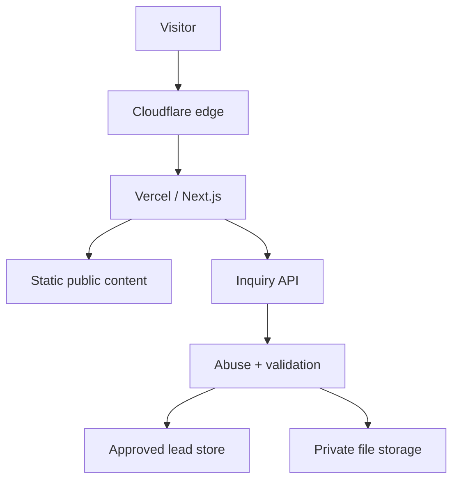

Mandatory boundaries:

- Everything delivered to the browser is public and potentially cacheable, inspectable, and copyable.
- The browser must never call a CRM, database, email provider, or privileged object-storage API directly.
- All inquiry processing must pass through an Ahan Asa server-controlled endpoint.
- Public pages should remain static and server-rendered by default.
- Dynamic endpoints handling confidential data must use `no-store` and must not be statically cached.
- External providers must be accessed through narrow server-side adapters.
- Production submission stays disabled until an approved durable lead sink, privacy text, retention policy, access roles, abuse controls, and operational fallback exist.
- Upload stays disabled until private storage, scan workflow, access control, retention, and incident handling are verified end to end.

## 8. Transport, domain, DNS, and edge security

### 8.1 Canonical host and HTTPS

- Serve production only over HTTPS.
- Centralize the canonical origin in validated server configuration such as `SITE_URL`.
- Redirect all approved HTTP and alternate-host variants to the canonical HTTPS host with one intentional hop where practical.
- Never build canonical, redirect, or callback URLs from an untrusted request `Host` header.
- Validate host/origin on sensitive Route Handlers.
- Reject unexpected hosts on inquiry, upload-authorization, preview, and webhook endpoints.

### 8.2 TLS and HSTS

- Use provider-managed modern TLS and disable obsolete protocols/ciphers through the provider configuration.
- Enable HSTS only after HTTPS works on the canonical host and all included subdomains.
- Baseline production value after verification: `max-age=31536000`.
- Add `includeSubDomains` only after every subdomain is confirmed HTTPS-safe.
- HSTS preload requires a separate operational approval because rollback is slow and affects the whole domain.

### 8.3 DNS and account controls

- Cloudflare, Vercel, registrar, Git host, storage, and analytics administrator accounts require MFA.
- Prefer phishing-resistant MFA or hardware/security keys for owners and administrators.
- Do not share administrator accounts.
- Grant role-based access; routine content or analytics work must not require domain or deployment administration.
- Review account owners, recovery methods, API tokens, and unused collaborators at a defined recurring interval.
- Enable registrar lock and DNS change notifications where available.
- Document authoritative nameservers, canonical records, verification records, and ownership.

### 8.4 Edge controls

- Apply Cloudflare WAF managed rules appropriate to the plan and application.
- Rate-limit inquiry and upload-related endpoints at the edge and again in the application.
- Protect preview, draft, administrative, and diagnostic routes from public discovery and access.
- Do not rely on IP address as identity; use it only as one abuse signal and retain it according to the privacy policy.
- Avoid broad allow/deny rules that block legitimate Iranian or future regional users without evidence.
- Verify whether the Vercel origin/deployment hostname can bypass intended edge controls. Sensitive endpoints must still enforce server-side validation even when edge controls are bypassed.

## 9. HTTP security headers

Headers must be set centrally and tested on HTML, API, error, and downloadable-resource responses. Do not add incompatible headers blindly.

| Header/control | Baseline | Notes |
| --- | --- | --- |
| `Content-Security-Policy` | Enforced after report-only validation | See Section 10 |
| `Strict-Transport-Security` | `max-age=31536000` after HTTPS verification | `includeSubDomains` and preload need approval |
| `X-Content-Type-Options` | `nosniff` | All relevant responses |
| `Referrer-Policy` | `strict-origin-when-cross-origin` | Reduce cross-origin leakage |
| `X-Frame-Options` | `DENY` | Legacy fallback; CSP `frame-ancestors` is authoritative |
| `Permissions-Policy` | Deny unused capabilities | Camera, microphone, geolocation, payment, USB and other unused APIs |
| `Cross-Origin-Opener-Policy` | Evaluate `same-origin` | Test all approved integrations before enforcement |
| `Cross-Origin-Resource-Policy` | Resource-specific | Do not break approved CDN/media delivery |
| `Cache-Control` | Route-specific | Confidential/API responses must use `no-store` |

Additional rules:

- Remove unnecessary framework/server identification headers where supported.
- Do not use deprecated browser XSS filters as a substitute for output encoding and CSP.
- Private downloads must use `Content-Disposition: attachment` with a sanitized display filename and `X-Content-Type-Options: nosniff`.
- A security-header scanner result is evidence only for the tested host and route, not the full application.

## 10. Content Security Policy

### 10.1 Policy goals

The CSP must:

- block unapproved script execution;
- prevent object/plugin content;
- prevent unauthorized framing;
- restrict form submission to Ahan Asa endpoints;
- limit network, image, font, frame, and worker sources to approved origins;
- support reporting without sending sensitive page or form data.

Conceptual minimum directives:

```text
default-src 'self';
base-uri 'self';
object-src 'none';
frame-ancestors 'none';
form-action 'self';
script-src <version-appropriate strict policy>;
style-src <approved self-hosted/style policy>;
img-src 'self' data: <approved image hosts>;
font-src 'self' <approved font hosts>;
connect-src 'self' <approved analytics/Turnstile endpoints>;
frame-src <approved Turnstile/video hosts>;
upgrade-insecure-requests;
```

### 10.2 Next.js implementation rule

- Use the official CSP guidance for the exact locked Next.js version.
- A nonce-based strict CSP can require per-request dynamic rendering. Do not convert static public pages to dynamic rendering without measuring and approving the architectural impact.
- Where the locked version supports a reviewed hash/SRI or static-compatible strategy, evaluate it for static routes.
- Never add `'unsafe-eval'` in production.
- Do not retain `'unsafe-inline'` as an unreviewed permanent exception.
- Add third-party origins individually; never use broad schemes or wildcards for convenience.
- Start changes in `Content-Security-Policy-Report-Only`, review real violations, remove false positives and unapproved sources, then enforce.
- CSP reports must not include confidential form values, query parameters, or document identifiers.

### 10.3 Third-party scripts

- No script may be added through GTM, a CMS, or code without owner, purpose, privacy, performance, CSP, and removal review.
- Prefer server-rendered or self-hosted functionality over third-party JavaScript.
- Do not let GTM become an unreviewed production code-deployment channel.
- Lock GTM publishing permissions to authorized roles and require change review.
- Use Subresource Integrity only where a stable third-party asset URL and update process make it reliable; it does not replace source approval.

## 11. Input validation and output safety

### 11.1 General rules

- Treat every request header, query parameter, path segment, cookie, form value, uploaded file, CMS value, and provider response as untrusted.
- Validate on the server with explicit schemas and strict object handling.
- Reject unknown fields at confidential write boundaries.
- Apply type, length, format, enum, and business-rule limits before persistence or provider calls.
- Normalize Unicode and whitespace deliberately; do not apply destructive normalization that changes technical identifiers or document meaning.
- Use allowlists for enum-like data, file types, URLs, locale codes, and redirect destinations.
- Never construct SQL, shell commands, template code, file paths, URLs, or headers through unsafe string concatenation.
- Use parameterized database access through an approved adapter.
- Escape output for its actual context. React escaping is helpful but does not make `dangerouslySetInnerHTML`, URLs, CSS, JSON-LD, or third-party renderers safe.

### 11.2 Rich content, Markdown, MDX, and CMS content

- Repository-authored MDX may execute only reviewed imports/components.
- Untrusted editor content must never execute arbitrary MDX, JSX, JavaScript, HTML, or iframe code.
- Use an allowlisted block renderer and sanitize any permitted HTML.
- Disallow script tags, event-handler attributes, `javascript:` URLs, unapproved iframes, and inline executable SVG.
- JSON-LD builders must accept typed approved fields; never interpolate raw user input.
- External links require URL parsing and approved protocol handling.

### 11.3 SVG and media

- Treat SVG as executable content.
- Use only trusted, reviewed, or sanitized SVG assets.
- Do not accept SVG in public inquiry uploads.
- Remote image sources require explicit host allowlisting.
- Never expose confidential customer/project names in public asset filenames, metadata, alt text, or URLs.

## 12. Inquiry form security

### 12.1 Approved Phase 1 principle

The primary form may collect the minimum required fields defined in `FORM_ARCHITECTURE.md`. Current intended minimum includes name, phone, delivery city, and the information needed to understand the request. Email and additional project fields may remain optional if approved.

### 12.2 Server-controlled submission

Recommended boundary:

```text
POST /api/inquiries
Content-Type: application/json
Cache-Control: no-store
```

The server must:

1. enforce request-body and header-size limits;
2. accept only the intended HTTP method and content type;
3. validate canonical host and allowed origin behavior;
4. verify Turnstile server-side when enabled;
5. apply edge and application rate limits;
6. validate and normalize the payload with the authoritative schema;
7. reject unknown fields;
8. minimize data before persistence and notification;
9. use an idempotency mechanism for retries;
10. persist to the approved durable lead store;
11. send only a non-sensitive operational notification;
12. return a stable public response without provider or database details.

### 12.3 Honest success and failure states

- Show success only after the lead system confirms durable persistence.
- Do not treat an analytics event, client-side state change, or notification email as proof of persistence.
- Return a non-guessable public reference when operationally required; do not return a database primary key.
- On provider outage, preserve user-entered values where safe and show a localized recoverable error.
- Do not falsely state «درخواست شما ثبت شد» when the backend is missing or unavailable.
- If production submission is disabled, mark the integration point clearly in code and UI and provide only an approved real fallback contact channel.

### 12.4 CSRF, CORS, and browser-origin controls

- CORS is not an authorization mechanism.
- Deny cross-origin API access by default; allow only explicitly approved origins.
- Validate `Origin` and expected host for browser form submissions.
- Use JSON requests and an approved anti-CSRF pattern where browser credentials or cookies are introduced.
- If future authenticated sessions use cookies, require `Secure`, `HttpOnly`, an appropriate `SameSite` value, CSRF protection, rotation, and server-side authorization.
- Never place confidential form data in URLs.

### 12.5 Abuse controls

- Use Cloudflare Turnstile with mandatory server-side Siteverify validation.
- Treat Turnstile tokens as short-lived and single-use; reject expired or replayed tokens.
- Validate the hostname/action data returned by the verification service against the environment.
- Use official test keys outside production; do not ship a hidden bypass flag.
- Rate-limit by multiple signals where available, not only a single IP.
- Enforce payload, field, file-count, and submission-frequency limits.
- Add progressive controls for repeated abuse without harming accessibility or legitimate users.
- Never expose precise rule thresholds or provider internals in public errors.
- Retain abuse telemetry only for the approved security purpose and retention window.

## 13. Secure document upload

### 13.1 Launch gate

Upload must remain disabled until all items below have an approved and tested implementation:

- allowed extensions/MIME types and maximum file count/size;
- private object storage and least-privilege credentials;
- short-lived upload authorization;
- server-side metadata validation;
- malware scanning and failure handling;
- quarantine and clean-state transition;
- authorized download flow;
- access logs and operational roles;
- retention/deletion policy and privacy notice;
- incident procedure for malicious or exposed files.

An attractive upload control without this workflow is prohibited.

### 13.2 Allowed business formats

The intended formats are:

- PDF: `.pdf`;
- image: `.jpg`, `.jpeg`, `.png`;
- spreadsheet: `.xls`, `.xlsx`.

All other formats are denied by default. In particular, deny SVG, HTML, script, executable, archive, shortcut, disk-image, and macro-enabled Office formats unless a new approved business case and control set exists.

Legacy `.xls` may contain active content. It must be treated as high risk: never execute, preview, calculate, or open it server-side as part of the web request. Detect macros/active content where the scan pipeline supports it and reject or quarantine according to the approved operational policy.

### 13.3 Validation and storage rules

- Verify extension, declared MIME type, detected content signature/magic bytes, and structural validity; no single signal is sufficient.
- Sanitize the display filename and remove path components, control characters, bidirectional spoofing characters, and dangerous trailing characters.
- Generate the storage key server-side using a random, non-guessable identifier. Never use the original filename as the object key.
- Enforce file count, per-file size, total-request size, and user/account storage limits before expensive processing.
- Upload directly to private storage only through a narrowly scoped, short-lived signed authorization.
- Scope authorization to one object, intended method, maximum size, allowed content constraints where supported, and a short expiration.
- Never place storage credentials in the browser.
- Store objects in a quarantine state until validation and malware scanning succeed.
- Keep the bucket/container private; disable directory listing and anonymous object access.
- Encrypt in transit and at rest using provider-supported controls.
- Record checksum, detected type, size, scan result, inquiry relationship, upload time, retention deadline, and access log status.
- Do not parse, render, transform, OCR, or feed documents to AI in Phase 1.

### 13.4 Scan and release workflow

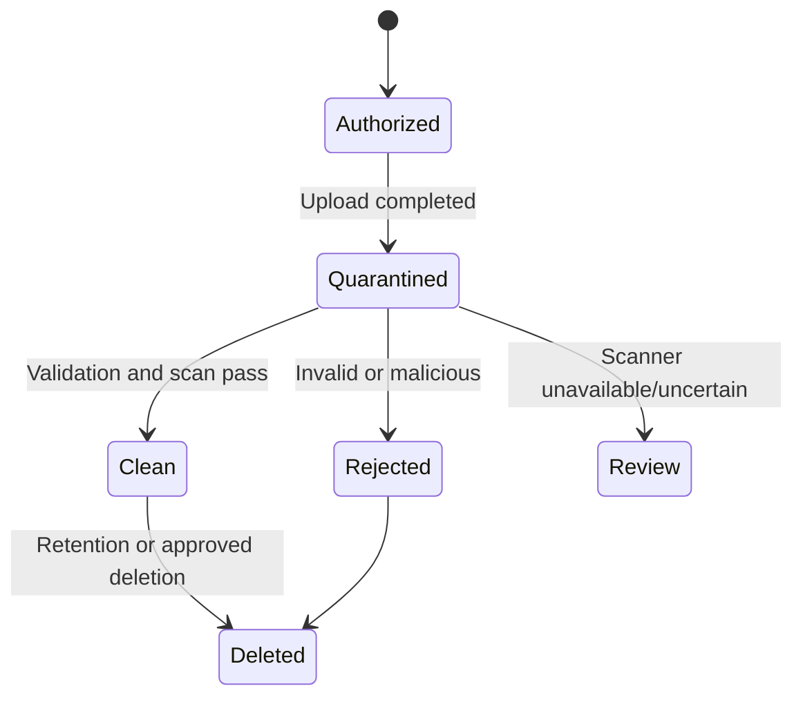

- A scan timeout or service failure is not a clean result.
- Operators must not receive a public direct link to quarantined content.
- Notifications may state that a document is pending review but must not attach it or expose its URL.
- Do not automatically decompress unsupported archives. Office container inspection must enforce resource limits.
- Prevent race conditions in which a file becomes downloadable before its clean state is committed.

### 13.5 Authorized download

- Require authenticated and authorized staff access through the approved internal system.
- Check the staff role and inquiry relationship on every access; knowledge of an object ID is not authorization.
- Generate short-lived, single-purpose download URLs only after authorization.
- Prefer download disposition over inline rendering for untrusted documents.
- Log document access using staff identity, document ID, time, result, and safe context; never log URL signatures.
- Revoke access when the inquiry closes, an employee leaves, a role changes, or the retention period expires.

## 14. Data privacy, retention, and deletion

### 14.1 Data minimization

- Each field requires a documented conversion or operational purpose.
- Optional fields must remain optional in UI and server validation.
- Do not collect national IDs, payment-card data, passwords, or unrelated personal information in Phase 1.
- Do not request confidential project documents before they are needed.
- Do not copy inquiry content into analytics, chat widgets, session replay, error monitoring, or marketing systems.

### 14.2 Consent and legal text

- Show the approved Persian privacy notice at the point of collection.
- Consent must be specific, understandable, unbundled where required, and never preselected.
- Store the accepted notice/version, timestamp, collection context, and evidence required by the approved policy.
- Claude Code must not invent legal wording, retention promises, cross-border-transfer claims, or regulatory compliance claims.

### 14.3 Retention gate

Production collection of personal information and documents requires an approved schedule covering:

- active inquiry data;
- unsuccessful or abandoned inquiries;
- uploaded documents;
- consent/audit records;
- security and access logs;
- provider backups and deletion lag;
- analytics and abuse telemetry.

Until the project owner and authorized legal/privacy reviewer approve concrete periods, do not invent defaults. Store a `retentionUntil` value only from the approved policy.

### 14.4 Deletion and access requests

- Define an accountable owner and verified workflow for access, correction, and deletion requests.
- Verify the requester without collecting excessive new data.
- Delete or anonymize all in-scope copies, provider records, and storage objects according to policy.
- Preserve only records that must legally or contractually remain, with documented basis and restricted access.
- Record completion without retaining the deleted confidential content in the deletion log.

## 15. Secrets and environment configuration

### 15.1 Core rules

- Never commit secrets to Git, source files, Markdown, issue text, screenshots, fixtures, generated bundles, or `.env.example` values.
- Values prefixed with `NEXT_PUBLIC_` are public. They must never contain credentials or confidential configuration.
- Read server secrets only in server-only modules.
- Use separate credentials for local/test, preview, and production.
- Use the deployment provider's encrypted/sensitive variable controls and least-privilege service credentials.
- Validate required configuration at startup or build time without printing secret values.
- Do not send full environment objects to logs or error monitoring.
- Use scoped, revocable tokens instead of personal administrator tokens.

### 15.2 Lifecycle

- Document owner, purpose, environment, scope, creation, rotation trigger, and revocation method for every secret.
- Rotate immediately after suspected exposure, unauthorized access, personnel/role change, or provider compromise.
- Revoke unused and superseded credentials.
- Test rotation and rollback without revealing the value.
- Secret scanning must run in local hooks and/or CI; a discovered secret is considered exposed even if the commit is later removed.

### 15.3 Server/client separation

- Mark secret-bearing modules as server-only where supported.
- Add tests or lint rules preventing server-only modules from Client Components.
- Never return raw provider configuration or error objects to the browser.
- Signed upload/download URLs are temporary credentials: keep them out of analytics, referrers, logs, and screenshots.

## 16. API and integration security

### 16.1 General integration rules

- No production integration may use guessed endpoints, credentials, field names, or permissions.
- Keep providers behind typed, narrow adapters.
- Define explicit connect/read/write permissions and deny unused capabilities.
- Set request timeouts, bounded retries with backoff, and circuit/failure behavior.
- Retry only idempotent operations or operations protected by an idempotency key.
- Validate provider responses before using or persisting them.
- Do not forward raw user input into email templates, provider URLs, headers, or queries.
- Do not let a notification failure roll back a lead that was already durably stored; alert operations separately.

### 16.2 Webhooks

- Accept webhooks only on a dedicated endpoint.
- Verify the provider signature over the exact raw body using the documented algorithm.
- Validate timestamp/age and reject replayed event IDs.
- Enforce body-size and content-type limits.
- Return a minimal response and process slow work asynchronously where supported.
- Store only the fields required for the approved workflow.
- Never rely on a secret URL path alone for authenticity.

### 16.3 SSRF and outbound requests

- Do not fetch arbitrary user-supplied URLs.
- Use an allowlist of schemes, hosts, ports, and paths for server-side outbound calls.
- Deny loopback, link-local, metadata-service, private-network, and unexpected redirect targets.
- Revalidate the destination after redirects and DNS resolution where the implementation permits.
- Apply short timeouts and response-size limits.

### 16.4 Email and messaging notifications

- Notifications contain a lead reference and minimal routing context, not full inquiry text or attached documents, unless explicitly approved and encrypted appropriately.
- Escape user-entered content for the message format.
- Do not use the user's email address as the provider `From` identity.
- Configure approved sender-domain authentication records and monitor failures.
- Recipients must come from server configuration, never from a public form field.

## 17. Authentication and administrative access

Phase 1 has no public customer authentication. Do not add login, account, session, password reset, or role-management code pre-emptively.

If a CMS, preview system, internal document interface, or portal is introduced:

- use an approved identity provider rather than custom password storage where practical;
- require MFA for privileged roles;
- define least-privilege roles for owner, developer, publisher, reviewer, analyst, and inquiry operator;
- separate content publishing from infrastructure administration;
- enforce authorization on the server for every action and object;
- use secure, HttpOnly, SameSite cookies and short, risk-appropriate sessions;
- rotate sessions after authentication/privilege change and revoke them after role removal;
- audit login, failed login, MFA, privilege, publication, secret, export, and document-access events;
- protect preview/draft URLs with real authorization, `no-store`, and `noindex`; secrecy of a URL is insufficient.

This future capability requires its own approved authentication/session threat model.

## 18. Logging, analytics, and monitoring

### 18.1 Safe logging

Structured server logs may contain:

- timestamp and environment;
- operation/route category;
- correlation ID;
- non-sensitive public reference;
- result category and safe duration;
- provider status category without raw payload;
- security event code and action taken.

Never log:

- full request bodies or inquiry messages;
- names, phone numbers, emails, company/project details, or delivery addresses;
- uploaded filenames, file contents, signed URLs, or document metadata beyond safe internal IDs;
- cookies, authorization headers, Turnstile tokens, webhook signatures, API keys, or environment values;
- database connection strings or provider error dumps.

Sanitize log fields to prevent log injection. Restrict log access and define retention.

### 18.2 Analytics

- Use stable event IDs and approved non-sensitive parameters.
- Never send PII, inquiry text, file names, quote values, document IDs, or exact project data.
- `inquiry_success` fires only after durable server confirmation.
- Keep preview/development traffic separate or disabled.
- Marketing/analytics tags must follow the approved consent policy.
- Session replay, keystroke capture, and form-field recording are prohibited unless separately privacy- and security-approved with masking verified.
- Test the real network payloads, not only the tag configuration UI.

### 18.3 Alerts

Monitor and alert on:

- unusual `4xx`/`5xx` patterns and application exceptions;
- inquiry persistence failures and provider outages;
- bursts of rejected submissions or Turnstile failures;
- upload scan failures, stuck quarantine, and abnormal storage growth;
- unauthorized or failed administrative access;
- unexpected DNS, domain, deployment, or environment changes;
- vulnerable production dependencies and failed security checks;
- CSP violations after noise reduction;
- public storage exposure or secret-scanning findings.

Alert messages must remain non-sensitive.

## 19. Dependency and software supply-chain security

- Use `pnpm` only and commit `pnpm-lock.yaml`.
- CI installs from the lockfile using a frozen/immutable mode.
- Add a dependency only for a documented need; prefer platform/native capabilities for small tasks.
- Review package owner, maintenance, release history, license, transitive footprint, install scripts, permissions, and known vulnerabilities.
- Pin or tightly constrain security-sensitive dependencies according to the approved update policy.
- Do not execute code copied from packages, gists, AI output, or setup scripts without review.
- Restrict package lifecycle scripts from new/untrusted dependencies until reviewed.
- Run automated dependency and secret scanning on pull requests and the production branch.
- Generate a software bill of materials for production releases when the CI platform supports it reliably.
- Critical exploitable vulnerabilities block release. Other findings require documented severity, exposure, owner, and remediation date.
- Major framework/runtime upgrades require compatibility, CSP, rendering, dependency, and security regression tests.
- Remove unused packages, scripts, environment variables, provider tokens, and integrations.

## 20. Repository, CI/CD, and deployment security

### 20.1 Repository

- Require MFA and individual accounts for repository access.
- Protect the production branch; no direct unreviewed production changes.
- Require review for workflow, dependency, infrastructure, security, and secret-handling files.
- Apply CODEOWNERS or an equivalent approval mechanism to sensitive paths when the repository platform supports it.
- Do not grant workflows broad write permissions by default.
- Pin third-party CI actions/workflows to reviewed immutable references where practical.
- Fork/unknown pull requests must not receive production secrets.

### 20.2 Required CI security gates

At minimum:

```text
pnpm lint
pnpm typecheck
pnpm test
pnpm test:e2e
pnpm build
```

Also require:

- secret scanning;
- dependency/vulnerability review;
- tests for schemas, authorization boundaries, headers, rate limits, and upload policy when enabled;
- production-build inspection for secret leakage and public source maps;
- route/status, canonical, robots, and preview-indexing checks;
- accessibility checks for security controls such as Turnstile and errors.

### 20.3 Environment isolation

| Environment | Security policy |
| --- | --- |
| Local | Test credentials only; no production data or secrets |
| Preview | Protected/noindex; isolated test lead destination; no production notifications or storage |
| Production | Production credentials and approved providers only |

- Preview deployments must not submit into production sales workflows.
- Production secrets must not be copied into local `.env` files unless explicitly required and handled by approved secure procedure.
- Environment variables must be scoped to only the environments that need them.
- Verify that preview URLs do not expose drafts, stack traces, source maps, test data, or administrative tools.

### 20.4 Release and rollback

- Block production deployment when required checks fail.
- Record the commit, reviewer, configuration change, migration, and deployment identity.
- Use a known healthy deployment for rollback.
- Security configuration changes require a rollback plan before enforcement.
- Database/storage schema changes, when introduced, must be backward-compatible or have an explicit safe rollback and data-integrity plan.
- Post-deploy smoke tests must verify canonical redirects, headers, forms, controlled failures, Turnstile, storage privacy, analytics payloads, and absence of secret exposure.

## 21. Caching and confidential response controls

- Inquiry, upload authorization, preview, authenticated, and private download responses use `Cache-Control: no-store`.
- Never cache provider error bodies or user-specific validation payloads at shared edges.
- Do not put personal or restricted data in React Server Component caches, static generation output, `unstable_cache`, CDN keys, or browser storage.
- Public static pages may use long-lived immutable deployment caching.
- Vary behavior must be explicit; avoid cache poisoning through untrusted headers or query parameters.
- Cache keys and revalidation tags must never contain PII or secrets.
- Service workers/offline caches require separate approval and must exclude inquiry/API/private routes.

## 22. Browser storage and client-side state

- Do not store inquiry data, uploaded document content, access tokens, or signed URLs in `localStorage`, `sessionStorage`, IndexedDB, analytics state, or URL parameters.
- Keep recoverable form state in memory unless an approved privacy-preserving draft requirement exists.
- Clear sensitive client state after confirmed submission or deliberate cancellation.
- Clipboard and file APIs require explicit user action.
- Do not expose hidden fields as security controls; all enforcement remains server-side.
- Avoid dangerously rendered HTML and dynamic code execution (`eval`, `new Function`).

## 23. Error handling and information disclosure

- Public errors must be localized, calm, actionable, and non-technical.
- Never return stack traces, SQL/provider messages, internal paths, secret names, bucket names, recipient addresses, rate-limit thresholds, or scan-engine details.
- Use stable public error codes such as validation, rate-limited, verification failed, and service unavailable.
- Assign correlation IDs to unexpected failures without encoding PII.
- Production error pages must not reveal framework debug output.
- A `404` remains a true `404`; a service failure must not become a misleading success page.
- Error monitoring must scrub request bodies, headers, query strings, cookies, and breadcrumbs before transmission.

## 24. Security verification strategy

### 24.1 Baseline

- Use OWASP ASVS 5.0 Level 1 as the minimum public-site verification baseline.
- Apply selected Level 2 rigor to inquiry processing, personal information, private documents, administrative access, and integrations.
- Map each applicable requirement to implementation evidence or a documented not-applicable reason.
- Automated scanners supplement, but never replace, code review and manual testing.

### 24.2 Mandatory test cases

#### Public application

- HTTPS and canonical redirect matrix is correct.
- Unexpected hosts and unsupported methods are rejected at sensitive endpoints.
- Security headers are present and CSP is effective on representative HTML/error/API routes.
- Unapproved framing, script sources, mixed content, and unsafe redirects are blocked.
- Public pages contain no draft, private, or environment-specific data.
- Unknown routes return the intended status.

#### Inquiry API

- invalid content type, oversized body, unknown fields, malformed Unicode, and invalid enums are rejected;
- HTML/script payloads are stored/rendered safely and cannot execute;
- missing, invalid, expired, replayed, wrong-host, and wrong-action Turnstile results fail;
- cross-origin and unexpected-host requests fail;
- rate limits work at edge and application layers;
- duplicate idempotency attempts create at most one lead;
- provider timeout/outage returns an honest recoverable state;
- public response/logs contain no confidential data or provider internals.

#### Upload, when enabled

- extension/MIME/signature mismatch is rejected;
- double extensions, path traversal names, bidi-spoofed names, oversized files, excessive count, and truncated files are rejected;
- SVG, HTML, executable, archive, and unsupported active-content files are rejected;
- malware test sample follows the approved safe scanner-validation method and never enters production data flow;
- files remain unavailable while quarantined or scan-failed;
- signed authorization cannot upload another key, larger object, wrong method, or after expiry;
- direct anonymous object access fails;
- unauthorized staff/document access fails;
- download URLs expire and do not appear in logs/analytics/referrers;
- retention deletion removes the object and related access path.

#### Secrets and deployment

- no server secret appears in client chunks, source maps, build logs, error payloads, or repository history;
- preview uses test destinations and is not indexable;
- production rollback is tested;
- revoked credentials no longer work;
- provider accounts enforce MFA and least privilege.

### 24.3 Release blockers

Do not launch or enable the affected feature when:

- a critical/high exploitable vulnerability is open;
- production inquiry persistence is unverified;
- upload privacy, scan, authorization, or retention is incomplete;
- a secret is exposed and not rotated/revoked;
- preview and production data are not isolated;
- CSP/headers are absent without an approved temporary exception;
- logs or analytics contain PII/restricted data;
- an administrative account lacks the required MFA;
- rollback and incident ownership are unknown.

## 25. Vulnerability handling and incident response

### 25.1 Before launch

Assign and document:

- security/incident owner;
- technical responder;
- business owner;
- legal/privacy reviewer;
- provider escalation contacts;
- approved internal communication channel;
- backup responder and access-recovery procedure.

### 25.2 Severity

| Severity | Examples | Required response |
| --- | --- | --- |
| Critical | active data disclosure, secret compromise with production access, public private storage, domain takeover | Immediate containment and owner escalation |
| High | exploitable upload bypass, authorization bypass, stored XSS, major provider/account compromise | Disable affected capability, remediate before normal operation |
| Medium | limited information disclosure, meaningful abuse-control weakness, vulnerable dependency with constrained exposure | Assign owner and time-bound remediation |
| Low | defense-in-depth gap with no demonstrated sensitive impact | Track and remediate in normal security work |

Concrete response-time commitments must be approved operationally; do not invent public SLAs.

### 25.3 Response process

1. Detect and open an incident record with time, reporter, scope, and evidence.
2. Contain: disable the affected endpoint/integration, revoke credentials, restrict access, or roll back.
3. Preserve relevant logs and configuration without copying unnecessary personal data.
4. Determine affected data, users, environments, dates, providers, and attack path.
5. Eradicate the root cause; do not only block one indicator.
6. Recover from a known healthy state and verify controls.
7. Complete required legal, contractual, provider, and user notifications through authorized owners.
8. Record lessons, follow-up tasks, and document updates.

Never publicly speculate about an incident or promise that no data was affected before investigation.

### 25.4 Vulnerability reports

- Publish a security contact or `security.txt` only when a monitored owner and response process exist.
- Do not publish personal employee addresses as the security contact.
- Acknowledge good-faith reports and avoid requesting sensitive exploit data through insecure channels.
- Test fixes in an isolated environment and credit reporters only with their permission.

## 26. Security exceptions

An exception requires a written record containing:

- control being waived;
- affected routes/data/environments;
- business reason;
- threat and worst credible impact;
- compensating controls;
- approving owner and technical reviewer;
- start and expiry date;
- verification and removal plan.

Exceptions must expire. “Provider default,” “temporary,” “works locally,” or “needed to pass the build” is not sufficient justification.

## 27. Claude Code implementation rules

Before security-relevant work, Claude Code must:

1. read `CLAUDE.md`, `TECHNICAL_ARCHITECTURE.md`, this document, and every task-relevant specialized specification;
2. inspect the existing route/data flow, locked dependency versions, environment boundaries, and tests;
3. identify the trust boundary and data classification;
4. state any unresolved provider/legal/retention decision;
5. preserve disabled features when a decision gate is incomplete;
6. implement the smallest coherent secure change;
7. run relevant tests and report exact results.

Claude Code must not:

- invent credentials, endpoints, recipient addresses, bucket names, retention periods, privacy claims, or security approvals;
- expose secrets through `NEXT_PUBLIC_*`, client code, logs, tests, screenshots, Markdown, or examples;
- enable a form that cannot durably persist a lead;
- enable upload without private storage, scanning, authorization, access logging, and retention;
- weaken CSP, validation, origin checks, rate limits, malware controls, authorization, or logging rules to make a test pass;
- add `'unsafe-eval'`, broad CSP wildcards, permissive CORS, public storage, or anonymous private-document access;
- trust client validation, client MIME type, original filenames, hidden fields, Turnstile client status, or provider callbacks without verification;
- add a CMS, authentication, customer portal, payment, chat, session replay, or unapproved analytics integration;
- add or upgrade a security-sensitive dependency without review;
- claim a vulnerability is fixed without a regression test;
- claim compliance or launch readiness without evidence.

When a required production decision is missing, Claude Code must keep the feature disabled, leave a clear typed integration boundary, and report the exact blocker.

## 28. Decision gates

| Decision | Current state | Security effect |
| --- | --- | --- |
| Canonical host | Recommended `https://www.ahanassa.com`; final production verification required | Redirect, host validation, CSP, Turnstile host |
| Lead system of record | Not approved | Production inquiry remains disabled |
| Notification provider/recipients | Not approved | No production notification integration |
| Upload storage provider | Not approved | Upload remains disabled |
| Malware scanner and uncertain-result workflow | Not approved | Upload remains disabled |
| Maximum file size/count | Must be defined in `FORM_ARCHITECTURE.md` | Upload remains disabled |
| Retention/deletion schedule | Not approved | Production collection cannot be declared ready |
| Inquiry/document access roles | Not approved | No internal document access UI |
| Privacy/consent wording | Requires authorized approval | Form cannot launch with invented legal copy |
| GTM/GA4 IDs and consent policy | Not approved | Tags remain disabled/placeholder-free |
| Error-monitoring provider | Not selected | No external error payloads |
| CMS/authentication | Not selected; not needed for Phase 1 | No login or editorial admin surface |
| HSTS subdomains/preload | Not approved | Use verified host-only baseline first |
| CSP implementation mode | Must match locked Next.js version and rendering plan | Report-only test before enforcement |

## 29. Launch security checklist

### Accounts and infrastructure

- [ ] MFA is enabled for registrar, Cloudflare, Git, Vercel, storage, analytics, and lead-system administrators.
- [ ] Individual accounts and least-privilege roles are confirmed.
- [ ] Unused collaborators, tokens, domains, and integrations are removed.
- [ ] DNS, TLS, canonical redirects, and domain ownership are verified.
- [ ] WAF and rate-limit rules are active and tested.

### Application

- [ ] Strict TypeScript, lint, tests, E2E, and production build pass.
- [ ] Security headers and enforced CSP pass on representative routes.
- [ ] No mixed content, unsafe redirect, unexpected host, or debug response remains.
- [ ] Public pages contain no private/draft data.
- [ ] API confidential responses use `no-store`.

### Inquiry

- [ ] Server schema, strict fields, limits, normalization, and safe errors are tested.
- [ ] Turnstile Siteverify, hostname/action checks, expiry/replay behavior, and production keys are verified.
- [ ] Edge and application abuse controls are verified.
- [ ] Idempotency creates exactly one lead.
- [ ] Durable lead store and failure fallback are tested.
- [ ] Logs, notifications, analytics, and error monitoring contain no PII.
- [ ] Privacy/consent text, owner, roles, and retention are approved.

### Upload, only if enabled

- [ ] Allowed PDF/JPG/PNG/XLS/XLSX policy and size/count limits are approved.
- [ ] Private storage and short-lived scoped authorization are verified.
- [ ] MIME/signature/structure validation and filename sanitization pass.
- [ ] Quarantine, malware scan, uncertain result, rejection, and deletion workflows pass.
- [ ] Anonymous/direct access fails; authorized access and expiry work.
- [ ] Access logging, retention, and incident procedure are approved.

### Deployment and operations

- [ ] Local, preview, and production credentials/destinations are isolated.
- [ ] Preview is protected and noindex.
- [ ] Secret and dependency scans pass.
- [ ] Client bundles, source maps, logs, and responses contain no secrets.
- [ ] Monitoring and non-sensitive alerts are active.
- [ ] Incident owners, provider contacts, rollback, and credential revocation are tested.

## 30. Definition of done

This security baseline is correctly implemented when:

- public content is static-first, indexable, and isolated from confidential operations;
- HTTPS, canonical-host handling, edge protection, and tested security headers are active;
- CSP permits only approved code and providers without an unreviewed permanent unsafe exception;
- every confidential write is server-validated, rate-limited, non-cacheable, and honestly acknowledged;
- inquiry data is durably stored only in an approved restricted system;
- uploads are either fully secured end to end or remain clearly disabled;
- personal and restricted data are absent from source control, client bundles, logs, analytics, notifications, and public storage;
- secrets are environment-isolated, least-privileged, scannable, rotatable, and revocable;
- dependencies and releases are reviewed, reproducible, test-gated, and rollback-ready;
- administrative accounts use MFA and least privilege;
- privacy, retention, access roles, incident ownership, and decision gates are approved;
- security tests and applicable ASVS evidence are recorded;
- no critical/high exploitable issue remains open for launch.

## 31. Related project documents

Read this document with:

- `PROJECT_BRIEF.md`
- `TECHNICAL_ARCHITECTURE.md`
- `CONTENT_MODEL.md`
- `FORM_ARCHITECTURE.md`
- `API_INTEGRATIONS.md`
- `DATA_ARCHITECTURE.md`
- `CMS_ARCHITECTURE.md`
- `ANALYTICS_TRACKING.md`
- `MEDIA_GUIDELINES.md`
- `ACCESSIBILITY.md`
- `SITEMAP_ROBOTS_SPEC.md`
- `STACK.md`
- `ENVIRONMENT_VARIABLES.md`
- `DEPLOYMENT_ARCHITECTURE.md`
- `TESTING_STRATEGY.md`
- `PRE_DEPLOY_CHECKLIST.md`
- `POST_DEPLOY_CHECKLIST.md`
- `CLAUDE.md`
- `DEVELOPMENT_RULES.md`
- `DECISIONS.md`

If a referenced file is not yet approved, this document remains the controlling interim security baseline for that subject.

## 32. Official implementation references

Use the exact locked framework/provider version and current official guidance:

- [OWASP Application Security Verification Standard](https://owasp.org/www-project-application-security-verification-standard/)
- [OWASP ASVS Cheat Sheet Index](https://cheatsheetseries.owasp.org/IndexASVS.html)
- [OWASP File Upload Cheat Sheet](https://cheatsheetseries.owasp.org/cheatsheets/File_Upload_Cheat_Sheet.html)
- [OWASP Input Validation Cheat Sheet](https://cheatsheetseries.owasp.org/cheatsheets/Input_Validation_Cheat_Sheet.html)
- [OWASP Content Security Policy Cheat Sheet](https://cheatsheetseries.owasp.org/cheatsheets/Content_Security_Policy_Cheat_Sheet.html)
- [OWASP HTTP Security Response Headers Cheat Sheet](https://cheatsheetseries.owasp.org/cheatsheets/HTTP_Headers_Cheat_Sheet.html)
- [OWASP Secrets Management Cheat Sheet](https://cheatsheetseries.owasp.org/cheatsheets/Secrets_Management_Cheat_Sheet.html)
- [OWASP Logging Cheat Sheet](https://cheatsheetseries.owasp.org/cheatsheets/Logging_Cheat_Sheet.html)
- [OWASP Vulnerable Dependency Management Cheat Sheet](https://cheatsheetseries.owasp.org/cheatsheets/Vulnerable_Dependency_Management_Cheat_Sheet.html)
- [Next.js Content Security Policy guide](https://nextjs.org/docs/app/guides/content-security-policy)
- [Cloudflare Turnstile server-side validation](https://developers.cloudflare.com/turnstile/get-started/server-side-validation/)
- [Cloudflare Turnstile testing](https://developers.cloudflare.com/turnstile/troubleshooting/testing/)
- [Vercel sensitive environment variables](https://vercel.com/docs/environment-variables/sensitive-environment-variables)
- [Vercel Security Dashboard](https://vercel.com/docs/security/security-dashboard)

Third-party examples are not authoritative when they conflict with official documentation, this document, project scope, or the locked implementation version.

---

## Approval record

| Field | Value |
| --- | --- |
| Document owner | Ahan Asa project owner |
| Security owner | TBD — required before launch |
| Technical owner | TBD |
| Legal/privacy reviewer | TBD — required before production data collection |
| Version | 1.0 |
| Status | Draft for approval |
| Effective date | After project-owner approval |
| Review cadence | At least per major release and after any material scope/provider/data/security change |
| Review triggers | New form field, upload type, provider, CMS/auth, locale, domain, incident, vulnerability, or data-flow change |
# Ahan Asa Website — SEO Keyword Map

> **Brand:** Ahan Asa | آهن آسا  
> **Domain:** `ahanassa.com`  
> **Document:** `SEO_KEYWORD_MAP.md`  
> **Status:** Working Draft v1.0  
> **Last updated:** 2026-08-25  
> **Primary market:** Iran  
> **Primary language:** Persian (Farsi), fully RTL  
> **Search engine:** Google  
> **Measurement note:** Search volume, competition, CPC, and ranking difficulty are intentionally not invented in this document. They must be added from Google Keyword Planner, Google Search Console, and an approved third-party SEO platform.

---

## 1. Purpose

This document defines which Persian search-intent cluster belongs to each indexable Ahan Asa page. It is the source of truth for keyword ownership and is intended to prevent:

- multiple pages competing for the same query;
- pages being created only because a keyword exists;
- the brand being reduced to a generic price-list website;
- commercial pages and educational articles targeting the same intent;
- unsupported claims about inventory, price, delivery, geography, or service scope;
- thin material, industry, project, or location pages.

The map aligns organic acquisition with Ahan Asa's approved positioning: a premium B2B steel procurement management partner that protects project capital through requirement clarity, sourcing control, commercial comparison, documentation, and delivery coordination.

## 2. Document Boundaries

| Document | Responsibility |
|---|---|
| `SEO_STRATEGY.md` | SEO objectives, operating model, measurement, governance, and roadmap |
| `SEO_KEYWORD_MAP.md` | Keyword clusters, intent, priority, and page ownership |
| `SEO_PAGE_MAP.md` | Final URL-level SEO requirements, metadata angle, word-depth, schema, and internal-link obligations |
| `SITEMAP.md` | Approved page inventory, hierarchy, publication status, and indexation intent |
| `ROUTES.md` | Exact routes, redirects, locale behavior, and framework implementation |
| `CONTENT_STRATEGY.md` | Editorial themes, formats, workflow, and content lifecycle |
| `COPY_GUIDELINES.md` | Persian voice, terminology, spelling, punctuation, and conversion copy |
| `METADATA_SPEC.md` | Title, meta description, Open Graph, and social-preview rules |
| `INTERNAL_LINKING.md` | Link paths, anchors, hub relationships, and orphan-page prevention |

If this file assigns a keyword to a page that does not exist in `SITEMAP.md`, the keyword is a candidate—not authorization to create a production URL.

## 3. Strategic Search Position

### 3.1 Demand-entry language

Iranian steel SERPs are strongly price- and transaction-led. Current results for broad queries emphasize terms such as `قیمت آهن`, `قیمت روز آهن آلات`, `خرید آهن آلات`, `استعلام قیمت`, direct purchase, and delivery. Representative ranking pages include [آهن آنلاین](https://ahanonline.com/), [مرکزآهن](https://www.markazeahan.com/), [فولاد ایرانیان](https://www.fooladiranian.com/), and [آهن پرایس](https://ahanprice.com/).

Ahan Asa should not imitate these sites unless it later operates a verified live-price and product-data system. Instead, the keyword strategy uses a two-layer model:

1. **Capture existing demand** through project-oriented commercial phrases such as `تأمین آهن آلات پروژه`, `خرید عمده آهن آلات`, `استعلام خرید آهن آلات پروژه`, and material-specific procurement searches.
2. **Build category ownership** around differentiated concepts such as `مدیریت خرید آهن آلات`, `مدیریت تأمین فولاد`, `مقایسه پیش فاکتور آهن`, `ارزیابی تامین کننده آهن`, and `کنترل مدارک خرید فولاد`.

### 3.2 Positioning rule

Every commercial page must connect the searched product or buying task to managed procurement. The page should satisfy the query without claiming that Ahan Asa is:

- a public online marketplace;
- a live commodity price board;
- an owner of factories, warehouses, fleet, or stock unless verified;
- the cheapest supplier;
- able to guarantee price, quality, or delivery without an approved contractual basis.

### 3.3 Keyword language conventions

Use the following forms naturally in Persian copy:

| Preferred editorial form | Search variants that may appear naturally |
|---|---|
| `تأمین` | `تامین` |
| `آهن‌آلات` | `آهن آلات` |
| `پروژه‌ای` | `پروژه ای` |
| `پیش‌فاکتور` | `پیش فاکتور` |
| `فولاد` | `آهن`, `آهن‌آلات`, `مقاطع فولادی` where semantically correct |
| `مدیریت خرید` | `مدیریت تأمین`, `خرید پروژه‌ای`, `تدارکات فولاد` where appropriate |

Do not repeat spelling variants mechanically. Google normally understands Persian half-space and orthographic variants; write for users first.

## 4. Search Intent Taxonomy

| Code | Intent | User need | Preferred page type |
|---|---|---|---|
| `BR` | Branded | Find or verify Ahan Asa | Homepage, About, Contact |
| `COM` | Commercial investigation | Evaluate a supplier, service, or buying approach | Procurement, material, industry, case-study pages |
| `TRX` | Transactional | Request a quotation, consultation, or project supply | Consultation/RFQ page, commercial landing page |
| `INF` | Informational | Learn how to specify, compare, purchase, inspect, or plan | Insight article, guide, resource |
| `NAV` | Navigational | Reach a known page or contact channel | Contact, consultation, project, resource |
| `LOC` | Local | Find a supplier or service in a location | Only a verified location page or location section |

One page may satisfy a primary and a secondary intent, but it must have one clear dominant intent.

## 5. Priority and Validation Labels

### 5.1 Business priority

| Priority | Meaning |
|---|---|
| `P0` | Required to define the brand and support qualified launch conversion |
| `P1` | High commercial relevance and a direct path to qualified inquiries |
| `P2` | Supports topical authority, evaluation, or a material/category expansion |
| `P3` | Long-term opportunity; publish only after evidence and demand validation |

### 5.2 Validation status

| Status | Meaning |
|---|---|
| `Validated — strategic` | Confirmed by business strategy and page architecture |
| `Observed — SERP language` | Query language appears in current search results or competitor page framing |
| `Candidate — data required` | Relevant hypothesis requiring Keyword Planner/GSC/SEO-tool validation |
| `Conditional — scope required` | Keyword is relevant only if Ahan Asa confirms the corresponding capability |
| `Excluded` | Must not be targeted under the current business and website model |

### 5.3 Required quantitative fields

The following columns must be added during the first formal keyword-research update:

- average monthly searches in Iran;
- three-month and year-over-year trend;
- competition or keyword-difficulty proxy;
- CPC or commercial-intent proxy;
- current Ahan Asa impressions, clicks, average position, and landing page;
- SERP composition;
- conversion relevance;
- final priority score.

## 6. Master Keyword-to-Page Map — Launch Core

### 6.1 Core commercial and trust pages

| ID | Route | Page role | Primary keyword cluster | Secondary/supporting queries | Intent | Priority | Validation | Must not target |
|---|---|---|---|---|---|---|---|---|
| `HOME-001` | `/` | Brand and category entry | `آهن آسا` | `آهن آسا خرید آهن`, `آهن آسا تامین فولاد`, `شرکت آهن آسا`, `خرید پروژه‌ای آهن آلات` | BR + COM | P0 | Validated — strategic | `قیمت لحظه‌ای آهن`, every individual product keyword |
| `PROC-000` | `/procurement` | Procurement management hub | `تأمین آهن آلات پروژه` | `مدیریت خرید آهن آلات`, `مدیریت تأمین فولاد`, `خرید آهن آلات پروژه ای`, `تامین مقاطع فولادی پروژه`, `شرکت تامین آهن آلات` | COM | P0 | Strategic + observed language | individual material price queries; exact capability keywords owned below |
| `PROC-010` | `/procurement/requirements-and-specifications` | Requirement definition | `مشخصات فنی خرید آهن آلات` | `تعیین مشخصات خرید فولاد`, `بررسی لیستوفر آهن`, `بررسی فنی سفارش آهن`, `تهیه لیست خرید آهن آلات`, `کنترل مشخصات مقاطع فولادی` | COM + INF | P1 | Candidate — data required | generic `لیستوفر چیست` unless the page fully answers it |
| `PROC-020` | `/procurement/sourcing-and-supplier-evaluation` | Supplier sourcing and evaluation | `ارزیابی تامین کننده آهن آلات` | `انتخاب تامین کننده فولاد`, `تامین کننده معتبر آهن آلات`, `بررسی فروشنده آهن`, `معیار انتخاب تامین کننده آهن`, `سورسینگ آهن آلات` | COM + INF | P1 | Strategic; volume validation required | unverified `بهترین تامین کننده آهن` claims |
| `PROC-030` | `/procurement/quotation-comparison` | Commercial comparison | `مقایسه پیش فاکتور آهن آلات` | `مقایسه قیمت تامین کنندگان آهن`, `بررسی پیش فاکتور آهن`, `مقایسه پیشنهاد خرید فولاد`, `مقایسه قیمت آهن برای پروژه`, `هزینه واقعی خرید آهن` | COM + INF | P1 | Candidate — data required | live price tables; absolute cheapest-price language |
| `PROC-040` | `/procurement/documentation-and-quality-control` | Documentation and quality controls | `کنترل کیفیت خرید آهن آلات` | `مدارک کنترل کیفیت فولاد`, `گواهی آنالیز آهن`, `بررسی سرتیفیکیت فولاد`, `تطابق مشخصات مقاطع فولادی`, `مدارک خرید آهن آلات` | COM + INF | P1 | Strategic; scope confirmation required | claims of independent laboratory inspection unless approved |
| `PROC-050` | `/procurement/logistics-and-delivery` | Delivery coordination | `حمل و تحویل آهن آلات پروژه` | `برنامه ریزی تحویل آهن`, `هزینه حمل آهن آلات`, `هماهنگی بارگیری آهن`, `ارسال آهن آلات به پروژه`, `کنترل تحویل مقاطع فولادی` | COM + INF | P1 | Candidate — data and scope required | freight-company or nationwide-guarantee claims unless verified |
| `PROC-060` | `/process` | Sequential buying method | `مراحل خرید آهن آلات پروژه` | `فرایند خرید آهن آلات`, `نحوه تامین آهن پروژه`, `راهنمای خرید پروژه ای فولاد`, `از استعلام تا تحویل آهن`, `فرایند سفارش آهن عمده` | COM + INF | P0 | Strategic + observed language | capability keywords already assigned to procurement detail pages |
| `MAT-000` | `/materials` | Material-group discovery | `انواع آهن آلات مورد نیاز پروژه` | `مقاطع فولادی پروژه`, `آهن آلات ساختمانی و صنعتی`, `گروه های کالایی فولاد`, `تامین انواع مقاطع فولادی`, `راهنمای انتخاب آهن آلات` | COM + INF | P0 | Observed — SERP language | ranking for every child material term with thin sections |
| `IND-000` | `/industries` | Buyer and sector fit | `تامین آهن آلات ساختمانی و صنعتی` | `تامین فولاد پروژه های عمرانی`, `تامین آهن برای پیمانکاران`, `تامین آهن شرکت های صنعتی`, `تامین مقاطع فولادی EPC`, `خرید آهن برای سازندگان اسکلت فلزی` | COM | P1 | Candidate — data required | separate sector intent when child pages are published |
| `ABOUT-001` | `/about` | Entity and trust verification | `درباره آهن آسا` | `شرکت آهن آسا`, `آهن آسا کیست`, `تیم آهن آسا`, `خدمات آهن آسا` | BR + NAV | P0 | Validated — strategic | non-brand generic service terms |
| `FAQ-001` | `/faq` | Objection and question resolution | `سوالات خرید آهن آلات پروژه` | `سوالات متداول خرید آهن`, `مدارک لازم برای استعلام آهن`, `زمان تحویل آهن آلات`, `نحوه ثبت سفارش آهن پروژه` | INF + COM | P1 | Candidate — GSC-led | duplicating complete answers owned by commercial pages |
| `CONTACT-001` | `/contact` | Contact information | `تماس با آهن آسا` | `شماره تماس آهن آسا`, `آدرس آهن آسا`, `ایمیل آهن آسا` | BR + NAV | P0 | Validated — strategic | generic `فروش آهن` |
| `RFQ-001` | `/request-consultation` | Qualified inquiry and conversion | `استعلام خرید آهن آلات پروژه` | `درخواست قیمت آهن آلات پروژه`, `ثبت سفارش عمده آهن`, `استعلام تامین فولاد`, `ارسال لیست خرید آهن`, `درخواست مشاوره خرید آهن` | TRX | P0 | Observed — transactional language | broad `قیمت آهن امروز`; product information that belongs to category pages |

### 6.2 Ownership notes for the most important cluster

The broad terms below are related but must not be treated as synonyms with identical page ownership:

| Query | Owner | Reason |
|---|---|---|
| `تأمین آهن آلات پروژه` | `/procurement` | Broad commercial service/category intent |
| `خرید آهن آلات پروژه ای` | `/procurement` | Broad project-purchase intent; same user need as procurement hub |
| `مراحل خرید آهن آلات پروژه` | `/process` | Sequential how-to and evaluation intent |
| `استعلام خرید آهن آلات پروژه` | `/request-consultation` | Conversion-ready transactional intent |
| `انواع آهن آلات پروژه` | `/materials` | Material discovery and category-selection intent |
| `تامین آهن آلات ساختمانی و صنعتی` | `/industries` | Buyer/industry fit intent |

## 7. Master Keyword-to-Page Map — Conditional Material Pages

These pages may be published only after the material scope, standards, sourcing capability, commercial workflow, and content ownership are confirmed. Each page must contain distinct procurement guidance, not a generic product description.

| ID | Route | Primary keyword cluster | Secondary/supporting queries | Intent | Priority | Validation | Expansion trigger |
|---|---|---|---|---|---|---|---|
| `MAT-010` | `/materials/structural-sections` | `تامین مقاطع فولادی ساختمانی` | `خرید عمده تیرآهن`, `تامین تیرآهن پروژه`, `خرید نبشی و ناودانی عمده`, `خرید هاش پروژه`, `استعلام مقاطع فولادی` | COM + TRX | P1 | Conditional — scope required | Split into product pages only when demand, content depth, and actual supply justify each URL |
| `MAT-020` | `/materials/rebar-and-wire` | `تامین میلگرد پروژه` | `خرید عمده میلگرد`, `استعلام میلگرد پروژه`, `خرید میلگرد برای ساختمان`, `تامین مفتول`, `خرید مش فولادی` | COM + TRX | P1 | Conditional — scope required | Split rebar/wire/mesh when each has independent demand and operating scope |
| `MAT-030` | `/materials/plates-sheets-and-coils` | `تامین ورق فولادی پروژه` | `خرید عمده ورق سیاه`, `استعلام ورق فولادی`, `خرید ورق گالوانیزه عمده`, `تامین ورق صنعتی`, `خرید رول فولادی` | COM + TRX | P1 | Conditional — scope required | Split by plate/sheet/coil or grade only with verified supply and unique content |
| `MAT-040` | `/materials/hollow-sections` | `تامین قوطی و پروفیل پروژه` | `خرید عمده قوطی آهن`, `خرید پروفیل ساختمانی`, `استعلام پروفیل فولادی`, `تامین مقاطع توخالی`, `خرید قوطی صنعتی` | COM + TRX | P1 | Conditional — scope required | Split structural/industrial profiles only after demand and scope validation |
| `MAT-050` | `/materials/pipes-and-tubes` | `تامین لوله فولادی پروژه` | `خرید عمده لوله فولادی`, `استعلام لوله صنعتی`, `تامین لوله ساختمانی`, `خرید تیوب فولادی`, `تامین لوله پروژه صنعتی` | COM + TRX | P2 | Conditional — scope required | Split by application or standard only when Ahan Asa can support it credibly |
| `MAT-060` | `/materials/custom-and-fabricated-steel` | `سفارش ساخت قطعات فولادی` | `تامین قطعات فولادی سفارشی`, `ساخت مقاطع فولادی سفارشی`, `برش و ساخت ورق فولادی`, `خرید قطعات فلزی پروژه`, `فولاد ساخته شده سفارشی` | COM + TRX | P2 | Conditional — fabrication responsibility unresolved | Publish only after defining whether Ahan Asa manages fabrication or directly supplies it |

### 7.1 Product-keyword containment rule

Until a dedicated product URL is approved, relevant product modifiers may be used as supporting terms within the material-family page. They do not automatically justify individual URLs such as:

- `/price/rebar-14`;
- `/products/beam/ipe-18`;
- `/brands/[factory]`;
- `/cities/[city]/steel-supplier`;
- combinations of product × size × brand × city.

Programmatic pages are excluded unless Ahan Asa has reliable structured data, unique user value, crawl controls, operational ownership, and an approved SEO business case.

## 8. Master Keyword-to-Page Map — Post-Launch Industry Pages

| ID | Route | Primary keyword cluster | Secondary/supporting queries | Intent | Priority | Validation | Publication gate |
|---|---|---|---|---|---|---|---|
| `IND-010` | `/industries/construction-and-development` | `تامین آهن آلات پروژه ساختمانی` | `خرید آهن برای پیمانکاران`, `خرید آهن برای انبوه سازان`, `تامین میلگرد و تیرآهن ساختمان`, `خرید عمده آهن ساختمانی`, `تامین فولاد پروژه عمرانی` | COM | P1 | Candidate — data required | Unique construction workflow, decision criteria, and verified examples |
| `IND-020` | `/industries/industrial-and-manufacturing` | `تامین آهن آلات صنعتی` | `تامین فولاد کارخانه`, `خرید مقاطع صنعتی`, `تامین ورق صنعتی پروژه`, `خرید آهن برای کارخانه`, `تامین فولاد خطوط تولید` | COM | P2 | Candidate — data required | Confirm industrial grades, documentation, and sourcing scope |
| `IND-030` | `/industries/epc-and-infrastructure` | `تامین فولاد پروژه EPC` | `خرید آهن پروژه زیرساختی`, `تامین مقاطع پروژه عمرانی`, `تامین فولاد پیمانکار EPC`, `مدیریت خرید فولاد EPC`, `تامین پکیج آهن آلات پروژه` | COM | P2 | Candidate — data required | Verified EPC capability, package scope, and evidence |
| `IND-040` | `/industries/steel-fabrication` | `تامین آهن آلات کارگاه ساخت اسکلت فلزی` | `خرید ورق و تیرآهن کارگاه`, `تامین مقاطع برای سازنده اسکلت`, `خرید فولاد برای کارخانه سازه فلزی`, `تامین متریال ساخت سازه`, `خرید عمده مقاطع فولادی` | COM | P2 | Candidate — data required | Distinct fabricator workflow and approved operational coverage |

## 9. Evidence, Insight, and Resource Keyword Framework

### 9.1 Projects and case studies

| Page family | Route | Keyword rule | Examples | Gate |
|---|---|---|---|---|
| Projects hub | `/projects` | Own branded and broad evidence intent | `پروژه های آهن آسا`, `نمونه تامین آهن پروژه`, `سوابق تامین فولاد` | Publish only with enough verified cases |
| Project detail | `/projects/[project-slug]` | Combine project name/type, verified material package, location, and procurement challenge | `[نام پروژه] + تامین فولاد`, `تامین آهن پروژه [نوع پروژه]`, `مدیریت خرید [بسته متریال]` | Client permission, accurate scope, facts, media, and outcome required |

Project pages must not target generic service terms already owned by `/procurement` unless the project genuinely provides the best answer to a case-specific long-tail query.

### 9.2 Initial insight backlog

| Candidate article | Primary query | Supporting queries | Funnel | Priority | Target owner/link |
|---|---|---|---|---|---|
| Complete project steel-purchase guide | `راهنمای خرید آهن آلات برای پروژه` | `نکات خرید عمده آهن`, `خرید آهن برای پیمانکاران`, `اشتباهات خرید آهن` | TOFU/MOFU | P1 | Link to `/procurement`, `/process`, and `/request-consultation` |
| Steel procurement checklist | `چک لیست خرید آهن آلات` | `مدارک لازم خرید آهن`, `اطلاعات لازم برای استعلام آهن`, `چک لیست سفارش فولاد` | MOFU | P1 | Resource version may own downloadable intent |
| How to compare steel quotations | `نحوه مقایسه پیش فاکتور آهن` | `مقایسه قیمت آهن`, `هزینه حمل و پرت آهن`, `وزن باسکول و وزن نظری` | MOFU | P1 | Support `/procurement/quotation-comparison`; do not compete with it commercially |
| Selecting a steel supplier | `معیار انتخاب تامین کننده آهن` | `تامین کننده معتبر آهن`, `بررسی فروشنده آهن`, `ریسک خرید از فروشنده آهن` | MOFU | P1 | Support `/procurement/sourcing-and-supplier-evaluation` |
| Documents required for steel purchase | `مدارک خرید آهن آلات` | `گواهی آنالیز فولاد`, `سرتیفیکیت آهن`, `فاکتور رسمی آهن`, `برگه باسکول` | MOFU | P1 | Support `/procurement/documentation-and-quality-control` |
| Reducing project steel purchase cost | `کاهش هزینه خرید آهن آلات پروژه` | `خرید اقتصادی آهن`, `مدیریت هزینه تامین فولاد`, `بهترین زمان خرید آهن پروژه` | TOFU/MOFU | P1 | Link to quotation comparison and process |
| Weight, tolerance, and invoice risk | `اختلاف وزن آهن خریداری شده` | `وزن باسکول آهن`, `وزن اشتال و وزن واقعی`, `تلرانس وزن مقاطع فولادی` | TOFU/MOFU | P2 | Link to requirements and quality-control pages |
| Delivery planning | `برنامه ریزی خرید و تحویل آهن پروژه` | `زمان بندی تامین آهن`, `خرید مرحله ای آهن`, `انبارش آهن در پروژه` | MOFU | P2 | Link to logistics and process pages |
| Reading a material takeoff | `لیستوفر آهن چیست` | `بررسی لیستوفر`, `تبدیل لیستوفر به سفارش خرید`, `محاسبه مقدار آهن پروژه` | TOFU | P2 | Link to requirements page |
| Total cost vs unit price | `هزینه واقعی خرید آهن` | `قیمت تمام شده آهن`, `هزینه حمل آهن`, `پرت و کسری بار آهن` | MOFU | P2 | Link to quotation comparison |

### 9.3 Initial resource backlog

| Candidate resource | Primary query | Format | Priority | Canonical relationship |
|---|---|---|---|---|
| Project steel RFQ template | `فرم استعلام خرید آهن آلات` | Editable template + explanatory page | P1 | Resource page owns download/template intent; consultation page owns submission intent |
| Procurement checklist | `دانلود چک لیست خرید آهن آلات` | PDF/XLSX checklist | P1 | Article explains; resource page provides the durable asset |
| Quotation comparison sheet | `فرم مقایسه قیمت آهن آلات` | XLSX template | P1 | Support quotation-comparison capability page |
| Supplier evaluation form | `فرم ارزیابی تامین کننده آهن` | XLSX/PDF template | P2 | Support supplier-evaluation capability page |
| Required-document checklist | `چک لیست مدارک خرید فولاد` | PDF checklist | P2 | Support documentation page |
| Delivery planning sheet | `فرم برنامه ریزی تحویل آهن` | XLSX template | P2 | Support logistics page |

Resources must be original, useful, versioned, and reviewed. Do not publish empty gated pages merely to target `دانلود` queries.

## 10. Branded Keyword Cluster

The following variants belong primarily to the homepage unless the query clearly requests contact or company information:

- `آهن آسا`
- `اهن آسا`
- `آهن‌آسا`
- `آهن آسا خرید آهن`
- `آهن آسا تامین فولاد`
- `آهن آسا مدیریت خرید`
- `Ahan Asa`
- `AhanAsa`
- `ahanassa`
- `ahanassa.com`

### 10.1 Brand ambiguity monitoring

Because brand spelling may be entered with or without half-space, Persian hamza, or Latin spacing, Search Console reporting must group known variants under one branded segment. If unrelated entities appear for `آهن آسا`, build entity clarity through:

- consistent Organization data;
- consistent brand spelling;
- About and Contact pages;
- verified social and business profiles;
- external citations and mentions;
- a consistent logo, address, phone, legal entity, and domain.

## 11. Modifier Library

Modifiers help create natural, intent-complete copy. They must not be combined mechanically to create doorway pages.

### 11.1 Commercial modifiers

- `خرید`
- `تأمین / تامین`
- `عمده`
- `پروژه‌ای / پروژه ای`
- `استعلام`
- `سفارش`
- `پیش‌فاکتور`
- `مشاوره`
- `فروشنده`
- `تأمین‌کننده`

### 11.2 Buyer and project modifiers

- `پیمانکاران`
- `انبوه‌سازان`
- `سازندگان اسکلت فلزی`
- `شرکت‌های صنعتی`
- `کارخانه‌ها`
- `پروژه ساختمانی`
- `پروژه صنعتی`
- `پروژه عمرانی`
- `پروژه EPC`
- `پروژه زیرساختی`

### 11.3 Risk and decision modifiers

- `کنترل کیفیت`
- `مشخصات فنی`
- `گواهی آنالیز`
- `وزن`
- `استاندارد`
- `مقایسه قیمت`
- `هزینه حمل`
- `زمان تحویل`
- `اعتبار تامین کننده`
- `فاکتور رسمی`
- `برگه باسکول`
- `پرت و کسری`

### 11.4 Geographic modifiers

Country, province, and city modifiers are permitted only when Ahan Asa has verified service coverage and the page contains location-specific value. Examples for research—not automatic page creation—include:

- `تامین آهن آلات تهران`
- `خرید آهن پروژه در اصفهان`
- `تامین فولاد پروژه در شیراز`
- `ارسال آهن آلات به [شهر]`

Do not create a city-page template for every location. A single service-area section is preferable until local demand, logistics capability, unique proof, and content justify dedicated pages.

## 12. Excluded and Deferred Keyword Territories

| Keyword territory | Current decision | Reason / release condition |
|---|---|---|
| `قیمت آهن امروز`, `قیمت لحظه ای آهن` | Excluded | Requires a reliable, continuously updated price/data operation and a different product model |
| size-by-size daily price pages | Excluded | High maintenance, programmatic-thin-content, accuracy, and crawl risks |
| `ارزانترین آهن`, `کمترین قیمت آهن` | Excluded | Conflicts with premium risk-control positioning and may create an unverifiable promise |
| `خرید آنلاین آهن` | Deferred | Use only if genuine online ordering exists; an inquiry form is not e-commerce |
| `بورس آهن`, `بازار آهن` as primary positioning | Excluded | Ahan Asa is not positioned as a public marketplace |
| stock/inventory queries | Deferred | Requires verified, current inventory ownership and data |
| factory/manufacturer queries | Excluded unless verified | Must not imply Ahan Asa manufactures steel |
| laboratory inspection queries | Conditional | Only if inspection responsibility, accreditation, and operating scope are approved |
| export/import/customs queries | Conditional | Requires approved regional and contractual capability |
| financing/credit purchase queries | Conditional | Requires legal, financial, and commercial approval |
| supplier directory queries | Excluded | No public supplier marketplace or directory is approved |
| unsupported city pages | Excluded | Doorway-page and credibility risk |
| English/Arabic keyword targeting | Deferred | Publish only with complete localized routes, content, and hreflang |

## 13. Cannibalization Rules

### 13.1 One cluster, one owner

Each primary cluster must have one canonical owner. Other pages may mention the topic only when it helps the user and links to the owner.

### 13.2 Hub versus detail

- A hub targets the broad category.
- A detail page targets a distinct stage, product family, industry, case, or resource need.
- A detail page must not repeat the hub introduction and merely change headings.

### 13.3 Commercial page versus article

| Query pattern | Preferred owner |
|---|---|
| `تامین / خرید / استعلام + محصول یا پروژه` | Commercial page |
| `چگونه / راهنما / نکات / اشتباهات + خرید` | Insight article |
| `دانلود / فرم / چک لیست / فایل + موضوع` | Resource page |
| `نمونه پروژه / تجربه تامین + نوع پروژه` | Case study |

An article may support the same theme as a service page but must answer a different intent. For example:

- `/procurement/quotation-comparison` owns the commercial need for a managed comparison service.
- an insight article owns `نحوه مقایسه پیش فاکتور آهن`.
- a resource owns `دانلود فرم مقایسه پیش فاکتور آهن`.

### 13.4 Query overlap decision rule

Before creating a new URL, compare the proposed keyword with existing owners:

1. Are the top-ranking page types materially different?
2. Does the visitor expect a different outcome?
3. Can the proposed page deliver unique, substantial content?
4. Does Ahan Asa have the operational capability and evidence?
5. Will the new page receive at least three meaningful internal links?
6. Can it remain accurate for at least 12 months or be maintained reliably?

If two or more answers are “no,” consolidate the keyword into an existing page.

## 14. On-Page Keyword Use

### 14.1 Required placements

For each indexable page, use the primary topic naturally in:

- the SEO title;
- the H1 or a close semantic equivalent;
- the opening section;
- at least one descriptive subheading when helpful;
- the page's internal-link anchors from relevant pages;
- image alt text only when the image genuinely depicts the topic;
- the URL slug through the approved English route—not Persian keyword stuffing.

### 14.2 Prohibited practices

- exact-match repetition in every paragraph;
- lists of city or product variants hidden in footers;
- invisible text;
- meaningless FAQ blocks created only for keyword variants;
- inserting keywords into every alt attribute;
- using competitor names deceptively;
- publishing “today's price” without current data;
- creating fake dates, author credentials, reviews, projects, or statistics;
- translating Persian queries literally into unsupported English pages.

### 14.3 Entity and terminology support

Depending on the page, relevant semantic entities may include:

- steel sections and product families;
- grade, standard, size, thickness, weight, tolerance, quantity, and delivery date;
- supplier, factory, warehouse, transport, weighbridge, invoice, certificate, and test report;
- project owner, contractor, procurement manager, technical office, commercial team, and consultant;
- quotation, RFQ, BOM/material list, takeoff/listوفر, purchase order, loading, delivery, and acceptance.

Use only entities that are genuinely relevant to the page and approved service scope.

## 15. Internal-Link Keyword Roles

| Source page | Destination | Recommended anchor families |
|---|---|---|
| Homepage | `/procurement` | `مدیریت تأمین آهن آلات`, `تأمین پروژه‌ای فولاد` |
| Homepage | `/process` | `فرایند خرید پروژه‌ای آهن` |
| Homepage | `/materials` | `گروه‌های کالایی فولاد` |
| Homepage | `/request-consultation` | `درخواست مشاوره تأمین`, `ارسال استعلام پروژه` |
| Procurement hub | Capability details | Use the exact stage name, not repeated `بیشتر بخوانید` |
| Procurement pages | `/request-consultation` | `ارسال لیست خرید`, `درخواست بررسی پروژه` |
| Materials hub | Material detail | `تأمین [گروه متریال] برای پروژه` |
| Insight article | Commercial owner | Descriptive service/topic anchor without forced exact match |
| Resource page | Commercial owner | Explain how the template connects to the managed service |
| Case study | Relevant procurement/material page | Describe the verified package or method |

Final link obligations belong in `INTERNAL_LINKING.md`.

## 16. Measurement and Mapping Workflow

### 16.1 Pre-launch validation

1. Export seed and related keywords from Google Keyword Planner for Iran and Persian.
2. Review current SERPs manually for page type, dominant intent, freshness, features, and major competitors.
3. Group spelling variants and near-synonyms by intent—not only by word similarity.
4. Score each cluster for business relevance, qualification potential, demand, difficulty, and content/evidence readiness.
5. Confirm one existing or approved page owner.
6. Record rejected clusters and the reason so they are not recreated later.

### 16.2 Post-launch validation

Use Google Search Console at these checkpoints:

- **Day 7–14:** verify crawl/index discovery and detect unexpected query-page matches; do not judge rankings from tiny samples.
- **Day 28:** identify pages receiving impressions for unintended clusters.
- **Day 60–90:** adjust content, internal links, and ownership using meaningful query/page data.
- **Quarterly:** review new opportunities, decaying pages, cannibalization, and material/industry expansion triggers.

### 16.3 Required reporting views

- branded versus non-branded;
- commercial versus informational;
- page family;
- device;
- country;
- query cluster;
- landing page;
- conversions and qualified leads;
- new versus returning organic users where privacy and analytics configuration permit.

Ranking alone is not success. A lower-volume cluster that generates qualified procurement inquiries may be more valuable than a broad high-volume price query.

## 17. Prioritization Formula

After quantitative research, score each cluster from 1–5:

| Factor | Weight |
|---|---:|
| Business and service fit | 25% |
| Qualified-conversion potential | 25% |
| Search demand | 15% |
| Ability to satisfy intent better than current results | 15% |
| Evidence and content readiness | 10% |
| Ranking feasibility | 10% |

Calculate:

`Priority Score = (Business Fit × 0.25) + (Conversion × 0.25) + (Demand × 0.15) + (SERP Advantage × 0.15) + (Readiness × 0.10) + (Feasibility × 0.10)`

Hard gate: a high numerical score does not authorize a page that misrepresents Ahan Asa's actual operating scope.

## 18. Launch Recommendation

### 18.1 P0 pages to optimize first

1. `/`
2. `/procurement`
3. `/process`
4. `/materials`
5. `/request-consultation`
6. `/about`
7. `/contact`

### 18.2 P1 commercial expansion

1. Five procurement capability pages.
2. Industries hub.
3. FAQ driven by real sales questions.
4. Verified material pages, beginning with the groups Ahan Asa can actually supply and support best.

### 18.3 First authority content

1. `راهنمای خرید آهن آلات برای پروژه`
2. `چک لیست خرید آهن آلات`
3. `نحوه مقایسه پیش فاکتور آهن`
4. `معیار انتخاب تامین کننده آهن`
5. `مدارک خرید آهن آلات`
6. `کاهش هزینه خرید آهن آلات پروژه`

The first editorial content should link directly to a relevant commercial owner and produce a reusable sales asset where practical.

## 19. Open Decisions

The following inputs are required before this map can move from Working Draft to Approved:

- exact material families Ahan Asa will support at launch;
- whether Ahan Asa is the contractual seller, procurement manager, advisor, or a hybrid by project;
- verified geographic delivery and service coverage;
- minimum order quantity or project-value qualification, if any;
- availability of formal invoices, certificates, inspection, logistics, and document-control services;
- approved language for price, supplier independence, guarantees, and capital protection;
- approved projects, clients, quantities, documents, and outcomes;
- availability of Google Keyword Planner exports or third-party keyword data;
- analytics, Google Search Console, and conversion-tracking ownership;
- whether insights and resources launch with sufficient content;
- whether a CMS is required;
- future English and Arabic market priorities.

## 20. Definition of Done

This keyword map is approved when:

- every indexable launch page has one primary cluster and distinct dominant intent;
- the page list matches the approved `SITEMAP.md` and `ROUTES.md`;
- commercial, editorial, resource, and evidence intents are separated;
- all keyword clusters have volume/trend data or an explicit strategic justification;
- unsupported product, location, price, and service terms are excluded or gated;
- actual business and technical owners approve material and capability wording;
- internal links and metadata specifications are created from the approved ownership map;
- tracking can report query clusters, landing pages, and qualified conversions.

Until those conditions are met, this document is an authoritative working map for planning—not permission to publish unsupported pages or claims.

---

## Approval Record

| Role | Name | Status | Date |
|---|---|---|---|
| Project Owner | A.M. Taleghani | Pending | — |
| SEO Approval | TBD | Pending | — |
| Commercial Approval | TBD | Pending | — |
| Technical/Content Approval | TBD | Pending | — |

# Ahan Asa Website — SEO Page Map

> **Brand:** Ahan Asa | آهن آسا  
> **Domain:** `ahanassa.com`  
> **Document:** `SEO_PAGE_MAP.md`  
> **Status:** Draft v1.0 — Implementation baseline  
> **Last updated:** 2026-08-25  
> **Primary language:** Persian (Farsi), fully RTL  
> **Launch market:** Iran

---

## 1. Purpose

This document maps every approved public page family to its search purpose, keyword ownership, metadata intent, minimum content requirements, internal-link role, and publication gate.

It translates the keyword strategy into an implementable page plan for content, design, development, and SEO QA. Its central objective is to ensure that:

- every indexable URL serves one distinct search intent;
- one primary page owns each strategic keyword cluster;
- commercial pages do not compete with one another;
- supporting articles and resources strengthen—not replace—their parent commercial page;
- Ahan Asa is positioned as a premium B2B steel procurement management partner;
- no page presents the brand as a retail shop, marketplace, inventory catalog, or live-price publisher;
- conditional pages are not published before their operational and evidence gates are satisfied.

This is a page-ownership document, not a claim that every listed phrase already has proven search volume. Search volume, competition, SERP composition, wording variants, and commercial value must be validated before final copy is approved.

## 2. Authority and Dependencies

Use this document together with:

| Document | Governing responsibility |
|---|---|
| `PROJECT_BRIEF.md` | Positioning, audience, business goals, and scope boundaries |
| `SITEMAP.md` | Approved page inventory, hierarchy, status, and indexation intent |
| `INFORMATION_ARCHITECTURE.md` | Navigation, labels, user journeys, and findability |
| `SEO_STRATEGY.md` | SEO goals, market strategy, measurement, and governance |
| `SEO_KEYWORD_MAP.md` | Keyword universe, intent clusters, variants, and exclusions |
| `ROUTES.md` | Exact route implementation, locale behavior, and redirects |
| `PAGE_SPECIFICATIONS.md` | Page sections, components, states, and acceptance criteria |
| `METADATA_SPEC.md` | Exact title, description, Open Graph, and social rules |
| `INTERNAL_LINKING.md` | Link obligations, anchor policy, and hub relationships |
| `STRUCTURED_DATA.md` | Approved Schema.org and JSON-LD implementation |

If `SITEMAP.md` does not approve a page, this document must not be used to create it. If a keyword cluster requires a new page, record it as a recommendation and update the sitemap through the project change-control process first.

## 3. Binding SEO Positioning

### 3.1 Primary entity

The primary entity is **Ahan Asa | آهن آسا**, a B2B partner for managing project-based steel procurement.

### 3.2 Core organic territory

The website should build relevance around:

- مدیریت تأمین آهن‌آلات پروژه;
- خرید پروژه‌ای آهن‌آلات و مقاطع فولادی;
- بررسی نیاز و مشخصات فنی خرید;
- ارزیابی تأمین‌کننده و گزینه‌های تأمین;
- مقایسه فنی و تجاری پیش‌فاکتورها;
- کنترل مدارک، کیفیت و انطباق سفارش;
- هماهنگی حمل و تحویل;
- راهنمای تصمیم‌گیری برای خرید حرفه‌ای فولاد.

### 3.3 Required framing

All pages must reinforce at least one of these ideas:

1. A correct purchase begins with a clear requirement.
2. Unit price alone is not sufficient for supplier selection.
3. Specifications, documents, timing, logistics, and total procurement risk matter.
4. Ahan Asa brings structure and accountability to a high-value purchasing decision.
5. The approved brand promise is: **«ما مراقب سرمایه شما هستیم.»**

### 3.4 Prohibited framing

Do not target, imply, or design around:

- فروشگاه آهن‌آلات;
- خرید آنلاین مصرف‌کننده‌محور;
- بازارگاه فروشندگان آهن;
- قیمت لحظه‌ای یا تابلو قیمت زنده;
- ارزان‌ترین آهن یا تضمین کمترین قیمت;
- موجودی انبار تأییدنشده;
- ارسال فوری یا تحویل تضمینی تأییدنشده;
- ادعای مالکیت کارخانه، انبار، آزمایشگاه، ناوگان یا شبکه تأمین بدون مدرک;
- صفحات شهری انبوه، صفحات محصول تکراری، یا محتوای برنامه‌ای کم‌ارزش.

## 4. Keyword-to-Page Ownership Rules

### 4.1 One cluster, one owner

Each strategic keyword cluster has one canonical owner page. Another page may mention the phrase naturally, but must not use the same query as its primary H1, title target, or dominant content theme.

### 4.2 Parent and child relationship

- A hub targets the broad category.
- A child page targets one narrower decision, material group, audience, or evidence item.
- A supporting article targets an informational question and links to the relevant commercial owner.
- A resource targets a durable tool, checklist, or downloadable asset and links to the page that owns the related commercial intent.

### 4.3 Brand and generic intent separation

- `/` owns the brand plus the broad proposition.
- `/about` owns company identity, trust, and brand-history queries.
- `/procurement` owns the broad procurement-management service query.
- `/materials` owns the broad supported-materials discovery query.
- `/request-consultation` owns the qualified inquiry and project-estimate action query.

### 4.4 No automatic page creation from keyword variants

Plural, singular, نیم‌فاصله, informal spelling, and synonym variants belong to the same owner unless SERP research proves that the intent is materially different.

Examples that normally remain in one cluster:

- آهن‌آلات / آهن آلات;
- تأمین / تامین;
- پیش‌فاکتور / پیش فاکتور;
- ورق فولادی / ورق آهن;
- قوطی و پروفیل / پروفیل فولادی;
- مدیریت خرید / مدیریت تأمین.

### 4.5 Search-volume caution

No page should be published merely because a keyword tool reports volume. Publication also requires:

- operational truth;
- enough unique content;
- a distinct SERP intent;
- a credible conversion or trust role;
- no conflict with an existing owner page.

## 5. Standard Page-Mapping Fields

Every indexable page must have the following SEO fields defined in content data or page configuration:

| Field | Requirement |
|---|---|
| `seoId` | Stable ID from `SITEMAP.md` |
| `route` | Canonical unprefixed Persian route |
| `publicationStatus` | Launch Core, Launch Conditional, or Post-Launch |
| `indexation` | `index,follow` only after the page passes its release gate |
| `primaryIntent` | One dominant search need |
| `primaryKeyword` | One page-owning query concept |
| `secondaryKeywords` | Closely related variants and subtopics |
| `excludedKeywords` | Queries owned elsewhere or prohibited by positioning |
| `titleIntent` | Message and query priority for the title tag |
| `h1Intent` | Clear visible page promise; not necessarily identical to title |
| `descriptionIntent` | User problem, differentiator, and next step |
| `requiredSections` | Minimum content needed to satisfy intent |
| `requiredLinks` | Parent, child, evidence, knowledge, and conversion links |
| `schemaCandidate` | Candidate only; final approval belongs to `STRUCTURED_DATA.md` |
| `releaseGate` | Facts, evidence, content, or operational approval required |

## 6. Master SEO Page Map — Launch Core

### 6.1 Core, procurement, and conversion pages

| SEO ID | Route | Page | Primary keyword owner | Search intent | Funnel |
|---|---|---|---|---|---|
| `HOME-001` | `/` | Homepage | `تأمین آهن‌آلات پروژه` | Understand the brand and broad offer | Discovery / commercial |
| `PROC-000` | `/procurement` | Procurement Management Hub | `مدیریت تأمین آهن‌آلات` | Evaluate the managed-procurement service | Commercial investigation |
| `PROC-010` | `/procurement/requirements-and-specifications` | Requirements and Specifications | `بررسی مشخصات فنی آهن‌آلات` | Define correct purchase inputs | Informational / commercial |
| `PROC-020` | `/procurement/sourcing-and-supplier-evaluation` | Sourcing and Supplier Evaluation | `ارزیابی تأمین‌کننده آهن‌آلات` | Assess sourcing and supplier risk | Informational / commercial |
| `PROC-030` | `/procurement/quotation-comparison` | Quotation Comparison | `مقایسه پیش‌فاکتور آهن‌آلات` | Compare quotations beyond headline price | Informational / commercial |
| `PROC-040` | `/procurement/documentation-and-quality-control` | Documentation and Quality Control | `کنترل کیفیت و مدارک آهن‌آلات` | Verify documentation and conformity | Informational / commercial |
| `PROC-050` | `/procurement/logistics-and-delivery` | Logistics and Delivery Coordination | `هماهنگی حمل و تحویل آهن‌آلات` | Plan delivery and logistics milestones | Informational / commercial |
| `PROC-060` | `/process` | Procurement Process | `فرایند خرید آهن‌آلات پروژه` | Understand the collaboration sequence | Commercial investigation |
| `MAT-000` | `/materials` | Material Groups Hub | `تأمین مقاطع و محصولات فولادی` | Discover supported material groups | Commercial investigation |
| `IND-000` | `/industries` | Industries and Buyer Types | `تأمین آهن‌آلات برای پروژه‌ها و صنایع` | Determine audience and use-case fit | Commercial investigation |
| `ABOUT-001` | `/about` | About Ahan Asa | `آهن آسا` | Verify brand identity and credibility | Navigational / trust |
| `FAQ-001` | `/faq` | Frequently Asked Questions | `سؤالات خرید و تأمین آهن‌آلات پروژه` | Resolve cross-cutting objections | Informational / trust |
| `CONTACT-001` | `/contact` | Contact | `تماس با آهن آسا` | Find verified contact channels | Navigational / action |
| `RFQ-001` | `/request-consultation` | Request Procurement Consultation | `استعلام تأمین آهن‌آلات پروژه` | Submit a qualified project inquiry | Transactional / lead |
| `LEGAL-010` | `/privacy` | Privacy Notice | `حریم خصوصی آهن آسا` | Understand data handling | Navigational / legal |
| `LEGAL-020` | `/terms-of-use` | Terms of Use | `شرایط استفاده آهن آسا` | Understand site terms | Navigational / legal |

## 7. Detailed Page Briefs — Launch Core

### 7.1 `HOME-001` — Homepage

- **Route:** `/`
- **Primary keyword:** `تأمین آهن‌آلات پروژه`
- **Secondary cluster:** `خرید آهن‌آلات پروژه`، `مدیریت خرید آهن‌آلات`، `تأمین فولاد پروژه`، `خرید پروژه‌ای آهن`، `آهن آسا`
- **Intent:** Introduce the category, qualify the visitor, and route them to the right service, material, evidence, or inquiry page.
- **Title intent:** Brand + project-based steel procurement + risk/control value.
- **Suggested title pattern:** `آهن آسا | مدیریت تأمین و خرید آهن‌آلات پروژه`
- **H1 intent:** Explain that Ahan Asa manages a high-value steel purchase rather than merely selling a commodity.
- **Description intent:** Mention structured requirement review, supplier/quotation comparison, documentation, and delivery coordination without promising results that are not contractually supported.
- **Required sections:** value proposition; procurement-vs-selling distinction; four value pillars; process summary; supported material scope; audience fit; verified evidence if available; final consultation path.
- **Required internal links:** `/procurement`, `/process`, `/materials`, `/industries`, `/about`, `/request-consultation`; `/projects` only when released.
- **Excluded ownership:** `مدیریت تأمین آهن‌آلات` belongs to `/procurement`; individual product terms belong to material pages; `قیمت روز آهن` is prohibited as a target.
- **Schema candidate:** `Organization`, `WebSite`, `WebPage`.
- **Release gate:** Final positioning copy, verified contact data, approved claims, and working conversion path.

### 7.2 `PROC-000` — Procurement Management Hub

- **Route:** `/procurement`
- **Primary keyword:** `مدیریت تأمین آهن‌آلات`
- **Secondary cluster:** `مدیریت خرید آهن‌آلات`، `خدمات تأمین آهن‌آلات`، `تأمین پروژه‌ای فولاد`، `مدیریت خرید فولاد پروژه`
- **Intent:** Evaluate what Ahan Asa manages across the purchasing decision.
- **Title intent:** Procurement management + steel + project context.
- **Suggested title pattern:** `مدیریت تأمین آهن‌آلات پروژه | آهن آسا`
- **H1 intent:** Present the complete management scope in one clear statement.
- **Required sections:** procurement problem; scope boundaries; five capability stages; expected client inputs; expected outputs; accountability model; relevant material groups; FAQs; consultation CTA.
- **Required internal links:** all five procurement child pages, `/process`, `/materials`, `/faq`, `/request-consultation`.
- **Excluded ownership:** process sequence belongs to `/process`; quotation comparison detail belongs to `PROC-030`; broad homepage proposition belongs to `/`.
- **Schema candidate:** `Service`, `WebPage`, `BreadcrumbList`.
- **Release gate:** Every described capability must match an approved operating procedure.

### 7.3 `PROC-010` — Requirements and Specifications

- **Route:** `/procurement/requirements-and-specifications`
- **Primary keyword:** `بررسی مشخصات فنی آهن‌آلات`
- **Secondary cluster:** `مشاوره مشخصات خرید آهن`، `بررسی لیست خرید آهن‌آلات`، `کنترل مشخصات فولاد`، `تهیه درخواست خرید آهن‌آلات`، `بررسی BOM خرید فولاد`
- **Intent:** Help a professional buyer understand what must be defined before requesting or approving a quotation.
- **Title intent:** Technical requirement review before a project steel purchase.
- **Suggested title pattern:** `بررسی نیاز و مشخصات فنی خرید آهن‌آلات | آهن آسا`
- **H1 intent:** Show that accurate procurement begins before price collection.
- **Required sections:** required purchase inputs; grade/standard/dimensions/quantity; acceptable substitutions; documentation needs; timing/location; common requirement errors; deliverable or output; responsibility limits; consultation CTA.
- **Required internal links:** `/procurement`, `/procurement/sourcing-and-supplier-evaluation`, `/procurement/quotation-comparison`, `/materials`, `/request-consultation`.
- **Excluded ownership:** generic engineering design services; independent structural design; unsupported quantity takeoff guarantees.
- **Schema candidate:** `Service`, `BreadcrumbList`.
- **Release gate:** Approved boundaries between client engineering responsibility and Ahan Asa review responsibility.

### 7.4 `PROC-020` — Sourcing and Supplier Evaluation

- **Route:** `/procurement/sourcing-and-supplier-evaluation`
- **Primary keyword:** `ارزیابی تأمین‌کننده آهن‌آلات`
- **Secondary cluster:** `انتخاب تأمین‌کننده فولاد`، `بررسی اعتبار فروشنده آهن`، `منبع‌یابی آهن‌آلات`، `سورسینگ فولاد`، `مقایسه تأمین‌کنندگان آهن`
- **Intent:** Explain how suitable supply options and suppliers are assessed.
- **Title intent:** Supplier evaluation and sourcing control for project steel.
- **Suggested title pattern:** `ارزیابی تأمین‌کننده و منبع‌یابی آهن‌آلات | آهن آسا`
- **Required sections:** evaluation criteria; technical fit; commercial capability; documentation; capacity and timing; delivery risk; conflict disclosure; decision record; boundaries and exclusions.
- **Required internal links:** `/procurement`, `PROC-010`, `PROC-030`, `PROC-040`, `/request-consultation`.
- **Excluded ownership:** public supplier directory; supplier rankings without evidence; marketplace language.
- **Schema candidate:** `Service`, `BreadcrumbList`.
- **Release gate:** Approved supplier-evaluation method and non-confidential criteria.

### 7.5 `PROC-030` — Quotation Comparison

- **Route:** `/procurement/quotation-comparison`
- **Primary keyword:** `مقایسه پیش‌فاکتور آهن‌آلات`
- **Secondary cluster:** `مقایسه قیمت آهن‌آلات پروژه`، `بررسی پیش‌فاکتور فولاد`، `مقایسه پیشنهاد فروشندگان آهن`، `تحلیل قیمت خرید آهن`، `هزینه کل خرید آهن‌آلات`
- **Intent:** Help buyers compare like-for-like offers beyond unit price.
- **Title intent:** Technical and commercial steel quotation comparison.
- **Suggested title pattern:** `مقایسه فنی و تجاری پیش‌فاکتور آهن‌آلات | آهن آسا`
- **Required sections:** normalization method; specification compliance; weight/quantity basis; taxes and charges; delivery terms; payment terms; documentation; lead time; exclusions; total-cost perspective; sample redacted comparison only if approved.
- **Required internal links:** `/procurement`, `PROC-010`, `PROC-020`, `PROC-040`, `/process`, `/request-consultation`.
- **Excluded ownership:** daily price pages; guaranteed savings; public competitor comparisons; “cheapest supplier” claims.
- **Schema candidate:** `Service`, `BreadcrumbList`.
- **Release gate:** Approved comparison framework and legal/commercial review of examples.

### 7.6 `PROC-040` — Documentation and Quality Control

- **Route:** `/procurement/documentation-and-quality-control`
- **Primary keyword:** `کنترل کیفیت و مدارک آهن‌آلات`
- **Secondary cluster:** `گواهی آنالیز فولاد`، `کنترل مدارک خرید آهن`، `تطبیق مشخصات آهن‌آلات`، `مدارک فنی فولاد`، `کنترل کیفی خرید فولاد`
- **Intent:** Explain documentation and conformity checks that reduce procurement risk.
- **Title intent:** Documentation, traceability, and quality-control coordination.
- **Suggested title pattern:** `کنترل مدارک و کیفیت در تأمین آهن‌آلات | آهن آسا`
- **Required sections:** document types; certificates; traceability; visual/dimensional or third-party checks only within approved scope; deviations; approval records; document handover; limitations; escalation route.
- **Required internal links:** `/procurement`, `PROC-010`, `PROC-020`, `PROC-050`, relevant material pages when released, `/request-consultation`.
- **Excluded ownership:** laboratory services, inspection certification, or warranty claims unless actually provided and approved.
- **Schema candidate:** `Service`, `BreadcrumbList`.
- **Release gate:** Exact responsibility for review, inspection, testing, and acceptance must be documented.

### 7.7 `PROC-050` — Logistics and Delivery Coordination

- **Route:** `/procurement/logistics-and-delivery`
- **Primary keyword:** `هماهنگی حمل و تحویل آهن‌آلات`
- **Secondary cluster:** `برنامه‌ریزی تحویل آهن‌آلات`، `لجستیک فولاد پروژه`، `هماهنگی بارگیری آهن`، `تحویل مرحله‌ای آهن‌آلات`، `کنترل ارسال آهن‌آلات`
- **Intent:** Explain how approved orders, documentation, timing, loading, and delivery milestones are coordinated.
- **Title intent:** Delivery and logistics coordination for project steel procurement.
- **Suggested title pattern:** `هماهنگی حمل و تحویل آهن‌آلات پروژه | آهن آسا`
- **Required sections:** delivery inputs; location/site constraints; loading plan; milestone communication; delivery documentation; partial deliveries; exception handling; client responsibilities; carrier and insurance boundaries.
- **Required internal links:** `/procurement`, `/process`, `PROC-040`, `/materials`, `/request-consultation`.
- **Excluded ownership:** owned fleet, customs, warehousing, or guaranteed delivery unless verified and contractually included.
- **Schema candidate:** `Service`, `BreadcrumbList`.
- **Release gate:** Confirmed logistics scope, geographic coverage, and responsibility boundaries.

### 7.8 `PROC-060` — Procurement Process

- **Route:** `/process`
- **Primary keyword:** `فرایند خرید آهن‌آلات پروژه`
- **Secondary cluster:** `مراحل تأمین آهن‌آلات`، `روش خرید آهن‌آلات پروژه`، `فرایند استعلام و خرید فولاد`، `مراحل همکاری با آهن آسا`
- **Intent:** Understand the sequential collaboration journey and required handoffs.
- **Title intent:** From requirement submission to delivery follow-through.
- **Suggested title pattern:** `فرایند تأمین و خرید آهن‌آلات پروژه | آهن آسا`
- **Required sections:** initial inquiry; qualification; requirement review; sourcing; comparison; approval; order/document coordination; delivery follow-through; client inputs; expected outputs; stop/go gates; FAQs.
- **Required internal links:** `/procurement`, relevant capability pages at each step, `/faq`, `/request-consultation`.
- **Excluded ownership:** broad service definition belongs to `/procurement`; individual stage detail belongs to capability pages.
- **Schema candidate:** `HowTo` only if the final page genuinely satisfies HowTo eligibility and policy; otherwise `WebPage` + `BreadcrumbList`.
- **Release gate:** Process must match the real sales and operational workflow.

### 7.9 `MAT-000` — Material Groups Hub

- **Route:** `/materials`
- **Primary keyword:** `تأمین مقاطع و محصولات فولادی`
- **Secondary cluster:** `تأمین آهن‌آلات پروژه`، `گروه‌های کالایی فولاد`، `خرید انواع مقاطع فولادی`، `تأمین محصولات فولادی پروژه`
- **Intent:** Discover which broad material groups can be supported and what information is needed for responsible procurement.
- **Title intent:** Supported steel material groups in a project-procurement context.
- **Suggested title pattern:** `تأمین مقاطع و محصولات فولادی پروژه | آهن آسا`
- **Required sections:** category overview; scope disclaimer; required purchasing inputs; standards/grades overview; documentation; category selection guidance; links to published category pages; consultation path.
- **Required internal links:** `/procurement/requirements-and-specifications`, published material children, `/process`, `/request-consultation`.
- **Excluded ownership:** product catalog, SKU pages, stock claims, price tables, and near-duplicate pages by size or grade.
- **Schema candidate:** `CollectionPage`, `BreadcrumbList`.
- **Release gate:** Approved material scope and honest category descriptions.

### 7.10 `IND-000` — Industries and Buyer Types Hub

- **Route:** `/industries`
- **Primary keyword:** `تأمین آهن‌آلات برای پروژه‌ها و صنایع`
- **Secondary cluster:** `تأمین فولاد پروژه‌های ساختمانی`، `تأمین فولاد صنعتی`، `خرید آهن‌آلات EPC`، `تأمین آهن سازه فلزی`
- **Intent:** Determine whether Ahan Asa understands the visitor’s buying environment.
- **Title intent:** Industry and buyer fit without inventing sector experience.
- **Suggested title pattern:** `تأمین آهن‌آلات برای پروژه‌ها و صنایع | آهن آسا`
- **Required sections:** contractors/developers; industrial companies; EPC teams; fabricators; decision criteria by audience; common inputs; applicable capability links; evidence only if verified.
- **Required internal links:** `/procurement`, `/materials`, `/process`, `/request-consultation`; child industry pages only after publication.
- **Excluded ownership:** unsupported sector-experience claims and thin location/industry combinations.
- **Schema candidate:** `CollectionPage`, `BreadcrumbList`.
- **Release gate:** Audience needs must be specific and truthful even if child pages are deferred.

### 7.11 `ABOUT-001` — About Ahan Asa

- **Route:** `/about`
- **Primary keyword:** `آهن آسا`
- **Secondary cluster:** `درباره آهن آسا`، `Ahan Asa`، `شرکت آهن آسا`، `برند آهن آسا`
- **Intent:** Verify identity, positioning, values, governance, and credibility.
- **Title intent:** Brand name + procurement-management identity.
- **Suggested title pattern:** `درباره آهن آسا | مدیریت تأمین آهن‌آلات پروژه`
- **Required sections:** brand purpose; approved promise; who the company serves; method; values; team/legal identity when approved; actual experience and evidence; boundaries; contact path.
- **Required internal links:** `/procurement`, `/process`, `/contact`, `/request-consultation`; `/projects` when released.
- **Excluded ownership:** unsupported legacy, client, scale, award, facility, or geographic claims.
- **Schema candidate:** `AboutPage`, `Organization`, `BreadcrumbList`.
- **Release gate:** Legal entity, team information, history, and claims approved.

### 7.12 `FAQ-001` — Frequently Asked Questions

- **Route:** `/faq`
- **Primary keyword:** `سؤالات خرید و تأمین آهن‌آلات پروژه`
- **Secondary cluster:** question variants about process, required documents, supplier choice, quotation comparison, delivery, payment, geography, quantities, and response expectations.
- **Intent:** Resolve legitimate cross-cutting questions that do not deserve separate pages.
- **Title intent:** Practical answers about working with Ahan Asa and project steel procurement.
- **Suggested title pattern:** `سؤالات متداول تأمین آهن‌آلات پروژه | آهن آسا`
- **Required sections:** service scope; client inputs; process; material scope; quotation handling; documents; delivery; geography; minimum criteria if approved; data/privacy; contact.
- **Required internal links:** link each answer to its canonical capability, material, legal, or conversion page.
- **Excluded ownership:** long-form topics that should become insight articles; duplicated FAQ blocks copied across pages.
- **Schema candidate:** `FAQPage` only when questions and answers are visible and the current search-engine eligibility requirements are met; otherwise `WebPage`.
- **Release gate:** All answers approved by operational, commercial, and legal owners.

### 7.13 `CONTACT-001` — Contact

- **Route:** `/contact`
- **Primary keyword:** `تماس با آهن آسا`
- **Secondary cluster:** `شماره تماس آهن آسا`، `آدرس آهن آسا`، `ایمیل آهن آسا`
- **Intent:** Find verified business contact information and choose the correct contact path.
- **Title intent:** Direct navigational contact result.
- **Suggested title pattern:** `تماس با آهن آسا | اطلاعات ارتباطی`
- **Required sections:** verified phone/email/address/business hours as available; channel purpose; map only if accurate and useful; response expectations; consultation link; privacy note.
- **Required internal links:** `/request-consultation`, `/about`, `/privacy`.
- **Excluded ownership:** detailed RFQ form belongs to `/request-consultation`.
- **Schema candidate:** `ContactPage`, `Organization`, `BreadcrumbList`.
- **Release gate:** Contact information and channel ownership tested and approved.

### 7.14 `RFQ-001` — Request Procurement Consultation

- **Route:** `/request-consultation`
- **Primary keyword:** `استعلام تأمین آهن‌آلات پروژه`
- **Secondary cluster:** `درخواست خرید آهن‌آلات پروژه`، `استعلام خرید فولاد`، `ارسال لیست خرید آهن‌آلات`، `ارسال پیش‌فاکتور آهن`، `مشاوره خرید آهن‌آلات`
- **Intent:** Submit sufficient project information for a qualified first response.
- **Title intent:** Action-first, specific, and professional—not a generic contact page.
- **Suggested title pattern:** `درخواست مشاوره و استعلام تأمین آهن‌آلات | آهن آسا`
- **Required sections:** who the form is for; expected inputs; form; upload rules if approved; consent/privacy; response expectations; fallback channel; qualification note; success and error states.
- **Required internal links:** `/process`, `/faq`, `/privacy`, `/contact`.
- **Excluded ownership:** instant quote, guaranteed price, automated offer, and consumer checkout.
- **Schema candidate:** `WebPage`, `BreadcrumbList`; do not mark the form itself as a product or offer.
- **Release gate:** Working delivery destination, fallback, validation, consent, upload security, and analytics events.

### 7.15 Legal pages

#### `LEGAL-010` — Privacy Notice

- **Route:** `/privacy`
- **Keyword ownership:** brand navigational only.
- **Title pattern:** `حریم خصوصی | آهن آسا`
- **Required content:** collected data; purpose; legal basis as applicable; document uploads; retention; processors; cookies/analytics; user rights; contact; version date.
- **Release gate:** Legal review based on actual data handling.

#### `LEGAL-020` — Terms of Use

- **Route:** `/terms-of-use`
- **Keyword ownership:** brand navigational only.
- **Title pattern:** `شرایط استفاده از وب‌سایت | آهن آسا`
- **Required content:** site use; informational limitations; intellectual property; inquiry limitations; external links; liability; governing law; update date.
- **Release gate:** Legal review based on actual business and jurisdiction.

## 8. Master SEO Page Map — Conditional Material Pages

These pages are approved as page concepts but must remain unpublished until their material scope and content gates are satisfied.

| SEO ID | Route | Primary keyword | Secondary cluster | Release requirement |
|---|---|---|---|---|
| `MAT-010` | `/materials/structural-sections` | `تأمین مقاطع فولادی ساختمانی` | خرید تیرآهن عمده، خرید نبشی و ناودانی، تأمین تیرآهن پروژه | Confirm profiles, standards, sourcing scope, and unique procurement guidance |
| `MAT-020` | `/materials/rebar-and-wire` | `تأمین میلگرد پروژه` | خرید میلگرد عمده، خرید میلگرد ساختمانی، تأمین مفتول فولادی | Confirm categories, standards, grades, and procurement capability |
| `MAT-030` | `/materials/plates-sheets-and-coils` | `تأمین ورق فولادی پروژه` | خرید ورق سیاه عمده، خرید ورق فولادی، تأمین شیت و کویل | Confirm grades, forms, mills/sources if mentioned, and actual scope |
| `MAT-040` | `/materials/hollow-sections` | `تأمین قوطی و پروفیل فولادی` | خرید قوطی پروفیل عمده، خرید پروفیل ساختمانی، پروفیل صنعتی | Confirm sections, tolerances, standards, and commercial workflow |
| `MAT-050` | `/materials/pipes-and-tubes` | `تأمین لوله فولادی پروژه` | خرید لوله فولادی عمده، لوله صنعتی، لوله ساختمانی | Confirm industrial/building scope and applicable standards |
| `MAT-060` | `/materials/custom-and-fabricated-steel` | `تأمین قطعات فولادی سفارشی` | ساخت قطعات فولادی سفارشی، خرید قطعات فلزی پروژه، فولاد ساخته‌شده | Confirm whether Ahan Asa manages fabrication, procurement, or both |

### 8.1 Shared material-page content contract

Every published material page must contain:

1. a clear definition of the material group;
2. common project applications without overstating experience;
3. purchase inputs: grade, standard, dimensions, tolerances, quantity, surface/finish, documentation, delivery;
4. common quotation-comparison risks;
5. supplier and documentation considerations;
6. logistics and handling considerations where relevant;
7. scope boundaries and availability disclaimer;
8. links to requirement review, quotation comparison, documentation/quality, and consultation;
9. original and useful content—not a generic specification table copied from manufacturers;
10. no stock, price, mill, or delivery claim unless verified and maintainable.

### 8.2 Shared material-page metadata pattern

- **Title pattern:** `[Primary procurement phrase] | آهن آسا`
- **H1 pattern:** procurement-focused wording, not `فروش [محصول]`.
- **Description angle:** project requirement + comparison/control + consultation.
- **Schema candidate:** `Service` or `CollectionPage`; do not use `Product`, `Offer`, `AggregateOffer`, or price markup unless the page truly represents a purchasable product with compliant live data.

### 8.3 Material cannibalization guardrails

- Do not create pages for every size, thickness, grade, brand, or factory at launch.
- Do not create separate `خرید`, `فروش`, `قیمت`, and `مشخصات` pages for the same material.
- A material guide article may answer an informational question, but the material page remains the commercial owner.
- Filter, search, sort, and query-parameter states must not become indexable landing pages.

## 9. Master SEO Page Map — Post-Launch Industry Pages

| SEO ID | Route | Primary keyword | Intent | Publication gate |
|---|---|---|---|---|
| `IND-010` | `/industries/construction-and-development` | `تأمین آهن‌آلات پروژه‌های ساختمانی` | Procurement needs of contractors, developers, and project owners | Unique workflow, decision criteria, and verified examples |
| `IND-020` | `/industries/industrial-and-manufacturing` | `تأمین فولاد پروژه‌های صنعتی` | Procurement needs of factories and industrial projects | Unique material/document needs and approved scope |
| `IND-030` | `/industries/epc-and-infrastructure` | `تأمین آهن‌آلات پروژه‌های EPC` | Package-based procurement for EPC/infrastructure teams | Confirmed EPC support scope and credible evidence |
| `IND-040` | `/industries/steel-fabrication` | `تأمین آهن‌آلات سازندگان سازه فلزی` | Procurement needs of fabricators and installers | Clear distinction from other buyers and real operating fit |

Each industry child page must provide a genuinely different user problem, input set, risk profile, workflow, and evidence base. Replacing only the industry name in a shared template is not sufficient for publication.

## 10. Evidence Page Map

### 10.1 `PROJ-000` — Projects / Procurement Evidence Hub

- **Route:** `/projects`
- **Primary keyword:** `پروژه‌های تأمین آهن‌آلات`
- **Secondary cluster:** `نمونه پروژه تأمین فولاد`، `سوابق تأمین آهن‌آلات`، `مطالعه موردی خرید فولاد`
- **Intent:** Evaluate real evidence of method, scope, and outcomes.
- **Title pattern:** `پروژه‌ها و تجربه‌های تأمین آهن‌آلات | آهن آسا`
- **Required sections:** evidence methodology; filterable or grouped verified cases only if useful; scope legend; confidentiality explanation; links to capabilities and consultation.
- **Release gate:** Enough verified items to create a useful hub. No empty gallery and no fabricated anonymous cases.
- **Schema candidate:** `CollectionPage`, `ItemList`, `BreadcrumbList`.

### 10.2 `PROJ-100` — Project Detail Template

- **Route:** `/projects/[project-slug]`
- **Primary keyword pattern:** `[نام پروژه یا نوع پروژه] + [تأمین آهن‌آلات یا بسته فولادی]`
- **Secondary terms:** approved location, industry, material group, procurement challenge, and scope.
- **Intent:** Prove a specific procurement outcome and the limits of Ahan Asa’s role.
- **Title pattern:** `[نام پروژه] — [دامنه تأمین تأییدشده] | آهن آسا`
- **Required sections:** project context; verified challenge; exact Ahan Asa scope; material/package; method; approved metrics; result; boundaries; authentic media or redacted evidence; related service/material links.
- **Release gate:** Client permission, verified facts, approved images/documents, and no confidential disclosure.
- **Schema candidate:** `Article` or `CreativeWork` plus `BreadcrumbList`; do not use unsupported review or rating markup.

Project pages must not target generic material keywords already owned by `/materials/...`. Their primary query must remain specific to the project, application, or evidence story.

## 11. Insights Page Map

### 11.1 `INS-000` — Insights Hub

- **Route:** `/insights`
- **Primary keyword:** `راهنمای خرید و تأمین آهن‌آلات`
- **Secondary cluster:** `آموزش خرید آهن‌آلات پروژه`، `راهنمای تأمین فولاد`، `نکات خرید مقاطع فولادی`
- **Intent:** Discover original decision-support content.
- **Title pattern:** `راهنماهای خرید و تأمین آهن‌آلات | آهن آسا`
- **Release gate:** A useful set of original, reviewed articles; no empty archive.
- **Schema candidate:** `CollectionPage`, `Blog`, `BreadcrumbList`.

### 11.2 `INS-100` — Insight Article Template

- **Route:** `/insights/[article-slug]`
- **Primary keyword rule:** one informational question not already owned by a commercial page.
- **Required content:** direct answer; decision framework; examples/calculations when verified; risks; actionable checklist; sources or standards where applicable; author/reviewer; update date; next relevant commercial step.
- **Required links:** one parent hub; one canonical commercial owner; one next or related article where useful; consultation only when contextually justified.
- **Schema candidate:** `Article` or `BlogPosting`, `BreadcrumbList`.

### 11.3 Approved initial article opportunities

These are content opportunities, not automatically approved production URLs:

| Proposed topic | Primary query concept | Canonical commercial page to support | Risk |
|---|---|---|---|
| اطلاعات لازم برای استعلام حرفه‌ای آهن‌آلات | `اطلاعات لازم برای استعلام آهن` | `PROC-010` | Must not duplicate the consultation form |
| مقایسه پیش‌فاکتورهای آهن‌آلات | `نحوه مقایسه پیش‌فاکتور آهن` | `PROC-030` | Keep article educational; service page owns commercial intent |
| قیمت واحد یا هزینه کل خرید؟ | `هزینه کل خرید آهن‌آلات` | `PROC-030` | Avoid price-feed expectations |
| گواهی آنالیز فولاد چیست؟ | `گواهی آنالیز فولاد` | `PROC-040` | Technical review required |
| چک‌لیست تحویل آهن‌آلات در پروژه | `کنترل تحویل آهن‌آلات` | `PROC-050` | Clarify inspection responsibility |
| انتخاب تأمین‌کننده آهن‌آلات | `نحوه انتخاب تأمین‌کننده آهن` | `PROC-020` | Avoid unsupported supplier rankings |
| اشتباهات رایج در خرید پروژه‌ای فولاد | `اشتباهات خرید آهن‌آلات` | `/procurement` | Must be specific and evidence-based |
| چه زمانی خرید مرحله‌ای منطقی است؟ | `خرید مرحله‌ای آهن‌آلات` | `/process` | Avoid financial guarantees |

Any article slug must be short, stable, transliterated consistently according to `ROUTES.md`, and approved before publication.

## 12. Resources Page Map

### 12.1 `RES-000` — Resources Hub

- **Route:** `/resources`
- **Primary keyword:** `چک‌لیست و ابزار خرید آهن‌آلات`
- **Secondary cluster:** `فرم استعلام آهن‌آلات`، `چک‌لیست خرید فولاد`، `راهنمای مشخصات خرید آهن`
- **Intent:** Access durable procurement tools, templates, and technical resources.
- **Title pattern:** `چک‌لیست‌ها و منابع خرید آهن‌آلات | آهن آسا`
- **Release gate:** At least one complete, useful, owned, and approved resource plus meaningful hub context.
- **Schema candidate:** `CollectionPage`, `ItemList`, `BreadcrumbList`.

### 12.2 `RES-100` — Resource Detail Template

- **Route:** `/resources/[resource-slug]`
- **Primary keyword pattern:** exact tool or resource need.
- **Required content:** purpose; intended user; what is included; version/update date; usage instructions; limitations; preview or accessible summary; download/access rule; related commercial page.
- **Schema candidate:** `DigitalDocument`, `CreativeWork`, or `WebPage` as approved.
- **Release gate:** Real owned file/tool, clear version, accessibility, malware/security checks, and approved access policy.

### 12.3 Approved initial resource opportunities

| Proposed resource | Primary query concept | Supports |
|---|---|---|
| چک‌لیست اطلاعات موردنیاز استعلام آهن‌آلات | `چک‌لیست استعلام آهن‌آلات` | `PROC-010`, `RFQ-001` |
| الگوی مقایسه فنی و تجاری پیش‌فاکتورها | `فرم مقایسه پیش‌فاکتور آهن` | `PROC-030` |
| چک‌لیست مدارک سفارش فولاد | `چک‌لیست مدارک فولاد` | `PROC-040` |
| چک‌لیست برنامه‌ریزی تحویل | `چک‌لیست تحویل آهن‌آلات` | `PROC-050` |

Resources must provide substantive value without functioning as deceptive lead gates. If lead capture is used, access rules, consent, delivery, and privacy must be explicit and reliable.

## 13. Noindex and System Route Policy

| Route / family | Indexation | SEO handling |
|---|---|---|
| `/request-consultation/thank-you` | `noindex,nofollow` or `noindex,follow` per technical policy | No canonical to the form; exclude from sitemap |
| Framework 404 | Noindex | Return real 404 status; no sitemap entry |
| Framework error boundary | Noindex | Do not expose stack or sensitive information |
| `/maintenance` | Noindex | Use correct temporary status behavior when active |
| Draft/preview URLs | Noindex and access-controlled | Never include in public sitemap |
| Search/filter/query states | Noindex or canonical to clean owner URL | Do not create indexable duplicates |
| Upload/download delivery URLs | Noindex | Use stable resource detail page as discoverable owner |
| Unreleased locale routes | Must not exist publicly | No placeholder `/en`, `/ar`, or locale sitemap |

## 14. Metadata Intent Rules

### 14.1 Title tags

- Lead with the unique page intent; place `آهن آسا` at the end except on the homepage and brand pages.
- Keep titles natural and specific; do not repeat the same keyword with minor spelling variations.
- Avoid automatic strings such as `خرید | فروش | قیمت | مشخصات`.
- Do not promise price, stock, delivery, quality, or savings unless the page contains current verified support.
- Final pixel/character limits belong to `METADATA_SPEC.md`; truncation risk must be checked in QA.

### 14.2 H1 headings

- Exactly one primary H1 per rendered page.
- The H1 should express the visible value or decision, not mechanically copy the title.
- Persian must use correct نیم‌فاصله and natural word order.
- Dynamic detail H1 values must be human-approved, not generated from slugs.

### 14.3 Meta descriptions

Each description should combine:

1. the user’s task or problem;
2. Ahan Asa’s relevant method or differentiator;
3. an honest next step.

Descriptions must not contain invented numbers, urgency, prices, inventory, or guarantees.

### 14.4 Social metadata

- Open Graph titles may be more editorial but must preserve the page’s actual promise.
- Use approved branded images or authentic project/material imagery.
- Do not use imagery that implies facilities, inventory, clients, or services not owned or verified.
- Persian alt text should describe the image purpose and content, not stuff keywords.

## 15. Content Requirements for Every Indexable Page

Every indexable page must:

- answer its primary intent within the introductory viewport or opening section;
- contain unique Persian copy written for that page;
- explain scope and limitations where ambiguity could mislead;
- use meaningful headings that cover relevant subtopics;
- link to its parent or hub page;
- link to the logical next decision or action;
- include evidence only when verified;
- identify author, reviewer, date, or version where freshness and expertise matter;
- render core content server-side or statically;
- provide useful content without requiring interaction, animation, or form completion;
- avoid boilerplate duplication across page families;
- pass accessibility and mobile readability requirements.

## 16. Internal-Link Ownership Matrix

| Source family | Must link to | Purpose |
|---|---|---|
| Homepage | Procurement, Process, Materials, Industries, Consultation | Establish primary paths |
| Procurement hub | Five capability pages, Process, Consultation | Distribute broad service authority |
| Capability page | Procurement hub, adjacent capability, Process or Material, Consultation | Maintain stage context |
| Process | Relevant capability per step, FAQ, Consultation | Connect sequence to detail and action |
| Materials hub | Published material pages, Requirements, Consultation | Connect category interest to controlled procurement |
| Material detail | Requirements, Quotation Comparison, Documentation, Consultation | Prevent commodity-only interpretation |
| Industries hub/detail | Procurement, relevant materials, evidence, Consultation | Prove audience fit |
| Project detail | Relevant capability, material, industry, Consultation | Transfer evidence to commercial owners |
| Insight article | One commercial owner, related article/resource | Support topical authority without cannibalization |
| Resource detail | One commercial owner, relevant insight, Consultation when appropriate | Turn tools into qualified next steps |
| FAQ | Canonical answer owner pages | Avoid isolated generic answers |
| About | Procurement, Process, Contact, evidence | Convert trust into evaluation |
| Contact | Consultation, Privacy | Route detailed inquiries correctly |
| Consultation | Process, FAQ, Privacy, Contact fallback | Reduce uncertainty and abandonment |

Exact anchor-text diversity and link counts belong to `INTERNAL_LINKING.md`.

## 17. Cannibalization Register

| Cluster | Canonical owner | Pages that may support but not target it |
|---|---|---|
| `تأمین آهن‌آلات پروژه` | `/` | `/procurement`, `/materials`, `/industries` |
| `مدیریت تأمین آهن‌آلات` | `/procurement` | `/`, `/process`, capability pages |
| `فرایند خرید آهن‌آلات پروژه` | `/process` | `/procurement`, `/faq` |
| `مقایسه پیش‌فاکتور آهن‌آلات` | `/procurement/quotation-comparison` | related insight/resource |
| `ارزیابی تأمین‌کننده آهن‌آلات` | `/procurement/sourcing-and-supplier-evaluation` | related insight |
| `کنترل کیفیت و مدارک آهن‌آلات` | `/procurement/documentation-and-quality-control` | material pages, insight/resource |
| `هماهنگی حمل و تحویل آهن‌آلات` | `/procurement/logistics-and-delivery` | process and material pages |
| Broad material-category queries | relevant `/materials/...` page | hub, insights, projects |
| Brand query `آهن آسا` | `/about` for identity; `/` for brand + service | Contact and legal pages |
| Qualified inquiry query | `/request-consultation` | homepage and contact page |

If two pages begin ranking for the same query with unstable positions, do not immediately merge them. First inspect intent, internal anchors, titles, content overlap, backlinks, and SERP composition. Consolidate only when the pages do not serve distinct user needs.

## 18. URL and Canonical Rules

- Phase 1 Persian pages use unprefixed routes.
- Use lowercase ASCII slugs with hyphens.
- Do not translate or change an approved slug after publication without a redirect.
- Canonical URLs must be absolute and self-referencing for indexable pages.
- Examples in this document assume `https://ahanassa.com`; the final canonical hostname must match deployment configuration.
- Only canonical indexable URLs belong in the XML sitemap.
- Trailing-slash behavior must be consistent sitewide.
- Query parameters, UTM parameters, filters, print views, and share states must not create canonical duplicates.
- Future `/en` or `/ar` pages require complete locale content, self-canonicals, and reciprocal hreflang. Unsupported translations must not be published.

## 19. Structured-Data Intent by Page Family

| Page family | Candidate types | Prohibited or conditional behavior |
|---|---|---|
| Homepage | `Organization`, `WebSite`, `WebPage` | No invented rating, review, or social profiles |
| About | `AboutPage`, `Organization` | Legal name, address, and identifiers must be verified |
| Procurement capability | `Service`, `WebPage`, `BreadcrumbList` | Do not imply service area or offer terms without support |
| Hubs | `CollectionPage`, `ItemList`, `BreadcrumbList` | Item list must match visible content |
| Material pages | `Service` or `CollectionPage` | `Product`/`Offer` only if a real compliant offer exists |
| Insight article | `Article` or `BlogPosting`, `BreadcrumbList` | Author, date, and image must match visible content |
| Project detail | `Article` or `CreativeWork`, `BreadcrumbList` | No fake reviews, dates, or clients |
| Resource detail | `DigitalDocument` or `CreativeWork` | File, version, and access must be real |
| FAQ | `FAQPage` only when eligible | All Q&A must be visible and non-promotional |
| Process | `HowTo` only when genuinely eligible | Do not force process marketing copy into HowTo markup |

Final type selection and properties belong to `STRUCTURED_DATA.md`.

## 20. Publication and Indexation Gates

An approved route becomes `index,follow` only when all of the following are true:

- the page is approved in `SITEMAP.md`;
- its primary keyword and intent have an owner in this document;
- the page has unique, complete, approved Persian content;
- claims and evidence have been verified;
- the route returns HTTP 200 and is not blocked;
- canonical, title, description, H1, OG data, and breadcrumbs are correct;
- the page is reachable through intentional internal links;
- mobile, accessibility, performance, and form states pass QA;
- structured data, if present, matches visible content and validates;
- the page is included in the correct sitemap only after publication;
- no unresolved cannibalization or thin-content issue remains.

Conditional or post-launch pages must not be placed online as `Coming soon` indexable placeholders.

## 21. SEO Data Validation Plan

Before final content approval, validate each primary and secondary cluster using:

1. Google Search Console data when the domain has enough impressions;
2. Google Keyword Planner or another approved keyword dataset;
3. Google SERP inspection from the target market and language;
4. competitor and adjacent-category SERP analysis;
5. sales-call, inquiry, quotation, and CRM language;
6. internal stakeholder terminology;
7. post-launch landing-page performance and query data.

For each cluster, record:

- exact query;
- normalized cluster;
- language and country;
- intent;
- volume range and source/date;
- competition or difficulty source/date;
- SERP page types;
- current owner URL;
- recommended action: keep, refine, merge, split, defer, or reject.

Do not invent exact search volumes or ranking forecasts.

## 22. Measurement by Page Type

| Page type | Primary organic KPI | Secondary KPI |
|---|---|---|
| Homepage | Non-brand + brand qualified organic entrances | Navigation to procurement or consultation |
| Procurement hub | Impressions/clicks for management cluster | Child-page and consultation progression |
| Capability pages | Qualified non-brand clicks | Assisted inquiry conversions |
| Process | Organic entrances for process questions | Start of consultation path |
| Materials | Category-cluster visibility | Qualified material inquiries |
| Industries | Audience-fit visibility | Evidence and inquiry progression |
| Projects | Organic evidence discovery | Assisted conversion and engaged time |
| Insights | Informational clicks and query coverage | Links to commercial owner pages |
| Resources | Resource-intent visibility and successful access | Qualified follow-up actions |
| FAQ | Long-tail question coverage | Reduced form abandonment / next-page clicks |
| Consultation | Organic and assisted lead completions | Form start-to-submit rate |

Rankings alone are not sufficient. Organic performance must be judged by qualified traffic, correct landing-page ownership, and business-relevant actions.

## 23. Implementation Data Shape

The site may represent the map in typed content data similar to:

```ts
type SeoPageMapEntry = {
  seoId: string;
  route: string;
  locale: "fa";
  status: "launch-core" | "launch-conditional" | "post-launch";
  indexation: "index" | "noindex";
  primaryIntent: string;
  primaryKeyword: string;
  secondaryKeywords: string[];
  excludedKeywords: string[];
  titleIntent: string;
  h1Intent: string;
  descriptionIntent: string;
  parentRoute?: string;
  requiredLinks: string[];
  schemaCandidates: string[];
  releaseGate: string[];
};
```

This type is illustrative. The final location, naming, and implementation belong to the technical architecture and coding standards.

## 24. Claude Code Implementation Rules

Claude Code must:

- use this file as the page-level SEO ownership source;
- cross-check every route against `SITEMAP.md` before implementation;
- preserve Persian unprefixed canonical routes for Phase 1;
- not generate new landing pages from keyword variants without approval;
- not convert material pages into retail product or price pages;
- not publish conditional pages until their gates are documented as satisfied;
- not invent keyword volumes, client facts, prices, inventory, locations, metrics, or guarantees;
- keep metadata, H1, breadcrumbs, navigation labels, and visible content aligned;
- flag conflicts between this document and approved sitemap, keyword, route, or page-specification files;
- record material SEO ownership changes in `DECISIONS.md` and `CHANGELOG.md`;
- verify rendered metadata and indexation behavior, not only source-code values.

## 25. SEO QA Checklist per URL

- [ ] Route exists in `SITEMAP.md`.
- [ ] Publication status and release gate are satisfied.
- [ ] One primary intent and owner keyword are defined.
- [ ] Title is unique and matches intent.
- [ ] One visible H1 is present.
- [ ] Meta description is unique, accurate, and non-deceptive.
- [ ] Canonical resolves to the preferred 200 URL.
- [ ] Robots directive matches publication status.
- [ ] Page is included or excluded from XML sitemap correctly.
- [ ] Persian text, نیم‌فاصله, punctuation, and RTL behavior are correct.
- [ ] Core copy is server-rendered or statically rendered.
- [ ] Required parent and next-step links are present.
- [ ] Anchor text does not create ownership conflicts.
- [ ] Images have useful alt text and verified provenance.
- [ ] Structured data matches visible content and validates.
- [ ] No unsupported price, stock, supplier, facility, client, or delivery claim exists.
- [ ] Mobile layout and Core Web Vitals targets pass.
- [ ] Accessibility checks pass.
- [ ] Analytics events do not expose sensitive form or upload data.
- [ ] Search Console inspection is scheduled after launch where appropriate.

## 26. Open Decisions

The following remain unresolved and must not be guessed:

- exact final keyword priority based on Iran-specific search data;
- whether material child pages are operationally approved for launch;
- whether Ahan Asa directly supplies, manages procurement, or uses a hybrid model by category;
- geographic service and delivery coverage;
- minimum project value or quantity;
- approved suppliers, mills, brands, standards, and product scope that may be named publicly;
- inspection, laboratory, logistics, warehousing, customs, and insurance responsibility;
- verified projects and evidence available for publication;
- final Persian title/description copy after keyword validation;
- the final canonical hostname (`ahanassa.com` versus an approved `www` host);
- future English or Arabic keyword and URL strategy.

Until these decisions are approved, the map controls page intent and architecture but must not be treated as permission to publish unresolved claims.

## 27. Definition of Done

This document becomes **Approved** when:

- every Launch Core indexable route has an accepted primary intent;
- each strategic keyword cluster has one canonical owner;
- material and industry publication gates are confirmed;
- overlaps with `SEO_KEYWORD_MAP.md` are resolved;
- routes match `SITEMAP.md` and `ROUTES.md`;
- metadata intent is accepted for all Launch Core pages;
- content owners and reviewers are assigned;
- unresolved operational claims remain clearly blocked;
- implementation and SEO QA teams can use the map without guessing.

---

## Approval Record

| Role | Name | Status | Date |
|---|---|---|---|
| Project Owner | A.M. Taleghani | Pending | — |
| SEO Approval | TBD | Pending | — |
| Content Approval | TBD | Pending | — |
| Commercial Approval | TBD | Pending | — |
| Technical Approval | TBD | Pending | — |
# SEO QA Checklist — Ahan Asa

> **Project:** Ahan Asa | آهن آسا  
> **Canonical origin:** `https://www.ahanassa.com`  
> **Application:** Next.js App Router  
> **Launch scope:** Persian (`fa`), RTL  
> **Document status:** Implementation-ready  
> **Owner:** SEO + Engineering + Content  
> **Last updated:** 2026-08-25

---

## 1. Purpose

This document defines the required SEO quality-assurance checks for development, staging, pre-deployment, and production validation of the Ahan Asa website.

Claude Code must not mark SEO QA as passed merely because the application builds successfully. Every applicable **P0** and **P1** item must be tested against rendered output or the production-like URL, and evidence must be recorded.

---

## 2. Binding project rules

1. The only canonical production origin is `https://www.ahanassa.com`.
2. The launch version is Persian-first, fully RTL, and must not advertise unsupported languages.
3. `AHAN_ASA_SITE_COPY_FA_FINAL.md` is the sole approved source of page copy.
4. Approved copy must not be invented, paraphrased, shortened, or rewritten without explicit approval.
5. SEO scope is B2B steel procurement management—not retail, a marketplace, live-price publishing, public inventory, or unsupported delivery guarantees.
6. Each keyword cluster must have one canonical owner page. Thin, duplicate, doorway, or mass-generated pages are prohibited.
7. Structured data must describe visible, truthful content only.
8. No `SearchAction` may be used unless a real, accessible site search exists.
9. Unsupported or unpublished routes must not appear in the sitemap, navigation, canonical tags, structured data, or alternate-language annotations.
10. SEO fixes must not silently change approved page copy or business claims.

---

## 3. Severity and release policy

| Severity | Meaning | Release rule |
|---|---|---|
| **P0 — Blocker** | Can prevent crawling/indexing, create a wrong canonical, expose staging, or materially misrepresent the business | Deployment is blocked |
| **P1 — Critical** | Strong risk to rankings, SERP appearance, duplication, or organic conversion | Must be fixed before production |
| **P2 — Major** | Quality, relevance, accessibility, performance, or monitoring issue | Fix before release when practical; otherwise create an owner and deadline |
| **P3 — Improvement** | Non-blocking optimization | Add to backlog with evidence |

### Pass conditions

- [ ] All applicable P0 items pass.
- [ ] All applicable P1 items pass.
- [ ] Every deferred P2/P3 item has an owner, reason, and target date.
- [ ] No open issue can change the canonical host, indexing directives, sitemap validity, or approved business claims.
- [ ] QA evidence is attached to the release record.

---

## 4. Required QA evidence

For each failed or high-risk check, record:

| Field | Required value |
|---|---|
| Check ID | Example: `CAN-XX` |
| Tested URL | Exact absolute URL |
| Environment | Local / Preview / Staging / Production |
| Result | Pass / Fail / N/A |
| Evidence | Screenshot, HTML excerpt, command output, or report link |
| Severity | P0 / P1 / P2 / P3 |
| Owner | Named person or team |
| Fix reference | Commit, PR, or task ID |
| Retest | Date and final result |

Do not include secrets, tokens, private form submissions, or personal data in QA evidence.

---

## 5. Environment and hostname checks

- [ ] **ENV-01 — P0:** `https://www.ahanassa.com` returns `200` for the homepage.
- [ ] **ENV-02 — P0:** `http://ahanassa.com`, `https://ahanassa.com`, and `http://www.ahanassa.com` reach the matching `https://www.ahanassa.com` URL through permanent redirects.
- [ ] **ENV-03 — P0:** Redirects preserve path and query string where required.
- [ ] **ENV-04 — P0:** No redirect loop or multi-hop chain exists for canonical production URLs.
- [ ] **ENV-05 — P0:** Preview, staging, deployment-provider, and temporary domains are not indexable.
- [ ] **ENV-06 — P0:** Preview or staging HTML does not emit canonical URLs pointing to the preview hostname.
- [ ] **ENV-07 — P1:** Production responses use HTTPS without mixed active content.
- [ ] **ENV-08 — P1:** Each public URL has one stable preferred form for hostname, protocol, path, and trailing-slash convention.
- [ ] **ENV-09 — P1:** URL normalization does not create duplicate variants through casing, repeated slashes, empty parameters, or default documents.
- [ ] **ENV-10 — P1:** Production environment variables generate `https://www.ahanassa.com` as the absolute SEO origin.

Example verification:

```bash
curl -I https://www.ahanassa.com/
curl -I https://ahanassa.com/
curl -I http://www.ahanassa.com/
curl -I https://www.ahanassa.com/robots.txt
curl -I https://www.ahanassa.com/sitemap.xml
```

---

## 6. Crawlability and indexability

- [ ] **CRW-01 — P0:** Public production pages intended for search return `200`.
- [ ] **CRW-02 — P0:** Indexable pages do not emit `noindex`, `nofollow`, or conflicting `X-Robots-Tag` headers.
- [ ] **CRW-03 — P0:** Non-public, utility, success, error, preview, and internal-search pages are excluded from indexing as defined by the route specification.
- [ ] **CRW-04 — P0:** `robots.txt` does not block required HTML, CSS, JavaScript, images, fonts, or rendering assets.
- [ ] **CRW-05 — P0:** No production-wide `Disallow: /` exists.
- [ ] **CRW-06 — P1:** Internal links to indexable pages are crawlable `<a href>` links, not JavaScript-only actions.
- [ ] **CRW-07 — P1:** Important pages are reachable through internal links and are not orphaned.
- [ ] **CRW-08 — P1:** Parameterized, filtered, tracking, or duplicate URL variants cannot create an uncontrolled crawl space.
- [ ] **CRW-09 — P1:** Pages that require client-side JavaScript still expose meaningful server-rendered HTML to crawlers.
- [ ] **CRW-10 — P1:** Authentication, firewall, bot protection, CDN rules, or rate limits do not block legitimate search-engine crawlers.
- [ ] **CRW-11 — P2:** Crawl depth for primary commercial pages is appropriate and consistent with `INTERNAL_LINKING.md`.
- [ ] **CRW-12 — P2:** No important content is loaded only after user interaction with no crawlable alternative.

---

## 7. HTTP status and error handling

- [ ] **STS-01 — P0:** Valid pages return their real status and do not masquerade as errors.
- [ ] **STS-02 — P0:** Missing pages return a genuine `404`, not `200` with a “not found” message.
- [ ] **STS-03 — P0:** Removed URLs use the approved `301`/`308`, `404`, or `410` behavior.
- [ ] **STS-04 — P1:** The custom 404 page is useful, branded, and links to valid recovery destinations.
- [ ] **STS-05 — P1:** Server errors return `5xx`; they are not hidden behind a `200` response.
- [ ] **STS-06 — P1:** Redirect targets return the intended final response and do not redirect again unnecessarily.
- [ ] **STS-07 — P1:** No internal link points to `3xx`, `4xx`, or `5xx` URLs.
- [ ] **STS-08 — P2:** Response behavior is consistent for `GET` and `HEAD` where applicable.

---

## 8. Canonical URLs

- [ ] **CAN-01 — P0:** Every indexable page has exactly one canonical URL.
- [ ] **CAN-02 — P0:** Canonicals are absolute HTTPS URLs on `www.ahanassa.com`.
- [ ] **CAN-03 — P0:** Each unique indexable page uses a self-referencing canonical unless an approved consolidation rule states otherwise.
- [ ] **CAN-04 — P0:** Canonical targets return `200` and are themselves indexable.
- [ ] **CAN-05 — P0:** No canonical points to staging, preview, Vercel, localhost, apex, HTTP, 404, or redirected URLs.
- [ ] **CAN-06 — P1:** Canonical path formatting matches the site’s route and trailing-slash policy.
- [ ] **CAN-07 — P1:** Query-string variants resolve to the approved clean canonical where appropriate.
- [ ] **CAN-08 — P1:** Pagination or future filtered content is not incorrectly canonicalized to page one or a parent page.
- [ ] **CAN-09 — P1:** HTML canonical, sitemap URL, Open Graph URL, and structured-data URL agree.
- [ ] **CAN-10 — P1:** Canonical decisions match `HREFLANG_CANONICAL.md`, `ROUTES.md`, and `SEO_PAGE_MAP.md`.

---

## 9. Language, locale, and directionality

- [ ] **LOC-01 — P0:** Launch pages declare Persian with `<html lang="fa" dir="rtl">` or the approved equivalent.
- [ ] **LOC-02 — P0:** Unpublished English, Arabic, Russian, or other language routes are absent from sitemap and hreflang output.
- [ ] **LOC-03 — P0:** No alternate-language URL is emitted unless that page exists, returns `200`, is indexable, and contains approved localized content.
- [ ] **LOC-04 — P1:** Persian content is not mislabeled as another language.
- [ ] **LOC-05 — P1:** If multilingual publishing is introduced later, each page has a self-reference plus complete reciprocal hreflang annotations.
- [ ] **LOC-06 — P1:** Future `x-default` behavior follows `HREFLANG_CANONICAL.md` and points to a real, indexable page.
- [ ] **LOC-07 — P1:** Localized pages do not silently fall back to Persian while claiming another language.
- [ ] **LOC-08 — P2:** Numerals, punctuation, directionality, and mixed Persian/Latin strings render correctly without corrupting metadata or URLs.

At Persian-only launch, hreflang may be omitted. Fake or placeholder alternates are a release blocker.

---

## 10. XML sitemap

- [ ] **SMP-01 — P0:** `/sitemap.xml` returns `200` with valid XML and the correct content type.
- [ ] **SMP-02 — P0:** The sitemap contains only canonical, indexable, production URLs that return `200`.
- [ ] **SMP-03 — P0:** Every sitemap URL uses `https://www.ahanassa.com`.
- [ ] **SMP-04 — P0:** Preview, staging, provider, localhost, query, 404, redirect, `noindex`, and unpublished-language URLs are absent.
- [ ] **SMP-05 — P1:** All approved indexable routes from `SEO_PAGE_MAP.md` are included.
- [ ] **SMP-06 — P1:** Sitemap URLs and canonical tags match exactly.
- [ ] **SMP-07 — P1:** `lastmod` is present only when accurate and changes when substantial page content changes.
- [ ] **SMP-08 — P1:** Sitemap generation is deterministic and does not create duplicates.
- [ ] **SMP-09 — P1:** `robots.txt` references the absolute production sitemap URL.
- [ ] **SMP-10 — P2:** Large future sitemaps are split correctly and referenced by a valid sitemap index.

---

## 11. Robots directives

- [ ] **ROB-01 — P0:** Production `robots.txt` is reachable and syntactically valid.
- [ ] **ROB-02 — P0:** Production and non-production robots policies are intentionally different.
- [ ] **ROB-03 — P0:** `robots.txt`, meta robots, and `X-Robots-Tag` do not conflict.
- [ ] **ROB-04 — P0:** Indexable pages are not blocked in `robots.txt`; blocked URLs cannot rely on meta `noindex` being seen by crawlers.
- [ ] **ROB-05 — P1:** Sensitive routes are protected through access control, not through `robots.txt` alone.
- [ ] **ROB-06 — P1:** PDFs or downloadable assets follow an explicit indexability policy.
- [ ] **ROB-07 — P1:** Form confirmation and internal utility pages use the approved indexing directive.

---

## 12. Page metadata

- [ ] **MET-01 — P0:** Every indexable page has a unique, descriptive `<title>`.
- [ ] **MET-02 — P1:** Titles follow `METADATA_SPEC.md` and accurately match the page’s search intent.
- [ ] **MET-03 — P1:** Each indexable page has a unique, useful meta description.
- [ ] **MET-04 — P1:** Metadata is Persian on Persian pages and contains no accidental fallback or placeholder English.
- [ ] **MET-05 — P1:** No title or description uses unapproved claims such as live pricing, guaranteed delivery, public inventory, or marketplace language.
- [ ] **MET-06 — P1:** Metadata is generated from approved page data and does not rewrite `AHAN_ASA_SITE_COPY_FA_FINAL.md`.
- [ ] **MET-07 — P1:** Dynamic pages have stable, deterministic metadata.
- [ ] **MET-08 — P1:** Open Graph title, description, URL, image, site name, type, and locale are valid.
- [ ] **MET-09 — P1:** X/Twitter card metadata is complete where required.
- [ ] **MET-10 — P1:** Social images use absolute production URLs, return `200`, and have appropriate dimensions and file size.
- [ ] **MET-11 — P2:** Titles and descriptions avoid avoidable truncation, duplication, stuffing, and boilerplate dominance.
- [ ] **MET-12 — P2:** Favicon, web app icons, and branding assets resolve without errors.

Recommended automated duplicate tests:

- duplicate or missing titles;
- duplicate or missing descriptions;
- missing canonicals;
- metadata containing `localhost`, preview hostnames, `undefined`, placeholder text, or unsupported locale codes.

---

## 13. Headings and content semantics

- [ ] **CNT-01 — P1:** Each primary page has one clear, visible H1 representing the page topic.
- [ ] **CNT-02 — P1:** H1 and major headings match the approved copy source.
- [ ] **CNT-03 — P1:** Heading levels form a logical hierarchy and are not selected only for styling.
- [ ] **CNT-04 — P1:** The primary content is present in rendered HTML and is not hidden behind tabs, sliders, or client-only loading.
- [ ] **CNT-05 — P1:** Each page satisfies its assigned search intent and keyword owner defined in `SEO_PAGE_MAP.md` and `SEO_KEYWORD_MAP.md`.
- [ ] **CNT-06 — P1:** No two indexable pages compete as near-duplicates for the same primary keyword cluster.
- [ ] **CNT-07 — P1:** No thin, doorway, placeholder, empty-category, or automatically spun page is indexable.
- [ ] **CNT-08 — P1:** Business claims are accurate and consistent with the approved B2B procurement-manager positioning.
- [ ] **CNT-09 — P1:** Primary conversion paths support submitting an invoice, BOQ/material list, or procurement request without inventing unsupported services.
- [ ] **CNT-10 — P2:** Abbreviations and technical terms are understandable to the intended B2B audience.
- [ ] **CNT-11 — P2:** Visible publication or update dates are accurate when shown.
- [ ] **CNT-12 — P2:** Author, reviewer, company, and contact signals are truthful and visible where relevant.

---

## 14. Images and media SEO

- [ ] **IMG-01 — P1:** Meaningful images have concise, contextual Persian alternative text.
- [ ] **IMG-02 — P1:** Decorative images use empty alt text and do not create keyword noise.
- [ ] **IMG-03 — P1:** Image filenames are stable, descriptive, and safe for URLs where practical.
- [ ] **IMG-04 — P1:** Image URLs return `200`; there are no broken media references.
- [ ] **IMG-05 — P1:** Hero and key content images have explicit dimensions or reserved aspect ratios to prevent layout shifts.
- [ ] **IMG-06 — P1:** The LCP image is not incorrectly lazy-loaded and is prioritized appropriately.
- [ ] **IMG-07 — P2:** Below-the-fold media uses lazy loading without hiding content from crawlers.
- [ ] **IMG-08 — P2:** Modern formats, responsive sizes, and compression follow `IMAGE_OPTIMIZATION.md`.
- [ ] **IMG-09 — P2:** Important information is not embedded only as text inside an image.
- [ ] **IMG-10 — P2:** Video pages provide meaningful visible context, poster images, and accessible controls.

---

## 15. Internal linking and navigation

- [ ] **LNK-01 — P0:** Logo, primary navigation, footer, breadcrumbs, and CTAs link to valid production routes.
- [ ] **LNK-02 — P1:** Primary commercial pages receive contextual internal links from relevant pages.
- [ ] **LNK-03 — P1:** Anchor text describes the destination and avoids generic repetition where better context is available.
- [ ] **LNK-04 — P1:** No orphan page exists among approved indexable routes.
- [ ] **LNK-05 — P1:** Internal links use the canonical route, not redirects or duplicate variants.
- [ ] **LNK-06 — P1:** Mobile and desktop navigation expose the same essential crawlable destinations.
- [ ] **LNK-07 — P1:** Broken links are zero in the release crawl.
- [ ] **LNK-08 — P1:** Breadcrumbs match the visible hierarchy and structured data.
- [ ] **LNK-09 — P2:** External links are relevant, safe, and do not use `nofollow` or `sponsored` incorrectly.
- [ ] **LNK-10 — P2:** Links opening new tabs include appropriate security attributes.

---

## 16. Structured data

- [ ] **SCH-01 — P0:** JSON-LD is valid JSON and parses without runtime or escaping errors.
- [ ] **SCH-02 — P0:** Structured data uses only accurate, visible, and approved information.
- [ ] **SCH-03 — P1:** The implementation follows `STRUCTURED_DATA.md`.
- [ ] **SCH-04 — P1:** `Organization`, `WebSite`, and `WebPage` entities use stable `@id` values and consistent production URLs.
- [ ] **SCH-05 — P1:** `WebPage` includes correct `url`, `name`, `inLanguage`, `isPartOf`, and `about` where specified.
- [ ] **SCH-06 — P1:** Organization name, URL, logo, contact details, and social profiles match visible site information.
- [ ] **SCH-07 — P1:** Breadcrumb structured data matches the visible breadcrumb and canonical route.
- [ ] **SCH-08 — P1:** No `SearchAction` exists without a real and accessible search feature.
- [ ] **SCH-09 — P1:** No fake ratings, reviews, prices, stock, offers, FAQs, or unsupported business properties are marked up.
- [ ] **SCH-10 — P1:** Page-specific schema is not duplicated by multiple components.
- [ ] **SCH-11 — P2:** Structured data passes Schema.org validation and applicable Google rich-result tests.
- [ ] **SCH-12 — P2:** JSON-LD contains no preview hostname, relative canonical URL, `undefined`, or empty required value.

---

## 17. Redirects and migrations

- [ ] **RED-01 — P0:** Every approved legacy URL has one documented target or an intentional `404`/`410` decision.
- [ ] **RED-02 — P0:** Permanent moves use `301` or `308`, not temporary redirects.
- [ ] **RED-03 — P0:** Redirects never point to a less relevant destination merely to avoid a 404.
- [ ] **RED-04 — P1:** No redirect chain exceeds one hop under normal conditions.
- [ ] **RED-05 — P1:** No redirect loop exists.
- [ ] **RED-06 — P1:** Redirect targets are canonical, indexable, and return `200`.
- [ ] **RED-07 — P1:** Query strings are preserved or removed according to an explicit rule.
- [ ] **RED-08 — P1:** Internal links and sitemap entries are updated to final URLs rather than relying on redirects.
- [ ] **RED-09 — P2:** Redirect behavior is tested for encoded Persian paths and case variations where relevant.
- [ ] **RED-10 — P2:** The redirect map and test evidence are synchronized with `REDIRECTS.md`.

---

## 18. Core Web Vitals and performance

- [ ] **PER-01 — P1:** No critical production page has a severe rendering or interaction regression.
- [ ] **PER-02 — P1:** LCP, INP, and CLS meet the targets in `PERFORMANCE_GUIDELINES.md` on representative mobile conditions.
- [ ] **PER-03 — P1:** Fonts do not cause invisible text, excessive layout shift, or unnecessary blocking.
- [ ] **PER-04 — P1:** Critical images and fonts are prioritized without excessive preloading.
- [ ] **PER-05 — P1:** Third-party scripts do not block initial rendering or break consent requirements.
- [ ] **PER-06 — P2:** JavaScript and CSS payloads are reviewed for avoidable route-level bloat.
- [ ] **PER-07 — P2:** Server response, caching, and CDN behavior match `CACHING_STRATEGY.md`.
- [ ] **PER-08 — P2:** Performance is tested on the homepage, one primary commercial page, one content-heavy page, and the main lead form route.
- [ ] **PER-09 — P2:** Lab results are interpreted alongside production field data when sufficient field data exists.

Record device profile, network profile, test date, URL, and report version with every performance result.

---

## 19. Mobile, accessibility, and UX signals

- [ ] **UX-01 — P1:** Pages are usable at mobile widths without horizontal scrolling or obscured content.
- [ ] **UX-02 — P1:** Main content and primary CTA are not blocked by overlays, chat widgets, cookie banners, or sticky elements.
- [ ] **UX-03 — P1:** Keyboard users can reach and operate navigation, forms, accordions, and dialogs.
- [ ] **UX-04 — P1:** Focus is visible and logical.
- [ ] **UX-05 — P1:** Form labels, errors, required states, and success messages are programmatically understandable.
- [ ] **UX-06 — P1:** Tap targets and text sizes are usable on mobile.
- [ ] **UX-07 — P1:** Color contrast and semantic landmarks follow `ACCESSIBILITY.md`.
- [ ] **UX-08 — P2:** Motion respects reduced-motion preferences.
- [ ] **UX-09 — P2:** RTL layout does not reverse technical values, phone numbers, URLs, emails, or file extensions incorrectly.
- [ ] **UX-10 — P2:** The user can recover from form errors without losing entered data or uploaded-file context where technically possible.

---

## 20. Lead forms and organic conversion

- [ ] **FRM-01 — P0:** The primary lead form submits successfully in production.
- [ ] **FRM-02 — P1:** The form clearly explains required and optional inputs.
- [ ] **FRM-03 — P1:** Accepted file types and size limits are visible before upload.
- [ ] **FRM-04 — P1:** The user is told what happens after submission.
- [ ] **FRM-05 — P1:** Data-handling notice and required consent behavior are present where applicable.
- [ ] **FRM-06 — P1:** A valid fallback contact path is available when upload or submission fails.
- [ ] **FRM-07 — P1:** Form success or confirmation pages follow the approved indexability rule.
- [ ] **FRM-08 — P1:** Validation errors do not expose internal system details.
- [ ] **FRM-09 — P2:** Organic landing pages have relevant, non-deceptive CTAs tied to the page intent.
- [ ] **FRM-10 — P2:** Lead-source attribution survives navigation and submission where defined by analytics requirements.

---

## 21. Analytics and Search Console readiness

- [ ] **ANA-01 — P1:** The production site uses the approved analytics container or property only.
- [ ] **ANA-02 — P1:** Page views are not duplicated by App Router navigation.
- [ ] **ANA-03 — P1:** Organic conversion events use the names and parameters in `ANALYTICS_TRACKING.md`.
- [ ] **ANA-04 — P1:** Form start, successful submission, upload success/failure, and fallback contact actions are tracked where approved.
- [ ] **ANA-05 — P1:** Analytics does not send raw personal data, uploaded filenames containing personal data, or form content.
- [ ] **ANA-06 — P1:** Consent behavior matches applicable requirements and does not break essential site functions.
- [ ] **ANA-07 — P1:** Search Console property ownership is verified for the canonical domain.
- [ ] **ANA-08 — P1:** The production sitemap is submitted to the correct Search Console property.
- [ ] **ANA-09 — P2:** Branded and non-branded organic performance can be segmented.
- [ ] **ANA-10 — P2:** Annotations or release records make SEO deployments traceable against performance changes.

---

## 22. Security issues that affect SEO

- [ ] **SEC-01 — P0:** No hacked, injected, spam, gambling, pharmaceutical, or unrelated content exists in source, rendered HTML, sitemap, or indexed URLs.
- [ ] **SEC-02 — P0:** No secret, internal endpoint, stack trace, or private storage URL appears in public markup.
- [ ] **SEC-03 — P0:** Public pages do not redirect users or crawlers differently based on deceptive rules.
- [ ] **SEC-04 — P1:** Security headers do not block required rendering, images, fonts, or structured data.
- [ ] **SEC-05 — P1:** User-generated filenames or content cannot inject metadata, links, or scripts.
- [ ] **SEC-06 — P1:** Dependency and application vulnerabilities with an SEO or availability impact are resolved before release.
- [ ] **SEC-07 — P2:** Uptime and error monitoring cover indexable routes and sitemap endpoints.

---

## 23. Automated checks in CI

The following checks should run before merging SEO-relevant changes:

- [ ] **AUT-01 — P0:** Lint and type checks pass.
- [ ] **AUT-02 — P0:** Production build completes successfully.
- [ ] **AUT-03 — P0:** Generated routes contain no production-breaking metadata errors.
- [ ] **AUT-04 — P1:** A route crawl reports zero broken internal links.
- [ ] **AUT-05 — P1:** Indexable routes have one title, one canonical, and a valid robots policy.
- [ ] **AUT-06 — P1:** Sitemap URLs return `200`, are canonical, and are not `noindex`.
- [ ] **AUT-07 — P1:** No metadata or JSON-LD contains forbidden hosts or placeholders.
- [ ] **AUT-08 — P1:** Structured data parses as valid JSON.
- [ ] **AUT-09 — P1:** Duplicate title, description, H1, and canonical reports are reviewed.
- [ ] **AUT-10 — P2:** Representative Lighthouse or equivalent performance budgets pass.

Minimum forbidden-string scan:

```text
localhost
127.0.0.1
vercel.app
staging
preview
example.com
undefined
[object Object]
TODO
lorem ipsum
```

Exceptions must be explicitly scoped; tests or documentation may legitimately contain some of these strings.

---

## 24. Manual pre-deployment crawl

Run a production-mode crawl of all internal HTML routes and export at minimum:

- all URLs and status codes;
- indexability and robots directives;
- canonical URL and canonical status;
- title, description, H1, and language;
- content length and near-duplicate groups;
- internal inlinks and outlinks;
- crawl depth and orphan candidates;
- Open Graph and social-image URLs;
- structured-data types and validation errors;
- image URLs, status, alt text, size, and lazy-loading state;
- redirect chains and loops;
- sitemap inclusion versus crawl discovery.

Release crawl acceptance criteria:

- [ ] Zero broken internal links.
- [ ] Zero indexable `4xx` or `5xx` pages.
- [ ] Zero canonical targets that redirect or fail.
- [ ] Zero accidental `noindex` pages.
- [ ] Zero staging or provider hostnames in production SEO output.
- [ ] Zero unsupported-language URLs in sitemap or hreflang.
- [ ] Zero unexplained duplicate canonical owners.
- [ ] All approved indexable pages are discoverable and included in the sitemap.

---

## 25. Production smoke test

Perform immediately after deployment:

- [ ] **PRD-01 — P0:** Homepage and representative primary pages return `200`.
- [ ] **PRD-02 — P0:** Canonical origin and page canonicals are correct in live rendered HTML.
- [ ] **PRD-03 — P0:** Production robots policy and sitemap are live and correct.
- [ ] **PRD-04 — P0:** Staging and preview environments remain non-indexable.
- [ ] **PRD-05 — P0:** Main form submission and file upload work end-to-end.
- [ ] **PRD-06 — P1:** Metadata, OG images, JSON-LD, internal links, and redirects work on live URLs.
- [ ] **PRD-07 — P1:** Analytics and approved conversion events fire once.
- [ ] **PRD-08 — P1:** Cache/CDN does not serve stale canonicals, metadata, sitemap, or robots files.
- [ ] **PRD-09 — P1:** Mobile rendering and primary CTA remain usable.
- [ ] **PRD-10 — P1:** No console, network, hydration, or server error affects discoverability or conversion.

---

## 26. Post-launch monitoring

### Within 24 hours

- [ ] Verify production sitemap fetch succeeds.
- [ ] Inspect representative URLs with Search Console URL Inspection.
- [ ] Check server, CDN, form, and JavaScript error logs.
- [ ] Confirm analytics page views and conversions are not missing or duplicated.
- [ ] Verify no emergency rollback changed canonical or robots behavior.

### Within 7 days

- [ ] Review indexing status and discovered/crawled URL patterns.
- [ ] Review excluded URLs for unexpected `noindex`, redirects, duplicates, or soft 404s.
- [ ] Check branded queries and initial organic landing-page traffic.
- [ ] Review Core Web Vitals field-data availability and origin-level signals.
- [ ] Re-crawl production and compare against the release baseline.

### Monthly

- [ ] Review coverage/indexing changes, manual actions, security issues, and sitemap status.
- [ ] Review organic clicks, impressions, CTR, average position, and conversions by landing page.
- [ ] Review new broken links, redirect chains, orphan pages, metadata duplication, and crawl anomalies.
- [ ] Review keyword cannibalization against the one-owner-per-cluster rule.
- [ ] Validate that new content still uses approved copy and accurate business claims.
- [ ] Review performance regressions and third-party script growth.

---

## 27. Page-level QA template

Duplicate this section for every indexable page:

```md
### Page: [Page name]

- URL:
- SEO owner page / keyword cluster:
- Search intent:
- QA environment:

- [ ] Returns 200
- [ ] Indexable
- [ ] Self-canonical on https://www.ahanassa.com
- [ ] Included in sitemap
- [ ] Unique title
- [ ] Unique meta description
- [ ] One visible H1
- [ ] Approved Persian copy preserved
- [ ] Correct lang="fa" and RTL direction
- [ ] Valid OG/X metadata
- [ ] Valid structured data
- [ ] Relevant internal inlinks
- [ ] No broken links or media
- [ ] Mobile UX passed
- [ ] Performance target passed
- [ ] CTA and form path passed
- [ ] Analytics events passed

Evidence:
Issues:
Owner:
Retest result:
```

---

## 28. Release sign-off

| Area | Owner | Result | Evidence / reference | Date |
|---|---|---|---|---|
| Technical SEO |  | Pass / Fail |  |  |
| Content SEO |  | Pass / Fail |  |  |
| Canonical / redirects |  | Pass / Fail |  |  |
| Sitemap / robots |  | Pass / Fail |  |  |
| Structured data |  | Pass / Fail |  |  |
| Performance |  | Pass / Fail |  |  |
| Accessibility / mobile |  | Pass / Fail |  |  |
| Forms / conversion |  | Pass / Fail |  |  |
| Analytics / monitoring |  | Pass / Fail |  |  |
| Production smoke test |  | Pass / Fail |  |  |

### Final decision

- [ ] **GO:** All P0/P1 checks pass and deferred items are documented.
- [ ] **NO-GO:** One or more P0/P1 checks failed.
- [ ] **ROLLBACK:** Production deployment created an indexing, canonical, security, or conversion-critical regression.

**Approved by:**  
**Release / commit:**  
**Deployment date:**  
**Notes:**

---

## 29. Related project documents

Claude Code must consult the current versions of these documents when performing SEO QA:

- `PROJECT_BRIEF.md`
- `AHAN_ASA_SITE_COPY_FA_FINAL.md`
- `SEO_STRATEGY.md`
- `SEO_KEYWORD_MAP.md`
- `SEO_PAGE_MAP.md`
- `METADATA_SPEC.md`
- `STRUCTURED_DATA.md`
- `INTERNAL_LINKING.md`
- `REDIRECTS.md`
- `SITEMAP_ROBOTS_SPEC.md`
- `HREFLANG_CANONICAL.md`
- `ROUTES.md`
- `LOCALIZATION.md`
- `ANALYTICS_TRACKING.md`
- `PERFORMANCE_GUIDELINES.md`
- `IMAGE_OPTIMIZATION.md`
- `ACCESSIBILITY.md`
- `FORM_ARCHITECTURE.md`
- `SECURITY_GUIDELINES.md`
- `PRE_DEPLOY_CHECKLIST.md`
- `POST_DEPLOY_CHECKLIST.md`

If documents conflict, stop and report the exact conflict. Do not silently choose a rule, modify approved copy, or create a new SEO policy.

---

## 30. Definition of Done

SEO QA is complete only when:

1. every approved indexable page has been tested;
2. every applicable P0 and P1 check passes;
3. production host, canonical, sitemap, robots, and status behavior agree;
4. Persian launch content is correctly labeled, rendered RTL, and no unsupported locale is exposed;
5. approved Ahan Asa copy and business positioning remain unchanged;
6. structured data is truthful and valid;
7. lead capture works without leaking personal data into analytics or QA evidence;
8. crawl, performance, mobile, and live smoke-test evidence is recorded;
9. all deferred issues have accountable owners and dates; and
10. the final release decision is signed off.
# SEO Strategy — Ahan Asa | آهن آسا

> **Document:** `SEO_STRATEGY.md`  
> **Brand:** آهن آسا (`Ahan Asa`)  
> **Domain:** `https://ahanassa.com`  
> **Status:** اجرایی — مبنای طراحی، توسعه و تولید محتوا  
> **Version:** 1.0  
> **Last updated:** 2026-08-25  
> **Primary market:** ایران  
> **Expansion markets:** عراق و عمان  
> **Primary language:** فارسی، RTL  

---

## 1. هدف سند

این سند چارچوب کلان SEO وب‌سایت آهن آسا را تعریف می‌کند تا طراحی، معماری اطلاعات، توسعه فنی، تولید محتوا و سنجش عملکرد همگی با یک هدف مشترک انجام شوند:

> **تبدیل آهن آسا به مرجع قابل‌اعتماد مدیریت خرید و تأمین فولاد برای خریداران پروژه‌ای و سازمانی، و تبدیل جست‌وجوی ارگانیک به استعلام‌های واجد شرایط فروش.**

این سند درباره جهت‌گیری و قواعد کلان است. جزئیات اجرایی کلمات کلیدی، نگاشت صفحات، متادیتا، اسکیما، لینک‌سازی و Redirect باید در اسناد تخصصی زیر تکمیل شوند:

- `SEO_KEYWORD_MAP.md`
- `SEO_PAGE_MAP.md`
- `METADATA_SPEC.md`
- `STRUCTURED_DATA.md`
- `INTERNAL_LINKING.md`
- `REDIRECTS.md`
- `SITEMAP_ROBOTS_SPEC.md`
- `HREFLANG_CANONICAL.md`
- `ANALYTICS_TRACKING.md`
- `SEO_QA_CHECKLIST.md`

---

## 2. تعریف برند در SEO

آهن آسا نباید در نتایج جست‌وجو صرفاً به‌عنوان «فروشگاه آهن» یا «فروشنده ارزان آهن‌آلات» شناخته شود. جایگاه مطلوب برند:

> **مدیر حرفه‌ای تأمین فولاد که از سرمایه خریدار با کنترل مشخصات فنی، قیمت، اصالت، زمان تحویل و ریسک خرید محافظت می‌کند.**

### 2.1. گزاره ارزش سئویی

- خرید فولاد با کنترل فنی و تجاری
- مقایسه شفاف گزینه‌های تأمین
- کاهش ریسک اشتباه در نوع، گرید، ابعاد، وزن و مقدار سفارش
- مدیریت استعلام، سفارش، لجستیک و تحویل
- پشتیبانی از خریدهای پروژه‌ای، صنعتی و سازمانی

### 2.2. پیام محوری برند

**ما مراقب سرمایه شما هستیم.**

این پیام باید در محتوا با شواهد عملی پشتیبانی شود؛ از جمله روش کنترل سفارش، چک‌لیست خرید، محاسبات، کنترل کیفیت، مستندات تحویل و نمونه‌های واقعی پروژه.

### 2.3. تمایز معنایی ضروری

محتوا باید تفاوت آهن آسا با این مدل‌ها را روشن کند:

- فروشگاه عمومی آهن‌آلات
- بازارچه آگهی و فهرست فروشندگان
- واسطه بدون مسئولیت فنی
- صفحه قیمت بدون تضمین اعتبار داده
- رسانه خبری بازار آهن بدون خدمت تأمین

---

## 3. اهداف کسب‌وکار و SEO

### 3.1. اهداف اصلی

1. جذب استعلام‌های واجد شرایط برای خرید فولاد و آهن‌آلات
2. ایجاد تقاضای برند برای «آهن آسا» و `Ahan Asa`
3. کسب اعتبار موضوعی در خوشه‌های خرید و تأمین فولاد
4. پوشش نیاز کاربر از تحقیق اولیه تا تصمیم خرید و ارسال RFQ
5. کاهش وابستگی بلندمدت به تبلیغات پولی
6. ایجاد زیرساخت توسعه سئو برای بازارهای فارسی، عربی و انگلیسی

### 3.2. اهداف ثانویه

- جذب لینک و ارجاع از طریق ابزارهای محاسباتی و منابع فنی
- تقویت اعتماد به برند با مطالعات موردی و اسناد کنترل خرید
- پاسخ‌گویی به پرسش‌های واقعی واحدهای خرید، مهندسی و پروژه
- ایجاد دیتاست محتوایی قابل استفاده در فروش، CRM و کمپین‌ها

### 3.3. مواردی که هدف نیستند

- افزایش ترافیک بدون ارتباط با خرید یا تأمین فولاد
- تولید انبوه صفحات کم‌ارزش برای هر ترکیب کلمه کلیدی
- رتبه‌گیری با تکرار مصنوعی کلمات کلیدی
- انتشار قیمت ساختگی، قدیمی یا فاقد زمان اعتبار
- کپی یا بازنویسی سطحی محتوای رقبا
- ساخت صفحات شهری بدون خدمت، شواهد یا تفاوت واقعی

---

## 4. بازار، مخاطب و زبان

### 4.1. بازار فاز اول: ایران

- زبان: فارسی
- جهت رابط: RTL
- واحدهای رایج: کیلوگرم، تن، میلی‌متر، متر
- پول: ریال/تومان با اعلام صریح واحد
- هدف تبدیل: استعلام، تماس، واتساپ، بارگذاری لیست خرید یا BOM

### 4.2. بازارهای توسعه

| بازار | زبان اصلی | نیاز محتوایی | اولویت |
|---|---|---|---|
| ایران | فارسی | تأمین، قیمت، مشخصات فنی، وزن، برند/کارخانه، لجستیک | فاز 1 |
| عراق | عربی + انگلیسی | تأمین پروژه‌ای، صادرات، استاندارد، تحویل مرزی/محلی | فاز 2 |
| عمان و GCC | انگلیسی + عربی | سورسینگ، کنترل کیفیت، اسناد، Incoterms و لجستیک | فاز 3 |

نسخه‌های زبانی نباید ترجمه ماشینی خط‌به‌خط باشند. هر بازار باید واژگان، واحدها، شرایط تحویل، مدارک و نیاز خرید مخصوص خود را داشته باشد.

### 4.3. پرسونای جست‌وجو

| پرسونا | مسئله اصلی | جست‌وجوی نمونه | تبدیل مطلوب |
|---|---|---|---|
| مدیر خرید | قیمت، اعتبار فروشنده، زمان تحویل | خرید ورق فولادی، تأمین‌کننده تیرآهن | ارسال لیست خرید |
| مهندس پروژه | تطابق مشخصات و مقدار | وزن پروفیل، گرید ورق، جدول اشتال | محاسبه و سپس RFQ |
| پیمانکار/سازنده | قیمت نهایی و لجستیک | قیمت آهن پروژه، خرید میلگرد عمده | تماس یا استعلام |
| مدیر کارخانه | تأمین مستمر و قابل اتکا | تأمین دوره‌ای فولاد، خرید صنعتی | درخواست قرارداد تأمین |
| مالک/سرمایه‌گذار | کنترل هزینه و ریسک | چگونه آهن پروژه بخریم | مشاوره خرید |
| صادرکننده/خریدار منطقه‌ای | استاندارد، اسناد و تحویل | steel supplier Iran / Iraq | RFQ بین‌المللی |

---

## 5. مدل قیف جست‌وجو

### 5.1. آگاهی — Informational

کاربر هنوز محصول یا روش خرید را بررسی می‌کند.

- راهنمای انتخاب محصول
- تفاوت استانداردها و گریدها
- جداول وزن و ابعاد
- روش محاسبه تناژ
- خطاهای رایج خرید
- راهنمای کنترل اصالت و کیفیت

**CTA مناسب:** مشاهده راهنما، استفاده از ابزار، دانلود چک‌لیست، دریافت مشاوره.

### 5.2. ارزیابی — Commercial Investigation

کاربر گزینه‌ها را مقایسه می‌کند.

- مقایسه محصولات و گریدها
- مقایسه کارخانه‌ها بر اساس معیار مشخص
- راهنمای انتخاب ضخامت/سایز
- عوامل مؤثر بر قیمت
- هزینه‌های حمل، پرت و بسته‌بندی

**CTA مناسب:** مقایسه برای پروژه من، بررسی لیست خرید، دریافت پیشنهاد تأمین.

### 5.3. اقدام — Transactional

کاربر قصد خرید روشن دارد.

- خرید محصول
- قیمت محصول
- تأمین عمده یا پروژه‌ای
- تحویل در شهر/پروژه
- درخواست پیش‌فاکتور

**CTA مناسب:** ارسال RFQ، بارگذاری BOM، تماس فوری، واتساپ.

### 5.4. پس از خرید — Retention

- کنترل مدارک و مشخصات تحویل
- راهنمای انبارش و نگهداری
- ثبت مغایرت
- برنامه‌ریزی خرید مرحله بعد

**CTA مناسب:** پشتیبانی سفارش، خرید مجدد، قرارداد تأمین دوره‌ای.

---

## 6. معماری موضوعی و Topical Authority

ساختار موضوعی سایت باید از مدل **Hub → Category → Product/Service → Guide/Tool → Case Study** پیروی کند.

### 6.1. خوشه‌های اصلی پیشنهادی

#### A. خرید و تأمین فولاد

- مدیریت خرید فولاد
- تأمین پروژه‌ای آهن‌آلات
- تأمین دوره‌ای صنایع
- خدمات استعلام و مقایسه
- کنترل فنی سفارش
- کنترل کیفیت و اصالت
- برنامه‌ریزی حمل و تحویل

#### B. محصولات فولادی

- ورق فولادی
- تیرآهن
- میلگرد
- پروفیل و قوطی
- نبشی و ناودانی
- لوله فولادی
- مقاطع و محصولات تخصصی

فهرست نهایی محصولات فقط پس از تأیید دامنه واقعی تأمین در `CONTENT_MODEL.md` و `SEO_KEYWORD_MAP.md` منتشر شود.

#### C. کاربردها و صنایع

- سازه‌های فولادی
- سوله و ساختمان صنعتی
- نفت، گاز و پتروشیمی
- کارخانه و خطوط تولید
- زیرساخت و پروژه‌های عمرانی
- سازه‌های فضایی و پوشش‌های بزرگ‌دهانه
- خرید سازمانی و انبارداری

#### D. دانش و ابزار

- محاسبه وزن آهن‌آلات
- تبدیل وزن، طول و تعداد
- جداول اشتال و مشخصات ابعادی
- واژه‌نامه فولاد
- چک‌لیست خرید
- راهنمای استانداردها و گریدها
- تحلیل عوامل قیمت، بدون ادعای پیش‌بینی قطعی

#### E. اعتماد و شواهد

- فرایند کاری آهن آسا
- پروژه‌ها و مطالعات موردی
- روش ارزیابی تأمین‌کننده
- روش کنترل سفارش و تحویل
- درباره ما، تیم و تخصص‌ها
- سوالات متداول واقعی مشتریان

#### F. بازارهای بین‌المللی

- Steel sourcing from Iran
- Project steel procurement for Iraq
- Steel supply for Oman/GCC
- Export documentation and quality control
- Logistics and delivery terms

این خوشه فقط پس از آماده شدن توان عملیاتی، اسناد و پیشنهاد ارزش واقعی منتشر شود.

---

## 7. انواع صفحه و نقش SEO هرکدام

| نوع صفحه | هدف اصلی | Intent غالب | شاخص تبدیل |
|---|---|---|---|
| Homepage | معرفی موجودیت و مسیرهای اصلی | Brand / Commercial | ورود به خدمت یا RFQ |
| Service Hub | توضیح مدل تأمین | Commercial | درخواست مشاوره |
| Service Detail | حل یک نیاز خرید مشخص | Commercial / Transactional | RFQ |
| Product Category | معرفی خانواده محصول | Commercial | ورود به محصول/استعلام |
| Product Detail | پاسخ فنی و خرید | Transactional | استعلام محصول |
| Industry/Solution | اتصال نیاز صنعت به خدمت | Commercial | تماس پروژه‌ای |
| Guide/Article | پاسخ عمیق به پرسش | Informational | حرکت به صفحه تجاری |
| Calculator/Tool | حل مسئله عملی | Informational / Commercial | ذخیره/اشتراک/RFQ |
| Case Study | اثبات توان اجرا | Commercial / Brand | مشاوره مشابه |
| About/Process | اعتمادسازی موجودیت | Brand | تماس |
| Contact/RFQ | تبدیل | Navigational / Transactional | Lead موفق |

### 7.1. قانون ضرورت صفحه

یک URL قابل ایندکس فقط زمانی ساخته شود که حداقل یکی از شرایط زیر برقرار باشد:

- Intent مستقل دارد.
- پاسخ یا پیشنهاد ارزش مستقل ارائه می‌دهد.
- داده، مشخصات، ابزار یا شواهد اختصاصی دارد.
- برای یک بازار یا زبان، محتوای واقعاً بومی‌شده دارد.

ترکیب‌های صرفاً متفاوتِ شهر، سایز، کارخانه یا عبارت که محتوای مستقل ندارند نباید صفحه جداگانه بسازند.

---

## 8. استراتژی کلمات کلیدی

### 8.1. اصول

1. هر صفحه یک **Primary Intent** و یک **Primary Topic** دارد.
2. یک کلمه کلیدی اصلی نباید بین چند صفحه رقابت داخلی ایجاد کند.
3. مترادف‌ها و صورت‌های نگارشی طبیعی در یک صفحه پوشش داده شوند؛ نه با صفحات تکراری.
4. تصمیم نهایی بر اساس ترکیب داده‌های Search Console، Keyword Planner، SERP، فروش و سوالات واقعی مشتری انجام شود.
5. حجم جست‌وجو به‌تنهایی اولویت را تعیین نمی‌کند؛ ارزش تجاری و احتمال تبدیل وزن بیشتری دارد.

### 8.2. مدل امتیازدهی موضوعات

برای اولویت‌بندی، هر موضوع از 1 تا 5 امتیاز می‌گیرد:

| معیار | وزن پیشنهادی |
|---|---:|
| ارتباط با خدمت واقعی | 25% |
| قصد خرید و ارزش تجاری | 25% |
| توان آهن آسا برای ارائه پاسخ بهتر | 20% |
| تقاضای جست‌وجو | 15% |
| سختی رقابت و زمان دستیابی | 10% |
| قابلیت لینک‌پذیری/اشتراک | 5% |

فرمول:

`Opportunity Score = Σ (امتیاز معیار × وزن معیار)`

### 8.3. طبقات کلمات کلیدی

- برند: آهن آسا، آهان آسا، Ahan Asa و خطاهای رایج تایپی
- خدمت: مدیریت خرید فولاد، تأمین آهن‌آلات پروژه
- محصول: خرید/قیمت/مشخصات هر محصول واقعی
- مسئله: محاسبه وزن، کنترل کیفیت، انتخاب گرید
- صنعت: تأمین فولاد سوله، کارخانه، پروژه عمرانی
- جغرافیا: فقط در صورت وجود خدمت و شواهد واقعی
- بین‌المللی: steel sourcing, procurement, supplier + market/use case

### 8.4. مدیریت Keyword Cannibalization

- مالک هر کلمه/Intent در `SEO_PAGE_MAP.md` مشخص شود.
- صفحات هم‌پوشان ادغام، بازهدف‌گذاری یا Canonical شوند.
- تغییر Intent صفحه بدون به‌روزرسانی Keyword Map ممنوع است.
- قبل از ساخت URL جدید، پوشش موضوع در صفحات موجود بررسی شود.

---

## 9. استراتژی محتوای SEO

### 9.1. معیار محتوای قابل انتشار

محتوا باید:

- برای تصمیم واقعی خرید یا مهندسی مفید باشد.
- تجربه و تخصص آهن آسا را نشان دهد.
- پاسخ را زود و شفاف ارائه کند.
- شامل مثال، جدول، فرمول، تصویر یا فرایند اختصاصی باشد؛ هرجا لازم است.
- توسط فرد دارای صلاحیت فنی یا تجاری بازبینی شود.
- تاریخ انتشار و آخرین بازبینی داشته باشد.
- منبع داده و محدودیت‌های محاسبات را اعلام کند.
- به گام بعدی منطقی در قیف خرید متصل شود.

### 9.2. استاندارد اعتماد و E-E-A-T

در موضوعات فنی و مالی خرید فولاد، هر ادعای مهم باید با یکی از این شواهد پشتیبانی شود:

- استاندارد معتبر
- دیتاشیت کارخانه
- فرمول قابل بررسی
- تجربه مستند پروژه
- روش کنترل داخلی آهن آسا
- نام و صلاحیت بازبین محتوا

صفحات راهنما باید در صورت امکان شامل `نویسنده`، `بازبین فنی`، `تاریخ بازبینی` و `منابع` باشند.

### 9.3. سیاست صفحات قیمت

صفحه قیمت فقط در یکی از این دو حالت مجاز است:

1. **قیمت داده‌محور:** منبع، واحد، مالیات، محل تحویل، تاریخ و ساعت به‌روزرسانی و دامنه اعتبار مشخص است.
2. **راهنمای قیمت:** عوامل مؤثر بر قیمت توضیح داده می‌شود و کاربر برای قیمت معتبر به RFQ هدایت می‌شود.

ممنوع:

- استفاده از عبارت «قیمت لحظه‌ای» بدون زیرساخت واقعی
- نمایش عدد قدیمی بدون Timestamp
- تولید صفحه قیمت صرفاً برای جذب کلیک
- استفاده از داده رقبا بدون مجوز یا منبع روشن

### 9.4. استفاده از هوش مصنوعی در محتوا

هوش مصنوعی می‌تواند برای تحقیق، ساختاردهی و پیش‌نویس استفاده شود؛ اما انتشار خودکار ممنوع است. پیش از انتشار باید:

- صحت فنی بررسی شود.
- داده‌ها و استانداردها کنترل شوند.
- محتوای عمومی با تجربه و شواهد اختصاصی غنی شود.
- تکرار، ادعای بدون منبع و لحن مصنوعی حذف شود.
- مسئول محتوا نسخه نهایی را تأیید کند.

### 9.5. چرخه عمر محتوا

| نوع محتوا | بازبینی پیشنهادی |
|---|---|
| قیمت و شرایط بازار | مطابق منبع؛ روزانه یا هنگام تغییر |
| مشخصات محصول | هر 6 ماه یا با تغییر استاندارد/تأمین |
| راهنمای خرید | هر 6 تا 12 ماه |
| قوانین، صادرات و گمرک | هر 3 ماه و پس از هر تغییر رسمی |
| مطالعات موردی | هنگام تکمیل پروژه یا داده جدید |
| صفحات سازمانی | هر 6 ماه |

---

## 10. قواعد On-page SEO

### 10.1. Title

- یکتا، دقیق و منطبق با Intent صفحه باشد.
- موضوع اصلی در ابتدای طبیعی عنوان قرار گیرد.
- نام برند در صفحات تجاری و سازمانی استفاده شود.
- طول براساس وضوح و احتمال نمایش سنجیده شود، نه یک عدد ثابت اجباری.
- عنوان نباید وعده‌ای فراتر از محتوای صفحه بدهد.

### 10.2. Meta Description

- خلاصه ارزش صفحه و تمایز آن را بیان کند.
- برای صفحه مهم، اختصاصی نوشته شود.
- در صفحات تجاری CTA طبیعی داشته باشد.
- از تکرار متادیتا بین صفحات جلوگیری شود.

### 10.3. Heading

- هر صفحه فقط یک `H1` اصلی و روشن دارد.
- سلسله‌مراتب `H2` و `H3` بر اساس ساختار معنا باشد.
- Heading برای استایل بصری استفاده نشود.
- عنوان‌ها باید به اسکن سریع صفحه کمک کنند.

### 10.4. متن و Media

- پاسخ اصلی بالای صفحه قابل مشاهده باشد.
- پاراگراف‌های کوتاه، جدول و فهرست فقط در صورت کمک به فهم استفاده شوند.
- تصاویر دارای `alt` توصیفی و متناسب با نقش تصویر باشند؛ تصاویر تزئینی `alt=""` داشته باشند.
- نمودار، جدول یا اینفوگرافیک باید توضیح متنی قابل ایندکس داشته باشد.
- ویدئوهای مهم Transcript یا خلاصه محتوایی داشته باشند.

### 10.5. URL

- کوتاه، پایدار و قابل فهم باشد.
- حروف کوچک لاتین و خط تیره برای Slug توصیه می‌شود.
- تاریخ، پارامتر و ساختار قابل تغییر در URL دائمی قرار نگیرد.
- تغییر URL فقط با دلیل معتبر و Redirect دائمی انجام شود.
- یک محتوا نباید از چند URL قابل ایندکس در دسترس باشد.

### 10.6. CTA و تبدیل

هر صفحه باید یک CTA اصلی متناسب با Intent داشته باشد. فرم‌ها نباید محتوای اصلی را مخفی کنند یا پیش از ارائه ارزش، مزاحم کاربر شوند.

حداقل Context ارسالی همراه Lead:

- URL و عنوان صفحه مبدأ
- زبان
- نوع محصول/خدمت در صورت مشخص بودن
- Campaign/UTM در صورت وجود
- زمان ثبت

---

## 11. لینک‌سازی داخلی

### 11.1. اصول

- هر صفحه قابل ایندکس حداقل یک لینک داخلی Follow از صفحه‌ای قابل کشف داشته باشد.
- صفحات کلیدی از Navigation، Hubها و صفحات مرتبط لینک دریافت کنند.
- Anchor Text توصیفی و طبیعی باشد؛ از «اینجا کلیک کنید» اجتناب شود.
- لینک‌ها بر اساس ارتباط معنایی و مسیر تصمیم کاربر ساخته شوند.
- Breadcrumb در صفحات سطح دوم به بعد نمایش داده شود.

### 11.2. الگوی لینک‌دهی

- Hub خدمت → جزئیات خدمت → RFQ
- دسته محصول → محصول → راهنمای انتخاب → RFQ
- مقاله → محصول/خدمت مرتبط
- محصول → محاسبه‌گر/راهنمای فنی مرتبط
- مطالعه موردی → خدمت و محصول استفاده‌شده
- صفحات تجاری → شواهد، فرایند و مطالعه موردی

### 11.3. صفحات یتیم

صفحه Orphan قابل ایندکس مجاز نیست. بررسی خودکار صفحات یتیم باید بخشی از Build/QA باشد.

---

## 12. Technical SEO

### 12.1. Render و دسترسی محتوا

- محتوای اصلی و لینک‌های مهم باید در HTML اولیه یا Server-rendered خروجی داده شوند.
- سایت بر پایه Next.js App Router و تا حد امکان SSG/SSR قابل Crawl پیاده‌سازی شود.
- محتوای اصلی نباید فقط پس از کلیک، Swipe یا اجرای وابستگی سنگین Client-side ظاهر شود.
- لینک‌های ناوبری باید Anchor واقعی با `href` باشند.

### 12.2. Status Code

| وضعیت | کاربرد |
|---|---|
| `200` | صفحه معتبر و قابل استفاده |
| `301/308` | انتقال دائمی URL |
| `302/307` | انتقال واقعاً موقت |
| `404` | URL ناموجود |
| `410` | محتوای عمداً و دائماً حذف‌شده، در صورت نیاز |
| `5xx` | خطای سرور؛ نباید برای صفحه حذف‌شده استفاده شود |

Soft 404، Redirect Chain و Redirect Loop قابل قبول نیستند.

### 12.3. Canonical

- هر صفحه قابل ایندکس Canonical مطلق و Self-referencing داشته باشد.
- Canonical با Redirect، Sitemap و `hreflang` تناقض نداشته باشد.
- پارامترهای Tracking به نسخه تمیز Canonical شوند.
- Canonical جایگزین معماری صحیح URL یا Redirect نیست.

### 12.4. Indexability

قابل ایندکس:

- صفحات اصلی خدمات، محصولات، صنایع، منابع و مطالعات موردی با محتوای کامل

معمولاً `noindex`:

- نتایج جست‌وجوی داخلی
- صفحات فیلتر و Sort فاقد ارزش مستقل
- صفحات تشکر و موفقیت فرم
- محیط Preview/Staging
- حساب کاربری و مراحل داخلی فرم
- صفحات تکراری یا موقت تا تکمیل محتوا

نکته: URL دارای `noindex` نباید در `robots.txt` مسدود شود؛ Crawler باید بتواند دستور `noindex` را ببیند.

### 12.5. Sitemap XML

- فقط URLهای Canonical، `200` و قابل ایندکس وارد Sitemap شوند.
- `lastmod` فقط هنگام تغییر معنادار محتوا به‌روزرسانی شود.
- URLهای Redirect، `noindex`، 404، پارامتری و محیط‌های آزمایشی حذف شوند.
- Sitemap در Search Console ثبت و در `robots.txt` معرفی شود.

### 12.6. Robots.txt

- فایل در `/robots.txt` با پاسخ `200` در دسترس باشد.
- منابع ضروری Render مسدود نشوند.
- Robots.txt برای حذف صفحه از Index استفاده نشود.
- آدرس Sitemap در آن قرار گیرد.
- محیط Production و Staging تنظیمات مستقل داشته باشند.

### 12.7. Pagination، Filter و Search

- فیلترها به‌صورت پیش‌فرض URL قابل ایندکس انبوه تولید نکنند.
- فقط Landing Pageهایی که Intent و محتوای مستقل دارند قابل ایندکس شوند.
- صفحات Pagination لینک Crawlable داشته باشند و هر صفحه Self-canonical باشد.
- Infinite Scroll باید مسیر URL و Pagination قابل Crawl داشته باشد.

### 12.8. خطاها و پایش

- Log یا Monitoring برای خطاهای `5xx`، افزایش `404` و افت Build ضروری است.
- Broken Link داخلی باید در QA شناسایی شود.
- انتشار نباید باعث حذف ناخواسته Metadata، Canonical، Hreflang یا Schema شود.

---

## 13. Mobile-first و Core Web Vitals

نسخه موبایل باید همان محتوای اصلی، لینک‌های مهم، Metadata و Structured Data نسخه Desktop را داشته باشد.

### 13.1. اهداف میدانی در صدک 75

| Metric | هدف Good |
|---|---:|
| LCP | `≤ 2.5s` |
| INP | `≤ 200ms` |
| CLS | `≤ 0.1` |

### 13.2. بودجه‌های داخلی پیشنهادی

- تصویر Hero ترجیحاً AVIF/WebP، Responsive و دارای ابعاد مشخص
- Font محلی، Subset شده و با Preload محدود
- JavaScript سمت Client فقط برای تعامل ضروری
- Lazy loading برای Media پایین Fold، نه محتوای اصلی/LCP
- عدم استفاده از ویدئوی سنگین Autoplay در موبایل بدون Poster و راهکار تطبیقی
- جلوگیری از Layout Shift با رزرو فضای تصویر، فرم، Banner و Embed
- Animation با `transform` و `opacity` و رعایت `prefers-reduced-motion`

این بودجه‌ها باید در `PERFORMANCE_GUIDELINES.md` به اعداد دقیق پروژه تبدیل شوند.

---

## 14. SEO چندزبانه و بین‌المللی

### 14.1. ساختار پیشنهادی

- فارسی پیش‌فرض: `/`
- انگلیسی: `/en/`
- عربی: `/ar/`

اگر تصمیم نهایی Route متفاوت باشد، باید یک‌بار در `ROUTES.md` و `HREFLANG_CANONICAL.md` تثبیت شود.

### 14.2. قواعد

- برای هر زبان URL مستقل استفاده شود.
- تغییر زبان با Cookie یا تشخیص IP جایگزین URL مستقل نشود.
- Redirect اجباری کاربر براساس IP/زبان مرورگر انجام نشود؛ پیشنهاد زبان مجاز است.
- هر صفحه Canonical به نسخه همان زبان اشاره کند.
- `hreflang` فقط بین نسخه‌های واقعاً معادل برقرار شود.
- هر Cluster زبانی شامل Self-reference و لینک برگشتی کامل باشد.
- `x-default` در فاز فعلی به نسخه فارسی اصلی یا صفحه انتخاب زبانِ تأییدشده اشاره کند.
- صفحات ترجمه‌نشده نباید Hreflang ساختگی یا محتوای Placeholder داشته باشند.
- `html lang` و جهت `dir` برای هر زبان صحیح باشد.

### 14.3. Hreflang پیشنهادی

- `fa-IR`
- `en` یا `en-OM` پس از تعیین هدف جغرافیایی
- `ar-IQ` برای عراق
- `ar-OM` فقط در صورت محتوای بومی جداگانه عمان
- `x-default`

استفاده از `ar` عمومی بهتر از تولید چند نسخه تقریباً یکسان و کم‌ارزش است. نسخه منطقه‌ای فقط وقتی ایجاد شود که قیمت، خدمت، قوانین یا محتوای آن واقعاً متفاوت باشد.

---

## 15. Structured Data

### 15.1. انواع پایه پیشنهادی

- `Organization` برای معرفی موجودیت برند
- `WebSite` برای مشخصات سایت
- `BreadcrumbList` برای صفحات دارای سلسله‌مراتب
- `Article` برای مقالات و راهنماهای واجد شرایط
- `Product` فقط برای صفحات محصول واقعی و اطلاعات منطبق با محتوای قابل مشاهده
- `Service` برای توصیف خدمات، با آگاهی از اینکه الزاماً Rich Result گوگل ایجاد نمی‌کند
- `VideoObject` فقط در صفحات دارای ویدئوی اصلی و داده کامل

### 15.2. قواعد

- JSON-LD با محتوای قابل مشاهده صفحه تطابق کامل داشته باشد.
- داده ساختگی Review، Rating، Price یا Availability ممنوع است.
- Schema برای تضمین Rich Result استفاده نمی‌شود.
- هر خروجی با Rich Results Test و Schema Validator بررسی شود.
- `FAQPage` به‌صورت پیش‌فرض برای صفحات تجاری اضافه نشود؛ FAQ قابل مشاهده می‌تواند بدون این Markup باقی بماند.
- یک Graph مرکزی برای شناسه پایدار Organization و WebSite استفاده شود.

جزئیات Propertyها و Mapping در `STRUCTURED_DATA.md` تعریف شود.

---

## 16. تصاویر و جست‌وجوی بصری

- تصاویر محصول و پروژه باید اختصاصی، دقیق و با کیفیت باشند.
- نام فایل توصیفی و پایدار باشد.
- `alt` عملکرد یا محتوای واقعی تصویر را توضیح دهد.
- Caption برای نمودارها، جزئیات فنی و تصاویر پروژه استفاده شود.
- تصاویر اصلی در HTML قابل کشف باشند و توسط Robots مسدود نشوند.
- Product Gallery باید اطلاعاتی مانند نوع محصول، سایز یا کاربرد را در متن صفحه نیز داشته باشد.
- Watermark نباید جزئیات فنی تصویر را مخدوش کند.

---

## 17. Digital PR و Off-page SEO

استراتژی لینک‌سازی بر «دارایی قابل استناد» استوار است، نه خرید انبوه بک‌لینک.

### 17.1. دارایی‌های لینک‌پذیر

- محاسبه‌گر وزن و تناژ
- جداول فنی قابل دانلود و نسخه HTML
- گزارش سالانه یا دوره‌ای خرید فولاد
- چک‌لیست کنترل خرید و تحویل
- مطالعه موردی همراه اعداد واقعی
- راهنمای استاندارد و کنترل کیفیت
- داده یا تحلیل اختصاصی از خطاهای رایج سفارش

### 17.2. کانال‌ها

- رسانه‌های تخصصی ساختمان، صنعت و فولاد
- انجمن‌ها و تشکل‌های حرفه‌ای
- تولیدکنندگان و شرکای تأمین
- شرکت‌های مهندسی، EPC و پیمانکاران
- دانشگاه‌ها و مراکز آموزشی برای منابع فنی
- LinkedIn مدیران و متخصصان برند

### 17.3. ممنوعیت‌ها

- شبکه لینک خصوصی و لینک انبوه کم‌کیفیت
- انکرتکست تجاری تکراری و غیرطبیعی
- رپورتاژ بدون ارزش محتوایی یا شفافیت
- تبادل لینک نامرتبط
- Spam در کامنت، فروم یا دایرکتوری

---

## 18. Local و Entity SEO

- نام برند، نام حقوقی، تلفن، آدرس و دامنه در تمام دارایی‌های رسمی یکسان باشد.
- صفحه About باید رابطه برند، شرکت حقوقی، تیم و حوزه خدمت را شفاف کند.
- اطلاعات تماس قابل مشاهده و قابل Crawl باشد.
- پروفایل‌های رسمی شبکه‌های اجتماعی با `sameAs` معتبر متصل شوند.
- شعبه یا دفتر فقط در صورت وجود واقعی و قابل اثبات صفحه مستقل داشته باشد.
- برای هر بازار، روش تماس، ساعت پاسخ‌گویی و محدوده خدمت دقیق اعلام شود.

---

## 19. Measurement و Analytics

### 19.1. ابزارهای پایه

- Google Search Console برای هر Property لازم
- GA4
- Google Tag Manager
- Bing Webmaster Tools در صورت هدف‌گذاری بازار بین‌المللی
- Dashboard مرکزی برای SEO و Lead
- CRM برای اتصال Lead به نتیجه فروش

### 19.2. North Star Metric

> **تعداد Organic Qualified RFQهایی که به Opportunity معتبر فروش تبدیل می‌شوند.**

### 19.3. KPIها

#### تجاری

- Organic Qualified Leads
- نرخ تبدیل Organic Session → RFQ
- نرخ RFQ → Opportunity
- ارزش Pipeline منتسب به Organic
- درآمد نهایی Organic، در صورت امکان Attribution

#### جست‌وجو

- Click و Impression غیر برندی/برندی
- CTR براساس Query و Page
- رتبه و Share of Voice خوشه‌های اولویت‌دار
- تعداد صفحات دارای Click غیر برندی
- رشد تقاضای برند

#### فنی

- صفحات Valid/Indexed در برابر Submitted
- خطاهای Crawl و Server
- Core Web Vitals میدانی
- تعداد Broken Link و Redirect Chain
- وضعیت Sitemap، Canonical، Hreflang و Structured Data

#### محتوا

- Assisted Conversion
- کلیک به صفحات تجاری
- استفاده از ابزار/دانلود
- Content Decay و افت Query/Page
- تعداد صفحات به‌روزرسانی‌شده و نتیجه پس از Update

### 19.4. Eventهای ضروری

- `rfq_start`
- `rfq_submit`
- `phone_click`
- `whatsapp_click`
- `email_click`
- `bom_upload`
- `calculator_use`
- `resource_download`
- `language_change`
- `case_study_cta_click`

Eventها باید Deduplicate شوند و داده شخصی حساس مستقیماً به Analytics ارسال نشود.

### 19.5. Attribution

- UTM، Landing Page و First/Last Touch در CRM ذخیره شود.
- تماس و واتساپ تا حد ممکن با Source Context ثبت شوند.
- Leadهای آزمایشی، Spam و استخدام از KPI فروش حذف شوند.
- تعریف «Qualified Lead» با تیم فروش مکتوب شود.

---

## 20. Baseline و اهداف عددی

قبل از تعیین Target رشد، یک دوره Baseline حداقل 28 روزه لازم است. اگر دامنه تازه راه‌اندازی شده باشد، گزارش‌های ماه اول بیشتر برای کشف و Indexation هستند تا قضاوت قطعی درباره رتبه.

پس از Baseline، اهداف فصلی برای موارد زیر تعیین شود:

- Organic Qualified RFQ
- Click غیر برندی
- تعداد Landing Pageهای دارای تبدیل
- سهم صفحات ایندکس‌شده از صفحات Submitted
- پوشش Core Web Vitals خوب
- رشد Queryهای برند

هدف عددی بدون داده مبنا در این سند ساخته نمی‌شود.

---

## 21. برنامه اجرایی پیشنهادی

### Phase 0 — Strategy & Measurement

- نهایی‌سازی Sitemap، Routes و خدمات واقعی
- تعریف Conversion و Qualified Lead
- نصب GA4، GTM و Search Console
- ثبت Baseline اولیه
- تهیه Keyword Map و Page Map

### Phase 1 — Foundation

- پیاده‌سازی Metadata، Canonical و Robots
- تولید Sitemap XML
- ایجاد Organization/WebSite/Breadcrumb Schema
- تثبیت الگوی URL و Redirect
- کنترل Render، Mobile و Core Web Vitals
- جلوگیری از Index شدن صفحات کم‌ارزش

### Phase 2 — Commercial Pages

- Homepage
- صفحات خدمات اصلی
- دسته‌ها و محصولات واقعی
- صفحات صنایع/راهکارهای با اولویت
- About، Process، Contact و RFQ
- لینک‌سازی داخلی بین صفحات تجاری

### Phase 3 — Authority Content

- راهنماهای خرید با اولویت بالا
- ابزار محاسبه وزن و تناژ
- جداول فنی
- مطالعات موردی
- صفحات مقایسه‌ای واقعی

### Phase 4 — Authority & Expansion

- Digital PR و همکاری محتوایی
- توسعه محتوا براساس داده Search Console و فروش
- نسخه انگلیسی و عربی صفحات دارای تقاضا و توان عملیاتی
- بهینه‌سازی Conversion و Content Refresh

---

## 22. اولویت‌بندی Backlog

هر Task سئو باید با این مدل اولویت‌بندی شود:

`Priority = (Business Impact × SEO Impact × Confidence) ÷ Effort`

امتیاز هر مؤلفه 1 تا 5 است. موارد زیر معمولاً اولویت بالا دارند:

- مانع Crawl/Index صفحات مهم
- Canonical یا Redirect اشتباه
- از دست رفتن Lead Tracking
- صفحه تجاری با تقاضای اثبات‌شده و نبود Landing Page مناسب
- محتوای رتبه 4 تا 15 با امکان بهبود سریع
- صفحه دارای Impression بالا و CTR ضعیف

---

## 23. Governance و مسئولیت‌ها

| حوزه | مسئول اصلی | تأییدکننده |
|---|---|---|
| استراتژی و اولویت | SEO Lead / Product Owner | مدیریت برند |
| صحت فنی فولاد | Technical Reviewer | مدیر فنی |
| قیمت و شرایط فروش | Procurement/Sales | مدیر بازرگانی |
| محتوا و لحن | Content Lead | Brand Lead |
| پیاده‌سازی فنی | Developer | Tech Lead |
| Analytics و CRM | Growth/Analytics | مدیر فروش |

هیچ صفحه قیمت، استاندارد یا ادعای کیفیت بدون تأیید مسئول مربوطه منتشر نشود.

---

## 24. قواعد الزام‌آور برای Claude Code

Claude Code در تمام تغییرات سایت باید این قواعد را رعایت کند:

1. پیش از ساخت صفحه، مالک Intent آن را در `SEO_PAGE_MAP.md` بررسی کند.
2. برای هر صفحه قابل ایندکس، Title، Description، Canonical، Robots و OG کامل تولید کند.
3. URL جدید بدون ثبت در `ROUTES.md` و بررسی Cannibalization نسازد.
4. Metadata را در Client-only Component پیاده‌سازی نکند.
5. محتوای اصلی را در HTML قابل Crawl قرار دهد.
6. صفحات فیلتر، Search، Thank-you و Preview را به‌صورت پیش‌فرض Indexable نکند.
7. Sitemap را فقط از URLهای `200`، Canonical و Indexable بسازد.
8. Schema را فقط از داده واقعی و قابل مشاهده صفحه تولید کند.
9. با تغییر URL، Redirect دائمی مستقیم و بدون Chain اضافه کند.
10. Canonical، Hreflang، Sitemap و Internal Link را هم‌زمان به‌روزرسانی کند.
11. برای تصاویر ابعاد مشخص، فرمت بهینه و Alt مناسب در نظر بگیرد.
12. لینک داخلی را با Anchor توصیفی و عنصر Anchor واقعی بسازد.
13. Build را در صورت Metadata تکراری بحرانی، Broken Route یا Schema نامعتبر Fail کند؛ در حد توان ابزارهای پروژه.
14. هیچ قیمت، Rating، Review، Availability یا ادعای تجاری را اختراع نکند.
15. Placeholder، Lorem Ipsum و ترجمه ناقص را در Production منتشر نکند.
16. Tracking Eventهای تعریف‌شده را بدون ارسال PII پیاده‌سازی کند.
17. تغییرات SEO را در `CHANGELOG.md` ثبت کند.
18. پس از هر تغییر مهم، چک‌لیست `SEO_QA_CHECKLIST.md` را اجرا کند.

---

## 25. Definition of Done برای هر صفحه SEO

صفحه فقط زمانی آماده انتشار است که:

- [ ] Intent و کلمه اصلی مشخص است.
- [ ] محتوای آن با صفحه دیگری Cannibalization ندارد.
- [ ] URL نهایی و پایدار است.
- [ ] Title و Meta Description یکتا دارد.
- [ ] یک H1 روشن دارد.
- [ ] Canonical صحیح دارد.
- [ ] Robots مورد انتظار دارد.
- [ ] در صورت نیاز Hreflang کامل دارد.
- [ ] محتوای اصلی در HTML قابل Crawl است.
- [ ] Internal Link ورودی و خروجی مرتبط دارد.
- [ ] Breadcrumb صحیح دارد.
- [ ] Structured Data معتبر و منطبق با صفحه است.
- [ ] تصاویر بهینه و Altها صحیح هستند.
- [ ] CTA متناسب با Intent دارد.
- [ ] Eventهای Conversion تست شده‌اند.
- [ ] Mobile QA و Accessibility QA انجام شده است.
- [ ] Status Code و Redirectها بررسی شده‌اند.
- [ ] صفحه در Sitemap مناسب قرار گرفته یا عمداً حذف شده است.
- [ ] صحت فنی و تجاری محتوا تأیید شده است.

---

## 26. SEO Release Gates

Deployment نباید تأیید شود اگر یکی از موارد زیر رخ داده باشد:

- Homepage یا صفحات اصلی `noindex` شده‌اند.
- Canonical به دامنه یا زبان اشتباه اشاره می‌کند.
- Staging قابل ایندکس است.
- Sitemap شامل URLهای خراب یا غیر Canonical است.
- Redirect دامنه یا پروتکل Loop/Chain دارد.
- Metadata اصلی حذف یا بین صفحات انبوه تکرار شده است.
- محتوای اصلی فقط پس از Interaction بارگذاری می‌شود.
- Structured Data شامل داده ساختگی است.
- فرم RFQ یا Conversion Tracking کار نمی‌کند.
- نسخه موبایل محتوای اصلی نسخه Desktop را ندارد.

---

## 27. گزارش‌گیری

### هفتگی

- خطاهای Crawl/Index
- وضعیت Deployment و تغییرات فنی
- Leads و Conversionهای ارگانیک
- نوسان غیرعادی Click/Impression

### ماهانه

- عملکرد خوشه‌های موضوعی
- صفحات برنده و بازنده
- CTR و فرصت‌های رتبه 4 تا 15
- Content Decay
- کیفیت Lead و Pipeline
- اقدامات ماه بعد

### فصلی

- سهم Organic در Pipeline و درآمد
- پیشرفت Topical Authority
- بازنگری Keyword/Page Map
- حذف، ادغام یا بازطراحی صفحات کم‌ارزش
- تصمیم درباره توسعه زبان یا بازار جدید

گزارش نباید فقط فهرست رتبه و ترافیک باشد؛ باید به تصمیم اجرایی منتهی شود.

---

## 28. ریسک‌ها و کنترل‌ها

| ریسک | کنترل |
|---|---|
| تغییر مداوم قیمت | Timestamp، منبع، SLA به‌روزرسانی یا RFQ |
| صفحات محصول مشابه | Page Map، ادغام مترادف‌ها، محتوای مستقل |
| ترجمه کم‌کیفیت | بومی‌سازی و بازبین Native/متخصص بازار |
| محتوای AI عمومی | بازبینی انسانی، تجربه و داده اختصاصی |
| رشد صفحات فیلتر | Noindex/Canonical و Allowlist صفحات Landing |
| مهاجرت دامنه/URL | Redirect Map، تست قبل و بعد انتشار |
| وابستگی به یک کانال Lead | فرم، تماس، واتساپ و CRM Context |
| ترافیک بالا و Lead ضعیف | تمرکز بر Intent و Conversion، نه Pageview |
| ادعای فنی نادرست | تأیید بازبین فنی و ثبت منابع |

---

## 29. تصمیمات تثبیت‌شده این سند

- دامنه اصلی برند: `ahanassa.com`
- زبان و بازار اول: فارسی / ایران
- ساختار بین‌المللی ترجیحی: Subdirectory زبانی
- معیار موفقیت اصلی: Qualified RFQ و Pipeline، نه صرفاً Traffic
- معماری محتوا: Hub-and-Cluster
- موقعیت برند: مدیر تأمین و محافظ سرمایه، نه فروشگاه قیمت‌محور
- انتشار صفحات قیمت: فقط داده معتبر یا راهنمای شفاف + RFQ
- Structured Data: واقعی، حداقلی و منطبق با محتوای قابل مشاهده
- تولید محتوای AI: مجاز برای پیش‌نویس، ممنوع برای انتشار بدون بازبینی
- صفحات کم‌ارزش و ترکیبی: عدم تولید یا `noindex`

---

## 30. موارد نیازمند تصمیم بعدی

- دامنه دقیق محصولات قابل تأمین در فاز اول
- شهرها و محدوده واقعی تحویل
- اولویت صنایع هدف
- مدل نمایش قیمت و منبع داده
- ساختار نهایی زبان انگلیسی و عربی
- تعریف رسمی Qualified Lead در CRM
- نام حقوقی و اطلاعات رسمی Organization Schema
- اعضای تیم و صلاحیت بازبین‌های محتوا
- پروژه‌ها و شواهد قابل انتشار
- SLA پاسخ‌گویی به RFQ

این موارد باید پیش از تولید انبوه صفحات در اسناد مربوطه نهایی شوند.

---

## 31. منابع مرجع رسمی

- [Google Search Central — SEO Documentation](https://developers.google.com/search/docs)
- [Google — Localized Versions and hreflang](https://developers.google.com/search/docs/specialty/international/localized-versions)
- [Google — Managing Multilingual and Multi-regional Sites](https://developers.google.com/search/docs/specialty/international/managing-multi-regional-sites)
- [Google — Canonical URLs](https://developers.google.com/search/docs/crawling-indexing/consolidate-duplicate-urls)
- [Google — Robots.txt](https://developers.google.com/search/docs/crawling-indexing/robots/intro)
- [Google — Blocking Indexing with noindex](https://developers.google.com/search/docs/crawling-indexing/block-indexing)
- [Google — Sitemaps](https://developers.google.com/search/docs/crawling-indexing/sitemaps/overview)
- [Google — Structured Data Guidelines](https://developers.google.com/search/docs/appearance/structured-data/sd-policies)
- [Google — Organization Structured Data](https://developers.google.com/search/docs/appearance/structured-data/organization)
- [Google — Product Structured Data](https://developers.google.com/search/docs/appearance/structured-data/product)
- [Google — Mobile-first Indexing](https://developers.google.com/search/docs/crawling-indexing/mobile/mobile-sites-mobile-first-indexing)
- [web.dev — Core Web Vitals](https://web.dev/articles/vitals)

---

## 32. خلاصه اجرایی

SEO آهن آسا باید یک سیستم جذب تقاضای B2B باشد، نه یک پروژه تولید مقاله. ابتدا زیرساخت فنی و صفحات تجاری معتبر ساخته می‌شوند؛ سپس محتوای تصمیم‌ساز، ابزارهای فنی و شواهد واقعی به آن متصل می‌شوند. تمام موفقیت‌ها در نهایت باید با کیفیت استعلام، فرصت فروش و ارزش Pipeline سنجیده شوند.

# Ahan Asa Website — Sitemap

> **Brand:** Ahan Asa | آهن آسا  
> **Domain:** `ahanassa.com`  
> **Document:** `SITEMAP.md`  
> **Status:** Draft v1.0 — Proposed page inventory and hierarchy  
> **Last updated:** 2026-08-25  
> **Primary website language:** Persian (Farsi), fully RTL  
> **Launch market:** Iran

---

## 1. Purpose

This document defines the authoritative page inventory, hierarchy, navigation placement, publication priority, and indexation intent for the Ahan Asa website.

The sitemap is designed to position Ahan Asa as a premium B2B steel procurement management partner—not as a generic steel retailer, online marketplace, inventory catalog, or live price board.

This document answers:

- Which pages should exist?
- How are the pages grouped?
- Which pages belong in the primary navigation, utility navigation, or footer?
- Which pages are required for launch, conditional on verified content, or deferred?
- Which routes should be indexable?
- Which page families may create dynamic detail pages?
- What must not be published until evidence or operational approval exists?

## 2. Authority and Document Boundaries

This sitemap is the source of truth for page existence and parent–child relationships.

Related documents have separate responsibilities:

| Document | Responsibility |
|---|---|
| `PROJECT_BRIEF.md` | Business goals, audience, positioning, scope, and constraints |
| `INFORMATION_ARCHITECTURE.md` | User mental models, content grouping, findability, and navigation logic |
| `ROUTES.md` | Exact framework routes, locale behavior, redirects, parameters, and route implementation |
| `PAGE_SPECIFICATIONS.md` | Content sections, components, states, and acceptance criteria for each page template |
| `SEO_KEYWORD_MAP.md` | Search intent and keyword ownership by page |
| `SEO_PAGE_MAP.md` | SEO target, metadata intent, and content requirements for every indexable URL |
| `INTERNAL_LINKING.md` | Contextual link rules and page-to-page link obligations |
| `FORM_ARCHITECTURE.md` | Inquiry form fields, validation, upload, integrations, and fallback behavior |
| `LOCALIZATION.md` | Future locale, RTL/LTR, translation, and internationalization rules |

If another document proposes a page not listed here, the page must not be implemented until `SITEMAP.md` is updated or the discrepancy is recorded and approved in `DECISIONS.md`.

## 3. Sitemap Principles

### 3.1 Business-first structure

The hierarchy must explain Ahan Asa in this order:

1. What Ahan Asa manages.
2. How the procurement method works.
3. Which material groups and buyer types it can support.
4. What verified evidence supports the offer.
5. How a qualified buyer can begin an inquiry.

### 3.2 Procurement before products

The website must lead with procurement management and risk control. Product or material pages support that position; they must not turn the website into a commodity catalog.

### 3.3 Evidence before volume

The site should launch with fewer strong pages rather than many thin pages. Projects, case studies, testimonials, statistics, supplier logos, quantities, and outcomes may be published only when verified and approved.

### 3.4 One clear intent per indexable page

Every indexable page must own a distinct user need and search intent. Pages with substantial intent overlap must be consolidated rather than published as competing pages.

### 3.5 Qualified conversion paths

Every commercial page must provide a logical route to the primary conversion page without turning every section into an aggressive sales prompt.

### 3.6 Persian-first, expansion-ready

Phase 1 uses Persian at unprefixed routes. The hierarchy must remain compatible with future `/en`, `/ar`, or other locale namespaces, but unsupported locales must not be published as placeholders.

### 3.7 No empty hubs

A hub page must not be published merely to preserve a navigation label. It must have a useful introduction, clear child-page or content relationships, and a next action. If its dependent content is not ready, either provide a complete standalone hub or keep the family unpublished.

## 4. Publication Status Labels

| Status | Meaning | Implementation rule |
|---|---|---|
| **Launch Core** | Required for the initial credible website | Must be complete, approved, tested, and linked at launch |
| **Launch Conditional** | Valuable for launch but dependent on verified content, operational scope, or evidence | Publish only after its release gate is satisfied |
| **Post-Launch** | Approved future expansion | Do not create production placeholders or include in public navigation |
| **System** | Technical or transaction-support page | Publish only as required; usually `noindex` |
| **Excluded** | Outside the approved Phase 1 product | Do not implement without scope approval |

## 5. Recommended Public Hierarchy

```text
/
├── procurement
│   ├── requirements-and-specifications
│   ├── sourcing-and-supplier-evaluation
│   ├── quotation-comparison
│   ├── documentation-and-quality-control
│   └── logistics-and-delivery
├── process
├── materials
│   ├── structural-sections
│   ├── rebar-and-wire
│   ├── plates-sheets-and-coils
│   ├── hollow-sections
│   ├── pipes-and-tubes
│   └── custom-and-fabricated-steel
├── industries
│   ├── construction-and-development
│   ├── industrial-and-manufacturing
│   ├── epc-and-infrastructure
│   └── steel-fabrication
├── projects
│   └── [project-slug]
├── insights
│   └── [article-slug]
├── resources
│   └── [resource-slug]
├── about
├── faq
├── contact
├── request-consultation
│   └── thank-you
├── privacy
├── terms-of-use
└── system pages
    ├── not-found
    ├── error
    └── maintenance
```

The hierarchy above is the target architecture. Not every child route is approved for Day 1 publication. The release status and evidence gates below determine what becomes public.

## 6. Global Navigation

### 6.1 Primary header navigation

Recommended desktop order in the Persian RTL interface:

| Order | Persian label | Destination | Behavior |
|---:|---|---|---|
| 1 | مدیریت تأمین | `/procurement` | May open a compact mega menu containing the five approved capability pages |
| 2 | گروه‌های کالایی | `/materials` | May open a structured category menu only when child pages are published |
| 3 | فرایند همکاری | `/process` | Direct link |
| 4 | صنایع | `/industries` | Direct link at launch; child menu only when industry pages are published |
| 5 | پروژه‌ها | `/projects` | Show only when the evidence release gate is satisfied |
| 6 | دانش و منابع | `/insights` | May group Insights and Resources without merging their routes |
| 7 | درباره آهن آسا | `/about` | Direct link |

### 6.2 Header actions

| Role | Persian label | Destination | Rule |
|---|---|---|---|
| Primary CTA | درخواست مشاوره تأمین | `/request-consultation` | Visually prominent but proportionate |
| Secondary contact | تماس با ما | `/contact` | May appear as a text link or utility item |
| Mobile CTA | درخواست مشاوره | `/request-consultation` | Must remain reachable without obstructing content |

Exact Persian copy remains subject to `CTA_STRATEGY.md` and `COPY_GUIDELINES.md`.

### 6.3 Utility navigation

Utility navigation may contain:

- phone or approved direct-contact channel;
- email, when verified;
- contact page;
- future language selector only after another locale is complete;
- accessibility-relevant controls when justified.

Do not show an inactive language selector, customer login, supplier login, cart, live price ticker, or search control at Phase 1 launch.

### 6.4 Footer navigation

The footer should expose the complete approved information architecture in compact groups:

1. **Procurement** — hub, five capability pages, process.
2. **Materials** — materials hub and published category pages.
3. **Evidence and knowledge** — projects, insights, resources, FAQ.
4. **Company** — about, contact, consultation.
5. **Legal** — privacy and terms of use.

Unpublished conditional pages must not appear in the footer.

## 7. Master Page Inventory

### 7.1 Core and commercial pages

| ID | Page | Route | Parent | Status | Header | Indexation |
|---|---|---|---|---|---|---|
| `HOME-001` | Homepage | `/` | — | Launch Core | Logo/home | Index |
| `PROC-000` | Procurement Management Hub | `/procurement` | Home | Launch Core | Primary | Index |
| `PROC-010` | Requirements and Specifications | `/procurement/requirements-and-specifications` | Procurement | Launch Core | Procurement menu | Index |
| `PROC-020` | Sourcing and Supplier Evaluation | `/procurement/sourcing-and-supplier-evaluation` | Procurement | Launch Core | Procurement menu | Index |
| `PROC-030` | Quotation Comparison | `/procurement/quotation-comparison` | Procurement | Launch Core | Procurement menu | Index |
| `PROC-040` | Documentation and Quality Control | `/procurement/documentation-and-quality-control` | Procurement | Launch Core | Procurement menu | Index |
| `PROC-050` | Logistics and Delivery Coordination | `/procurement/logistics-and-delivery` | Procurement | Launch Core | Procurement menu | Index |
| `PROC-060` | Procurement Process | `/process` | Home | Launch Core | Primary | Index |
| `MAT-000` | Material Groups Hub | `/materials` | Home | Launch Core | Primary | Index |
| `IND-000` | Industries and Buyer Types Hub | `/industries` | Home | Launch Core | Primary | Index |
| `ABOUT-001` | About Ahan Asa | `/about` | Home | Launch Core | Primary | Index |
| `FAQ-001` | Frequently Asked Questions | `/faq` | Home | Launch Core | Footer/contextual | Index |
| `CONTACT-001` | Contact | `/contact` | Home | Launch Core | Utility/footer | Index |
| `RFQ-001` | Request a Procurement Consultation | `/request-consultation` | Home | Launch Core | Primary CTA | Index |

### 7.2 Material pages

| ID | Page | Route | Parent | Status | Publication gate | Indexation |
|---|---|---|---|---|---|---|
| `MAT-010` | Structural Sections | `/materials/structural-sections` | Materials | Launch Conditional | Confirm supplied profiles, standards, sourcing scope, and content ownership | Index when published |
| `MAT-020` | Rebar and Wire Products | `/materials/rebar-and-wire` | Materials | Launch Conditional | Confirm categories, standards, and procurement capability | Index when published |
| `MAT-030` | Plates, Sheets, and Coils | `/materials/plates-sheets-and-coils` | Materials | Launch Conditional | Confirm grades, forms, and actual sourcing scope | Index when published |
| `MAT-040` | Hollow Structural Sections | `/materials/hollow-sections` | Materials | Launch Conditional | Confirm sections, tolerances, and commercial workflow | Index when published |
| `MAT-050` | Pipes and Tubes | `/materials/pipes-and-tubes` | Materials | Launch Conditional | Confirm industrial/building scope and applicable standards | Index when published |
| `MAT-060` | Custom and Fabricated Steel | `/materials/custom-and-fabricated-steel` | Materials | Launch Conditional | Confirm whether Ahan Asa manages fabrication or only procurement | Index when published |

Material child pages must explain procurement considerations, specification inputs, supplier evaluation, documentation, delivery planning, and inquiry requirements. They must not be thin product listings or unverified stock pages.

### 7.3 Industry pages

| ID | Page | Route | Parent | Status | Publication gate | Indexation |
|---|---|---|---|---|---|---|
| `IND-010` | Construction and Development | `/industries/construction-and-development` | Industries | Post-Launch | Unique audience needs, workflow, and verified examples | Index when published |
| `IND-020` | Industrial and Manufacturing | `/industries/industrial-and-manufacturing` | Industries | Post-Launch | Unique material and documentation requirements | Index when published |
| `IND-030` | EPC and Infrastructure | `/industries/epc-and-infrastructure` | Industries | Post-Launch | Confirmed EPC support scope and evidence | Index when published |
| `IND-040` | Steel Fabrication | `/industries/steel-fabrication` | Industries | Post-Launch | Clear distinction between fabricator needs and other buyers | Index when published |

The Phase 1 Industries hub may serve all four audiences on one complete page. Individual pages should be added only when each can provide distinct, useful content rather than changing the audience name on a shared template.

### 7.4 Evidence pages

| ID | Page family | Route | Parent | Status | Publication gate | Indexation |
|---|---|---|---|---|---|---|
| `PROJ-000` | Projects / Procurement Evidence Hub | `/projects` | Home | Launch Conditional | At least enough verified evidence to make the hub useful; no empty gallery | Index when published |
| `PROJ-100` | Project / Case Study Detail | `/projects/[project-slug]` | Projects | Launch Conditional | Verified client permission, scope, facts, media, and outcomes | Index per approved item |

If named projects cannot be published, do not fabricate anonymous case studies. A process-based evidence section may remain inside the Procurement or About pages until real case material is approved.

### 7.5 Knowledge and resource pages

| ID | Page family | Route | Parent | Status | Publication gate | Indexation |
|---|---|---|---|---|---|---|
| `INS-000` | Insights Hub | `/insights` | Home | Launch Conditional | Minimum useful set of approved articles; no empty content hub | Index when published |
| `INS-100` | Insight Article | `/insights/[article-slug]` | Insights | Launch Conditional | Original, reviewed, search-intent-aligned content | Index per approved item |
| `RES-000` | Resources Hub | `/resources` | Home | Launch Conditional | At least one genuinely useful approved resource plus hub context | Index when published |
| `RES-100` | Resource Detail | `/resources/[resource-slug]` | Resources | Launch Conditional | Real file/resource, clear summary, ownership, version, and access rule | Index per approved item |

Insights and Resources are related but not interchangeable:

- **Insights** contain editorial or educational articles.
- **Resources** contain durable tools, guides, checklists, specifications, templates, or downloadable documents.

Do not create tag, author, date archive, or category URLs as indexable pages during Phase 1 unless an SEO and content-volume case is approved.

### 7.6 Legal and system pages

| ID | Page | Route | Status | Navigation | Indexation |
|---|---|---|---|---|---|
| `LEGAL-010` | Privacy Notice | `/privacy` | Launch Core | Footer/form links | Index |
| `LEGAL-020` | Terms of Use | `/terms-of-use` | Launch Core | Footer | Index |
| `SYS-010` | Consultation Confirmation | `/request-consultation/thank-you` | System | Form redirect only | Noindex |
| `SYS-020` | Not Found | Framework 404 | System | None | Noindex |
| `SYS-030` | Unexpected Error | Framework error boundary | System | None | Noindex |
| `SYS-040` | Maintenance | `/maintenance` or platform-level response | System | None | Noindex |

The legal text must be reviewed for the actual business, data collection, document upload, cookies, analytics, and jurisdiction before launch.

## 8. Page-Family Intent

### 8.1 Homepage

The homepage is an executive summary, not a compressed version of every page. It should establish:

- Ahan Asa as a steel procurement management partner;
- the promise of protecting project capital;
- the difference between managed procurement and basic product selling;
- the core capability pillars;
- the procurement process at a glance;
- approved material and customer scope;
- verified evidence, when available;
- a qualified consultation path.

The homepage must not be dominated by prices, product grids, counters, supplier-logo walls, or unsupported inventory claims.

### 8.2 Procurement hub

The procurement hub owns the broad question: “What does Ahan Asa manage in a steel purchase?” It introduces the five capability stages and routes visitors to the relevant detail page or consultation.

The hub must not duplicate every detail-page section verbatim.

### 8.3 Procurement capability pages

Each capability page owns one stage of the procurement decision:

| Page | Primary user question |
|---|---|
| Requirements and Specifications | How do we define exactly what must be purchased? |
| Sourcing and Supplier Evaluation | How are suitable suppliers and supply options assessed? |
| Quotation Comparison | How are quotations compared beyond headline unit price? |
| Documentation and Quality Control | Which documents, approvals, and checks reduce specification risk? |
| Logistics and Delivery | How are timing, loading, documentation, and delivery milestones coordinated? |

These pages describe an approved method and scope. They must not imply laboratory, inspection, transport, customs, warehousing, financing, or contractual responsibilities that Ahan Asa does not actually provide.

### 8.4 Process page

The Process page owns the sequential customer journey from initial information to approved purchasing and delivery follow-through. It should clarify inputs, decisions, responsibilities, handoffs, and expected outputs at each stage.

This page is not a duplicate of the Procurement hub: the hub explains capabilities; the Process page explains order and collaboration.

### 8.5 Materials hub

The Materials hub explains which broad steel groups Ahan Asa may support and what information is needed to procure them responsibly. It must include a scope disclaimer when a category is conditional or project-dependent.

The hub must never imply that all listed products are in stock or supplied directly from Ahan Asa-owned inventory.

### 8.6 Industries hub

The Industries hub helps visitors recognize whether Ahan Asa understands their purchasing environment. It should explain differences in decision criteria across contractors, developers, industrial companies, EPC teams, and steel fabricators without inventing sector experience.

### 8.7 Projects and case studies

Project pages exist to provide evidence, not decoration. A valid case study should clearly distinguish:

- client and project context, where permission exists;
- procurement challenge;
- confirmed scope of Ahan Asa;
- material or package involved;
- decision or control method;
- verified quantities, timing, and outcomes, when approved;
- exclusions and limits where needed;
- authentic media or redacted documents.

### 8.8 Insights

Insight pages should answer real commercial or technical procurement questions. Initial topic clusters may include requirement definition, quotation comparison, supplier assessment, documentation, delivery planning, total procurement cost, and category-specific buying guidance.

Content must be original, reviewed, dated, and updated when facts or standards change.

### 8.9 Resources

Every resource needs a detail page that explains what the item is, who it is for, what it contains, its revision status, and how it should be used. A bare PDF link is not a complete resource architecture.

Access may be public or lead-assisted according to `FORM_ARCHITECTURE.md`, but the page must not promise a download that depends on an unreliable or undefined integration.

### 8.10 About

The About page should establish the brand purpose, operating principles, experience, governance, and real team or company facts. It must not invent a founding date, offices, facilities, staff size, group structure, certifications, or market coverage.

### 8.11 FAQ

The FAQ page should consolidate recurring pre-inquiry questions about fit, required information, sourcing scope, quotations, standards, documentation, delivery, fees, timing, confidentiality, and project acceptance.

It must not become a substitute for missing capability content.

### 8.12 Contact and consultation

The Contact page provides verified communication channels and basic company/contact information. The Consultation page qualifies a project need and is the primary conversion destination.

These pages must remain separate:

- Contact is for general communication.
- Consultation is for structured procurement inquiries.

## 9. Launch Release Plan

### 9.1 Minimum credible launch

The minimum credible launch contains these 16 public routes:

1. `/`
2. `/procurement`
3. `/procurement/requirements-and-specifications`
4. `/procurement/sourcing-and-supplier-evaluation`
5. `/procurement/quotation-comparison`
6. `/procurement/documentation-and-quality-control`
7. `/procurement/logistics-and-delivery`
8. `/process`
9. `/materials`
10. `/industries`
11. `/about`
12. `/faq`
13. `/contact`
14. `/request-consultation`
15. `/privacy`
16. `/terms-of-use`

It also contains the required non-indexable confirmation, 404, and error states.

### 9.2 Preferred enriched launch

Add the following only when their gates are satisfied:

- verified material category pages;
- Projects hub plus approved project detail pages;
- Insights hub plus an initial set of substantive articles;
- Resources hub plus approved tools or documents.

### 9.3 Post-launch expansion sequence

Recommended order:

1. Publish verified projects and evidence.
2. Expand high-value material category pages according to actual procurement scope and keyword research.
3. Build insight clusters that support commercial pages.
4. Publish reusable procurement resources.
5. Add industry detail pages only after unique evidence and content exist.
6. Add supported locales only after complete content, operations, and localization QA are available.

## 10. URL and Route Policy

The final framework implementation belongs in `ROUTES.md`, but the sitemap establishes these constraints:

- Use lowercase ASCII slugs.
- Use words separated by hyphens.
- Use stable descriptive nouns rather than campaign slogans.
- Do not expose file extensions in public page routes.
- Do not use dates in evergreen article URLs.
- Do not create duplicate `/services` and `/procurement` families for the same intent.
- Do not create duplicate singular and plural routes.
- Persian Phase 1 pages use unprefixed routes.
- Do not expose `/fa` as an alternative live copy of the Persian site.
- Future locale versions should use a consistent locale prefix such as `/en/...` or `/ar/...`.
- The implementation should use a consistent no-trailing-slash canonical policy unless the technical architecture approves otherwise.
- Changing an approved public route requires a redirect entry and an update to all affected documents.

### 10.1 Dynamic slugs

Dynamic content families are limited to:

- `/projects/[project-slug]`
- `/insights/[article-slug]`
- `/resources/[resource-slug]`

Slugs must be unique within their family, human-readable, immutable after publication where practical, and stored as controlled content—not generated differently on each build.

## 11. Indexation Policy

### 11.1 Indexable by default

- complete commercial pages;
- approved material pages;
- approved industry pages;
- verified case studies;
- substantive insight articles;
- complete resource detail pages;
- About, FAQ, Contact, Privacy, and Terms pages.

### 11.2 Noindex by default

- form confirmation pages;
- internal search results if introduced later;
- filtered, sorted, or parameterized listing states;
- preview and draft routes;
- staging environments;
- error, maintenance, and utility pages;
- duplicate print views;
- incomplete locale variants;
- internal campaign variants that duplicate a canonical page.

### 11.3 Sitemap XML inclusion

Only canonical, indexable, production URLs returning a successful response may enter the XML sitemap. Conditional, draft, redirected, `noindex`, error, and parameterized URLs must be excluded.

The XML sitemap policy itself belongs in `SITEMAP_ROBOTS_SPEC.md`; this file concerns the human-facing page architecture.

## 12. Listing, Filtering, and Pagination

At initial launch:

- Projects, Insights, and Resources may use client-visible filters only if content volume justifies them.
- Filter combinations must not create uncontrolled indexable URLs.
- Search, filters, sorting, and pagination must preserve keyboard and screen-reader usability.
- Empty filter states must provide recovery paths.
- Pagination should be introduced only when a listing cannot remain usable as a single page.
- Infinite scroll must not be the only way to access content.

Default taxonomy archive pages should not be created merely because a CMS supports them.

## 13. Internal Relationship Requirements

The following connections are mandatory even before `INTERNAL_LINKING.md` defines anchor-level rules:

| Source family | Must link to |
|---|---|
| Homepage | Procurement, Process, Materials, About/evidence, and Consultation |
| Procurement hub | All published capability pages, Process, relevant evidence, and Consultation |
| Capability page | Procurement hub, adjacent capability stage, relevant material/evidence, and Consultation |
| Process | Relevant capability pages, FAQ, and Consultation |
| Materials hub | Published material pages, procurement method, and Consultation |
| Material page | Materials hub, relevant procurement capabilities, relevant insights/projects, and Consultation |
| Industries hub/page | Relevant materials, capabilities, projects, and Consultation |
| Project detail | Relevant capability, material, and industry pages |
| Insight article | Relevant commercial parent page and related articles/resources |
| Resource detail | Relevant capability/material page and related insights |
| FAQ | Relevant explanatory pages and Consultation |
| About | Procurement, evidence, and Contact/Consultation |

Breadcrumbs are recommended for all detail pages below the first level. Homepage, Contact, Consultation, and legal pages do not require visible breadcrumbs unless `PAGE_SPECIFICATIONS.md` identifies a usability need.

## 14. Content and Evidence Gates

Claude Code must treat the following as publication blockers, not invitations to invent content:

### 14.1 Material-page gate

Before publishing a material child page, confirm:

- the category is genuinely supported;
- procurement scope and responsibility are clear;
- applicable specifications or standards are reviewed;
- inquiry requirements are known;
- no stock, price, agency, or supply claim is implied without evidence;
- the page has unique value beyond the parent hub.

### 14.2 Project-page gate

Before publishing a project detail page, confirm:

- project identity or approved anonymization;
- permission to use names, logos, documents, and imagery;
- Ahan Asa’s exact role;
- verified quantities, dates, locations, and results;
- removal or redaction of confidential information;
- approved statements and exclusions.

### 14.3 Insight-page gate

Before publishing an insight article, confirm:

- a distinct user question and search intent;
- qualified authorship or technical review;
- source accuracy where standards or market facts are discussed;
- publication and revision dates;
- meaningful links to relevant commercial pages;
- no unsupported price forecast or commercial guarantee.

### 14.4 Resource-page gate

Before publishing a resource, confirm:

- file ownership and usage rights;
- accurate title, version, and description;
- working download or access behavior;
- privacy and lead-capture requirements;
- secure handling of uploaded or generated documents;
- an assigned content owner for updates.

## 15. Future Localization Structure

No secondary language is approved for Phase 1. When a locale is approved:

```text
Persian default: /
English future: /en
Arabic future:  /ar
```

Future localization must satisfy all of the following:

- complete translations for the selected launch scope;
- localized navigation, metadata, structured data, forms, validation, and legal text;
- correct RTL/LTR behavior;
- correct canonical and hreflang relationships;
- no automatic redirection based only on IP or browser language;
- no translation of unsupported market coverage into an operational claim;
- locale-specific inquiry routing and response capability.

If a route is unavailable in a locale, do not publish a blank, machine-translated, or fallback-language copy under that locale path.

## 16. Explicitly Excluded Page Families

The following pages are outside Phase 1 and must not be implemented without approved scope expansion:

- shopping cart;
- checkout or online payment;
- public user account;
- customer portal;
- supplier portal;
- supplier marketplace;
- product inventory pages;
- stock availability pages;
- live steel price board;
- price forecast dashboard;
- automated quotation generator;
- order tracking portal;
- public document repository without ownership and access rules;
- careers hub without active hiring and approved content;
- investor relations;
- press newsroom without real publications;
- office/location pages for unverified branches;
- certification pages without valid certificates;
- partner or supplier directories that imply unapproved relationships;
- duplicate SEO landing pages created only by changing a city or keyword.

## 17. Claude Code Implementation Rules

Claude Code must:

1. Implement only approved routes from this document.
2. Keep Persian content at the unprefixed root for Phase 1.
3. Use centralized navigation data rather than duplicating header and footer link lists.
4. Exclude unpublished conditional pages from navigation, generated sitemaps, feeds, and internal links.
5. Return a genuine 404 for unknown or unpublished dynamic slugs.
6. Prevent draft content from being statically generated in production.
7. Apply the approved canonical and indexation policy to every route.
8. Preserve logical breadcrumbs and parent relationships.
9. Keep all public routes reachable through internal links; do not create orphan pages.
10. Use real content states rather than fake cards, mock projects, or placeholder articles.
11. Record every route addition, removal, rename, consolidation, or hierarchy change in `CHANGELOG.md` and, when strategic, `DECISIONS.md`.
12. Escalate conflicts between this sitemap and `PROJECT_BRIEF.md` rather than silently choosing one.

Claude Code must not:

- publish all planned routes automatically;
- invent material categories, industries, projects, articles, resources, locations, or languages;
- create empty listing pages;
- generate a page per city, supplier, grade, standard, or product attribute without approved SEO and content mapping;
- expose preview, draft, or thank-you pages to search engines;
- add a `/fa` duplicate of the Persian root;
- add e-commerce or live-price behavior to product pages;
- rename stable routes for aesthetic reasons after publication;
- make hidden pages accessible only through hard-coded URLs while omitting them from the controlled content model.

## 18. Sitemap QA Checklist

Before launch, verify:

- [ ] Every public page exists in the approved inventory.
- [ ] Every Launch Core page contains final or approved content.
- [ ] Conditional pages are published only after their gates are satisfied.
- [ ] Unpublished routes return 404 and are absent from navigation and XML sitemap output.
- [ ] Header, mobile menu, footer, breadcrumbs, and contextual links use the same route source.
- [ ] No public page is orphaned.
- [ ] No two indexable pages own the same primary intent without an approved distinction.
- [ ] All routes use lowercase, stable, hyphenated ASCII slugs.
- [ ] Persian pages are unprefixed and no duplicate `/fa` pages exist.
- [ ] Canonicals resolve to the preferred production URL.
- [ ] Redirected, `noindex`, draft, error, and parameterized URLs are absent from the XML sitemap.
- [ ] Dynamic slugs return a true 404 when content is missing or unpublished.
- [ ] Projects and claims contain verified evidence.
- [ ] Material pages do not imply owned inventory, guaranteed availability, or live pricing.
- [ ] The consultation form and confirmation flow work on mobile and desktop.
- [ ] Legal pages reflect actual data collection and contact behavior.
- [ ] Navigation remains usable with keyboard, screen reader, zoom, long Persian labels, and reduced motion.
- [ ] Future locale controls are hidden until a complete locale is approved.
- [ ] Route changes are reflected in `ROUTES.md`, SEO maps, internal-link rules, and redirect records.

## 19. Open Decisions

The following decisions remain explicitly unresolved and must not be guessed:

| Decision | Current state | Required owner/document |
|---|---|---|
| Final public Persian labels for navigation and CTAs | Proposed labels only | `COPY_GUIDELINES.md` and `CTA_STRATEGY.md` |
| Exact material groups supported at launch | Conditional | Business owner + `CONTENT_MODEL.md` |
| Whether Projects can launch publicly | Pending verified evidence | Project owner + legal/content approval |
| Minimum initial Insight article set | Pending content strategy | `CONTENT_STRATEGY.md` |
| Initial downloadable resources | Pending asset inventory and rights | `MEDIA_GUIDELINES.md` / content owner |
| Whether secure document upload is available at launch | Pending technical and privacy approval | `FORM_ARCHITECTURE.md` |
| Exact legal entity name, address, and contact details | Pending verification | Legal/business owner |
| Secondary locales and launch order | Not approved | `LOCALIZATION.md` |
| Final trailing-slash and redirect implementation | Pending | `ROUTES.md` |
| Whether a combined “Knowledge and Resources” landing page is needed | Not required in current hierarchy | `INFORMATION_ARCHITECTURE.md` |
| Search functionality | Deferred | Future content-volume review |

## 20. Definition of Done

`SITEMAP.md` becomes **Approved** when the project owner confirms:

- the top-level hierarchy;
- the Launch Core page set;
- the five procurement capability pages;
- the material and industry taxonomy direction;
- the publication gates for projects, insights, and resources;
- the primary navigation and footer groups;
- the Persian-default route strategy;
- the excluded page families;
- an owner and decision path for every remaining open item.

Until approval, Claude Code may use this document for planning and scaffolding only. It must not publish conditional pages, invent production content, or treat proposed navigation copy as final.

---

## Approval Record

| Role | Name | Status | Date |
|---|---|---|---|
| Project Owner | A.M. Taleghani | Pending | — |
| Business/Procurement Approval | TBD | Pending | — |
| Content/SEO Approval | TBD | Pending | — |
| Technical Approval | TBD | Pending | — |
# Ahan Asa Website — Sitemap and Robots Specification

> **Brand:** Ahan Asa | آهن آسا  
> **Domain:** `ahanassa.com`  
> **Document:** `SITEMAP_ROBOTS_SPEC.md`  
> **Status:** Draft v1.0 — Implementation contract for approval  
> **Last updated:** 2026-08-25  
> **Launch locale:** Persian (`fa`), fully RTL  
> **Target stack:** Next.js App Router + TypeScript  
> **Primary outputs:** `/sitemap.xml` and `/robots.txt`

---

## 1. Purpose

This document defines how the Ahan Asa website must generate, serve, validate, and maintain its XML sitemap and `robots.txt` file.

It is an implementation contract for the project owner, SEO team, content team, developers, QA, and Claude Code. It answers:

- which URLs may appear in the XML sitemap;
- which URLs must be excluded;
- how published CMS records enter or leave the sitemap;
- how locale, canonical, redirect, status, and indexability rules interact;
- how `lastmod` must be calculated;
- how production, staging, preview, and development environments differ;
- which crawler paths may be disallowed in `robots.txt`;
- how the two files must be implemented in Next.js App Router;
- which automated and manual checks are required before deployment.

The sitemap is a discovery and canonicalization signal. It is not a guarantee of crawling, indexing, or ranking. `robots.txt` controls crawler access; it is not an authentication system and must not be used to protect confidential content.

---

## 2. Authority and Dependency Rules

### 2.1 Source-of-truth order

The implementation must use the following authority order:

1. explicit owner decisions recorded in `DECISIONS.md`;
2. approved `PROJECT_BRIEF.md`;
3. approved `SITEMAP.md` for page existence, hierarchy, publication status, and indexation intent;
4. approved `ROUTES.md` for exact paths, locale prefixes, aliases, redirects, parameters, and route behavior;
5. approved `HREFLANG_CANONICAL.md` for canonical and alternate-language mappings;
6. approved `REDIRECTS.md` for legacy and renamed URL behavior;
7. `SEO_PAGE_MAP.md`, `METADATA_SPEC.md`, and content records for page-level SEO state;
8. this document for sitemap and crawler implementation;
9. framework code.

### 2.2 Conflict handling

Claude Code must not guess when these documents conflict.

If two documents disagree about a path, locale, canonical, indexation state, or publication status:

1. stop sitemap generation for the affected URL;
2. report the exact conflicting records;
3. keep the URL out of the production sitemap;
4. record the decision in `DECISIONS.md`;
5. synchronize the affected documents before deployment.

The generator must never create a URL merely because an application folder exists. Likewise, removing a route from navigation does not automatically authorize removing or redirecting its URL.

### 2.3 Current route assumption

The current `ROUTES.md` contract defines:

- Persian as the active Phase 1 locale;
- Persian canonical URLs without a locale prefix;
- `/en/**` and `/ar/**` as reserved until their complete locale releases are approved;
- `/fa/**`, if reachable as an alias, as a permanent redirect to the unprefixed Persian equivalent;
- `/request` as the canonical primary conversion route and `noindex, follow`;
- `ahanassa.com` as the business domain;
- the final choice between apex and `www` as unresolved.

This document does not hardcode the locale model independently. If an approved revision of `ROUTES.md` changes the locale contract, the sitemap and robots generators must consume that revision through the centralized route manifest.

### 2.4 Launch blocker

The production canonical origin must be approved before launch:

```text
https://ahanassa.com
```

or:

```text
https://www.ahanassa.com
```

Only one may be canonical. Until the choice is recorded, production deployment is blocked. Sitemap, robots, canonical tags, hreflang, Open Graph URLs, structured data, redirects, and internal absolute URLs must all use the same origin.

---

## 3. Required Public Outputs

| Output | Required route | Format | Production status | Purpose |
|---|---|---|---|---|
| XML sitemap | `/sitemap.xml` | UTF-8 XML | `200` | Discover canonical indexable URLs |
| Robots file | `/robots.txt` | UTF-8 plain text | `200` | Declare crawler access policy and sitemap location |

Optional future outputs are allowed only when scale or content type justifies them:

| Optional output | Activation condition |
|---|---|
| Sitemap index | More than one sitemap file is required for scale, ownership, or Search Console segmentation |
| Image sitemap | Important indexable images cannot be reliably discovered from crawlable page markup |
| Video sitemap | Ahan Asa publishes eligible primary video content with approved metadata |
| News sitemap | Ahan Asa becomes an eligible news publisher; not part of Phase 1 |

Do not create empty specialist sitemaps for appearance. Phase 1 should use one reliable `/sitemap.xml` unless a measured need requires segmentation.

---

## 4. Core Definitions

| Term | Definition |
|---|---|
| Canonical URL | The single approved absolute URL intended to represent a page in search |
| Indexable | A substantive public document eligible for `index, follow` |
| Crawlable | Accessible to a crawler and not blocked by `robots.txt` or authentication |
| Published | Approved content exposed in the production environment |
| Active locale | A locale whose required pages, translations, metadata, legal content, and QA are approved |
| Significant update | A material change to primary content, structured data, page relationships, or other search-relevant information |
| Route manifest | The centralized typed record of public URL identity, path, locale, status, indexability, and sitemap eligibility |
| Content manifest | The approved CMS or repository record of publication state, slug, locale, dates, and SEO status |

Indexability and crawlability are separate controls. A page may need to remain crawlable so that a search engine can read its `noindex` directive.

---

## 5. Single URL Eligibility Rule

A URL may appear in the XML sitemap only when every condition below is true.

```text
eligibleForSitemap =
  environment === "production"
  AND route.status is launch or activated-conditional
  AND route.public === true
  AND route.indexable === true
  AND route.sitemap === true
  AND locale.status === active
  AND content.status === published
  AND content.approved === true
  AND finalResponse.status === 200
  AND robotsMeta allows index
  AND canonical is absolute and self-referencing
  AND canonical origin equals configured production origin
  AND URL is not a redirect, alias, duplicate, error, preview, or parameter variant
```

If one condition is false or unknown, exclude the URL.

### 5.1 Required preconditions

Each sitemap URL must:

- use HTTPS;
- use the approved canonical host;
- be fully qualified and absolute;
- use the exact normalized path from `ROUTES.md`;
- have no trailing slash except the root URL;
- contain no fragment;
- contain no tracking or filter query string;
- return a direct `200` response without a redirect hop;
- be self-canonical;
- use `index, follow` or its equivalent default behavior;
- contain substantive approved content;
- belong to an active locale;
- be internally reachable through a normal crawlable `<a href>` path;
- have no conflicting `X-Robots-Tag` header.

### 5.2 Exclude by default

Unknown, ambiguous, conditional, draft, scheduled, expired, archived-with-noindex, or operationally unverified content must remain outside the sitemap until explicitly eligible.

---

## 6. URL-Class Indexing Matrix

| URL class | Example | Page robots | `robots.txt` access | XML sitemap |
|---|---|---|---|---|
| Approved public core page | `/about` | `index, follow` | Allow | Include |
| Approved substantive hub | `/insights` | `index, follow` | Allow | Include |
| Published material category | `/steel-products/[category-slug]` | `index, follow` | Allow | Include |
| Published industry page | `/industries/[industry-slug]` | `index, follow` | Allow | Include |
| Verified project detail | `/projects/[project-slug]` | `index, follow` | Allow | Include |
| Published article | `/insights/[article-slug]` | `index, follow` | Allow | Include |
| Published resource landing page | `/resources/[resource-slug]` | `index, follow` | Allow | Include |
| Primary request form | `/request` | `noindex, follow` | Allow | Exclude |
| Request confirmation | `/request/confirmation` | `noindex, nofollow` | Allow unless protected | Exclude |
| Redirect or alias | `/fa/about` | Not a document | Allow redirect | Exclude |
| Draft or preview | implementation-defined | `noindex, nofollow, noarchive` plus authentication | Disallow as secondary control | Exclude |
| API route | `/api/**` | Not a document | Disallow | Exclude |
| Admin interface | `/admin/**` | Authentication required | Disallow | Exclude |
| Reserved route | `/request-status/**` | Absent or protected | Disallow if deployed | Exclude |
| Search/filter state | `/projects?industry=x` | Canonical to approved base or noindex per SEO decision | Allow unless crawl trap | Exclude |
| Campaign URL | `/?utm_source=x` | Canonical to clean URL | Allow | Exclude parameter version |
| Genuine 404 | unknown path | `noindex` | Allow | Exclude |
| Maintenance/status | `/maintenance`, `/status` | `noindex` | Environment-dependent | Exclude |
| Static application asset | `/_next/**` | Not applicable | Allow | Exclude |
| Private uploaded file | implementation-defined | Authentication required | Disallow as secondary control | Exclude |

Never add a `noindex` URL to the sitemap. Never block `/request` in `robots.txt` merely because it is `noindex`; crawlers must be able to fetch the page to see that directive.

---

## 7. Phase 1 Sitemap Inputs

### 7.1 Static route candidates

The sitemap generator must read static candidates from the approved route manifest. Under the current `ROUTES.md`, the candidate set includes:

```text
/
/about
/procurement
/procurement-process
/steel-products
/industries
/projects
/insights
/resources
/faq
/contact
/privacy
/terms
```

This is a candidate list, not an unconditional output list.

- `/projects` must be excluded until it contains substantive verified evidence.
- `/terms` must be excluded until the route is activated and its legal content is approved.
- `/resources`, `/insights`, `/steel-products`, and `/industries` must not launch as thin or empty shells.
- `/request` is intentionally absent because it is `noindex, follow`.
- Any route removed or renamed by a later approved route decision must follow the new manifest and `REDIRECTS.md`.

### 7.2 Dynamic route candidates

The generator may query only approved published records for these families:

```text
/steel-products/[category-slug]
/industries/[industry-slug]
/projects/[project-slug]
/insights/[article-slug]
/resources/[resource-slug]
```

Each record must expose at least:

```ts
type SitemapContentRecord = {
  id: string;
  type: 'steelProduct' | 'industry' | 'project' | 'insight' | 'resource';
  slug: string;
  locale: 'fa' | 'en' | 'ar';
  status: 'draft' | 'review' | 'scheduled' | 'published' | 'archived';
  approved: boolean;
  indexable: boolean;
  canonicalPath: string;
  publishedAt: string | null;
  significantlyUpdatedAt: string | null;
};
```

The schema may be extended but must not omit equivalent control fields.

### 7.3 Dynamic record release gates

Before a dynamic URL enters the sitemap:

- the slug must pass the validation rules in `ROUTES.md`;
- the content must be published in the active locale;
- project facts and media must be verified and approved;
- the page must not expose confidential buyer, supplier, quotation, invoice, or project information;
- the page must have unique primary content and metadata;
- the route must resolve directly to `200`;
- the canonical path must match the generated path;
- an internal crawlable link must exist;
- the record must not be superseded by another canonical record.

### 7.4 Removed and archived records

When a published page is removed:

1. remove it from the sitemap in the same release;
2. apply the approved `301`/`308`, `404`, or `410` behavior from `REDIRECTS.md`;
3. update internal links;
4. update canonical and hreflang mappings;
5. never keep the old URL in the sitemap to encourage recrawling.

---

## 8. XML Sitemap Format

### 8.1 Phase 1 format

Serve a standards-compliant UTF-8 XML document at `/sitemap.xml`.

Minimum structure:

```xml
<?xml version="1.0" encoding="UTF-8"?>
<urlset xmlns="http://www.sitemaps.org/schemas/sitemap/0.9">
  <url>
    <loc>https://CANONICAL_HOST/</loc>
    <lastmod>2026-08-25T07:00:00.000Z</lastmod>
  </url>
</urlset>
```

`CANONICAL_HOST` is illustrative and must be replaced from validated runtime configuration.

### 8.2 Required XML rules

- Encode the document as UTF-8.
- Use fully qualified absolute URLs.
- XML-escape all values.
- Include only URLs belonging to the approved canonical site.
- Use one `<url>` element per canonical URL.
- Include a required `<loc>` for each entry.
- Include `<lastmod>` only when its value is truthful and maintained.
- Use W3C date or datetime format.
- Do not include duplicate `<loc>` values.
- Do not include relative paths.
- Do not include redirect targets under a non-canonical host.
- Do not include query-string variants, fragments, or locale aliases.

### 8.3 Omitted tags

Do not emit:

```xml
<priority>
<changefreq>
```

They add maintenance noise and Google ignores them. URL order also has no ranking meaning; use deterministic ordering only for reliable testing and readable diffs.

### 8.4 Deterministic ordering

Recommended order:

1. homepage;
2. static core routes sorted by stable manifest order;
3. dynamic families in this order: steel products, industries, projects, insights, resources;
4. records sorted by locale, then canonical path.

Ordering must remain stable when the content set has not changed.

---

## 9. `lastmod` Policy

### 9.1 Meaning

`lastmod` must represent the last significant change to the canonical page, not the time the sitemap was generated or the application was deployed.

A significant change includes:

- primary visible content;
- meaningful specification or procurement guidance;
- verified project facts or outcomes;
- indexable media that materially changes the page;
- structured data;
- canonical or hreflang mapping;
- important internal links or page relationships;
- material legal content.

The following alone do not justify updating `lastmod`:

- copyright year changes;
- analytics code changes;
- CSS-only adjustments;
- non-material component refactoring;
- build time;
- cache refresh;
- sitemap generation time.

### 9.2 Static pages

Static pages must receive `lastmod` from a maintained content manifest, CMS record, or explicit page metadata field. Do not use `new Date()` during every request or build.

### 9.3 Dynamic pages

Use `significantlyUpdatedAt` when present; otherwise use the approved `publishedAt` timestamp.

```ts
const lastModified = record.significantlyUpdatedAt ?? record.publishedAt;
```

If neither timestamp is trustworthy, omit `<lastmod>` for that URL rather than fabricate one.

### 9.4 Validation

The sitemap test suite must fail when:

- `lastmod` is in the future beyond reasonable clock tolerance;
- a date cannot be parsed;
- every URL receives the build timestamp;
- `lastmod` changes while source content did not materially change;
- the timestamp precedes the record's initial publication in an impossible way.

---

## 10. Locale and Hreflang Rules

### 10.1 Phase 1

Only active, complete, indexable Persian URLs may appear. Do not output `/en/**` or `/ar/**` entries while those locales are reserved. Do not include `/fa/**` aliases when Persian canonical routes are unprefixed.

Do not output hreflang references to nonexistent, redirected, `noindex`, draft, or untranslated pages.

### 10.2 Future locale activation

When another locale is approved:

- every alternate must be a real canonical `200` page;
- each page must list itself and every valid counterpart;
- mappings must be reciprocal;
- alternate URLs must be absolute;
- locale relationships must use a stable page identity, not inferred slug similarity;
- unrelated or partially translated pages must not be grouped;
- `x-default` must follow `HREFLANG_CANONICAL.md` and must not be invented by the sitemap generator.

### 10.3 One hreflang delivery method

The project should choose one primary hreflang delivery method to reduce synchronization risk. HTML metadata is recommended for Phase 1 expansion because it is easier to inspect per page. If XML sitemap hreflang is later approved, it must be generated from the same translation relationship data as page metadata.

Do not independently maintain two manually authored mapping systems.

### 10.4 XML alternates example

Only after locales are active:

```xml
<urlset
  xmlns="http://www.sitemaps.org/schemas/sitemap/0.9"
  xmlns:xhtml="http://www.w3.org/1999/xhtml">
  <url>
    <loc>https://CANONICAL_HOST/about</loc>
    <xhtml:link rel="alternate" hreflang="fa" href="https://CANONICAL_HOST/about" />
    <xhtml:link rel="alternate" hreflang="en" href="https://CANONICAL_HOST/en/about" />
    <xhtml:link rel="alternate" hreflang="ar" href="https://CANONICAL_HOST/ar/about" />
  </url>
</urlset>
```

This example is not authorization to publish the reserved locales.

---

## 11. Sitemap Scaling and Segmentation

### 11.1 Protocol limit

A single sitemap must not exceed:

- 50,000 URLs; or
- 50 MB uncompressed.

Split before either limit is reached. Use a sitemap index to reference the child sitemaps.

### 11.2 Project threshold

For operational safety, begin segmentation before the protocol ceiling:

- review segmentation at 40,000 URLs or 40 MB;
- split by stable content family, not arbitrary changing page numbers;
- keep each child sitemap under the official limits after XML expansion;
- ensure all child sitemaps use the same canonical origin.

### 11.3 Recommended future structure

```text
/sitemap.xml                  # sitemap index
/sitemaps/static.xml
/sitemaps/steel-products.xml
/sitemaps/industries.xml
/sitemaps/projects.xml
/sitemaps/insights-1.xml
/sitemaps/resources.xml
```

Do not implement this structure during Phase 1 unless required. If activated, `/robots.txt` should reference only the sitemap index unless a deliberate monitoring decision requires multiple declarations.

---

## 12. `robots.txt` Principles

### 12.1 Responsibilities

Use `robots.txt` to:

- allow crawling of public indexable content;
- reduce crawling of technical or non-public namespaces;
- declare the absolute sitemap URL;
- express environment-specific crawler policy.

Do not use `robots.txt` to:

- keep secrets private;
- replace authentication or authorization;
- remove a public page from search results;
- fix duplicate content;
- replace canonical or redirect rules;
- block CSS, JavaScript, fonts, or image assets required to render public pages;
- block a public `noindex` page before crawlers can read its directive.

### 12.2 Production default

Production should be broadly crawlable. Disallow only approved technical, private, or crawl-waste namespaces.

### 12.3 No crawler-specific favoritism

The default production policy should use `User-agent: *`. Add crawler-specific groups only for a documented operational, legal, security, or performance reason approved in `DECISIONS.md`.

Do not introduce unsupported directives such as `noindex` inside `robots.txt`.

---

## 13. Production `robots.txt` Contract

### 13.1 Required output

After the canonical host is approved, production must render the equivalent of:

```text
User-agent: *
Allow: /
Disallow: /api/
Disallow: /admin
Disallow: /preview
Disallow: /draft
Disallow: /request-status

Sitemap: https://CANONICAL_HOST/sitemap.xml
```

Rules whose routes do not exist may be omitted. The file must be generated from an explicit allow/disallow configuration; do not scan application folders and automatically expose internal names.

### 13.2 Paths that must remain crawlable

Do not disallow these simply because they are excluded from the sitemap:

```text
/request
/request/confirmation
/_next/
/images/
/fonts/
```

- `/request` needs its page-level `noindex, follow` directive to be visible.
- `/request/confirmation` needs its `noindex, nofollow` directive to be visible if publicly reachable.
- framework and visual assets may be required for search engines to render and understand public pages.

If the confirmation page becomes authenticated or tokenized, access control—not `robots.txt`—is the primary protection.

### 13.3 Query parameters

Do not add broad query-string rules without evidence of a crawl trap. Canonicalization, internal-link hygiene, and controlled filter generation are the primary controls.

If a measured crawl problem later requires parameter blocking, record:

- the exact pattern;
- affected search engines;
- canonical behavior;
- indexation risk;
- test evidence;
- owner and review date.

---

## 14. Non-Production Environment Policy

### 14.1 Staging and preview

Staging and preview deployments must not be publicly indexable.

Use defense in depth:

1. authentication or platform access control;
2. site-wide `X-Robots-Tag: noindex, nofollow, noarchive`;
3. page metadata equivalent to `noindex, nofollow` where HTML is rendered;
4. a restrictive `robots.txt` as a secondary crawl-control layer;
5. no production sitemap submission;
6. no production canonical origin accidentally pointing from unfinished public content.

Recommended secondary `robots.txt`:

```text
User-agent: *
Disallow: /
```

Do not include a `Sitemap:` line in non-production environments.

### 14.2 Development and test

Local development and automated test environments do not need to emulate search-engine submission. They must still test generation logic using a safe example origin such as `https://example.test`.

### 14.3 Environment detection

Crawler policy must be based on an explicit validated environment value, not solely on a hostname substring.

Recommended conceptual values:

```text
APP_ENV=development | test | preview | staging | production
NEXT_PUBLIC_SITE_URL=https://<approved-origin>
```

Fail closed for unknown environments: noindex globally and do not expose a production sitemap.

---

## 15. Page-Level Robots Directives

`robots.txt` and page-level robots metadata must be coordinated.

| Page state | Required directive |
|---|---|
| Approved public indexable page | `index, follow` |
| Request form | `noindex, follow` |
| Confirmation/success | `noindex, nofollow, noarchive` |
| Draft/preview | `noindex, nofollow, noarchive` plus authentication |
| 404/error | `noindex` and correct HTTP status |
| Maintenance | `noindex, nofollow`; use appropriate temporary HTTP behavior |
| Private document | Authentication; use `X-Robots-Tag: noindex, nofollow, noarchive` as secondary control |

For non-HTML indexable files such as approved public PDFs, indexing rules must use HTTP headers because HTML metadata is unavailable. Public PDF indexation requires a separate content and SEO decision; a resource landing page is preferred as the canonical search destination unless the PDF has a distinct approved intent.

---

## 16. Next.js App Router Implementation Contract

### 16.1 Required conventions

Use Next.js metadata route conventions:

```text
app/sitemap.ts
app/robots.ts
```

Equivalent route handlers may be used only when the metadata API cannot satisfy an approved requirement. Do not maintain both a static public file and a dynamic route for the same path.

### 16.2 Shared data sources

Both generators must import:

- validated canonical-origin configuration;
- the centralized route manifest;
- the locale registry;
- the published content repository or CMS adapter;
- canonical-path normalization helpers.

They must not contain independent duplicated route arrays after the route manifest exists.

### 16.3 Sitemap implementation shape

Conceptual example:

```ts
import type { MetadataRoute } from 'next';

import { getSiteConfig } from '@/lib/config/site';
import { getSitemapStaticRoutes } from '@/lib/routes/manifest';
import { getPublishedSitemapRecords } from '@/lib/content/sitemap';
import { buildCanonicalUrl } from '@/lib/seo/url';

export default async function sitemap(): Promise<MetadataRoute.Sitemap> {
  const { canonicalOrigin, environment } = getSiteConfig();

  if (environment !== 'production') return [];

  const staticRoutes = getSitemapStaticRoutes();
  const dynamicRecords = await getPublishedSitemapRecords();

  return [...staticRoutes, ...dynamicRecords]
    .filter((item) => item.indexable && item.sitemapEligible)
    .map((item) => ({
      url: buildCanonicalUrl(canonicalOrigin, item.canonicalPath),
      ...(item.lastSignificantModification
        ? { lastModified: item.lastSignificantModification }
        : {}),
    }));
}
```

The final code must deduplicate entries and validate the origin, status, locale, canonical path, and dates before returning data.

### 16.4 Robots implementation shape

Conceptual example:

```ts
import type { MetadataRoute } from 'next';

import { getSiteConfig } from '@/lib/config/site';

export default function robots(): MetadataRoute.Robots {
  const { canonicalOrigin, environment } = getSiteConfig();

  if (environment !== 'production') {
    return {
      rules: [{ userAgent: '*', disallow: '/' }],
    };
  }

  return {
    rules: [
      {
        userAgent: '*',
        allow: '/',
        disallow: [
          '/api/',
          '/admin',
          '/preview',
          '/draft',
          '/request-status',
        ],
      },
    ],
    sitemap: `${canonicalOrigin}/sitemap.xml`,
  };
}
```

This is a behavioral example, not a mandatory internal folder structure. Omit unused rules and ensure the final output matches the deployed Next.js version.

### 16.5 Rendering and cache behavior

- The production outputs must be reliably available after deployment.
- Sitemap data may be statically generated when all sources are build-time stable.
- If CMS content changes independently, use an approved revalidation strategy.
- A content publish, unpublish, slug change, indexability change, or significant update must invalidate the sitemap within the approved freshness window.
- Robots changes should deploy only through reviewed configuration changes.
- Generation failure must not silently serve a malformed partial XML file.

### 16.6 Failure behavior

If the CMS or content source is unavailable:

- prefer the last known valid generated sitemap when the deployment architecture safely supports it;
- otherwise fail the build or regeneration visibly;
- never replace the sitemap with an empty successful response without an alert;
- never add draft or unknown records as a fallback.

The exact fallback mechanism belongs in `CACHING_STRATEGY.md` and `DEPLOYMENT_ARCHITECTURE.md`.

---

## 17. Canonical-Origin Validation

At application startup or build time, validate that the production origin:

- uses `https:`;
- has no path, query, or fragment;
- has no trailing slash;
- matches the approved host exactly;
- is not localhost, a preview host, a deployment-provider subdomain, or an example domain;
- is the same origin used by metadata and structured data.

Conceptual validation:

```ts
function validateCanonicalOrigin(value: string): URL {
  const origin = new URL(value);

  if (origin.protocol !== 'https:') throw new Error('Canonical origin must use HTTPS');
  if (origin.pathname !== '/') throw new Error('Canonical origin must not include a path');
  if (origin.search || origin.hash) throw new Error('Canonical origin must be clean');

  return origin;
}
```

Production builds must fail when the canonical origin is missing or invalid.

---

## 18. HTTP Response Requirements

### 18.1 `/sitemap.xml`

- status: `200`;
- content type: XML-compatible, normally `application/xml` or `text/xml`;
- encoding: UTF-8;
- no redirect;
- no authentication in production;
- no `noindex` requirement because this is a sitemap resource;
- valid XML with all URLs entity-escaped.

### 18.2 `/robots.txt`

- status: `200`;
- content type: `text/plain`;
- encoding: UTF-8;
- served at the root of each relevant host;
- no redirect on the canonical host;
- absolute `Sitemap:` URL in production;
- environment-appropriate rules.

### 18.3 Non-canonical hosts

The non-canonical production host should redirect page requests to the canonical host in one hop. Its root `robots.txt` behavior must not contradict the migration strategy. The canonical host's robots file is authoritative, and all submitted sitemaps must use the canonical origin.

---

## 19. Security and Privacy Rules

- Never list invoice files, purchase lists, quotations, user uploads, private PDFs, lead records, secure tokens, internal IDs, webhook URLs, or admin routes in a sitemap.
- Do not include personal data in URLs, sitemap values, logs, monitoring labels, or Search Console annotations.
- Protect private content with authentication and authorization.
- Treat `robots.txt` as public information; never reveal sensitive infrastructure names through unnecessary disallow rules.
- Do not enumerate hidden provider endpoints.
- Preview tokens must not appear in URLs discoverable through sitemap or public links.
- Upload URLs must be private, time-limited where appropriate, and outside public static assets.

---

## 20. Build-Time Validation

The build or CI pipeline must validate the generated sitemap data before production deployment.

### 20.1 Required automated checks

- no duplicate URLs;
- no non-HTTPS URL;
- one approved origin only;
- no relative URL;
- no query string or fragment;
- no trailing slash except root;
- no redirect source or locale alias;
- no `noindex` route;
- no draft, scheduled, reserved, prohibited, internal, or unpublished record;
- no unsupported locale;
- no invalid or future `lastmod`;
- no `<priority>` or `<changefreq>`;
- no URL count or file-size limit violation;
- no private route or personal data pattern;
- every static sitemap route exists in the approved route manifest;
- every dynamic URL maps to one approved published content record;
- deterministic output for unchanged inputs;
- valid `robots.txt` sitemap reference;
- non-production output contains no production sitemap URL.

### 20.2 Cross-document checks

CI should compare:

```text
SITEMAP.md
ROUTES.md
route manifest
content publication records
page robots metadata
canonical URL output
sitemap output
REDIRECTS.md
```

The build must fail for contradictory states such as:

- indexable in the sitemap but `noindex` on the page;
- sitemap URL redirects;
- published locale missing from the locale registry;
- canonical points to a different URL;
- redirect source remains in the sitemap;
- dynamic record published without an approved page family;
- active route missing from both the sitemap and an explicit exclusion list.

---

## 21. Pre-Launch QA Procedure

### 21.1 File checks

- Fetch `/robots.txt` directly.
- Fetch `/sitemap.xml` directly.
- Confirm both return `200` on the canonical host.
- Confirm MIME types and UTF-8 encoding.
- Parse the sitemap as XML.
- Verify the sitemap declared in `robots.txt` is reachable.
- Confirm no preview or staging hostname appears.

### 21.2 URL sampling

For every static URL and a representative sample from each dynamic family:

- follow zero redirects from the sitemap URL;
- confirm final status `200`;
- inspect rendered canonical;
- inspect page robots metadata and `X-Robots-Tag`;
- confirm locale and language metadata;
- verify page identity and internal links;
- verify `lastmod` against its source record.

### 21.3 Exclusion sampling

Explicitly confirm these are absent:

```text
/request
/request/confirmation
/api/**
/admin/**
/preview/**
/request-status/**
/fa/** aliases
/en/** and /ar/** while reserved
404 and error routes
redirect sources
tracking URLs
filter combinations
draft records
private files
```

### 21.4 Crawl simulation

Run an approved crawl from the homepage and compare discovered indexable canonical URLs with the sitemap. Investigate both differences:

- sitemap URLs not found through internal links may be orphaned;
- indexable discovered URLs absent from the sitemap may be missing or accidentally generated.

The expected result is a deliberate, documented relationship—not necessarily identical raw URL counts when excluded utility pages exist.

---

## 22. Search Engine Submission and Monitoring

After production launch:

1. verify ownership of the final canonical domain property in Google Search Console;
2. submit the absolute `/sitemap.xml` URL;
3. confirm the sitemap is also declared in `/robots.txt`;
4. monitor fetch status, parsing errors, submitted URLs, indexed URLs, and canonical mismatches;
5. inspect representative core and dynamic URLs;
6. record material sitemap issues in `CHANGELOG.md` or the project issue tracker.

Submitting a sitemap is a hint, not proof of indexing. Do not repeatedly resubmit an unchanged sitemap as a substitute for resolving content quality, canonical, crawlability, internal-linking, or HTTP-status problems.

### 22.1 Monitoring alerts

Create an alert or release check for:

- `/sitemap.xml` or `/robots.txt` returning non-`200`;
- malformed XML;
- sudden URL-count drop or spike beyond an approved threshold;
- production origin changing unexpectedly;
- staging host appearing in production output;
- sitemap containing redirects, `404`, or `5xx` URLs;
- all `lastmod` values changing at the same build;
- robots changing to `Disallow: /` in production;
- sitemap becoming empty.

---

## 23. Change Management

The following changes require review of this document and synchronized implementation:

- canonical host selection or domain migration;
- default-locale or prefix strategy change;
- activation of English, Arabic, or another locale;
- new public route family;
- new CMS or content source;
- page indexation-policy change;
- new filter, search, pagination, or faceted-navigation system;
- public PDF indexation;
- sitemap segmentation;
- crawler-specific robots rules;
- private portal, account, supplier, admin, or request-tracking functionality;
- major redirect migration.

Every published slug change must update, in the same release:

1. route record;
2. redirect map;
3. sitemap;
4. canonical;
5. hreflang mapping when applicable;
6. structured data;
7. internal links.

---

## 24. Claude Code Execution Rules

Claude Code must:

- inspect the existing repository before implementation;
- read `SITEMAP.md`, `ROUTES.md`, `REDIRECTS.md`, `HREFLANG_CANONICAL.md`, `METADATA_SPEC.md`, and the technical architecture documents when available;
- identify the actual Next.js version before using metadata APIs;
- reuse the centralized route and content manifests;
- avoid hardcoded duplicate route inventories;
- fail safely on unknown environment, canonical origin, locale, status, or content state;
- generate only production-approved canonical URLs;
- add automated tests for all acceptance criteria;
- report document conflicts instead of silently resolving them;
- avoid publishing unsupported languages, product categories, projects, evidence, prices, supplier data, claims, or private files;
- preserve unrelated code and user changes;
- record material design or architecture decisions.

Claude Code must not:

- infer sitemap eligibility from the filesystem alone;
- use the build time as every page's `lastmod`;
- place every route in the sitemap;
- use `robots.txt` as a privacy mechanism;
- block crawlable assets required for rendering;
- publish `/en`, `/ar`, or `/fa` duplicates without approved route changes;
- submit or modify Search Console without explicit authorization;
- deploy while the canonical-host decision remains unresolved.

---

## 25. Definition of Done

`SITEMAP_ROBOTS_SPEC.md` is implemented when:

- `/sitemap.xml` and `/robots.txt` are generated by one coherent source-of-truth system;
- the canonical origin is approved, validated, and used consistently;
- all sitemap entries are canonical, indexable, published, approved, `200` URLs;
- all required exclusions are absent;
- production and non-production crawler policies are different and tested;
- `/request` is crawlable but excluded and marked `noindex, follow`;
- preview, draft, private, admin, API, confirmation, error, redirect, alias, and parameter URLs are excluded;
- `lastmod` is accurate or omitted;
- locales appear only after full activation;
- XML and robots formats validate;
- route, canonical, robots-meta, redirect, and sitemap states have no conflicts;
- automated checks pass in CI;
- manual production QA passes;
- the production sitemap is submitted to the verified canonical-domain Search Console property;
- monitoring is in place for critical regressions.

---

## 26. Open Decisions

| Decision | Current state | Owner | Launch impact |
|---|---|---|---|
| Canonical host: apex or `www` | TBD | Project Owner + Technical | Blocks production absolute URLs |
| Final route alignment between all sitemap-related documents | Pending review | Project Owner + SEO | Blocks affected URLs |
| Exact public material categories | TBD | Business + Content | Dynamic sitemap records |
| Exact published industry pages | TBD | Business + Content | Dynamic sitemap records |
| Verified project inventory | TBD | Project Owner | `/projects` and detail pages |
| Launch insight/resource inventory | TBD | Content + SEO | Hub and detail eligibility |
| Legal approval for `/privacy` and `/terms` | TBD | Legal/Project Owner | Page publication and indexation |
| CMS and revalidation strategy | TBD | Technical | Sitemap freshness |
| Public PDF indexation policy | TBD | SEO + Content | Header and sitemap behavior |
| Future locale activation and hreflang method | Reserved | Project Owner + Localization + SEO | Multilingual sitemap behavior |
| Sitemap freshness SLA after content publication | TBD | Technical + Content | Cache/revalidation behavior |

Unresolved decisions must not be filled with assumptions in production.

---

## 27. Approval Checklist

The project owner and relevant reviewers must confirm:

- [ ] The canonical host is selected.
- [ ] Persian is currently unprefixed, or an approved revised locale rule is recorded.
- [ ] `/request` remains `noindex, follow` and excluded from the sitemap.
- [ ] Static and dynamic eligibility rules are accepted.
- [ ] Production `robots.txt` disallow rules match real deployed namespaces.
- [ ] Non-production environments use authentication and global noindex controls.
- [ ] `lastmod` fields have a reliable source.
- [ ] Locale activation gates are accepted.
- [ ] Private files and inquiry data can never enter public sitemap sources.
- [ ] CI cross-checks and production monitoring have owners.
- [ ] Search Console submission responsibility is assigned.

---

## 28. Approval Record

| Role | Name | Status | Date |
|---|---|---|---|
| Project Owner | A.M. Taleghani | Pending | — |
| SEO Approval | TBD | Pending | — |
| Technical Approval | TBD | Pending | — |
| Content/CMS Approval | TBD | Pending | — |
| Legal/Privacy Approval | TBD | Pending | — |

---

## 29. Official References

- [Google Search Central — Build and submit a sitemap](https://developers.google.com/search/docs/crawling-indexing/sitemaps/build-sitemap)
- [Google Search Central — Introduction to robots.txt](https://developers.google.com/search/docs/crawling-indexing/robots/intro)
- [Google Search Central — Localized versions and hreflang](https://developers.google.com/search/docs/specialty/international/localized-versions)
- [Sitemaps.org — Sitemap protocol](https://www.sitemaps.org/protocol.html)
- [Next.js — `sitemap.xml` metadata convention](https://nextjs.org/docs/app/api-reference/file-conventions/metadata/sitemap)
- [Next.js — `robots.txt` metadata convention](https://nextjs.org/docs/app/api-reference/file-conventions/metadata/robots)
# Ahan Asa Website — Technology Stack

> **Brand:** Ahan Asa | آهن آسا  
> **Domain:** `ahanassa.com`  
> **Canonical production origin:** `https://www.ahanassa.com`  
> **Document:** `STACK.md`  
> **Status:** Draft v1.0 — Implementation baseline  
> **Last updated:** 2026-08-25  
> **Primary website language:** Persian (`fa-IR`), fully RTL  
> **Launch model:** Static-first public website with secure server-side inquiry handling

---

## 1. Purpose

This document defines the approved technology stack for the Phase 1 Ahan Asa website. It is an implementation contract for Claude Code and human developers: which technologies are required, which are conditional, which are intentionally excluded, and how versions must be controlled.

The stack is optimized for:

- a premium Persian-first B2B website;
- server-rendered and statically generated indexable content;
- correct RTL behavior and future RTL/LTR coexistence;
- strong Core Web Vitals;
- secure qualified-inquiry capture;
- low operational complexity;
- accessibility to WCAG 2.2 AA;
- clean migration to a future CMS, CRM, or regional architecture without rebuilding the public interface.

`STACK.md` selects tools. `TECHNICAL_ARCHITECTURE.md` defines how the system is assembled. `FOLDER_STRUCTURE.md`, `COMPONENT_ARCHITECTURE.md`, `DATA_ARCHITECTURE.md`, `FORM_ARCHITECTURE.md`, and `DEPLOYMENT_ARCHITECTURE.md` define the detailed implementation.

---

## 2. Decision Keywords

- **MUST** — mandatory for Phase 1 unless an approved decision supersedes it.
- **MUST NOT** — prohibited unless an approved architectural decision supersedes it.
- **SHOULD** — default choice; deviations require a documented reason.
- **MAY** — optional and must be justified by a real requirement.
- **DEFERRED** — deliberately not selected in this document.

Claude Code MUST NOT silently replace a locked technology, add an overlapping library, or introduce a deferred provider. Any material deviation must be recorded in `DECISIONS.md` before implementation.

---

## 3. Stack Principles

1. **Server first** — use React Server Components and static generation by default.
2. **Minimal client JavaScript** — add a Client Component only for real browser state, events, focus, measurement, media, or progressive enhancement.
3. **Static public content** — core copy, navigation, metadata, and structured data must be available without client-side fetching.
4. **Secure boundaries** — inquiries, uploads, credentials, and integrations remain server-side.
5. **Progressive enhancement** — essential reading and inquiry paths must remain understandable if nonessential JavaScript fails.
6. **Project-owned design system** — the approved brand system controls appearance; a generic UI kit does not.
7. **Dependency restraint** — native platform and framework capabilities are preferred to overlapping packages.
8. **Portable content** — content identities and schemas must not become coupled to one CMS vendor.
9. **Reproducible builds** — runtime, package manager, dependencies, and lockfile are pinned and verified in CI.
10. **Measured performance** — packages and effects are accepted only after bundle and runtime impact are understood.

---

## 4. Stack at a Glance

| Layer | Approved selection | Phase 1 status |
|---|---|---|
| Runtime | Node.js `24.x` LTS | Locked |
| Package manager | pnpm `11.x` through Corepack | Locked |
| Framework | Next.js App Router `16.3.x`, latest security-patched release | Locked |
| UI runtime | React `19.2.x`, security-patched version compatible with Next.js | Locked |
| Language | TypeScript `6.0.x`, strict mode | Locked baseline |
| Styling | Tailwind CSS `4.3.x` + CSS custom properties + limited component CSS | Locked |
| Rendering | Static generation first; server rendering only where required | Locked |
| Content | Repository-managed structured TypeScript data + controlled MDX for long-form content | Locked for Phase 1 |
| Schema validation | Zod, shared by content and server input boundaries | Locked |
| Forms | Native form semantics + Server Actions/Route Handlers + progressive enhancement | Locked |
| CMS | None at launch; adapter-ready content model | Deferred |
| Public database | None at launch | Locked exclusion |
| CRM/ERP | Provider-neutral server adapter | Provider deferred |
| File uploads | Private object storage through a server adapter | Conditional |
| Localization | Locale-aware route/content architecture; only Persian published in Phase 1 | Locked |
| Icons | Curated `lucide-react` subset, subject to visual approval | Approved with limits |
| Motion | CSS/WAAPI first; Motion package only for approved complex sequences | Conditional |
| Hosting | Vercel | Locked direction |
| DNS/security edge | Cloudflare | Locked direction |
| Repository | GitHub, private during development unless approved otherwise | Locked direction |
| CI | GitHub Actions + Vercel preview deployments | Locked direction |
| Unit tests | Vitest | Locked |
| Component tests | React Testing Library | Locked |
| End-to-end tests | Playwright | Locked |
| Accessibility automation | axe-core integrated with Playwright | Locked |
| Performance checks | Lighthouse CI + field Web Vitals | Locked |
| Analytics | Typed first-party event layer; vendor implementation deferred | Interface locked |
| Error monitoring | Provider adapter; Sentry or equivalent only after approval | Deferred |

---

## 5. Version Baseline and Security Notice

### 5.1 Baseline date

This stack was evaluated on **2026-08-25**. Package versions MUST be rechecked at project initialization and before production release.

### 5.2 Next.js release rule

Use the newest security-patched release in the approved Next.js `16.3` line. A scheduled Next.js security release is announced for **2026-08-26**, including a critical-severity fix. Therefore:

- production MUST NOT launch on an unpatched `16.3` release;
- use `16.3.3` or a later patched `16.3.x` release once published;
- if the approved active-LTS line changes before implementation, record the migration in `DECISIONS.md` and run the complete test suite;
- never use `canary`, beta, release-candidate, or experimental framework packages in production.

### 5.3 Runtime rule

Use Node.js `24.x` LTS, not Node.js `26.x` Current. Production workloads MUST remain on an Active LTS or Maintenance LTS Node.js line.

### 5.4 TypeScript rule

TypeScript `6.0.x` is the conservative Phase 1 baseline. TypeScript `7.x` may be adopted only when:

1. the selected Next.js patch officially supports it or the repository proves compatibility;
2. `pnpm typecheck`, `pnpm build`, tests, editor tooling, and CI all pass;
3. required plugins do not rely on an incompatible compiler API;
4. the change is recorded in `DECISIONS.md`.

### 5.5 Pinning rule

- `packageManager` MUST pin an exact pnpm release.
- the Node major/minor policy MUST be declared in `engines` and a repository runtime file.
- `pnpm-lock.yaml` MUST be committed.
- CI MUST use `pnpm install --frozen-lockfile`.
- dependency ranges MUST NOT use `*` or unbounded `latest` in committed production manifests.
- security patches must be applied promptly without silently changing major versions.

---

## 6. Runtime and Package Management

### 6.1 Required runtime

```text
Node.js: 24.x LTS
pnpm: 11.x
Module system: ESM
Package lock: pnpm-lock.yaml
```

### 6.2 Required repository declarations

The root `package.json` SHOULD include a compatible form of:

```json
{
  "private": true,
  "type": "module",
  "engines": {
    "node": ">=24 <25"
  },
  "packageManager": "pnpm@11.x.x"
}
```

Replace `11.x.x` with the exact approved pnpm patch during project initialization.

### 6.3 Package policy

- Use one package manager only.
- Do not commit npm or Yarn lockfiles.
- Package installation scripts are denied by default and explicitly approved only when required and reviewed.
- Every new runtime dependency requires a real use case, maintenance review, license review, bundle-impact review, and security check.
- Claude Code MUST search the existing dependency graph before adding a package that duplicates an existing capability.

---

## 7. Application Framework

### 7.1 Next.js App Router

The application MUST use the Next.js App Router.

Required framework capabilities:

- nested layouts;
- React Server Components;
- static generation;
- Server Actions and/or Route Handlers for secure mutations;
- Metadata API;
- `next/image`;
- `next/font/local`;
- generated `sitemap.xml` and `robots.txt`;
- route-level error, loading, and not-found handling;
- typed routes when stable in the selected release.

The Pages Router MUST NOT be introduced.

### 7.2 Rendering policy

| Page/function | Default rendering |
|---|---|
| Homepage and corporate pages | Static generation |
| Capability and material pages | Static generation |
| Projects/case studies | Static generation |
| Insights/resources | Static generation |
| Legal pages | Static generation |
| Search/filter state | Server-rendered route/search params where possible |
| Inquiry submission | Server Action or Route Handler |
| Preview-only unpublished content | Authenticated dynamic rendering, only if later approved |
| Personalized/customer data | Out of Phase 1 scope |

Dynamic rendering MUST NOT be used merely because it is convenient. Each dynamic route must have a documented reason.

### 7.3 React component policy

- Components are Server Components by default.
- `'use client'` must appear at the smallest practical boundary.
- A page or layout MUST NOT become a Client Component only to support one interactive child.
- Context providers must be narrowly scoped.
- Avoid global client state.
- Prefer URL state, server data, native disclosure/dialog behavior, and local component state.
- Redux, MobX, and Zustand are not approved for Phase 1.

### 7.4 Experimental features

Experimental Next.js or React features MUST NOT be enabled unless the feature is essential, isolated, tested, and approved in `DECISIONS.md`.

---

## 8. TypeScript and Code Quality

### 8.1 TypeScript configuration

TypeScript MUST run in strict mode. The final `tsconfig.json` SHOULD enable or preserve:

```json
{
  "compilerOptions": {
    "strict": true,
    "noUncheckedIndexedAccess": true,
    "exactOptionalPropertyTypes": true,
    "noImplicitOverride": true,
    "noFallthroughCasesInSwitch": true,
    "forceConsistentCasingInFileNames": true,
    "verbatimModuleSyntax": true,
    "isolatedModules": true,
    "noEmit": true
  }
}
```

Any option incompatible with the selected Next.js version may be adjusted only with a recorded reason.

### 8.2 Type rules

- Avoid `any`; use `unknown` plus narrowing at external boundaries.
- Do not use non-null assertions to conceal missing data.
- Shared domain types must be derived from schemas where practical.
- Exhaustive unions SHOULD protect content status, locale, CTA type, media role, and form result states.
- Browser-safe and server-only modules MUST be separated.
- Secrets or confidential entity types MUST NOT be imported into Client Components.

### 8.3 Linting and formatting

Use:

- ESLint with flat configuration;
- the compatible Next.js rules;
- `typescript-eslint` rules requiring type-aware checks where valuable;
- `eslint-plugin-jsx-a11y`;
- Prettier for deterministic formatting;
- `prettier-plugin-tailwindcss` only if compatible with the selected Tailwind release.

Formatting and linting MUST NOT fight each other. CI is authoritative.

---

## 9. Styling and Design-System Implementation

### 9.1 Tailwind CSS

Use Tailwind CSS `4.3.x` with CSS-first configuration.

Tailwind is an implementation tool, not the design authority. All public classes must resolve to the approved tokens and rules in `DESIGN_SYSTEM.md`, `COLOR_SYSTEM.md`, `TYPOGRAPHY_SYSTEM.md`, `RESPONSIVE_RULES.md`, and `MOTION_GUIDELINES.md`.

### 9.2 Token layers

Use this hierarchy:

1. primitive brand values;
2. semantic CSS custom properties;
3. Tailwind theme mappings;
4. component recipes;
5. page composition.

Example semantic direction:

```css
:root {
  --color-brand-primary: #0b2545;
  --color-brand-accent: #b04a2f;
  --color-surface-canvas: #ffffff;
}
```

The full token inventory belongs in `DESIGN_SYSTEM.md`; this file does not redefine it.

### 9.3 RTL implementation

- Set `lang="fa"` and `dir="rtl"` at the document root for Phase 1.
- Prefer CSS logical properties and Tailwind logical utilities.
- Use `margin-inline`, `padding-inline`, `inset-inline`, `border-inline`, `inline-size`, and `block-size` concepts.
- Do not mechanically mirror the entire interface.
- Directional icons may mirror semantically; logos, media controls, phone, search, upload/download, real photography, and documented evidence normally do not.
- Wrap URLs, emails, phone numbers, standards, grades, measurements, and codes with direction isolation.
- No component may assume that `left` means “start” or `right` means “end.”

### 9.4 Component CSS

Plain CSS or CSS Modules MAY be used for:

- highly specific animations;
- complex pseudo-elements;
- print styling;
- browser normalization;
- third-party integration containment;
- rules that become less readable as utility strings.

Do not introduce styled-components, Emotion, Sass, Less, or another CSS-in-JS/compiler layer in Phase 1.

### 9.5 UI library policy

- Do not install a monolithic component library.
- Do not use a generic theme as the visual foundation.
- Project-owned components are required.
- Native HTML is preferred for buttons, links, forms, details/disclosure, dialog, and media controls where it provides robust behavior.
- A headless primitive package MAY be added for a genuinely complex widget only after keyboard, screen-reader, RTL, bundle, and styling review.
- Copying a large prebuilt component collection into the repository without need is prohibited.

---

## 10. Typography and Fonts

- Use `next/font/local` for approved self-hosted Persian fonts.
- Do not load production fonts from Google Fonts or another remote font CDN.
- Use WOFF2 variable fonts when the approved license and source permit.
- Limit families, weights, and subsets to the approved typography system.
- Apply `font-display` behavior through Next.js font handling and verify no unacceptable layout shift.
- Latin fallbacks must work inside Persian UI for domains, standards, grades, and measurements.
- The official Persian brand wordmark must remain a separate approved vector asset; Claude Code MUST NOT fabricate it from live text.

The final family, weight map, preload rules, and fallback metrics belong in `FONT_STRATEGY.md`.

---

## 11. Icons, SVG, and Visual Assets

### 11.1 Icons

Use a curated, tree-shaken subset of `lucide-react` only after confirming visual compatibility with the approved icon direction.

- Import icons individually.
- Do not ship the entire icon library.
- Do not use icon fonts.
- Icon-only controls require accessible Persian names.
- Decorative icons use `aria-hidden="true"`.
- The Ahan Asa master mark must never be repurposed as a generic UI icon.

If Lucide fails visual approval, replace it with a small project-owned SVG set; do not mix families.

### 11.2 Images

- Use `next/image` for responsive raster delivery.
- Prefer AVIF, then WebP, with a justified fallback.
- Every image must declare intrinsic dimensions or a stable aspect ratio.
- Only the real LCP candidate may receive priority loading.
- Remote image domains must be allowlisted explicitly.
- Authentic evidence media must not be mirrored or misrepresented.
- Decorative AI-generated imagery must not imply real inventory, facilities, clients, or project evidence.

### 11.3 SVG

- Keep authoritative logo masters separate from web exports.
- Sanitize third-party SVG files.
- Use SVG components only when style/state control is needed; otherwise use stable asset files.
- Never inject untrusted SVG or HTML.

---

## 12. Motion

### 12.1 Default

Use CSS transitions, CSS keyframes, and the Web Animations API before adding a runtime animation library.

### 12.2 Optional Motion package

The `motion` package MAY be installed only when an approved interaction cannot be implemented clearly and accessibly with CSS/WAAPI. If installed:

- import only in affected Client Components;
- lazy-load noncritical sequences;
- animate `transform` and `opacity` by default;
- support `prefers-reduced-motion`;
- do not block content, navigation, or CTA access;
- measure bundle and main-thread impact.

GSAP, Three.js, WebGL hero scenes, scroll hijacking, and page-wide parallax are not approved for Phase 1.

---

## 13. Content Stack

### 13.1 Phase 1 source

Public content is repository-managed at launch.

Use:

- typed TypeScript records for structured entities;
- Zod schemas for build-time validation;
- controlled MDX for long-form article/resource bodies;
- static asset references for approved media;
- stable opaque IDs and locale-independent slugs/keys for entity relationships.

### 13.2 MDX restrictions

- MDX is limited to trusted repository content.
- Arbitrary script, raw HTML, and unreviewed component imports are prohibited.
- The allowed MDX component map must be explicit and small.
- Structured facts, SEO fields, claims, evidence status, relationships, and CTAs must remain in validated frontmatter or typed records—not buried in prose.
- A malformed or incomplete content record must fail the production build.

### 13.3 Content validation

Validation MUST check, where applicable:

- unique IDs and slugs;
- supported locale;
- publication status and dates;
- required SEO fields;
- canonical relationships;
- valid internal references;
- media dimensions, alt text, and evidence status;
- approved claims and source records;
- no draft or confidential records in production output;
- valid CTA destinations;
- sitemap/indexability rules.

### 13.4 CMS position

No external CMS is approved for Phase 1. The content repository and schemas must nevertheless be designed so that a future CMS adapter can supply the same domain entities.

A CMS MUST NOT be selected until `CMS_ARCHITECTURE.md` defines:

- editorial roles and workflow;
- preview requirements;
- locale behavior;
- asset governance;
- schema portability;
- backup/export guarantees;
- cost and operational ownership;
- security and access control.

---

## 14. Data and Persistence

### 14.1 Public application data

No production database is required for public content in Phase 1.

The following are explicitly excluded:

- public product inventory;
- live prices;
- marketplace data;
- shopping cart and checkout;
- customer accounts;
- supplier accounts;
- public quotation tracking;
- client-side storage of confidential inquiry data.

### 14.2 Database and ORM

PostgreSQL, Prisma, Drizzle, Supabase, Firebase, and similar platforms are not approved by default. Add a database only after a defined server-side feature requires persistence and `DATA_ARCHITECTURE.md` approves the model, retention, backup, access, and deletion policy.

### 14.3 Browser storage

- Do not store inquiries, uploaded documents, personal data, quotations, or sensitive project details in `localStorage`, `sessionStorage`, IndexedDB, cookies readable by JavaScript, or page source.
- Consent or low-risk UI preferences may use minimal storage only after privacy review.
- Essential functionality must not depend on durable browser storage.

---

## 15. Forms and Lead Capture

### 15.1 Form foundation

Use semantic native forms enhanced by React only where useful.

Approved baseline:

- HTML form semantics;
- Next.js Server Action or Route Handler;
- shared Zod schema;
- native input constraints as a first client-side layer;
- server-side validation as authoritative;
- accessible field-level and form-level error summaries;
- pending, success, recoverable-error, and retry states;
- server-generated inquiry/reference ID;
- progressive enhancement.

React Hook Form is not required and MUST NOT be added unless form complexity proves that it materially improves maintainability without weakening progressive enhancement.

### 15.2 Abuse controls

Use layered controls:

- server-side validation and normalization;
- a honeypot field;
- timing and duplicate-submission checks;
- origin and content-type verification;
- rate limiting at the edge/server boundary;
- Cloudflare Turnstile when abuse risk or live traffic justifies it;
- generic public errors that do not expose integration details.

CAPTCHA or challenge scripts must not load on every page.

### 15.3 CRM/ERP integration

The production provider is **DEFERRED**. Implement a server-only adapter contract such as:

```ts
interface LeadSink {
  submit(input: ValidatedInquiry): Promise<LeadSubmissionResult>;
}
```

Rules:

- no provider SDK in Client Components;
- no credentials in browser bundles;
- retries must be idempotent;
- integration failures must be logged safely;
- the user must receive an honest fallback path;
- an inquiry must never be reported as received unless the defined durable handoff succeeds.

Email-only delivery, Odoo, a CRM, or another provider is not approved by this file. `FORM_ARCHITECTURE.md` and `API_INTEGRATIONS.md` must select the production destination.

### 15.4 Document upload

Uploads are conditional and disabled until operationally approved. If enabled:

- upload through a server-authorized flow to private object storage;
- use random server-generated object keys;
- validate extension, MIME type, signature, size, and file count;
- scan files before downstream use;
- never store uploads under `/public`;
- use time-limited access;
- define retention and deletion;
- strip or treat metadata as untrusted;
- never place private file URLs in analytics.

The storage provider remains deferred.

---

## 16. Localization and Directionality

### 16.1 Phase 1

- Publish Persian only.
- Default locale: `fa` / `fa-IR`.
- Root document: `lang="fa"`, `dir="rtl"`.
- Canonical Persian URLs must not require an unnecessary `/fa` prefix unless `ROUTES.md` explicitly decides otherwise.

### 16.2 Future readiness

The application structure must allow future English, Arabic, and regional content without publishing empty locales.

Requirements:

- locale-independent entity IDs;
- locale-aware metadata and content access;
- route generation isolated from display text;
- direction derived from locale;
- no hardcoded Persian strings inside reusable UI primitives;
- no hreflang for an unpublished or incomplete locale;
- no automatic translation in production.

### 16.3 Localization library

Do not add `next-intl` or another i18n runtime in Phase 1 merely for one published locale. Keep a small typed dictionary/content interface. Adopt `next-intl` when the second locale is approved, complete, and requires runtime locale routing and messages.

If the implementation team chooses to install it earlier for proven migration-risk reduction, the reason and bundle/architecture impact must be recorded in `DECISIONS.md`.

---

## 17. SEO Stack

Use native Next.js capabilities and typed project utilities:

- Metadata API for title, description, canonical, Open Graph, and social metadata;
- generated `sitemap.ts`;
- generated `robots.ts`;
- server-rendered JSON-LD helpers;
- static canonical route registry;
- build-time validation for indexability, canonical, metadata, and internal links;
- HTML content visible without client-side fetching.

Do not add a generic SEO plugin. JSON-LD must be derived from verified visible content and must not claim unsupported products, prices, ratings, inventory, locations, or services.

The canonical production origin is `https://www.ahanassa.com`. Environment-specific preview domains must be `noindex` and must never become canonical.

---

## 18. Analytics and Consent

### 18.1 Locked interface

Implement a typed first-party event layer independent of analytics vendors.

Example event families:

- `cta_click`;
- `contact_method_click`;
- `rfq_start`;
- `rfq_validation_error`;
- `rfq_submit_success`;
- `rfq_submit_failure`;
- `resource_view`;
- `resource_download`;
- `case_study_view`.

Events must use allowlisted fields. They must not include names, phone numbers, emails, free text, document names, document URLs, quotation content, or other personal/confidential data.

### 18.2 Provider decision

GA4, Google Tag Manager, Vercel Web Analytics, or another vendor may be selected only in `ANALYTICS_TRACKING.md` after defining:

- data ownership;
- consent/legal basis;
- measurement ID ownership;
- environments;
- event dictionary;
- retention;
- internal traffic handling;
- cross-domain needs;
- QA and debugging process.

No analytics script may be hardcoded directly in page components.

### 18.3 Search monitoring

Google Search Console and Bing Webmaster Tools do not require a runtime JavaScript dependency. Verification must use the approved DNS or metadata method and be documented outside component code.

---

## 19. Security Stack

### 19.1 Platform controls

- Cloudflare for DNS, TLS edge policy, redirects, WAF/rate controls where configured, and optional Turnstile.
- Vercel for isolated builds, preview deployments, server execution, and environment-secret management.
- GitHub protected branch and required checks.
- Dependabot or Renovate for controlled dependency updates; use one, not both.
- GitHub code scanning and secret scanning where available.

### 19.2 Application controls

- Zod validation at all external input boundaries.
- `server-only` guards for modules containing secrets or confidential integrations.
- security headers configured centrally.
- strict allowlists for remote images, redirects, CORS, and upload types.
- no raw HTML rendering from untrusted input.
- no use of `dangerouslySetInnerHTML` except a reviewed structured-data helper with safe serialization.
- no credentials, tokens, private endpoints, or internal stack traces in client code.
- no production secrets in `.env.example`, logs, screenshots, or test fixtures.

### 19.3 Dependency security

- `pnpm audit` is advisory; findings must be triaged, not blindly ignored or blindly force-fixed.
- production deployment is blocked by an applicable unmitigated critical vulnerability.
- dependency upgrades require build, type, unit, integration, accessibility, and end-to-end checks according to risk.
- security patches take precedence over convenience freezes.

Detailed headers, CSP, upload scanning, logging, incident response, and privacy controls belong in `SECURITY_GUIDELINES.md`.

---

## 20. Hosting and Delivery

### 20.1 Production topology

```text
Visitor
  → Cloudflare DNS / edge controls
  → Vercel deployment
  → Next.js static output and server functions
  → approved server-side lead/media integrations only
```

### 20.2 Domain policy

- Canonical host: `www.ahanassa.com`.
- Apex `ahanassa.com` redirects permanently to the canonical `www` host while preserving path and query.
- HTTP redirects permanently to HTTPS.
- Only one redirect hop is acceptable under normal conditions.
- Vercel preview URLs are not indexable.
- Cloudflare and Vercel redirect rules must not create loops or contradictory canonical hosts.

### 20.3 Environments

Use:

- local development;
- preview per pull request;
- production from the protected main branch.

Add a separate staging environment only if persistent integration testing requires it. Do not create environment complexity without an owner.

### 20.4 Cache strategy

- Static pages and hashed assets receive long-lived caching.
- HTML revalidation is explicit and content-driven.
- Inquiry responses and private data use `no-store`.
- Preview and draft content use `no-store` and `noindex`.
- Do not cache personalized errors or confidential integration responses.
- Cloudflare cache rules must respect Vercel/Next.js behavior and must not override sensitive response headers.

Detailed cache keys, TTLs, invalidation, and CDN behavior belong in `CACHING_STRATEGY.md`.

---

## 21. Testing Stack

### 21.1 Required tools

| Test level | Tool | Required scope |
|---|---|---|
| Schema/unit | Vitest | validators, utilities, route helpers, metadata, event payloads |
| Components | React Testing Library | interactive and accessibility-critical components |
| End-to-end | Playwright | navigation, RFQ, errors, downloads, responsive behavior |
| Accessibility | axe-core + Playwright | representative pages and component states |
| Visual regression | Playwright screenshots | header, menu, hero, forms, tables, key layouts |
| Performance | Lighthouse CI | representative production builds |
| Type safety | `tsc --noEmit` | complete repository |
| Static analysis | ESLint | complete repository |

### 21.2 Required browser coverage

Playwright CI SHOULD cover:

- Chromium;
- WebKit;
- Firefox;
- representative mobile viewport;
- representative desktop viewport.

Manual QA must still cover real mobile Safari and Chrome before launch.

### 21.3 Required RTL cases

Tests must include:

- Persian navigation and mobile menu;
- focus order matching DOM and reading order;
- mixed Persian/Latin strings;
- phone, email, URL, grade, dimensions, and standards;
- directional icon behavior;
- form error summaries and field association;
- zoom and reflow;
- reduced motion;
- long Persian headings and content expansion.

### 21.4 No snapshot-only assurance

Snapshots may detect visual change, but they do not replace semantic assertions, keyboard tests, screen-reader review, content validation, or manual inspection.

---

## 22. Performance and Observability

### 22.1 Performance tooling

Use:

- Next.js build output and bundle analysis when needed;
- Lighthouse CI;
- field Core Web Vitals through the approved analytics/observability adapter;
- browser Performance tools for interaction analysis;
- Vercel Speed Insights only if approved in the analytics/privacy decision.

### 22.2 Performance rules

- No global third-party script without a site-wide requirement.
- No animation library in the root layout by default.
- No client-side data-fetching library for static content.
- No carousel library for a simple list or scroll-snap layout.
- No oversized hero video at launch.
- No below-the-fold image priority loading.
- No unbounded icon or utility imports.
- No hydration for content that can remain static HTML.
- Route-specific dependencies must remain route-specific.

### 22.3 Error monitoring

The application must expose a server-side logging interface and user-safe error states. A hosted provider such as Sentry is deferred until ownership, retention, privacy, alerting, and cost are approved.

Logs MUST redact personal and confidential content.

---

## 23. Development and CI Commands

The repository SHOULD expose these stable commands:

```json
{
  "scripts": {
    "dev": "next dev",
    "build": "next build",
    "start": "next start",
    "typecheck": "tsc --noEmit",
    "lint": "eslint .",
    "format:check": "prettier --check .",
    "test": "vitest run",
    "test:watch": "vitest",
    "test:e2e": "playwright test",
    "test:a11y": "playwright test --grep @a11y",
    "content:validate": "tsx scripts/validate-content.ts",
    "links:validate": "tsx scripts/validate-links.ts",
    "ci": "pnpm format:check && pnpm lint && pnpm typecheck && pnpm content:validate && pnpm test && pnpm build && pnpm test:e2e"
  }
}
```

Exact command composition may evolve, but equivalent checks must remain available and CI-enforced.

### 23.1 Pull-request gate

Before merge:

1. frozen dependency installation succeeds;
2. format check passes;
3. lint passes;
4. typecheck passes;
5. content validation passes;
6. unit/component tests pass;
7. production build succeeds;
8. critical Playwright tests pass against the preview;
9. automated accessibility checks pass;
10. preview deployment receives visual and content review.

---

## 24. Core Package Set

### 24.1 Expected production dependencies

| Package | Purpose | Policy |
|---|---|---|
| `next` | application framework | Required; approved patched line only |
| `react` | UI runtime | Required; version controlled by Next compatibility |
| `react-dom` | server/client renderer | Required; version aligned with React |
| `zod` | content and input validation | Required |
| `lucide-react` | approved icon subset | Limited and replaceable |

Conditional production dependencies:

| Package/category | When allowed |
|---|---|
| `@next/mdx` | Controlled long-form MDX is included |
| `remark-gfm` | Approved Markdown tables/lists require it |
| `motion` | Approved complex interaction needs runtime motion |
| analytics SDK | `ANALYTICS_TRACKING.md` approves provider |
| error-monitoring SDK | monitoring decision approves provider |
| CRM/email SDK | server adapter provider is approved |
| object-storage SDK | secure uploads are approved |
| `next-intl` | second complete locale is approved or early adoption is justified |

### 24.2 Expected development dependencies

- `typescript`;
- `tailwindcss` and the compatible Next.js integration package;
- `eslint` and compatible plugins;
- `prettier`;
- `vitest`;
- `@testing-library/react`;
- `@testing-library/jest-dom`;
- `@testing-library/user-event`;
- `@playwright/test`;
- `@axe-core/playwright`;
- `tsx` for repository validation scripts;
- Lighthouse CI tooling;
- optional bundle analyzer compatible with the selected Next.js release.

Do not install every conditional package during scaffolding.

---

## 25. Explicitly Rejected or Deferred Technologies

Unless a later approved decision changes scope, Phase 1 MUST NOT include:

- WordPress or a coupled page-builder backend;
- a public e-commerce engine;
- Shopify, WooCommerce, or Magento;
- a public product/price feed;
- a client-side SPA-only architecture;
- Create React App;
- the Next.js Pages Router;
- a second JavaScript package manager;
- Redux, MobX, or a global state framework;
- Apollo Client or another GraphQL client without an approved GraphQL service;
- React Query/SWR for static public content;
- Prisma/Drizzle or a database without a persistence requirement;
- styled-components, Emotion, Sass, or Less;
- a generic full UI theme;
- icon fonts;
- GSAP, Three.js, or WebGL effects at launch;
- uncontrolled third-party chat widgets;
- client-visible CRM/ERP credentials;
- public storage for inquiry documents;
- automatic machine-translated production pages;
- analytics scripts added outside the approved event/consent architecture.

“Popular” or “already familiar” is not sufficient justification for adding a technology.

---

## 26. Claude Code Operating Rules

Before adding or changing technology, Claude Code MUST:

1. read `PROJECT_BRIEF.md`, `TECHNICAL_ARCHITECTURE.md`, `STACK.md`, `DESIGN_SYSTEM.md`, `CONTENT_MODEL.md`, `ACCESSIBILITY.md`, and relevant specialist documents;
2. inspect the current repository and lockfile;
3. confirm that the needed capability is not already available;
4. check compatibility with the pinned Node, Next.js, React, TypeScript, and Tailwind versions;
5. evaluate server/client boundary, RTL, accessibility, performance, security, and SEO impact;
6. avoid modifying unrelated dependencies;
7. update tests and documentation;
8. record material decisions in `DECISIONS.md`;
9. run the required verification commands;
10. report exactly what changed and any unresolved risk.

Claude Code MUST NOT upgrade a major version, introduce a provider, enable an experimental flag, or weaken a release gate silently.

---

## 27. Open Decisions

The following are intentionally unresolved and must be completed in their authoritative documents:

| Decision | Authority |
|---|---|
| Final CRM/ERP or lead destination | `FORM_ARCHITECTURE.md`, `API_INTEGRATIONS.md` |
| Durable lead fallback and retry queue | `FORM_ARCHITECTURE.md` |
| Secure upload provider and scanning | `FORM_ARCHITECTURE.md`, `SECURITY_GUIDELINES.md` |
| Analytics/consent provider | `ANALYTICS_TRACKING.md` |
| Error monitoring provider | `SECURITY_GUIDELINES.md` / observability decision |
| Final CMS, if later needed | `CMS_ARCHITECTURE.md` |
| Database/ORM, if later needed | `DATA_ARCHITECTURE.md` |
| Final font files and license | `FONT_STRATEGY.md`, `BRAND_GUIDELINES.md` |
| Final canonical route policy | `ROUTES.md`, `HREFLANG_CANONICAL.md` |
| Exact security headers and CSP | `SECURITY_GUIDELINES.md` |
| Exact cache TTL and invalidation | `CACHING_STRATEGY.md` |
| Package update automation | `DEVELOPMENT_RULES.md` |

Until resolved, use the safest reversible implementation and do not fabricate production configuration.

---

## 28. Launch Acceptance Checklist

The stack is correctly implemented only when:

- [ ] Node.js and pnpm are pinned and CI uses the frozen lockfile.
- [ ] Next.js uses the approved security-patched `16.3.x` release or a formally approved successor.
- [ ] React and React Server Components are on patched compatible versions.
- [ ] TypeScript strict checks pass with no hidden `any` escape layer.
- [ ] Server Components are the default and client boundaries are minimal.
- [ ] Core Persian content and metadata render without client-side fetching.
- [ ] Tailwind tokens match the approved design system.
- [ ] RTL and mixed-direction behavior pass automated and manual QA.
- [ ] Fonts are local, licensed, optimized, and stable.
- [ ] Content schemas fail builds on invalid or confidential publication data.
- [ ] Inquiry validation is authoritative on the server.
- [ ] No lead, document, or secret is exposed to the client.
- [ ] CRM/upload providers are either approved and tested or their features remain disabled.
- [ ] Canonical, robots, sitemap, metadata, and JSON-LD are generated correctly.
- [ ] Preview deployments are `noindex`.
- [ ] Analytics contains no personal or confidential data.
- [ ] Unit, component, Playwright, accessibility, and build gates pass.
- [ ] Representative pages meet approved Core Web Vitals and performance budgets.
- [ ] Cloudflare and Vercel redirects produce one canonical HTTPS host without loops.
- [ ] All technology deviations are recorded in `DECISIONS.md`.

---

## 29. Official Technical References

Version and security decisions should be checked against primary sources:

- Next.js releases and security notices: `https://nextjs.org/blog`
- Node.js release status: `https://nodejs.org/en/about/previous-releases`
- React releases and security notices: `https://react.dev/blog`
- TypeScript releases: `https://devblogs.microsoft.com/typescript/`
- Tailwind CSS releases: `https://tailwindcss.com/blog`
- pnpm releases: `https://pnpm.io/blog`
- Vercel documentation: `https://vercel.com/docs`
- Cloudflare documentation: `https://developers.cloudflare.com/`
- Playwright documentation: `https://playwright.dev/docs/intro`
- Vitest documentation: `https://vitest.dev/guide/`
- WCAG 2.2: `https://www.w3.org/TR/WCAG22/`

Third-party tutorials are not authoritative for version, security, or deployment decisions.

---

## 30. Related Documents and Authority

Read this document with:

- `PROJECT_BRIEF.md`
- `TECHNICAL_ARCHITECTURE.md`
- `FOLDER_STRUCTURE.md`
- `COMPONENT_ARCHITECTURE.md`
- `DATA_ARCHITECTURE.md`
- `CMS_ARCHITECTURE.md`
- `FORM_ARCHITECTURE.md`
- `API_INTEGRATIONS.md`
- `ANALYTICS_TRACKING.md`
- `SECURITY_GUIDELINES.md`
- `PERFORMANCE_GUIDELINES.md`
- `CACHING_STRATEGY.md`
- `DEPLOYMENT_ARCHITECTURE.md`
- `ENVIRONMENT_VARIABLES.md`
- `LOCALIZATION.md`
- `FONT_STRATEGY.md`
- `TESTING_STRATEGY.md`
- `CLAUDE.md`
- `DECISIONS.md`

If documents conflict, the latest explicitly approved record in `DECISIONS.md` takes precedence, followed by `PROJECT_BRIEF.md`. The affected documents must then be updated so the repository returns to one consistent source of truth.

---

**End of `STACK.md`**
# Ahan Asa Website — Structured Data and JSON-LD Specification

> **File:** `STRUCTURED_DATA.md`  
> **Project:** Ahan Asa | آهن آسا  
> **Domain:** `ahanassa.com`  
> **Status:** Normative implementation specification — v1.0  
> **Last updated:** 2026-08-25  
> **Primary locale:** Persian (`fa-IR`), fully RTL  
> **Preferred format:** JSON-LD using Schema.org vocabulary

---

## 1. Purpose

This document defines the structured-data architecture for the Ahan Asa website. It is the implementation contract for Schema.org entities, JSON-LD graphs, entity identifiers, page-to-schema mapping, data validation, release gates, and ongoing monitoring.

Structured data must help search engines understand the real website and the real business. It must never be used to manufacture eligibility, imply services that are not offered, invent a legal entity, present category pages as purchasable products, or convert marketing claims into machine-readable facts.

The website positions Ahan Asa as a premium B2B steel procurement management and project purchasing support brand—not as:

- an e-commerce store;
- a public steel marketplace;
- a live price board;
- a supplier directory;
- a warehouse or inventory platform;
- a product manufacturer unless that status is separately verified.

The approved public slogan is:

> **ما مراقب سرمایه شما هستیم.**

This slogan may appear in visible content. It must not be transformed into a guarantee, rating, award, financial promise, or machine-readable performance claim.

---

## 2. Document Authority and Dependencies

Claude Code must read this file together with:

- `PROJECT_BRIEF.md`
- `ROUTES.md`
- `SITEMAP.md`
- `INFORMATION_ARCHITECTURE.md`
- `PAGE_SPECIFICATIONS.md`
- `CONTENT_MODEL.md`
- `CONTENT_STRATEGY.md`
- `SEO_STRATEGY.md`
- `SEO_KEYWORD_MAP.md`
- `SEO_PAGE_MAP.md`
- `METADATA_SPEC.md`
- `MEDIA_GUIDELINES.md`
- `LOCALIZATION.md` when created
- `HREFLANG_CANONICAL.md` when created
- `TECHNICAL_ARCHITECTURE.md` when created
- `QA_CHECKLIST.md` and `SEO_QA_CHECKLIST.md` when created

### 2.1 Conflict order

When instructions conflict, apply this order:

1. Legal, privacy, security, accessibility, and verified business facts
2. Explicit owner decisions recorded in `DECISIONS.md`
3. `PROJECT_BRIEF.md` for business identity, scope, and claims
4. `ROUTES.md` for canonical URL behavior and indexing status
5. `METADATA_SPEC.md` and `HREFLANG_CANONICAL.md` for canonical and locale metadata
6. `CONTENT_MODEL.md` for approved entity fields and content relationships
7. This document for schema selection, graph construction, and validation
8. Other page, design, and implementation documents

Claude Code must not silently resolve a conflict involving:

- the legal organization name;
- canonical host or canonical path;
- active languages;
- office addresses or service areas;
- phone numbers or email addresses;
- products, services, prices, availability, ratings, clients, or projects;
- authorship or review responsibility;
- publication or modification dates.

Record unresolved values as data-layer `TBD` items. Do not emit `TBD`, empty strings, placeholder URLs, or fabricated fallbacks in production JSON-LD.

### 2.2 Current route-normalization warning

Earlier planning documents contain draft aliases such as `/materials`, `/process`, `/capabilities`, and `/request-consultation`. The current `ROUTES.md` contract uses canonical route families such as:

- `/procurement`
- `/procurement-process`
- `/steel-products`
- `/request`

Structured data must always use the final canonical URL returned by the central route registry and metadata system. It must not create duplicate entities for draft documentation paths.

Do not add redirects merely because a draft path appeared in a planning document. Add a redirect only if the path was actually published, indexed, shared publicly, or formally approved as an alias.

---

## 3. Strategic Principles

### 3.1 Truth before coverage

It is better to emit a small, accurate graph than a large graph containing guessed properties.

Every emitted property must be:

- true;
- current;
- visible or clearly supported by the page;
- approved for public disclosure;
- derived from a controlled data source;
- valid for the selected Schema.org type;
- consistent with the canonical metadata and page content.

### 3.2 Structured data is not hidden SEO copy

JSON-LD must describe the visible page and its primary entity. Do not insert keywords, claims, locations, services, or descriptions that are absent from or contradicted by visible content.

### 3.3 One real entity, one stable identifier

The same organization, website, page, article, service, or resource must use the same stable `@id` everywhere it is referenced.

### 3.4 Page-specific graphs

Each page must emit only the nodes relevant to that page. Do not inject every possible node into a global layout.

### 3.5 Rich-result eligibility is not guaranteed

Valid structured data may improve machine understanding and may create eligibility for supported search features. It does not guarantee a rich result, ranking improvement, knowledge panel, sitelink, or enhanced display.

### 3.6 JSON-LD is the required serialization

Use JSON-LD in a server-rendered `<script type="application/ld+json">` element. Do not mix JSON-LD, Microdata, and RDFa for the same entities unless a documented technical requirement demands it.

### 3.7 Visible content parity

The structured data and visible page must agree on:

- name and heading;
- description;
- dates;
- authors and reviewers;
- images;
- breadcrumb hierarchy;
- services and categories;
- contact details;
- project facts and metrics;
- downloads and file formats;
- language and URL.

---

## 4. Current Search-Feature Decisions

This specification reflects Google Search documentation reviewed on 2026-08-25.

| Schema or feature | Phase 1 decision | Reason |
|---|---|---|
| `Organization` | Use | Establish the verified Ahan Asa entity and logo |
| `WebSite` | Use on the canonical homepage | Support site identity and site name |
| `WebPage` and subtypes | Use | Describe page purpose and connect page entities |
| `BreadcrumbList` | Use on eligible non-home pages | Represent the real visible hierarchy |
| `Article` or `BlogPosting` | Use for qualifying insight pages | Supported article understanding and presentation |
| `Service` | Use for approved procurement services | Semantically describes real service scope |
| `CollectionPage` | Use for substantive hubs | Describes curated page collections |
| `ItemList` | Use selectively | Only when the visible page contains the same ordered or unordered items |
| `ContactPage` | Use for `/contact` | Correct `WebPage` subtype |
| `AboutPage` | Use for `/about` | Correct `WebPage` subtype |
| `DigitalDocument` | Use for approved resource detail pages | Describes a real public resource or file |
| `VideoObject` | Conditional | Only for a real primary video with complete metadata |
| `ImageObject` | Conditional | Use when ownership, URL, dimensions, and relevance are known |
| `FAQPage` | Do not use as a Phase 1 rich-result tactic | Google stopped showing FAQ rich results in May 2026 and removed the feature documentation in June 2026 |
| `HowTo` | Do not use for the procurement process | The page explains Ahan Asa's workflow; it is not necessarily a user-executable how-to, and no Google rich-result value is assumed |
| `Product` | Prohibited by default | Category pages are procurement guidance, not single purchasable product pages |
| `Offer` / `AggregateOffer` | Prohibited by default | No approved public offer, price, validity, or availability system exists |
| `OfferCatalog` | Deferred | Do not imply a current commercial catalog until business scope and content model approve it |
| `LocalBusiness` | Deferred | Use only after a real customer-facing location, business subtype, address, and operating details are approved |
| `OnlineStore` | Prohibited | Ahan Asa is not being launched as an online store |
| `AggregateRating` / `Review` | Prohibited by default | No verified, compliant first-party rating system is approved; self-serving organization ratings are not a shortcut |
| `SearchAction` | Omit | No approved internal site search exists; do not implement obsolete sitelinks-search-box tactics |
| `NewsArticle` | Prohibited by default | Insights are not news unless a genuine news publishing workflow is approved |
| `QAPage` | Prohibited for ordinary FAQs | A Q&A page requires a different user-generated answer model and is not an FAQ substitute |
| `JobPosting` | Conditional | Only for a real, current, public vacancy with complete employment data and expiry handling |
| `Event` | Conditional | Only for a real event page with approved dates, location or online attendance, and status |

The absence of a Google rich-result feature does not prevent using a valid Schema.org type for semantic purposes. However, every additional node increases maintenance and error risk. Phase 1 should remain intentionally conservative.

---

## 5. Canonical Origin and URL Rules

The approved domain is `ahanassa.com`. The apex-versus-`www` decision is unresolved until recorded in `DECISIONS.md` and deployed consistently.

### 5.1 Single source of truth

All absolute URLs must be built from one validated configuration value:

```text
NEXT_PUBLIC_SITE_URL=https://<approved-canonical-host>
```

The same origin must be used by:

- canonical metadata;
- Open Graph URLs;
- XML sitemap entries;
- robots and host policies where applicable;
- hreflang alternate URLs;
- JSON-LD `@id`, `url`, `mainEntityOfPage`, and image URLs;
- redirects and share links.

### 5.2 URL requirements

Every URL emitted in JSON-LD must:

- be absolute;
- use HTTPS in production;
- use the approved canonical host;
- use the canonical path;
- omit tracking parameters;
- omit fragments except for stable entity identifiers;
- follow the approved trailing-slash policy;
- resolve without an avoidable redirect;
- be publicly crawlable when the property requires a public asset.

### 5.3 Canonical parity rule

For every indexable page:

```text
metadata canonical URL
  = JSON-LD WebPage @id without its entity fragment
  = JSON-LD url
  = sitemap URL
  = Open Graph URL
```

Locale alternates are separate canonical pages. They must not share the same page `@id`.

---

## 6. Stable Entity Identifier System

Use fragments to distinguish a real entity from the document URL that describes it.

| Entity | Required `@id` pattern |
|---|---|
| Ahan Asa organization | `${origin}/#organization` |
| Ahan Asa website | `${origin}/#website` |
| Homepage web page | `${origin}/#webpage` |
| Any internal web page | `${canonicalUrl}#webpage` |
| Breadcrumb list | `${canonicalUrl}#breadcrumb` |
| Service | `${canonicalUrl}#service` |
| Collection list | `${canonicalUrl}#itemlist` |
| Article | `${canonicalUrl}#article` |
| Resource or document | `${canonicalUrl}#resource` |
| Primary image | `${canonicalUrl}#primaryimage` |
| Video | `${canonicalUrl}#video` |
| Approved person profile | `${profileCanonicalUrl}#person` |

### 6.1 Identifier rules

- Never use a random UUID for a public semantic entity.
- Never change an entity `@id` because its display name changes.
- Never create both `/#organization` and `/about#organization` for the same Ahan Asa organization.
- Never use an email address, phone number, CRM ID, inquiry ID, or private record ID as a public `@id`.
- References to an existing entity should use `{ "@id": "..." }` rather than duplicate a conflicting version of the entity.
- If an article changes URL through an approved migration, redirect the old URL and update the article `@id` to the new canonical URL. Preserve the content ID separately in the CMS.

---

## 7. Base Entity Graph

### 7.1 Organization

The root entity is initially the conservative Schema.org type `Organization`.

Do not change it to `Corporation`, `ProfessionalService`, `LocalBusiness`, `OnlineBusiness`, `OnlineStore`, `Store`, `Wholesaler`, or another subtype until the legal and operational facts support that selection.

#### Approved minimum properties

| Property | Phase 1 value or rule |
|---|---|
| `@type` | `Organization` |
| `@id` | `${origin}/#organization` |
| `name` | `آهن آسا` |
| `alternateName` | `Ahan Asa` and optionally `ahanassa.com` if approved for site-name fallback |
| `url` | canonical homepage URL |
| `logo` | Approved crawlable master logo asset, minimum 112×112 px |
| `description` | Only final approved public description visible on the site |
| `slogan` | `ما مراقب سرمایه شما هستیم.` if visible and approved in the same context |

#### Conditional properties

Emit only after verification and approval:

- `legalName`
- `email`
- `telephone`
- `contactPoint`
- `address`
- `foundingDate`
- `founder`
- `taxID`
- `vatID`
- `iso6523Code`
- `numberOfEmployees`
- `sameAs`
- `areaServed`
- `knowsAbout`
- `memberOf`
- `award`
- `hasCertification`

#### Organization property rules

- `legalName` must be the registered legal name, not a guessed English expansion of Ahan Asa.
- `sameAs` must link only to verified profiles representing the same organization.
- Do not place client, supplier, partner, marketplace, or directory URLs in `sameAs`.
- Do not emit an address unless it is real, public, approved, and visible on the website.
- A service region is not an office address.
- `areaServed` must reflect active operational coverage, not expansion ambition.
- Phone numbers must include country and area codes.
- Do not emit a private personal mobile number as the organization's general number without owner approval.
- Do not infer a founding date from domain registration or brand-design dates.
- The slogan does not prove service performance and must not be modeled as a guarantee.

### 7.2 Website

Use `WebSite` on the canonical homepage to establish site identity.

Required or recommended properties:

| Property | Rule |
|---|---|
| `@type` | `WebSite` |
| `@id` | `${origin}/#website` |
| `url` | canonical homepage |
| `name` | `آهن آسا` |
| `alternateName` | `Ahan Asa`; optionally `ahanassa.com` as a lowercase fallback |
| `inLanguage` | `fa-IR` for Phase 1 |
| `publisher` | Reference `${origin}/#organization` |

Do not add a `potentialAction` with `SearchAction` until a real, accessible internal search exists and there is a current, documented purpose for the markup.

### 7.3 Homepage

Use `WebPage` for the homepage and connect it to the website and organization.

Recommended properties:

- `@id`
- `url`
- `name`
- `description`
- `inLanguage`
- `isPartOf`
- `about`
- `primaryImageOfPage` when approved
- `dateModified` only if the date represents a meaningful visible content update

Do not use a synthetic `datePublished` for the homepage.

---

## 8. Minimum Homepage Graph Example

The following example intentionally omits unresolved legal identity, contact, address, social-profile, and service-area fields. `SITE_ORIGIN`, descriptions, and asset paths must come from approved production configuration and content.

```json
{
  "@context": "https://schema.org",
  "@graph": [
    {
      "@type": "Organization",
      "@id": "https://www.example.com/#organization",
      "name": "آهن آسا",
      "alternateName": "Ahan Asa",
      "url": "https://www.example.com/",
      "slogan": "ما مراقب سرمایه شما هستیم.",
      "logo": {
        "@type": "ImageObject",
        "@id": "https://www.example.com/#logo",
        "url": "https://www.example.com/assets/brand/ahan-asa-logo.png",
        "contentUrl": "https://www.example.com/assets/brand/ahan-asa-logo.png",
        "width": 512,
        "height": 512,
        "caption": "آهن آسا"
      }
    },
    {
      "@type": "WebSite",
      "@id": "https://www.example.com/#website",
      "url": "https://www.example.com/",
      "name": "آهن آسا",
      "alternateName": ["Ahan Asa", "ahanassa.com"],
      "inLanguage": "fa-IR",
      "publisher": {
        "@id": "https://www.example.com/#organization"
      }
    },
    {
      "@type": "WebPage",
      "@id": "https://www.example.com/#webpage",
      "url": "https://www.example.com/",
      "name": "آهن آسا",
      "inLanguage": "fa-IR",
      "isPartOf": {
        "@id": "https://www.example.com/#website"
      },
      "about": {
        "@id": "https://www.example.com/#organization"
      }
    }
  ]
}
```

`https://www.example.com` is documentation-only. It must never reach production. The graph builder must replace it with the validated canonical origin.

---

## 9. Global Page Node Requirements

Every canonical, indexable page should have one primary `WebPage` node or a valid subtype.

### 9.1 Required page fields

| Field | Rule |
|---|---|
| `@type` | Most accurate `WebPage` subtype, or `WebPage` |
| `@id` | `${canonicalUrl}#webpage` |
| `url` | Exact canonical URL |
| `name` | Visible page title aligned with metadata |
| `description` | Approved summary aligned with visible content |
| `inLanguage` | `fa-IR` in Phase 1 |
| `isPartOf` | Reference website entity |
| `breadcrumb` | Reference page breadcrumb when applicable |
| `primaryImageOfPage` | Reference only when a genuine primary image exists |

### 9.2 Optional page fields

- `about`
- `mainEntity`
- `datePublished`
- `dateModified`
- `reviewedBy`
- `author`
- `publisher`
- `speakable`
- `significantLink`

Optional does not mean automatic. Emit a property only when it is accurate, useful, and maintained.

### 9.3 Dates

- Use ISO 8601.
- Use a timezone for `DateTime` values.
- `datePublished` must be the real first public publication date.
- `dateModified` must represent a meaningful content change, not every build, deploy, formatting edit, cache refresh, or dependency update.
- Visible dates and structured dates must agree.
- Never use the current build time as `dateModified` across the site.

---

## 10. BreadcrumbList Specification

Use `BreadcrumbList` on canonical, indexable non-home pages when a visible breadcrumb is present.

### 10.1 Required behavior

- The JSON-LD breadcrumb must match the visible breadcrumb.
- Each item must use the canonical absolute URL.
- Positions must begin at `1` and increment without gaps.
- Labels must be natural Persian on the Persian site.
- The last item must represent the current page.
- Do not include utility overlays, filters, tabs, query parameters, or form steps unless they are canonical pages in the approved hierarchy.
- Do not emit breadcrumbs on 404, error, confirmation, maintenance, API, or private status pages.

### 10.2 Example

```json
{
  "@type": "BreadcrumbList",
  "@id": "https://www.example.com/insights/example-article#breadcrumb",
  "itemListElement": [
    {
      "@type": "ListItem",
      "position": 1,
      "name": "صفحه اصلی",
      "item": "https://www.example.com/"
    },
    {
      "@type": "ListItem",
      "position": 2,
      "name": "دانش خرید آهن",
      "item": "https://www.example.com/insights"
    },
    {
      "@type": "ListItem",
      "position": 3,
      "name": "عنوان مقاله",
      "item": "https://www.example.com/insights/example-article"
    }
  ]
}
```

---

## 11. Page-to-Schema Matrix

`ROUTES.md` remains authoritative for exact paths and publication status.

| Route or family | Primary page node | Main entity or supporting nodes | Breadcrumb | Notes |
|---|---|---|---|---|
| `/` | `WebPage` | `Organization`, `WebSite`, optional primary `ImageObject` | No | Define the root entity graph here |
| `/about` | `AboutPage` | Organization reference; full organization node only when it adds verified data | Yes | Do not create a second organization ID |
| `/procurement` | `CollectionPage` or `WebPage` | Approved `Service` nodes and optional visible `ItemList` | Yes | Use `CollectionPage` only if it is truly a hub |
| Future approved procurement detail | `WebPage` | One primary `Service` | Yes | One page, one dominant service intent |
| `/procurement-process` | `WebPage` | Organization or approved service reference | Yes | Do not label the business workflow as `HowTo` by default |
| `/steel-products` | `CollectionPage` | Optional visible `ItemList` of published procurement categories | Yes | Not a product listing or offer catalog |
| `/steel-products/[category-slug]` | `WebPage` | Optional related `Service`; category concept only when accurately modeled | Yes | No `Product`, price, SKU, stock, brand, GTIN, or offer by default |
| `/industries` | `CollectionPage` | Optional visible `ItemList` | Yes | Include only published, substantive children |
| `/industries/[industry-slug]` | `WebPage` | Approved service/application context | Yes | Avoid invented operational coverage |
| `/projects` | `CollectionPage` | Optional visible `ItemList` of verified published cases | Yes | Do not publish empty evidence graph |
| `/projects/[project-slug]` | `Article` or `WebPage` | Verified case facts, images, organization references | Yes | Use `Article` only for a true authored narrative |
| `/insights` | `CollectionPage` | Optional visible `ItemList` of published articles | Yes | The list must match the page |
| `/insights/[article-slug]` | `Article` or `BlogPosting` | Author, publisher, images, dates | Yes | Do not use `NewsArticle` by default |
| `/resources` | `CollectionPage` | Optional visible `ItemList` | Yes | Include only real public resources |
| `/resources/[resource-slug]` | `WebPage` | `DigitalDocument` or other accurate `CreativeWork` | Yes | Do not expose private download URLs |
| `/faq` | `WebPage` | No `FAQPage` rich-result implementation | Yes | Keep visible, useful FAQs in HTML |
| `/contact` | `ContactPage` | Organization reference; verified contact data | Yes | Details must match visible contact content |
| `/request` | None by default | None | No | Route is `noindex, follow`; keep schema minimal or omit |
| `/privacy` | `WebPage` | Optional organization reference | Yes | Legal text requires approval |
| `/terms` | `WebPage` | Optional organization reference | Yes | Only when published and substantive |
| Confirmation routes | None | None | No | `noindex, nofollow`; never expose inquiry data |
| 404, error, maintenance | None | None | No | Do not emit rich-result markup |
| API, webhook, health endpoints | None | None | No | Never emit page JSON-LD |
| Reserved locales | None | None | No | Return 404 until activated |

---

## 12. Service Schema

Use `Service` only when a page describes a real, approved procurement service that Ahan Asa provides.

### 12.1 Recommended properties

| Property | Rule |
|---|---|
| `@type` | `Service` |
| `@id` | `${canonicalUrl}#service` |
| `name` | Exact visible service name |
| `description` | Approved summary of actual scope |
| `url` | Canonical service page |
| `provider` | Reference Ahan Asa organization |
| `serviceType` | Clear, stable service category; not a keyword list |
| `areaServed` | Only approved active area |
| `audience` | Only when the target audience is explicitly defined and useful |
| `termsOfService` | Only if a relevant approved public terms page exists |

### 12.2 Service prohibitions

Do not add:

- a price without a real published commercial offer;
- an `Offer` merely because the page has a CTA;
- `areaServed` values for future Iraq, Oman, or GCC expansion until operationally approved;
- service-level ratings or reviews without a compliant evidence system;
- invented `availableChannel`, hours, response times, or delivery times;
- terms such as “guaranteed lowest price” or “zero risk.”

### 12.3 Example

```json
{
  "@type": "Service",
  "@id": "https://www.example.com/procurement#service",
  "name": "مدیریت خرید آهن پروژه",
  "url": "https://www.example.com/procurement",
  "provider": {
    "@id": "https://www.example.com/#organization"
  },
  "serviceType": "مدیریت خرید و تأمین آهن پروژه"
}
```

The final name and description must come from approved Persian page content.

---

## 13. Material and Category Pages

Material-category pages support procurement decisions. They are not automatically product pages.

### 13.1 Default model

Use:

- `CollectionPage` for the category hub;
- `ItemList` only for the real visible published category list;
- `WebPage` for a category guide;
- an optional `Service` reference when the page genuinely describes procurement support for that category.

### 13.2 Do not use Product schema unless all conditions pass

`Product` may be considered only if a future page:

1. focuses on one specific product or a valid variant family;
2. represents a product actually offered by the merchant;
3. shows accurate, visible product data;
4. contains a real purchase or approved transaction path;
5. maintains price, currency, availability, condition, identifiers, images, and commercial policies where required;
6. passes the relevant current Google Product documentation;
7. is approved as a scope change from the Phase 1 procurement-management model.

Until then, the following are prohibited on material pages:

- `Product`
- `ProductGroup`
- `Offer`
- `AggregateOffer`
- `price`
- `priceCurrency`
- `availability`
- `sku`
- `mpn`
- `gtin`
- `brand` that falsely implies Ahan Asa manufactures the material
- fake product reviews or ratings

### 13.3 ItemList rules

- Emit only published items that appear visibly on the page.
- Do not include reserved or conditional routes.
- Use canonical URLs.
- Preserve the visible order when order matters.
- Rebuild the list when an item is unpublished.
- Do not represent pagination results as one complete list unless the markup and visible experience genuinely support that model.

---

## 14. Article and Insight Schema

Use `Article` or `BlogPosting` for original insight content that has a genuine publication workflow.

### 14.1 Type selection

| Content | Type |
|---|---|
| Evergreen procurement guide | `Article` |
| Editorial blog-style insight | `BlogPosting` |
| Time-sensitive corporate or industry news | `NewsArticle` only after a real news workflow is approved |
| Short resource landing page | `WebPage`, not automatically `Article` |
| Verified authored case narrative | `Article` or `WebPage`, depending on editorial structure |

### 14.2 Recommended article properties

- `@id`
- `headline`
- `description`
- `url`
- `mainEntityOfPage`
- `inLanguage`
- `datePublished`
- `dateModified`
- `author`
- `publisher`
- `image`
- `articleSection`
- `keywords` only when derived from approved taxonomy, not stuffed search terms
- `isPartOf`

### 14.3 Author rules

- Every visible author must appear separately in JSON-LD.
- Use `Person` for a real named person and `Organization` for genuine organizational authorship.
- Do not merge several people into one author name string.
- A person author should have an approved profile or other stable identifying URL when available.
- Do not invent an author, editor, reviewer, credential, or profile.
- Job titles belong in `jobTitle`, not inside `author.name`.
- If no person is approved and Ahan Asa is editorially responsible, use the Ahan Asa organization only if visible authorship supports it.

### 14.4 Publisher rules

Publisher must reference:

```json
{
  "@id": "https://www.example.com/#organization"
}
```

Do not create a separate publisher organization node for the blog.

### 14.5 Article images

For article eligibility and presentation quality:

- images must represent the article;
- URLs must be absolute, crawlable, and indexable;
- provide high-resolution images;
- when available, provide approved 1:1, 4:3, and 16:9 derivatives;
- do not mark a decorative background as the article image;
- do not use a supplier, mill, project, or person image in a misleading context;
- image data must match `MEDIA_GUIDELINES.md`.

### 14.6 Article example

```json
{
  "@type": "Article",
  "@id": "https://www.example.com/insights/example-article#article",
  "headline": "عنوان واقعی مقاله",
  "description": "خلاصه تأییدشده و قابل مشاهده مقاله",
  "url": "https://www.example.com/insights/example-article",
  "mainEntityOfPage": {
    "@id": "https://www.example.com/insights/example-article#webpage"
  },
  "inLanguage": "fa-IR",
  "datePublished": "2026-08-25T09:00:00+03:30",
  "dateModified": "2026-08-25T09:00:00+03:30",
  "author": {
    "@type": "Organization",
    "@id": "https://www.example.com/#organization",
    "name": "آهن آسا",
    "url": "https://www.example.com/"
  },
  "publisher": {
    "@id": "https://www.example.com/#organization"
  },
  "image": [
    "https://www.example.com/media/example-article-1x1.jpg",
    "https://www.example.com/media/example-article-4x3.jpg",
    "https://www.example.com/media/example-article-16x9.jpg"
  ]
}
```

All example values except the brand identity are illustrative and must be replaced by approved content.

---

## 15. Projects and Case Studies

Structured data must not convert an unverified story into evidence.

### 15.1 Publication gate

Before a case-study graph is emitted, verify:

- client naming or anonymization permission;
- project or procurement context;
- Ahan Asa's exact scope;
- location disclosure approval;
- quantities, weights, values, dates, and units;
- images and document rights;
- outcome wording;
- limitations and dependencies;
- publication and review ownership.

### 15.2 Type selection

Use `WebPage` when the page primarily presents a business case. Use `Article` when it is a real authored editorial case narrative with publication dates and article structure.

Do not use an unsupported or ambiguous `Project` type merely because the page is called a project.

### 15.3 Evidence rules

- Do not expose confidential project files, signed URLs, invoice numbers, personal contacts, prices, or client identifiers in JSON-LD.
- Do not infer a client relationship from an image, quote, or internal note.
- Do not mark a testimonial or rating unless consent, source, scale, and current search policy are verified.
- If the visible page anonymizes the client, structured data must remain anonymized.
- Do not publish hidden metrics only in JSON-LD.

---

## 16. Resources and Digital Documents

Use `DigitalDocument` when the detail page describes a real downloadable or viewable resource.

### 16.1 Suitable properties

- `@id`
- `name`
- `description`
- `url`
- `inLanguage`
- `creator`
- `publisher`
- `datePublished`
- `dateModified`
- `version`
- `encodingFormat`
- `contentUrl` only for a stable public file URL
- `license` only when a real license page exists
- `isAccessibleForFree` when accurate

### 16.2 Resource security rules

- Never emit a temporary signed download URL.
- Never emit an internal storage path.
- Never emit a lead's uploaded file URL.
- Never emit a document containing confidential project or commercial data.
- If access is gated, describe the landing page and omit private `contentUrl` values.
- `encodingFormat` must use a real MIME type such as `application/pdf`.
- Version and date fields must match the visible resource metadata.

---

## 17. FAQ Policy After Google Deprecation

Google stopped showing FAQ rich results starting 2026-05-07 and removed the FAQ rich-result documentation in June 2026.

Phase 1 policy:

- keep FAQs visible, useful, indexable, and internally linked;
- use semantic HTML for questions and answers;
- use a normal `WebPage` node for `/faq`;
- do not add `FAQPage` solely for Google rich-result eligibility;
- do not substitute `QAPage` for ordinary business FAQs;
- do not duplicate hidden answers in JSON-LD;
- review this decision only when current search-engine documentation changes or another documented consumer creates real value.

This policy supersedes older planning language that treated FAQ structured data as a likely search enhancement.

---

## 18. Contact and Local Business Policy

### 18.1 ContactPage

The `/contact` route should use `ContactPage` and reference the Ahan Asa organization.

Contact details may be included only when they are:

- verified;
- approved for public use;
- visible on the page;
- formatted consistently;
- maintained by a named owner.

### 18.2 ContactPoint

Suitable fields may include:

- `telephone`
- `email`
- `contactType`
- `availableLanguage`
- `areaServed`

Rules:

- `availableLanguage` must describe languages actually supported through that contact channel.
- Persian Phase 1 content does not prove English or Arabic sales support.
- Do not publish service hours until approved and operationally maintained.
- Do not invent “customer service,” “sales,” or “technical support” distinctions when all channels reach the same person or inbox.

### 18.3 LocalBusiness gate

Do not emit `LocalBusiness` until all of the following are approved:

1. a real customer-facing physical location;
2. the most accurate business subtype;
3. public address;
4. primary phone;
5. opening hours if applicable;
6. geographic coordinates only when accurate and necessary;
7. consistency with the public website and Google Business Profile where applicable.

A national service area does not justify a fake local address.

---

## 19. Localization and Internationalization

### 19.1 Phase 1

- Active locale: Persian `fa-IR`
- Direction: RTL
- Canonical route prefix: none
- `inLanguage`: `fa-IR`
- Site and page names: natural Persian
- Technical URLs: canonical Latin-slug paths from `ROUTES.md`

### 19.2 Future locales

English `/en/**` and Arabic `/ar/**` remain reserved until fully approved.

When a locale launches:

- generate a separate localized page node with its localized canonical URL;
- use the correct BCP 47 language code;
- localize `name`, `headline`, `description`, breadcrumb labels, and visible text;
- reference the same real organization `@id` unless a genuinely separate regional legal entity exists;
- do not duplicate the Persian page `@id`;
- do not emit alternate-locale graphs for 404 or incomplete pages;
- keep hreflang in HTML metadata and sitemap policy; JSON-LD does not replace hreflang.

### 19.3 Organization naming

The organization may use:

- primary Persian `name`: `آهن آسا`
- English `alternateName`: `Ahan Asa`

Do not create a separate organization entity merely because a different script or language is used.

---

## 20. ImageObject Policy

### 20.1 Logo

The organization logo must:

- use the approved master brand mark;
- preserve core geometry;
- be at least 112×112 px;
- use a crawlable and indexable HTTPS URL;
- render clearly on a white background;
- use a supported image format;
- have accurate width and height;
- avoid text or padding that makes the mark unreadable at small sizes.

Use a stable asset URL. Do not point schema to a temporary build hash unless the deployment guarantees long-term asset persistence.

### 20.2 Primary page image

Use `primaryImageOfPage` only when the page has a genuine primary image. Do not force a logo, decorative texture, gradient, or background video poster into this role.

### 20.3 Rights and representation

Structured data must not claim ownership or creator status without proof. If image-rights metadata is implemented, it must align with current Google image-metadata requirements and real licensing data.

---

## 21. VideoObject Policy

Use `VideoObject` only when a real video is a substantial part of the page.

Required operational inputs include:

- visible video;
- `name`;
- accurate `description`;
- crawlable `thumbnailUrl`;
- `uploadDate`;
- `duration` in ISO 8601 when known;
- stable `contentUrl` or `embedUrl` as appropriate;
- correct page association;
- rights to publish the video.

Do not mark:

- ambient hero loops;
- decorative motion backgrounds;
- hidden videos;
- third-party videos without accurate attribution or embedding rights;
- placeholders that have no playable asset.

---

## 22. Noindex and Non-Public Routes

Structured data must not expose or enrich routes that are intentionally non-public.

### 22.1 Omit page schema from

- `/request/confirmation` or equivalent success route;
- future private request-status pages;
- error pages;
- 404 pages;
- maintenance pages;
- preview URLs;
- staging hosts;
- API and webhook endpoints;
- internal search or filter states with no canonical page;
- reserved locales;
- unpublished conditional routes.

### 22.2 Request page

`ROUTES.md` currently marks `/request` as `noindex, follow`. Do not add rich-result-focused schema to this page. The page may reference basic site identity only if the implementation architecture requires it, but it must not include:

- form values;
- uploaded filenames;
- inquiry details;
- lead identity;
- confirmation numbers;
- private contact preferences;
- hidden commercial data.

---

## 23. Prohibited and High-Risk Patterns

Claude Code must not implement any of the following without an approved specification change:

### 23.1 Fabricated business identity

- guessed legal name;
- guessed company registration number;
- fake address;
- fake founding date;
- fake number of employees;
- fake offices or service regions;
- fake certificates or memberships.

### 23.2 Misleading commerce markup

- product schema on generic steel category pages;
- offer schema without a real offer;
- price or availability copied from a temporary quotation;
- `InStock` based on supplier availability not owned or guaranteed by Ahan Asa;
- manufacturer or brand claims for third-party steel;
- fake SKU, GTIN, MPN, or catalog identifiers.

### 23.3 Review abuse

- self-authored five-star reviews;
- organization aggregate ratings taken from unrelated platforms;
- ratings without visible reviews;
- selected testimonials converted into an aggregate score;
- review markup for an entity type not eligible under current policy.

### 23.4 Hidden or mismatched content

- JSON-LD descriptions not visible or supported on the page;
- keyword lists disguised as `knowsAbout`, `serviceType`, or `keywords`;
- FAQ answers hidden from users;
- project metrics absent from visible evidence;
- authors not shown on the page;
- old dates shown as recently modified after every deployment.

### 23.5 Duplicate and conflicting graphs

- multiple organization nodes with different IDs;
- two page nodes with conflicting canonical URLs;
- plugins and custom code emitting overlapping schemas;
- client-side markup that changes after hydration;
- hardcoded apex URLs mixed with `www` URLs;
- Persian and future-locale pages sharing the same page `@id`.

### 23.6 Unsafe serialization

- direct interpolation of user input into a `<script>` tag;
- unescaped `<`, `</script>`, U+2028, or U+2029 sequences;
- JSON generated from raw form data;
- private content included in schema debug output.

---

## 24. Content-Model Requirements

The content layer should expose structured-data-safe fields explicitly. Do not build schema by scraping rendered HTML.

### 24.1 Global site settings

```ts
type SiteSchemaSettings = {
  canonicalOrigin: string;
  defaultLocale: "fa-IR";
  siteName: "آهن آسا";
  alternateSiteNames: string[];
  organizationName: "آهن آسا";
  organizationAlternateName: "Ahan Asa";
  organizationDescription?: string;
  slogan?: string;
  logo: {
    url: string;
    width: number;
    height: number;
  };
  legalName?: string;
  publicEmail?: string;
  publicTelephone?: string;
  publicAddress?: PostalAddressInput;
  sameAs?: string[];
  activeAreaServed?: string[];
};
```

### 24.2 Page schema input

```ts
type PageSchemaInput = {
  canonicalUrl: string;
  locale: string;
  title: string;
  description?: string;
  pageType:
    | "WebPage"
    | "AboutPage"
    | "ContactPage"
    | "CollectionPage";
  breadcrumbs?: BreadcrumbInput[];
  primaryImage?: ImageInput;
  datePublished?: string;
  dateModified?: string;
  noindex: boolean;
};
```

### 24.3 Article schema input

```ts
type ArticleSchemaInput = {
  canonicalUrl: string;
  articleType: "Article" | "BlogPosting";
  headline: string;
  description?: string;
  locale: string;
  datePublished: string;
  dateModified?: string;
  authors: AuthorInput[];
  images: ImageInput[];
  section?: string;
  approvedKeywords?: string[];
};
```

### 24.4 Service schema input

```ts
type ServiceSchemaInput = {
  canonicalUrl: string;
  name: string;
  description?: string;
  serviceType?: string;
  areaServed?: string[];
  audience?: string[];
  status: "approved" | "draft" | "archived";
};
```

### 24.5 Validation invariants

- `canonicalOrigin` must be a valid production HTTPS URL.
- Production must reject `localhost`, preview, and example domains.
- `noindex: true` must prevent rich-result page nodes from being emitted.
- Empty arrays and empty strings must be removed.
- Invalid dates must fail validation.
- Relative URLs must be normalized centrally or rejected.
- Unapproved services and content must not generate nodes.
- An unpublished child must not appear in an `ItemList`.

---

## 25. Recommended Next.js Architecture

Suggested file structure:

```text
lib/
  seo/
    schema/
      constants.ts
      ids.ts
      organization.ts
      website.ts
      webpage.ts
      breadcrumb.ts
      service.ts
      article.ts
      resource.ts
      graph.ts
      sanitize.ts
      validate.ts
      types.ts
components/
  seo/
    JsonLd.tsx
```

### 25.1 Architecture rules

- Schema builders must be pure functions.
- Page templates provide typed content inputs.
- URL creation must use the canonical route registry.
- Schema nodes must be composed into one `@graph` where practical.
- Avoid one independent `<script>` per minor entity.
- Do not fetch schema data separately from visible page data.
- Render schema on the server in the initial HTML.
- Do not use a client component unless a documented constraint requires it.
- Do not use runtime form or browser data to generate public JSON-LD.
- Production builds should fail on invalid mandatory schema inputs for indexable pages.

### 25.2 Safe JSON-LD component

```tsx
type JsonLdProps = {
  data: Record<string, unknown>;
};

function serializeJsonLd(data: Record<string, unknown>): string {
  return JSON.stringify(data)
    .replace(/</g, "\\u003c")
    .replace(/\u2028/g, "\\u2028")
    .replace(/\u2029/g, "\\u2029");
}

export function JsonLd({ data }: JsonLdProps) {
  return (
    <script
      type="application/ld+json"
      dangerouslySetInnerHTML={{ __html: serializeJsonLd(data) }}
    />
  );
}
```

The component may use `dangerouslySetInnerHTML` only with controlled, validated data passed through safe JSON serialization. Never pass raw HTML or raw user input.

### 25.3 Graph composer

```ts
type SchemaNode = Record<string, unknown> & {
  "@type": string | string[];
  "@id"?: string;
};

export function createSchemaGraph(nodes: SchemaNode[]) {
  return {
    "@context": "https://schema.org",
    "@graph": nodes.filter(Boolean),
  };
}
```

Production code must also validate duplicate `@id` values and remove undefined properties recursively.

---

## 26. Page Graph Composition Rules

### 26.1 Homepage graph

Include:

1. `Organization`
2. `WebSite`
3. homepage `WebPage`
4. approved logo `ImageObject`
5. optional primary page image

### 26.2 About page graph

Include:

1. `AboutPage`
2. `BreadcrumbList`
3. organization reference

The full organization node may be included if the page contains approved organization details not present on the homepage, but the same `@id` must be used.

### 26.3 Service page graph

Include:

1. `WebPage`
2. `BreadcrumbList`
3. one primary `Service`
4. optional primary image

The WebPage `mainEntity` references the Service. The Service `mainEntityOfPage` references the WebPage.

### 26.4 Hub graph

Include:

1. `CollectionPage`
2. `BreadcrumbList`
3. optional `ItemList`

Only create an `ItemList` when the visible hub contains a meaningful list of published items.

### 26.5 Article graph

Include:

1. `WebPage`
2. `BreadcrumbList`
3. `Article` or `BlogPosting`
4. referenced publisher organization
5. approved authors
6. primary images

### 26.6 Resource graph

Include:

1. `WebPage`
2. `BreadcrumbList`
3. `DigitalDocument` when applicable
4. publisher or creator reference
5. approved resource image or preview

---

## 27. Environment and Deployment Rules

### 27.1 Development

- Local builds may generate schema for testing.
- Localhost URLs must never be accepted in production output.
- Test fixtures must use `https://www.example.com`, never real unapproved values.

### 27.2 Preview deployments

- Preview hosts must be `noindex`.
- Preview URLs must not appear in production structured data.
- A preview must not use the production canonical origin unless the page accurately simulates production metadata and is blocked from indexing.

### 27.3 Production

- Enforce one canonical HTTPS origin.
- Ensure schema is present in initial HTML.
- Ensure referenced assets return successful responses.
- Do not include draft nodes.
- Do not include routes absent from the production release manifest.
- Ensure Cloudflare, Vercel, and application redirects do not create mixed host IDs.

---

## 28. Automated Validation

### 28.1 Unit tests

Test each schema builder for:

- correct `@type`;
- stable `@id`;
- exact canonical URL;
- omission of empty fields;
- omission of unapproved fields;
- correct language;
- valid dates;
- safe serialization;
- correct references;
- duplicate ID detection.

### 28.2 Route-level integration tests

For representative routes, assert:

- exactly one canonical URL;
- exactly one primary WebPage node;
- one stable organization ID;
- breadcrumb parity;
- no example, localhost, preview, or staging domains;
- no JSON parsing errors;
- no schema on prohibited routes;
- no `Product`, `Offer`, `AggregateRating`, `FAQPage`, or `HowTo` unless a later approved exception exists;
- no draft or archived items in lists;
- no private data.

### 28.3 Build-time validation

The production build should fail when:

- the canonical origin is missing or invalid;
- an indexable page has an invalid canonical URL;
- JSON-LD cannot be serialized;
- required article dates or authors are missing;
- a duplicate conflicting `@id` exists;
- an absolute asset URL is invalid;
- a forbidden placeholder appears;
- a conditional entity is emitted without approved status.

### 28.4 Recommended forbidden-string scan

Scan rendered output for:

```text
example.com
localhost
127.0.0.1
vercel.app
TBD
TODO
lorem ipsum
undefined
null
```

`null` may occur in unrelated application data; the schema-specific scan should ensure no null property is emitted in JSON-LD.

---

## 29. Manual Validation and Release Workflow

For each new schema template:

1. Validate the data source and publication status.
2. Compare JSON-LD with visible page content.
3. Parse the JSON locally.
4. Validate vocabulary with Schema.org Validator.
5. Test Google-supported types with Rich Results Test.
6. Deploy a small representative set.
7. Inspect the live rendered HTML.
8. Use Google Search Console URL Inspection on live canonical URLs.
9. Confirm crawlability of images and referenced URLs.
10. Monitor enhancement and unparsable structured-data reports.
11. Expand to the full template only after errors are resolved.

Do not treat a green syntax test as proof of policy compliance. A graph may be syntactically valid and still be misleading, invisible, outdated, or ineligible.

---

## 30. QA Checklist

### 30.1 Identity

- [ ] `Organization` uses `${origin}/#organization` everywhere.
- [ ] `name` is `آهن آسا`.
- [ ] `alternateName` uses only approved alternatives.
- [ ] Legal identity fields are verified or omitted.
- [ ] Contact and address fields are verified and visible.
- [ ] `sameAs` contains only official same-entity profiles.
- [ ] Logo is approved, crawlable, indexable, and at least 112×112 px.

### 30.2 URLs

- [ ] All URLs are absolute HTTPS URLs.
- [ ] All URLs use the approved canonical host.
- [ ] JSON-LD URLs match metadata canonicals.
- [ ] No tracking parameters appear.
- [ ] No draft route aliases appear.
- [ ] No redirect chains are required to reach schema URLs.

### 30.3 Pages

- [ ] Each indexable page has one primary page node.
- [ ] Page `name` and `description` match visible content.
- [ ] `inLanguage` is correct.
- [ ] Breadcrumbs match visible hierarchy.
- [ ] Main entity matches the page's dominant purpose.
- [ ] No rich-result markup appears on noindex or system pages.

### 30.4 Content types

- [ ] Articles have real dates, authors, publisher, and images.
- [ ] Services describe approved operating scope.
- [ ] Category pages do not impersonate product pages.
- [ ] Item lists contain only visible published items.
- [ ] Case facts and metrics are verified.
- [ ] Resources use stable public URLs and correct MIME types.
- [ ] FAQ content is visible, but no obsolete FAQ rich-result tactic is used.

### 30.5 Safety and quality

- [ ] JSON parses successfully.
- [ ] Serialization escapes unsafe characters.
- [ ] No raw user or form data enters JSON-LD.
- [ ] No private URLs or records appear.
- [ ] No fabricated reviews, ratings, prices, stock, awards, or certificates appear.
- [ ] No placeholder or example domain appears in production.
- [ ] No duplicate conflicting `@id` exists.
- [ ] Structured data is present in initial HTML.

### 30.6 Search validation

- [ ] Schema.org validation passes for vocabulary and structure.
- [ ] Google Rich Results Test passes for supported types.
- [ ] Live URL Inspection confirms Google sees the markup.
- [ ] Search Console reports are monitored after release.
- [ ] Documentation changes are reviewed at least quarterly.

---

## 31. Monitoring and Maintenance

### 31.1 Ownership

Assign named owners for:

- business identity data;
- legal identity and contact information;
- canonical host and route registry;
- article authorship and dates;
- service scope;
- projects and evidence;
- resources and file metadata;
- technical schema implementation;
- Search Console monitoring.

### 31.2 Review cadence

| Trigger | Required action |
|---|---|
| New route or template | Review page-to-schema mapping before development |
| New locale | Review all IDs, URLs, names, breadcrumbs, and language codes |
| Domain or host change | Update the single origin source and verify every graph reference |
| Business identity change | Update organization data and visible content together |
| New office or contact channel | Verify before adding Organization or LocalBusiness fields |
| New service | Approve scope and content before emitting `Service` |
| New article workflow | Validate author, date, image, and publisher inputs |
| New product or price feature | Create a separate Product/Offer decision document |
| Google documentation change | Reassess supported types and deprecated features |
| Search Console error increase | Triage template, content source, and deployment changes |

### 31.3 Change discipline

Any material schema change must record:

- date;
- affected templates and routes;
- old and new behavior;
- reason;
- source or policy basis;
- migration or recrawl implications;
- validation evidence;
- responsible owner.

---

## 32. Pre-Launch Decisions Required

The following values remain unresolved and must not be invented:

| Decision | Required before | Current fallback |
|---|---|---|
| Canonical apex or `www` host | Any production JSON-LD | Build from one validated environment value; fail production if absent |
| Registered legal entity name | `legalName` or legal identifiers | Omit |
| Public business address | `address` or `LocalBusiness` | Omit |
| Verified public phone | `telephone` and `contactPoint` | Omit |
| Verified public email | `email` and `contactPoint` | Omit |
| Official social profiles | `sameAs` | Omit |
| Active geographic service coverage | `areaServed` | Omit |
| Exact approved service inventory | Individual `Service` nodes | Emit only approved current service pages |
| Exact steel category inventory | Category `ItemList` | Emit only published categories |
| Verified case-study inventory | Project graphs | Do not emit unpublished or unverified cases |
| Author and reviewer policy | Article graphs | Use only visible approved authorship |
| Final public resource inventory | `DigitalDocument` graphs | Emit only real public resources |
| Final logo asset URL and dimensions | Organization logo | Block full production organization graph until approved asset exists |
| Future locale activation | Localized graphs | Return 404 and emit no graph |

---

## 33. Acceptance Criteria

`STRUCTURED_DATA.md` is correctly implemented when:

1. The production homepage emits one coherent graph for Ahan Asa, the website, and the homepage.
2. The organization uses one stable `@id` across the entire site.
3. Every indexable page uses its exact canonical URL and language.
4. Breadcrumb schema matches visible breadcrumbs.
5. Article schema is generated only from approved editorial data.
6. Service schema reflects real service scope without prices, guarantees, or future markets.
7. Material pages are not falsely marked as purchasable products.
8. No obsolete FAQ rich-result tactic is used.
9. No schema is emitted for private, confirmation, error, preview, API, or reserved-locale routes.
10. No placeholder, fabricated, private, or contradictory data appears.
11. JSON-LD is server-rendered, safely serialized, parseable, and validated.
12. Automated tests prevent canonical-host, duplicate-ID, forbidden-type, and placeholder regressions.
13. Representative live URLs pass the relevant Google and Schema.org validation workflows.
14. Search Console monitoring and ownership are defined before launch.

---

## 34. Claude Code Implementation Directive

Claude Code must follow this sequence:

1. Read the required project documents.
2. Resolve the canonical route and metadata source.
3. Create the typed schema data model.
4. Implement stable identifier helpers.
5. Implement safe JSON-LD serialization.
6. Build the minimum homepage graph using verified values only.
7. Add page and breadcrumb builders.
8. Add Service, Article, Collection, and Resource builders only for approved templates.
9. Add automated validation and forbidden-pattern tests.
10. Inspect representative server-rendered HTML.
11. Validate deployed canonical pages.
12. Record unresolved inputs without publishing placeholders.

Claude Code must stop and request a decision instead of guessing when a task requires:

- legal identity;
- canonical host choice;
- contact details;
- active service area;
- product or price markup;
- reviews or ratings;
- client or project evidence;
- authorship;
- a new locale;
- a business subtype more specific than verified facts allow.

---

## 35. Authoritative References

Reviewed on 2026-08-25:

- Google Search Central — Structured data introduction:  
  `https://developers.google.com/search/docs/appearance/structured-data/intro-structured-data`
- Google Search Central — Supported structured-data features:  
  `https://developers.google.com/search/docs/appearance/structured-data/search-gallery`
- Google Search Central — Organization structured data:  
  `https://developers.google.com/search/docs/appearance/structured-data/organization`
- Google Search Central — Site names:  
  `https://developers.google.com/search/docs/appearance/site-names`
- Google Search Central — Breadcrumb structured data:  
  `https://developers.google.com/search/docs/appearance/structured-data/breadcrumb`
- Google Search Central — Article structured data:  
  `https://developers.google.com/search/docs/appearance/structured-data/article`
- Google Search Central — Product structured data:  
  `https://developers.google.com/search/docs/appearance/structured-data/product`
- Google Search Central — Merchant listing structured data:  
  `https://developers.google.com/search/docs/appearance/structured-data/merchant-listing`
- Google Search Central — LocalBusiness structured data:  
  `https://developers.google.com/search/docs/appearance/structured-data/local-business`
- Google Search Central — Documentation updates and FAQ deprecation:  
  `https://developers.google.com/search/updates`
- Schema.org — Organization:  
  `https://schema.org/Organization`
- Schema.org — WebSite:  
  `https://schema.org/WebSite`
- Schema.org — WebPage:  
  `https://schema.org/WebPage`
- Schema.org — Service:  
  `https://schema.org/Service`
- Schema.org — BreadcrumbList:  
  `https://schema.org/BreadcrumbList`
- Schema.org — Article:  
  `https://schema.org/Article`
- Schema.org — DigitalDocument:  
  `https://schema.org/DigitalDocument`

Search-engine support changes over time. Recheck official documentation before adding a new schema type or relying on a rich-result feature.

---

## 36. Final Rule

> If a fact is not verified, omit it. If a page does not visibly support a claim, do not encode it. If a schema type changes what Ahan Asa appears to be, require explicit approval before implementation.

# Ahan Asa Website — Tasks, Backlog, and Delivery Plan

> This document is the operational source of truth for planning and delivering the Ahan Asa website. Claude Code must read this file together with `CLAUDE.md`, `DO_NOT_CHANGE.md`, and the relevant specification files before starting implementation.

## 1. Document Control

| Field | Value |
|---|---|
| Project | Ahan Asa Website |
| Brand | Ahan Asa / آهن آسا |
| Domain | `ahanassa.com` |
| Document owner | Project Owner |
| Delivery owner | Technical Lead |
| Status | Active |
| Last updated | 2026-08-25 |
| Primary stack | Next.js App Router, TypeScript, static-first delivery |
| Hosting | Vercel behind Cloudflare |

## 2. How to Use This File

1. Work from the highest-priority unblocked task in the current phase.
2. Never start a task until its dependencies and referenced specifications are available.
3. Change a task to `[~]` before implementation and to `[x]` only after all acceptance criteria pass.
4. Add newly discovered work to the backlog; do not silently expand the current task.
5. Record material architecture or design decisions in `DECISIONS.md`.
6. Record user-visible changes in `CHANGELOG.md`.
7. Stop and request clarification for any item marked `TBD` that materially affects implementation.
8. Do not edit protected areas listed in `DO_NOT_CHANGE.md`.

### Status Legend

| Marker | Meaning |
|---|---|
| `[ ]` | Not started |
| `[~]` | In progress |
| `[x]` | Completed and verified |
| `[!]` | Blocked |
| `[-]` | Cancelled or intentionally excluded |

### Priority Legend

| Priority | Meaning |
|---|---|
| `P0` | Release blocker or critical risk |
| `P1` | Required for the first production release |
| `P2` | Important improvement after the core release |
| `P3` | Optional enhancement or future experiment |

### Task Format

```md
- [ ] TASK-ID — Task title `[Priority]`
  - Depends on: TASK-ID or None
  - References: relevant specification files
  - Acceptance: objective completion criteria
```

## 3. Project Goals

- Present Ahan Asa as a premium, trustworthy steel procurement manager.
- Communicate the brand promise: «ما مراقب سرمایه شما هستیم.»
- Explain the procurement process, risk controls, and buyer value clearly.
- Generate qualified inquiries through focused contact and RFQ journeys.
- Deliver a fast, accessible, secure, search-ready, and maintainable website.
- Establish a reusable technical foundation for future content and language expansion.

## 4. Release Scope

### Release 1 — Minimum Viable Production Website

- Brand-aligned responsive interface.
- Core public pages defined in the approved sitemap.
- Persian-first content and correct RTL behavior.
- Contact and RFQ conversion paths.
- Essential metadata, structured data, sitemap, and robots rules.
- Analytics and consent behavior.
- Production deployment on `ahanassa.com`.
- Accessibility, performance, security, responsive, and SEO QA.

### Deferred Until Approved

- Additional locales or markets.
- Customer account or authentication.
- Live pricing, inventory, or e-commerce.
- CMS integration.
- CRM/ERP automation beyond the approved lead workflow.
- Advanced calculators, quotation engines, or procurement dashboards.

## 5. Delivery Gates

| Gate | Required outcome |
|---|---|
| G0 — Discovery approved | Scope, audience, goals, constraints, and success metrics are confirmed |
| G1 — Architecture approved | Sitemap, routes, content model, stack, and integrations are confirmed |
| G2 — Design approved | Design direction, tokens, components, and key page designs are approved |
| G3 — Build complete | All P0/P1 implementation tasks pass local checks |
| G4 — Release candidate approved | Content, QA, SEO, analytics, security, and performance checks pass |
| G5 — Production verified | Domain, redirects, forms, analytics, indexing controls, and monitoring work live |

---

## 6. Phase 0 — Project Setup and Governance

- [ ] GOV-001 — Confirm project brief and measurable outcomes `[P0]`
  - Depends on: None
  - References: `PROJECT_BRIEF.md`
  - Acceptance: target users, business goals, release scope, exclusions, and KPIs are approved.

- [ ] GOV-002 — Confirm brand source of truth `[P0]`
  - Depends on: GOV-001
  - References: `BRAND_GUIDELINES.md`, `COLOR_SYSTEM.md`, `TYPOGRAPHY_SYSTEM.md`
  - Acceptance: approved logo assets, Steel Navy `#0B2545`, Forge Copper `#B04A2F`, white, typography, and usage rules are documented.

- [ ] GOV-003 — Finalize Claude Code operating rules `[P0]`
  - Depends on: GOV-001
  - References: `CLAUDE.md`, `DEVELOPMENT_RULES.md`, `CODING_STANDARDS.md`, `DO_NOT_CHANGE.md`
  - Acceptance: permitted changes, protected areas, validation commands, and completion reporting rules are explicit.

- [ ] GOV-004 — Establish decision and change logs `[P1]`
  - Depends on: GOV-003
  - References: `DECISIONS.md`, `CHANGELOG.md`
  - Acceptance: both files contain templates, ownership, and update rules.

- [ ] GOV-005 — Define repository and branch workflow `[P0]`
  - Depends on: GOV-003
  - Acceptance: default branch, feature branch naming, commit conventions, review requirements, and release tagging are documented.

### Phase 0 Exit Criteria

- [ ] G0 approved by the Project Owner.
- [ ] No unresolved P0 governance blocker remains.

## 7. Phase 1 — Discovery, Content, and Information Architecture

- [ ] IA-001 — Validate primary audience segments and buying journeys `[P0]`
  - Depends on: GOV-001
  - References: `PROJECT_BRIEF.md`, `CONTENT_STRATEGY.md`
  - Acceptance: audiences, pain points, objections, trust signals, and desired actions are mapped.

- [ ] IA-002 — Approve sitemap and navigation hierarchy `[P0]`
  - Depends on: IA-001
  - References: `SITEMAP.md`, `INFORMATION_ARCHITECTURE.md`
  - Acceptance: every Release 1 page has an owner, purpose, audience, and primary CTA.

- [ ] IA-003 — Approve route and URL rules `[P0]`
  - Depends on: IA-002
  - References: `ROUTES.md`, `REDIRECTS.md`
  - Acceptance: canonical route, slugs, trailing-slash policy, case policy, and future locale behavior are defined.

- [ ] IA-004 — Complete page specifications `[P0]`
  - Depends on: IA-002
  - References: `PAGE_SPECIFICATIONS.md`, `HOMEPAGE_SPEC.md`, `HEADER_NAVIGATION_SPEC.md`, `FOOTER_SPEC.md`
  - Acceptance: each page defines sections, content requirements, components, CTA, metadata, states, and acceptance criteria.

- [ ] IA-005 — Finalize content model and content inventory `[P1]`
  - Depends on: IA-002
  - References: `CONTENT_MODEL.md`, `CONTENT_STRATEGY.md`
  - Acceptance: required copy, images, documents, project data, legal text, and ownership are tracked.

- [ ] IA-006 — Approve brand voice and conversion copy rules `[P1]`
  - Depends on: IA-001
  - References: `COPY_GUIDELINES.md`, `CTA_STRATEGY.md`
  - Acceptance: tone, terminology, claims, CTA hierarchy, error messages, and prohibited language are documented.

- [ ] IA-007 — Resolve language scope `[P0]`
  - Depends on: IA-002
  - References: `LOCALIZATION.md`, `LOCALE_CONTENT_STRUCTURE.md`, `HREFLANG_CANONICAL.md`
  - Acceptance: Release 1 locales, default locale, RTL/LTR behavior, URL prefixing, fallback policy, canonical rules, and translation ownership are approved.

- [ ] IA-008 — Audit and prepare media assets `[P1]`
  - Depends on: GOV-002, IA-004
  - References: `MEDIA_GUIDELINES.md`, `IMAGE_OPTIMIZATION.md`
  - Acceptance: every required asset has a source, usage right, dimensions, alt-text intent, and optimized output requirement.

### Phase 1 Exit Criteria

- [ ] Sitemap, routes, page specifications, content model, and locale scope are approved.
- [ ] All Release 1 content gaps have an owner and due status.

## 8. Phase 2 — Technical and SEO Architecture

- [ ] ARC-001 — Confirm technical architecture `[P0]`
  - Depends on: IA-002, IA-007
  - References: `TECHNICAL_ARCHITECTURE.md`, `STACK.md`
  - Acceptance: rendering strategy, server/client boundaries, data sources, caching, deployment, and failure behavior are defined.

- [ ] ARC-002 — Define project folder structure `[P0]`
  - Depends on: ARC-001
  - References: `FOLDER_STRUCTURE.md`
  - Acceptance: routes, components, content, utilities, styles, tests, public assets, and configuration have explicit locations.

- [ ] ARC-003 — Define component architecture `[P0]`
  - Depends on: ARC-001, DES-003
  - References: `COMPONENT_ARCHITECTURE.md`, `UI_COMPONENTS.md`
  - Acceptance: component boundaries, variants, composition rules, server/client use, and reuse criteria are defined.

- [ ] ARC-004 — Define data and content architecture `[P1]`
  - Depends on: IA-005, ARC-001
  - References: `DATA_ARCHITECTURE.md`, `CONTENT_MODEL.md`, `CMS_ARCHITECTURE.md`
  - Acceptance: data schemas, validation, source ownership, update flow, and CMS decision are documented.

- [ ] ARC-005 — Define form and integration architecture `[P0]`
  - Depends on: ARC-001
  - References: `FORM_ARCHITECTURE.md`, `API_INTEGRATIONS.md`, `SECURITY_GUIDELINES.md`
  - Acceptance: RFQ/contact fields, validation, submission destination, spam controls, consent, error handling, and fallback route are approved.

- [ ] ARC-006 — Define environment variables and secret ownership `[P0]`
  - Depends on: ARC-005
  - References: `ENVIRONMENT_VARIABLES.md`
  - Acceptance: variable names, environments, required/optional status, safe defaults, owners, and rotation expectations are documented without secret values.

- [ ] SEO-001 — Approve SEO strategy and keyword map `[P0]`
  - Depends on: IA-002
  - References: `SEO_STRATEGY.md`, `SEO_KEYWORD_MAP.md`, `SEO_PAGE_MAP.md`
  - Acceptance: one primary search intent per indexable page, supporting terms, cannibalization controls, and non-indexable routes are defined.

- [ ] SEO-002 — Define metadata and structured data `[P0]`
  - Depends on: SEO-001, IA-004
  - References: `METADATA_SPEC.md`, `STRUCTURED_DATA.md`
  - Acceptance: unique title/description templates, OG fields, Organization schema, Breadcrumb schema, and page-specific schema rules are valid.

- [ ] SEO-003 — Define technical indexing controls `[P0]`
  - Depends on: IA-003, IA-007, SEO-001
  - References: `SITEMAP_ROBOTS_SPEC.md`, `HREFLANG_CANONICAL.md`, `REDIRECTS.md`
  - Acceptance: sitemap inclusion, robots directives, canonical, hreflang, x-default, redirects, and error-page behavior are specified.

- [ ] SEO-004 — Approve internal-linking architecture `[P1]`
  - Depends on: IA-002, SEO-001
  - References: `INTERNAL_LINKING.md`
  - Acceptance: hub/detail relationships, breadcrumbs, contextual links, anchor rules, and orphan-page prevention are documented.

### Phase 2 Exit Criteria

- [ ] G1 approved by Product, Design, SEO, and Technical owners.
- [ ] No integration or locale behavior remains ambiguous for Release 1.

## 9. Phase 3 — UX/UI Design System

- [ ] DES-001 — Approve visual direction `[P0]`
  - Depends on: GOV-002, IA-001
  - References: `DESIGN_DIRECTION.md`
  - Acceptance: mood, composition, imagery, density, shape language, and anti-patterns are approved.

- [ ] DES-002 — Implement design tokens `[P0]`
  - Depends on: DES-001
  - References: `DESIGN_SYSTEM.md`, `COLOR_SYSTEM.md`, `TYPOGRAPHY_SYSTEM.md`
  - Acceptance: color, type, spacing, radius, shadow, container, elevation, and motion tokens are defined without unexplained one-off values.

- [ ] DES-003 — Specify core UI components `[P0]`
  - Depends on: DES-002, IA-004
  - References: `UI_COMPONENTS.md`, `ACCESSIBILITY.md`
  - Acceptance: all component variants, states, interactions, responsive behavior, and accessibility requirements are documented.

- [ ] DES-004 — Specify responsive behavior `[P0]`
  - Depends on: DES-003
  - References: `RESPONSIVE_RULES.md`
  - Acceptance: content-driven breakpoints, reflow rules, touch targets, navigation changes, and media behavior are documented.

- [ ] DES-005 — Specify motion and interaction behavior `[P1]`
  - Depends on: DES-003
  - References: `MOTION_GUIDELINES.md`
  - Acceptance: durations, easing, triggers, reduced-motion fallbacks, and performance limits are documented.

- [ ] DES-006 — Review key page designs and content states `[P0]`
  - Depends on: DES-003, DES-004, IA-004
  - Acceptance: mobile and desktop designs cover normal, empty, loading, success, validation, error, and long-content states where applicable.

### Phase 3 Exit Criteria

- [ ] G2 approved by Project Owner.
- [ ] Components and key pages have sufficient detail for implementation without visual guessing.

## 10. Phase 4 — Foundation Implementation

- [ ] DEV-001 — Initialize repository and approved stack `[P0]`
  - Depends on: G1, G2
  - References: `STACK.md`, `FOLDER_STRUCTURE.md`, `CODING_STANDARDS.md`
  - Acceptance: app runs locally; TypeScript strict mode, linting, formatting, and approved package versions are configured.

- [ ] DEV-002 — Configure quality commands and CI checks `[P0]`
  - Depends on: DEV-001
  - References: `TESTING_STRATEGY.md`, `DEVELOPMENT_RULES.md`
  - Acceptance: install, lint, type-check, test, build, and formatting commands run consistently in local and CI environments.

- [ ] DEV-003 — Implement global tokens, fonts, and base styles `[P0]`
  - Depends on: DEV-001, DES-002
  - References: `DESIGN_SYSTEM.md`, `FONT_STRATEGY.md`
  - Acceptance: approved tokens and local/self-hosted font strategy are applied; no layout shift is introduced by font loading.

- [ ] DEV-004 — Implement root layout and direction handling `[P0]`
  - Depends on: DEV-003, IA-007
  - References: `LOCALIZATION.md`, `ACCESSIBILITY.md`
  - Acceptance: document language, direction, landmarks, skip link, viewport, and shared metadata behave correctly.

- [ ] DEV-005 — Implement header, navigation, and mobile menu `[P0]`
  - Depends on: DEV-004, DES-003
  - References: `HEADER_NAVIGATION_SPEC.md`, `RESPONSIVE_RULES.md`
  - Acceptance: keyboard operation, focus management, active state, mobile behavior, and escape/close behavior pass tests.

- [ ] DEV-006 — Implement footer `[P1]`
  - Depends on: DEV-004
  - References: `FOOTER_SPEC.md`
  - Acceptance: navigation, contact data, legal links, social links, and copyright rules match the approved content.

- [ ] DEV-007 — Implement reusable content and conversion components `[P0]`
  - Depends on: ARC-003, DEV-003
  - References: `UI_COMPONENTS.md`, `COMPONENT_ARCHITECTURE.md`
  - Acceptance: approved sections and controls are reusable, typed, accessible, responsive, and visually verified.

- [ ] DEV-008 — Configure image and media pipeline `[P1]`
  - Depends on: DEV-001, IA-008
  - References: `IMAGE_OPTIMIZATION.md`, `MEDIA_GUIDELINES.md`
  - Acceptance: responsive sizes, modern formats, dimensions, loading priority, quality, and alt-text behavior follow policy.

## 11. Phase 5 — Page and Feature Implementation

- [ ] PAGE-001 — Build homepage `[P0]`
  - Depends on: DEV-005, DEV-006, DEV-007
  - References: `HOMEPAGE_SPEC.md`, `PAGE_SPECIFICATIONS.md`
  - Acceptance: all approved sections, proof points, CTA hierarchy, metadata, and responsive states are implemented.

- [ ] PAGE-002 — Build service or procurement solution pages `[P0]`
  - Depends on: DEV-007, IA-004
  - Acceptance: each approved page communicates process, scope, benefits, controls, evidence, and the correct CTA.

- [ ] PAGE-003 — Build about and trust pages `[P1]`
  - Depends on: DEV-007, IA-004
  - Acceptance: company identity, positioning, operating model, and approved trust signals are accurate and traceable.

- [ ] PAGE-004 — Build contact page `[P0]`
  - Depends on: DEV-007, ARC-005
  - Acceptance: approved contact channels, form, validation, consent, response expectations, and fallback options work.

- [ ] PAGE-005 — Build RFQ journey `[P0]`
  - Depends on: ARC-005, DEV-007
  - Acceptance: required fields, optional fields, validation, file constraints if approved, submission, success, duplicate prevention, failure recovery, and analytics events work.

- [ ] PAGE-006 — Build legal and policy pages `[P0]`
  - Depends on: IA-004
  - Acceptance: approved privacy, terms, cookie, and form-consent text is published and linked from every required surface.

- [ ] PAGE-007 — Build not-found and error experiences `[P1]`
  - Depends on: DEV-004
  - Acceptance: 404 and error states are branded, accessible, helpful, and do not create indexable soft-404 pages.

- [ ] PAGE-008 — Implement locale variants if approved for Release 1 `[P1]`
  - Depends on: IA-007, PAGE-001 through PAGE-007
  - Acceptance: translations are human-approved; layout direction, localized metadata, canonical, and hreflang pass QA.

## 12. Phase 6 — SEO, Analytics, Performance, and Security

- [ ] SYS-001 — Implement metadata and social sharing `[P0]`
  - Depends on: PAGE-001 through PAGE-007, SEO-002
  - Acceptance: unique titles, descriptions, canonical URLs, OG/Twitter fields, and share images are correct on all indexable pages.

- [ ] SYS-002 — Implement structured data `[P0]`
  - Depends on: SYS-001
  - Acceptance: approved JSON-LD is valid, matches visible content, uses canonical URLs, and contains no unsupported claims.

- [ ] SYS-003 — Implement sitemap, robots, redirects, and status behavior `[P0]`
  - Depends on: SEO-003
  - Acceptance: only canonical indexable URLs appear in the sitemap; robots and redirect chains pass automated checks.

- [ ] SYS-004 — Implement internal linking and breadcrumbs `[P1]`
  - Depends on: PAGE-001 through PAGE-007, SEO-004
  - Acceptance: hierarchy is visible, anchors are descriptive, and no intended indexable page is orphaned.

- [ ] SYS-005 — Implement analytics and conversion tracking `[P0]`
  - Depends on: PAGE-001, PAGE-004, PAGE-005
  - References: `ANALYTICS_TRACKING.md`
  - Acceptance: page views, CTA clicks, contact actions, RFQ starts, validation failures, successful submissions, and approved campaign parameters are testable without duplicate firing.

- [ ] SYS-006 — Implement privacy and consent behavior `[P0]`
  - Depends on: SYS-005, PAGE-006
  - Acceptance: non-essential tracking respects the approved consent model and privacy copy.

- [ ] SYS-007 — Apply performance strategy `[P0]`
  - Depends on: DEV-008, all P0 pages
  - References: `PERFORMANCE_GUIDELINES.md`, `CACHING_STRATEGY.md`, `FONT_STRATEGY.md`
  - Acceptance: page budgets and Core Web Vitals targets pass on representative mobile and desktop routes.

- [ ] SYS-008 — Apply application security controls `[P0]`
  - Depends on: ARC-005, PAGE-005
  - References: `SECURITY_GUIDELINES.md`
  - Acceptance: input validation, rate limiting/spam controls, safe error handling, secure headers, dependency checks, secret handling, and third-party script review pass.

## 13. Phase 7 — Testing and Release Candidate

- [ ] QA-001 — Complete automated test suite `[P0]`
  - Depends on: G3 candidate
  - References: `TESTING_STRATEGY.md`
  - Acceptance: required unit, integration, end-to-end, and smoke tests pass in CI.

- [ ] QA-002 — Complete functional QA `[P0]`
  - Depends on: QA-001
  - References: `QA_CHECKLIST.md`
  - Acceptance: routes, links, forms, states, navigation, content, and error handling pass on the release candidate.

- [ ] QA-003 — Complete responsive and browser QA `[P0]`
  - Depends on: QA-002
  - References: `RESPONSIVE_QA.md`
  - Acceptance: approved browser/device matrix passes with no horizontal overflow, clipping, overlap, or unusable controls.

- [ ] QA-004 — Complete accessibility QA `[P0]`
  - Depends on: QA-002
  - References: `ACCESSIBILITY_QA.md`, `ACCESSIBILITY.md`
  - Acceptance: keyboard, focus, semantics, names, contrast, zoom, screen-reader smoke tests, motion preferences, and automated checks pass the stated conformance target.

- [ ] QA-005 — Complete SEO QA `[P0]`
  - Depends on: SYS-001 through SYS-004
  - References: `SEO_QA_CHECKLIST.md`
  - Acceptance: indexability, status codes, metadata, canonical, hreflang if applicable, structured data, internal links, sitemap, and robots pass.

- [ ] QA-006 — Complete performance QA `[P0]`
  - Depends on: SYS-007
  - Acceptance: representative pages meet documented mobile and desktop budgets with production-equivalent settings.

- [ ] QA-007 — Complete security and privacy review `[P0]`
  - Depends on: SYS-006, SYS-008
  - Acceptance: no exposed secrets, unsafe input path, unapproved tracker, sensitive log data, or unresolved critical/high dependency issue remains.

- [ ] QA-008 — Perform content and stakeholder sign-off `[P0]`
  - Depends on: QA-002 through QA-007
  - Acceptance: Project Owner approves copy, visuals, contact data, legal text, forms, and release candidate.

- [ ] QA-009 — Complete pre-deploy checklist `[P0]`
  - Depends on: QA-008
  - References: `PRE_DEPLOY_CHECKLIST.md`
  - Acceptance: every required item is checked, assigned, or explicitly waived by the Project Owner.

### Phase 7 Exit Criteria

- [ ] G3 and G4 approved.
- [ ] No open P0 or P1 defect remains unless documented and explicitly accepted.

## 14. Phase 8 — Deployment and Production Verification

- [ ] REL-001 — Configure production project and environment `[P0]`
  - Depends on: QA-009
  - References: `DEPLOYMENT_ARCHITECTURE.md`, `ENVIRONMENT_VARIABLES.md`
  - Acceptance: production variables, build settings, deployment protection, and rollback path are verified.

- [ ] REL-002 — Configure `ahanassa.com` on Cloudflare and Vercel `[P0]`
  - Depends on: REL-001
  - Acceptance: DNS, SSL, apex/www policy, proxy behavior, and canonical host work without redirect loops or unnecessary chains.

- [ ] REL-003 — Deploy the approved release candidate `[P0]`
  - Depends on: REL-002
  - Acceptance: deployed commit matches the approved release and production build completes successfully.

- [ ] REL-004 — Run production smoke tests `[P0]`
  - Depends on: REL-003
  - Acceptance: representative routes, navigation, assets, forms, analytics, consent, metadata, structured data, sitemap, robots, and status codes work on the live domain.

- [ ] REL-005 — Verify search platform setup `[P1]`
  - Depends on: REL-004
  - Acceptance: site ownership is verified, sitemap is submitted, and initial indexing inspection is recorded.

- [ ] REL-006 — Run post-deploy checklist `[P0]`
  - Depends on: REL-004
  - References: `POST_DEPLOY_CHECKLIST.md`
  - Acceptance: all critical live checks pass and any production defect has an owner and severity.

- [ ] REL-007 — Confirm rollback and incident contacts `[P0]`
  - Depends on: REL-003
  - Acceptance: last known good deployment, rollback procedure, escalation path, and responsible contacts are confirmed.

### Phase 8 Exit Criteria

- [ ] G5 approved.
- [ ] Production is stable and no critical defect remains.

## 15. Phase 9 — Post-Launch Optimization

- [ ] OPT-001 — Review first 72 hours of production health `[P1]`
  - Depends on: G5
  - Acceptance: availability, form delivery, analytics, errors, performance, and crawl behavior are reviewed.

- [ ] OPT-002 — Review first 30 days of acquisition and conversion data `[P2]`
  - Depends on: SYS-005
  - Acceptance: traffic quality, CTA engagement, RFQ funnel, top landing pages, and data gaps are summarized with recommended actions.

- [ ] OPT-003 — Validate indexing and organic search baseline `[P2]`
  - Depends on: REL-005
  - Acceptance: indexed pages, exclusions, crawl issues, queries, and page-level opportunities are recorded without premature ranking conclusions.

- [ ] OPT-004 — Prioritize optimization backlog `[P2]`
  - Depends on: OPT-001, OPT-002, OPT-003
  - Acceptance: improvements are ranked by evidence, business impact, confidence, effort, and risk.

- [ ] OPT-005 — Schedule dependency and security maintenance `[P1]`
  - Depends on: G5
  - Acceptance: update cadence, ownership, test requirements, and emergency patch procedure are established.

---

## 16. Active Sprint

> Keep only the tasks currently committed for execution in this section. Every item must also exist in the main backlog.

### Sprint Goal

`TBD — Define one measurable outcome.`

### Committed Tasks

- [ ] `TBD`

### Sprint Risks or Blockers

- None recorded.

## 17. Open Decisions

| ID | Decision needed | Owner | Due | Blocks |
|---|---|---|---|---|
| OD-001 | Confirm Release 1 sitemap and page count | Project Owner | TBD | IA-002 |
| OD-002 | Confirm Release 1 locale scope | Project Owner | TBD | IA-007 |
| OD-003 | Confirm RFQ submission destination and fallback | Project Owner / Technical Lead | TBD | ARC-005 |
| OD-004 | Confirm analytics platform, container IDs, and consent model | Project Owner | TBD | SYS-005, SYS-006 |
| OD-005 | Confirm CMS requirement for Release 1 | Project Owner / Technical Lead | TBD | ARC-004 |
| OD-006 | Confirm legal copy owner and approval process | Project Owner | TBD | PAGE-006 |

## 18. Risk Register

| ID | Risk | Probability | Impact | Mitigation | Owner |
|---|---|---:|---:|---|---|
| R-001 | Content or media arrives late | Medium | High | Track each asset with owner and due date; use approved placeholders only in non-production previews | Project Owner |
| R-002 | Scope expands during implementation | High | High | Add new requests to backlog and require release-impact approval | Project Owner |
| R-003 | RFQ integration is unavailable or unreliable | Medium | High | Implement monitored fallback and preserve user input where safe | Technical Lead |
| R-004 | RTL defects appear late | Medium | High | Test representative components in RTL from the foundation phase | Design / QA |
| R-005 | Heavy media harms mobile performance | Medium | High | Enforce media budgets, responsive sources, and loading rules before page integration | Technical Lead |
| R-006 | SEO rules conflict across documents | Low | High | Treat approved route, canonical, and locale specifications as release blockers | SEO / Technical Lead |
| R-007 | Unapproved third-party scripts affect privacy or speed | Medium | High | Require documented owner, purpose, consent behavior, and performance review | Project Owner / Technical Lead |

## 19. Backlog Intake

Use this section for new work that has not yet been prioritized or assigned to a release.

| ID | Request | Source | Business value | Effort | Priority | Target release |
|---|---|---|---|---|---|---|
| BL-001 | TBD | TBD | TBD | TBD | TBD | TBD |

### Intake Rules

- Give every request a unique ID.
- State the user or business problem, not only the proposed solution.
- Record acceptance criteria before moving the item into an active sprint.
- Identify dependencies, privacy/security impact, SEO impact, and analytics needs.
- Split work that cannot be completed and verified within one delivery cycle.
- Do not treat verbal approval as implementation-ready when specifications remain ambiguous.

## 20. Bug Triage

| Severity | Definition | Target response |
|---|---|---|
| Critical | Site unavailable, security/privacy incident, data loss, or all lead submissions fail | Immediate investigation and release/rollback decision |
| High | Core journey broken, major accessibility barrier, severe SEO/indexing fault, or common-device failure | Fix before release; expedite after launch |
| Medium | Important defect with a reasonable workaround | Schedule in the nearest appropriate sprint |
| Low | Cosmetic or minor usability issue | Add to optimization backlog |

Every bug must include:

- Environment and affected URL.
- Browser/device where relevant.
- Exact reproduction steps.
- Expected and actual behavior.
- Screenshot, recording, console output, or request evidence where useful.
- Severity, owner, regression-test requirement, and related task ID.

## 21. Definition of Ready

A task is ready only when:

- Its purpose and business value are clear.
- Scope and exclusions are explicit.
- Dependencies are complete or scheduled.
- Required content, assets, and decisions are available.
- Relevant specification files are approved.
- Acceptance criteria are objective and testable.
- Security, privacy, accessibility, localization, SEO, analytics, and performance impacts are considered.

## 22. Definition of Done

A task is done only when:

- Implementation matches the approved specification.
- No protected file or area was changed without approval.
- Code is typed, readable, and follows project standards.
- Lint, type-check, relevant tests, and production build pass.
- Responsive, RTL/LTR, keyboard, focus, and reduced-motion behavior are verified where applicable.
- Loading, empty, validation, success, and error states are handled where applicable.
- Metadata, analytics, SEO, privacy, security, and performance impacts are validated.
- No secrets, debug output, dead code, temporary copy, or unapproved placeholder assets remain.
- Documentation, `CHANGELOG.md`, and `DECISIONS.md` are updated when required.
- The completion report lists files changed, checks run, results, known limitations, and follow-up work.

## 23. Claude Code Execution Protocol

Before starting any task, Claude Code must:

1. Read `CLAUDE.md` and `DO_NOT_CHANGE.md`.
2. Read the task's referenced specification files.
3. Inspect the current repository state and existing implementation.
4. Confirm the task is ready and not blocked by a `TBD` decision.
5. State the intended files and validation plan.

During implementation, Claude Code must:

1. Keep changes limited to the selected task.
2. Reuse approved tokens, utilities, components, and patterns.
3. Avoid adding packages unless the task requires them and the architecture permits them.
4. Preserve unrelated user changes and never perform destructive Git operations without explicit approval.
5. Add or update tests for changed behavior.
6. Add newly discovered work to the backlog instead of hiding it inside the current change.

After implementation, Claude Code must:

1. Run all task-relevant checks.
2. Review the diff for unintended changes.
3. Verify every acceptance criterion.
4. Update task status and supporting documentation.
5. Report changed files, commands run, results, risks, limitations, and recommended next task.

## 24. Release Approval Record

| Gate | Status | Approved by | Date | Notes |
|---|---|---|---|---|
| G0 — Discovery | Pending | — | — | — |
| G1 — Architecture | Pending | — | — | — |
| G2 — Design | Pending | — | — | — |
| G3 — Build complete | Pending | — | — | — |
| G4 — Release candidate | Pending | — | — | — |
| G5 — Production verified | Pending | — | — | — |

# Ahan Asa Website — Technical Architecture

> **Brand:** Ahan Asa | آهن آسا  
> **Domain:** `ahanassa.com`  
> **Document:** `TECHNICAL_ARCHITECTURE.md`  
> **Status:** Draft v1.0 — implementation baseline  
> **Last updated:** 2026-08-25  
> **Launch locale:** Persian (`fa`), fully RTL  
> **Architecture model:** Static-first public website with secure server-side inquiry handling

---

## 1. Purpose

This document defines the technical architecture for the Ahan Asa corporate website. It converts the approved business, content, SEO, interaction, and interface requirements into implementation rules that Claude Code and human developers can follow consistently.

The website is a premium B2B steel procurement platform. It is **not** an e-commerce store, public price board, supplier marketplace, customer portal, or ERP. Its primary technical responsibilities are:

1. render fast, indexable, accessible Persian content;
2. communicate the Ahan Asa procurement method and verified evidence;
3. convert qualified visitors into procurement inquiries;
4. receive inquiry data and approved project documents securely;
5. remain maintainable and ready for future localized expansion.

This document is authoritative for system boundaries, runtime behavior, rendering, data flow, security, deployment, and technical quality gates. Specialized documents remain authoritative within their own scope.

## 2. Source-of-truth hierarchy

When two instructions conflict, apply the following priority:

1. `CLAUDE.md` — repository-wide operating instructions;
2. `PROJECT_BRIEF.md` — business scope, positioning, objectives, and non-goals;
3. `TECHNICAL_ARCHITECTURE.md` — system and runtime decisions;
4. specialized approved specifications such as `ROUTES.md`, `CONTENT_MODEL.md`, `FORM_ARCHITECTURE.md`, `LOCALIZATION.md`, and SEO documents;
5. `DEVELOPMENT_RULES.md` and `CODING_STANDARDS.md` — implementation discipline;
6. page, component, motion, media, and copy specifications;
7. task-specific implementation notes.

Claude Code must not silently resolve a material contradiction. It must identify the conflicting documents, preserve the safer existing behavior, and request a decision.

## 3. Architectural principles

### 3.1 Static-first, not static-only

Public pages should be statically generated whenever their approved content is known at build time. Dynamic execution is reserved for operations that genuinely require it, including inquiry submission, secure upload authorization, integrations, preview-only content, or explicitly approved personalization.

### 3.2 Server-rendered by default

Use React Server Components by default. A component becomes a Client Component only when it needs browser state, browser APIs, event-driven interaction, or a client-only library. Do not add `"use client"` to layout, page, or section trees merely for convenience.

### 3.3 Progressive enhancement

Core content, links, navigation, metadata, and indexable page meaning must exist in server-rendered HTML. JavaScript may enhance interaction but must not be required to discover the main content or primary navigation.

### 3.4 Secure separation of public and confidential data

Public content may be generated from repository content or an approved CMS. Inquiry details, phone numbers, email addresses, invoices, bills of quantities, quotations, supplier offers, and uploaded documents must remain in secure server-side systems. They must never be embedded in static bundles, public JSON, build logs, analytics payloads, or page source.

### 3.5 Business-first architecture

Technical choices must support the approved procurement journey. Do not introduce catalog, cart, checkout, public inventory, live-price, account, or marketplace architecture unless the project scope is formally changed.

### 3.6 Future-ready without fake scope

The codebase must support future languages and integrations, but Phase 1 must not publish empty locale routes, machine-translated content, fake integrations, unavailable upload controls, or fabricated data.

### 3.7 Accessibility, performance, SEO, and security are release requirements

These concerns must be designed into components and data flows. They are not post-launch cleanup tasks.

## 4. Approved architecture summary

| Layer | Phase 1 decision | Notes |
| --- | --- | --- |
| Application | Next.js App Router | Use the current stable, project-approved release and lock it in the repository |
| Language | TypeScript with strict mode | No unchecked production data at trust boundaries |
| Rendering | Static generation and Server Components by default | Dynamic rendering only where justified |
| Styling | Tailwind CSS plus semantic CSS custom properties | Tokens must come from the approved design system |
| Localization | `next-intl` or an equivalent approved locale abstraction | Persian launches unprefixed; future locales are prefixed |
| Content | Git-managed typed content for Phase 1 | CMS integration is optional and deferred until approved |
| Articles/resources | MDX or structured source content validated at build time | No arbitrary executable MDX from untrusted editors |
| Forms | React Hook Form for complex client UX plus Zod-compatible shared schemas | Server validation is authoritative |
| Submission API | Next.js Route Handler | Stable boundary for validation, security, storage, and integrations |
| Public media | Approved asset source through `next/image` or equivalent optimization | Intrinsic dimensions required |
| Private documents | Direct upload to private object storage through short-lived signed authorization | Disabled until the complete security workflow is approved |
| Lead persistence | Adapter-based approved CRM or managed database | No production form without a verified lead sink and fallback |
| Hosting | Vercel behind Cloudflare | Preview and production environments separated |
| Analytics | GTM and GA4 after IDs, consent policy, and events are approved | Never send form content or sensitive data |
| Bot protection | Cloudflare Turnstile plus rate limiting and server validation | Turnstile verification must occur server-side |
| Testing | Unit/component tests plus Playwright E2E and accessibility checks | Critical inquiry and SEO paths are mandatory |
| Package manager | `pnpm` | Commit the lockfile; do not mix package managers |

Exact dependency versions belong in `STACK.md` and the lockfile. Major upgrades require an explicit compatibility review, successful tests, and an architecture decision record when behavior changes.

## 5. System context

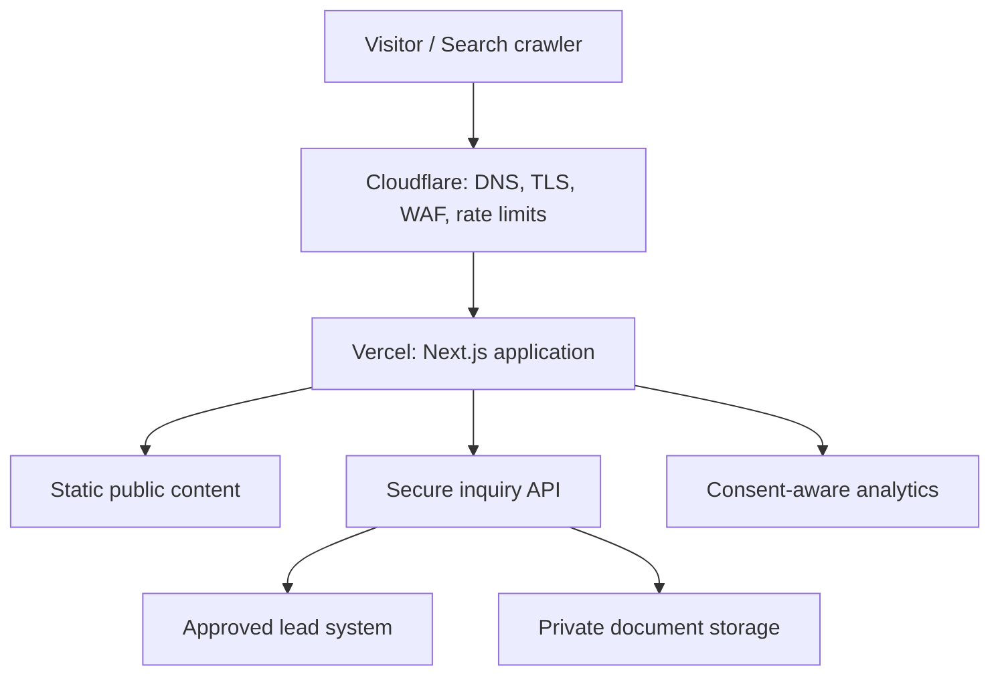

### 5.1 Trust boundaries

- Everything sent to the browser is public and must be treated as discoverable.
- Cloudflare is the public edge and first abuse-control layer.
- Vercel runs the application and server-side request handling.
- The inquiry endpoint is an untrusted-input boundary.
- The lead system and private object storage contain confidential business data.
- Analytics is an external data recipient and must receive only approved, non-sensitive event data.

## 6. Application and repository boundaries

The application should be a single Next.js project unless a proven operational requirement justifies a monorepo. Do not add microservices for Phase 1.

Recommended high-level boundaries:

```text
app/                  Route composition, layouts, metadata and route handlers
components/           Reusable UI and page-section components
content/              Approved public content and content records
lib/                  Framework-independent business and technical modules
lib/content/          Content loaders, schemas and selectors
lib/i18n/             Locale routing, messages and direction helpers
lib/seo/              Metadata, canonical, hreflang and JSON-LD builders
lib/inquiries/        Inquiry schema, service, repository and adapters
lib/uploads/          Upload policy and provider adapter
lib/analytics/        Typed event definitions and safe emitters
lib/security/         Input normalization, abuse checks and security helpers
styles/               Global styles and generated/approved design tokens
public/               Public immutable assets only
tests/                Unit, integration, accessibility and E2E tests
```

`FOLDER_STRUCTURE.md` will define the exact tree. The following dependency direction is mandatory:

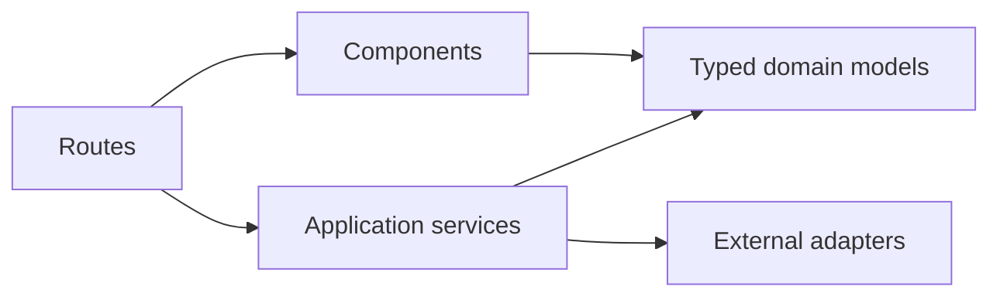

Routes and components may depend on domain modules. Domain modules must not depend on route files, React components, Vercel-specific request objects, or provider SDKs. External services must sit behind narrow adapters.

## 7. Routing and localization architecture

### 7.1 Public URL policy

- Phase 1 Persian URLs are unprefixed.
- The Persian homepage is `/`, not `/fa`.
- Future approved locales use stable prefixes such as `/en/...` and `/ar/...`.
- `/fa/...`, when encountered, must permanently redirect to the equivalent unprefixed Persian URL rather than create a duplicate.
- Unsupported locale routes must return a true `404`, not a fallback language page with HTTP `200`.
- Public slugs follow `ROUTES.md`; route code must not invent alternate slugs.
- Query strings must not become canonical URLs unless an approved indexable use case exists.

The localization layer may use an “as-needed” locale prefix strategy. Internally, locale-aware route composition is encouraged, but internal implementation paths must never leak into public canonical URLs.

### 7.2 Direction and language

- The root document must set `lang="fa"` and `dir="rtl"` for Persian.
- Locale configuration owns text direction; components must not hardcode global RTL assumptions.
- Use logical CSS properties such as `margin-inline-start`, `padding-inline`, `inset-inline-end`, and `text-align: start`.
- Phone numbers, URLs, email addresses, file names, standards, measurements, codes, and mixed Latin/Persian strings require explicit bidirectional isolation.
- Directional icons mirror only when their meaning is spatial or directional.
- DOM order follows reading and focus order. Visual reversal must not corrupt keyboard or screen-reader order.

### 7.3 Translation readiness

- UI messages and validation messages must be locale-addressable from the start.
- Content models must contain explicit locale variants or locale-specific records; do not mix translations in a single free-text field.
- A locale is published only when all required navigation, page content, metadata, validation, legal, and fallback messages are approved.
- Missing future translations must fail validation or remain unpublished. Do not silently fall back to Persian on an English or Arabic URL.

## 8. Rendering and caching strategy

### 8.1 Rendering matrix

| Route family | Default rendering | Cache policy | Reason |
| --- | --- | --- | --- |
| Homepage and core corporate pages | Static generation | Immutable per deployment | Fast, stable, indexable content |
| Capability, process, category and industry pages | Static generation | Immutable per deployment | Approved structured content |
| Projects/evidence | Static generation | Immutable per deployment or controlled revalidation | Verified public records only |
| Insight/resource index | Static generation | Build-time or tag-based revalidation after CMS approval | Search landing and archive |
| Article/resource detail | Static generation | Build-time or controlled revalidation | Indexable long-form content |
| Contact and RFQ page shell | Static generation | Immutable per deployment | Form UI can be static |
| Inquiry submission | Dynamic Route Handler | `no-store` | Confidential write operation |
| Upload authorization | Dynamic Route Handler | `no-store` | Short-lived security decision |
| Preview/draft routes | Dynamic and protected | `no-store`, `noindex` | Authorized editorial use only |
| Error pages | Static where possible | Deployment cache | Reliable recovery |

### 8.2 Cache rules

- Public source content should be built into the deployment until a CMS is approved.
- Never cache inquiry POST responses, upload authorizations, personalized errors, or confidential data.
- Do not call dynamic request APIs from static page trees without a documented reason.
- If a CMS is added, use explicit revalidation tags by content type and locale. Do not apply a single global short revalidation interval.
- Cache invalidation must occur only after approved content publication, not on every draft save.
- CDN cache behavior must be verified at the canonical host, not assumed from local behavior.

## 9. Content architecture

### 9.1 Phase 1 content source

Phase 1 public content is Git-managed and build-validated. This keeps publication reviewable and avoids premature CMS complexity.

Recommended formats:

- TypeScript or JSON records for structured entities and navigation;
- MDX or Markdown for approved editorial articles and resources;
- static asset manifests for images and downloadable public documents;
- Zod or equivalent schemas for every content collection.

### 9.2 Content loading rules

- Content loaders return typed domain records, not raw file structures.
- Validate required fields, slug uniqueness, locale, publication status, metadata, references, dates, media dimensions, and internal targets at build time.
- Unknown or unapproved values are omitted; do not show invented dashes, counters, badges, outcomes, partner logos, or prices.
- Draft and private records must never be included in production route generation, sitemaps, search indexes, feeds, or JSON bundles.
- Content transformations must be deterministic and testable.
- Rich text rendering must allowlist supported elements and sanitize any untrusted HTML.

### 9.3 CMS boundary

When a CMS is approved, it must implement the same domain contracts used by repository content. Page components must not import a CMS SDK directly. The approved pattern is:

```ts
interface ContentRepository {
  getPageByRoute(locale: string, route: string): Promise<PublicPage | null>;
  listPublishedArticles(locale: string): Promise<ArticleSummary[]>;
  getArticle(locale: string, slug: string): Promise<Article | null>;
  listPublishedEvidence(locale: string): Promise<EvidenceSummary[]>;
}
```

CMS selection, roles, preview, webhooks, publishing workflow, and migration belong in `CMS_ARCHITECTURE.md`.

## 10. UI and component architecture

- Implement the component contracts in `UI_COMPONENTS.md`; do not create alternate primitives that duplicate approved behavior.
- Separate primitives, composed patterns, and page sections.
- Page files compose data and sections; they should not contain large inline UI implementations.
- Business content must enter components through typed props, not hardcoded hidden constants.
- Server Components may pass serializable data to small interactive islands.
- Keep state local unless multiple distant consumers genuinely share it.
- Avoid global client state for navigation, content, inquiry forms, or theme unless a documented requirement exists.
- Prefer native HTML controls over custom widgets.
- Use CSS for simple hover, focus, reveal, and reduced-motion behavior. Add a motion library only for an approved interaction that CSS cannot express cleanly.
- Every interactive component must define loading, empty, error, disabled, focus, keyboard, reduced-motion, and narrow-screen behavior where applicable.

## 11. Inquiry and lead architecture

### 11.1 Core principle

The browser never talks directly to a CRM, email provider, database, or privileged storage API. It submits to an Ahan Asa server-controlled endpoint.

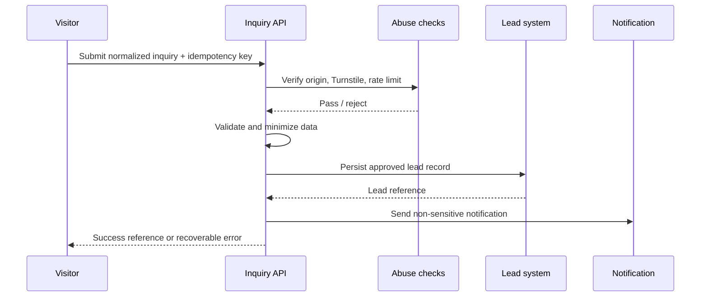

### 11.2 Endpoint contract

Recommended public endpoint:

```text
POST /api/inquiries
Content-Type: application/json
Cache-Control: no-store
```

The final payload is defined in `FORM_ARCHITECTURE.md`. The endpoint must:

1. enforce request body and header size limits;
2. verify accepted origin/host behavior where applicable;
3. validate Turnstile server-side when enabled;
4. apply edge and application-level abuse controls;
5. normalize Unicode, whitespace, phone, email, and enumerated values;
6. validate with the authoritative server schema;
7. reject unexpected fields instead of silently persisting them;
8. generate or verify an idempotency key;
9. persist to the approved system of record;
10. emit a non-sensitive operational result;
11. return a stable public error shape without internal details.

Recommended public response contract:

```ts
type InquiryResponse =
  | { ok: true; reference: string }
  | {
      ok: false;
      code:
        | "VALIDATION_ERROR"
        | "RATE_LIMITED"
        | "VERIFICATION_FAILED"
        | "SERVICE_UNAVAILABLE";
      fieldErrors?: Record<string, string[]>;
    };
```

Do not expose database IDs, provider errors, stack traces, internal email addresses, security-rule details, or raw integration responses.

### 11.3 Validation

- Client validation improves recovery but is never trusted.
- Client and server should share a schema only when doing so cannot leak server-only logic or secrets.
- Validation messages are localized and mapped to visible fields.
- Consent is never preselected.
- User-entered values must survive recoverable validation or network failure.
- Success is shown only after the lead system acknowledges persistence.
- A notification email is not sufficient evidence that a lead was durably stored unless email is the explicitly approved system of record.

### 11.4 Lead service abstraction

```ts
interface LeadRepository {
  create(input: ValidatedInquiry): Promise<{ reference: string }>;
}

interface LeadNotifier {
  notifyCreated(input: {
    reference: string;
    category: string;
    projectLocation?: string;
  }): Promise<void>;
}
```

Provider SDK calls belong in adapters. The production build must fail or the form must render an honest unavailable state when required integration configuration is missing. Never accept a lead and discard it silently.

### 11.5 Failure behavior

- Duplicate submission: return the existing public reference when safe.
- Lead persistence failure: return `SERVICE_UNAVAILABLE`; preserve user-entered client data for retry.
- Notification failure after successful persistence: log and alert operationally, but do not tell the user their persisted inquiry failed.
- Abuse rejection: return a generic safe response and do not reveal detection rules.
- Integration timeout: use bounded retries only for idempotent operations.
- Approved fallback contact information must come from configuration/content, not be invented by the component.

## 12. Secure document upload architecture

Document upload is **disabled by default** until storage, privacy, retention, malware scanning, operational access, and deletion policies are approved.

When enabled, use the following flow:

1. the browser requests upload authorization from a protected server endpoint;
2. the server validates file intent, count, declared type, size, inquiry context, and abuse controls;
3. the server returns a short-lived, single-purpose signed upload authorization;
4. the browser uploads directly to a private quarantine location;
5. the storage event or server workflow validates actual bytes and performs malware scanning;
6. only a clean object is attached to the lead record;
7. authorized staff access files through audited, short-lived signed downloads;
8. retention and deletion follow the approved policy.

Mandatory rules:

- private bucket/container; no public ACL;
- random opaque object keys; never trust the original filename as a storage path;
- allowlist business-required extensions and verified MIME signatures;
- explicit maximum file size and count;
- short expiration for upload and download authorization;
- encryption in transit and provider-supported encryption at rest;
- quarantine until scanning is complete;
- never parse office, archive, CAD, or PDF content in the public request process;
- no attachment bytes in application logs, analytics, email bodies, or source control;
- preserve the original display name only as sanitized metadata;
- reject archives, executable content, macros, or ambiguous formats unless a specific approved workflow supports them;
- remove orphaned uploads through a scheduled retention job;
- publish only privacy and security claims that match the implemented workflow.

If this pipeline is not ready, the interface must present an approved alternate submission path instead of a nonfunctional or insecure control.

## 13. Security architecture

### 13.1 Edge controls

Cloudflare should provide:

- proxied DNS for the production host;
- TLS in Full (strict) mode;
- redirect enforcement for scheme and canonical host;
- managed WAF rules appropriate to the plan;
- rate limiting for inquiry and upload endpoints;
- bot/abuse controls with carefully monitored thresholds;
- Turnstile for high-risk public submissions;
- caching rules that exclude dynamic confidential endpoints.

Edge controls supplement application validation; they do not replace it.

### 13.2 Application controls

- Treat all request data as untrusted.
- Validate input at every external boundary.
- Escape output by default; do not use `dangerouslySetInnerHTML` for untrusted content.
- Sanitize any approved rich HTML with a restrictive allowlist.
- Use parameterized database operations or a safe ORM adapter.
- Apply least privilege to every service credential.
- Keep server-only modules explicitly separated from client-importable modules.
- Prevent open redirects by allowlisting internal destinations.
- Do not trust client-provided IP, locale, role, price, filename, MIME type, or authorization state.
- Use cryptographically strong opaque public references.
- Avoid account/session architecture in Phase 1 because no public account feature is approved.

### 13.3 Security headers

Define and test at minimum:

- `Content-Security-Policy` with the smallest approved source allowlist;
- `Strict-Transport-Security` after HTTPS and subdomain behavior are verified;
- `X-Content-Type-Options: nosniff`;
- `Referrer-Policy` appropriate to analytics and privacy requirements;
- `Permissions-Policy` disabling unused browser capabilities;
- frame protection through CSP `frame-ancestors`;
- explicit cache headers for dynamic responses.

Do not weaken CSP with broad wildcards or `unsafe-eval` to accommodate an unreviewed script. Third-party embeds must be justified, documented, consent-aware where required, and added to CSP intentionally.

### 13.4 Secrets and environments

- Secrets live in environment-specific secret stores, never in Git, public runtime config, screenshots, or generated documentation.
- Only variables prefixed for browser exposure may enter client bundles, and those values must be intentionally public.
- Preview and production use separate credentials and data destinations.
- Local `.env` files remain ignored; provide a committed `.env.example` containing names and safe descriptions only.
- Rotate any credential exposed in logs, commits, tickets, or chat.
- Do not print full environment objects during builds or request handling.

### 13.5 Supply-chain controls

- Use one package manager and a committed lockfile.
- Install dependencies only for a documented need.
- Review package maintenance, license, bundle impact, and server/client behavior.
- Run dependency and code scanning in CI.
- Do not automatically apply breaking upgrades.
- Pin CI actions and deployment integrations to reviewed versions or supported release channels.

## 14. Privacy and data governance

The inquiry system must follow data minimization.

- Collect only fields needed for a useful first procurement response.
- Do not send names, phones, emails, free-text messages, filenames, document content, quotations, or quantities to analytics.
- Do not use inquiry data for marketing unless an explicit, lawful, separate consent and workflow are approved.
- Separate operational inquiry consent from optional marketing consent.
- Define data owner, authorized roles, retention duration, deletion workflow, export workflow, incident contact, and processor list before production.
- Redact PII and sensitive commercial information from logs and error reporting.
- Document cross-border data processing before choosing storage, analytics, CRM, or email regions.
- Privacy-page claims must be generated from actual operational policy, not generic boilerplate.

## 15. SEO architecture

### 15.1 Server-owned SEO

Metadata, canonical URLs, alternates, robots rules, and JSON-LD are generated on the server from the same approved content records that render the visible page.

- Use the Next.js Metadata API or equivalent server mechanism.
- One indexable URL has one self-referencing canonical.
- All URL construction uses one central absolute-URL helper.
- Canonical, Open Graph URL, sitemap URL, JSON-LD URL, and internal preferred URL must agree.
- Structured data must describe visible, verified content.
- Do not publish empty, draft, filtered, search, preview, or system URLs in the sitemap.
- Do not use client-only rendering for primary page content or SEO-critical links.
- Pagination uses crawlable links when approved; infinite scroll is not the only archive access method.

### 15.2 Canonical host

Recommended production canonical origin:

```text
https://www.ahanassa.com
```

The exact origin must be provided through a validated server environment variable such as `SITE_URL`. All HTTP, apex-host, legacy, and noncanonical variants must resolve through a single-hop permanent redirect to the canonical HTTPS URL while preserving approved paths and query strings.

If the business chooses the apex host instead, change the central configuration and edge redirects together before launch. Never mix apex and `www` signals.

### 15.3 Locale SEO

- Phase 1 Persian pages are self-canonical and unprefixed.
- Add `hreflang` only when a real translated equivalent is published.
- Every alternate cluster must include reciprocal alternates and the current page.
- Add `x-default` only after the default behavior is explicitly approved.
- Locale-specific metadata and structured text must be human-approved; do not translate only the title while leaving body content Persian.

### 15.4 Technical SEO endpoints

Implement from approved route/content registries:

- `/robots.txt`;
- `/sitemap.xml` or a sitemap index when scale requires it;
- metadata files such as favicon and social images;
- custom `404` and appropriate `not-found` behavior;
- permanent redirects from `REDIRECTS.md`;
- `Organization`, `WebSite`, `BreadcrumbList`, `Article`, and other schema only where `STRUCTURED_DATA.md` approves them.

Detailed behavior remains subordinate to `METADATA_SPEC.md`, `STRUCTURED_DATA.md`, `HREFLANG_CANONICAL.md`, `SITEMAP_ROBOTS_SPEC.md`, and `REDIRECTS.md`.

## 16. Analytics and event architecture

Analytics is adapter-based and must not be scattered as direct `dataLayer.push` or vendor calls throughout components.

```ts
type AnalyticsEvent =
  | { name: "cta_select"; ctaId: string; placement: string; locale: string }
  | { name: "inquiry_start"; formId: string; locale: string }
  | { name: "inquiry_submit"; formId: string; locale: string }
  | { name: "inquiry_success"; formId: string; locale: string }
  | { name: "inquiry_error"; formId: string; category: string; locale: string }
  | { name: "contact_select"; method: string; placement: string; locale: string }
  | { name: "resource_select"; resourceId: string; locale: string };
```

Rules:

- Final event names and parameters belong in `ANALYTICS_TRACKING.md`.
- Events use stable IDs, not Persian visible labels as identifiers.
- Never include PII, message text, uploaded filenames, exact quote values, or document metadata.
- `inquiry_success` fires only after server-confirmed persistence.
- Avoid duplicate events during hydration, rerender, navigation, or retry.
- Marketing tags must respect the approved consent and regional policy.
- Production IDs must come from environment configuration; missing IDs must not break the site.
- Development and preview traffic must be isolated or disabled.

## 17. Performance architecture

### 17.1 User-experience targets

At the 75th percentile for real users, target:

- Largest Contentful Paint: `≤ 2.5 s`;
- Interaction to Next Paint: `≤ 200 ms`;
- Cumulative Layout Shift: `≤ 0.10`.

These are acceptance targets, not guarantees independent of network and device conditions.

### 17.2 Implementation rules

- Keep the first-view route primarily server-rendered.
- Ship client JavaScript only for approved interaction.
- Use route-level and component-level code splitting where it reduces real payload.
- Do not load carousel, animation, map, chat, video, or form libraries globally.
- Reserve intrinsic media dimensions and aspect ratios.
- Preload only the true LCP asset and critical approved fonts.
- Self-host approved fonts when licensing permits; subset by required scripts and weights.
- Do not download unnecessary Latin, Arabic, or variable-font ranges for a Persian-only launch.
- Use modern image formats through the framework image pipeline while preserving a valid fallback.
- Keep decorative video out of the critical path and do not autoplay it by default.
- Third-party scripts load after consent and/or interaction when possible.
- Prevent layout shift from header, cookie controls, forms, images, fonts, and validation messages.
- Every performance exception must include a measured before/after result.

### 17.3 Build budgets

The initial implementation must establish automated budgets in CI for:

- client JavaScript by representative route;
- largest image and total first-view media;
- font files and loaded weights;
- Lighthouse performance, accessibility, SEO, and best-practice regressions;
- Core Web Vitals after production traffic is available.

Concrete byte thresholds should be recorded in `PERFORMANCE_GUIDELINES.md` after the first approved page templates establish a measured baseline. Do not set arbitrary budgets that the chosen framework cannot reliably enforce.

## 18. Media and font pipeline

### 18.1 Public imagery

- Store only approved public assets in `public/` or an approved public media source.
- Use descriptive stable filenames where practical; do not expose confidential project/customer naming.
- Provide width, height, aspect ratio, focal guidance, alt-text status, rights status, and approval state in the asset record.
- Remote image hosts require an explicit allowlist.
- SVG is treated as code: use trusted, reviewed SVG only and sanitize external sources.
- Do not optimize downloadable engineering documents as page images.

### 18.2 Fonts

- Use the approved Persian and Latin families from the brand/design specifications.
- Load only required weights.
- Prefer framework-managed local fonts with deterministic fallback metrics.
- Define Persian numerals, Latin identifiers, and mixed technical text behavior in typography utilities.
- Font failure must preserve readable content and stable layout.

## 19. Accessibility architecture

Target WCAG 2.2 Level AA for public pages and inquiry flows.

- Semantic HTML and landmarks come before ARIA.
- One clear page `h1`; headings follow content hierarchy.
- All functionality works by keyboard.
- Focus order matches DOM and reading order.
- Focus indicators are visible on light, dark, and copper-accent contexts.
- Forms have visible labels, specific errors, an error summary when useful, and accessible status announcements.
- Tap targets and input sizing follow the approved responsive/accessibility rules.
- Color is never the sole carrier of meaning.
- Reduced-motion preferences are respected without hiding content.
- Zoom at `200%` and narrow viewport reflow must not require two-dimensional scrolling except legitimate data tables.
- Automated accessibility tests supplement, but do not replace, manual keyboard and screen-reader QA.

## 20. Error handling and observability

### 20.1 Error model

- Expected domain failures use typed results.
- Unexpected failures are caught at route boundaries and logged with a correlation ID.
- Public errors are calm, localized, actionable, and free of technical details.
- The site must provide usable not-found, generic-error, and service-unavailable states.
- Do not convert real `404` or server failures into misleading `200` pages.

### 20.2 Logging

Use structured server logs containing only what operations need, such as:

- timestamp;
- environment;
- route or operation;
- correlation ID;
- result category;
- safe duration;
- provider status category without raw payload.

Never log full request bodies, contact details, message text, Turnstile tokens, authorization headers, signed URLs, file contents, or secrets.

### 20.3 Monitoring

Monitor at minimum:

- deployment and build failures;
- `5xx` rate;
- inquiry success/failure ratio;
- integration latency and timeouts;
- abuse rejection volume;
- upload scan failures when uploads are enabled;
- Core Web Vitals;
- crawl/indexing anomalies after launch.

An error-monitoring provider may be added only after privacy, data scrubbing, access, retention, and environment separation are configured.

## 21. Deployment architecture

### 21.1 Environment model

| Environment | Purpose | Data/integration policy |
| --- | --- | --- |
| Local | Development and unit testing | Local/test services only; no production secrets |
| Preview | Review each approved branch/PR | Isolated test lead destination; protected from indexing |
| Production | Public canonical website | Production integrations and monitoring only |

Preview deployments must include `noindex` protection and must not send test leads to production sales channels.

### 21.2 Delivery flow

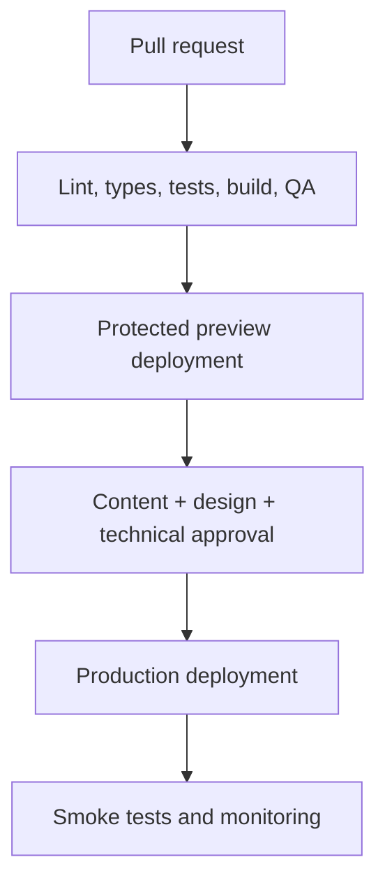

Required production behavior:

- Vercel is connected to the approved Git repository and production branch.
- Cloudflare fronts the canonical domain.
- TLS, canonical redirects, cache exclusions, WAF, and rate limiting are verified after DNS is active.
- Environment variables are scoped separately for local, preview, and production.
- Production deployment is blocked when required checks fail.
- Rollback uses a known healthy deployment; do not “fix forward” blindly during an active incident.
- Database migrations, if introduced, require backward-compatible rollout and an explicit rollback plan.

### 21.3 Post-deploy smoke tests

At minimum, verify:

- canonical host and redirect matrix;
- homepage and representative deep routes return intended status codes;
- Persian `lang`, RTL behavior, metadata, canonical, and structured data;
- robots and sitemap behavior;
- inquiry success and controlled failure using a production-safe test path;
- no production secrets or source maps are publicly exposed;
- security headers;
- analytics event receipt without PII;
- image, font, and downloadable-resource delivery;
- mobile navigation and keyboard focus;
- error and not-found pages.

## 22. Environment-variable contract

Final names belong in `ENVIRONMENT_VARIABLES.md`. The architecture expects categories similar to:

```text
# Public and safe to expose only when intentionally prefixed
NEXT_PUBLIC_SITE_ENV=
NEXT_PUBLIC_GTM_ID=
NEXT_PUBLIC_TURNSTILE_SITE_KEY=

# Server only
SITE_URL=
TURNSTILE_SECRET_KEY=
LEAD_PROVIDER=
LEAD_DATABASE_URL=
CRM_API_URL=
CRM_API_TOKEN=
MAIL_PROVIDER_API_KEY=
MAIL_NOTIFICATION_RECIPIENT=
UPLOAD_PROVIDER=
UPLOAD_BUCKET=
UPLOAD_REGION=
UPLOAD_ACCESS_KEY_ID=
UPLOAD_SECRET_ACCESS_KEY=
UPLOAD_SIGNING_SECRET=
```

Rules:

- This list is architectural, not permission to provision every service.
- Remove variables for integrations not selected.
- Fail fast on missing required server configuration.
- Do not fail the public content build for an optional analytics ID.
- Validate URL, enum, boolean, and number variables at startup/build time.
- Never read server secrets from Client Components.

## 23. Testing strategy

### 23.1 Test layers

| Layer | Required coverage |
| --- | --- |
| Static analysis | TypeScript strict checks, ESLint, formatting, forbidden imports |
| Unit | Schemas, content loaders, URL builders, metadata, locale helpers, normalizers |
| Component | Form fields, errors, navigation, disclosure, direction, mixed text |
| Integration | Inquiry service with provider adapters, idempotency, error mapping |
| E2E | Primary navigation, representative pages, inquiry success/failure, 404, locale behavior |
| Accessibility | Automated axe-style checks plus manual keyboard and screen-reader checks |
| SEO | Canonical, metadata, status codes, sitemap membership, robots and JSON-LD validity |
| Security | Input rejection, rate-limit behavior, header checks, upload policy when enabled |
| Visual | Approved key pages and component states at representative widths |

### 23.2 Mandatory CI commands

The repository must expose stable scripts equivalent to:

```text
pnpm lint
pnpm typecheck
pnpm test
pnpm test:e2e
pnpm build
```

Use framework-supported commands appropriate to the locked version. CI must not rely on a developer’s global tools.

### 23.3 Critical E2E scenarios

- Persian homepage loads without client-side content reconstruction.
- Desktop and mobile navigation expose the same essential destinations.
- `/fa/...` redirects correctly when such a legacy form is requested.
- Unknown routes return `404`.
- Inquiry validation maps errors to fields and preserves input.
- Valid inquiry creates exactly one lead and shows a server-confirmed reference.
- Duplicate submission does not create duplicate leads.
- Provider outage returns a recoverable, honest state.
- Turnstile test keys are used outside production; security is not bypassed by shipping a hidden flag.
- Reduced motion, keyboard navigation, and focus restoration work.
- Canonical, sitemap, and structured data URLs use the production origin in production builds.

## 24. Claude Code implementation rules

Before changing application code, Claude Code must:

1. read `CLAUDE.md` and all task-relevant approved specifications;
2. inspect the existing implementation and lockfile;
3. identify whether the change affects routes, content models, SEO, forms, analytics, security, or localization;
4. preserve unrelated user changes;
5. state assumptions only where the documents do not already decide them;
6. implement the smallest coherent change;
7. run relevant validation and report exact results.

Claude Code must not:

- install or replace the framework, UI system, package manager, CMS, CRM, database, analytics, storage, or motion library without approval;
- create production integrations with guessed credentials or endpoints;
- place secrets in code or documentation;
- convert server-rendered page trees into Client Components for convenience;
- duplicate content across page files;
- invent pages, routes, prices, stock, projects, statistics, testimonials, certifications, contact details, or service areas;
- publish future locales with incomplete content;
- build a public catalog or daily-price system unless the project scope changes;
- weaken validation, CSP, rate limiting, upload policy, or accessibility to make a test pass;
- declare success without running the relevant checks.

## 25. Architecture decision gates

The architecture is implementable now for public content and page composition. The following decisions gate specific production features:

| Decision | Default/current state | Required before |
| --- | --- | --- |
| Canonical host | Recommended `https://www.ahanassa.com`; centralize in `SITE_URL` | Production DNS, metadata and redirects |
| Phase 1 content source | Git-managed typed content | Content implementation |
| CMS provider | Not selected; no CMS required for launch | Editorial dashboard or on-demand publishing |
| Lead system of record | Not yet approved | Enabling production inquiry submission |
| Notification channel | Not yet approved | Operational lead alerts |
| Upload storage and scanner | Not yet approved; upload disabled | Enabling invoice/material-list upload |
| File limits and allowed formats | Must be defined in `FORM_ARCHITECTURE.md` | Upload UI and authorization endpoint |
| Privacy retention and access roles | Not yet approved | Collecting production personal/confidential data |
| GTM/GA4 IDs and consent policy | Not yet approved | Enabling production analytics tags |
| Error-monitoring provider | Optional and not selected | Sending production errors externally |
| Future locales | Not approved for publication | Generating prefixed routes or hreflang |

Unknown decisions must remain explicit configuration or disabled capability. They must not be filled with plausible-looking production defaults.

## 26. Phase 1 implementation sequence

1. **Foundation** — initialize the approved stack, strict TypeScript, linting, tests, tokens, fonts, root layout, locale direction, and environment validation.
2. **Content engine** — implement schemas, loaders, publication rules, routes, and build-time integrity checks.
3. **Global experience** — implement header, navigation, footer, skip link, error boundaries, not-found behavior, and responsive foundations.
4. **Public pages** — build approved page templates and content with Server Components and static generation.
5. **SEO foundation** — implement central URL utilities, metadata, canonical rules, JSON-LD builders, robots, sitemap, redirects, and validation.
6. **Inquiry experience** — build form UI and server schema; keep production submission disabled until the lead system, privacy, and fallback are approved.
7. **Secure integrations** — add approved lead repository, notifications, Turnstile, rate limiting, and uploads only when their decision gates are complete.
8. **Analytics** — add the typed event layer and approved provider configuration without sensitive payloads.
9. **Hardening** — complete accessibility, security headers, performance budgets, E2E tests, preview QA, and operational monitoring.
10. **Launch** — verify DNS, redirects, canonical host, production configuration, smoke tests, Search Console, and rollback readiness.

## 27. Definition of done

The technical architecture is correctly implemented when:

- public pages are fast, accessible, server-rendered, and indexable;
- Phase 1 Persian URLs are unprefixed and globally consistent;
- route, canonical, sitemap, JSON-LD, and internal URL sources agree;
- page and component code uses typed approved content rather than invented data;
- Server Components remain the default and client JavaScript is justified;
- confidential inquiry data crosses only the approved secure server boundary;
- a production inquiry is acknowledged only after durable lead persistence;
- document upload is either fully secured and approved or honestly disabled;
- preview and production environments are isolated;
- secrets and sensitive values are absent from Git, browser bundles, logs, and analytics;
- security headers, abuse controls, validation, error handling, and monitoring are active;
- Core Web Vitals targets and accessibility acceptance checks pass;
- mandatory lint, type, test, E2E, and production-build checks pass;
- launch smoke tests and rollback procedures are documented and verified;
- no Phase 1 non-goal has been introduced accidentally.

## 28. Related project documents

This document must be read together with:

- `PROJECT_BRIEF.md`
- `BRAND_GUIDELINES.md`
- `DESIGN_DIRECTION.md`
- `DESIGN_SYSTEM.md`
- `UI_COMPONENTS.md`
- `MOTION_GUIDELINES.md`
- `RESPONSIVE_RULES.md`
- `ACCESSIBILITY.md`
- `SITEMAP.md`
- `INFORMATION_ARCHITECTURE.md`
- `ROUTES.md`
- `PAGE_SPECIFICATIONS.md`
- `CONTENT_MODEL.md`
- `MEDIA_GUIDELINES.md`
- `SEO_STRATEGY.md`
- `SEO_PAGE_MAP.md`
- `METADATA_SPEC.md`
- `STRUCTURED_DATA.md`
- `INTERNAL_LINKING.md`
- `REDIRECTS.md`
- `SITEMAP_ROBOTS_SPEC.md`
- `STACK.md`
- `FOLDER_STRUCTURE.md`
- `COMPONENT_ARCHITECTURE.md`
- `CMS_ARCHITECTURE.md`
- `API_INTEGRATIONS.md`
- `FORM_ARCHITECTURE.md`
- `ANALYTICS_TRACKING.md`
- `SECURITY_GUIDELINES.md`
- `PERFORMANCE_GUIDELINES.md`
- `DEPLOYMENT_ARCHITECTURE.md`
- `ENVIRONMENT_VARIABLES.md`
- `LOCALIZATION.md`
- `HREFLANG_CANONICAL.md`
- `TESTING_STRATEGY.md`
- `QA_CHECKLIST.md`
- `PRE_DEPLOY_CHECKLIST.md`
- `POST_DEPLOY_CHECKLIST.md`
- `CLAUDE.md`
- `DEVELOPMENT_RULES.md`
- `DECISIONS.md`

If a referenced document does not yet exist, this architecture remains the controlling interim rule for its subject.

## 29. Official implementation references

Use official documentation and the exact locked dependency version when implementing:

- [Next.js App Router](https://nextjs.org/docs/app)
- [Next.js Server and Client Components](https://nextjs.org/docs/app/getting-started/server-and-client-components)
- [Next.js Metadata API](https://nextjs.org/docs/app/api-reference/functions/generate-metadata)
- [Vercel environment variables](https://vercel.com/docs/environment-variables)
- [Vercel Next.js deployment](https://vercel.com/docs/frameworks/full-stack/nextjs)
- [Cloudflare Turnstile server-side validation](https://developers.cloudflare.com/turnstile/get-started/server-side-validation/)
- [Cloudflare rate limiting rules](https://developers.cloudflare.com/waf/rate-limiting-rules/)
- [Google localized page guidance](https://developers.google.com/search/docs/specialty/international/localized-versions)
- [Google canonical URL guidance](https://developers.google.com/search/docs/crawling-indexing/consolidate-duplicate-urls)
- [Google structured data introduction](https://developers.google.com/search/docs/appearance/structured-data/intro-structured-data)

Third-party examples are not authoritative when they conflict with official documentation, this architecture, or the locked project version.

---

## Approval record

| Field | Value |
| --- | --- |
| Document owner | Ahan Asa project owner |
| Technical owner | TBD |
| Version | 1.0 |
| Status | Draft for approval |
| Effective date | After project-owner approval |
| Review trigger | Material scope, provider, localization, data, security, or deployment change |

# Ahan Asa Website — Testing Strategy

> **Brand:** Ahan Asa | آهن آسا  
> **Domain:** `ahanassa.com`  
> **Document:** `TESTING_STRATEGY.md`  
> **Status:** Draft v1.0 — implementation and release contract  
> **Last updated:** 2026-08-25  
> **Launch locale:** Persian (`fa-IR`), fully RTL  
> **Application model:** Next.js App Router, TypeScript, static-first, server-first  
> **Delivery model:** Vercel behind Cloudflare

---

## 1. Purpose

This document defines how the Ahan Asa website must be tested before code is merged, before a release is promoted, and after production deployment. It is an implementation contract for Claude Code, human developers, reviewers, and release owners.

The testing strategy must provide evidence that the website:

1. renders approved Persian content accurately and accessibly;
2. preserves the canonical, unprefixed Persian URL model;
3. converts qualified visitors through the `/request` inquiry journey;
4. validates and stores inquiry data securely and truthfully;
5. remains usable across supported browsers, viewport sizes, input methods, and assistive technologies;
6. meets the approved SEO, performance, privacy, analytics, and security requirements;
7. fails safely when integrations or third-party services are unavailable;
8. can be deployed and rolled back without silently changing public behavior.

Passing a build is not sufficient evidence of quality. A release is acceptable only when the relevant automated checks, targeted manual checks, and production smoke checks have passed.

---

## 2. Product and Architecture Context

Ahan Asa is a premium B2B steel procurement website. Phase 1 is not an e-commerce store, supplier marketplace, customer portal, public inventory system, or live price board.

The approved architecture is:

| Concern | Phase 1 baseline |
|---|---|
| Framework | Next.js App Router |
| Language | TypeScript in strict mode |
| Rendering | Static generation and React Server Components by default |
| Client behavior | Small, justified interactive islands |
| Primary locale | Persian (`fa-IR`), fully RTL |
| Persian URLs | Canonical and unprefixed |
| Future locales | English and Arabic structurally supported but unpublished until complete |
| Primary conversion route | `/request` |
| Inquiry endpoint | `/api/inquiries` |
| Upload endpoint | Conditional `/api/uploads`, disabled until the complete secure workflow is approved |
| Hosting | Vercel behind Cloudflare |
| Analytics | Consent-aware GTM/GA4 after approved configuration |
| Abuse protection | Server validation, rate limiting, and approved bot protection |

Tests must enforce this scope. They must not normalize or legitimize unapproved features such as carts, checkout, public prices, customer accounts, or fake lead integrations.

---

## 3. Source of Truth and Conflict Rules

Testing verifies the implementation against approved project documents; it does not redefine them.

Use this hierarchy:

1. `CLAUDE.md` and `PROJECT_BRIEF.md`;
2. `TECHNICAL_ARCHITECTURE.md`;
3. the specialized document that owns the behavior being tested;
4. this `TESTING_STRATEGY.md`;
5. `DEVELOPMENT_RULES.md` and `CODING_STANDARDS.md`;
6. task-specific acceptance criteria.

Examples of governing documents:

| Test concern | Governing documents |
|---|---|
| Routes, redirects, status codes | `ROUTES.md`, `SITEMAP_ROBOTS_SPEC.md`, `REDIRECTS.md` |
| Canonical and locale behavior | `LOCALIZATION.md`, `HREFLANG_CANONICAL.md` |
| Metadata and structured data | `METADATA_SPEC.md`, `STRUCTURED_DATA.md` |
| Inquiry and upload behavior | `FORM_ARCHITECTURE.md`, `API_INTEGRATIONS.md`, `DATA_ARCHITECTURE.md` |
| Security and privacy | `SECURITY_GUIDELINES.md`, `ENVIRONMENT_VARIABLES.md` |
| Accessibility | `ACCESSIBILITY.md` |
| Responsive behavior | `RESPONSIVE_RULES.md` |
| Components | `COMPONENT_ARCHITECTURE.md`, `UI_COMPONENTS.md` |
| Performance | `PERFORMANCE_GUIDELINES.md`, `IMAGE_OPTIMIZATION.md`, `FONT_STRATEGY.md`, `CACHING_STRATEGY.md` |
| Analytics | `ANALYTICS_TRACKING.md` |
| Deployment | `DEPLOYMENT_ARCHITECTURE.md` |

If documents conflict, Claude Code must not alter a test merely to make the current implementation pass. It must identify the conflict, preserve the safer working behavior, and record or request a decision. A `TBD` must remain a `TBD`; tests must not convert it into an assumed production rule.

---

## 4. Testing Objectives

### 4.1 Correctness

- Approved routes render the correct page and content model.
- Components honor their documented variants, states, and boundaries.
- Inquiry validation produces deterministic, user-understandable results.
- Server behavior is authoritative at every trust boundary.
- A successful response is returned only after the approved durable lead operation succeeds.

### 4.2 User trust

- The site never reports a false inquiry success.
- Contact details, claims, evidence, and calls to action are approved and consistent.
- Personal and project data are not exposed through URLs, client bundles, analytics, or logs.
- Unavailable capabilities are not presented as operational.

### 4.3 Discoverability

- Canonicals, hreflang, metadata, sitemap, robots directives, redirects, and structured data match the approved route model.
- Primary content and navigation are present in server-rendered HTML.
- Preview, Vercel, API, and private routes do not leak into indexable surfaces.

### 4.4 Inclusive usability

- Core journeys work with keyboard, touch, pointer, zoom, reduced motion, forced colors, and representative screen readers.
- Persian reading order, bidi behavior, form labels, errors, and numbers remain understandable.
- Future LTR support is not blocked by direction-specific component assumptions.

### 4.5 Operational confidence

- Pull requests receive fast, deterministic feedback.
- High-risk paths receive deeper integration and end-to-end coverage.
- Deployments receive read-only production verification.
- Failures identify the affected requirement rather than producing opaque snapshots.

---

## 5. Risk-Based Test Priorities

Testing effort must follow risk, not raw file count.

| Priority | Area | Failure impact | Required evidence |
|---|---|---|---|
| P0 | Inquiry submission and durable persistence | Lost or falsely acknowledged lead | Unit, integration, contract, E2E, failure-path tests |
| P0 | Personal data and document handling | Confidentiality or legal breach | Security, integration, negative, logging/privacy tests |
| P0 | Production routing and canonical domain | Traffic/indexing loss | Route, redirect, SEO, deployment smoke tests |
| P1 | Navigation and primary CTAs | Broken discovery or conversion | Component and E2E tests |
| P1 | Metadata, sitemap, robots, JSON-LD | Search visibility or eligibility loss | Build-time and deployed-page tests |
| P1 | Accessibility of core journeys | Excluded users and compliance failure | Automated plus manual accessibility tests |
| P1 | Persian RTL and responsive layouts | Major usability failure | Component, visual, browser, and manual tests |
| P1 | Security controls and abuse resistance | Service or data compromise | Static, dependency, API, header, and abuse tests |
| P2 | Analytics events and consent | Corrupted measurement or privacy risk | Typed event, consent, and browser tests |
| P2 | Media and motion | Performance or comprehension degradation | Visual, accessibility, and performance tests |
| P2 | Integration degradation | Misleading state or operational disruption | Fault-injection and fallback tests |
| P3 | Low-risk presentational refinements | Minor visual inconsistency | Focused component or visual checks |

P0 failures block merge and release. P1 failures block release unless the governing owner approves a documented, time-bounded exception. P2 and P3 exceptions require documented impact and follow-up ownership.

---

## 6. Core Principles

### 6.1 Test observable behavior

Prefer assertions on accessible roles, names, visible states, generated metadata, HTTP behavior, persisted outcomes, and approved side effects. Avoid tests coupled to private component state, internal React implementation details, or incidental DOM structure.

### 6.2 Use the smallest effective test level

Pure rules belong in unit tests. Component interaction belongs in component tests. Trust boundaries and adapters belong in integration or contract tests. Only complete user journeys belong in E2E tests.

### 6.3 Server validation is authoritative

Client validation improves usability but never replaces API validation. Every client validation rule with security or data-integrity impact must also be verified at the server boundary.

### 6.4 Test failure paths deliberately

For forms, uploads, storage, CRM, analytics, and network-dependent behavior, the unhappy paths are release requirements. Timeouts, malformed responses, duplicate submissions, provider rejection, and partial dependency failure must not create false success.

### 6.5 Keep tests deterministic

Freeze time where time matters. Control randomness. Do not rely on shared production records, external network availability, arbitrary sleeps, or execution order.

### 6.6 Accessibility is not snapshot coverage

Automated accessibility scanning is necessary but incomplete. Keyboard, focus, zoom, reading order, screen-reader announcements, reduced motion, and content clarity require manual verification.

### 6.7 Production smoke tests are non-destructive

Production checks must be read-only by default. A real inquiry may be submitted only through an explicitly approved synthetic-lead procedure with tagging, ownership, notification expectations, and cleanup rules.

### 6.8 No sensitive test data

Tests must use synthetic names, phone numbers, emails, company names, inquiry descriptions, and files. Never copy real customer, supplier, employee, quotation, invoice, or project data into fixtures, snapshots, logs, screenshots, or CI artifacts.

---

## 7. Test Portfolio

The project uses a layered portfolio rather than a rigid numeric pyramid.

| Level | Purpose | Typical scope | Execution |
|---|---|---|---|
| Static checks | Prevent invalid code and content | TypeScript, lint, schemas, forbidden imports | Every change |
| Unit tests | Verify pure rules and transforms | Validators, builders, selectors, normalization | Every change |
| Component tests | Verify UI semantics and interaction | Forms, navigation, accordions, dialogs, feedback | Every change |
| Integration tests | Verify internal boundaries | Route Handlers, repositories, adapters, content loaders | Every relevant change |
| Contract tests | Verify external interface assumptions | CRM, storage, Turnstile, analytics payloads | Every relevant change |
| E2E tests | Verify critical user journeys | Route discovery, inquiry flow, navigation | Preview/main |
| Non-functional tests | Verify quality characteristics | Accessibility, SEO, performance, security, visual | Preview/release |
| Production smoke tests | Verify deployed essentials | Domain, redirects, headers, primary pages | After deployment |

The suite should contain many fast tests and a small, high-value E2E layer. Do not reproduce every unit permutation in a browser test.

---

## 8. Recommended Test Tooling

Use the exact project-approved and lockfile-pinned versions. If `STACK.md` selects an equivalent tool, follow `STACK.md`.

| Need | Recommended baseline |
|---|---|
| Test runner and coverage | Vitest with V8 coverage |
| DOM and component behavior | Testing Library with `@testing-library/jest-dom` |
| User interaction | `@testing-library/user-event` |
| Browser E2E | Playwright |
| Automated accessibility | `axe-core` through an approved Playwright or component integration |
| HTTP dependency simulation | MSW or adapter-level fakes |
| Schema validation | Project-approved Zod-compatible schemas |
| Performance regression | Lighthouse CI plus Web Vitals monitoring |
| Security checks | Secret scanning, dependency audit, static analysis, and safe preview scanning |

Rules:

- Do not introduce both Vitest and Jest without an approved migration reason.
- Do not install a second browser automation framework for convenience.
- Do not call live third-party services from pull-request tests.
- Do not use snapshot testing as the primary assertion strategy.
- Do not update snapshots automatically in CI.
- Any new testing dependency must have a clear owner, locked version, and justified maintenance cost.

---

## 9. Static and Build-Time Checks

Every pull request must run:

1. dependency installation from the committed `pnpm` lockfile;
2. formatting verification where configured;
3. linting with zero unapproved errors;
4. TypeScript strict checking;
5. unit and component tests;
6. production build;
7. content/schema validation;
8. route, metadata, and structured-data validation where generated at build time;
9. forbidden import and server/client boundary checks where configured;
10. secret and high-confidence credential scanning.

The build must fail when:

- required public content is missing;
- a route record violates its schema;
- two canonical pages claim the same route unexpectedly;
- a server-only module enters a client bundle;
- an unpublished locale is emitted as an indexable route;
- structured data cannot be serialized safely;
- a required environment variable is missing from an environment that actually uses the capability;
- an optional, disabled integration incorrectly becomes required for static public pages.

---

## 10. Unit Testing

Unit tests must cover deterministic functions without rendering the full application.

### 10.1 Required targets

- inquiry schemas and field-level constraints;
- Persian and Latin digit normalization where approved;
- whitespace, phone, email, and text normalization;
- locale, direction, route, canonical, and alternate-link builders;
- metadata, Open Graph, robots, and JSON-LD builders;
- sitemap inclusion and exclusion rules;
- content selectors, filters, sorting, and related-content logic;
- safe analytics payload construction;
- rate-limit decision helpers when separable from infrastructure;
- upload allowlist, size, extension, and MIME validation rules;
- correlation ID and safe error mapping;
- cache key and revalidation policy helpers;
- adapter result mapping and retry classification;
- environment configuration parsing.

### 10.2 Boundary cases

Each validation rule must include valid, invalid, minimum, maximum, empty, null-like, Unicode, and normalization cases as relevant. Test mixed Persian/Latin digits, Persian/Arabic character variants, bidi-sensitive input, leading/trailing whitespace, and unexpectedly long strings.

### 10.3 Prohibited patterns

- Testing a private helper solely to match its current implementation.
- Large snapshots of page HTML, JSON-LD, or configuration without semantic assertions.
- Mocking the function under test.
- Silently accepting unknown fields at external trust boundaries.

---

## 11. Component Testing

Component tests must verify semantics, interaction, state transitions, and direction behavior.

### 11.1 Query strategy

Use queries in this order:

1. accessible role and accessible name;
2. associated label text;
3. visible text when it is the intended contract;
4. approved stable test ID only when no meaningful semantic query exists.

CSS class names, generated IDs, and DOM depth are not stable public contracts.

### 11.2 Required states

Interactive components must be tested, as applicable, for:

- initial/default;
- hover-independent keyboard operation;
- focus and focus-visible behavior;
- expanded/collapsed or open/closed;
- loading and pending;
- empty;
- validation error;
- dependency error;
- success;
- disabled and unavailable;
- reduced-motion behavior;
- RTL and future LTR direction.

### 11.3 Priority components

- header, mobile navigation, skip link, breadcrumbs, and footer;
- primary and secondary CTAs;
- inquiry form fields, grouped controls, consent, errors, and submission feedback;
- accordions, tabs, dialogs, drawers, menus, and carousels if approved;
- cards and links whose accessible name includes Persian text;
- responsive image and media wrappers;
- alert, status, toast, and inline feedback patterns;
- any component that switches behavior between server and client boundaries.

Component tests must confirm that accessible names and descriptions remain meaningful in Persian, not merely that an element exists.

---

## 12. Integration Testing

Integration tests verify boundaries between application modules without depending on real external services.

### 12.1 Inquiry Route Handler

`/api/inquiries` tests must cover:

- accepted method and content type;
- malformed JSON or body data;
- missing and invalid required fields;
- normalization followed by authoritative validation;
- unexpected fields and payload size limits;
- server-side bot-verification results;
- rate-limit allowed and denied outcomes;
- repository/lead-adapter success;
- provider validation error;
- provider authentication/configuration error;
- timeout and temporary provider failure;
- durable fallback/outbox behavior if approved;
- duplicate/replayed submission behavior;
- correlation ID generation and propagation;
- safe public error response;
- safe structured logs without personal data;
- success only after the approved durable operation succeeds.

### 12.2 Repository and Adapter Boundaries

Each adapter must pass the same behavior contract:

- normalized inquiry input maps correctly;
- required business fields are preserved;
- provider-specific errors map to stable domain errors;
- secrets are never included in returned errors;
- retryable and permanent failures are distinguishable;
- idempotency behavior matches the approved integration;
- optional providers do not break public page rendering.

### 12.3 Content and Build Integration

Tests must load representative real content records and verify:

- schema validity;
- unique slugs and IDs;
- valid internal references;
- approved media paths and required alternative text;
- no draft content in production output;
- no future-locale route without complete approved content;
- deterministic sitemap and metadata generation.

---

## 13. External Contract Testing

External services must be hidden behind adapters. Contract tests verify the adapter's assumption about each provider without making ordinary CI dependent on that provider.

Potential contracts include:

- approved CRM or lead sink;
- private object storage;
- Cloudflare Turnstile verification;
- notification service;
- GTM/GA4 event payloads;
- CMS, only if later approved.

For each contract, maintain:

1. a sanitized success fixture;
2. documented permanent-error fixtures;
3. documented transient-error fixtures;
4. a schema or explicit response validator;
5. a controlled sandbox verification procedure where the provider supports it.

Provider sandbox tests may run on a schedule or before integration releases. They must use dedicated test credentials, synthetic data, explicit timeouts, and safe cleanup. Production credentials must never be available to pull-request jobs.

---

## 14. End-to-End Testing

E2E tests should cover a small number of business-critical journeys across real browser rendering.

### 14.1 Mandatory journeys

#### Journey A — Discover the procurement offer

1. Open the canonical Persian home page.
2. Confirm `lang="fa"` and `dir="rtl"`.
3. Use primary navigation by keyboard.
4. Visit a core service/capability page.
5. Reach `/request` through the intended CTA.

#### Journey B — Submit a valid inquiry

1. Open `/request`.
2. Complete all required fields with synthetic data.
3. Verify client feedback and accessible pending state.
4. Submit to a controlled test lead adapter.
5. Confirm the success message and stable completion behavior.
6. Confirm that the outbound record contains only approved normalized fields.

#### Journey C — Correct an invalid inquiry

1. Submit empty and invalid fields.
2. Confirm focus moves or is guided to the error summary/first invalid control as specified.
3. Confirm each error is associated with its field.
4. Correct the data without losing valid entries.
5. Submit successfully.

#### Journey D — Handle dependency failure truthfully

1. Simulate a lead sink timeout or failure.
2. Confirm that no success message appears.
3. Confirm the user receives the approved recoverable error state.
4. Confirm no duplicate is created when retrying under the approved policy.

#### Journey E — Navigate on a small screen

1. Use a 320 CSS-pixel viewport.
2. Open and close mobile navigation by keyboard and touch-equivalent input.
3. Verify focus containment/restoration where applicable.
4. Reach primary content and `/request` without horizontal page scrolling.

#### Journey F — Verify canonical discovery

1. Visit representative canonical routes.
2. Verify title, description, canonical, robots, Open Graph, and structured data.
3. Verify internal links use the canonical host and route form.
4. Verify `/request` uses `noindex, follow` as specified.

### 14.2 Browser projects

The automated baseline should include:

- Chromium desktop for the full critical suite;
- WebKit desktop or mobile for the critical journey subset;
- Firefox desktop for the critical journey subset;
- a representative mobile Chromium viewport;
- a representative mobile WebKit viewport.

Exact browser versions are owned by the Playwright lockfile and CI image. Avoid hard-coding consumer version numbers in this document.

### 14.3 E2E rules

- Use web-first assertions; do not use arbitrary sleeps.
- Wait for observable state, not implementation events.
- Isolate records per test and generate unique synthetic identifiers.
- Capture trace, screenshot, console, and network diagnostics only on failure or retry.
- Treat unexpected page errors, unhandled rejections, failed first-party requests, and hydration errors as failures.
- Block or control nonessential third-party scripts unless the test specifically verifies them.

---

## 15. Form and Lead-Capture Test Matrix

| Area | Required cases |
|---|---|
| Required fields | Empty, whitespace-only, missing key, valid value |
| Phone | Approved Iranian/international forms, Persian digits if supported, invalid length, letters, separators |
| Email | Empty when optional, valid, malformed, excessive length |
| Text fields | Minimum/maximum, multiline, Unicode, bidi input, HTML-like text, unexpected control characters |
| Consent | Unchecked, checked, clear label and link behavior |
| Client/server parity | Client rejection, direct API rejection, normalized accepted input |
| Pending state | Repeat click, Enter submission, disabled behavior, announced status |
| Success | Durable write, approved message, no sensitive data in URL |
| Failure | Validation, rate limit, bot rejection, timeout, provider failure, safe retry |
| Duplicate control | Double click, browser retry, repeated idempotency key if approved |
| Logging | Correlation ID present; personal fields absent or redacted |
| Analytics | Approved outcome category only; no form content or personal data |

Error messages must be tested for meaning and association, not exact punctuation unless approved copy is itself the contract.

---

## 16. Upload Testing

The upload UI and `/api/uploads` must remain unavailable until the complete approved workflow is implemented. Tests must verify that an incomplete capability is not exposed.

When uploads are approved, test:

- allowlisted extension, MIME type, and file signature;
- maximum individual and total size;
- zero-byte, truncated, corrupted, and polyglot-like files;
- renamed executable or disallowed content;
- filename normalization and unsafe path characters;
- short-lived signed authorization and expiry;
- inquiry-to-document relationship;
- private storage and denied anonymous retrieval;
- malware-scanning/quarantine state if required;
- timeout, interrupted upload, cancellation, and retry;
- cleanup of abandoned or rejected objects;
- no public object URL in page source, analytics, logs, or success UI;
- accessible progress and failure feedback.

Use harmless purpose-built fixtures. Do not introduce actual malware into the repository. Use the approved industry test string only in an isolated security test environment when explicitly authorized.

---

## 17. Route, Localization, and Direction Testing

### 17.1 Phase 1 route rules

Tests must verify:

- Persian canonical pages are unprefixed;
- `/fa` and `/fa/**` follow the approved permanent redirect policy;
- `/en/**` and `/ar/**` are not published or indexable before complete approval;
- canonical URLs use `https://www.ahanassa.com` if that remains the deployment specification;
- the apex domain redirects permanently to the canonical `www` host;
- query parameters do not create alternate canonical pages unless explicitly approved;
- trailing-slash and case behavior are consistent;
- removed routes follow `REDIRECTS.md` or return the approved status;
- preview and Vercel hostnames never appear in canonical, Open Graph, sitemap, JSON-LD, or internal links.

### 17.2 Document direction

For Persian pages, verify:

- `<html lang="fa" dir="rtl">`;
- logical CSS properties are used where direction can change;
- icons with directional meaning mirror only when appropriate;
- phone numbers, emails, URLs, Latin product codes, and quantities remain readable;
- field labels, helper text, errors, and units have correct visual and reading order;
- horizontal overflow does not appear at 320 px or 200% zoom.

### 17.3 Future locale readiness

Direction-sensitive primitives should receive targeted tests under both `dir="rtl"` and `dir="ltr"`. This does not authorize publishing incomplete English or Arabic pages.

---

## 18. SEO Testing

SEO checks must run against generated output and representative deployed pages.

### 18.1 Per-page checks

- exactly one approved title and meta description;
- one canonical URL matching the public route;
- correct robots directive;
- approved Open Graph and social metadata;
- a meaningful, unique H1 aligned with the page specification;
- crawlable primary navigation and internal links;
- server-rendered main content;
- valid structured data using only visible, approved claims;
- no placeholder, staging, localhost, preview, or Vercel origin URL;
- no accidental locale alternate for unpublished content.

### 18.2 Site-wide checks

- sitemap contains only canonical, indexable, successful public routes;
- `/request`, API routes, private assets, preview routes, and redirected URLs are excluded as specified;
- robots rules do not block required public assets or accidentally allow private endpoints;
- internal links do not target redirects, 404s, or unpublished locales;
- canonical pages return `200`, intentional redirects return the approved permanent code, and missing routes return the approved `404` behavior;
- structured data parses and matches the approved schema contract.

Automated checks must validate shape and internal consistency. Search-engine eligibility tools may be used as supplementary manual evidence, not as the sole release test.

---

## 19. Accessibility Testing

The target is the standard defined by `ACCESSIBILITY.md`; automated tools do not replace that document.

### 19.1 Automated checks

Run axe-based checks on at least:

- home page;
- one representative content-heavy page;
- navigation open state;
- `/request` default state;
- `/request` validation-error state;
- `/request` pending, failure, and success states;
- any approved dialog, drawer, accordion, tabs, or carousel.

No unapproved serious or critical automated accessibility violation may ship.

### 19.2 Manual checks

For every release candidate, verify core journeys with:

- keyboard only;
- visible focus and logical focus order;
- skip link;
- 200% browser zoom;
- 320 CSS-pixel width/reflow;
- reduced-motion preference;
- forced-colors/high-contrast mode where supported;
- representative screen reader and browser combinations;
- touch target usability on mobile;
- Persian reading order and status/error announcements.

### 19.3 Content checks

- alternative text communicates the approved purpose of informative images;
- decorative images are ignored by assistive technology;
- link text is meaningful out of context where practical;
- headings form a useful hierarchy;
- instructions do not rely only on color, position, shape, or motion;
- error messages explain how to recover;
- no auto-playing media or motion violates the approved policy.

Record manual accessibility evidence in the release checklist or pull request when the change affects a core journey.

---

## 20. Responsive and Cross-Browser Testing

Test behavior at content-driven boundaries, not only device labels.

### 20.1 Required viewport coverage

- 320 px minimum supported width;
- a common narrow mobile width;
- a wider mobile/small tablet width;
- tablet portrait/landscape as relevant;
- standard desktop;
- wide desktop with controlled line lengths and layout bounds.

Responsive tests must inspect intermediate widths around navigation, grid, typography, table, and form transitions.

### 20.2 Required assertions

- no unintended horizontal page overflow;
- no clipped focus ring, content, or CTA;
- navigation remains operable;
- text does not overlap or truncate essential meaning;
- tables and long technical content follow the approved overflow pattern;
- fixed/sticky elements do not obscure focused controls or anchors;
- responsive media reserves space and preserves intended crop;
- form input zoom and virtual-keyboard behavior remain usable;
- touch interactions have a keyboard-accessible equivalent.

Browser support is defined by `STACK.md` or the approved browser-support policy. Tests should focus on rendering engines and capabilities rather than an expanding list of devices.

---

## 21. Visual Regression Testing

Visual regression is appropriate for stable, high-value surfaces. It must not replace semantic assertions.

Recommended visual baselines:

- site header and navigation states;
- home page above the fold;
- representative page section composition;
- core card/grid patterns;
- inquiry form default, error, pending, and success states;
- footer;
- representative RTL and LTR component harnesses;
- 320 px and standard desktop compositions.

Baseline rules:

- freeze animation, time, random content, and remote media;
- use approved local fixtures and deterministic fonts;
- mask only genuinely unstable, non-contract content;
- review diffs at the same viewport, browser, device scale, and font environment;
- require a human reviewer to approve intentional baseline changes;
- do not accept a broad baseline update without linking it to approved design changes.

Pixel differences caused by a missing font or failed asset are defects, not noise to be masked.

---

## 22. Performance Testing

`PERFORMANCE_GUIDELINES.md` owns budgets and remediation rules. Testing must enforce them.

### 22.1 Field targets

At the 75th percentile for representative real-user traffic, the public site should meet the accepted Core Web Vitals thresholds:

- LCP: at or below 2.5 seconds;
- INP: at or below 200 milliseconds;
- CLS: at or below 0.1.

Field data requires sufficient samples and is not available for every new route. Lab checks provide pre-release regression evidence but do not prove field performance.

### 22.2 Lab checks

Run Lighthouse or equivalent checks on:

- home page;
- a representative content-heavy page;
- a media-heavy page if approved;
- `/request`;
- any route affected by a performance-sensitive change.

Enforce the approved budgets for JavaScript, CSS, images, fonts, requests, and layout shift. Until exact budgets are ratified in `PERFORMANCE_GUIDELINES.md`, compare against the accepted baseline and block material unexplained regression rather than inventing a new budget.

### 22.3 Component and build performance checks

- prevent accidental client conversion of server-rendered sections;
- detect unexpected growth in route bundles;
- verify below-fold heavy modules are lazy-loaded where specified;
- verify image dimensions and responsive sources;
- verify font loading and fallback behavior;
- verify no hydration error or avoidable layout shift;
- verify third-party tags do not load before approved consent and timing rules.

Performance tests should run in a controlled environment and be repeated before treating a marginal change as a regression.

---

## 23. Security Testing

Security testing follows `SECURITY_GUIDELINES.md` and the OWASP ASVS 5.0 Level 1 baseline, with selected Level 2 controls for inquiries, integrations, personal data, and documents.

### 23.1 Automated security checks

- secret and credential scanning;
- dependency vulnerability audit;
- static analysis for supported high-confidence rules;
- production-build inspection for server-only values in client assets;
- security-header assertions on preview and production;
- API validation and content-type tests;
- rate-limit and bot-verification integration tests;
- safe passive/baseline scanning against an authorized preview environment.

No known critical or high-severity exploitable vulnerability in shipped production code or runtime dependencies may be released without an approved security exception and mitigation. Severity alone does not replace exploitability review, but uncertainty must not be treated as safety.

### 23.2 Manual security scenarios

- direct API calls bypassing client validation;
- oversized and malformed bodies;
- HTML/script-like and injection-like input handled as data;
- request smuggling or proxy-specific tests only in an authorized controlled environment;
- missing/invalid bot token;
- rate-limit evasion cases relevant to trusted proxy configuration;
- sensitive data absence from URL, HTML, analytics, logs, and client errors;
- cache behavior for API and personalized/error responses;
- denied access to private uploads;
- preview-deployment protection and environment separation.

Never run destructive, high-volume, or aggressive security tests against production without explicit authorization and an operational plan.

### 23.3 Header checks

Verify the approved values and environment differences for:

- HTTPS redirect and HSTS;
- Content Security Policy;
- frame-ancestor protection;
- content-type sniffing protection;
- referrer policy;
- permissions policy;
- caching rules for public pages and APIs;
- removal of unnecessary technology disclosure where controllable.

Header tests must account for the combined Cloudflare and Vercel response, not only local development.

---

## 24. Analytics and Consent Testing

Analytics tests must prove both event correctness and data minimization.

Test that:

- no analytics or advertising behavior starts before the approved consent condition;
- denial or withdrawal is respected;
- page-view behavior matches App Router navigation;
- approved CTA events fire once with the approved event name and parameters;
- inquiry attempt, validation outcome, success, and failure use approved categories only;
- no name, phone, email, free-text inquiry, filename, document URL, full query string, or other personal/confidential data is sent;
- preview and automated-test traffic are excluded or clearly identified according to the analytics specification;
- duplicate events are not produced by hydration, route transitions, retries, or repeated listeners;
- a blocked analytics provider never blocks content, navigation, or inquiry submission.

Tests should intercept and inspect outbound payloads. A visible `dataLayer` push is not sufficient if the final transmitted payload differs.

---

## 25. Reliability and Degraded-Service Testing

Public content must remain available when optional services fail.

Simulate:

- CRM/lead sink timeout;
- notification provider failure after a durable lead write;
- analytics/tag manager blocked;
- bot-protection script blocked or slow;
- private storage unavailable;
- remote media unavailable;
- malformed CMS data if a CMS is later approved;
- stale cache or origin error in a controlled environment.

Expected principles:

- public pages and navigation remain usable;
- failure of analytics never affects conversion;
- failure of notification does not erase a durable lead;
- failure before durable lead persistence never displays success;
- unavailable upload capability is hidden or clearly disabled as specified;
- errors expose no provider secrets or internal topology;
- retry behavior does not amplify duplicates or load.

---

## 26. Test Data and Fixtures

### 26.1 Data policy

All committed fixtures must be synthetic, minimal, and reviewable. Use obviously non-real example domains and reserved documentation values where practical.

Do not include:

- real customer or supplier information;
- production lead exports;
- real quotations, invoices, bills of quantities, or contracts;
- production access tokens, signed URLs, cookies, or provider responses containing identifiers;
- copyrighted or confidential documents used without approval.

### 26.2 Fixture design

Maintain builders for:

- valid minimal inquiry;
- valid full inquiry;
- each invalid boundary case;
- provider success, validation failure, timeout, and transient failure;
- representative Persian content records;
- representative metadata and structured data;
- safe upload samples after upload approval.

Prefer builders with explicit overrides over large duplicated JSON fixtures. Keep provider fixtures sanitized and versioned with the adapter contract.

### 26.3 Time and identity

- freeze or inject time for date-dependent content;
- generate a unique test correlation/idempotency marker;
- avoid globally shared mutable records;
- clean up sandbox records where the provider supports cleanup;
- never assert against a production sequence number or current record count.

---

## 27. Mocking and Simulation Policy

Mock only at owned boundaries.

Preferred order:

1. pure fake implementing the domain adapter;
2. HTTP interception at the external-provider boundary;
3. provider sandbox for scheduled or release contract verification;
4. production service only for an explicitly approved read-only or synthetic check.

Do not mock:

- the primary function being tested;
- browser navigation in an E2E journey;
- framework behavior when the test is intended to verify framework integration;
- server validation in a form E2E test;
- persistence success when the requirement is specifically durable persistence.

Mocks must model failure as well as success. A success-only mock suite is incomplete for every P0 integration.

---

## 28. Test Environments

| Environment | Purpose | External services | Data |
|---|---|---|---|
| Local | Development and focused tests | Fakes by default | Synthetic |
| CI unit/integration | Deterministic merge gates | No live third parties | Synthetic, isolated |
| Preview | Deployed E2E, accessibility, SEO, performance, safe security checks | Sandbox/fakes as approved | Synthetic |
| Staging, if approved | Release rehearsal and provider contracts | Sandbox or isolated non-production integrations | Synthetic |
| Production | Read-only deployment smoke and monitoring | Real configured services | No form write unless synthetic procedure is approved |

Environment requirements:

- preview and production secrets are separate;
- preview deployments remain access-controlled as specified;
- production-only integrations cannot be accidentally selected in pull-request CI;
- environment configuration is parsed and validated centrally;
- missing optional integration configuration disables that capability safely;
- test bypasses are impossible or unavailable in production.

---

## 29. CI/CD Test Pipeline

### 29.1 Pull request — fast gate

Run on every relevant change:

1. locked dependency install;
2. format/lint/type checks;
3. unit and component tests with coverage;
4. integration tests using controlled adapters;
5. content and schema validation;
6. production build;
7. secret scan and dependency/static security checks;
8. changed-scope E2E smoke where infrastructure permits.

### 29.2 Preview deployment — deployed behavior

After the preview becomes healthy:

- critical Chromium E2E journeys;
- representative WebKit/Firefox subset;
- automated accessibility scans;
- metadata, canonical, robots, JSON-LD, and internal-link checks;
- Lighthouse/budget checks on representative routes;
- safe response-header and passive security checks;
- console, hydration, and failed-first-party-request checks.

### 29.3 Main branch or release candidate — full gate

Run:

- complete supported-browser critical suite;
- full accessibility automation plus recorded manual checks;
- visual regression suite;
- integration contract suite appropriate to the release;
- full route and sitemap crawl;
- performance comparison against the accepted baseline;
- deployment configuration review;
- `PRE_DEPLOY_CHECKLIST.md`.

### 29.4 After production deployment

Run read-only checks for:

- `https://www.ahanassa.com/` returns a successful canonical page;
- `https://ahanassa.com/` permanently redirects to the canonical host;
- representative public routes return expected statuses;
- `/fa/**` redirect behavior is correct;
- title, canonical, robots, and structured data are correct;
- sitemap and robots are reachable and consistent;
- primary navigation and static assets load;
- `/request` renders and remains `noindex, follow`;
- security and cache headers match production policy;
- no preview/Vercel origin leaks into public output;
- monitoring shows no release-correlated error spike.

Then complete `POST_DEPLOY_CHECKLIST.md`.

---

## 30. Change-Based Test Selection

At minimum, apply this mapping:

| Changed area | Mandatory test impact |
|---|---|
| Content only | Schema, affected page, links, metadata, visual review |
| Design tokens/global CSS | Component, responsive, visual, accessibility, performance |
| Shared component | Unit/component plus every critical journey using it |
| Route/layout/middleware | Build, route, redirect, locale, SEO, E2E |
| Inquiry schema/form | Unit, component, integration, E2E, accessibility, analytics/privacy |
| API/adapter | Unit, integration, contract, security, failure-path E2E |
| Upload flow | Full upload, security, privacy, storage, accessibility, failure matrix |
| Metadata/SEO generator | Unit, site crawl, structured data, deployed-page validation |
| Analytics | Consent, payload, duplicate-event, privacy, blocked-provider tests |
| Dependency/framework update | Full build, unit/integration, critical E2E, bundle/performance, security review |
| Cloudflare/Vercel config | Preview/staging verification, headers, redirects, cache, production smoke plan |

Claude Code must run the broadest test scope implied by the affected shared boundary, not only the file directly edited.

---

## 31. Coverage Policy

Coverage is a diagnostic signal, not a quality score.

Initial repository-wide thresholds:

| Measure | Minimum |
|---|---:|
| Statements | 80% |
| Lines | 80% |
| Functions | 80% |
| Branches | 75% |

Critical inquiry, validation, route, metadata, security, and adapter domain modules should target at least 90% lines/statements and 85% branches, with all material failure paths explicitly tested.

Rules:

- New or materially changed logic must not reduce meaningful coverage.
- Exclusions require a code comment or configuration note explaining why execution is unreachable, generated, or unsuitable for unit coverage.
- Do not write low-value assertions solely to reach a percentage.
- E2E coverage does not excuse missing unit coverage for pure business rules.
- A covered line without an outcome assertion is not proof of correctness.

Thresholds may be raised after the baseline suite stabilizes. Lowering them requires a documented decision.

---

## 32. Test Organization and Naming

Recommended structure:

```text
tests/
  unit/
  component/
  integration/
  contract/
  e2e/
  accessibility/
  visual/
  performance/
  fixtures/
  helpers/
```

Colocation is allowed for focused unit/component tests if `FOLDER_STRUCTURE.md` approves it. Keep browser tests and cross-feature fixtures in the shared `tests/` hierarchy.

Naming conventions:

- `*.test.ts` for non-browser logic;
- `*.test.tsx` for rendered components;
- `*.spec.ts` for Playwright/browser flows;
- test titles describe the behavior and expected outcome;
- tags such as `@smoke`, `@critical`, `@a11y`, or `@visual` may be used only when CI selection consumes them consistently.

Examples:

```text
inquiry-schema.test.ts
request-form.test.tsx
inquiries-route.integration.test.ts
lead-adapter.contract.test.ts
request-flow.spec.ts
canonical-routing.spec.ts
```

Avoid generic names such as `works`, `renders correctly`, or `test 1`.

---

## 33. Recommended Package Scripts

Exact scripts must match the approved repository tools, but the interface should be predictable:

```json
{
  "scripts": {
    "test": "vitest run",
    "test:watch": "vitest",
    "test:unit": "vitest run tests/unit tests/component",
    "test:integration": "vitest run tests/integration tests/contract",
    "test:coverage": "vitest run --coverage",
    "test:e2e": "playwright test",
    "test:e2e:smoke": "playwright test --grep @smoke",
    "test:a11y": "playwright test --grep @a11y",
    "test:visual": "playwright test --grep @visual",
    "test:ci": "pnpm lint && pnpm typecheck && pnpm test:coverage && pnpm build"
  }
}
```

This is a target command interface, not permission to overwrite existing scripts or duplicate checks. Claude Code must inspect the repository and preserve compatible existing commands.

---

## 34. Failure Diagnostics and CI Artifacts

On failure, retain only the minimum useful artifacts:

- concise assertion output;
- Playwright trace for failed/retried browser tests;
- screenshot for visual/browser failure;
- sanitized console and network failure summary;
- Lighthouse report for performance regression;
- coverage report for coverage failure.

Artifacts must not contain:

- production secrets or cookies;
- authorization headers;
- real form submissions;
- personal data;
- private document content or signed storage URLs.

Retention should follow the approved CI and privacy policy. Debug logging must be opt-in and sanitized.

---

## 35. Flaky Test Policy

A flaky test is a defect in the delivery system.

When a test fails intermittently:

1. preserve its first-failure evidence;
2. determine whether the product, environment, or test is nondeterministic;
3. fix the root cause;
4. use quarantine only when necessary to restore pipeline signal;
5. assign an owner and deadline;
6. keep equivalent risk coverage active where possible.

Rules:

- Retries may collect diagnostics but must not redefine repeated failure as passing quality.
- Do not add sleeps to hide synchronization errors.
- Do not weaken assertions to reduce noise.
- No P0 test may remain quarantined for release.
- Quarantine must be visible in CI and release reporting.

Track flaky-test rate and time-to-repair. A growing quarantine list blocks confidence and must trigger maintenance work.

---

## 36. Defect Severity and Release Decisions

| Severity | Definition | Default action |
|---|---|---|
| S0 | Active data exposure, destructive behavior, or critical compromise | Stop release/traffic; incident process |
| S1 | Lost/false inquiry, broken canonical site, inaccessible core journey, major security issue | Block merge and release |
| S2 | Major function degraded with a workaround; significant SEO/performance/compatibility regression | Block release unless formally excepted |
| S3 | Localized functional or visual defect with limited impact | Fix or document before next planned release |
| S4 | Minor polish or test-maintenance issue | Backlog with owner |

A test failure is triaged by user/business impact, not by which suite reported it. An S1 discovered manually remains an S1 even if automation missed it.

Release exceptions must include:

- affected requirement and user group;
- evidence and reproducibility;
- security/privacy/SEO impact;
- mitigation or rollback plan;
- accountable owner;
- expiration date;
- follow-up issue.

---

## 37. Definition of Done for a Change

A change is done only when:

- acceptance criteria are explicit and satisfied;
- the implementation follows the governing documents;
- relevant tests were added or updated at the correct level;
- success and material failure paths are covered;
- lint, type checks, tests, and production build pass;
- affected E2E, accessibility, SEO, responsive, performance, and security checks pass;
- no real personal or confidential data appears in fixtures or artifacts;
- no unrelated tests were disabled, skipped, or weakened;
- documentation and `CHANGELOG.md`/`DECISIONS.md` are updated when required;
- review confirms that public content and claims remain approved;
- preview verification is complete for user-visible changes;
- rollback remains possible.

“Works on my machine,” a successful local render, or an updated snapshot is not Definition of Done.

---

## 38. Release Acceptance Gate

Before production promotion, confirm:

- [ ] All P0 and P1 automated suites pass.
- [ ] No unresolved S0 or S1 defect exists.
- [ ] Any S2 exception is documented, owned, and time-bounded.
- [ ] Production build uses the committed lockfile.
- [ ] Critical inquiry journeys pass against the approved non-production lead sink.
- [ ] Failure-path inquiry behavior shows no false success.
- [ ] Canonical, redirects, sitemap, robots, metadata, and structured data pass.
- [ ] Core pages pass automated accessibility checks.
- [ ] Manual keyboard, zoom, reflow, reduced-motion, and screen-reader checks are recorded.
- [ ] Responsive and supported-engine critical journeys pass.
- [ ] Visual diffs are reviewed and approved.
- [ ] Performance budgets and baseline comparisons pass.
- [ ] Security, dependency, secret, and header checks pass.
- [ ] Analytics consent and data-minimization checks pass.
- [ ] Environment variables and integration targets are verified without exposing values.
- [ ] Preview and origin hosts do not leak into public output.
- [ ] Monitoring, rollback target, and release owner are ready.
- [ ] `PRE_DEPLOY_CHECKLIST.md` is complete.

After promotion:

- [ ] Read-only production smoke tests pass.
- [ ] Canonical host and redirect chain are correct.
- [ ] Representative pages, assets, sitemap, and robots are reachable.
- [ ] Security and cache headers are correct at the public edge.
- [ ] No new error-rate or performance regression is observed.
- [ ] `POST_DEPLOY_CHECKLIST.md` is complete.

---

## 39. Claude Code Operating Rules

Before changing code or tests, Claude Code must:

1. read `CLAUDE.md`, the task specification, and the governing documents for the affected behavior;
2. inspect existing test tools, scripts, patterns, fixtures, and CI configuration;
3. identify the risk tier and affected test layers;
4. preserve unrelated user changes;
5. avoid inventing provider behavior, content, routes, thresholds, or environment variables;
6. state unresolved conflicts or `TBD` items instead of guessing.

While implementing:

- add the smallest sufficient tests at the correct layer;
- verify observable behavior and meaningful outcomes;
- include material negative paths;
- keep fixtures synthetic;
- avoid broad snapshot updates;
- do not weaken existing tests to accommodate a regression;
- do not bypass security controls in production code for test convenience.

Before completing the task:

- run the relevant focused suite;
- run the broader suite required by the changed shared boundary;
- run type checking and the production build when relevant;
- report exactly what passed, failed, or could not run;
- distinguish implementation failure from environment/tooling failure;
- provide a concise list of changed test coverage and remaining risks.

Claude Code must never claim “all tests pass” if it ran only a subset. It must name the executed commands or test scopes.

---

## 40. Initial Implementation Backlog

If the repository does not yet contain the complete testing foundation, implement it in this order:

### Phase A — Fast foundation

- [ ] Confirm one approved unit/component runner.
- [ ] Add DOM matchers and user-interaction helpers.
- [ ] Add coverage reporting and baseline thresholds.
- [ ] Add shared synthetic inquiry builders.
- [ ] Test route, canonical, metadata, and inquiry schemas.
- [ ] Test high-use navigation and form components.
- [ ] Add lint/type/build gates to CI.

### Phase B — Trust boundaries

- [ ] Add `/api/inquiries` integration suite.
- [ ] Add lead-repository and adapter contract suite.
- [ ] Add rate-limit, bot-verification, timeout, duplicate, and logging/privacy cases.
- [ ] Add deterministic content/schema and sitemap checks.

### Phase C — Browser confidence

- [ ] Configure Playwright projects and preview base URL.
- [ ] Add critical navigation and inquiry journeys.
- [ ] Add canonical/SEO and console/hydration assertions.
- [ ] Add automated accessibility checks.
- [ ] Add 320 px and representative mobile journeys.

### Phase D — Release quality

- [ ] Add controlled visual baselines.
- [ ] Add Lighthouse CI and approved budgets.
- [ ] Add header and safe preview security checks.
- [ ] Add analytics consent/payload tests after analytics approval.
- [ ] Add post-deployment read-only smoke checks.
- [ ] Document manual accessibility and cross-browser evidence.

Upload-specific tests belong in a separate approved phase and must not expose upload UI before the secure workflow is complete.

---

## 41. Required Decisions Before Finalizing v1.0

The following values must be confirmed in their governing documents or repository configuration. Claude Code must not guess them:

- exact supported browser policy;
- exact pinned testing package versions;
- final lead sink and provider sandbox behavior;
- final bot-protection configuration and CI strategy;
- exact performance asset/bundle budgets;
- visual regression hosting and review workflow, if any;
- final screen-reader/browser pairs for release checks;
- production synthetic-inquiry policy;
- CI artifact retention;
- vulnerability exception ownership and response time;
- whether a dedicated staging environment is required;
- upload security workflow and test environment.

Until resolved, use safe deterministic fakes, preview-based verification, the current approved public architecture, and the stricter non-destructive behavior.

---

## 42. Final Acceptance Criteria for This Strategy

This strategy is correctly implemented when:

1. every critical requirement maps to at least one explicit test layer;
2. P0 inquiry, data, and routing risks have success and failure-path coverage;
3. pull requests receive deterministic static, unit, component, integration, and build feedback;
4. preview deployments receive browser, accessibility, SEO, performance, and safe security checks;
5. releases require targeted manual accessibility and responsive verification;
6. production deployments receive read-only smoke checks and monitoring review;
7. test data and artifacts contain no real personal or confidential information;
8. failures are traceable to requirements and cannot be hidden by automatic snapshot updates, retries, or disabled tests;
9. Claude Code reports the exact scope it tested and never invents unresolved project decisions;
10. the suite protects the Ahan Asa promise, **«ما مراقب سرمایه شما هستیم.»**, by preventing false lead success, data exposure, broken discovery, and inaccessible core journeys.

# Ahan Asa Website — UI Component Library

> **Brand:** Ahan Asa | آهن آسا  
> **Domain:** `ahanassa.com`  
> **Document:** `UI_COMPONENTS.md`  
> **Status:** Draft v1.0 — Implementation contract  
> **Last updated:** 2026-08-25  
> **Primary website language:** Persian (Farsi), fully RTL

---

## 1. Purpose

This document defines the reusable UI component library for the Ahan Asa website. It converts the approved brand, experience, and design-system rules into an implementation contract that Claude Code can apply consistently across pages.

The library must make Ahan Asa feel like a calm, technically credible, premium steel procurement-management partner—not a steel marketplace, price board, consumer shop, or generic construction template.

This document defines:

- the approved component inventory;
- component responsibilities and boundaries;
- required variants, sizes, states, and behaviors;
- accessibility, RTL, responsive, and performance rules;
- the distinction between primitives, composites, and page patterns;
- expected component APIs at a contract level;
- reuse, testing, documentation, and change-control requirements.

It does not define final page copy, route inventory, form integrations, analytics events, or production business data. Those remain governed by their specialized documents.

## 2. Source-of-Truth Hierarchy

Claude Code must resolve decisions in this order:

1. `PROJECT_BRIEF.md`
2. `BRAND_GUIDELINES.md`
3. `DESIGN_DIRECTION.md`
4. `DESIGN_SYSTEM.md`
5. `UI_COMPONENTS.md`
6. Approved page, content, form, SEO, accessibility, motion, and responsive specifications
7. Existing production implementation
8. Task-specific instructions

If a lower-authority source conflicts with a higher-authority source, stop and report the conflict. Do not silently choose, merge, or reinterpret incompatible requirements.

## 3. Component-Library Principles

### 3.1 Calm control

Every component should help the visitor understand, compare, verify, or act. Decorative UI that does not support a purchasing decision should not be introduced.

### 3.2 Premium through restraint

Premium quality comes from typography, spacing, alignment, material truth, predictable behavior, and precise feedback. It must not depend on excessive shadows, gradients, glass effects, animation, or repeated Copper accents.

### 3.3 Procurement, not retail

Components must support consultation, document submission, requirement clarification, supplier evaluation, technical comparison, evidence, and project inquiry. They must not imply instant checkout, public inventory, live trading, flash sales, or price urgency.

### 3.4 Proof before claims

Components may display only approved, verifiable evidence. Empty evidence areas must remain honest; they must never be filled with invented counters, testimonials, supplier logos, project quantities, certifications, prices, or delivery claims.

### 3.5 Persian-first and direction-safe

Persian RTL behavior is the primary implementation case. The same component implementation must remain structurally safe for future LTR locales. Separate RTL and LTR versions are prohibited.

### 3.6 Accessible by default

Semantic HTML, keyboard access, visible focus, clear labels, accurate status feedback, reduced motion, sufficient contrast, and usable touch targets are default component requirements.

### 3.7 Server-first

Components are server-rendered by default. A component becomes a client component only when it requires browser state, event handling, measurement, focus management, or another genuine client-side behavior.

### 3.8 Composition over duplication

New use cases should be built by composing existing primitives and patterns. Do not copy and rename a component to create minor visual differences.

## 4. Component Architecture

The library uses five layers:

| Layer | Purpose | Examples |
|---|---|---|
| Foundations | Tokens, icons, utilities, direction handling | semantic tokens, `DirectionalValue`, `VisuallyHidden` |
| Primitives | Small reusable building blocks | `Container`, `Stack`, `Button`, `Input`, `Badge` |
| Composites | Multiple primitives forming one reusable behavior | `FormField`, `FileUpload`, `Accordion`, `DataTable` |
| Patterns | Reusable content structures tied to Ahan Asa's experience | `ProcurementProcess`, `EvidenceCard`, `CtaBand` |
| Shells | Global or page-level composition | `SiteHeader`, `MobileNavigation`, `SiteFooter`, `PageHero` |

Rules:

- A primitive must not contain business-specific copy.
- A composite may define behavior but must receive its content through typed data or children.
- A pattern may encode approved Ahan Asa content structure, but not unverified production facts.
- A shell may coordinate layout, navigation, and global actions but must not own page-specific content.
- Page files compose shells and patterns; they should not recreate primitive styling locally.

## 5. Shared Component Contract

### 5.1 Naming

- Use PascalCase component names.
- Use semantic names based on purpose, not appearance.
- Prefer `EvidenceCard` over `LargeCopperCard`.
- Prefer `InquiryForm` over `FormTwo`.
- Use `Link` suffix for navigation components and `Button` for actions.
- Use `List`, `Group`, `Grid`, or `Section` only when the component owns that semantic relationship.

### 5.2 Public API rules

Every public component API must:

- be typed;
- expose the smallest useful surface area;
- use controlled variants rather than arbitrary style props;
- accept semantic content rather than preformatted HTML where practical;
- preserve native attributes for its root element when safe;
- avoid boolean-prop combinations that create invalid states;
- prevent conflicting combinations through types where practical;
- provide stable defaults;
- avoid leaking internal DOM structure into page code.

Arbitrary `color`, `radius`, `shadow`, `padding`, and physical direction props such as `marginLeft` are prohibited. Use approved variants and semantic tokens.

### 5.3 Base props

The following may be supported where relevant:

| Prop | Use |
|---|---|
| `id` | Stable document and accessibility relationship |
| `className` | Narrow escape hatch for layout placement, not visual redesign |
| `children` | Semantic composition |
| `aria-*` | Native accessibility extension when required |
| `data-*` | Testing and approved analytics hooks |
| `dir` | Only when the component contains a genuinely isolated direction context |
| `lang` | Mixed-language content when required |

`className` must not be used by page code to override component color, typography, focus, state, or internal spacing contracts. A repeated override is evidence that a supported variant or new component is required.

### 5.4 Ref behavior

Interactive primitives should forward refs when focus management, integration, or testing reasonably requires it. Ref forwarding must not determine the public component architecture by itself.

### 5.5 Native semantics first

- Use `<button>` for actions.
- Use `<a>` or the approved framework link for navigation.
- Use `<input>`, `<textarea>`, `<select>`, `<fieldset>`, and `<legend>` for forms.
- Use `<details>` and `<summary>` when they satisfy disclosure requirements.
- Use `<table>` for tabular relationships.
- Use `<dialog>` only when browser support and the approved implementation meet focus requirements.
- Add ARIA only when native semantics do not express the required behavior.

### 5.6 Styling contract

- Use centralized `--aa-*` primitive and semantic tokens from `DESIGN_SYSTEM.md`.
- Use CSS logical properties and logical alignment.
- Do not hard-code raw brand colors inside components.
- Do not introduce arbitrary spacing, radius, shadow, or motion values.
- State styling must work on White, Warm Cream, subtle neutral, and Steel Navy surfaces where the variant is approved.
- Phase 1 has no dark-mode component theme.

## 6. Universal State Model

Every interactive component must explicitly cover applicable states:

| State | Required behavior |
|---|---|
| Default | Purpose and interactivity are visually clear |
| Hover | Enhancement only; never the sole discovery mechanism |
| Focus-visible | Clear `2px` Copper outline with offset or approved focus shadow |
| Active/pressed | Immediate physical feedback without large movement |
| Selected/current | Text or semantic indicator in addition to color |
| Disabled | Legible, unavailable, and not communicated through opacity alone |
| Loading | Dimensions remain stable; duplicate action is prevented |
| Success | Specific confirmation and next step where relevant |
| Error | Specific cause or recovery guidance where known |
| Empty | Honest explanation and useful next action |

State rules:

- Focus must remain visible on light, Navy, and Copper surfaces.
- Loading indicators require accessible text or an announced status.
- Async controls must preserve label context and width.
- Error messages must not erase user-entered data.
- Recoverable errors use calm language.
- Skeletons may represent real pending repeatable content, but never fake metrics or evidence.

## 7. Size and Density Contract

### 7.1 Interactive sizes

| Component type | Minimum | Preferred default |
|---|---:|---:|
| Primary button | `44px` high | `48px` high |
| Icon button | `44 × 44px` target | `44 × 44px` or larger |
| Text input/select | `48px` high | `48–52px` high |
| Checkbox/radio label row | `44px` target height | content-driven |
| Navigation item | `44px` target height | content-driven |

### 7.2 Density

- Use comfortable spacing for trust and comprehension.
- Compact density is allowed only for verified data tables, document metadata, and tightly related technical values.
- Do not make primary forms dense to reduce page height.
- Do not use oversized controls as decoration.

## 8. Foundation Utilities

### 8.1 `Container`

Purpose: applies the approved maximum page width and logical page gutters.

Contract:

- uses `--aa-container-max` and `--aa-page-gutter`;
- centers content without changing text direction;
- supports `size="default" | "reading" | "wide"` only when defined by tokens;
- never adds section background, vertical spacing, or typography.

### 8.2 `Section`

Purpose: provides semantic section spacing and optional approved surface.

Suggested API:

```ts
type SectionProps = {
  as?: "section" | "div";
  surface?: "canvas" | "subtle" | "warm" | "inverse";
  spacing?: "compact" | "default" | "spacious";
  labelledBy?: string;
};
```

Rules:

- use `<section>` only when there is a section heading or accessible label;
- inverse surface uses Steel Navy, not an invented dark color;
- Copper is not an approved section surface;
- section spacing is responsive and token-based.

### 8.3 `Stack`

Purpose: lays out children vertically using logical block flow.

- supports approved token gaps only;
- must not encode visual variants;
- remains direction-neutral.

### 8.4 `Cluster`

Purpose: wraps related inline actions, tags, or metadata.

- uses flex-wrap and logical gaps;
- supports `align="start" | "center" | "end" | "between"`;
- source order remains semantic;
- must not reverse DOM order for RTL.

### 8.5 `Grid`

Purpose: supplies approved responsive columns without page-specific media queries.

- supports only documented column patterns;
- collapses according to content needs, not device labels alone;
- does not force equal heights unless the content pattern requires them.

### 8.6 `Divider`

- uses a real border or `<hr>` where semantically appropriate;
- is neutral by default;
- Copper dividers are reserved for small brand accents, not routine separation.

### 8.7 `VisuallyHidden`

- hides content visually while keeping it available to assistive technology;
- must support focus reveal for skip links where applicable;
- must not hide SEO copy merely to influence ranking.

### 8.8 `DirectionalValue`

Purpose: safely isolates mixed-direction values inside Persian content.

Suggested API:

```ts
type DirectionalValueProps = {
  value: string;
  kind: "phone" | "email" | "url" | "code" | "filename" | "dimension" | "latin";
};
```

Contract:

- renders with `dir="ltr"` and `unicode-bidi: isolate` for listed LTR values;
- does not force the surrounding row or field to LTR;
- provides appropriate link semantics for phone, email, and URL only when requested;
- never visually reverses digits, signs, units, or file extensions.

### 8.9 `Icon`

- uses the approved simple geometric icon subset;
- defaults to decorative when placed beside an equivalent visible label;
- takes meaning from context, not brand color alone;
- directional icons mirror through a semantic `directional` contract;
- logos, download, phone, search, media, and standard symbols are not mirrored;
- do not ship a broad icon library when a small optimized subset is sufficient.

## 9. Typography Components

### 9.1 `Heading`

Suggested API:

```ts
type HeadingProps = {
  as: "h1" | "h2" | "h3" | "h4";
  size?: "display" | "h1" | "h2" | "h3" | "h4";
  tone?: "primary" | "brand" | "inverse";
};
```

Rules:

- semantic level and visual size are separate but must not be used to create an invalid heading hierarchy;
- only one page `h1` is allowed;
- Persian is set in the approved Persian family and correct shaping;
- headings must accommodate line wrapping and long Persian words without clipping;
- essential headings are never rendered as images.

### 9.2 `Text`

- supports approved body, lead, supporting, caption, and data styles;
- body text is not smaller than `16px`;
- supporting copy below `14px` is prohibited except approved nonessential annotation;
- line length should remain readable and use `--aa-reading-max` where appropriate.

### 9.3 `Eyebrow`

- provides a short category or context label;
- does not replace a heading;
- Copper may be used as restrained emphasis when contrast passes;
- all-uppercase styling is prohibited for Persian.

### 9.4 `SectionHeader`

Composition:

- optional eyebrow;
- one heading;
- concise introduction;
- optional single supporting action.

Rules:

- default alignment follows the reading start edge;
- centered layout is limited to short ceremonial or closing sections;
- introduction width remains controlled;
- it does not own section background or vertical page spacing.

## 10. Action Components

### 10.1 `Button`

Use for actions only.

```ts
type ButtonProps = {
  variant?: "primary" | "conversion" | "secondary" | "ghost" | "destructive";
  size?: "default" | "large";
  loading?: boolean;
  loadingLabel?: string;
  iconStart?: ReactNode;
  iconEnd?: ReactNode;
  fullWidth?: boolean;
  type?: "button" | "submit" | "reset";
};
```

Variant contract:

| Variant | Use | Visual behavior |
|---|---|---|
| `primary` | Default main action | Navy background, White label |
| `conversion` | Select highest-value inquiry action | Copper background, White label |
| `secondary` | Lower-priority action | White/transparent surface, Navy border and label |
| `ghost` | Local low-emphasis action | Transparent surface, Navy label |
| `destructive` | Confirmed destructive action | Semantic danger color; never Copper |

Rules:

- one dominant button per action group;
- Copper conversion buttons are selective, not the site-wide default;
- minimum horizontal padding is `20px`;
- loading preserves width and blocks duplicate activation;
- icon placement follows meaning and reading direction;
- vague labels such as “Click here” are prohibited;
- a disabled submit control must not conceal why submission is unavailable.

### 10.2 `ButtonLink`

Use for navigation styled as a button.

- renders a semantic link;
- accepts the same visual variants as `Button`, excluding behavior-only props such as `type`;
- internal links use the approved routing component;
- external behavior is explicit and accessible;
- must never execute a form action.

### 10.3 `TextLink`

- maintains a persistent non-color cue, normally an underline;
- has distinct hover, focus-visible, visited where appropriate, and active states;
- external context changes are communicated accessibly;
- Copper decorative text must not look like a link.

### 10.4 `IconButton`

```ts
type IconButtonProps = {
  label: string;
  icon: ReactNode;
  variant?: "default" | "inverse" | "ghost";
  pressed?: boolean;
};
```

- requires an accessible name through `label`;
- uses a minimum `44 × 44px` target;
- is limited to familiar actions such as close, search, download, menu, or navigation control;
- tooltip is supplementary and never the only label.

### 10.5 `ActionGroup`

- contains one primary and at most one secondary action by default;
- supports wrapping without changing semantic order;
- stacks actions on narrow screens when labels would compress;
- may make actions full-width on mobile where useful;
- must not render a crowded row of competing conversion actions.

## 11. Form Components

### 11.1 Shared field structure

All field controls use a shared `FormField` contract:

1. visible label;
2. optional required/optional indicator;
3. control;
4. optional help text;
5. specific error message;
6. optional character or file constraint.

`aria-describedby` must connect the control to help and error content. `aria-invalid` is present only when invalid. Generated IDs must remain stable between server and client rendering.

### 11.2 `Input`

Supported types in Phase 1 should be limited to real needs such as `text`, `email`, `tel`, `url`, `search`, and numeric entry when semantically correct.

- visible label is mandatory through `FormField`;
- placeholder is an example, never the label;
- minimum height is `48px`;
- email, phone, URL, codes, and Latin identifiers use an isolated LTR value direction;
- Persian text remains RTL and start-aligned;
- browser autocomplete values must be accurate;
- user data survives validation and server failures.

### 11.3 `Textarea`

- follows the same label, help, error, and direction rules as `Input`;
- defaults to manual vertical resizing;
- supports an approved length hint when a real limit exists;
- must not auto-grow through JavaScript unless the behavior is justified and tested.

### 11.4 `Select`

- prefer native `<select>` when it satisfies the experience;
- empty selection uses a real prompt option and clear validation;
- option order follows business meaning, not decoration;
- a custom select is allowed only after full keyboard, focus, screen-reader, mobile, and zoom behavior is specified and tested.

### 11.5 `Checkbox`

- used for independent choices or consent;
- the entire visible label row activates the control;
- checked, unchecked, disabled, focus, and error states are visible without color alone;
- consent text must not be preselected.

### 11.6 `RadioGroup`

- used for one mutually exclusive choice;
- uses `<fieldset>` and `<legend>`;
- arrow-key and tab behavior follow the native or selected ARIA pattern;
- orientation must not change source order in RTL.

### 11.7 `FileUpload`

Purpose: supports project-document, invoice, or material-list submission only after the complete production workflow is approved.

Required states:

- idle;
- drag-active where supported;
- file selected;
- validating;
- uploading;
- uploaded;
- rejected type;
- rejected size;
- network/server error;
- removable item;
- retry.

Rules:

- browse must always work even when drag-and-drop is offered;
- state allowed file types, maximum size, file count, privacy conditions, and retention facts before selection;
- show filename using safe directional isolation;
- announce progress and completion accessibly;
- never claim encryption, scanning, deletion, confidentiality, or retention behavior unless implemented and approved;
- production upload remains disabled until storage, privacy, retention, malware scanning, consent, and lead handoff are approved;
- when upload is unavailable, present an honest approved alternate submission method rather than a fake control.

### 11.8 `ErrorSummary`

- appears after a failed submission when multiple field errors exist;
- receives programmatic focus;
- lists concise errors linking to their controls;
- does not replace inline field errors;
- uses calm, specific recovery language.

### 11.9 `FormStatus`

Variants: `idle`, `submitting`, `success`, `error`.

- announces status through an appropriate live region;
- success confirms what was actually submitted and the real next step;
- no response-time promise is shown unless approved operationally;
- error provides retry or an approved fallback channel;
- technical details, secrets, and stack traces are never exposed.

### 11.10 `InquiryForm`

Purpose: the reusable lead/RFQ experience for procurement consultation.

Contract:

- form fields are data-configured from `FORM_ARCHITECTURE.md`, not invented here;
- groups identity, project context, requirements, contact preference, consent, and documents only when approved;
- presents one clear submit action;
- prevents duplicate submissions;
- preserves data after recoverable failure;
- supports server-side validation as authoritative;
- uses client-side validation only to improve recovery;
- includes loading, success, error, unavailable, and fallback states;
- must remain usable at `320px`, `200%` zoom, keyboard-only, and with screen readers.

The invoice/material-list path must remain prominent and low-friction, but exact field order, integrations, and approved fallback channels remain TBD until `FORM_ARCHITECTURE.md`.

## 12. Navigation Components

### 12.1 `SkipLink`

- first focusable control in the document;
- targets the main content landmark;
- becomes visibly prominent on focus;
- works in Persian and future locales.

### 12.2 `LogoLink`

- uses the approved horizontal logo lockup in the header;
- uses the approved inverted lockup only on Steel Navy;
- links to the locale home page;
- preserves the master logo geometry and clear space;
- never reconstructs or typesets the master wordmark as live text;
- has an accessible label that identifies the destination.

### 12.3 `SiteHeader`

Composition:

- `LogoLink`;
- primary navigation;
- at most one high-value CTA;
- mobile menu control at the approved collapse point.

Rules:

- remains calm, spacious, and visually light;
- desktop mode begins only when approved labels fit without compression;
- optional sticky behavior must not create continuous motion or excessive viewport obstruction;
- remains usable at `200%` zoom;
- core navigation is present in server-rendered HTML;
- exact labels and grouping remain subordinate to `SITEMAP.md` and `INFORMATION_ARCHITECTURE.md`.

### 12.4 `PrimaryNavigation`

- uses a labeled `<nav>` and semantic list;
- current item is indicated programmatically and visually;
- simple links remain direct links;
- submenu triggers use buttons and are not hover-only;
- menus stay within the viewport and support keyboard traversal;
- a mega menu is prohibited unless the approved sitemap proves it necessary.

### 12.5 `NavigationMenu`

For approved dropdown groups:

- trigger exposes expanded state;
- Escape closes and restores focus;
- outside interaction closes without losing expected focus;
- arrow-key behavior follows the selected documented pattern;
- opening motion is short, optional, and reduced-motion safe;
- the menu must not contain unsupported promotional panels.

### 12.6 `MobileNavigation`

- uses a labeled menu button with expanded state;
- preserves logical reading order;
- exposes a visible close action;
- contains the primary inquiry path without unnecessary nesting;
- manages focus when implemented as an overlay;
- restores focus to the menu trigger after closing;
- locks background scrolling without layout shift;
- avoids decorative full-screen transitions that delay navigation.

### 12.7 `Breadcrumb`

- rendered in a labeled `<nav>` with an ordered list;
- current page is text, not a link;
- separators are decorative and hidden from assistive technology;
- separators and directional icons mirror correctly in RTL;
- long labels wrap or truncate only with an accessible full-name strategy;
- breadcrumb structured data, if used, must match visible navigation and SEO specifications.

### 12.8 `Pagination`

- uses real links for indexable collections;
- includes visible Persian previous and next labels, not icons alone;
- marks the current page with `aria-current="page"`;
- preserves filters and query state where approved;
- uses an ellipsis only as a noninteractive gap indicator;
- infinite scroll is prohibited for primary evidence, project, resource, and insight archives.

### 12.9 `SiteFooter`

Composition may include:

- approved brand lockup and concise role statement;
- primary and secondary navigation;
- approved contact routes;
- legal and privacy links;
- verified trust information only.

Rules:

- use the inverted logo only on Steel Navy;
- do not create a keyword dump;
- do not publish unverified address, registration, certification, partner, service-area, or contact details;
- maintain clear focus and link contrast on the inverse surface.

## 13. Content and Feedback Components

### 13.1 `Badge`

Approved uses:

- verified category;
- document type;
- process stage;
- availability or content status.

Variants: `neutral`, `brand`, `information`, `success`, `warning`, `error`.

- status always includes text and never relies on color alone;
- pill radius is reserved for compact badges;
- promotional claims such as “Best,” “No. 1,” or “Guaranteed” are prohibited without evidence and approval.

### 13.2 `Alert`

Variants: `information`, `success`, `warning`, `error`, `neutral`.

- uses appropriate semantics and live-region behavior based on urgency;
- includes a title only when it improves comprehension;
- gives concise action guidance;
- does not use Copper as warning or error color;
- dismissible alerts require a labeled close control;
- critical unrecoverable information must not be dismissible.

### 13.3 `TechnicalCallout`

Purpose: highlights scope, assumptions, documentation notes, or technical purchasing guidance without creating alarm.

- neutral or information styling by default;
- supports title, body, optional source, and optional approved link;
- must not present legal or engineering advice as a guarantee;
- exact technical values require source, unit, and approval.

### 13.4 `EmptyState`

- explains what is unavailable or not yet present;
- offers the next useful approved action;
- never fabricates content to fill visual space;
- uses “coming soon” only when a real publication plan exists;
- must not expose internal errors.

### 13.5 `Skeleton`

- used only for genuinely pending repeatable content;
- reserves final layout dimensions;
- never simulates fake numbers, charts, testimonials, or live prices;
- is hidden or simplified under reduced-motion preferences.

## 14. Disclosure and Overlay Components

### 14.1 `Accordion`

Approved use: FAQs and secondary detail.

```ts
type AccordionItem = {
  id: string;
  title: string;
  content: ReactNode;
};
```

- trigger is a semantic button with `aria-expanded` and `aria-controls`;
- entire trigger row is clickable;
- chevron mirrors when directionally meaningful;
- content remains usable without animation;
- essential service scope and primary conversion content must not be hidden;
- FAQ structured data must match visible content exactly and is added only when approved by SEO specifications.

### 14.2 `Tabs`

- used only for peer views of the same context;
- prohibited as primary page navigation;
- supports the documented keyboard pattern;
- remains usable at zoom and narrow widths;
- uses reflow, controlled scrolling with visible affordance, or an approved disclosure transformation on mobile;
- important state is deep-linked or preserved when required.

### 14.3 `Tooltip`

- supplements an unfamiliar technical term or icon control;
- works on hover and keyboard focus;
- never contains essential instructions, complex interaction, or primary action;
- never replaces a visible field or control label;
- dismisses predictably and remains readable at zoom.

### 14.4 `Dialog`

Approved use: short focused decisions or small tasks that do not deserve a page.

- receives an accessible name and description where needed;
- traps focus while open and restores it to the trigger;
- supports Escape except where closing risks unacknowledged data loss;
- locks background scroll without layout shift;
- provides a visible close action;
- long RFQ, document-submission, and complex procurement flows must be pages, not dialogs.

## 15. Card Components

### 15.1 Shared card rules

- default surface is White with a subtle border;
- use restrained elevation only on interaction or when hierarchy requires it;
- cards are not nested more than one level;
- one semantic link may cover the card only when no conflicting nested interactive element exists;
- card focus treatment must be visible around the interactive region;
- card grids must handle unequal Persian text lengths without clipping;
- prefer editorial lists, bordered rows, tables, or split layouts when content is not independently actionable.

### 15.2 `CapabilityCard`

Fields:

- optional approved icon;
- capability title;
- concise client outcome;
- optional scope summary;
- optional link.

It must explain what the capability helps the buyer accomplish. It must not become a generic service icon card with unsupported claims.

### 15.3 `ProcessCard`

Fields:

- stage number;
- stage name;
- client input;
- Ahan Asa activity;
- expected output or decision;
- optional boundary note.

Unknown or unapproved responsibilities must be omitted, not inferred.

### 15.4 `EvidenceCard`

Supported verified fields:

- project or procurement context;
- location and date;
- material or scope;
- client challenge;
- Ahan Asa role;
- procurement response;
- verified outcome;
- approved supporting image or document.

The card must gracefully omit unavailable fields. Placeholder quantities, client logos, dates, or outcomes must never appear as real data.

### 15.5 `ResourceCard`

Fields:

- content type;
- title;
- concise summary;
- publication or update date when approved;
- reading or file information when accurate;
- link.

The link label describes the result, such as reading an article or downloading an approved document. Fake gated-download behavior is prohibited.

### 15.6 `ContactMethodCard`

- represents one approved contact method;
- includes availability or expectation only when operationally verified;
- phone, email, and URL values use directional isolation;
- does not display unavailable channels as active.

### 15.7 `TechnicalNoteCard`

- presents a bounded technical or commercial note;
- supports source/reference metadata when needed;
- does not use promotional imagery;
- does not imply that general guidance replaces project-specific review.

## 16. Data and Comparison Components

### 16.1 `DefinitionList`

Use for verified key-value information such as project context, material specification, scope, or document metadata.

- uses `<dl>`, `<dt>`, and `<dd>`;
- isolates technical values as needed;
- maintains clear association after responsive reflow;
- omits unknown values rather than displaying misleading dashes unless the dash meaning is documented.

### 16.2 `DataTable`

- uses real table markup;
- includes a caption or visible contextual heading;
- defines row and column headers correctly;
- isolates numeric, unit, code, and standard values;
- does not communicate meaning through color alone;
- supports controlled horizontal scrolling with a visible affordance on small screens;
- sticky headers are allowed only for long, verified datasets;
- sorting and filtering are added only when they solve a real task and have keyboard-accessible controls.

### 16.3 `ComparisonMatrix`

Use only when aligned comparison materially improves a procurement decision.

- criteria are explicit;
- source, unit, timeframe, and approval state accompany quantitative data where relevant;
- recommendation emphasis includes text, not highlight color alone;
- mobile transformation must preserve relationships; do not convert blindly to disconnected cards;
- no unsupported competitor, supplier, quality, or price comparison is allowed.

### 16.4 `Metric`

Status: **restricted**.

Use only for verified, approved evidence with source and context. The component requires:

- value;
- unit where relevant;
- label;
- timeframe or scope where relevant;
- source/approval reference when required.

Decorative counters, animated numbers, vanity metrics, and placeholder statistics are prohibited.

## 17. Media and Document Components

### 17.1 `ResponsiveImage`

- uses approved source imagery only;
- reserves intrinsic dimensions to prevent layout shift;
- supplies correct responsive sizes;
- uses meaningful alternative text for informative images and empty alternative text for decorative images;
- avoids heavy overlays that distort evidence;
- lazily loads below-the-fold media;
- does not imply ownership of factories, warehouses, fleet, stock, or teams that Ahan Asa does not own.

### 17.2 `Figure`

- composes approved media with an optional verified caption and source;
- caption adds context rather than repeating adjacent text;
- uses `<figure>` and `<figcaption>` when semantic.

### 17.3 `DocumentLink`

- displays document title, type, size, and update date only when accurate;
- clearly distinguishes view, download, and external actions;
- isolates filenames and codes;
- indicates new context accessibly;
- does not imply gated, secure, or private access unless it exists.

### 17.4 `VideoEmbed`

- is not autoplayed by default;
- loads on demand where practical;
- requires captions or transcript for meaningful speech;
- reserves aspect ratio and dimensions;
- avoids decorative background video in critical first-view content;
- exposes controls and respects reduced motion.

## 18. Ahan Asa Experience Patterns

### 18.1 `PageHero`

Composition:

1. optional concise eyebrow;
2. one clear `h1`;
3. short category/value explanation;
4. one primary and at most one secondary action;
5. approved visual or evidence element.

Rules:

- first view explains what Ahan Asa does and who it serves;
- the slogan **“ما مراقب سرمایه شما هستیم.”** may support but never replace the category explanation;
- hero height follows content and is not forced to full viewport;
- critical text is not embedded in an image;
- autoplay video is prohibited by default;
- layout reflows into a coherent single reading sequence on mobile.

### 18.2 `ProcurementProcess`

Purpose: explains the controlled journey from requirement clarity to coordinated delivery.

Each approved step may include:

- number;
- stage title;
- client input;
- Ahan Asa responsibility;
- decision or output;
- scope boundary.

Rules:

- Persian desktop progression moves visually from right to left while preserving logical DOM order;
- mobile progression becomes vertical;
- connecting lines are restrained and secondary;
- no step may imply automated, guaranteed, or operationally unverified service.

### 18.3 `ProtectionPillars`

Represents the four approved value pillars:

1. Requirement clarity
2. Sourcing control
3. Commercial protection
4. Delivery coordination

The component should explain buyer outcomes and boundaries. It must not reduce all four pillars to interchangeable icon cards.

### 18.4 `TrustEvidenceSection`

Evidence priority:

1. verified project or procurement case;
2. approved sample document or methodology;
3. verified credential, certification, or client approval;
4. transparent process explanation;
5. approved testimonial.

When higher-order evidence is unavailable, use transparent methodology. Never replace missing evidence with fabricated social proof.

### 18.5 `DocumentSubmissionPanel`

Purpose: keeps the invoice/material-list inquiry path visible and understandable.

Composition:

- short reason to submit;
- accepted-input guidance based on approved form rules;
- primary action;
- privacy/processing note based only on verified workflow;
- approved fallback when applicable.

This pattern may link to a dedicated submission page or contain a short form only when approved. It must not open a complex RFQ in a modal.

### 18.6 `CtaBand`

- appears after sufficient context has been provided;
- contains one clear next step and concise reassurance;
- preferred dark surface is Steel Navy;
- on Navy, prefer a White button with Navy text;
- Copper remains a restrained accent or specifically approved conversion treatment;
- do not repeat the same band after every section.

### 18.7 `FaqSection`

- composes `SectionHeader` and `Accordion`;
- includes only approved, visible questions and answers;
- essential scope, pricing conditions, and next-step information must remain accessible outside collapsed content when critical;
- FAQ schema is not automatically added by the visual component.

### 18.8 `ResourceIndex`

- provides server-rendered resource links;
- uses filters only when enough content exists to justify them;
- uses `Pagination`, not infinite scroll;
- exposes an honest empty result and filter-reset action;
- preserves indexability and link discovery.

### 18.9 `CaseStudyIndex`

- supports only verified evidence records;
- does not render fictional placeholders in production;
- filters, if approved, use real links or progressively enhanced controls according to SEO requirements;
- empty categories are not presented as populated.

## 19. Responsive Behavior Matrix

| Component/pattern | Wide behavior | Narrow behavior |
|---|---|---|
| `SiteHeader` | inline navigation and one CTA | menu control; CTA remains easy to reach |
| `ActionGroup` | inline, wrapping as needed | stacked/full-width when labels compress |
| `PageHero` | approved editorial split | one clear reading sequence |
| `ProcurementProcess` | RTL horizontal or editorial sequence | vertical numbered sequence |
| Card grid | two or three columns only when content supports it | single column or deliberate two-column compact pattern |
| `DataTable` | full table | controlled horizontal access or documented semantic transformation |
| `ComparisonMatrix` | aligned comparison | relationship-preserving reflow/scroll |
| `Dialog` | centered bounded surface | near-full-width, never hiding close/control context |
| `InquiryForm` | grouped layout where helpful | single logical flow |
| `CtaBand` | concise horizontal composition | stacked with clear dominant action |

Universal responsive rules:

- support reflow at `320 CSS px`;
- preserve hierarchy, evidence adjacency, and semantic order;
- no page-level horizontal scrolling;
- do not use DOM reversal to create RTL layouts;
- do not hide primary content to make a design fit;
- interactive targets remain usable at zoom;
- sticky mobile actions must not cover content, errors, keyboards, or form controls.

Final breakpoint values remain governed by `DESIGN_SYSTEM.md` and `RESPONSIVE_RULES.md`.

## 20. RTL and Bidirectional Contract

All components must:

- inherit `lang="fa"` and `dir="rtl"` from the Persian document root;
- use logical CSS properties;
- preserve logical DOM and keyboard order;
- align text to logical start unless a value type requires another alignment;
- mirror only directional icons and sequences;
- isolate phone numbers, emails, URLs, codes, filenames, Latin IDs, dimensions, and Latin-formatted dates;
- render Persian punctuation and joined glyphs correctly;
- handle long Persian copy and mixed Persian/Latin content without collision;
- avoid separate RTL component implementations.

Physical properties such as `left`, `right`, `margin-left`, and `border-right` require a documented exception when a physical position is genuinely intended.

## 21. Accessibility Contract

Target: WCAG 2.2 AA for public Phase 1 pages and flows.

Each applicable component must satisfy:

- correct native role and name;
- keyboard operation;
- visible focus-visible state;
- logical focus order and restoration;
- minimum target size;
- text and non-text contrast;
- status announcement without unnecessary focus change;
- no color-only meaning;
- zoom and reflow behavior;
- reduced-motion behavior;
- meaningful label, instruction, error, and recovery;
- correct language and direction;
- no essential hover-only content.

ARIA must not be added to compensate for incorrect HTML. Complex patterns must follow one documented ARIA interaction model consistently.

## 22. Motion Contract

- motion communicates state, hierarchy, or spatial relationship;
- durations and easing use approved `--aa-motion-*` tokens;
- hover movement is minimal and must not destabilize text;
- entrance animation must not delay reading or interaction;
- disclosure content is available without motion;
- loading feedback is calm and dimensionally stable;
- continuous decorative animation is prohibited;
- `prefers-reduced-motion: reduce` removes nonessential transitions, transforms, smooth scrolling, and reveal effects.

## 23. Performance Contract

- server-render static content and navigation by default;
- mark only genuinely interactive component boundaries as client components;
- do not hydrate an entire page for one disclosure or menu;
- reserve media dimensions;
- avoid large animation libraries for simple transitions;
- import icons individually or from a small approved local set;
- do not load an external component framework without architectural approval;
- avoid runtime style generation when static CSS is sufficient;
- keep component exports tree-shakeable;
- lazy-load below-the-fold heavy media and noncritical interactive modules;
- preserve indexable links and SEO-critical content without client JavaScript.

## 24. Content and Data Safety

Components must never create or assume:

- live steel prices;
- stock or inventory availability;
- countdown timers or urgency;
- public checkout or cart behavior;
- supplier rankings;
- unverified client, mill, partner, or certification logos;
- fabricated case studies, outcomes, quantities, or testimonials;
- facilities, fleet, warehouses, factories, or inventory ownership;
- guaranteed price, quality, delivery, or zero-risk claims;
- response-time promises;
- active regional coverage beyond approved operations.

Production components must fail closed on missing evidence: omit the unsupported field, show an honest unavailable state, or stop publication according to the page specification.

## 25. Analytics and Testing Hooks

- use stable `data-*` hooks only for approved analytics or test needs;
- never use visible Persian copy as the only automated-test selector;
- analytics identifiers describe intent, not DOM position;
- do not attach duplicate tracking to both a wrapper and its only action;
- form tracking must not expose personal, project, document, or sensitive field values;
- final event names and payloads remain governed by `ANALYTICS_TRACKING.md`.

## 26. Recommended Code Organization

Until `FOLDER_STRUCTURE.md` and `COMPONENT_ARCHITECTURE.md` approve exact paths, use this as a logical grouping contract rather than permission for a repository-wide move:

```text
components/
  ui/          # primitives: Button, Input, Badge, Alert, Icon
  layout/      # Container, Section, Stack, Cluster, Grid
  forms/       # FormField, FileUpload, ErrorSummary, InquiryForm
  navigation/  # SiteHeader, PrimaryNavigation, MobileNavigation, Breadcrumb
  patterns/    # PageHero, ProcurementProcess, EvidenceCard, CtaBand
  media/       # ResponsiveImage, Figure, DocumentLink, VideoEmbed
```

Rules:

- one canonical export path per public component;
- keep component styles, tests, and stories/examples close to the component when the final architecture permits;
- avoid catch-all files containing unrelated components;
- avoid circular dependencies between layers;
- primitives must not import business patterns;
- shared components must not import page route modules;
- preserve an existing repository structure unless a move is explicitly approved.

## 27. Component Documentation Template

Every nontrivial component should document:

```md
### ComponentName

Purpose:
When to use:
When not to use:
Semantic root:
Variants:
Sizes:
Required props:
Optional props:
States:
RTL behavior:
Responsive behavior:
Accessibility behavior:
Content limits:
Analytics hooks:
Examples:
Test coverage:
Known constraints:
```

Documentation may live in code comments, component examples, or the approved component-preview environment, but the contract must remain discoverable to Claude Code and reviewers.

## 28. Required Test Matrix

### 28.1 Automated tests

Use the project-approved tools to cover, as applicable:

- semantic role and accessible name;
- keyboard interaction;
- expanded, selected, pressed, invalid, busy, and current states;
- focus placement and restoration;
- form validation and error association;
- duplicate submission prevention;
- server-rendered link and content presence;
- RTL direction attributes and mixed-direction isolation;
- safe handling of missing optional data.

### 28.2 Manual tests

Every released component must be reviewed in relevant combinations:

- Persian RTL;
- long Persian labels and paragraphs;
- mixed Persian/English values;
- `320px` viewport;
- mobile and desktop pointer behavior;
- keyboard only;
- `200%` zoom, and higher where applicable;
- reduced motion;
- high-contrast or forced-color behavior where supported;
- slow network and failed async action;
- White, Warm Cream, subtle neutral, and approved inverse surfaces;
- missing, empty, error, and success data.

### 28.3 High-risk components

The following require both automated and manual interaction testing before release:

- `MobileNavigation`;
- `NavigationMenu`;
- `FileUpload`;
- `InquiryForm`;
- `ErrorSummary`;
- `Accordion` when used for public FAQs;
- `Tabs`;
- `Dialog`;
- sortable/filterable `DataTable`;
- any component that moves focus or announces async status.

## 29. Claude Code Implementation Workflow

Before building or modifying a component, Claude Code must:

1. Read the governing documents and the relevant page specification.
2. Search the existing component library for a matching primitive, composite, or pattern.
3. Identify all states, direction cases, responsive behavior, and data dependencies.
4. Confirm that content and evidence fields are approved or safely optional.
5. Choose semantic HTML before ARIA or custom interaction.
6. Use existing semantic tokens without raw values.
7. Keep the component server-rendered unless genuine client behavior requires otherwise.
8. Implement default, interaction, async, empty, error, and success states as applicable.
9. Add appropriate automated tests and complete manual checks.
10. Record an approved system-level exception in `DECISIONS.md`.

When requirements are unresolved, Claude Code must use a clearly marked development-only placeholder or stop and report the dependency. It must not convert a `TBD` into a production assumption.

## 30. Prohibited Component Patterns

Do not create:

- a universal “smart component” with many unrelated modes;
- duplicate RTL and LTR components;
- card wrappers around every content block;
- nested interactive elements;
- links that perform actions or buttons that navigate;
- custom controls that reproduce native behavior poorly;
- hover-only navigation or essential tooltips;
- auto-rotating carousels for primary content;
- infinite-scroll content archives;
- complex RFQ forms inside modals;
- full-page client components without a justified need;
- raw-color or arbitrary-spacing component variants;
- components named after their current visual color or page position;
- fake live-price, inventory, quote-counter, or social-proof widgets;
- generic marketplace product cards with price and “buy” actions;
- decorative metric counters;
- production upload UI before its real security and data workflow is approved;
- uncontrolled HTML injection for content convenience;
- animations that conceal, delay, or reorder content.

## 31. Component Acceptance Checklist

A component is complete only when all applicable items pass:

- [ ] Has one clear reusable purpose
- [ ] Belongs to the correct architecture layer
- [ ] Reuses approved tokens and existing primitives
- [ ] Uses semantic HTML
- [ ] Has a typed, minimal public API
- [ ] Separates navigation from action semantics
- [ ] Works in Persian RTL
- [ ] Remains structurally safe for future LTR
- [ ] Handles mixed-direction values correctly
- [ ] Works at `320px` and across the approved responsive range
- [ ] Supports keyboard interaction
- [ ] Shows a visible `:focus-visible` state
- [ ] Meets contrast and target-size requirements
- [ ] Covers relevant default, hover, focus, active, selected, disabled, loading, success, error, and empty states
- [ ] Does not rely on hover or color alone
- [ ] Handles long Persian text and realistic content variation
- [ ] Handles missing data without fabricating content
- [ ] Avoids unnecessary client JavaScript and dependencies
- [ ] Preserves layout dimensions during loading
- [ ] Respects reduced-motion preferences
- [ ] Includes appropriate automated and manual tests
- [ ] Is documented when usage is not self-evident
- [ ] Introduces no unverified claim, price, metric, project, contact route, or integration

## 32. Initial Build Priority

Build and validate the library in this order:

### Priority 1 — Foundations and actions

- `Container`, `Section`, `Stack`, `Cluster`, `Grid`
- `DirectionalValue`, `Icon`, `VisuallyHidden`
- `Heading`, `Text`, `SectionHeader`
- `Button`, `ButtonLink`, `TextLink`, `IconButton`, `ActionGroup`

### Priority 2 — Navigation and forms

- `SkipLink`, `LogoLink`, `SiteHeader`, `PrimaryNavigation`, `MobileNavigation`
- `FormField`, `Input`, `Textarea`, `Select`, `Checkbox`, `RadioGroup`
- `ErrorSummary`, `FormStatus`

### Priority 3 — Core conversion

- `FileUpload` after workflow approval
- `InquiryForm`
- `DocumentSubmissionPanel`
- `CtaBand`

### Priority 4 — Narrative and evidence

- `PageHero`
- `ProcurementProcess`
- `ProtectionPillars`
- approved card variants
- `DefinitionList`, `DataTable`, `ComparisonMatrix`
- `TrustEvidenceSection`

### Priority 5 — Content expansion

- `Accordion`, `FaqSection`
- `Breadcrumb`, `Pagination`
- `ResourceIndex`, `CaseStudyIndex`
- `DocumentLink`, `VideoEmbed`
- `Tabs`, `Tooltip`, and `Dialog` only when a confirmed use case exists

Prototype validation must prioritize the desktop homepage first sequence, mobile homepage/navigation, invoice/material-list submission flow, procurement-process explanation, and evidence presentation pattern.

## 33. Explicitly Deferred Decisions

The component library must not guess:

- final repository paths before `FOLDER_STRUCTURE.md` and `COMPONENT_ARCHITECTURE.md`;
- final Persian font files, weights, licenses, subsets, and loading method;
- final logo asset filenames and Persian outlined wordmark measurements;
- exact navigation items and menu grouping;
- final CTA wording;
- final form fields, consent language, upload limits, storage, retention, scanning, and CRM handoff;
- final contact channels and operational availability;
- final material categories, project records, evidence, suppliers, client marks, metrics, and service areas;
- analytics event names and payloads;
- final performance budgets and automated QA tools;
- component-preview or story environment;
- any external component, form, animation, icon, or validation library;
- dark mode, which is not approved for Phase 1.

## 34. Definition of Done

This document becomes **Approved** when the project owner confirms:

- the component architecture and inventory;
- action hierarchy and Copper usage;
- navigation, form, upload, and inquiry behavior;
- page patterns for hero, process, evidence, document submission, and CTA;
- RTL, bidirectional, accessibility, responsive, motion, and performance contracts;
- prohibited patterns and build priorities;
- an owner and decision path for every remaining `TBD`.

Until approval, this document is the authoritative working draft for component-library implementation. Confirmed rules may guide development, but unresolved decisions must remain visibly provisional.

---

## Approval Record

| Role | Name | Status | Date |
|---|---|---|---|
| Project Owner | A.M. Taleghani | Pending | — |
| Brand Approval | TBD | Pending | — |
| UX/UI Approval | TBD | Pending | — |
| Frontend Approval | TBD | Pending | — |
| Accessibility Review | TBD | Pending | — |
