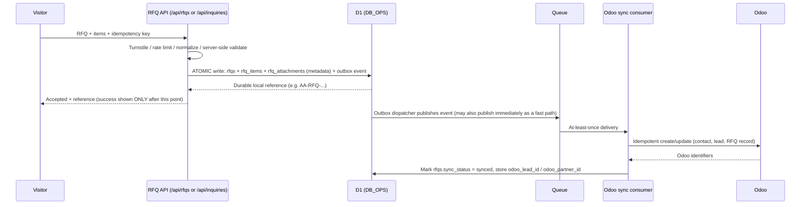

# 06 — Products, CMS, Odoo & RFQ Data Architecture

**Package:** Ahan Asa v0 Documentation Package
**Scope:** Backend/data architecture for the public catalog, pricing, CMS, RFQ durability, and Odoo integration.
**Companion files:** [`02_RFQ_CONVERSION_UX.md`](./02_RFQ_CONVERSION_UX.md) owns the user-facing RFQ flow (form steps, CTA copy, upload UI states, accessibility). [`03_CONTENT_ROUTES_LOCALIZATION.md`](./03_CONTENT_ROUTES_LOCALIZATION.md) owns route naming and locale architecture. [`05_TECH_DATA_CLOUDFLARE.md`](./05_TECH_DATA_CLOUDFLARE.md) owns the general Cloudflare Workers/vinext runtime, deployment, environment variables, and cross-cutting security. This file owns everything about *what commercial and RFQ data exists, who owns it, and how it moves.*

---

## 1. Governing principle

```text
Odoo owns commercial truth.
The website (Cloudflare D1) owns presentation, SEO, and RFQ intake.
Public rendering never synchronously depends on Odoo.
An accepted RFQ is durable in D1 before it ever reaches Odoo.
```

This is an owner-confirmed architecture, not a proposal. It supersedes every older document in the source corpus that assumed a static, database-free, ERP-free website (an old ADR against a public database; an old "CMS deferred" decision; an old prohibition on public price pages). Those statements are **SUPERSEDED** — do not reintroduce them, but you may cite them as historical context if a task touches a document that still contains them.

Two runtime rules hold everywhere in this file:

1. **No synchronous Odoo dependency on the request path.** A visitor request is served from Cloudflare (D1 read model + edge cache). Odoo is reached only by background sync workers and by the async RFQ delivery consumer — never by a route handler responding to a browser request.
2. **Durable-first RFQ capture.** An RFQ is durably persisted in D1 (with an outbox event, in the same transaction) *before* the website tells the visitor "received." Odoo sync happens afterward, asynchronously, and is retried until it succeeds. Odoo downtime must never lose a lead.

---

## 2. System-of-record ownership matrix

This is the single most load-bearing table in the package. Every data-modeling or integration decision must trace back to it.

| Data / operation | Authoritative owner | Website (D1) responsibility | Sync direction |
|---|---|---|---|
| Customers, companies, contacts | Odoo | Minimal provisional record until synced/retained | Website → Odoo |
| CRM leads / opportunities | Odoo | Status/reference only | Website → Odoo |
| Quotations, sale orders | Odoo | Reference/status only, never re-implemented | Odoo → Website (reference only) |
| Commercial product identity (`product.template`-equivalent) | Odoo | D1 read-model projection, keyed by stable external ID | Odoo → Website |
| Product variants, attributes, UOM | Odoo | D1 read-model projection for catalog display and RFQ item selection | Odoo → Website |
| Commercial / current price | Odoo | Validated public **snapshot** in D1, never edited locally | Odoo → Website |
| Public price history | Derived from approved Odoo sync | Append-only D1 table for charts, audit, freshness display | Odoo → Website |
| Inventory / stock, purchasing, supplier data, accounting | Odoo | Not duplicated on the website in any form | — |
| Articles, editorial content, publication workflow | Website CMS (D1) | Full authority | Website only |
| Product/category **SEO overlay** (slug, title, meta description, buying guide, FAQ, canonical, index policy) | Website CMS (D1) | Full authority; references the Odoo entity by stable ID, never edits commercial facts | Website only |
| Public media (images, downloadable docs) | R2 + D1 metadata | Full authority | Website only |
| RFQ intake (header + items + attachments metadata) | Website D1 (`DB_OPS`) at capture; Odoo owns the downstream commercial workflow after handoff | Durable receipt, sync state, audit | Website → Odoo |
| RFQ attachment bytes | Private R2 | D1 stores metadata only (never bytes); Odoo may receive an approved clean reference | Website → Odoo (reference) |
| Integration/sync status, audit logs | Website | Full authority, internal only | Website only |

Conflict rule: **Odoo wins for every commercial field. The website CMS wins for every SEO/editorial field.** A D1 RFQ receipt is never overwritten because an Odoo write failed. When ownership of a specific field is genuinely ambiguous, treat it as an unresolved data-modeling question and flag it rather than guessing — do not apply "last write wins" across the two systems.

---

## 3. D1 database split, R2 buckets, and Queues

### 3.1 Two D1 databases

Production uses **two separate D1 databases**, not one:

| Binding | Contains | Must never contain |
|---|---|---|
| `DB_PUBLIC` | Articles, catalog projection (categories/products/variants/units/attributes), product/category SEO overlays, public price snapshots + history, public media metadata | Visitor PII, RFQ content, private attachment data, secrets |
| `DB_OPS` | RFQs, RFQ contacts, RFQ items, RFQ attachment metadata, consent records, staff users/roles/permissions, integration outbox/attempts/mappings, audit logs | Public page bodies, file bytes |

Rationale: a bug in a public catalog query can never leak RFQ/PII data if that data lives in a different database with a different binding and different access policy; backup, retention, and incident response differ by data class; a public-data export can never accidentally include personal or commercially sensitive data. D1 does not support cross-database foreign keys — `DB_OPS.rfq_items` stores immutable **snapshots** of catalog labels (category/product/variant/unit display text) alongside an optional reference ID into `DB_PUBLIC`, rather than a real foreign key.

### 3.2 Two R2 buckets

| Bucket | Access | Contains |
|---|---|---|
| `MEDIA_PUBLIC` | Public / CDN-controlled | Approved article and catalog images, downloadable brochures |
| `RFQ_PRIVATE` | Private, never public | Customer invoices, spreadsheets, BOQs, purchase-list uploads |

File bytes and large blobs are never stored in D1 — only metadata (object key, checksum, MIME, size, status). Private object keys are random and non-semantic; the original filename is preserved only as confidential display metadata, never as the storage key.

### 3.3 Queues + DLQ

Cloudflare Queues (at-least-once delivery) carries three classes of async work:

1. **RFQ → Odoo delivery** — the transactional-outbox dispatch described in §5.
2. **Scheduled catalog/price pull** — Odoo → D1 sync for products, variants, units, and public prices.
3. **CMS publication side-effects** — cache tag invalidation and (where relevant) sitemap/feed updates after a content publish (owned in detail by the CMS section, §6).

Every consumer must be idempotent (see §5.4) because Queues guarantees *at-least-once*, not *exactly-once*, delivery. Exhausted retries move to a Dead Letter Queue; DLQ entries must have an active monitor/alert and a durable, searchable incident record in `DB_OPS` (a `dead_letter_records`-style table) — Queue retention itself is not a permanent incident archive.

---

## 4. Public catalog and pricing data flow

### 4.1 Two-layer product model

```text
Odoo commercial projection  (product identity, variant, attributes, UOM, approved public price)
        +
Website SEO/editorial overlay  (slug, title, meta description, buying guide, FAQ, canonical, index policy)
        =
Public product/category page
```

The Odoo-sourced half and the website-owned half are stored as separate D1 tables, joined by a stable Odoo/external identifier — never merged into one record that a website editor could accidentally overwrite with commercial data, or that an Odoo sync could accidentally overwrite with editorial copy.

### 4.2 Sync flow (never live on the request path)

```text
Odoo (public pricelist / product / variant / unit data)
    → Scheduled sync worker (pull, by write_date / high-water mark / stable external ID)
    → Validate + normalize
    → D1 snapshot (current) + D1 history (append-only)
    → Targeted cache-tag invalidation (affected product/category/price pages only — never a full-site purge for a routine update)
    → Cloudflare edge cache
    → Visitor
```

A public page is **always** rendered from the D1 projection plus edge cache. It never issues a live Odoo API call during a request. A periodic full reconciliation pass (in addition to incremental sync) must detect records that were missed, deleted, or unpublished upstream.

### 4.3 Price rules

- Commercial prices are edited only in Odoo — never independently in the website admin.
- The website admin may show sync health (last successful sync time, failure state) and a permission-gated manual resync trigger, but never a price-editing field.
- A failed sync must **never** replace a last-known-valid public price with zero, null, or partial data. Keep serving the last valid snapshot with its real `source_updated_at`/`last_synced_at` timestamp; never fabricate a newer timestamp.
- Every displayed price must show its unit, currency, and update time. Price existence must never imply inventory/stock availability.
- Customer-specific pricelists must never become public or enter a shared cache.
- Stale-price thresholds (when to label a price "stale" vs. hide it) are a configuration value, not something to invent in UI copy — see `OPEN DECISION` list, §8.

### 4.4 Catalog route naming — pointer, not a decision owned here

Two conflicting route patterns exist in the source corpus: `/steel-products/[category-slug]` and `/steel/{category}/{product}/{variant}`. **This is a genuine unresolved `OPEN DECISION — DO NOT INVENT`, and it is not owned by this file.** [`03_CONTENT_ROUTES_LOCALIZATION.md`](./03_CONTENT_ROUTES_LOCALIZATION.md) owns the final route pattern. This file only owns the data model behind whichever slug is chosen: every catalog entity (category, product, variant) has an independent `slug` field, separate from its Odoo integer ID — **Odoo IDs are never used as public URL identifiers.**

### 4.5 Thin-page prevention

A commercial product existing in Odoo does not automatically earn an indexable public page. Publication requires: the commercial record is public-eligible in Odoo *and* the website has a valid slug *and* approved SEO/editorial content exists *and* an explicit index policy is set. Do not auto-generate a page — let alone thousands of pages — merely because a Odoo variant record exists. This connects directly to the SEO indexability rules in [`04_SEO_PERFORMANCE_ANALYTICS.md`](./04_SEO_PERFORMANCE_ANALYTICS.md).

---

## 5. RFQ data architecture and durability

*(For the user-facing form steps, field labels, upload UI states, and CTA copy, see [`02_RFQ_CONVERSION_UX.md`](./02_RFQ_CONVERSION_UX.md). This section covers only what happens to the data once submitted.)*

### 5.1 Durable-first capture sequence



**The visitor is told "received" only after the RFQ, its items, and the outbox event are durably committed to `DB_OPS` in one transaction.** Everything after that point is asynchronous and retried on failure; none of it may block or delay the user-visible acknowledgment.

### 5.2 Core RFQ entities (`DB_OPS`)

- **`rfqs`** — header record: unique `reference_number` (customer-safe, e.g. `AA-RFQ-2026-000123` — never the internal database ID), hashed `idempotency_key`, `status` (business workflow: `received → viewed → in_progress → quoted → won/lost/cancelled/spam`), `sync_status` (technical: `pending → queued → syncing → synced`, with `retry`/`failed`/`manual_review` branches — **business status and sync status are separate concepts and must never be conflated**), `odoo_lead_id`/`odoo_partner_id` once synced, submission locale, source/attribution context.
- **`rfq_contacts`** — one-to-one contact snapshot: full name, phone (country code + national number + normalized E.164), optional email, optional company/project/city. This is the only table holding RFQ-related PII; it must never leak into logs, analytics, URLs, or cache keys.
- **`rfq_items`** — one-to-many, unlimited practical rows per RFQ. Each line supports **three sourcing modes**: (a) `selected` — references a published catalog category/product/variant/unit by ID, with an **immutable label snapshot** captured at submission time (so a later catalog rename doesn't rewrite history); (b) `freeform` — the exact product does not exist in the catalog, so `freeform_title`/`size_text` carry the customer's own description; (c) `document_review` — a line a staff operator extracted from an uploaded document after human review (never auto-inferred from OCR without review). The user-facing manual-entry path must support, as applicable, product/category, size / variant, grade / standard where relevant, unit, and quantity; grade/standard may be represented through selected variant attributes, catalog snapshots, or freeform text until exact schema and Odoo mapping are verified. Do not invent additional mandatory line fields. At least one of `variant_ref`, `product_ref`, or `freeform_title` must be present per row. Quantity is stored as an exact decimal representation (integer value + scale), never binary floating point, because request unit (e.g. "20 branches") and price unit (e.g. "price per kg") are independent concepts that must not be conflated.
- **`rfq_attachments`** — metadata only (object key, original filename as confidential metadata, declared/detected MIME, size, checksum, `upload_status`, `scan_status`). No permanent public URL is ever stored; authorized downloads use a short-lived signed URL or a server-mediated stream.
- **`rfq_status_history`** — append-only audit of every status transition (actor, reason, timestamp, correlation ID).
- **`consent_records`** — append-only, versioned privacy-acknowledgement evidence per RFQ (policy version, granted flag, form version, timestamp). Revocation adds a new event; history is never rewritten.

### 5.3 Attachment security and the scanning gate

`OPEN DECISION — DO NOT INVENT`: **the attachment-scanning provider is unselected.** Per the owner sign-off, this does not block foundation work (schema, private R2 bucket, upload-authorization plumbing can all be built), but it does gate production use: **if the malware/content-scanning pipeline is not implemented and approved when file upload is reached, the upload UI must remain disabled** and the RFQ flow must fall back to the written-description path (owned by 02) rather than shipping an insecure upload path. The required pipeline shape, once a provider is selected:

```text
1. Client requests short-lived upload authorization from the server.
2. Server validates RFQ context, declared type/size/count, and abuse signals.
3. Client uploads to a private R2 quarantine key (never a public bucket).
4. Server/storage verifies actual file signature and size (never trust extension or declared MIME alone).
5. Approved malware scanner processes the object.
6. Clean object is promoted to usable state; rejected/infected objects are quarantined/deleted per retention policy.
7. D1 metadata is linked to the RFQ transactionally.
8. Odoo receives an approved clean reference or copy — never raw unscanned bytes.
9. Any authorized download uses short-lived, audited, signed access — never a public URL.
```

No file bytes, filenames, or signed URLs may ever appear in logs, analytics, notifications, or Queue message payloads.

### 5.4 Idempotency, retry, and reconciliation

Queues delivers at-least-once — duplicate delivery is expected, not exceptional. Every retryable write to Odoo must be idempotent:

- Each outbox event carries a stable `event_id`; the Odoo sync consumer records processed event IDs and treats a replay as "update/return the existing record," never "create a new lead."
- The client-generated `idempotency_key` on the original RFQ submission prevents double-lead creation from a double-click, refresh, or client-side retry after a network timeout — the API returns the original safe result for an identical replay and rejects a conflicting payload that reuses the same key.
- Failure handling: bounded exponential backoff for transient errors → DLQ after exhausted retries → operator alert → the RFQ itself remains safely stored in `DB_OPS` regardless of Odoo's state. A stuck `queued`/`syncing`/`retry_pending` record must be reconcilable by an operator without creating a duplicate.
- Possible **business** duplicates (e.g., the same phone number submitting a materially different request) are never auto-merged or auto-deleted — they are flagged for human review using conservative signals (normalized phone, optional email, document checksum similarity, short submission interval), never on a weak fuzzy name match alone.

---

## 6. CMS architecture

The website ships with an **internal, headless CMS built into D1** (Next.js/vinext admin routes + D1 storage + R2 media), not an external SaaS CMS (no WordPress/Sanity/Odoo-Website by default). This supersedes any older "CMS deferred" decision found in the source corpus.

### 6.1 What the CMS owns vs. what it must never touch

The CMS is authoritative for: articles and article categories, static/landing pages, FAQ content, navigation and footer content (with approval), product/category **SEO overlays** (slug, title, meta description, intro/buying-guide copy, FAQ, canonical, index policy — linked to an Odoo entity by stable ID, never editing the entity itself), and public media metadata.

The CMS explicitly does **not** create or edit: customers/contacts, CRM leads/opportunities, RFQs or RFQ items, quotations/sale orders/invoices, product templates or variants, UOM, pricelists, inventory, purchasing, supplier data, or accounting records. If an admin screen shows anything price-related, it is read-only sync status plus a permission-gated resync trigger — never a price input field.

### 6.2 Publication workflow and locale states

Content lifecycle: `Draft → In Review → Approved → (Scheduled →) Published → Archived`. Publishing is transactional: validate → record an immutable revision → flip the published pointer → register a redirect if the slug changed → write an audit-log entry → dispatch a targeted cache-tag invalidation (never a full-site purge for routine content changes) → update sitemap/feeds only for genuinely visible changes.

Per the owner-confirmed multilingual requirement, **every CMS-owned content entity must support a per-locale publication state for `fa`, `en`, and `ar`** — not `fa` alone. The state machine per locale is conceptually:

```text
missing → draft → in_review → approved → published → stale
```

A missing translation must never silently fall back to showing Persian content under an `/en/` or `/ar/` URL, and a machine-translated draft must never be published without human review — both rules trace back to the multilingual requirements owned in full by [`03_CONTENT_ROUTES_LOCALIZATION.md`](./03_CONTENT_ROUTES_LOCALIZATION.md). Editing a source-locale record may mark dependent translations `stale`, but does not auto-unpublish them.

### 6.3 Content model shape (conceptual)

Editorial content uses a small allowlisted set of structured content blocks (hero, rich text, image+text, category grid, product table, price snapshot, technical specs, buying guide, process steps, FAQ group, related content, CTA band) — never raw HTML/script/iframe injection from an editor. Every entity carries a `version` field for optimistic-concurrency conflict detection, and every mutation is audit-logged.

---

## 7. Odoo integration boundary

### 7.1 Server-only adapter pattern

`odoo.ahanassa.com` is a downstream business system, reached only through a server-only adapter — never called directly from a route handler, a domain module, or (obviously) the browser:

```ts
interface OdooGateway {
  upsertContact(input: OdooContactInput): Promise<OdooRef>;
  upsertRfq(input: OdooRfqInput): Promise<OdooRfqResult>;
  pullCatalog(cursor?: SyncCursor): Promise<CatalogSyncPage>;
  pullPublicPrices(cursor?: SyncCursor): Promise<PriceSyncPage>;
  getHealth(): Promise<IntegrationHealth>;
}
```

UI code, routes, and domain rules must never know or care whether the adapter underneath speaks Odoo's JSON-2 API, an older supported protocol, or an approved custom controller. This isolation is what lets an Odoo version upgrade happen without rewriting business logic — and it's why public rendering can never depend on Odoo being reachable: the *only* caller of this interface is a background sync worker or the async RFQ delivery consumer, never a request handler.

### 7.2 Confirmed vs. unconfirmed Odoo facts

**Confirmed (owner sign-off):** Odoo's role as the intended commercial system of truth for customers/CRM/quotations/sales/commercial product-price data "where appropriate"; the non-synchronous rendering boundary; the durable-first RFQ contract.

Do not treat CRM provider selection or inquiry destination selection as open: Odoo is already the intended downstream business system where appropriate. Only the integration implementation details below remain open.

**`OPEN DECISION — DO NOT INVENT` (genuine integration-phase discovery gate, not a foundation blocker):**
- Exact deployed Odoo version, edition, and installed modules.
- Exact API/integration protocol. One source document expresses a *preference* for Odoo 19's External JSON-2 API with a Bearer API key — **this is an unverified preference pending live-instance verification, not a confirmed fact.** Do not implement or document as if the server is confirmed to be Odoo 19.
- Exact Odoo model/field mapping. A provisional/illustrative mapping exists in the source docs (e.g. person/company → `res.partner`, opportunity → `crm.lead`, product → `product.template`, variant → `product.product`, unit → `uom.uom`) but is explicitly gated on module/field inspection against the live instance — treat these as candidates to verify, never as implemented fact, and never hardcode them scattered across application code. All mapping lives centralized in the adapter layer.
- Whether RFQ line items can be preserved as real structured Odoo records (a custom RFQ model linked to `crm.lead`) versus a temporary free-text-note fallback. Free-text CRM notes are explicitly **not** an acceptable final store for RFQ line items — any approved temporary fallback must still keep the structured data in D1 with a migration path to a real Odoo model once confirmed.

Do not select, hardcode, or silently assume any of the above. When integration work reaches this gate, verify against the live `odoo.ahanassa.com` instance first.

### 7.3 Integration user and credentials

A dedicated, least-privilege integration identity (not a shared admin login) is required, scoped to only the models/fields/companies it needs. Credentials live only in Cloudflare Secrets — never in D1 tables, application code, or the browser bundle. Environments (dev/staging/production) use separate credentials and, where the target supports it, separate/safe databases.

---

## 8. Failure recovery and sync reliability

The source documents describe the *shape* of failure handling clearly but leave several operational numbers unspecified.

- **Odoo unavailable:** RFQ capture is unaffected — the durable D1 write in §5.1 does not depend on Odoo. Scheduled catalog/price sync simply produces no new snapshot for that cycle; the public site keeps serving the last valid D1 snapshot with its true `source_updated_at`/`last_synced_at` timestamp. The CMS and admin panel remain usable because they read/write the D1 read model, not Odoo directly.
- **Retry exhaustion:** transient failures get bounded retries with backoff before moving to the Dead Letter Queue. A DLQ entry must produce a durable, searchable incident row in `DB_OPS` (a `dead_letter_records`-style table) plus an operator alert — Queue retention alone is not a permanent incident archive. Manual reconciliation must remain duplicate-safe: never blindly replay a stuck event without checking `integration_mappings`/existing Odoo IDs first.
- **Cache invalidation failure:** the previously cached response keeps serving; the invalidation job retries rather than leaving content stale indefinitely or forcing a full-site purge.
- **Optimistic-concurrency conflicts:** editorial and price records carry a version/revision field; a stale write returns a conflict rather than silently overwriting a newer edit.
- **Price sync failure specifically:** never replace a last-known-valid price with zero, null, or a fabricated newer timestamp — repeated across every source document that touches pricing as non-negotiable.
- **Recovery after a D1 restore:** restoring `DB_PUBLIC` requires a full Odoo reconciliation pass before price publishing reopens; restoring `DB_OPS` requires comparing RFQ event IDs and Odoo mappings before any outbox replay. A D1 restore does not automatically restore R2 objects, Queue state, or Odoo data — recovery across systems requires manual reconciliation.
- **Required observability signals** (named without target thresholds): RFQ submission success rate, outbox/queue pending age, DLQ record count, Odoo sync lag/error rate, catalog/price sync freshness, D1 query errors/latency, cache hit ratio and purge-failure rate, attachment scan backlog.

**Honest gap — do not invent:** exact retry counts, backoff multipliers/jitter, per-failure-category alert SLAs, and a dedicated incident runbook are not specified anywhere in the current source corpus (`DOCS_INDEX.md` itself notes `SYNC_STRATEGY.md`/`FAILURE_RECOVERY.md` don't exist and that "retry cadence/backoff specifics [are] not fully specified anywhere"). Treat "bounded exponential backoff → DLQ → operator alert" as the only confirmed shape.

---

## 9. Authorization and admin model — sketch, source material is genuinely thin

- **Three overlapping illustrative role lists exist, reconciled nowhere:** `PROJECT_BRIEF.md` §15.3 names Administrator, Content Editor, SEO Editor, Catalog/Price Publisher, RFQ Viewer/Sales Operator, Integration Operator, Read-only Auditor. `DATABASE_SCHEMA.md`'s RBAC examples use `super_admin`, `content_editor`, `price_operator`, `rfq_operator`, `auditor`. `CMS_ARCHITECTURE.md` lists Admin, Developer, Managing Editor, Editor, SEO Manager, Translator, Reviewer, Viewer/Auditor. Directionally consistent, differently named — reconciling them is unresolved and should not be guessed.
- **Structurally solid regardless of exact role names:** authorization is **action-based** (permission keys like `articles.publish`, `prices.sync`, `rfqs.read`, `rfqs.export`) granted to roles, granted to staff users (`staff_users` / `roles` / `permissions` / `staff_user_roles` / `role_permissions`). **Default-deny, enforced server-side on every mutation** — hiding a UI button is explicitly not a security boundary. Suspending a staff account must immediately invalidate active sessions. Every privileged mutation must produce an audit-log entry.
- Only staff/admin accounts exist in this phase — no customer accounts or logins. A future customer self-service portal (RFQ status, quotation references) is anticipated in the data model but explicitly out of scope unless separately approved.
- **Authentication:** delegated to an approved identity provider or Cloudflare Access where practical; D1 stores authorization profile/status, not a reusable plaintext credential. Password-based auth, if ever approved as fallback, requires a dedicated security review first.
- **Honest gap — do not invent:** a full role-to-permission matrix exists nowhere. `DOCS_INDEX.md` lists `AUTHORIZATION_ROLES.md`/`ADMIN_PANEL_SPEC.md` as referenced-but-absent, with only a role list and a scope outline actually present. Treat which role may perform which action as an implementation-time decision against these illustrative lists, not a finished matrix to fabricate.

---

## 10. Missing referenced documents — consolidation notice

The source corpus repeatedly references several specialist documents by name that **do not exist as standalone files**: `ODOO_INTEGRATION.md`, `SYSTEM_OF_RECORD.md`, `SYNC_STRATEGY.md`, `ERP_DATA_MAPPING.md`, `FAILURE_RECOVERY.md`, `RFQ_SYSTEM.md`, `PRODUCT_CATALOG_SPEC.md`, `PRICING_SYSTEM.md`, `ADMIN_PANEL_SPEC.md`, and `AUTHORIZATION_ROLES.md`. Their substance is what this file consolidates from `01-sources/TECHNICAL_ARCHITECTURE.md` (§5, §11–§15) and `01-sources/DATA_ARCHITECTURE(1).md` (the file is physically misnamed with a `(1)` suffix but its own content declares itself the canonical `DATA_ARCHITECTURE.md` — the un-suffixed file describing "no database" is the superseded static-site version and must not be used), plus `01-sources/DATABASE_SCHEMA.md` and `01-sources/CMS_ARCHITECTURE.md`. Authoring the missing documents as real standalone specifications — with full retry/backoff cadence detail, a verified (not provisional) Odoo field-mapping table, a formal RFQ state-machine spec, and a reconciled role/permission matrix — remains a **future documentation gap**, not something this v0 package resolves. Full protocol/mapping authoring is explicitly deferred until Odoo integration work begins and the live instance can be inspected.

---

## 11. Open decisions summary

- `OPEN DECISION — DO NOT INVENT`: Odoo deployed version, installed modules, exact API protocol, exact model/field mapping. A source document's *preference* for Odoo 19's External JSON-2 API is not confirmation the live instance runs Odoo 19.
- `OPEN DECISION — DO NOT INVENT`: attachment-scanning provider and pipeline — production upload stays disabled until this is selected and implemented.
- `OPEN DECISION — DO NOT INVENT`: `/steel-products` vs. `/steel/{category}/{product}/{variant}` catalog route pattern (owned by `03_CONTENT_ROUTES_LOCALIZATION.md`; this file only owns the data model behind whichever slug is chosen).
- `OPEN DECISION — DO NOT INVENT`: stale-price display threshold (hide vs. label as stale) — a configuration value pending an operational decision, not a UI-invented number.
- `OPEN DECISION — DO NOT INVENT`: whether RFQ line items land in a real custom Odoo model or a temporary structured-fallback path once Odoo modules are inspected.
- `OPEN DECISION — DO NOT INVENT`: exact retry counts, backoff cadence, and per-failure alert SLAs for sync/queue failure handling (§8) — only "bounded exponential backoff → DLQ → alert" is confirmed.
- `OPEN DECISION — DO NOT INVENT`: a reconciled, single role-to-permission matrix (§9) — only three overlapping illustrative role lists exist, not a finished authorization model.
